## 金工研究/深度研究

2019年01月04日

林晓明 执业证书编号：S0570516010001

研究员 0755-82080134

陈烨 执业证书编号：S0570518080004

研究员 010-56793942

chenye@htsc.com

联系人 hekang@htsc.com

# 因子合成方法实证分析

## 华泰多因子系列之十

本文测试 6种因子合成方法，发现最大化 IC_IR 及最大化 IC法效果较好因子合成是构建多因子选股模型的重要环节，可以提取出一组因子内的重要信息。本文对 6 种因子合成方法进行测试，从单因子测试结果看，最大化IC_IR及最大化IC法合成的因子效果较好，能大概率战胜等权复合因子。从复合因子稳定性看，除等权法外，主成分分析法得到的第一主成分复合因子最稳定。

## 因子合成的应用场景主要为降低因子共线性以及生成大类风格因子

因子合成的应用场景主要有两方面：1.将共线性比较严重的因子先进行合成，再进行多元回归，可提升回归问题的准确性；2.将同一风格大类下的几个细分因子进行合成，可生成用于刻画市场风格状态变化的大类因子（比如用近1个月、3个月、6个月日均换手率因子合成一个换手率大类风格因子）。

因子合成常用方法：等权法、历史收益率加权法、最大化 IC_IR加权法等本文介绍了常用的 6 种因子合成方式：等权法、历史收益率（半衰）加权法、历史 IC（半衰）加权法、最大化 IC_IR 加权法、最大化 IC 加权法、主成分分析法。我们按照因子的 6 个类别（估值、成长、动量反转、换手率、波动率、财务质量因子）分别进行合成测试，所有因子采用统一的行业中性、市值中性的测试框架。首先采用回归法计算因子收益率序列和对应的 t 值序列，然后计算因子 Rank IC 值与 IC_IR，再结合分层测试法中的多空组合净值变化趋势，综合判别复合因子的有效性与稳健性。

因子合成测试结果：最大化 IC_IR及最大化 IC法优于其它因子合成方法对不同类别的因子组合进行单因子测试，结果显示大部分情况下最大化IC_IR 及最大化 IC 复合因子能显著提高复合因子的因子收益率、因子IC_IR、多空组合夏普比率等，并降低最大回撤，战胜等权复合因子及其它因子，且大幅优于原始因子。历史收益率（半衰）加权法有时也能得到很好的合成效果。

## 复合因子的稳定性：除等权法外，第一主成分复合因子最稳定

本文采用复合因子前后两期权重的误差及复合因子前后两期的相关系数来衡量不同因子合成方法得到的复合因子稳定性。等权法是所有因子合成方法里最稳定的方法，因为每期的权重都相同。除等权法外，主成分分析的稳定性次之，但每期权重系数的差异也很小。最大化 IC 法，历史 IC（半衰）加权法的稳定性较差，权重及复合因子的波动较大。

## 最大化 IC_IR 法参数敏感性分析：时间窗口 T=12效果较好

时间窗口 T 是最大化 IC_IR 法的重要参数，对下一期因子 IC 值的预测采用了历史 T 期（单位：月）的均值，对 IC 协方差矩阵的预测也采用了历史 T期的 IC值。本文测试了 T=3、6、9、12、24、36 时不同类别因子的合成效果。测试结果表明，对大部分因子组合 T=12 就可以达到很好的效果，对有些因子组合也可以采用 T=9、24、36。

风险提示：因子合成方法的回测结果是历史经验的总结，如果市场环境改变，各方法的对比效果可能发生变化。本文所列的因子合成方法只是比较常见的几个，没有囊括全部合成方法，可能存在回测效果更好的方法。因子合成在多因子选股模型构建过程中不是必备的步骤，读者可以自行斟酌，构建适合自己的多因子选股模型。

## 因子合成方法简介

因子合成是构建多因子选股模型的重要环节。因子合成的应用场景主要有两方面：首先，因子库内一些因子间可能存在多重共线性，若直接进行多元线性回归则会导致结果不准确，在更严重的情况下可能导致回归问题难以求解，若能在回归之前将共线性比较严重的因子进行合成，则可提升多元线性回归的准确性；其次，在观察市场近期因子表现时，经常需要对比估值、成长、波动率等大类风格因子的强弱，以波动率风格因子为例，近 1 个月、3 个月、6 个月波动率因子均属波动率风格大类下面的细分因子，难以用某个单因子刻画整个风格大类的表现，这时就需要对若干个有代表性的波动率细分因子进行合成，产生一个合理的有代表意义的波动率风格因子。

本文是华泰多因子系列研究第十篇，在多因子系列首篇报告中，我们系统地阐述了多因子模型的基本理论，详细描述了多因子模型构建的流程，第二篇到第九篇报告则主要聚焦单因子测试分析，依次对估值、成长、动量反转、换手率、波动率、资金流向、财务质量、一致预期因子进行了详细的研究和检验，通过综合对比评价，筛选出能持续获得稳健收益的优质因子。本文的关注点则与前九篇具有一些差别，主要着眼于多因子模型在单因子测试之后的一个比较细致的环节——因子合成，通过详细对比几种合成方法的理论基础和实证效果，并对合成过程中涉及的参数进行敏感性分析，得出各方法的应用特点和适用场景。

接下来，我们将开始介绍因子合成方法的理论基础。常见的方法有等权法、历史 IC（半衰）加权法、历史收益率（半衰）加权法、最大化 IC 加权法、最大化 IC_IR 加权法、主成分分析（PCA）法。对于不同相关性及不同类别的因子，可考虑选用不同加权方式进行合成。在合成过程中，选用不同历史窗口期及不同因子合成数目，对合成效果都有影响。

## 等权法

所有待合成因子等权重相加，得到新的合成后因子。比如换手率风格因子，将近 1 个月、3 个月、6 个月日均换手率因子及近 1 个月、3 个月、6 个月日均换手率除以近 2 年日均换手率因子等权重相加（每个因子权重为 1/6），合成新的换手率风格因子，然后再重新进行标准化等处理。

## 历史因子收益率（半衰）加权法

所有待合成因子，按照最近一段时期内历史因子收益率的算术平均值（或半衰权重下的加权平均值）作为权重进行相加，得到新的合成后因子。此处的因子收益率是指单因子测试之回归法中的因子回归系数（详见第二章第一节）。还是以上一小节的换手率风格因子为例，如果这六个因子的历史因子收益率均值分别是 1、2、3、4、5、6，则每个因子的权重分别为：1/（1+2+3+4+5+6）= 1/21、2/（1+2+3+4+5+6）= 2/21、3/21、4/21、5/21、6/21，即为 4.76%、9.52%、14.29%、19.05%、23.81%、28.57%。此种方式合成的因子具有比较大的历史因子收益率（数学证明比较简单就不展开叙述了），但是由于待合成因子往往具有多重共线性，回归稳定的数值解不稳定，即历史因子收益率可能不稳定，影响合成权重的计算。因子收益率序列在半衰权重下的加权平均值计算过程可以参考下一小节的详细描述。

## 历史因子IC（半衰）加权法

所有待合成因子，按照最近一段时期内历史 RankIC的算术平均值（或半衰权重下的加权平均值）作为权重进行相加，得到新的合成后因子。RankIC 的计算方法详见第二章第二节。该方法与上一小节提出的方法基本思想相同，只是核心关注指标有所区别。

我们在此处统一介绍半衰加权法的详细计算方式。若要计算最近一段时期内历史 RankIC的算术平均值，我们只需要将每一期的 RankIC 等权相加，再除以期数即可，而半衰加权每一期 RankIC 的权重不同，将按照指数半衰权重进行加权。半衰加权的基本原则是距离现在越近的截面期权重越大、越远权重越小。这里存在一个参数——半衰期 H，其意义为每经过 H期（向过去前推 H 期），权重变为原来的一半，半衰期参数可取 1，2，4 等。具体来讲，假设对某个因子来说，其过去 T 期的 RankIC 序列为 $ic=(ic_{1},ic_{2},\dots,ic_{T}),\quad ic_{1}$ 是距离现在最远一期的 RankIC 值， $ic_{T}$ 是距离现在最近一期的 RankIC 值，半衰权重 $\scriptstyle{w=}$ $(w_{1},w_{2},\ldots,w_{T})$ )， $w_{1}$ 是距离现在最远一期的权重，则w的计算公式为：

$$
w_{t}=\;2^{\frac{t-T-1}{H}}(t=1{,}2,\ldots,T)
$$

在实际计算中，上述权重需要归一化，即 $\textstyle w_{t}^{^{\prime}}=w_{t}/\sum w_{t}$ 。从上式中 $\overline{可}$ 以验证，设现在是t期，权重为 $w_{t}=\;2^{\frac{t-T-1}{H}}$ ，经过 H期， $w_{t-H}=2^{\frac{t-H-T-1}{H}}=2^{\frac{t-T-1}{H}}*2^{-1}$ ，即为 $w_{t}$ 的一半。

## 最大化 IC_IR 加权法

Qian 在《Quantitative Equity Portfolio Management》一书中提出最大化复合因子 IC_IR的方法。其基本思想是，以历史一段时间的复合因子平均 IC 值作为对复合因子下一期 IC值的估计，以历史 IC 值的协方差矩阵作为对复合因子下一期波动率的估计，根据 IC_IR等于 IC 的期望值除以 IC的标准差，可以得到最大化复合因子 IC_IR 的最优权重解。以w⃑ =$(w_{1},w_{2},\ldots,w_{N})^{T}$ 表示因子合成时所使用的权重， $\overrightarrow{IC}=(\overrightarrow{\iota c_{1}},\overrightarrow{\iota c_{2}},\dots,\overrightarrow{\iota c_{N}})^{T}$ 表示因子 IC 均值向量，其中 $\overline{{\iota c_{k}}}(k=1{,}2,\ldots,N)$ 表示第 k个因子在历史一段时间内的 IC 均值， $\sum$ 为因子 IC 的协方差矩阵。则最优化复合因子 IC_IR 的问题 $\overline{可}$ 以表示为：

$$
\operatorname*{max}\:IC\_IR=\frac{\overrightarrow{w}^{T}*\overrightarrow{IC}}{\sqrt{\overrightarrow{w}^{T}{\textstyle\sum}\overrightarrow{w}}}
$$

上述优化问题具有显式解 $\begin{array}{r}{\overrightarrow{w}=\sum^{-1}*\overrightarrow{IC}}\end{array}$ ，对计算出的w⃑ 需进行归一化。实际上，我们仍然使用因子的 RankIC 而非简单 IC（Pearson IC）参与上述计算，后文中若未明确指出，则所有的 IC 均指代 RankIC。

该方法在运用中值得注意的有两点。首先，对协方差矩阵的估计常常有偏差。统计学中以样本协方差矩阵代替总体协方差矩阵，但在样本量不足时，样本协方差矩阵与总体协方差矩阵差异过大，另外估计出的协方差矩阵可能是病态的，造成上述优化问题难以求解。因此，在求解权重的过程中，协方差矩阵的估计也是一个重要的问题。

其次，因协方差矩阵估计不准确或存在其它干扰因素，由显式解解出的权重常常出现负数，这与因子本身的逻辑相反，违反了因子的实际意义。我们推荐直接求解上述优化问题，并加上权重为正的约束条件，即求解以下优化问题：

$$
\operatorname*{max}\;IC\_IR=\;{\frac{{\overrightarrow{w}}^{T}*{\overrightarrow{IC}}}{\sqrt{{\overrightarrow{w}}^{T}{\sum}{\overrightarrow{w}}}}}
$$

$$
s.t.\qquad\overrightarrow{w}\geq0
$$

经实际检验，含约束条件的优化问题求解出的权重更为合理，用于合成因子的效果也更好。本报告后面展示的结果亦是通过求解含约束优化问题得到因子权重来进行因子合成。（限于篇幅，通过求解不含约束优化问题进行因子合成的结果就没有详细展示了。）

本报告中采用两种协方差矩阵估计方法，并将结果进行对比。一种是采用样本协方差矩阵代替总体协方差矩阵（即直接用历史 IC 协方差阵进行简单估计），另一种是采用 Ledoit &Wolf（2004）提出的压缩估计方法，目标矩阵采用单位矩阵，即将样本协方差矩阵向单位矩阵压缩。压缩的具体方法如下。

设矩阵∑是真实的协方差矩阵， $\Sigma^{*}$ 是有限样本下对∑的渐进一致估计，I是单位矩阵（即目标矩阵），S 是样本协方差矩阵。我们要寻找这样一组参数 $[\rho_{1},\rho_{2}$ ，使得均方误差E[‖∑∗ − ∑‖2]最小，这里‖·‖是矩阵的 Frobenius 范数，可以用于衡量两个矩阵的差异大小，Frobenius范数越大，两个矩阵差异越大，其定义为：‖A $\|=\sqrt{tr(AA^{T})/N}$ ，N是 A的行数。使得均方误差最小的∑∗有如下估计式：

$$
\Sigma^{*}=\rho_{1}I+\rho_{2}S
$$

设 S是 X（N行 T列矩阵，对应 N个因子在 T个截面期的因子 IC）的样本协方差矩阵，X的第 t列为 $x_{t}。\rho_{1},\rho_{2}$ 的具体表达式如下：

$$
\rho_{1}=\frac{b^{2}}{d^{2}}m,\rho_{2}=\frac{a^{2}}{d^{2}}
$$

$$
其中$m=\|S-I\|^{2},d^{2}=\|S-mI\|^{2},\bar{b}^{2}=\frac{1}{T^{2}}{\displaystyle\sum_{t=1}^{T}}\|x_{t}\cdot{x_{t}}^{T}-S\|^{2}$
$$

$$
b^{2}=\operatorname*{min}\bigl(\bar{b}^{2},d^{2}\bigr),a^{2}=d^{2}-b^{2}
$$

由以上公式可以计算得出 $\rho_{1},\rho_{2}$ ，进而得到经压缩估计的协方差矩阵 $\Sigma^{*}$ 。

## 最大化 IC加权法

最大化 IC 加权法同样也是源于 Qian《Quantitative Equity Portfolio Management》一书，与上一小节中提及的最大化 IC_IR 加权法非常类似。对应的最优化问题为：

$$
\mathrm{max}IC=\frac{\overrightarrow{w}^{T}*\overrightarrow{IC}}{\sqrt{\overrightarrow{w}^{T}V\overrightarrow{w}}}
$$

其中w⃑ 和 $t\overrightarrow{IC}$ 的含义同上一小节，V是当前截面期因子值的相关系数矩阵（由于因子均进行过标准化，自身方差为 1，因此相关系数矩阵亦是协方差阵）。上述优化问题具有显式解w⃑ =$V^{-1}*{\overrightarrow{IC}}$ ，对计算出的w⃑ 需进行归一化。这样求解出的w⃑ 可以使得复合因子单期 IC 最大，如果因子值相关系数矩阵V在不同截面期近似不变，则w⃑ 也是使得复合因子在历史一段时间的平均 IC 最大的解（证明详见《Quantitative Equity Portfolio Management》）。

与上一小节相同，我们求解上述优化问题并加约束条件 $\vec{w}\geq0$ 。对于协方差阵V的估计，我们统一采用压缩协方差矩阵估计方式。

## 主成分分析（PCA）法

PCA 是数据降维的常用方法，由 Pearson 在 1901 年提出。PCA 将一组相关性较高的 N维数据投影到新的 k维坐标上 $(k<N)$ ），这 k维特征称为主成分，这些主成分之间是不相关的，以达到数据降维的目的。设有 N个因子 $(x_{1},x_{2},\ldots,x_{N})_{T*N}$ ，每个 $x_{i}.$ 是一个 T维列向量。主成分分析的具体步骤如下：

## 1． 对每个因子进行标准化处理；

2． 求 N个因子的协方差矩阵 $\Sigma_{N*N}$ 及其特征值和特征向量；

3． 按照特征值由大到小的顺序，依次得到对应的特征向量 $(u_{1},u_{2},\ldots,u_{N})_{N\ast N}$ (每个 $\cdot u_{i}是一$ 个 N维列向量)，如果我们要得到 k个主成分 $(k<N)$ ），则取特征值较大的前 k个特征值对应的特征向量 $(u_{1},u_{2},\ldots,u_{k})_{N*k}$ ；

4． 转换后的因子 $({x_{1}}^{\prime},{x_{2}}^{\prime},\ldots,{x_{k}}^{\prime})_{T*k}=(x_{1},x_{2},\ldots,x_{N})_{T*N}*(u_{1},u_{2},\ldots,u_{k})_{N*k}$ ，N 个因子经主成分分析转化为 k个主成分 $({x_{1}}^{\prime},{x_{2}}^{\prime},\ldots,{x_{k}}^{\prime})_{T*k}$ ，第 i列是第 i个主成分 $(i\leq k)$

由于待合成因子数量不会很多，一般第一主成分即有较高的解释度，本报告只取第一主成分作为合成后因子。并且由以上推导过程可以看出，每个主成分都是原始因子的线性组合，因此 PCA 法合成因子的过程也会对应于一组因子权重w⃑ 。PCA 在一般的编程软件上都有内置函数可以直接完成计算，无需自己编写代码，上述过程仅作参考。

PCA 法与前面所有方法的不同点在于，PCA只关注因子值矩阵 $(x_{1},x_{2},\ldots,x_{N})_{T*N}$ 本身的性质，与因子收益、因子 IC 等无关。从理论上来讲，它的优势在于，如果因子值矩阵的性质在不同截面期比较稳定，则 PCA 法求解出的因子权重w⃑ 也会比较稳定，意味着合成后因子稳定性比较好；它的劣势在于，由于合成过程不涉及因子收益等信息，合成后因子不具备明显的经济学含义，其在未来表现也不一定会优于待合成的几个单因子。

## 单因子测试方法简介

因子合成的过程中涉及单因子测试之回归法、IC 值分析等较多理论基础内容，此处我们仿照本系列前九篇研究报告，对单因子测试方法重新进行回顾。

## 回归法

回归法是一种最常用的测试因子有效性的方法，具体做法是将第 T 期的因子暴露度向量与T+1 期的股票收益向量进行线性回归，所得到的回归系数即为因子在 T 期的因子收益率，同时还能得到该因子收益率在本期回归中的显著度水平——t 值。在某截面期上的个股的因子暴露度（Factor Exposure）即指当前时刻个股在该因子上的因子值。第 T 期的回归模型具体表达式如下。

$$
r^{T+1}=X^{T}a^{T}+\sum_{j}Indus_{j}^{T}b_{j}^{T}+ln\_mkt^{\mathrm{T}}b^{T}+\varepsilon^{T}
$$

$$
$r^{T+1}\colon$所有个股在第$\mathrm{T}+1$期的收益率向量
$$

## $X^{T};$ 所有个股第T期在被测单因子上的暴露度向量

IndusjT:所有个股第 T 期在第 j 个行业因子上的暴露度向量（0/1 哑变量）

$$
ln\_mkt^{T};所有个股第T期在对数市值因子上的暴露度向量
$$

$a^{T},b^{T},b_{j}^{T}$ :对应因子收益率，待拟合常数，通常比较关注 $a^{T}$

$\varepsilon^{T};$ :残差向量

在所有截面期上，我们对因子 X进行回归测试，能够得到该因子的因子收益率序列（即所有截面期回归系数 $|a^{T}|$ 构成的序列）和对应的 t 值序列。t 值指的是对单个回归系数 $a^{T}$ 的 t检验统计量，描述的是单个变量显著性，t 值的绝对值大于临界值说明该变量是显著的，即该解释变量（T 期个股在因子 X 的暴露度）是真正影响因变量（T+1 期个股收益率）的一个因素。也就是说，在每个截面期上，对于每个因子的回归方程，我们设

$$
\begin{aligned}&假设检验\;H_0:a^T=0,\\&备择假设\;H_1:a^T\neq0\end{aligned}
$$

该假设检验对应的 t统计量为：

$$
\mathbf{t}={\frac{a^{T}}{SE(a^{T})}}
$$

其中 $SE(a^{T})$ 代表回归系数 $a^{T}$ 的标准差的无偏估计量。一般 t值绝对值大于 2 我们就认为本期回归系数 $a^{T}$ 是显著异于零的（也就是说，本期因子 X对下期收益率具有显著的解释作用）。注意，我们在回归模型中加入了市值、行业因子，能在一定程度上规避市值、行业因素对财务质量因子的影响。

回归模型构建方法如下：

1． 股票池：全 A股，剔除 ST、PT 股票，剔除每个截面期下一交易日停牌的股票。

2． 回溯区间：2007-04-30 至 2018-11-30。

3． 截面期：每个月月末，用当前截面期因子值与当前截面期至下个截面期内的个股收益进行回归。

4． 数据处理方法：

a) 因子列表与计算方法详见下面一章各小节；

b) 中位数去极值：设第 T 期某因子在所有个股上的暴露度向量为 $D_{i},~D_{M}$ 为该向量中位数， $D_{M1}$ 为向量 $|D_{i}-D_{M}$ |的中位数，则将向量 $D_{i}$ 中所有大于 $D_{M}+5D_{M1}$ 的数重设为 $D_{M}+5D_{M1}$ ，将向量 $D_{i}$ 中所有小于 $D_{M}-5D_{M1}$ 的数重设为 $D_{M}-5D_{M1}$ ；

c) 标准化：将去极值处理后的因子暴露度序列减去其现在的均值、除以其标准差，得到一个新的近似服从N(0,1)分布的序列，这样做可以让不同因子的暴露度之间具有可比性。对因子标准化后再用于因子合成。

d) 缺失值处理：在标准化后、合成因子之前，为了减少由于缺失值对因子权重的干扰，我们将原始因子的缺失值置 0，再进一步计算因子权重，进行合成。

5． 回归权重：由于普通最小二乘回归（OLS）可能会夸大小盘股的影响（因为小盘股的财务质量因子出现极端值概率较大，且小盘股数目很多，但占全市场的交易量比重较小），并且回归可能存在异方差性，故我们参考 Barra 手册，采用加权最小二乘回归（WLS），使用个股流通市值的平方根作为权重，此举也有利于消除异方差性。

## 6． 因子评价方法：

a) t 值序列绝对值均值——因子显著性的重要判据；

b) t 值序列绝对值大于 2的占比——判断因子的显著性是否稳定；

c) t 值序列均值——与 a)结合，能判断因子 t值正负方向是否稳定；

d) 因子收益率序列均值——判断因子收益率的大小。

## IC 值分析法

因子的 IC 值是指因子在第 T 期的暴露度向量与 T+1 期的股票收益向量的相关系数，即

$$
IC^{T}=\operatorname{corr}(r^{T+1},X^{T})
$$

上式中因子暴露度向量XT一般不会直接采用原始因子值，而是经过去极值、中性化等手段处理之后的因子值。在实际计算中，使用 Pearson 相关系数可能受因子极端值影响较大，使用Spearman秩相关系数则更稳健一些，这种方式下计算出来的 IC一般称为Rank IC。

## IC 值分析模型构建方法如下：

1. 股票池、回溯区间、截面期均与回归法相同。

2. 因子暴露度向量XT先用中位数法去极值（方法论详见上一小节），然后进行市值、行业中性化处理。中性化处理即在截面期 T 上用因子值（已去极值）做因变量、对数总市值因子（已去极值）及行业因子（0/1 哑变量）做自变量进行线性回归，取残差作为因子值的一个替代。这样做可以消除行业因素和市值因素对因子的影响。计算残差向量和 T+1 期股票收益向量的 Spearman 秩相关系数作为 T 期因子 Rank IC 值。

## 3. 因子评价方法：

a) Rank IC 值序列均值——因子显著性；

b) Rank IC 值序列标准差——因子稳定性；

c) IC_IR（Rank IC 值序列均值与标准差的比值）——因子有效性；

d) Rank IC 值序列大于零的占比——因子作用方向是否稳定。

## 分层回测法

依照因子值对股票进行打分，构建投资组合回测，是最直观的衡量因子优劣的手段。分层测试法与回归法、IC 值分析相比，能够发掘因子对收益预测的非线性规律。也即，若存在一个因子分层测试结果显示，其 Top 组和 Bottom 组的绩效长期稳定地差于 Middle 组，则该因子对收益预测存在稳定的非线性规律，但在回归法和 IC 值分析过程中很可能被判定为无效因子。

## 分层测试模型构建方法如下：

1. 股票池、回溯区间、截面期均与回归法相同。

2. 换仓：在每个截面期核算因子值，构建分层组合，在截面期下一个交易日按当日收盘价换仓，交易费用以双边千分之四计。

3. 分层方法：因子暴露度向量XT先用中位数法去极值，然后进行市值、行业中性化处理（方法论详见上一小节），将股票池内所有个股按因子从大到小进行排序，等分 N层，每层内部的个股等权配置。当个股总数目无法被 N整除时采用任一种近似方法处理均可，实际上对分层组合的回测结果影响很小。

4. 多空组合收益计算方法：用 Top 组每天的收益减去 Bottom 组每天的收益，得到每日多空收益序 $列r_{1},r_{2},\cdots,r_{n}$ ，则多空组合在第 n 天的净值等于 $(1+r_{1})(1+r_{2})\cdots(1+r_{n})$

5. 评价方法：全部 N层组合年化收益率（观察是否单调变化），多空组合的年化收益率、夏普比率、最大回撤、月胜率等。

## 三种方法的关系

首先介绍一下回归法和 IC值分析法之间的关系。

我们先介绍一个引理。设X,Y为两个向量，则 $[corr(X,Y)]^{2}=R^{2}$ ，其中R2为线性回归 $Y=$ $aX+b$ 或线性回归 $\mathrm{X}=aY+b$ 的可决系数（其中a，b是待回归系数）。

如果我们在单因子测试（线性回归法）中使用模型

$$
r=\beta X+c
$$

（r是股票收益率，X 是因子暴露度，c是常数项，c可以理解为市场因子）并且假设我们在计算因子 IC值的时候，不预先对因子暴露度进行市值、行业调整了，就使用原始的因子暴露度 X，则本期因子 IC值为 $corr(X,r)$ ，根据引理，因子 IC 值的平方就等于单因子测试的回归模型的 $R^{2}$ 。

所以，因子 IC值本质上反映的是下期收益率和本期因子暴露度的线性相关程度 $(R^{2}$ 的平方根），是使用该因子预测收益率的稳健性（IC值越大，这个因子的收益越稳定，波动越小）；而回归法中计算出的因子收益率本质上是一个斜率，反映的是从该因子可能获得的收益率的大小，这并不能说明任何关于线性拟合优度的信息（也就是说，因子收益率很大时，也可能出现 $.R^{2}$ 很小的情形）；至于回归法中计算出的 t值，在一元线性回归中 t值与 $R^{2}$ 反映的信息一致（二者对应关系为，当 $R^{2}=0$ 时 t值也为 0，当 $R^{2}=1$ 时 t 值为无穷大），但是由于我们所采用的回归模型包括了行业变量，所以 t 值仅代表被测因子对股票收益的解释能力（而不能代表模型的整体拟合优度）。实际计算过程中因子会进行一些预处理，回归方程也有可能引入其它风格变量使其表达形式更复杂，导致 IC 值和 t值无法理论上互推，但前面所述结论的本质不变。

总结一下，IC值反映模型整体线性拟合优度，t值反映被测单因子对模型的解释能力是否显著，因子收益率与前两者差别较大，它反映的是可能获得的收益率的大小，而对这个收益是否稳健未知。

其次介绍一下回归法和分层测试法之间的关系。

假设本期因子值X与下期收益r完全线性相关，满足 $\begin{array}{r}{\boldsymbol{.}\boldsymbol{r}=\beta\boldsymbol{X}+\boldsymbol{c}\mathrm{{}_{\circ}}}\end{array}$ 。此时 IC 值绝对值为 1，回归法中的因子收益率为 $\beta\mathrm{{}_{\circ}}$ 。并且假设本期因子值 X服从[0,1]均匀分布，那么当按因子从小到大等分 N 层测试时，第 i层组合的下期收益为 $\beta(2i-1)/2N+c,$ ，多空收益（第 N 层收益减去第 1 层收益）为 $\beta(N-1)/N$ ，也即说明分层测试法中的多空收益与回归法中的因子收益率具有一定程度的等价关系。实际上因子 IC值大部分在 0.1 附近波动，所以回归拟合的因子收益率与分层测试下的多空收益也未必完全一致。

## 合成因子测试结果分析

我们对华泰金工多因子体系中的估值因子、成长因子、动量反转因子、换手率因子、波动率因子、财务质量因子这六大类因子进行类内的因子合成，并测试因子合成效果。所有因子均取自 Wind 终端 API 接口。本报告的时间窗口参数选用 12 个月，即在最大化 IC_IR法中，对未来一期 IC 的预测使用过去 12个月的 IC均值，对 IC 协方差矩阵的估计使用过去 12 个月的 IC 历史值；在最大化 IC 法中，对未来一期 IC 值的预测也使用过去 12 个月的 IC 均值。对于每一类因子我们采用以上 6 种大类合成方法进行合成，并采用华泰单因子测试体系进行复合因子的单因子测试。我们主要将不同方法合成的复合因子与等权复合因子和原始细分因子作比较，考察复合因子是否提高了因子选股能力。分别采用回归法、IC 法、分层测试法对因子进行测试。因子均为月频。复合因子的名称及对应合成方法如图表 1 所示。

图表1： 因子合成方法及其描述

| 因子 | 因子描述 |
| --- | --- |
| fac_eqwt | 等权复合因子 |
| fac_ret | 历史收益率加权复合因子 |
| fac_ret_half | 历史收益率半衰加权复合因子 |
| fac_ic | 历史IC加权复合因子 |
| fac_ic_half | 历史IC半衰加权复合因子 |
| fac_maxicir_samp | 最大化IC_IR（采用样本协方差矩阵）复合因子 |
| fac_maxicir1 | 最大化IC_IR（采用压缩协方差矩阵）复合因子 |
| fac_maxic | 最大化 IC 复合因子 |
| fac_pca1 | PCA 第一主成分复合因子 |

资料来源：华泰证券研究所

如无特殊说明，下文中最大化 IC_IR（采用样本协方差矩阵）复合因子简称最大化 IC_IR（样本）复合因子，最大化 IC_IR（采用压缩协方差矩阵）复合因子简称最大化 IC_IR（压缩）复合因子，最大化 IC_IR 复合因子指两者的综合。在复合因子的测试中，我们重点关注回归法中的因子收益率及其显著性，IC 法中的 IC_IR 值，分层测试法中的多空组合年化收益率、多空组合夏普比率、最大回撤等。具体分因子类别测试结果在下文中具体给出。

## 估值因子

估值因子是一类非常重要的风格因子，投资者能够根据上市公司估值的高低判断股票当前价格是否合理，并对该公司的发展前景产生合理预期。我们选取估值因子中表现较好的EP、EPcut、BP、SP因子进行合成，因子描述如图表 2 所示。在合成因子之前，我们计算了图表 2 中的因子两两之间的 Spearman 相关系数均值，如图表 3所示。

图表2： 估值因子及其描述

| 因子 | 因子描述 |
| --- | --- |
| EP | 净利润(TTM)/总市值 |
| EPcut | 扣非后净利润(TTM)/总市值 |
| BP | 净资产/总市值 |
| SP | 营业收入(TTM)/总市值 |

资料来源：华泰证券研究所

图表3： 估值因子两两之间的 Spearman 秩相关系数均值（2007 年至 2018 年 11 月）

| 因子名称 | EP | EPcut | BP | SP |
| --- | --- | --- | --- | --- |
| EP |  | 0.83 | 0.30 | 0.25 |
| EPcut | 0.83 |  | 0.23 | 0.18 |
| BP | 0.30 | 0.23 |  | 0.47 |
| SP | 0.25 | 0.18 | 0.47 |  |

资料来源：Wind，华泰证券研究所

由上表可知，这四个因子中 EP、EPcut 相关性比较高。我们将不同方法合成的复合因子进行单因子测试，测试结果如图表 4、5所示。

图表4： 估值因子在全 A股内回归法、IC值分析结果汇总（行业中性、市值中性）

|  |  |  |  |  | 因子收益率 Rank IC |  | Rank IC |  |  |
| --- | --- | --- | --- | --- | --- | --- | --- | --- | --- |
| 因子名称 | 因子含义 | It\|均值 | It\|>2 占比 | t 均值 | 均值 | 均值 | 标准差 |  | IC_IR IC>0 占比 |
| EP | 净利润（TTM）/总市值 | 3.47 | 63.78% | 1.62 | 0.36% | 2.37% | 13.20% | 0.18 | 55.91% |
| EPcut | 扣非后净利润（TTM）/总市值 | 3.18 | 56.69% | 1.66 | 0.37% | 2.06% | 12.79% | 0.16 | 55.91% |
| BP | 净资产/总市值 | 4.77 | 75.59% | 1.68 | 0.41% | 4.88% | 14.95% | 0.33 | 59.84% |
| SP | 营业收入（TTM）/总市值 | 4.03 | 69.29% | 1.23 | 0.29% | 3.10% | 13.34% | 0.23 | 58.27% |
| fac_eqwt | 等权复合因子 | 4.56 | 77.95% | 1.97 | 0.38% | 3.13% | 15.98% | 0.20 | 59.06% |
| fac_ret | 历史收益率加权复合因子 | 4.39 | 73.23% | 2.02 | 0.40% | 3.43% | 15.85% | 0.22 | 62.99% |
| fac_ret_half | 历史收益率半衰加权复合因子 | 4.21 | 74.80% | 1.73 | 0.35% | 2.94% | 15.13% | 0.19 | 59.06% |
| fac_ic | 历史IC加权复合因子 | 4.35 | 70.87% | 1.64 | 0.30% | 2.79% | 14.60% | 0.19 | 62.20% |
| fac_ic_half | 历史IC半衰加权复合因子 | 4.22 | 69.29% | 1.67 | 0.31% | 2.99% | 14.43% | 0.21 | 58.27% |
| fac_maxicir_samp | 最大化IC_IR复合因子（样本） | 4.49 | 73.23% | 1.99 | 0.39% | 3.92% | 14.92% | 0.26 | 64.57% |
| fac_maxicir1 | 最大化 IC_IR 复合因子（压缩） | 4.62 | 74.02% | 2.14 | 0.42% | 4.38% | 15.30% | 0.29 | 64.57% |
| fac_maxic | 最大化 IC 复合因子 | 4.41 | 72.44% | 2.04 | 0.40% | 4.08% | 15.00% | 0.27 | 64.57% |
| fac_pca1 | 第一主成分复合因子 | 4.45 | 73.23% | 1.58 | -0.09% | 2.24% | 17.03% | 0.13 | 55.12% |

资料来源：Wind，华泰证券研究所

图表5： 估值因子在各种股票池内分层测试法结果汇总（分五层，行业中性、市值中性）

| 多空组合多空组合多空组合 |  |  |  |  |  |  |  |  |  |
| --- | --- | --- | --- | --- | --- | --- | --- | --- | --- |
| 因子名称 因子含义 |  | 分层组合1～5（从左到右）年化收益率 |  |  |  | 多空组合 年化收益率夏普比率 |  | 最大回撤 | 月胜率 |
| EP | 净利润（TTM） /总市值 | 6.51% | 4.16% | 2.89% | 0.69% | 2.12% | 4.33% | 0.53 19.66% | 49% |
| EPcut | 扣非后净利润（TTM）/总市值 | 6.00% | 4.61% | 2.86% | 1.53% | 2.43% | 3.50% 0.42 | 23.26% | 48% |
| BP | 净资产/总市值 | 9.24% | 6.59% | 2.72% | 0.99% | -3.12% | 12.86% 1.56 | 14.04% | 59.52% |
| SP | 营业收入（TTM）/总市值 | 8.96% | 4.87% | 3.38% | 1.55% | -1.53% | 10.47% | 1.42 13.10% | 61.90% |
| fac_eqwt | 等权复合因子 | 7.75% | 3.43% | 3.11% | 0.70% | 1.07% | 6.45% | 0.70 20.93% | 55.56% |
| fac_ret | 历史收益率加权复合因子 | 7.37% | 4.40% | 2.44% | 1.57% | -1.24% | 8.54% | 0.93 19.04% | 56.35% |
| fac_ret_half | 历史收益率半衰加权复合因子 | 5.94% | 4.60% | 1.82% | 0.50% | 0.10% | 5.66% | 0.66 25.28% | 55.56% |
| fac_ic | 历史IC加权复合因子 | 7.28% | 4.02% | 2.13% | 0.64% | -1.06% | 8.19% | 0.99 18.76% | 61.11% |
| fac_ic_half | 历史IC半衰加权复合因子 | 6.91% | 3.85% | 2.00% | 0.15% | -1.22% | 7.96% | 0.95 22.76% | 59.52% |
|  | fac_maxicir_samp 最大化 IC_IR 复合因子（样本） | 7.52% | 5.00% | 0.80% | 0.81% | -0.39% | 7.91% | 0.92 18.22% | 55.56% |
| fac_maxicir1 | 最大化 IC_IR 复合因子（压缩） | 8.27% | 4.95% | 1.78% | 0.86% | -1.36% | 9.69% | 1.12 18.21% | 56.35% |
| fac_maxic | 最大化 IC 复合因子 | 7.33% | 6.03% | 0.94% | 1.22% | -0.81% | 8.11% | 0.94 19.09% | 55.56% |
| fac_pca1 | 第一主成分复合因子 | 6.15% | 3.84% | 2.62% | 0.95% | 1.65% | 3.90% | 0.41 26.53% | 50.00% |

资料来源：Wind，华泰证券研究所

## 估值因子合成结果分析

从结果看出，最大化 IC_IR（压缩）复合因子在回归法、IC 法、分层测试法中均表现优秀。相对于等权复合因子和原始因子，最大化 IC 复合因子的因子收益率、多空组合夏普比率和 IC_IR 远超等权复合因子，提升效果显著。历史 IC 加权复合因子表现次之，但也能战胜等权复合因子和其他复合因子。

综合因子收益率均值、IC_IR、多空组合夏普比率、多空组合年化收益率的表现，我们选出表现最好的最大化 IC_IR 复合因子进行详细展示，绘制了分层组合相对于基准（中证全指）的净值曲线，及累积 RankIC 和累积因子收益率曲线，如图表 6、7 所示。

## 最大化 IC_IR 复合因子详细展示

图表6： 最大化 IC_IR复合估值因子分层组合 1~5 净值除以基准净值
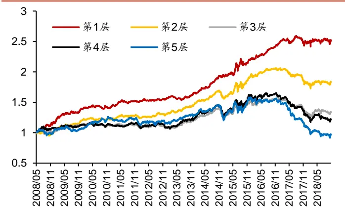
资料来源：Wind，华泰证券研究所

图表7： 最大化 IC_IR复合估值因子累积 RankIC和累积因子收益率
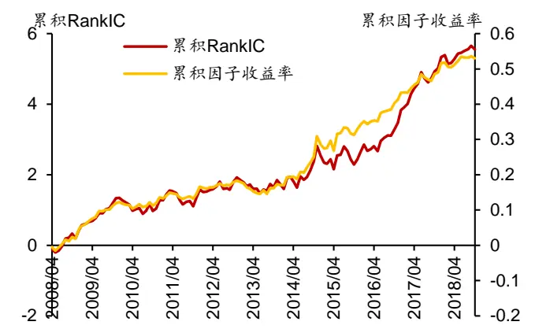
资料来源：Wind，华泰证券研究所

为了更加直观地看出复合因子中各因子占比变化，我们绘制了复合因子中细分因子的权重变化图，如图表 8 所示。

图表8： 最大化 IC_IR法的估值细分因子权重变化趋势图（12个月移动平均）
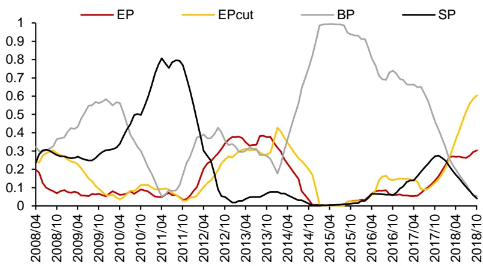
资料来源：Wind，华泰证券研究所

长期来看，BP因子权重最高，SP 因子次之，且两者呈负相关关系；EP和 EPcut 因子权重较低，两者呈正相关关系。在单因子测试中，BP和 SP因子的表现亦优于 EP和 EPcut因子，因此它们的权重较高，这也是合乎常理的。

接下来我们将比较各合成方法权重的稳定性。在所有因子合成方式中，等权复合因子在细分因子上每期的权重系数都相同，因此是最稳定的合成方式。我们寻找一种方式来衡量合成方式的稳定性，即衡量每期细分因子的权重变化大小。图表 9中计算了每期细分因子权重的变化值，计算方式为：设有 n 个细分因子，t 期的权重系数为 $w_{1},w_{2},\ldots,w_{n}$ ，t+1 期的权重系数为 ${w_{1}}^{\prime},{w_{2}}^{\prime},\ldots,{w_{n}}^{\prime}$ ，则 t+1 期权重的变化值定义为

$$
\sqrt{(w_{1}-w_{1}')^{2}+(w_{2}-w_{2}')^{2}+\cdots+(w_{n}-w_{n}')^{2}}
$$

图表 10中计算了 t 期复合因子和 t+1 期复合因子之间的相关系数，也是一种衡量不同合成方法稳定性的方式。对于等权复合因子来说，每期权重的变化值为 0，t 期等权复合因子和t+1 期等权复合因子之间的相关系数比较接近 1，因此复合因子每期权重变化值越小，相关系数越接近 1，说明合成方法越稳定。

图表9： 各合成方法估值因子前后两期权重变化值（12个月移动平均）
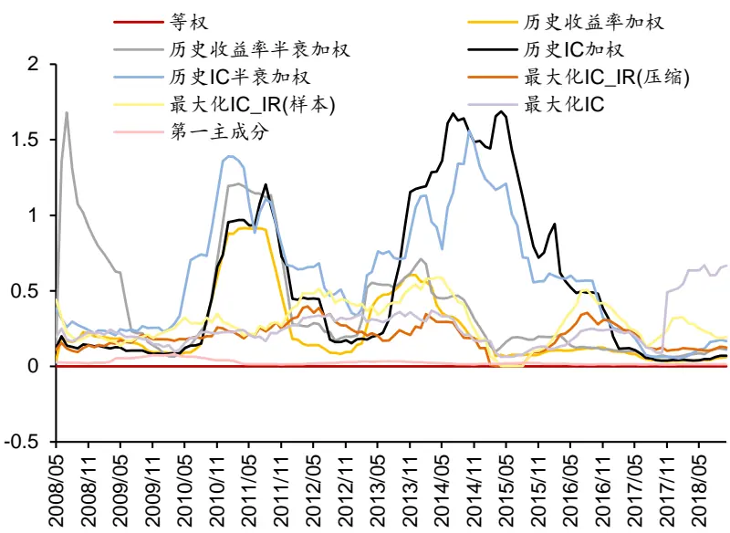
资料来源：Wind，华泰证券研究所

图表10： 各合成方法前后两期复合估值因子相关系数（12个月移动平均）
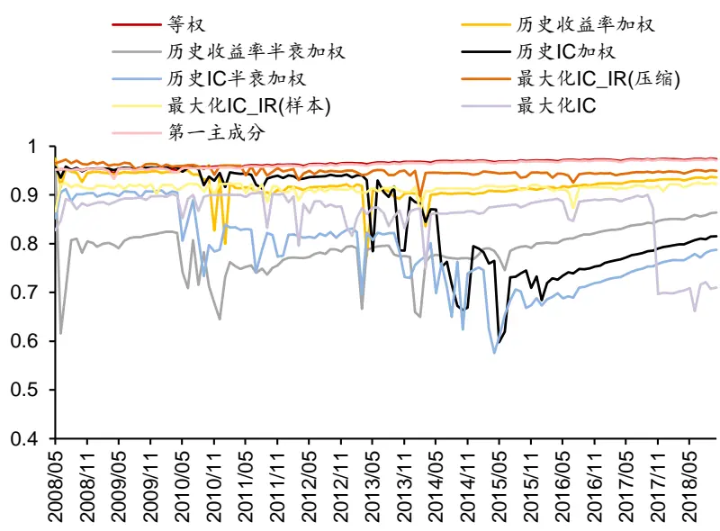
资料来源：Wind，华泰证券研究所

从图表 9 中看出，第一主成分复合因子最稳定，最大化 IC_IR 复合因子次之，而历史 IC（半衰）加权、历史收益率加权、最大化 IC 复合因子较不稳定。图表 10 也反映了类似的结论，最大化 IC 复合因子的相关系数最小，历史 IC（半衰）加权、历史收益率加权复合因子的相关系数也较小，而最大化 IC_IR 复合因子的相关系数也基本都在 0.9 以上，第一主成分复合因子的相关系数最接近 1，等权复合因子与第一主成分复合因子接近。

## 成长因子

成长因子是一类非常重要的风格因子，稳定成长的公司会有优秀的股价表现。我们选取成长因子中表现较好的如下 8 个因子进行合成，成长因子均由最新财报数据或 TTM 数据计算得出，因子描述如图表11所示。在合成之前我们计算了这8个因子两两之间的Spearman秩相关系数均值，如图表 12 所示。

图表11： 成长因子及其描述

| 因子 | 因子描述 |
| --- | --- |
| Sales_G_q | 当季营业收入(最新财报)同比增长率 |
| Sales_G_ttm | 营业收入(TTM)同比增长率 |
| Profit_G_q | 当季净利润(最新财报)同比增长率 |
| Profit_G_ttm | 净利润(TTM)同比增长率 |
| OCF_G_q | 当季经营性现金流(最新财报)同比增长率 |
| OCF_G_ttm | 经营性现金流(TTM)同比增长率 |
| ROE_G_q | 当季ROE(最新财报)同比增长率 |
| ROE_G_ttm | ROE(TTM)同比增长率 |

资料来源：华泰证券研究所

图表12： 成长因子两两之间的 Spearman秩相关系数均值（2007年至 2018年 11月）
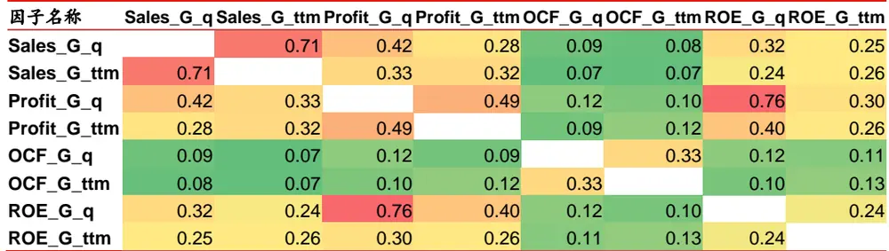
资料来源：Wind，华泰证券研究所

这 8 个因子中，营业收入两因子相关性较高，净利润与 ROE 当季因子相关性较高，其余的相关系数都低于 50%。我们分别将这 8 个因子同时合成、合成 4 个当季同比增长率因子、合成 4个 ttm 同比增长率因子，并将结果做对比，选取最好的合成方式。测试结果如图表 13、14所示。

图表13： 成长因子在全 A股内回归法、IC值分析结果汇总（行业中性、市值中性）

| 因子收益率 Rank IC |  |  |  |  |  |  | Rank IC | IC_IR IC>0 占比 |  |
| --- | --- | --- | --- | --- | --- | --- | --- | --- | --- |
| 因子名称 | 因子含义 | \|t\|均值 | \|t\|>2 占比 | t均值 | 均值 | 均值 标准差 |  |  |  |
| sales_g_q | 当季营业收入同比增长率 | 2.51 | 53.54% | 0.83 | 0.16% | 1.66% | 7.86% | 0.21 | 57.48% |
| sales_g_ttm | 营业收入（TTM)同比增长率 | 2.42 | 50.39% | 0.61 | 0.13% | 0.76% | 7.49% | 0.10 | 53.54% |
| profit_g_q | 当季净利润同比增长率 | 2.63 | 54.33% | 1.09 | 0.24% | 2.42% | 8.52% | 0.28 | 62.20% |
| profit_g_ttm | 净利润（TTM）同比增长率 | 2.12 | 44.88% | 0.56 | 0.11% | 0.55% | 7.40% | 0.07 | 52.76% |
| ocf_g_q | 当季经营性现金流同比增长率 | 1.36 | 27.56% | 0.65 | 0.15% | 1.82% | 5.70% | 0.32 | 59.84% |
| ocf_g_ttm | 经营性现金流（TTM）同比增长率 | 1.29 | 23.62% | 0.52 | 0.09% | 0.67% | 4.62% | 0.14 | 57.48% |
| roe_g_q | 当季 ROE 同比增长率 | 2.37 | 45.67% | 1.14 | 0.25% | 2.91% | 8.22% | 0.35 | 62.20% |
| roe_g_ttm | ROE（TTM）同比增长率 | 3.72 | 64.57% | 1.94 | 0.44% | 1.54% | 12.13% | 0.13 | 52.76% |
| fac_eqwt | 等权复合因子 | 3.23 | 61.42% | 1.58 | 0.26% | 2.10% | 9.46% | 0.22 | 59.06% |
| fac_ret | 历史收益率加权复合因子 | 3.66 | 62.20% | 2.05 | 0.36% | 3.29% | 10.09% | 0.33 | 62.99% |
| fac_ret_half | 历史收益率半衰加权复合因子 | 3.58 | 66.14% | 1.97 | 0.35% | 2.81% | 10.27% | 0.27 | 59.84% |
| fac_ic | 历史 IC 加权复合因子 | 3.20 | 59.84% | 1.65 | 0.27% | 2.39% | 9.62% | 0.25 | 56.69% |
| fac_ic_half | 历史IC半衰加权复合因子 | 3.21 | 55.12% | 1.61 | 0.28% | 2.23% | 9.58% | 0.23 | 57.48% |
| fac_maxicir_samp | 最大化 IC IR 复合因子（样本） | 2.66 | 51.18% | 1.51 | 0.24% | 2.67% | 9.03% | 0.30 | 58.27% |
| fac_maxicir1 | 最大化 IC_IR复合因子（压缩） | 2.95 | 54.33% | 1.65 | 0.26% | 3.00% | 9.51% | 0.32 | 59.84% |
| fac_maxic | 最大化 IC 复合因子 | 3.00 | 59.06% | 1.68 | 0.27% | 2.52% | 9.42% | 0.27 | 61.42% |
| fac_pca1 | 第一主成分复合因子 | 3.25 | 61.42% | 1.46 | 0.24% | 1.88% | 9.51% | 0.20 | 58.27% |

资料来源：Wind，华泰证券研究所

图表14： 成长因子在全 A股内分层测试法结果汇总（分五层，行业中性、市值中性）

| 多空组合 多空组合 多空组合多空组合 |  |  |  |  |  |  |  |  |  |
| --- | --- | --- | --- | --- | --- | --- | --- | --- | --- |
| 因子名称 | 因子含义 | 分层组合1～5（从左到右）年化收益率 |  |  |  |  | 年化收益率夏普比率最大回撤 |  | 月胜率 |
| sales_g_q | 当季营业收入同比增长率 | 5.34% | 4.88% | 3.28% | 2.33% | 1.24% 4.18% | 0.80 | 12.82% | 61.11% |
| sales_g_ttm | 营业收入（TTM）同比增长率 | 4.43% | 5.53% | 2.45% | 2.77% 2.94% | 1.76% | 0.32 | 12.62% | 52.38% |
| profit_g_q | 当季净利润同比增长率 | 5.92% | 3.80% | 2.19% | 1.49% | 1.66% | 4.36% 0.74 | 13.64% | 54.76% |
| profit_g_ttm | 净利润（TTM）同比增长率 | 3.69% | 2.90% | 2.69% | 3.35% | 3.68% | 0.08% 0.01 | 17.25% | 49.21% |
| ocf_g_q | 当季经营性现金流同比增长率 | 7.02% | 4.04% | 1.79% | 0.61% | 1.34% 5.43% | 0.99 | 12.64% | 56.35% |
| ocf_g_ttm | 经营性现金流（TTM）同比增长率4.72% |  | 3.76% | 1.34% | 2.75% | 2.83% | 1.72% 0.43 | 8.71% | 53.97% |
| roe_g_q | 当季 ROE 同比增长率 | 6.01% | 5.15% | 2.66% | 0.94% | 1.32% | 4.64% 0.89 | 14.53% | 60.32% |
| roe_g_ttm | ROE（TTM）同比增长率 | 6.00% | 3.92% | 2.81% | 2.84% | 2.14% | 3.72% 0.50 | 27.58% | 47.62% |
| fac_eqwt | 等权复合因子 | 5.57% | 4.23% | 2.46% | 1.63% | 1.97% | 3.62% 0.60 | 16.99% | 53.17% |
| fac_ret | 历史收益率加权复合因子 | 8.82% | 3.90% | 1.04% | -0.08% | 0.18% | 8.62% 1.31 | 16.40% | 54.76% |
| fac_ret_half | 历史收益率半衰加权复合因子 | 7.71% | 4.18% | 1.11% | -0.04% | 0.23% | 7.48% 1.14 | 14.91% | 54.76% |
| fac_ic | 历史IC 加权复合因子 | 6.05% | 4.27% | 0.77% | 0.31% | 1.63% | 4.36% 0.70 | 19.49% | 53.17% |
| fac_ic_half | 历史IC半衰加权复合因子 | 6.42% | 3.84% | 0.96% | 0.73% | -0.03% | 6.46% 1.06 | 15.10% | 57.14% |
| fac_maxicir_samp | 最大化IC_IR 复合因子（样本） | 5.28% | 4.43% | 2.78% | 0.31% | -0.58% | 5.80% 0.98 | 26.03% | 61.11% |
| fac_maxicir1 | 最大化 IC_IR复合因子（压缩） | 5.39% | 4.85% | 2.78% | 0.08% | -0.52% | 5.88% 0.96 | 24.61% | 61.90% |
| fac_maxic | 最大化 IC 复合因子 | 6.56% | 3.95% | 1.97% | -0.73% | 1.27% | 5.16% 0.88 | 23.43% | 58.73% |
| fac_pca1 | 第一主成分复合因子 | 4.88% | 4.22% | 2.18% | 2.28% | 2.65% | 2.35% | 0.38 19.30% | 54.76% |

资料来源：Wind，华泰证券研究所

## 成长因子合成结果分析

合成 8 个成长因子时，除第一主成分复合因子外，其余复合因子均战胜了等权复合因子。而其中历史收益率加权复合因子在 t统计量、因子收益率、IC_IR、多空组合夏普比率、胜率等方面均大幅优于其他因子。

综合因子收益率均值、IC_IR、多空组合夏普比率、多空组合年化收益率的表现，我们选出表现最好的历史收益率加权复合因子进行详细展示，绘制了分层组合相对于基准（中证全指）的净值曲线，及累积 RankIC 和累积因子收益率曲线，如图表 15、16 所示。

## 历史收益率加权复合因子详细展示

图表15： 历史收益率加权复合成长因子分层组合 1~5净值除以基准净值
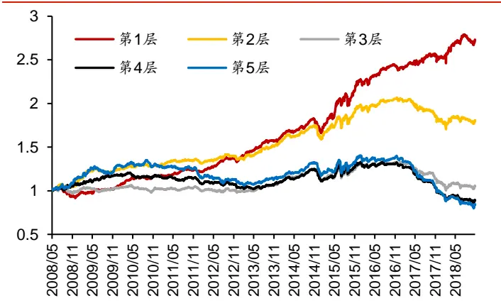
s 资料来源：Wind，华泰证券研究所

图表16： 历史收益率加权复合成长因子累积RankIC和累积因子收益率
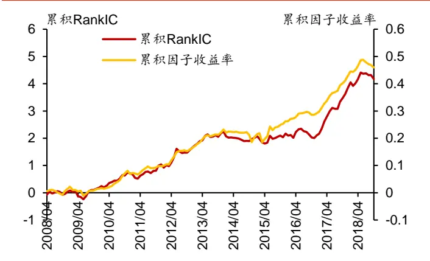
资料来源：Wind，华泰证券研究所

为了更加直观地看出复合因子中各因子占比变化，我们绘制了复合因子中细分因子的权重变化图，如图表 17 所示。

图表17： 历史收益率加权法的细分成长因子权重变化趋势图（12个月移动平均）
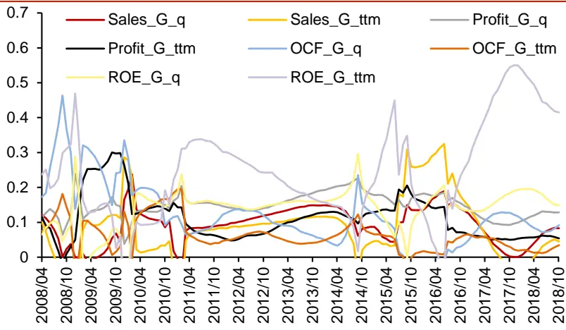
资料来源：Wind，华泰证券研究所

ROE_G_ttm 因子的权重较高且不稳定，OCF_G_q 因子的权重也较高，其余细分因子的权重差距不大。

为了衡量各合成方法的稳定性，图表 18 中计算了每期细分因子权重的变化值，图表 19 中计算了 t期复合因子和 t+1 期复合因子之间的相关系数。

图表18： 各合成方法成长因子前后两期权重变化值（12个月移动平均）
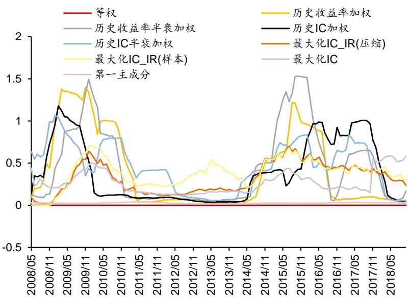
资料来源：Wind，华泰证券研究所

图表19： 各合成方法前后两期复合成长因子相关系数（12个月移动平均）
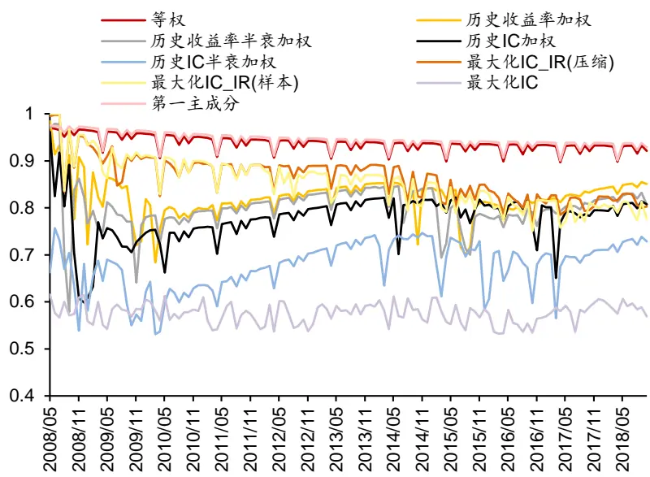
资料来源：Wind，华泰证券研究所

从图表 18 中看出，历史收益率（半衰）加权、历史 IC（半衰）加权复合因子的误差先大后小又变大，最大化 IC_IR、最大化 IC 复合因子的变化接近。从图表 19 中看出，最大化IC 复合因子和历史 IC 半衰加权复合因子的稳定性较低，第一主成分和最大化 IC_IR 复合因子的稳定性较高，等权复合因子与第一主成分接近。

## 动量反转因子

动量反转类因子主要是指过去一段时间内资产的收益率，是一类非常重要的风格因子，动量因子都是给最近若干月的收益率加以不同类型的权重而构成的。我们在动量反转因子中选取表现较好的如下因子进行合成，因子描述如图表 20 所示。在合成之前我们计算了因子两两之间的 Spearman 秩相关系数均值，如图表 21 所示。

图表20： 动量反转因子及其描述

| 动量反转因子 | 因子描述 |
| --- | --- |
| return_1m | 个股最近 N 个月收益率 |
| return_3m | N=1, 3, 6 |
| return_6m |  |
| exp_wgt_return_3m exp_wgt_return_6m | 个股最近N个月内以每日换手率乘以函数 exp(-x_i/N/4)作为权重对每日收益 率求算术平均值，x_i为该日距离截面日的天数（排除非交易日）。N=3，6 |

资料来源：华泰证券研究所

图表21： 动量反转因子两两之间的 Spearman秩相关系数均值（2007年至 2018年 11月）
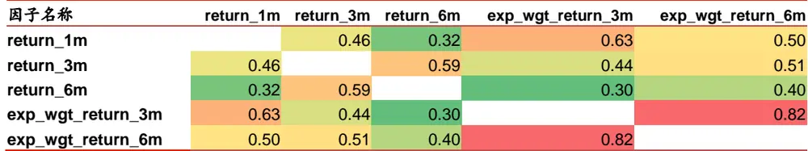
资料来源：Wind，华泰证券研究所

这 5 个因子中，3个月和 6个月衰减加权反转因子之间相关性相对最高，其余的相关系数也不算低，整体来讲该类别内部相关性稍大。我们将这 5 个因子进行合成，复合因子测试结果如图表 22、23所示。

图表22： 动量反转因子在全 A股内回归法、IC值分析结果汇总（行业中性、市值中性）

| 因子收益率 |  |  |  |  |  | Rank IC | Rank IC |  |  |
| --- | --- | --- | --- | --- | --- | --- | --- | --- | --- |
| 因子名称 | 因子含义 | It\|均值 It\|>2 占比 |  | t均值 | 均值 |  | 均值 标准差 |  | IC_IR IC>0 占比 |
| return_1m | 1个月反转 | 4.21 | 64.57% | 2.57 | 0.63% | 6.71% | 13.13% | 0.51 | 67.72% |
| return_3m | 3个月反转 | 4.67 | 66.14% | 2.20 | 0.55% | 7.22% | 15.12% | 0.48 | 66.14% |
| return_6m | 6个月反转 | 4.69 | 74.02% | 1.50 | 0.38% | 5.11% | 14.86% | 0.34 | 60.63% |
| exp_wgt_return_3m3个月衰减加权反转 |  | 4.25 | 67.72% | 3.52 | 0.86% | 8.68% | 11.80% | 0.74 | 76.38% |
| exp_wgt_return_6m6个月衰减加权反转 |  | 4.42 | 71.65% | 3.71 | 0.90% | 9.32% | 11.75% | 0.79 | 79.53% |
| fac_eqwt | 等权复合因子 | 4.78 | 70.08% | 3.29 | 0.64% | 9.43% | 13.85% | 0.68 | 74.02% |
| fac_ret_half | 历史收益率半衰加权复合因子 | 4.41 | 64.57% | 3.48 | 0.68% | 9.59% | 12.23% | 0.78 | 78.74% |
| fac_ret | 历史收益率加权复合因子 | 4.31 | 64.57% | 3.27 | 0.64% | 8.97% | 12.25% | 0.73 | 76.38% |
| fac_ic | 历史IC加权复合因子 | 4.55 | 66.14% | 3.44 | 0.67% | 9.53% | 12.56% | 0.76 | 77.17% |
| fac_ic_half | 历史IC半衰加权复合因子 | 4.41 | 66.14% | 3.36 | 0.65% | 9.49% | 12.27% | 0.77 | 77.95% |
| fac_maxicir_samp | 最大化 IC IR 复合因子（样本） | 4.29 | 66.93% | 3.29 | 0.63% | 9.31% | 11.85% | 0.79 | 79.53% |
| fac_maxicir1 | 最大化 IC_IR 复合因子（压缩） | 4.38 | 66.14% | 3.40 | 0.65% | 9.57% | 12.24% | 0.78 | 76.38% |
| fac_maxic | 最大化 IC 复合因子 | 4.37 | 68.50% | 3.43 | 0.65% | 9.69% | 11.79% | 0.82 | 81.10% |
| fac_pca1 | 第一主成分复合因子 | 4.59 | 70.87% | 2.49 | 0.07% | 7.52% | 15.62% | 0.48 | 69.29% |

资料来源：Wind，华泰证券研究所

图表23： 动量反转因子在全 A股内分层测试法结果汇总（分五层，行业中性、市值中性）

|  |  |  |  |  |  |  |  |  | 多空组合多空组合多空组合多空组合 |  |
| --- | --- | --- | --- | --- | --- | --- | --- | --- | --- | --- |
| 因子名称 | 因子含义 | 分层组合1～5（从左到右）年化收益率 |  |  |  |  | 年化收益率 夏普比率 最大回撤 |  |  | 月胜率 |
| return_1m | 1个月反转 | 3.71% | 4.92% | 4.20% | 0.81% | -9.41% | 14.46% | 1.63 | 12.72% | 61.90% |
| return_3m | 3个月反转 | 7.76% | 3.30% | 3.40% | -0.67% | -6.18% | 14.82% | 1.50 | 19.08% | 61.11% |
| return_6m | 6个月反转 | 6.20% | 4.65% | 3.58% | 0.33% | -5.14% | 11.91% | 1.24 | 23.14% | 57.94% |
|  | exp_wgt_return_3m3 个月衰减加权反转 | 4.93% | 7.24% | 4.97% |  | 0.07%-11.11% | 17.36% | 2.04 | 6.94% | 69.84% |
| exp_wgt_return_6m6个月衰减加权反转 |  | 6.37% | 6.87% | 6.04% | -1.43% | -9.60% | 16.40% | 1.86 | 9.33% | 69.05% |
| fac_eqwt | 等权复合因子 | 8.53% | 6.00% | 4.24% |  | -1.36%-10.33% | 20.64% | 2.20 | 12.72% | 71.43% |
| fac_ret | 历史收益率加权复合因子 | 7.22% | 6.62% | 4.71% |  | -0.40%-11.30% | 20.41% | 2.36 | 8.67% | 74.60% |
| fac_ret_half | 历史收益率半衰加权复合因子 | 6.64% | 6.31% | 4.93% |  | -0.18%-10.98% | 19.31% | 2.28 | 8.62% | 72.22% |
| fac_ic | 历史IC 加权复合因子 | 7.97% | 6.66% | 4.72% |  | -1.12%-11.13% | 21.00% | 2.38 | 9.10% | 73.02% |
| fac_ic_half | 历史IC半衰加权复合因子 | 7.28% | 6.52% | 4.61% |  | -0.67%-10.84% | 19.86% | 2.26 | 8.82% | 72.22% |
|  | fac_maxicir_samp 最大化 IC_IR 复合因子（样本） | 6.83% | 6.96% | 4.65% |  | -0.80%-10.79% | 19.08% | 2.20 | 7.63% | 69.84% |
| fac_maxicir1 | 最大化 IC_IR 复合因子（压缩） | 7.47% | 6.42% | 4.61% | -1.58% | -9.94% | 18.81% | 2.13 | 9.33% | 67.46% |
| fac_maxic | 最大化IC 复合因子 | 7.70% | 6.87% | 4.38% | -0.43% | -11.05% | 20.60% | 2.43 | 9.74% | 73.02% |
| fac_pca1 | 第一主成分复合因子 | 8.96% | 5.41% | 3.42% | -0.91% | -9.33% | 19.80% | 2.06 | 13.52% | 73.02% |

资料来源：Wind，华泰证券研究所

## 动量反转因子合成结果分析

该类因子的合成后效果没有那么突出，但也有一些提升。最大化 IC 复合因子的表现相对最好，因子收益率、IC_IR、多空组合夏普比率的增幅在 30%左右，最大回撤也进一步降低。历史收益率（半衰）加权、历史 IC（半衰）加权表现接近，仅次于最大化 IC 复合因子，也能战胜等权复合因子。

综合因子收益率均值、IC_IR、多空组合夏普比率、多空组合年化收益率的表现，我们选出表现最好的最大化IC复合因子进行详细展示，绘制了分层组合相对于基准的净值曲线，及累积 RankIC 和累积因子收益率曲线，如图表 24、25 所示。

图表24： 最大化 IC复合动量反转因子分层组合 1~5净值除以基准净值
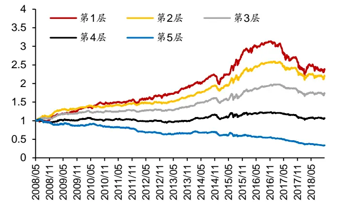
资料来源：Wind，华泰证券研究所

图表25： 最大化 IC复合动量反转因子累积RankIC和累积因子收益率
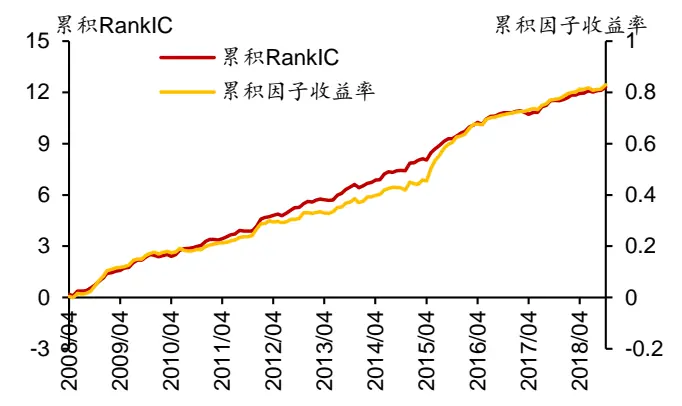
资料来源：Wind，华泰证券研究所

为了更加直观地看出复合因子中各因子占比变化，我们绘制了复合因子中细分因子的权重变化图，如图表 26 所示。

图表26： 最大化 IC法的动量反转细分因子权重变化趋势图（12个月移动平均）
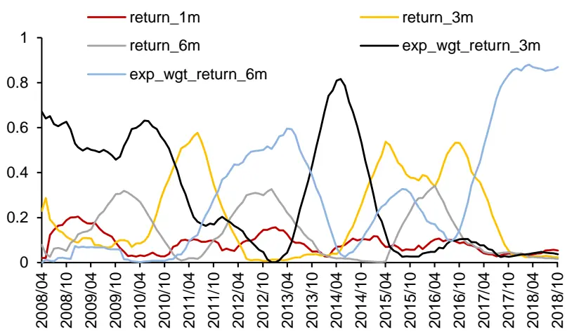
资料来源：Wind，华泰证券研究所

这 5 个因子的权重里，exp_wgt_return_3m、exp_wgt_return_6m、return_3m 因子的权重波动较大，其余细分因子的权重波动较小，约在 0.2 上下。

为了衡量各合成方法的稳定性，图表 27 中计算了每期细分因子权重的变化值，图表 28 中计算了 t期复合因子和 t+1 期复合因子之间的相关系数。

图表27： 各合成方法动量反转因子前后两期权重误差（12个月移动平均）
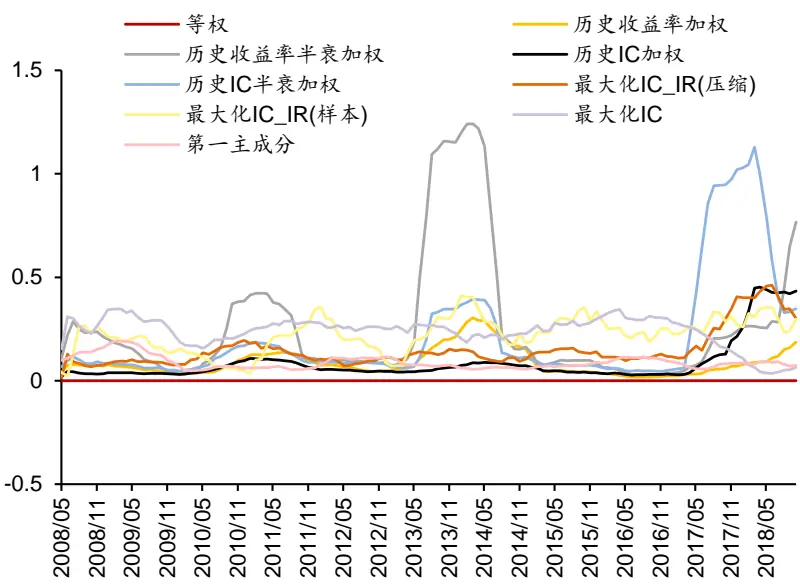
资料来源：Wind，华泰证券研究所

图表28： 各合成方法前后两期复合动量反转因子相关系数（12个月移动平均）
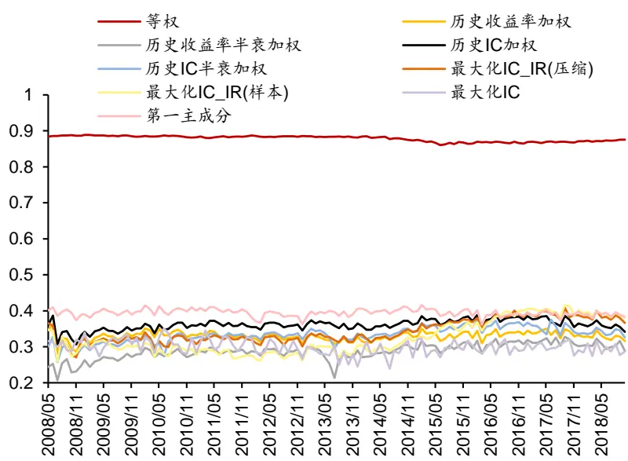
资料来源：Wind，华泰证券研究所

从图表 27 中可见，历史收益率半衰加权、历史 IC 半衰加权出现了误差的峰值，稳定性较低。从图表 28 中看出，历史收益率半衰加权和最大化 IC 复合因子的稳定性较差，第一主成分、最大化 IC_IR（压缩）和历史 IC 加权复合因子的稳定性较好。在本组合成中，等权复合因子的稳定性非常高，远远超过了次高的第一主成分复合因子。

## 换手率因子

换手率类因子主要反映的是过去一段时间内资产的流通性强弱，是一类非常重要的风格因子。我们选取换手率因子中表现较好的如下因子进行合成，采用过去若干月的平均换手率或相对 2 年内平均换手率的偏离程度作为换手率因子的衡量方法，因子描述如图表 29。同时我们计算了这 6个因子两两之间的 Spearman 秩相关系数均值，如图表 30 所示。

这 8 个因子中，营业收入两因子相关性较高，净利润与 ROE 当季因子相关性较高，其余的相关系数都低于 50%。

图表29： 换手率因子及其描述

| 换手率因子 因子描述 |  |
| --- | --- |
| turn_1m | 个股最近N个月内日均换手率 |
| turn_3m | N=1, 3, 6 |
| turn_6m |  |
| bias_turn_1m | 个股最近N个月内日均换手率除以最近 2 年内日均换手率，再减去1 |
| bias_turn_3m | N=1, 3, 6 |
| bias_turn_6m |  |

资料来源：华泰证券研究所

图表30： 换手率因子两两之间的 Spearman秩相关系数均值（2007年至 2018年 11月）
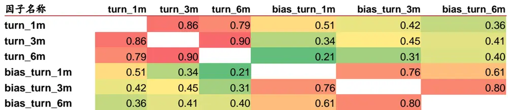
资料来源：Wind，华泰证券研究所

复合因子测试结果如图表 31、32 所示。

图表31： 换手率因子在全 A股内回归法、IC值分析结果汇总（行业中性、市值中性）

|  |  |  |  | 因子收益率 |  | Rank IC | Rank IC |  |  |
| --- | --- | --- | --- | --- | --- | --- | --- | --- | --- |
| 因子名称 | 因子含义 | \|t\|均值 | \|tl>2 占比 | t均值 | 均值 |  | 均值 | 标准差 | IC_IR IC>0 占比 |
| turn_1m | 1个月换手率 | 5.16 | 77.17% | 3.39 | 0.79% | 6.69% | 16.48% | 0.41 | 66.14% |
| turn_3m | 3个月换手率 | 5.02 | 79.53% | 2.76 | 0.64% | 4.79% | 17.55% | 0.27 | 62.99% |
| turn_6m | 6个月换手率 | 4.75 | 75.59% | 2.43 | 0.57% | 3.56% | 17.86% | 0.20 | 62.20% |
| bias_turn_1m | 1个月换手率/2年换手率 | 3.90 | 66.93% | 2.59 | 0.50% | 7.15% | 11.11% | 0.64 | 74.02% |
| bias_turn_3m | 3个月换手率/2年换手率 | 3.66 | 66.93% | 1.97 | 0.36% | 4.99% | 11.18% | 0.45 | 68.50% |
| bias_turn_6m | 6个月换手率/2年换手率 | 3.50 | 60.63% | 1.61 | 0.29% | 3.58% | 10.87% | 0.33 | 62.99% |
| fac_eqwt | 等权复合因子 | 4.67 | 73.23% | 2.92 | 0.49% | 7.33% | 13.48% | 0.54 | 71.65% |
| fac_ret | 历史收益率加权复合因子 | 4.59 | 74.02% | 2.94 | 0.51% | 7.00% | 13.85% | 0.51 | 69.29% |
| fac_ret_half | 历史收益率半衰加权复合因子 | 4.48 | 74.02% | 2.79 | 0.47% | 6.52% | 14.28% | 0.46 | 69.29% |
| fac_ic | 历史IC加权复合因子 | 4.25 | 69.29% | 2.50 | 0.42% | 6.45% | 11.95% | 0.54 | 72.44% |
| fac_ic_half | 历史IC半衰加权复合因子 | 4.23 | 70.08% | 2.50 | 0.43% | 6.52% | 12.31% | 0.53 | 70.87% |
| fac_maxicir_samp | 最大化 IC_IR 复合因子（样本) | 3.95 | 67.72% | 2.55 | 0.41% | 7.68% | 11.61% | 0.66 | 76.38% |
| fac_maxicir1 | 最大化 IC_IR 复合因子（压缩） | 4.13 | 63.78% | 2.69 | 0.44% | 8.00% | 12.02% | 0.67 | 77.17% |
| fac_maxic | 最大化IC 复合因子 | 4.28 | 70.08% | 2.85 | 0.48% | 8.30% | 11.98% | 0.69 | 76.38% |
| fac_pca1 | 第一主成分复合因子 | 4.77 | 79.53% | 2.44 | 0.37% | 6.18% | 15.99% | 0.39 | 66.93% |

资料来源：Wind，华泰证券研究所

图表32： 换手率因子在全 A股内分层测试法结果汇总（分五层，行业中性、市值中性）

| 多空组合 多空组合多空组合多空组合 |  |  |  |  |  |  |  |  |  |  |
| --- | --- | --- | --- | --- | --- | --- | --- | --- | --- | --- |
| 因子名称 | 因子含义 |  | 分层组合1～5（从左到右）年化收益率 |  |  |  | 年化收益率夏普比率最大回撤 |  |  | 月胜率 |
| turn_1m | 1个月换手率 | 4.42% | 6.17% | 4.61% | 1.84% | -5.61% | 7.74% | 0.68 | 18.46% | 58.73% |
| turn_3m | 3个月换手率 | 4.70% | 6.22% | 3.04% | 3.16% | -2.53% | 4.69% | 0.41 | 26.42% | 57.94% |
| turn_6m | 6个月换手率 | 4.48% | 4.51% | 4.31% | 4.30% | -1.43% | 3.37% | 0.30 | 31.73% | 54.76% |
| bias_turn_1m | 1个月换手率/2年换手率 | 6.06% | 3.94% | 3.14% | 1.30% | -5.45% | 10.49% | 1.31 | 17.04% | 65.87% |
| bias_turn_3m | 3个月换手率/2 年换手率 | 5.89% | 4.83% | 3.28% | 1.67% | -3.23% | 7.87% | 1.02 | 22.25% | 60.32% |
| bias_turn_6m | 6个月换手率/2年换手率 | 5.17% | 4.81% | 3.08% | 2.18% | -1.05% | 4.93% | 0.67 | 23.51% | 58.73% |
| fac_eqwt | 等权复合因子 | 7.65% | 4.46% | 4.81% | 1.05% | -5.51% | 11.67% | 1.29 | 17.54% | 63.49% |
| fac_ret | 历史收益率加权复合因子 | 7.30% | 4.94% | 3.85% | 1.76% | -5.97% | 11.66% | 1.21 | 17.45% | 61.11% |
| fac_ret_half | 历史收益率半衰加权复合因子 | 6.01% | 4.96% | 4.22% | 1.98% | -5.87% | 10.28% | 1.09 | 19.02% | 61.90% |
| fac_ic | 历史IC 加权复合因子 | 6.53% | 4.55% | 2.63% | 2.56% | -5.91% | 11.16% | 1.26 | 14.00% | 66.67% |
| fac_ic_half | 历史IC半衰加权复合因子 | 5.48% | 4.94% | 2.96% | 1.82% | -5.43% | 9.56% | 1.08 | 15.95% | 61.11% |
|  | fac_maxicir_samp 最大化 IC_IR 复合因子（样本） | 6.87% | 4.66% | 2.88% | 0.51% | -5.85% | 11.75% | 1.48 | 12.17% | 69.84% |
| fac_maxicir1 | 最大化 IC_IR 复合因子（压缩） | 7.01% | 5.03% | 2.58% | 0.94% | -5.97% | 11.94% | 1.45 | 12.79% | 69.05% |
| fac_maxic | 最大化 IC 复合因子 | 7.98% | 5.07% | 2.74% | 1.13% | -7.21% | 14.25% | 1.64 | 13.03% | 72.22% |
| fac_pca1 | 第一主成分复合因子 | 7.07% | 4.13% | 2.98% | 0.88% | -3.04% | 8.97% | 0.93 | 23.92% | 64.29% |

资料来源：Wind，华泰证券研究所

## 换手率因子合成结果分析

总体而言，最大化 IC 复合因子表现相对最好，最大化 IC_IR 复合因子表现次之，优于其他复合因子。

综合因子收益率均值、IC_IR、多空组合夏普比率、多空组合年化收益率的表现，我们选出表现最好的最大化IC复合因子进行详细展示，绘制了分层组合相对于基准的净值曲线，及累积 RankIC 和累积因子收益率曲线，如图表 33、34 所示。

图表33： 最大化 IC复合换手率因子分层组合 1~5净值除以基准净值
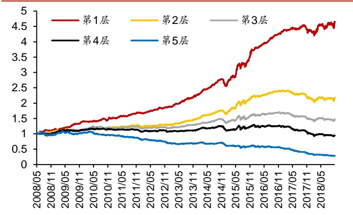
资料来源：Wind，华泰证券研究所

图表34： 最大化 IC复合换手率因子累积 RankIC和累积因子收益率
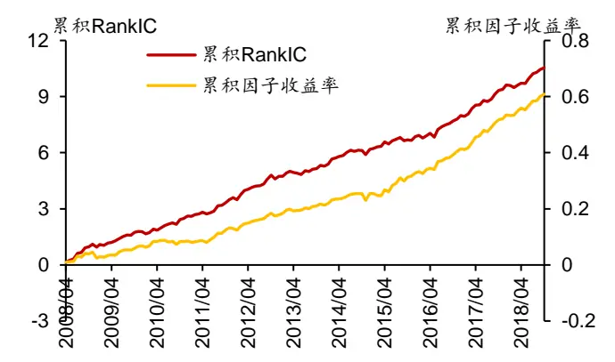
资料来源：Wind，华泰证券研究所

为了更加直观地看出复合因子中各因子占比变化，我们绘制了复合因子中细分因子的权重变化图，如图表 35 所示。

图表35： 最大化 IC法的换手率细分因子权重变化趋势图（12个月移动平均）
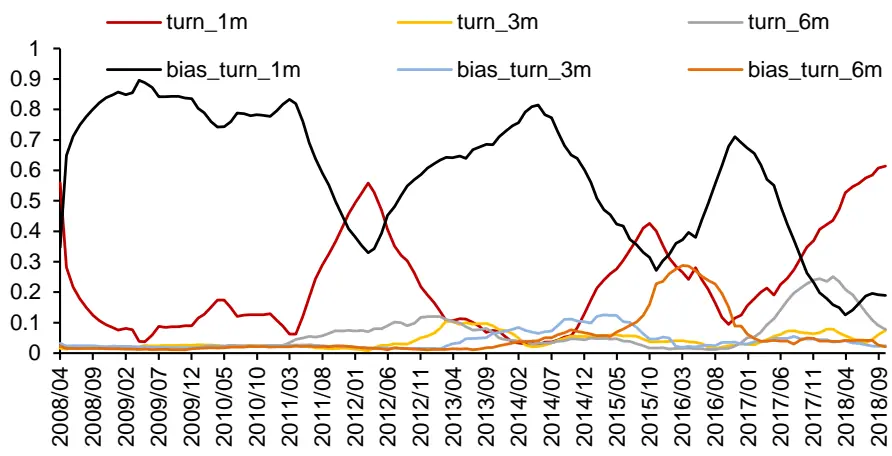
资料来源：Wind，华泰证券研究所

bias_turn_6m 因子和 bias_turn_1m 因子的权重最高且波动较大，两者呈明显的负相关关系，turn_3m 因子和 bias_turn_3m 因子的权重较低，且约稳定在 0.1 之下。为了衡量各合成方法的稳定性，图表 36 中计算了每期细分因子权重的变化值，图表 37中计算了 t期复合因子和 t+1 期复合因子之间的相关系数。

图表36： 各合成方法前后两期换手率因子权重变化值（12个月移动平均）
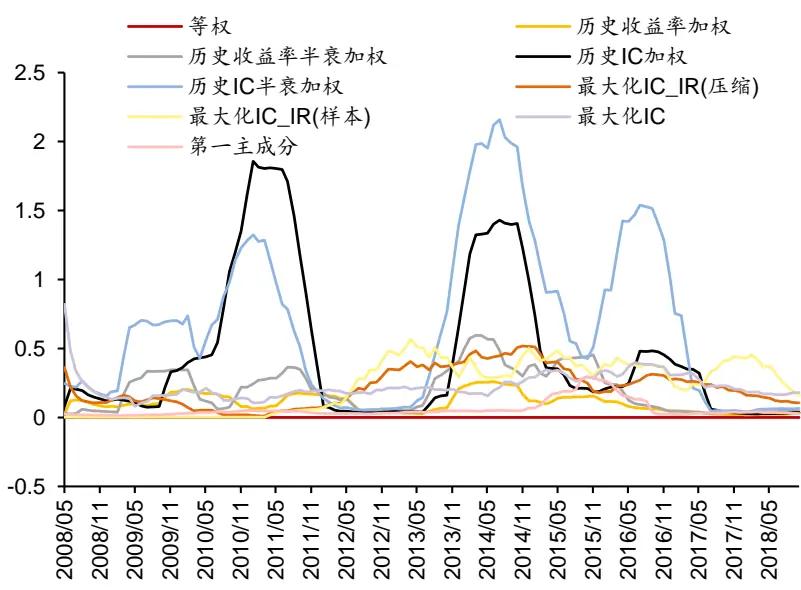
资料来源：Wind，华泰证券研究所

图表37： 各合成方法前后两期复合换手率因子相关系数（12个月移动平均）
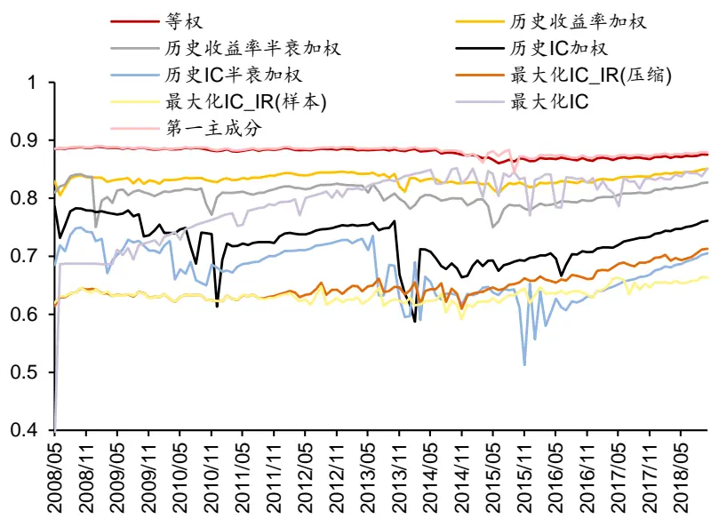
资料来源：Wind，华泰证券研究所

在图表 36 和 37 中，历史 IC（半衰）加权、最大化 IC_IR 复合因子均表现出了较低的稳定性，第一主成分、历史收益率（半衰）加权复合因子均表现出了较高的稳定性，等权复合因子与第一主成分复合因子接近。

## 波动率因子

波动率类因子主要反映的是过去一段时间内资产价格的波动性大小，是关于资产的价格序列的二阶矩信息（动量反转类因子相当于一阶矩信息），是一类非常重要的风格因子。我们选取波动率因子中表现较好的如下因子进行合成，因子描述如图表 38 所示。在合成前，我们首先计算了这 5个因子两两之间的 Spearman 秩相关系数均值，如图表 39 所示。

图表38： 波动率因子及其描述

| 波动率因子 |  |
| --- | --- |
| std_1m | 因子描述 个股最近N个月内日收益率序列的标准差 |
| std_3m | N=1, 3, 6 |
| std_6m id2_std_1m | 特质波动率：个股最近N个月内日收益率序列对中证全指日收益率、规模因子 |
| id2_std_4m | 日收益率、BP因子日收益率序列进行多元线性回归的残差的标准差N=1，4 |

资料来源：华泰证券研究所

图表39： 波动率因子两两之间的 Spearman秩相关系数均值（2007年至 2018年 11月）
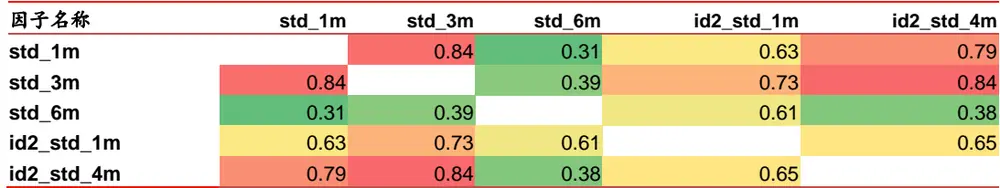
资料来源：Wind，华泰证券研究所

波动率因子中，1个月波动率和 3个月波动率相关性高达 84%，1 个月特质波动率和 4 个月特质波动率之间相关性也较高。大部分波动率因子之间相关性较高。对它们及复合因子进行单因子测试，测试结果如图表 40、41 所示。

图表40： 波动率因子在全 A股内回归法、IC值分析结果汇总（行业中性、市值中性）

|  |  |  | 因子收益率 |  |  | Rank IC | Rank IC |  |  |
| --- | --- | --- | --- | --- | --- | --- | --- | --- | --- |
| 因子名称 | 因子含义 | It\|均值 \|tl>2 占比 |  | t均值 | 均值 |  | 均值 | 标准差 | IC_IR IC>0 占比 |
| std_1m | 1个月波动率 | 5.10 | 77.95% | 1.83 | 0.43% | 4.88% | 16.43% | 0.30 | 65.35% |
| std_3m | 3个月波动率 | 5.61 | 84.25% | 1.87 | 0.48% | 4.62% | 18.00% | 0.26 | 63.78% |
| std_6m | 6个月波动率 | 5.74 | 81.89% | 1.78 | 0.43% | 3.86% | 18.54% | 0.21 | 63.78% |
| id2_std_1m | 1个月特质波动率 | 3.97 | 69.29% | 2.53 | 0.54% | 8.11% | 11.53% | 0.70 | 78.74% |
| id2_std_4m | 4个月特质波动率 | 4.55 | 71.65% | 2.00 | 0.42% | 5.52% | 14.95% | 0.37 | 66.14% |
| fac_eqwt | 等权复合因子 | 5.28 | 74.02% | 2.38 | 0.45% | 7.78% | 16.19% | 0.48 | 68.50% |
| fac_ret | 历史收益率加权复合因子 | 4.85 | 77.17% | 1.98 | 0.36% | 6.93% | 15.21% | 0.46 | 66.93% |
| fac_ret_half | 历史收益率半衰加权复合因子 | 4.99 | 75.59% | 2.24 | 0.43% | 7.29% | 15.71% | 0.46 | 67.72% |
| fac_ic | 历史 IC 加权复合因子 | 4.55 | 70.08% | 1.91 | 0.35% | 7.33% | 14.06% | 0.52 | 70.87% |
| fac_ic_half | 历史IC半衰加权复合因子 | 4.70 | 76.38% | 2.19 | 0.42% | 7.84% | 14.18% | 0.55 | 71.65% |
| fac_maxicir_samp | 最大化IC_IR 复合因子（样本） | 4.17 | 68.50% | 2.37 | 0.41% | 8.41% | 12.61% | 0.67 | 75.59% |
| fac_maxicir1 | 最大化 IC_IR 复合因子（压缩） | 4.22 | 68.50% | 2.44 | 0.43% | 8.70% | 12.74% | 0.68 | 76.38% |
| fac_maxic | 最大化IC 复合因子 | 4.26 | 71.65% | 2.39 | 0.43% | 8.70% | 12.56% | 0.69 | 76.38% |
| fac_pca1 | 第一主成分复合因子 | 5.05 | 77.17% | 2.08 | 0.25% | 6.10% | 17.79% | 0.34 | 65.35% |

资料来源：Wind，华泰证券研究所

图表41： 波动率因子在全 A股内分层测试法结果汇总（分五层，行业中性、市值中性）

|  |  |  |  |  |  |  |  |  | 多空组合多空组合多空组合多空组合 |  |
| --- | --- | --- | --- | --- | --- | --- | --- | --- | --- | --- |
| 因子名称 | 因子含义 | 分层组合1～5（从左到右）年化收益率 |  |  |  |  | 年化收益率 夏普比率 最大回撤 |  |  | 月胜率 |
| std_1m | 1个月波动率 | 2.22% | 2.60% | 3.91% | 2.68% | -4.87% | 4.40% | 0.37 | 24.41% | 51.59% |
| std_3m | 3个月波动率 | 3.15% | 4.71% | 4.70% | 1.38% | -2.57% | 2.64% | 0.21 | 37.82% | 50.00% |
| std_6m | 6个月波动率 | 4.19% | 4.53% | 3.12% | 2.29% | -0.39% | 1.38% | 0.11 | 40.15% | 50.79% |
| id2_std_1m | 1个月特质波动率 | 5.48% | 5.77% | 1.17% | -0.19% | -5.99% | 10.93% | 1.34 | 13.02% | 66.67% |
| id2_std_4m | 4个月特质波动率 | 5.17% | 4.74% | 2.64% | 2.21% | -2.66% | 6.33% | 0.66 | 27.17% | 57.94% |
| fac_eqwt | 等权复合因子 | 6.43% | 5.00% | 3.46% | 0.38% | -5.11% | 9.47% | 0.86 | 23.42% | 58.73% |
| fac_ret | 历史收益率加权复合因子 | 4.96% | 3.57% | 4.08% | 0.55% | -4.63% | 7.69% | 0.73 | 30.86% | 57.94% |
| fac_ret_half | 历史收益率半衰加权复合因子 | 6.39% | 3.93% | 3.83% | 1.37% | -6.11% | 10.62% | 0.97 | 22.22% | 57.94% |
| fac_ic | 历史IC 加权复合因子 | 5.03% | 5.56% | 2.57% | 0.65% | -5.67% | 9.29% | 0.94 | 21.10% | 60.32% |
| fac_ic_half | 历史IC 半衰加权复合因子 | 6.17% | 5.40% | 1.94% | 0.31% | -5.69% | 10.42% | 1.04 | 18.67% | 62.70% |
|  | fac_maxicir_samp 最大化 IC_IR 复合因子（样本） | 6.63% | 4.91% | 2.40% | -1.41% | -5.60% | 11.46% | 1.30 | 20.98% | 65.87% |
| fac_maxicir1 | 最大化 IC_IR 复合因子（压缩） | 7.02% | 5.30% | 2.21% | -1.39% | -5.95% | 12.26% | 1.38 | 17.37% | 66.67% |
| fac_maxic | 最大化 IC 复合因子 | 7.23% | 4.70% | 1.52% | 0.89% | -6.80% | 13.32% | 1.47 | 15.53% | 69.05% |
| fac_pca1 | 第一主成分复合因子 | 6.42% | 3.70% | 4.00% | 1.07% | -4.45% | 9.39% | 0.88 | 24.56% | 59.52% |

资料来源：Wind，华泰证券研究所

## 波动率因子合成结果分析

合成 5 个波动率因子时，我们也有类似的结论。最大化 IC 复合因子在各方面均优于其他复合因子。其次是最大化 IC_IR 复合因子，除第一主成分外的其余复合因子也能战胜等权复合因子。

综合因子收益率均值、IC_IR、多空组合夏普比率、多空组合年化收益率的表现，我们选出表现最好的最大化复合因子进行详细展示，绘制了分层组合相对于基准的净值曲线，及累积 RankIC 和累积因子收益率曲线，如图表 42、43所示。

图表42： 最大化 IC复合波动率因子分层组合 1~5净值除以基准净值
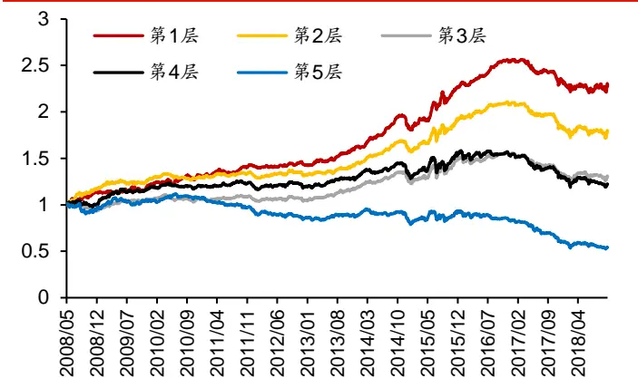
资料来源：Wind，华泰证券研究所

图表43： 最大化 IC复合波动率因子累积 RankIC和累积因子收益率
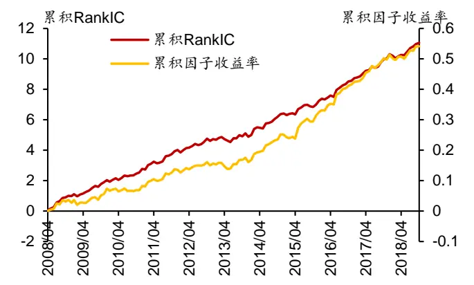
资料来源：Wind，华泰证券研究所

为了更加直观地看出复合因子中各因子占比变化，我们绘制了复合因子中细分因子的权重变化图，如图表 44 所示。

图表44： 最大化 IC法的波动率细分因子权重变化趋势图（12个月移动平均）
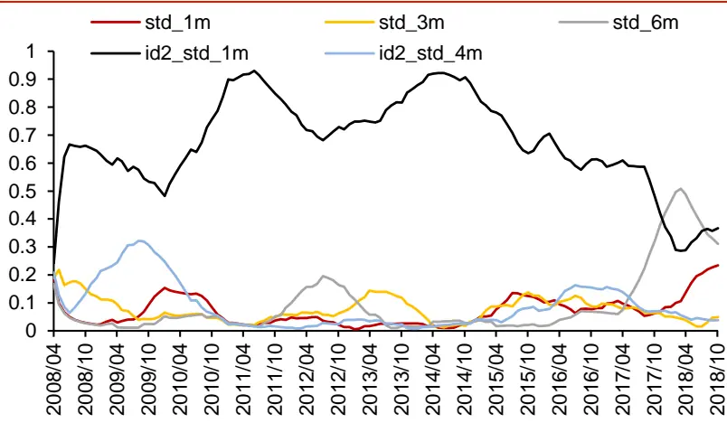
资料来源：Wind，华泰证券研究所

id2_std_1m 因子的权重最高，远高于其他因子，从单因子测试的结果也可以看出id2_std_1m 因子的表现最好，因此权重最高是符合人们直觉的。其余四个因子的权重差距不大，除了 2017 年后 std_6m 因子的权重忽然上升外，2017 年以前各因子权重变化不大，基本在 0.2 以下。

为了衡量各合成方法的稳定性，图表 45 中计算了每期细分因子权重的变化值，图表 46 中计算了 t期复合因子和 t+1 期复合因子之间的相关系数。

图表45： 各合成方法前后两期波动率因子权重变化值（12个月移动平均）
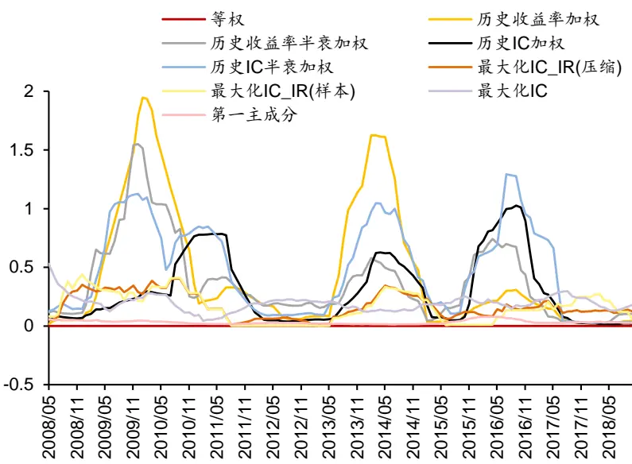
资料来源：Wind，华泰证券研究所

图表46： 各合成方法前后两期复合波动率因子相关系数（12个月移动平均）
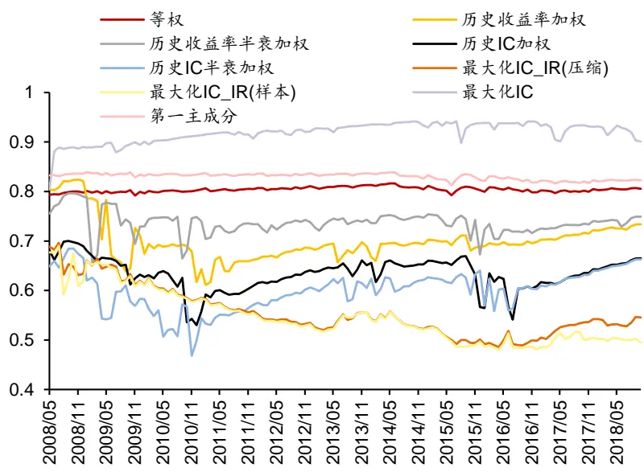
资料来源：Wind，华泰证券研究所

在图表 45 中，历史收益率（半衰）加权、历史 IC（半衰）加权复合因子的权重变化误差较大，呈现先减后增的趋势，最大化 IC、最大化 IC_IR、第一主成分复合因子的权重变化较为稳定。而在图表 46 中，最大化 IC复合因子前后两期的相关系数高于等权复合因子和第一主成分。综合两表可以认为等权复合因子、第一主成分和最大化 IC 复合因子较为稳定。

## 财务质量因子

财务报表作为投资者最容易获取的信息，主要反映的是过去一段时间内公司的财务状况和经营情况。通过合理的因子构建方法，财务质量因子可以用于反映企业未来的经营趋势，能在很大程度上帮助我们去预测股票价格的变化趋势。财务因子的描述如图表 47 所示。本文主要使用的是财务质量类中的盈利因子。

图表47： 财务质量因子及其描述

| 财务质量因子 | 因子描述 |
| --- | --- |
| qfa_roe | 单季度 ROE（平均） |
| qfa_roa | 单季度总资产净利率 |
| qfa_grossprofitmargin | 单季度销售毛利率 |
| nptocostexpense_qfa | 当年累计成本费用利润率 |
| roic | 投入资本回报率 |

资料来源：华泰证券研究所

财务质量因子两两之间的 Spearman 秩相关系数如图表 48 所示，可以看出大部分因子间相关性较高。对这些因子及复合因子进行单因子测试，测试结果如图表 49、50 所示。

图表48： 盈利能力因子两两之间的 Spearman秩相关系数均值（2007年至 2018年 11月）
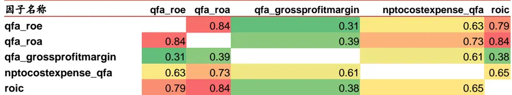
资料来源：Wind，华泰证券研究所

图表49： 财务质量因子在全 A股内回归法、IC值分析结果汇总（行业中性、市值中性）

| 因子收益率 |  |  |  |  |  |  | Rank IC Rank IC |  | IC_IR IC>0 占比 |
| --- | --- | --- | --- | --- | --- | --- | --- | --- | --- |
| 因子名称 | 因子含义 | \|t\|均值 | \|t\|>2 占比 | t均值 | 均值 | 均值 标准差 |  |  |  |
| qfa_roe | 单季度 ROE（平均） | 3.69 | 66.14% | 1.92 | 0.39% | 1.93% | 11.37% | 0.17 | 53.54% |
| qfa_roa | 单季度总资产净利率 | 3.60 | 67.72% | 1.58 | 0.31% | 1.86% | 11.48% | 0.16 | 56.69% |
| nptocostexpense_qfa | 当年累计成本费用利润率 | 2.74 | 60.63% | 0.77 | 0.16% | 1.69% | 10.15% | 0.17 | 54.33% |
| qfa_grossprofitmargin | 单季度销售毛利率 | 2.69 | 55.12% | 0.98 | 0.20% | 1.33% | 10.15% | 0.13 | 56.69% |
| roic | 投入资本回报率 | 3.65 | 66.14% | 1.35 | 0.26% | 1.00% | 12.04% | 0.08 | 53.54% |
| fac_eqwt | 等权复合因子 | 3.66 | 60.63% | 1.57 | 0.26% | 1.06% | 11.73% | 0.09 | 51.18% |
| fac_ret | 历史收益率加权复合因子 | 3.70 | 66.14% | 1.55 | 0.26% | 1.32% | 11.54% | 0.11 | 54.33% |
| fac_ret_half | 历史收益率半衰加权复合因子 | 3.60 | 63.78% | 1.58 | 0.26% | 1.12% | 11.68% | 0.10 | 52.76% |
| fac_ic | 历史IC 加权复合因子 | 3.48 | 62.99% | 1.34 | 0.22% | 0.84% | 11.52% | 0.07 | 49.61% |
| fac_ic_half | 历史IC半衰加权复合因子 | 3.55 | 62.99% | 1.44 | 0.24% | 0.94% | 11.49% | 0.08 | 49.61% |
| fac_maxicir_samp | 最大化 IC_IR 复合因子(样本) | 3.46 | 67.72% | 1.51 | 0.25% | 1.21% | 11.28% | 0.11 | 53.54% |
| fac_maxicir1 | 最大化 IC_IR 复合因子（压缩） | 3.50 | 66.14% | 1.57 | 0.26% | 1.24% | 11.32% | 0.11 | 53.54% |
| fac_maxic | 最大化 IC 复合因子 | 3.62 | 65.35% | 1.55 | 0.27% | 1.26% | 11.53% | 0.11 | 52.76% |
| fac_pca1 | 第一主成分复合因子 | 3.89 | 67.72% | 1.98 | 1.51% | 1.67% | 12.65% | 0.13 | 54.33% |

资料来源：Wind，华泰证券研究所

图表50： 财务质量因子在全 A股内分层测试法结果汇总（分五层，行业中性、市值中性）

| 因子名称 | 因子含义 | 分层组合1～5（从左到右）年化收益率 |  |  |  |  | 年化收益率 | 夏普比率最大回撤 | 多空组合 | 多空组合 月胜率 |
| --- | --- | --- | --- | --- | --- | --- | --- | --- | --- | --- |
|  | 单季度 ROE（平均） | 5.61% | 3.91% | 2.73% | 1.97% | 1.80% | 3.55% | 0.50 | 20.83% | 50.79% |
| qfa_roe qfa_roa | 单季度总资产净利率 | 5.67% | 3.49% | 2.85% | 2.18% | 2.39% | 3.18% | 0.50 | 19.22% | 53.17% |
| nptocostexpense_qfa | 当年累计成本费用利润率 | 5.93% | 5.32% | 5.12% | 2.85% | 3.98% | 1.90% | 0.30 | 17.24% | 57.14% |
| qfa_grossprofitmargin | 单季度销售毛利率 | 4.85% | 5.65% | 3.94% | 4.03% | 3.50% | 1.36% | 0.19 | 29.41% | 52.38% |
| roic | 投入资本回报率 | 4.90% | 6.26% | 2.60% | 3.89% | 5.35% | -0.41% | -0.05 | 31.88% | 50.00% |
| fac_eqwt | 等权复合因子 | 4.18% | 4.39% | 1.91% | 2.48% | 3.83% | 0.23% | 0.03 | 34.73% | 48.41% |
| fac_ret | 历史收益率加权复合因子 | 3.67% | 3.87% | 2.46% | 1.78% | 3.44% | 4.84E-05 | 0.00 | 36.59% | 47.62% |
| fac_ret_half | 历史收益率半衰加权复合因子 3.85% |  | 3.85% | 3.68% | 2.82% | 1.17% | 3.32% | 0.32 | 4.12% | 32.84% |
| fac_ic | 历史IC加权复合因子 | 4.32% | 4.04% | 1.65% | 1.21% | 2.66% | 1.40% | 0.20 | 24.78% | 46.83% |
| fac_ic_half | 历史IC半衰加权复合因子 | 3.85% | 3.84% | 1.80% | 2.19% | 1.91% | 1.70% | 0.24 | 23.86% | 46.03% |
| fac_maxicir_samp | 最大化 IC_IR 复合因子（样本）3.82% |  | 3.64% | 1.68% | 2.18% | 2.74% | 0.85% | 0.12 | 31.33% | 49.21% |
| fac_maxicir1 | 最大化 IC_IR 复合因子（压缩）3.72% |  | 3.27% | 1.93% | 2.09% | 3.23% | 0.25% | 0.04 | 32.40% | 46.83% |
| fac_maxic | 最大化 IC 复合因子 | 4.42% | 3.59% | 1.75% | 1.59% | 3.12% | 1.05% | 0.15 | 29.27% | 47.62% |
| fac_pca1 | 第一主成分复合因子 | 7.12% | 4.64% | 1.70% | 2.08% | 1.11% | 5.69% | 0.74 | 19.54% | 52.38% |

资料来源：Wind，华泰证券研究所

## 财务质量因子合成结果分析

财务质量因子的合成结果显示，历史收益率半衰加权复合因子的因子收益率、多空组合夏普比率、多空组合年化收益率均高于其他大部分因子，且最大回撤明显降低。第一主成分复合因子虽然结果较好，但由于其因子收益绝大部分来源于 2008 年，我们认为此类表现不可持续。

综合因子收益率均值、IC_IR、多空组合夏普比率、多空组合年化收益率的表现，我们选出表现较好的历史收益率半衰加权复合因子进行详细展示，绘制了分层组合相对于基准的净值曲线，及累积 RankIC和累积因子收益率曲线，如图表 51、52所示。

## 历史收益率半衰加权复合因子详细展示

图表51： 历史收益率半衰加权财务质量复合因子分层组合净值除以基准
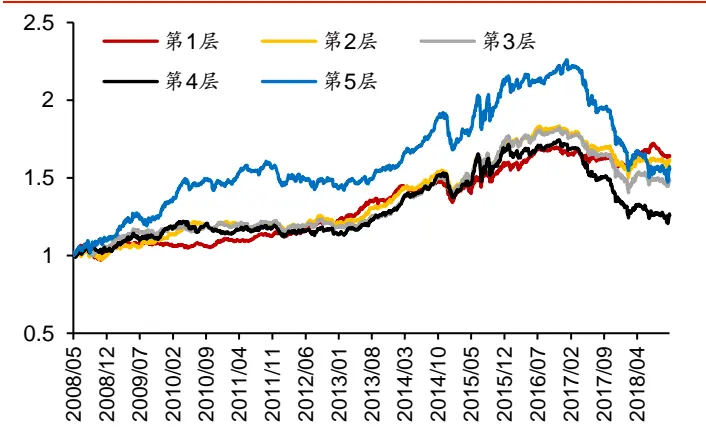
资料来源：Wind，华泰证券研究所

图表52： 历史收益率半衰加权复合财务质量因子累积 RankIC和收益率
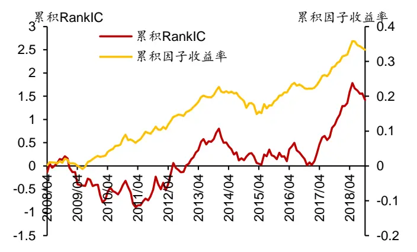
资料来源：Wind，华泰证券研究所

为了更加直观地看出复合因子中各因子占比变化，我们绘制了复合因子中细分因子的权重变化图，如图表 53 所示。

图表53： 历史收益率半衰加权财务质量细分因子权重变化趋势图（12个月移动平均）
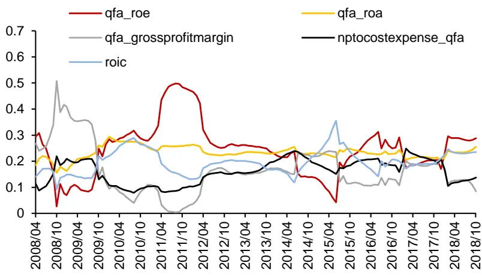
资料来源：Wind，华泰证券研究所

qfa_roe 和 qfa_grossprofitmargin 因 子 出 现 了 权 重 约 为 0.5 的 峰 值 ， qfa_roa 、nptocostexpense_qfa、roic 因子的权重长期较稳定。

为了衡量各合成方法的稳定性，图表 54 中计算了每期细分因子权重的变化值，图表 55 中计算了 t期复合因子和 t+1 期复合因子之间的相关系数。

图表54： 各合成方法前后两期财务质量因子权重变化值（12个月移动平均）
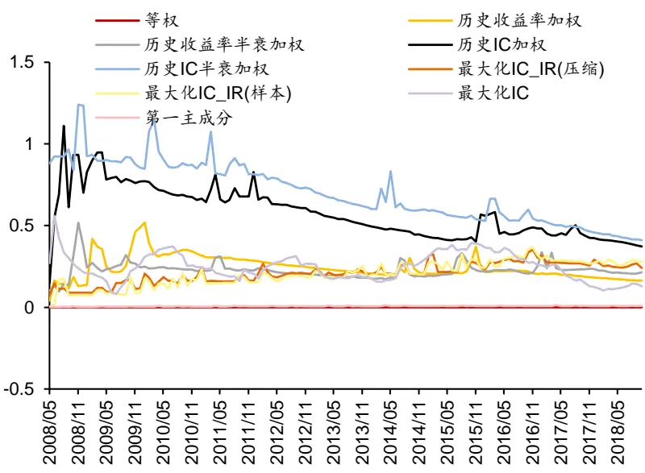
资料来源：Wind，华泰证券研究所

图表55： 各合成方法前后两期复合财务质量因子相关系数（12个月移动平均）
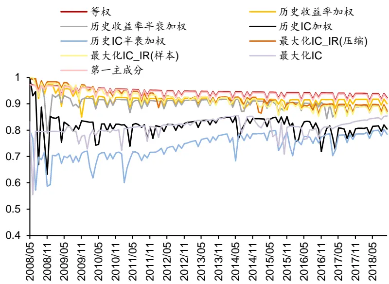
资料来源：Wind，华泰证券研究所

从图表 54 和 55 中都可以看出，最大化 IC、历史 IC（半衰）加权的稳定性最低，第一主成分、历史收益率（半衰）加权、最大化 IC_IR 复合因子的稳定性都较高，等权复合因子与第一主成分因子接近。

## 参数敏感性分析

在最大化 IC_IR 法中，对下一期 IC的预测使用了过去 12 个月的历史 IC 的均值，对 IC 协方差矩阵的估计使用了过去 12 个月的历史 IC 值。在本节中，我们将调整时间窗口参数T=3，6，9，12，24，36（单位：月）并进行测试，以寻找最优的时间窗口参数。

最大化 IC_IR 法（样本）
图表56： 最大化 IC_IR复合因子（样本）在全 A股内回归法、IC值分析结果汇总（行业中性、市值中性）

|  |  |  |  |  | Rank IC 均值 | Rank IC 标准差 |  | IC_IR IC>0 占比 |
| --- | --- | --- | --- | --- | --- | --- | --- | --- |
| 因子名称 | 因子含义 | It\|均值 It\|>2 占比 | t均值 | 因子收益率 均值 |  |  |  |  |
| 估值因子合成 |  |  |  |  |  |  |  |  |
| fac_eqwt | 等权复合因子 | 4.86 78.64% | 2.04 | 0.39% | 3.21% | 17.07% | 0.19 | 58.25% |
| fac_icir_samp_3 | 最大化 IC_IR复合因子（T=3） | 4.30 66.99% | 2.09 | 0.38% | 3.07% | 15.39% | 0.20 | 57.28% |
| fac_icir_samp_6 | 最大化 IC_IR 复合因子（T=6） | 4.67 74.76% | 1.98 | 0.38% | 4.00% | 16.13% | 0.25 | 59.22% |
| fac_icir_samp_9 | 最大化 IC_IR 复合因子（T=9） | 4.61 69.90% | 2.11 | 0.40% | 4.07% | 16.11% | 0.25 | 62.14% |
| fac_icir_samp_12 | 最大化IC_IR 复合因子（T=12） | 4.75 72.82% | 2.10 | 0.39% | 4.04% | 15.88% | 0.25 | 63.11% |
| fac_icir_samp_24 | 最大化 IC_IR复合因子（T=24） | 4.76 70.87% | 1.90 | 0.36% | 3.20% | 16.20% | 0.20 | 59.22% |
| fac_icir_samp_36 | 最大化IC_IR复合因子（T=36） | 4.70 76.70% | 1.64 | 0.31% | 2.94% | 16.24% | 0.18 | 59.22% |
| 成长因子合成 |  |  |  |  |  |  |  |  |
| fac_eqwt | 等权复合因子 | 3.41 65.05% |  | 1.91 0.32% | 3.02% | 9.37% | 0.32 | 62.14% |
| fac_icir_samp_3 | 最大化 IC_IR复合因子（T=3） | 2.52 50.49% |  | 1.49 0.25% | 2.27% | 7.40% | 0.31 | 65.05% |
| fac_icir_samp_6 | 最大化 IC_IR 复合因子（T=6） | 3.19 60.19% |  | 2.01 0.33% | 3.30% | 8.84% | 0.37 | 62.14% |
| fac_icir_samp_9 | 最大化 IC_IR 复合因子（T=9） | 2.82 47.57% |  | 1.90 0.31% | 3.10% | 8.70% | 0.36 | 58.25% |
| fac_icir_samp_12 | 最大化IC_IR 复合因子（T=12） | 3.25 59.22% |  | 2.25 0.37% | 3.62% | 9.32% | 0.39 | 61.17% |
| fac_icir_samp_24 | 最大化IC_IR 复合因子（T=24） | 2.71 51.46% |  | 1.87 0.31% | 3.13% | 8.39% | 0.37 | 64.08% |
| fac_icir_samp_36 | 最大化 IC_IR 复合因子（T=36） | 3.15 57.28% |  | 2.13 0.35% | 3.65% | 9.04% | 0.40 | 62.14% |
| 动量反转因子合成 |  |  |  |  |  |  |  | 0.63 |
| fac_eqwt | 等权复合因子 | 4.80 | 69.90% | 3.13 | 0.60% | 9.03% 14.34% |  | 71.85% |
| fac_icir_samp_3 | 最大化 IC_IR复合因子（T=3） | 4.30 67.96% |  | 2.98 0.57% | 8.46% | 11.86% | 0.71 | 77.67% |
| fac_icir_samp_6 | 最大化 IC_IR复合因子（T=6） | 4.28 | 62.14% | 3.00 0.58% | 8.50% | 12.21% | 0.70 | 75.73% |
| fac_icir_samp_9 | 最大化 IC_IR 复合因子（T=9） | 4.05 | 63.11% | 3.07 0.57% | 8.70% | 10.98% | 0.79 | 78.64% |
| fac_icir_samp_12 | 最大化 IC_IR复合因子（T=12） | 4.40 | 65.05% | 3.29 0.62% | 9.37% | 12.55% | 0.75 | 77.67% |
| fac_icir_samp_24 | 最大化 IC_IR 复合因子（T=24） | 4.31 | 66.02% | 3.32 0.63% | 9.21% | 12.36% | 0.75 | 74.76% |
| fac_icir_samp_36 | 最大化 IC_IR复合因子（T=36） | 4.41 | 66.02% | 3.35 0.63% | 9.23% | 12.87% | 0.72 | 75.73% |
| 换手率因子合成 |  |  |  |  |  |  |  |  |
| fac_eqwt | 等权复合因子 | 4.90 | 75.73% | 3.14 | 0.53% 7.77% | 13.90% | 0.56 | 73.79% |
| fac_icir_samp_3 | 最大化 IC_IR复合因子（T=3） | 4.00 | 68.93% | 2.73 | 0.46% 7.71% | 11.86% | 0.65 | 72.82% |
| fac_icir_samp_6 | 最大化 IC_IR复合因子（T=6） | 4.33 | 71.85% | 2.69 | 0.45% 7.31% | 12.75% | 0.57 | 73.79% |
| fac_icir_samp_9 | 最大化 IC_IR 复合因子（T=9） | 3.96 | 73.79% | 2.61 | 0.41% 7.25% | 11.30% | 0.64 | 75.73% |
| fac_icir_samp_12 | 最大化 IC_IR复合因子（T=12） | 4.11 | 69.90% | 2.68 | 0.43% 7.44% | 12.06% | 0.62 | 75.73% |
| fac_icir_samp_24 | 最大化IC_IR 复合因子（T=24） | 4.13 | 74.76% | 2.69 | 0.42% 7.73% | 11.72% | 0.66 | 76.70% |
| fac_icir_samp_36 | 最大化 IC_IR 复合因子（T=36） | 4.32 | 69.90% | 2.80 | 0.45% 7.77% | 12.25% | 0.63 | 73.79% |
| 波动率因子合成 |  |  |  |  |  |  |  |  |
| fac_eqwt | 等权复合因子 | 5.28 | 74.76% | 2.59 | 0.49% | 7.97% 16.77% | 0.48 | 67.96% |
| fac_icir_samp_3 | 最大化 IC_IR复合因子（T=3） | 4.33 | 73.79% | 2.02 | 0.34% 6.81% | 14.14% | 0.48 | 70.87% |
| fac_icir_samp_6 | 最大化 IC_IR复合因子（T=6） | 4.62 | 73.79% | 2.23 | 0.40% 7.50% | 14.87% | 0.50 | 69.90% |
| fac_icir_samp_9 | 最大化 IC_IR 复合因子（T=9） | 4.11 | 70.87% | 2.42 | 0.41% 8.13% | 12.59% | 0.65 | 74.76% |
| fac_icir_samp_12 | 最大化 IC_IR复合因子（T=12） | 4.47 | 72.82% | 2.37 | 0.41% 7.72% | 14.15% | 0.55 | 71.85% |
| fac_icir_samp_24 | 最大化 IC_IR 复合因子（T=24） | 4.11 | 67.96% | 2.49 | 0.42% 8.32% | 12.75% | 0.65 | 74.76% |
| fac_icir_samp_36 财务质量因子合成 | 最大化 IC_IR复合因子（T=36） | 4.33 | 69.90% | 2.56 | 0.45% 8.53% | 13.32% | 0.64 | 73.79% |

资料来源：Wind，华泰证券研究所

图表57： 最大化 IC_IR复合因子（样本）在全 A股内分层测试法结果汇总（分五层，行业中性、市值中性）

| 因子名称 | 因子含义 | 多空组合 分层组合1～5（从左到右）年化收益率 |  |  |  |  |  | 多空组合 | 多空组合 | 多空组合 |  |
| --- | --- | --- | --- | --- | --- | --- | --- | --- | --- | --- | --- |
|  |  |  |  |  |  |  |  | 年化收益率 夏普比率 | 最大回撤 |  | 月胜率 |
| 估值因子合成 |  |  | 7.15% |  | 4.17% | 0.65% | 0.47% |  |  |  |  |
| fac_eqwt fac_icir_samp_3 | 等权复合因子 最大化 IC_IR 复合因子 | (T=3) | 6.27% | 4.13% 3.50% | 1.38% | 1.11% | -0.84% | 6.10% 6.75% | 0.68 0.82 | 20.93% 17.66% | 54.90% 55.88% |
|  |  |  | 6.30% | 4.48% | 1.82% | 0.21% | -0.47% |  |  |  |  |
| fac_icir_samp_6 | 最大化 IC_IR 复合因子 | (T=6) |  | 5.17% | 1.61% |  |  | 6.43% | 0.79 | 20.86% | 55.88% |
| fac_icir_samp_9 | 最大化 IC_IR复合因子（T=9） |  | 7.72% |  |  | 0.92% | -1.64% | 9.12% | 1.11 | 18.21% | 55.88% |
| fac_icir_samp_12 | 最大化IC_IR 复合因子 | (T=12) | 8.00% | 5.21% | 2.28% | 0.53% | -1.69% | 9.43% | 1.15 | 17.93% | 55.88% |
|  | fac_icir_samp_24最大化 IC_IR 复合因子（T=24） |  | 6.87% 7.52% | 5.12% 5.25% | 2.34% 2.19% | 0.70% | -1.02% | 7.55% | 0.92 | 18.99% | 55.88% |
|  | fac_icir_samp_36最大化 IC_IR 复合因子（T=36） |  |  |  |  | 0.25% | -0.88% | 8.04% | 0.97 | 19.04% | 55.88% |
| 成长因子合成 |  |  |  |  |  |  |  |  |  |  |  |
| fac_eqwt | 等权复合因子 |  | 6.16% | 5.76% | 2.89% | 1.47% | -0.09% | 6.15% | 1.20 | 13.47% | 57.84% |
| fac_icir_samp_3 | 最大化 IC_IR 复合因子（T=3） |  | 5.65% | 2.40% | 1.70% | -0.14% | -0.54% | 6.09% | 1.32 | 6.15% | 62.75% |
| fac_icir_samp_6 | 最大化 IC_IR 复合因子 | (T=6) | 6.57% | 3.59% | 1.82% | -0.86% | -0.01% | 6.44% | 1.28 | 7.45% | 58.82% |
| fac_icir_samp_9 | 最大化 IC_IR 复合因子 | (T=9) | 6.34% | 4.67% | 2.02% | -0.01% | -1.46% | 7.73% | 1.55 | 9.67% | 66.67% |
| fac_icir_samp_12 | 最大化 IC_IR 复合因子 | (T=12) | 7.62% | 4.81% | 1.84% | -0.92% | -1.17% | 8.70% | 1.66 | 10.58% | 65.69% |
|  | fac_icir_samp_24最大化 IC_IR 复合因子 | (T=24) | 6.75% | 5.40% | 1.69% | -0.51% | -1.20% | 7.86% | 1.56 | 7.56% | 63.73% |
| fac_icir_samp_36 | 最大化 IC_IR 复合因子 | (T=36) | 8.33% | 4.40% | 2.46% | -1.20% | -1.10% | 9.38% | 1.76 | 7.85% | 66.67% |
| 动量反转因子合成 |  |  |  |  |  |  |  |  |  |  |  |
| fac_eqwt | 等权复合因子 |  | 7.48% | 5.04% | 4.99% | -0.37% | -9.77% | 18.83% | 2.09 | 12.72% | 72.55% |
| fac_icir_samp_3 | 最大化IC_IR 复合因子（T=3） |  | 6.53% | 5.65% | 4.66% | -0.36% | -9.16% | 16.92% | 2.06 | 10.42% | 69.61% |
| fac_icir_samp_6 | 最大化 IC_IR 复合因子 | (T=6) | 6.41% | 5.74% | 4.49% | 0.39% | -9.75% | 17.61% | 2.13 | 8.52% | 71.57% |
| fac_icir_samp_9 | 最大化 IC_IR 复合因子 | (T=9) | 6.67% | 6.60% | 4.53% | 0.22% | -10.55% | 18.80% | 2.34 | 6.90% | 75.49% |
| fac_icir_samp_12 | 最大化 IC_IR复合因子（T=12） |  | 7.31% | 5.59% | 5.21% | -0.26% -10.39% |  | 19.35% | 2.32 | 6.73% | 75.49% |
| fac_icir_samp_24 | 最大化 IC_IR 复合因子 | (T=24) | 6.77% | 6.64% | 5.39% | -0.24% -11.15% |  | 19.84% | 2.42 |  | 71.57% |
| fac_icir_samp_36最大化 IC_IR 复合因子（T=36） |  |  | 7.39% | 5.11% | 5.24% | 0.23% -10.60% |  | 19.70% | 2.36 | 6.27% 7.06% | 75.49% |
| 换手率因子合成 |  |  |  |  |  |  |  |  |  |  |  |
| fac_eqwt | 等权复合因子 |  | 8.38% | 4.26% | 5.14% | 1.39% | -6.44% | 13.88% | 1.67 | 8.17% | 68.63% |
| fac_icir_samp_3 | 最大化 IC_IR复合因子（T=3） |  | 8.53% | 4.33% | 2.46% | 1.01% | -6.72% | 14.75% | 1.95 | 8.39% | 70.59% |
| fac_icir_samp_6 | 最大化 IC_IR 复合因子 | (T=6) | 7.71% | 4.51% | 2.36% | 1.33% | -5.83% | 12.70% | 1.63 | 9.00% | 66.67% |
| fac_icir_samp_9 | 最大化IC_IR 复合因子（T=9） |  | 7.00% | 3.83% | 2.82% | 1.73% | -5.83% | 12.20% | 1.71 | 10.18% | 71.57% |
| fac_icir_samp_12 | 最大化 IC_IR 复合因子 | (T=12) | 7.43% | 4.66% | 2.96% | 1.22% | -5.96% | 12.71% | 1.72 | 9.58% | 70.59% |
| fac_icir_samp_24 | 最大化 IC_IR 复合因子 | (T=24) | 7.04% | 4.51% | 2.40% | 1.45% | -6.00% | 12.38% | 1.70 | 12.56% | 69.61% |
| fac_icir_samp_36最大化 IC_IR 复合因子（T=36） |  |  | 7.27% | 4.50% | 2.84% | 1.63% | -6.13% | 12.65% | 1.67 | 11.24% | 68.63% |
| 波动率因子合成 |  |  |  |  |  |  |  |  |  |  |  |
| fac_eqwt | 等权复合因子 |  | 7.27% | 5.26% | 3.95% | 0.18% | -6.03% | 12.04% | 1.20 | 12.14% | 59.80% |
| fac_icir_samp_3 | 最大化 IC_IR 复合因子（T=3） |  | 5.50% | 3.95% | 3.58% | -0.29% | -5.26% | 10.06% | 1.16 | 9.98% | 65.69% |

资料来源：Wind，华泰证券研究所

根据图表 56 和 57，我们综合了因子收益率、IC_IR、多空组合年化收益率、多空组合夏普比率，选出了每组合成效果最好的复合因子，可以看出，T=12 或 24 时，大部分因子合成的结果在所有参数 T 里表现最好，并且都能战胜等权复合因子。在较少情况下，T=6，9，36 时表现更好。

## 最大化 IC_IR法（压缩）

图表58： 最大化 IC_IR复合因子（压缩）在全 A股内回归法、IC值分析敏感性测试结果汇总（行业中性、市值中性）

| 因子名称 因子含义 |  |  |  | 因子收益率 |  | Rank IC | Rank IC | IC_IR IC>0 占比 |  |
| --- | --- | --- | --- | --- | --- | --- | --- | --- | --- |
|  |  | \|t\|均值 \|t\|>2 占比 |  | t 均值 | 均值 标准差 |  |  |  |  |
| 估值因子参数敏感性测试 |  |  |  |  | 均值 |  |  |  |  |
| fac_eqwt | 等权复合因子 | 4.86 | 78.64% | 2.04 | 0.39% | 3.21% | 17.07% | 0.19 | 58.25% |
| fac_icir1_3 | 最大化 IC_IR复合因子（T=3） | 4.49 | 68.93% | 2.14 | 0.37% | 3.50% | 15.94% | 0.22 | 59.22% |
| fac_icir1_6 | 最大化 IC_IR复合因子（T=6） | 4.72 | 73.79% | 2.12 | 0.40% | 4.22% | 16.34% | 0.26 | 62.14% |
| fac_icir1_9 | 最大化 IC_IR 复合因子（T=9） | 4.72 | 71.85% | 2.18 | 0.41% | 4.19% | 16.25% | 0.26 | 63.11% |
| fac_icir1_12 | 最大化 IC_IR 复合因子（T=12） | 4.88 | 74.76% | 2.17 | 0.40% | 4.28% | 16.29% | 0.26 | 63.11% |
| fac_icir1_24 | 最大化 IC_IR 复合因子（T=24） | 4.78 | 72.82% | 1.87 | 0.36% | 3.18% | 16.21% | 0.20 | 58.25% |
| fac_icir1_36 | 最大化 IC_IR 复合因子（T=36） | 4.73 | 74.76% | 1.70 | 0.32% | 3.07% | 16.33% | 0.19 | 59.22% |
| 成长因子参数敏感性测试 |  |  |  |  |  |  |  |  |  |
| fac_eqwt | 等权复合因子 | 3.41 | 65.05% | 1.91 | 0.32% | 3.02% | 9.37% | 0.32 | 62.14% |
| fac_icir1_3 | 最大化 IC_IR 复合因子（T=3） | 3.19 | 60.19% | 2.01 | 0.33% | 3.30% | 8.84% | 0.37 | 62.14% |
| fac_icir1_6 | 最大化 IC_IR 复合因子（T=6） | 3.25 | 59.22% | 2.25 | 0.37% | 3.62% | 9.32% | 0.39 | 61.17% |
| fac_icir1_9 | 最大化IC_IR 复合因子（T=9） | 3.15 | 57.28% | 2.13 | 0.35% | 3.65% | 9.04% | 0.40 | 62.14% |
| fac_icir1_12 | 最大化 IC_IR复合因子（T=12） | 3.10 | 57.28% | 1.97 | 0.32% | 3.37% | 8.98% | 0.37 | 60.19% |
| fac_icir1_24 | 最大化 IC_IR复合因子（T=24） | 3.13 | 53.40% | 1.99 | 0.33% | 3.25% | 9.32% | 0.35 | 59.22% |
| fac_icir1_36 | 最大化 IC_IR 复合因子（T=36） | 3.02 | 59.22% | 1.99 | 0.33% | 3.48% | 8.75% | 0.40 | 65.05% |
| 动量反转因子参数敏感性测试 |  |  |  |  |  |  |  |  |  |
| fac_eqwt | 等权复合因子 | 4.80 | 69.90% | 3.13 | 0.60% | 9.03% | 14.34% | 0.63 | 71.85% |
| fac_icir1_3 | 最大化 IC_IR复合因子（T=3） | 4.28 | 62.14% | 3.00 | 0.58% | 8.50% | 12.21% | 0.70 | 75.73% |
| fac_icir1_6 | 最大化IC_IR 复合因子（T=6） | 4.40 | 65.05% | 3.29 | 0.62% | 9.37% | 12.55% | 0.75 | 77.67% |
| fac_icir1_9 | 最大化 IC_IR 复合因子（T=9） | 4.41 | 66.02% | 3.35 | 0.63% | 9.23% | 12.87% | 0.72 | 75.73% |
| fac_icir1_12 | 最大化IC_IR 复合因子（T=12） | 4.39 | 65.05% | 3.35 | 0.63% | 9.37% | 12.74% | 0.74 | 74.76% |
| fac_icir1_24 | 最大化IC_IR复合因子（T=24） | 4.38 | 67.96% | 3.42 | 0.66% | 8.97% | 12.15% | 0.74 | 72.82% |
| fac_icir1_36 | 最大化 IC_IR 复合因子（T=36） | 4.36 | 67.96% | 3.45 | 0.67% | 8.75% | 12.57% | 0.70 | 68.93% |
| 换手率因子参数敏感性测试 |  |  |  |  |  |  |  |  |  |
| fac_eqwt | 等权复合因子 | 4.90 | 75.73% | 3.14 | 0.53% | 7.77% | 13.90% | 0.56 | 73.79% |
| fac_icir1_3 | 最大化 IC_IR 复合因子（T=3） | 4.33 | 71.85% | 2.69 | 0.45% | 7.31% | 12.75% | 0.57 | 73.79% |
| fac_icir1_6 | 最大化 IC_IR复合因子（T=6） | 4.11 | 69.90% | 2.68 | 0.43% | 7.44% | 12.06% | 0.62 | 75.73% |
| fac_icir1_9 | 最大化 IC_IR复合因子（T=9） | 4.32 | 69.90% | 2.80 | 0.45% | 7.77% | 12.25% | 0.63 | 73.79% |
| fac_icir1_12 | 最大化IC_IR 复合因子（T=12） | 4.26 | 65.05% | 2.87 | 0.46% | 7.96% | 12.45% | 0.64 | 76.70% |
| fac_icir1_24 | 最大化IC_IR 复合因子（T=24） | 4.36 | 71.85% | 2.87 | 0.46% | 7.72% | 12.99% | 0.59 | 75.73% |
| fac_icir1_36 | 最大化IC_IR 复合因子（T=36） | 3.95 | 68.93% | 2.80 | 0.45% | 8.12% | 11.47% | 0.71 | 76.70% |
| 波动率因子参数敏感性测试 |  |  |  |  |  |  |  |  |  |
| fac_eqwt | 等权复合因子 | 5.28 | 74.76% | 2.59 | 0.49% | 7.97% | 16.77% | 0.48 | 67.96% |
| fac_icir1_3 | 最大化 IC_IR 复合因子（T=3） 最大化 IC_IR 复合因子（T=6） | 4.62 4.47 | 73.79% 72.82% | 2.23 2.37 | 0.40% 0.41% | 7.50% 7.72% | 14.87% 14.15% | 0.50 0.55 | 69.90% 71.85% |

资料来源：Wind，华泰证券研究所

图表59： 最大化 IC_IR复合因子（样本）在全 A股内分层测试法结果汇总（分五层，行业中性、市值中性）

|  |  | 多空组合 |  |  |  |  |  |  |  |
| --- | --- | --- | --- | --- | --- | --- | --- | --- | --- |
| 因子名称 | 因子含义 | 分层组合1～5（从左到右）年化收益率 |  |  |  |  |  | 年化收益率 夏普比率最大回撤 | 月胜率 |
| 估值因子合成 |  |  |  |  |  |  |  |  |  |
| fac_eqwt | 等权复合因子 | 7.15% | 4.13% | 4.17% | 0.65% 0.47% | 6.10% | 0.68 | 20.93% | 54.90% |
| fac_icir1_3 | 最大化 IC_IR 复合因子（T=3） | 6.30% | 4.48% | 1.82% | 0.21% -0.47% | 6.43% | 0.79 | 20.86% | 55.88% |
| fac_icir1_6 | 最大化 IC_IR 复合因子 (T=6) | 8.00% | 5.21% | 2.28% | 0.53% -1.69% | 9.43% | 1.15 | 17.93% | 55.88% |
| fac_icir1_9 | 最大化IC_IR 复合因子（T=9） | 7.52% | 5.25% | 2.19% | 0.25% -0.88% | 8.04% | 0.97 | 19.04% | 55.88% |
| fac_icir1_12 | 最大化 IC_IR 复合因子（T=12） | 7.58% | 5.41% | 2.35% | 1.27% -1.81% | 9.12% | 1.11 | 18.21% | 56.86% |
| fac_icir1_24 | 最大化 IC_IR 复合因子 (T=24) | 6.55% | 4.72% | 2.44% | 1.39% -0.25% | 6.43% | 0.79 | 18.21% | 53.92% |
| fac_icir1_36 | 最大化 IC_IR 复合因子（T=36） | 6.27% | 4.49% | 2.78% | 1.35% | 0.03% 5.87% | 0.73 | 19.39% | 57.84% |
| 成长因子合成 |  |  |  |  |  |  |  |  |  |
| fac_eqwt | 等权复合因子 | 6.16% | 5.76% | 2.89% | 1.47% -0.09% | 6.15% | 1.20 | 13.47% | 57.84% |
| fac_icir1_3 | 最大化 IC_IR复合因子（T=3） | 6.57% | 3.59% | 1.82% | -0.86% -0.01% | 6.44% | 1.28 | 7.45% | 58.82% |
| fac_icir1_6 | 最大化 IC_IR 复合因子（T=6） | 7.62% | 4.81% | 1.84% | -0.92% | -1.17% 8.70% | 1.66 | 10.58% | 65.69% |
| fac_icir1_9 | 最大化 IC_IR 复合因子（T=9） | 8.33% | 4.40% | 2.46% | -1.20% | -1.10% 9.38% | 1.76 | 7.85% | 66.67% |
| fac_icir1_12 | 最大化IC_IR 复合因子（T=12） | 7.24% | 4.69% | 3.26% | -1.00% | -1.05% 8.20% | 1.57 | 9.04% | 64.71% |
| fac_icir1_24 | 最大化 IC_IR 复合因子（T=24） | 7.88% | 5.50% | 2.87% | -1.59% | -0.87% 8.59% | 1.55 | 7.07% | 61.77% |
| fac_icir1_36 | 最大化IC_IR 复合因子（T=36） | 7.43% | 5.87% | 2.85% | -0.17% -1.23% | 8.60% | 1.64 | 8.40% | 63.73% |
| 动量反转因子合成 |  |  |  |  |  |  |  |  |  |
| fac_eqwt | 等权复合因子 | 7.48% | 5.04% | 4.99% | -0.37% | -9.77% | 18.83% | 2.09 12.72% | 72.55% |
| fac_icir1_3 | 最大化 IC_IR 复合因子（T=3） | 6.41% | 5.74% | 4.49% | 0.39% | -9.75% | 17.61% 2.13 | 8.52% | 71.57% |
| fac_icir1_6 | 最大化 IC_IR 复合因子 (T=6) | 7.31% | 5.59% | 5.21% | -0.26% | -10.39% | 19.35% 2.32 | 6.73% | 75.49% |
| fac_icir1_9 | 最大化 IC_IR 复合因子 (T=9) | 7.39% | 5.11% | 5.24% | 0.23% -10.60% |  | 19.70% 2.36 | 7.06% | 75.49% |
| fac_icir1_12 | 最大化IC_IR 复合因子（T=12） | 7.31% | 5.49% | 5.38% | -0.43%-10.35% |  | 19.36% 2.33 | 7.50% | 71.57% |
| fac_icir1_24 | 最大化 IC_IR 复合因子 (T=24) | 6.94% | 5.50% | 5.28% | 0.44%-10.64% | 19.29% | 2.36 | 8.44% | 73.53% |
| fac_icir1_36 | 最大化 IC_IR 复合因子（T=36） | 6.56% | 6.18% | 4.54% | 0.27%-10.12% | 18.04% | 2.23 | 8.87% | 71.57% |
| 换手率因子合成 |  |  |  |  |  |  |  |  |  |
| fac_eqwt | 等权复合因子 | 8.38% | 4.26% | 5.14% | 1.39% -6.44% | 13.88% | 1.67 | 8.17% | 68.63% |
| fac_icir1_3 | 最大化 IC_IR复合因子（T=3） | 7.71% | 4.51% | 2.36% | 1.33% | -5.83% 12.70% | 1.63 | 9.00% | 66.67% |
| fac_icir1_6 | 最大化 IC_IR 复合因子 (T=6) | 7.43% | 4.66% | 2.96% | 1.22% -5.96% | 12.71% | 1.72 | 9.58% | 70.59% |
| fac_icir1_9 | 最大化 IC_IR 复合因子（T=9） | 7.27% | 4.50% | 2.84% | 1.63% | -6.13% | 12.65% 1.67 | 11.24% | 68.63% |
| fac_icir1_12 | 最大化IC_IR 复合因子（T=12） | 7.22% | 4.58% | 2.34% | 1.96% | -6.27% 12.74% | 1.68 | 11.12% | 70.59% |
| fac_icir1_24 | 最大化 IC_IR 复合因子（T=24） | 6.79% | 5.10% | 2.39% | 1.73% | -6.24% 12.29% | 1.58 | 13.08% | 70.59% |
| fac_icir1_36 | 最大化 IC_IR 复合因子（T=36） | 7.37% | 5.39% | 2.30% | 1.21% | -6.85% | 13.84% | 1.92 11.45% | 70.59% |
| 波动率因子合成 |  |  |  |  |  |  |  |  |  |
| fac_eqwt | 等权复合因子 | 7.27% | 5.26% | 3.95% | 0.18% | -6.03% 12.04% | 1.20 | 12.14% | 59.80% |
| fac_icir1_3 | 最大化 IC_IR 复合因子（T=3） | 7.38% | 3.84% | 3.25% | -0.05% | -6.25% 13.00% | 1.43 | 11.86% | 66.67% |
| fac_icir1_6 | 最大化 IC_IR 复合因子 (T=6) | 6.96% | 4.14% | 3.03% | -0.23% | -6.47% 12.99% | 1.50 | 11.02% | 67.65% |
| fac_icir1_9 | 最大化IC_IR 复合因子（T=9） | 7.60% | 4.37% | 3.70% | -0.43% | -7.58% 15.09% | 1.77 | 9.68% | 69.61% |
| fac_icir1_12 | 最大化 IC_IR 复合因子（T=12） | 7.28% | 4.75% | 3.50% | -1.29% | -6.77% 14.01% | 1.75 | 8.41% | 69.61% |
| fac_icir1_24 | 最大化 IC_IR 复合因子（T=24） | 6.87% | 4.67% | 3.73% | -1.12% | -6.80% 13.66% | 1.77 | 8.74% | 70.59% |
| fac_icir1_36 | 最大化 IC_IR 复合因子（T=36） | 6.94% | 4.58% | 3.67% | -1.30% | -6.79% | 13.76% | 1.82 7.90% | 71.57% |
| 财务质量因子合成 2.75% |  |  |  |  |  |  |  | 20.37% 52.94% | 0.75 |

资料来源：Wind，华泰证券研究所

根据图表 58 和 59，我们综合了因子收益率、IC_IR、多空组合年化收益率、多空组合夏普比率，选出了每组合成效果最好的复合因子。在回归法和 IC法测试中，T=12 在大部分合成中能得到最好的效果，在分层测试法中，分别有两组合成中 T=9 或 36 表现最好，另有一组因子在 T=6 或 24 时表现最好，亦都能战胜等权复合因子。

## 总结

1. 本报告介绍了常见的因子合成方法，包括等权复合因子、最大化复合因子 IC_IR、最大化复合因子 IC、历史收益率（半衰）加权、历史 IC（半衰）加权、主成分分析法，并分别对估值因子、成长因子、动量反转因子、换手率因子、波动率因子、财务质量因子进行了合成及单因子测试。根据测试结果，因子合成基本能使得复合因子具有优于原始因子的选股能力。

2. 对于大多数因子组合来说，最大化 IC_IR 或最大化 IC 复合因子能提高复合因子的因子收益率及其显著性，多空组合的年化收益率较高，最大回撤也有所降低。在某些情况下，历史收益率（半衰）加权复合因子表现也较好。实际应用中采取哪种合成方法，需结合具体的合成因子决定。其中历史收益率（半衰）加权和历史 IC（半衰）加权的表现也受其他因素影响，与半衰期参数和历史回看期窗口参数有关，结果不能一概而论。

3. 从合成的稳定性来看，等权法无疑是最稳定的，每期的权重都相同。除等权法外，主成分分析、最大化 IC_IR 法的稳定性也较高，表现在每期细分因子权重变化较小和复合因子值前后两期的相关系数较大，而相比之下，最大化 IC、历史 IC（半衰）加权的稳定性稍低。

4. 从参数敏感性分析来看，在 T=3 时因子合成的效果较差，甚至不能战胜等权复合因子，因为时间窗口过短，历史数据不足以对未来 IC 值和 IC协方差矩阵形成准确预测。大部分因子组合在选取 T=12 时就能得到较好的合成效果，也有一部分因子组合采用 T=9、24 或36 时能得到最佳的合成效果。

5. 相关性过大的因子在合成时容易造成因子的协方差矩阵估计不准确，从而对最大化IC_IR 的结果产生影响。相关性极强的因子建议采用主成分分析法，有一定相关性的因子往往也意义相近，采用最大化 IC 的方法可以战胜等权复合因子。因子合成的数目不宜过多，因为这样会损失较多有效因子的信息，本文均采用同一类别的因子进行合成，在保有一定相关性的同时进行合成，数目较少但效果较好，本文选取的合成因子组合基本都得到了表现更好的复合因子。

## 风险提示

因子合成方法的回测结果是历史经验的总结，如果市场环境改变，各方法的对比效果可能发生变化。本文所列的因子合成方法只是比较常见的几个，没有囊括全部合成方法，可能存在回测效果更好的方法。因子合成在多因子选股模型构建过程中不是必备的步骤，读者可以自行斟酌，构建适合自己的多因子选股模型。

## 免责申明

收到本报告而视其为客户。

本报告基于本公司认为可靠的、已公开的信息编制，但本公司对该等信息的准确性及完整性不作任何保证。本报告所载的意见、评估及预测仅反映报告发布当日的观点和判断。在不同时期，本公司可能会发出与本报告所载意见、评估及预测不一致的研究报告。同时，本报告所指的证券或投资标的的价格、价值及投资收入可能会波动。本公司不保证本报告所含信息保持在最新状态。本公司对本报告所含信息可在不发出通知的情形下做出修改，投资者应当自行关注相应的更新或修改。

本公司力求报告内容客观、公正，但本报告所载的观点、结论和建议仅供参考，不构成所述证券的买卖出价或征价。该等观点、建议并未考虑到个别投资者的具体投资目的、财务状况以及特定需求，在任何时候均不构成对客户私人投资建议。投资者应当充分考虑自身特定状况，并完整理解和使用本报告内容，不应视本报告为做出投资决策的唯一因素。对依据或者使用本报告所造成的一切后果，本公司及作者均不承担任何法律责任。任何形式的分享证券投资收益或者分担证券投资损失的书面或口头承诺均为无效。

本公司及作者在自身所知情的范围内，与本报告所指的证券或投资标的不存在法律禁止的利害关系。在法律许可的情况下，本公司及其所属关联机构可能会持有报告中提到的公司所发行的证券头寸并进行交易，也可能为之提供或者争取提供投资银行、财务顾问或者金融产品等相关服务。本公司的资产管理部门、自营部门以及其他投资业务部门可能独立做出与本报告中的意见或建议不一致的投资决策。

本报告版权仅为本公司所有。未经本公司书面许可，任何机构或个人不得以翻版、复制、发表、引用或再次分发他人等任何形式侵犯本公司版权。如征得本公司同意进行引用、刊发的，需在允许的范围内使用，并注明出处为“华泰证券研究所”，且不得对本报告进行任何有悖原意的引用、删节和修改。本公司保留追究相关责任的权力。所有本报告中使用的商标、服务标记及标记均为本公司的商标、服务标记及标记。

本公司具有中国证监会核准的“证券投资咨询”业务资格，经营许可证编号为：91320000704041011J。

全资子公司华泰金融控股（香港）有限公司具有香港证监会核准的“就证券提供意见”业务资格，经营许可证编号为：AOK809

©版权所有 2019年华泰证券股份有限公司

## 评级说明

## 行业评级体系

－报告发布日后的6个月内的行业涨跌幅相对同期的沪深300指数的涨跌幅为基准；

－投资建议的评级标准

增持行业股票指数超越基准 中性行业股票指数基本与基准持平 减持行业股票指数明显弱于基准

## 公司评级体系

－报告发布日后的6个月内的公司涨跌幅相对同期的沪深300指数的涨跌幅为基准；
－投资建议的评级标准
买入股价超越基准 20%以上
增持股价超越基准 5%-20%
中性股价相对基准波动在-5%~5%之间
减持股价弱于基准 5%-20%
卖出股价弱于基准 20%以上

## 华泰证券研究

## 南京

南京市建邺区江东中路228号华泰证券广场1号楼/邮政编码：210019

电话：86 25 83389999 /传真：86 25 83387521

电子邮件：ht-rd@htsc.com

## 深圳

深圳市福田区益田路5999号基金大厦10楼/邮政编码：518017

电话：86 755 82493932 /传真：86 755 82492062

电子邮件：ht-rd@htsc.com

## 北京

北京市西城区太平桥大街丰盛胡同28号太平洋保险大厦A座18层

邮政编码：100032

电话：86 10 63211166/传真：86 10 63211275

电子邮件：ht-rd@htsc.com

## 上海

上海市浦东新区东方路18号保利广场E栋23楼/邮政编码：200120

电话：86 21 28972098 /传真：86 21 28972068

电子邮件：ht-rd@htsc.com