## 金工研究/深度研究

2019年06月12日

林晓明 执业证书编号：S0570516010001

研究员 0755-82080134

linxiaoming@htsc.com

陈烨 执业证书编号：S0570518080004

研究员 010-56793942

李子钰 0755-23987436

联系人 liziyu@htsc.com

何康 021-28972039

联系人 hekang@htsc.com

# 桑土之防：结构化多因子风险模型

## 华泰多因子系列之十二

华泰金工多因子风险模型能够实现准确可靠的风险预测和投资组合优化在经典多因子模型框架的基础上，参考 Barra 多因子风险模型，构建华泰金工多因子风险模型。模型选择恰当、有效的共同因子，回归计算因子收益和特异性收益，进而估计因子收益协方差矩阵和特异性收益方差矩阵。之后，模型以波动率偏误统计量作为风险预测准确度的衡量指标，对因子收益协方差矩阵和特异性收益方差矩阵分别进行多步修正，有效提升风险估计的准确度。华泰金工多因子风险模型能够实现准确、可靠的风险预测和投资组合优化。

风险模型对因子收益协方差矩阵和特异性收益方差矩阵分别进行多步修正多因子风险模型将对股票收益协方差矩阵的估计转换为对因子收益协方差矩阵和特异性收益方差矩阵的估计。为了保证风险预测的准确度，模型对因子收益协方差矩阵依次进行 Newey-West 调整、特征值调整和波动率偏误调整，对特异性收益方差矩阵依次进行 Newey-West调整、结构化调整、贝叶斯压缩调整和波动率偏误调整。调整后的风险矩阵风险预测能力良好，在 2011-02-01 至 2019-05-31 区间内，模型对于沪深 300 指数和中证 500指数的预测波动率与真实波动率的相关性为 0.70 和 0.73。

## 应用多因子风险模型构建最小化风险和最大化风险调整后收益组合

组合优化允许投资者精确控制组合风险暴露。在组合优化中应用多因子风险模型，可以构建最小化风险和最大化风险调整后收益组合。本文使用华泰多因子风险模型和 XGBoost 收益模型构建最大化风险调整后主动收益组合，在 2011-02-01 至 2019-05-31 区间内，行业市值中性及持仓上限约束组合的年化超额收益率 17.08%，年化跟踪误差 4.53%，信息比率 3.77，与不使用风险模型相比，信息比率提升 0.20；仅持仓上限约束组合的年化超额收益率 23.24%，年化跟踪误差 5.53%，信息比率 4.20，与不使用风险模型相比，信息比率提升 0.65。

## 考察组合优化主要参数对最优投资组合表现的影响

组合优化主要参数包括：基准指数、股票池、风险厌恶系数、收益模型、约束条件。不同基准指数的跟踪难度可能不同。除了最小化主动风险以外，全 A股选股均比指数成分股内选股效果更好。风险厌恶系数的选取取决于优化目的。当组合优化约束条件较多时，风险厌恶系数调整能力相对有限。收益模型决定了最优组合获取收益的能力。当约束条件过多时，股票选取空间可能为空集或目标函数不收敛，导致截面不可解；当约束条件过少或无约束条件时，组合优化对收益模型和风险模型的估计误差非常敏感，可以根据实际情况放松或增强约束。

风险提示：多因子风险模型是历史经验的总结，如果市场规律改变，存在风险预测滞后、甚至模型彻底失效的可能；报告中的沪深 300 和中证 500指数只是作为常见指数，并不能完全代表 A股市场全部指数的情况，请投资者谨慎、理性地看待。

## 华泰金工多因子风险模型

收益与风险并存，然而投资者往往只专注于追逐高额收益，却忽视了潜在风险可能导致的高额损失。若在追求高额收益的同时加入良好的风险控制，则可以有效提升投资策略的表现。准确的风险预测是风险控制的基石。

马科维茨均值方差模型为风险预测奠定了基础，但是该模型存在明显的局限性。首先，直接利用股票收益率估算股票收益率之间的协方差矩阵，计算量非常大。其次，由于存在估计误差，样本时间长度必须尽可能大于股票数目，否则基于此股票收益协方差矩阵得到的投资组合的风险将被大大低估。

随着对风险模型认识的不断深入，投资组合风险分析体系日趋完善，结构化多因子风险模型成为分析组合风险的有力工具。结构化多因子模型将对于高维股票的收益-风险预测转换为对于低维因子的收益-风险预测，不仅可以大大减少计算量，还能够有效提高风险预测的准确度。

结构化多因子风险模型将股票收益表示为一组共同因子的收益和一个仅与该股票有关的特异性收益的组合：

$$
r_{n}=\sum_{k=1}^{K}X_{nk}f_{k}+u_{n},
$$

$$
r_{n}
$$

$$
X_{nk};
$$

$u_{n};$ 第n只股票的特异性收益率

其中，共同因子收益率与股票特异性收益率不相关，不同股票的特异性收益率不相关。那么，股票收益风险可以解释为共同因子收益风险和特异性收益风险的组合。其中，特异性收益风险代表无法被共同因子解释的收益波动，如某些突发性事件驱动的股价变化、未知的 Alpha 因子等。多因子风险模型将对于股票收益协方差矩阵的估计转换为对于因子收益协方差矩阵和特异性收益方差矩阵的估计：

$$
V=XFX^{T}+\varDelta
$$

V:股票收益率之间的协方差矩阵 X:股票的因子暴露矩阵 
F:因子收益率之间的协方差矩阵 Δ:股票特异性收益方差矩阵

华泰金工在经典多因子模型框架的基础上，参考 Barra 多因子风险模型，构建了华泰金工多因子风险模型。模型选择恰当、有效的共同因子，回归计算因子收益和特异性收益，进而估计因子收益协方差矩阵和特异性收益方差矩阵。之后，模型以波动率偏误统计量作为风险预测准确度的衡量指标，对因子收益协方差矩阵和特异性收益方差矩阵分别进行多步修正，有效提升风险估计的准确度。华泰金工多因子风险模型能够提供准确、可靠的风险预测，投资组合优化和收益-风险归因。

本文作为华泰金工多因子风险模型的第一篇，主要关注风险模型的构建方法以及其在投资组合优化中的应用。首先，本文第一节将介绍风险模型的共同因子选择和因子收益计算方法。其次，第二节将依次介绍因子收益协方差矩阵和特异性收益方差矩阵的估计和调整方法。最后，第三节将考察风险模型用于投资组合优化时的表现。

## 因子选择

选择恰当、有效的共同因子是搭建高质量风险模型的基础。首先，因子必须能够稳定、有效地解释股票收益率。解释效力过弱的因子只能提供非常有限的增量信息，而且这些因子携带的随机噪音，将会直接影响风险预测的稳定性。其次，在涵盖优质因子的基础下，模型需要尽可能精简因子数目，以减少风险预测的工作量并提高风险预测的准确度。

华泰金工多因子风险模型借鉴 Barra 风险模型中的因子分类方式，共选择了 10 个风格因子(fs)、29 个行业因子(fi)和 1 个国家因子(fc)。

图表1： 华泰金工多因子风险模型因子分类
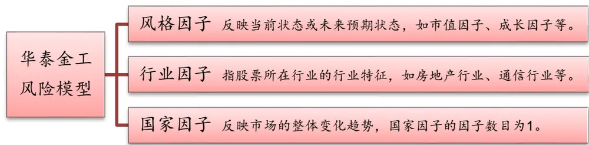
资料来源：华泰证券研究所

## 风格因子

风格因子包含 10 大类基本面因子，依次为 Size，Beta，Momentum，Residual Volatility，Non-linear Size，Book to Price，Liquidity，Earning Yield，Growth，Leverage。其中，部分大类因子表示为若干个子类因子的加权组合，从而在尽可能丰富大类因子信息量的同时解决子类因子可能具有的共线性问题。

图表2： 华泰金工多因子风险模型——风格因子及其描述

| 大类 | 子类 | 因子简要描述 | 因子权重 |
| --- | --- | --- | --- |
| Size | LNCAP | 股票总市值的自然对数 | 1 |
| Beta | BETA | 股票收益率对中证全指收益率的线性回归斜率 | 1 |
| Momentum | RSTR | 历史收益率均值，采用指数加权计算 | 1 |
| Residual Volatility | DASTD | 历史波动率，采用指数加权计算 | 0.74 |
|  | CMRA | 历史收益率的波动幅度 | 0.16 |
|  | HSIGMA | Beta因子计算中线性回归残差项的标准差 | 0.1 |
| Non-linear Size | NLSIZE | Size 因子的三次方对 Size 因子的正交增量 | 1 |
| Book to Price | BTOP | 企业总权益值与当前市值的比值 | 1 |
| Liquidity | STOM | 过去一个月的流动性 | 0.35 |
|  | STOQ | 过去一个季度的流动性 | 0.35 |
|  | STOA | 过去一年的流动性 | 0.3 |
| Earning Yield | ETOP | 过去12个月的市盈率 | 0.66 |
|  | CETOP | 过去12个月的经营性净现金流与市值的比值 | 0.34 |
| Growth | EGRO | 过去5年企业归属母公司净利润的复合增长率 | 0.34 |
|  | SGRO | 过去5年企业营业总收入的复合增长率 | 0.66 |
| Leverage | MLEV | 市场杠杆 | 0.38 |
|  | DTOA | 资产负债率 | 0.35 |
|  | BLEV | 账面杠杆 | 0.27 |

资料来源：华泰证券研究所

## 行业因子

行业因子可以在风格因子之外，为模型提供丰富的增量信息。按照 A 股市场的 29 个中信一级行业分类，模型包含 29 个行业因子，具体为：煤炭、交通运输、房地产、电力及公用事业、机械、电力设备、有色金属、基础化工、商贸零售、建筑、轻工制造、综合、医药、纺织服装、食品饮料、家电、汽车、电子元器件、建材、餐饮旅游、石油石化、国防军工、农林牧渔、钢铁、通信、计算机、非银行金融、传媒、银行。

## 国家因子

传统多因子模型一般只包含风格因子与行业因子，但是在这里，我们参考 Barra 的做法，在多因子风险模型中显式地加入了国家因子：

$$
r_{n}=f_{c}+\sum_{i}X_{ni}f_{i}+\sum_{s}X_{ns}f_{s}+u_{n}
$$

$r_{n};$ 第n只股票的收益率

f:国家因子收益率

$X_{ni};$ 第n只股票在第i个行业因子上的因子暴露（0 或 1）

$f_{i};$ 第i个行业因子的收益率

$X_{ns};$ :第n只股票在第s个风格因子上的因子暴露

$f_{s};$ 第s个风格因子的收益率

$u_{n};$ 第n只股票的特异性收益率

为了消除国家因子与行业因子之间的共线性，模型需要为行业因子加入额外约束：

$$
\sum_{i=1}^{29}w_{i}f_{i}=0
$$

$w_{i}\colon$ 第i个行业的总流通市值在全市场中的占比

f:第i个行业因子收益率

下文中，若无特殊说明，市值均指流通市值。

在模型中加入国家因子不仅不会影响线性回归和模型的解释效力，还会具有以下两点优势。第一，模型加入国家因子，可以将市场效应与行业效应剥离开来，使因子的意义更加直观、纯粹。是否加入国家因子的模型中的行业因子收益率具有如下关系：

$$
\widetilde{f}_{i}=f_{c}+f_{i}
$$

$\widetilde{f}_{l};$ 不加入国家因子的模型中，第i个行业因子的收益率

fc: 国家因子收益率

f:加入国家因子的模型中，第i个行业因子的收益率

在加入国家因子的模型中，国家因子收益代表以市值权重 100%做多全部 A股的投资组合收益率，直接反映市场的整体变化，即市场效应。此时，行业因子收益代表 100%做多该行业，同时 100%做空全部 A股的多空组合收益率，更加纯粹地反映行业效应。

第二，模型加入国家因子，可能使模型对市场变化的敏感性更强。在风险模型中，因子收益协方差矩阵基于一段时间的历史数据，按照指数衰减加权计算得到。计算结果受到历史数据时间窗和权重半衰期的影响。在历史数据时间窗相同的情况下，如果半衰期较长，那么模型对市场变化的响应速度较慢，相反地，如果半衰期较短，那么协方差矩阵的计算很容易受到采样误差的干扰，模型稳定性较差。时间窗和半衰期参数的选取，是在模型敏感性和稳定性之间的权衡。

一般地，采样误差对协方差项的影响远大于其对方差项的影响。因此，一种做法是在因子协方差矩阵计算中，对协方差项和方差项的计算取相同的历史数据时间窗，但是令协方差项的半衰期大于方差项的半衰期，以尽可能兼顾长半衰期带来的稳定性和短半衰期带来的敏感性。例如：Barra USE4 中，二者时间窗相同，协方差计算的半衰期为 504 个交易日，而方差计算的半衰期为 84 个交易日。

是否加入国家因子的模型中的行业因子收益的协方差具有如下关系：

$$
\begin{aligned}cov\big(\widetilde{f_{i1}},\widetilde{f_{i2}}\big)&=var(f_c)+cov(f_c,f_{i1})+cov(f_c,f_{i2})+cov(f_{i1},f_{i2})\\\widetilde{f_{i1}},\widetilde{f_{i2}}&:不加入国家因子的模型中,第i1、i2个行业因子的收益率\\&\quad f_c:国家因子收益率\end{aligned}
$$

f ,f :加入国家因子的模型中，第i1、 i2 个行业因子的收益率

如果协方差项的半衰期大于方差项，那么国家因子方差项计算的短半衰期可以为模型带来更高的敏感性。Barra USE4 对比了是否加入国家因子的模型中行业因子的相关系数

（Barra USE4 图 3.2）。结果显示，两种模型的行业因子相关系数均值相似，但是从时间序列上看，加入国家因子的模型对市场敏感性更强，而不加入国家因子的模型类似于加入国家因子的模型的平滑滤波结果。

因子协方差矩阵计算中，是否对协方差项和方差项取不同的半衰期，还要结合实际情况决定。本文暂时只考虑二者半衰期取值相同的情况。未来的研究方向之一是探讨参数对模型表现的影响。

## 因子收益求解

## 因子暴露数据处理

数据是模型搭建的基础，丰富、准确的数据是使模型中每一个精细步骤产生预期效果的基础。因此，在线性回归计算因子收益之前，我们需要先对风格因子的因子暴露数据进行如下处理。

图表3： 风格因子的因子暴露数据处理步骤

资料来源：华泰证券研究所

首先，利用中位数去极值方法，调整每个时间截面上的极端数据：

$$
\widetilde{D_{k}}=\left\{\begin{aligned}D_{M}+3*D_{MAD},&\quad&ifD_{i}>D_{M}+3*D_{MAD}\\D_{M}-3*D_{MAD},&\quad&ifD_{i}<D_{M}-3*D_{MAD}\\D_{k},&\quad&else\end{aligned}\right.
$$

$D_{k}$ :某个时间截面上，第k个因子在所有个股上的暴露度序列

$$
\begin{aligned}\widetilde{D_{M}}:&序列D_{k}的中位数\\D_{MAD}:&序列|D_{k}-D_{M}|的中位数\\\widetilde{D_{k}}:&去极值处理后的因子暴露\end{aligned}
$$

其次，将缺失数据填充为该只股票所在行业的因子暴露均值。不同因子可能在不同时间截面、不同股票处存在缺失值，为了保证因子数目在不同时间截面上的一致性，存在缺失值的因子往往被直接剔除。但是我们认为，在风险模型中直接剔除空值因子会使该因子对风险模型的贡献被特异性收益率吸收，影响模型风险预测的准确度。因此，我们采取填充行业均值的处理。这样做一方面可以维持股票池的完整性，保证后续因子收益求解的稳定性，另一方面还可以减小填充值对行业因子收益率计算的影响。

之后，对上述处理后的风格因子的因子暴露数据进行标准化：

$$
d_{nk}=\frac{d_{nk}^{raw}-u_{k}}{\sigma_{k}}
$$

$d_{nk}^{raw}$ :缺失值处理后，第k个因子在第n只股票上的因子暴露

$u_{k};$ 第k个因子在所有个股上的因子暴露的市值加权均值

$\sigma_{k}\colon$ 第k个因子在所有个股上的因子暴露的等权标准差

$d_{nk};$ 标准化处理后，第n只股票对第k个因子的因子暴露

其中， $u_{k}$ 的计算采用市值加权，是为了使全 A股市值加权的投资组合对所有风格因子的暴

露度为 0，即风格因子不对全市场的整体收益产生贡献，从而保证国家因子的有效性。

经过标准化处理的因子暴露，大致服从 N(0,1)标准正态分布，因子的量纲被消除，不同因子之间具有可比性。同时，模型具有更清晰的经济学意义。标准化处理后的因子，通过线性回归计算得到的因子收益率，实际上反映了该因子的纯因子组合的收益率。

最后，通过正交化处理，解决风格因子之间的共线性问题。虽然不同的风格因子反映不同的市场经济学特征，但是需要注意的是，风格因子之间并不是完全正交的。因子之间的共线性会削弱模型求解的稳定性，此外，由于增量信息有限，还可能限制模型的解释效力。

正交化处理的具体做法为，在每个时间截面上，将待处理因子的因子暴露对选定因子的因子暴露做线性回归，回归采用市值加权的加权最小二乘法（WLS），然后将回归的残差项作为正交化处理后的该因子的因子暴露。

需要注意的是，正交化处理不能被过度使用。对相关性较弱的因子进行正交化处理，会使得到的因子偏重技术分析，失去本身的经济学含义。因此，我们只对两个因子进行了正交化处理：将 Residual Volatility 因子对 Size 因子和 Beta 因子正交化，将 Liquidity 因子对Size 因子正交化。正交化处理后的因子不再满足标准正态分布，需要再次进行标准化处理。

## 因子收益率的计算

求解因子收益率需要满足如下条件：

$$
\begin{aligned}MinQ=\sum_{n=1}^{N}w_{n}&\left(r_{n}-f_{c}-\sum_{i}X_{ni}f_{i}-\sum_{s}X_{ns}f_{s}\right)^{2}\\s.t.&\sum_{n=1}^{N}\sum_{i}w_{n}X_{ni}f_{i}=0\\w_{n}:&第n只股票的市值权重\\r_{n}:&第n只股票的收益率\\f_{c}:&国家因子收益率\end{aligned}
$$

$X_{ni};$ 第n只股票在第i个行业因子上的因子暴露（0 或 1）f:第i个行业因子的收益率$X_{ns}$ :第n只股票在第s个风格因子上的因子暴露f:第s个风格因子的收益率

我们在这里将问题进行简化，暂不考虑加入国家因子和行业收益率市值加权总和为 0 的约束，那么问题可以表示为：

$$
Min\;Q=\sum_{n=1}^{N}w_n\left(r_n-\sum_{i}X_{ni}\widetilde{f}_i-\sum_{s}X_{ns}f_s\right)^2
$$

$\widetilde{f}_{l};$ 未加入国家因子的模型中，第i个行业因子的收益率

此时，问题转化为一个无约束的二次优化问题，可以通过加权最小二乘法（WLS）计算得到风格因子收益和未加入国家因子时的行业因子收益。之后，令国家因子收益等于这些行业因子收益的市值加权和，再从这些行业因子收益中扣除国家因子收益的影响，即可得到满足约束条件的国家因子收益和行业因子收益：

$$
\begin{aligned}f_{c}&=\sum_{n=1}^{N}\sum_{i}w_{n}X_{ni}\widetilde{f}_{ti}\\&\quad f_{i}=\widetilde{f}_{i}-f_{c}\end{aligned}
$$

## 风险矩阵的估计

多因子风险模型将对于股票收益协方差矩阵的估计转换为对于因子收益协方差矩阵和特异性收益方差矩阵的估计。本节将依次介绍因子收益协方差矩阵和特异性收益方差矩阵的计算及调整方法。

图表4： 多因子风险模型风险矩阵的调整方法
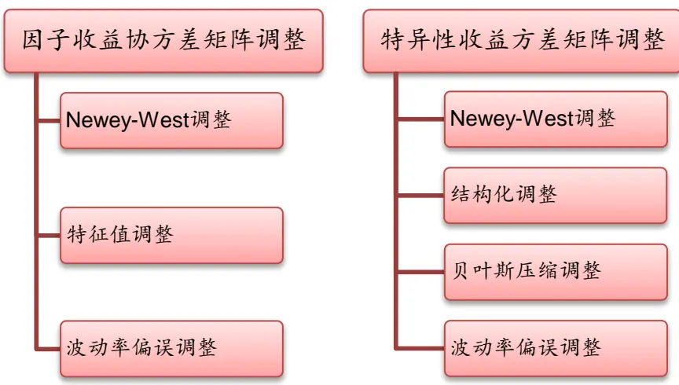
资料来源：华泰证券研究所

在介绍风险矩阵的计算和调整方法之前，我们先要了解风险预测准确度的衡量指标——偏误统计量。定义资产 k的样本外标准化收益为：

$$
b_{k,t}=\frac{r_{k,t\sim t+\delta}}{\sigma_{k,t}}
$$

$r_{k,t\sim t+\delta}\colon$ k资产在当前第t个截面到未来第t+δ个截面的收益率

$\sigma_{k,t};$ 在t截面上，模型对资产k在截面 $t\text{\sim }t+\delta 区$ 间内收益波动率的预测值标准化收益类似 Z分数。偏误统计量定义为一段观测区间内，标准化收益的标准差：

$$
B_{k}=\sqrt{\frac{1}{T-1}{\sum_{t=1}^{T}}{\left(b_{k,t}-\bar{b}_{k}\right)^{2}}}.
$$

${\bar{b}}_{k};$ 标准化收益 $.b_{k,t}$ 在T期内的均值

偏误统计量表征资产实际风险与预测风险的比值。理想情况下，如果风险预测准确，那么标准化收益的标准差应为 1，即偏误统计量 ${\boldsymbol{\cdot}}{\boldsymbol{B}}_{k}=1$ 。如果低估风险，标准化收益的标准差将大于 1，即 $B_{k}>1$ ；同理，如果高估风险，标准化收益的标准差将小于 1，即 $B_{k}<1$ 实际情况下，由于采样误差的存在，即便是完美的风险预测，偏误统计量也难以等于 1。因此，我们定义一个偏误统计量的 95%置信区间：

$$
C_{T}=[1-\sqrt{2/T},1+\sqrt{2/T}]
$$

一般地，只要偏误统计量的值落在置信区间内，就可以认为风险预测比较准确。

需要注意的是，实际收益数据一般具有尖峰厚尾的分布特点，并不满足正态分布的假设，因此，这一置信区间的判定条件是比较严格的。

## 因子收益协方差矩阵

因子收益协方差矩阵基于历史收益率数据计算，要求历史数据的截面数至少需要大于因子数。截面数不足会产生病态的协方差矩阵，严重影响风险预测的准确度。如果使用月频数据计算，那么包含 40 个风格因子的模型，需要 3 年以上的历史数据。历史数据的时间窗跨度过大，会使模型包含与当前市场状态相关程度较低的市场状态信息，显然并不适用于多变的 A股市场。此外，月频数据比较稀疏，模型较难及时捕捉市场变化。日频数据的数据量是月频数据的 20 倍，更高频的数据，对市场变化的敏感性更强。因此，我们的模型基于日频数据计算因子收益协方差矩阵和特异性收益方差矩阵。再通过后续 Newey-West调整，将风险矩阵调整至适合月频调仓策略。

考虑到实际市场多变，与远期历史收益数据相比，近期历史收益数据对当前风险估计的影响更大，因此我们采用权重指数衰减的加权移动平均（Exponentially Weighted MovingAverage）方法计算因子收益协方差矩阵 $\cdot F^{Raw}$ ：

$$
F_{a,b}^{Raw}=cov(f_a,f_b)_t=\sum_{s=0}^{h}\lambda_{t-s}(f_{a,t-s}-\overline{f_a})(f_{b,t-s}-\overline{f_b})\left/\sum_{s=0}^{h}\lambda_{t-s}\right.
$$

$$
\lambda_{t-s}=0.5^{s/\tau}
$$

$cov(f_{a},f_{b})_{t}$ :第t期，因子a与因子b之间的协方差

λ:指数衰减权重

$f_{a,t-s},f_{b,t-s};$ 第t−s个截面上，因子a和因子b的收益率

${\overline{{f_{a}}}},{\overline{{f_{b}}}}.$ 从截面t−ℎ 到截面t的区间内，因子a和因子b的收益率的加权均值

这里，我们对因子收益协方差矩阵中协方差项和方差项的计算，统一取时间窗 $h=252$ 权重半衰期 $1\tau=90$ o

## Newey-West 调整

上面的协方差矩阵FRaw是基于因子收益时序不相关的假设计算得到的。但是实际上，因子收益存在自相关性，因此FRaw并不是因子收益协方差矩阵真实值的相合估计，即此估计值并不能随着样本数的增大而逼近真值。为了得到相合估计，我们需要首先考虑因子收益的时序相关性。

因子收益率的时序相关性可以由滑动平均模型（Moving-Average Model，MA）描述，假设因子收益率满足一个D阶的时序相关，那么收益率序列可以表示为：

$$
f(t)=\mu+\sum_{i=0}^{D}\theta_{i}\varepsilon_{t-i},
$$

f(t):截面t上的因子收益率

$\mu;$ 一个与因子相关的常数，反映因子收益均值

$$
\varepsilon_{t-i};截面t-i上的白噪音
$$

$\theta_{i};$ :第t−i个截面对第t个截面的影响程度

白噪音 $\varepsilon_{t-i}$ 表征截面t −i上影响收益率的信息，它对收益率的影响会持续至此后的第D个截面，从而 $产$ 生时序相关。对于此D阶时序相关的收益协方差矩阵，一个简单的相合估计可以表示为：

$$
\varOmega=F^{Raw}+\sum_{d=1}^{D}\bigl(\widehat{\varOmega}_{d}+\widehat{\varOmega}_{d}^{\prime}\bigr),
$$

$$
\widehat{\Omega}_{d}=\sum_{t=1}^{T-d}\lambda^{T-d-t}f_{t}f_{t+d}^{\prime}\left/\sum_{t=1}^{T-d}\lambda^{T-d-t}\right.
$$

$f_{t};$ 截面t上所有因子的因子收益率序列

$\hat{\boldsymbol{\varOmega}}_{d};$ :滞后期为d时的自协方差矩阵

这一调整方法的本质是使用1~D阶的自协方差矩阵对未考虑时序相关的协方差矩阵FRaw进行修正。但是此方法存在一个明显的缺点——调整后的协方差矩阵不一定满足半正定的要求。为了解决这一问题，Newey 和 West（1987）在调整过程中加入了 Bartlett 权重，提出了广泛使用的 Newey-West 调整方法：

$$
\hat{\Omega}=F^{Raw}+\sum_{d=1}^{D}w(d,D)\cdot\left(\hat{\varOmega}_{d}+\hat{\varOmega}_{d}^{\prime}\right)
$$

$$
w(d,D)=1-\frac{d}{D+1}
$$

w(d, D): Bartlett 权重，随d的增大而减小

Newey-West调整后的协方差矩阵是一个相合估计，并且满足半正定的要求。

由于此因子收益协方差矩阵是基于日频数据计算得到，表征的是日度收益风险，因此，在用于月频调仓策略之前，我们还需要将此日频收益协方差矩阵频率转换至表征月度风险的月频收益协方差矩阵 $F^{NW}$

$$
F^{NW}=21\cdot\widehat{\boldsymbol{\varOmega}}=21\cdot\Bigg[F^{Raw}+\sum_{d=1}^{D}\bigg(1-\frac{d}{D+1}\bigg)\cdot\big(\widehat{\boldsymbol{\varOmega}}_{d}+\widehat{\boldsymbol{\varOmega}}_{d}^{\prime}\big)\Bigg],
$$

这里，我们对因子收益协方差矩阵中协方差项和方差项的计算，统一取滞后期 $D=2$

## 特征值调整

现代投资组合理论框架下，基于历史数据计算的波动率，可以作为未来风险的预测值。这种预测方式对股票和因子都适用。按照 Markowitz（1952）的均值-方差框架，基于预测收益和预测风险，组合优化可以得到满足某一优化条件的最优投资组合。但是，Muller（1993）指出，风险模型会系统性地低估最优投资组合的风险。Shepard（2009）指出，在满足正态性、平稳性、股票数目足够多的假设下，最优投资组合的真实波动率与预测波动率存在以下关系：

$$
\sigma_{true}\approx\frac{\sigma_{pred}}{1-(K/T)}
$$

$\sigma_{true}.$ 最优投资组合的真实波动率

$\sigma_{pred}!$ :该投资组合的模型预测波动率

K:股票数目或因子数目

T:计算协方差矩阵时的有效样本数

在有效样本数相同的情况下，股票或因子数目越多，风险低估的程度越大。

那么，模型低估最优投资组合风险的原因究竟是什么呢？是模型统一低估了所有股票的风险，还是其他可能的原因？为了探究这一原因，Menchero、Wang和 Orr（2012）对比了单只股票、随机权重投资组合和以协方差矩阵特征向量为权重的投资组合（以下简称为“特征组合”）的偏误统计量。其中，特征组合的预测风险即为该组合特征向量对应的特征值的平方根，特征组合之间互不相关。并且，特征组合与最优投资组合具有相似的意义：特征值最小的特征组合代表最小风险的投资组合，而特征值最大的特征组合则代表最大风险的投资组合。

结果显示，股票和随机权重投资组合的偏误统计量都趋近 1，说明风险模型在股票水平上的风险预测准确。但是，特征组合的偏误统计量则与投资组合真实波动率呈现明显的负相关，即模型明显低估低波动率特征组合的风险，风险低估程度随特征组合波动率的增大而逐渐减小。因此，Menchero、Wang和 Orr（2012）认为，最优投资组合风险低估很可能与特征组合的风险偏误（即特征值偏误）紧密相关，基于这一假设，他们提出了特征值调整方法，利用蒙特卡洛模拟估计采样误差带来的特征值偏误，用于修正协方差矩阵的特征值，从而解决风险模型低估最优投资组合的问题。

特征值调整的具体方法如下。对 Newey-West 调整后的协方差矩阵 $\cdot F^{NW}$ 进行特征值分解：

$$
D_{0}=U_{0}^{\prime}F^{NW}U_{0}
$$

D :特征值构成的对角矩阵

$U_{0};$ 正交矩阵，矩阵第k列表示 $D_{0}$ 中第k个特征值所对应的特征向量

上文提到， $以U_{0}$ 第 k列特征向量为权重构成的特征组合的风险恰好等于第 k个特征值的平方根，特征组合之间互不相关。

对于任意已知的风险协方差矩阵，采样误差带来的特征值偏误存在确定的概率分布。因此，虽然我们并不知道真实的协方差矩阵，但是可以暂时先将已有的 $F^{NW}$ 视作真实的协方差矩阵，将 $D_{0}$ 视作以 $U_{0}$ 为权重的特征组合收益的真实方差。通过蒙特卡罗模拟，计算真实协方差矩阵与基于模拟收益数据得到的模拟协方差矩阵的特征值的比值，从而衡量采样误差带来的特征值偏误。

第m次蒙特卡罗模拟的过程为：

（1） 假设特征组合月收益率满足正态分布，随机生成大小为 $K\times T$ 的模拟特征组合收益率矩阵 $\cdot b_{m}$ 。其中，K为特征组合数目，即因子数目，T为模拟的期数。矩阵的第k行数据服从均值为 0、方差为 $D_{0}(k,\bar{k})$ 的正态分布。根据因子与特征组合之间的关系，可以得到因子的模拟收益率矩阵 $f_{m}$ ：

$$
f_{m}=U_{0}b_{m}
$$

（2） 根据因子模拟收益率序列，可以得到模拟因子收益协方差矩阵 $\cdot F_{m}$ ：

$$
F_{m}=cov(f_{m},f_{m})
$$

易证， $F_{m}$ 是 $F^{NW}$ 的无偏估计，即 $E(F_{m})=F^{NW}$ 。但是由于采样误差的存在，模拟协方差矩阵相对真实值存在一定的误差。

（3） 将模拟协方差矩阵 $F_{m}$ 进行特征值分解，得到模拟特征组合权重矩阵 $U_{m}$ 和模拟特征组合的样本方差，即模拟特征值矩阵 $D_{m}$ ：

$$
D_{m}=U_{m}^{\prime}F_{m}U_{m}
$$

（4） 按照模拟特征组合权重，将真实协方差矩阵 $\cdot F^{NW}$ 分解，得到模拟特征组合的真实方差，即真实特征值矩阵 $\widetilde{D}_{m}$ ：

$$
\widetilde{D}_{m}=U_{m}^{\prime}F^{NW}U_{m}
$$

需要注意的是，由于 $U_{m}$ 的每一列并不是 $F^{NW}$ 真实的特征向量，因此分解得到的特征值矩阵 $\cdot\widetilde{D}_{m}$ 并不是对角矩阵。但是，我们依旧可以将 $\widetilde{D}_{m}$ 的对角线元素当作模拟特征组合的真实方差。由于采样误差的存在，E $[D_{m}(k,k)]\neq\widetilde{D}_{m}(k,k)$

我们共进行M次蒙特卡罗模拟，以获得对特征值偏误的稳定估计：

$$
\lambda(k)=\sqrt{\frac{1}{M}\sum_{m=1}^{N}\frac{\widetilde{D}_{m}(k)}{D_{m}(k)}}.
$$

需要注意的是，实际收益数据一般具有尖峰厚尾的分布特点，并不满足蒙特卡罗模拟中正态分布的假设，因此，我们需要进一步调整对特征值偏误的估计：

$$
\gamma(k)=\alpha[\lambda(k)-1]+1
$$

其中α为调整系数，通常为一个大于 1的常数，这里经验取值 $\alpha=1.5$ 。基于此特征值偏误，我们可以得到修正后的因子收益协方差矩阵 $\cdot F^{Eigen}$ ：

$$
F^{Eigen}=U_{0}(\gamma^{2}D_{0})U_{0}^{\prime}
$$

下图对比了特征值调整前、后特征组合的偏误统计量，特征组合按照预测波动率从低到高的顺序排列。本文回测区间为 2011-02-01 至 2019-05-31。特征值调整参数为：模拟收益期数 $T=100$ ，蒙特卡洛模拟次数 $M=3000$ ，调整系数 $\alpha=1.5$ 。由图可知，特征值调整前，模型明显低估低波动率特征组合的风险。特征值调整后，大部分特征组合的偏误统计量落在 95%置信区间内，说明特征值调整较好地修正了风险低估的问题。

图表5： 特征值调整前、后特征组合偏误统计量
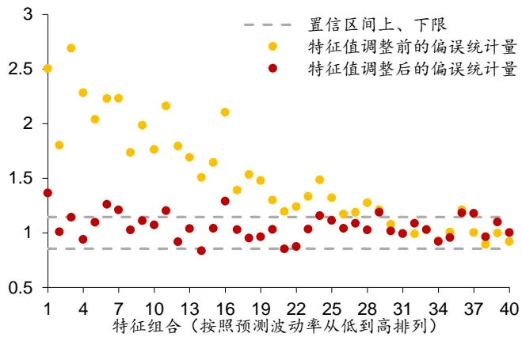
资料来源：Wind，华泰证券研究所

## 波动率偏误调整

上一步的特征值调整是将每个因子视作独立的个体，并未考虑其他因子包含的信息。为了准确预测风险，模型需要最大化利用可用信息。延续这一思路，接下来的调整可以利用同一时间截面上不同因子的信息，判断模型是否在某些时间段内系统性地高估或者低估了所有因子的收益风险，根据此波动率偏误将截面上的因子协方差矩阵进行整体缩放。

定义第t个时间截面上，所有因子的总偏误统计量为 $B_{t}^{F}$ ：

$$
B_{t}^{F}=\sqrt{\frac{1}{K}{\sum_{k}{{{\left({\frac{{{f_{kt}}}}{{{\sigma_{kt}}}}}\right)}^{2}}}}}.
$$

$f_{kt};$ :因子k在第t个截面到未来第t+δ个截面的收益率

$\sigma_{kt}\colon$ 在截面t上，模型对因子k在截面t~t+δ区间内收益波动率的预测值

由于单个截面数据容易受到随机噪声的影响，因此，我们对一段时期的总偏误统计量进行加权平均，得到因子波动率调整系数 $\lambda_{F}$ ：

$$
\lambda_{F}=\sqrt{\sum_{t}(B_{t}^{F})^{2}w_{t}}.
$$

$w_{t};$ :指数衰减权重，这里时间窗 ℎ = 252，权重半衰期τ = 42最后，我们利用 $\lambda_{F}$ 对因子收益协方差矩阵进行调整：

$$
F^{VRA}=\lambda_{F}^{2}F^{Eigen}
$$

为了检验波动率偏误调整效果，我们定义截面因子波动率：

$$
CSV_{t}^{F}=\sqrt{\frac{1}{K}{\sum_{k}{f_{kt}^{2}}}}.
$$

如果波动率偏误调整效果良好，在时间序列上，因子波动率调整系数 $\lambda_{F}$ 会及时跟进截面因子波动率 $.CSV_{t}^{F}$ 的变化。下面左图显示了二者的时序关系，从图中可以看出，在截面因子波动率突然增大时，因子波动率调整系数及时增大至大于 1 的值，以修正可能的风险低估，同样地，在截面因子波动率突然减小时，因子波动率调整系数及时减小至小于 1 的值，以修正可能的风险高估。下面右图对比了波动率偏误调整前、后因子风险偏误统计量的 12个月滚动均值。由图可知，波动率偏误调整后的偏误统计量更接近 1，说明波动率偏误调整效果良好。

需要注意的是，波动率偏误调整利用了未来的因子收益数据计算总偏误统计量。因此，在缺乏未来收益数据的情况下，波动率偏误调整可能难以进行。波动率偏误调整对风险模型的改进，有利于提升风险模型在应用于投资组合风险归因时的表现。

图表6： 因子波动率调整系数与截面因子波动率的关系
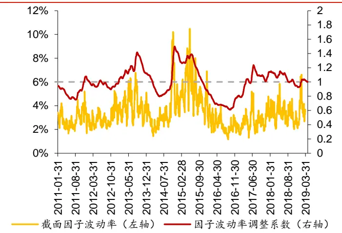
资料来源：Wind，华泰证券研究所

图表7： 波动率偏误调整前、后因子风险偏误统计量 12个月滚动均值
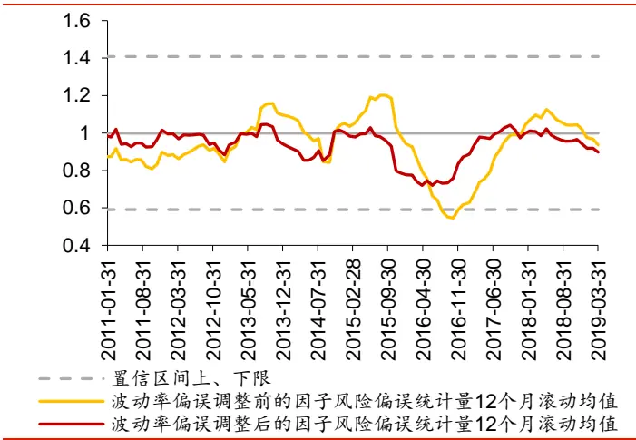
资料来源：Wind，华泰证券研究所

## 特异性收益方差矩阵

特异性收益方差矩阵是多因子风险模型的另一主要组成部分。不同股票的特异性收益率彼此独立、互不相关，因此，特异性收益方差矩阵是一个对角矩阵，即非对角线上的元素为0。与因子收益协方差矩阵一致，我们依旧基于日频收益数据，采用权重指数衰减的加权移动平均方法计算特异性收益方差矩阵：

$$
\begin{aligned}\widehat{\mu}_{0}=var(u_{n})_{t}=\sum_{s=0}^{h}\lambda_{t-s}(u_{n,t-s}-\overline{u_{n}})^{2}\left/\sum_{s=0}^{h}\lambda_{t-s}\right.\\\left.\lambda_{t-s}=0.5^{s/\tau}\right.\end{aligned}
$$

$u_{n,t-s}\cdot$ 第t−s个截面上，第n只股票的特异性收益率

$\overline{{u_{n}}}\colon$ 从截面t−ℎ 到截面t的区间内，第n只股票的特异性收益率的加权均值这里，与因子收益协方差矩阵相同，时间窗ℎ = 252，权重半衰期τ = 90。

## Newey-West 调整

与因子收益协方差矩阵相同，由于日频特异性收益存在时序相关性，需要先通过Newey-West调整修正对特异性收益方差矩阵的估计，并将其频率调整至表征月度风险的月频特异性收益方差矩阵：

$$
(\sigma^{NW})^{2}=21\cdot\Biggl[\widehat{\varOmega}_{0}+\sum_{d=1}^{D}\left(1-\frac{d}{D+1}\right)\cdot\left(\widehat{\varOmega}_{d}+\widehat{\varOmega}_{d}^{\prime}\right)\Biggr],
$$

$$
\widehat{\mathcal{Q}}_{d}=\sum_{t=1}^{T-d}\lambda^{T-d-t}diag(u_{t}u_{t+d}^{\prime})\left/\sum_{t=1}^{T-d}\lambda^{T-d-t}\right.
$$

这里，滞后期D = 5。

## 结构化调整

在某一个时间截面上，因子收益是通过上千只股票的数据线性回归计算得到的，不容易受到单只股票缺失值或异常值的影响。然而，特异性收益则是只基于一只股票的数据计算得到的，容易受到单只股票缺失值和异常值的影响。在实际市场中，新上市股票、长期停牌股票的特异收益可能缺失，公司披露重大事件的时间节点附近，股票的特异收益可能出现异常值。这些缺失数据和异常值可能导致特异性收益方差矩阵非平稳，损害模型的稳定性。因此，对于特异性收益方差矩阵，我们需要额外设置一步结构化调整，修正特异收益缺失值和异常值对风险矩阵的影响。

结构化调整的基本假设与多因子模型一脉相承——使用共同因子表征股票的风险特征，假设具有相同因子暴露的股票可能具有相同的特异性风险。结构化调整的具体方法如下。对于一段时间窗（ℎ = 252）内的特异性收益序列，定义第n只股票的协调参数 $\gamma_{n}\in[0,1]$

$$
\gamma_{n}=\{min[1,max(0,V_{n})]\}\cdot\{min[1,exp(1-Z_{n})]\}
$$

$$
V_{n}=\frac{h_{n}-60}{120}
$$

$$
Z_{n}=\bigg|\frac{\sigma_{n}-\widetilde{\sigma_{n}}}{\widetilde{\sigma_{n}}}\bigg|
$$

$$
\widetilde{\sigma_{n}}={}^{1}\big/_{1.35}\cdot\left(Q_{3,n}-Q_{1,n}\right)
$$

$V_{n};$ 数据缺失程度， $V_{n}$ 越大说明数据缺失程度越小

$h_{n};$ 样本内的有效数据个数，若 $h_{n}\geq$ 180 则认为数据无明显缺失

$Z_{n};$ 数据肥尾程度， $Z_{n}$ 越大于 1 说明数据肥尾程度越大

$\sigma_{n},\widetilde{\sigma_{n}}\mathrm{:}$ 样本的等权标准差，样本的稳健估计标准差

$Q_{3,n},Q_{1,n};$ 样本的四分之三分位数，样本的四分之一分位数

如果第n只股票在此时间窗样本内存在明显数据缺失或异常值导致的肥尾现象，则 $\gamma_{n}<1$ 如果第n只股票无明显数据缺失和异常值，则 $\gamma_{n}=1$

对于所有 $\gamma_{n}=1$ 的优质股票数据，将股票特异性收益的波动率 $\cdot\sigma_{n}^{TS}$ 的对数对所有因子的因子暴露做线性回归，回归采用市值加权的加权最小二乘法（WLS），得到每个因子对特异波动的贡献值 $.b_{k}$ ：

$$
ln(\sigma_{n}^{TS})=\sum_{k}X_{nk}\cdot b_{k}+\varepsilon_{n}
$$

那么，第n只股票的结构化特异波动预测值 $\sigma_{n}^{STR}$ 为：

$$
\sigma_{n}^{STR}=E_{0}\cdot exp\left(\sum_{k}X_{nk}\cdot b_{k}\right)
$$

$E_{0};$ 用于消除回归残差项 $\varepsilon_{n}$ 影响的调整系数， $E_{0}=1.05$

对于所有个股，以协调参数 $\gamma_{n}$ 为权重，综合股票特异波动原始值 $\sigma_{n}^{TS}$ 和结构化特异波动预测值 $\sigma_{n}^{STR}$ ，得到结构化调整后的特异波动 $\widehat{\sigma_{n}}$ ：

$$
\widehat{\sigma_{n}}=\gamma_{n}\cdot\sigma_{n}^{TS}+(1-\gamma_{n})\cdot\sigma_{n}^{STR}
$$

易知，结构化调整只针对存在明显缺失值或异常值，即 $\gamma_{n}<1$ 的股票。数据质量良好 $(\gamma_{n}=1)$ 的股票，结构化调整前、后的特异波动不变。

图表8： 结构化调整中，数据质量良好的股票在所有股票中的占比
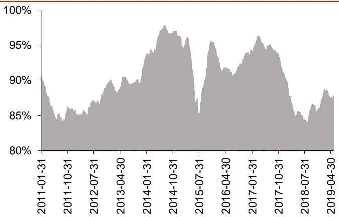
资料来源：Wind，华泰证券研究所

上图显示了结构化调整中，每个时间截面上，数据质量良好 $(\gamma_{n}=1)$ 的股票在所有股票中的占比。由图可知，在绝大部分截面上，优质股票占比均在 85%以上，保证了结构化特异波动预测值的有效性。结构化调整前、后偏误统计量的对比将在下一小节统一呈现。

## 贝叶斯压缩调整

风险模型的一个基本假设是风险具有一定的持续性，即样本内的历史波动可以一定程度上平稳地延续至样本外的某个未来时刻。如果实际市场中的真实风险呈现出这样的持续性，那么风险模型直接将历史波动作为未来风险的预测值是合理的。但是，如果真实风险的持续性较弱，那么模型还需要根据真实风险的时序特征进行额外的调整。

市场实证发现，与持续性较好的因子风险不同，特异性风险存在明显的回归均值趋势，即样本内波动率较低的股票，很可能在样本外的未来时刻波动率升高，同样地，样本内波动率较高的股票，很可能在样本外的未来时刻波动率降低。这一趋势在具有样本内极端波动率的股票上表现得更加明显。这一趋势会导致风险模型低估样本内低波动率股票的未来风险，高估样本内高波动率股票的未来风险。因此，对于特异性收益方差矩阵，我们还需要利用贝叶斯收缩调整，根据特异风险回归均值的趋势进一步修正风险预测值。

贝叶斯压缩调整的具体方法是，在每个时间截面上，将所有股票按照市值从小到大的顺序分为 10组，第n只股票的特异波动会向其所在市值分组 $.s_{n}$ 内股票特异波动的市值加权均值回归，从而得到调整后的特异波动 $\sigma_{n}^{SH}$ ：

$$
\begin{aligned}\sigma_{n}^{SH}&=v_{n}\bar{\sigma}_{n}+(1-v_{n})\widehat{\sigma_{n}},\\&\bar{\sigma}_{n}=\sum_{n\in S_{n}}w_{n}\widehat{\sigma_{n}},\end{aligned}
$$

$$
v_{n}=\frac{q|\widehat{\sigma_{n}}-\bar{\sigma}_{n}|}{\varDelta_{\sigma,n}+q|\widehat{\sigma_{n}}-\bar{\sigma}_{n}|},
$$

$$
\varDelta_{\sigma,n}=\sqrt{\frac{1}{N(s_{n})}\sum_{n\in S_{n}}(\widehat{\sigma_{n}}-\bar{\sigma}_{n})^{2}}.
$$

${\bar{\sigma}}_{n}\colon$ 贝叶斯先验风险矩阵，即股票n所在市值分组 $s_{n}$ 的特异风险的市值加权均值$v_{n};$ 压缩密度，个股特异波动相对组均值的偏 $离$ 越大， $v_{n}$ 越接近 1

${\widehat{\sigma_{n}}};$ :结构化调整后的股票n的特异波动

$w_{n};$ :股票n的市值权重

q: 压缩系数，经验取值q = 1

$\varDelta_{\sigma,n}\colon$ ：股票n所属市值分组 $.s_{n}$ 的特异波动的标准差

$$
$N(s_{n})\colon 属于市值分组s_{n}的股票数目$
$$

如果股票特异波动相对组内均值的偏离越大，即股票特异波动越极端，那么贝叶斯压缩密度越接近 1，即贝叶斯压缩后特异波动向组内均值回归的程度越大。

在每个时间截面上，将股票按照预测波动率从小到大的顺序分为 10 组，考察每组股票在未来 12个月的偏误统计量的均值。所有调整步骤执行之后的结果如下图所示。由图可知，在进行贝叶斯压缩调整之前，即 Newey-West 调整（黑色）和结构化调整（灰蓝色）后，偏误统计量与股票预测特异波动呈负相关，说明风险模型低估样本内低波动率股票的未来风险（偏误统计量大于 1），高估样本内高波动率股票的未来风险（偏误统计量小于 1）。贝叶斯压缩调整（黄色）之后，偏误统计量随股票预测特异波动的变化基本呈水平趋势，说明贝叶斯压缩调整良好地修正了模型的样本外风险偏误。最后一步波动率偏误调整（红色，具体方法见下一小节）后，偏误统计量更接近于 1，说明波动率偏误调整效果良好。

结构化调整和贝叶斯压缩调整，是依据特异性收益和特异性风险的特征，额外进行的两步调整。按照因子收益风险的调整思路，接下来应该进行特征值调整和波动率偏误调整。但是，由于特异性收益方差矩阵是对角矩阵，其特征值就等于对角线元素，因此，对于特异性风险而言，特征值调整与波动率调整的效果相似，简便起见不再设置特征值调整，直接进行波动率偏误调整。

图表9： 不同波动率分组下，股票在未来 12个月的偏误统计量均值
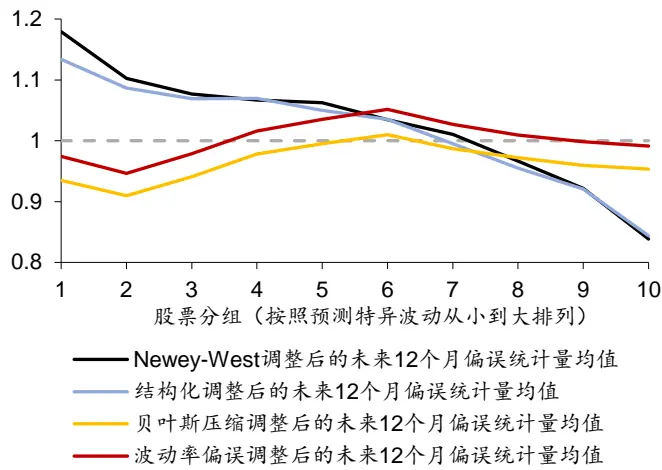
资料来源：Wind，华泰证券研究所

## 波动率偏误调整

与因子收益协方差矩阵的调整思路一致，之前的调整步骤都是将每只股票视作独立的个体，并未考虑其他股票包含的信息。为了最大化利用可用信息，在这一步我们考虑同一时间截面上所有股票的特异波动，判断模型是否在某些时间段内系统性地高估或者低估了所有股票的特异性风险，并根据此波动率偏误对截面上的特异性收益方差矩阵进行整体缩放。

定义第t个时间截面上，所有股票特异风险的总偏误统计量为 $B_{t}^{s}$ ：

$$
B_{t}^{S}=\sqrt{\sum_{n}w_{nt}\left(\frac{u_{nt}}{\sigma_{nt}}\right)^{2}}.
$$

$u_{nt};$ 股票n在第t个截面到未来第t+δ个截面的特异性收益率

$\sigma_{nt};在$ 截面t上，模型对股票n在截面t~t +δ区间内特异波动的预测值

$w_{nt};$ 股票n的市值权重

由于单个截面数据容易受到随机噪声的影响，因此，我们对一段时期的总偏误统计量进行加权平均，得到特异波动率调整系数 $\lambda_{S}$ ：

$$
\lambda_{s}=\sqrt{\sum_{t}(B_{t}^{S})^{2}w_{t}}.
$$

$w_{t};$ 指数衰减权重，这里时间窗 ℎ = 252，权重半衰期τ = 42最后，我们利用 $\lambda_{S}$ 对特异波动进行调整：

$$
\sigma_{n}^{VRA}=\lambda_{S}\sigma_{n}^{SH}
$$

为了检验波动率偏误调整效果，我们定义截面特异波动率：

$$
CSV_{t}^{S}=\sqrt{\sum_{n}w_{nt}u_{nt}^{2}}.
$$

如果波动率偏误调整效果良好，在时间序列上，特异波动率调整系数 $\lambda_{S}$ 会及时跟进截面特异波动率 $CSV_{t}^{S}$ 的变化。下面左图显示了二者的时序关系，从图中可以看出，在截面特异波动率突然增大时，特异波动率调整系数及时增大至大于 1 的值，以修正可能的风险低估，同样地，在截面特异波动率突然减小时，特异波动率调整系数及时减小至小于 1 的值，以修正可能的风险高估。下面右图对比了波动率偏误调整前、后特异风险偏误统计量的 12个月滚动均值。由图可知，波动率偏误调整后的偏误统计量更接近 1，说明波动率调整效果良好。

图表10： 特异波动乘数与截面特异波动率的关系
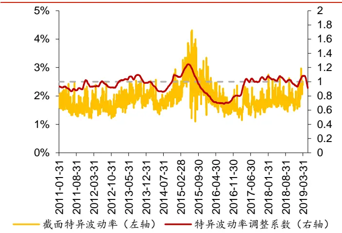
资料来源：Wind，华泰证券研究所

图表11： 波动率偏误调整前、后特异风险偏误统计量 12个月滚动均值
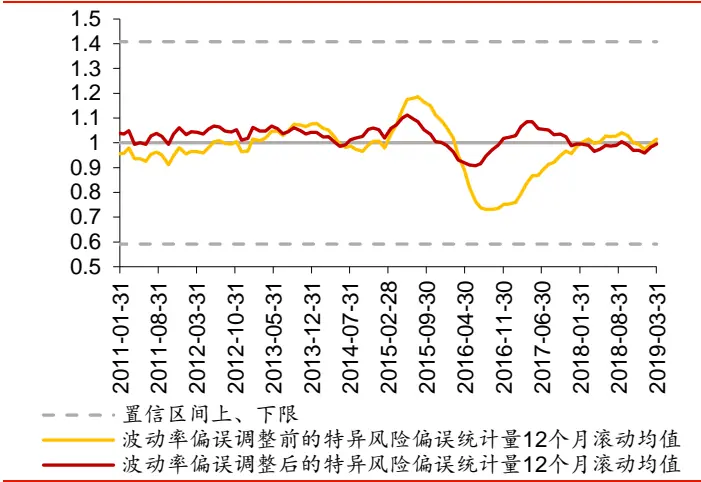
资料来源：Wind，华泰证券研究所

与因子收益协方差矩阵类似，特异性收益方差矩阵的波动率偏误调整同样利用了未来的特异收益数据计算总偏误统计量。因此，在缺乏未来收益数据的情况下，波动率偏误调整可能难以进行。波动率偏误调整对风险模型的改进，有利于提升风险模型在应用于投资组合风险归因时的表现。

## 风险预测的准确度检验

在得到每一个时间截面上的因子收益协方差矩阵和特异性收益方差矩阵之后，我们可以对任意投资组合进行风险预测。上文提到，股票收益率之间的协方差矩阵表示为：

$$
V=XFX^{T}+\varDelta
$$

那么，已知权重为w的投资组合P的风险可以表示为：

$$
\sigma_{P}^{2}(w)=w^{T}Vw=w^{T}(XFX^{T}+\varDelta)w
$$

本小节将以市场中典型指数——沪深 300 和中证 500——为例，检验华泰金工多因子风险模型在风险预测上的表现。

图表12： 沪深 300的预测波动率与实际波动率
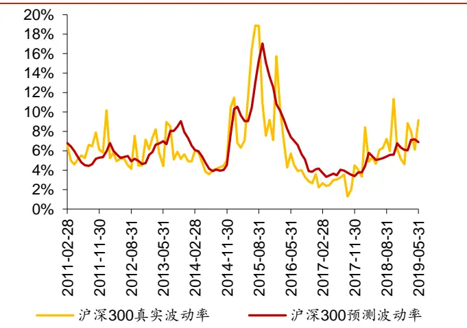
资料来源：Wind，华泰证券研究所

图表13： 中证 500的预测波动率与实际波动率
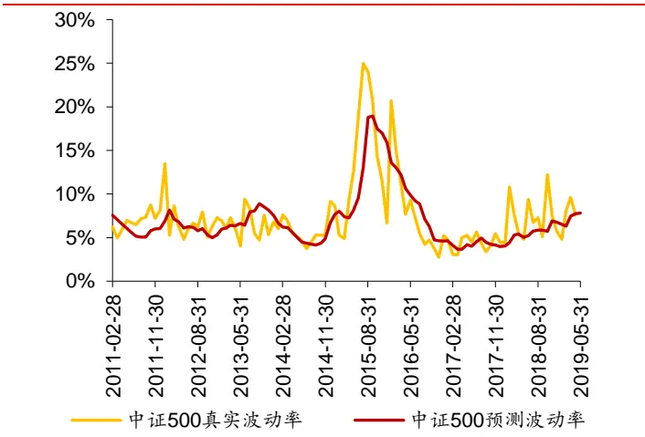
资料来源：Wind，华泰证券研究所

上面左、右图分别对比了 2011-02-01 至 2019-05-31 区间内，沪深 300 指数、中证 500指数的月（21 个交易日）波动率的预测值和真实值。从图中可以看出，预测值和真实值的走势相似，二者相关系数分别为 0.70 和 0.73，风险预测比较准确。

## 多因子风险模型在组合优化中的应用

多因子风险模型有两个主要应用——组合优化构建最优投资组合与投资组合收益-风险归因。本节关注前者，在第一小节和第二小节中依次介绍利用多因子风险模型构建最小化风险、最大化风险调整后收益投资组合的方法，并探讨组合优化主要参数对组合优化的影响。

## 最小化风险的投资组合

多因子风险模型将权重为w的投资组合P的风险表示为：

$$
\sigma_{P}^{2}(w)=w^{T}Vw=w^{T}(XFX^{T}+\varDelta)w
$$

X:所有股票的因子暴露矩阵

F:因子收益协方差矩阵

Δ:特异性收益方差矩阵

那么，最小化风险的组合优化目标函数可以表示为：

$$
Min_{w}w^{T}(XFX^{T}+\varDelta)w
$$

根据优化目标选取w代表的权重形式。如果目的是最小化投资组合的绝对风险，则w代表投资组合的持仓权重。如果目的是最小化投资组合的主动风险，则w代表投资组合相对基准指数的偏离权重。

此外，组合优化还可以设置额外的约束条件，例如：不允许做空（即投资组合持仓权重大于等于 0），基准指数成分股以内选股，设置持仓权重或偏离权重的上、下限，投资组合相对基准组合风格或行业中性等。需要注意的是，如果约束条件过多，可能出现股票的选取空间为空集或在选取空间内优化目标函数不收敛的问题。遇到这类截面不可解的问题时，需要考虑逐步、适当放松约束条件，直到组合优化找到最优解为止。

## 优化持仓权重，最小化绝对风险

本小节取w为持仓权重，构建最小化绝对风险的投资组合：

$$
\begin{array}{c}Min_{w}\ w^{T}(XFX^{T}+\varDelta)w^{T}\\s.t.\ \forall n\ w_{n}\geq0\\\ \sum_{n}w_{n}=1\end{array}
$$

我们考察股票池对组合优化的影响。我们以中证 500 指数为基准，构建两种月频调仓的最小化绝对风险投资组合策略，其中一个约束为中证 500 指数成分股内选股，另一个为全部A股选股。本文的回测区间均为 2011 年 2月 1 日至 2019年 5 月 31 日，策略均为每月月初调仓。这两个投资组合的净值、超额收益累积净值和回撤、策略评价指标对比如下。

图表14： 不同股票池内，最小化绝对风险组合的净值
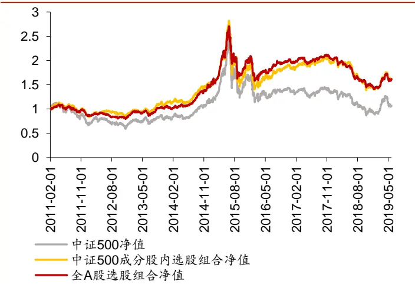
资料来源：Wind，华泰证券研究所

图表15： 不同股票池内，最小化绝对风险组合的超额收益净值和回撤
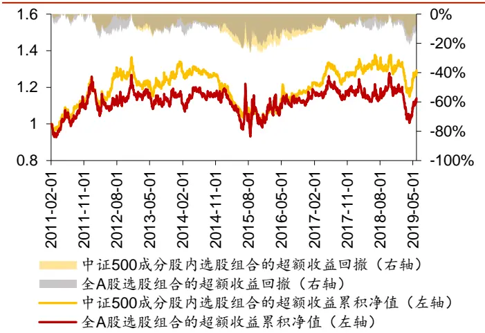
资料来源：Wind，华泰证券研究所

图表16： 不同股票池内，最小化绝对风险组合的策略评价指标

|  | 年化 | 年化 |  |  | 年化 |  | 年化 |  | 超额收益 超额收益 平均股票 月单边换 |  |  |  |  |
| --- | --- | --- | --- | --- | --- | --- | --- | --- | --- | --- | --- | --- | --- |
|  |  | 收益率 | 波动率夏普比率： | 最大回撤 |  | 月胜率超额收益率 | 跟踪误差 | 信息比率 | 最大回撤 | 月胜率 |  | 数量 | 手率 |
| 中证 500 | 0.73% | 27.02% | 0.027 | 65.20% | 58.00% |  |  |  |  |  |  |  |  |
| 中证 500 成分股内选股组合 | 6.20% | 20.72% | 0.299 | 50.82% | 59.00% | 5.47% | 10.99% |  | 0.498 26.88% |  | 56.00% | 48.70 | 28.15% |
| 全 A 股选股组合 | 6.12% | 16.03% | 0.382 | 47.84% | 60.00% | 5.39% | 15.53% |  | 0.347 | 26.55% | 47.00% | 86.82 | 30.72% |

资料来源：Wind，华泰证券研究所

与中证 500 指数相比，这两个投资组合的年化波动率更小、夏普比率更大、最大回撤更小，说明多因子风险模型的风险预测比较准确，组合优化效果较好。此外，与中证 500 成分股内选股组合相比，全 A股选股组合的年化波动率更小、夏普比率更大、最大回撤更小，说明指数基准成分股以外还有很多绝对风险较小的股票，全 A股选股可以利用这些股票，构建绝对风险更小的投资组合。

## 优化偏离权重，最小化主动风险

最小化主动风险组合在实际投资中的典型代表是被动型指数基金。本小节取w为偏离权重，构建最小化主动风险的投资组合：

$$
\begin{array}{c}Min_{w}\ w^{T}(XFX^{T}+\varDelta)w\\s.t.\quad\forall n\quad w_{n}+w_{n}^{bench}\geq0\\\sum_{n}(\ w_{n}+w_{n}^{bench})=1\\w_{n}^{bench}\colon 基准指数在股票n上的权重\end{array}
$$

中证 500 成分股内选股、全 A 股选股的最小化主动风险组合结果如下所示。对比图表 16和图表 19 可知，最小化绝对风险组合的绝对风险更小，而最小化主动风险组合的主动风险更小，说明组合实测表现与优化目标一致。

在股票池对组合优化的影响上，指数成分股内选股组合的主动风险更小，这一结果符合预期。当组合与基准指数股票权重完全相同时，主动风险最小，限制成分股内选股相当于在考试之前划重点，缩小了考试范围，因此，在最小化主动风险中，成分股内选股比全 A股选股组合的效果更好。

图表17： 不同股票池内，最小化主动风险组合的净值
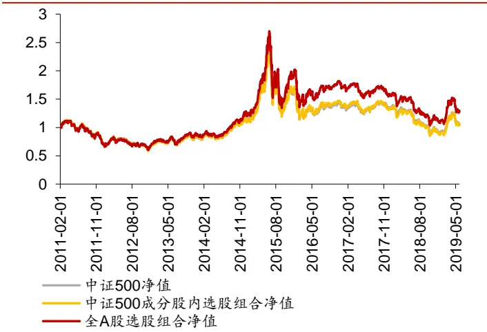
资料来源：Wind，华泰证券研究所

图表18： 不同股票池内，最小化主动风险组合的超额收益净值和回撤
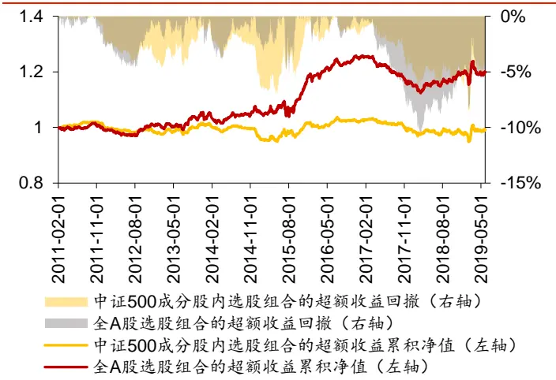
资料来源：Wind，华泰证券研究所

图表19： 不同股票池内，最小化主动风险组合的策略评价指标

|  | 年化 收益率 | 年化 |  |  | 年化 |  | 年化 | 超额收益 超额收益 平均股票 |  |  |  | 月单边 换手率 |
| --- | --- | --- | --- | --- | --- | --- | --- | --- | --- | --- | --- | --- |
|  |  |  |  | 波动率夏普比率最大回撤 |  | 月胜率超额收益率跟踪误差信息比率 |  |  | 最大回撤 | 月胜率 | 数量 |  |
| 中证 500 | 0.73% | 27.02% | 0.027 | 65.20% | 58.00% |  |  |  |  |  |  |  |
| 中证 500 成分股内选股组合 | 0.59% | 27.27% | 0.022 | 65.17% | 59.00% | -0.14% | 2.85% | -0.049 | 8.61% | 49.00% | 398.77 | 25.47% |
| 全 A 股选股组合 | 3.14% | 26.91% | 0.117 | 61.70% | 59.00% | 2.40% | 3.83% | 0.627 | 10.77% | 53.00% | 752.46 | 29.73% |

资料来源：Wind，华泰证券研究所

接下来，我们考察基准指数对组合优化的影响。我们分别以中证 500 和沪深 300 指数为基准，构建成分股内选股的最小化主动风险投资组合策略。这两个投资组合的净值、超额收益累积净值和回撤、策略评价指标如下所示。由图可知，基准指数的选择会影响组合优化的表现，这可能反映了不同的基准指数在跟踪难度上的差异，这一结果对于被动型指数基金的选取和管理都有一定的参考意义。

图表20： 不同基准下，最小化主动风险组合的净值
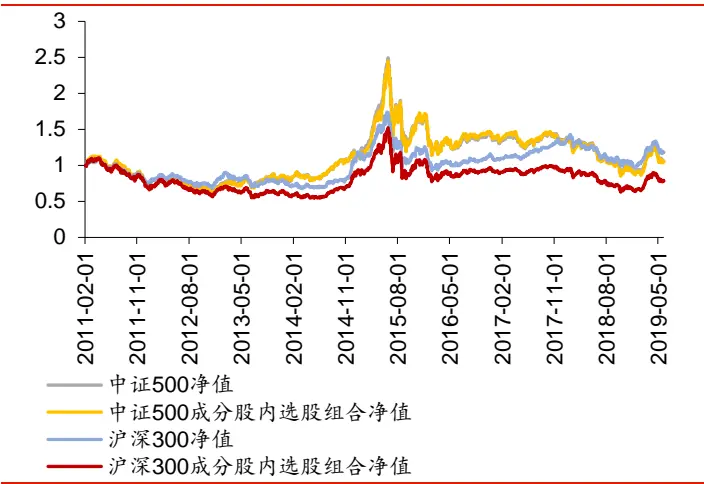
资料来源：Wind，华泰证券研究所

图表21： 不同基准下，最小化主动风险组合的超额收益净值和回撤
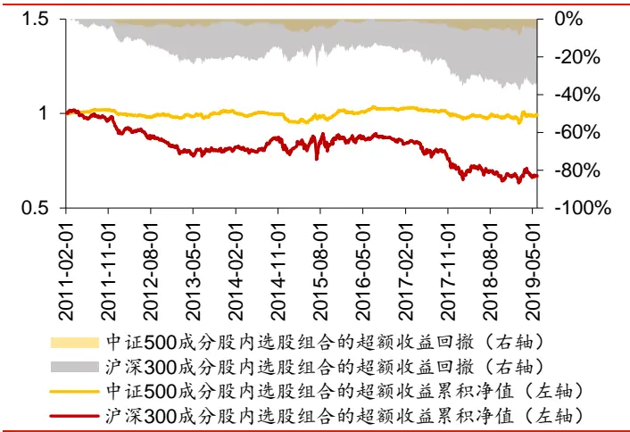
资料来源：Wind，华泰证券研究所

图表22： 不同基准下，最小化主动风险组合的策略评价指标

|  | 年化 收益率 | 年化 |  |  |  | 年化 | 年化 |  | 超额收益 超额收益 平均股票 |  |  | 月单边 换手率 |
| --- | --- | --- | --- | --- | --- | --- | --- | --- | --- | --- | --- | --- |
|  |  |  | 波动率 | 夏普比率最大回撤 |  |  | 月胜率超额收益率 | 跟踪误差 信息比率 | 最大回撤 月胜率 |  | 数量 |  |
| 中证500 | 0.73% | 27.02% | 0.027 | 65.20% | 58.00% |  |  |  |  |  |  |  |
| 中证500成分股内选股组合 | 0.59% | 27.27% | 0.022 | 65.17% | 59.00% | -0.14% | 2.85% | -0.049 | 8.61% | 49.00% | 398.77 | 25.47% |
| 沪深 300 | 2.06% | 23.28% | 0.089 | 46.70% | 53.00% |  |  |  |  |  |  |  |
| 沪深 300 成分股内选股组合 | -2.98% | 25.38% | -0.118 | 58.58% | 48.00% | -5.05% | 8.93% | -0.565 | 38.00% | 44.00% | 194.53 | 31.27% |

资料来源：Wind，华泰证券研究所

## 最大化风险调整后收益的投资组合

大多数情况下，投资者们更在意收益的大小，因此与最小化风险组合相比，最大化风险调整后收益组合在实际投资中具有更大的应用价值。最大化风险调整后收益的组合优化目标函数可以表示为：

$$
\begin{aligned}Max_{w}\quad&w^{T}r-\lambda\cdot w^{T}(XFX^{T}+\varDelta)w\\&\lambda:风险厌恶系数\end{aligned}
$$

r:收益模型输出的所有股票的预期收益向量

同样地，根据优化目标选取w代表的权重形式。如果目的是最大化风险调整后的绝对收益，则w代表投资组合的持仓权重。如果目的是最大化风险调整后的主动收益，则w代表投资组合相对基准指数的偏离权重。

风险厌恶系数代表投资者为了获得一个单位的收益愿意承担的风险大小，风险厌恶系数的选取与组合夏普比率和信息比率具有一定的关系。当w代表投资组合的持仓权重时，组合夏普比率可以表示为：

$$
\frac{w^{T}r}{\sigma_{P}(w)}=\frac{w^{T}r}{\sqrt{w^{T}(XFX^{T}+\varDelta)w}}
$$

此时，优化目标可以表示为：

$$
Max_{w}\ SR\cdot\sigma_{P}(w)-\lambda\cdot\sigma_{P}^{2}(w)
$$

求导可得上式在 $.\sigma_{P}(w)^{*}=SR/(2\cdot\lambda)$ 时取得最大值，即风险厌恶系数的最优取值为： λ∗ = SR [2 ∙ σP(w)∗ ⁄ ]

类似地，当w代表投资组合的偏离权重时，组合信息比率可以表示为：

$$
\frac{w^{T}r}{\sigma_{P}(w)}=\frac{w^{T}r}{\sqrt{w^{T}(XFX^{T}+\varDelta)w}}
$$

此时，优化目标可以表示为：

$$
Max_{w}\ IR\cdot\sigma_{P}(w)-\lambda\cdot\sigma_{P}^{2}(w)
$$

求导可得上式在 $.\sigma_{P}(w)^{*}=IR/(2\cdot\lambda)$ 时取得最大值，即风险厌恶系数的最优取值为：

$$
\lambda^{*}=IR/[2\cdot\sigma_{P}(w)^{*}]
$$

由此可见，不同的组合优化问题适用的风险厌恶系数的取值范围不同。实际应用时可以根据股票池的历史夏普比率、信息比率和波动率计算风险厌恶系数的大致范围，再根据此范围选定若干测试值，最后根据回测表现确定最优的风险厌恶系数。

与最小化风险组合优化相同，最大化风险调整后收益的组合优化也可以设置额外的约束条件。同样地，如果约束条件过多，很可能出现备选股票池为空集或在备选股票池内优化目标函数不收敛的问题，此时需要适当放松约束条件，直到组合优化找到最优解为止。

与最小化风险组合相比，最大化风险调整后收益的组合优化涉及的可调参数更多。为节省篇幅，我们将统一在第二小节——“优化偏离权重，最大化主动收益”——中探讨参数选择对组合优化表现的影响。

## 优化持仓权重，最大化绝对收益

本小节取w为持仓权重，构建最大化风险调整后绝对收益的投资组合：

$$
\begin{aligned}Max_{w}&\ w^{T}r-\lambda\cdot w^{T}(XFX^{T}+\varDelta)w\\s.t.&\quad\forall n\quad0\leq w_{n}\leq0.01\\&\quad\sum_{n}w_{n}=1\\\forall i&\quad(w-w^{Henceh})^{T}X_{i}=0\\|(w-w^{Bench})^{T}X_{Size}|&\leq0.5\\w^{Bench}&:基准指数的股票权重\\X_{i}&:所有股票在第i个行业因子上的因子暴露\\X_{Size}&:所有股票在Size风格因子上的因子暴露\end{aligned}
$$

这里，约束条件为：不允许做空，单只股票持仓权重上限为 1%，所有股票权重和为 100%，组合相对基准行业、市值中性。收益模型使用华泰 XGBoost 收益模型。以中证 500 指数为基准，全 A股选股组合的净值、超额收益累积净值和回撤、策略评价指标如下。

图表23： 不同风险厌恶系数下，最大化绝对收益组合的净值
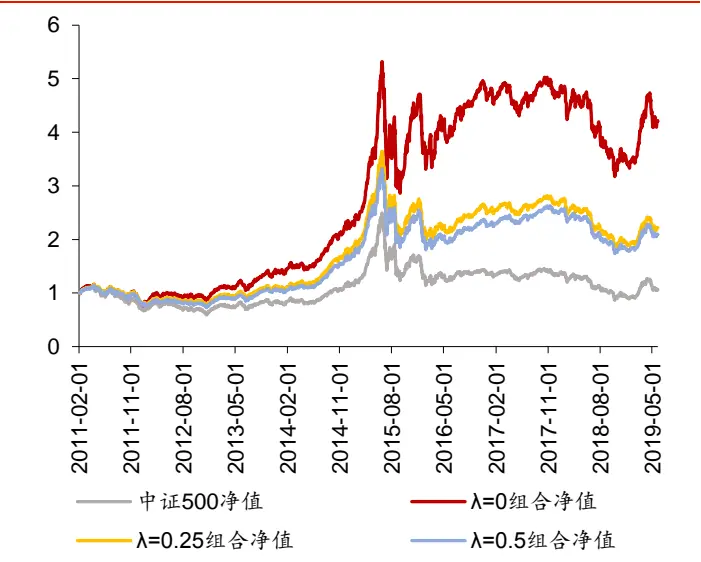
资料来源：Wind，华泰证券研究所

图表24： 不同风险厌恶系数最大化绝对收益组合超额收益净值和回撤
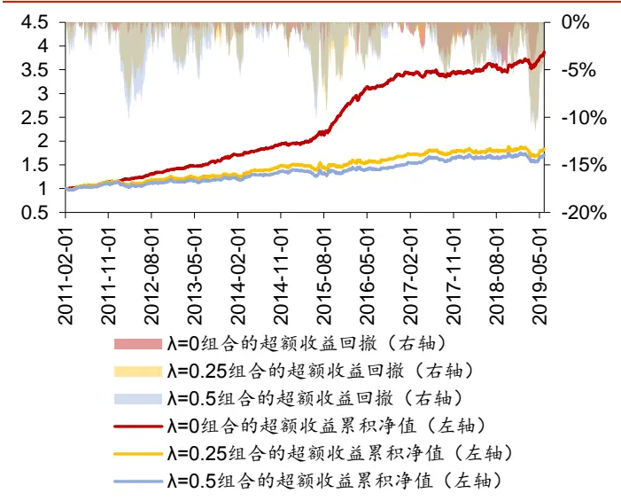
资料来源：Wind，华泰证券研究所

图表25： 不同风险厌恶系数下，最大化绝对收益组合的策略评价指标

| 年化 |  |  | 年化 |  |  | 年化超额 |  | 年化 |  | 超额收益 超额收益 |  |  | 平均股票 月单边 |
| --- | --- | --- | --- | --- | --- | --- | --- | --- | --- | --- | --- | --- | --- |
|  |  | 收益率 | 波动率 | 夏普比率 | 最大回撤 | 月胜率 | 收益率 | 跟踪误差 | 信息比率 | 最大回撤 | 月胜率 | 数量 | 换手率 |
| 中证 500 |  | 0.73% | 27.02% | 0.027 | 65.20% | 57.58% |  |  |  |  |  |  |  |
| 最大化绝对 | λ=0 | 19.43% | 26.50% | 0.733 | 46.18% | 60.61% | 18.70% | 5.23% | 3.573 | 5.39% | 78.79% | 114.04 | 64.97% |
| 收益组合 | λ=0.25 | 10.38% | 21.68% | 0.479 | 49.56% | 59.60% | 9.65% | 7.88% | 1.224 | 11.20% | 62.63% | 131.99 | 44.35% |
|  | λ=0.5 | 9.57% | 21.03% | 0.455 | 47.76% | 58.59% | 8.84% | 8.43% | 1.049 | 11.51% | 57.58% | 136.52 | 37.22% |

资料来源：Wind，华泰证券研究所

风险厌恶系数λ = 0代表不加入风险模型时 XGBoost 收益模型选股组合。由图可知，随着风险厌恶系数的增大，组合年化波动率逐渐减小。此外，风险约束会限制绝对收益，根据当前结果，若要寻找最大化夏普比率的λ取值，可以进一步测试λ ∈ (0,0.25)。

## 优化偏离权重，最大化主动收益

本小节取w为偏离权重，构建最大化风险调整后主动收益的投资组合，并依次探讨风险厌恶系数、收益模型、股票池、行业及风格中性约束、权重上下限对组合优化的影响。

第一，我们考察风险厌恶系数对组合优化的影响。我们以中证 500 指数为基准，使用华泰XGBoost 收益模型，构建全 A 股选股组合。约束条件包括：不允许做空，单只股票持仓权重上限为 1%，所有股票权重和为 100%，组合相对基准行业、市值中性。组合优化表示为：

$$
\begin{array}{c}Max_{w}\ w^{T}r-\lambda\cdot w^{T}(XFX^{T}+\varDelta)w\\s.t.\quad\forall n\ 0\leq(w_{n}+w_{n}^{bencch})\leq0.01\\\sum_{n}(w_{n}+w_{n}^{bencch})=1\\\forall i\quad w^{T}X_{i}=0\\\left|w^{T}X_{Size}\right|\leq0.5\\w_{n}^{bench}:基准指数在股票n上的权重\\X_{i}:所有股票在第i个行业因子上的因子暴露\\X_{Size}:所有股票在Size风格因子上的因子暴露\end{array}
$$

不同风险厌恶系数取值下，使用 XGBoost 收益模型的中证 500 最大化主动收益组合的回测净值、超额收益累积净值和回撤、策略评价指标如图表 26-28 所示。由图表可知，随着风险厌恶系数的增大，组合主动风险（年化跟踪误差）逐渐减小，超额收益及其最大回撤逐渐减小。当λ = 0.25时，信息比率最大，其值为 3.772。

第二，我们考察收益模型对组合优化的影响。我们使用华泰 Stacking 收益模型，构建全 A股选股组合。基准和约束条件同上。为了丰富对比数据，我们同样测试了 6 个风险厌恶系数取值下，组合的回测表现，结果如图表 29-31 所示。

图表26： 不同风险厌恶系数下，使用 XGBoost收益模型的中证 500最大化主动收益组合的净值
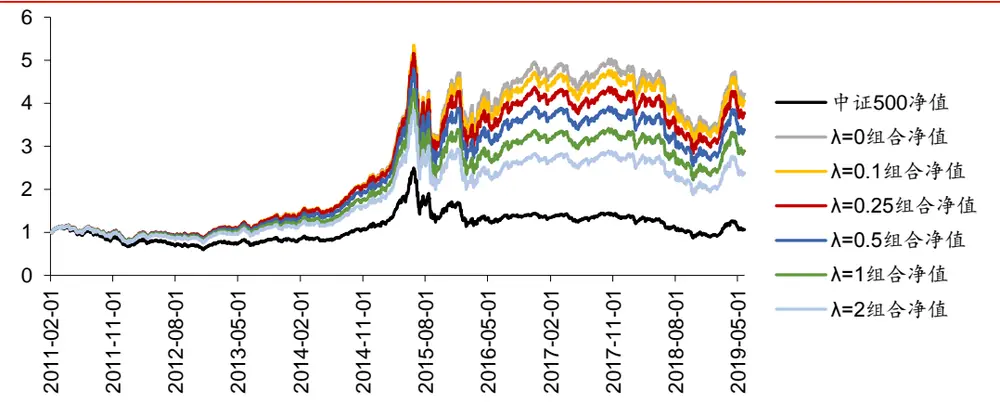
资料来源：Wind，华泰证券研究所

图表27： 不同风险厌恶系数下使用XGBoost收益模型的中证500最大化主动收益组合的超额收益净值和回撤
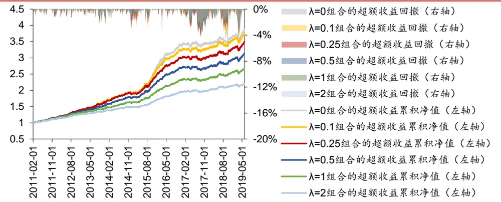
资料来源：Wind，华泰证券研究所

图表28： 不同风险厌恶系数下，使用 XGBoost收益模型的中证 500最大化主动收益组合的策略评价指标

|  |  |  | 年化 年化 |  |  |  | 年化超额 年化 |  | 超额收益 |  | 超额收益 | 平均股票 数量 | 月单边 换手率 |
| --- | --- | --- | --- | --- | --- | --- | --- | --- | --- | --- | --- | --- | --- |
|  | 收益率 | 波动率 |  | 夏普比率 | 最大回撤 | 月胜率 |  | 收益率 跟踪误差信息比率 | 最大回撤 | 月胜率 |  |  |  |
| 中证500 |  | 0.73% | 27.02% | 0.027 | 65.20% | 57.58% |  |  |  |  |  |  |  |
| 最大化主动 | λ=0 | 19.43% | 26.50% | 0.733 | 46.18% | 60.61% | 18.70% | 5.23% | 3.573 | 5.39% | 78.79% | 114.04 | 64.97% |
| 收益组合 | λ=0.1 | 18.87% | 26.67% | 0.708 | 46.74% | 59.60% | 18.14% | 4.86% | 3.729 | 4.61% | 81.82% | 134.87 | 64.97% |
|  | λ=0.25 | 17.81% | 26.66% | 0.668 | 46.60% | 61.62% | 17.08% | 4.53% | 3.772 | 4.53% | 82.83% | 165.26 | 64.56% |
|  | λ=0.5 | 16.25% | 26.61% | 0.611 | 46.87% | 61.62% | 15.52% | 4.21% | 3.688 | 4.25% | 83.84% | 216.46 | 62.62% |
|  | λ=1 | 14.01% | 26.54% | 0.528 | 48.66% | 61.62% | 13.28% | 3.79% | 3.506 | 3.85% | 81.82% | 311.08 | 58.44% |
|  | λ=2 | 11.27% | 26.53% | 0.425 | 51.47% | 61.62% | 10.53% | 3.24% | 3.255 | 3.50% | 83.84% | 459.77 | 51.78% |

资料来源：Wind，华泰证券研究所

图表29： 不同风险厌恶系数下，使用 Stacking收益模型的中证 500最大化主动收益组合的净值
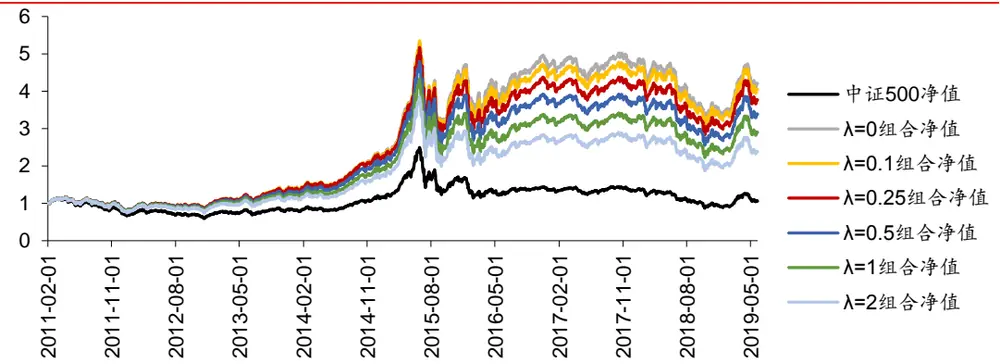
资料来源：Wind，华泰证券研究所

图表30： 不同风险厌恶系数下使用 Stacking 收益模型的中证 500 最大化主动收益组合的超额收益净值和回撤

资料来源：Wind，华泰证券研究所

图表31： 不同风险厌恶系数下，使用 Stacking收益模型的中证 500最大化主动收益组合的策略评价指标

|  |  | 年化 年化 |  |  |  | 年化超额 |  | 年化 |  | 超额收益 超额收益 |  |  | 平均股票 月单边 |
| --- | --- | --- | --- | --- | --- | --- | --- | --- | --- | --- | --- | --- | --- |
|  | 收益率 |  | 波动率 | 夏普比率 最大回撤 |  | 月胜率 | 收益率跟踪误差 |  | 信息比率 | 最大回撤 | 月胜率 | 数量 换手率 |  |
| 中证 500 |  | 0.73% | 27.02% | 0.027 | 65.20% | 57.58% |  |  |  |  |  |  |  |
| 最大化主动 | λ=0 | 19.43% | 26.50% | 0.733 | 46.18% | 60.61% | 18.70% | 5.23% | 3.573 | 5.39% | 78.79% | 114.04 | 64.97% |
| 收益组合 | λ=0.1 | 18.88% | 26.67% | 0.708 | 46.75% | 59.60% | 18.15% | 4.87% | 3.728 | 4.62% | 81.82% | 134.55 | 64.96% |
|  | λ=0.25 | 17.83% | 26.66% | 0.669 | 46.62% | 61.62% | 17.09% | 4.53% | 3.774 | 4.54% | 82.83% | 164.77 | 64.56% |
|  | λ=0.5 | 16.27% | 26.62% | 0.611 | 46.87% | 61.62% | 15.54% | 4.21% | 3.691 | 4.28% | 83.84% | 216.20 | 62.64% |
|  | λ=1 | 14.05% | 26.55% | 0.529 | 48.64% | 61.62% | 13.32% | 3.79% | 3.516 | 3.85% | 81.82% | 310.31 | 58.49% |
|  | λ=2 | 11.30% | 26.53% | 0.426 | 51.45% | 61.62% | 10.56% | 3.24% | 3.263 | 3.50% | 83.84% | 459.91 | 51.84% |

资料来源：Wind，华泰证券研究所

由图表可知，使用 Stacking 收益模型构建的最大化主动收益组合表现与 XGBoost 组合表现相似。在接下来的测试中，若无特殊说明，我们统一以中证 500 指数为基准，使用XGBoost 收益模型，并取风险厌恶系数λ = 0.25。

第三，我们考察股票池对组合优化的影响。我们使用与上文中全 A股选股组合相同的约束条件，构建中证 500 成分股内选股的最大化主动收益组合，此组合与全 A 股选股组合的回测表现对比如下。由图表可知，在其他条件相同的情况下，约束成分股内选股虽然可以获得更小的主动风险，但是会更大程度地损失超额收益，从而导致信息比率低于全 A股选股组合。

图表32： 不同股票池内，最大化主动收益组合的净值
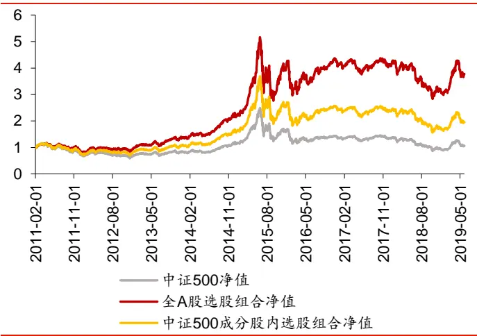
资料来源：Wind，华泰证券研究所

图表33： 不同股票池内，最大化主动收益组合的超额收益净值和回撤
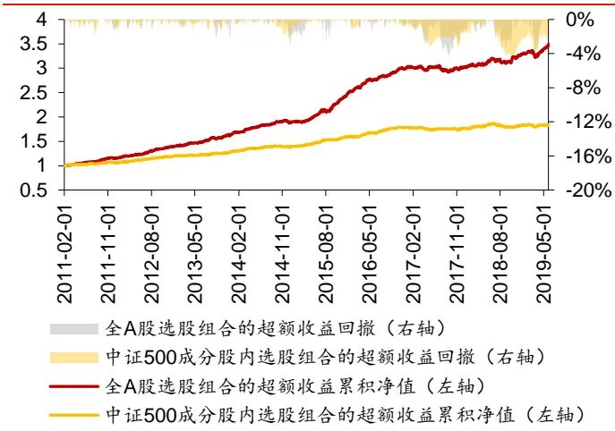
资料来源：Wind，华泰证券研究所

图表34： 不同股票池内，最大化主动收益组合的策略评价指标

|  | 年化 | 年化 |  |  | 年化 |  | 年化 | 超额收益 超额收益 平均股票 |  |  |  | 月单边 换手率 |
| --- | --- | --- | --- | --- | --- | --- | --- | --- | --- | --- | --- | --- |
|  |  | 收益率 波动率 | 夏普比率 | 最大回撤 |  | 月胜率超额收益率 跟踪误差 |  | 信息比率 | 最大回撤 | 月胜率 | 数量 |  |
| 中证500 | 0.73% | 27.02% | 0.027 | 65.20% | 58.00% |  |  |  |  |  |  |  |
| 全 A 股选股组合 | 17.81% | 26.66% | 0.668 | 46.60% | 61.62% | 17.08% | 4.53% | 3.772 | 4.53% | 82.83% | 165.26 | 64.56% |
| 中证500成分股内选股组合 | 8.63% | 27.12% | 0.318 | 57.68% | 59.60% | 7.90% | 3.33% | 2.372 | 4.97% | 74.75% | 125.53 | 51.91% |

资料来源：Wind，华泰证券研究所

最后，我们考察行业、风格中性和权重上、下限约束条件对组合优化的影响。我们将上文构建的行业和市值中性、持仓权重上限 1%的全 A股选股组合称为“中性和权重约束组合”，并构建以下三个对比组合：“中性约束组合”去掉权重上限约束，但保留行业和市值中性约束；“权重约束组合”去掉行业和市值中性约束，但保留权重上限约束；“无约束组合”去掉权重上限、行业和市值中性约束。其他条件保持不变。这三个组合的回测表现对比如下。为了直观显示，图表40-41中无约束组合的净值和超额收益累积净值以对数形式呈现。

需要注意的是，这里λ = 0代表不加入风险模型，仅根据收益模型线性优化选股的组合。特别地，对于λ = 0的无约束组合，由于未施加任何约束条件，策略每期只会选择预期收益最高的 1 只股票，这种极端情况实际上不再符合投资组合的概念。

由图表可知，对于所有约束条件，年化跟踪误差都随着风险厌恶系数的增大而减小，说明风险约束效果良好。但是对于不同约束条件，年化跟踪误差随风险约束系数的单位降幅不同。约束条件越多，降幅越小，说明在约束条件较多的情况下，约束条件设置对组合优化占据主要影响，风险厌恶系数只能实现微调。此外，对于相同的风险厌恶系数取值，约束条件越多，主动风险越小，同时超额收益越小，这说明约束条件在控制风险的同时限制了股票的选取空间，进而降低组合获取超额收益的能力。特别地，与持仓权重上限约束相比，行业和市值中性约束对减小主动风险的贡献更小，而对降低超额收益的贡献更大，从而导致信息比率整体更低。

图表35： 不同约束条件和风险厌恶系数下，最大化主动收益组合的策略评价指标

|  |  | 年化 | 年化 |  |  |  | 年化超额 | 年化 |  | 超额收益 | 超额收益 | 平均股票 | 月单边 |
| --- | --- | --- | --- | --- | --- | --- | --- | --- | --- | --- | --- | --- | --- |
|  |  | 收益率 | 波动率 夏普比率 最大回撤 |  |  | 月胜率 |  |  |  | 收益率跟踪误差 信息比率 最大回撤 | 月胜率 | 数量 | 换手率 |
| 中证500 |  | 0.73% | 27.02% | 0.027 | 65.20% | 57.58% |  |  |  |  |  |  |  |
| 中性和 | λ=0 | 19.43% | 26.50% | 0.733 | 46.18% | 60.61% | 18.70% | 5.23% | 3.573 | 5.39% | 78.79% | 114.04 | 64.97% |
| 权重约束 | λ=0.1 | 18.87% | 26.67% | 0.708 | 46.74% | 59.60% | 18.14% | 4.86% | 3.729 | 4.61% | 81.82% | 134.87 | 64.97% |
| 组合 | λ=0.5 | λ=0.25 17.81% | 26.66% | 0.668 | 46.60% | 61.62% | 17.08% | 4.53% | 3.772 | 4.53% | 82.83% | 165.26 | 64.56% |
|  | λ=1 | 16.25% | 26.61% | 0.611 | 46.87% | 61.62% | 15.52% | 4.21% | 3.688 | 4.25% | 83.84% | 216.46 | 62.62% |
| 中性约束 | λ=0 | 14.01% | 26.54% | 0.528 | 48.66% | 61.62% | 13.28% | 3.79% | 3.506 | 3.85% | 81.82% | 311.08 | 58.44% |
| 组合 | λ=0.1 | 20.90% | 27.41% | 0.762 | 48.59% | 55.56% | 20.17% | 8.45% | 2.387 | 9.95% | 73.74% | 29.26 | 75.27% |
|  | λ=0.25 19.57% | 20.69% | 27.31% | 0.758 | 48.18% | 60.61% | 19.96% | 6.31% | 3.166 | 6.35% | 75.76% | 72.29 | 73.60% |
|  | λ=0.5 |  | 26.90% | 0.727 | 47.10% | 59.60% | 18.84% | 5.26% | 3.581 | 5.60% | 82.83% | 122.99 | 70.19% |
|  |  | 17.30% | 26.67% | 0.649 | 46.99% | 59.60% | 16.57% | 4.56% | 3.631 | 4.46% | 84.85% | 192.33 | 65.75% |
| 权重约束 | λ=1 λ=0 | 14.52% | 26.57% | 0.547 | 47.68% | 61.62% | 13.79% | 3.94% | 3.499 | 3.93% | 82.83% | 300.69 | 59.76% |
|  |  | 31.68% | 29.36% | 1.079 | 49.55% | 61.62% | 30.95% | 8.72% | 3.548 | 24.10% | 76.77% | 100.00 | 60.67% |
| 组合 | λ=0.1 | 23.97% | 27.50% | 0.872 | 47.74% | 57.58% | 23.24% | 5.53% | 4.199 | 10.47% | 79.80% | 121.58 | 64.94% |
|  | λ=0.25 20.71% λ=0.5 |  | 26.87% | 0.771 | 46.53% | 61.62% | 19.98% | 4.85% | 4.116 | 6.84% | 81.82% | 153.63 | 64.09% |
| λ=1 |  | 17.92% | 26.68% | 0.672 | 46.65% | 61.62% | 17.19% | 4.40% | 3.909 | 5.24% | 81.82% | 206.27 | 62.30% |
| 无约束 | λ=0 | 14.95% | 26.64% | 0.561 | 48.02% | 62.63% | 14.22% | 3.92% | 3.628 | 3.89% | 82.83% | 301.55 | 58.70% |
| 组合 | λ=0.1 | 53.39% | 45.95% | 1.162 | 61.32% | 60.61% | 52.66% | 37.62% | 1.400 | 39.76% | 59.60% | 1.00 | 88.89% |
|  |  | 27.14% | 27.77% | 0.977 | 47.13% | 60.61% | 26.40% | 7.56% | 3.493 | 6.58% | 77.78% | 50.95 | 74.16% |
|  | λ=0.25 | 22.37% | 27.09% | 0.826 | 47.06% | 60.61% | 21.64% | 5.76% | 3.758 | 6.10% | 77.78% | 104.45 | 70.34% |
|  | λ=0.5 | 18.88% | 26.70% | 0.707 | 46.84% | 60.61% | 18.15% | 4.84% | 3.751 | 5.40% | 82.83% | 177.16 | 65.80% |
|  | λ=1 | 15.20% | 26.61% | 0.571 | 47.78% | 60.61% | 14.46% | 4.08% | 3.543 | 4.04% | 82.83% | 288.75 | 60.09% |

资料来源：Wind，华泰证券研究所

图表36： 不同风险厌恶系数下，中性约束组合的净值
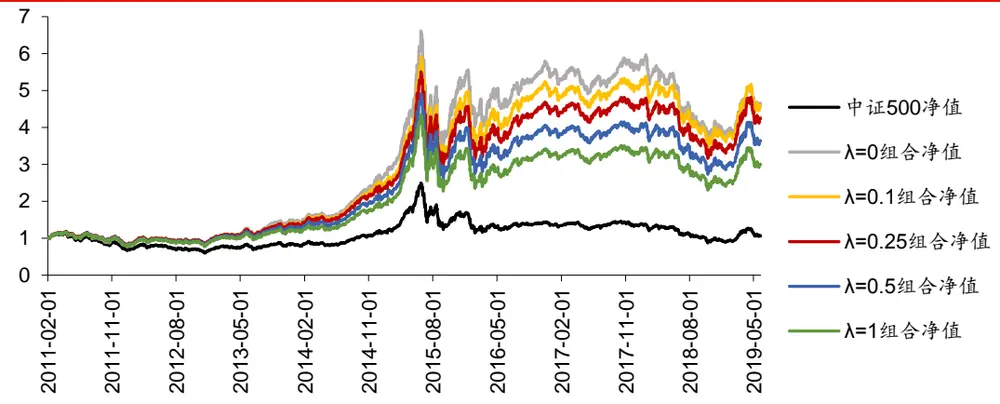
资料来源：Wind，华泰证券研究所

图表37： 不同风险厌恶系数下，中性约束组合的超额收益净值和回撤
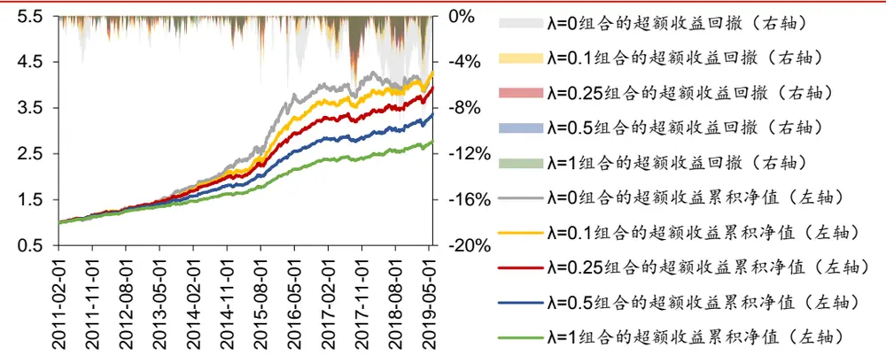
资料来源：Wind，华泰证券研究所

图表38： 不同风险厌恶系数下，权重约束组合的净值
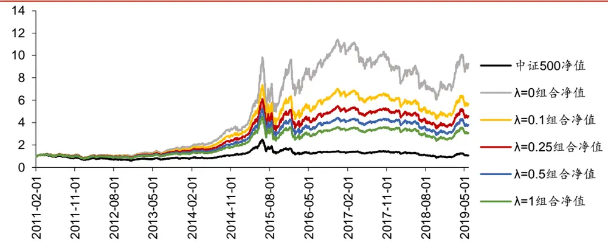
资料来源：Wind，华泰证券研究所

图表39： 不同风险厌恶系数下，权重约束组合的超额收益净值和回撤
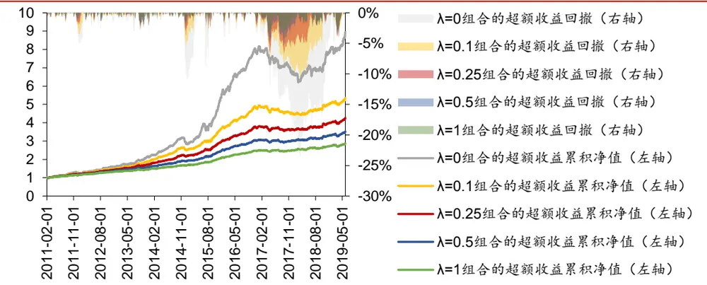
资料来源：Wind，华泰证券研究所

图表40： 不同风险厌恶系数下，无约束组合的对数净值
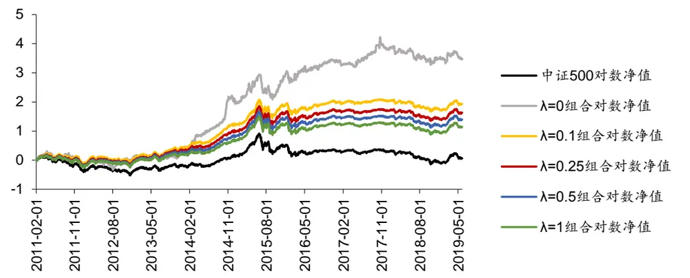
资料来源：Wind，华泰证券研究所

图表41： 不同风险厌恶系数下，无约束组合的超额收益对数净值和回撤
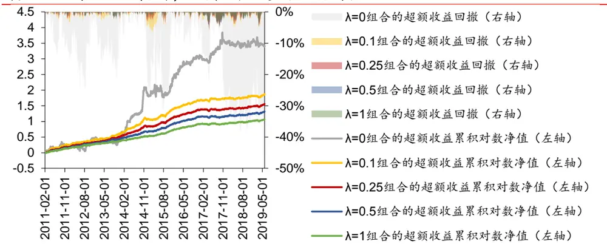
资料来源：Wind，华泰证券研究所

## 总结

华泰金工在经典多因子模型框架的基础上，参考 Barra 多因子风险模型，构建了华泰金工多因子风险模型。模型选用解释性良好的 10 类风格因子、29类行业因子和 1个国家因子作为共同风险因子。将数据预处理后的因子暴露数据对股票收益做横截面回归，计算因子收益和特异性收益，用于估计因子收益协方差矩阵和特异性收益方差矩阵。

对于因子收益协方差矩阵的估计，模型依次进行了 Newey-West调整、特征值调整和波动率偏误调整三步修正，分别修正了因子收益时序相关性导致的协方差矩阵估计误差、协方差矩阵特征值估计误差造成的最优投资组合风险低估以及一段时间内持续性的风险偏误问题。对于特异性风险协方差矩阵的估计，模型依次进行了 Newey-West 调整、结构化调整、贝叶斯压缩调整和波动率偏误调整四步修正，分别修正了特异性收益时序相关性导致的方差矩阵估计误差、特异性收益数据缺失和异常值导致的方差矩阵估计误差、特异风险均值回归现象导致的样本外风险偏误以及一段时间内持续性的风险偏误问题。调整后的风险矩阵的风险预测准确度良好。

多因子风险模型有效降维，将对于高维股票的收益-风险预测转换为对于低维因子的收益-风险预测，大大减少了计算量，有效提升计算速度。因子收益协方差矩阵的计算复杂度为因子数量的平方，特异性收益方差矩阵为对角矩阵，计算复杂度与股票数量成正比。而传统股票收益协方差矩阵的计算复杂度与股票数量的平方成正比。因此，在股票数量较多的情况下，多因子风险模型的计算效率具有显著优势。

多因子风险模型有两个主要应用——组合优化构建最优投资组合与投资组合收益-风险归因。本文关注前者，考察了多因子风险模型在组合优化中的应用。利用多因子风险模型，我们构建了最小化绝对风险组合、最小化主动风险组合、最大化风险调整后绝对收益组合以及最大化风险调整后主动收益组合。其中，结合华泰 XGBoost 收益模型构建的最大化风险调整后主动收益组合，在 2011-02-01 至 2019-05-31 区间内，行业市值中性及持仓上限约束组合的年化超额收益率 17.08%，年化跟踪误差 4.53%，信息比率 3.77。与不使用风险模型相比，信息比率提升 0.20；仅持仓上限约束组合的年化超额收益率 23.24%，年化跟踪误差 5.53%，信息比率 4.20，与不使用风险模型相比，信息比率提升 0.65。

此外，本文考察了组合优化主要参数——基准指数、股票池、风险厌恶系数、收益模型、约束条件——对最优投资组合表现的影响。不同基准指数的跟踪难度可能不同。如果最小化主动风险，指数成分股内选股比全 A股选股效果更好；如果最小化绝对风险、最大化绝对收益或主动收益，全 A股选股效果更好。风险厌恶系数的选取取决于优化目的，可以根据夏普比率或信息比率估算大致范围；当组合优化约束条件较多时，风险厌恶系数调整能力相对有限。收益模型决定了最优组合获取收益的能力，收益模型的 Alpha 能力越强，组合绝对收益或主动收益可能更高，从而使夏普比率或信息比率更高。当约束条件过多时，股票的选取空间可能为空集或在选取空间内目标函数不收敛，导致截面不可解；当约束条件过少或无约束条件时，组合优化对收益模型和风险模型的估计误差非常敏感，可以根据实际情况放松或增强约束。

## 参考文献

Markowitz, Harry. 1952. “Portfolio Selection.” Journal of Finance, vol. 7: 77-91.

Menchero, Jose, Jun Wang, and D.J. Orr. “Improving risk forecasts for optimized portfolios.” Financial Analysts Journal, 2012, 68(3): 40-50.

Muller, Peter. 1993. “Financial Optimization.” Cambridge University Press (Zenios): 80-98.

Newey, W., and K. West. 1987. “A Simple, Positive Semi-Definite, Heteroskedasticity and Autocorrelation Consistent Covariance Matrix.” Econometrica, Vol. 55, No. 3: 703-708.

Shepard, Peter. 2009. “Second Order Risk.” Working paper, http://arxiv.org/abs/09 08.2455v1.

## 附录 风险矩阵估计的参数列表

图表42： 风险矩阵估计的参数列表

|  | 调整步骤 | 参数定义 | 参数符号 | 参数取值 |
| --- | --- | --- | --- | --- |
| 因子收益协方差矩阵 | 指数加权移动平均 | 时间窗 | h | 252 |
|  |  | 协方差权重半衰期 | $\tau_{cov}$ | 90 |
|  |  | 方差权重半衰期 | $\underline{{\tau_{var}}}$ | 90 |
|  | Newey-West 调整 | 协方差滞后期 | $D_{cov}$ | 2 |
|  |  | 方差滞后期 | $\boxed{D_{var}}$ | 2 |
|  | 特征值调整 | 蒙特卡洛模拟次数 | M | 3000 |
|  |  | 模拟特征组合收益率期数 | T | 100 |
|  | 波动率偏误调整 | 调整系数 | α | 1.5 |
|  |  | 时间窗 | h | 252 42 |
| 权重半衰期 指数加权移动平均 |  |  | τ |  |
| 特异性收益方差矩阵 |  | 时间窗 权重半衰期 | h | 252 |
|  | Newey-West 调整 |  | τ | 90 |
|  | 结构化调整 | 滞后期 | D | 5 |
|  | 贝叶斯压缩调整 | 调整系数 | $E_{0}$ | 1.05 |
|  | 波动率偏误调整 | 压缩系数 | q | 1 |
|  |  | 时间窗 权重半衰期 | h τ | 252 |
|  |  |  |  | 42 |

资料来源：华泰证券研究所

## 风险提示

多因子风险模型是历史经验的总结，如果市场规律改变，存在风险预测滞后、甚至模型彻底失效的可能；报告中的沪深 300 和中证 500 指数只是作为常见指数，并不能完全代表 A股市场全部指数的情况，请投资者谨慎、理性地看待。

## 免责申明

收到本报告而视其为客户。

本报告基于本公司认为可靠的、已公开的信息编制，但本公司对该等信息的准确性及完整性不作任何保证。本报告所载的意见、评估及预测仅反映报告发布当日的观点和判断。在不同时期，本公司可能会发出与本报告所载意见、评估及预测不一致的研究报告。同时，本报告所指的证券或投资标的的价格、价值及投资收入可能会波动。本公司不保证本报告所含信息保持在最新状态。本公司对本报告所含信息可在不发出通知的情形下做出修改，投资者应当自行关注相应的更新或修改。

本公司力求报告内容客观、公正，但本报告所载的观点、结论和建议仅供参考，不构成所述证券的买卖出价或征价。该等观点、建议并未考虑到个别投资者的具体投资目的、财务状况以及特定需求，在任何时候均不构成对客户私人投资建议。投资者应当充分考虑自身特定状况，并完整理解和使用本报告内容，不应视本报告为做出投资决策的唯一因素。对依据或者使用本报告所造成的一切后果，本公司及作者均不承担任何法律责任。任何形式的分享证券投资收益或者分担证券投资损失的书面或口头承诺均为无效。

本公司及作者在自身所知情的范围内，与本报告所指的证券或投资标的不存在法律禁止的利害关系。在法律许可的情况下，本公司及其所属关联机构可能会持有报告中提到的公司所发行的证券头寸并进行交易，也可能为之提供或者争取提供投资银行、财务顾问或者金融产品等相关服务。本公司的资产管理部门、自营部门以及其他投资业务部门可能独立做出与本报告中的意见或建议不一致的投资决策。

本报告版权仅为本公司所有。未经本公司书面许可，任何机构或个人不得以翻版、复制、发表、引用或再次分发他人等任何形式侵犯本公司版权。如征得本公司同意进行引用、刊发的，需在允许的范围内使用，并注明出处为“华泰证券研究所”，且不得对本报告进行任何有悖原意的引用、删节和修改。本公司保留追究相关责任的权力。所有本报告中使用的商标、服务标记及标记均为本公司的商标、服务标记及标记。

本公司具有中国证监会核准的“证券投资咨询”业务资格，经营许可证编号为：91320000704041011J。

全资子公司华泰金融控股（香港）有限公司具有香港证监会核准的“就证券提供意见”业务资格，经营许可证编号为：AOK809

©版权所有 2019年华泰证券股份有限公司

## 评级说明

## 行业评级体系

－报告发布日后的6个月内的行业涨跌幅相对同期的沪深300指数的涨跌幅为基准；

－投资建议的评级标准

增持行业股票指数超越基准 中性行业股票指数基本与基准持平 减持行业股票指数明显弱于基准

## 公司评级体系

－报告发布日后的6个月内的公司涨跌幅相对同期的沪深300指数的涨跌幅为基准；
－投资建议的评级标准
买入股价超越基准 20%以上
增持股价超越基准 5%-20%
中性股价相对基准波动在-5%~5%之间
减持股价弱于基准 5%-20%
卖出股价弱于基准 20%以上

## 华泰证券研究

## 南京

南京市建邺区江东中路228号华泰证券广场1号楼/邮政编码：210019

电话：86 25 83389999 /传真：86 25 83387521

电子邮件：ht-rd@htsc.com

## 深圳

深圳市福田区益田路5999号基金大厦10楼/邮政编码：518017

电话：86 755 82493932 /传真：86 755 82492062

电子邮件：ht-rd@htsc.com

## 北京

北京市西城区太平桥大街丰盛胡同28号太平洋保险大厦A座18层

邮政编码：100032

电话：86 10 63211166/传真：86 10 63211275

电子邮件：ht-rd@htsc.com

## 上海

上海市浦东新区东方路18号保利广场E栋23楼/邮政编码：200120

电话：86 21 28972098 /传真：86 21 28972068

电子邮件：ht-rd@htsc.com