## 金工研究/深度研究

2019年10月15日

林晓明 执业证书编号：S0570516010001

研究员 0755-82080134

陈烨 执业证书编号：S0570518080004

研究员 010-56793942

李子钰 0755-23987436

联系人 liziyu@htsc.com

何康 021-28972039

联系人 hekang@htsc.com

# 华泰单因子测试之历史分位数因子华泰多因子系列之十三

历史分位数因子具有明确的经济学意义，其中包含选股效果稳定的因子历史分位数计算的是某个指标当前取值在一段历史区间中所处的分位数点，是常用的时间序列分析方法，反映了相应指标的变化趋势，具有明确的经济学意义，适合针对估值、财务质量因子构造新的因子(本文中历史分位数因子的表达式为：ts_rank(F, n)，即因子 F 在过去 n 个季度里的分位数)。本文系统测试了 89 个相关因子，其中估值类、盈利能力类、收益质量类、营运能力类历史分位数因子选股效果较好，现金流量类、资本结构类、偿债能力类历史分位数因子选股效果较差。

## 估值类历史分位数因子中，EP、SP历史分位数因子表现较好

估值历史分位数反映了个股当前估值在一段历史区间中的高低程度，能刻画出个股的估值在一段历史区间中是否“便宜”。本文构造了 EP、BP、SP、NCFP、OCFP 的历史分位数因子，这些因子间的相关性较高。估值类历史分位数因子的计算逻辑与反转因子有一定相似性，在剔除了行业、市值、反转和对应原始因子(例如：ts_rank(EP, 2)的对应原始因子为 EP)的影响后，EP、SP 历史分位数因子表现较好。2007 年 4 月以来，ts_rank(EP, 2)因子在沪深 300、中证 500、全 A 股的 RankIC 均值分别为 5.14%、6.13%、6.21%，分五层测试中多空组合夏普比率分别为 0.77、1.88、2.46。

## 财务质量类历史分位数因子中，盈利能力类历史分位数因子表现最好

财务质量历史分位数能刻画出个股财务指标在历史区间中的变化趋势。本文构造了六大类财务质量类历史分位数因子，其计算逻辑和成长类因子有相似之处，在剔除了行业、市值、成长和对应原始因子的影响后，盈利能力类历史分位数因子选股效果最好，收益质量、营运能力类历史分位数因子次之，现金流量、资本结构、偿债能力类历史分位数因子选股效果较差。2007 年 4 月以来，ts_rank(qfa_roa, 6)因子在沪深 300、中证 500、全 A股的 RankIC 均值分别为 6.50%、5.68%、6.89%，分五层测试中多空组合夏普比率分别为 0.75、0.76、1.97。

## 部分因子的选股效果随着回看期数的增加大致呈现出逐渐减弱的趋势

在本文的单因子测试中，表现较好的因子选股效果随着回看期数的增加大致呈现出逐渐减弱的趋势。例如 ts_rank(qfa_grossprofitmargin, n)因子中n 的取值分别为 6、8、12 时，因子在全 A 股的因子收益率均值为分别为0.88%、0.85%、0.73%，RankIC 均值分别为 5.63%、5.37%、4.69%，多空组合夏普比率分别为 2.01、1.82、1.52。三个选股指标的取值都随着n 的增大逐渐减小。我们推测其背后的原因是回看期数越小，因子值的变化越及时，能较快反映出个股基本面的变化趋势。

风险提示：单因子测试结果是历史经验的总结，如果市场规律改变，存在失效的可能。历史分位数因子的选股效果具有参数敏感性，请谨慎使用。

## 历史分位数因子的选取及测试框架

## 历史分位数因子的选取

本文是华泰多因子系列研究第十二篇，是单因子测试系列的第十篇。在多因子系列首篇报告中，我们系统地阐述了多因子模型的基本理论，详细描述了多因子模型构建的流程，在多因子系列第二篇到第十一篇报告中，我们分别对估值、成长、动量反转、换手率、波动率、资金流向、财务质量、一致预期、101 技术因子单独进行详细的研究和检验，通过综合对比评价，筛选出能持续获得稳健收益的优质因子，这正是构建多因子选股模型的关键一步。本报告中，我们将基于估值和财务质量因子，构建其历史分位数因子，并通过回归法、IC 值分析、分层测试法等方法检验各因子的有效性。

历史分位数计算的是某个指标当前的取值在一段历史区间中所处的分位数点，是常用的时间序列分析方法，具有明确的经济学意义。图表 1 展示了万科 A(000002.SZ)的 PE和 PE历史分位数(过去 3年)。可以看出，PE历史分位数反映了个股当前 PE估值在一段历史区间中的高低程度，能定量刻画出个股的 PE估值在一段历史区间中是否“便宜”。在同一时间截面上，可以构建 PE历史分位数因子，该因子或许能提供预测股票收益的信息。

图表1： 万科 A(000002.SZ)的 PE 和 PE 历史分位数(过去 3 年)
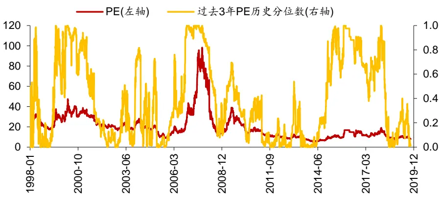
资料来源：Wind，华泰证券研究所

图表 2 展示了万科 A(000002.SZ)的单季度销售毛利率(qfa_grossprofitmargin)及其历史分位数(过去 3 年)。可以看出，该历史分位数描述了个股当前的单季度销售毛利率在一段历史区间中的高低程度，能定量刻画出个股的盈利能力在历史区间中的变化趋势。在同一时间截面上，可以构建单季度销售毛利率历史分位数因子，该因子或许能提供预测股票收益的信息。

图表2： 万科 A(000002.SZ)的单季度销售毛利率(qfa_grossprofitmargin)及其历史分位数(过去 3 年)
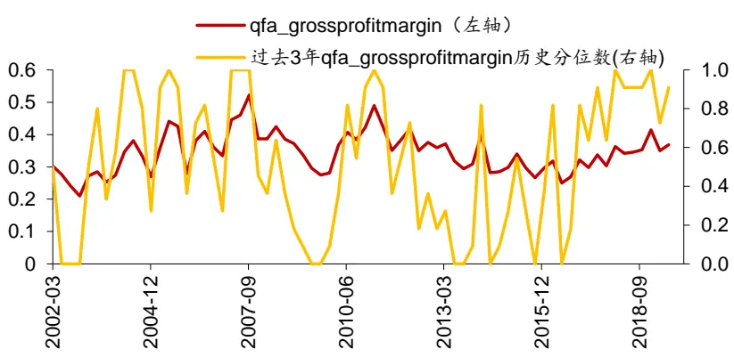
资料来源：Wind，华泰证券研究所

历史分位数使用了数据在时间序列上的信息，具有明确的经济学意义，适合针对基本面因子构造新的因子。近期在学术界也有相关的研究，Dashan Huang 等人在其论文《TwinMomentum: Fundamental Trends Matter》(2019)中指出，传统基本面因子表现不如价格动量等技术因子，主要是因为它们未充分利用已知的全部基本面信息。传统基本面因子通常只利用了最近的信息，没有考虑基本面数据的变化趋势。因此Dashan Huang 等人针对性地构建了基本面动量因子。通过将基本面趋势纳入考量，基本面动量因子能获得相当不错的表现。

本文中，我们将基于前期报告中的估值和财务质量因子来构造历史分位数因子。图表 3 展示了构造历史分位数因子所用到的基础因子，主要包含估值和财务质量两大类因子，财务质量因子中，又包含 6类细分因子。

图表3： 构造历史分位数因子所用到的基础因子
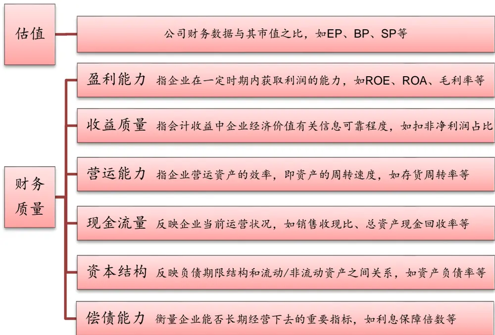
资料来源：华泰证券研究所

图表 4中列出了本报告要测试的所有历史分位数因子，其中函数 ts_rank(F, n)计算的是因子 F在过去 n个季度里的分位数(特殊情况：设因子 F历史可用数据长度为 m，若 m<n 则函数计算的是因子 F 在过去 m 个季度里的分位数)。对于估值类因子，由于可以每日计算因子值，可用数据点较多，因此 n的最小取值设为 2。对于财务质量类因子，由于每个季度才能计算因子值，可用数据点较少，因此 n 的最小取值设为 6。综合考虑因子的选股效果和相关性后，本文重点展示的因子在图表 4 中以浅红色底色标出。

图表4： 历史分位数因子及其描述

| 大类 | 子类 | 因子表达式 | 因子描述 |
| --- | --- | --- | --- |
| 估值 | 估值 | ts_rank(EP, n) | 净利润(TTM)/总市值在过去n 个季度里的分位数(n=2,4,8,12) |
|  |  | ts_rank(BP, n) | 净资产/总市值在过去n个季度里的分位数(n=2,4,8,12) |
|  |  | ts_rank(SP, n) | 营业收入(TTM)/总市值在过去n 个季度里的分位数(n=2,4,8,12) |
|  |  | ts_rank(NCFP, n) | 净现金流(TTM)/总市值在过去n 个季度里的分位数(n=2,4,8,12) |
|  |  | ts_rank(OCFP, n) | 经营现金流(TTM)/总市值在过去n个季度里的分位数(n=2,4,8,12) |
| 财务质量 | 盈利能力 | ts_rank(qfa_roe, n) | 单季度 ROE(平均)在过去 n 个季度里的分位数(n=6,8,12) |
|  |  | ts_rank(roe_deducted, n) | 当年累计 ROE(扣非/平均)在过去n 个季度里的分位数(n=6,8,12) |
|  |  | ts_rank(qfa_roa, n) | 单季度总资产净利率在过去n个季度里的分位数(n=6,8,12) |
|  |  | ts_rank(roa, n) | 当年累计总资产净利率在过去n个季度里的分位数(n=6,8,12) |
|  |  | ts_rank(qfa_grossprofitmargin, n) | 单季度销售毛利率在过去n 个季度里的分位数(n=6,8,12) |
|  |  | ts_rank(grossprofitmargin_ttm2, n) | 销售毛利率 TTM 在过去 n 个季度里的分位数(n=6,8,12) |
|  |  | ts_rank(qfa_netprofitmargin, n) | 单季度销售净利率在过去n个季度里的分位数(n=6,8,12) |
|  |  | ts_rank(netprofitmargin_ttm2, n) | 销售净利率 TTM 在过去 n 个季度里的分位数(n=6,8,12) |
|  | 收益质量 | ts_rank(qfa_operateincometoebt, n) | 单季度经营活动净收益/利润总额在过去n个季度里的分位数(n=6,8,12) |
| ts_rank(operateincometoebt, n) |  | 当年累计经营活动净收益/利润总额在过去n个季度里的分位数(n=6,8,12) |  |
|  |  | ts_rank(qfa_deductedprofittoprofit， n)单季度扣非净利润/净利润在过去n 个季度里的分位数(n=6,8,12) |  |
|  | 营运能力 | ts_rank(deductedprofittoprofit, n) | 当年累计扣非净利润/净利润在过去n个季度里的分位数(n=6,8,12) |
|  |  | ts_rank(invturn, n) | 存货周转率在过去n个季度里的分位数(n=6,8,12) |
|  |  | ts_rank(caturn, n) ts_rank(assetsturn, n) | 流动资产周转率在过去n个季度里的分位数(n=6,8,12) 总资产周转率在过去n 个季度里的分位数(n=6,8,12) |
|  | 现金流量 | ts_rank(apturn, n) | 应付账款周转率在过去n个季度里的分位数(n=6,8,12) |
|  |  | ts_rank(ocftoor, n) | 当年累计经营性现金流量净额/营业收入在过去n个季度里的分位数(n=6,8,12) |
|  | 资本结构 | ts_rank(ocftoor_ttm2, n) | 经营性现金流量净额/营业收入TTM 在过去n个季度里的分位数(n=6,8,12) |
|  |  | ts_rank(debttoassets, n) | 资产负债率在过去n个季度里的分位数(n=6,8,12) |
|  | 偿债能力 | ts_rank(currentdebttodebt, n) | 流动负债/负债合计在过去n个季度里的分位数(n=6,8,12) |
| ts_rank(ebittointerest, n) |  | 利息保障倍数(EBIT/利息费用)在过去n个季度里的分位数(n=6,8,12) |  |
|  | ts_rank(debttotangibleequity, n) | 有形净值债务率在过去n个季度里的分位数(n=6,8,12) |  |

资料来源：Wind，华泰证券研究所

## 历史分位数因子的测试框架

在本报告中，我们首先观察历史分位数因子在 A股市场的分布规律，通过因子在不同行业的差异已经跟其他因子的相关性，判断在单因子回归测试中是否应该进行中性化处理。随后我们将使用分层测试法、回归法、IC值分析等手段对因子进行全面测试，详细观察因子区分度、单调性等规律，选出有效且稳健的因子。最后我们将根据以上测试结果进行综合分析。

图表5： 历史分位数因子分析测试框架
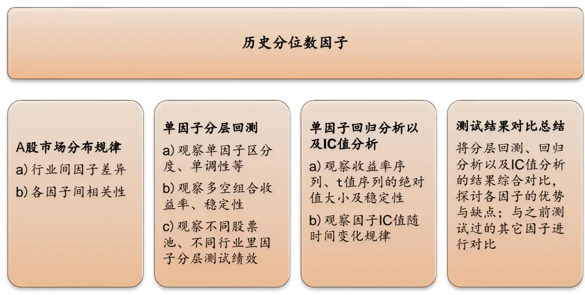
资料来源：华泰证券研究所

## 历史分位数因子的行业间差异

历史分位数因子在不同行业间存在一定差异。我们选取 ts_rank(qfa_roe,6)、ts_rank(EP,2)因子作为代表(因子具体定义见图表 4)，根据 2019 年半年报计算它们在各一级行业的中位数，如下图所示。可以发现，因子在不同行业间的取值水平存在一定差异。我们认为对上市公司直接进行跨行业比较意义不大，在单因子测试中还是应考虑行业中性处理。

图表6： 各一级行业 ts_rank(qfa_roe,6)、ts_rank(EP,2)因子中位数比较(2019 年半年报)
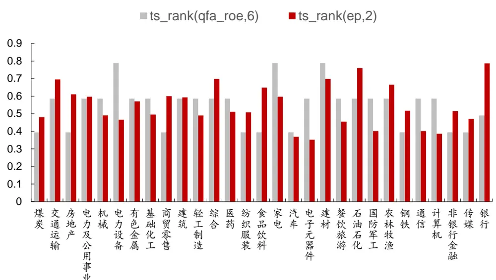
资料来源：Wind，华泰证券研究所

## 历史分位数因子在截面上的因子值相关性分析

本节我们将分析历史分位数因子之间的相关性以及和其他种类因子的相关性。

估值类历史分位数因子的计算逻辑与反转因子有一定相似性，因此分析二者的相关性很有必要。同时图表 7 也展示了估值类历史分位数因子与估值因子(EP、BP 等)以及对数市值因子(ln_capital)的相关性。

图表7： 估值类历史分位数因子和其他因子在截面上的因子值相关性分析(根据 2007～2019年财务报表和行情信息计算)
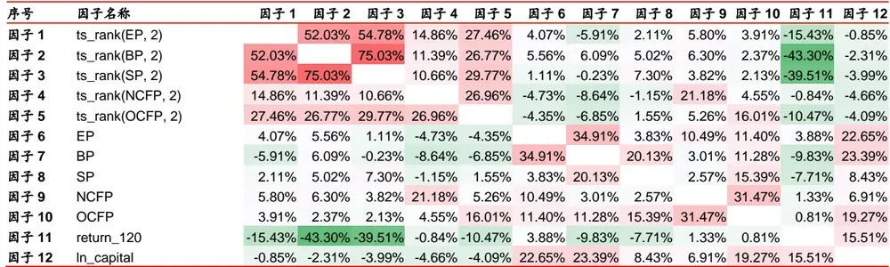
资料来源：Wind，华泰证券研究所

图表 7 中以过去 2 个季度的历史分位数因子为例分析相关性，其中 return_120 是 120 日反转因子(对应 2 个季度)。可以看出，估值类历史分位数因子与反转因子相关性较高，与估值因子和对数市值因子相关性较低。估值类历史分位数因子当中，ts_rank(EP, 2)、ts_rank(BP, 2)、ts_rank(SP, 2)之间相关性较高。

财务质量类历史分位数因子的计算逻辑和成长类因子有相似之处，都使用了历史的财务信息来计算因子。因此图表 9分析了几个代表性财务质量类历史分位数因子和成长类因子的相关性。(成长类因子说明：Sales_G_q：营业收入同比增长率；Profit_G_q：净利润同比增长率；OCF_G_q：经营性现金流同比增长率；ROE_G_q：ROE同比增长率)。同时图表 9 也展示了财务质量类历史分位数因子与对数市值因子(ln_capital)的相关性。

图表 9中以过去 6个季度的历史分位数因子为例分析相关性。可以看出，财务质量类历史分位数因子与成长因子和对数市值因子的相关性都较低。财务质量类历史分位数因子当中，ts_rank(qfa_roe, 6)、ts_rank(qfa_roa, 6)、ts_rank(qfa_netprofitmargin, 6)之间的相关性较高。

图表8： 需要进行相关性分析的因子的说明(请结合图表 9)

| 因子序号 | 因子名称 |
| --- | --- |
| 因子1 | ts_rank(qfa_roe, 6) |
| 因子2 | ts_rank(qfa_roa, 6) |
| 因子3 | ts_rank(qfa_grossprofitmargin, 6) |
| 因子4 | ts_rank(qfa_netprofitmargin, 6) |
| 因子5 | ts_rank(qfa_operateincometoebt, 6) |
| 因子6 | ts_rank(qfa_deductedprofittoprofit, 6) |
| 因子7 | ts_rank(assetsturn, 6) |
| 因子8 | ts_rank(ocftoor_ttm2, 6) |
| 因子9 | ts_rank(currentdebttodebt, 6) |
| 因子10 | ts_rank(ebittointerest, 6) |
| 因子11 | Sales_G_q |
| 因子12 | Profit_G_q |
| 因子13 | OCF_G_q |
| 因子14 | ROE_G_q |
| 因子15 | In_capital |

资料来源：Wind，华泰证券研究所

图表9： 财务质量类历史分位数因子和其他因子在截面上的因子值相关性分析(根据 2007～2019年财务报表和行情信息计算，请结合图表 8)

| 因子序号 | 因子1 因子2 因子3 因子4 因子5 因子6 因子7 因子8 因子9因子10 |  |  |  |  |  |  |  |  |  | 因子11因子 12因子 13 因子14因子15 |  |  |  |  |
| --- | --- | --- | --- | --- | --- | --- | --- | --- | --- | --- | --- | --- | --- | --- | --- |
| 因子1 |  | 90.30% | 30.94% | 73.52% | 12.91% | 6.23% | 22.15% | 7.05% | -0.40% | 44.10% | 3.05% 8.80% |  | 2.57% | 10.39% | 7.24% |
| 因子2 | 90.30% |  | 32.33% | 78.06% | 14.15% | 6.80% | 21.24% | 6.94% | -0.09% | 49.98% | 2.41% | 8.60% | 2.42% | 9.53% | 7.06% |
| 因子3 | 30.94% 32.33% |  |  | 35.75% | 21.65% | 11.75% | -1.04% | 8.13% | -1.37% | 20.56% | -1.22% | 4.39% | -0.16% | 3.26% | 4.05% |
| 因子4 | 73.52% | 78.06% | 35.75% |  | 5.91% | 2.58% | 8.26% | 9.20% | 2.26% | 46.52% | 2.47% | 9.09% | 3.58% | 7.80% | 4.03% |
| 因子5 | 12.91% | 14.15% | 21.65% | 5.91% |  | 50.33% | 8.06% | 2.47% | 0.40% | 9.55% | 2.87% | 2.44% | 0.14% | 0.88% | 2.27% |
| 因子6 | 6.23% | 6.80% | 11.75% | 2.58% | 50.33% |  | 5.55% | 1.00% | 2.56% | 6.22% | 1.66% | 1.09% | -1.03% | 2.60% | 1.36% |
| 因子7 | 22.15% | 21.24% | -1.04% | 8.26% | 8.06% | 5.55% |  | 1.74% | 1.87% | 17.40% | 17.75% | 6.56% | 4.37% | 6.99% | 2.29% |
| 因子8 | 7.05%6.94% |  | 8.13% | 9.20% | 2.47% | 1.00% | 1.74% |  | 1.95% | 5.77% | 0.11% | 1.71% | 11.47% | 3.25% | 0.00% |
| 因子9 | -0.40% | -0.09% | -1.37% | 2.26% | 0.40% | 2.56% | 1.87% | 1.95% |  | 1.42% | 1.76% | -1.04% | 0.25% | -2.04% | -5.05% |
| 因子10 | 44.10% | 49.98% | 20.56% | 46.52% | 9.55% | 6.22% | 17.40% | 5.77% | 1.42% |  | 4.08% | 12.52% | 2.90% | 11.32% 3.25% |  |
| 因子11 | 3.05% | 2.41% | -1.22% | 2.47% | 2.87% | 1.66% | 17.75% | 0.11% | 1.76% | 4.08% |  | 9.29% | 0.49% | 1.62% | 0.81% |
| 因子12 | 8.80%8.60% |  | 4.39% | 9.09% | 2.44% | 1.09% | 6.56% | 1.71% | -1.04% | 12.52% | 9.29% |  | -0.50% | 44.79% | 4.06% |
| 因子13 | 2.57% 2.42% |  | -0.16% | 3.58% | 0.14% | -1.03% | 4.37% | 11.47% | 0.25% | 2.90% | 0.49% | -0.50% |  | 1.02% | 1.46% |
| 因子14 | 10.39%9.53% |  | 3.26% | 7.80% | 0.88% | 2.60% | 6.99% | 3.25% | -2.04% | 11.32% | 1.62% | 44.79% | 1.02% |  | 5.25% |
| 因子15 | 7.24%7.06% |  | 4.05% | 4.03% | 2.27% | 1.36% | 2.29% | 0.00% | -5.05% | 3.25% | 0.81% | 4.06% | 1.46% | 5.25% |  |

资料来源：Wind，华泰证券研究所

## 历史分位数因子的测试方法简介和结果分析

由于本文测试的两大类历史分位数因子可用的数据频率不同，所以使用的调仓频率也有区别。估值类历史分位数因子每天都会变动，所以我们使用传统的月频调仓方法来进行测试。财务质量类历史分位数因子只会随着新财报的发布而产生变动，月频调仓并无太大意义，同时还可能对结果产生不必要干扰。所以我们将截面期调整为每年的 4月 30 日、8 月 31日、10 月 31 日，在 4 月 30 日及之后可以使用上年年报及本年度一季报信息，8 月 31 日及之后可以使用半年报信息，10 月 31 日及之后可以使用三季报信息。我们在每个截面期上使用最新财报数据构建因子，所有个股对齐使用同一个季度的财报信息(忽略财报延迟公布的个股)。实际在 4月 30 日截面上，当被测因子的一季报信息较为齐全的时候，我们并不会直接使用上年年报信息(可能在计算过程中间接使用)，如遇特殊情况需使用上年年报的在正文中都会明确指出。

## 单因子测试方法简介

回归法

回归法是一种最常用的测试因子有效性的方法，具体做法是将第T期的因子暴露度向量与T+1期的股票收益向量进行线性回归，所得到的回归系数即为因子在T期的因子收益率，同时还能得到该因子收益率在本期回归中的显著度水平——t 值。在某截面期上的个股的因子暴露度(Factor Exposure)即指当前时刻个股在该因子上的因子值。第T期的回归模型具体表达式如下。

$$
r^{T+1}=X^{T}a^{T}+\sum_{j}Indus_{j}^{T}b_{j}^{T}+ln\_mkt^{\mathrm{T}}b^{T}+\varepsilon^{T}
$$

$r^{T+1}$ :所有个股在第T+1期的收益率向量

XT:所有个股第T期在被测单因子上的暴露度向量

$Indus_{j}^{T}.$ 所有个股第T期在第j个行业因子上的暴露度向量(0/1 哑变量)

$ln\_mkt^{\mathrm{T}};$ :所有个股第T期在对数市值因子上的暴露度向量

$a^{T},b^{T},b_{j}^{T}$ :对应因子收益率，待拟合常数，通常比较关注 $a^{T}$

$\varepsilon^{T};$ :残差向量

在所有截面期上，我们对因子 X进行回归测试，能够得到该因子的因子收益率序列(即所有截面期回归系数 $|a^{T}|$ 构成的序列)和对应的 t 值序列。t 值指的是对单个回归系数 $|a^{T}|$ 的 t 检验统计量，描述的是单个变量显著性，t 值的绝对值大于临界值说明该变量是显著的，即该解释变量(T期个股在因子 X的暴露度)是真正影响因变量(T+1期个股收益率)的一个因素。也就是说，在每个截面期上，对于每个因子的回归方程，我们设

$$
\begin{aligned}&假设检验\;H_0:a^T=0,\\&备择假设\;H_1:a^T\neq0\end{aligned}
$$

该假设检验对应的 t统计量为

$$
\mathbf{t}=\frac{a^{T}}{SE(a^{T})}
$$

其中 $SE(a^{T})$ 代表回归系数 $|a^{T}|$ 的标准差的无偏估计量。一般 t值绝对值大于 2 我们就认为本期回归系数 $|a^{T}|$ 是显著异于零的(也就是说，本期因子 X对下期收益率具有显著的解释作用)。注意，我们在回归模型中加入了市值、行业因子，能在一定程度上规避市值、行业因素对因子的影响。

回归模型构建方法如下：

1． 股票池：全 A股，剔除 ST、PT 股票，剔除每个截面期下一交易日停牌的股票。

2． 回溯区间：2007-04-30 至 2019-9-30。

3． 截面期：(1)估值类历史分位数因子：每个月月末，用当前截面期因子值与当前截面期至下个截面期内的个股收益进行回归。

(2)财务质量类历史分位数因子：每年的 4月 30 日、8月 31 日、10 月 31 日前最后一个交易日，用当前截面期因子值与当前截面期至下个截面期内的个股收益进行回归。4． 数据处理方法：

a) 因子列表见图表 2，所有因子均直接从Wind 下载，不进行二次加工；

b) 中位数去极值：设第 T 期某因子在所有个股上的暴露度向量为 $D_{i},~D_{M}$ 为该向量中位数， $D_{M1}$ 为向量 $|D_{i}-D_{M}$ |的中位数，则将向量 $D_{i}$ 中所有大于 $D_{M}+5D_{M1}$ 的数重设为 $D_{M}+5D_{M1}$ ，将向量 $D_{i}$ 中所有小于 $D_{M}-5D_{M1}$ 的数重设为 $D_{M}-5D_{M1}$ ；

c) 标准化：将去极值处理后的因子暴露度序列减去其现在的均值、除以其标准差，得到一个新的近似服从N(0,1)分布的序列，这样做可以让不同因子的暴露度之间具有可比性；

d) 缺失值处理：因本文主旨为单因子测试，为了不干扰测试结果，如文中未特殊指明均不填补缺失值(在构建完整多因子模型时需考虑填补缺失值)。

5． 回归权重：由于普通最小二乘回归(OLS)可能会夸大小盘股的影响(因为小盘股的财务质量因子出现极端值概率较大，且小盘股数目很多，但占全市场的交易量比重较小)，并且回归可能存在异方差性，故我们参考 Barra 手册，采用加权最小二乘回归(WLS)，使用个股流通市值的平方根作为权重，此举也有利于消除异方差性。

6． 因子评价方法：

a) t 值序列绝对值均值——因子显著性的重要判据；

b) t 值序列绝对值大于 2的占比——判断因子的显著性是否稳定；

c) t 值序列均值——与 a)结合，能判断因子 t值正负方向是否稳定；

d) 因子收益率序列均值——判断因子收益率的大小。

## IC 值分析法

因子的 IC 值是指因子在第 T 期的暴露度向量与 T+1 期的股票收益向量的相关系数，即

$$
IC^{T}=\operatorname{corr}(r^{T+1},X^{T})
$$

上式中因子暴露度向量 $X^{T}.$ 一般不会直接采用原始因子值，而是经过去极值、中性化等手段处理之后的因子值。在实际计算中，使用 Pearson 相关系数可能受因子极端值影响较大，使用 Spearman 秩相关系数则更稳健一些，这种方式下计算出来的 IC 一般称为 Rank IC。

## IC 值分析模型构建方法如下：

1. 股票池、回溯区间、截面期均与回归法相同。

2. 因子暴露度向量XT先用中位数法去极值(方法论详见上一小节)，然后进行市值、行业中性化处理。中性化处理即在截面期 T 上用因子值(已去极值)做因变量、对数总市值因子(已去极值)及行业因子(0/1 哑变量)做自变量进行线性回归，取残差作为因子值的一个替代。这样做可以消除行业因素和市值因素对因子的影响。计算残差向量和 T+1期股票收益向量的 Spearman 秩相关系数作为 T 期因子 Rank IC值。

3. 因子评价方法：

a) Rank IC 值序列均值——因子显著性；

b) Rank IC 值序列标准差——因子稳定性；

c) IC_IR(Rank IC 值序列均值与标准差的比值)——因子有效性；

d) Rank IC 值序列大于零的占比——因子作用方向是否稳定。

## 分层回测法

依照因子值对股票进行打分，构建投资组合回测，是最直观的衡量因子优劣的手段。分层测试法与回归法、IC 值分析相比，能够发掘因子对收益预测的非线性规律。也即，若存在一个因子分层测试结果显示，其 Top 组和 Bottom 组的绩效长期稳定地差于 Middle 组，则该因子对收益预测存在稳定的非线性规律，但在回归法和 IC 值分析过程中很可能被判定为无效因子。

## 分层测试模型构建方法如下：

1. 股票池、回溯区间、截面期均与回归法相同。

2. 换仓：在每个截面期核算因子值，构建分层组合，在截面期下一个交易日按当日收盘价换仓，交易费用以双边千分之四计。

3. 分层方法：因子暴露度向量XT先用中位数法去极值，然后进行市值、行业中性化处理(方法论详见上一小节)，将股票池内所有个股按因子从大到小进行排序，等分 N 层，每层内部的个股等权配置。当个股总数目无法被 N整除时采用任一种近似方法处理均可，实际上对分层组合的回测结果影响很小。

4. 多空组合收益计算方法：用 Top 组每天的收益减去 Bottom 组每天的收益，得到每日多空收益序列 $\left[r_{1},r_{2},\cdots,r_{n}\right.$ ，则多空组合在第 n天的净值等于 $(1+r_{1})(1+r_{2})\cdots(1+r_{n})$

5. 评价方法：全部 N 层组合年化收益率(观察是否单调变化)，多空组合的年化收益率、夏普比率、最大回撤、月胜率等。

## 单因子测试结果汇总分析

为了方便读者，本节将展示部分表现较好因子的测试结果汇总，关心因子详细测试结果的读者可阅读下一小节的内容。这些因子在回测期内的覆盖度较好，全 A 股覆盖度普遍在90%以上。为了显示因子的增量信息，对于估值类历史分位数因子，因子对行业、市值、反转和对应原始因子进行了中性化(例如：ts_rank(EP, 2)的对应原始因子为 EP)；对于财务质量类历史分位数因子，因子对行业、市值、成长和对应原始因子进行了中性化(例如：ts_rank(qfa_roe, 6)的对应原始因子为 qfa_roe)。图表 10 展示了因子在各种股票池内回归法、IC值分析结果汇总。

图表10： 部分历史分位数因子在各种股票池内回归法、IC值分析结果汇总

|  |  |  |  |  |  | Rank IC | Rank IC |  |  |
| --- | --- | --- | --- | --- | --- | --- | --- | --- | --- |
| Wind 因子名称 | 因子所属子类别 |  | \|t\|均值 \|t\|>2 占比 | t均值 | 均值 | 均值 | 标准差 | IC_IR IC>0 占比 |  |
| 沪深 300 成分股内 |  |  |  |  |  |  |  |  |  |
| ts_rank(EP, 2) | 估值 | 1.32 | 28.86% | 0.58 | 0.30% | 5.14% | 12.24% | 0.42 | 68.46% |
| ts_rank(EP, 8) | 估值 | 1.17 | 19.46% | 0.20 | 0.10% | 3.47% | 11.95% | 0.29 | 61.74% |
| ts_rank(qfa_roe, 6) | 盈利能力 | 1.26 | 18.42% | 0.57 | 0.71% | 6.08% | 8.56% | 0.71 | 84.21% |
| ts_rank(qfa_roe, 8) | 盈利能力 | 1.21 | 18.42% | 0.44 | 0.53% | 5.98% | 8.46% | 0.71 | 76.32% |
| ts_rank(qfa_roa, 6) | 盈利能力 | 1.18 | 18.42% | 0.45 | 0.77% | 6.50% | 8.89% | 0.73 | 76.32% |
| ts_rank(qfa_roa, 8) | 盈利能力 | 1.21 | 13.16% | 0.38 | 0.65% | 6.43% | 9.20% | 0.70 | 65.79% |
| ts_rank(qfa_grossprofitmargin, 6) | 盈利能力 | 1.03 | 13.16% | 0.57 | 0.77% | 4.13% | 7.35% | 0.56 | 73.68% |
| ts_rank(qfa_grossprofitmargin, 8) | 盈利能力 | 1.07 | 13.16% | 0.51 | 0.72% | 4.33% | 8.02% | 0.54 | 68.42% |
| ts_rank(qfa_netprofitmargin, 6) | 盈利能力 | 1.20 | 15.79% | 0.42 | 0.56% | 4.70% | 8.71% | 0.54 | 57.89% |
| ts_rank(qfa_netprofitmargin, 8) | 盈利能力 | 1.24 | 15.79% | 0.34 | 0.51% | 4.42% | 8.13% | 0.54 | 57.89% |
| ts_rank(qfa_operateincometoebt, 6) | 收益质量 | 1.09 | 15.79% | 0.20 | 0.57% | 1.18% | 7.00% | 0.17 | 60.53% |
| ts_rank(qfa_operateincometoebt, 8) | 收益质量 | 1.01 | 13.16% | 0.07 | 0.42% | 1.59% | 6.23% | 0.26 | 68.42% |
| ts_rank(assetsturn, 6) | 营运能力 | 1.13 | 10.53% | -0.04 | -0.11% | 4.05% | 11.14% | 0.36 | 60.53% |
| ts_rank(assetsturn, 8) | 营运能力 | 1.00 | 5.26% | -0.08 | -0.22% | 3.62% | 10.30% | 0.35 | 50.00% |
| 中证 500 成分股内 |  |  |  |  |  |  |  |  |  |
| ts_rank(EP, 2) | 估值 | 1.51 | 31.54% | 1.11 | 0.64% | 6.13% | 8.98% | 0.68 | 74.50% |
| ts_rank(EP, 8) | 估值 | 1.21 | 17.45% | 0.76 | 0.40% | 4.22% | 7.55% | 0.56 | 67.79% |
| ts_rank(qfa_roe, 6) | 盈利能力 | 1.00 | 10.53% | 0.42 | 0.51% | 6.06% | 7.55% | 0.80 | 81.58% |
| ts_rank(qfa_roe, 8) | 盈利能力 | 1.06 | 10.53% | 0.45 | 0.58% | 6.00% | 7.04% | 0.85 | 78.95% |
| ts_rank(qfa_roa, 6) | 盈利能力 | 1.05 | 10.53% | 0.37 | 0.36% | 5.68% | 7.70% | 0.74 | 76.32% |
| ts_rank(qfa_roa, 8) ts_rank(qfa_grossprofitmargin, 6) | 盈利能力 | 1.10 | 10.53% | 0.43 | 0.45% | 5.44% | 7.36% | 0.74 | 73.68% |
| ts_rank(qfa_grossprofitmargin, 8) | 盈利能力 | 1.01 | 13.16% | 0.53 | 0.65% | 4.39% | 7.00% | 0.63 | 68.42% |
| ts_rank(qfa_netprofitmargin, 6) | 盈利能力 | 1.03 | 13.16% | 0.53 | 0.67% | 4.32% | 7.14% | 0.61 | 65.79% |
| ts_rank(qfa_netprofitmargin, 8) | 盈利能力 | 1.05 | 5.26% | 0.53 | 0.65% | 5.39% | 7.35% | 0.73 | 76.32% |
|  | 盈利能力 | 1.09 | 10.53% | 0.64 | 0.84% | 5.53% | 6.97% | 0.79 | 76.32% |
| ts_rank(qfa_operateincometoebt, 6) | 收益质量 | 1.03 | 10.53% | 0.16 | 0.47% | 2.87% | 5.65% | 0.51 | 71.05% |
| ts_rank(qfa_operateincometoebt, 8) | 收益质量 | 1.11 | 7.89% | 0.07 | 0.40% | 2.49% | 6.63% | 0.37 | 63.16% |
| ts_rank(assetsturn, 6) | 营运能力 | 1.19 | 18.42% | 0.02 | -0.03% | 1.80% | 9.42% | 0.19 | 55.26% |
| ts_rank(assetsturn, 8) | 营运能力 | 1.12 | 21.05% | 0.03 | 0.18% | 0.75% | 9.37% | 0.08 | 47.37% |
| 全 A股 |  |  |  |  |  |  |  |  |  |
| ts_rank(EP, 2) | 估值 | 2.75 | 53.02% | 2.03 | 0.53% | 6.21% | 7.78% | 0.80 | 78.52% |
| ts_rank(EP, 8) ts_rank(qfa_roe, 6) | 估值 | 2.18 | 44.97% | 1.25 | 0.33% | 4.47% | 6.85% | 0.65 | 72.48% |
| ts_rank(qfa_roe, 8) | 盈利能力 盈利能力 | 1.94 | 36.84% | 1.35 | 0.80% | 6.96% | 5.93% | 1.17 | 89.47% |
| ts_rank(qfa_roa, 6) | 盈利能力 | 1.93 | 42.11% | 1.20 | 0.72% | 6.67% | 6.19% | 1.08 1.21 | 86.84% |
| ts_rank(qfa_roa, 8) | 盈利能力 | 1.89 1.93 | 39.47% 42.11% | 1.32 | 0.85% 0.80% | 6.89% 6.56% | 5.71% 6.05% | 1.08 | 89.47% 86.84% |
| ts_rank(qfa_grossprofitmargin, 6) | 盈利能力 | 1.82 | 36.84% | 1.23 1.49 | 0.88% | 5.63% | 3.56% | 1.58 | 92.11% |
| ts_rank(qfa_grossprofitmargin, 8) | 盈利能力 | 1.72 |  |  |  |  |  | 1.43 | 86.84% |
| ts_rank(qfa_netprofitmargin, 6) | 盈利能力 | 2.02 | 36.84% | 1.35 | 0.85% | 5.37% | 3.75% |  | 86.84% |
| ts_rank(qfa_netprofitmargin, 8) |  |  | 50.00% | 1.48 | 0.89% | 6.03% | 5.40% | 1.12 | 84.21% |

资料来源：Wind，华泰证券研究所

图表 11展示了因子在各种股票池内分层测试结果汇总。

图表11： 部分历史分位数因子在各种股票池内分层测试法结果汇总(分五层)

|  | 因子所属 |  |  |  |  |  | 多空组合 | 多空组合TOP 组合信 TOP 组合 |  |  |
| --- | --- | --- | --- | --- | --- | --- | --- | --- | --- | --- |
| Wind 因子名称 | 子类别 | 分层组合1～5(从左到右)年化超额收益率 |  |  |  |  | 年化收益率 | 夏普比率 |  | 胜率 |
| 沪深 300 成分股内 |  |  |  |  |  |  |  |  | 息比率 |  |
| ts_rank(EP, 2) | 估值 | -0.11% | 1.69% | -0.84% | -6.69% | -8.06% | 8.03% | 0.77 | -0.02 | 49.66% |
| ts_rank(EP, 8) | 估值 | 1.05% | 0.20% | -0.52% | -4.91% | -5.87% | 6.84% | 0.70 | 0.18 | 50.34% |
| ts_rank(qfa_roe, 6) | 盈利能力 | 2.59% | 4.43% | -2.85% | -3.19% | -4.48% | 6.95% | 0.76 | 0.47 | 57.05% |
| ts_rank(qfa_roe, 8) | 盈利能力 | 2.98% | 4.31% | -2.35% | -5.08% | -3.31% | 6.04% | 0.65 | 0.52 | 53.69% |
| ts_rank(qfa_roa, 6) | 盈利能力 | 2.60% | 3.09% | -1.49% | -3.47% | -4.26% | 6.74% | 0.75 | 0.46 | 54.36% |
| ts_rank(qfa_roa, 8) | 盈利能力 | 3.07% | 2.84% | -0.89% | -4.72% | -3.88% | 6.81% | 0.75 | 0.53 | 59.06% |
| ts_rank(qfa_grossprofitmargin, 6) | 盈利能力 | 2.02% | 3.16% | -2.50% | -4.51% | -1.63% | 3.30% | 0.37 | 0.36 | 57.05% |
| ts_rank(qfa_grossprofitmargin, 8) | 盈利能力 | 4.92% | -1.31% | -0.91% | -2.88% | -3.22% | 8.00% | 0.91 | 0.85 | 57.72% |
| ts_rank(qfa_netprofitmargin, 6) | 盈利能力 | 3.44% | 0.78% | -0.25% | -4.43% | -3.09% | 6.33% | 0.70 | 0.61 | 53.69% |
| ts_rank(qfa_netprofitmargin, 8) | 盈利能力 | 4.85% | 0.25% | -3.26% | -3.89% | -1.64% | 6.17% | 0.68 | 0.86 | 57.72% |
| ts_rank(qfa_operateincometoebt, 6) | 收益质量 | 2.06% | -0.52% | -1.44% | -1.83% | -2.16% | 3.95% | 0.47 | 0.39 | 55.03% |
| ts_rank(qfa_operateincometoebt, 8) | 收益质量 | 1.06% | 1.00% | -0.54% | -2.64% | -2.65% | 3.42% | 0.40 | 0.20 | 53.02% |
| ts_rank(assetsturn, 6) | 营运能力 | 0.97% | 1.96% | -1.66% | -2.60% | -2.00% | 2.44% | 0.23 | 0.15 | 51.68% |
| ts_rank(assetsturn, 8) | 营运能力 | -0.28% | 2.10% | -1.79% | -2.99% | -0.18% | -0.64% | -0.06 | -0.04 | 48.99% |
| 中证 500 成分股内 |  |  |  |  |  |  |  |  |  |  |
| ts_rank(EP, 2) | 估值 | 3.02% | 2.32% | -0.42% | -7.73% -10.18% |  | 14.35% | 1.88 | 0.67 | 60.40% |
| ts_rank(EP, 8) | 估值 | 1.30% | 2.34% | -0.67% | -4.29% | -7.93% | 9.77% | 1.50 | 0.33 | 56.38% |
| ts_rank(qfa_roe, 6) | 盈利能力 | 3.03% | 0.37% | -0.07% | -0.79% | -5.77% | 9.01% | 1.14 | 0.61 | 52.35% |
| ts_rank(qfa_roe, 8) | 盈利能力 | 3.12% | 1.23% | -1.53% | -0.78% | -5.03% | 8.25% | 1.04 | 0.61 | 60.40% |
| ts_rank(qfa_roa, 6) | 盈利能力 | 2.88% | 0.90% | -1.65% | -2.12% | -3.45% | 6.20% | 0.76 | 0.58 | 57.05% |
| ts_rank(qfa_roa, 8) | 盈利能力 | 2.24% | 1.22% | -1.01% | -3.21% | -2.37% | 4.38% | 0.55 | 0.45 | 55.70% |
| ts_rank(qfa_grossprofitmargin, 6) | 盈利能力 | 3.28% | -0.37% | 0.85% | -2.12% | -4.76% | 8.14% | 1.10 | 0.69 | 59.06% |
| ts_rank(qfa_grossprofitmargin, 8) | 盈利能力 | 2.84% | 1.49% | -0.50% | -2.55% | -4.19% | 7.05% | 0.95 | 0.60 | 60.40% |
| ts_rank(qfa_netprofitmargin, 6) | 盈利能力 | 2.38% | 1.48% | -2.09% | -1.00% | -3.96% | 6.29% | 0.79 | 0.47 | 55.70% |
| ts_rank(qfa_netprofitmargin, 8) | 盈利能力 | 2.75% | 1.15% | -2.40% | -1.22% | -3.45% | 6.10% | 0.77 | 0.54 | 53.02% |
| ts_rank(qfa_operateincometoebt, 6) | 收益质量 | 1.58% | 0.98% | 1.95% | -3.41% | -4.28% | 5.81% | 0.77 | 0.34 | 52.35% |
| ts_rank(qfa_operateincometoebt, 8) | 收益质量 | -0.07% | 1.28% | 2.90% | -4.05% | -3.14% | 2.85% | 0.37 | -0.02 | 49.66% |
| ts_rank(assetsturn, 6) | 营运能力 | 0.48% | -0.19% | 0.44% | -1.38% | -2.45% | 2.64% | 0.32 | 0.09 | 48.32% |
| ts_rank(assetsturn, 8) | 营运能力 | 2.18% | -1.45% | -1.42% | 1.33% | -3.59% | 5.62% | 0.68 | 0.44 | 57.05% |
| 全 A股 |  |  |  |  |  |  |  |  |  |  |
| ts_rank(EP, 2) | 估值 | 3.45% | 3.07% | -1.97% | -6.62% -10.67% |  | 15.57% | 2.46 | 0.92 | 57.05% |
| ts_rank(EP, 8) | 估值 | 2.81% | 3.10% | -1.73% | -6.18% | -8.72% | 12.43% | 2.10 | 0.77 | 55.03% |
| ts_rank(qfa_roe, 6) | 盈利能力 | 3.55% | 2.84% | -1.89% | -1.97% | -5.57% | 9.50% | 1.81 | 1.16 | 61.07% |
| ts_rank(qfa_roe, 8) | 盈利能力 | 3.94% | 2.10% | -1.78% | -2.02% | -5.23% | 9.53% | 1.80 | 1.25 | 63.76% |
| ts_rank(qfa_roa, 6) | 盈利能力 | 4.68% | 1.68% 2.02% | -2.44% -2.31% | -1.80% -2.44% | -5.04% -4.45% | 10.08% 8.99% | 1.97 1.69 | 1.57 1.34 | 65.10% 65.77% |

资料来源：Wind，华泰证券研究所

资料来源：Wind，华泰证券研究所

图表12~图表17展示了因子在各种股票池内分层测试TOP组合净值除以基准组合净值汇 总。

图表12： 历史分位数因子 TOP组合除以基准净值(沪深 300成分股内)
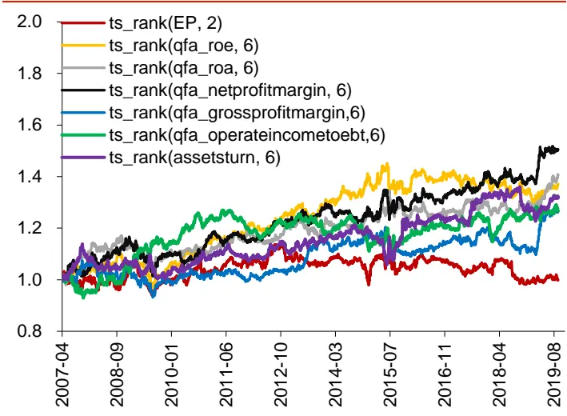
资料来源：Wind，华泰证券研究所

图表13： 历史分位数因子 TOP组合除以基准净值(沪深 300成分股内)
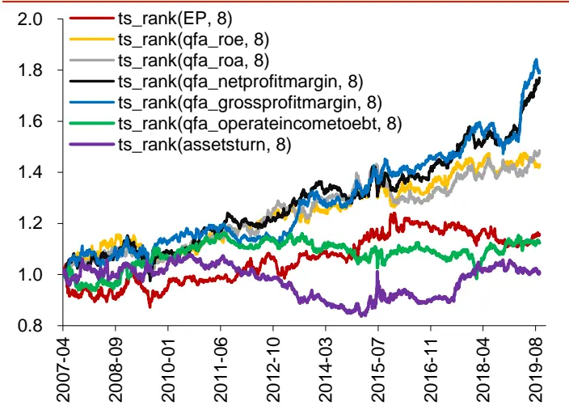
资料来源：Wind，华泰证券研究所

图表14： 历史分位数因子 TOP组合除以基准净值(中证 500成分股内)
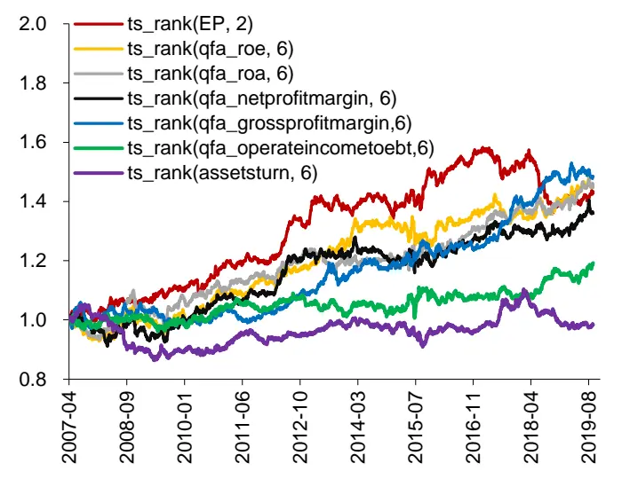
资料来源：Wind，华泰证券研究所

图表15： 历史分位数因子 TOP组合除以基准净值(中证 500成分股内)
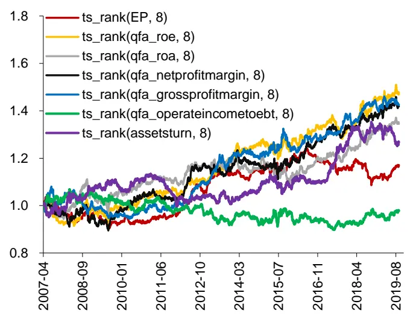
资料来源：Wind，华泰证券研究所

图表16： 历史分位数因子 TOP组合除以基准净值(全 A股)
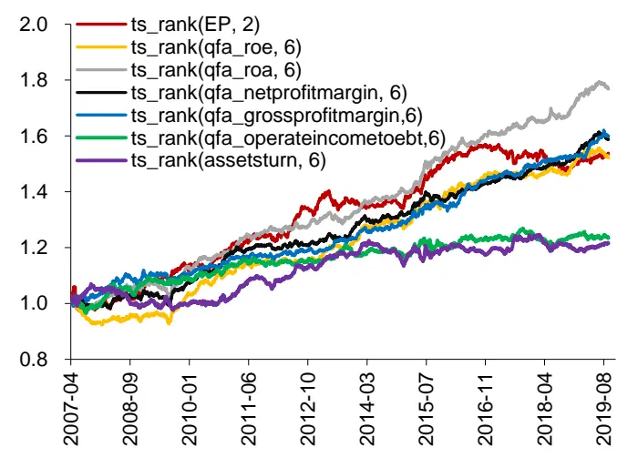

图表17： 历史分位数因子 TOP 组合除以基准净值(全 A 股)
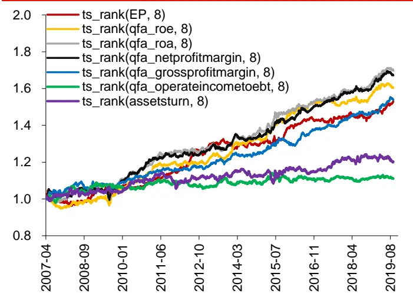
资料来源：Wind，华泰证券研究所

## 单因子测试结果详细分析

估值类历史分位数因子(月频调仓)

图表 18展示了 5个估值类历史分位数因子在全部非 ST 股票上的数据覆盖度随时间变化曲线。

图表18： 估值类历史分位数因子数据覆盖度随时间变化情况
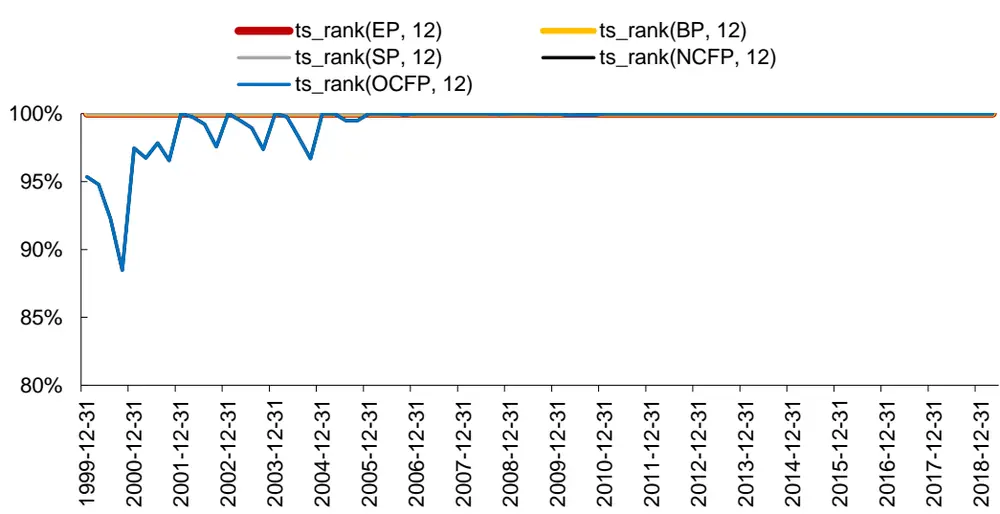
资料来源：Wind，华泰证券研究所

图表 19~图表 20 展示了估值类历史分位数因子在各种股票池内回归法、IC 值分析结果汇总。因子对行业、市值、反转和对应原始因子进行了中性化。

图表19： 估值类历史分位数因子在各种股票池内回归法、IC 值分析结果汇总(行业、市值、反转、对应原始因子中性，沪深 300 和中证 500 成分股)

|  |  |  |  |  | 因子收益率 Rank IC | 均值 | Rank IC 标准差 | IC_IR IC>0 占比 |  |
| --- | --- | --- | --- | --- | --- | --- | --- | --- | --- |
|  | 因子名称 | It\|均值 It\|>2 占比 | t 均值 | 均值 |  |  |  |  |  |
| 因子含义 沪深 300 成分股内 |  |  |  |  |  |  |  |  |  |
|  | ts_rank(EP, 2) | 1.32 | 28.86% | 0.58 | 0.30% | 5.14% | 12.24% | 0.42 | 68.46% |
| 净利润(TTM)/总市值在过 | ts_rank(EP, 4) | 1.26 | 22.15% | 0.40 | 0.22% | 4.36% | 12.06% | 0.36 | 62.42% |
| 去 n 个季度里的分位数 (n=2,4,8,12) | ts_rank(EP, 8) | 1.17 | 19.46% | 0.20 | 0.10% | 3.47% | 11.95% | 0.29 | 61.74% |
|  | ts_rank(EP, 12) | 1.26 | 19.46% | 0.10 | 0.06% | 2.97% | 11.86% | 0.25 | 59.06% |
| 净资产/总市值在过去n个 | ts_rank(BP, 2) | 1.48 | 30.20% | 0.39 | 0.26% | 4.41% | 14.77% | 0.30 | 59.06% |
| 季度里的分位数 (n=2,4,8,12) | ts_rank(BP, 4) | 1.43 | 24.83% | 0.16 | 0.13% | 3.16% | 15.08% | 0.21 | 57.05% |
|  | ts_rank(BP, 8) | 1.52 | 25.50% | 0.05 | 0.06% | 2.44% | 14.35% | 0.17 | 55.03% |
|  | ts_rank(BP, 12) | 1.43 | 27.52% | 0.00 | 0.02% | 2.37% | 13.58% | 0.17 | 58.39% |
| 营业收入(TTM)/总市值在 过去 n 个季度里的分位数 | ts_rank(SP, 2) | 1.32 | 24.83% | 0.46 | 0.28% | 4.93% | 14.45% | 0.34 | 64.43% |
|  | ts_rank(SP, 4) | 1.28 | 19.46% | 0.40 | 0.27% | 4.48% | 13.72% | 0.33 | 62.42% |
| ts_rank(SP, 8) (n=2,4,8,12) |  | 1.18 | 19.46% | 0.33 | 0.22% | 3.83% | 12.82% |  |  |
| ts_rank(SP, 12) |  | 1.23 | 20.81% | 0.27 | 0.17% | 3.33% | 12.63% | 0.30 | 61.07% |
| 净现金流(TTM)/总市值在 |  | 1.07 | 10.07% | 0.08 | 0.03% |  | 7.47% | 0.26 | 59.73% |
| 过去 n 个季度里的分位数 | ts_rank(NCFP, 2) ts_rank(NCFP, 4) | 1.12 | 10.74% | 0.14 | 0.08% | 0.72% 0.56% | 7.85% | 0.10 | 57.72% |
| ts_rank(NCFP, 8) |  | 1.05 | 12.08% | 0.09 | 0.07% | 0.51% | 8.14% | 0.07 | 53.69% |
| (n=2,4,8,12) ts_rank(NCFP, 12) |  | 1.05 | 11.41% | -0.01 | -0.01% | 0.02% | 7.89% | 0.06 | 49.66% |
| ts_rank(OCFP, 2) |  | 1.18 | 17.45% | 0.23 | 0.12% |  |  | 0.00 | 48.99% |
| 经营现金流(TTM)/总市值) ts_rank(OCFP, 4) |  | 1.13 | 16.78% | 0.15 | 0.08% | 1.70% | 8.87% 8.67% | 0.19 | 59.06% |
| 在过去 n 个季度里的分位 ts_rank(OCFP, 8) |  | 1.12 | 10.74% | 0.19 | 0.11% | 1.20% |  | 0.14 | 54.36% |
| 数(n=2,4,8,12) |  |  |  |  |  | 1.28% | 8.71% | 0.15 | 56.38% |
| 中证 500 成分股内 | ts_rank(OCFP, 12) | 1.11 | 12.75% | 0.20 | 0.11% | 1.38% | 8.75% | 0.16 | 58.39% |
| 净利润(TTM)/总市值在过 |  |  |  |  |  |  |  |  |  |
| ts_rank(EP, 4) 去 n 个季度里的分位数 | ts_rank(EP, 2) | 1.51 | 31.54% | 1.11 | 0.64% 0.51% | 6.13% | 8.98% | 0.68 | 74.50% |
| ts_rank(EP, 8) (n=2,4,8,12) |  | 1.38 1.21 | 28.19% 17.45% | 0.96 0.76 | 0.40% | 5.19% 4.22% | 8.40% 7.55% | 0.62 | 73.15% |
| ts_rank(EP, 12) |  | 1.15 | 16.11% | 0.69 | 0.38% | 3.95% | 7.07% | 0.56 | 67.79% |
| ts_rank(BP, 2) 净资产/总市值在过去n个 |  | 1.75 | 32.89% | 0.76 | 0.46% | 5.14% | 11.86% | 0.56 | 70.47% |
| 季度里的分位数 | ts_rank(BP, 4) | 1.58 | 32.89% | 0.52 | 0.32% | 3.85% | 11.66% | 0.43 | 63.76% |
| ts_rank(BP, 8) (n=2,4,8,12) |  | 1.39 | 21.48% |  | 0.25% | 3.78% | 10.18% | 0.33 | 61.07% |
| ts_rank(BP, 12) |  |  |  | 0.41 0.40 | 0.24% |  | 9.55% | 0.37 | 60.40% |
| 营业收入(TTM)/总市值在 |  | 1.36 1.64 | 20.13% 32.89% | 0.91 | 0.51% | 3.77% 5.56% | 10.83% | 0.39 | 62.42% |
| 过去 n 个季度里的分位数 | ts_rank(SP, 2) ts_rank(SP, 4) | 1.52 | 28.86% | 0.81 | 0.44% | 4.96% | 10.22% | 0.51 0.49 | 70.47% 67.79% |
| (n=2,4,8,12) | ts_rank(SP, 8) | 1.37 | 22.82% | 0.75 | 0.41% | 4.67% | 9.06% | 0.52 | 63.09% |
| ts_rank(SP, 12) |  | 1.29 | 21.48% | 0.68 | 0.36% | 4.49% | 8.58% | 0.52 | 69.13% |
| 净现金流(TTM)/总市值在 | ts_rank(NCFP, 2) | 0.94 | 6.71% | 0.13 | 0.05% | 1.28% | 5.32% | 0.24 | 58.39% |
| 过去 n 个季度里的分位数 | ts_rank(NCFP, 4) | 0.91 | 8.05% | 0.12 | 0.05% | 0.90% | 5.42% | 0.17 | 53.69% |
| (n=2,4,8,12) | ts_rank(NCFP, 8) | 0.97 | 7.38% | 0.18 | 0.10% | 0.93% | 5.54% | 0.17 | 55.70% |
|  | ts_rank(NCFP, 12) | 0.98 | 8.72% | 0.20 | 0.12% | 0.73% | 5.43% | 0.13 | 55.70% |
| 经营现金流(TTM)/总市值 ts_rank(OCFP, 4) | ts_rank(OCFP, 2) | 1.02 0.93 | 16.11% 10.07% | 0.24 0.20 | 0.13% 0.12% | 2.70% | 6.38% 5.82% | 0.42 0.43 | 67.11% 65.77% |

资料来源：Wind，华泰证券研究所

图表20： 估值类历史分位数因子在各种股票池内回归法、IC值分析结果汇总(行业、市值、反转、对应原始因子中性，全 A股)

| 因子收益率 Rank IC |  |  |  |  |  |  |  |  |  |
| --- | --- | --- | --- | --- | --- | --- | --- | --- | --- |
| 因子含义 | 因子名称 | It\|均值 Itl>2 占比 |  | t 均值 | 均值 | Rank IC 均值 标准差 |  | IC_IR IC>0 占比 |  |
| 全 A股 |  |  |  |  |  |  |  |  |  |
| 净利润(TTM)/总市值在过 去 n 个季度里的分位数 | ts_rank(EP, 2) | 2.75 | 53.02% | 2.03 | 0.53% | 6.21% 7.78% | 0.80 | 78.52% |  |
|  | ts_rank(EP, 4) | 2.46 | 51.01% | 1.64 | 0.43% | 5.35% | 7.25% | 0.74 | 76.51% |
|  | ts_rank(EP, 8) | 2.18 | 44.97% | 1.25 | 0.33% | 4.47% | 6.85% | 0.65 | 72.48% |
|  | ts_rank(EP, 12) | 2.12 | 40.94% | 1.03 | 0.29% | 4.10% | 6.57% | 0.62 | 73.15% |
| 净资产/总市值在过去n个 季度里的分位数 (n=2,4,8,12) | ts_rank(BP, 2) | 2.90 | 58.39% | 1.24 | 0.40% | 5.26% | 10.37% | 0.51 | 63.76% |
|  | ts_rank(BP, 4) | 2.55 | 51.68% | 0.67 | 0.25% | 3.78% | 10.08% | 0.37 | 63.09% |
|  | ts_rank(BP, 8) | 2.23 | 45.64% | 0.44 | 0.18% | 3.29% | 9.28% | 0.35 | 61.74% |
|  | ts_rank(BP, 12) | 2.08 | 42.28% | 0.32 | 0.14% | 2.97% | 8.78% | 0.34 | 65.10% |
|  | ts_rank(SP, 2) | 2.81 | 55.03% | 1.65 | 0.47% | 5.89% | 9.66% | 0.61 | 69.13% |
| 营业收入(TTM)/总市值在 过去 n 个季度里的分位数 | ts_rank(SP, 4) | 2.50 | 55.03% | 1.45 | 0.42% | 5.22% | 8.80% | 0.59 | 71.14% |
| (n=2,4,8,12) | ts_rank(SP, 8) | 2.12 | 46.98% | 1.28 | 0.37% | 4.64% | 7.71% | 0.60 | 70.47% |
|  | ts_rank(SP, 12) | 2.00 | 43.62% | 1.13 | 0.31% | 4.24% | 7.11% | 0.60 | 69.80% |
| 净现金流(TTM)/总市值在 | ts_rank(NCFP, 2) | 1.36 | 20.81% | 0.27 | 0.06% | 1.39% | 3.93% | 0.35 | 63.09% |
| 过去 n 个季度里的分位数 | ts_rank(NCFP, 4) | 1.33 | 23.49% | 0.21 | 0.05% | 1.39% | 4.49% | 0.31 | 62.42% |
| (n=2,4,8,12) | ts_rank(NCFP, 8) | 1.32 | 18.79% | 0.16 | 0.05% | 1.41% | 5.15% | 0.27 | 59.73% |
|  | ts_rank(NCFP, 12) | 1.36 | 22.82% | 0.06 | 0.01% | 1.22% | 5.51% | 0.22 | 56.38% |
| 经营现金流(TTM)/总市值 | ts_rank(OCFP, 2) | 1.56 | 29.53% | 0.61 | 0.16% | 2.95% | 5.09% | 0.58 | 70.47% |
| 在过去 n 个季度里的分位 | ts_rank(OCFP, 4) | 1.44 | 24.83% | 0.42 | 0.11% | 2.62% | 4.92% | 0.53 | 70.47% |
| 数(n=2,4,8,12) | ts_rank(OCFP, 8) | 1.43 | 24.16% | 0.43 | 0.12% | 2.51% | 5.03% | 0.50 | 71.81% |
|  | ts_rank(OCFP, 12) | 1.38 | 25.50% | 0.39 | 0.10% | 2.49% | 5.22% | 0.48 | 71.14% |

资料来源：Wind，华泰证券研究所

图表 21~图表 22 展示了估值类历史分位数因子在各种股票池内分层测试结果汇总。因子对行业、市值、反转和对应原始因子进行了中性化。

图表21： 估值类历史分位数因子在各股票池内分层测试结果汇总(分五层，行业、市值、反转、对应原始因子中性，沪深 300成分股)
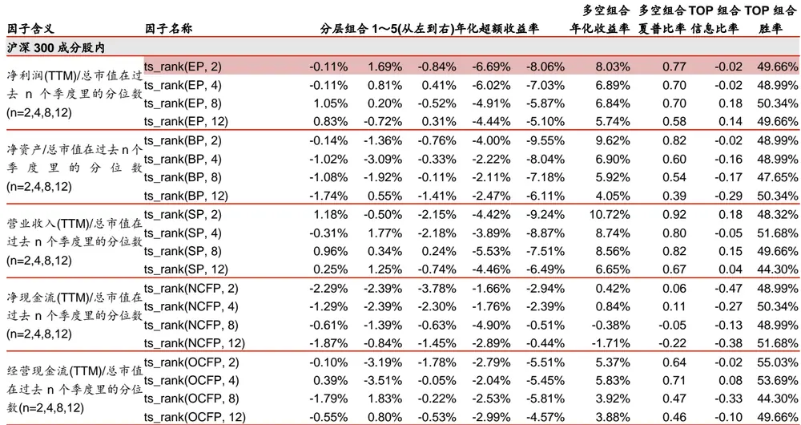
资料来源：Wind，华泰证券研究所

图表22： 估值类历史分位数因子在各股票池内分层测试结果汇总(分五层，行业、市值、反转、对应原始因子中性，中证 500成分股，全 A股)

| 因子含义 因子名称 |  | 多空组合 分层组合1～5(从左到右)年化超额收益率 |  |  |  |  |  | 多空组合TOP 组合 TOP 组合 |  | 胜率 |
| --- | --- | --- | --- | --- | --- | --- | --- | --- | --- | --- |
|  |  |  |  |  |  |  |  | 年化收益率夏普比率信息比率 |  |  |
| 中证 500 成分股内 |  |  |  |  |  |  |  |  |  |  |
| 净利润(TTM)/总市值在过 | ts_rank(EP, 2) | 3.02% | 2.32% | -0.42% |  | -7.73% -10.18% | 14.35% | 1.88 | 0.67 | 60.40% |
| 去 n 个季度里的分位数 | ts_rank(EP, 4) | 2.11% | 2.48% | -0.77% | -6.16% | -8.86% | 11.75% | 1.68 | 0.50 | 61.07% |
| (n=2,4,8,12) | ts_rank(EP, 8) | 1.30% | 2.34% | -0.67% | -4.29% | -7.93% | 9.77% | 1.50 | 0.33 | 56.38% |
|  | ts_rank(EP, 12) | 2.20% | 0.84% | 0.77% | -3.35% | -8.76% | 11.76% | 1.81 | 0.56 | 56.38% |
| 净资产/总市值在过去n个 | ts_rank(BP, 2) | 0.43% | 1.05% | -1.12% | -4.47% -10.25% |  | 11.44% | 1.29 | 0.08 | 44.97% |
| 季度里的分位数 | ts_rank(BP, 4) | 0.61% | -0.95% | -1.18% | -4.16% | -7.98% | 8.94% | 1.07 | 0.13 | 48.32% |
| (n=2,4,8,12) | ts_rank(BP, 8) | 1.35% | -0.43% | -2.29% | -3.40% | -7.18% | 8.83% | 1.09 | 0.29 | 46.31% |
|  | ts_rank(BP, 12) | 2.08% | -0.82% | -1.74% | -3.67% | -6.42% | 8.72% | 1.11 | 0.47 | 47.65% |
| 营业收入(TTM)/总市值在 | ts_rank(SP, 2) | 0.60% | 1.77% | -0.14% | -5.56%-10.55% |  | 12.04% | 1.42 | 0.12 | 46.31% |
| 过去 n 个季度里的分位数 | ts_rank(SP, 4) | 1.17% | 2.55% | -1.29% | -6.15% | -8.84% | 10.65% | 1.36 | 0.25 | 54.36% |
| (n=2,4,8,12) | ts_rank(SP, 8) | 2.44% | 1.70% | -1.48% | -4.85% | -8.57% | 11.75% | 1.63 | 0.57 | 56.38% |
|  | ts_rank(SP, 12) | 2.19% | 2.03% | -1.02% | -4.44% | -8.24% | 11.09% | 1.59 | 0.53 | 56.38% |
| 净现金流(TTM)/总市值在 | ts_rank(NCFP, 2) | 0.06% | -2.48% | -2.01% | -4.09% | -4.00% | 4.07% | 0.73 | 0.02 | 51.68% |
| 过去 n 个季度里的分位数 | ts_rank(NCFP, 4) | -0.45% | -1.11% | -0.22% | -4.65% | -3.07% | 2.55% | 0.45 | -0.12 | 46.31% |
| (n=2,4,8,12) | ts_rank(NCFP, 8) | 1.37% | -1.40% | -2.36% | -2.33% | -2.92% | 4.25% | 0.74 | 0.38 | 52.35% |
|  | ts_rank(NCFP, 12) | 0.97% | -1.43% | -2.00% | -1.87% | -2.76% | 3.67% | 0.65 | 0.27 | 49.66% |
| 经营现金流(TTM)/总市值 | ts_rank(OCFP, 2) | 1.36% | -3.07% | -0.89% | -3.71% | -6.45% | 8.12% | 1.27 | 0.35 | 56.38% |
| 在过去 n 个季度里的分位 | ts_rank(OCFP, 4) | 1.26% | -1.34% | -1.02% | -4.12% | -4.93% | 6.32% | 1.03 | 0.33 | 53.02% |
| 数(n=2,4,8,12) | ts_rank(OCFP, 8) | 3.18% | -0.76% | -3.36% | -2.49% | -4.64% | 7.98% | 1.28 | 0.84 | 55.03% |
|  | ts_rank(OCFP, 12) | 2.51% | -1.60% | -1.82% | -2.99% | -3.54% | 6.05% | 0.96 | 0.65 | 56.38% |
| 全 A股 |  |  |  |  |  |  |  |  |  |  |
| 净利润(TTM)/总市值在过 | ts_rank(EP, 2) | 3.45% | 3.07% | -1.97% |  | -6.62% -10.67% | 15.57% | 2.46 | 0.92 | 57.05% |
| 去 n 个季度里的分位数 | ts_rank(EP, 4) | 2.81% | 3.10% | -1.73% | -6.18% | -8.72% | 12.43% | 2.10 | 0.77 | 55.03% |
| (n=2,4,8,12) | ts_rank(EP, 8) | 3.37% | 0.76% | -1.55% | -4.26% | -7.42% | 11.49% | 2.09 | 1.03 | 60.40% |
|  | ts_rank(EP, 12) | 4.07% | -1.11% | -0.48% | -3.40% | -7.26% | 12.04% | 2.17 | 1.23 | 63.09% |
| 净资产/总市值在过去n个 | ts_rank(BP, 2) | -0.31% | 1.88% | -0.06% |  | -3.86% -11.45% | 12.23% | 1.59 | -0.07 | 51.68% |
| 季度里的分位数 | ts_rank(BP, 4) | -0.88% | 1.56% | -1.68% | -3.83% | -8.13% | 7.59% | 1.04 | -0.21 | 48.32% |
| (n=2,4,8,12) | ts_rank(BP, 8) | -0.78% | 1.50% | -0.77% | -4.30% | -6.91% | 6.33% | 0.92 | -0.19 | 48.32% |
|  | ts_rank(BP, 12) | -0.51% | 1.19% | -1.08% | -3.64% | -6.16% | 5.78% | 0.85 | -0.13 | 50.34% |
| 营业收入(TTM)/总市值在 | ts_rank(SP, 2) | 1.43% | 2.22% | -0.37% | -4.71% -11.96% |  | 14.88% | 2.03 | 0.35 | 48.99% |
| 过去 n 个季度里的分位数 | ts_rank(SP, 4) | 2.44% | 2.33% | -1.22% | -6.00% | -9.49% | 12.91% | 1.93 | 0.64 | 51.01% |
| (n=2,4,8,12) | ts_rank(SP, 8) | 3.12% | 2.19% | -1.81% | -5.46% | -8.23% | 12.15% | 1.99 | 0.89 | 57.05% |
|  | ts_rank(SP, 12) | 2.75% | 1.71% | -1.13% | -5.34% | -7.20% | 10.53% | 1.80 | 0.83 | 57.72% |
| 净现金流(TTM)/总市值在 | ts_rank(NCFP, 2) | -0.23% | -1.09% | -3.93% | -3.14% | -3.77% | 3.60% | 0.92 | -0.09 | 47.65% |
| 过去 n 个季度里的分位数 ts_rank(NCFP, 8) (n=2,4,8,12) | ts_rank(NCFP, 4) | 1.15% 1.33% -0.96% | -1.74% | -1.65% | -3.93% | -3.10% | 4.31% | 1.07 1.06 | 0.44 | 58.39% |

资料来源：Wind，华泰证券研究所

通过回归法、IC值分析、分层测试法的结果我们可以发现各估值类历史分位数因子的选股效果(因子收益率均值、RankIC均值、多空组合夏普比率)存在一定差别，其中 ts_rank(EP,n)的效果最好。同时还可以看出，对于同一小类因子，其选股效果随着回看期数(n=2,4,8,12)的增加大致呈现出逐渐减弱的趋势。我们选择最优的 ts_rank(EP, 2)因子进行单独展示，其主要指标表现如图表 23~图表 26所示。

图表23： ts_rank(EP, 2)因子 Rank IC 累积图
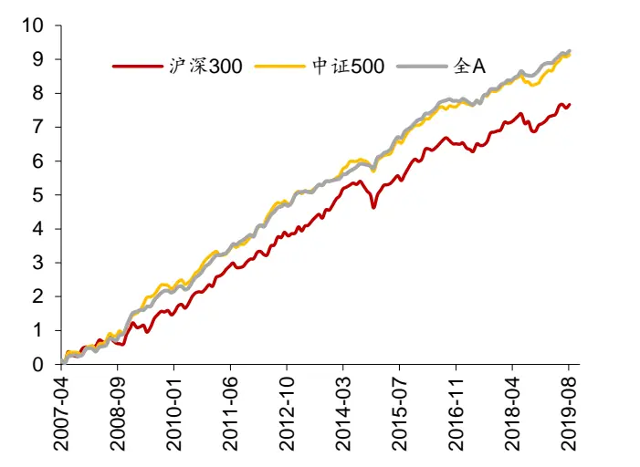
资料来源：Wind，华泰证券研究所

图表24： ts_rank(EP, 2)因子回归法因子收益率累积图
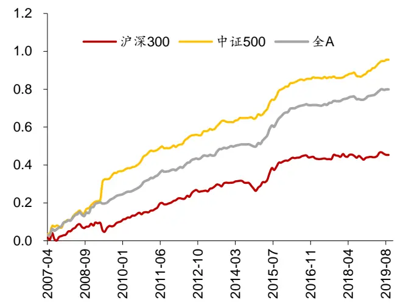
资料来源：Wind，华泰证券研究所

图表25： ts_rank(EP, 2)因子 TOP 组合除以基准组合净值
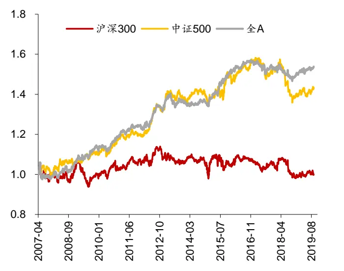
资料来源：Wind，华泰证券研究所

图表26： ts_rank(EP, 2)因子分层组合 1~5的净值除以基准净值示意图
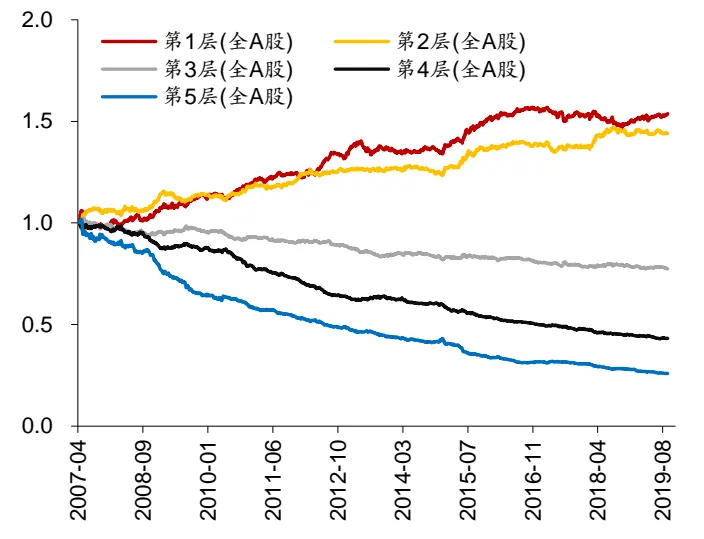
资料来源：Wind，华泰证券研究所

我们将 ts_rank(EP, 2)因子应用到各行业中进行分层测试，结果如图表 27 所示，其中每个行业分层组合对比基准为行业等权组合。

图表27： 不同行业 ts_rank(EP, 2)因子分层测试法结果(分五层，市值、反转、对应原始因子中性)

|  |  |  |  |  |  | 多空组合 | 多空组合TOP 组合信息 |  |  |
| --- | --- | --- | --- | --- | --- | --- | --- | --- | --- |
| 行业 |  | 分层组合1～5(从左到右)年化超额收益率 |  |  | 年化收益率 |  | 夏普比率 |  | 比率TOP 组合胜率 |
| 基础化工 | 6.17% | 1.64% | -1.33% | -4.51% | -14.68% | 23.65% | 2.08 | 0.86 | 53.02% |
| 通信 | 9.63% | 2.79% | -0.92% | -11.48% | -12.50% | 23.26% | 1.29 | 0.84 | 55.70% |
| 机械 | 5.79% | 3.11% | -2.20% | -8.34% | -11.67% | 18.88% | 1.58 | 0.81 | 53.02% |
| 建材 | 8.53% | 1.38% | -7.27% | -11.82% | -5.23% | 12.83% | 0.75 | 0.79 | 55.03% |
| 有色金属 | 8.56% | -2.54% | -5.68% | -6.92% | -7.83% | 16.09% | 0.93 | 0.79 | 55.70% |
| 电力设备 | 5.68% | 2.96% | -0.29% | -8.19% | -13.25% | 20.21% | 1.31 | 0.63 | 58.39% |
| 交通运输 | 5.43% | -2.54% | -4.14% | -5.86% | -6.82% | 12.07% | 0.85 | 0.60 | 55.70% |
| 商贸零售 | 4.44% | 0.95% | -4.95% | -3.84% | -11.07% | 16.32% | 1.20 | 0.53 | 60.40% |
| 传媒 | 6.60% | -5.57% | 0.02% | -5.51% | -11.04% | 16.09% | 0.65 | 0.44 | 52.35% |
| 电子元器件 | 3.76% | -1.49% | 2.04% | -5.23% | -13.60% | 18.93% | 1.34 | 0.42 | 53.02% |
| 计算机 | 3.66% | -1.97% | -1.75% | -3.78% | -11.53% | 15.36% | 0.89 | 0.35 | 55.03% |
| 医药 | 2.24% | 0.56% | -3.39% | -6.18% | -7.81% | 10.29% | 0.97 | 0.33 | 49.66% |
| 纺织服装 | 2.87% | 3.08% | -3.67% | -6.08% | -11.49% | 14.71% | 0.90 | 0.28 | 48.99% |
| 汽车 | 2.07% | -0.28% | -1.97% | -5.37% | -9.02% | 11.17% | 0.83 | 0.25 | 51.01% |
| 家电 | 2.76% | 0.13% | -1.12% | -11.29% | -7.18% | 8.37% | 0.41 | 0.22 | 53.69% |
| 电力及公用事业 | 1.78% | 0.21% | -4.68% | -6.08% | -6.18% | 7.43% | 0.54 | 0.22 | 56.38% |
| 煤炭 | 2.66% | -2.54% | -2.45% | -2.80% | -13.17% | 16.05% | 0.80 | 0.19 | 55.03% |
| 餐饮旅游 | 2.68% | -3.25% | -1.87% | -4.22% | -12.11% | 13.68% | 0.58 | 0.18 | 44.30% |
| 农林牧渔 | 0.85% | -0.43% | -4.50% | -6.76% | -5.67% | 5.63% | 0.36 | 0.09 | 51.68% |
| 食品饮料 | 0.94% | -0.63% | -1.44% | -6.54% | -8.60% | 8.93% | 0.53 | 0.08 | 48.32% |
| 钢铁 | 1.02% | -0.84% | 1.74% | -3.91% | -14.80% | 16.62% | 0.87 | 0.08 | 53.69% |
| 轻工制造 | 0.71% | 3.09% | -6.59% | -4.17% | -8.77% | 8.57% | 0.46 | 0.06 | 48.99% |
| 国防军工 | 0.61% | 3.85% | 3.97% | -13.49% | -14.07% | 13.66% | 0.58 | 0.04 | 49.66% |
| 石油石化 | -1.17% | 2.93% | -6.21% | -6.31% | -8.05% | 4.38% | 0.18 | -0.08 | 46.31% |
| 建筑 | -1.41% | 2.89% | -4.24% | -6.79% | -7.85% | 5.23% | 0.28 | -0.12 | 51.01% |
| 银行 | -1.83% | -4.54% | -3.06% | -3.00% | -3.61% | 0.13% | 0.01 | -0.17 | 44.97% |
| 非银行金融 | -2.98% | -3.89% | NaN | -9.38% | -0.43% | -5.68% | -0.22 | -0.19 | 46.31% |
| 综合 | -3.16% | -0.31% | -0.14% | 0.99% | -11.55% | 6.51% | 0.28 | -0.21 | 46.98% |
| 房地产 | -2.06% | 2.05% | -0.58% | -7.43% | -6.09% | 3.49% | 0.28 | -0.26 | 45.64% |

资料来源：Wind，华泰证券研究所

## 盈利能力类历史分位数因子(每年调仓三次)

图表 28 展示了 8 个盈利能力类历史分位数因子在全部非 ST 股票上的数据覆盖度随时间变化曲线。

图表28： 盈利能力类历史分位数因子数据覆盖度随时间变化情况
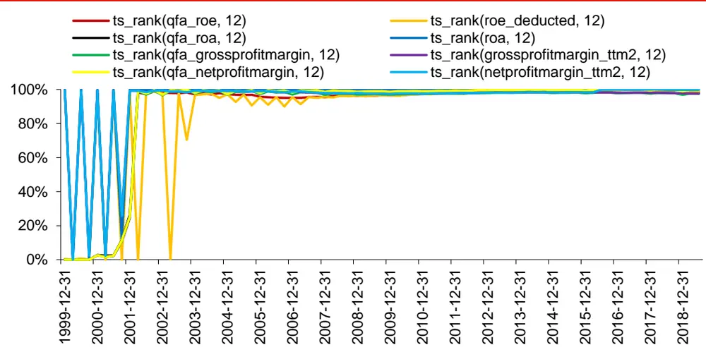
资料来源：Wind，华泰证券研究所

图表 29~图表 30 展示了盈利能力类历史分位数因子在各种股票池内回归法、IC 值分析结果汇总。因子对行业、市值、成长和对应原始因子进行了中性化。

图表29： 盈利能力类历史分位数因子在各种股票池内回归法、IC值分析结果汇总(行业、市值、成长、对应原始因子中性，沪深 300成分股)

| 因子含义 因子名称 |  |  |  |  | 因子收益率 Rank IC Rank IC |  |  | IC_IR IC>0 占比 |
| --- | --- | --- | --- | --- | --- | --- | --- | --- |
|  |  | It\|均值\|tl>2 占比 t 均值 |  | 均值 | 均值 | 标准差 |  |  |
| 沪深 300 成分股内 |  |  |  |  |  |  |  |  |
| 单季度 ROE(平均)在过去ts_rank(qfa_roe， 6) |  | 1.26 18.42% | 0.57 |  | 0.71% 6.08% | 8.56% | 0.71 | 84.21% |
| n 个季度里的分位数ts_rank(qfa_roe, 8) |  | 1.21 18.42% | 0.44 | 0.53% | 5.98% | 8.46% | 0.71 | 76.32% |
| (n=6,8,12) | ts_rank(qfa_roe, 12) | 1.10 10.53% | 0.30 | 0.39% | 4.68% | 9.22% | 0.51 | 65.79% |
| 当年累计 ROE(扣非/平均)ts_rank(roe_deducted， 6) |  | 1.03 10.53% | -0.02 | -2.10% | 2.34% | 11.66% | 0.20 | 71.05% |
| 在过去 n 个季度里的分位ts_rank(roe_deducted， 8) |  | 1.01 13.16% | 0.01 |  | 0.31% 3.11% | 9.55% | 0.33 | 63.16% |
| 数(n=6,8,12) | ts_rank(roe_deducted, 12) | 1.08 13.16% | -0.19 | -0.28% | 0.34% | 8.41% | 0.04 | 50.00% |
| 单季度总资产净利率在过ts_rank(qfa_roa, 6) |  | 1.18 18.42% | 0.45 |  | 0.77% 6.50% | 8.89% | 0.73 | 76.32% |
| 去 n 个季度里的分位数ts_rank(qfa_roa， 8) |  | 1.21 13.16% | 0.38 |  | 0.65% 6.43% | 9.20% | 0.70 | 65.79% |
| (n=6,8,12) | ts_rank(qfa_roa, 12) | 1.17 13.16% | 0.25 |  | 0.53% 5.03% | 8.75% | 0.57 | 63.16% |
| 当年累计总资产净利率在 ts_rank(roa， 6) |  | 0.97 5.26% | -0.25 | -3.16% | -0.21% | 12.55% | -0.02 | 55.26% |
| 过去 n 个季度里的分位数 ts_rank(roa， 8) |  | 0.92 10.53% | 0.03 | 2.06% | 0.90% | 12.45% | 0.07 | 55.26% |
| (n=6,8,12) ts_rank(roa, 12) |  | 1.00 7.89% | -0.13 | -0.08% | 1.07% | 7.61% | 0.14 | 55.26% |
| 单季度销售毛利率在过去 | ts_rank(qfa_grossprofitmargin, 6) | 1.03 13.16% | 0.57 |  | 0.77% 4.13% | 7.35% | 0.56 | 73.68% |
| n 个季度里的分位数 | ts_rank(qfa_grossprofitmargin, 8) | 1.07 13.16% | 0.51 |  | 0.72% 4.33% | 8.02% | 0.54 | 68.42% |
| (n=6,8,12) | ts_rank(qfa_grossprofitmargin, 12) | 0.97 10.53% | 0.34 |  | 0.55% 4.12% | 9.23% | 0.45 | 65.79% |
| 销售毛利率 TTM 在过去 nts_rank(grossprofitmargin_ttm2， 6) |  | 1.12 10.53% | 0.21 | 0.41% | 3.25% | 8.40% | 0.39 | 71.05% |
| 个季度里的分位数ts_rank(grossprofitmargin_ttm2， 8) |  | 1.04 7.89% | 0.07 | 0.22% | 3.01% | 8.76% | 0.34 | 60.53% |
| (n=6,8,12) | ts_rank(grossprofitmargin_ttm2, 12) | 0.97 7.89% | -0.06 | 0.07% | 2.94% | 9.79% | 0.30 | 57.89% |
| 单季度销售净利率在过去 ts_rank(qfa_netprofitmargin， 6) |  | 1.20 15.79% | 0.42 |  | 0.56% 4.70% | 8.71% | 0.54 | 57.89% |
| n个季度里的分位数 | ts_rank(qfa_netprofitmargin, 8) | 1.24 15.79% | 0.34 |  | 0.51% 4.42% | 8.13% | 0.54 | 57.89% |
| (n=6,8,12) | ts_rank(qfa_netprofitmargin, 12) | 1.25 18.42% | 0.29 |  | 0.53% 3.72% | 9.13% | 0.41 | 65.79% |
| 销售净利率 TTM 在过去 nts_rank(netprofitmargin_ttm2, 6) |  | 0.88 | 10.53% 0.12 |  | 1.05% | 2.93% 9.88% | 0.30 | 60.53% |
| 个季度里的分位数 | ts_rank(netprofitmargin_ttm2, 8) | 1.06 | 15.79% | 0.01 | -0.01% | 2.88% | 9.58% 0.30 | 57.89% |
| (n=6,8,12) | ts_rank(netprofitmargin_ttm2, 12) | 1.11 | 13.16% | -0.11 | 0.10% | 2.52% | 10.51% 0.24 | 60.53% |

资料来源：Wind，华泰证券研究

图表30： 盈利能力类历史分位数因子在各股票池内回归法、IC 值分析结果汇总(行业、市值、成长、对应原始因子中性，中证 500 成分股，全 A 股)
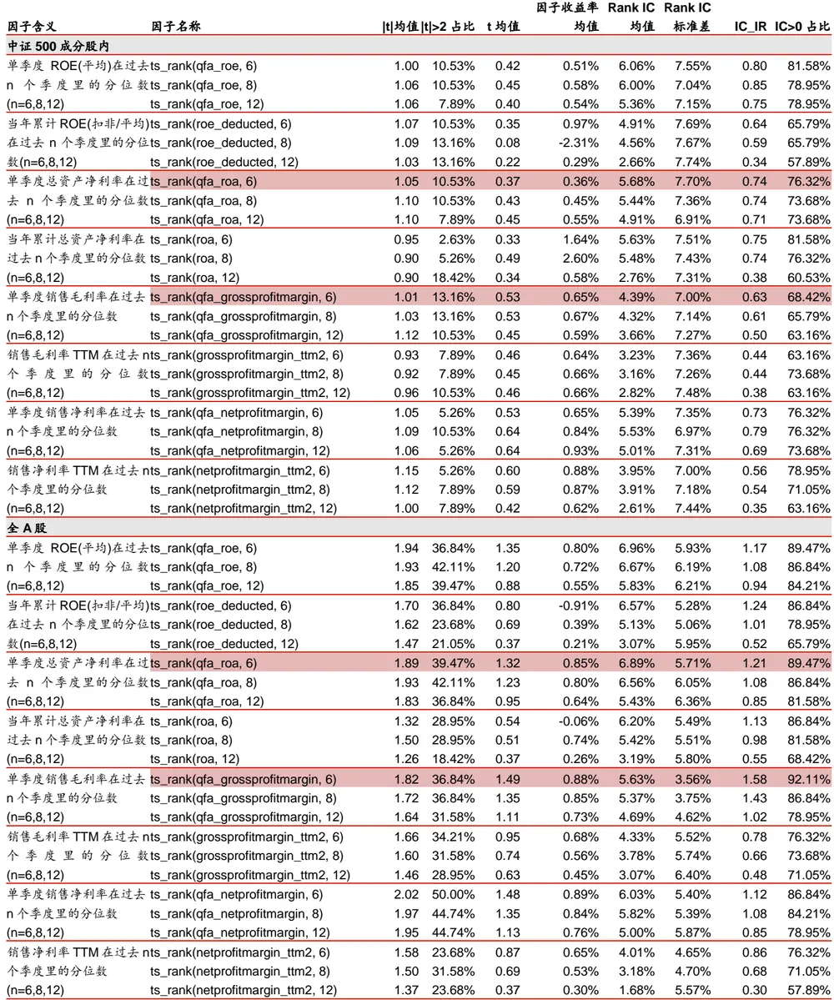
资料来源：Wind，华泰证券研究所

图表 31~图表 32 展示了盈利能力类历史分位数因子在各种股票池内分层测试结果汇总。
因子对行业、市值、成长和对应原始因子进行了中性化。

图表31： 盈利能力类历史分位数因子在各股票池内分层测试结果汇总(分五层，行业、市值、成长、对应原始因子中性，沪深 300、中证 500成分股)

| 因子含义 因子名称 |  | 分层组合1～5(从左到右)年化超额收益率 |  |  | 年化收益率夏普比率信息比率 |  | 胜率 |
| --- | --- | --- | --- | --- | --- | --- | --- |
| 沪深 300 成分股内 |  |  |  |  |  |  |  |
| 单季度ROE(平均)在过ts_rank(qfa_roe， 6) | 2.59% | 4.43% | -2.85% -3.19%-4.48% | 6.95% | 0.76 | 0.47 | 57.05% |
| 去 n 个季度里的分位数ts_rank(qfa_roe， 8) | 2.98% | 4.31% | -2.35% -5.08%-3.31% | 6.04% | 0.65 | 0.52 | 53.69% |
| (n=6,8,12) ts_rank(qfa_roe, 12) | 3.03% | 1.67% | -1.31% -4.01%-2.91% | 5.62% | 0.59 | 0.53 | 55.70% |
| 当年累计 ROE(扣非/平ts_rank(roe_deducted， 6) | 0.41% | 2.30% | -3.24% -1.83% -1.40% | 1.09% | 0.10 | 0.07 | 48.32% |
| 均)在过去 n 个季度里的ts_rank(roe_deducted， 8) | 2.09% | 0.48% | -0.60%-4.26%-1.27% | 2.63% | 0.23 | 0.34 | 50.34% |
| 分位数(n=6,8,12) ts_rank(roe_deducted, 12) | -0.44% | 0.53% | -0.56% -3.14% 0.28% | -1.26% | -0.12 | -0.07 | 49.66% |
| 单季度总资产净利率在ts_rank(qfa_roa, 6) | 2.60% | 3.09% | -1.49% -3.47% -4.26% | 6.74% | 0.75 | 0.46 | 54.36% |
| 过去 n 个季度里的分位ts_rank(qfa_roa， 8) | 3.07% | 2.84% | -0.89% -4.72%-3.88% | 6.81% | 0.75 | 0.53 | 59.06% |
| 数(n=6,8,12) ts_rank(qfa_roa, 12) | 3.84% | 1.43% | -1.71% -3.65% -3.45% | 7.08% | 0.73 | 0.61 | 59.06% |
| 当年累计总资产净利率 ts_rank(roa， 6) | -1.46% | 0.31% | -0.70% -0.81% -1.43% | -0.86% | -0.07 | -0.24 | 44.30% |
| 在过去 n 个季度里的分 ts_rank(roa， 8) | 0.88% | -2.11% | 0.59%-2.80%-0.32% | 0.36% | 0.03 | 0.14 | 50.34% |
| 位数(n=6,8,12) ts_rank(roa, 12) | 0.90% | -0.03% | -0.10% -4.32% 0.06% | 0.29% | 0.03 | 0.15 | 47.65% |
| 单季度销售毛利率在过 ts_rank(qfa_grossprofitmargin, 6) | 2.02% | 3.16% | -2.50% -4.51% -1.63% | 3.30% | 0.37 | 0.36 | 57.05% |
| 去 n 个季度里的分位数 ts_rank(qfa_grossprofitmargin， 8) | 4.92% | -1.31% | -0.91% -2.88%-3.22% | 8.00% | 0.91 | 0.85 | 57.72% |
| (n=6,8,12) ts_rank(qfa_grossprofitmargin, 12) | 3.30% | 1.16% | -2.95% -2.24% -2.66% | 5.72% | 0.65 | 0.59 | 60.40% |
| 销售毛利率 TTM 在过去ts_rank(grossprofitmargin_ttm2， 6) | 3.07% | -0.28% | -1.28% -0.43% -4.07% | 7.08% | 0.82 | 0.50 | 54.36% |
| n 个季度里的分位数ts_rank(grossprofitmargin_ttm2，8) | 3.09% | -0.29% | -2.68% -0.04%-2.97% | 5.88% | 0.66 | 0.51 | 58.39% |
| (n=6,8,12) ts_rank(grossprofitmargin_ttm2, 12) 2.90% |  | -0.24% | -2.37% -0.14% -2.98% | 5.67% | 0.63 | 0.48 | 57.72% |
| 单季度销售净利率在过 ts_rank(qfa_netprofitmargin， 6) | 3.44% | 0.78% | -0.25% -4.43%-3.09% | 6.33% | 0.70 | 0.61 | 53.69% |
| 去 n 个季度里的分位数 ts_rank(qfa_netprofitmargin， 8) | 4.85% | 0.25% | -3.26% -3.89%-1.64% | 6.17% | 0.68 | 0.86 | 57.72% |
| (n=6,8,12) ts_rank(qfa_netprofitmargin, 12) | 3.58% | 1.57% | -5.39% -1.04%-2.30% | 5.59% | 0.61 | 0.63 | 57.72% |
| 销售净利率TTM 在过去ts_rank(netprofitmargin_ttm2， 6) | 5.02% | -1.76% | -1.17% -2.80% -2.22% | 6.94% | 0.74 | 0.85 | 62.42% |
| n 个季度里的分位数 ts_rank(netprofitmargin_ttm2, 8) | 5.03% | -1.32% | -3.20% -1.56% -1.96% | 6.68% | 0.71 | 0.83 | 58.39% |
| (n=6,8,12) ts_rank(netprofitmargin_ttm2, 12) | 4.83% | -1.21% | -4.60% -1.06%-0.76% | 5.23% | 0.57 | 0.79 | 56.38% |
| 中证 500 成分股内 |  |  |  |  |  |  |  |
| 单季度 ROE(平均)在过ts_rank(qfa_roe， 6) | 3.03% | 0.37% | -0.07% -0.79% -5.77% | 9.01% | 1.14 | 0.61 | 52.35% |
| 去 n 个季度里的分位数ts_rank(qfa_roe， 8) | 3.12% | 1.23% | -1.53% -0.78%-5.03% | 8.25% | 1.04 | 0.61 | 60.40% |
| (n=6,8,12) ts_rank(qfa_roe, 12) | 2.09% | 1.16% | -0.21% -2.65%-3.33% | 5.28% | 0.67 | 0.42 | 55.03% |
| 当年累计 ROE(扣非/平ts_rank(roe_deducted, 6) | 0.97% | 3.68% | -0.76% -3.06%-3.66% | 4.45% | 0.56 | 0.20 | 56.38% |
| 均)在过去 n 个季度里的ts_rank(roe_deducted， 8) | 0.84% | 3.34% | -0.63% -3.05%-3.38% | 4.01% | 0.50 | 0.18 | 47.65% |
| 分位数(n=6,8,12) ts_rank(roe_deducted, 12) | 0.46% | 0.46% | 1.01% -1.28%-3.18% | 3.46% | 0.44 | 0.09 | 53.02% |
| 单季度总资产净利率在ts_rank(qfa_roa, 6) | 2.88% | 0.90% | -1.65% -2.12% -3.45% | 6.20% | 0.76 | 0.58 | 57.05% |
| 过去 n 个季度里的分位ts_rank(qfa_roa， 8) | 2.24% | 1.22% | -1.01%-3.21%-2.37% | 4.38% | 0.55 | 0.45 | 55.70% |
| 数(n=6,8,12) ts_rank(qfa_roa, 12) | 2.41% | 0.39% | 0.17% -3.32%-2.83% | 5.06% | 0.64 | 0.49 | 55.03% |
| 当年累计总资产净利率 ts_rank(roa， 6) | 1.80% | 2.16% | -1.14% -1.22%-4.64% | 6.40% | 0.80 | 0.37 | 51.68% |
| 在过去 n 个季度里的分 ts_rank(roa， 8) | 1.62% | 3.79% | -2.72%-1.11%-4.43% | 5.96% | 0.74 | 0.33 | 53.69% |
| 位数(n=6,8,12) ts_rank(roa, 12) | 1.13% | 0.27% | 1.31% -4.33% -0.96% | 1.79% | 0.22 | 0.23 | 51.01% |
| 单季度销售毛利率在过 ts_rank(qfa_grossprofitmargin, 6) | 3.28% | -0.37% | 0.85% -2.12% -4.76% | 8.14% | 1.10 | 0.69 | 59.06% |
| 去 n 个季度里的分位数 ts_rank(qfa_grossprofitmargin， 8) | 2.84% | 1.49% | -0.50% -2.55%-4.19% | 7.05% | 0.95 | 0.60 | 60.40% |
| (n=6,8,12) ts_rank(qfa_grossprofitmargin, 12) 销售毛利率 TTM 在过去ts_rank(grossprofitmargin_ttm2, 6) | 2.23% | 1.44% | -0.68% -2.28%-3.64% | 5.79% | 0.76 | 0.46 | 57.05% |
| n 个季度里的分位数ts_rank(grossprofitmargin_ttm2，8) | 2.17% | 0.67% | -0.16% -3.76% -1.61% | 3.54% | 0.46 | 0.45 | 55.70% |
|  | 1.92% | 0.56% | -0.72%-3.02%-1.41% | 3.06% | 0.39 | 0.40 | 51.01% |
| (n=6,8,12) ts_rank(grossprofitmargin_ttm2, 12) | 2.03% | -0.69% | 1.40% -2.70%-2.47% | 4.27% | 0.54 | 0.42 | 55.03% |
| 单季度销售净利率在过 ts_rank(qfa_netprofitmargin， 6) | 2.38% | 1.48% | -2.09% -1.00%-3.96% | 6.29% | 0.79 | 0.47 | 55.70% |
| 去 n 个季度里的分位数 ts_rank(qfa_netprofitmargin， 8) | 2.75% | 1.15% | -2.40% -1.22%-3.45% | 6.10% | 0.77 | 0.54 | 53.02% |
| (n=6,8,12) ts_rank(qfa_netprofitmargin, 12) | 2.28% | 0.67% | -0.57% -3.00%-2.71% | 4.81% | 0.60 | 0.44 | 54.36% |
| 销售净利率TTM 在过去ts_rank(netprofitmargin_ttm2， 6) | 2.28% | 0.12% | -0.45% -2.47%-2.18% | 4.25% | 0.54 | 0.46 | 57.72% |
| n个季度里的分位数 ts_rank(netprofitmargin_ttm2, 8) (n=6,8,12) ts_rank(netprofitmargin_ttm2, 12) | 3.04% 2.41% | -1.09% -0.72% | -0.19%-2.01%-2.22% -2.45%0.47%-2.10% | 5.06% 4.28% | 0.63 0.53 | 0.60 0.47 | 62.42% 53.02% |

资料来源：Wind，华泰证券研究所

图表32： 盈利能力类历史分位数因子在各股票池内分层测试结果汇总(分五层，行业、市值、成长、对应原始因子中性，全 A股)

| 因子含义 因子名称 | 分层组合1～5(从左到右)年化超额收益率 |  |
| --- | --- | --- |
| 全 A股 |  | 9.50% |
| 单季度 ROE(平均)在过ts_rank(qfa_roe， 6) | 3.55% 2.84% -1.89% -1.97%-5.57% |  |
| 去 n 个季度里的分位数ts_rank(qfa_roe， 8) 3.94% 2.10% | 1.81 -1.78%-2.02%-5.23% 9.53% 1.80 |  |
| (n=6,8,12) ts_rank(qfa_roe, 12) 3.13% 1.95% | 1.25 63.76% 1.36 0.98 63.76% |  |
|  | -0.50%-3.42%-4.06% 7.34% -1.60% -3.62%-4.29% |  |
| 当年累计 ROE(扣非/平ts_rank(roe_deducted, 6) 3.91% 2.77% 2.99% | 8.27% 1.17 1.05 62.42% -1.42% -2.99%-3.67% 1.11 0.75 |  |
| 均)在过去n 个季度里的ts_rank(roe_deducted， 8) 2.44% | 6.18% 61.07% 4.05% 0.74 0.38 58.39% |  |
| 分位数(n=6,8,12) ts_rank(roe_deducted, 12) 1.28% 1.71% -0.81% -1.92%-2.80% | 10.08% 1.97 1.57 |  |
| 单季度总资产净利率在ts_rank(qfa_roa, 6) 4.68% 1.68% -2.44% -1.80% -5.04% | 65.10% 8.99% 1.69 1.34 65.77% |  |
| 过去 n 个季度里的分位ts_rank(qfa_roa， 8) 4.29% 2.02% -2.31% -2.44%-4.45% | 6.50% 1.20 1.10 65.77% |  |
| 数(n=6,8,12) ts_rank(qfa_roa, 12) 3.53% 1.10% 0.05% -4.56%-2.93% | -1.01% -2.17%-5.38% 9.95% 1.39 1.24 65.10% |  |
| 当年累计总资产净利率 ts_rank(roa， 6) 4.35% 1.36% 在过去 n 个季度里的分 ts_rank(roa， 8) | -1.49% -1.75%-5.27% 9.50% 1.30 1.13 65.77% |  |
| 4.05% 1.59% 1.75% 0.59% | -0.22% -1.57%-3.11% 4.83% 0.82 0.53 55.70% |  |
| 位数(n=6,8,12) ts_rank(roa, 12) 单季度销售毛利率在过 ts_rank(qfa_grossprofitmargin, 6) 4.00% 0.24% | -0.46% -1.59% -5.07% 9.42% 2.01 1.42 67.11% |  |
| 去 n 个季度里的分位数 ts_rank(qfa_grossprofitmargin， 8) 3.65% 0.52% | -0.37% -2.17%-4.38% 8.28% 1.82 1.31 65.77% |  |
| (n=6,8,12) ts_rank(qfa_grossprofitmargin, 12) 3.12% 0.74% | -0.88% -1.74%-3.89% 7.17% 1.52 1.08 63.09% |  |
| 销售毛利率TTM 在过去ts_rank(grossprofitmargin_ttm2， 6) 4.03% 0.20% | -0.72% -2.00%-3.83% 8.05% 1.69 1.30 61.07% |  |
| n 个季度里的分位数ts_rank(grossprofitmargin_ttm2, 8) 3.83% -0.63% | 0.02% -2.19%-3.26% 7.20% 1.47 1.25 67.11% |  |
| (n=6,8,12) ts_rank(grossprofitmargin_ttm2, 12) 2.70% -0.80% | 0.43% -1.14%-3.37% 6.13% 1.19 0.87 62.42% |  |
| 单季度销售净利率在过 ts_rank(qfa_netprofitmargin， 6) 3.82% 1.65% | -2.13%-2.40%-3.96% 7.97% 1.68 1.34 67.11% |  |
| 去 n 个季度里的分位数 ts_rank(qfa_netprofitmargin， 8) 4.22% 0.81% -1.79% -2.71%-3.48% | 7.84% 1.56 1.41 65.10% |  |
| (n=6,8,12) ts_rank(qfa_netprofitmargin, 12) 3.87% 0.26% | -0.95% -3.20%-2.88% 6.81% 1.33 1.28 65.77% |  |
| 销售净利率TTM 在过去ts_rank(netprofitmargin_ttm2， 6) 2.22% 0.87% | 0.27% -2.48%-3.32% 5.62% 0.72 |  |
|  | 1.20 64.43% 4.31% 0.89 0.54 57.72% |  |
| n个季度里的分位数 ts_rank(netprofitmargin_ttm2, 8) 1.71% 0.45% | -0.21% -1.77% -2.59% 2.75% 0.53 0.44 54.36% |  |
| (n=6,8,12) ts_rank(netprofitmargin_ttm2, 12) 1.46% -0.93% | -0.99%-0.28%-1.38% |  |

资料来源：Wind，华泰证券研究所

通过回归法、IC值分析、分层测试法的结果我们可以发现盈利能力类历史分位数因子的选股效果(因子收益率均值、RankIC 均值、多空组合夏普比率)存在一定差别，其中ts_rank(qfa_roe, n)，ts_rank(qfa_roa, n)，ts_rank(qfa_grossprofitmargin, n)，

ts_rank(qfa_netprofitmargin, n)的效果最好。同时还可以看出，对于同一小类因子，其选股效果随着回看期数(n=6，8,12)的增加大致呈现出逐渐减弱的趋势。综合考虑因子的表现和相关性后，我们选择 ts_rank(qfa_roa, 6)和 ts_rank(qfa_grossprofitmargin, 6)因子进行单独展示，其主要指标表现如图表 33~图表 42 所示。

(1) ts_rank(qfa_roa, 6)

图表33： ts_rank(qfa_roa, 6)因子 Rank IC 累积图
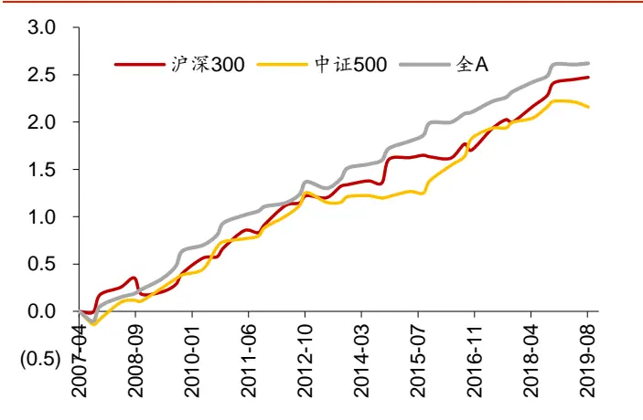
资料来源：Wind，华泰证券研究所

图表34： ts_rank(qfa_roa, 6)因子回归法因子收益率累积图
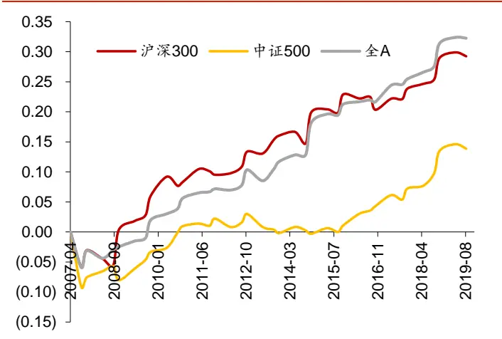
资料来源：Wind，华泰证券研究所

图表35： ts_rank(qfa_roa, 6)因子 TOP 组合除以基准组合净值
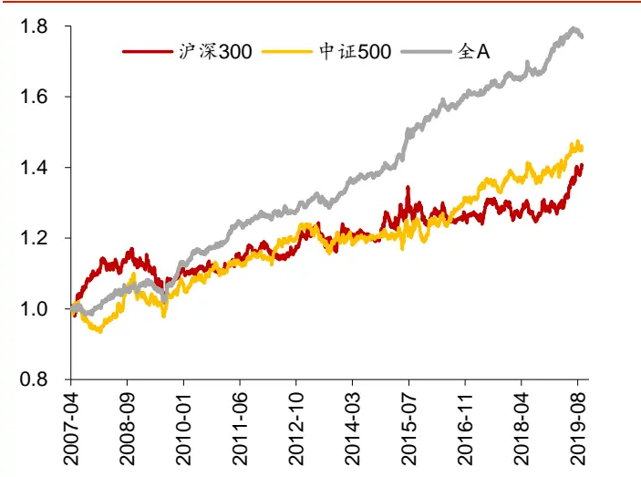
资料来源：Wind，华泰证券研究所

图表36： ts_rank(qfa_roa, 6)因子分层组合 1~5 的净值除以基准净值
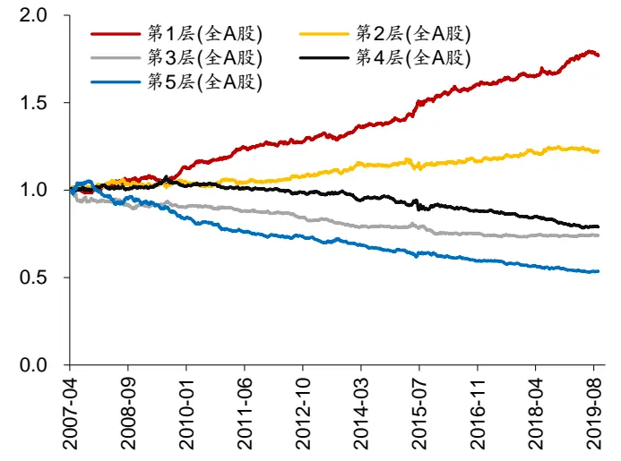
资料来源：Wind，华泰证券研究所

我们将 ts_rank(qfa_roa, 6)因子应用到各行业中进行分层测试，结果如图表 37 所示，其中每个行业分层组合对比基准为行业等权组合。

图表37： 不同行业 ts_rank(qfa_roa, 6)因子分层测试法结果(分五层，市值、成长、对应原始因子中性)

|  |  |  |  |  |  | 多空组合 | 多空组合TOP 组合信息 |  |  |
| --- | --- | --- | --- | --- | --- | --- | --- | --- | --- |
| 行业 |  | 分层组合1～5(从左到右)年化超额收益率 |  |  |  |  | 年化收益率 | 夏普比率 | 比率TOP 组合胜率 |
| 基础化工 | 8.63% | 1.75% | 0.25% | -6.64% | -8.06% | 17.27% | 1.41 | 1.16 | 61.74% |
| 电力设备 | 9.22% | -1.93% | -1.60% | -3.04% | -8.79% | 18.27% | 1.14 | 0.90 | 65.10% |
| 医药 | 5.62% | 2.43% | -4.75% | -2.06% | -6.16% | 11.90% | 1.09 | 0.83 | 59.06% |
| 建材 | 7.10% | 1.92% | -0.77% | -6.45% | -6.43% | 12.48% | 0.67 | 0.63 | 49.66% |
| 有色金属 | 6.54% | 2.81% | -0.82% | -2.22% | -11.38% | 18.21% | 1.02 | 0.62 | 57.05% |
| 电子元器件 | 5.17% | 3.47% | -1.36% | -4.52% | -7.22% | 12.28% | 0.89 | 0.61 | 53.69% |
| 电力及公用事业 | 5.16% | 0.00% | -1.29% | -3.99% | -4.53% | 8.96% | 0.61 | 0.60 | 57.72% |
| 国防军工 | 9.49% | 3.72% | -2.19% | -9.52% | -10.68% | 18.68% | 0.73 | 0.60 | 54.36% |
| 家电 | 7.46% | -2.36% | 0.52% | -4.16% | -7.87% | 14.10% | 0.69 | 0.59 | 51.01% |
| 石油石化 | 9.18% | -7.18% | -5.54% | 1.97% | -3.97% | 10.77% | 0.46 | 0.59 | 59.73% |
| 商贸零售 | 5.05% | -3.92% | 3.37% | -2.00% | -6.57% | 11.34% | 0.82 | 0.59 | 58.39% |
| 轻工制造 | 6.81% | -2.49% | -3.51% | -0.20% | -7.17% | 12.98% | 0.69 | 0.58 | 58.39% |
| 传媒 | 9.38% | -3.28% | -1.36% | -6.59% | -8.81% | 16.53% | 0.67 | 0.58 | 62.42% |
| 汽车 | 3.99% | 5.00% | -2.79% | -4.73% | -6.88% | 10.53% | 0.77 | 0.48 | 55.70% |
| 钢铁 | 5.78% | 0.54% | 1.37% | -4.40% | -8.64% | 13.58% | 0.68 | 0.45 | 53.69% |
| 建筑 | 4.50% | 0.40% | 3.71% | -7.37% | -7.10% | 10.53% | 0.57 | 0.39 | 53.02% |
| 机械 | 2.70% | 5.29% | -4.13% | -1.02% | -7.07% | 9.74% | 0.84 | 0.38 | 55.70% |
| 餐饮旅游 | 5.74% | -5.32% | -2.95% | -3.70% | 0.29% | 2.58% | 0.11 | 0.37 | 47.65% |
| 食品饮料 | 3.08% | 2.59% | 2.16% | -3.35% | -10.55% | 13.57% | 0.81 | 0.30 | 57.05% |
| 通信 | 3.34% | 2.62% | -2.22% | -4.77% | -5.10% | 7.11% | 0.39 | 0.29 | 53.02% |
| 煤炭 | 4.00% | 2.84% | 0.06% | -8.31% | -4.28% | 5.90% | 0.26 | 0.29 | 59.06% |
| 农林牧渔 | 2.38% | -5.08% | 2.80% | -2.26% | -4.00% | 5.08% | 0.31 | 0.24 | 50.34% |
| 交通运输 | 1.50% | 0.60% | 2.00% | -1.35% | -7.23% | 8.39% | 0.61 | 0.17 | 51.01% |
| 计算机 | 1.96% | 6.07% | -4.03% | -2.54% | -6.84% | 7.87% | 0.44 | 0.16 | 50.34% |
| 纺织服装 | 1.06% | -2.42% | 4.19% | -2.60% | -5.05% | 5.16% | 0.33 | 0.11 | 48.99% |
| 银行 | 0.71% | -1.23% | -0.23% | 1.17% | -7.62% | 7.08% | 0.34 | 0.05 | 46.31% |
| 综合 | 0.34% | 0.00% | -2.21% | -1.31% | -4.68% | 1.71% | 0.07 | 0.02 | 51.68% |
| 非银行金融 | 0.36% | 1.49% | -3.96% | 1.71% | -5.55% | 2.39% | 0.09 | 0.02 | 51.68% |
| 房地产 | -1.26% | -1.47% | -3.07% | 2.97% | -1.94% | -0.18% | -0.01 | -0.16 | 49.66% |

资料来源：Wind，华泰证券研究所

## (2) ts_rank(qfa_grossprofitmargin, 6)

图表38： ts_rank(qfa_grossprofitmargin, 6)因子 Rank IC 累积图
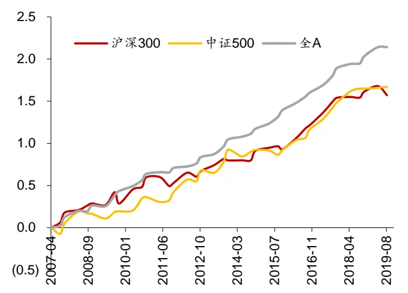
资料来源：Wind，华泰证券研究所

图表39： ts_rank(qfa_grossprofitmargin, 6)因子收益率累积图
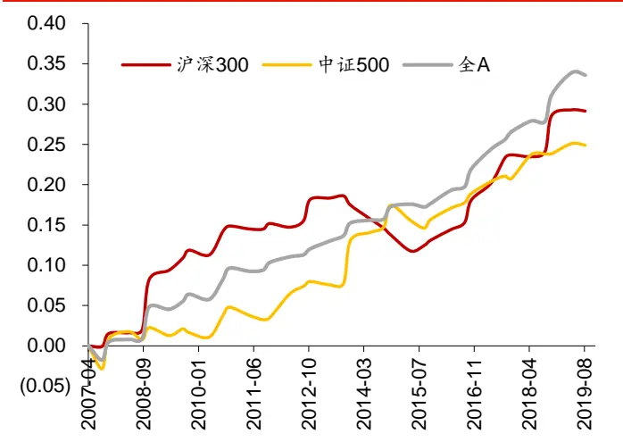
资料来源：Wind，华泰证券研究所

图表40： ts_rank(qfa_grossprofitmargin, 6)TOP 组合除以基准净值
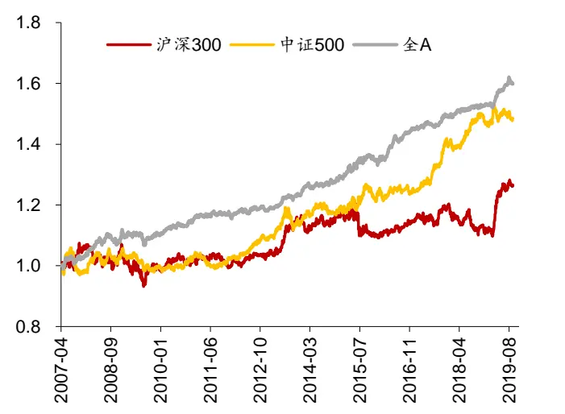
资料来源：Wind，华泰证券研究所

图表41： ts_rank(qfa_grossprofitmargin, 6)分层组合除以基准的净值
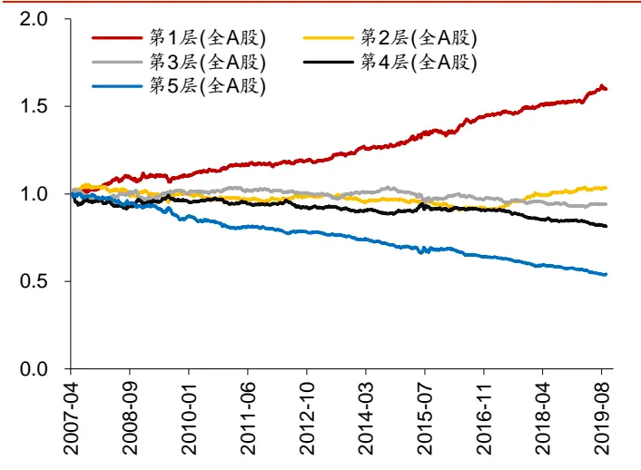
资料来源：Wind，华泰证券研究所

我们将 ts_rank(qfa_grossprofitmargin, 6)因子应用到各行业中进行分层测试，结果如图表42 所示，其中每个行业分层组合对比基准为行业等权组合。

图表42： 不同行业 ts_rank(qfa_grossprofitmargin, 6)因子分层测试法结果(分五层，市值、成长、对应原始因子中性)

|  |  |  |  |  |  | 多空组合 多空组合TOP组合信息 |  |  |  |
| --- | --- | --- | --- | --- | --- | --- | --- | --- | --- |
| 行业 |  | 分层组合1～5(从左到右)年化超额收益率 |  |  |  | 年化收益率 | 夏普比率 | 比率 | TOP 组合胜率 |
| 基础化工 | 8.97% | 1.30% | -0.75% | -5.26% | -8.04% | 17.70% | 1.53 | 1.27 | 62.42% |
| 钢铁 | 10.85% | 0.78% | -2.39% | -6.71% | -7.41% | 17.47% | 0.88 | 0.86 | 61.07% |
| 建材 | 9.31% | 1.31% | -2.66% | -1.42% | -11.97% | 22.12% | 1.22 | 0.82 | 60.40% |
| 汽车 | 6.13% | 2.23% | -3.87% | -3.89% | -5.17% | 10.90% | 0.81 | 0.72 | 55.03% |
| 电子元器件 | 5.39% | 1.06% | 1.09% | -2.60% | -8.91% | 14.64% | 1.07 | 0.63 | 53.69% |
| 电力及公用事业 | 5.05% | -0.15% | -0.43% | -4.50% | -4.74% | 9.14% | 0.65 | 0.62 | 53.69% |
| 煤炭 | 7.95% | -0.81% | -0.65% | -5.15% | -6.72% | 13.38% | 0.65 | 0.61 | 55.03% |
| 食品饮料 | 4.98% | 3.66% | -0.36% | -5.49% | -9.77% | 14.90% | 0.93 | 0.48 | 53.02% |
| 机械 | 3.08% | 1.97% | -1.31% | -0.48% | -7.82% | 11.10% | 0.98 | 0.44 | 56.38% |
| 交通运输 | 3.40% | 0.21% | 0.36% | -4.58% | -4.48% | 7.02% | 0.48 | 0.40 | 59.06% |
| 计算机 | 4.08% | 1.65% | -4.44% | -1.10% | -5.11% | 8.08% | 0.48 | 0.40 | 46.98% |
| 医药 | 2.48% | -0.95% | -2.34% | 0.55% | -4.67% | 7.01% | 0.73 | 0.39 | 57.72% |
| 传媒 | 4.94% | -5.92% | -1.93% | -3.90% | -0.78% | 2.52% | 0.10 | 0.31 | 53.02% |
| 农林牧渔 | 3.11% | 0.22% | -2.71% | -3.36% | -3.95% | 5.96% | 0.37 | 0.31 | 53.02% |
| 建筑 | 3.62% | -1.78% | 1.20% | -5.60% | -4.67% | 6.76% | 0.35 | 0.29 | 54.36% |
| 国防军工 | 4.59% | 2.02% | 2.91% | -7.16% | -15.10% | 19.89% | 0.85 | 0.29 | 50.34% |
| 纺织服装 | 2.55% | 0.14% | -2.29% | -2.62% | -2.80% | 4.34% | 0.29 | 0.27 | 57.72% |
| 轻工制造 | 3.18% | -1.96% | -4.53% | -3.00% | -1.04% | 2.36% | 0.12 | 0.25 | 53.02% |
| 电力设备 | 2.41% | -2.69% | -1.22% | -1.58% | -2.24% | 3.41% | 0.21 | 0.23 | 48.99% |
| 石油石化 | 3.23% | 3.52% | -1.37% | -5.75% | -5.64% | 6.37% | 0.27 | 0.21 | 50.34% |
| 综合 | 2.86% | 2.28% | -2.56% | -3.80% | -5.76% | 5.36% | 0.21 | 0.18 | 50.34% |
| 家电 | 2.21% | 1.84% | -2.25% | -3.70% | -4.95% | 5.31% | 0.26 | 0.17 | 48.99% |
| 餐饮旅游 | 0.89% | 1.62% | -3.17% | -4.26% | -3.65% | 1.55% | 0.06 | 0.06 | 48.99% |
| 有色金属 | 0.20% | 1.89% | -0.30% | 1.23% | -10.09% | 9.67% | 0.55 | 0.02 | 50.34% |
| 商贸零售 | -0.34% | -2.01% | -1.17% | 0.07% | -1.05% | -0.14% | -0.01 | -0.04 | 48.32% |
| 房地产 | -0.98% | -0.85% | -0.52% | -1.99% | -0.63% | -1.08% | -0.09 | -0.13 | 46.31% |
| 通信 | -2.28% | 3.72% | -0.68% | -0.12% | -6.09% | 2.26% | 0.12 | -0.19 | 50.34% |
| 非银行金融 | - | - |  | - |  | - | - | - | - |
| 银行 |  |  |  |  |  |  |  |  |  |

资料来源：Wind，华泰证券研究所

## 收益质量类历史分位数因子(每年调仓三次)

图表 43 展示了 4 个收益质量类历史分位数因子在全部非 ST 股票上的数据覆盖度随时间变化曲线。

图表43： 收益质量类历史分位数因子数据覆盖度随时间变化情况
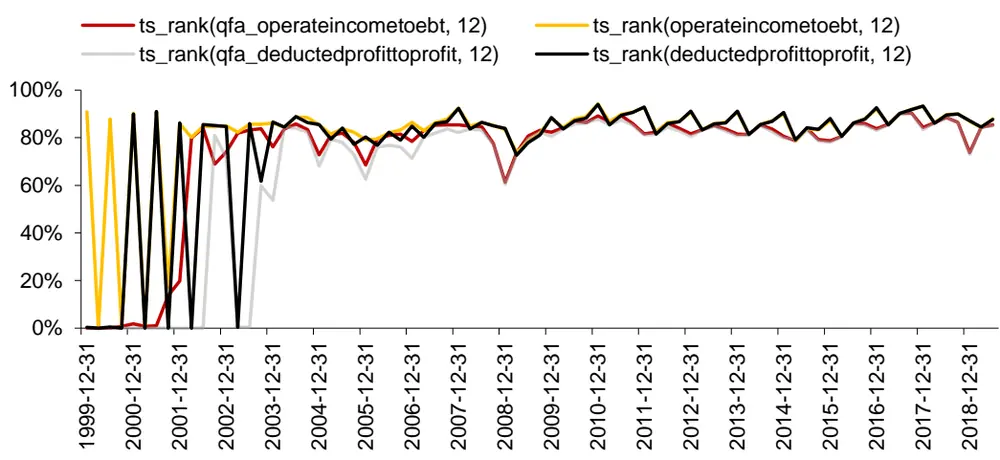
资料来源：Wind，华泰证券研究所

图表 44 展示了收益质量类历史分位数因子在各种股票池内回归法、IC 值分析结果汇总。
因子对行业、市值、成长和对应原始因子进行了中性化。

图表44： 收益质量类历史分位数因子在各股票池内回归法、IC值分析结果汇总(行业、市值、成长、对应原始因子中性)

| 因子含义 | 因子名称 |  | 因子收益率 Rank IC Rank IC |  |  | 标准差 |  | IC_IR IC>0 占比 |
| --- | --- | --- | --- | --- | --- | --- | --- | --- |
|  |  |  | It\|均值\|t\|>2 占比 | t均值 | 均值 均值 |  |  |  |
| 沪深 300 成分股内 |  |  |  |  |  |  |  |  |
| 单季度经营活动净收益/利ts_rank(qfa_operateincometoebt, 6) |  | 1.09 15.79% | 0.20 | 0.57% | 1.18% | 7.00% | 0.17 | 60.53% |
| 润总额在过去 n 个季度里ts_rank(qfa_operateincometoebt, 8) |  | 1.01 13.16% | 0.07 | 0.42% | 1.59% | 6.23% | 0.26 | 68.42% |
| 的分位数(n=6,8,12) | ts_rank(qfa_operateincometoebt, 12) | 1.00 10.53% | -0.05 | 0.23% | 1.04% | 7.15% | 0.15 | 68.42% |
| 当年累计经营活动净收益/ts_rank(operateincometoebt, 6) |  | 0.96 10.53% | 0.00 | 0.17% | 0.62% | 7.13% | 0.09 | 52.63% |
| 利润总额在过去 n 个季度ts_rank(operateincometoebt, 8) | 1.07 | 18.42% | -0.17 | -0.03% | 0.54% | 6.96% | 0.08 | 47.37% |
| 里的分位数(n=6,8,12) ts_rank(operateincometoebt, 12) | 1.05 | 15.79% | -0.23 | -0.08% | 0.23% | 7.44% | 0.03 | 50.00% |
| 单季度扣非净利润/净利润ts_rank(qfa_deductedprofittoprofit， 6) | 0.93 | 15.79% | -0.10 | -0.15% | 0.22% | 7.12% | 0.03 | 50.00% |
| 在过去 n 个季度里的分位ts_rank(qfa_deductedprofittoprofit, 8) | 1.02 | 10.53% | -0.13 | -0.16% | 0.66% | 6.48% | 0.10 | 57.89% |
| 数(n=6,8,12) ts_rank(qfa_deductedprofittoprofit, 12) | 1.08 | 21.05% | -0.19 | -0.20% | 0.11% | 6.57% | 0.02 | 55.26% |
| 当年累计扣非净利润/净利ts_rank(deductedprofittoprofit, 6) | 0.98 | 13.16% | -0.01 | 0.08% | 1.00% | 6.44% | 0.16 | 57.89% |
| 润在过去 n 个季度里的分 ts_rank(deductedprofittoprofit, 8) | 0.93 | 15.79% | -0.03 | 0.09% | 1.37% | 5.55% | 0.25 | 63.16% |
| 位数(n=6,8,12) ts_rank(deductedprofittoprofit, 12) | 0.97 | 15.79% | -0.04 | 0.11% | 0.68% | 6.23% | 0.11 | 55.26% |
| 中证 500 成分股内 |  |  |  |  |  |  |  |  |
| 单季度经营活动净收益/利ts_rank(qfa_operateincometoebt, 6) | 1.03 | 10.53% | 0.16 | 0.47% | 2.87% | 5.65% | 0.51 | 71.05% |
| 润总额在过去 n 个季度里ts_rank(qfa_operateincometoebt, 8) | 1.11 | 7.89% | 0.07 | 0.40% | 2.49% | 6.63% | 0.37 | 63.16% |
| 的分位数(n=6,8,12) ts_rank(qfa_operateincometoebt, 12) | 1.08 | 13.16% | 0.05 | 0.43% | 2.30% | 6.56% | 0.35 | 57.89% |
| 当年累计经营活动净收益/ts_rank(operateincometoebt, 6) | 1.11 | 10.53% | -0.09 | -0.09% | 1.19% | 6.90% | 0.17 | 57.89% |
| 利润总额在过去 n 个季度ts_rank(operateincometoebt, 8) | 1.16 | 13.16% | -0.05 | 0.00% | 1.38% | 7.35% | 0.19 | 63.16% |
| 里的分位数(n=6,8,12) ts_rank(operateincometoebt, 12) | 1.14 | 18.42% | -0.03 | 0.03% | 1.22% | 7.27% | 0.17 | 60.53% |
| 单季度扣非净利润/净利润ts_rank(qfa_deductedprofittoprofit, 6) | 0.94 | 2.63% | 0.17 | 0.32% | 2.12% | 6.44% | 0.33 | 68.42% |
| 在过去 n 个季度里的分位ts_rank(qfa_deductedprofittoprofit, 8) | 0.85 | 2.63% | 0.06 | 0.27% | 1.99% | 5.89% | 0.34 | 68.42% |
| 数(n=6,8,12) ts_rank(qfa_deductedprofittoprofit, 12) | 0.89 | 5.26% | 0.00 | 0.25% | 1.60% | 5.56% | 0.29 | 68.42% |
| 当年累计扣非净利润/净利ts_rank(deductedprofittoprofit, 6) | 1.15 | 18.42% | 0.02 | 0.08% | 1.18% | 7.12% | 0.17 | 55.26% |
| 润在过去 n 个季度里的分 ts_rank(deductedprofittoprofit, 8) | 1.14 | 15.79% | -0.03 | 0.04% | 1.33% | 7.21% | 0.18 | 52.63% |
| 位数(n=6,8,12) ts_rank(deductedprofittoprofit, 12) | 1.16 | 15.79% | -0.07 | 0.01% | 1.09% | 7.12% | 0.15 | 57.89% |
| 全A股 |  |  |  |  |  |  |  |  |
| 单季度经营活动净收益/利ts_rank(qfa_operateincometoebt, 6) | 1.15 | 18.42% | 0.62 | 0.55% | 2.95% | 3.74% | 0.79 | 81.58% |
| 润总额在过去 n 个季度里ts_rank(qfa_operateincometoebt, 8) | 1.17 | 13.16% | 0.54 | 0.52% | 2.91% | 3.87% | 0.75 | 73.68% |
| 的分位数(n=6,8,12) ts_rank(qfa_operateincometoebt, 12) | 1.16 | 15.79% | 0.32 | 0.36% | 2.48% | 4.14% | 0.60 | 65.79% |
| 当年累计经营活动净收益/ts_rank(operateincometoebt, 6) | 1.32 | 26.32% | 0.31 | 0.16% | 2.30% | 4.16% | 0.55 | 65.79% |
| 利润总额在过去 n 个季度ts_rank(operateincometoebt, 8) | 1.32 | 23.68% | 0.23 | 0.14% | 2.18% | 4.11% | 0.53 | 65.79% |
| 里的分位数(n=6,8,12) ts_rank(operateincometoebt, 12) | 1.31 | 21.05% | 0.13 | 0.08% | 1.92% | 4.08% | 0.47 | 60.53% |
| 单季度扣非净利润/净利润ts_rank(qfa_deductedprofittoprofit， 6) | 1.03 | 15.79% | 0.19 | 0.15% | 2.24% | 3.57% | 0.63 | 76.32% |
| 在过去 n 个季度里的分位ts_rank(qfa_deductedprofittoprofit, 8) | 1.04 | 13.16% | 0.16 | 0.18% | 2.39% | 3.49% | 0.68 | 76.32% |
| 数(n=6,8,12) ts_rank(qfa_deductedprofittoprofit, 12) | 1.08 | 10.53% | 0.04 | 0.17% | 1.97% | 3.52% | 0.56 | 73.68% |
| 当年累计扣非净利润/净利ts_rank(deductedprofittoprofit, 6) | 1.02 | 13.16% | 0.19 | 0.08% | 2.24% | 3.56% | 0.63 | 78.95% |
| 润在过去 n 个季度里的分 ts_rank(deductedprofittoprofit, 8) | 1.08 | 15.79% | 0.18 | 0.11% | 2.30% | 3.41% | 0.67 | 76.32% |
| 位数(n=6,8,12) ts_rank(deductedprofittoprofit, 12) | 1.14 | 18.42% | 0.05 | 0.05% | 1.91% | 3.49% | 0.55 | 71.05% |

资料来源：Wind，华泰证券研究所

图表 45展示了收益质量类历史分位数因子在各种股票池内分层测试结果汇总。因子对行业、市值、成长和对应原始因子进行了中性化。

图表45： 收益质量类历史分位数因子在各股票池内分层测试结果汇总(分五层，行业、市值、成长、对应原始因子中性)

|  | 因子名称 | 分层组合1～5(从左到右)年化超额收益 |  | 多空组合多空组合TOP 组合TOP组合 |  |  |
| --- | --- | --- | --- | --- | --- | --- |
| 因子含义 |  | 率 | 年化收益率夏普比率信息比率胜率 |  |  |  |
| 沪深 300 成分股内 |  |  |  |  |  |  |
| 单季度经营活动净收益 | /ts_rank(qfa_operateincometoebt, 6) | 2.06% -0.52% -1.44% -1.83% -2.16% | 3.95% | 0.47 | 0.39 | 55.03% |
|  | 利润总额在过去 n 个季度ts_rank(qfa_operateincometoebt, 8) | 1.06%1.00% -0.54% -2.64% -2.65% | 3.42% | 0.40 | 0.20 | 53.02% |
| 里的分位数(n=6,8,12) | ts_rank(qfa_operateincometoebt, 12) | 0.94% 0.31% -0.51% -2.70% -1.75% | 2.36% | 0.28 | 0.18 | 51.68% |
|  | 当年累计经营活动净收益ts_rank(operateincometoebt, 6) | 0.53% 2.59% -2.83% -4.18% 0.52% | -0.35% | -0.04 | 0.09 | 46.31% |
| 里的分位数(n=6,8,12) | /利润总额在过去n 个季度ts_rank(operateincometoebt, 8) | 1.11%0.45% -1.66%-3.25%0.23% | 0.56% | 0.07 | 0.21 | 53.69% |
|  | ts_rank(operateincometoebt, 12) | 1.65% 0.24% -1.56%-4.25%0.97% | 0.34% | 0.04 | 0.32 | 55.70% |
|  | 单季度扣非净利润/净利ts_rank(qfa_deductedprofittoprofit, 6) | -0.36%0.20% -1.22%-1.24% -1.14% | 0.46% | 0.06 | -0.07 | 45.64% |
|  | 润在过去 n 个季度里的分ts_rank(qfa_deductedprofittoprofit， 8) | 0.72% -0.57% -1.26% -1.18%-1.57% | 1.94% | 0.23 | 0.14 | 53.69% |
| 位数(n=6,8,12) | ts_rank(qfa_deductedprofittoprofit, 12) | 0.41% -0.25% -0.95% -1.25% -1.61% | 1.70% | 0.21 | 0.08 | 49.66% |
| 当年累计扣非净利润/净 | ts_rank(deductedprofittoprofit, 6) | 0.30%2.01% -2.91% -2.78% -0.20% | 0.14% | 0.02 | 0.06 | 48.99% |
|  | 利润在过去 n 个季度里的 ts_rank(deductedprofittoprofit, 8) | 1.39% -0.85% -0.92%-2.07%-0.93% | 1.97% | 0.23 | 0.27 | 53.02% |
| 分位数(n=6,8,12) | ts_rank(deductedprofittoprofit, 12) | 0.28% -0.26% -0.80% -0.68% -1.89% | 1.84% | 0.22 |  | 0.05 50.34% |
| 中证 500 成分股内 |  |  |  |  |  |  |
| 单季度经营活动净收益/ts_rank(qfa_operateincometoebt, 6) |  | 1.58% 0.98% 1.95% -3.41% -4.28% | 5.81% | 0.77 | 0.34 | 52.35% |
|  | 利润总额在过去 n 个季度ts_rank(qfa_operateincometoebt, 8) | -0.07% 1.28% 2.90% -4.05% -3.14% | 2.85% | 0.37 | -0.02 | 49.66% |
| 里的分位数(n=6,8,12) | ts_rank(qfa_operateincometoebt, 12) | -0.43% 2.81% 0.85% -2.62% -3.42% | 2.76% | 0.35 | -0.09 | 55.03% |
|  | 当年累计经营活动净收益ts_rank(operateincometoebt, 6) | -0.12% 0.38% 1.20%-0.92%-3.30% | 2.98% | 0.38 | -0.02 | 55.03% |
|  | /利润总额在过去n 个季度ts_rank(operateincometoebt, 8) | -0.20% -0.79% 3.49% -0.95% -4.57% | 4.29% | 0.57 | -0.04 | 47.65% |
| 里的分位数(n=6,8,12) | ts_rank(operateincometoebt, 12) | -0.10% 0.58% 1.35% -0.97% -3.42% | 3.10% | 0.37 | -0.02 | 49.66% |
|  | 单季度扣非净利润/净利ts_rank(qfa_deductedprofittoprofit， 6) | -0.66% 1.47%-0.75% -0.09% -3.26% | 2.41% | 0.33 | -0.15 | 46.98% |
| 位数(n=6,8,12) | 润在过去n 个季度里的分ts_rank(qfa_deductedprofittoprofit, 8) | 0.42% 0.73% -0.11% -1.50% -2.68% | 2.91% | 0.40 | 0.09 | 49.66% |
| 当年累计扣非净利润/净 | ts_rank(qfa_deductedprofittoprofit, 12) | -0.01% 0.70% 0.54% -2.61% -1.65% | 1.39% | 0.19 | 0.00 | 50.34% |
|  | ts_rank(deductedprofittoprofit, 6) | 0.74% 0.79% -0.99% -2.16% -1.32% | 1.81% | 0.25 | 0.16 | 50.34% |
| 分位数(n=6,8,12) | 利润在过去 n 个季度里的 ts_rank(deductedprofittoprofit, 8) | 0.67% 0.54% -1.35%-0.74% -1.85% | 2.28% | 0.30 |  | 0.14 50.34% |
| 全 A 股 | ts_rank(deductedprofittoprofit, 12) | 0.23% 0.05% 0.94% -1.99% -1.88% | 1.88% | 0.25 |  | 0.05 52.35% |
| 单季度经营活动净收益/ts_rank(qfa_operateincometoebt, 6) |  |  |  |  |  |  |
| 利润总额在过去 n 个季度ts_rank(qfa_operateincometoebt, 8) |  | 1.87% 0.00% 0.11% -1.94% -3.09% 1.04%0.38% | 5.00% 3.70% | 1.07 0.79 | 0.65 0.36 | 59.73% |
| 里的分位数(n=6,8,12) ts_rank(qfa_operateincometoebt, 12) |  | 0.07% -1.77% -2.68% 0.52% 1.11% 0.44% -2.06% -2.86% | 3.38% | 0.73 | 0.18 | 53.69% |
| 当年累计经营活动净收益ts_rank(operateincometoebt, 6) |  | 1.19% 0.16% -0.69% -1.20% -2.26% | 3.41% | 0.70 | 0.39 | 46.31% |
| /利润总额在过去n 个季度ts_rank(operateincometoebt, 8) |  | 1.20% -0.91% 0.87% -1.41%-2.40% | 3.58% | 0.77 |  | 55.03% 0.40 57.05% |
| 里的分位数(n=6,8,12) ts_rank(operateincometoebt, 12) |  | 0.94%0.33% -0.23% -1.63% -1.91% | 2.80% | 0.59 | 0.31 | 52.35% |
| 单季度扣非净利润/净利ts_rank(qfa_deductedprofittoprofit, 6) |  | 1.13% -0.14%-0.05% -1.48% -2.56% | 3.67% | 0.76 | 0.38 | 52.35% |
| 润在过去 n 个季度里的分ts_rank(qfa_deductedprofittoprofit， 8) |  |  | 3.36% | 0.74 | 0.47 | 55.03% |
| 位数(n=6,8,12) |  | 1.33%-0.42% 0.17% -2.00%-2.06% 0.68% | 2.21% | 0.48 | 0.24 | 50.34% |
| 当年累计扣非净利润/净 | ts_rank(qfa_deductedprofittoprofit, 12) | 0.65% -0.49% -2.16% -1.60% | 2.90% | 0.61 | 0.43 | 59.73% |
| 利润在过去 n 个季度里的 ts_rank(deductedprofittoprofit, 8) | ts_rank(deductedprofittoprofit, 6) | 1.30% -0.13% -0.64% -1.70% -1.66% 1.38% -0.72% 0.17% -1.56% -1.87% | 3.22% | 0.71 | 0.47 | 61.07% |
| 分位数(n=6,8,12) | ts_rank(deductedprofittoprofit, 12) | 0.26%0.15% -0.06% -1.21% -1.60% | 1.78% | 0.40 | 0.09 | 54.36% |

资料来源：Wind，华泰证券研究所

通过回归法、IC值分析、分层测试法的结果我们可以发现各收益质量类历史分位数因子的选股效果(因子收益率均值、RankIC均值、多空组合夏普比率)存在一定差别，其中ts_rank(qfa_operateincometoebt, n)的效果最好。我们选择最优的ts_rank(qfa_operateincometoebt, 6)因子进行单独展示，其主要指标表现图表 46~图表 49所示。

图表46： ts_rank(qfa_operateincometoebt, 6)因子 Rank IC 累积图
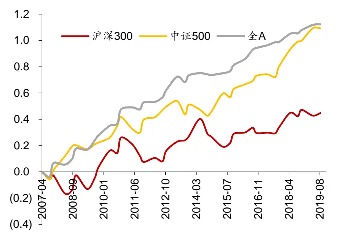
资料来源：Wind，华泰证券研究所

图表47： ts_rank(qfa_operateincometoebt, 6)因子收益率累积图
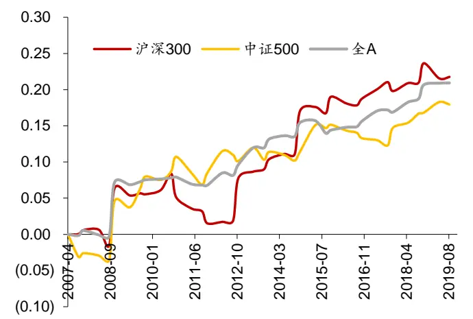
资料来源：Wind，华泰证券研究所

图表48： ts_rank(qfa_operateincometoebt, 6) TOP 组除以基准净值
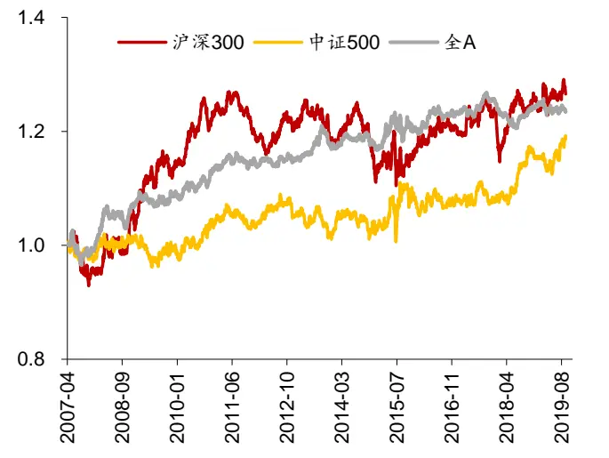
资料来源：Wind，华泰证券研究所

图表49： ts_rank(qfa_operateincometoebt, 6)分层除以基准的净值
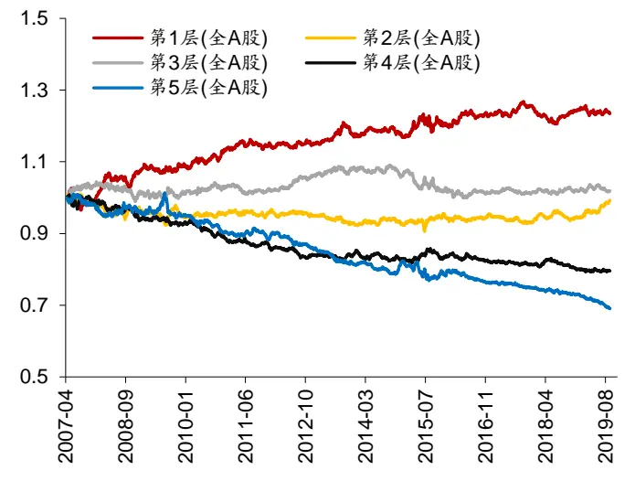
资料来源：Wind，华泰证券研究所

我们将 ts_rank(qfa_operateincometoebt, 6)因子应用到各行业中进行分层测试，结果如图表 50 所示，其中每个行业分层组合对比基准为行业等权组合。

图表50： 不同行业 ts_rank(qfa_operateincometoebt, 6)因子分层测试法结果(分五层，市值、成长、对应原始因子中性)

| 分层组合1～5(从左到右)年化超额收益率 |  |  |  |  |  | 多空组合 多空组合TOP 组合信息 |  |  |  |
| --- | --- | --- | --- | --- | --- | --- | --- | --- | --- |
| 行业 |  |  |  |  |  | 年化收益率 | 夏普比率 | 比率TOP 组合胜率 |  |
| 建筑 | 6.79% 3.33% | -1.69% -1.07% | -7.25% -0.47% | -5.52% -0.68% | 1.80% -5.20% | 3.04% 8.25% | 0.16 0.70 | 0.53 0.44 | 53.69% 52.35% |
| 机械 基础化工 | 2.69% | 3.34% | -0.40% | -3.82% | -6.22% | 8.75% | 0.76 | 0.37 | 51.68% |
| 石油石化 | 5.88% | -3.52% | -10.17% | -0.67% | 0.65% | 1.37% | 0.05 | 0.36 | 51.68% |
| 综合 |  | 0.03% | -4.28% | 5.74% | -16.81% | 22.56% | 0.79 | 0.33 | 50.34% |
| 交通运输 | 6.04% 2.72% | -1.25% | -2.12% | -0.59% | -4.73% | 6.99% | 0.55 | 0.32 | 55.03% |
| 建材 | 3.63% | -0.26% | -2.41% | 0.01% | -5.53% | 7.76% | 0.41 | 0.31 | 51.68% |
| 商贸零售 | 2.74% | -0.52% | -2.03% | -1.18% | -3.93% | 5.90% | 0.42 | 0.31 | 51.01% |
| 电子元器件 | 2.84% | 1.21% | -0.05% | -0.02% | -8.04% | 10.61% | 0.72 | 0.31 | 49.66% |
| 煤炭 | 3.53% | 0.72% | -3.07% | -2.59% | -3.42% | 4.92% |  |  |  |
| 轻工制造 | 3.23% | 0.19% | -4.92% | -5.16% |  |  | 0.23 | 0.26 | 53.69% |
| 钢铁 |  | -2.14% | 0.53% |  | -1.03% | 2.21% | 0.11 | 0.25 | 48.32% |
| 非银行金融 | 3.14% | 0.54% | -6.84% | -1.77% | -5.29% | 6.65% | 0.33 | 0.24 | 49.66% |
| 电力及公用事业 | 3.64% 1.50% | -3.16% | 2.45% | -4.59% -2.46% | 1.15% | -1.61% | -0.06 | 0.23 | 51.68% |
| 国防军工 |  | -5.91% | -3.63% | 5.52% | -3.40% | 4.05% | 0.28 | 0.16 | 51.01% |
| 汽车 | 2.49% | -1.64% | -0.93% |  | -6.37% | 6.33% | 0.25 | 0.14 | 51.01% |
| 银行 | 1.17% 0.97% | 1.67% | -1.74% | -0.25% | -2.79% | 3.07% | 0.22 | 0.13 | 51.68% |
| 农林牧渔 | 1.06% | 2.36% | -1.96% | -1.88% | -3.80% | 3.13% | 0.17 | 0.09 | 46.98% |
| 医药 | 0.37% | 3.38% |  | -4.12% | -3.83% | 3.26% | 0.18 | 0.09 | 51.01% |
| 纺织服装 | 0.50% | -1.37% | -2.91% 0.25% | -0.22% | -5.48% | 5.57% | 0.51 | 0.05 | 51.01% |
| 计算机 | 0.29% | -1.26% |  | 2.55% | -8.22% | 8.21% | 0.53 | 0.05 | 51.68% |
| 通信 |  | -2.61% | 2.14% | -2.17% | -4.13% | 3.06% | 0.17 | 0.02 | 51.68% |
| 传媒 | -0.48% -0.95% | -1.67% | 0.85% | -1.43% | -3.21% | 0.66% | 0.03 | -0.04 | 44.97% |
| 房地产 | -0.47% | -1.15% | -0.27% | 2.66% | -8.36% | 5.01% | 0.20 | -0.06 | 46.98% |
|  |  | -1.97% | -1.34% | -0.02% | -1.94% | 0.63% | 0.05 | -0.06 | 51.01% |
| 家电 | -0.85% | 0.70% | 5.35% | -4.96% | -4.72% | 1.81% | 0.09 | -0.07 | 44.97% |
| 有色金属 | -0.79% -1.29% | 2.75% | 2.09% -2.86% | 1.59% | -9.44% -1.28% | 7.65% | 0.42 | -0.07 | 51.01% |
| 电力设备 | -4.49% | -1.71% | -5.90% | -2.50% | 1.63% | -1.28% -9.43% | -0.08 -0.34 | -0.13 -0.25 | 52.35% |
| 餐饮旅游 |  |  |  | -0.54% |  |  |  |  | 42.95% |
| 食品饮料 | -4.91% | -2.10% | -1.82% | 4.40% | -2.06% | -4.46% | -0.24 | -0.42 | 46.31% |

资料来源：Wind，华泰证券研究所

## 营运能力类历史分位数因子(每年调仓三次)

图表 51 展示了 5 个营运能力类历史分位数因子在全部非 ST 股票上的数据覆盖度随时间变化曲线。

图表51： 营运能力类历史分位数因子数据覆盖度随时间变化情况
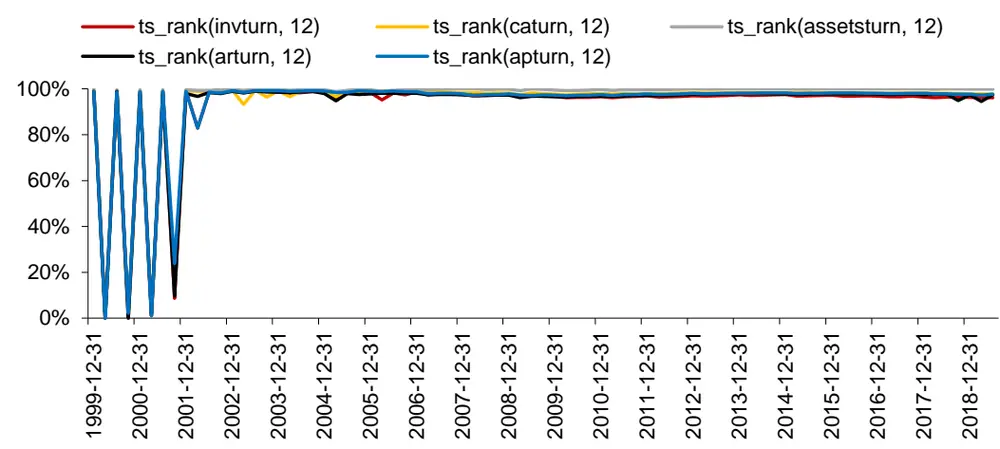
资料来源：Wind，华泰证券研究所

图表 52 展示了营运能力类历史分位数因子在各种股票池内回归法、IC 值分析结果汇总。
因子对行业、市值、成长和对应原始因子进行了中性化。

图表52： 营运能力类历史分位数因子在各股票池内回归法、IC值分析结果汇总(行业、市值、成长、对应原始因子中性)

| 因子含义 | 因子名称 |  |  |  |  | 因子收益率 Rank IC Rank IC |  |  |  |
| --- | --- | --- | --- | --- | --- | --- | --- | --- | --- |
|  |  | It\|均值\|t\|>2 占比 |  | t均值 | 均值 |  | 均值 标准差 | IC_IR IC>0 占比 |  |
| 沪深 300 成分股内 |  |  |  |  |  |  |  |  |  |
| 存货周转率在过去 n 个季 | ts_rank(invturn, 6) | 1.28 | 15.79% | 0.10 | 0.12% | 2.76% | 10.24% | 0.27 | 63.16% |
| 度里的分位数(n=6,8,12) | ts_rank(invturn, 8) | 1.15 | 18.42% | 0.05 | 0.08% | 2.48% | 9.97% | 0.25 | 71.05% |
|  | ts_rank(invturn, 12) | 1.07 | 7.89% | 0.14 | 0.20% | 1.89% | 10.04% | 0.19 | 65.79% |
| 流动资产周转率在过去 nts_rank(caturn， 6) |  | 1.00 | 10.53% | 0.25 | 0.30% | 0.63% | 10.68% | 0.06 | 55.26% |
| 个季度里的分位数ts_rank(caturn, 8) |  | 0.93 | 5.26% | 0.24 | 0.28% | -0.46% | 9.89% | -0.05 | 50.00% |
| (n=6,8,12) | ts_rank(caturn, 12) | 0.92 | 13.16% | 0.43 | 0.59% | -0.87% | 9.37% | -0.09 | 47.37% |
| 总资产周转率在过去 n 个ts_rank(assetsturn, 6) |  | 1.13 | 10.53% | -0.04 | -0.11% | 4.05% | 11.14% | 0.36 | 60.53% |
| 季度里的分位 | 数ts_rank(assetsturn, 8) | 1.00 | 5.26% | -0.08 | -0.22% | 3.62% | 10.30% | 0.35 | 50.00% |
| (n=6,8,12) | ts_rank(assetsturn, 12) | 0.90 | 7.89% | 0.11 | 0.18% | 2.79% | 9.35% | 0.30 | 57.89% |
| 应付账款周转率在过去 n ts_rank(apturn， 6) |  | 1.09 | 13.16% | -0.24 | -0.12% | -0.03% | 9.66% | 0.00 | 57.89% |
| 个季度里的分位数 | ts_rank(apturn, 8) | 1.08 | 21.05% | -0.24 | -0.13% | -0.21% | 9.61% | -0.02 | 55.26% |
| (n=6,8,12) | ts_rank(apturn, 12) | 1.11 | 18.42% | -0.12 | -0.09% | -0.41% | 9.16% | -0.04 | 50.00% |
| 中证 500 成分股内 |  |  |  |  |  |  |  |  |  |
| 存货周转率在过去 n 个季 | ts_rank(invturn, 6) | 0.89 | 13.16% | -0.19 | -0.12% | 0.67% | 7.13% | 0.09 | 60.53% |
| 度里的分位数(n=6,8,12) | ts_rank(invturn, 8) | 0.89 | 5.26% | -0.06 | 0.09% | 0.27% | 7.28% | 0.04 | 60.53% |
|  | ts_rank(invturn, 12) | 0.85 | 2.63% | -0.11 | 0.01% | 0.01% | 6.81% | 0.00 | 52.63% |
| 流动资产周转率在过去nts_rank(caturn， 6) |  | 0.83 | 7.89% | -0.18 | -0.41% | 0.15% | 7.51% | 0.02 | 55.26% |
| 个季度里的分位数ts_rank(caturn, 8) |  | 0.90 | 10.53% | -0.21 | -0.28% | -0.82% | 7.26% | -0.11 | 44.74% |
| (n=6,8,12) | ts_rank(caturn, 12) | 1.00 | 7.89% | -0.24 | -0.31% | -0.54% | 7.03% | -0.08 | 44.74% |
| 总资产周转率在过去 n 个ts_rank(assetsturn, 6) |  | 1.19 | 18.42% | 0.02 | -0.03% | 1.80% | 9.42% | 0.19 | 55.26% |
| 季度里的分位 | 数ts_rank(assetsturn, 8) | 1.12 | 21.05% | 0.03 | 0.18% | 0.75% | 9.37% | 0.08 | 47.37% |
| (n=6,8,12) | ts_rank(assetsturn, 12) | 1.15 | 13.16% | -0.12 | -0.11% | 0.50% | 8.48% | 0.06 | 47.37% |
| 应付账款周转率在过去 n ts_rank(apturn， 6) |  | 0.85 | 5.26% | -0.32 | -0.28% | -1.76% | 6.96% | -0.25 | 34.21% |
| 个季度里的分位数 | ts_rank(apturn, 8) | 0.78 | 2.63% | -0.13 | 0.01% | -0.77% | 6.47% | -0.12 | 36.84% |
| (n=6,8,12) | ts_rank(apturn, 12) | 0.84 | 7.89% | -0.09 | 0.14% | -0.87% | 6.74% | -0.13 | 50.00% |
| 全 A股 |  |  |  |  |  |  |  |  |  |
| 存货周转率在过去 n 个季 | ts_rank(invturn, 6) | 1.48 | 28.95% | 0.32 | 0.24% | 0.83% | 5.57% | 0.15 | 57.89% |
| 度里的分位数(n=6,8,12) | ts_rank(invturn, 8) | 1.34 | 21.05% | 0.28 | 0.25% | 0.32% | 5.35% | 0.06 | 50.00% |
|  | ts_rank(invturn, 12) | 1.24 | 21.05% | 0.18 | 0.19% | -0.21% | 5.07% | -0.04 | 42.11% |
| 流动资产周转率在过去nts_rank(caturn， 6) |  | 1.24 | 13.16% | 0.33 | 0.20% | 1.69% | 6.81% | 0.25 | 63.16% |
| 个季度里的分位数ts_rank(caturn， 8) |  | 1.18 | 23.68% | 0.13 | 0.12% | 0.89% | 6.21% | 0.14 | 60.53% |
| (n=6,8,12) | ts_rank(caturn, 12) | 1.24 | 18.42% | 0.12 | 0.12% | 0.92% | 5.62% | 0.16 | 55.26% |
| 总资产周转率在过去 n 个ts_rank(assetsturn, 6) |  | 1.74 | 39.47% | 0.51 | 0.37% | 2.32% | 7.76% | 0.30 | 68.42% |
| 季度里的分位 | 数ts_rank(assetsturn, 8) | 1.44 | 34.21% | 0.28 | 0.22% | 1.00% | 7.49% | 0.13 | 57.89% |
| (n=6,8,12) | ts_rank(assetsturn, 12) | 1.38 | 21.05% | 0.21 | 0.16% | 0.65% | 6.89% | 0.09 | 55.26% |
| 应付账款周转率在过去 n ts_rank(apturn， 6) |  | 1.29 | 23.68% | -0.30 | -0.17% | -1.07% | 5.39% | -0.20 | 42.11% |
| 个季度里的分位数 | ts_rank(apturn, 8) | 1.42 | 26.32% | -0.25 | -0.09% -0.02% | -0.81% -0.71% | 4.75% 4.66% | -0.17 -0.15 | 42.11% 42.11% |

资料来源：Wind，华泰证券研究所

图表 53展示了营运能力类历史分位数因子在各种股票池内分层测试结果汇总。因子对行业、市值、成长和对应原始因子进行了中性化。

图表53： 营运能力类历史分位数因子在各股票池内分层测试结果汇总(分五层，行业、市值、成长、对应原始因子中性)

|  |  | 分层组合1～5(从左到右)年化超额收益 | 年化收益率夏普比率信息比率 | 多空组合多空组合TOP 组合TOP组合 |  |  |
| --- | --- | --- | --- | --- | --- | --- |
| 因子含义 | 因子名称 | 率 |  |  |  | 胜率 |
| 沪深 300 成分股内 |  |  |  |  |  |  |
| 存货周转率在过去 n 个季 | ts_rank(invturn, 6) | 0.05% 2.43% -2.41% 0.05%-3.41% | 3.16% 3.45% | 0.36 0.38 | 0.01 -0.16 | 51.01% |
| 度里的分位数(n=6,8,12) | ts_rank(invturn, 8) | -0.93% 1.94%-0.03%0.59%-4.63% | 2.61% | 0.29 |  | 50.34% |
|  | ts_rank(invturn, 12) | -0.72% 0.33% 1.97% -1.02% -3.63% |  |  | -0.13 | 51.68% |
| 流动资产周转率在过去 nts_rank(caturn， 6) |  | -0.78% 0.33% -0.79% -1.77% -0.19% | -1.09% | -0.11 | -0.13 | 50.34% |
| 个季度里的分位数ts_rank(caturn, 8) |  | -2.32%-0.92% 1.58%-0.30%-0.97% | -1.78% | -0.19 | -0.39 | 48.99% |
| (n=6,8,12) | ts_rank(caturn, 12) | -2.80% -0.20% 0.11% -0.18%0.19% | -3.40% | -0.36 | -0.48 | 44.97% |
| 总资产周转率在过去 n 个t | ts_rank(assetsturn, 6) | 0.97% 1.96% -1.66% -2.60% -2.00% | 2.44% | 0.23 |  | 0.15 51.68% |
| 季度里的分位 | 数ts_rank(assetsturn, 8) | -0.28% 2.10% -1.79% -2.99% -0.18% | -0.64% | -0.06 | -0.04 | 48.99% |
| (n=6,8,12) | ts_rank(assetsturn, 12) | 0.19% -0.27% -0.34% -1.41% -1.18% | 0.92% | 0.10 | 0.03 | 50.34% |
| 应付账款周转率在过去 n ts_rank(apturn， 6) |  | 0.32% -2.42% 2.03% -1.16% -1.78% | 1.71% | 0.19 | 0.06 | 47.65% |
| 个季度里的分位数 | ts_rank(apturn, 8) | 0.65% -1.67% -0.34% -1.05% -0.76% | 1.03% | 0.12 | 0.12 | 49.66% |
| (n=6,8,12) | ts_rank(apturn, 12) | 1.65% -3.36% -0.66%0.12% -0.69% | 1.99% | 0.23 |  | 0.30 51.01% |
| 中证 500 成分股内 |  |  |  |  |  |  |
| 存货周转率在过去 n 个季 | ts_rank(invturn, 6) | -0.75% 2.08% -2.42% -0.66% -1.01% | -0.03% | 0.00 | -0.15 | 48.99% |
| 度里的分位数(n=6,8,12) | ts_rank(invturn, 8) | 0.27% -0.66% -0.51% -0.25% -1.48% | 1.50% | 0.20 | 0.06 | 51.68% |
|  | ts_rank(invturn, 12) | -1.40%-0.27% 1.37% -1.18% -1.11% | -0.56% | -0.07 | -0.28 | 46.31% |
|  | 流动资产周转率在过去nts_rank(caturn， 6) | -2.48% -0.57% 3.40% -1.76%-1.32% | -1.47% | -0.19 | -0.51 | 41.61% |
|  | 个季度里的分位数ts_rank(caturn, 8) | -1.89% 0.35% 1.48%-0.77% -1.78% | -0.43% | -0.05 | -0.38 | 41.61% |
| (n=6,8,12) | ts_rank(caturn, 12) | -1.92%0.90% 1.40% -0.87%-2.02% | -0.18% | -0.02 | -0.40 | 46.31% |
|  | 总资产周转率在过去 n 个ts_rank(assetsturn, 6) | 0.48% -0.19% 0.44% -1.38% -2.45% | 2.64% | 0.32 | 0.09 | 48.32% |
|  | 季度里的分位数ts_rank(assetsturn， 8) | 2.18% -1.45% -1.42% 1.33%-3.59% | 5.62% | 0.68 | 0.44 | 57.05% |
| (n=6,8,12) | ts_rank(assetsturn, 12) | 0.42% 0.05% -0.14% -0.48% -2.58% | 2.72% | 0.32 | 0.08 | 50.34% |
| 个季度里的分位数 | 应付账款周转率在过去 n ts_rank(apturn， 6) | -2.31% -0.89% -0.23% 0.57% 0.06% | -2.67% | -0.34 | -0.48 | 46.98% |
|  | ts_rank(apturn, 8) | -1.56% 1.41% -1.13% -0.84% -0.56% | -1.32% | -0.16 | -0.31 | 48.99% |
| (n=6,8,12) | ts_rank(apturn, 12) | -1.96%0.63% -0.42%0.19% -1.24% | -1.04% | -0.13 |  | -0.39 44.97% |
| 全 A股 |  |  |  |  |  |  |
| 存货周转率在过去 n 个季 | ts_rank(invturn, 6) | -0.31%-0.01% -1.22%0.84%-1.82% | 1.40% | 0.27 | -0.10 | 50.34% |
| 度里的分位数(n=6,8,12) | ts_rank(invturn, 8) | -0.39% -0.30% -0.34% 0.00% -1.37% | 0.89% | 0.18 |  | -0.13 54.36% |
| 流动资产周转率在过去nts_rank(caturn， 6) | ts_rank(invturn, 12) | -0.71% -0.95% 0.32% 0.64% -1.66% | 0.85% | 0.17 | -0.23 | 49.66% |
|  |  | 0.54% 0.17% 0.57% -1.97% -1.95% | 2.40% | 0.46 | 0.17 | 55.70% |
|  | 个季度里的分位数ts_rank(caturn， 8) | -0.34%1.09% -0.01% -0.83% -2.47% | 2.04% | 0.39 |  | -0.11 48.32% |
| (n=6,8,12) | ts_rank(caturn, 12) | 0.47%0.19%0.43% -1.52% -1.96% | 2.34% | 0.45 | 0.15 | 50.34% |
|  | 总资产周转率在过去 n 个ts_rank(assetsturn, 6) | 1.73% -0.41% -0.67% -1.27% -2.17% | 3.77% | 0.59 | 0.47 | 53.02% |
| 季度里的分位 | 数ts_rank(assetsturn, 8) | 1.34% -0.81% -0.89% -1.16% -1.21% | 2.36% | 0.38 | 0.40 | 59.06% |
| (n=6,8,12) | ts_rank(assetsturn, 12) | 0.36%0.04% -0.44% -0.93% -1.52% | 1.71% | 0.29 | 0.11 | 50.34% |
| 应付账款周转率在过去 n ts_rank(apturn， 6) |  | -1.07% -0.31% -1.19% -0.10%0.12% | -1.31% | -0.26 | -0.36 | 48.32% |
| 个季度里的分位数 | ts_rank(apturn, 8) | -0.45% -0.27% -1.42% -0.68%0.35% | -0.91% | -0.19 | -0.16 | 45.64% |
| (n=6,8,12) | ts_rank(apturn, 12) | -0.24% -0.87% -0.16% -0.34% -0.78% | 0.43% | 0.09 | -0.08 | 46.31% |

资料来源：Wind，华泰证券研究所

通过回归法、IC值分析、分层测试法的结果我们可以发现各营运能力类历史分位数因子的选股效果(因子收益率均值、RankIC均值、多空组合夏普比率)存在一定差别，其中ts_rank(assetsturn, n)的效果最好。我们选择最优的 ts_rank(qfa_ assetsturn, 6)因子进行单独展示，其主要指标表现图表 54~图表 58 所示。

图表54： ts_rank(assetsturn, 6)因子 Rank IC 累积图
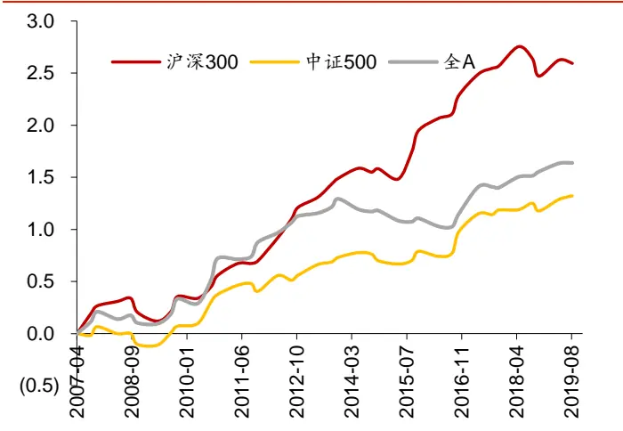
资料来源：Wind，华泰证券研究所

图表55： ts_rank(assetsturn, 6)因子回归法因子收益率累积图
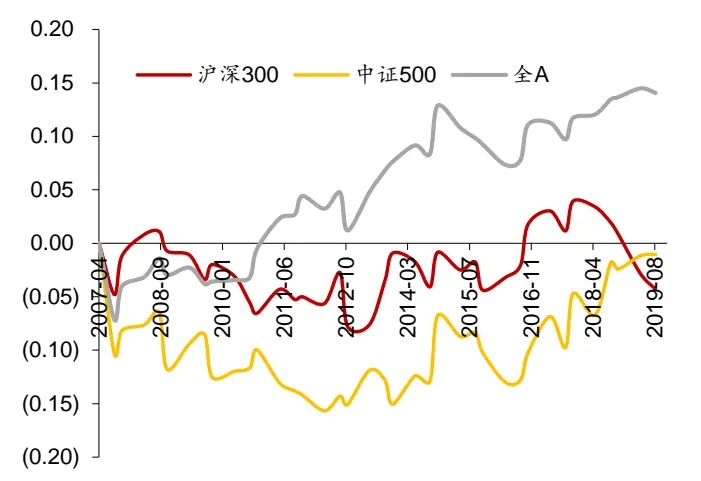
资料来源：Wind，华泰证券研究所

图表56： ts_rank(assetsturn, 6)因子 TOP 组合除以基准净值
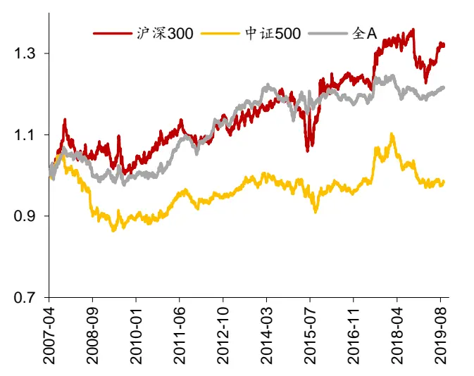
资料来源：Wind，华泰证券研究所

图表57： ts_rank(assetsturn, 6)分层组合 1~5 的净值除以基准净值
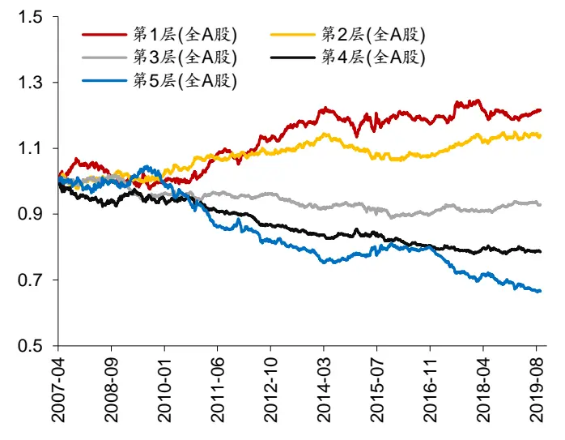
资料来源：Wind，华泰证券研究所

我们将ts_rank(assetsturn, 6)因子应用到各行业中进行分层测试，结果如图表58所示，其中每个行业分层组合对比基准为行业等权组合。

图表58： 不同行业 ts_rank(assetsturn, 6)因子分层测试法结果(分五层，市值、成长、对应原始因子中性)

|  |  |  |  |  |  | 多空组合 多空组合TOP 组合信息 |  |  |  |
| --- | --- | --- | --- | --- | --- | --- | --- | --- | --- |
| 行业 | 分层组合1～5(从左到右)年化超额收益率 |  |  |  |  | 年化收益率 | 夏普比率 | 比率TOP 组合胜率 |  |
| 银行 | 4.99% | 1.11% | 1.16% | -2.97% | -6.38% | 10.45% | 0.59 | 0.44 | 50.34% |
| 有色金属 | 4.48% | -2.47% | 2.82% | -3.81% | -6.64% | 10.25% | 0.60 | 0.42 | 55.03% |
| 汽车 | 3.65% | 2.82% | -1.87% | -3.22% | -6.10% | 9.19% | 0.63 | 0.41 | 56.38% |
| 电力设备 | 4.08% | -3.05% | 2.23% | -6.41% | -2.19% | 4.85% | 0.29 | 0.40 | 56.38% |
| 轻工制造 | 4.71% | -2.99% | -4.31% | 0.77% | -2.45% | 5.30% | 0.27 | 0.38 | 50.34% |
| 医药 | 2.48% | 2.21% | -1.61% | -4.06% | -3.34% | 5.36% | 0.49 | 0.37 | 52.35% |
| 食品饮料 | 3.76% | 3.84% | -1.42% | -5.96% | -5.64% | 8.35% | 0.48 | 0.34 | 61.07% |
| 基础化工 | 2.28% | 3.95% | -1.20% | -0.70% | -6.95% | 9.16% | 0.78 | 0.32 | 55.03% |
| 计算机 | 3.30% | -5.70% | 3.43% | -0.87% | -4.55% | 6.54% | 0.37 | 0.29 | 54.36% |
| 家电 | 3.66% | 0.31% | -6.88% | 2.29% | -5.25% | 7.00% | 0.33 | 0.28 | 51.68% |
| 电子元器件 | 2.35% | 0.61% | -0.58% | -1.31% | -4.45% | 5.97% | 0.40 | 0.25 | 53.02% |
| 综合 | 3.60% | -1.01% | -8.23% | 5.27% | -4.82% | 4.64% | 0.17 | 0.22 | 52.35% |
| 钢铁 | 2.20% | -4.69% | -2.47% | -0.19% | -1.25% | 1.28% | 0.06 | 0.19 | 48.32% |
| 交通运输 | 1.66% | -1.10% | -1.87% | -1.98% | -0.88% | 1.44% | 0.10 | 0.18 | 55.03% |
| 机械 | 1.20% | -0.65% | 1.58% | -3.66% | -2.50% | 2.96% | 0.24 | 0.17 | 51.01% |
| 通信 | 1.83% | -2.18% | 0.68% | 0.54% | -5.77% | 6.31% | 0.36 | 0.16 | 51.68% |
| 纺织服装 | 1.13% | -4.05% | 2.75% | -1.07% | -3.86% | 3.79% | 0.23 | 0.11 | 51.01% |
| 建筑 | 0.77% | -2.30% | 4.63% | -3.87% | -3.78% | 2.71% | 0.14 | 0.06 | 53.02% |
| 商贸零售 | 0.54% | 2.30% | -2.30% | -2.85% | -2.43% | 2.12% | 0.16 | 0.06 | 49.66% |
| 非银行金融 | 0.32% | 4.78% | -3.48% | -6.80% | 1.35% | -4.43% | -0.18 | 0.02 | 53.02% |
| 电力及公用事业 | 0.16% | -2.01% | -1.53% | -2.92% | 2.30% | -2.96% | -0.22 | 0.02 | 51.68% |
| 餐饮旅游 | -0.02% | -2.06% | 1.55% | -2.58% | -1.34% | -1.47% | -0.06 | 0.00 | 49.66% |
| 建材 | -1.43% | 1.44% | -2.57% | -1.26% | -1.88% | -1.16% | -0.07 | -0.13 | 46.98% |
| 传媒 | -2.74% | 0.81% | -1.38% | 2.36% | -9.73% | 4.47% | 0.17 | -0.15 | 51.01% |
| 农林牧渔 | -1.85% | 0.68% | 0.28% | -1.24% | -5.73% | 2.43% | 0.14 | -0.18 | 43.62% |
| 国防军工 | -3.05% | -5.10% | 1.36% | -0.36% | -2.78% | -3.60% | -0.14 | -0.19 | 45.64% |
| 石油石化 | -4.32% | 5.07% | 1.02% | -5.70% | -2.85% | -4.34% | -0.18 | -0.28 | 42.95% |
| 房地产 | -3.10% | 1.26% | 0.17% | -2.98% | 0.54% | -4.24% | -0.38 | -0.43 | 44.97% |
| 煤炭 | -9.80% | 3.74% | -0.83% | 0.64% | -2.12% | -9.72% | -0.42 | -0.57 | 43.62% |

资料来源：Wind，华泰证券研究所

## 现金流量类历史分位数因子(每年调仓三次)

图表 59 展示了 2 个现金流量类历史分位数因子在全部非 ST 股票上的数据覆盖度随时间变化曲线。

图表59： 现金流量类历史分位数因子数据覆盖度随时间变化情况
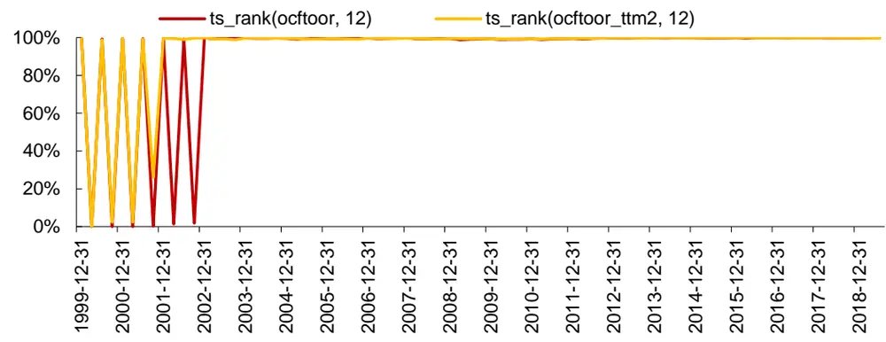
资料来源：Wind，华泰证券研究所

图表 60~图表 61 展示了现金流量类历史分位数因子在各种股票池内回归法、IC 值分析、分层测试结果汇总。因子对行业、市值、成长和对应原始因子进行了中性化。

图表60： 现金流量类历史分位数因子在各股票池内回归法、IC 值分析结果汇总(行业、市值、成长、对应原始因子中性)

| 因子含义 因子名称 |  |  | 因子收益率 Rank IC Rank IC |  |  |  |  | IC_IR IC>0 占比 |
| --- | --- | --- | --- | --- | --- | --- | --- | --- |
|  | It\|均值\|t\|>2 占比 |  | t均值 | 均值 | 均值 | 标准差 |  |  |
| 沪深 300 成分股内 |  |  |  |  |  |  |  |  |
| 当年累计经营性现金流量净ts_rank(ocftoor, 6) | 0.88 | 7.89% | -0.16 | -0.25% | -0.29% | 6.75% | -0.04 | 52.63% |
| 额/营业收入在过去n个季度ts_rank(ocftoor， 8) | 0.95 | 13.16% | -0.03 | -0.05% | 0.49% | 7.53% | 0.07 | 52.63% |
| 里的分位数(n=6,8,12) ts_rank(ocftoor, 12) | 1.12 | 10.53% | 0.12 | 0.27% | 2.11% | 8.77% | 0.24 | 55.26% |
| 经营性现金流量净额/营业ts_rank(ocftoor_ttm2, 6) | 1.14 | 23.68% | -0.16 | -0.20% | -0.82% | 8.06% | -0.10 | 50.00% |
| 收入TTM 在过去n个季度里ts_rank(ocftoor_ttm2， 8) | 1.25 | 15.79% | -0.07 | -0.04% | -0.45% | 8.84% | -0.05 | 50.00% |
| 的分位数(n=6,8,12) ts_rank(ocftoor_ttm2, 12) | 1.30 | 15.79% | -0.16 | -0.07% | 0.55% | 9.48% | 0.06 | 50.00% |
| 中证 500 成分股内 |  |  |  |  |  |  |  |  |
| 当年累计经营性现金流量净ts_rank(ocftoor, 6) | 0.72 | 5.26% | -0.03 | -0.06% | 1.58% | 7.39% | 0.21 | 71.05% |
| 额/营业收入在过去n个季度ts_rank(ocftoor, 8) | 0.75 | 2.63% | -0.07 | -0.09% | 1.79% | 7.21% | 0.25 | 68.42% |
| 里的分位数(n=6,8,12) ts_rank(ocftoor, 12) | 0.83 | 7.89% | -0.07 | -0.12% | 1.88% | 7.62% | 0.25 | 63.16% |
| 经营性现金流量净额/营业ts_rank(ocftoor_ttm2，6) | 1.02 | 7.89% | -0.21 | -0.30% | 1.86% | 6.89% | 0.27 | 60.53% |
| 收入TTM在过去n个季度里ts_rank(ocftoor_ttm2， 8) | 1.08 | 18.42% | -0.19 | -0.18% | 2.02% | 7.37% | 0.27 | 60.53% |
| 的分位数(n=6,8,12) ts_rank(ocftoor_ttm2, 12) | 1.17 | 21.05% | -0.15 | -0.18% | 2.13% | 7.50% | 0.28 | 63.16% |
| 全 A股 |  |  |  |  |  |  |  |  |
| 当年累计经营性现金流量净ts_rank(ocftoor， 6) | 1.12 | 18.42% | 0.14 | 0.15% | 2.05% | 4.49% | 0.46 | 76.32% |
| 额/营业收入在过去n个季度ts_rank(ocftoor, 8) | 1.15 | 21.05% | 0.32 | 0.32% | 2.29% | 5.09% | 0.45 | 68.42% |
| 里的分位数(n=6,8,12) ts_rank(ocftoor, 12) | 1.20 | 21.05% | 0.46 | 0.41% | 2.54% | 5.64% | 0.45 | 68.42% |
| 经营性现金流量净额/营业ts_rank(ocftoor_ttm2，6) | 1.28 | 18.42% | 0.14 | 0.14% | 2.59% | 4.42% | 0.59 | 84.21% |
| 收入TTM 在过去n个季度里ts_rank(ocftoor_ttm2， 8) | 1.30 | 21.05% | 0.20 | 0.20% | 2.72% | 5.02% | 0.54 | 78.95% |
| 的分位数(n=6,8,12) ts_rank(ocftoor_ttm2, 12) | 1.26 | 15.79% | 0.20 | 0.16% | 2.61% | 5.29% | 0.49 | 65.79% |

资料来源：Wind，华泰证券研究所

图表61： 现金流量类历史分位数因子在各股票池内分层测试结果汇总(分五层，行业、市值、成长、对应原始因子中性)

|  |  | 分层组合1～5(从左到右)年化超额收益 | 多空组合多空组合TOP 组合TOP组合 年化收益率夏普比率信息比率胜率 |  |  |  |
| --- | --- | --- | --- | --- | --- | --- |
| 因子含义 | 因子名称 | 率 |  |  |  |  |
| 沪深 300 成分股内 |  |  |  |  |  |  |
| 当年累计经营性现金流量净ts_rank(ocftoor， 6) |  | -0.33%-0.29%-2.53%-0.32%-0.13% | -0.58% | -0.07 | -0.06 | 49.66% |
| 额/营业收入在过去n 个季度ts_rank(ocftoor， 8) |  | 0.18% -0.67% -0.12%-3.05%0.34% | -0.53% | -0.06 |  | 0.03 52.35% |
| 里的分位数(n=6,8,12) | ts_rank(ocftoor, 12) | 0.84%0.13% -0.60% -2.56% -1.30% | 1.75% | 0.20 | 0.16 | 49.66% |
| 经营性现金流量净额/营业ts_rank(ocftoor_ttm2， 6) |  | -0.12% -1.81% -0.84% -0.01% -0.55% | 0.08% | 0.01 | -0.02 | 47.65% |
| 收入TTM在过去n个季度里ts_rank(ocftoor_ttm2， 8) |  | 0.07% -1.66%-0.60% -0.04% -0.91% | 0.58% | 0.07 | 0.01 | 52.35% |
| 的分位数(n=6,8,12) | ts_rank(ocftoor_ttm2, 12) | 0.49%0.07%-2.35% -0.16% -0.79% | 0.90% | 0.10 |  | 0.09 53.69% |
| 中证 500 成分股内 |  |  |  |  |  |  |
| 当年累计经营性现金流量净ts_rank(ocftoor， 6) |  | 0.30%0.02% -0.60% -2.55%-0.45% | 0.50% | 0.07 | 0.06 | 50.34% |
| 额/营业收入在过去n个季度ts_rank(ocftoor, 8) |  | -0.47% -0.14%-0.28% -2.63%0.35% | -1.10% | -0.14 | -0.10 | 45.64% |
| 里的分位数(n=6,8,12) | ts_rank(ocftoor, 12) | 0.41% -0.55% -0.54% -1.66% -0.62% | 0.76% | 0.10 | 0.09 | 46.31% |
| 经营性现金流量净额/营业ts_rank(ocftoor_ttm2， 6) |  | -0.96% 1.63% -0.81% -2.63% -0.28% | -0.94% | -0.13 | -0.21 | 49.66% |
| 收入TTM在过去n个季度里ts_rank(ocftoor_ttm2， 8) |  | -0.94%2.14% -1.63% -2.64%0.25% | -1.46% | -0.19 | -0.19 | 53.69% |
| 的分位数(n=6,8,12) | ts_rank(ocftoor_ttm2, 12) | -0.12%0.44%-0.56% -2.11%0.00% | -0.41% | -0.05 |  | -0.03 53.02% |
| 全 A股 |  |  |  |  |  |  |
| 当年累计经营性现金流量净ts_rank(ocftoor， 6) |  | 0.25%1.99% -0.35% -2.51% -2.30% | 2.49% | 0.53 | 0.09 | 46.98% |
| 额/营业收入在过去n个季度ts_rank(ocftoor， 8) |  | 1.17%0.68% -0.12% -1.60% -3.00% | 4.16% | 0.84 | 0.42 | 53.02% |
| 里的分位数(n=6,8,12) | ts_rank(ocftoor, 12) | 1.37% 0.80%-0.23%-2.22%-2.41% | 3.72% | 0.72 | 0.47 | 55.03% |
| 经营性现金流量净额/营业ts_rank(ocftoor_ttm2，6) 收入TTM在过去n个季度里ts_rank(ocftoor_ttm2， 8) |  | 1.09% 1.16%-0.40% -2.03% -2.55% 1.35% 1.37% -1.05% -1.35%-2.99% | 3.62% 4.35% | 0.83 0.95 | 0.42 | 55.70% |
| 的分位数(n=6,8,12) |  | 1.01% 1.04% 0.13% -2.15% -2.54% | 3.52% | 0.76 |  | 0.50 59.06% |
|  | ts_rank(ocftoor_ttm2, 12) |  |  |  | 0.37 | 50.34% |

资料来源：Wind，华泰证券研究所

通过回归法、IC值分析、分层测试法的结果我们可以发现现金流量类历史分位数因子的选股效果较差，因此不对单因子进行详细展示。

## 资本结构类历史分位数因子(每年调仓三次)

图表 62 展示了 2 个资本结构类历史分位数因子在全部非 ST 股票上的数据覆盖度随时间变化曲线。

图表62： 资本结构类历史分位数因子数据覆盖度随时间变化情况
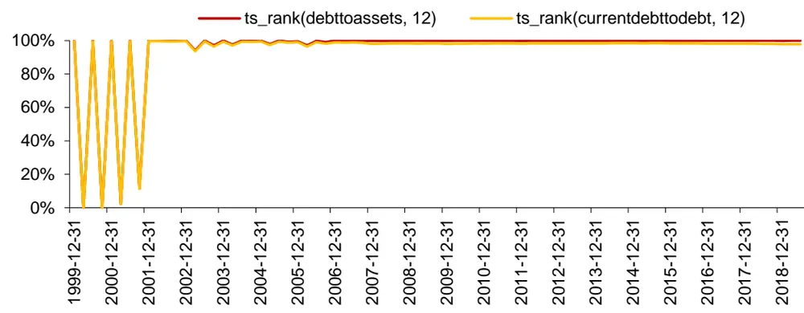
资料来源：Wind，华泰证券研究所

图表 63展示了资本结构类历史分位数因子在各种股票池内回归法、IC值分析、分层测试结果汇总。因子对行业、市值、成长和对应原始因子进行了中性化。

图表63： 资本结构类历史分位数因子在各股票池内回归法、IC值分析结果汇总(行业、市值、成长、对应原始因子中性)

| 因子含义 因子名称 |  | 因子收益率 |  |  |  |  |  |  |
| --- | --- | --- | --- | --- | --- | --- | --- | --- |
|  |  | It\|均值\|t\|>2 占比 | t均值 |  | 均值 | 均值 标准差 |  | IC_IR IC>0 占比 |
| 沪深 300 成分股内 |  |  |  |  |  |  |  |  |
| ts_rank(debttoassets, 6) 资产负债率在过去n个季度 |  | 0.82 10.53% | -0.09 | -0.26% | -0.35% | 7.90% | -0.04 | 44.74% |
| ts_rank(debttoassets, 8) 里的分位数(n=6,8,12) | 0.97 | 15.79% | -0.05 | -0.31% | 0.03% | 8.10% | 0.00 | 52.63% |
| ts_rank(debttoassets, 12) | 1.11 | 13.16% | -0.04 | -0.30% | 0.44% | 7.95% | 0.06 | 50.00% |
| 流动负债/负债合计在过去 nts_rank(currentdebttodebt, 6) | 0.96 | 7.89% | -0.15 | -0.28% | 1.80% | 9.72% | 0.19 | 50.00% |
| 个季度里的分位数ts_rank(currentdebttodebt, 8) | 0.90 | 7.89% | -0.16 | -0.29% | 1.79% | 10.14% | 0.18 | 50.00% |
| (n=6,8,12) ts_rank(currentdebttodebt, 12) | 0.84 | 5.26% | -0.18 | -0.31% | 1.93% | 9.83% | 0.20 | 57.89% |
| 中证 500 成分股内 |  |  |  |  |  |  |  |  |
| ts_rank(debttoassets, 6) 资产负债率在过去n个季度 | 0.79 | 0.00% | 0.22 | 0.32% | 0.57% | 5.85% | 0.10 | 52.63% |
| ts_rank(debttoassets, 8) 里的分位数(n=6,8,12) | 0.78 | 2.63% | 0.18 | 0.28% | 0.42% | 6.23% | 0.07 | 50.00% |
| ts_rank(debttoassets, 12) | 0.71 | 0.00% | 0.17 | 0.25% | 0.51% | 6.12% | 0.08 | 52.63% |
| 流动负债/负债合计在过去 nts_rank(currentdebttodebt, 6) | 0.83 | 10.53% | 0.15 | 0.15% | 1.52% | 5.40% | 0.28 | 73.68% |
| 个季度里的分位数ts_rank(currentdebttodebt, 8) | 0.87 | 13.16% | 0.15 | 0.16% | 1.30% | 5.67% | 0.23 | 68.42% |
| (n=6,8,12) ts_rank(currentdebttodebt, 12) | 0.87 | 13.16% | 0.12 | 0.11% | 1.33% | 5.83% | 0.23 | 63.16% |
| 全 A股 |  |  |  |  |  |  |  |  |
| ts_rank(debttoassets, 6) 资产负债率在过去n个季度 | 1.25 | 26.32% | 0.37 | 0.21% | 2.42% | 4.57% | 0.53 | 71.05% |
| ts_rank(debttoassets, 8) 里的分位数(n=6,8,12) | 1.34 | 23.68% | 0.39 | 0.20% | 2.39% | 4.72% | 0.51 | 65.79% |
| ts_rank(debttoassets, 12) | 1.34 | 21.05% | 0.48 | 0.24% | 2.45% | 4.76% | 0.52 | 71.05% |
| 流动负债/负债合计在过去 nts_rank(currentdebttodebt, 6) | 1.10 | 15.79% | 0.35 | 0.03% | 2.82% | 4.77% | 0.59 | 65.79% |
| 个季度里的分位数ts_rank(currentdebttodebt, 8) (n=6,8,12) ts_rank(currentdebttodebt, 12) | 1.09 | 13.16% | 0.27 | -0.03% | 2.46% | 4.45% | 0.55 | 68.42% |
|  | 1.10 | 21.05% | 0.17 | -0.07% | 2.06% | 4.23% | 0.49 | 73.68% |

资料来源：Wind，华泰证券研究所

图表64： 资本结构类历史分位数因子在各股票池内分层测试结果汇总(分五层，行业、市值、成长、对应原始因子中性)

|  |  | 分层组合1～5(从左到右)年化超额收益 | 多空组合多空组合TOP组合TOP组合 |  |  |
| --- | --- | --- | --- | --- | --- |
| 因子含义 因子名称 | 率 | 年化收益率夏普比率信息比率胜率 |  |  |  |
| 沪深 300 成分股内 |  |  |  |  |  |
| ts_rank(debttoassets, 6) 资产负债率在过去n个季度 | -1.01% -0.97% | 2.14% -2.07% -1.86% | 0.38% | 0.04 -0.18 | 46.98% |
| ts_rank(debttoassets, 8) 里的分位数(n=6,8,12) | -2.12%1.17% 0.70% -1.13% -2.01% | -0.65% | -0.07 | -0.38 | 46.31% |
| ts_rank(debttoassets, 12) | -1.43% 1.72% -0.29% -1.61% -1.34% | -0.58% | -0.06 | -0.26 | 49.66% |
| 流动负债/负债合计在过去 nts_rank(currentdebttodebt， 6) | 0.34% -0.39% -1.03% -2.13% -0.13% | 0.10% | 0.01 | 0.06 | 54.36% |
| 个季度里的分位数ts_rank(currentdebttodebt， 8) | 0.77%0.78%-4.00%0.42% -1.22% | 1.61% | 0.18 | 0.14 | 53.02% |
| (n=6,8,12) ts_rank(currentdebttodebt, 12) | 0.43% -1.35% -0.16% -1.11% -1.10% | 1.17% | 0.14 | 0.08 54.36% |  |
| 中证 500 成分股内 |  |  |  |  |  |
| ts_rank(debttoassets, 6) 资产负债率在过去n 个季度 | 0.48%-0.46% 0.42%-2.85%-0.53% | 0.71% | 0.09 | 0.10 | 55.03% |
| ts_rank(debttoassets, 8) | -0.19% 0.44% -0.40% -1.98% -0.66% | 0.15% | 0.02 | -0.04 | 51.01% |
| 里的分位数(n=6,8,12) ts_rank(debttoassets, 12) | 0.21% 1.00% -0.89% -2.02% -1.02% | 0.87% | 0.11 | 0.04 | 53.02% |
| 流动负债/负债合计在过去 nts_rank(currentdebttodebt, 6) | -0.83% -0.38% -0.62% 1.35%-2.43% | 1.39% | 0.19 | -0.17 | 48.99% |
| 个季度里的分位数ts_rank(currentdebttodebt, 8) | -1.48% 0.88% -0.85% 0.10% -1.45% | -0.29% | -0.04 | -0.32 | 46.98% |
| (n=6,8,12) ts_rank(currentdebttodebt, 12) | -0.38% -0.62% 0.08% -0.26% -1.38% | 0.74% | 0.10 |  | -0.08 51.68% |
| 全 A股 |  |  |  |  |  |
| ts_rank(debttoassets, 6) 资产负债率在过去n个季度 | 1.25%0.78% -0.37% -1.83% -2.60% | 3.81% | 0.74 | 0.43 | 61.07% |
| ts_rank(debttoassets, 8) | 0.93% 2.27% -1.33% -2.00% -2.46% | 3.32% | 0.62 | 0.32 | 53.69% |
| 里的分位数(n=6,8,12) ts_rank(debttoassets, 12) | 1.32%1.61% -0.63% -2.14% -2.56% | 3.82% | 0.71 | 0.46 | 57.72% |
| 流动负债/负债合计在过去 nts_rank(currentdebttodebt, 6) | 2.39%-0.40% -1.42% -0.95% -2.33% | 4.73% | 0.95 | 0.72 | 55.03% |
| 个季度里的分位数ts_rank(currentdebttodebt, 8) | 1.56%0.07% -1.37% -0.50% -2.33% | 3.87% | 0.79 | 0.49 | 57.05% |
| (n=6,8,12) ts_rank(currentdebttodebt, 12) | 1.63% -0.18% -1.01% -0.69% -1.98% | 3.57% | 0.75 | 0.54 | 57.05% |

资料来源：Wind，华泰证券研究所

通过回归法、IC值分析、分层测试法的结果我们可以发现资本结构类历史分位数因子的选股效果较差，因此不对单因子进行详细展示。

## 偿债能力类历史分位数因子(每年调仓三次)

图表 65 展示了 2 个偿债能力类历史分位数因子在全部非 ST 股票上的数据覆盖度随时间变化曲线。

图表65： 偿债能力类历史分位数因子数据覆盖度随时间变化情况
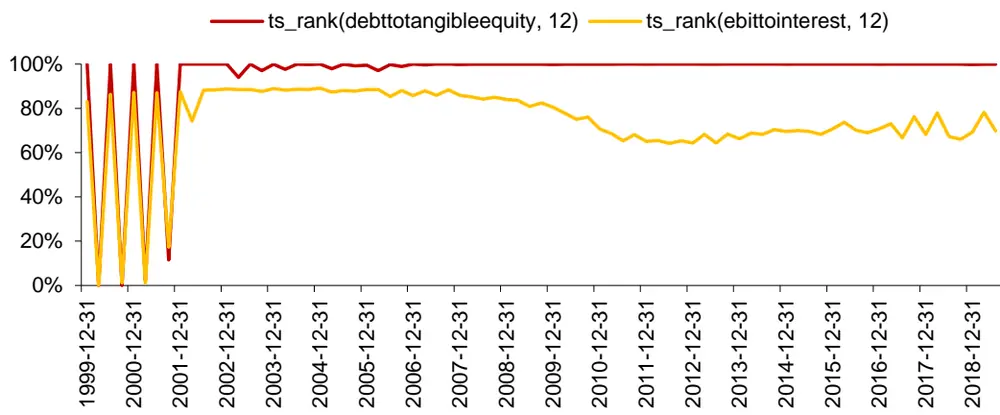
资料来源：Wind，华泰证券研究所

图表 66~图表 67 展示了偿债能力类历史分位数因子在各种股票池内回归法、IC 值分析、分层测试结果汇总。因子对行业、市值、成长和对应原始因子进行了中性化。

图表66： 偿债能力类历史分位数因子在各股票池内回归法、IC值分析结果汇总(行业、市值、成长、对应原始因子中性)

|  |  |  |  |  |  | 因子收益率 Rank IC Rank IC 均值 | 标准差 | IC_IR IC>0 占比 |  |
| --- | --- | --- | --- | --- | --- | --- | --- | --- | --- |
| 因子含义 | 因子名称 | \|t\|均值\|t\|>2 占比 | t均值 |  | 均值 |  |  |  |  |
| 沪深 300 成分股内 |  |  |  |  |  |  |  |  |  |
| 有形净值债务率在过去n个 | ts_rank(debttotangibleequity, 6) | 0.91 | 10.53% | -0.33 | -0.55% | -0.20% | 9.17% | -0.02 | 50.00% |
| 季度里的分位数(n=6,8,12) | ts_rank(debttotangibleequity, 8) | 1.04 | 15.79% | -0.23 | -0.51% | 0.24% | 9.14% | 0.03 | 50.00% |
|  | ts_rank(debttotangibleequity, 12) | 1.13 | 13.16% | -0.20 | -0.45% | 0.28% | 9.29% | 0.03 | 52.63% |
| 利息保障倍数(EBIT/利息费ts_rank(ebittointerest, 6) |  | 1.05 | 7.89% | 0.18 | -0.23% | 0.89% | 9.53% | 0.09 | 52.63% |
| 用)在过去n个季度里的分位ts_rank(ebittointerest， 8) |  | 1.09 | 18.42% | 0.25 | 0.71% | 1.03% | 8.93% | 0.12 | 57.89% |
| 数(n=6,8,12) | ts_rank(ebittointerest, 12) | 1.06 | 15.79% | 0.09 | 0.04% | 0.60% | 9.61% | 0.06 | 60.53% |
| 中证 500 成分股内 |  |  |  |  |  |  |  |  |  |
| 有形净值债务率在过去n个 | ts_rank(debttotangibleequity, 6) | 0.85 | 2.63% | 0.29 | 0.35% | 1.57% | 6.26% | 0.25 | 60.53% |
| 季度里的分位数(n=6,8,12) | ts_rank(debttotangibleequity, 8) | 0.87 | 2.63% | 0.27 | 0.33% | 1.37% | 6.64% | 0.21 | 60.53% |
|  | ts_rank(debttotangibleequity, 12) | 0.85 | 2.63% | 0.27 | 0.33% | 1.34% | 6.43% | 0.21 | 57.89% |
| 利息保障倍数(EBIT/利息费ts_rank(ebittointerest, 6) |  | 1.36 | 26.32% | 0.09 | 0.41% | 2.34% | 9.64% | 0.24 | 63.16% |
| 用)在过去n个季度里的分位ts_rank(ebittointerest, 8) 数(n=6,8,12) |  | 1.25 | 15.79% | 0.09 | -0.49% | 2.56% | 9.10% | 0.28 | 63.16% |
| 全 A股 | ts_rank(ebittointerest, 12) | 1.06 | 15.79% | 0.02 | -0.08% | 1.23% | 8.43% | 0.15 | 52.63% |
| 有形净值债务率在过去n个 | ts_rank(debttotangibleequity, 6) | 1.28 | 26.32% | 0.19 | 0.14% | 2.47% | 4.99% | 0.49 | 71.05% |
| 季度里的分位数(n=6,8,12) | ts_rank(debttotangibleequity, 8) ts_rank(debttotangibleequity, 12) | 1.33 | 18.42% 26.32% | 0.24 0.32 | 0.13% | 2.33% | 5.08% | 0.46 | 63.16% |
| 利息保障倍数(EBIT/利息费ts_rank(ebittointerest, 6) |  | 1.35 1.35 | 15.79% | 0.45 | 0.18% 0.36% | 2.28% | 5.18% 5.42% | 0.44 | 65.79% |
| 用)在过去n个季度里的分位ts_rank(ebittointerest, 8) |  | 1.34 | 26.32% | 0.43 | 0.36% | 4.02% 3.55% | 5.70% | 0.74 0.62 | 84.21% 76.32% |
| 数(n=6,8,12) | ts_rank(ebittointerest, 12) | 1.30 | 15.79% | 0.18 | 0.17% | 2.39% | 6.35% | 0.38 |  |
|  |  |  |  |  |  |  |  |  | 68.42% |

资料来源：Wind，华泰证券研究所

图表67： 偿债能力类历史分位数因子在各股票池内分层测试结果汇总(分五层，行业、市值、成长、对应原始因子中性)

|  | 分层组合1～5(从左到右)年化超额收益 |  | 多空组合多空组合TOP组合TOP组合 |  |  |
| --- | --- | --- | --- | --- | --- |
| 因子含义 因子名称 | 率 | 年化收益率夏普比率信息比率 |  |  | 胜率 |
| 沪深 300 成分股内 |  |  |  |  |  |
| ts_rank(debttotangibleequity, 6) | 0.69%-0.65%-1.14% -1.92%-0.68% | 0.92% | 0.10 | 0.13 | 51.68% |
| 有形净值债务率在过去n个 ts_rank(debttotangibleequity, 8) | -0.24% -1.26%2.75% -3.59% -1.09% | 0.37% | 0.04 |  | -0.04 49.66% |
| 季度里的分位数(n=6,8,12) ts_rank(debttotangibleequity, 12) | -0.11% 0.28% -0.94% -1.49% -0.75% | 0.14% | 0.01 |  | -0.02 51.01% |
| 利息保障倍数(EBIT/利息费ts_rank(ebittointerest, 6) | -0.27%1.54% 0.48%-2.75%-2.75% | 2.00% | 0.20 | -0.04 | 52.35% |
| 用)在过去n个季度里的分位ts_rank(ebittointerest, 8) | 0.58% 1.46%0.62%-3.81% -2.24% | 2.34% | 0.23 | 0.09 | 52.35% |
| 数(n=6,8,12) ts_rank(ebittointerest, 12) | 0.42%0.84% -0.17% -2.45% -1.56% | 1.42% | 0.13 |  | 0.06 48.99% |
| 中证 500 成分股内 |  |  |  |  |  |
| ts_rank(debttotangibleequity, 6) | 0.48% 0.33% -1.71% -0.52% -1.46% | 1.65% | 0.21 | 0.11 | 53.69% |
| 有形净值债务率在过去n 个 ts_rank(debttotangibleequity, 8) 季度里的分位数(n=6,8,12) | -0.46% 0.87% -0.23% -2.04% -0.99% | 0.23% | 0.03 | -0.10 | 51.68% |
| ts_rank(debttotangibleequity, 12) | -0.52% 1.60% -0.10% -2.46% -1.28% | 0.46% | 0.06 | -0.12 | 46.98% |
| 利息保障倍数(EBIT/利息费ts_rank(ebittointerest, 6) | -0.28% 2.12% 0.83% -2.69% -2.87% | 2.32% | 0.28 | -0.05 | 46.98% |
| 用)在过去n个季度里的分位ts_rank(ebittointerest, 8) | -0.28% 2.99% 1.04% -3.08% -3.33% | 2.82% | 0.34 | -0.05 | 45.64% |
| 数(n=6,8,12) ts_rank(ebittointerest, 12) | -0.31%1.88%0.24% -1.79% -2.63% | 2.02% | 0.24 |  | -0.06 46.98% |
| 全 A股 |  |  |  |  |  |
| ts_rank(debttotangibleequity, 6) 有形净值债务率在过去n 个 | 1.59%0.92%-1.85%-0.65%-2.70% | 4.25% | 0.79 | 0.55 | 59.06% |
| ts_rank(debttotangibleequity, 8) 季度里的分位数(n=6,8,12) | 1.17%2.00% -1.69% -1.47% -2.58% | 3.66% | 0.65 | 0.39 | 58.39% |
| ts_rank(debttotangibleequity, 12) | 1.00% 2.35%-1.17%-2.35%-2.22% | 3.10% | 0.55 | 0.34 | 54.36% |
| 利息保障倍数(EBIT/利息费ts_rank(ebittointerest, 6) | 1.18% 1.22%-0.50%-2.56%-1.94% | 3.04% | 0.57 | 0.35 | 53.02% |
| 用)在过去n个季度里的分位ts_rank(ebittointerest， 8) | 1.06% 0.58% 0.48%-2.06%-2.62% | 3.62% | 0.67 | 0.32 | 53.69% |
| 数(n=6,8,12) ts_rank(ebittointerest, 12) | 0.99% -0.01%0.28% -1.53% -2.15% | 3.05% | 0.54 | 0.30 | 56.38% |

资料来源：Wind，华泰证券研究所

通过回归法、IC 值分析、分层测试法的结果我们可以发现偿债能力类历史分位数因子的选股效果较差，因此不对单因子进行详细展示。

## 总结

1. 历史分位数计算的是某个指标当前的取值在一段历史区间中所处的分位数点，是常用的时间序列分析方法，反映了相应指标的变化趋势，具有明确的经济学意义，适合针对估值、财务质量因子构造新的因子本文系统测试了 89 个相关因子，其中估值类、盈利能力类、收益质量类、营运能力类历史分位数因子选股效果较好，现金流量类、资本结构类、偿债能力类历史分位数因子选股效果较差。

2. 估值历史分位数反映了个股当前估值在一段历史区间中的高低程度，能刻画出个股的估值在一段历史区间中是否“便宜”。本文构造了 EP、BP、SP、NCFP、OCFP 的历史分位数因子，这些因子间的相关性较高。估值类历史分位数因子的计算逻辑与反转因子有一定相似性，在剔除了行业、市值、反转和对应原始因子的影响后，EP、SP历史分位数因子表现较好。2007 年 4 月以来，ts_rank(EP, 2)因子在沪深 300、中证 500、全 A 股的RankIC均值分别为5.14%、6.13%、6.21%，分五层测试中多空组合夏普比率分别为0.77、1.88、2.46。

3. 财务质量历史分位数描述了个股当前的财务指标在一段历史区间中的高低程度，能刻画出个股财务指标在历史区间中的变化趋势。本文构造了六大类财务质量类历史分位数因子，其计算逻辑和成长类因子有相似之处，在剔除了行业、市值、成长和对应原始因子的影响后，盈利能力类历史分位数因子选股效果最好，收益质量、营运能力类历史分位数因子次之，现金流量、资本结构、偿债能力类历史分位数因子选股效果较差。2007 年 4月以来，ts_rank(qfa_roa, 6)因子在沪深 300、中证 500、全 A 股的 RankIC 均值分别为 6.50%、5.68%、6.89%，分五层测试中多空组合夏普比率分别为 0.75、0.76、1.97。

4. 在本文的单因子测试中，表现较好的因子选股效果随着回看期数的增加大致呈现出逐渐减弱的趋势。例如 ts_rank(qfa_grossprofitmargin, n)因子中 n 的取值分别为 6、8、12 时，因子在全 A股的因子收益率均值为分别为 0.88%、0.85%、0.73%，RankIC 均值分别为5.63%、5.37%、4.69%，多空组合夏普比率分别为 2.01、1.82、1.52。三个选股指标的取值都随着 n的增大逐渐减小。我们推测其背后的原因是回看期数越小，因子值的变化越及时，能较快反映出个股基本面的变化趋势。

## 风险提示

单因子测试结果是历史经验的总结，如果市场规律改变，存在失效的可能。历史分位数因子的选股效果具有参数敏感性，请谨慎使用。

## 免责申明

收到本报告而视其为客户。

本报告基于本公司认为可靠的、已公开的信息编制，但本公司对该等信息的准确性及完整性不作任何保证。本报告所载的意见、评估及预测仅反映报告发布当日的观点和判断。在不同时期，本公司可能会发出与本报告所载意见、评估及预测不一致的研究报告。同时，本报告所指的证券或投资标的的价格、价值及投资收入可能会波动。本公司不保证本报告所含信息保持在最新状态。本公司对本报告所含信息可在不发出通知的情形下做出修改，投资者应当自行关注相应的更新或修改。

本公司力求报告内容客观、公正，但本报告所载的观点、结论和建议仅供参考，不构成所述证券的买卖出价或征价。该等观点、建议并未考虑到个别投资者的具体投资目的、财务状况以及特定需求，在任何时候均不构成对客户私人投资建议。投资者应当充分考虑自身特定状况，并完整理解和使用本报告内容，不应视本报告为做出投资决策的唯一因素。对依据或者使用本报告所造成的一切后果，本公司及作者均不承担任何法律责任。任何形式的分享证券投资收益或者分担证券投资损失的书面或口头承诺均为无效。

本公司及作者在自身所知情的范围内，与本报告所指的证券或投资标的不存在法律禁止的利害关系。在法律许可的情况下，本公司及其所属关联机构可能会持有报告中提到的公司所发行的证券头寸并进行交易，也可能为之提供或者争取提供投资银行、财务顾问或者金融产品等相关服务。本公司的资产管理部门、自营部门以及其他投资业务部门可能独立做出与本报告中的意见或建议不一致的投资决策。

本报告版权仅为本公司所有。未经本公司书面许可，任何机构或个人不得以翻版、复制、发表、引用或再次分发他人等任何形式侵犯本公司版权。如征得本公司同意进行引用、刊发的，需在允许的范围内使用，并注明出处为“华泰证券研究所”，且不得对本报告进行任何有悖原意的引用、删节和修改。本公司保留追究相关责任的权力。所有本报告中使用的商标、服务标记及标记均为本公司的商标、服务标记及标记。

本公司具有中国证监会核准的“证券投资咨询”业务资格，经营许可证编号为：91320000704041011J。

全资子公司华泰金融控股（香港）有限公司具有香港证监会核准的“就证券提供意见”业务资格，经营许可证编号为：AOK809

©版权所有 2019 年华泰证券股份有限公司

## 评级说明

## 行业评级体系

－报告发布日后的6个月内的行业涨跌幅相对同期的沪深300指数的涨跌幅为基准；

－投资建议的评级标准

增持行业股票指数超越基准 中性行业股票指数基本与基准持平 减持行业股票指数明显弱于基准

## 公司评级体系

－报告发布日后的6个月内的公司涨跌幅相对同期的沪深300指数的涨跌幅为基准；
－投资建议的评级标准
买入股价超越基准 20%以上
增持股价超越基准 5%-20%
中性股价相对基准波动在-5%~5%之间
减持股价弱于基准 5%-20%
卖出股价弱于基准 20%以上

## 华泰证券研究

## 南京

南京市建邺区江东中路228号华泰证券广场1号楼/邮政编码：210019

电话：86 25 83389999 /传真：86 25 83387521

电子邮件：ht-rd@htsc.com

## 深圳

深圳市福田区益田路5999号基金大厦10楼/邮政编码：518017

电话：86 755 82493932 /传真：86 755 82492062

电子邮件：ht-rd@htsc.com

慧博资讯”专业的投资研究大数据分享平台

## 北京

北京市西城区太平桥大街丰盛胡同28号太平洋保险大厦A座18层

邮政编码：100032

电话：86 10 63211166/传真：86 10 63211275

电子邮件：ht-rd@htsc.com

## 上海

上海市浦东新区东方路18号保利广场E栋23楼/邮政编码：200120
电话：86 21 28972098 /传真：86 21 28972068
电子邮件：ht-rd@htsc.com