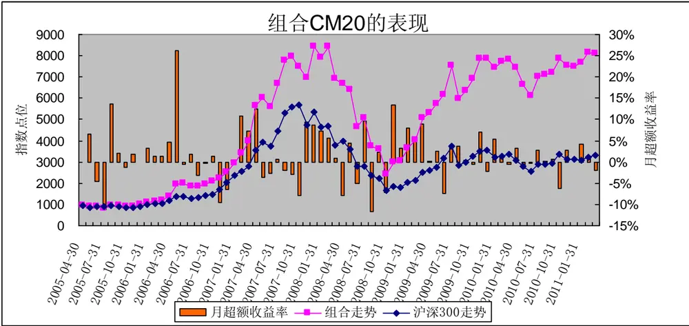
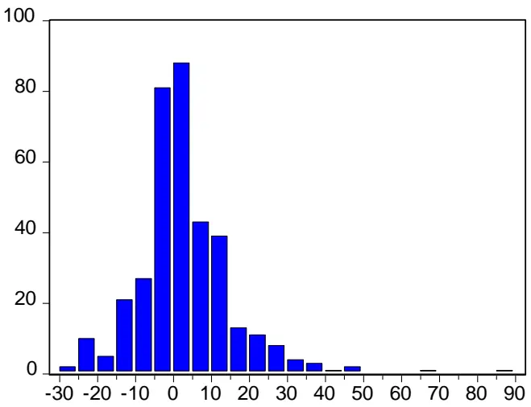
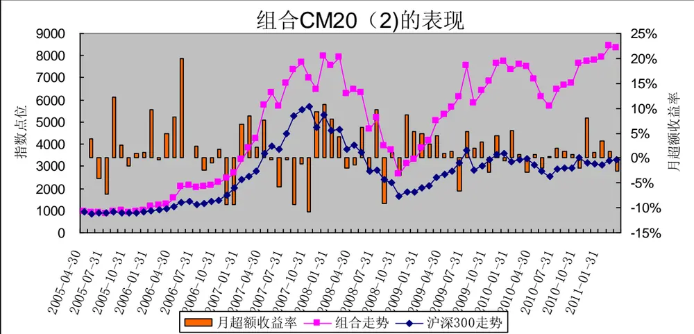
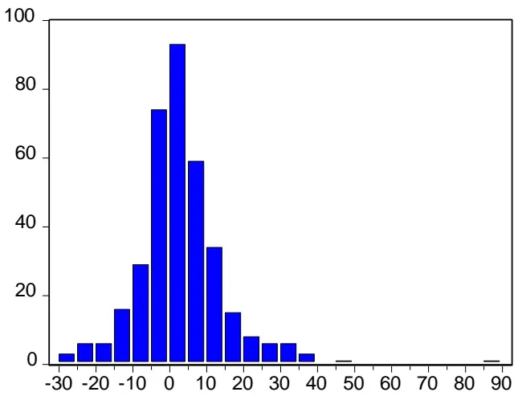
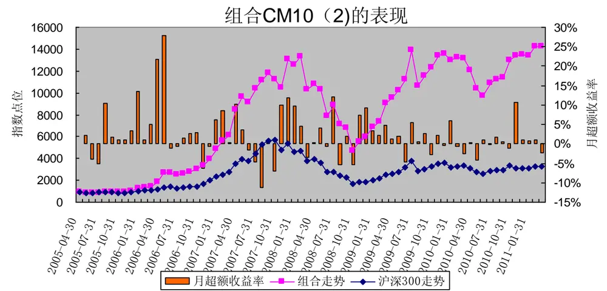
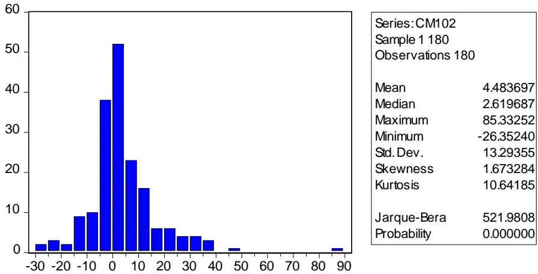

# 从股东结构的变化选股－－数量化选股策略之二

[table_research]研究员：魏刚

执业证书编号：S0570510120042

电话：025-83290914(办公室)

E-mail： weigang@mail.htsc.com.cn

地址：南京市中山东路 90 号

## 相关研究

_relate]《数量化选股策略之一：基于沪深300指数成分股的动量反转策略》2010-05-10

## 投资要点：

股票市场是个博弈的场所，从博弈的逻辑分析，主力往往在股价处于低位时收集筹码（此时股东户数减少，户均持股比例上升），然后拉升（此时股东户数进一步减少，户均持股比例进一步上升），在吸引大量跟风盘买入后派发出货（此时股东户数增加，户均持股比例下降），随后该股在主力出逃后可能步入下降通道，或者是主力出逃后新的主力进入进行新一波的操作。我们的思路为：在沪深300指数的成分股中，根据最新财务报告数据寻找筹码集中度大幅提高（户均持股比例大幅上升，机构持股比例也大幅上升），且前期还未大幅上涨的股票构建组合，考察这些组合的表现。

综合考虑户均持股比例的增减值、机构持股比例的增减值、前期涨跌幅的综合打分法构造的 20 只股票构成的组合 CM20，在研究期间内（2005 年 5月至 2011 年 3 月）大幅超越沪深 300 指数，累计收益率达 770.92%，年化收益率达43.44%，而同期沪深300指数的累计收益率为253.34%；在 18期中，有12期跑赢了沪深300指数，跑赢概率为 66.67%。

采用分步策略（首先筛选出涨幅排名后 70%且机构持股比例的增减值排名前 50%的个股，然后选取户均持股比例的增减值排名靠前的个股）构造的 20只股票构成的组合 CM20(2)在 2005 年 5 月至 2011 年 3 月间的累计收益率达796.57%，年化收益率达 44.13%；在 18 期组合中，组合 CM20(2)有 14 次跑赢了沪深300指数，跑赢概率为 77.78%。

采用分步策略构造的10只股票构成的组合CM10(2)在2005年5月至2011年3月间的累计收益率达1424.07%，年化收益率达57.46%；在18期组合中，组合 CM10(2)有 12 次跑赢了沪深 300 指数，跑赢概率为 66.67%。

总体上讲，组合CM10(2)表现最好，组合CM10(2)的最新一期组合（2010年11月1日至2011年 4月30日）明细为：贵州茅台、正泰电器、九阳股份、皖新传媒、中国重工、上海建工、深圳燃气、上海机电、现代投资、煤气化。

股票市场是个博弈的场所，从博弈的逻辑分析，主力往往在股价处于低位时收集筹码（此时股东户数减少，户均持股比例上升），然后拉升（此时股东户数进一步减少，户均持股比例进一步上升），在吸引大量跟风盘买入后派发出货（此时股东户数增加，户均持股比例下降），随后该股在主力出逃后可能步入下降通道，或者是主力出逃后新的主力进入进行新一波的操作。我们的思路为：根据最新财报公布的数据寻找筹码集中度大幅提高（户均持股比例大幅上升，机构持股比例也大幅上升），且前期还未大幅上涨的股票构建组合，考察这些组合的表现。

## 一、户均持股比例的增减值、机构持股比例的增减值、前期涨跌幅的综合打分法

组合构建要点：

（1）我们的选股策略是基于沪深 300指数成分股；

（2）研究期间为2005年1 季度至2011年3月25日：

（3）组合调整日期为每年的 4月 30日（一季报披露完成）、8月 31日（半年报披露完成）、10月31日（三季报披露完成）；

（4）剔除在组合调整日前后长期停牌的股票；

（5）组合构建时为等权重；

（6）组合构建时股票的买入卖出价格为组合调整日收盘价，若调整日为非交易日，则向前顺延；

（7）前期涨跌幅的计算区间为本次公布的季报所处季度的起始日至组合调整日，如4月 30（一季报披露完成）的组合构建时的计算区间为 1月1 日至4月30日（前4个月的区间涨跌幅）、8月 31日（半年报披露完成）的计算区间为 4 月1日至8月31 日（前5个月的区间涨跌幅）、10月 31日（三季报披露完成）的计算区间为7月1 日至10月31日（前4个月的期间涨跌幅）；

（8）在持有期内，若某只成分股被调出沪深300指数，不对组合进行调整。

综合打分法的具体步骤为：

第一步，在每个组合调整日剔除沪深 指数成分股中长期停牌的个股，计算出沪深 指数成分股的户均持股比例相对上一季度的增减值、机构持股比例相对上一季度的增减值、前期涨跌幅；

第二步，计算出每只成分股户均持股比例相对上一季度的增减值在 300只成分股的户均持股比例相对上一季度的增减值中的分位数值、机构持股比例相对上一季度的增减值在 300只成分股的机构持股比例相对上一季度的增减值中的分位数值、前期涨跌幅在 300只成分股的前期涨跌幅中的分位数值；

第三步，根据公式（户均持股比例相对上一季度的增减值在300只成分股的户均持股比例相对上一季度增减值中的分位数值+机构持股比例相对上一季度的增减值在 300 只成分股的机构持股比例相对上一季度的增减值中的分位数值+1-前期涨跌幅在300只成分股的前期涨跌幅中的分位数值）计算每只成分股的综合得分；

第四步，根据每只个股的综合得分对成分股进行排序筛选，选出股票等权重构建组合。

如在2005年5月 1日构建第一期的组合的具体步骤为：

第一步，计算出沪深300指数成分股 2005年1季度的户均持股比例相对 2004年年报的户均持股比例的增减值、2005年1季度的机构持股比例相对 2004 年年报的机构持股比例的增减值、2005年 1 月至 2005 年 4 月的区间涨跌幅；

第二步，计算出每只成分股 2005 年 1 季度户均持股比例相对 2004 年年报的增减值在 300 只成分股的 2005年 1 季度户均持股比例相对 2004 年年报的增减值中的分位数值、2005 年 1 季度机构持股比例相对 2004 年年报的增减值在 300 只成分股的 2005 年 1 季度机构持股比例相对 2004 年年报的增减值中的分位数值、2005 年 1 月至2005 年4月的区间涨跌幅在300 只成分股在2005年 1月至 2005年4月的区间涨跌幅中的分位数值；

第三步，根据公式（2005 年 1 季度户均持股比例相对 2004 年年报的增减值在 300 只成分股的 2005 年 1 季度户均持股比例相对 年年报增减值中的分位数值 年 季度机构持股比例相对 年年报的增减值在300只成分股的2005年1季度机构持股比例相对2004年年报的增减值中的分位数值+1-2005年1月至2005年4月的区间涨跌幅在 300只成分股的 2005年1月至2005年4 月的区间涨跌幅中的分位数值）计算每只成分股的综合得分；

第四步，根据每只个股的综合得分对成分股进行排序筛选，选出股票等权重构建组合。

在 2005 年 5 月 1 日至 2011 年 3 月 25 日共进行了 18 次组合的调整，其中交易成本：单边买卖佣金 0.5%，卖出印花税 0.1%，买卖冲击成本均为 0.1%，2005 年 5 月 1 日构造组合时交易成本为 0.6%，其余每次组合调整成本为 1.3%。

表1 综合得分排序处于各区间的组合表现

| 综合得分排序(由高到低) | 2005年5月1日至2011年3月25日（不考虑交易成本） | 各期组合跑赢同期沪深300指数的次数 | 2005年5月1日至2011年3月25日（考虑交易成本) |
| --- | --- | --- | --- |
| 沪深300指数同期表现 | 253.34% | 0 |  |
| 排名前10的成分股 | 665.29% | 11 | 508.98% |
| 排名前 20 的成分股 | 770.92% | 12 | 593.04% |
| 排名前 50 的成分股 | 688.50% | 9 | 527.45% |
| 排名 50-100 的成分股 | 386.35% | 10 | 287.01% |
| 排名100-200 的成分股 | 378.50% | 12 | 280.76% |
| 排名200之后的成分股 | 322.51% | 9 | 236.21% |

数据来源：wind资讯，华泰证券研究所

由表 1 可知，由综合得分排名前 20 的个股组成的组合表现较好，记为组合 CM20，在研究期间内大幅超越沪深 300指数，累计收益率达770.92%，年化收益率达43.44%，而同期沪深300指数的累计收益率为 253.34%；在 18期中，有12期跑赢了沪深 300指数，跑赢概率为66.67%。

表 2 组合 CM20 的表现

| 组合区间 | 沪深 300指数月均涨幅 | 组合CM20月均涨幅 | 组合区间 | 沪深300指数月均涨幅 | 组合CM20月均涨幅 |
| --- | --- | --- | --- | --- | --- |
| 2005年5月至2005年8月 | -0.12 | 0.62 | 2008年5月至2008年8月 | -9.90 | -11.02 |
| 2005年9月至2005年10月 | -2.78 | -2.51 | 2008年9月至2008年10月 | -15.22 | -17.82 |
| 2005年11月至2006年4月 | 5.63 | 8.30 | 2008年11月至2009年4月 | 9.61 | 20.15 |
| 2006年5月至2006年8月 | 3.55 | 9.35 | 2009年5月至2009年8月 | 1.98 | 3.05 |
| 2006年9月至2006年10月 | 4.70 | 5.23 | 2009年9月至2009年10月 | 7.95 | 7.81 |
| 2006年11月至2007年4月 | 23.83 | 28.69 | 2009年11月至2010年4月 | -1.08 | 1.31 |
| 2007年5月至2007年8月 | 12.21 | 9.66 | 2010年5月至2010年8月 | -1.34 | -1.18 |
| 2007年9月至2007年10月 | 3.70 | -1.88 | 2010年9月至2010年10月 | 8.21 | 5.39 |
| 2007年11月至2008年4月 | -5.07 | -1.77 | 2010年11月至2011年3月 | -0.51 | 0.66 |

数据来源：wind资讯，华泰证券研究所

在18期中，组合CM20有12 期获得了正的收益。由表 2可知，当大盘处于震荡（沪深300指数月均涨跌幅介于-5%至 5%，18期中有9期）时，组合CM20跑赢沪深300指数，仅1期落后于沪深 300指数；当市场大幅上涨（沪深 300指数月均涨幅大于 5%，18期中有6期）时，组合CM20的表现也强于沪深 300指数，其中3期小幅落后于沪深 300指数；而当市场大幅下挫（沪深 300指数月均跌幅大于5%，18 期中有3 期）时，组合CM20的表现略弱于沪深 300 指数，其中两期小幅落后于沪深 300 指数。总体上看，组合 CM20 的表现明显强于沪深300 指数。

图1组合CM20 在 2005年 4月以来的表现（不考虑交易成本）
数据来源：wind资讯，华泰证券研究所

从每月表现看，在不考虑交易成本的情况下，在2005年 5 月至 2011年3 月间，组合 CM20 在45 个月中跑赢沪深 300指数，跑赢概率为63.38%。

| Series:CM20 Sample 1 360 Observations 360 |  |
| --- | --- |
| Mean | 3.557674 |
| Median | 1.789679 |
| Maximum | 85.33252 |
| Minimum | -26.39510 |
| Std. Dev. | 12.79167 |
| Skewness | 1.486682 9.519947 |
| Kurtosis |  |
| Jarque-Bera Probability | 770.2590 0.000000 |

图 2 组合CM20 每期个股的月均涨跌幅分布

数据来源：wind资讯，华泰证券研究所

## 二、首先筛选出涨幅排名后 70%且机构持股比例的增减值排名前 50%的个股，然后选取户均持股比例的增减值排名靠前的个股

## （一） 选 20只个股构造组合

本部分我们采用分步策略，具体步骤如下：

第一步，在沪深300指数成分股中筛选出前期涨幅排名后 70%且机构持股比例相对上一季度机构持股比例的增减值排名前50%的个股；

第二步，在第一步筛选出的股票池中筛选出户均持股比例相对上一季度户均持股比例的增减值排名前 20 的股票。

如2005年5月1 日构建组合的具体步骤为：

第一步，在沪深300指数成分股中筛选出 2005年1月至 2005年4月间的涨幅排名后 70%，且 2005年 1季度机构持股比例相对 2004年年报机构持股比例的增减值排名前 50%的个股；

第二步，在第一步筛选出的股票池中筛选出2005年1季度户均持股比例相对 2004年年报户均持股比例的增减值排名前20的股票。记为组合 CM20(2)。

组合 CM20(2)在 2005 年 5 月至 2011 年 3 月间，不考虑交易成本时，累计收益率达 796.57%，年化收益率达 44.13%，而同期沪深300指数的累计收益率为 253.34%；在 18期组合中，组合 CM20(2)有 14次跑赢了沪深300指数，跑赢概率为 77.78%；若考虑交易成本（同前），组合 CM20(2)的区间累计收益率为 613.45%。

表3 组合CM20（2）的表现

| 组合区间 | 沪深 300指数月均涨幅 | 组合CM20(2) 月均涨幅 | 组合区间 | 沪深300指数月均涨幅 | 组合CM20(2)月均涨幅 |
| --- | --- | --- | --- | --- | --- |
| 2005年5月至2005年8月 | -0.12 | 0.85 | 2008年5月至2008年8月 | -9.90 | -9.78 |
| 2005年9月至2005年10月 | -2.78 | -2.35 | 2008年9月至2008年10月 | -15.22 | -16.40 |
| 2005年11月至2006年4月 | 5.63 | 11.14 | 2008年11月至2009年4月 | 9.61 | 16.94 |
| 2006年5月至2006年8月 | 3.55 | 8.47 | 2009年5月至2009年8月 | 1.98 | 2.54 |
| 2006年9月至2006年10月 | 4.70 | 5.15 | 2009年9月至2009年10月 | 7.95 | 8.18 |
| 2006年11月至2007年4月 | 23.83 | 25.71 | 2009年11月至2010年4月 | -1.08 | 0.26 |
| 2007年5月至2007年8月 | 12.21 | 6.96 | 2010年5月至2010年8月 | -1.34 | -1.10 |
| 2007年9月至2007年10月 | 3.70 | -2.53 | 2010年9月至2010年10月 | 8.21 | 7.60 |
| 2007年11月至2008年4月 | -5.07 | -1.26 | 2010年11月至2011年3月 | -0.51 | 1.89 |

数据来源：wind资讯，华泰证券研究所

在 18 期中，组合 CM20（2）有 12 期获得了正的收益。由表 3 可知，当大盘处于震荡（沪深 300 指数月均涨跌幅介于-5%至5%，18期中有 9期）时，组合CM20（2）跑赢沪深 300指数，仅1 期落后于沪深 300指数；当市场大幅上涨（沪深300指数月均涨幅大于5%，18 期中有6 期）时，组合CM20（2）的表现也强于沪深 300指数，其中两期落后于沪深300指数；而当市场大幅下挫（沪深 300指数月均跌幅大于5%，18期中有3 期）时，组合 CM20（2）的表现强于沪深 300 指数，其中 1 期小幅落后于沪深 300 指数。总体上看，组合 CM20(2)的表现明显强于沪深 300指数。

图3 组合CM20（2）在2005年 4月以来的表现（不考虑交易成本）
数据来源：wind资讯，华泰证券研究所

从每月表现看，在不考虑交易成本的情况下，在2005年5 月至2011年 3月间，组合CM20（2）在 45 个月中跑赢沪深 300指数，跑赢概率为 63.38%。

图4 组合CM20（2）每期个股的月均涨跌幅分布
数据来源：wind资讯，华泰证券研究所

## （二） 选 10只个股构造组合

本部分我们采用分步策略，具体步骤如下：

第一步，在沪深300指数成分股中筛选出前期涨幅排名后 70%且机构持股比例相对上一季度机构持股比例的增减值排名前50%的个股；

第二步，在第一步筛选出的股票池中筛选出户均持股比例相对上一季度户均持股比例的增减值排名前 10 的股票。

如2005年5月1 日构建组合的具体步骤为：

第一步，在沪深300指数成分股中筛选出 2005年1月至 2005年4月间的涨幅排名后 70%，且 2005年 1季度机构持股比例相对 2004年年报机构持股比例的增减值排名前 50%的个股；

第二步，在第一步筛选出的股票池中筛选出2005年1季度户均持股比例相对 2004年年报户均持股比例的增减值排名前10的股票。记为组合 CM10(2)。

组合CM10(2)在 2005年 5月至 2011年 3月间，不考虑交易成本时，累计收益率达 1424.07%，年化收益率达 57.46%，而同期沪深300指数的累计收益率为 253.34%；在 18期组合中，组合 CM10(2)有 12次跑赢了沪深300指数，跑赢概率为 66.67%；若考虑交易成本（同前），组合 CM10(2)的区间累计收益率为 1112.78%。

表4 组合CM10（2）的表现

| 组合区间 | 沪深300指数月均涨幅 | 组合CM10（2)月均涨幅 | 组合区间 | 沪深300指数月均涨幅 | 组合CM10(2)月均涨幅 |
| --- | --- | --- | --- | --- | --- |
| 2005年5月至2005年8月 | -0.12 | 0.60 | 2008年5月至2008年8月 | -9.90 | -8.55 |
| 2005年9月至2005年10月 | -2.78 | -1.35 | 2008年9月至2008年10月 | -15.22 | -17.08 |
| 2005年11月至2006年4月 | 5.63 | 16.44 | 2008年11月至2009年4月 | 9.61 | 17.26 |
| 2006年5月至2006年8月 | 3.55 | 10.29 | 2009年5月至2009年8月 | 1.98 | 2.86 |
| 2006年9月至2006年10月 | 4.70 | 7.66 | 2009年9月至2009年10月 | 7.95 | 7.80 |
| 2006年11月至2007年4月 | 23.83 | 30.28 | 2009年11月至2010年4月 | -1.08 | -0.26 |
| 2007年5月至2007年8月 | 12.21 | 7.88 | 2010年5月至2010年8月 | -1.34 | -1.86 |
| 2007年9月至2007年10月 | 3.70 | 0.42 | 2010年9月至2010年10月 | 8.21 | 7.99 |
| 2007年11月至2008年4月 | -5.07 | -0.61 | 2010年11月至2011年3月 | -0.51 | 1.90 |

数据来源：wind资讯，华泰证券研究所

我们接下来将进一步对 CM10(2)组合进行分析。在 18 期中，组合 CM10（2）有 12 期获得了正的收益。由表4 可知，当大盘处于震荡（沪深 300指数月均涨跌幅介于-5%至 5%，18期中有9期）时，组合CM10（2）跑赢沪深 300指数，仅2期落后于沪深 300指数；当市场大幅上涨（沪深300指数月均涨幅大于 5%，18 期中有6期）时，组合 CM10（2）的表现也稍强于沪深 300 指数，其中 3 期小幅落后于沪深 300 指数；而当市场大幅下挫（沪深 300 指数月均跌幅大于 5%，18 期中有 3 次）时，组合 CM10（2）的表现强于沪深 300 指数，其中 1期小幅落后于沪深 300指数。整体上看，组合 CM10(2)的表现明显强于沪深 300指数。

图 5 组合 CM10（2）在 2005 年 4 月以来的表现（不考虑交易成本）
数据来源：wind资讯，华泰证券研究所

从每月表现看，在不考虑交易成本的情况下，在2005年5 月至2011年 3月间，组合CM10（2）在 46 个月中跑赢沪深 300指数，跑赢概率为 64.79%。

图6 组合CM10（2）每期个股的月均涨跌幅分布
数据来源：wind资讯，华泰证券研究所

## 三、各组合表现比较

在 2005 年 5 月至 2011 年 3 月间，组合 CM20、组合 CM10(2)和组合 CM20(2)的累计收益率分别达 770.92%、1424.07%和796.57%，而同期沪深 300指数的收益率为253.34%。本部分我们对累计收益率较高的这3 个组合进行进一步的分析。

综合各指标看，组合CM10(2)表现比较突出，组合CM20与组合CM20(2)也表现不错。这3 个组合在研究期间均显著跑赢沪深 300 指数，alpha 值均为正，组合 CM10(2)最高，为 0.0216，组合 CM20(2)次之，组合 CM20的 sharpe 比率最小，为 0.0136；从 sharpe 比率看，组合 CM10(2)最高，为 0.3365，组合 CM20(2)次之，组合 CM20的 sharpe 比率最小，为 0.2764。

我们接下来将对组合 CM10(2)和组合 CM20(2)进行跟踪，组合 CM10（2）适合资金量不是很大的投资者做单边投资使用；而对于资金量较大或者使用股指期货合约构建套利组合的投资者我们认为也可以使用组合CM20(2)。

表5 各组合表现比较（以月收益率计算）

| 指标 | CM20 | CM10(2) | CM20(2) |
| --- | --- | --- | --- |
| 跑赢沪深 300 指数次数 | 45 | 48 | 45 |
| 月收益率均值 | 0.0397 | 0.0477 | 0.0392 |
| 月收益率标准差 | 0.1338 | 0.1338 | 0.1265 |
| alpha | 0.0136 | 0.0216 | 0.0143 |
| beta | 1.0909 | 1.0917 | 1.0434 |
| sharpe | 0.2764 | 0.3365 | 0.2889 |
| treynor | 0.0339 | 0.0412 | 0.0350 |
| jensen | 0.0139 | 0.0219 | 0.0144 |
| 跟踪误差 | 0.0643 | 0.0666 | 0.0579 |
| 信息比率 | 80.45 | 175.69 | 93.86 |

数据来源：wind资讯，华泰证券研究所

附录：最新组合明细（2010 年10月31日构建，存续至 2011年4月30 日）

附表 1 组合 CM20

| 组合 CM20 |  |  | 户均持股比例的增减值分位数 | 机构持股比例的增减值分位数 | 前期涨幅分位数 | 综合得分 |
| --- | --- | --- | --- | --- | --- | --- |
| 排名 | 代码 | 简称 |  |  |  |  |
| 1 | 601107 | 四川成渝 | 0.7098 | 0.9829 | 0.1569 | 2.5358 |
| 2 | 601877 | 正泰电器 | 0.9522 | 0.9146 | 0.3617 | 2.5051 |
| 3 | 000031 | 中粮地产 | 0.6109 | 0.843 | 0.0477 | 2.4062 |
| 4 | 600087 | 长航油运 | 0.7508 | 0.901 | 0.2969 | 2.3549 |
| 5 | 601179 | 中国西电 | 0.7713 | 0.7645 | 0.1911 | 2.3447 |
| 6 | 601788 | 光大证券 | 0.5631 | 0.9761 | 0.215 | 2.3242 |
| 7 | 000631 | 顺发恒业 | 0.7406 | 0.9044 | 0.3447 | 2.3003 |
| 8 | 601991 | 大唐发电 | 0.5324 | 0.8088 | 0.0409 | 2.3003 |
| 9 | 000686 | 东北证券 | 0.6006 | 0.9863 | 0.3071 | 2.2798 |
| 10 | 600210 | 紫江企业 | 0.6484 | 0.8259 | 0.2081 | 2.2662 |
| 11 | 600300 | 维维股份 | 0.6928 | 0.8122 | 0.2559 | 2.2491 |
| 12 | 601801 | 皖新传媒 | 0.8873 | 0.7883 | 0.4266 | 2.249 |
| 13 | 601117 | 中国化学 | 0.7372 | 0.9112 | 0.4061 | 2.2423 |
| 14 | 601989 | 中国重工 | 0.8771 | 0.8941 | 0.529 | 2.2422 |
| 15 | 000089 | 深圳机场 | 0.6518 | 0.8873 | 0.3003 | 2.2388 |
| 16 | 600170 | 上海建工 | 0.86 | 0.9078 | 0.5392 | 2.2286 |
| 17 | 600246 | 万通地产 | 0.7883 | 0.8566 | 0.4197 | 2.2252 |
| 18 | 600688 | S 上石化 | 0.6894 | 0.6621 | 0.1296 | 2.2219 |
| 19 | 601618 | 中国中冶 | 0.546 | 0.8532 | 0.1808 | 2.2184 |
| 20 | 601988 | 中国银行 | 0.4197 | 0.8327 | 0.0443 | 2.2081 |

附表 2 组合 CM20(2)、组合 CM10(2)最新构成

| 组合CM10（2）与CM20(2) |  |  | 户均持股比例的增减值分位数 | 机构持股比例的增减值分位数 | 前期涨幅分位数 |
| --- | --- | --- | --- | --- | --- |
| 排名 | 代码 | 简称 |  |  |  |
| 1 | 600519 | 贵州茅台 | 0.9624 | 0.5324 | 0.4368 |
| 2 | 601877 | 正泰电器 | 0.9522 | 0.9146 | 0.3617 |
| 3 | 002242 | 九阳股份 | 0.8907 | 0.8976 | 0.6382 |
| 4 | 601801 | 皖新传媒 | 0.8873 | 0.7883 | 0.4266 |
| 5 | 601989 | 中国重工 | 0.8771 | 0.8941 | 0.529 |
| 6 | 600170 | 上海建工 | 0.86 | 0.9078 | 0.5392 |
| 7 | 601139 | 深圳燃气 | 0.8566 | 0.5938 | 0.5255 |
| 8 | 600835 | 上海机电 | 0.8191 | 0.6723 | 0.4573 |
| 9 | 000900 | 现代投资 | 0.8054 | 0.9453 | 0.5494 |
| 10 | 000968 | 煤气化 | 0.7918 | 0.6894 | 0.6484 |
| 11 | 600246 | 万通地产 | 0.7883 | 0.8566 | 0.4197 |
| 12 | 601179 | 中国西电 | 0.7713 | 0.7645 | 0.1911 |
| 13 | 600674 | 川投能源 | 0.7645 | 0.8737 | 0.6518 |
| 14 | 600087 | 长航油运 | 0.7508 | 0.901 | 0.2969 |
| 15 | 000631 | 顺发恒业 | 0.7406 | 0.9044 | 0.3447 |
| 16 | 601117 | 中国化学 | 0.7372 | 0.9112 | 0.4061 |
| 17 | 601808 | 中海油服 | 0.7269 | 1 | 0.6928 |
| 18 | 600643 | 爱建股份 | 0.7167 | 0.6928 | 0.4709 |
| 19 | 600999 | 招商证券 | 0.7133 | 0.7235 | 0.2662 |
| 20 | 601107 | 四川成渝 | 0.7098 | 0.9829 | 0.1569 |

## 免责条款：

本报告的信息均来源于公开资料，本公司对这些信息的准确性、完整性或可靠性不作任何保证，也不保证所包含的信息和建议不会发生任何变更。本公司力求报告内容的客观、公正，但文中的观点、结论和建议仅供参考，不构成所述证券的买卖出价或征价，投资者据此做出的任何投资决策与本公司和作者无关。本公司及作者在自身所知情的范围内，与本报告中所评价或推荐的证券没有利害关系。在法律许可的情况下，本公司及其所属关联机构可能会持有报告中提到的公司所发行的证券头寸并进行交易，也可能为这些公司提供或者争取提供投资银行、财务顾问或者金融产品等相关服务。

报告版权仅为本公司所有，未经书面许可，任何机构和个人不得以任何形式翻版、复制、发表或引用。如征得本公司同意进行引用、刊发的，需在允许的范围内使用，并注明出处为“华泰证券研究所”，且不得对本报告进行任何有悖原意的引用、删节和修改。

本公司具有中国证监会核准的“证券投资咨询”业务资格，经营许可证编号为：Z23032000。