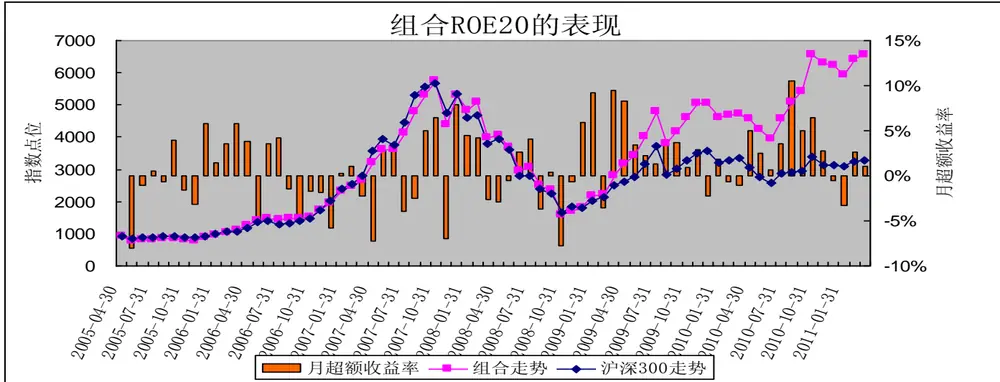
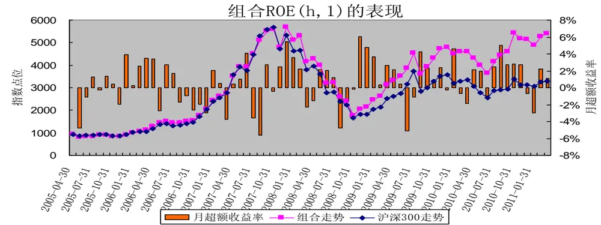
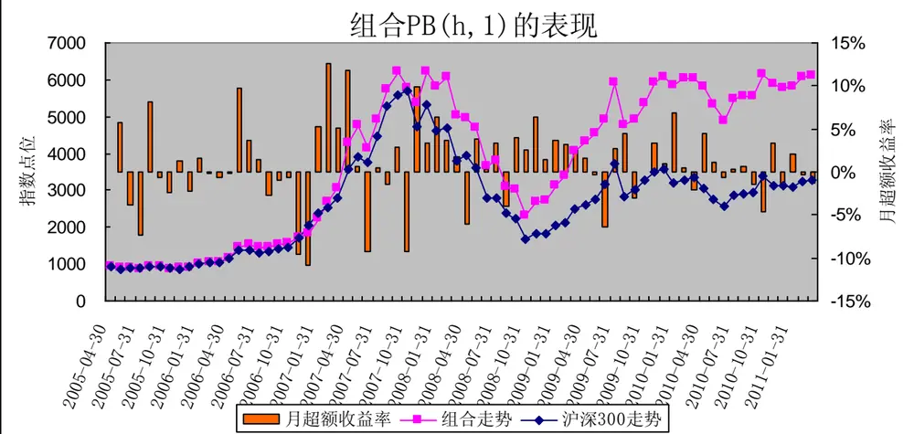
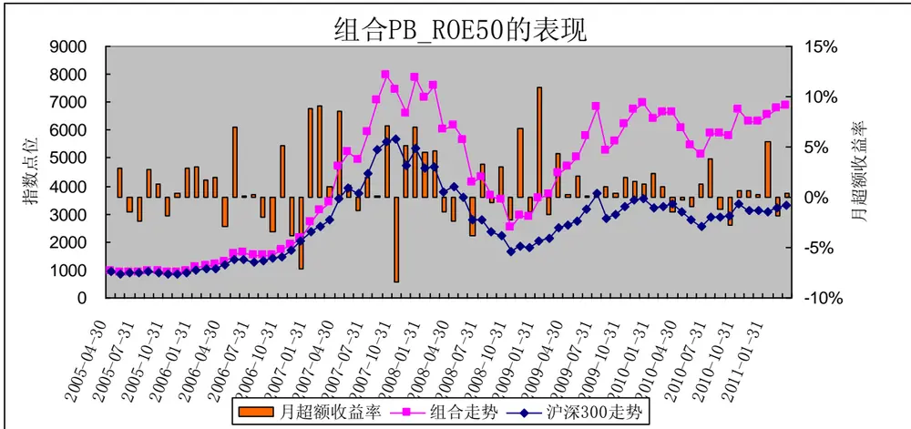
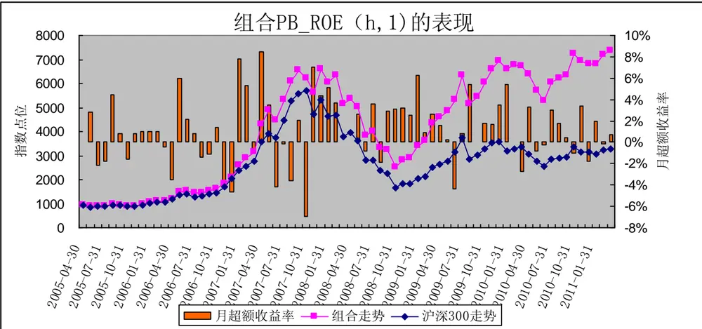

# PB-ROE 策略

## －－数量化选股策略之三

[table_research]研究员：魏刚

执业证书编号：S0570510120042

电话：025-83290914(办公室)

E-mail： weigang@mail.htsc.com.cn

地址：南京市中山东路 90 号

## ble_main] 相关研究

e_relate] 1、《数量化选股策略之一：基于沪深 300 指数成分股的动量反转策略》2010-05-10

2、《数量化选股策略之二：从股东结构的变化选股》 2011-04-20

## 投资要点：

我们在沪深 300 指数成分股中，使用市净率（PB）和净资产收益率（ROE）构建了几种选股策略，分析了这些组合的表现。组合调整日期为每年的 4 月30 日（一季报披露完成）、8 月 31 日（半年报披露完成）、10 月 31 日（三季报披露完成）。

高 ROE 策略：（1）在 2005 年 5 月 1 日至 2011 年 3 月 25 日间，组合 ROE20的收益率为 605.11%，年化收益率为 39.21%，在 18 期中，组合 ROE20 有 14期跑赢了沪深 300 指数，跑赢概率为 77.78%；（2）分行业等权重组合 ROE(h,1)的收益率为479.34%，年化收益率为34.65%，有13 期跑赢沪深300指数，跑赢概率为72.22%；（3）分行业按行业权重组合ROE(h,2)的收益率为386.90%，年化收益率为30.75%，有10 期跑赢沪深300指数，跑赢概率为55.56%。

低PB策略：（1）市净率较低的个股构造的组合并没有比市净率较高的个股构造的组合表现好，组合 PB50_100 的累计收益率较高，为 603.45%，年化收益率为39.16%，有11期跑赢了沪深300指数，跑赢概率为 61.11%；（2）分行业等权重组合 PB(h,1)的收益率为 555.38%，年化收益率为 37.50%，有 11 期跑赢了沪深300指数，跑赢概率为 61.11%；（3）分行业按行业权重组合PB(h,2)的收益率为583.91%，年化收益率为 38.49%，有12期跑赢了沪深300指数，跑赢概率为 61.11%。

综合打分法的 PB_ROE 策略：（1）组合 PB_ROE50 的累计收益率为 639.17%，年化收益率为40.33%，有13 期跑赢了沪深300指数，跑赢概率为72.22%；（2）分行业等权重组合 PB_ROE(h,1)的收益率为 687.85%，年化收益率为 41.85%，有13期跑赢沪深300 指数，跑赢概率为72.22%；（3）分行业按行业权重组合PB_ROE(h,2)的收益率为 608.70%，年化收益率为 39.33%，有 13 期跑赢沪深300 指数，跑赢概率为 72.22%。

经过市净率过滤的净资产收益率策略：剔除市净率排名较高的 60%的股票后，剩余股票按净资产收益率从高到低排序，构建的各组合表现差别并不是特别大，净资产收益率排名靠前的个股构成的组合并没有比净资产收益率排名靠后的个股构造的组合好。

分析各组合在 2005年 5 月 1 日至 2011年 3 月 25日间的表现，综合累计超额收益率和跑赢概率看，综合打分法构造的 3 个组合（PB_ROE50、PB_ROE(h,1)、PB_ROE (h,2)）表现较好，特别是分行业、等权重构建的组合 PB_ROE(h,1)。

本文分析在沪深300指数成分股中，通过市净率（PB）和净资产收益率（ROE）构建选股策略，构造组合，考察这些组合的表现。

## 一、组合构建要点

（1）我们的选股策略是基于沪深 300指数成分股；

（2）研究期间为2005年1 季度至2011年3月25日：

（3）组合调整日期为每年的 4月 30日（一季报披露完成）、8月 31日（半年报披露完成）、10月31日（三季报披露完成）；

（4）剔除在组合调整日前后长期停牌的股票；

（5）组合构建时为等权重，若分行业，则行业内个股为等权重；

（6）组合构建时股票的买入卖出价格为组合调整日收盘价，若调整日为非交易日，则向前顺延；

（7）在持有期内，若某只成分股被调出沪深300指数，不对组合进行调整；

（8）计算市净率和净资产收益率的来源于最新一期财务报告；

（9）行业分类按wind一级行业分类。

## 二、高净资产收益率策略

第一步，在沪深 300指数成分股中剔除在调整日前后长期停牌的个股；

第二步，把沪深300指数成分股的净资产收益率（数据来源于最新财务报表）从高到低排序，筛选出排名靠前的个股构建组合。

在 2005 年 5 月 1 日至 2011 年 3 月 25 日共进行了 18 期组合的调整，其中交易成本：单边买卖佣金 0.2%，卖出印花税 0.1%，买卖冲击成本均为 0.4%，2005 年 5 月 1 日构造组合时交易成本为 0.6%，其余每期组合调整成本为 1.3%。

表1 净资产收益率排序处于各区间的组合表现

| 净资产收益率排序(由高到低) | 2005年5月1日至2011年3月25日(不考虑交易成本） | 年化收益率 | 各期组合跑赢同期沪深 300指数的期数 | 跑赢概率 | 2005年5月1日至2011年3月25 日（考虑交易成本） | 年化收益率 |
| --- | --- | --- | --- | --- | --- | --- |
| 沪深 300指数同期表现 | 253.34% | 23.84% |  |  |  |  |
| 排名前10的成分股 | 552.37% | 37.39% | 10 | 55.56% | 419.13% | 32.17% |
| 排名前 20 的成分股 | 605.11% | 39.21% | 14 | 77.78% | 461.09% | 33.93% |
| 排名前 50 的成分股 | 516.99% | 36.10% | 12 | 66.67% | 390.97% | 30.93% |
| 排名 50-100 的成分股 | 605.03% | 39.21% | 13 | 72.22% | 461.03% | 33.92% |
| 排名 100-200 的成分股 | 380.59% | 30.46% | 11 | 61.11% | 282.43% | 25.51% |
| 排名200之后的成分股 | 287.19% | 25.77% | 10 | 55.56% | 208.11% | 21.00% |

数据来源：wind资讯，华泰证券研究所

由表 1 可知，整体上看，净资产收益率较高的组合表现较好，其中净资产收益率排名前 20 个股构成的组合表现较好，记为组合 ROE20。在 2005年 5月 1 日至 2011年 3月 25日间，不考虑交易成本，组合 ROE20 的收益率为 605.11%，年化收益率为 39.21%，高于同期沪深 300 指数的表现。在 18 期中，组合 ROE20 有 14 期跑赢了沪深 300指数，跑赢概率为 77.78%。

图 1 净资产收益率排名前20 的个股构成的组合表现
数据来源：wind资讯，华泰证券研究所

本部分主要考虑到由于行业特性不同，不同行业的净资产收益率差别较大，因而我们在各行业内部根据净资产收益率来筛选个股。

## （1）等权重组合

第二步，在每个 wind 一级行业内按净资产收益率从高到低排序，筛选出每个行业净资产收益率排名前五的个股构造组合，其中电信服务行业选 1只股票，共46只个股，46只个股等权重。该组合记为 ROE(h,1)。

图2 按行业分配的净资产收益率排名靠前的个股构成的组合表现
数据来源：wind资讯，华泰证券研究所

在 2005年5月 1日至 2011 年3月 25日间，不考虑交易成本，组合 ROE(h,1)的收益率为 479.34%，年化收益率为 34.65%，高于同期沪深300指数的收益。在 18期中，组合 ROE(h,1)有13期跑赢沪深 300指数，跑赢概率为 72.22%。若考虑交易成本，组合ROE(h,1)的区间累计收益率为 361.01%，年化收益率为 29.54%，略高于同期沪深 300指数的收益。

## （2） 按行业权重分配

第二步，在每个 wind 一级行业内按净资产收益率从高到低排序，筛选出每个行业净资产收益率排名前五的个股构造组合，其中电信服务行业选 1只股票，共46只个股；

第三步，个股权重分配，计算出组合调整日沪深 300指数中各 wind一级行业的权重，然后各wind一级行业内部平均权重，组合构建时保持组合与沪深 300指数各行业的权重分布一致。记为组合 ROE(h,2)。

在 2005年5月 1日至 2011 年3月 25日间，不考虑交易成本，组合 ROE(h,2)的收益率为 386.90%，年化收益率为 30.75%，低于等权重组合 ROE(h,1)，但略好于沪深 300 指数同期表现。在 18 期中，组合 ROE(h,2)有10期跑赢沪深 300指数，跑赢概率为 55.56%。若考虑交易成本，组合ROE(h,2)的区间累计收益率为 287.45%，年化收益率为 25.78%，略高于同期沪深 300指数的收益。

## 二、低市净率策略

第一步，在沪深300指数成分股中剔除在调整日前后长期停牌的个股；

第二步，把沪深300指数成分股的市净率（数据来源于最新财务报表）从从低到高排序，筛选出排名靠前的个股构建组合。

表2 市净率排序处于各区间的组合表现

| 市净率(由低到高) | 2005年5月1日至2011年3月25日（不考虑交易成本） | 年化收益率 | 各期组合跑赢同期沪深 300指数的期数 | 跑赢概率 | 2005年5月1日至2011年3月25日（考虑交易成本） | 年化收益率 |
| --- | --- | --- | --- | --- | --- | --- |
| 沪深 300指数同期表现 | 253.34% | 23.84% |  |  |  |  |
| 排名前10的成分股 | 245.81% | 23.39% | 8 | 44.44% | 175.18% | 18.70% |
| 排名前20的成分股 | 349.33% | 28.98% | 10 | 55.56% | 257.56% | 24.09% |
| 排名前50的成分股 | 432.36% | 32.74% | 9 | 50.00% | 323.62% | 27.70% |
| 排名 50-100 的成分股 | 603.45% | 39.16% | 11 | 61.11% | 459.77% | 33.87% |
| 排名 100-200 的成分股 | 459.84% | 33.88% | 13 | 72.22% | 345.50% | 28.79% |
| 排名 200 之后的成分股 | 259.11% | 24.18% | 9 | 50.00% | 185.77% | 19.46% |

数据来源：wind资讯，华泰证券研究所

由表2可知，市净率较低的个股构造的组合并没有比市净率较高的个股构造的组合表现好，其中市净率由低到高排名介于 50-100之间的50只个股构造的等权重组合表现最好，记为PB50_100，在 2005年 5月 1日至 2011年 3月25日间，组合PB50_100的累计收益率为 603.45%，年化收益率为 39.16%，在 18期中，有11期跑赢了沪深 300指数，跑赢概率为 61.11%。

本部分主要考虑到由于行业特性不同，不同行业的市净率差别较大，因而我们在各行业内部根据市净率来筛选个股。

## （1）等权重

第一步，在沪深300指数成分股中剔除在调整日前后长期停牌的个股；

第二步，在每个wind一级行业内按市净率从低到高排序，筛选出每个行业市净率排名前五的个股构造组合，其中电信服务行业选 1只股票，共 46只个股，46只个股等权重。该组合记为PB(h,1)。

图 3 按行业分配的市净率较低的个股构成的组合表现
数据来源：wind资讯，华泰证券研究所

在2005年5月1 日至2011 年 3月 25日间，不考虑交易成本，组合 PB(h,1)的收益率为 555.38%，年化收益率为 37.50%，好于同期沪深 300指数的表现。在18期中，组合 $\mathbf{PB(h,}\mathbf{I)}$ 有11期跑赢了沪深 300指数，跑赢概率为 61.11%。若考虑交易成本，组合PB(h,1)的区间累计收益率为 421.52%，年化收益率为 32.28%，高于同期沪深300指数的收益。

## （2） 按行业权重分配

第二步，在每个wind一级行业内按市净率从低到高排序，筛选出每个行业市净率排名前五的个股构造组合，其中电信服务行业选 1只股票，共 46只个股；

第三步，个股权重分配，计算出组合调整日沪深300指数中各 wind一级行业的权重，然后各 wind一级行业内部平均权重，组合构建时保持组合与沪深 300指数各行业的权重分布一致。记为组合PB(h,2)。

在2005年5月1 日至2011 年 3月 25日间，不考虑交易成本，组合 PB(h,2)的收益率为 583.91%，年化收益率为 38.49%，好于同期沪深 300 指数的表现。在 18 期中，组合 $\mathbf{PB}(\mathbf{h,}2)$ 有 12 期跑赢了沪深 300 指数，跑赢概率为 61.11%。若考虑交易成本，组合PB(h,2)的区间累计收益率为 444.22%，年化收益率为 33.24%，高于同期沪深300指数的收益。

## 三、结合净资产收益率和市净率的综合打分法

第二步，计算出每只成分股的市净率在 300只成分股的市净率中的分位数值、净资产收益率在 300只成分股的净资产收益率中的分位数值；

第三步，根据公式（净资产收益率在 300只成分股的净资产收益率中的分位数值+ 1-市净率在300只成分股的市净率中的分位数值）计算每只成分股的综合得分；

第四步，根据每只个股的综合得分对成分股进行排序筛选，选出股票等权重构建组合。

表3 综合打分排序处于各区间的组合表现

| 综合打分(由高到低) | 2005年5月1日至2011年3月25 日（不考虑交易成本） | 年化收益率 | 各期组合跑赢同期沪深300指数的期数 | 跑赢概率 | 2005年5月1日至2011年3月25 日（考虑交易成本） | 年化收益率 |
| --- | --- | --- | --- | --- | --- | --- |
| 沪深300指数同期表现 | 253.34% | 23.84% |  |  |  |  |
| 排名前10的成分股 | 384.85% | 30.65% | 12 | 66.67% | 285.82% | 25.69% |
| 排名前 20的成分股 | 465.42% | 34.10% | 12 | 66.67% | 349.93% | 29.01% |
| 排名前 50 的成分股 | 639.17% | 40.33% | 13 | 72.22% | 488.20% | 35.00% |
| 排名 50-100 的成分股 | 522.94% | 36.32% | 10 | 55.56% | 395.71% | 31.15% |
| 排名 100-200 的成分股 | 484.39% | 34.85% | 12 | 66.67% | 365.03% | 29.73% |
| 排名200之后的成分股 | 216.02% | 21.52% | 10 | 55.56% | 151.48% | 16.91% |

数据来源：wind资讯，华泰证券研究所

由表 3 可知，由综合打分排名前 50 的个股构成的组合表现较好，记为组合 PB_ROE50。在 2005 年 5 月 1日至 2011 年 3 月 25 日间，组合 PB_ROE50 的累计收益率为 639.17%，年化收益率为 40.33%，高于同期沪深300指数的表现。在 18期中，组合 PB_ROE50有 13 期跑赢了沪深 300指数，跑赢概率为 72.22%。

图4 综合打分排名前50的个股构成的组合表现

数据来源：wind资讯，华泰证券研究所

## （1）等权重

第二步，计算出每只成分股的市净率在 300只成分股的市净率中的分位数值、净资产收益率在 300只成分股的净资产收益率中的分位数值；

第三步，根据公式（净资产收益率在 300只成分股的净资产收益率中的分位数值+ 1-市净率在300只成分股的市净率中的分位数值）计算每只成分股的综合得分；

第四步，在每个 wind 一级行业内按综合得分从高到低排序，筛选出每个行业综合得分排名前五的个股构造组合，其中电信服务行业选 1只股票，共 46只个股，46只个股等权重。该组合记为PB_ROE(h,1)。

在 2005 年 5 月 1 日至 2011 年 3 月 25 日间，不考虑交易成本，组合 PB_ROE(h,1)的收益率为 687.85%，年化收益率为 41.85%，远远高于同期沪深 300指数的收益率；在 18期中，组合PB_ROE(h,1)有 13期跑赢沪深 300指数，跑赢概率为72.22%。若考虑交易成本，组合PB_ROE(h,1))的区间累计收益率为 526.93%，年化收益率为36.47%，高于同期沪深300指数的收益。

图5 按行业分配的综合得分排名靠前的个股构成的组合表现

数据来源：wind资讯，华泰证券研究所

## （2）按行业分配权重

第二步，计算出每只成分股的市净率在 300只成分股的市净率中的分位数值、净资产收益率在 300只成分股的净资产收益率中的分位数值；

第三步，根据公式（净资产收益率在 300只成分股的净资产收益率中的分位数值+ 1-市净率在300只成分股的市净率中的分位数值）计算每只成分股的综合得分；

第四步，在每个 wind 一级行业内按综合得分从高到低排序，筛选出每个行业综合得分排名前五的个股构造组合，其中电信服务行业选 1只股票，共 46只个股。

第五步，个股权重分配，计算出组合调整日沪深300指数中各 wind一级行业的权重，然后各 wind一级行业内部平均权重，组合构建时保持组合与沪深 300指数各行业的权重分布一致。该组合记为PB_ROE(h,2)。

在 2005 年 5 月 1 日至 2011 年 3 月 25 日间，不考虑交易成本，组合 PB_ROE(h,2)的收益率为 608.70%，年化收益率为 39.33%，远远高于同期沪深 300指数的收益率；在 18期中，组合PB_ROE(h,2)有 13期跑赢沪深 300指数，跑赢概率为 72.22%。若考虑交易成本，组合 PB_ROE(h,2)的区间累计收益率为 463.95%，年化收益率为34.04%，高于同期沪深300指数的收益。

## 四、经过市净率过滤的高净资产收益率策略

第二步，计算出每只成分股的市净率在 300只成分股的市净率中的分位数值，剔除分位数值大于 0.6的个股，也就是说剔除市净率排名前 60%的个股；

第三步，对经过前面两部筛选剩下的沪深300指数成分股按净资产收益率从高到低排序，选取排名靠前的个股构造组合，组合为等权重。

表4 经过市净率过滤的净资产收益率排名处于各区间的组合表现

| 经过市净率过滤的净资产收益率排名(由高到低) | 2005年5月1日至2011年3月25日（不考虑交易成本） |  | 各期组合跑赢同期沪深300指数的期数 |  | 2005年5月1日至2011年3月25日（考虑交易成本） |  |
| --- | --- | --- | --- | --- | --- | --- |
|  | 累计收益率 | 年化收益率 | 跑赢次数 | 跑赢概率 | 累计收益率 | 累计收益率 |
| 沪深 300指数同期表现 | 253.34% | 23.84% |  |  |  |  |
| 排名前10的成分股 | 529.35% | 36.56% | 11 | 61.11% | 400.80% | 31.37% |
| 排名前 20 的成分股 | 529.05% | 36.55% | 11 | 61.11% | 400.57% | 31.36% |
| 排名前 50 的成分股 | 524.39% | 36.37% | 12 | 66.67% | 396.86% | 31.20% |
| 排名50-100的成分股 | 620.51% | 39.72% | 11 | 61.11% | 473.34% | 34.42% |

数据来源：wind资讯，华泰证券研究所

有表4可知，各组合表现差别并不是特别大，净资产收益率排名靠前的个股构成的组合并没有比净资产收益率排名靠后的个股构造的组合好。排名前 20 的成分股构成的组合记为 PB_ROE20(f)。

## 五、各策略比较

分析各组合在 2005 年 5 月 1 日至 2011 年 3 月 25 日间的表现，综合累计超额收益率和跑赢概率看，综合打分法构造的 3 个组合（PB_ROE50、PB_ROE (h,1)、PB_ROE (h,2)）表现较好，特别是组合 PB_ROE (h,1)。

表5 各策略构造的组合表现比较

| 选股策略 |  | 组合简称 | (2005.5.1-2011.3.25) |  | 跑贏期数(共18期) |  |
| --- | --- | --- | --- | --- | --- | --- |
|  |  |  | 累计收益率 | 年化收益率 | 期数 | 概率 |
| 高 ROE策略 | 不分行业 | ROE20 | 605.11% | 39.21% | 14 | 77.78% |
|  | 分行业等权重 | ROE(h,1) | 479.34% | 34.65% | 13 | 72.22% |
|  | 分行业按行业权重 | ROE(h,2) | 386.90% | 30.75% | 10 | 55.56% |
| 低 PB 策略 | 不分行业 | PB50_100 | 603.45% | 39.16% | 11 | 61.11% |
|  | 分行业等权重 | PB(h,1) | 555.38% | 37.50% | 11 | 61.11% |
|  | 分行业按行业权重 | PB(h,2) | 583.91% | 38.49% | 11 | 61.11% |
| 综合打分的PB_ROE 策略 | 不分行业 | PB_ROE50 | 639.17% | 40.33% | 13 | 72.22% |
|  | 分行业等权重 | PB_ROE (h,1) | 687.85% | 41.85% | 13 | 72.22% |
|  | 分行业按行业权重 | PB_ROE (h,2) | 608.70% | 39.33% | 13 | 72.22% |
| 经过 PB 过滤的高 ROE 策略 | PB_ROE20(f) |  | 529.05% | 36.55% | 11 | 61.11% |

数据来源：wind资讯，华泰证券研究所

表 6 综合打分法构建的组合 PB_ROE (h,1)最新成分股（2011 年 5 月 1 日至 2011 年 8 月 31 日）

| Wind一级行业 | 股票代码 | 股票简称 | PB(2011-04-30) | ROE（2011年1季报，%） |
| --- | --- | --- | --- | --- |
| 材料 | 600019 | 宝钢股份 | 1.12 | 2.84 |
| 材料 | 000778 | 新兴铸管 | 1.92 | 3.48 |
| 材料 | 600210 | 紫江企业 | 2.52 | 4.54 |
| 材料 | 600005 | 武钢股份 | 1.62 | 2.10 |
| 材料 | 600585 | 海螺水泥 | 3.52 | 5.68 |
| 电信服务 | 600050 | 中国联通 | 1.74 | 0.04 |
| 工业 | 601006 | 大秦铁路 | 2.23 | 5.69 |
| 工业 | 000900 | 现代投资 | 1.69 | 4.21 |
| 工业 | 600153 | 建发股份 | 2.93 | 6.91 |
| 工业 | 000157 | 中联重科 | 2.92 | 6.37 |
| 工业 | 600269 | 赣粵高速 | 1.33 | 2.84 |
| 公用事业 | 000027 | 深圳能源 | 1.73 | 1.79 |
| 公用事业 | 000685 | 中山公用 | 2.10 | 2.26 |
| 公用事业 | 600795 | 国电电力 | 2.04 | 2.01 |
| 公用事业 | 600900 | 长江电力 | 2.03 | 0.95 |
| 公用事业 | 601158 | 重庆水务 | 3.50 | 2.85 |
| 金融 | 000001 | 深发展A | 1.76 | 6.90 |
| 金融 | 600016 | 民生银行 | 1.49 | 5.65 |
| 金融 | 601328 | 交通银行 | 1.42 | 5.58 |
| 金融 | 601288 | 农业银行 | 1.66 | 5.89 |
| 金融 | 601939 | 建设银行 | 1.75 | 6.31 |
| 可选消费 | 600741 | 华域汽车 | 1.88 | 5.02 |
| 可选消费 | 600104 | 上海汽车 | 2.38 | 5.98 |
| 可选消费 | 000625 | 长安汽车 | 1.81 | 4.59 |
| 可选消费 | 600418 | 江淮汽车 | 2.70 | 5.62 |
| 可选消费 | 600166 | 福田汽车 | 2.51 | 4.89 |
| 能源 | 600028 | 中国石化 | 1.68 | 4.59 |
| 能源 | 601088 | 中国神华 | 2.88 | 5.06 |
| 能源 | 601857 | 中国石油 | 2.19 | 3.82 |
| 能源 | 601898 | 中煤能源 | 1.87 | 3.00 |
| 能源 | 600508 | 上海能源 | 2.96 | 4.62 |
| 日常消费 | 000876 | 新希望 | 3.58 | 4.81 |
| 日常消费 | 000858 | 五粮液 | 6.19 | 10.23 |
| 日常消费 | 600779 | 水井坊 | 6.25 | 7.19 |
| 日常消费 | 600519 | 贵州茅台 | 8.48 | 9.28 |
| 日常消费 | 000568 | 泸州老窖 | 9.86 | 13.87 |
| 信息技术 | 600183 | 生益科技 | 3.53 | 5.13 |
| 信息技术 | 000725 | 京东方A | 1.45 | -2.85 |
| 信息技术 | 600271 | 航天信息 | 4.69 | 4.63 |
| 信息技术 | 600601 | 方正科技 | 2.23 | 0.14 |
| 信息技术 | 000021 | 长城开发 | 3.17 | 1.01 |
| 医疗保健 | 600216 | 浙江医药 | 3.92 | 6.45 |
| 医疗保健 | 600062 | 双鹤药业 | 3.38 | 4.49 |
| 医疗保健 | 600664 | 哈药股份 | 3.48 | 4.55 |
| 医疗保健 | 002001 | 新和成 | 4.20 | 5.62 |
| 医疗保健 | 600380 | 健康元 | 3.42 | 4.07 |

## 免责条款：

本报告的信息均来源于公开资料，本公司对这些信息的准确性、完整性或可靠性不作任何保证，也不保证所包含的信息和建议不会发生任何变更。本公司力求报告内容的客观、公正，但文中的观点、结论和建议仅供参考，不构成所述证券的买卖出价或征价，投资者据此做出的任何投资决策与本公司和作者无关。本公司及作者在自身所知情的范围内，与本报告中所评价或推荐的证券没有利害关系。在法律许可的情况下，本公司及其所属关联机构可能会持有报告中提到的公司所发行的证券头寸并进行交易，也可能为这些公司提供或者争取提供投资银行、财务顾问或者金融产品等相关服务。

报告版权仅为本公司所有，未经书面许可，任何机构和个人不得以任何形式翻版、复制、发表或引用。如征得本公司同意进行引用、刊发的，需在允许的范围内使用，并注明出处为“华泰证券研究所”，且不得对本报告进行任何有悖原意的引用、删节和修改。

本公司具有中国证监会核准的“证券投资咨询”业务资格，经营许可证编号为：Z23032000。