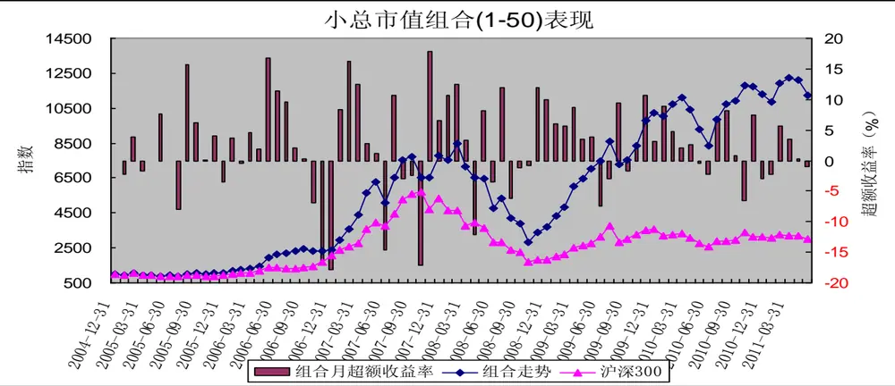
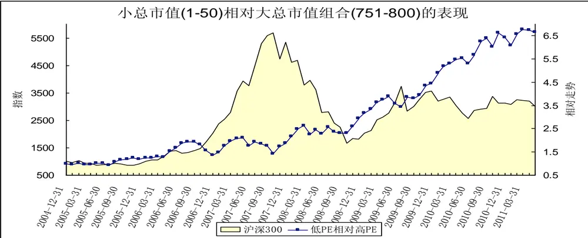
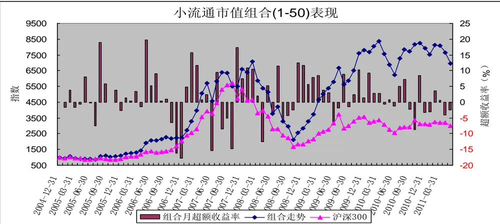
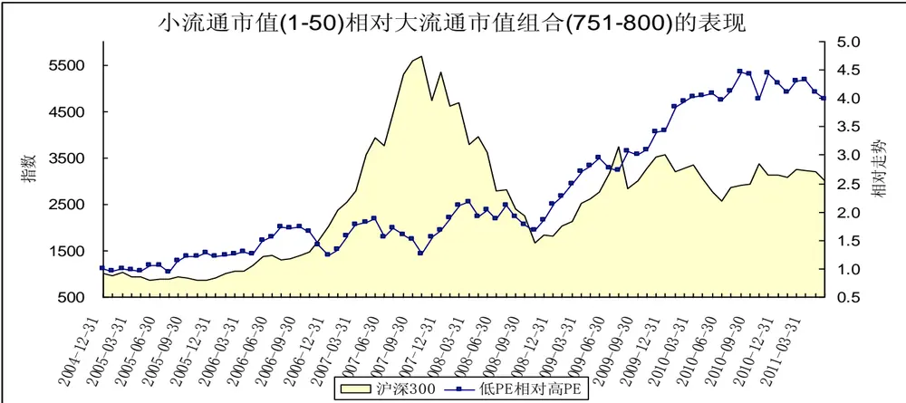
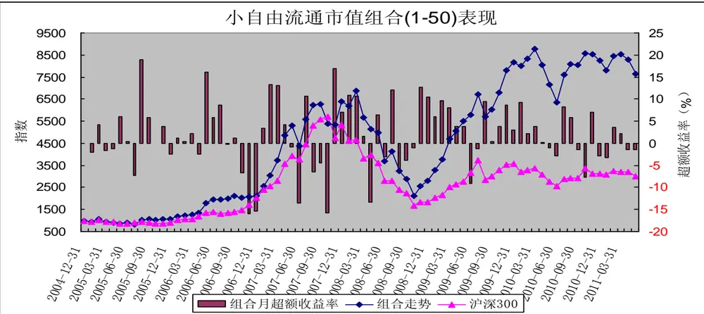
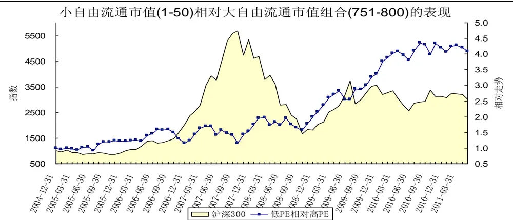

# 规模因子分析－－数量化选股策略之四

[table_research]研究员：魏刚

执业证书编号：S0570510120042

电话：025-83290914(办公室)

E-mail： weigang@mail.htsc.com.cn

地址：南京市中山东路 90 号

## 相关研究

e_relate] 1、《数量化选股策略之一：基于沪深 300 指数成份股的动量反转策略》2010-05-10

2、《数量化选股策略之二：从股东结构的变化选股》 2011-04-203、《数量化选股策略之三：PB_ROE 策略》，2011-05-20

## 投资要点：

影响股价走势的主要因子包括市场整体走势（市场因子，系统性风险）、估值因子（市盈率、市净率、市销率、市值企业价值比、PEG 等）、成长因子（营业收入增长率、营业利润增长率、净利润增长率、每股收益增长率、净资产增长率、股东权益增长率、经营活动产生的现金流量金额增长率等）、盈利能力因子（销售净利率、毛利率、净资产收益率、资产收益率、营业费用比例、财务费用比例、息税前利润与营业总收入比等）、杠杆因子（负债权益比、资产负债率等）、动量反转因子（前期涨跌幅等）、交易因子（前期换手率、量比等）、规模因子（流通市值、总市值、自由流通市值、流通股本、总股本等）、股价因子（股票价格）、红利因子（股息率、股息支付率）、股价波动因子（前期股价振幅、日收益率标准差等）、市场预期因子（预测净利润增长率、预测主营业务增长率、盈利预测调整等）等。

在接下来的几篇报告中，我们将逐一分析各个因子对股价的影响，以及在不同市场环境下各个因子的表现，通过不同指标的对比，筛选出能持续获得稳定正收益能力的因子，并确定备选因子；然后筛选因子组合构建多因素选股模型，寻找适合不同市场环境的选股模型。本报告为因子分析的第一篇，主要分析规模因子的历史表现。

由总市值最小的50只中证800指数成份股构造的等权重组合大幅跑赢沪深300指数，2005年1月至211年5月间的累计收益率高达1021.10%，年化收益率达45.77%；而同期沪深300指数的累计收益率为200.16%，年化收益率为18.69%。

由流通市值最小的50只中证800指数成份股构造的等权重组合大幅跑赢沪深300指数，2005年1月至211年5月间的累计收益率高达597.27%，年化收益率达35.36%；而同期沪深300指数的累计收益率为200.16%，年化收益率为18.69%。

由自由流通市值最小的50只中证800指数成份股构造的等权重组合大幅跑赢沪深300指数，2005年1月至211年5月间的累计收益率高达664.90%，年化收益率达37.33%；而同期沪深300指数的累计收益率为200.16%，年化收益率为18.69%。

通过对2005年以来市场的分析，不管是从总市值、还是流通市值和自由流通市值看，A股市场存在较为显著的小盘股效应。市值较小股票构造的组合整体上大幅超越沪深300指数，也大大优于总市值较大股票构造的组合。

规模因子（总市值、流通市值、自由流通市值）是影响股票收益的重要因子，其中总市值因子最为显著。

影响股价走势的主要因子包括市场整体走势（市场因子，系统性风险）、估值因子（市盈率、市净率、市销率、市值企业价值比、PEG 等）、成长因子（营业收入增长率、营业利润增长率、净利润增长率、每股收益增长率、净资产增长率、股东权益增长率、经营活动产生的现金流量金额增长率等）、盈利能力因子（销售净利率、毛利率、净资产收益率、资产收益率、营业费用比例、财务费用比例、息税前利润与营业总收入比等）、杠杆因子（负债权益比、资产负债率等）、动量反转因子（前期涨跌幅等）、交易因子（前期换手率、量比等）、规模因子（流通市值、总市值、自由流通市值、流通股本、总股本等）、股价因子（股票价格）、红利因子（股息率、股息支付率）、股价波动因子（前期股价振幅、日收益率标准差等）、市场预期因子（预测净利润增长率、预测主营业务增长率、盈利预测调整等）。

在接下来的几篇报告中，我们将逐一分析各个因子对股价的影响，以及在不同市场环境下各个因子的表现，通过不同指标的对比，筛选出能持续获得稳定正收益能力的因子，并确定备选因子；然后筛选因子组合构建多因素选股模型，寻找适合不同市场环境的选股模型。本报告为因子分析的第一篇，主要分析规模因子的历史表现。

## 一、前言

比较常用的因子回报度量方法有：横截面回归法和排序打分法。横截面回归法利用因子的取值（风险暴露）与下期股票收益率之间的线性关系，以最小二乘法拟合出的回归系数定义为因子回报。FF 排序打分法原型是由Fama 和 French提出，通过对因子暴露进行排序，排名靠前的股票组合减去排名靠后的股票组合下一期的平均收益率定义为因子回报，他们提出的排序法已经被发采用。我们采用排序法对各因子进行分析。

（1）我们的研究范围为中证 800指数成份股；

（2）研究期间为2005年1 月至2011年5 月；

（3）组合调整周期为月，每月最后一个交易日收盘后构建下一期的组合；

（4）我们按各指标排序，把 800 只成份股分成：（1-50）、（1-100）、（101-200）、（201-300）、（301-400）、（401-500）、（501-600）、（601-700）、（701-800）、（（751-800）等 10 个组合；

（5）组合构建时股票的买入卖出价格为组合调整日收盘价；

（6）组合构建时为等权重；

（7）在持有期内，若某只成份股被调出中证 800指数，不对组合进行调整；

（8）组合构建时，买卖冲击成本均为0.1%、买卖佣金均为 0.1%，印花税为0.1%。

## 二、总市值

表 1 总市值从小到大排序处于各区间的组合表现

| 总市值从小到大排序 | 2005年1月2011年5月收益 | 年化收益率 | 跑赢沪深300指数次数 | 跑赢概率 |
| --- | --- | --- | --- | --- |
| 沪深300指数 | 200.16% | 18.69% |  |  |
| 1-50 | 1021.10% | 45.77% | 49 | 63.64% |
| 1-100 | 814.26% | 41.20% | 47 | 61.04% |
| 101-200 | 473.13% | 31.29% | 47 | 61.04% |
| 201-300 | 271.40% | 22.70% | 44 | 57.14% |
| 301-400 | 246.74% | 21.39% | 41 | 53.25% |
| 401-500 | 247.91% | 21.46% | 42 | 54.55% |
| 501-600 | 169.65% | 16.73% | 40 | 51.95% |
| 601-700 | 222.65% | 20.04% | 46 | 59.74% |
| 701-800 | 87.76% | 10.32% | 31 | 40.26% |
| 751-800 | 68.73% | 8.50% | 29 | 37.66% |

数据来源：wind资讯，华泰证券研究所

由上表可知，2005年至今，沪深A股市场表现出较为明显的小盘股效应，整体上看，总市值越小，表现越好。总市值较小股票构成的组合（1-50）、组合（1-100）、组合（101-200）表现较好，而总市值排名处于中游的股票构建的组合（201-300）、组合（301-400）、组合（401-500）组合（501-600）、组合（601-700）的表现差异不大，且总体上与沪深300指数一致；总市值较大股票构成的组合（701-800）、组合（751-800）表现较差，大幅落后于沪深300指数。

由总市值最小的50只中证800指数成份股构造的等权重组合大幅跑赢沪深300指数，2005年1月至211年5月间的累计收益率高达1021.10%，年化收益率达45.77%，而同期沪深300指数的累计收益率为200.16%，年化收益率为18.69%。

表2 总市值从小到大排序处于各区间的组合的绩效分析

| 总市值从小到大排序 | alpha | beta | sharpe | treynor | jensen | 跟踪误差 | 信息比率 | T检验的p 值 |
| --- | --- | --- | --- | --- | --- | --- | --- | --- |
| 1-50 | 2.5744 | 0.9506 | 0.3538 | 4.7116 | 2.5743 | 0.0799 | 1.3344 | 0.006 |
| 1-100 | 2.2541 | 0.9728 | 0.3325 | 4.3207 | 2.2541 | 0.0756 | 1.0553 | 0.010 |
| 101-200 | 1.5978 | 0.9625 | 0.2887 | 3.6634 | 1.5977 | 0.0681 | 0.5204 | 0.049 |
| 201-300 | 0.9942 | 0.9858 | 0.2409 | 3.0120 | 0.9942 | 0.0652 | 0.1419 | 0.196 |
| 301-400 | 0.8566 | 0.9936 | 0.2362 | 2.8657 | 0.8566 | 0.0584 | 0.1036 | 0.207 |
| 401-500 | 0.8707 | 0.9639 | 0.2415 | 2.9068 | 0.8706 | 0.0549 | 0.1130 | 0.204 |
| 501-600 | 0.4616 | 0.9934 | 0.2135 | 2.4682 | 0.4616 | 0.0451 | -0.0878 | 0.387 |
| 601-700 | 0.6108 | 1.0494 | 0.2321 | 2.5857 | 0.6110 | 0.0359 | 0.0814 | 0.083 |
| 701-800 | -0.0943 | 0.9896 | 0.1784 | 1.9083 | -0.0943 | 0.0119 | -1.2304 | 0.398 |
| 751-800 | -0.2131 | 0.9724 | 0.1659 | 1.7843 | -0.2132 | 0.0166 | -1.0278 | 0.157 |

数据来源：wind资讯，华泰证券研究所

从各组合的绩效指标看，小总市值股票组合的表现也大大好于大总市值股票组合，组合（1-50）、组合（1-100）、组合（101-200）的alpha值均为正，其月超额收益率在5%的显著水平下显著为正，组合（1-50）、组合（1-100）的信息比率也分别达1.3344和1.0553。

图1 小总市值股票组合表现
数据来源：wind资讯，华泰证券研究所

小总市值股票组合（1-50）的走势波动较大，2009年之前表现不够稳定，但总体上跑赢沪深300指数；2009年以后小总市值股票组合（1-50）明显好于沪深300指数，这可能是由2009年8月开始的小盘股行情导致的。小总市值股票组合（1-50）大幅跑输沪深300指数主要在2005年7月（触底反弹，牛市初期）、2006年10月至2006年12月（牛市中期，冲向300点，蓝筹股行情，随后股市经历了近3个月的整理）、2007年6月至2007年10月（牛市末期，基金规模大幅扩大引致的蓝筹股加速冲顶行情）、2008年4月（下跌至3000点左右的反弹）、2009年6月至2009年7月（牛市末期，减速冲顶）、2010年10月（牛市末期，加速冲顶）。

小总市值股票组合（1-50）在多数月份跑赢沪深300指数，其大幅落后于沪深300指数主要发生在牛市末期加速冲顶时，除2005年7月外，小总市值股票组合（1-50）大幅落后沪深300指数发生后市场都进行了较长时间的下跌或者整理。因而当股票市场处于高位 且小市值股票组合 （1-50） 的表现大幅落后于沪深300指数可以视为股市见顶的一个重要信号。

图2 小总市值组合相对大总市值组合的表现
数据来源：wind资讯，华泰证券研究所

2005年以来，小总市值股票组合大幅跑赢大总市值股票组合，小总市值股票组合仅在个别时间段落后于大总

市值股票组合。

## 三、流通市值

表 3 流通市值从小到大排序处于各区间的组合表现

| 流通市值从小到大排序 | 2005年1月2011年5月收益 | 年化收益率 | 跑赢沪深300指数次数 | 跑赢概率 |
| --- | --- | --- | --- | --- |
| 沪深300指数 | 200.16% | 18.69% |  |  |
| 1-50 | 597.27% | 35.36% | 47 | 61.04% |
| 1-100 | 695.00% | 38.16% | 47 | 61.04% |
| 101-200 | 413.27% | 29.05% | 49 | 63.64% |
| 201-300 | 344.26% | 26.18% | 42 | 54.55% |
| 301-400 | 278.08% | 23.04% | 45 | 58.44% |
| 401-500 | 226.14% | 20.24% | 41 | 53.25% |
| 501-600 | 191.69% | 18.16% | 43 | 55.84% |
| 601-700 | 171.19% | 16.83% | 42 | 54.55% |
| 701-800 | 121.43% | 13.20% | 36 | 46.75% |
| 751-800 | 74.89% | 9.11% | 33 | 42.86% |

数据来源：wind资讯，华泰证券研究所

由上表可知，2005年至今，沪深A股市场表现出一定的小盘股效应，整体上看，流通市值越小，表现越好。流通市值较小股票构成的组合（1-50）、组合（1-100）、组合（101-200）表现较好，而流通市值排名处于中游的股票构建的组合（201-300）、组合（301-400）、组合（401-500）组合（501-600）、组合（601-700）的表现差异不大，且总体上与沪深300指数一致；流通市值较大股票构成的组合（701-800）、组合（751-800）表现较差，大幅落后于沪深300指数。

由流通市值最小的50只中证800指数成份股构造的等权重组合大幅跑赢沪深300指数，2005年1月至211年5月间的累计收益率高达597.27%，年化收益率达35.36%，而同期沪深300指数的累计收益率为200.16%，年化收益率为18.69%。

表4 流通市值从小到大排序处于各区间的组合的绩效分析

| 流通市值从小到大排序 | alpha | beta | sharpe | treynor | jensen | 跟踪误差 | 信息比率 | T 检验的p 值 |
| --- | --- | --- | --- | --- | --- | --- | --- | --- |
| 1-50 | 1.9501 | 0.9470 | 0.3030 | 4.0626 | 1.9500 | 0.0793 | 0.6507 | 0.040 |
| 1-100 | 2.0763 | 0.9635 | 0.3188 | 4.1584 | 2.0762 | 0.0752 | 0.8545 | 0.018 |
| 101-200 | 1.4468 | 0.9737 | 0.2749 | 3.4892 | 1.4467 | 0.0686 | 0.4032 | 0.075 |
| 201-300 | 1.2298 | 0.9615 | 0.2648 | 3.2825 | 1.2297 | 0.0622 | 0.3009 | 0.104 |
| 301-400 | 0.9737 | 0.9928 | 0.2462 | 2.9844 | 0.9737 | 0.0583 | 0.1736 | 0.150 |
| 401-500 | 0.7650 | 0.9819 | 0.2334 | 2.7826 | 0.7649 | 0.0532 | 0.0634 | 0.232 |
| 501-600 | 0.5546 | 1.0082 | 0.2203 | 2.5536 | 0.5546 | 0.0467 | -0.0236 | 0.286 |
| 601-700 | 0.3995 | 1.0297 | 0.2145 | 2.3916 | 0.3996 | 0.0349 | -0.1077 | 0.251 |
| 701-800 | 0.1099 | 0.9993 | 0.1972 | 2.1135 | 0.1099 | 0.0139 | -0.7361 | 0.496 |
| 751-800 | -0.1554 | 0.9566 | 0.1713 | 1.8409 | -0.1556 | 0.0160 | -1.0155 | 0.186 |

数据来源：wind资讯，华泰证券研究所

从各组合的绩效指标看，小流通市值股票组合的表现也大大好于大流通市值股票组合，组合（1-50）、组合（1-100）的alpha值均为正，其月超额收益率在5%的显著水平下显著为正，组合（1-50）、组合（1-100）的信息比率分别为0.6507和0.8545。

图3 小流通市值股票组合表现
数据来源：wind资讯，华泰证券研究所

小流通市值股票组合（1-50）的走势波动较大，2009年之前表现不够稳定，但总体上跑赢沪深300指数；2009年以后小流通市值股票组合（1-50）明显好于沪深300指数，这可能是由2009年8月开始的小盘股行情导致的。小流通市值股票组合（1-50）大幅跑输沪深300指数主要在2005年7月（触底反弹，牛市初期）、2006年10月至2006年12月（牛市中期，冲向300点，蓝筹股行情，随后股市经历了近3个月的整理）、2007年6月至2007年10月（牛市末期，基金规模大幅扩大引致的蓝筹股加速冲顶行情）、2008年4月（下跌至3000点左右的反弹）、2008年8月至11月（熊市末期），2009年6月至2009年7月（牛市末期，减速冲顶）、2010年10月（牛市末期，加速冲顶）。

小流通市值股票组合（1-50）大幅落后于沪深300指数主要发生在牛市末期加速冲顶时，小流通市值股票组合（1-50）大幅落后沪深300指数发生后市场都进行了较长时间的下跌或者整理。因而当股票市场处于高位 且小市值股票组合（1-50）的表现大幅落后于沪深300指数可以视为股市见顶的一个重要信号

图4 小流通市值组合相对大流通市值组合的表现

数据来源：wind资讯，华泰证券研究所

2005年以来，小流通市值股票组合大幅跑赢大流通市值股票组合，小流通市值股票组合仅在个别时间段落后于大流通市值股票组合。

## 四、自由自由流通市值

表5 自由流通市值从小到大排序处于各区间的组合表现

| 自由流通市值从小到大排序 | 2005年1月2011年5月收益 | 年化收益率 | 跑赢沪深300指数次数 | 跑赢概率 |
| --- | --- | --- | --- | --- |
| 沪深300指数 | 200.16% | 18.69% |  |  |
| 1-50 | 664.90% | 37.33% | 46 | 59.74% |
| 1-100 | 688.01% | 37.97% | 46 | 59.74% |
| 101-200 | 493.93% | 32.02% | 48 | 62.34% |
| 201-300 | 335.64% | 25.79% | 45 | 58.44% |
| 301-400 | 266.92% | 22.47% | 41 | 53.25% |
| 401-500 | 199.85% | 18.67% | 43 | 55.84% |
| 501-600 | 180.32% | 17.43% | 39 | 50.65% |
| 601-700 | 181.40% | 17.51% | 42 | 54.55% |
| 701-800 | 120.65% | 13.13% | 42 | 54.55% |
| 751-800 | 87.51% | 10.30% | 32 | 41.56% |

数据来源：wind资讯，华泰证券研究所

由上表可知，2005年至今，沪深A股市场表现出一定的小盘股效应，整体上看，自由流通市值越小，表现越好。自由流通市值较小股票构成的组合（1-50）、组合（1-100）、组合（101-200）表现较好，而自由流通市值排名处于中游的股票构建的组合（201-300）、组合（301-400）、组合（401-500）组合（501-600）、组合（601-700）的表现差异不大，且总体上与沪深300指数一致；自由流通市值较大股票构成的组合（701-800）、组合（751-800）表现较差，大幅落后于沪深300指数。

由自由流通市值最小的50只中证800指数成份股构造的等权重组合大幅跑赢沪深300指数，2005年1月至211年5月间的累计收益率高达664.90%，年化收益率达37.33%，而同期沪深300指数的累计收益率为200.16%，年化收益率为18.69%。

表6 自由流通市值从小到大排序处于各区间的组合的绩效分析

| 自由流通市值从小到大排序 | alpha | beta | sharpe | treynor | jensen | 跟踪误差 | 信息比率 | T 检验的p值 |
| --- | --- | --- | --- | --- | --- | --- | --- | --- |
| 1-50 | 2.0425 | 0.9583 | 0.3134 | 4.1348 | 2.0424 | 0.0771 | 0.7832 | 0.025 |
| 1-100 | 2.0520 | 0.9698 | 0.3180 | 4.1194 | 2.0519 | 0.0742 | 0.8544 | 0.017 |
| 101-200 | 1.6632 | 0.9640 | 0.2896 | 3.7287 | 1.6631 | 0.0715 | 0.5338 | 0.050 |
| 201-300 | 1.2008 | 0.9581 | 0.2642 | 3.2568 | 1.2007 | 0.0606 | 0.2904 | 0.106 |
| 301-400 | 0.9306 | 0.9922 | 0.2424 | 2.9415 | 0.9306 | 0.0584 | 0.1484 | 0.171 |
| 401-500 | 0.6387 | 0.9953 | 0.2233 | 2.6452 | 0.6387 | 0.0521 | -0.0008 | 0.292 |
| 501-600 | 0.5166 | 1.0018 | 0.2165 | 2.5192 | 0.5166 | 0.0474 | -0.0544 | 0.338 |
| 601-700 | 0.4473 | 1.0299 | 0.2179 | 2.4379 | 0.4474 | 0.0363 | -0.0671 | 0.222 |
| 701-800 | 0.1060 | 0.9996 | 0.1972 | 2.1096 | 0.1060 | 0.0122 | -0.8452 | 0.453 |
| 751-800 | -0.0530 | 0.9427 | 0.1813 | 1.9471 | -0.0532 | 0.0158 | -0.9254 | 0.354 |

数据来源：wind资讯，华泰证券研究所

从各组合的绩效指标看，小自由流通市值股票组合的表现也大大好于大自由流通市值股票组合，组合（1-50）、组合（1-100）的alpha值均为正，其月超额收益率在5%的显著水平下显著为正，组合（1-50）、组合（1-100）的信息比率分别为0.7832和0.8544。

图5 小自由流通市值股票组合表现
数据来源：wind资讯，华泰证券研究所

小自由流通市值股票组合（1-50）的走势波动较大，2009年之前表现不够稳定，但总体上跑赢沪深300指数；2009年以后小自由流通市值股票组合（1-50）明显好于沪深300指数，这可能是由2009年8月开始的小盘股行情导致的。小自由流通市值股票组合（1-50）大幅跑输沪深300指数主要在2005年7月（触底反弹，牛市初期）、2006年10月至2006年12月（牛市中期，冲向300点，蓝筹股行情，随后股市经历了近3个月的整理）、2007年6月至2007年10月（牛市末期，基金规模大幅扩大引致的蓝筹股加速冲顶行情）、2008年4月（下跌至3000点左右的反弹）、2008年8月至11月（熊市末期），2009年6月至2009年7月（牛市末期，减速冲顶）、2010年10月（牛市末期，加速冲顶）。

小自由流通市值股票组合（1-50）大幅落后于沪深300指数主要发生在牛市末期加速冲顶时，小自由流通市值股票组合（1-50）大幅落后沪深300指数发生后市场都进行了较长时间的下跌或者整理。因而当股票市场处于高位，且小市值股票组合（1-50）的表现大幅落后于沪深300指数可以视为股市见顶的一个重要信号。

图6 小自由流通市值组合相对大自由流通市值组合的表现

数据来源：wind资讯，华泰证券研究所

2005年以来，小自由流通市值股票组合大幅跑赢大自由流通市值股票组合，小自由流通市值股票组合仅在个别时间段落后于大自由流通市值股票组合。

## 五、结论

通过对2005年以来市场的分析，不管是从总市值、还是流通市值和自由流通市值看，A股市场存在较为显著的小盘股效应。市值较小股票构造的组合整体上大幅超越沪深300指数，也大大优于总市值较大股票构造的组合。

规模因子（总市值、流通市值、自由流通市值）是影响股票收益的重要因子，其中总市值因子最为显著。

## 免责条款：

本报告的信息均来源于公开资料，本公司对这些信息的准确性、完整性或可靠性不作任何保证，也不保证所包含的信息和建议不会发生任何变更。本公司力求报告内容的客观、公正，但文中的观点、结论和建议仅供参考，不构成所述证券的买卖出价或征价，投资者据此做出的任何投资决策与本公司和作者无关。本公司及作者在自身所知情的范围内，与本报告中所评价或推荐的证券没有利害关系。在法律许可的情况下，本公司及其所属关联机构可能会持有报告中提到的公司所发行的证券头寸并进行交易，也可能为这些公司提供或者争取提供投资银行、财务顾问或者金融产品等相关服务。

报告版权仅为本公司所有，未经书面许可，任何机构和个人不得以任何形式翻版、复制、发表或引用。如征得本公司同意进行引用、刊发的，需在允许的范围内使用，并注明出处为“华泰证券研究所”，且不得对本报告进行任何有悖原意的引用、删节和修改。

本公司具有中国证监会核准的“证券投资咨询”业务资格，经营许可证编号为：Z23032000。