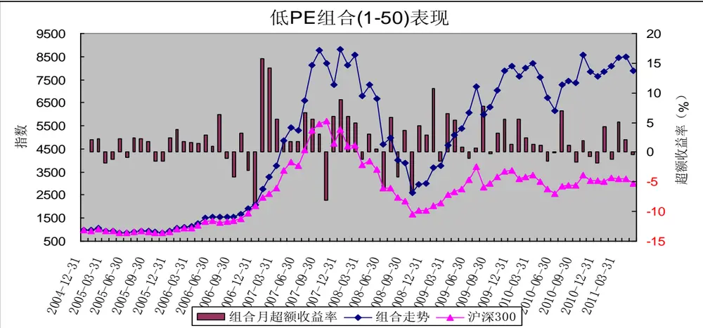
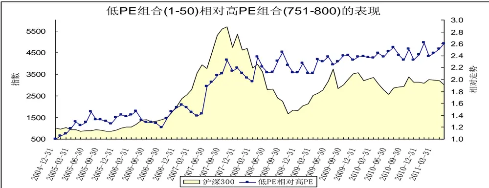
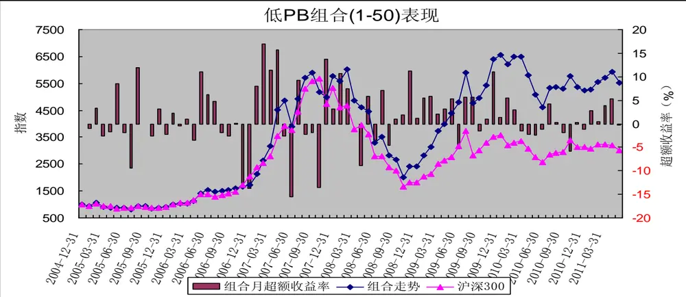
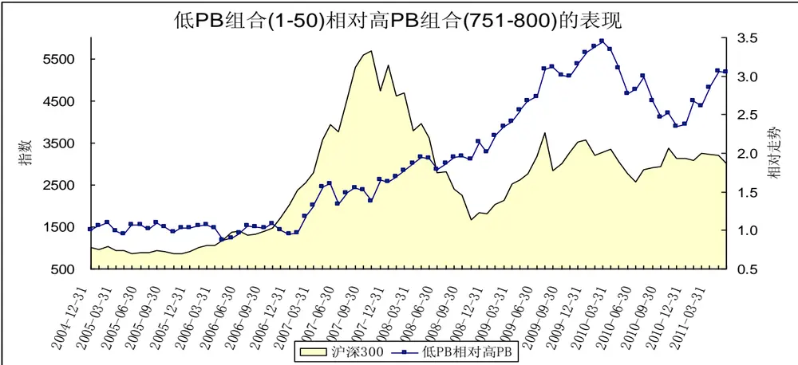
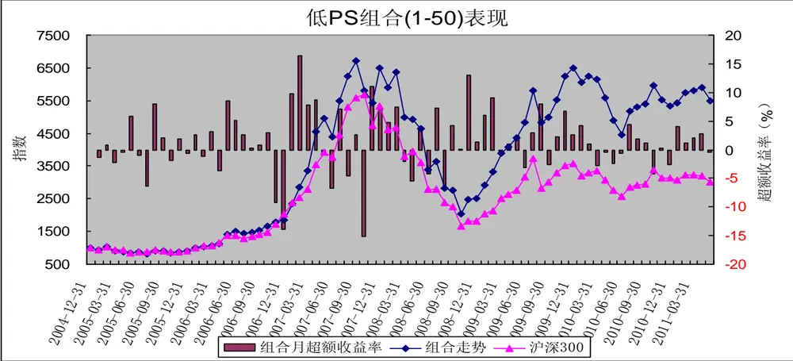
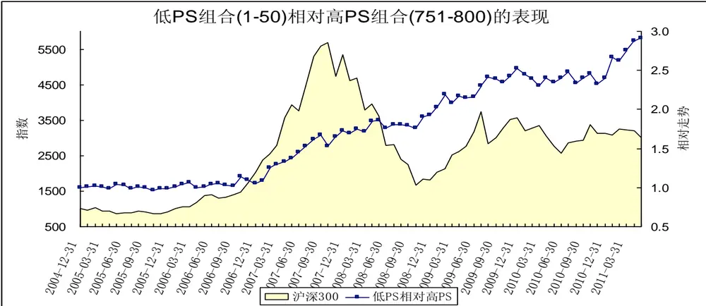
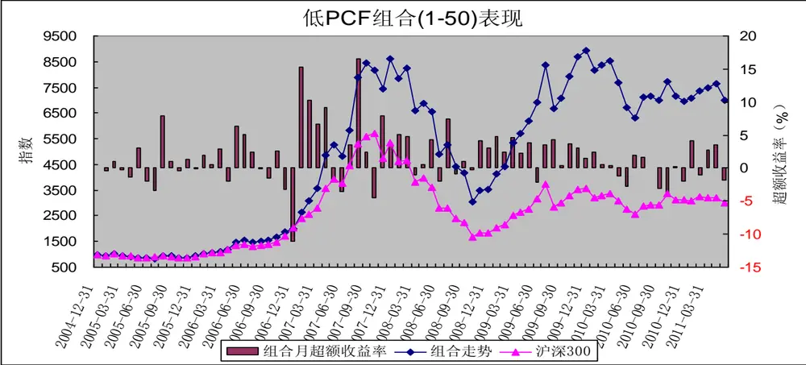
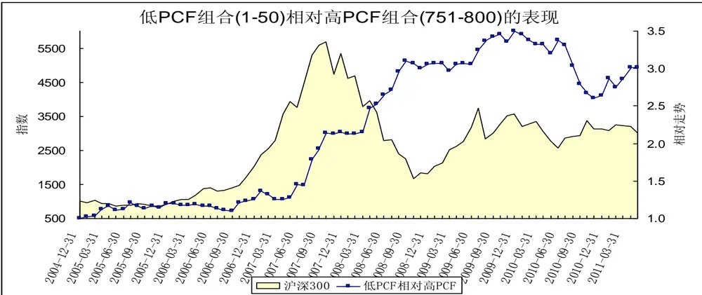
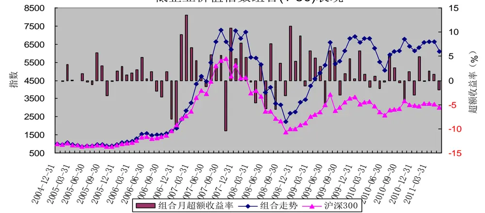
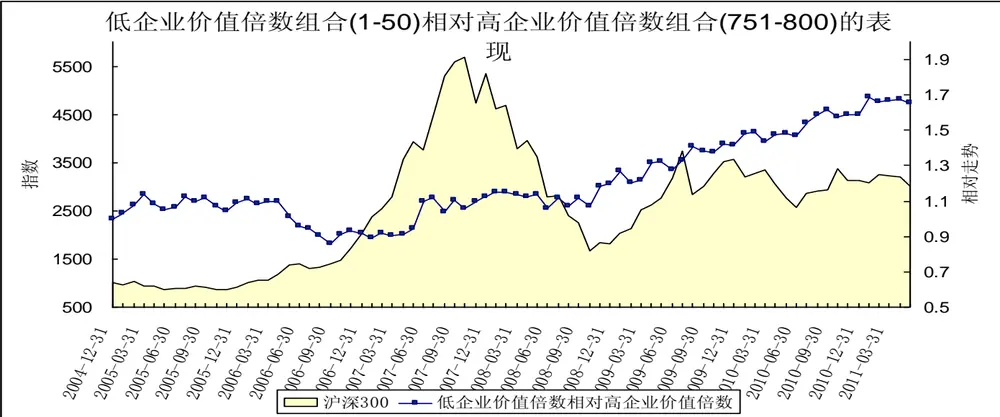

# 估值因子分析－－数量化选股策略之五

[table_research]研究员：魏刚

执业证书编号：S0570510120042

电话：025-83290914(办公室)

E-mail： weigang@mail.htsc.com.cn

地址：南京市中山东路 90 号

## 相关研究

e_relate] 1、《数量化选股策略之一：基于沪深 300 指数成份股的动量反转策略》2010-05-10

2、《数量化选股策略之二：从股东结构的变化选股》 2011-04-20

3、《数量化选股策略之三：PB_ROE 策略》，2011-05-20

4、《数量化选股策略之四：规模因子分析》，2011-06-30

## 投资要点：

影响股价走势的主要因子包括市场整体走势、估值因子、成长因子、盈利能力因子、杠杆因子、动量反转因子、交易因子、规模因子、股价因子、红利因子、股价波动因子、市场预期因子等。

在上一篇报告我们分析了规模因子的历史表现，本篇报告主要分析估值因子的历史表现。在接下来的几篇报告中，我们将逐一分析各个因子对股价的影响，以及在不同市场环境下各个因子的表现，通过不同指标的对比，筛选出能持续获得稳定正收益能力的因子，并确定备选因子；然后筛选因子组合构建多因素选股模型，寻找适合不同市场环境的选股模型。

由市盈率（TTM）最低的50只中证800指数成份股构造的等权重组合大幅跑赢沪深300指数，2005年1月至211年5月间的累计收益率高达689.98%，年化收益率达38.02%；而同期沪深300指数的累计收益率为200.16%，年化收益率为18.69%。

由市净率最低的50只中证800指数成份股构造的等权重组合跑赢沪深300指数，2005年1月至211年5月间的累计收益率为452.54%，年化收益率为30.54%；而同期沪深300指数的累计收益率为200.16%，年化收益率为18.69%。

由市销率最低的50只中证800指数成份股构造的等权重组合跑赢沪深300指数，2005年1月至211年5月间的累计收益率为448.30%，年化收益率为30.68%；而同期沪深300指数的累计收益率为200.16%，年化收益率为18.69%。

由市现率最低的50只中证800指数成份股构造的等权重组合大幅跑赢沪深300指数，2005年1月至211年5月间的累计收益率高达600.07%，年化收益率达35.45%；而同期沪深300指数的累计收益率为200.16%，年化收益率为18.69%。

由企业价值倍数最低的50只中证800指数成份股构造的等权重组合跑赢沪深300指数，2005年1月至211年5月间的累计收益率为508.22%，年化收益率为32.51%；而同期沪深300指数的累计收益率为200.16%，年化收益率为18.69%。

通过对2005年以来市场的分析，整体上来说，从市盈率、市净率、市销率、市现率、企业价值倍数等估值指标看，估值较低的股票组合表现较好。估值较低股票构造的组合整体上超越沪深300指数，也优于估值较高股票构造的组合。

估值因子（市盈率、市净率、市销率、市现率、企业价值倍数）是影响股票收益的重要因子，其中市盈率（PE,TTM）因子最为显著，其次是市现率（PCF,TTM）。

影响股价走势的主要因子包括市场整体走势（市场因子，系统性风险）、估值因子（市盈率、市净率、市销率、市现率、企业价值倍数、PEG等）、成长因子（营业收入增长率、营业利润增长率、净利润增长率、每股收益增长率、净资产增长率、股东权益增长率、经营活动产生的现金流量金额增长率等）、盈利能力因子（销售净利率、毛利率、净资产收益率、资产收益率、营业费用比例、财务费用比例、息税前利润与营业总收入比等）、杠杆因子（负债权益比、资产负债率等）、动量反转因子（前期涨跌幅等）、交易因子（前期换手率、量比等）、规模因子（流通市值、总市值、自由流通市值、流通股本、总股本等）、股价因子（股票价格）、红利因子（股息率、股息支付率）、股价波动因子（前期股价振幅、日收益率标准差等）、市场预期因子（预测净利润增长率、预测主营业务增长率、盈利预测调整等）。

在接下来的几篇报告中，我们将逐一分析各个因子对股价的影响，以及在不同市场环境下各个因子的表现，通过不同指标的对比，筛选出能持续获得稳定正收益能力的因子，并确定备选因子；然后筛选因子组合构建多因素选股模型，寻找适合不同市场环境的选股模型。本报告为因子分析的第二篇，主要分析估值因子（市盈率、市净率、市销率、市现率、企业价值倍数等）的历史表现。

## 一、前言

比较常用的因子回报度量方法有：横截面回归法和排序打分法。横截面回归法利用因子的取值（风险暴露）与下期股票收益率之间的线性关系，以最小二乘法拟合出的回归系数定义为因子回报。FF 排序打分法原型是由Fama 和 French提出，通过对因子暴露进行排序，排名靠前的股票组合减去排名靠后的股票组合下一期的平均收益率定义为因子回报，他们提出的排序法已经被发采用。我们采用排序法对各因子进行分析。

（1）我们的研究范围为中证 800指数成份股；

（2）研究期间为2005年1 月至2011年5 月；

（3）组合调整周期为月，每月最后一个交易日收盘后构建下一期的组合；

（4） 我们按各指标排序，把 800 只成份股分成：（1-50）、（1-100）、（101-200）、（201-300）、（301-400）、（401-500）、（501-600）、（601-700）、（701-800）、（（751-800）等 10 个组合；

（5）组合构建时股票的买入卖出价格为组合调整日收盘价；

（6）组合构建时为等权重；

（7）在持有期内，若某只成份股被调出中证 800指数，不对组合进行调整；

（8）组合构建时，买卖冲击成本均为0.1%、买卖佣金均为 0.1%，印花税为0.1%。

（9）我们考虑的估值指标主要有：市盈率（TTM）、市净率（上年年报）、市销率（TTM）、市现率（TTM）、企业价值倍数（EV2／EBITDA）。在依据各估值指标排序时，若估值指标为负，则认为该指标无穷大。

## 二、市盈率（PE,TTM）

表 1 市盈率（TTM）从低到高排序处于各区间的组合表现

| 市盈率从低到高排序 | 2005年1月2011年5月收益 | 年化收益率 | 跑赢沪深300指数次数 | 跑赢概率 |
| --- | --- | --- | --- | --- |
| 沪深300指数 | 200.16% | 18.69% |  |  |
| 1-50 | 689.98% | 38.02% | 53 | 68.83% |
| 1-100 | 594.14% | 35.27% | 54 | 70.13% |
| 101-200 | 575.34% | 34.69% | 50 | 64.94% |
| 201-300 | 357.59% | 26.76% | 46 | 59.74% |
| 301-400 | 272.75% | 22.77% | 48 | 62.34% |
| 401-500 | 227.39% | 20.31% | 43 | 55.84% |
| 501-600 | 131.02% | 13.95% | 44 | 57.14% |
| 601-700 | 116.82% | 12.82% | 44 | 57.14% |
| 701-800 | 194.67% | 18.35% | 42 | 54.55% |
| 751-800 | 203.78% | 18.92% | 44 | 57.14% |

数据来源：wind资讯，华泰证券研究所

由上表可知，从2005年至今的区间累计收益看，整体上说，市盈率越低，表现越好。市盈率较低股票构成的组合（1-50）、组合（1-100）、组合（101-200）表现较好，而市盈率排名处于中游的股票构建的组合（201-300）、组合（301-400）、组合（401-500）的表现差异不大，略好与沪深300指数；市盈率较高股票构成的组合（701-800）、组合（751-800）的表现基本上与沪深300指数差不多；表现最差的为组合（501-600）、组合（601-700），大幅落后于沪深300指数。

由市盈率最低的50只中证800指数成份股构造的等权重组合大幅跑赢沪深300指数，2005年1月至211年5月间的累计收益率高达689.98%，年化收益率达38.02%；而同期沪深300指数的累计收益率为200.16%，年化收益率为18.69%。

表2 市盈率从低到高排序处于各区间的组合的绩效分析

| 市盈率从低到高排序 | alpha | beta | sharpe | treynor | jensen | 跟踪误差 | 信息比率 | T检验的p 值 |
| --- | --- | --- | --- | --- | --- | --- | --- | --- |
| 1-50 | 1.7921 | 1.0978 | 0.3224 | 3.6361 | 1.7923 | 0.0469 | 1.3572 | 0.000 |
| 1-100 | 1.6118 | 1.0924 | 0.3093 | 3.4792 | 1.6121 | 0.0449 | 1.1407 | 0.000 |
| 101-200 | 1.6370 | 1.0236 | 0.3165 | 3.6028 | 1.6371 | 0.0448 | 1.0866 | 0.001 |
| 201-300 | 1.2168 | 0.9371 | 0.2836 | 3.3018 | 1.2166 | 0.0461 | 0.4437 | 0.037 |
| 301-400 | 0.9704 | 0.9212 | 0.2581 | 3.0567 | 0.9702 | 0.0492 | 0.1915 | 0.149 |
| 401-500 | 0.7930 | 0.9383 | 0.2394 | 2.8485 | 0.7928 | 0.0508 | 0.0697 | 0.250 |
| 501-600 | 0.3453 | 0.9504 | 0.1952 | 2.3667 | 0.3451 | 0.0553 | -0.1622 | 0.700 |
| 601-700 | 0.2519 | 1.0132 | 0.1819 | 2.2522 | 0.2519 | 0.0639 | -0.1692 | 0.705 |
| 701-800 | 0.7005 | 1.0377 | 0.2098 | 2.6787 | 0.7006 | 0.0735 | -0.0097 | 0.358 |
| 751-800 | 0.7536 | 1.0427 | 0.2113 | 2.7263 | 0.7537 | 0.0763 | 0.0062 | 0.338 |

数据来源：wind资讯，华泰证券研究所

从各组合的绩效指标看，低市盈率股票组合的表现也大大好于高市盈率股票组合，组合（1-50）、组合（1-100）、组合（101-200）的alpha值均为正，其月超额收益率在1%的显著水平下显著为正，信息比率也分别达1.3572、1.1407和1.0866。

图1 低市盈率股票组合表现
数据来源：wind资讯，华泰证券研究所

2005年以来，低市盈率股票组合（1-50）整体上跑赢沪深300指数，在大多数月份里的超额收益率为正；特别是2008年11月以来，低市盈率股票组合（1-50）明显好于沪深300指数。低市盈率股票组合（1-50）大幅跑输沪深300指数主要在2006年8月至2006年12月（牛市中期，冲向300点，大盘蓝筹股行情，沪深300指数大幅上涨）、2007年10月（大牛市见顶）、2008年6月至2008年10月（熊市后半段，市场进入疯狂下跌阶段，个股大幅下挫）。

图2 低市盈率组合相对高市盈率组合的表现
数据来源：wind资讯，华泰证券研究所

2005年以来，低市盈率组合整体上跑赢高市盈率组合。低市盈率组合跑赢高市盈率组合主要集中2005年至2007年间的这轮大牛市中；而在其他时间段（特别是2008年以来），低市盈率组合的表现并没有显著超越高市盈率组合。

## 三、市净率

表3 市净率（上年年报）从低到高排序处于各区间的组合表现

| 市净率从低到高排序 | 2005年1月2011年5月收益 | 年化收益率 | 跑赢沪深300指数次数 | 跑赢概率 |
| --- | --- | --- | --- | --- |
| 沪深300指数 | 200.16% | 18.69% |  |  |
| 1-50 | 452.54% | 30.54% | 44 | 57.14% |
| 1-100 | 423.63% | 29.45% | 46 | 59.74% |
| 101-200 | 356.67% | 26.72% | 45 | 58.44% |
| 201-300 | 411.85% | 28.99% | 44 | 57.14% |
| 301-400 | 355.17% | 26.65% | 48 | 62.34% |
| 401-500 | 287.72% | 23.53% | 45 | 58.44% |
| 501-600 | 197.51% | 18.53% | 46 | 59.74% |
| 601-700 | 194.90% | 18.37% | 41 | 53.25% |
| 701-800 | 118.40% | 12.95% | 40 | 51.95% |
| 751-800 | 81.05% | 9.70% | 36 | 46.75% |

数据来源：wind资讯，华泰证券研究所

由上表可知，从2005年至今的区间累计收益看，整体上说，市净率越低，表现越好。市净率较低股票构成的组合（1-50）、组合（1-100）、组合（101-200）、组合（201-300）、组合（301-400）表现较好；而市净率较高的组合（401-500）、组合（501-600）、组合（601-700）的表现差异不大，略好与沪深300指数；市净率较高股票构成的组合（701-800）、组合（751-800）的表现较差，大幅落后于沪深300指数。

由市净率最低的50只中证800指数成份股构造的等权重组合跑赢沪深300指数，2005年1月至211年5月间的累计收益率为452.54%，年化收益率为30.54%，而同期沪深300指数的累计收益率为200.16%，年化收益率为18.69%。

表4 市净率从低到高排序处于各区间的组合的绩效分析

| 市净率从低到高排序 | alpha | beta | sharpe | treynor | jensen | 跟踪误差 | 信息比率 | T检验的p值 |
| --- | --- | --- | --- | --- | --- | --- | --- | --- |
| 1-50 | 1.4617 | 1.0291 | 0.2776 | 3.4239 | 1.4617 | 0.0659 | 0.4976 | 0.0421 |
| 1-100 | 1.3848 | 1.0306 | 0.2722 | 3.3472 | 1.3849 | 0.0651 | 0.4461 | 0.0505 |
| 101-200 | 1.2060 | 1.0124 | 0.2626 | 3.1948 | 1.2060 | 0.0608 | 0.3341 | 0.0756 |
| 201-300 | 1.3264 | 1.0288 | 0.2747 | 3.2929 | 1.3265 | 0.0584 | 0.4707 | 0.0367 |
| 301-400 | 1.2083 | 0.9690 | 0.2723 | 3.2504 | 1.2082 | 0.0537 | 0.3752 | 0.0604 |
| 401-500 | 0.9396 | 1.0177 | 0.2501 | 2.9269 | 0.9397 | 0.0506 | 0.2249 | 0.0907 |
| 501-600 | 0.6218 | 0.9816 | 0.2264 | 2.6369 | 0.6217 | 0.0469 | -0.0073 | 0.2764 |
| 601-700 | 0.6186 | 0.9639 | 0.2274 | 2.6452 | 0.6185 | 0.0458 | -0.0149 | 0.2982 |
| 701-800 | 0.2674 | 0.9086 | 0.1970 | 2.2976 | 0.2672 | 0.0444 | -0.2393 | 0.8691 |
| 751-800 | 0.0894 | 0.8663 | 0.1742 | 2.1063 | 0.0891 | 0.0516 | -0.2997 | 0.7634 |

数据来源：wind资讯，华泰证券研究所

从各组合的绩效指标看，低市净率股票组合的表现也大大好于高市净率股票组合，组合（1-50）、组合（1-100）、组合（101-200）的alpha值均为正，其月超额收益率在10%的显著水平下显著为正。

图3 低市净率股票组合表现
数据来源：wind资讯，华泰证券研究所

2005年以来，低市净率股票组合（1-50）整体上跑赢沪深300指数；2005年至2008年10月底市净率组合的走势与沪深300指数基本一致，并没有显著超越沪深300指数；但是2008年11月以来，低市净率股票组合（1-50）明显好于沪深300指数。

图4 低市净率组合相对高市净率组合的表现
数据来源：wind资讯，华泰证券研究所

2005年以来，低市净率组合整体上跑赢高市净率组合。低市净率组合跑赢高市净率组合主要集中2007年至2009年间；低市净率组合在2010年2月至2010年10月间大幅跑输高市净率组合，这段时间A股市场的行情主要由市净率较高的成长股主导。

## 四、市销率（PS,TTM）

表 5 市销率（TTM）从低到高排序处于各区间的组合表现

| 市销率从低到高排序 | 2005年1月2011年5月收益 | 年化收益率 | 跑赢沪深300指数次数 | 跑赢概率 |
| --- | --- | --- | --- | --- |
| 沪深300指数 | 200.16% | 18.69% |  |  |
| 1-50 | 448.30% | 30.38% | 48 | 62.34% |
| 1-100 | 435.02% | 29.89% | 49 | 63.64% |
| 101-200 | 446.41% | 30.31% | 49 | 63.64% |
| 201-300 | 370.29% | 27.30% | 45 | 58.44% |
| 301-400 | 318.51% | 25.01% | 45 | 58.44% |
| 401-500 | 256.88% | 21.94% | 44 | 57.14% |
| 501-600 | 292.24% | 23.75% | 44 | 57.14% |
| 601-700 | 177.70% | 17.26% | 43 | 55.84% |
| 701-800 | 95.45% | 11.01% | 41 | 53.25% |
| 751-800 | 88.49% | 10.39% | 43 | 55.84% |

数据来源：wind资讯，华泰证券研究所

由上表可知，从2005年至今的区间累计收益看，整体上说，市销率越低，表现越好。市销率较低股票构成的组合（1-50）、组合（1-100）、组合（101-200）表现较好，而市销率排名处于中游的股票构建的组合（201-300）、组合（301-400）、组合（401-500）、组合（501-600）、组合（601-700）的表现差异不大，略好与沪深300指数；市销率较高股票构成的组合（701-800）、组合（751-800）的表现较差，大大落后于沪深300指数。

由市销率最低的50只中证800指数成份股构造的等权重组合跑赢沪深300指数，2005年1月至211年5月间的累计收益率为448.30%，年化收益率为30.68%，而同期沪深300指数的累计收益率为200.16%，年化收益率为18.69%。

表6 市销率从低到高排序处于各区间的组合的绩效分析

| 市销率从低到高排序 | alpha | beta | sharpe | treynor | jensen | 跟踪误差 | 信息比率 | T 检验的p 值 |
| --- | --- | --- | --- | --- | --- | --- | --- | --- |
| 1-50 | 1.4072 | 1.0300 | 0.2839 | 3.3698 | 1.4073 | 0.0561 | 0.5746 | 0.021 |
| 1-100 | 1.3774 | 1.0206 | 0.2838 | 3.3533 | 1.3775 | 0.0543 | 0.5620 | 0.021 |
| 101-200 | 1.4225 | 1.0149 | 0.2850 | 3.4053 | 1.4225 | 0.0570 | 0.5615 | 0.024 |
| 201-300 | 1.2193 | 1.0361 | 0.2658 | 3.1805 | 1.2194 | 0.0582 | 0.3799 | 0.051 |
| 301-400 | 1.0665 | 0.9980 | 0.2599 | 3.0722 | 1.0665 | 0.0524 | 0.2933 | 0.075 |
| 401-500 | 0.8562 | 0.9877 | 0.2441 | 2.8704 | 0.8562 | 0.0501 | 0.1470 | 0.146 |
| 501-600 | 0.9732 | 0.9864 | 0.2555 | 2.9901 | 0.9732 | 0.0490 | 0.2442 | 0.090 |
| 601-700 | 0.5612 | 0.9279 | 0.2236 | 2.6082 | 0.5610 | 0.0451 | -0.0646 | 0.422 |
| 701-800 | 0.0736 | 0.9413 | 0.1807 | 2.0815 | 0.0734 | 0.0420 | -0.3238 | 0.927 |
| 751-800 | 0.0193 | 0.9610 | 0.1741 | 2.0235 | 0.0192 | 0.0451 | -0.3215 | 0.910 |

数据来源：wind资讯，华泰证券研究所

从各组合的绩效指标看，低市销率股票组合的表现也大大好于高市销率股票组合，组合（1-50）、组合（1-100）、组合（101-200）的alpha值均为正，其月超额收益率在5%的显著水平下显著为正。

图5 低市销率股票组合表现
数据来源：wind资讯，华泰证券研究所

2005年以来，低市销率股票组合（1-50）整体上跑赢沪深300指数；2005年至2008年10月低市销率组合的走势与沪深300指数基本一致，并没有显著超越沪深300指数；但是2008年11月以来，低市销率股票组合（1-50）明显好于沪深300指数。

图6 低市销率组合相对高市销率组合的表现

数据来源：wind资讯，华泰证券研究所

2007年以来，低市销率组合整体上跑赢高市销率组合。

## 五、市现率（PCF,TTM）

表7 市现率（TTM，经营性现金流）从低到高排序处于各区间的组合表现

| 市现率从低到高排序 | 2005年1月2011年5月收益 | 年化收益率 | 跑赢沪深300指数次数 | 跑赢概率 |
| --- | --- | --- | --- | --- |
| 沪深300指数 | 200.16% | 18.69% |  |  |
| 1-50 | 600.07% | 35.45% | 50 | 64.94% |
| 1-100 | 522.67% | 33.00% | 52 | 67.53% |
| 101-200 | 357.49% | 26.75% | 44 | 57.14% |
| 201-300 | 348.41% | 26.36% | 43 | 55.84% |
| 301-400 | 300.40% | 24.15% | 48 | 62.34% |
| 401-500 | 238.35% | 20.93% | 43 | 55.84% |
| 501-600 | 157.01% | 15.86% | 42 | 54.55% |
| 601-700 | 258.36% | 22.02% | 44 | 57.14% |
| 701-800 | 171.64% | 16.86% | 44 | 57.14% |
| 751-800 | 132.61% | 14.07% | 42 | 54.55% |

数据来源：wind资讯，华泰证券研究所

由上表可知，从2005年至今的区间累计收益看，整体上说，市现率越低，表现越好。市现率较低股票构成的组合（1-50）、组合（1-100）表现较好,大幅超越沪深300指数；市现率较高股票构成的组合（701-800）、组合（751-800）表现较差，落后于沪深300指数。

由市现率最低的50只中证800指数成份股构造的等权重组合大幅跑赢沪深300指数，2005年1月至211年5月间的累计收益率高达600.07%，年化收益率达35.45%，而同期沪深300指数的累计收益率为200.16%，年化收益率为18.69%。

表8 市现率从低到高排序处于各区间的组合的绩效分析

| 市现率从低到高排序 | alpha | beta | sharpe | treynor | jensen | 跟踪误差 | 信息比率 | T检验的p值 |
| --- | --- | --- | --- | --- | --- | --- | --- | --- |
| 1-50 | 1.6201 | 1.0761 | 0.3106 | 3.5092 | 1.6203 | 0.0453 | 1.1453 | 0.000 |
| 1-100 | 1.4927 | 1.0547 | 0.3014 | 3.4190 | 1.4928 | 0.0449 | 0.9320 | 0.001 |
| 101-200 | 1.1804 | 0.9877 | 0.2736 | 3.1986 | 1.1804 | 0.0492 | 0.4157 | 0.038 |
| 201-300 | 1.1710 | 0.9701 | 0.2734 | 3.2105 | 1.1709 | 0.0495 | 0.3892 | 0.048 |
| 301-400 | 1.0452 | 0.9566 | 0.2603 | 3.0961 | 1.0451 | 0.0518 | 0.2512 | 0.105 |
| 401-500 | 0.8502 | 0.9332 | 0.2429 | 2.9143 | 0.8500 | 0.0526 | 0.0944 | 0.234 |
| 501-600 | 0.4683 | 0.9559 | 0.2084 | 2.4933 | 0.4682 | 0.0525 | -0.1068 | 0.529 |
| 601-700 | 0.8395 | 1.0256 | 0.2384 | 2.8221 | 0.8396 | 0.0539 | 0.1403 | 0.148 |
| 701-800 | 0.5029 | 1.0296 | 0.2076 | 2.4920 | 0.5030 | 0.0574 | -0.0645 | 0.394 |
| 751-800 | 0.2893 | 1.0551 | 0.1890 | 2.2779 | 0.2895 | 0.0600 | -0.1462 | 0.562 |

数据来源：wind资讯，华泰证券研究所

从各组合的绩效指标看，低市现率股票组合的表现也大大好于高市现率股票组合，组合（1-50）、组合（1-100）的alpha值均为正，其月超额收益率在1%的显著水平下显著为正，信息比率也分别达1.1453和0.9320。

图7 低市现率股票组合表现
数据来源：wind资讯，华泰证券研究所

2005年以来，低市现率股票组合（1-50）整体上跑赢沪深300指数。低市现率股票组合（1-50）大幅跑赢沪深300指数主要在2009年12月以前；而2010年以来，低市现率股票组合（1-50）并没有显著超越沪深300指数。

图8 低市现率组合相对高市现率组合的表现
数据来源：wind资讯，华泰证券研究所

2005年以来，低市现率组合整体上跑赢高市现率组合。低市现率组合跑赢高市现率组合主要集中2005年至2009年间；而2010年以来，低市现率组合的表现落后于高市现率组合。

## 六、企业价值倍数（EV2／EBITDA）

表9 企业价值倍数（EV2／EBITDA）从低到高排序处于各区间的组合表现

| 企业价值倍数从低到高排序 | 2005年1月2011年5月收益 | 年化收益率 | 跑赢沪深300指数次数 | 跑赢概率 |
| --- | --- | --- | --- | --- |
| 沪深300指数 | 200.16% | 18.69% |  |  |
| 1-50 | 508.22% | 32.51% | 49 | 63.64% |
| 1-100 | 429.71% | 29.68% | 49 | 63.64% |
| 101-200 | 451.02% | 30.48% | 47 | 61.04% |
| 201-300 | 368.41% | 27.22% | 46 | 59.74% |
| 301-400 | 330.49% | 25.56% | 44 | 57.14% |
| 401-500 | 211.86% | 19.40% | 44 | 57.14% |
| 501-600 | 206.27% | 19.07% | 40 | 51.95% |
| 601-700 | 166.66% | 16.52% | 45 | 58.44% |
| 701-800 | 187.31% | 17.89% | 44 | 57.14% |
| 751-800 | 266.82% | 22.46% | 47 | 61.04% |

数据来源：wind资讯，华泰证券研究所

由上表可知，从2005年至今的区间累计收益看，整体上说，企业价值倍数越低，表现越好。企业价值倍数较低股票构成的组合（1-50）、组合（1-100）、组合（101-200）表现较好；表现最差的为组合（601-700）、组合（701-800），大幅落后于沪深300指数；而企业价值倍数最高的组合（751-800）的表现略好于沪深300指数，主要是由于金融类公司的企业价值倍数位于该区间内。

由企业价值倍数最低的50只中证800指数成份股构造的等权重组合跑赢沪深300指数，2005年1月至211年5月间的累计收益率为508.22%，年化收益率为32.51%，而同期沪深300指数的累计收益率为200.16%，年化收益率为18.69%。

表10 企业价值倍数从低到高排序处于各区间的组合的绩效分析

| 企业价值倍数从低到高排序 | alpha | beta | sharpe | treynor | jensen | 跟踪误差 | 信息比率 | T检验的p 值 |
| --- | --- | --- | --- | --- | --- | --- | --- | --- |
| 1-50 | 1.4946 | 1.0480 | 0.2987 | 3.4298 | 1.4947 | 0.0482 | 0.8304 | 0.003 |
| 1-100 | 1.3092 | 1.0420 | 0.2848 | 3.2601 | 1.3093 | 0.0463 | 0.6436 | 0.007 |
| 101-200 | 1.4082 | 1.0216 | 0.2874 | 3.3820 | 1.4082 | 0.0534 | 0.6104 | 0.016 |
| 201-300 | 1.2184 | 0.9941 | 0.2738 | 3.2291 | 1.2184 | 0.0519 | 0.4208 | 0.041 |
| 301-400 | 1.1397 | 0.9514 | 0.2702 | 3.2014 | 1.1396 | 0.0508 | 0.3331 | 0.072 |
| 401-500 | 0.7411 | 0.9418 | 0.2314 | 2.7903 | 0.7409 | 0.0540 | 0.0281 | 0.314 |
| 501-600 | 0.6865 | 0.9685 | 0.2272 | 2.7122 | 0.6864 | 0.0528 | 0.0150 | 0.303 |
| 601-700 | 0.5096 | 0.9735 | 0.2104 | 2.5269 | 0.5095 | 0.0544 | -0.0800 | 0.465 |
| 701-800 | 0.5389 | 1.0205 | 0.2167 | 2.5317 | 0.5390 | 0.0496 | -0.0337 | 0.307 |
| 751-800 | 0.8020 | 1.0620 | 0.2399 | 2.7589 | 0.8022 | 0.0477 | 0.1815 | 0.089 |

数据来源：wind资讯，华泰证券研究所

从各组合的绩效指标看，低企业价值倍数股票组合的表现也大大好于高企业价值倍数股票组合，组合（1-50）、组合（1-100）、组合（101-200）的alpha值均为正，其月超额收益率在5%的显著水平下显著为正。

低企业价值倍数组合(1-50)表现

图9 低企业价值倍数股票组合表现
数据来源：wind资讯，华泰证券研究所

2005年以来，低企业价值倍数股票组合（1-50）整体上跑赢沪深300指数；2005年至2008年10月低企业价值倍数组合的走势与沪深300指数基本一致，并没有显著超越沪深300指数；但是2008年11月以来，低企业价值倍数股票组合（1-50）明显好于沪深300指数。

图10 低企业价值倍数组合相对高企业价值倍数组合的表现
数据来源：wind资讯，华泰证券研究所

2005年以来，低企业价值倍数组合整体上跑赢高企业价值倍数组合，但跑赢幅度非常有限。

## 七、结论

通过对2005年以来市场的分析，整体上来说，从市盈率、市净率、市销率、市现率、企业价值倍数等估值指标看，估值较低的股票组合表现较好。估值较低股票构造的组合整体上超越沪深300指数，也优于估值较高股票构造的组合。

估值因子（市盈率、市净率、市销率、市现率、企业价值倍数）是影响股票收益的重要因子，其中市盈率（PE,TTM）因子最为显著，其次是市现率（PCF,TTM）。

## 免责条款：

本报告的信息均来源于公开资料，本公司对这些信息的准确性、完整性或可靠性不作任何保证，也不保证所包含的信息和建议不会发生任何变更。本公司力求报告内容的客观、公正，但文中的观点、结论和建议仅供参考，不构成所述证券的买卖出价或征价，投资者据此做出的任何投资决策与本公司和作者无关。本公司及作者在自身所知情的范围内，与本报告中所评价或推荐的证券没有利害关系。在法律许可的情况下，本公司及其所属关联机构可能会持有报告中提到的公司所发行的证券头寸并进行交易，也可能为这些公司提供或者争取提供投资银行、财务顾问或者金融产品等相关服务。

报告版权仅为本公司所有，未经书面许可，任何机构和个人不得以任何形式翻版、复制、发表或引用。如征得本公司同意进行引用、刊发的，需在允许的范围内使用，并注明出处为“华泰证券研究所”，且不得对本报告进行任何有悖原意的引用、删节和修改。

本公司具有中国证监会核准的“证券投资咨询”业务资格，经营许可证编号为：Z23032000。