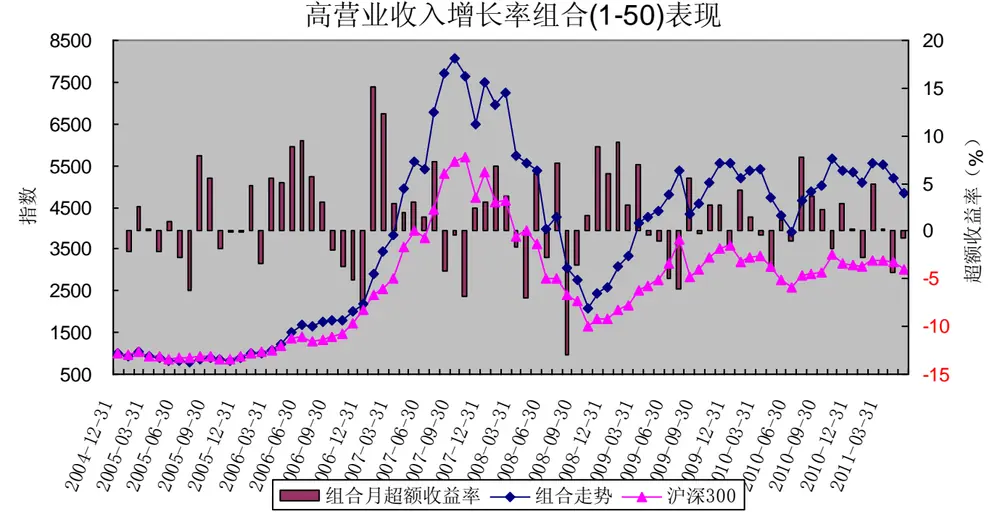
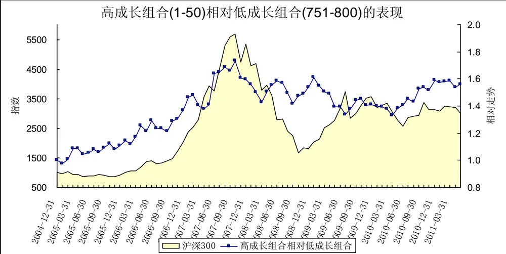
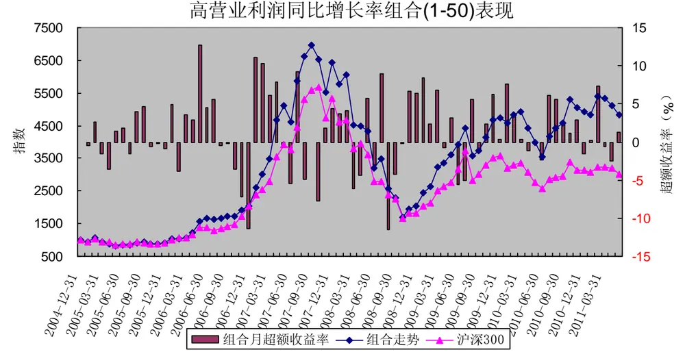
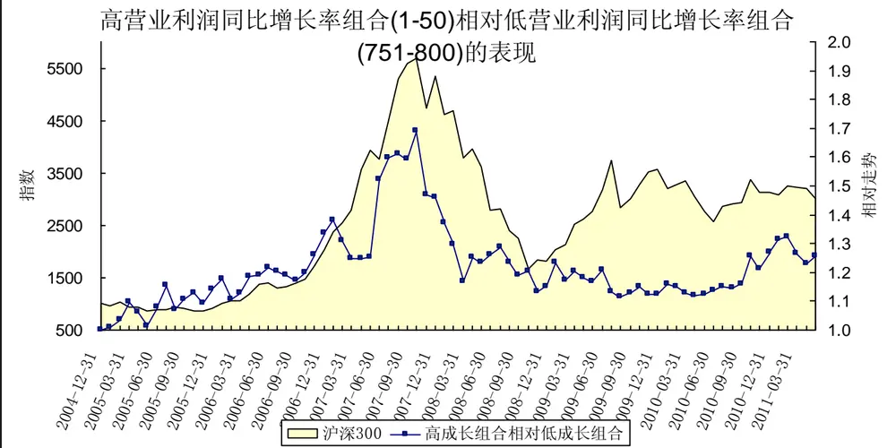
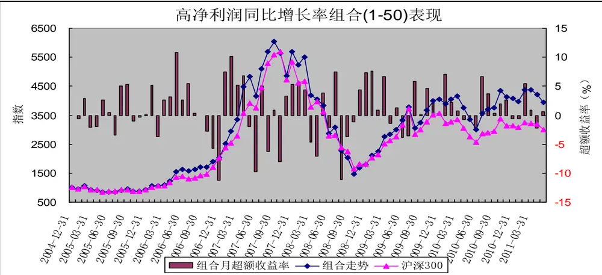
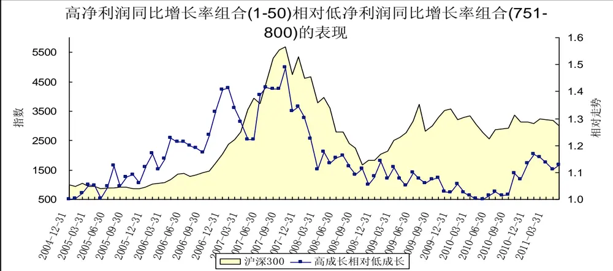
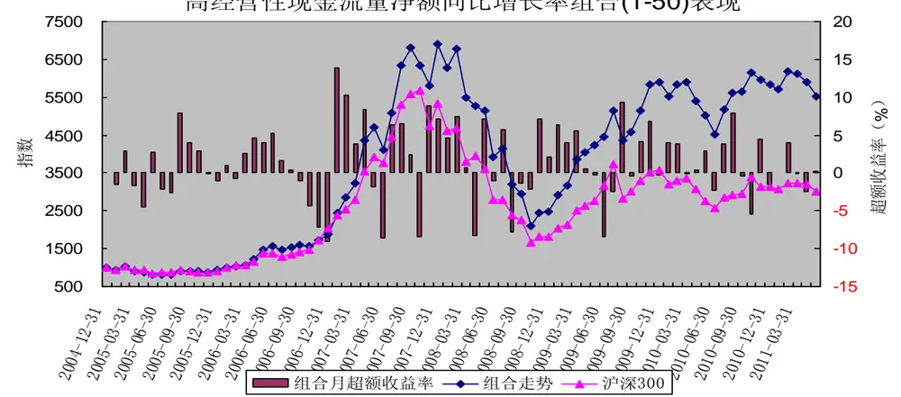
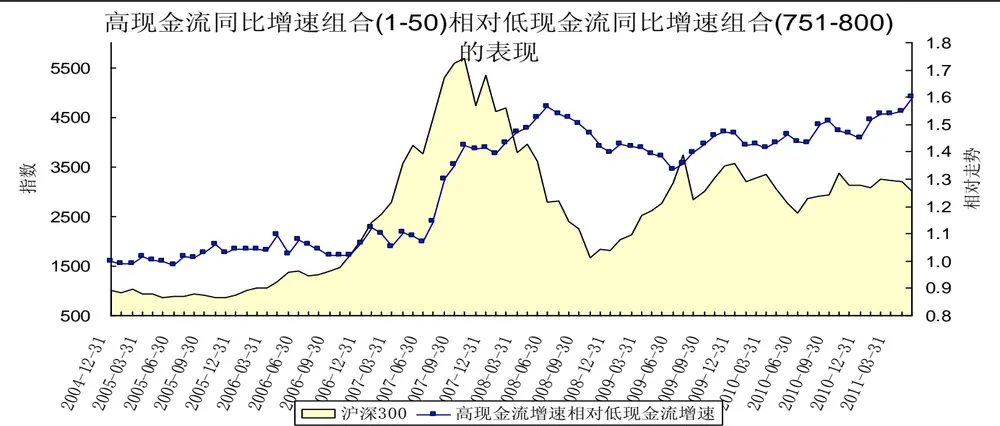

# 成长因子分析－－数量化选股策略之六

[table_research]研究员：魏刚

执业证书编号：S0570510120042

电话：025-83290914(办公室)

E-mail： weigang@mail.htsc.com.cn

地址：南京市中山东路 90 号

## 相关研究

e_relate] 1、《数量化选股策略之四：规模因子分析》，2011-06-30

2、《数量化选股策略之五：估值因子分析》，2011-07-06

## 投资要点：

影响股价走势的主要因子包括市场整体走势、估值因子、成长因子、盈利能力因子、杠杆因子、动量反转因子、交易因子、规模因子、股价因子、红利因子、股价波动因子、市场预期因子等。

在接下来的几篇报告中，我们将逐一分析各个因子对股价的影响，以及在不同市场环境下各个因子的表现，通过不同指标的对比，筛选出能持续获得稳定正收益能力的因子，并确定备选因子；然后筛选因子组合构建多因素选股模型，寻找适合不同市场环境的选股模型。在前面两篇报告中我们对规模因子和估值因子进行了分析，本报告主要分析成长因子（营业收入同比增长率、营业利润同比增长率、归属母公司的净利润同比增长率（扣除非经常性损益）、经营活动产生的现金流量净额同比增长率等）的历史表现。

由营业收入同比增长率最高的50只中证800指数成份股构造的等权重组合小幅跑赢沪深300指数，2005年1月至2011年5月间的累计收益率为383.89%，年化收益率为27.87%；同期沪深300指数的累计收益率为200.16%，年化收益率为18.69%。

由营业利润同比增长率最高的50只中证800指数成份股构造的等权重组合小幅跑赢沪深300指数，2005年1月至2011年5月间的累计收益率为384.70%，年化收益率为27.90%。

由归属母公司的净利润同比增长率最高的50只中证800指数成份股构造的等权重组合略微跑赢沪深300指数，2005年1月至2011年5月间的累计收益率为295.70%，年化收益率为23.92%。

由经营活动产生的现金流量净额同比增长率最高的50只中证800指数成份股构造的等权重组合跑赢沪深300指数，2005年1月至2011年5月间的累计收益率为453.33%，年化收益率为30.57%。

通过对2005年以来市场的分析，整体上来说，我国市场上存在较为显著的成长股效应，从营业收入同比增长率、营业利润同比增长率、归属母公司的净利润同比增长率（扣除非经常性损益）、经营活动产生的现金流量净额同比增长率等成长性指标看，成长性较高的股票组合表现较好。

成长因子（营业收入同比增长率、营业利润同比增长率、归属母公司的净利润同比增长率（扣除非经常性损益）、经营活动产生的现金流量净额同比增长率）是影响股票收益的重要因子。

影响股价走势的主要因子包括市场整体走势（市场因子，系统性风险）、估值因子（市盈率、市净率、市销率、市现率、企业价值倍数、PEG等）、成长因子（营业收入增长率、营业利润增长率、净利润增长率、每股收益增长率、净资产增长率、股东权益增长率、经营活动产生的现金流量金额增长率等）、盈利能力因子（销售净利率、毛利率、净资产收益率、资产收益率、营业费用比例、财务费用比例、息税前利润与营业总收入比等）、杠杆因子（负债权益比、资产负债率等）、动量反转因子（前期涨跌幅等）、交易因子（前期换手率、量比等）、规模因子（流通市值、总市值、自由流通市值、流通股本、总股本等）、股价因子（股票价格）、红利因子（股息率、股息支付率）、股价波动因子（前期股价振幅、日收益率标准差等）、市场预期因子（预测净利润增长率、预测主营业务增长率、盈利预测调整等）。

在接下来的几篇报告中，我们将逐一分析各个因子对股价的影响，以及在不同市场环境下各个因子的表现，通过不同指标的对比，筛选出能持续获得稳定正收益能力的因子，并确定备选因子；然后筛选因子组合构建多因素选股模型，寻找适合不同市场环境的选股模型。在前面两篇报告中我们对规模因子和估值因子进行了分析，本报告主要分析成长因子（营业收入同比增长率、营业利润同比增长率、归属母公司的净利润同比增长率（扣除非经常性损益）、经营活动产生的现金流量净额同比增长率等）的历史表现。

## 一、前言

比较常用的因子回报度量方法有：横截面回归法和排序打分法。横截面回归法利用因子的取值（风险暴露）与下期股票收益率之间的线性关系，以最小二乘法拟合出的回归系数定义为因子回报。FF 排序打分法原型是由Fama 和 French提出，通过对因子暴露进行排序，排名靠前的股票组合减去排名靠后的股票组合下一期的平均收益率定义为因子回报，他们提出的排序法已经被发采用。我们采用排序法对各因子进行分析。

（1）我们的研究范围为中证 800指数成份股；

（2）研究期间为2005年1 月至2011年5 月；

（3）组合调整周期为月，每月最后一个交易日收盘后构建下一期的组合；

（4） 我们按各指标排序，把 800 只成份股分成：（1-50）、（1-100）、（101-200）、（201-300）、（301-400）、（401-500）、（501-600）、（601-700）、（701-800）、（（751-800）等 10 个组合；

（5）组合构建时股票的买入卖出价格为组合调整日收盘价；

（6）组合构建时为等权重；

（7）在持有期内，若某只成份股被调出中证 800指数，不对组合进行调整；

（8）组合构建时，买卖冲击成本均为0.1%、买卖佣金均为 0.1%，印花税为0.1%；

（9）我们考虑的主要成长性指标有：营业收入同比增长率、营业利润同比增长率、归属母公司的净利润同比增长率（扣除非经常性损益）、经营活动产生的现金流量净额同比增长率；

（10）每年 1 月、2 月、3 月、4 月的财务数据来源于上年三季报，5 月、6 月、7 月、8 月的财务数据来源于当年一季报，9月、10月的财务数据来源于当年的半年报，11月、12 月的财务数据来源于当年的三季报。

## 二、营业收入同比增长率

表1 营业收入同比增长率由高到低排序处于各区间的组合表现

| 营业收入同比增长率由高到低排序 | 2005年1月2011年5月收益 | 年化收益率 | 跑赢沪深300指数次数 | 跑赢概率 |
| --- | --- | --- | --- | --- |
| 沪深300指数 | 200.16% | 18.69% |  |  |
| 1-50 | 383.89% | 27.87% | 44 | 57.14% |
| 1-100 | 428.02% | 29.62% | 45 | 58.44% |
| 101-200 | 279.11% | 23.09% | 41 | 53.25% |
| 201-300 | 332.03% | 25.63% | 45 | 58.44% |
| 301-400 | 340.62% | 26.01% | 47 | 61.04% |
| 401-500 | 226.15% | 20.24% | 44 | 57.14% |
| 501-600 | 211.83% | 19.40% | 46 | 59.74% |
| 601-700 | 266.80% | 22.46% | 46 | 59.74% |
| 701-800 | 202.70% | 18.85% | 44 | 57.14% |
| 751-800 | 209.87% | 19.28% | 43 | 55.84% |

数据来源：wind资讯，华泰证券研究所

由上表可知，从2005年至今的区间累计收益看，整体上说，营业收入同比增速越高，表现越好。营业收入同比增长率较高股票构成的组合（1-50）、组合（1-100）表现较好；其他组合的表现略好于沪深300指数

由营业收入同比增长率最高的50只中证800指数成份股构造的等权重组合小幅跑赢沪深300指数，2005年1月至2011年5月间的累计收益率为383.89%，年化收益率为27.87%；同期沪深300指数的累计收益率为200.16%，年化收益率为18.69%。

表2 营业收入同比增长率由高到低排序处于各区间的组合的绩效分析

| 营业收入同比增长率由高到低排序 | alpha | beta | sharpe | treynor | jensen | 跟踪误差 | 信息比率 | T检验的p 值 |
| --- | --- | --- | --- | --- | --- | --- | --- | --- |
| 1-50 | 1.2003 | 1.0582 | 0.2698 | 3.1380 | 1.2005 | 0.0517 | 0.4613 | 0.024 |
| 1-100 | 1.3345 | 1.0199 | 0.2867 | 3.3121 | 1.3346 | 0.0479 | 0.6179 | 0.011 |
| 101-200 | 0.9184 | 0.9872 | 0.2541 | 2.9338 | 0.9184 | 0.0452 | 0.2269 | 0.083 |
| 201-300 | 1.1441 | 0.9535 | 0.2711 | 3.2033 | 1.1440 | 0.0503 | 0.3406 | 0.066 |
| 301-400 | 1.1620 | 0.9591 | 0.2713 | 3.2150 | 1.1619 | 0.0512 | 0.3559 | 0.064 |
| 401-500 | 0.7699 | 0.9555 | 0.2374 | 2.8091 | 0.7697 | 0.0500 | 0.0675 | 0.235 |
| 501-600 | 0.7143 | 0.9736 | 0.2275 | 2.7371 | 0.7142 | 0.0550 | 0.0276 | 0.294 |
| 601-700 | 0.8580 | 1.0260 | 0.2415 | 2.8399 | 0.8580 | 0.0522 | 0.1659 | 0.127 |
| 701-800 | 0.6372 | 1.0385 | 0.2180 | 2.6173 | 0.6373 | 0.0582 | 0.0057 | 0.285 |
| 751-800 | 0.6838 | 1.0280 | 0.2210 | 2.6688 | 0.6839 | 0.0590 | 0.0214 | 0.274 |

数据来源：wind资讯，华泰证券研究所

从各组合的绩效指标看，高营业收入同比增长率股票组合的表现也大大好于低营业收入同比增长率股票组合，组合（1-50）、组合（1-100）的alpha值均为正，其月超额收益率在5%的显著水平下显著为正，信息比率分别为0.4613和0.6179。

图1 高营业收入同比增长率股票组合表现
数据来源：wind资讯，华泰证券研究所

2005年以来，高营业收入同比增长率股票组合（1-50）整体上跑赢沪深300指数。特别是市场处于上涨行情（2006年3月至2007年7月、2008年10月至2009年3月）时，高营业收入同比增长率股票组合（1-50）表现较好；但在这两段上涨行情的后期（2007年8月至2007年10月、2009年4月至2009年7月），高营业收入同比增长率股票组合表现较差，这两个时间段市场处于牛市冲顶阶段，为大盘蓝筹股行情。在2009年8月至2011年2月间的这段震荡行情中，高营业收入同比增长率股票组合（1-50）的表现也比较好。

图2 高营业收入同比增长率组合相对低营业收入同比增长率组合的表现

数据来源：wind资讯，华泰证券研究所

2005年以来，高营业收入同比增长率组合整体上跑赢低营业收入同比增长率组合。高营业收入同比增长率组合跑赢低营业收入增长率组合主要集中2005年至2007年间的这轮大牛市中；而在其他时间段（特别是2008年以来），高营业收入同比增长率组合并没有显著跑赢低营业收入增长率组合。

## 三、营业利润同比增长率

表3 营业利润同比增长率由高到低排序处于各区间的组合表现

| 营业利润同比增长率由高到低排序 | 2005年1月2011年5月收益 | 年化收益率 | 跑赢沪深300指数次数 | 跑赢概率 |
| --- | --- | --- | --- | --- |
| 沪深300指数 | 200.16% | 18.69% |  |  |
| 1-50 | 384.70% | 27.90% | 43 | 55.84% |
| 1-100 | 438.70% | 30.03% | 45 | 58.44% |
| 101-200 | 358.35% | 26.79% | 46 | 59.74% |
| 201-300 | 334.29% | 25.73% | 46 | 59.74% |
| 301-400 | 296.66% | 23.97% | 48 | 62.34% |
| 401-500 | 207.90% | 19.17% | 45 | 58.44% |
| 501-600 | 202.15% | 18.82% | 42 | 54.55% |
| 601-700 | 202.91% | 18.86% | 44 | 57.14% |
| 701-800 | 252.25% | 21.69% | 47 | 61.04% |
| 751-800 | 285.12% | 23.40% | 47 | 61.04% |

数据来源：wind资讯，华泰证券研究所

由上表可知，从2005年至今的区间累计收益看，整体上说，营业利润同比增速越高，表现越好。营业利润同比增长率较高股票构成的组合（1-50）、组合（1-100）表现较好；其他组合的表现略好于沪深300指数

由营业利润同比增长率最高的50只中证800指数成份股构造的等权重组合小幅跑赢沪深300指数，2005年1月至2011年5月间的累计收益率为384.70%，年化收益率为27.90%；同期沪深300指数的累计收益率为200.16%，年化收益率为18.69%。

表4 营业利润同比增长率由高到低排序处于各区间的组合的绩效分析

| 营业利润同比增长率由高到低排序 | alpha | beta | sharpe | treynor | jensen | 跟踪误差 | 信息比率 | T检验的p值 |
| --- | --- | --- | --- | --- | --- | --- | --- | --- |
| 1-50 | 1.1737 | 1.0884 | 0.2671 | 3.0821 | 1.1739 | 0.0512 | 0.4677 | 0.020 |
| 1-100 | 1.3317 | 1.0642 | 0.2814 | 3.2551 | 1.3318 | 0.0509 | 0.6084 | 0.011 |
| 101-200 | 1.1987 | 0.9726 | 0.2758 | 3.2360 | 1.1987 | 0.0495 | 0.4153 | 0.042 |
| 201-300 | 1.1491 | 0.9264 | 0.2795 | 3.2437 | 1.1489 | 0.0447 | 0.3894 | 0.049 |
| 301-400 | 1.0187 | 0.9270 | 0.2683 | 3.1022 | 1.0185 | 0.0435 | 0.2879 | 0.079 |
| 401-500 | 0.6983 | 0.9590 | 0.2298 | 2.7315 | 0.6981 | 0.0512 | 0.0196 | 0.294 |
| 501-600 | 0.6323 | 0.9939 | 0.2240 | 2.6397 | 0.6323 | 0.0507 | 0.0051 | 0.286 |
| 601-700 | 0.6211 | 1.0451 | 0.2180 | 2.5979 | 0.6212 | 0.0566 | 0.0063 | 0.273 |
| 701-800 | 0.8866 | 1.0247 | 0.2318 | 2.8688 | 0.8867 | 0.0653 | 0.1037 | 0.210 |
| 751-800 | 1.0892 | 0.9816 | 0.2425 | 3.1132 | 1.0892 | 0.0710 | 0.1553 | 0.196 |

数据来源：wind资讯，华泰证券研究所

从各组合的绩效指标看，高营业利润同比增长率股票组合的表现也大大好于低营业利润同比增长率股票组合，组合（1-50）、组合（1-100）的alpha值均为正，其月超额收益率在5%的显著水平下显著为正，信息比率分别为0.4677和0.6081。

图3 高营业利润同比增长率股票组合表现
数据来源：wind资讯，华泰证券研究所

2005年以来，高营业利润同比增长率股票组合（1-50）整体上跑赢沪深300指数。特别是市场处于上涨行情（2006年3月至2007年7月、2008年10月至2009年3月）时，高营业利润同比增长率股票组合（1-50）表现较好；但在这两段上涨行情的后期（2007年8月至2007年10月、2009年4月至2009年7月），高营业利润同比增长率股票组合表现较差，这两个时间段市场处于牛市冲顶阶段，为大盘蓝筹股行情。在2009年8月至2011年2月间的这段震荡行情中，高营业利润同比增长率股票组合（1-50）的表现也比较好。

图4 高营业利润同比增长率组合相对低营业利润同比增长率组合的表现
数据来源：wind资讯，华泰证券研究所

2005年以来，高营业利润同比增长率组合整体上略微跑赢低营业利润同比增长率组合。高营业利润同比增长率组合跑赢低营业利润增长率组合主要集中2005年至2007年间的这轮大牛市中，以及2010年4月至2011年2月间的这轮震荡行情中；而在2007年10月至2008年11月这轮大熊市中，高营业利润同比增长率组合并大幅落后于低营业利润增长率组合。

## 四、归属母公司的净利润同比增长率（扣除非经常性损益）

表5 归属母公司的净利润同比增长率由高到低排序处于各区间的组合表现

| 归属母公司的净利润同比增长率由高到低排序 | 2005年1月2011年5月收益 | 年化收益率 | 跑赢沪深300指数次数 | 跑赢概率 |
| --- | --- | --- | --- | --- |
| 沪深300指数 | 200.16% | 18.69% |  |  |
| 1-50 | 295.70% | 23.92% | 46 | 59.74% |
| 1-100 | 340.32% | 26.00% | 45 | 58.44% |
| 101-200 | 414.71% | 29.11% | 46 | 59.74% |
| 201-300 | 318.54% | 25.01% | 44 | 57.14% |
| 301-400 | 265.49% | 22.39% | 50 | 64.94% |
| 401-500 | 301.86% | 24.22% | 48 | 62.34% |
| 501-600 | 231.58% | 20.55% | 49 | 63.64% |
| 601-700 | 208.36% | 19.19% | 39 | 50.65% |
| 701-800 | 196.71% | 18.48% | 43 | 55.84% |
| 751-800 | 250.84% | 21.62% | 46 | 59.74% |

数据来源：wind资讯，华泰证券研究所

由上表可知，从2005年至今的区间累计收益看，整体上说，归属母公司的净利润同比增速越高，表现越好。归属母公司的净利润同比增长率较高股票构成的组合（1-100）、组合（101-200）表现较好；其他组合的表现略好于沪深300指数

由归属母公司的净利润同比增长率最高的50只中证800指数成份股构造的等权重组合略微跑赢沪深300指数，2005年1月至2011年5月间的累计收益率为295.70%，年化收益率为23.92%；同期沪深300指数的累计收益率为200.16%，年化收益率为18.69%。

表6 归属母公司的净利润同比增长率由高到低排序处于各区间的组合的绩效分析

| 归属母公司的净利润同比增长率由高到低排序 | alpha | beta | sharpe | treynor | jensen | 跟踪误差 | 信息比率 | T检验的p值 |
| --- | --- | --- | --- | --- | --- | --- | --- | --- |
| 1-50 | 0.9147 | 1.0647 | 0.2494 | 2.8628 | 0.9148 | 0.0476 | 0.2608 | 0.053 |
| 1-100 | 1.0653 | 1.0552 | 0.2621 | 3.0133 | 1.0655 | 0.0478 | 0.3809 | 0.030 |
| 101-200 | 1.3630 | 0.9634 | 0.2909 | 3.4182 | 1.3629 | 0.0498 | 0.5594 | 0.022 |
| 201-300 | 1.0979 | 0.9221 | 0.2772 | 3.1940 | 1.0977 | 0.0427 | 0.3604 | 0.052 |
| 301-400 | 0.9070 | 0.9368 | 0.2557 | 2.9715 | 0.9068 | 0.0449 | 0.1890 | 0.128 |
| 401-500 | 1.0324 | 0.9765 | 0.2583 | 3.0607 | 1.0323 | 0.0518 | 0.2550 | 0.095 |
| 501-600 | 0.7434 | 1.0117 | 0.2326 | 2.7383 | 0.7434 | 0.0514 | 0.0794 | 0.193 |
| 601-700 | 0.6546 | 1.0387 | 0.2190 | 2.6339 | 0.6547 | 0.0587 | 0.0182 | 0.276 |
| 701-800 | 0.6792 | 1.0083 | 0.2146 | 2.6772 | 0.6792 | 0.0658 | -0.0068 | 0.357 |
| 751-800 | 0.9554 | 0.9863 | 0.2317 | 2.9722 | 0.9554 | 0.0710 | 0.0927 | 0.254 |

数据来源：wind资讯，华泰证券研究所

从各组合的绩效指标看，高归属母公司的净利润同比增长率股票组合的表现也大大好于低归属母公司的净利润同比增长率股票组合，组合（1-50）、组合（1-100）和组合（101-200）的alpha值均为正，其月超额收益率在10%的显著水平下显著为正，信息比率分别为0.2608、0.3809和0.5594。

图5 高归属母公司的净利润同比增长率股票组合表现
数据来源：wind资讯，华泰证券研究所

2005年以来，高归属母公司的净利润同比增长率股票组合（1-50）整体上没有显著跑赢沪深300指数。市场处于上涨行情（2006年3月至2007年4月、2008年10月至2009年3月）时，高归属母公司的净利润同比增长率股票组合（1-50）表现较好。在2009年8月至2011年2月间的这段震荡行情中，高归属母公司的净利润同比增长率股票组合（1-50）的表现也比较好。

图6 高归属母公司的净利润同比增长率组合相对低归属母公司的净利润同比增长率组合的表现数据来源：wind资讯，华泰证券研究所

2005年以来，高归属母公司的净利润同比增长率组合整体上略微跑赢低归属母公司的净利润同比增长率组合。高归属母公司的净利润同比增长率组合跑赢低归属母公司的净利润增长率组合主要集中2005年至2007年间的这轮大牛市中，以及2010年7月至2011年1月间的这轮震荡行情中；而在2007年10月至2008年11月这轮大熊市中，高归属母公司的净利润同比增长率组合并大幅落后于低归属母公司的净利润增长率组合。

## 五、经营活动产生的现金流量净额同比增长率

表7 经营活动产生的现金流量净额同比增长率由高到低排序处于各区间的组合表现

| 经营活动产生的现金流量净额同比增长率由高到低排序 | 2005年1月2011年5月收益 | 年化收益率 | 跑赢沪深300指数次数 | 跑赢概率 |
| --- | --- | --- | --- | --- |
| 沪深300指数 | 200.16% | 18.69% |  |  |
| 1-50 | 453.33% | 30.57% | 45 | 58.44% |
| 1-100 | 351.56% | 26.50% | 46 | 59.74% |
| 101-200 | 353.66% | 26.59% | 46 | 59.74% |
| 201-300 | 315.47% | 24.86% | 45 | 58.44% |
| 301-400 | 229.20% | 20.42% | 45 | 58.44% |
| 401-500 | 293.16% | 23.79% | 46 | 59.74% |
| 501-600 | 246.14% | 21.36% | 40 | 51.95% |
| 601-700 | 258.58% | 22.03% | 45 | 58.44% |
| 701-800 | 228.14% | 20.35% | 46 | 59.74% |
| 751-800 | 245.90% | 21.35% | 43 | 55.84% |

数据来源：wind资讯，华泰证券研究所

由上表可知，从2005年至今的区间累计收益看，整体上说，经营活动产生的现金流量净额同比增速越高，表现越好。经营活动产生的现金流量净额同比增长率较高股票构成的组合（1-50）、组合（1-100）表现较好；其他组合的表现略好于沪深300指数

由经营活动产生的现金流量净额同比增长率最高的50只中证800指数成份股构造的等权重组合跑赢沪深30指数，2005年1月至2011年5月间的累计收益率为453.33%，年化收益率为30.57%；同期沪深300指数的累计收益率为200.16%，年化收益率为18.69%。

表8 经营活动产生的现金流量净额同比增长率由高到低排序处于各区间的组合的绩效分析

| 经营活动产生的现金流量净额同比增长率由高到低排序 | alpha | beta | sharpe | treynor | jensen | 跟踪误差 | 信息比率 | T 检验的p值 |
| --- | --- | --- | --- | --- | --- | --- | --- | --- |
| 1-50 | 1.3833 | 1.0341 | 0.2874 | 3.3413 | 1.3834 | 0.0506 | 0.6492 | 0.011 |
| 1-100 | 1.1260 | 1.0199 | 0.2686 | 3.1077 | 1.1261 | 0.0478 | 0.4116 | 0.031 |
| 101-200 | 1.1653 | 1.0135 | 0.2668 | 3.1534 | 1.1654 | 0.0535 | 0.3728 | 0.050 |
| 201-300 | 1.0526 | 0.9860 | 0.2626 | 3.0711 | 1.0526 | 0.0489 | 0.3064 | 0.065 |
| 301-400 | 0.7881 | 0.9250 | 0.2451 | 2.8553 | 0.7879 | 0.0450 | 0.0839 | 0.215 |
| 401-500 | 0.9960 | 0.9597 | 0.2611 | 3.0413 | 0.9959 | 0.0465 | 0.2595 | 0.084 |
| 501-600 | 0.8388 | 0.9685 | 0.2409 | 2.8695 | 0.8388 | 0.0524 | 0.1140 | 0.196 |
| 601-700 | 0.8389 | 1.0294 | 0.2385 | 2.8185 | 0.8390 | 0.0537 | 0.1414 | 0.143 |
| 701-800 | 0.7431 | 1.0122 | 0.2305 | 2.7377 | 0.7432 | 0.0538 | 0.0675 | 0.213 |
| 751-800 | 0.8343 | 0.9800 | 0.2403 | 2.8548 | 0.8342 | 0.0524 | 0.1135 | 0.185 |

数据来源：wind资讯，华泰证券研究所

从各组合的绩效指标看，高经营活动产生的现金流量净额同比增长率股票组合的表现也大大好于低经营活动产生的现金流量净额同比增长率股票组合，组合（1-50）、组合（1-100）的alpha值均为正，其月超额收益率在

5%的显著水平下显著为正，信息比率分别为0.6492和0.4116。

高经营性现金流量净额同比增长率组合(1-50)表现

图7 高经营活动产生的现金流量净额同比增长率股票组合表现
数据来源：wind资讯，华泰证券研究所

2005年以来，高经营活动产生的现金流量净额同比增长率股票组合（1-50）整体上跑赢沪深300指数。特别是在2007年11月至2008年2月间(熊市初期，大盘宽幅震荡下挫)、2009年8月至2011年2月间（市场宽幅震荡）两个时间段内，高经营或产生的现金流量净额同比增长率股票组合的表现显著超越沪深300指数。

与高营业收入同比增长率组合、高营业利润同比增长率组合、高归属母公司的净利润同比增长率组合在2008年的大熊市中大幅跑输沪深300指数不同，高经营活动产生的现金流净额同比增长率股票组合在2008年的大熊市初期大幅跑赢沪深300指数。

图8 高经营活动产生的现金流量净额同比增长率组合相对低经营活动产生的现金流量净额同比增长率组合的表现

数据来源：wind资讯，华泰证券研究所

2005年以来，高经营活动产生的现金流量净额同比增长率组合整体上跑赢低经营活动产生的现金流量净额同比增长率组合。高经营活动产生的现金流量净额同比增长率组合跑赢低经营活动产生的现金流量净额增长率组合主要集中2007年6月至2008年6月（大牛市末期与大熊市前期）；而在其他时间段，高经营活动产生的现金流量净额同比增长率组合并没有显著跑赢低经营活动产生的现金流量净额增长率组合。

## 六、结论

通过对2005年以来市场的分析，整体上来说，我国市场上存在较为显著的成长股效应，从营业收入同比增长率、营业利润同比增长率、归属母公司的净利润同比增长率（扣除非经常性损益）、经营活动产生的现金流量净额同比增长率等成长性指标看，成长性较高的股票组合表现较好。成长性较高股票构造的组合整体上超越沪深30指数，也优于成长性较低股票构造的组合。整体上看，成长性较高股票组合在牛市中表现较好，而在熊市中表现较差。

成长因子（营业收入同比增长率、营业利润同比增长率、归属母公司的净利润同比增长率（扣除非经常性损益）、经营活动产生的现金流量净额同比增长率）是影响股票收益的重要因子。

但是由于财务报告公告的滞后性，成长因子的影响力大大减弱。假设在每个季度初就可以准确预测各公司该季度的财务报告所公告的成长性指标（每年的1月、2月、3月使用当年一季报的数据，每年的4月、5月、6月使用当年半年报的数据，每年的7月、8月、9月使用当年三季报的数据，每年的10月、11月、12月使用当年年报的数据），则利用成长因子选股的有效性大大提高。

## 免责条款：

本报告的信息均来源于公开资料，本公司对这些信息的准确性、完整性或可靠性不作任何保证，也不保证所包含的信息和建议不会发生任何变更。本公司力求报告内容的客观、公正，但文中的观点、结论和建议仅供参考，不构成所述证券的买卖出价或征价，投资者据此做出的任何投资决策与本公司和作者无关。本公司及作者在自身所知情的范围内，与本报告中所评价或推荐的证券没有利害关系。在法律许可的情况下，本公司及其所属关联机构可能会持有报告中提到的公司所发行的证券头寸并进行交易，也可能为这些公司提供或者争取提供投资银行、财务顾问或者金融产品等相关服务。

报告版权仅为本公司所有，未经书面许可，任何机构和个人不得以任何形式翻版、复制、发表或引用。如征得本公司同意进行引用、刊发的，需在允许的范围内使用，并注明出处为“华泰证券研究所”，且不得对本报告进行任何有悖原意的引用、删节和修改。

本公司具有中国证监会核准的“证券投资咨询”业务资格，经营许可证编号为：Z23032000。