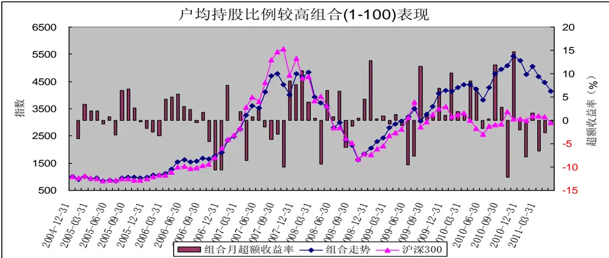
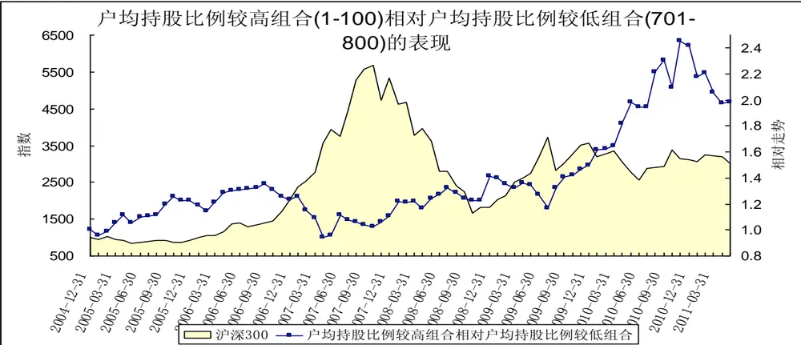
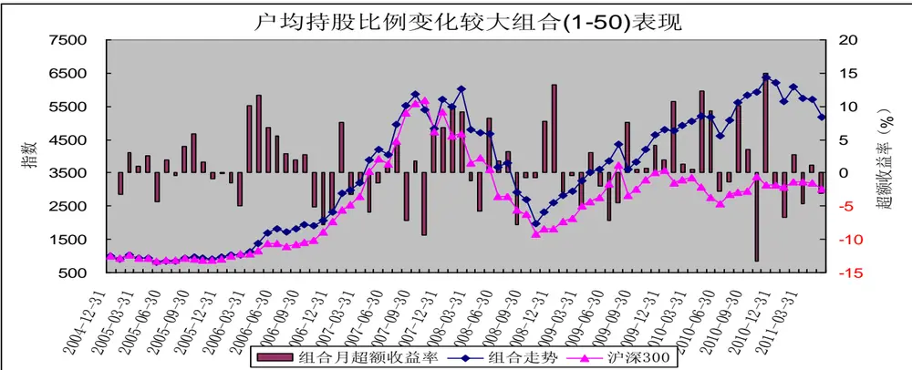
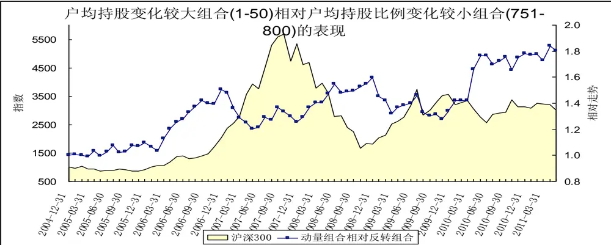
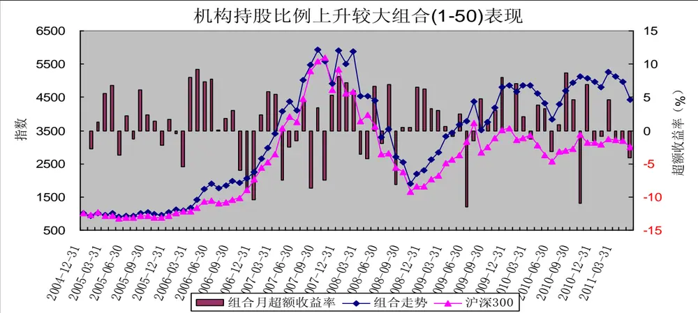
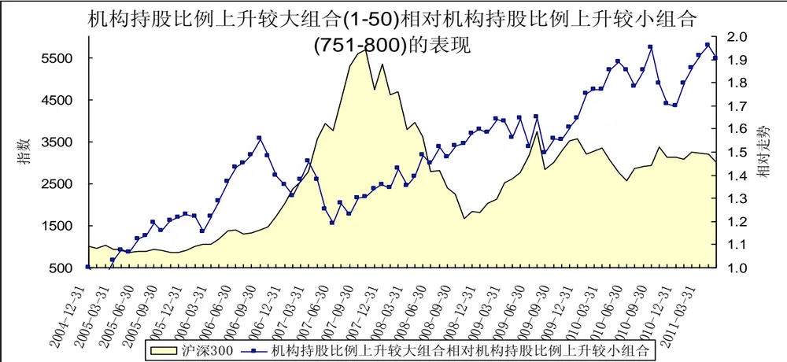

## 股东因子分析

## ——数量化选股策略之十

[table_research]研究员：魏刚 执业证书编号：S0570510120042

025-83290914 weigang@mail.htsc.com.cn

http://t.zhangle.com/4074

## 相关研究

《数量化选股策略之九：交投波动因[table_relate]子分析》2011-08-24

《数量化选股策略之八：动量反转因子分析》2011-07-27

《数量化选股策略之七：盈利因子分析》2011-07-27

《数量化选股策略之六：成长因子分析》2011-07-12

《数量化选股策略之五：估值因子分析》2011-07-06

《数量化选股策略之四：规模因子分析》2011-06-30

## 投资要点：

影响股价走势的主要因子包括市场整体走势、估值因子、成长因子、盈利能力因子、杠杆因子、动量反转因子、交易因子、规模因子、股价因子、红利因子、股价波动因子、市场预期因子等。我们将逐一分析各个因子对股价的影响，以及在不同市场环境下各个因子的表现，通过不同指标的对比，筛选出能持续获得稳定正收益能力的因子，并确定备选因子；然后筛选因子组合构建多因素选股模型，寻找适合不同市场环境的选股模型。

在前面几篇报告中我们对规模因子、估值因子、成长因子、盈利因子、动量反转因子和交投波动因子进行了分析，本报告主要分析股东因子（户均持股比例、户均持股比例变化、机构持股比例变化）的历史表现。

由户均持股比例最高的 50 只中证 800 指数成份股构成的等权重组合未能显著跑赢沪深 300 指数，2005 年 1 月至 2011 年 5 月间的累计收益率为 206.63%，年化收益率为 19.09%；同期沪深 300 指数的累计收益率为 200.16%，年化收益率为 18.69%。

由户均持股比例上升最大的 50 只中证 800 指数成份股构成的等权重组合跑赢沪深 300 指数，2005 年 1 月至 2011 年 5 月间的累计收益率为 416.98%，年化收益率为 29.19%；同期沪深 300 指数的累计收益率为 200.16%，年化收益率为 18.69%。

由机构持股比例上升最大的 50 只中证 800 指数成份股构成的等权重组合跑赢沪深 300 指数，2005 年 1 月至 2011 年 5 月间的累计收益率为 344.07%，年化收益率为 26.17%；同期沪深 300 指数的累计收益率为 200.16%，年化收益率为 18.69%。

股东因子（户均持股比例、户均持股比例变化、机构持股比例变化）是影响股票收益的重要因子，其中户均持股比例变化、机构持股比例变化是较为显著的正向因子。

影响股价走势的主要因子包括市场整体走势（市场因子，系统性风险）、估值因子（市盈率、市净率、市销率、市现率、企业价值倍数、PEG等）、成长因子（营业收入增长率、营业利润增长率、净利润增长率、每股收益增长率、净资产增长率、股东权益增长率、经营活动产生的现金流量金额增长率等）、盈利能力因子（销售净利率、毛利率、净资产收益率、资产收益率、营业费用比例、财务费用比例、息税前利润与营业总收入比等）、动量反转因子（前期涨跌幅等）、交投因子（前期换手率、量比等）、规模因子（流通市值、总市值、自由流通市值、流通股本、总股本等）、股价波动因子（前期股价振幅、日收益率标准差等）、市场预期因子（预测净利润增长率、预测主营业务增长率、盈利预测调整等）。

我们将逐一分析各个因子对股价的影响，以及在不同市场环境下各个因子的表现，通过不同指标的对比，筛选出能持续获得稳定正收益能力的因子，并确定备选因子；然后筛选因子组合构建多因素选股模型，寻找适合不同市场环境的选股模型。

在前面几篇报告中我们对规模因子、估值因子、成长因子、盈利因子、动量反转因子和交投波动因子进行了分析，本报告主要分析股东因子（户均持股比例、户均持股比例变化、机构持股比例变化）的历史表现。

## 一、前言

比较常用的因子回报度量方法有：横截面回归法和排序打分法。横截面回归法利用因子的取值（风险暴露）与下期股票收益率之间的线性关系，以最小二乘法拟合出的回归系数定义为因子回报。FF 排序打分法原型是由 Fama 和 French 提出，通过对因子暴露进行排序，排名靠前的股票组合减去排名靠后的股票组合下一期的平均收益率定义为因子回报，他们提出的排序法已经被发采用。我们采用排序法对各因子进行分析。

（1）我们的研究范围为中证 800指数成份股；

（2）研究期间为2005年 1 月至2011年5月；

（3）组合调整周期为月，每月最后一个交易日收盘后构建下一期的组合；

（4） 我们按各指标排序，把 800 只成份股分成：（1-50）、（1-100）、（101-200）、（201-300）、（301-400）、（401-500）、（501-600）、（601-700）、（701-800）、（（751-800）等 10 个组合；

（5）组合构建时股票的买入卖出价格为组合调整日收盘价；

（6）组合构建时为等权重；

（7）在持有期内，若某只成份股被调出中证 800指数，不对组合进行调整；

（8）组合构建时，买卖冲击成本均为 0.1%、买卖佣金均为 0.1%，印花税为 0.1%；

（9）我们考虑的股东因子为：户均持股比例、户均持股比例变化（相对前 1 个季度）、机构持股比例变化（机构包括：基金、券商、券商理财、信托）；

（10） 组合A相对组合B的表现定义为：组合 A的净值/组合B的净值的走势。

## 二、户均持股比例

图表 1：户均持股比例由高到低排序处于各区间的组合表现

| 户均持股比例由高到低排序 | 2005年1月2011年5月收益 | 年化收益率 | 跑赢沪深 300 指数次数 | 跑赢概率 |
| --- | --- | --- | --- | --- |
| 沪深 300 指数 | 200.16% | 18.69% |  |  |
| 1-50 | 206.63% | 19.09% | 40 | 51.95% |
| 1-100 | 314.40% | 24.81% | 46 | 59.74% |
| 101-200 | 347.93% | 26.34% | 44 | 57.14% |
| 201-300 | 462.96% | 30.92% | 49 | 63.64% |
| 301-400 | 300.80% | 24.17% | 43 | 55.84% |
| 401-500 | 278.07% | 23.04% | 43 | 55.84% |
| 501-600 | 297.71% | 24.02% | 46 | 59.74% |
| 601-700 | 203.22% | 18.88% | 41 | 53.25% |
| 701-800 | 109.29% | 12.20% | 36 | 46.75% |
| 751-800 | 104.84% | 11.83% | 35 | 45.45% |

资料来源：华泰证券

由上表可知，从 2005年至今的区间累计收益看，整体上说，户均持股比例越高，表现越好。户均持股比例较高股票构成的组合（1-100）、组合（101-200）表现较好，小幅跑赢沪深 300 指数；户均持股比例位于中间靠前位置的股票构成的组合（201-300）表现最高，大幅跑赢沪深 300 指数；户均持股比例较低股票构成的组合（701-800）、组合（751-800）表现较差，大幅落后于沪深300指数。

从跑赢沪深300指数的概率看，也是组合（201-300）表现最好，跑赢概率达 63.64%；而户均持股比例较低股票构成的组合（701-800）、（751-800）表现最差，跑赢概率在 50%以下。其余组合跑赢概率介于 50%和 60%之间。

由户均持股比例最高的50 只中证 800 指数成份股构成的等权重组合未能显著跑赢沪深300指数，2005年 1 月至2011年 5月间的累计收益率为206.63%，年化收益率为 19.09%；由户均持股比例最高的100 只中证 800 指数成份股构成的等权重组合跑赢沪深 300 指数，2005 年 1 月至 2011 年 5 月间的累计收益率为314.40%，年化收益率为 24.81%；同期沪深 300 指数的累计收益率为 200.16%，年化收益率为 18.69%。

图表 2：户均持股比例由高到低排序处于各区间的组合的绩效分析

| 户均持股比例由高到低排序 | alpha | beta | sharpe | treynor | jensen | 跟踪误差 | 信息比率 T | 检验的 p 值 |
| --- | --- | --- | --- | --- | --- | --- | --- | --- |
| 1-50 | 0.9629 | 0.7296 | 0.2546 | 3.3222 | 0.9622 | 0.0620 | 0.0136 | 0.555 |
| 1-100 | 1.2790 | 0.7936 | 0.2869 | 3.6144 | 1.2784 | 0.0583 | 0.2547 | 0.194 |
| 101-200 | 1.2118 | 0.9581 | 0.2724 | 3.2683 | 1.2117 | 0.0544 | 0.3531 | 0.068 |
| 201-300 | 1.5007 | 0.9686 | 0.2964 | 3.5527 | 1.5006 | 0.0553 | 0.6169 | 0.022 |
| 301-400 | 1.0119 | 1.0255 | 0.2488 | 2.9904 | 1.0120 | 0.0582 | 0.2244 | 0.110 |
| 401-500 | 0.9408 | 1.0183 | 0.2446 | 2.9275 | 0.9409 | 0.0566 | 0.1789 | 0.130 |
| 501-600 | 0.9513 | 1.0599 | 0.2464 | 2.9012 | 0.9515 | 0.0548 | 0.2310 | 0.086 |
| 601-700 | 0.5838 | 1.0538 | 0.2185 | 2.5577 | 0.5840 | 0.0521 | 0.0076 | 0.247 |
| 701-800 | 0.0488 | 1.0339 | 0.1832 | 2.0508 | 0.0489 | 0.0363 | -0.3249 | 0.780 |
| 751-800 | 0.0306 | 1.0058 | 0.1842 | 2.0340 | 0.0306 | 0.0300 | -0.4121 | 0.903 |

资料来源：华泰证券

从各组合的绩效指标看，户均持股比例较高股票组合的表现大大好于户均持股比例较低股票组合，组合（1-100）、组合（101-200）的 alpha 值均为正，信息比率分别为 0.2547 和 0.3531。

图表 3：户均持股比例较高股票组合表现

资料来源：华泰证券

2005 年以来，户均持股比例较高股票构成的组合（1-100）整体上跑赢沪深300 指数，户均持股比例较高股票组合（1-100）跑赢沪深 300 指数主要集中 2009年 8 月以来的震荡市期间。

图表 4：户均持股比例较高股票组合相对户均持股比例较低股票组合的表现

2005年以来，户均持股比例较高股票构成的组合整体上大幅跑赢户均持股比例较低股票构成的组合。

三、户均持股比例变化

图表 5：户均持股比例上升由大到小排序处于各区间的组合表现

| 户均持股比例上升由大到小排序 | 2005年1月2011年5月收益 | 年化收益率 | 跑赢沪深 300 指数次数 | 跑赢概率 |
| --- | --- | --- | --- | --- |
| 沪深 300 指数 | 200.16% | 18.69% |  |  |
| 1-50 | 416.98% | 29.19% | 43 | 55.84% |
| 1-100 | 385.43% | 27.93% | 44 | 57.14% |
| 101-200 | 365.27% | 27.09% | 45 | 58.44% |
| 201-300 | 395.84% | 28.36% | 47 | 61.04% |
| 301-400 | 308.90% | 24.56% | 48 | 62.34% |
| 401-500 | 182.35% | 17.57% | 43 | 55.84% |
| 501-600 | 278.87% | 23.08% | 45 | 58.44% |
| 601-700 | 212.96% | 19.47% | 38 | 49.35% |
| 701-800 | 173.63% | 16.99% | 39 | 50.65% |
| 751-800 | 186.91% | 17.86% | 38 | 49.35% |

资料来源：华泰证券

由上表可知，从 2005年至今的区间累计收益看，整体上说，户均持股比例上升越大、表现越好。户均持股比例上升较大股票构成的组合（1-50）、组合（1-100）、组合（101-200）表现较好，大幅超越沪深 300指数；户均持股比例上升较低股票构成的组合（701-800）、组合（751-800）表现较差，落后于沪深 300 指数。

从跑赢沪深 300 指数的概率看，整体上说，户均持股比例上升较大股票构成的组合的表现要好于户均持股比例上升排名较小股票构成的组合。

由户均持股比例上升最大的 50只中证 800指数成份股构成的等权重组合跑赢沪深 300 指数，2005年 1月至 2011 年 5 月间的累计收益率为 416.98%，年化收益率为 29.19%；同期沪深 300 指数的累计收益率为200.16%，年化收益率为 18.69%。

图表 6：户均持股比例上升由大到小排序处于各区间的组合的绩效分析

| 户均持股比例上升由大到小排序 | alpha | beta | sharpe | treynor | jensen | 跟踪误差 | 信息比率T | 检验的p值 |
| --- | --- | --- | --- | --- | --- | --- | --- | --- |
| 1-50 | 1.5343 | 0.8426 | 0.3052 | 3.8240 | 1.5339 | 0.0593 | 0.4751 | 0.071 |
| 1-100 | 1.3887 | 0.8833 | 0.2949 | 3.5752 | 1.3884 | 0.0539 | 0.4462 | 0.060 |
| 101-200 | 1.2355 | 0.9695 | 0.2777 | 3.2778 | 1.2354 | 0.0509 | 0.4212 | 0.042 |
| 201-300 | 1.2867 | 1.0036 | 0.2774 | 3.2857 | 1.2867 | 0.0537 | 0.4728 | 0.034 |
| 301-400 | 0.9887 | 1.0369 | 0.2521 | 2.9572 | 0.9888 | 0.0523 | 0.2699 | 0.075 |
| 401-500 | 0.5298 | 1.0121 | 0.2134 | 2.5270 | 0.5298 | 0.0528 | -0.0438 | 0.361 |
| 501-600 | 0.9032 | 1.0326 | 0.2443 | 2.8783 | 0.9033 | 0.0532 | 0.1923 | 0.110 |
| 601-700 | 0.6701 | 1.0202 | 0.2244 | 2.6604 | 0.6702 | 0.0538 | 0.0309 | 0.249 |
| 701-800 | 0.5487 | 0.9544 | 0.2167 | 2.5783 | 0.5485 | 0.0511 | -0.0674 | 0.436 |
| 751-800 | 0.6657 | 0.9177 | 0.2241 | 2.7287 | 0.6655 | 0.0551 | -0.0312 | 0.429 |

资料来源：华泰证券

从各组合的绩效指标看，户均持股比例上升较大股票组合的表现大大好于户均持股比例上升较小股票组合，组合（1-50）、组合（1-100）的alpha 值均为正，其月超额收益率在 10%的显著水平下显著为正，信息比率分别为 0.4751 和 0.4462。

图表 7：户均持股比例上升较大股票组合表现

资料来源：华泰证券

2005 年以来，户均持股比例上升较大股票构成的组合（1-50）整体上跑赢沪深 300 指数，户均持股变化较大股票组合（1-50）跑赢沪深300指数主要集中在 2009年8 月以来的震荡市期间。

图表 8：户均持股比例上升较大股票组合相对户均持股比例上升较小股票组合的表现

资料来源：华泰证券

2005 年以来，户均持股比例上升较大股票构成的组合整体上跑赢户均持股比例上升较小股票构成的组合。

## 四、机构持股比例变化

图表 9：机构持股比例上升由大到小排序处于各区间的组合表现

| 机构持股比例上升由大到小排序 | 2005年1月2011年5月收益 | 年化收益率 | 跑赢沪深 300 指数次数 | 跑赢概率 |
| --- | --- | --- | --- | --- |
| 沪深 300 指数 | 200.16% | 18.69% |  |  |
| 1-50 | 344.07% | 26.17% | 47 | 61.04% |
| 1-100 | 363.19% | 27.00% | 48 | 62.34% |
| 101-200 | 371.55% | 27.35% | 47 | 61.04% |
| 201-300 | 359.47% | 26.84% | 45 | 58.44% |
| 301-400 | 329.96% | 25.53% | 45 | 58.44% |
| 401-500 | 260.65% | 22.14% | 47 | 61.04% |
| 501-600 | 212.61% | 19.45% | 45 | 58.44% |
| 601-700 | 199.36% | 18.64% | 43 | 55.84% |
| 701-800 | 176.93% | 17.21% | 38 | 49.35% |
| 751-800 | 133.26% | 14.12% | 36 | 46.75% |

资料来源：华泰证券

由上表可知，从 2005年至今的区间累计收益看，整体上说，机构持股比例上升越大，表现越好。机构持股比例上升较大股票构成的组合（1-50）、组合（1-100）、组合（101-200）表现较好，大幅超越沪深 300指数；机构持股比例上升较低股票构成的组合（601-700）、组合（701-800）、组合（751-800）表现较差，落后于沪深300指数。

从跑赢沪深 300 指数的概率看，机构持股比例上升较大股票构成的组合表现好于机构持股比例上升较小股票构成的组合。机构持股比例上升较大股票构成的组合（1-50）、组合（1-100）、组合（101-200）的跑赢概率均在 60%以上；而机构持股比例上升较小股票构成的组合（701-800）、组合（751-800）的跑赢概率均在 50%以下。

由机构持股比例上升最大的 50只中证 800指数成份股构成的等权重组合跑赢沪深 300 指数，2005年 1月至 2011 年 5 月间的累计收益率为 344.07%，年化收益率为 26.17%；同期沪深 300 指数的累计收益率为200.16%，年化收益率为 18.69%。

图表 10：机构持股比例上升由大到小排序处于各区间的组合的绩效分析

| 机构持股比例上升由大到小排序 | alpha | beta | sharpe | treynor | jensen | 跟踪误差 | 信息比率 | T检验的p值 |
| --- | --- | --- | --- | --- | --- | --- | --- | --- |
| 1-50 | 1.2347 | 0.9157 | 0.2796 | 3.3516 | 1.2345 | 0.0523 | 0.3570 | 0.074 |
| 1-100 | 1.2346 | 0.9587 | 0.2801 | 3.2912 | 1.2345 | 0.0493 | 0.4299 | 0.039 |
| 101-200 | 1.2364 | 1.0016 | 0.2725 | 3.2380 | 1.2364 | 0.0543 | 0.4100 | 0.044 |
| 201-300 | 1.2473 | 1.0166 | 0.2604 | 3.2305 | 1.2474 | 0.0659 | 0.3141 | 0.088 |
| 301-400 | 1.1440 | 1.0167 | 0.2538 | 3.1288 | 1.1440 | 0.0642 | 0.2627 | 0.108 |
| 401-500 | 0.8658 | 1.0206 | 0.2382 | 2.8519 | 0.8659 | 0.0567 | 0.1385 | 0.162 |
| 501-600 | 0.6661 | 1.0141 | 0.2254 | 2.6604 | 0.6661 | 0.0522 | 0.0310 | 0.245 |
| 601-700 | 0.6072 | 0.9664 | 0.2302 | 2.6317 | 0.6071 | 0.0410 | -0.0025 | 0.250 |
| 701-800 | 0.5486 | 0.9173 | 0.2263 | 2.6013 | 0.5484 | 0.0410 | -0.0735 | 0.417 |
| 751-800 | 0.3130 | 0.9287 | 0.2034 | 2.3403 | 0.3128 | 0.0413 | -0.2102 | 0.721 |

资料来源：华泰证券

从各组合的绩效指标看，机构持股比例上升较大股票组合的表现大大好于机构持股比例上升较小股票组合，组合（1-50）、组合（1-100）的alpha 值均为正，其月超额收益率在 10%的显著水平显著为正，信息比率分别为 0.3570 和 0.4299。

图表 11：机构持股比例上升较大股票组合表现

资料来源：华泰证券

2005 年以来，机构持股比例上升较大股票构成的组合（1-50）整体上跑赢沪深 300 指数，机构持股比例上升较大股票组合（1-50）跑赢沪深 300 指数主要集中在2009年8 月以来的震荡市期间。

图表 12：机构持股比例上升较大股票组合相对机构持股比例上升较小股票组合的表现

资料来源：华泰证券

2005 年以来，机构持股比例上升较大股票构成的组合整体上跑赢机构持股比例上升较小股票构成的组合。

## 五、结论

通过对2005 年以来市场的分析，股东因子（户均持股比例、户均持股比例变化、机构持股比例变化）是影响股票收益的重要因子，其中户均持股比例变化、机构持股比例变化是较为显著的正向因子。

从户均持股比例看，整体上说，户均持股比例较高的股票表现较好；但表现最好的组合并不是户均持股比例最高股票构成的组合；户均持股比例最低股票构成的组合表现最差。2005 年 1月至2011年 5月间，由户均持股比例最高的50 只中证 800 指数成份股构成的等权重组合的年化收益率为19.09%，跑赢沪深 300指数的概率为 51.95%；由户均持股比例最低的 50 只中证指数成分股构成的等权重组合的年化收益率为11.83%，跑赢沪深300指数的概率为 45.45%；同期沪深300 指数的年化收益率为 18.69%。

从户均持股比例变化看，户均持股比例上升较大的股票构成的组合表现较好，跑赢沪深 300 指数，也大大好于户均持股比例上升较小的股票构成的组合。2005年 1 月至2011 年5 月间，由户均持股比例上升最大的 50 只中证 800 指数成份股构成的等权重组合的年化收益率为 29.19%，跑赢沪深 300 指数的概率为55.84%；由户均持股比例上升最小的 50只中证 800 指数成份股构成的等权重组合的年化收益率为17.86%，跑赢沪深300指数的概率为 49.33%；同期沪深300 指数年化收益率为 18.69%。

从机构持股比例变化看，机构持股比例上升较大的股票构成的组合表现较好，跑赢沪深 300 指数，也大大好于机构持股比例上升较小的股票构成的组合。2005年 1 月至2011 年5 月间，由机构持股比例上升最大的 50 只中证 800 指数成份股构成的等权重组合的年化收益率为 26.17%，跑赢沪深 300 指数的概率为

61.04%；由机构持股比例上升最小的 50只中证 800 指数成份股构成的等权重组合的年化收益率为14.12%，跑赢沪深300指数的概率为 46.75%；同期沪深300 指数年化收益率为 18.69%。

## 免责条款：

本报告的信息均来源于公开资料，本公司对这些信息的准确性、完整性或可靠性不作任何保证，也不保证所包含的信息和建议不会发生任何变更。本公司力求报告内容的客观、公正，但文中的观点、结论和建议仅供参考，不构成所述证券的买卖出价或征价，投资者据此做出的任何投资决策与本公司和作者无关。本公司及作者在自身所知情的范围内，与本报告中所评价或推荐的证券没有利害关系。在法律许可的情况下，本公司及其所属关联机构可能会持有报告中提到的公司所发行的证券头寸并进行交易，也可能为这些公司提供或者争取提供投资银行、财务顾问或者金融产品等相关服务。

报告版权仅为本公司所有，未经书面许可，任何机构和个人不得以翻版、复制、发表、引用或再次分发他人等任何形式侵犯本公司版权。如征得本公司同意进行引用、刊发的，需在允许的范围内使用，并注明出处为“华泰证券研究所”，且不得对本报告进行任何有悖原意的引用、删节和修改。本公司保留追究相关责任的权利。

本公司具有中国证监会核准的“证券投资咨询”业务资格，经营许可证编号为：Z23032000。