# 分析师预测因子分析

[table_research]研究员：魏刚 执业证书编号：S0570510120042

025-83290914 weigang@mail.htsc.com.cn

http://t.zhangle.com/4074

## ——数量化选股策略之十一

## 相关研究

《数量化选股策略之十：股东因子分[table_relate]析》2011-08-30

《数量化选股策略之九：交投波动因子分析》2011-08-24

《数量化选股策略之八：动量反转因子分析》2011-07-27

《数量化选股策略之七：盈利因子分析》2011-07-27

《数量化选股策略之六：成长因子分析》2011-07-12

《数量化选股策略之五：估值因子分析》2011-07-06

《数量化选股策略之四：规模因子分析》2011-06-30

## 投资要点：

在前面几篇报告中我们对规模因子、估值因子、成长因子、盈利因子、动量反转因子、交投波动因子和股东因子进行了分析，本报告主要分析分析师预测因子的历史表现。

由预测当年净利润增长率最高的 50 只中证 800 指数成份股构成的等权重组合跑赢沪深 300 指数，2005 年 1 月至 2011 年 5 月间的累计收益率为 401.40%，年化收益率为 28.58%；同期沪深 300 指数的累计收益率为 200.16%，年化收益率为 18.69%。

由预测当年主营收入增长率最高的 50 只中证 800 指数成份股构成的等权重组合跑赢沪深 300 指数，2005 年 1 月至 2011 年 5 月间的累计收益率为 494.99%，年化收益率为 32.06%。

由盈利预测调高占比最高的 50 只中证 800 指数成份股构成的等权重组合跑赢沪深 300 指数，2005 年 1 月至 2011 年 5 月间的累计收益率为 501.91%，年化收益率为 32.29%。

へ由评级调高占比最高的 50 只中证 800 指数成份股构成的等权重组合跑赢沪深 300 指数，2005 年 1 月至 2011 年 5 月间的累计收益率为 484.94%，年化收益率为 31.71%。

由净利润上调幅度最大的 50 只中证 800 指数成份股构成的等权重组合跑赢沪深 300 指数，2005 年 1 月至 2011 年5 月间的累计收益率为 518.07%，年化收益率为 32.84%。

由主营收入上调幅度最大的 50 只中证 800 指数成份股构成的等权重组合跑赢沪深 300 指数，2005 年 1 月至 2011 年 5 月间的累计收益率为 326.25%，年化收益率为 25.36%。

分析师预测因子（预测当年净利润增长率、预测当年主营业务收入增长率、最近 1个月预测净利润上调幅度、最近 1 个月预测主营营业收入上调幅度、最近 1个月盈利预测调高占比、最近 1 个月上调评级占比）是影响股票收益的重要因子，其中最近 1个月净利润上调幅度是最为显著的正向因子。

影响股价走势的主要因子包括市场整体走势（市场因子，系统性风险）、估值因子（市盈率、市净率、市销率、市现率、企业价值倍数、PEG等）、成长因子（营业收入增长率、营业利润增长率、净利润增长率、每股收益增长率、净资产增长率、股东权益增长率、经营活动产生的现金流量金额增长率等）、盈利能力因子（销售净利率、毛利率、净资产收益率、资产收益率、营业费用比例、财务费用比例、息税前利润与营业总收入比等）、动量反转因子（前期涨跌幅等）、交投因子（前期换手率、量比等）、规模因子（流通市值、总市值、自由流通市值、流通股本、总股本等）、股价波动因子（前期股价振幅、日收益率标准差等）、市场预期因子（预测净利润增长率、预测主营业务增长率、盈利预测调整等）。

我们将逐一分析各个因子对股价的影响，以及在不同市场环境下各个因子的表现，通过不同指标的对比，筛选出能持续获得稳定正收益能力的因子，并确定备选因子；然后筛选因子组合构建多因素选股模型，寻找适合不同市场环境的选股模型。

在前面几篇报告中我们对规模因子、估值因子、成长因子、盈利因子、动量反转因子、交投波动因子和股东因子进行了分析，本报告主要分析分析师预测因子（预测当年净利润增长率、预测当年主营业务收入增长率、最近 1 个月预测净利润上调幅度、最近 1 个月预测主营营业收入上调幅度、最近 1 个月盈利预测调高占比、最近 1个月上调评级占比）的历史表现。

## 一、前言

比较常用的因子回报度量方法有：横截面回归法和排序打分法。横截面回归法利用因子的取值（风险暴露）与下期股票收益率之间的线性关系，以最小二乘法拟合出的回归系数定义为因子回报。FF 排序打分法原型是由 Fama 和 French 提出，通过对因子暴露进行排序，排名靠前的股票组合减去排名靠后的股票组合下一期的平均收益率定义为因子回报，他们提出的排序法已经被发采用。我们采用排序法对各因子进行分析。

（1）我们的研究范围为中证 800指数成份股；

（2）研究期间为2005年 1 月至2011年5月；

（3）组合调整周期为月，每月最后一个交易日收盘后构建下一期的组合；

（4） 我们按各指标排序，把 800 只成份股分成：（1-50）、（1-100）、（101-200）、（201-300）、（301-400）、（401-500）、（501-600）、（601-700）、（701-800）、（（751-800）等 10 个组合；

（5）组合构建时股票的买入卖出价格为组合调整日收盘价；

（6）组合构建时为等权重；

（7）在持有期内，若某只成份股被调出中证 800指数，不对组合进行调整；

（8）组合构建时，买卖冲击成本均为 0.1%、买卖佣金均为 0.1%，印花税为 0.1%；

（9）我们考虑的分析师预测因子有：预测当年净利润增长率（平均值）、预测当年主营业务收入增长率（平均值）、最近1个月预测净利润上调幅度（最新当年净利润预测平均值/1个月前当年净利润预测平均值-1）、最近 1 个月预测主营营业收入上调幅度（最新当年主营业务收入预测平均值/1个月前当年主营业务收入预测平均值-1）、最近 1个月盈利预测调高占比（最近 1 个月净利润调高家数/最近 1个月发布盈利预测报告家数）、最近1个月上调评级占比（最近 1个月上调评级家数/最近1个月发表评级报告家数）；

（10） 组合A相对组合B的表现定义为：组合 A的净值/组合B的净值的走势。

## 二、预测当年净利润增长率

图表 1：预测当年净利润增长率由高到低排序处于各区间的组合表现

| 预测当年净利润增长率由高到低排序 2 | 005 年 1 月 2011 年 5 月收益 | 年化收益率 | 跑赢沪深 300 指数次数 | 跑赢概率 |
| --- | --- | --- | --- | --- |
| 沪深 300 指数 | 200.16% | 18.69% |  |  |
| 1-50 | 401.40% | 28.58% | 46 | 59.74% |
| 1-100 | 337.74% | 25.89% | 46 | 59.74% |
| 101-200 | 239.12% | 20.97% | 45 | 58.44% |
| 201-300 | 244.57% | 21.27% | 44 | 57.14% |
| 301-400 | 328.27% | 25.46% | 48 | 62.34% |
| 401-500 | 266.94% | 22.47% | 46 | 59.74% |
| 501-600 | 252.78% | 21.72% | 44 | 57.14% |
| 601-700 | 308.87% | 24.55% | 43 | 55.84% |
| 701-800 | 266.11% | 22.43% | 45 | 58.44% |
| 751-800 | 291.42% | 23.71% | 47 | 61.04% |

资料来源：华泰证券

由上表可知，从2005年至今的区间累计收益看，整体上说，预测当年净利润增长率越高，表现越好，但差别不是很明显。预测当年净利润增长率较高股票构成的组合（1-100）、组合（101-200）表现较好，大幅跑赢沪深300指数，但未能明显超越预测当年净利润增长率较低股票构成的组合（751-800）。

从跑赢沪深 指数的概率看，各组合间差别也不是很明显，预测当年净利润增长率较高股票构成的组合并没有显著好于预测当年净利润增长率较低股票构成的组合。

由预测当年净利润增长率最高的 50只中证 800指数成份股构成的等权重组合跑赢沪深300指数，2005年 1 月至2011年 5月间的累计收益率为401.40%，年化收益率为 28.58%；同期沪深300 指数的累计收益率为 200.16%，年化收益率为 18.69%。

图表 2：预测当年净利润增长率由高到低排序处于各区间的组合的绩效分析

| 预测当年净利润增长率由高到低排序 | alpha | beta | sharpe | treynor | jensen | 跟踪误差 | 信息比率 | T检验的p 值 |
| --- | --- | --- | --- | --- | --- | --- | --- | --- |
| 1-50 | 1.2754 | 1.0689 | 0.2677 | 3.1969 | 1.2756 | 0.0600 | 0.4356 | 0.038 |
| 1-100 | 1.1012 | 1.0638 | 0.2547 | 3.0388 | 1.1014 | 0.0590 | 0.3028 | 0.067 |
| 101-200 | 0.7755 | 1.0420 | 0.2315 | 2.7479 | 0.7756 | 0.0555 | 0.0911 | 0.176 |
| 201-300 | 0.7870 | 0.9957 | 0.2413 | 2.7939 | 0.7869 | 0.0461 | 0.1252 | 0.139 |
| 301-400 | 1.1420 | 0.9184 | 0.2769 | 3.2467 | 1.1418 | 0.0471 | 0.3535 | 0.068 |
| 401-500 | 0.9163 | 0.9291 | 0.2594 | 2.9896 | 0.9161 | 0.0425 | 0.2040 | 0.111 |
| 501-600 | 0.8711 | 0.9384 | 0.2513 | 2.9316 | 0.8709 | 0.0459 | 0.1490 | 0.154 |
| 601-700 | 1.0647 | 0.9840 | 0.2562 | 3.0855 | 1.0646 | 0.0564 | 0.2505 | 0.108 |
| 701-800 | 0.8997 | 1.0400 | 0.2355 | 2.8688 | 0.8999 | 0.0624 | 0.1373 | 0.170 |
| 751-800 | 0.9965 | 1.0281 | 0.2436 | 2.9728 | 0.9965 | 0.0622 | 0.1904 | 0.139 |

资料来源：华泰证券

从各组合的绩效指标看，预测当年净利润增长率较高股票组合的表现好于预测当年净利润增长率较低股票组合，组合（1-100）、组合（101-200）的 alpha 值均为正，其月超额收益率在 10%的显著水平下显著为正，信息比率分别为 0. 4356 和 0. 3028。

图表 3：预测当年净利润增长率较高股票组合表现
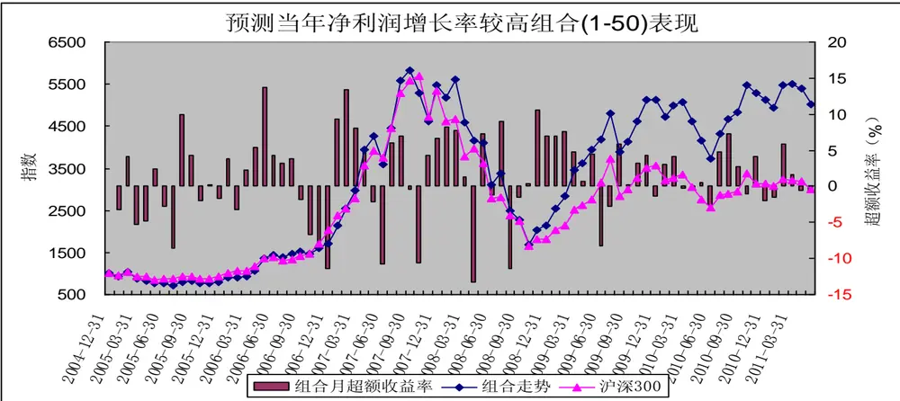
资料来源：华泰证券

2005 年以来，预测当年净利润增长率较高股票构成的组合（1-50）整体上跑赢沪深 300 指数，预测当年净利润增长率较高股票组合（1-50）跑赢沪深 300 指数主要集中 2008 年11 月以来的震荡市期间。

图表 4：预测当年净利润增长率较高股票组合相对预测当年净利润增长率较低股票组合的表现
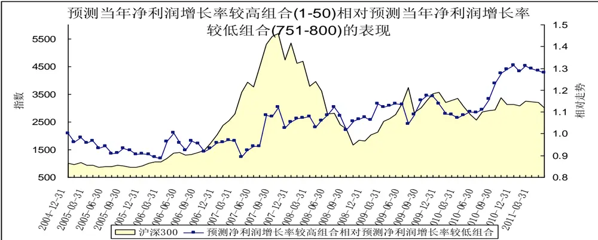
资料来源：华泰证券

2005 年以来，预测当年净利润增长率较高股票构成的组合整体上小幅跑赢预测当年净利润增长率较低股票构成的组合。

## 三、预测主营收入增长率

图表 5：预测当年主营收入增长率由高到低排序处于各区间的组合表现

| 预测当年主营收入增长率由高到低排序 | 2005年1月2011年5月收益 | 年化收益率 | 跑赢沪深 300 指数次数 | 跑赢概率 |
| --- | --- | --- | --- | --- |
| 沪深 300 指数 | 200.16% | 18.69% |  |  |
| 1-50 | 494.99% | 32.06% | 50 | 64.94% |
| 1-100 | 392.80% | 28.23% | 48 | 62.34% |
| 101-200 | 272.51% | 22.76% | 41 | 53.25% |
| 201-300 | 238.45% | 20.94% | 43 | 55.84% |
| 301-400 | 210.36% | 19.31% | 42 | 54.55% |
| 401-500 | 281.59% | 23.22% | 46 | 59.74% |
| 501-600 | 296.22% | 23.94% | 44 | 57.14% |
| 601-700 | 257.32% | 21.96% | 43 | 55.84% |
| 701-800 | 299.07% | 24.08% | 44 | 57.14% |
| 751-800 | 329.68% | 25.52% | 42 | 54.55% |

资料来源：华泰证券

由上表可知，从2005年至今的区间累计收益看，整体上说，预测当年主营收入增长率越高、表现越好。预测当年主营收入增长率较高股票构成的组合（1-50）、组合（1-100）表现较好，大幅超越沪深300指数。但除了组合（1-50）、组合（1-100）外，其余组合间的差别不是很明显；预测当年主营收入增长率较低股票构成的组合（701-800）、组合（751-800）的表现也不错；表现最差的为预测当年主营收入增长率处于中间位置的组合（301-400）。

从跑赢沪深300指数的概率看，出了组合（1-50）、组合（1-100）外，其余组合间差别不明显。

由预测当年主营收入增长率最高的50只中证800指数成份股构成的等权重组合跑赢沪深300指数，2005年 1 月至2011年 5月间的累计收益率为494.99%，年化收益率为 32.06%；同期沪深300 指数的累计收益率为 200.16%，年化收益率为 18.69%。

图表 6：预测当年主营收入增长率由高到低排序处于各区间的组合的绩效分析

| 预测当年主营收入增长率由高到低排序 | alpha | beta | sharpe | treynor | jensen | 跟踪误差 | 信息比率 | T 检验的 p 值 |
| --- | --- | --- | --- | --- | --- | --- | --- | --- |
| 1-50 | 1.4765 | 1.0555 | 0.2927 | 3.4025 | 1.4766 | 0.0522 | 0.7336 | 0.007 |
| 1-100 | 1.2313 | 1.0312 | 0.2779 | 3.1977 | 1.2314 | 0.0471 | 0.5314 | 0.015 |
| 101-200 | 0.9249 | 0.9562 | 0.2561 | 2.9707 | 0.9248 | 0.0452 | 0.2080 | 0.104 |
| 201-300 | 0.8289 | 0.9340 | 0.2466 | 2.8908 | 0.8287 | 0.0469 | 0.1060 | 0.195 |
| 301-400 | 0.7053 | 0.9322 | 0.2371 | 2.7599 | 0.7051 | 0.0449 | 0.0295 | 0.269 |
| 401-500 | 0.9660 | 0.9708 | 0.2523 | 2.9985 | 0.9659 | 0.0522 | 0.2028 | 0.128 |
| 501-600 | 1.0397 | 0.9911 | 0.2480 | 3.0526 | 1.0397 | 0.0620 | 0.2013 | 0.149 |
| 601-700 | 0.9024 | 1.0411 | 0.2309 | 2.8704 | 0.9025 | 0.0675 | 0.1099 | 0.203 |
| 701-800 | 0.9577 | 1.0571 | 0.2470 | 2.9097 | 0.9579 | 0.0547 | 0.2347 | 0.086 |
| 751-800 | 1.0241 | 1.0592 | 0.2587 | 2.9706 | 1.0243 | 0.0476 | 0.3533 | 0.034 |

资料来源：华泰证券

从各组合的绩效指标看，预测当年主营收入增长率较高股票组合的表现略好于预测当年主营收入增长率较低股票组合，组合（1-50）、组合（1-100）的 alpha 值均为正，其月超额收益率在 5%的显著水平下显著为正，信息比率分别为 0.7336和0.5314。

图表 7：预测当年主营收入增长率较高股票组合表现
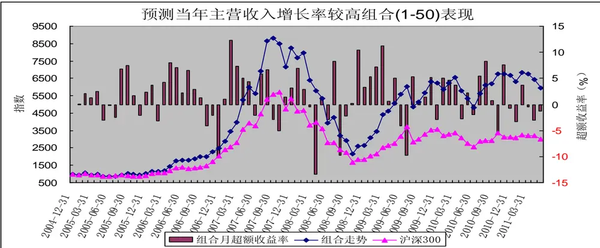
资料来源：华泰证券

2005 年以来，预测当年主营收入增长率较高股票构成的组合（1-50）整体上跑赢沪深 300 指数，预测主营收入增长率较高组合（1-50）表现出较强的进攻性，在上涨行情（2005 年 1 月至 2007 年 10 月，2008年 11 月至 2009 年 8 月）中大幅跑赢沪深 300 指数；而在 2007 年 11 月至 2008 年 10 月的这轮熊市中，预测主营收入增长率较高组合（1-50）落后于沪深 300 指数；在 2009 年 9 月以来的震荡市中，预测主营收入增长率较高组合（1-50）小幅跑赢沪深 300 指数。

图表 8：预测当年主营收入增长率较高股票组合相对预测当年主营收入增长率较低股票组合的表现
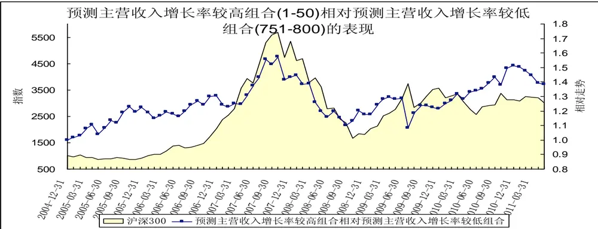
资料来源：华泰证券

2005 年以来，预测当年主营收入增长率较高股票构成的组合整体上跑赢预测当年主营收入增长率较低股票构成的组合。

## 四、最近 1个月盈利预测调高占比

图表 9：盈利预测调高占比由高到低排序处于各区间的组合表现

| 盈利预测调高占比由高到低排序 | 2005年1月2011年5月收益 | 年化收益率 | 跑赢沪深 300 指数次数 | 跑赢概率 |
| --- | --- | --- | --- | --- |
| 沪深 300 指数 | 200.16% | 18.69% |  |  |
| 1-50 | 501.91% | 32.29% | 46 | 59.74% |
| 1-100 | 468.54% | 31.12% | 50 | 64.94% |
| 101-200 | 304.82% | 24.36% | 42 | 54.55% |
| 201-300 | 239.49% | 20.99% | 46 | 59.74% |
| 301-400 | 287.73% | 23.53% | 42 | 54.55% |
| 401-500 | 247.83% | 21.45% | 40 | 51.95% |
| 501-600 | 234.24% | 20.70% | 42 | 54.55% |
| 601-700 | 255.64% | 21.87% | 42 | 54.55% |
| 701-800 | 236.47% | 20.83% | 43 | 55.84% |
| 751-800 | 218.08% | 19.77% | 46 | 59.74% |

资料来源：华泰证券

由上表可知，从 2005年至今的区间累计收益看，整体上说，盈利预测调高占比越高，表现越好。盈利预测调高占比较高股票构成的组合（1-50）、组合（1-100）、组合（101-200）表现较好，大幅超越沪深 300指数，也大大好于其他组合；除了这 3个组合外，其余组合之间的差别不是很明显。

从跑赢沪深 300 指数的概率看，整体上来说，盈利预测调高占比较高的股票构成的组合跑赢概率略高于盈利预测调高占比较低的股票构成的组合，但差别不是很明显，特别是盈利预测调高占比最低的50只股票构成的组合（751-800）跑赢沪深 300指数的概率也达 59.74%。

由盈利预测调高占比最高的 50只中证 800指数成份股构成的等权重组合跑赢沪深 300 指数，2005年 1月至 2011 年 5 月间的累计收益率为 501.91%，年化收益率为 32.29%；同期沪深 300 指数的累计收益率为200.16%，年化收益率为 18.69%。

图表 10：盈利预测调高占比由高到低排序处于各区间的组合的绩效分析

| 盈利预测调高占比由高到低排序 | alpha | beta | sharpe | treynor | jensen | 跟踪误差 | 信息比率 T | 检验的p值 |
| --- | --- | --- | --- | --- | --- | --- | --- | --- |
| 1-50 | 1.5562 | 0.9570 | 0.3143 | 3.6296 | 1.5561 | 0.0456 | 0.8597 | 0.004 |
| 1-100 | 1.4649 | 0.9520 | 0.3120 | 3.5422 | 1.4648 | 0.0405 | 0.8608 | 0.002 |
| 101-200 | 1.0205 | 0.9289 | 0.2758 | 3.1020 | 1.0203 | 0.0359 | 0.3791 | 0.031 |
| 201-300 | 0.7719 | 0.9744 | 0.2443 | 2.7957 | 0.7719 | 0.0417 | 0.1224 | 0.131 |
| 301-400 | 0.9794 | 1.0236 | 0.2452 | 2.9604 | 0.9794 | 0.0592 | 0.1921 | 0.129 |
| 401-500 | 0.8533 | 0.9901 | 0.2368 | 2.8653 | 0.8532 | 0.0575 | 0.1076 | 0.206 |
| 501-600 | 0.7841 | 1.0235 | 0.2288 | 2.7697 | 0.7842 | 0.0596 | 0.0743 | 0.223 |
| 601-700 | 0.8720 | 1.0210 | 0.2342 | 2.8577 | 0.8721 | 0.0616 | 0.1171 | 0.194 |
| 701-800 | 0.8131 | 0.9993 | 0.2322 | 2.8172 | 0.8131 | 0.0587 | 0.0804 | 0.227 |
| 751-800 | 0.7334 | 1.0184 | 0.2232 | 2.7237 | 0.7334 | 0.0612 | 0.0381 | 0.272 |

资料来源：华泰证券

从各组合的绩效指标看，盈利预测调高占比较高股票组合的表现大大好于盈利预测调高占比较低股票组合，组合（1-50）、组合（1-100）的 alpha 值均为正，其月超额收益率在 1%的显著水平显著为正，信息比率分别为 0.8597 和 0.8608。

图表 11：盈利预测调高占比较高股票组合表现
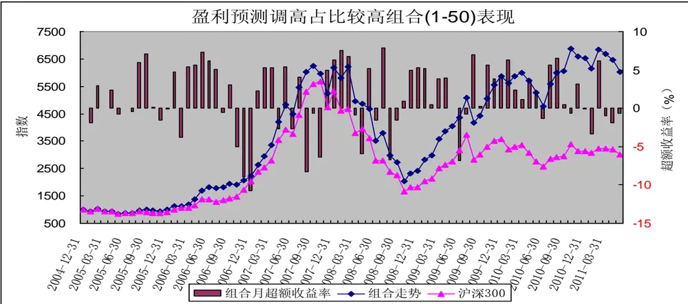
资料来源：华泰证券

2005 年以来，盈利预测调高占比较高股票构成的组合（1-50）整体上大幅跑赢沪深 300 指数；盈利预

测调高占比较高股票组合（1-50）跑赢沪深300 指数主要集中在 2008 年10月以来的震荡市期间。

图表 12：盈利预测调高占比较高股票组合相对盈利预测调高占比较低股票组合的表现
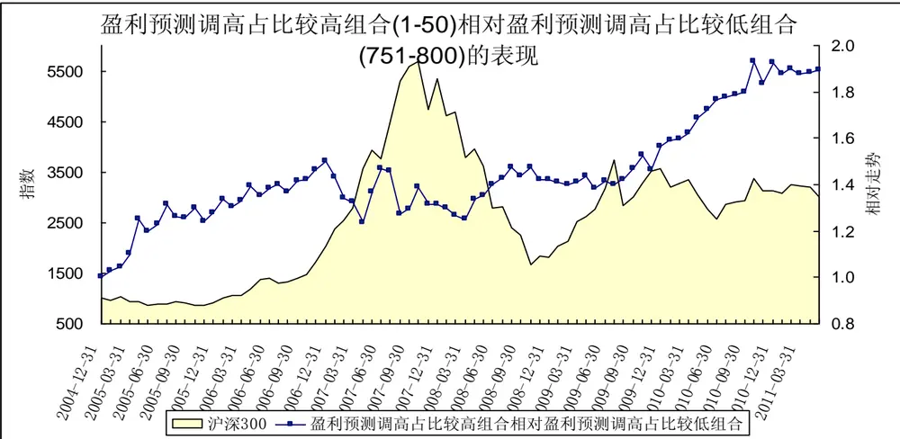
资料来源：华泰证券

2005 年以来，盈利预测调高占比较高股票构成的组合整体上大幅跑赢盈利预测调高占比较低股票构成的组合。

## 五、最近 1个月评级调高调高占比

图表 13：评级调高占比由高到低排序处于各区间的组合表现

| 评级调高占比由高到低排序 | 2005年1月2011年5月收益 | 年化收益率 | 跑赢沪深 300 指数次数 | 跑赢概率 |
| --- | --- | --- | --- | --- |
| 沪深 300 指数 | 200.16% | 18.69% |  |  |
| 1-50 | 484.94% | 31.71% | 51 | 66.23% |
| 1-100 | 390.42% | 28.14% | 50 | 64.94% |
| 101-200 | 294.30% | 23.85% | 46 | 59.74% |
| 201-300 | 222.11% | 20.01% | 40 | 51.95% |
| 301-400 | 300.02% | 24.13% | 43 | 55.84% |
| 401-500 | 263.35% | 22.28% | 40 | 51.95% |
| 501-600 | 321.68% | 25.15% | 41 | 53.25% |
| 601-700 | 226.28% | 20.25% | 44 | 57.14% |
| 701-800 | 257.54% | 21.98% | 43 | 55.84% |
| 751-800 | 278.90% | 23.08% | 47 | 61.04% |

资料来源：华泰证券

由上表可知，从 2005年至今的区间累计收益看，整体上说，评级调高占比越高，表现越好。评级调高

占比较高股票构成的组合（1-50）、组合（1-100）表现较好，大幅超越沪深300 指数，也大大好于其他组合；
除这两个组合之外，其余组合之间的差别并不是很明显。

从跑赢沪深 300 指数的概率看，整体上来说，评级调高占比较高股票构成的组合表现好于评级调高占比较低股票构成的组合，评级调高占比较高股票组合（1-50）、组合（1-100）跑赢沪深 300指数的概率分别高达 66.23%和64.94%，但是评级调高占比较低股票组合（751-800）跑赢沪深300 指数的概率也达61.04%。

由评级调高占比最高的50 只中证 800 指数成份股构成的等权重组合跑赢沪深 300 指数，2005年 1月至2011年5月间的累计收益率为484.94%，年化收益率为31.71%；同期沪深300指数的累计收益率为200.16%，年化收益率为 18.69%。

图表 14：评级调高占比由高到低排序处于各区间的组合的绩效分析

| 评级调高占比由高到低排序 | alpha | beta | sharpe | treynor | jensen | 跟踪误差 | 信息比率 T | 检验的 p 值 |
| --- | --- | --- | --- | --- | --- | --- | --- | --- |
| 1-50 | 1.5326 | 0.9425 | 0.3130 | 3.6295 | 1.5325 | 0.0461 | 0.8030 | 0.006 |
| 1-100 | 1.2547 | 0.9561 | 0.2942 | 3.3157 | 1.2546 | 0.0378 | 0.6536 | 0.006 |
| 101-200 | 0.9588 | 1.0068 | 0.2548 | 2.9559 | 0.9588 | 0.0475 | 0.2576 | 0.072 |
| 201-300 | 0.7255 | 1.0047 | 0.2296 | 2.7257 | 0.7255 | 0.0533 | 0.0534 | 0.229 |
| 301-400 | 1.0202 | 0.9813 | 0.2571 | 3.0431 | 1.0201 | 0.0518 | 0.2504 | 0.096 |
| 401-500 | 0.8943 | 0.9932 | 0.2431 | 2.9039 | 0.8943 | 0.0545 | 0.1506 | 0.158 |
| 501-600 | 1.0542 | 1.0226 | 0.2563 | 3.0344 | 1.0543 | 0.0541 | 0.2916 | 0.074 |
| 601-700 | 0.7718 | 0.9775 | 0.2323 | 2.7930 | 0.7717 | 0.0551 | 0.0616 | 0.250 |
| 701-800 | 0.8853 | 0.9694 | 0.2457 | 2.9168 | 0.8853 | 0.0517 | 0.1442 | 0.163 |
| 751-800 | 0.9273 | 1.0234 | 0.2447 | 2.9096 | 0.9273 | 0.0552 | 0.1854 | 0.122 |

资料来源：华泰证券

从各组合的绩效指标看，评级调高占比较高股票组合的表现好于评级调高占比较低股票组合，组合（1-50）、组合（1-100）的 alpha 值均为正，其月超额收益率在 1%的显著水平显著为正，信息比率分别为0.8030 和 0.6536。

图表 15：评级调高占比较高股票组合表现
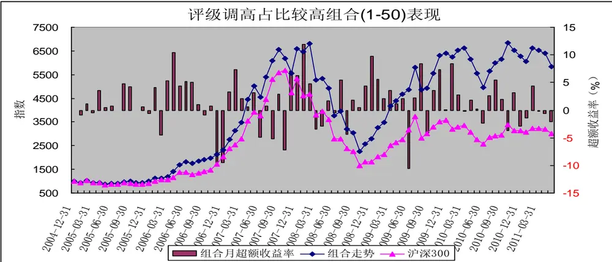
资料来源：华泰证券

2005 年以来，评级调高占比较高股票构成的组合（1-50）整体上跑赢沪深300 指数，在大多数月份里，评级调高占比较高股票组合（1-50）跑赢了沪深 300 指数；而在 3 次典型的大盘蓝筹股行情期间（2006 年11 月至 12 月，2007年 6月至 10 月，2009年 6 月）评级调高占比较高股票组合（1-50）大幅落后于沪深 300指数。

图表 16：评级调高占比较高股票组合相对评级调高占比较低股票组合的表现
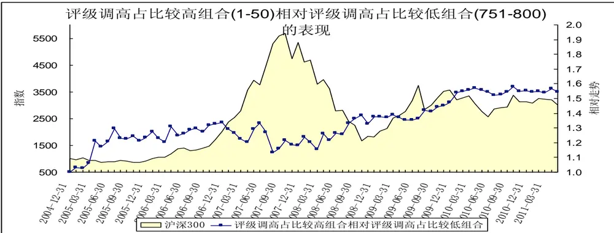
资料来源：华泰证券

2005年以来，评级调高占比较高股票构成的组合整体上跑赢评级调高占比较低股票构成的组合。

## 六、最近 1个月净利润上调幅度占比

图表 17：净利润上调幅度由大到小排序处于各区间的组合表现

| 净利润上调幅度由大到小排序 | 2005年1月2011年5月收益 | 年化收益率 | 跑赢沪深 300 指数次数 | 跑赢概率 |
| --- | --- | --- | --- | --- |
| 沪深 300 指数 | 200.16% | 18.69% |  |  |
| 1-50 | 518.07% | 32.84% | 51 | 66.23% |
| 1-100 | 563.48% | 34.32% | 52 | 67.53% |
| 101-200 | 299.75% | 24.12% | 43 | 55.84% |
| 201-300 | 259.22% | 22.06% | 44 | 57.14% |
| 301-400 | 351.93% | 26.51% | 44 | 57.14% |
| 401-500 | 248.15% | 21.47% | 42 | 54.55% |
| 501-600 | 273.90% | 22.83% | 45 | 58.44% |
| 601-700 | 240.73% | 21.06% | 44 | 57.14% |
| 701-800 | 115.80% | 12.74% | 39 | 50.65% |
| 751-800 | 126.24% | 13.57% | 43 | 55.84% |

资料来源：华泰证券

由上表可知，从 2005年至今的区间累计收益看，整体上说，净利润上调幅度越大，表现越好。净利润上调幅度较大股票构成的组合（1-50）、组合（1-100）表现较好，大幅超越沪深300指数，也大大好于其他组合；净利润上调幅度较小股票构成的组合（601-700）、组合（701-800）表现较差，落后于沪深300 指数，也大大落后于其他组合。

从跑赢沪深 300 指数的概率看，净利润上调幅度越大，表现越好，净利润上调幅度较大股票构成的组合（1-50）、组合（1-100）跑赢沪深 300 指数的概率分别达 66.23%和 67.53%。

由净利润上调幅度最大的 50 只中证 800指数成份股构成的等权重组合跑赢沪深 300 指数，2005年1 月至 2011 年 5 月间的累计收益率为 518.07%，年化收益率为 32.84%；同期沪深 300 指数的累计收益率为200.16%，年化收益率为 18.69%。

图表 18：净利润上调幅度由大到小排序处于各区间的组合的绩效分析

| 净利润上调幅度由大到小排序 | alpha | beta | sharpe | treynor | jensen | 跟踪误差 | 信息比率 T | 检验的p值 |
| --- | --- | --- | --- | --- | --- | --- | --- | --- |
| 1-50 | 1.5294 | 1.0353 | 0.3028 | 3.4809 | 1.5295 | 0.0480 | 0.8608 | 0.003 |
| 1-100 | 1.6209 | 1.0053 | 0.3199 | 3.6160 | 1.6210 | 0.0418 | 1.1287 | 0.000 |
| 101-200 | 1.0109 | 0.9465 | 0.2690 | 3.0714 | 1.0107 | 0.0406 | 0.3182 | 0.050 |
| 201-300 | 0.8709 | 1.0210 | 0.2382 | 2.8565 | 0.8709 | 0.0571 | 0.1343 | 0.162 |
| 301-400 | 1.2031 | 0.9857 | 0.2658 | 3.2240 | 1.2031 | 0.0584 | 0.3373 | 0.078 |
| 401-500 | 0.8642 | 0.9996 | 0.2350 | 2.8681 | 0.8642 | 0.0602 | 0.1036 | 0.210 |
| 501-600 | 0.9688 | 0.9828 | 0.2444 | 2.9892 | 0.9687 | 0.0598 | 0.1600 | 0.172 |
| 601-700 | 0.7963 | 0.9784 | 0.2400 | 2.8173 | 0.7962 | 0.0491 | 0.1074 | 0.180 |
| 701-800 | 0.1851 | 0.9939 | 0.1869 | 2.1897 | 0.1851 | 0.0487 | -0.2249 | 0.758 |
| 751-800 | 0.2787 | 0.9877 | 0.1909 | 2.2857 | 0.2787 | 0.0542 | -0.1771 | 0.684 |

从各组合的绩效指标看，净利润上调幅度较大股票组合的表现大大好于净利润上调幅度较小股票组合，组合（1-50）、组合（1-100）的 alpha 值均为正，其月超额收益率在 1%的显著水平显著为正，信息比率分别为 0.8608 和 1.1287。

图表 19：净利润上调幅度较大股票组合表现
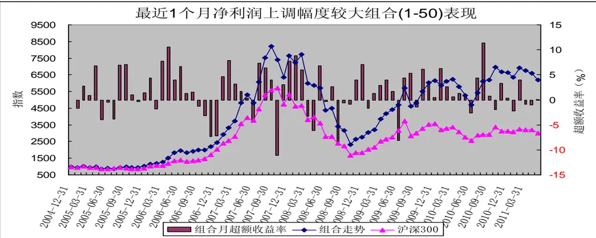
资料来源：华泰证券

2005 年以来，净利润上调幅度较大股票构成的组合（1-50）整体上跑赢沪深 300 指数，在大多数月份里，净利润上调幅度较大股票组合（1-50）跑赢了沪深 300指数。

图表 20：净利润上调幅度较大股票组合相对净利润上调幅度较小股票组合的表现
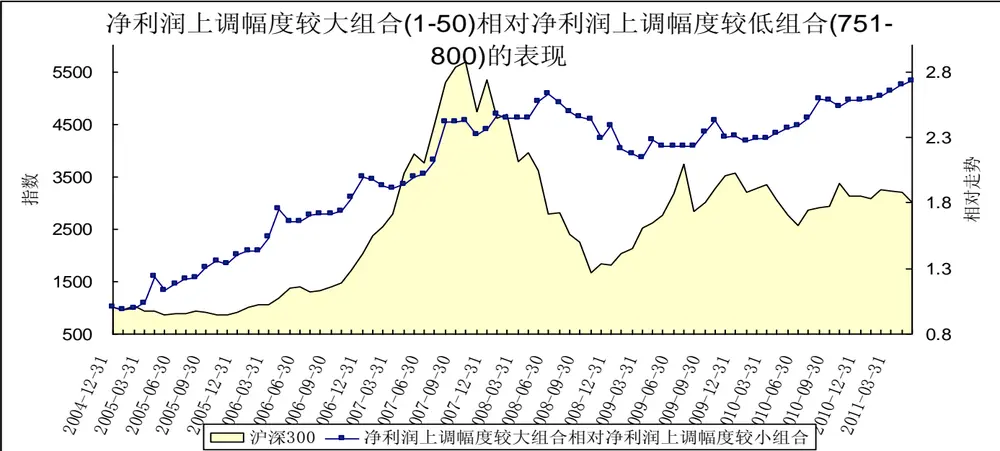
资料来源：华泰证券

2005 年以来，净利润上调幅度较大股票构成的组合整体上大幅跑赢净利润上调幅度较小股票构成的组合。

## 七、最近 1个月营业收入上调幅度

图表 21：主营收入上调幅度由大到小排序处于各区间的组合表现

| 主营收入上调幅度由大到小排序 | 2005年1月2011年5月收益 | 年化收益率 | 跑赢沪深 300 指数次数 | 跑赢概率 |
| --- | --- | --- | --- | --- |
| 沪深 300 指数 | 200.16% | 18.69% |  |  |
| 1-50 | 326.25% | 25.36% | 48 | 62.34% |
| 1-100 | 331.06% | 25.58% | 47 | 61.04% |
| 101-200 | 261.62% | 22.19% | 47 | 61.04% |
| 201-300 | 247.12% | 21.41% | 42 | 54.55% |
| 301-400 | 357.74% | 26.77% | 43 | 55.84% |
| 401-500 | 302.70% | 24.26% | 43 | 55.84% |
| 501-600 | 246.09% | 21.36% | 41 | 53.25% |
| 601-700 | 264.37% | 22.34% | 47 | 61.04% |
| 701-800 | 248.97% | 21.52% | 46 | 59.74% |
| 751-800 | 243.69% | 21.23% | 45 | 58.44% |

资料来源：华泰证券

由上表可知，从 2005年至今的区间累计收益看，整体上说，主营收入上调幅度越大，表现越好，但各组合之间的差别不是很显著。

从跑赢沪深 300 指数的概率看，各组合之间不是的差别不是很显著；主营收入上调幅度处于两段（较高、较低）的表现不错，处于中间位置的表现较差。

由主营收入上调幅度最大的 50只中证 800指数成份股构成的等权重组合跑赢沪深 300 指数，2005年 1月至 2011 年 5 月间的累计收益率为 326.25%，年化收益率为 25.36%；同期沪深 300 指数的累计收益率为200.16%，年化收益率为 18.69%。

图表 22：主营收入上调幅度由大到小排序处于各区间的组合的绩效分析

| 主营收入上调幅度由大到小排序 | alpha | beta | sharpe | treynor | jensen | 跟踪误差 | 信息比率 | T检验的p值 |
| --- | --- | --- | --- | --- | --- | --- | --- | --- |
| 1-50 | 1.0731 | 0.9712 | 0.2733 | 3.1083 | 1.0730 | 0.0405 | 0.4046 | 0.027 |
| 1-100 | 1.0576 | 0.9896 | 0.2734 | 3.0722 | 1.0576 | 0.0373 | 0.4556 | 0.014 |
| 101-200 | 0.8861 | 0.9649 | 0.2497 | 2.9217 | 0.8860 | 0.0478 | 0.1670 | 0.135 |
| 201-300 | 0.8299 | 1.0142 | 0.2345 | 2.8218 | 0.8299 | 0.0575 | 0.1061 | 0.192 |
| 301-400 | 1.1987 | 1.0059 | 0.2655 | 3.1952 | 1.1987 | 0.0578 | 0.3544 | 0.065 |
| 401-500 | 1.0327 | 1.0108 | 0.2502 | 3.0252 | 1.0327 | 0.0589 | 0.2261 | 0.117 |
| 501-600 | 0.8530 | 0.9885 | 0.2362 | 2.8665 | 0.8530 | 0.0581 | 0.1026 | 0.212 |
| 601-700 | 0.9161 | 0.9491 | 0.2521 | 2.9686 | 0.9159 | 0.0488 | 0.1710 | 0.144 |
| 701-800 | 0.7968 | 0.9893 | 0.2453 | 2.8089 | 0.7968 | 0.0426 | 0.1488 | 0.111 |
| 751-800 | 0.7842 | 1.0042 | 0.2398 | 2.7845 | 0.7843 | 0.0474 | 0.1194 | 0.143 |

资料来源：华泰证券

从各组合的绩效指标看，主营收入上调幅度较大股票组合的表现略好于主营收入上调幅度较小股票组合，组合（1-50）、组合（1-100）的 alpha 值均为正，其月超额收益率在 5%的显著水平显著为正，信息比率分别为 0.4046 和 0.4556。

图表 23：主营收入上调幅度较大股票组合表现
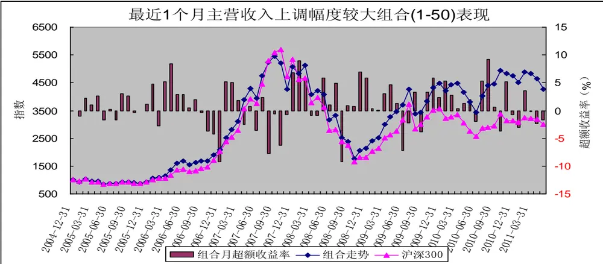
资料来源：华泰证券

2005 年以来，主营收入上调幅度较大股票构成的组合（1-50）整体上跑赢沪深 300 指数，主营收入上调幅度较大股票组合（1-50）跑赢沪深 300 指数主要集中在2009年8 月以来的震荡市期间。

图表 24：主营收入上调幅度较大股票组合相对主营收入上调幅度较小股票组合的表现
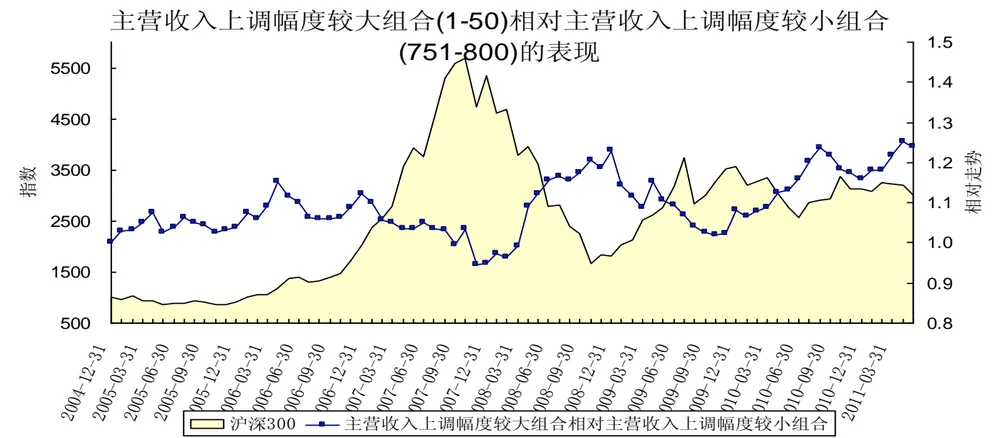

资料来源：华泰证券

2005 年以来，主营收入上调幅度较大股票构成的组合整体上小幅跑赢主营收入上调幅度较小股票构成的组合。

## 八、结论

通过对2005 年以来市场的分析，整体上来说，分析师预测因子（预测当年净利润增长率、预测当年主营业务收入增长率、最近 1 个月预测净利润上调幅度、最近 1 个月预测主营营业收入上调幅度、最近 1 个月盈利预测调高占比、最近 1 个月上调评级占比）较高的股票组合表现通常较好，整体上超越沪深 300 指数，也优于分析师预测较差的股票构成的组合。

分析师预测因子（预测当年净利润增长率、预测当年主营业务收入增长率、最近 1 个月预测净利润上调幅度、最近 1 个月预测主营营业收入上调幅度、最近 1 个月盈利预测调高占比、最近 1 个月上调评级占比）是影响股票收益的重要因子，其中最近1 个月净利润上调幅度是最为显著的正向因子。

从预测当年净利润增长率看，整体上说，预测当年净利润增长率较高，表现较好，但差别不是很明显。2005 年 1月至2011年 5月间，由预测当年净利润增长率最高的50 只中证 800 指数成份股构成的等权重组合的年化收益率为 28.58%，跑赢沪深 300 指数的概率为 59.74%；由预测当年净利润增长率最低的 50 只中证 800 指数成份股构成的等权重组合的年化收益率为 23.71%，跑赢沪深300 指数的概率为 61.04%；同期沪深 300 指数的年化收益率为 18.69%。

从预测当年主营收入增长率看，整体上说，预测当年主营收入增长率较高，表现较好，但差别不是特别明显。2005年1 月至 2011 年5月间， 由预测当年主营收入增长率最高的 50 只中证 800指数成份股构成的等权重组合的年化收益率为 32.06%，跑赢沪深300 指数的概率为64.94%；由预测当年主营收入增长率最低的 50 只中证 800 指数成份股构成的等权重组合的年化收益率为 25.52%，跑赢沪深 300 指数的概率为54.55%；同期沪深 300 指数的年化收益率为 18.69%。

从盈利预测调高占比看，整体上说，盈利预测调高占比较高，表现较好，但差别不是特别明显。2005年 1 月至2011年 5月间， 由盈利预测调高占比最高的50只中证 800指数成份股构成的等权重组合的年化收益率为 32.29%，跑赢沪深 300 指数的概率为 59.74%；由盈利预测调高占比最低的 50 只中证 800 指数成份股构成的等权重组合的年化收益率为 19.77%，跑赢沪深300指数的概率为 59.74%；同期沪深300 指数的年化收益率为 18.69%。

从评级调高占比看，整体上说，评级调高占比较高，表现较好，但差别不是特别明显。2005 年 1 月至2011 年 5 月间， 由评级调高占比最高的 50 只中证 800 指数成份股构成的等权重组合的年化收益率为31.71%，跑赢沪深 300 指数的概率为 66.23%；由评级调高占比最低的 50 只中证 800 指数成份股构成的等权重组合的年化收益率为23.08%，跑赢沪深300 指数的概率为 61.04%；同期沪深300 指数的年化收益率为18.69%。

从净利润上调幅度看，整体上说，净利润上调幅度越大，表现越好，差别较为显著。2005 年1 月至 2011年 5 月间，由净利润上调幅度最大的 50只中证 800 指数成份股构成的等权重组合的年化收益率为32.84%，跑赢沪深300指数的概率为 66.23%；由净利润上调幅度最小的 50 只中证 800 指数成份股构成的等权重组合的年化收益率为13.57%，跑赢沪深 300 指数的概率为 55.84%；同期沪深300 指数的年化收益率为18.69%。

从主营收入上调幅度看，整体上说，主营收入上调幅度较大，表现较好，但差别不显著。2005 年 1 月至 2011 年 5月间， 由主营收入上调幅度最大的50 只中证 800 指数成份股构成的等权重组合的年化收益率为 25.36%，跑赢沪深 300 指数的概率为 62.34%；由主营收入上调幅度最小的 50 只中证 800 指数成份股构成的等权重组合的年化收益率为 ，跑赢沪深 指数的概率为 ；同期沪深 指数的年化收益率为 18.69%。

## 免责条款：

本报告的信息均来源于公开资料，本公司对这些信息的准确性、完整性或可靠性不作任何保证，也不保证所包含的信息和建议不会发生任何变更。本公司力求报告内容的客观、公正，但文中的观点、结论和建议仅供参考，不构成所述证券的买卖出价或征价，投资者据此做出的任何投资决策与本公司和作者无关。本公司及作者在自身所知情的范围内，与本报告中所评价或推荐的证券没有利害关系。在法律许可的情况下，本公司及其所属关联机构可能会持有报告中提到的公司所发行的证券头寸并进行交易，也可能为这些公司提供或者争取提供投资银行、财务顾问或者金融产品等相关服务。

报告版权仅为本公司所有，未经书面许可，任何机构和个人不得以翻版、复制、发表、引用或再次分发他人等任何形式侵犯本公司版权。如征得本公司同意进行引用、刊发的，需在允许的范围内使用，并注明出处为“华泰证券研究所”，且不得对本报告进行任何有悖原意的引用、删节和修改。本公司保留追究相关责任的权利。

本公司具有中国证监会核准的“证券投资咨询”业务资格，经营许可证编号为：Z23032000。