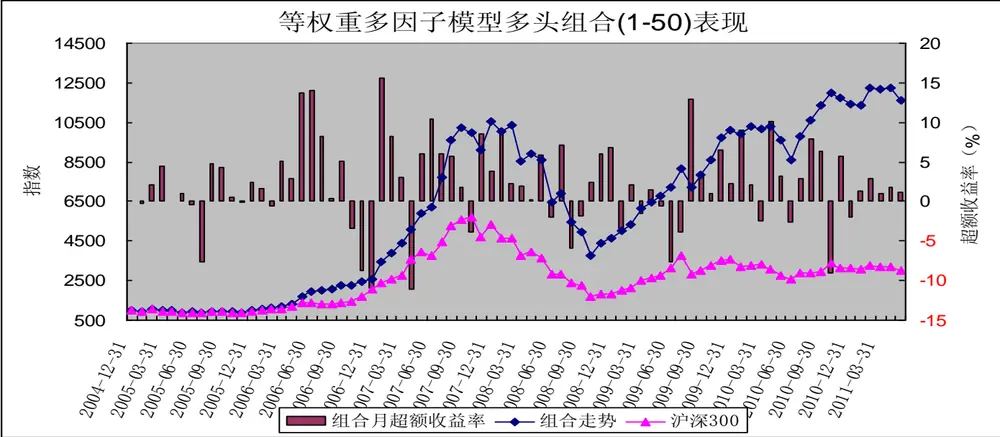
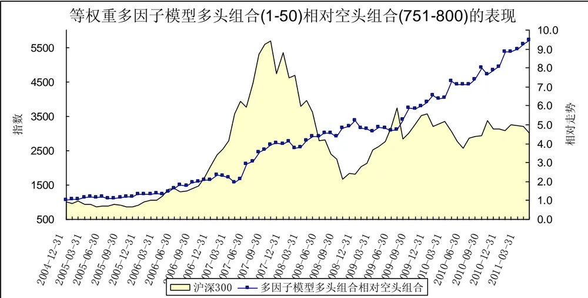
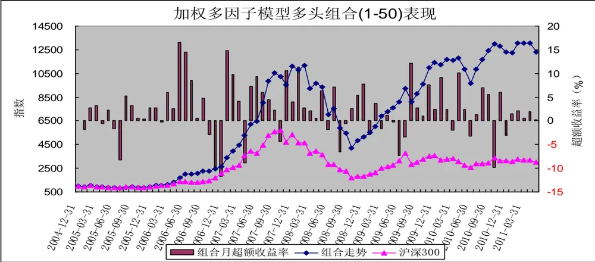
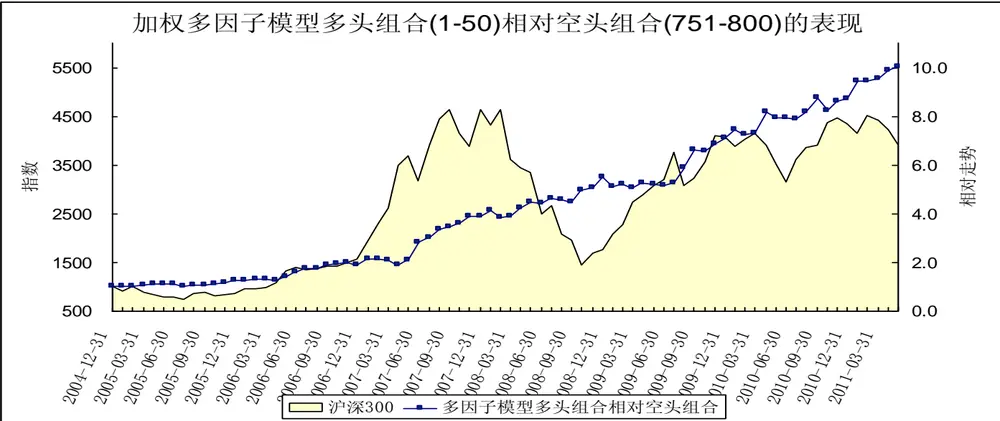

# 多因子选股策略

[table_research]研究员：魏刚 执业证书编号：S0570510120042

025-83290914 weigang@mail.htsc.com.cn

http://t.zhangle.com/4074

## ——数量化选股策略之十二

## 相关研究

《数量化选股策略之十一：分析师预[table_relate]测因子分析》2011-08-31

《数量化选股策略之十：股东因子分析》2011-08-30

《数量化选股策略之九：交投波动因子分析》2011-08-24

《数量化选股策略之八：动量反转因子分析》2011-07-27

《数量化选股策略之七：盈利因子分析》2011-07-27

《数量化选股策略之六：成长因子分析》2011-07-12

《数量化选股策略之五：估值因子分析》2011-07-06

《数量化选股策略之四：规模因子分析》2011-06-30

## 投资要点：

在前面几篇报告中我们对规模因子、估值因子、成长因子、盈利因子、动量反转因子、交投波动因子、股东因子和分析师预测因子进行了分析，其中规模因子（总市值）、估值因子（市盈率 TTM）、动量反转因子（前1个月涨跌幅）、波动因子（前 1个月波动率）、分析师预测因子（最近 1 个月净利润上调幅度）等是较为显著的因子。

由总市值、市盈率TTM、营业利润同比增长率、净资产收益率、前 1个月涨跌幅、前 1个月日均换手率、前 1 个月波动率、户均持股比例变化、机构持股变化、最近 1 个月净利润上调幅度等 10 个因子构造的等权重多因子策略表现较好。由综合得分最高的20 只中证 800指数成份股构成的等权重组合大幅跑赢沪深300指数，2005 年 1月至2011 年 5 月间的累计收益率为 1517.29%，年化收益率达 54.34%；由综合得分最高的 50 只中证 800 指数成份股构成的等权重组合同期的累计收益率为 1059.72%，年化收益率达 46.54%；同期沪深 300 指数的累计收益率为200.16%，年化收益率为18.69%。

由总市值、市盈率TTM、营业利润同比增长率、净资产收益率、前 1个月涨跌幅、前 1个月日均换手率、前1 个月波动率、户均持股比例变化、机构持股变化、最近 1 个月净利润上调幅度等 10 个因子构造的加权多因子策略表现较好。由综合得分最高的 20 只中证 800指数成份股构成的等权重组合大幅跑赢沪深300指数，2005 年 1月至2011 年 5 月间的累计收益率为 1814.25%，年化收益率达 58.45%；由综合得分最高的 50 只中证 800 指数成份股构成的等权重组合同期的累计收益率为 1127.26%，年化收益率达 47.84%；同期沪深 300 指数的累计收益率为200.16%，年化收益率为18.69%。

影响股价走势的主要因子包括市场整体走势（市场因子，系统性风险）、估值因子（市盈率、市净率、市销率、市现率、企业价值倍数、PEG等）、成长因子（营业收入增长率、营业利润增长率、净利润增长率、每股收益增长率、净资产增长率、股东权益增长率、经营活动产生的现金流量金额增长率等）、盈利能力因子（销售净利率、毛利率、净资产收益率、资产收益率、营业费用比例、财务费用比例、息税前利润与营业总收入比等）、动量反转因子（前期涨跌幅等）、交投因子（前期换手率、量比等）、规模因子（流通市值、总市值、自由流通市值、流通股本、总股本等）、股价波动因子（前期股价振幅、日收益率标准差等）、分析师预测因子（预测净利润增长率、预测主营业务增长率、盈利预测调整等）。

在前面几篇报告中我们对规模因子、估值因子、成长因子、盈利因子、动量反转因子、交投波动因子、股东因子和分析师预测因子进行了分析，其中规模因子（总市值）、估值因子（市盈率 TTM）、动量反转因子（前 1 个月涨跌幅）、波动因子（前 1 个月波动率）、分析师预测因子（最近 1 个月净利润上调幅度）等是较为显著的因子。本文我们将筛选因子组合构建多因子选股模型，分析多因子选股模型的表现。

## 一、前言

比较常用的因子回报度量方法有：横截面回归法和排序打分法。横截面回归法利用因子的取值（风险暴露）与下期股票收益率之间的线性关系，以最小二乘法拟合出的回归系数定义为因子回报。FF 排序打分法原型是由 Fama 和 French 提出，通过对因子暴露进行排序，排名靠前的股票组合减去排名靠后的股票组合下一期的平均收益率定义为因子回报，他们提出的排序法已经被发采用。我们采用排序法对各因子进行分析。

（1）我们的研究范围为中证 800指数成份股；

（2）研究期间为2005年 1 月至2011年5月；

（3）组合调整周期为月，每月最后一个交易日收盘后构建下一期的组合；

（4） 我们按各指标排序，把 800 只成份股分成：（1-50）、（1-100）、（101-200）、（201-300）、（301-400）、（401-500）、（501-600）、（601-700）、（701-800）、（（751-800）等 10 个组合；

（5）组合构建时股票的买入卖出价格为组合调整日收盘价；

（6）组合构建时为等权重；

（7）在持有期内，若某只成份股被调出中证 800指数，不对组合进行调整；

（8）组合构建时，买卖冲击成本均为 0.1%、买卖佣金均为 0.1%，印花税为 0.1%；

（9）组合A相对组合 B的表现定义为：组合 A的净值/组合B的净值的走势；

（10）由于各因子的量纲不一样，我们对各因子进行正态标准化处理，公式为：（因子值—因子均值）/因子标准差。

## 二、因子汇总

图表 1：因子备选池（各因子历史表现见附录）

| 因子类型 | 因子 | 因子描述 | 因子显著性 |
| --- | --- | --- | --- |
| 规模因子 | 总市值 | 总部本*股票收盘价 | ☆☆☆☆☆ |
|  | 流通市值 | 流通股本*股票收盘价 | ☆☆☆☆ |
|  | 自由流通市值 | 自由流通股本*股票收盘价 | ☆☆☆☆ |
| 估值因子 | 市盈率（TTM） | 股票收盘价/最近12个月每股收益 | ☆☆☆☆ |
|  | 市净率（上年年报） | 股票收盘价/来自于上年年报的每股净资产 | ☆☆☆ |
|  | 市销率（TTM） | 股票收盘价/最近12个月每股销售额 | ☆☆☆ |
|  | 市现率（TTM） | 股票收盘价/最近12个月的每股经营性现金流 | ☆☆☆ |
|  | 企业价值倍数（EV2/EBTIDA） | 企业价值（剔除货币资金）/企业收益（扣除利息、税金、折旧和摊销前的收益，来源于最新年报） | ☆☆ |
| 成长因子 | 营业收入同比增长率 | 营业收入/去年同期营业收入-1 | ☆☆ |
|  | 营业利润同比增长率 | 营业利润/去年同期营业利润-1 | ☆☆ |
|  | 归属母公司的净利润同比增长率（扣除非经常性损益） | 归属母公司的净利润/去年同期归属母公司的净利润-1 | ☆☆ |
|  | 经营活动产生的现金流净额同比增长率 | 经营活动产生的现金流净额/去年同期经营活动产生的现金流净额-1 | ☆☆ |
| 盈利因子 | 净资产收益率ROE（扣除非经常性损益、摊薄） | 扣除非经常性损益后的净利润/期末净资产 | ☆☆ |
|  | 总资产报酬率 ROA | 息税前利润*2/（期初总资产+期末总资产） | ☆ |
|  | 销售毛利率 | 毛利/营业收入 | ☆ |
|  | 销售净利率 | 净利润/营业收入 |  |
| 动量反转因子 | 前1个月涨跌幅 |  | ☆☆☆☆ |
|  | 前2个月涨跌幅 |  | ☆☆☆ |
|  | 前3个月涨跌幅 |  | ☆☆☆ |
|  | 前6个月涨跌幅 |  | ☆☆☆ |
| 交投因子 | 前1个月日均换手率 |  | ☆☆☆ |
| 波动因子 | 前一个月波动率 | 日收益率的标准差的年化值 | ☆☆☆☆ |
|  | 前1个月振幅 | （月最高价-月最低价）/前一个月收盘价 | ☆☆ |
| 股东因子 | 户均持股比例 | （流通股合计/股东户数）/流通股合计 | ☆☆ |
|  | 户均持股比例变化 | 户均持股比例-前1季度户均持股比例 | ☆☆☆ |
|  | 机构持股比例变化 | 机构持股比例（基金、券商、券商理财、信托）-前1季度机构持股比例 | ☆☆☆ |
| 分析师预测因子 | 预测当年净利润增长率（平均值） | （预测当年净利润-前1年净利润）/abs（前1年净利润） | ☆ |
|  | 预测当年主营业务收入增长率（平均值） | （预测当年主营收入-前1年主营收入）/abs（前1年主营收入） | ☆☆ |
|  | 最近1个月预测净利润上调幅度 | 最新当年净利润预测平均值/1个月前当年净利润预测平均值-1 | ☆☆☆☆ |
|  | 最近1个月预测主营营业收入上调幅度 | 最新当年主营业务收入预测平均值/1个月前当年主营业务收入预测平均值-1 |  |
|  | 最近1个月盈利预测调高占比 | 最近1个月净利润调高家数/最近1个月发布盈利预测报告家数 | ☆☆ |
|  | 最近1个月上调评级占比 | 最近1个月上调评级家数/最近1个月发表评级报告家数 | ☆☆ |

资料来源：华泰证券

## 三、等权重多因子选股策略

我们选取规模因子（总市值）、估值因子（市盈率TTM）、成长因子（营业利润同比增长率）、盈利因子（净资产收益率）、动量反转因子（前 1 个月涨跌幅）、交投因子（前 1 个月日均换手率）、波动因子（前 1个月波动率）、股东因子（户均持股比例变化、机构持股变化）、分析师预测因子（最近 1 个月净利润上调幅度）等10个因子构造等权重多因子策略。

在计算各股票的综合得分时，我们首先对各因子进行正态标准化处理；然后加总该只股票各正向因子（成长因子、盈利因子、股东因子、分析师预测因子）标准化之后的值；之后再减去各负向因子（规模因子、估值因子、动量反转因子、交投因子、波动因子）标准化之后的值。

图表 2：综合得分由高到低排序处于各区间的组合表现

| 综合得分由高到低排序 | 2005年1月2011年5月收益 | 年化收益率 | 跑赢沪深 300 指数次数 | 跑赢概率 |
| --- | --- | --- | --- | --- |
| 沪深 300 指数 | 200.16% | 18.69% |  |  |
| 1-20 | 1517.29% | 54.34% | 53 | 68.83% |
| 1-50 | 1059.72% | 46.54% | 55 | 71.43% |
| 1-100 | 839.16% | 41.80% | 53 | 68.83% |
| 101-200 | 578.69% | 34.79% | 52 | 67.53% |
| 201-300 | 357.31% | 26.75% | 42 | 54.55% |
| 301-400 | 327.60% | 25.43% | 44 | 57.14% |
| 401-500 | 298.30% | 24.05% | 42 | 54.55% |
| 501-600 | 176.31% | 17.17% | 45 | 58.44% |
| 601-700 | 117.01% | 12.84% | 41 | 53.25% |
| 701-800 | 36.03% | 4.91% | 39 | 50.65% |
| 751-800 | 22.26% | 3.18% | 39 | 50.65% |

资料来源：华泰证券

由上表可知，从 2005年至今的区间累计收益看，整体上说，综合得分越高，表现越好。综合得分较高股票构成的组合（1-50）、组合（1-100）表现较好，大幅跑赢沪深300 指数，也大大好于综合得分较低股票构成的组合。

从跑赢沪深 300 指数的概率看，综合得分较高股票构成的组合也大大好于综合得分较低股票构成的组合。

由综合得分最高的 20只中证 800指数成份股构成的等权重组合大幅跑赢沪深300 指数，2005年 1月至2011 年5 月间的累计收益率为 1517.29%，年化收益率达54.34%；由综合得分最高的 50只中证800 指数成份股构成的等权重组合同期的累计收益率为 1059.72%，年化收益率达46.54%；同期沪深300 指数的累计收益率为 200.16%，年化收益率为 18.69%。

图表 3：综合得分由高到低排序处于各区间的组合的绩效分析

| 综合得分由高到低排序 | alpha | beta | sharpe | treynor | jensen | 跟踪误差 | 信息比率 | T检验的p值 |
| --- | --- | --- | --- | --- | --- | --- | --- | --- |
| 1-20 | 3.0122 | 0.9647 | 0.3852 | 5.1261 | 3.0121 | 0.0823 | 2.0789 | 0.000 |
| 1-50 | 2.5591 | 0.8689 | 0.4036 | 4.9485 | 2.5587 | 0.0592 | 1.8854 | 0.000 |
| 1-100 | 2.2243 | 0.8982 | 0.3768 | 4.4794 | 2.2240 | 0.0527 | 1.5733 | 0.001 |
| 101-200 | 1.7265 | 0.9524 | 0.3262 | 3.8161 | 1.7264 | 0.0493 | 0.9970 | 0.003 |
| 201-300 | 1.2297 | 0.9430 | 0.2788 | 3.3073 | 1.2295 | 0.0510 | 0.4004 | 0.054 |
| 301-400 | 1.0931 | 1.0001 | 0.2617 | 3.0965 | 1.0931 | 0.0528 | 0.3133 | 0.069 |
| 401-500 | 0.9959 | 1.0113 | 0.2519 | 2.9883 | 0.9959 | 0.0539 | 0.2366 | 0.097 |
| 501-600 | 0.4982 | 1.0297 | 0.2103 | 2.4874 | 0.4983 | 0.0535 | -0.0579 | 0.364 |
| 601-700 | 0.1645 | 1.0551 | 0.1824 | 2.1596 | 0.1646 | 0.0550 | -0.1962 | 0.664 |
| 701-800 | -0.4194 | 1.0240 | 0.1350 | 1.5940 | -0.4194 | 0.0525 | -0.4058 | 0.538 |
| 751-800 | -0.5118 | 0.9734 | 0.1239 | 1.4777 | -0.5119 | 0.0528 | -0.4378 | 0.351 |

资料来源：华泰证券

从各组合的绩效指标看，综合得分较高股票组合的表现好于综合得分较低股票组合，组合（1-50）、组合（1-100）的 alpha 值均为正，其月超额收益率在 1%的显著水平下显著为正，信息比率分别为 1.8854 和1.5733。

图表 4：综合得分较高股票组合表现

资料来源：华泰证券

2005 年以来，综合得分较高股票构成的组合（1-50）整体上跑赢沪深 300 指数，在大多数月份里跑赢了沪深 300 指数。综合得分较高股票构成的组合（1-50）仅在少数月份里跑输沪深 300 指数，如2006 年 10月至 12 月、2009 年 6月至 7月、2010年10 月，在这几个时间段内蓝筹股大幅上涨，大盘大幅拉升，市场通常处于上涨末期；此外，综合得分较高股票构成的组合（1-50）在2005年7 月、2007 年4 月也表现较差。图表 5：各种市场环境下多因子模型多头组合（1-50）的表现

| 市场环境 | 出现次数 | 多头组合跑赢次 | 多头组合跑赢 概率 | 超额收益 | 合超额收 | 超额收益 | 超额收益 |
| --- | --- | --- | --- | --- | --- | --- | --- |
| 震荡 |  | 数 |  | 率均值 | 益率中值 | 率最大值 | 率最小值 |
|  | 30 | 21 | 70.00% | 2.15 | 1.37 | 14.09 | -7.69 |
| 大幅下跌 | 18 | 14 | 77.78% | 3.95 | 3.81 | 12.87 | -5.94 |
| 大幅上涨 | 29 | 20 | 68.97% | 1.42 | 2.49 | 15.56 | -11.08 |
| 整体 | 77 | 55 | 71.43% | 2.30 | 2.11 | 15.56 | -11.08 |

资料来源：华泰证券

我们按沪深300指数的月涨跌幅把市场分为震荡（沪深 300指数月涨跌幅介于-5%和 5%之间）、大幅上涨（沪深 300 指数月涨幅大于 5%）、大幅下跌（沪深 300 指数月跌幅大于 5%）。由上表可知，在市场处于震荡、大幅下跌、大幅上涨时，多因子模型多头组合（1-50）均表现较好，跑赢沪深 300 指数的概率均在70%左右，且超额收益率均值、中值也均为正。多因子模型多头组合（1-50）大幅跑输沪深 300 指数主要集中在市场大幅上涨期间。

图表 6：综合得分较高股票组合相对综合得分较低股票组合的表现

资料来源：华泰证券

2005 年以来，综合得分较高股票构成的组合整体上大幅跑赢综合得分较低股票构成的组合。

## 四、加权多因子选股策略

我们选取规模因子（总市值）、估值因子（市盈率TTM）、成长因子（营业利润同比增长率）、盈利因子（净资产收益率）、动量反转因子（前 1 个月涨跌幅）、交投因子（前 1 个月日均换手率）、波动因子（前 1个月波动率）、股东因子（户均持股比例变化、机构持股变化）、分析师预测因子（最近 1 个月净利润上调幅度）等10个因子，根据其显著性赋予不同权重，构造加权多因子策略。

在计算各股票的综合得分时，我们首先对各因子进行正态标准化处理；然后依据各因子的显著性对各因子赋予不同的权重；然后加总该只股票各正向因子（成长因子权重为 2、盈利因子权重为2、股东因子权重为 3、分析师预测因子权重为 4）标准化之后的值；之后再减去各负向因子（规模因子权重为 5、估值因子权重为4、动量反转因子权重为4、交投因子权重为 3、波动因子权重为4）标准化之后的值。

图表 7：综合得分由高到低排序处于各区间的组合表现

| 综合得分由高到低排序 | 2005年1月2011年5月收益 | 年化收益率 | 跑赢沪深 300 指数次数 | 跑赢概率 |
| --- | --- | --- | --- | --- |
| 沪深 300 指数 | 200.16% | 18.69% |  |  |
| 1-20 | 1814.25% | 58.45% | 52 | 67.53% |
| 1-50 | 1127.26% | 47.84% | 55 | 71.43% |
| 1-100 | 899.01% | 43.17% | 51 | 66.23% |
| 101-200 | 536.88% | 33.46% | 48 | 62.34% |
| 201-300 | 450.39% | 30.46% | 46 | 59.74% |
| 301-400 | 289.56% | 23.62% | 42 | 54.55% |
| 401-500 | 264.41% | 22.34% | 43 | 55.84% |
| 501-600 | 194.38% | 18.33% | 44 | 57.14% |
| 601-700 | 111.73% | 12.41% | 44 | 57.14% |
| 701-800 | 31.16% | 4.32% | 35 | 45.45% |
| 751-800 | 22.38% | 3.20% | 37 | 48.05% |

资料来源：华泰证券

由上表可知，从 2005年至今的区间累计收益看，整体上说，综合得分越高，表现越好。综合得分较高股票构成的组合（1-50）、组合（1-100）表现较好，大幅跑赢沪深300 指数，也大大好于综合得分较低股票构成的组合。

从跑赢沪深 300 指数的概率看，综合得分较高股票构成的组合也大大好于综合得分较低股票构成的组合。

由综合得分最高的 20只中证 800指数成份股构成的等权重组合大幅跑赢沪深300 指数，2005年 1月至2011 年5 月间的累计收益率为 1814.25%，年化收益率达58.45%；由综合得分最高的 50只中证800 指数成份股构成的等权重组合同期的累计收益率为 1127.26%，年化收益率达47.84%；同期沪深 300指数的累计收益率为 200.16%，年化收益率为 18.69%。

图表 8：综合得分由高到低排序处于各区间的组合的绩效分析

| 综合得分由高到低排序 | alpha | beta | sharpe | treynor | jensen | 跟踪误差 | 信息比率 T | 检验的p 值 |
| --- | --- | --- | --- | --- | --- | --- | --- | --- |
| 1-20 | 3.3761 | 0.8666 | 0.4143 | 5.8989 | 3.3758 | 0.0884 | 2.3704 | 0.000 |
| 1-50 | 2.6415 | 0.8727 | 0.4063 | 5.0298 | 2.6411 | 0.0615 | 1.9586 | 0.000 |
| 1-100 | 2.3273 | 0.8831 | 0.3861 | 4.6386 | 2.3269 | 0.0548 | 1.6560 | 0.001 |
| 101-200 | 1.6655 | 0.9462 | 0.3164 | 3.7635 | 1.6654 | 0.0529 | 0.8272 | 0.003 |
| 201-300 | 1.4604 | 0.9608 | 0.2971 | 3.5234 | 1.4603 | 0.0523 | 0.6215 | 0.054 |
| 301-400 | 0.9982 | 0.9854 | 0.2515 | 3.0164 | 0.9981 | 0.0553 | 0.2100 | 0.069 |
| 401-500 | 0.8715 | 1.0159 | 0.2426 | 2.8614 | 0.8716 | 0.0525 | 0.1590 | 0.097 |
| 501-600 | 0.5500 | 1.0482 | 0.2158 | 2.5284 | 0.5501 | 0.0519 | -0.0144 | 0.364 |
| 601-700 | 0.1405 | 1.0435 | 0.1813 | 2.1383 | 0.1407 | 0.0533 | -0.2156 | 0.664 |
| 701-800 | -0.4939 | 1.0310 | 0.1312 | 1.5246 | -0.4938 | 0.0483 | -0.4539 | 0.538 |
| 751-800 | -0.5346 | 0.9809 | 0.1243 | 1.4585 | -0.5346 | 0.0489 | -0.4724 | 0.351 |

资料来源：华泰证券

从各组合的绩效指标看，综合得分较高股票组合的表现好于综合得分较低股票组合，组合（1-50）、组合（1-100）的 alpha 值均为正，其月超额收益率在 1%的显著水平下显著为正，信息比率分别为 1.9586 和1.6560。

图表 9：综合得分较高股票组合表现

资料来源：华泰证券

2005 年以来，综合得分较高股票构成的组合（1-50）整体上跑赢沪深 300 指数，在大多数月份里跑赢了沪深 300 指数。综合得分较高股票构成的组合（1-50）仅在几次蓝筹股行情期间（2006 年10月至12月、2009 年 6月至7月、2010 年10 月）大幅跑输沪深 300指数；此外，综合得分较高股票构成的组合（1-50）在 2005年 7月、2007年4月也表现较差。

图表 10：各种市场环境下加权多因子模型多头组合（1-50）的表现

| 市场环境 | 出现次数 | 多头组合跑赢次数 | 多头组合跑赢概率 | 超额收益率均值 | 合超额收益率中值 | 超额收益率最大值 | 超额收益率最小值 |
| --- | --- | --- | --- | --- | --- | --- | --- |
| 震荡 | 30 | 21 | 70.00% | 2.01 | 1.39 | 14.47 | -8.33 |
| 大幅下跌 | 18 | 14 | 77.78% | 4.17 | 2.86 | 12.19 | -6.49 |
| 大幅上涨 | 29 | 20 | 68.97% | 1.67 | 2.73 | 16.53 | -11.64 |
| 整体 | 77 | 55 | 71.43% | 2.39 | 2.38 | 16.53 | -11.64 |

资料来源：华泰证券

我们按沪深300指数的月涨跌幅把市场分为震荡（沪深 300指数月涨跌幅介于-5%和 5%之间）、大幅上涨（沪深 300 指数月涨幅大于 5%）、大幅下跌（沪深 300 指数月跌幅大于 5%）。由上表可知，在市场处于震荡、大幅下跌、大幅上涨时，加权多因子模型多头组合（1-50）均表现较好，跑赢沪深 300 指数的概率均在 70%左右，且超额收益率均值、中值也均为正。加权多因子模型多头组合（1-50）大幅跑输沪深 300 指数主要集中在市场大幅上涨期间。

图表 11：综合得分较高股票组合相对综合得分较低股票组合的表现

资料来源：华泰证券

2005 年以来，综合得分较高股票构成的组合整体上大幅跑赢综合得分较低股票构成的组合。

## 附录 各因子历史表现

## （一）规模因子

通过对2005 年以来市场的分析，不管是从总市值、还是流通市值和自由流通市值看，A股市场存在较为显著的小盘股效应。市值较小股票构造的组合整体上大幅超越沪深 300 指数，也大大优于总市值较大股票构造的组合。

规模因子（总市值、流通市值、自由流通市值）是影响股票收益的重要因子，其中总市值因子最为显著。

图表 12：总市值从小到大排序处于各区间的组合表现

| 总市值从小到大排序 | 2005年1月2011年5月收益 | 年化收益率 | 跑赢沪深 300 指数次数 | 跑贏概率 |
| --- | --- | --- | --- | --- |
| 沪深 300 指数 | 200.16% | 18.69% |  |  |
| 1-50 | 1021.10% | 45.77% | 49 | 63.64% |
| 1-100 | 814.26% | 41.20% | 47 | 61.04% |
| 101-200 | 473.13% | 31.29% | 47 | 61.04% |
| 201-300 | 271.40% | 22.70% | 44 | 57.14% |
| 301-400 | 246.74% | 21.39% | 41 | 53.25% |
| 401-500 | 247.91% | 21.46% | 42 | 54.55% |
| 501-600 | 169.65% | 16.73% | 40 | 51.95% |
| 601-700 | 222.65% | 20.04% | 46 | 59.74% |
| 701-800 | 87.76% | 10.32% | 31 | 40.26% |
| 751-800 | 68.73% | 8.50% | 29 | 37.66% |

资料来源：华泰证券

图表 13：流通市值从小到大排序处于各区间的组合表现

| 流通市值从小到大排序 | 2005年1月2011年5月收益 | 年化收益率 | 跑赢沪深 300 指数次数 | 跑赢概率 |
| --- | --- | --- | --- | --- |
| 沪深 300 指数 | 200.16% | 18.69% |  |  |
| 1-50 | 597.27% | 35.36% | 47 | 61.04% |
| 1-100 | 695.00% | 38.16% | 47 | 61.04% |
| 101-200 | 413.27% | 29.05% | 49 | 63.64% |
| 201-300 | 344.26% | 26.18% | 42 | 54.55% |
| 301-400 | 278.08% | 23.04% | 45 | 58.44% |
| 401-500 | 226.14% | 20.24% | 41 | 53.25% |
| 501-600 | 191.69% | 18.16% | 43 | 55.84% |
| 601-700 | 171.19% | 16.83% | 42 | 54.55% |
| 701-800 | 121.43% | 13.20% | 36 | 46.75% |
| 751-800 | 74.89% | 9.11% | 33 | 42.86% |

资料来源：华泰证券

图表 14：自由流通市值从小到大排序处于各区间的组合表现

| 自由流通市值从小到大排序 | 2005年1月2011年5月收益 | 年化收益率 | 跑赢沪深 300 指数次数 | 跑赢概率 |
| --- | --- | --- | --- | --- |
| 沪深 300 指数 | 200.16% | 18.69% |  |  |
| 1-50 | 664.90% | 37.33% | 46 | 59.74% |
| 1-100 | 688.01% | 37.97% | 46 | 59.74% |
| 101-200 | 493.93% | 32.02% | 48 | 62.34% |
| 201-300 | 335.64% | 25.79% | 45 | 58.44% |
| 301-400 | 266.92% | 22.47% | 41 | 53.25% |
| 401-500 | 199.85% | 18.67% | 43 | 55.84% |
| 501-600 | 180.32% | 17.43% | 39 | 50.65% |
| 601-700 | 181.40% | 17.51% | 42 | 54.55% |
| 701-800 | 120.65% | 13.13% | 42 | 54.55% |
| 751-800 | 87.51% | 10.30% | 32 | 41.56% |

资料来源：华泰证券

## （二）估值因子

通过对2005 年以来市场的分析，整体上来说，从市盈率、市净率、市销率、市现率、企业价值倍数等估值指标看，估值较低的股票组合表现较好。估值较低股票构造的组合整体上超越沪深 300 指数，也优于估值较高股票构造的组合。

估值因子（市盈率、市净率、市销率、市现率、企业价值倍数）是影响股票收益的重要因子，其中市盈率（PE,TTM）因子最为显著，其次是市现率（PCF,TTM）。

图表 15：市盈率（TTM）从低到高排序处于各区间的组合表现

| 市盈率从低到高排序 | 2005年1月2011年5月收益 | 年化收益率 | 跑赢沪深 300 指数次数 | 跑赢概率 |
| --- | --- | --- | --- | --- |
| 沪深 300 指数 | 200.16% | 18.69% |  |  |
| 1-50 | 689.98% | 38.02% | 53 | 68.83% |
| 1-100 | 594.14% | 35.27% | 54 | 70.13% |
| 101-200 | 575.34% | 34.69% | 50 | 64.94% |
| 201-300 | 357.59% | 26.76% | 46 | 59.74% |
| 301-400 | 272.75% | 22.77% | 48 | 62.34% |
| 401-500 | 227.39% | 20.31% | 43 | 55.84% |
| 501-600 | 131.02% | 13.95% | 44 | 57.14% |
| 601-700 | 116.82% | 12.82% | 44 | 57.14% |
| 701-800 | 194.67% | 18.35% | 42 | 54.55% |
| 751-800 | 203.78% | 18.92% | 44 | 57.14% |

资料来源：华泰证券

图表 16：市净率从低到高排序处于各区间的组合表现

| 市净率从低到高排序 | 2005年1月2011年5月收益 | 年化收益率 | 跑赢沪深 300 指数次数 | 跑赢概率 |
| --- | --- | --- | --- | --- |
| 沪深 300 指数 | 200.16% | 18.69% |  |  |
| 1-50 | 452.54% | 30.54% | 44 | 57.14% |
| 1-100 | 423.63% | 29.45% | 46 | 59.74% |
| 101-200 | 356.67% | 26.72% | 45 | 58.44% |
| 201-300 | 411.85% | 28.99% | 44 | 57.14% |
| 301-400 | 355.17% | 26.65% | 48 | 62.34% |
| 401-500 | 287.72% | 23.53% | 45 | 58.44% |
| 501-600 | 197.51% | 18.53% | 46 | 59.74% |
| 601-700 | 194.90% | 18.37% | 41 | 53.25% |
| 701-800 | 118.40% | 12.95% | 40 | 51.95% |
| 751-800 | 81.05% | 9.70% | 36 | 46.75% |

资料来源：华泰证券

图表 17：市销率（TTM）从低到高排序处于各区间的组合表现

| 市销率从低到高排序 | 2005年1月2011年5月收益 | 年化收益率 | 跑赢沪深 300 指数次数 | 跑赢概率 |
| --- | --- | --- | --- | --- |
| 沪深 300 指数 | 200.16% | 18.69% |  |  |
| 1-50 | 448.30% | 30.38% | 48 | 62.34% |
| 1-100 | 435.02% | 29.89% | 49 | 63.64% |
| 101-200 | 446.41% | 30.31% | 49 | 63.64% |
| 201-300 | 370.29% | 27.30% | 45 | 58.44% |
| 301-400 | 318.51% | 25.01% | 45 | 58.44% |
| 401-500 | 256.88% | 21.94% | 44 | 57.14% |
| 501-600 | 292.24% | 23.75% | 44 | 57.14% |
| 601-700 | 177.70% | 17.26% | 43 | 55.84% |
| 701-800 | 95.45% | 11.01% | 41 | 53.25% |
| 751-800 | 88.49% | 10.39% | 43 | 55.84% |

资料来源：华泰证券

图表 18：市现率（TTM，经营性现金流）从低到高排序处于各区间的组合表现

| 市现率从低到高排序 | 2005年1月2011年5月收益 | 年化收益率 | 跑赢沪深 300 指数次数 | 跑赢概率 |
| --- | --- | --- | --- | --- |
| 沪深 300 指数 | 200.16% | 18.69% |  |  |
| 1-50 | 600.07% | 35.45% | 50 | 64.94% |
| 1-100 | 522.67% | 33.00% | 52 | 67.53% |
| 101-200 | 357.49% | 26.75% | 44 | 57.14% |
| 201-300 | 348.41% | 26.36% | 43 | 55.84% |
| 301-400 | 300.40% | 24.15% | 48 | 62.34% |
| 401-500 | 238.35% | 20.93% | 43 | 55.84% |
| 501-600 | 157.01% | 15.86% | 42 | 54.55% |
| 601-700 | 258.36% | 22.02% | 44 | 57.14% |
| 701-800 | 171.64% | 16.86% | 44 | 57.14% |
| 751-800 | 132.61% | 14.07% | 42 | 54.55% |

资料来源：华泰证券

图表 19：企业价值倍数（EV2／EBITDA）从低到高排序处于各区间的组合表现

| 企业价值倍数从低到高排序 | 2005年1月2011年5月收益 | 年化收益率 | 跑赢沪深 300 指数次数 | 跑赢概率 |
| --- | --- | --- | --- | --- |
| 沪深 300 指数 | 200.16% | 18.69% |  |  |
| 1-50 | 508.22% | 32.51% | 49 | 63.64% |
| 1-100 | 429.71% | 29.68% | 49 | 63.64% |
| 101-200 | 451.02% | 30.48% | 47 | 61.04% |
| 201-300 | 368.41% | 27.22% | 46 | 59.74% |
| 301-400 | 330.49% | 25.56% | 44 | 57.14% |
| 401-500 | 211.86% | 19.40% | 44 | 57.14% |
| 501-600 | 206.27% | 19.07% | 40 | 51.95% |
| 601-700 | 166.66% | 16.52% | 45 | 58.44% |
| 701-800 | 187.31% | 17.89% | 44 | 57.14% |
| 751-800 | 266.82% | 22.46% | 47 | 61.04% |

资料来源：华泰证券

## （三）成长因子

通过对2005 年以来市场的分析，整体上来说，我国市场上存在较为显著的成长股效应，从营业收入同比增长率、营业利润同比增长率、归属母公司的净利润同比增长率（扣除非经常性损益）、经营活动产生的现金流量净额同比增长率等成长性指标看，成长性较高的股票组合表现较好。

成长因子（营业收入同比增长率、营业利润同比增长率、归属母公司的净利润同比增长率（扣除非经常性损益）、经营活动产生的现金流量净额同比增长率）是影响股票收益的重要因子。

图表 20：营业收入增长率由高到低排序处于各区间的组合表现

| 营业收入同比增长率由高到低排序 | 2005年1月2011年5月收益 | 年化收益率 | 跑赢沪深 300 指数次数 | 跑赢概率 |
| --- | --- | --- | --- | --- |
| 沪深 300 指数 | 200.16% | 18.69% |  |  |
| 1-50 | 383.89% | 27.87% | 44 | 57.14% |
| 1-100 | 428.02% | 29.62% | 45 | 58.44% |
| 101-200 | 279.11% | 23.09% | 41 | 53.25% |
| 201-300 | 332.03% | 25.63% | 45 | 58.44% |
| 301-400 | 340.62% | 26.01% | 47 | 61.04% |
| 401-500 | 226.15% | 20.24% | 44 | 57.14% |
| 501-600 | 211.83% | 19.40% | 46 | 59.74% |
| 601-700 | 266.80% | 22.46% | 46 | 59.74% |
| 701-800 | 202.70% | 18.85% | 44 | 57.14% |
| 751-800 | 209.87% | 19.28% | 43 | 55.84% |

资料来源：华泰证券

图表 21：营业利润增长率由高到低排序处于各区间的组合表现

| 营业利润同比增长率由高到低排序 | 2005年1月2011年5月收益 | 年化收益率 | 跑赢沪深 300 指数次数 | 跑赢概率 |
| --- | --- | --- | --- | --- |
| 沪深 300 指数 | 200.16% | 18.69% |  |  |
| 1-50 | 384.70% | 27.90% | 43 | 55.84% |
| 1-100 | 438.70% | 30.03% | 45 | 58.44% |
| 101-200 | 358.35% | 26.79% | 46 | 59.74% |
| 201-300 | 334.29% | 25.73% | 46 | 59.74% |
| 301-400 | 296.66% | 23.97% | 48 | 62.34% |
| 401-500 | 207.90% | 19.17% | 45 | 58.44% |
| 501-600 | 202.15% | 18.82% | 42 | 54.55% |
| 601-700 | 202.91% | 18.86% | 44 | 57.14% |
| 701-800 | 252.25% | 21.69% | 47 | 61.04% |
| 751-800 | 285.12% | 23.40% | 47 | 61.04% |

资料来源：华泰证券

图表 22：归属母公司净利润增长率由高到低排序处于各区间的组合表现

| 归属母公司的净利润同比增长率由高到低排序 | 2005年1月2011年5月收益 | 年化收益率 | 跑赢沪深 300 指数次数 | 跑赢概率 |
| --- | --- | --- | --- | --- |
| 沪深 300 指数 | 200.16% | 18.69% |  |  |
| 1-50 | 295.70% | 23.92% | 46 | 59.74% |
| 1-100 | 340.32% | 26.00% | 45 | 58.44% |
| 101-200 | 414.71% | 29.11% | 46 | 59.74% |
| 201-300 | 318.54% | 25.01% | 44 | 57.14% |
| 301-400 | 265.49% | 22.39% | 50 | 64.94% |
| 401-500 | 301.86% | 24.22% | 48 | 62.34% |
| 501-600 | 231.58% | 20.55% | 49 | 63.64% |
| 601-700 | 208.36% | 19.19% | 39 | 50.65% |
| 701-800 | 196.71% | 18.48% | 43 | 55.84% |
| 751-800 | 250.84% | 21.62% | 46 | 59.74% |

资料来源：华泰证券

图表 23：经营活动产生的现金流净额同比增长率由高到低排序处于各区间的组合表现

| 经营活动产生的现金流量净额同比增长率由高到低排序 | 2005年1月2011年5月收益 | 年化收益率 | 跑赢沪深 300 指数次数 | 跑赢概率 |
| --- | --- | --- | --- | --- |
| 沪深 300 指数 | 200.16% | 18.69% |  |  |
| 1-50 | 453.33% | 30.57% | 45 | 58.44% |
| 1-100 | 351.56% | 26.50% | 46 | 59.74% |
| 101-200 | 353.66% | 26.59% | 46 | 59.74% |
| 201-300 | 315.47% | 24.86% | 45 | 58.44% |
| 301-400 | 229.20% | 20.42% | 45 | 58.44% |
| 401-500 | 293.16% | 23.79% | 46 | 59.74% |
| 501-600 | 246.14% | 21.36% | 40 | 51.95% |
| 601-700 | 258.58% | 22.03% | 45 | 58.44% |
| 701-800 | 228.14% | 20.35% | 46 | 59.74% |
| 751-800 | 245.90% | 21.35% | 43 | 55.84% |

## （四）盈利因子

通过对2005 年以来市场的分析，整体上来说，从净资产收益率、总资产报酬率和销售毛利率等盈利性指标看，盈利能力较强的股票组合表现较好。盈利能力较强股票构造的组合整体上超越沪深 300 指数，也优于盈利能力较弱股票构造的组合。但销售净利率较高股票构造的组合表现反而较差，落后于沪深 300 指数，也落后于销售净利率较低股票构造的组合。

盈利因子（净资产收益率、总资产报酬率、销售毛利率）对股票收益的影响不是特别显著，其中净资产收益率指标较为显著。

图表 24：净资产收益率由高到低排序处于各区间的组合表现

| 净资产收益率由高到低排序 | 2005年1月2011年5月收益 | 年化收益率 | 跑赢沪深 300 指数次数 | 跑贏概率 |
| --- | --- | --- | --- | --- |
| 沪深 300 指数 | 200.16% | 18.69% |  |  |
| 1-50 | 380.91% | 27.75% | 49 | 63.64% |
| 1-100 | 425.56% | 29.53% | 51 | 66.23% |
| 101-200 | 287.98% | 23.54% | 51 | 66.23% |
| 201-300 | 234.58% | 20.72% | 44 | 57.14% |
| 301-400 | 245.22% | 21.31% | 45 | 58.44% |
| 401-500 | 268.44% | 22.55% | 43 | 55.84% |
| 501-600 | 244.50% | 21.27% | 44 | 57.14% |
| 601-700 | 221.35% | 19.96% | 40 | 51.95% |
| 701-800 | 310.68% | 24.64% | 47 | 61.04% |
| 751-800 | 306.30% | 24.43% | 44 | 57.14% |

资料来源：华泰证券

图表 25：总资产报酬率由高到低排序处于各区间的组合表现

| 总资产报酬率由高到低排序 | 2005年1月2011年5月收益 | 年化收益率 | 跑赢沪深 300 指数次数 | 跑赢概率 |
| --- | --- | --- | --- | --- |
| 沪深 300 指数 | 200.16% | 18.69% |  |  |
| 1-50 | 343.34% | 26.14% | 46 | 59.74% |
| 1-100 | 379.26% | 27.68% | 47 | 61.04% |
| 101-200 | 261.27% | 22.17% | 43 | 55.84% |
| 201-300 | 266.55% | 22.45% | 45 | 58.44% |
| 301-400 | 286.93% | 23.49% | 46 | 59.74% |
| 401-500 | 240.57% | 21.05% | 42 | 54.55% |
| 501-600 | 200.50% | 18.71% | 43 | 55.84% |
| 601-700 | 328.39% | 25.46% | 49 | 63.64% |
| 701-800 | 281.13% | 23.20% | 49 | 63.64% |
| 751-800 | 313.56% | 24.78% | 47 | 61.04% |

资料来源：华泰证券

图表 26：销售毛利率由高到低排序处于各区间的组合表现

| 销售毛利率由高到低排序 | 2005年1月2011年5月收益 | 年化收益率 | 跑赢沪深 300 指数次数 | 跑赢概率 |
| --- | --- | --- | --- | --- |
| 沪深 300 指数 | 200.16% | 18.69% |  |  |
| 1-50 | 270.14% | 22.64% | 44 | 57.14% |
| 1-100 | 245.81% | 21.34% | 44 | 57.14% |
| 101-200 | 300.66% | 24.16% | 48 | 62.34% |
| 201-300 | 347.82% | 26.33% | 44 | 57.14% |
| 301-400 | 306.55% | 24.44% | 44 | 57.14% |
| 401-500 | 275.92% | 22.93% | 46 | 59.74% |
| 501-600 | 288.84% | 23.58% | 45 | 58.44% |
| 601-700 | 260.67% | 22.14% | 45 | 58.44% |
| 701-800 | 226.52% | 20.26% | 46 | 59.74% |
| 751-800 | 158.94% | 15.99% | 41 | 53.25% |

资料来源：华泰证券

图表 27：销售净利率由高到低排序处于各区间的组合表现

| 销售凈利率由高到低排序 | 2005年1月2011年5月收益 | 年化收益率 | 跑赢沪深 300 指数次数 | 跑贏概率 |
| --- | --- | --- | --- | --- |
| 沪深 300 指数 | 200.16% | 18.69% |  |  |
| 1-50 | 141.20% | 14.71% | 41 | 53.25% |
| 1-100 | 185.07% | 17.74% | 44 | 57.14% |
| 101-200 | 275.62% | 22.92% | 43 | 55.84% |
| 201-300 | 285.02% | 23.39% | 41 | 53.25% |
| 301-400 | 281.29% | 23.20% | 45 | 58.44% |
| 401-500 | 350.13% | 26.43% | 47 | 61.04% |
| 501-600 | 315.96% | 24.89% | 43 | 55.84% |
| 601-700 | 277.59% | 23.02% | 45 | 58.44% |
| 701-800 | 274.83% | 22.88% | 49 | 63.64% |
| 751-800 | 303.85% | 24.31% | 49 | 63.64% |

资料来源：华泰证券

## （五）动量反转因子

通过对2005 年以来市场的分析，整体上来说，A股市场上存在较为显著的反转效应，从前 1个月涨跌幅、前两个月涨跌幅、前 3 个月涨跌幅、前 6 个月涨跌幅看，前期涨幅较小的股票组合表现较好，而前期涨幅较大的股票组合表现较差。前期涨幅较小的股票构造的组合整体上超越沪深 300 指数，也优于盈前期涨幅较大的股票构造的组合。

动量反转因子（前 1 个月涨跌幅、前两个月涨跌幅、前 3 个月涨跌幅、前 6 个月涨跌幅）是影响股票收益的重要因子，其中前 1个月涨跌幅的反转效应较为显著。

图表 28：前1个月涨跌幅由高到低排序处于各区间的组合表现

| 前1 个月涨跌幅由高到低排序 | 2005年1月2011年5月收益 | 年化收益率 | 跑赢沪深 300 指数次数 | 跑赢概率 |
| --- | --- | --- | --- | --- |
| 沪深 300 指数 | 200.16% | 18.69% |  |  |
| 1-50 | 72.79% | 8.90% | 39 | 50.65% |
| 1-100 | 85.75% | 10.14% | 39 | 50.65% |
| 101-200 | 141.39% | 14.73% | 43 | 55.84% |
| 201-300 | 234.34% | 20.71% | 45 | 58.44% |
| 301-400 | 245.60% | 21.33% | 43 | 55.84% |
| 401-500 | 332.90% | 25.67% | 42 | 54.55% |
| 501-600 | 429.50% | 29.68% | 42 | 54.55% |
| 601-700 | 492.98% | 31.99% | 42 | 54.55% |
| 701-800 | 507.84% | 32.50% | 47 | 61.04% |
| 751-800 | 368.46% | 27.22% | 47 | 61.04% |

资料来源：华泰证券

图表 29：前两个月涨跌幅由高到低排序处于各区间的组合表现

| 前两个月涨跌幅由高到低排序 | 2005年1月2011年5月收益 | 年化收益率 | 跑赢沪深 300 指数次数 | 跑赢概率 |
| --- | --- | --- | --- | --- |
| 沪深 300 指数 | 200.16% | 18.69% |  |  |
| 1-50 | 98.43% | 11.28% | 36 | 46.75% |
| 1-100 | 91.58% | 10.67% | 39 | 50.65% |
| 101-200 | 141.29% | 14.72% | 41 | 53.25% |
| 201-300 | 224.48% | 20.14% | 45 | 58.44% |
| 301-400 | 245.57% | 21.33% | 45 | 58.44% |
| 401-500 | 383.03% | 27.83% | 42 | 54.55% |
| 501-600 | 438.14% | 30.00% | 41 | 53.25% |
| 601-700 | 439.38% | 30.05% | 43 | 55.84% |
| 701-800 | 468.51% | 31.12% | 47 | 61.04% |
| 751-800 | 454.89% | 30.63% | 47 | 61.04% |

资料来源：华泰证券

图表 30：前3个月涨跌幅由高到低排序处于各区间的组合表现

| 前3 个月涨跌幅由高到低排序 | 2005年1月2011年5月收益 | 年化收益率 | 跑赢沪深 300 指数次数 | 跑赢概率 |
| --- | --- | --- | --- | --- |
| 沪深 300 指数 | 200.16% | 18.69% |  |  |
| 1-50 | 125.97% | 13.55% | 38 | 49.35% |
| 1-100 | 142.61% | 14.82% | 39 | 50.65% |
| 101-200 | 191.30% | 18.14% | 41 | 53.25% |
| 201-300 | 236.67% | 20.84% | 44 | 57.14% |
| 301-400 | 277.47% | 23.01% | 45 | 58.44% |
| 401-500 | 360.73% | 26.89% | 44 | 57.14% |
| 501-600 | 358.89% | 26.82% | 44 | 57.14% |
| 601-700 | 304.42% | 24.34% | 39 | 50.65% |
| 701-800 | 419.09% | 29.28% | 42 | 54.55% |
| 751-800 | 467.21% | 31.08% | 44 | 57.14% |

资料来源：华泰证券

图表 31：前6个月涨跌幅由高到低排序处于各区间的组合表现

| 前6个月涨跌幅由高到低排序 | 2005年1月2011年5月收益 | 年化收益率 | 跑赢沪深 300 指数次数 | 跑赢概率 |
| --- | --- | --- | --- | --- |
| 沪深 300 指数 | 200.16% | 18.69% |  |  |
| 1-50 | 77.70% | 9.38% | 36 | 46.75% |
| 1-100 | 133.39% | 14.13% | 45 | 58.44% |
| 101-200 | 187.92% | 17.93% | 44 | 57.14% |
| 201-300 | 257.91% | 22.00% | 46 | 59.74% |
| 301-400 | 313.30% | 24.76% | 44 | 57.14% |
| 401-500 | 364.52% | 27.06% | 47 | 61.04% |
| 501-600 | 323.03% | 25.22% | 38 | 49.35% |
| 601-700 | 334.63% | 25.75% | 44 | 57.14% |
| 701-800 | 365.71% | 27.11% | 38 | 49.35% |
| 751-800 | 402.34% | 28.62% | 40 | 51.95% |

资料来源：华泰证券

## （六）交投因子

通过对 2005 年以来市场的分析，整体上来说，，从前 1 个月日均换手率看，前期交投较为清淡的股票组合表现较好，而前期交投活跃的股票组合表现较差。前期交投清淡的股票构造的组合整体上超越沪深 300指数，也优于前期交投活跃的股票构造的组合。

图表 32：前1个月日均换手率由高到低排序处于各区间的组合表现

| 前1个月日均换手率由高到低排序 | 2005年1月2011年5月收益 | 年化收益率 | 跑赢沪深 300 指数次数 | 跑赢概率 |
| --- | --- | --- | --- | --- |
| 沪深 300 指数 | 200.16% | 18.69% |  |  |
| 1-50 | -17.61% | -2.98% | 38 | 49.35% |
| 1-100 | 23.42% | 3.34% | 39 | 50.65% |
| 101-200 | 135.65% | 14.30% | 40 | 51.95% |
| 201-300 | 257.91% | 21.99% | 43 | 55.84% |
| 301-400 | 342.87% | 26.11% | 48 | 62.34% |
| 401-500 | 446.23% | 30.31% | 46 | 59.74% |
| 501-600 | 477.98% | 31.46% | 45 | 58.44% |
| 601-700 | 422.97% | 29.43% | 48 | 62.34% |
| 701-800 | 393.47% | 28.26% | 50 | 64.94% |
| 751-800 | 421.27% | 29.36% | 50 | 64.94% |

资料来源：华泰证券

## （七）波动因子

通过对2005 年以来市场的分析，整体上来说，从前1 个月波动率和前 1个月振幅看，前期波动较小的股票表现较好，而前期波动剧烈的股票组合表现较差。前期波动较小的股票构造的组合整体上超越沪深 300指数，也优于前期波动剧烈的股票构造的组合。

波动因子（前 1 个月波动率、前 1 个月振幅）是影响股票收益的重要因子，其中前 1 个月波动率最为显著。

图表 33：前1个月波动率由高到低排序处于各区间的组合表现

| 前1个月波动率由高到低排序 | 2005年1月2011年5月收益 | 年化收益率 | 跑赢沪深 300 指数次数 | 跑赢概率 |
| --- | --- | --- | --- | --- |
| 沪深 300 指数 | 200.16% | 18.69% |  |  |
| 1-50 | 63.48% | 7.96% | 39 | 50.65% |
| 1-100 | 82.81% | 9.86% | 42 | 54.55% |
| 101-200 | 196.39% | 18.46% | 46 | 59.74% |
| 201-300 | 240.12% | 21.03% | 45 | 58.44% |
| 301-400 | 346.89% | 26.29% | 45 | 58.44% |
| 401-500 | 334.28% | 25.73% | 46 | 59.74% |
| 501-600 | 300.88% | 24.17% | 44 | 57.14% |
| 601-700 | 375.69% | 27.53% | 48 | 62.34% |
| 701-800 | 461.30% | 30.86% | 49 | 63.64% |
| 751-800 | 536.34% | 33.45% | 47 | 61.04% |

资料来源：华泰证券

图表 34：前1个月振幅由高到低排序处于各区间的组合表现

| 前1 个月振幅由高到低排序 | 2005年1月2011年5月收益 | 年化收益率 | 跑赢沪深 300 指数次数 | 跑赢概率 |
| --- | --- | --- | --- | --- |
| 沪深 300 指数 | 200.16% | 18.69% |  |  |
| 1-50 | 162.18% | 16.22% | 45 | 58.44% |
| 1-100 | 187.97% | 17.93% | 45 | 58.44% |
| 101-200 | 219.54% | 19.86% | 44 | 57.14% |
| 201-300 | 263.10% | 22.27% | 44 | 57.14% |
| 301-400 | 336.82% | 25.84% | 42 | 54.55% |
| 401-500 | 322.89% | 25.21% | 43 | 55.84% |
| 501-600 | 318.65% | 25.01% | 45 | 58.44% |
| 601-700 | 282.43% | 23.26% | 43 | 55.84% |
| 701-800 | 294.21% | 23.85% | 45 | 58.44% |
| 751-800 | 364.59% | 27.06% | 47 | 61.04% |

资料来源：华泰证券

## （八）股东因子

通过对2005 年以来市场的分析，股东因子（户均持股比例、户均持股比例变化、机构持股比例变化）是影响股票收益的重要因子，其中户均持股比例变化、机构持股比例变化是较为显著的正向因子。

图表 35：户均持股比例由高到低排序处于各区间的组合表现

| 户均持股比例由高到低排序 | 2005年1月2011年5月收益 | 年化收益率 | 跑赢沪深 300 指数次数 | 跑赢概率 |
| --- | --- | --- | --- | --- |
| 沪深 300 指数 | 200.16% | 18.69% |  |  |
| 1-50 | 206.63% | 19.09% | 40 | 51.95% |
| 1-100 | 314.40% | 24.81% | 46 | 59.74% |
| 101-200 | 347.93% | 26.34% | 44 | 57.14% |
| 201-300 | 462.96% | 30.92% | 49 | 63.64% |
| 301-400 | 300.80% | 24.17% | 43 | 55.84% |
| 401-500 | 278.07% | 23.04% | 43 | 55.84% |
| 501-600 | 297.71% | 24.02% | 46 | 59.74% |
| 601-700 | 203.22% | 18.88% | 41 | 53.25% |
| 701-800 | 109.29% | 12.20% | 36 | 46.75% |
| 751-800 | 104.84% | 11.83% | 35 | 45.45% |

资料来源：华泰证券

图表 36：户均持股比例上升由大到小排序处于各区间的组合表现

| 户均持股比例上升由大到小排序 | 2005年1月2011年5月收益 | 年化收益率 | 跑赢沪深 300 指数次数 | 跑赢概率 |
| --- | --- | --- | --- | --- |
| 沪深 300 指数 | 200.16% | 18.69% |  |  |
| 1-50 | 416.98% | 29.19% | 43 | 55.84% |
| 1-100 | 385.43% | 27.93% | 44 | 57.14% |
| 101-200 | 365.27% | 27.09% | 45 | 58.44% |
| 201-300 | 395.84% | 28.36% | 47 | 61.04% |
| 301-400 | 308.90% | 24.56% | 48 | 62.34% |
| 401-500 | 182.35% | 17.57% | 43 | 55.84% |
| 501-600 | 278.87% | 23.08% | 45 | 58.44% |
| 601-700 | 212.96% | 19.47% | 38 | 49.35% |
| 701-800 | 173.63% | 16.99% | 39 | 50.65% |
| 751-800 | 186.91% | 17.86% | 38 | 49.35% |

资料来源：华泰证券

图表 37：机构持股比例上升由大到小排序处于各区间的组合表现

| 机构持股比例上升由大到小排序 | 2005年1月2011年5月收益 | 年化收益率 | 跑赢沪深 300 指数次数 | 跑赢概率 |
| --- | --- | --- | --- | --- |
| 沪深 300 指数 | 200.16% | 18.69% |  |  |
| 1-50 | 344.07% | 26.17% | 47 | 61.04% |
| 1-100 | 363.19% | 27.00% | 48 | 62.34% |
| 101-200 | 371.55% | 27.35% | 47 | 61.04% |
| 201-300 | 359.47% | 26.84% | 45 | 58.44% |
| 301-400 | 329.96% | 25.53% | 45 | 58.44% |
| 401-500 | 260.65% | 22.14% | 47 | 61.04% |
| 501-600 | 212.61% | 19.45% | 45 | 58.44% |
| 601-700 | 199.36% | 18.64% | 43 | 55.84% |
| 701-800 | 176.93% | 17.21% | 38 | 49.35% |
| 751-800 | 133.26% | 14.12% | 36 | 46.75% |

资料来源：华泰证券

## （九）分析师预测因子

分析师预测因子（预测当年净利润增长率、预测当年主营业务收入增长率、最近 1 个月预测净利润上调幅度、最近 1 个月预测主营营业收入上调幅度、最近 1 个月盈利预测调高占比、最近 1 个月上调评级占比）是影响股票收益的重要因子，其中最近 1 个月净利润上调幅度是最为显著的正向因子。

图表 38：预测当年净利润增长率由高到低排序处于各区间的组合表现

| 预测当年净利润增长率由高到低排序 | 2005年1月2011年5月收益 | 年化收益率 | 跑赢沪深 300 指数次数 | 跑赢概率 |
| --- | --- | --- | --- | --- |
| 沪深 300 指数 | 200.16% | 18.69% |  |  |
| 1-50 | 401.40% | 28.58% | 46 | 59.74% |
| 1-100 | 337.74% | 25.89% | 46 | 59.74% |
| 101-200 | 239.12% | 20.97% | 45 | 58.44% |
| 201-300 | 244.57% | 21.27% | 44 | 57.14% |
| 301-400 | 328.27% | 25.46% | 48 | 62.34% |
| 401-500 | 266.94% | 22.47% | 46 | 59.74% |
| 501-600 | 252.78% | 21.72% | 44 | 57.14% |
| 601-700 | 308.87% | 24.55% | 43 | 55.84% |
| 701-800 | 266.11% | 22.43% | 45 | 58.44% |
| 751-800 | 291.42% | 23.71% | 47 | 61.04% |

资料来源：华泰证券

图表 39：预测当年主营收入增长率由高到低排序处于各区间的组合表现

| 预测当年主营收入增长率由高到低排序 | 2005年1月2011年5月收益 | 年化收益率 | 跑赢沪深 300 指数次数 | 跑赢概率 |
| --- | --- | --- | --- | --- |
| 沪深 300 指数 | 200.16% | 18.69% |  |  |
| 1-50 | 494.99% | 32.06% | 50 | 64.94% |
| 1-100 | 392.80% | 28.23% | 48 | 62.34% |
| 101-200 | 272.51% | 22.76% | 41 | 53.25% |
| 201-300 | 238.45% | 20.94% | 43 | 55.84% |
| 301-400 | 210.36% | 19.31% | 42 | 54.55% |
| 401-500 | 281.59% | 23.22% | 46 | 59.74% |
| 501-600 | 296.22% | 23.94% | 44 | 57.14% |
| 601-700 | 257.32% | 21.96% | 43 | 55.84% |
| 701-800 | 299.07% | 24.08% | 44 | 57.14% |
| 751-800 | 329.68% | 25.52% | 42 | 54.55% |

图表 40：盈利预测调高占比由高到低排序处于各区间的组合表现

| 盈利预测调高占比由高到低排序 | 2005年1月2011年5月收益 | 年化收益率 | 跑赢沪深 300 指数次数 | 跑赢概率 |
| --- | --- | --- | --- | --- |
| 沪深 300 指数 | 200.16% | 18.69% |  |  |
| 1-50 | 501.91% | 32.29% | 46 | 59.74% |
| 1-100 | 468.54% | 31.12% | 50 | 64.94% |
| 101-200 | 304.82% | 24.36% | 42 | 54.55% |
| 201-300 | 239.49% | 20.99% | 46 | 59.74% |
| 301-400 | 287.73% | 23.53% | 42 | 54.55% |
| 401-500 | 247.83% | 21.45% | 40 | 51.95% |
| 501-600 | 234.24% | 20.70% | 42 | 54.55% |
| 601-700 | 255.64% | 21.87% | 42 | 54.55% |
| 701-800 | 236.47% | 20.83% | 43 | 55.84% |
| 751-800 | 218.08% | 19.77% | 46 | 59.74% |

资料来源：华泰证券

图表 41：评级调高占比由高到低排序处于各区间的组合表现

| 评级调高占比由高到低排序 | 2005年1月2011年5月收益 | 年化收益率 | 跑赢沪深 300 指数次数 | 跑赢概率 |
| --- | --- | --- | --- | --- |
| 沪深 300 指数 | 200.16% | 18.69% |  |  |
| 1-50 | 484.94% | 31.71% | 51 | 66.23% |
| 1-100 | 390.42% | 28.14% | 50 | 64.94% |
| 101-200 | 294.30% | 23.85% | 46 | 59.74% |
| 201-300 | 222.11% | 20.01% | 40 | 51.95% |
| 301-400 | 300.02% | 24.13% | 43 | 55.84% |
| 401-500 | 263.35% | 22.28% | 40 | 51.95% |
| 501-600 | 321.68% | 25.15% | 41 | 53.25% |
| 601-700 | 226.28% | 20.25% | 44 | 57.14% |
| 701-800 | 257.54% | 21.98% | 43 | 55.84% |
| 751-800 | 278.90% | 23.08% | 47 | 61.04% |

资料来源：华泰证券

图表 42：净利润上调幅度由大到小排序处于各区间的组合表现

| 净利润上调幅度由大到小排序 | 2005年1月2011年5月收益 | 年化收益率 | 跑赢沪深 300 指数次数 | 跑赢概率 |
| --- | --- | --- | --- | --- |
| 沪深 300 指数 | 200.16% | 18.69% |  |  |
| 1-50 | 518.07% | 32.84% | 51 | 66.23% |
| 1-100 | 563.48% | 34.32% | 52 | 67.53% |
| 101-200 | 299.75% | 24.12% | 43 | 55.84% |
| 201-300 | 259.22% | 22.06% | 44 | 57.14% |
| 301-400 | 351.93% | 26.51% | 44 | 57.14% |
| 401-500 | 248.15% | 21.47% | 42 | 54.55% |
| 501-600 | 273.90% | 22.83% | 45 | 58.44% |
| 601-700 | 240.73% | 21.06% | 44 | 57.14% |
| 701-800 | 115.80% | 12.74% | 39 | 50.65% |
| 751-800 | 126.24% | 13.57% | 43 | 55.84% |

资料来源：华泰证券

图表 43：主营收入上调幅度由大到小排序处于各区间的组合表现

| 主营收入上调幅度由大到小排序 | 2005年1月2011年5月收益 | 年化收益率 | 跑赢沪深 300 指数次数 | 跑赢概率 |
| --- | --- | --- | --- | --- |
| 沪深 300 指数 | 200.16% | 18.69% |  |  |
| 1-50 | 326.25% | 25.36% | 48 | 62.34% |
| 1-100 | 331.06% | 25.58% | 47 | 61.04% |
| 101-200 | 261.62% | 22.19% | 47 | 61.04% |
| 201-300 | 247.12% | 21.41% | 42 | 54.55% |
| 301-400 | 357.74% | 26.77% | 43 | 55.84% |
| 401-500 | 302.70% | 24.26% | 43 | 55.84% |
| 501-600 | 246.09% | 21.36% | 41 | 53.25% |
| 601-700 | 264.37% | 22.34% | 47 | 61.04% |
| 701-800 | 248.97% | 21.52% | 46 | 59.74% |
| 751-800 | 243.69% | 21.23% | 45 | 58.44% |

资料来源：华泰证券

## 免责条款：

本报告的信息均来源于公开资料，本公司对这些信息的准确性、完整性或可靠性不作任何保证，也不保证所包含的信息和建议不会发生任何变更。本公司力求报告内容的客观、公正，但文中的观点、结论和建议仅供参考，不构成所述证券的买卖出价或征价，投资者据此做出的任何投资决策与本公司和作者无关。本公司及作者在自身所知情的范围内，与本报告中所评价或推荐的证券没有利害关系。在法律许可的情况下，本公司及其所属关联机构可能会持有报告中提到的公司所发行的证券头寸并进行交易，也可能为这些公司提供或者争取提供投资银行、财务顾问或者金融产品等相关服务。

报告版权仅为本公司所有，未经书面许可，任何机构和个人不得以翻版、复制、发表、引用或再次分发他人等任何形式侵犯本公司版权。如征得本公司同意进行引用、刊发的，需在允许的范围内使用，并注明出处为“华泰证券研究所”，且不得对本报告进行任何有悖原意的引用、删节和修改。本公司保留追究相关责任的权利。

本公司具有中国证监会核准的“证券投资咨询”业务资格，经营许可证编号为：Z23032000。