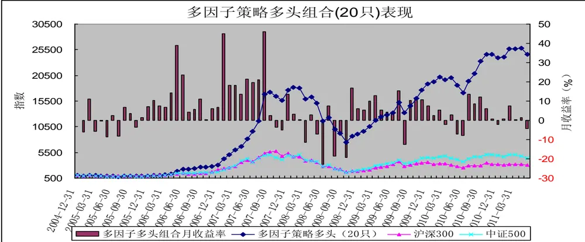
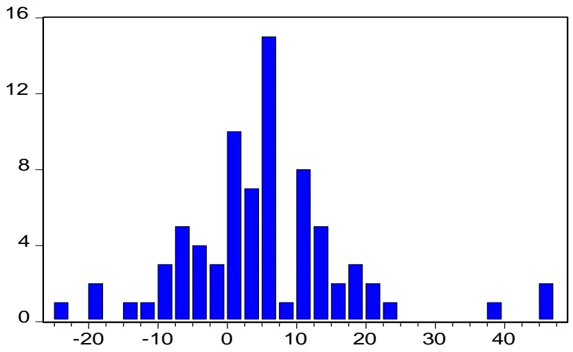
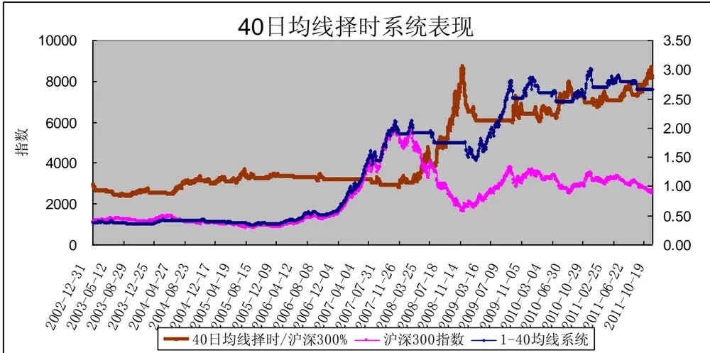
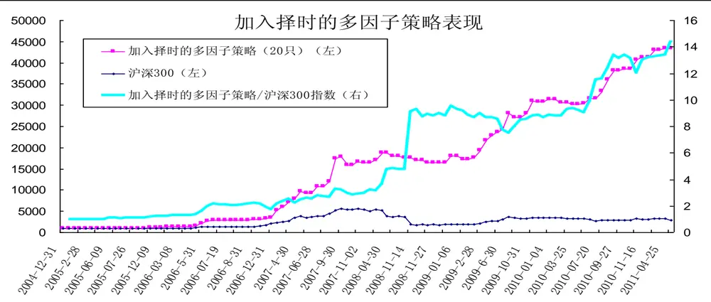
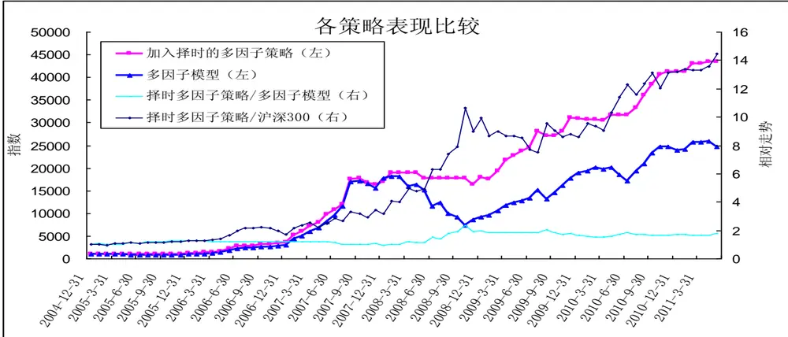

# 加入择时的多因子策略

[table_research]研究员：魏刚 执业证书编号：S0570510120042

025-83290914 weigang@mail.htsc.com.cn

http://t.zhangle.com/4074

## ——数量化选股策略之十三

## 相关研究

《数量化选股策略之十二：多因子选[table_relate]股策略》2011-09-21

《数量化选股策略之十一：分析师预测因子分析》2011-08-31

《数量化选股策略之十：股东因子分析》2011-08-30

《数量化选股策略之九：交投波动因子分析》2011-08-24

《数量化选股策略之八：动量反转因子分析》2011-07-27

## 投资要点：

整体上说，多因子选股策略表现不错，但是在市场大幅回调，步入熊市时（如2008 年），该策略面临着较大的资本回撤，也就是说在市场大幅下跌时，该策略可能面临较大幅度的亏损。因而我们思路为在多因子选股策略中加入择时系统，若择时系统判断发出买入信号，则买入多因子选股策略选出的个股构造组合，若择时系统发出卖出信号，则卖出所持有的组合，保持空仓，等待买入信号的出现。

通过历史数据的模拟，结合交易次数和交易成本，我们发现 40日均线（大致相当于两月线）是较为可靠的一个单均线择时指标：当收盘价位于 40 日均线上方时，则持有多头头寸，当收盘价位于 40日均线下方时则空仓等待。在 2003 年 1 月 1 日至 2011 年 5 月 31 日，40日均线择时系统共发出了 46 次买入信号和 46次卖出信号，累计收益率达 624.47%，而同期沪深 300 指数的累计收益率为 171.97%。该择时系统较好的把握了主升浪趋势，同时规避了幅度较大的调整，实现了“让利润充分增长，限制损失”。

加入择时的多因子策略在风险方面有较大幅度的下降，最大单期亏损、最大资本回撤、最长连续亏损时间等均有所改善，同时保持了较高的收益。2005年 1 月至2011年5月间的累计收益率由2364.04%大幅提高至 4243.57%，最大单期亏损由 23.29%下降至 7.15%，最大资本回撤由 58.99%大幅下降至 12.94%，亏损月份数由 23 个月减少至14个月。

2009 年以来加入择时的多因子策略整体上并没有明显超越不带择时的多因子模型，主要原因是：加入择时的多因子策略在此期间有较长时间为空仓，虽然规避了沪深300 指数下跌的系统风险，但是我们多因子选股模型选出的个股表现大大好于沪深300 指数，也就是说不带择时的多因子模型虽然承担系统性风险，但是获取了较高的超额收益，因而总体上仍然表现较好。

整体上说，多因子选股策略表现不错，但是在市场大幅回调，步入熊市时（如 2008 年），该策略面临着较大的资本回撤，也就是说在市场大幅下跌时，该策略可能面临较大幅度的亏损。因而我们思路为在多因子选股策略中加入择时系统，若择时系统判断发出买入信号，则买入多因子选股策略选出的个股构造组合，若择时系统发出卖出信号，则卖出所持有的组合，保持空仓，等待买入信号的出现。

## 一、多因子策略回顾

图表 1：多因子选股策略主要因子及权重

| 因子类型 | 因子 | 因子描述 | 因子权重 |
| --- | --- | --- | --- |
| 规模因子 | 总市值 | 总部本*股票收盘价 | -5 |
| 估值因子 | 市盈率（TTM） | 股票收盘价/最近12个月每股收益 | -4 |
| 成长因子 | 营业收入同比增长率 | 营业收入/去年同期营业收入-1 | +2 |
| 盈利因子 | 净资产收益率ROE（扣除非经常性损益、摊薄） | 扣除非经常性损益后的净利润/期末净资产 | +2 |
| 动量反转因子 | 前1个月涨跌幅 |  | -4 |
| 交投因子 | 前1个月日均换手率 |  | -3 |
| 波动因子 | 前一个月波动率 | 日收益率的标准差的年化值 | -4 |
| 股东因子 | 户均持股比例变化 | 户均持股比例-前1季度户均持股比例 | +3 |
|  | 机构持股比例变化 | 机构持股比例（基金、券商、券商理财、信托）-前1季度机构持股比例 | +3 |
| 分析师预测因子 | 最近1个月预测净利润上调幅度 | 最新当年净利润预测平均值/1个月前当年净利润预测平均值-1 | +4 |

资料来源：华泰证券

在上一篇报告中，我们选取规模因子（总市值）、估值因子（市盈率 TTM）、成长因子（营业利润同比增长率）、盈利因子（净资产收益率）、动量反转因子（前 1个月涨跌幅）、交投因子（前 1 个月日均换手率）、波动因子（前 1 个月波动率）、股东因子（户均持股比例变化、机构持股变化）、分析师预测因子（最近 1个月净利润上调幅度）等 10个因子，根据其显著性赋予不同权重，构造加权多因子策略。

图表 2：多因子模型多头组合表现

资料来源：华泰证券

整体上看，多因子策略表现非常好，大幅跑赢沪深 300 指数和中证 500 指数。但该策略也存在如下缺点：（1）最长连续亏损时间较长：2008 年8月、9月、10 月连续 3个月亏损；（2）最大资本回撤比例过高：2008 年 1月至2008 年 10 月最大资本回撤达 59%；（3）若高点进场，解套时间过长：若 2008 年1月进场，需等到 2009年12月才能解套，需要等待23个月。

图表 3：多因子模型多头策略（20只）月收益率分布

资料来源：华泰证券

| Series: SYL Sample 1 77 Observations 77 |
| --- |
| Mean 5.429080 |
| Median 5.499732 |
| Maximum 45.92941 Minimum |
| -22.90086 Std. Dev. 12.09397 |
| Skewness 0.821456 5.345466 |
| Kurtosis |
| Jarque-Bera 26.30954 Probability 0.000002 |

## 二、40日均线择时系统

股价移动平均线是目前股票市场上使用最简单，应用最广泛的技术分析方法之一，由于移动平均线客观精确，适应性强，因而成为绝大多数趋势研判的基础。利用移动平均线进行择时交易的方法众多，其中一种常用方法是单均线策略，即如果收盘价位于均线上方，此时应该做多，而当收盘价位于均线下方时，此时应该做空或空仓。

通过历史数据的模拟，结合交易次数和交易成本，我们发现40 日均线（大致相当于两月线）是较为可靠的一个单均线择时指标：当收盘价位于 40 日均线上方时，则持有多头头寸，当收盘价位于 40 日均线下方时则空仓等待。

我们以沪深300指数作为择时基准，研究期间为 2003 年1月 1 日至2011年5 月 31日，买入成本设为0.2%（0.1%的佣金+0.1%的冲击成本），卖出成本设为 0.3%（0.1%的佣金+0.1%冲击成本+0.1%的印花税）。图表 4： 40 日均线择时整体表现（2003-01-01 至 2011-5-31）

|  |  | 沪深 300 指数 | 40 日均线择时 |
| --- | --- | --- | --- |
| 交易次数 |  |  | 92 |
| 累计收益率 |  | 171.97% | 624.47% |
| 最大资本回撤 |  | -72.30% | -32.04% |
| 下跌 | 2002-12-31 至2003-11-13 | -1.08% | -5.53% |
| 上涨 | 2003-11-14 至 2004-4-7 | 29.04% | 17.36% |
| 下跌 | 2004-4-8 至 2005-6-6 | -40.44% | -13.20% |
| 上涨 | 2005-6-7 至 2007-10-16 | 600.50% | 473.14% |
| 下跌 | 2007-10-17 至 2008-10-28 | -70.98% | -18.28% |
| 上涨 | 2008-10-29 至 2009-8-4 | 121.98% | 61.56% |
| 下跌 | 2009-8-5 至 2009-9-1 | -24.90% | -10.55% |
| 上涨 | 2009-9-2 至 2009-11-24 | 24.77% | 10.71% |
| 下跌 | 2009-11-25 至 2010-7-2 | -28.58% | -11.82% |
| 上涨 | 2010-7-5 至2010-11-11 | 38.51% | 22.13% |
| 下跌 | 2010-11-12 至2011-5-31 | -14.48% | -6.73% |

资料来源：华泰证券

由上表可知，在2003年1 月 1日至2011 年5月 31 日间，40 日均线择时系统大幅跑赢沪深300指数，累计收益率达 624.47%，而同期沪深 300指数的累计收益率为 171.97%。在市场处于上涨阶段时，择时系统落后于沪深 300 指数，主要是由于择时系统发出买入信号滞后于沪深 300 指数的见底时间；而在市场处于下跌阶段时，择时系统跑赢沪深 300 指数，较好的规避了大幅下跌的风险。

图表 5：40日均线择时的表现

资料来源：华泰证券

从持有期间分别为5个交易日、10个交易日、20个交易日、40 个交易日、60 个交易日、120个交易日和 250 个交易日看，40 日均线择时系统的表现大大好于沪深 300 指数，择时系统的收益率均值较沪深 300指数高，而同时标准差较沪深 300指数低；特别是从各持有期间收益率的最小值（持有期为 5个交易日……和 250 日交易日的最大亏损）看，择时系统远远强于沪深 300 指数。

图表 6： 40 日均线择时在各持有期的表现（2003-01-01 至 2011-5-31）

|  | 沪深 300 指数 | 40日均线择时 |  | 沪深 300 指数 | 40 日均线择时 |
| --- | --- | --- | --- | --- | --- |
| 持有 5 个交易日 |  |  | 持有 10 个交易日 |  |  |
| 最大值 | 17.28% | 12.77% | 最大值 | 22.56% | 19.70% |
| 最小值 | -16.55% | -16.01% | 最小值 | -21.82% | -15.88% |
| 标准差 | 4.34% | 3.04% | 标准差 | 6.25% | 4.49% |
| 均值 | 0.34% | 0.53% | 均值 | 0.69% | 1.08% |
| 中值 | 0.38% | 0.00% | 中值 | 0.66% | 0.00% |
| 大于零个数 | 1102 | 728 | 大于零个数 | 1111 | 803 |
| 小于零个数 | 933 | 497 | 小于零个数 | 919 | 534 |
|  | 持有 20 个交易日 |  |  | 持有 40 个交易日 |  |
| 最大值 | 33.80% | 33.80% | 最大值 | 54.98% | 54.98% |
| 最小值 | -27.37% | -14.17% | 最小值 | -34.24% | -18.08% |
| 标准差 | 9.55% | 7.02% | 标准差 | 15.11% | 11.75% |
| 均值 | 1.43% | 2.21% | 均值 | 3.09% | 4.64% |
| 中值 | 1.02% | 0.00% | 中值 | 1.13% | 0.00% |
| 大于零个数 | 1098 | 851 | 大于零个数 | 1057 | 973 |
| 小于零个数 | 922 | 669 | 小于零个数 | 943 | 786 |
| 持有 60 个交易日 |  |  |  | 持有 120 个交易日 |  |
| 最大值 | 76.26% | 76.26% | 最大值 | 156.04% | 156.04% |
| 最小值 | -43.70% | -16.59% | 最小值 | -59.11% | -18.51% |
| 标准差 | 20.72% | 16.08% | 标准差 | 39.47% | 32.18% |
| 均值 | 5.05% | 7.27% | 均值 | 12.35% | 16.62% |
| 中值 | 1.69% | 0.55% | 中值 | 3.56% | 4.52% |
| 大于零个数 | 1062 | 1045 | 大于零个数 | 1041 | 1123 |
| 小于零个数 | 918 | 838 | 小于零个数 | 879 | 797 |
| 持有 250 个交易日 |  |  |  |  |  |
| 最大值 | 324.58% | 294.51% |  |  |  |
| 最小值 | -70.54% | -29.74% |  |  |  |
| 标准差 | 83.96% | 69.17% |  |  |  |
| 均值 | 33.95% | 43.61% |  |  |  |
| 中值 | 1.14% | 12.38% |  |  |  |
| 大于零个数 | 912 | 1336 |  |  |  |
| 小于零个数 | 878 | 454 |  |  |  |

资料来源：华泰证券

在2003年1月1日至2011年5月31日，40日均线择时系统共发出了46次买入信号和46次卖出信号。该择时系统较好的把握了主升浪趋势，同时规避了幅度较大的调整，实现了“让利润充分增长，限制损失”。图表 7：40日均线择时系统交易信号分布

| 时间 | 交易信号次数 |
| --- | --- |
| 2003年 | 15 |
| 2004年 | 13 |
| 2005年 | 13 |
| 2006年 | 8 |

资料来源：华泰证券

| 2007年 | 8 |
| --- | --- |
| 2008年 | 13 |
| 2009年 | 7 |
| 2010年 | 13 |
| 2011年（截止5月31日） | 2 |

## 三、加入择时的多因子策略

当基于沪深300指数的40 日均线择时系统发出买入信号时，我们等权重买入当月初我们根据多因子选股模型选出的 20只个股；而当 40日均线择时系统发出卖出信号时，我们卖出持有的股票组合。

组合开始构建时，若 40 日均线处于多头，则按时构建；若 40 日均线处于空头，则空仓等待择时系统发出买入信号时再构建初始组合。由于 2005 年 1 月 1 日至 2005 年 2 月 1 日间，择时系统一直为空头，所以我们一直空仓等待。我们的组合构建首日为 2005 年 2 月3 日，以2月 2日收盘价买入多因子模型选出的20 只股票。

图表 8：加入择时的多因子策略（20只）表现

资料来源：华泰证券

加入择时的多因子策略整体上大幅超越沪深 300 指数，2005 年 1 月至 2011 年 5 月间的累计收益率达4243.57%，年化收益率达 80.04%；而同期沪深 300 指数的累计收益率为 200.16%，年化收益率为 18.69%。加入择时的多因子策略较好的规避了 2008年市场大幅下挫的系统性风险，在2008年 1 月22 日至2008 年 4月 30 日，以及2008 年5月 23 日至2008年 11 月14 日间，加入择时的多因子策略均保持空仓。

图表 9： 加入择时的多因子策略与多因子模型的比较（月）

| 指标 | 加入择时的多因子策略 | 多因子模型 |
| --- | --- | --- |
| 累计收益率 | 4243.57% | 2364.04% |
| 最大单期盈利 | 45.35% | 45.35% |
| 最大单期亏损 | 7.15% | 23.29% |
| 最长连续亏损时间 | 两个月 | 三个月 |
| 最大资本回撤 | 12.94% | 58.99% |
| 进场后解套所需最长时间 | 13个月 | 23 个月 |
| 月收益率大于零 | 44 | 54 |
| 月收益率小于零 | 14 | 23 |
| 空仓月数 | 19 | 0 |
| 月收益率均值 | 5.41% | 4.91% |
| 月收益率标准差 | 9.71% | 12.03% |
| alpha | 4.49% | 3.22% |
| beta | 0.46 | 0.84 |
| sharpe | 0.53 | 0.39 |
| treynor | 11.23% | 5.50% |
| 信息比率 | 4.91 | 3.25 |

资料来源：华泰证券

整体上看，加入择时的多因子策略在风险方面有较大幅度的下降，最大单期亏损、最大资本回撤、最长连续亏损时间等均有所改善，同时保持了较高的收益。2005 年 1 月至 2011 年 5 月间的累计收益率由2364.04%大幅提高至 4243.57%，最大单期亏损由 23.29%下降至 7.15%，最大资本回撤由 58.99%大幅下降至 12.94%，亏损月份数由 23个月减少至 14个月。

从持有期间分别为两个月、三个月、六个月、十二个月、二十四个月的表现来看，加入择时的多因子策略的风险较不带择时的多因子模型有显著的改善，最大亏损幅度有较为显著的下降，收益率的标准差有所下降，亏损次数也有所下降。

图表 10： 加入择时与否的多因子策略在各持有期的收益率（2005-01-01至2011-5-31）

|  | 加入择时的多因子策略 | 多因子策略 |  | 加入择时的多因子策略 | 多因子策略 |
| --- | --- | --- | --- | --- | --- |
| 持有两个月 |  |  | 持有3个月 |  |  |
| 最大值 | 70.08% | 74.88% | 最大值 | 100.20% | 108.04% |
| 最小值 | -7.93% | -29.19% | 最小值 | -7.15% | -39.72% |
| 标准差 | 17.62% | 21.31% | 标准差 | 25.36% | 31.21% |
| 均值 | 11.61% | 10.83% | 均值 | 18.49% | 17.59% |
| 中值 | 6.11% | 7.09% | 中值 | 11.35% | 11.83% |
| 大于零个数 | 54 | 50 | 大于零个数 | 59 | 52 |
| 小于零个数 | 13 | 26 | 小于零个数 | 12 | 23 |
|  | 持有6个月 |  |  | 持有12 个月 |  |
| 最大值 | 303.16% | 333.48% | 最大值 | 509.55% | 598.73% |
| 最小值 | 92.85% | 45.58% | 最小值 | -6.61% | -54.83% |
| 标准差 | 53.52% | 65.38% | 标准差 | 138.62% | 168.55% |
| 均值 | 144.43% | 144.17% | 均值 | 126.68% | 130.72% |
| 中值 | 125.55% | 126.34% | 中值 | 56.19% | 59.23% |
| 大于零个数 | 72 | 72 | 大于零个数 | 63 | 55 |
| 小于零个数 | 0 | 0 | 小于零个数 | 3 | 11 |
| 持有24 个月 |  |  |  |  |  |
| 最大值 | 1554.51% | 1845.73% |  |  |  |
| 最小值 | 52.12% | -21.60% |  |  |  |
| 标准差 | 482.17% | 598.54% |  |  |  |
| 均值 | 463.75% | 459.52% |  |  |  |
| 中值 | 211.99% | 171.41% |  |  |  |
| 大于零个数 | 54 | 51 |  |  |  |
| 小于零个数 | 0 | 3 |  |  |  |

资料来源：华泰证券

由表11可知，在市场处于大幅上涨状态时，加入择时的多因子策略大幅落后于不带择时的多因子策略，而且有时也落后于沪深 300 指数；而在市场处于大幅下跌状态时，加入择时的多因子策略的表现大大好于不带择时的多因子策略，也远远好于沪深 300 指数。因而加入择时的多因子策略相对不带择时的多因子策略的超额表现主要集中在市场大幅下跌阶段，这与我们加入择时系统来规避市场大幅下跌的系统性风险的出发点是一致的。

图表 11：各策略在各种市场状态下的表现（2005-01-01 至 2011-5-31）

| 市场状态 | 起始月 | 截止月 | 沪深 300 指数 | 多因子策略 | 加入择时的多因子策略 |
| --- | --- | --- | --- | --- | --- |
| 熊市 | 2005年1月 | 2005年5月 | -14.41% | -12.30% | 0.81% |
| 牛市 | 2005年6月 | 2007年10月 | 564.59% | 1777.05% | 1554.59% |
| 熊市 | 2007年11月 | 2008年10月 | -70.75% | -54.83% | 5.94% |
| 牛市 | 2008年11月 | 2009年7月 | 124.48% | 104.48% | 59.04% |
| 熊市 | 2009年8月 | 2009年8月 | -24.22% | -13.06% | -3.50% |
| 牛市 | 2009年9月 | 2009年12月 | 26.34% | 42.95% | 13.78% |
| 熊市 | 2010年1月 | 2010年6月 | -28.32% | -9.61% | 2.45% |
| 牛市 | 2010年7月 | 2010年10月 | 31.87% | 44.05% | 28.76% |
| 熊市 | 2010年11月 | 2011年5月 | -11.20% | 0.14% | 6.72% |

资料来源：华泰证券

加入择时的多因子策略整体上大幅跑赢不带择时的多因子策略，但是相对表现主要集中在 2008 年市场大幅下跌阶段。而在其他阶段，从收益率看，加入择时的多因子策略并没有显著超越不带择时的多因子策略。而在市场上涨初期，如 2009年上半年，加入择时的多因子策略表现落后于不带择时的多因子策略。

图表 12：各策略表现比较（月）

资料来源：华泰证券

2009 年以来加入择时的多因子策略整体上并没有明显超越不带择时的多因子模型，虽然从最大单期亏损和最大资本回撤等指标看，加入择时的多因子策略风险有所下降，但是收益率也有所下降。从我们前面的分析看，2009 年以来 40 日均线择时系统超越了沪深 300 指数，因此 2009 年以来加入择时的多因子策略表现没有超越不带择时的多因子策略的主要原因是：加入择时的多因子策略在此期间有较长时间为空仓，虽然规避了沪深 300 指数下跌的系统风险，但是我们多因子选股模型选出的个股表现大大好于沪深 300 指数，也就是说不带择时的多因子模型虽然承担系统性风险，但是获取了较高的超额收益，因而总体上仍然表现较好。

图表 13：2009年以来加入择时的多因子策略与多因子模型的比较（月）

| 指标 | 加入择时的多因子策略 | 多因子模型 |
| --- | --- | --- |
| 累计收益率 | 141.00% | 170.05% |
| 最大单期盈利 | 14.87% | 14.87% |
| 最大单期亏损 | 3.50% | 13.06% |
| 最长连续亏损时间 | 两个月 | 两个月 |
| 最大资本回撤 | 3.50% | 15.38% |
| 进场后解套所需最长时间 | 5个月 | 6个月 |
| 月收益率大于零 | 16 | 22 |
| 月收益率小于零 | 6 | 7 |
| 空仓月数 | 7 | 0 |
| 月收益率均值 | 3.17% | 3.71% |
| 月收益率标准差 | 4.54% | 6.84% |
| alpha | 2.53% | 2.46% |
| beta | 0.29 | 0.57 |
| sharpe | 0.64 | 0.50 |
| treynor | 9.85% | 6.02% |
| 信息比率 | 0.35 | 0.61 |

资料来源：华泰证券

因而，在接下来的分析中，我们将考虑一直持有多因子模型选出的个股，同时根据择时系统利用股指期货来规避市场大幅下跌的风险（当择时系统发出卖出信号时，我们卖出相应金额的股指期货合约，对冲持有的多因子组合多头的下跌风险；而当择时系统发出买入信号时，我们对之前建立的股指期货空头合约进行平仓）的策略，期待在规避系统性风险的同时，分享多因子选股模型相对沪深 300 指数的超额收益。

此外，在接下来的研究中我们将一方面继续寻找与多因子策略能较好配合的择时策略；另一方面通过组合止损和个股止损等策略来规避大幅调整的风险。

## 免责条款：

本报告的信息均来源于公开资料，本公司对这些信息的准确性、完整性或可靠性不作任何保证，也不保证所包含的信息和建议不会发生任何变更。本公司力求报告内容的客观、公正，但文中的观点、结论和建议仅供参考，不构成所述证券的买卖出价或征价，投资者据此做出的任何投资决策与本公司和作者无关。本公司及作者在自身所知情的范围内，与本报告中所评价或推荐的证券没有利害关系。在法律许可的情况下，本公司及其所属关联机构可能会持有报告中提到的公司所发行的证券头寸并进行交易，也可能为这些公司提供或者争取提供投资银行、财务顾问或者金融产品等相关服务。

报告版权仅为本公司所有，未经书面许可，任何机构和个人不得以翻版、复制、发表、引用或再次分发他人等任何形式侵犯本公司版权。如征得本公司同意进行引用、刊发的，需在允许的范围内使用，并注明出处为“华泰证券研究所”，且不得对本报告进行任何有悖原意的引用、删节和修改。本公司保留追究相关责任的权利。

本公司具有中国证监会核准的“证券投资咨询”业务资格，经营许可证编号为：Z23032000。