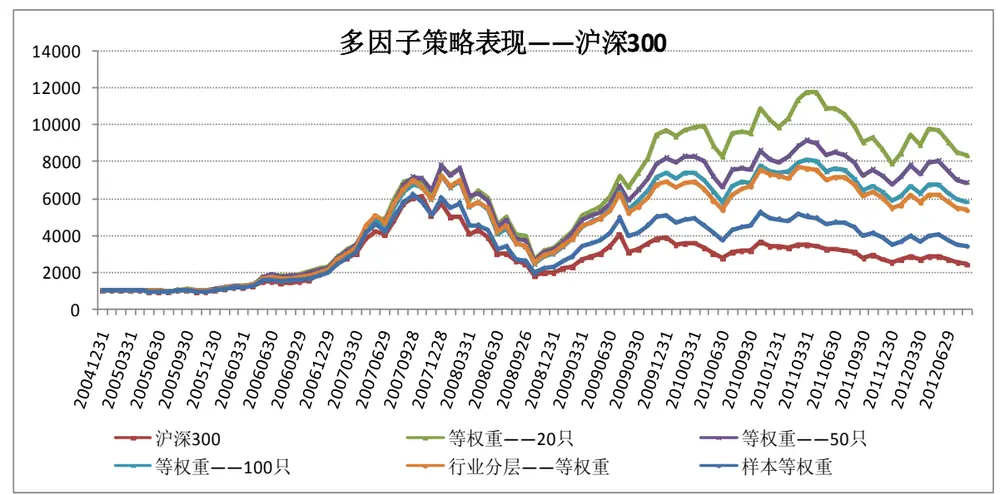
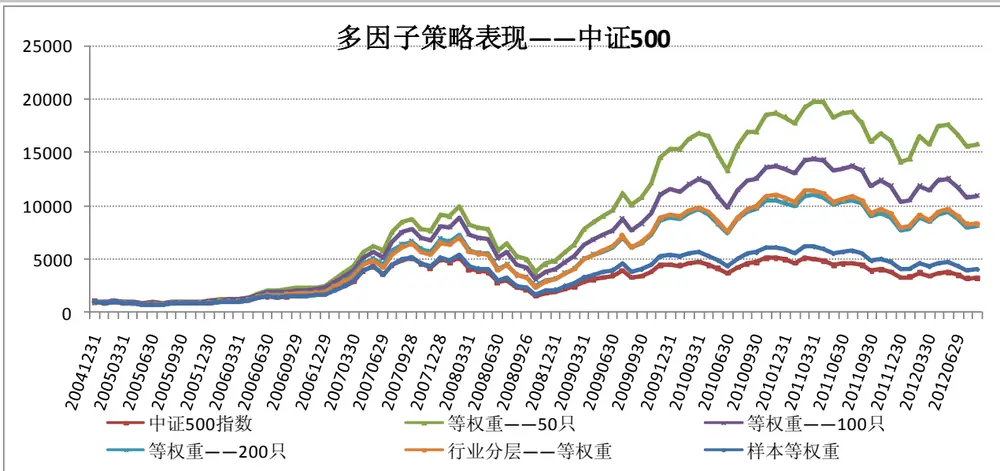
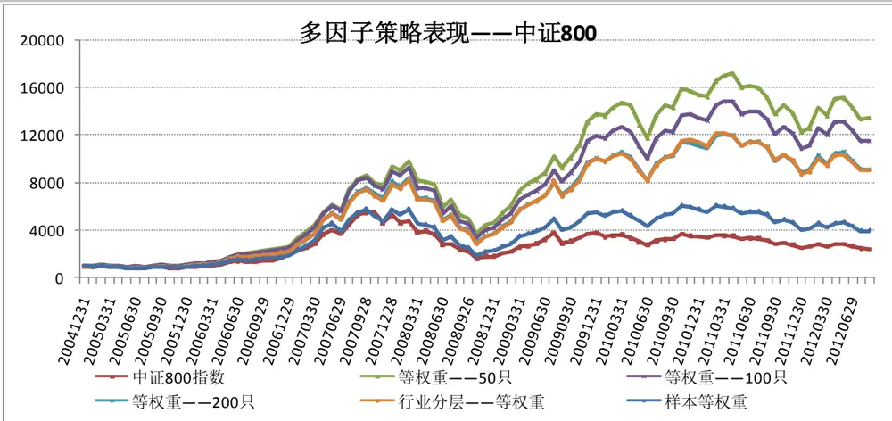
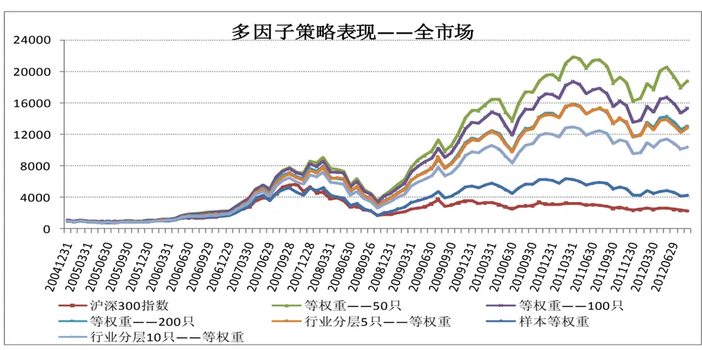
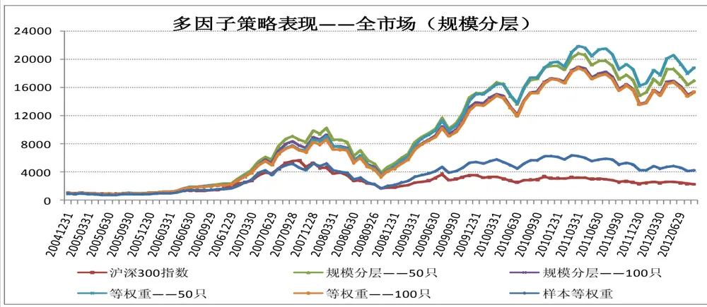

2012 年 09 月 07 日

研究员： 魏刚

执业证书编号：S0570510120042

电话： 025-83290914

E-MAIL： weigang@mail.htsc.com.cn

http://t.zhangle.com/4074

## 相关研究

1《数量化选股策略之十二：多因子 选股模型》2011.09

# 再论多因子选股策略

--数量化选股策略之十四

## 投资要点：

我们分析了：（1）多因子选股策略在不同样本池下的表现；（2）行业分层对多因子选股策略的影响；（3）规模分层对多因子选股策略的影响。

我们分析了多因子选股策略在不同样本池下的表现，整体上看，多因子选股策略在各个样本池下均取得了较好的表现。以相对应的样本等权重为比较基准，多因子选股策略大幅超越基准，在以中证500 指数成分股、中证 800 指数成分股和全部 A 股为样本池时，月度胜率均超过 70%，以沪深 300 指数成分股为样本池时的月度胜率也超过 60%；从年度看，在各样本池下，多因子选股策略在各年均战胜了基准。

我们分析了行业分层的多因子选股策略在不用样本池的表现，整体上看，行业分层的多因子选股策略在各样本池下均取得了较好的表现，但行业分层的多因子选股策略并没有超越不采用行业分层的多因子选股策略。从收益率看，行业分层的多因子选股策略的收益率低于不采用行业分层的多因子选股策略；但是采用行业分层时，月度超额收益的标准差及跟踪误差都有所下降。从信息比例看，行业分层的多因子选股的表现略逊于不采用行业分层的多因子选股策略。

我们分析了规模分层的多因子选股策略在以全部A股为样本池的表现，整体上看，规模分层的多因子选股策略表现依然较好。从收益率看，规模分层的多因子选股策略的收益率略低于不采用规模分层的多因子选股策略；但是采用规模分层时，月度超额收益率的标准差及跟踪误差均有所下降。从信息比率看，规模分层的多因子选股策略的表现略好于不采用规模分层的多因子选股策略。

在后续的工作中我们将：（1）测试各行业（行业分类标准）内的选股因子；（2）测试不同风格股票（大盘/小盘，周期/非周期等）的选股因子；（3）考虑行业权重及个股权重对选股策略的影响。

## 一、前言

在《数量化选股策略之十二：多因子选股模型》中，基于前期对各因子的研究分析，我们研究了以中证800指数成分股为样本股票池，由规模因子等9个较为显著的因子构造的多因子选股策略（因子等权重、因子不等权重）的表现。本文我们将进一步分析如下几个问题：（1）样本股票池对多因子选股策略的影响：我们将研究分别以沪深 300 指数成分股、中证 500 指数成分股、以及全部 A 股为样本股票池时多因子选股策略的表现；（2）行业分层对多因子选股策略的影响：不同行业间各因子的差别可能很大，在之前的选股策略中我们没有考虑行业间各因子的差异，我们将研究行业分层的多因子选股策略的表现；（3）规模分层对多因子选股策略的影响：不同规模间各因子的差别可能很大，在之前的选股策略中我们没有考虑不同规模公司间各因子的差异，我们将研究规模分层的多因子选股策略的表现。

图表1：多因子选股策略主要因子

| 因子类型 | 因子 | 因子描述 | 因子权重 |
| --- | --- | --- | --- |
| 规模因子 | 总市值 | 总部本*股票收盘价 | -5 |
| 估值因子 | 市盈率（TTM） | 股票收盘价/最近12个月每股收益 | -4 |
| 成长因子 | 营业收入同比增长率 | 营业收入/去年同期营业收入-1 | +2 |
| 盈利因子 | 净资产收益率ROE（扣除非经常性损益、摊薄） | 扣除非经常性损益后的净利润/期末净资产 | +2 |
| 动量反转因子 | 前1个月涨跌幅 |  | -4 |
| 交投因子 | 前1个月日均换手率 |  | -3 |
| 波动因子 | 前一个月波动率 | 日收益率的标准差的年化值 | -4 |
| 股东因子 | 户均持股比例变化 | 户均持股比例-前1季度户均持股比例 | +3 |
|  | 机构持股比例变化 | 机构持股比例-前1季度机构持股比例 |  |
| 分析师预测因子 | 最近1个月预测净利润上调幅度 | 最新当年净利润预测平均值/1个月前当年净利润预测平均值-1 | +4 |

资料来源：天软科技、wind资讯、朝阳永续、华泰证券研究所

## 二、不同样本股票池下多因子选股策略的表现

经典的 三因素模型早已表明市值对股票的收益率有显著的影响，各种主动型投资基金也常常按照投资标的的市值进行风格划分，而大、小市值股票的估值等指标存在整体性的水平差异，不具备可比性。

我们通过股票池的选择来降低大、小市值股票间的各因子可能存在的整体性差异。在《数量化选股策略之十二：多因子选股模型》中，我们的样本股票池为中证 800 指数，中证 800 指数既包括了大市值股票（沪深 300 指数成分股），也包括了中小市值股票（中证 500 指数成分股）。在本部分，我们将分别以沪深300 指数成分股做为大市值股票池，以中证 500 指数的成分股做为中、小市值股票池，以中证 800 指数成分股和全部A股作为不区分大小市值的股票池，研究多因子选股策略在不同股票池下的表现。

## （一）沪深 300 指数成分股

以沪深 300 指数成分股为样本池，每月月底调仓，我们构建了如下选股策略：等权重——20 只（在样本池中选出各因子综合得分排名靠前的 20 只股票构建组合），等权重——50 只（在样本池中选出各因子综合得分排名靠前的 50 只股票构建组合），等权重——100 只（在样本池中选出各因子综合得分排名靠前的100只股票构建组合），行业分层等权重（在每个行业内选出各因子综合得分排名靠前的5只股票构建组合）。

也超越了样本等权重（每月末沪深300指数成分股为样本池，等权重配臵所有股票）的表现。由于沪深300指数成分股之间的差异较大，而我们的选股策略为等权重策略，因而多因子选股策略的表现超越同样是等权重的样本等权重更有说服力。

2005年1月1日至2012年8月28日间，等权重——20只的累计收益率为732.13%，年化收益率为31.44%；等权重——50只的累计收益率为586.32%，年化收益率为28.21%；等权重——100只的累计收益率为480.60%，年化收益率为25.48%；同期沪深300指数的累计收益率为140.07%，年化收益率为11.96%，样本等权重的累计收益率 238.63%，年化收益率为 17.04%。

从收益率看，以沪深 300 指数成分股为样本池的多因子选股策略选出的股票数目越少，表现越好，等权重——20只的表现好于等权重——50只和等权重——100只，表现出一定的单调性。

图表1：以沪深300指数成分股为样本池的多因子选股策略表现

资料来源：天软科技、wind资讯、朝阳永续、华泰证券研究所

从超越基准的胜率（超额收益率为正）看，相对沪深 300 指数，各策略的胜率均在 60%左右；相对样本等权重，各策略的胜率均在60%以上。

从信息比率、sharpe 比例和 alpha 看，以沪深 300 指数成分股为样本池的多因子选股策略选出的股票数目越少，表现越好，等权重——20 只的表现好于等权重——50 只和等权重——100 只，表现出一定的单调性。

图表3：以沪深300指数成分股为样本池的多因子选股策略分析（月）

| 相对沪深 300 指数 | 等权重-20只 | 等权重-50 只 | 等权重-100 只 | 相对样本等权重 | 等权重-20 只 | 等权重-50 只 | 等权重-100 只 |
| --- | --- | --- | --- | --- | --- | --- | --- |
| 月超额收益率均值 | 1.44% | 1.19% | 1.00% | 月超额收益率均值 | 0.99% | 0.75% | 0.55% |
| 月超额收益率中值 | 0.96% | 0.68% | 0.44% | 月超额收益率中值 | 0.64% | 0.64% | 0.32% |
| 月超额收益率最大值 | 17.11% | 12.58% | 9.44% | 月超额收益率最大值 | 12.31% | 8.74% | 5.60% |
| 月超额收益率最小值 | -14.89% | -15.16% | -12.00% | 月超额收益率最小值 | -8.60% | -7.82% | -5.94% |
| 月超额收益率标准差 | 4.82% | 4.07% | 3.43% | 月超额收益率标准差 | 3.50% | 2.54% | 1.75% |
| 跑赢次数 | 51 | 53 | 53 | 跑赢次数 | 55 | 59 | 53 |
| 跑输次数 | 37 | 35 | 35 | 跑输次数 | 33 | 29 | 35 |
| 跟踪误差 | 5.01% | 4.22% | 3.56% | 跟踪误差 | 3.62% | 2.63% | 1.83% |
| alpha | 0.0150 | 0.0126 | 0.0104 | alpha | 0.0110 | 0.0086 | 0.0065 |
| beta | 0.9618 | 0.9566 | 0.9725 | beta | 0.9470 | 0.9385 | 0.9462 |
| sharpe | 0.2453 | 0.2299 | 0.2126 | sharpe | 0.2453 | 0.2299 | 0.2126 |
| treynor | 0.0273 | 0.0248 | 0.0224 | treynor | 0.0277 | 0.0253 | 0.0230 |
| jensen | 0.0149 | 0.0124 | 0.0103 | jensen | 0.0108 | 0.0085 | 0.0064 |
| 信息比率 | 1.2852 | 1.1505 | 1.0405 | 信息比率 | 1.4824 | 1.4365 | 1.4383 |

资料来源：天软科技、wind资讯、朝阳永续、华泰证券研究所

由下表可知，从 2005 年至 2012 年间的年超额收益率看，多因子选股策略仅在 2006 年落后于沪深 300指数；而相对样本等权重来说，多因子选股策略在这8年间均超越了基准。

图表4：以沪深300指数成分股为样本池的多因子选股策略各年超额收益率

| 相对沪深 300 指数的年超额收益率 | 等权重-20 只 | 等权重-50 只 | 等权重-100 只 | 相对样本等权重的年超额收益率 | 等权重-20 只 | 等权重-50 只 | 等权重-100 只 |
| --- | --- | --- | --- | --- | --- | --- | --- |
| 2005年 | 6.83% | 4.19% | 3.50% | 2005年 | 6.06% | 3.42% | 2.73% |
| 2006年 | -8.12% | -7.34% | -19.12% | 2006年 | 13.14% | 13.92% | 2.14% |
| 2007年 | 80.89% | 93.99% | 85.38% | 2007年 | 40.44% | 53.54% | 44.93% |
| 2008年 | 8.75% | 6.74% | 7.03% | 2008年 | 5.38% | 3.37% | 3.66% |
| 2009年 | 95.78% | 59.65% | 54.37% | 2009年 | 68.33% | 32.20% | 26.92% |
| 2010年 | 14.32% | 9.42% | 11.68% | 2010年 | 5.17% | 0.27% | 2.53% |
| 2011年 | 4.99% | 10.38% | 5.27% | 2011年 | 8.39% | 13.78% | 8.67% |
| 2012年 | 10.35% | 5.73% | 3.06% | 2012年 | 8.85% | 4.24% | 1.56% |

资料来源：天软科技、wind资讯、朝阳永续、华泰证券研究所

## （二）中证 500 指数成分股

由下图可知，以中证 500 指数成分股为样本池，每月调仓的多因子选股策略表现超越中证 500 指数，也超越了样本等权重（每月末中证500指数成分股为样本池，等权重配臵所有股票）的表现。

2005 年 1 月 1 日至 2012 年 8 月 28 日间，等权重——50 只的累计收益率为 1479.77%，年化收益率为42.78%；等权重——100只的累计收益率为993.14%，年化收益率为36.15%；等权重——200只的累计收益率为714.41%，年化收益率为31.08%；同期中证500指数的累计收益率为220.10%，年化收益率为16.20%，样本等权重的累计收益率302.06%，年化收益率为19.67%。

从收益率看，以中证 500 指数成分股为样本池的多因子选股策略选出的股票数目越少，表现越好，等权重——20只的表现好于等权重——50只和等权重100只，表现出一定的单调性。

图表5：以中证500指数成分股为样本池的多因子选股策略表现

资料来源：天软科技、wind资讯、朝阳永续、华泰证券研究所

从超越基准的胜率（超额收益率为正）看，不管是相对中证 500 指数还是相对样本等权重，多因子选股策略选股策略的月度胜率均超过70%。

从信息比率、sharpe 比例和 alpha 看，以中证 500 指数成分股为样本池的多因子选股策略选出的股票数目越少，表现越好，等权重——50只的表现好于等权重——100只和等权重——200只，表现出一定的单调性。

图表6：以中证500指数成分股为样本池的多因子选股策略分析（月）

| 相对中证 500 指数 | 等权重-50 只 | 等权重-100 只 | 等权重-200 只 | 相对样本等权重 | 等权重-50 只 | 等权重-100 只 | 等权重-200 只 |
| --- | --- | --- | --- | --- | --- | --- | --- |
| 月超额收益率均值 | 1.74% | 1.34% | 1.03% | 月超额收益率均值 | 1.46% | 1.06% | 0.75% |
| 月超额收益率中值 | 1.47% | 1.29% | 0.94% | 月超额收益率中值 | 1.44% | 0.99% | 0.75% |
| 月超额收益率最大值 | 9.29% | 7.74% | 5.75% | 月超额收益率最大值 | 9.75% | 6.30% | 5.60% |
| 月超额收益率最小值 | -3.85% | -3.49% | -3.46% | 月超额收益率最小值 | -2.60% | -2.72% | -2.61% |
| 月超额收益率标准差 | 2.48% | 2.01% | 1.59% | 月超额收益率标准差 | 2.16% | 1.62% | 1.14% |
| 跑赢次数 | 70 | 71 | 71 | 跑赢次数 | 71 | 69 | 69 |
| 跑输次数 | 22 | 21 | 21 | 跑输次数 | 21 | 23 | 23 |
| 跟踪误差 | 3.02% | 2.41% | 1.89% | 跟踪误差 | 2.60% | 1.93% | 1.36% |
| alpha | 0.0181 | 0.0139 | 0.0104 | alpha | 0.0158 | 0.0115 | 0.0081 |
| beta | 0.9610 | 0.9758 | 0.9908 | beta | 0.9437 | 0.9576 | 0.9712 |
| sharpe | 0.3039 | 0.2661 | 0.2357 | sharpe | 0.3039 | 0.2661 | 0.2357 |
| treynor | 0.0351 | 0.0304 | 0.0268 | treynor | 0.0357 | 0.0310 | 0.0273 |
| jensen | 0.0180 | 0.0138 | 0.0104 | jensen | 0.0157 | 0.0114 | 0.0080 |
| 信息比率 | 4.5388 | 3.4876 | 2.8464 | 信息比率 | 4.9311 | 3.8911 | 3.3019 |

资料来源：天软科技、wind资讯、朝阳永续、华泰证券研究所

由下表可知，从 2005 年至 2012 年间的年超额收益率看，不管是以中证 500 指数为基准，还是以样本等权重为基准，多因子选股策略在各年均超越了基准。

图表7：以中证500指数成分股为样本池的多因子选股策略各年超额收益率

| 相对中证 500 指数的年超额收益率 | 等权重-50 只 | 等权重-100只 | 等权重-200只 | 相对样本等权重的年超额收益率 | 等权重-50只 | 等权重-100只 | 等权重-200 只 |
| --- | --- | --- | --- | --- | --- | --- | --- |
| 2005年 | 20.94% | 17.66% | 11.13% | 2005年 | 18.64% | 15.36% | 8.83% |
| 2006年 | 31.67% | 16.32% | 4.25% | 2006年 | 39.39% | 24.03% | 11.97% |
| 2007年 | 84.27% | 74.40% | 60.58% | 2007年 | 68.42% | 58.55% | 44.73% |
| 2008年 | 13.46% | 10.40% | 7.08% | 2008年 | 11.15% | 8.09% | 4.77% |
| 2009年 | 84.35% | 56.15% | 49.11% | 2009年 | 66.10% | 37.90% | 30.86% |
| 2010年 | 9.84% | 6.58% | 5.12% | 2010年 | 9.48% | 6.22% | 4.76% |
| 2011年 | 10.53% | 10.49% | 9.30% | 2011年 | 7.58% | 7.54% | 6.36% |
| 2012年 | 14.15% | 7.59% | 6.46% | 2012年 | 13.46% | 6.90% | 5.77% |

资料来源：天软科技、wind资讯、朝阳永续、华泰证券研究所

## （三）中证 800 指数成分股

由下图可知，以中证 800 指数成分股为样本池，每月调仓的多因子选股策略表现超越中证 800 指数，也超越了样本等权重（每月末中证800指数成分股为样本池，等权重配臵所有股票）的表现。由于中证 800指数成分股之间的差异较大，而我们的选股策略为等权重策略，因而多因子选股策略的表现超越同样是等权重的样本等权重更有说服力。

2005 年 1 月 1 日至 2012 年 8 月 28 日间，等权重——50 只的累计收益率为 1248.21%，年化收益率为39.88%；等权重——100 只的累计收益率为 1054.56%，年化收益率为 37.12%；等权重——200 只的累计收益率为813.66%，年化收益率为33.04%；同期中证800指数的累计收益率为144.11%，年化收益率为12.20%，样本等权重的累计收益率298.76%，年化收益率为19.54%。

从收益率看，以中证 800 指数成分股为样本池的多因子选股策略选出的股票数目越少，表现越好，等权重——50只的表现好于等权重——100只和等权重200只，表现出一定的单调性。

图表8：以中证800指数成分股为样本池的多因子选股策略表现

资料来源：天软科技、wind资讯、朝阳永续、华泰证券研究所

从超越基准的胜率（超额收益率为正）看，不管是相对中证 800 指数还是相对样本等权重，多因子选

股策略选股策略的月度胜率均超过60%。

从信息比率、sharpe 比例和 alpha 看，以中证 800 指数成分股为样本池的多因子选股策略选出的股票数目越少，表现越好，等权重——50只的表现好于等权重——100只和等权重——200只，表现出一定的单调性。

图表9：以中证800指数成分股为样本池的多因子选股策略分析（月）

| 相对中证 800 指数 | 等权重-50 只 | 等权重-100只 | 等权重-200 只 | 相对样本等权重 | 等权重-50 只 | 等权重-100 只 | 等权重-200 只 |
| --- | --- | --- | --- | --- | --- | --- | --- |
| 月超额收益率均值 | 1.93% | 1.77% | 1.51% | 月超额收益率均值 | 1.29% | 1.13% | 0.87% |
| 月超额收益率中值 | 1.58% | 1.47% | 0.97% | 月超额收益率中值 | 1.19% | 1.05% | 0.87% |
| 月超额收益率最大值 | 13.59% | 12.35% | 10.49% | 月超额收益率最大值 | 10.07% | 7.56% | 6.25% |
| 月超额收益率最小值 | -12.10% | -12.25% | -11.20% | 月超额收益率最小值 | -8.42% | -4.83% | -4.49% |
| 月超额收益率标准差 | 4.51% | 4.18% | 3.75% | 月超额收益率标准差 | 2.66% | 2.11% | 1.64% |
| 跑赢次数 | 62 | 60 | 62 | 跑赢次数 | 67 | 67 | 66 |
| 跑输次数 | 30 | 32 | 30 | 跑输次数 | 25 | 25 | 26 |
| 跟踪误差 | 4.89% | 4.52% | 4.03% | 跟踪误差 | 2.94% | 2.38% | 1.85% |
| alpha | 0.0200 | 0.0180 | 0.0152 | alpha | 0.0145 | 0.0124 | 0.0097 |
| beta | 0.9511 | 0.9798 | 0.9956 | beta | 0.9244 | 0.9470 | 0.9533 |
| sharpe | 0.2964 | 0.2779 | 0.2540 | sharpe | 0.2964 | 0.2779 | 0.2540 |
| treynor | 0.0331 | 0.0305 | 0.0274 | treynor | 0.0340 | 0.0316 | 0.0286 |
| jensen | 0.0199 | 0.0180 | 0.0152 | jensen | 0.0143 | 0.0123 | 0.0096 |
| 信息比率 | 2.4555 | 2.1878 | 1.8072 | 信息比率 | 3.5059 | 3.4474 | 3.0301 |

资料来源：天软科技、wind资讯、朝阳永续、华泰证券研究所

由下表可知，从 2005 年至 2012 年间的年超额收益率看，不管是以中证 800 指数为基准，还是以样本等权重为基准，除等权重——200 只在 2006 年跑输中证 800 指数外，其余各年多因子选股策略均超越了基准。

图表10：以中证800指数成分股为样本池的多因子选股策略各年超额收益率

| 相对中证 800 指数的年超额收益率 | 等权重-50只 | 等权重-100只 | 等权重-200只 | 相对样本等权重的年超额收益率 | 等权重-50 只 | 等权重-100只 | 等权重-200 只 |
| --- | --- | --- | --- | --- | --- | --- | --- |
| 2005年 | 17.76% | 17.40% | 13.04% | 2005年 | 14.87% | 14.51% | 10.15% |
| 2006年 | 19.58% | 9.08% | -4.39% | 2006年 | 35.62% | 25.12% | 11.65% |
| 2007年 | 95.55% | 96.15% | 99.29% | 2007年 | 59.82% | 60.42% | 63.56% |
| 2008年 | 14.95% | 12.33% | 11.21% | 2008年 | 9.92% | 7.29% | 6.17% |
| 2009年 | 90.40% | 79.44% | 64.50% | 2009年 | 54.13% | 43.17% | 28.23% |
| 2010年 | 19.31% | 19.39% | 17.67% | 2010年 | 6.74% | 6.82% | 5.10% |
| 2011年 | 7.13% | 8.34% | 7.03% | 2011年 | 9.64% | 10.85% | 9.54% |
| 2012年 | 13.69% | 10.27% | 7.11% | 2012年 | 11.67% | 8.25% | 5.09% |

资料来源：天软科技、wind资讯、朝阳永续、华泰证券研究所

## （四）全市场

由下图可知，以全部 A 股为样本池，每月调仓的多因子选股策略表现超越沪深 300 指数，也超越了样本等权重（每月末全部A股为样本池，等权重配臵所有股票）的表现。由于全部A股之间的差异较大，而我们的选股策略为等权重策略，因而多因子选股策略的表现超越同样是等权重的样本等权重更有说服力。

2005 年 1 月 1 日至 2012 年 8 月 28 日间，等权重——50 只的累计收益率为 1778.23%，年化收益率为46.00%；等权重——100 只的累计收益率为 1435.19%，年化收益率为 42.25%；等权重——200 只的累计收益率为1205.97%，年化收益率为39.31%；同期沪深300指数的累计收益率为123.84%，年化收益率为10.96%，样本等权重的累计收益率322.59%，年化收益率为20.44%。

从收益率看，以全部 A 股为样本池的多因子选股策略选出的股票数目越少，表现越好，等权重——50只的表现好于等权重——100只和等权重200只，表现出一定的单调性。

图表11：以全部 A股为样本池的多因子选股策略表现

资料来源：天软科技、wind资讯、朝阳永续、华泰证券研究所

从超越基准的胜率（超额收益率为正）看，以沪深300指数为基准，多因子选股策略的胜率均超过60%；以相对样本等权重为基准的话，多因子选股策略选股策略的月度胜率均在70%以上。

从信息比率、sharpe 比例和 alpha 看，以全部 A 股为样本池的多因子选股策略选出的股票数目越少，表现越好，等权重——50只的表现好于等权重——100只和等权重——200只，表现出一定的单调性。

图表12：以全部 A股为样本池的多因子选股策略分析（月）

| 相对中证 800 指数 | 等权重-50只 | 等权重-100 只 | 等权重-200 只 | 相对样本等权重 | 等权重-50 只 | 等权重-100 只 | 等权重-200 只 |
| --- | --- | --- | --- | --- | --- | --- | --- |
| 月超额收益率均值 | 2.44% | 2.21% | 2.04% | 月超额收益率均值 | 1.63% | 1.40% | 1.23% |
| 月超额收益率中值 | 2.24% | 1.93% | 1.75% | 月超额收益率中值 | 1.43% | 1.64% | 1.21% |
| 月超额收益率最大值 | 15.60% | 13.37% | 12.90% | 月超额收益率最大值 | 8.13% | 7.69% | 7.53% |
| 月超额收益率最小值 | -16.68% | -16.13% | -15.90% | 月超额收益率最小值 | -3.62% | -3.74% | -3.22% |
| 月超额收益率标准差 | 6.28% | 6.05% | 5.85% | 月超额收益率标准差 | 2.34% | 1.97% | 1.71% |
| 跑赢次数 | 59 | 56 | 57 | 跑赢次数 | 71 | 68 | 73 |
| 跑输次数 | 33 | 36 | 35 | 跑输次数 | 21 | 24 | 19 |
| 跟踪误差 | 6.70% | 6.42% | 6.16% | 跟踪误差 | 2.84% | 2.41% | 2.10% |
| alpha | 0.0256 | 0.0232 | 0.0213 | alpha | 0.0171 | 0.0148 | 0.0128 |
| beta | 0.9117 | 0.9205 | 0.9402 | beta | 0.9646 | 0.9670 | 0.9769 |
| sharpe | 0.3214 | 0.3020 | 0.2846 | sharpe | 0.3214 | 0.3020 | 0.2846 |
| treynor | 0.0390 | 0.0362 | 0.0336 | treynor | 0.0369 | 0.0344 | 0.0323 |
| jensen | 0.0254 | 0.0230 | 0.0211 | jensen | 0.0170 | 0.0147 | 0.0128 |
| 信息比率 | 2.6826 | 2.2216 | 1.9084 | 信息比率 | 5.5685 | 5.0140 | 4.5765 |

资料来源：天软科技、wind资讯、朝阳永续、华泰证券研究所

由下表可知，从 2005 年至 2012 年间的年超额收益率看，以沪深 300 指数为基准，多因子选股策略仅在2006年落后于基准，但波动较大；而如果以样本等权重为基准，多因子选股策略在各年均战胜基准，且超年度超额收益率也较为稳定。

图表13：以全部 A股为样本池的多因子选股策略各年超额收益率

| 相对中证 800 指数的年超额收益率 | 等权重-50只 | 等权重-100只 | 等权重-200 只 | 相对样本等权重的年超额收益率 | 等权重-50 只 | 等权重-100只 | 等权重-200只 |
| --- | --- | --- | --- | --- | --- | --- | --- |
| 2005年 | 10.35% | 8.85% | 6.74% | 2005年 | 15.48% | 13.98% | 11.87% |
| 2006年 | -1.47% | -2.51% | -19.55% | 2006年 | 26.41% | 25.37% | 8.33% |
| 2007年 | 119.55% | 109.55% | 120.89% | 2007年 | 75.01% | 65.01% | 76.34% |
| 2008年 | 21.74% | 20.64% | 17.91% | 2008年 | 13.21% | 12.11% | 9.38% |
| 2009年 | 116.80% | 104.27% | 94.03% | 2009年 | 67.82% | 55.29% | 45.05% |
| 2010年 | 42.89% | 38.97% | 39.26% | 2010年 | 16.67% | 12.75% | 13.03% |
| 2011年 | 7.72% | 4.62% | 5.36% | 2011年 | 12.98% | 9.89% | 10.62% |
| 2012年 | 20.48% | 17.48% | 15.77% | 2012年 | 17.07% | 14.08% | 12.37% |

资料来源：天软科技、wind资讯、朝阳永续、华泰证券研究所

## （五）小结

本部分我们分析了多因子选股策略在不同样本池下的表现，整体上看，多因子选股策略在各个样本池下均取得了较好的表现。

如果以相对应的加权指数为比较基准，多因子选股策略大幅超越基准，月度胜率均在 60%以上；从年度看，仅在以沪深300指数成分股，全部A股为样本池的多因子选股策略在2006年落后于基准，其余各个年多因子选股策略均战胜基准；但是月度超额收益率的标准差和跟踪误差较大（尤其是样本池既包含大盘股又包含小盘股的中证800指数成分股和全部A股时），从年度超额收益率看在以沪深300指数成分股为样本池时表现不是很稳定。

如果以相对应的样本等权重为比较基准，多因子选股策略也大幅超越基准，在以中证500指数成分股、中证 800 指数成分股和全部 A股为样本池时，月度胜率均超过 70%，以沪深 300 指数成分股为样本池时的月度胜率也超过 60%；从年度看，在各样本池下，多因子选股策略在各年均战胜了基准。当以样本等权重为基准时，月度收益率的标准差和跟踪误差均大幅下降，表现更为稳定。

## 三、行业分层多因子选股策略的表现

不同行业的某些财务指标的整体差异性大，可比性不高；另一方面，某些时候选出的股票组合可能集中在某些行业，面临着较大的行业轮动风险。为了剔除行业间各因子差异的影响和降低面临的行业轮动风险，我们先对股票池进行行业分层，根据多因子选股策略在每个行业内选出因子得分排名靠前的股票，然后把各个行业选出的股票作为该期选出的股票。

我们所采用的行业分类为申万一级行业，共23个行业。以沪深300指数成分股、中证500指数成分股和中证 800 指数成分股为样本池时，我们每个行业选出 5 只综合得分排名靠前的股票构造组合，股票数量为 115 只，我们将把该策略与不分层选出的等权重——100 只策略相比较；以全部 A 股为样本池时，我们分别研究了每个行业选出5只和10只排名靠前的股票构造组合，股票数量为115只和230只。

## （一）沪深 300 指数成分股

从收益率看，每个行业选出5只个股的行业分层多因子选股策略的表现基本与等权重——100只的多因子选股策略差不多，行业分层多因子选股策略在2005年至2012年8月累计收益率为434.34%，年化收益率为 24.14%。

当以沪深300指数为基准时，行业分层——等权重与等权重——100只的月度胜率一样，跟踪误差略高些，行业分层——等权重的信息比率低于等权重——100只

当以样本等权重为基准时，行业分层——等权重的表现更为稳定，月收益率的标准差和跟踪误差均小于等权重——100只，月度胜率也高些，行业分层——等权重的信息比率也略高于等权重——100只。

图表14：以沪深300指数为样本池的行业分层多因子选股策略分析（月）

| 相对沪深 300 指数 | 等权重-100只 | 行业分层等权重 | 相对样本等权重 | 等权重-100只 | 行业分层等权重 |
| --- | --- | --- | --- | --- | --- |
| 月超额收益率均值 | 1.00% | 0.92% | 月超额收益率均值 | 0.55% | 0.48% |
| 月超额收益率中值 | 0.44% | 0.41% | 月超额收益率中值 | 0.32% | 0.34% |
| 月超额收益率最大值 | 9.44% | 9.60% | 月超额收益率最大值 | 5.60% | 4.53% |
| 月超额收益率最小值 | -12.00% | -10.94% | 月超额收益率最小值 | -5.94% | -3.06% |
| 月超额收益率标准差 | 3.43% | 3.55% | 月超额收益率标准差 | 1.75% | 1.37% |
| 跑赢次数 | 53 | 53 | 跑赢次数 | 53 | 58 |
| 跑输次数 | 35 | 35 | 跑输次数 | 35 | 30 |
| 跟踪误差 | 3.56% | 3.65% | 跟踪误差 | 1.83% | 1.44% |
| alpha | 0.0104 | 0.0094 | alpha | 0.0065 | 0.0053 |
| beta | 0.9725 | 0.9914 | beta | 0.9462 | 0.9713 |
| sharpe | 0.2126 | 0.2010 | sharpe | 0.2126 | 0.2010 |
| treynor | 0.0224 | 0.0212 | treynor | 0.0230 | 0.0217 |
| jensen | 0.0103 | 0.0093 | jensen | 0.0064 | 0.0052 |
| 信息比率 | 1.0405 | 0.8770 | 信息比率 | 1.4383 | 1.4778 |

资料来源：天软科技、wind资讯、朝阳永续、华泰证券研究所

由下表可知，从2005年至2012年间的年超额收益率看，行业分层——等权重策略虽然仅在2006年落后于沪深300指数，其余各年均跑赢基准，但是其表现非常不稳定。

图表15：以沪深300指数成分股为样本池的行业分层多因子选股策略各年超额收益率

| 相对沪深 300 指数的年超额收益率 | 等权重-100只 | 行业分层等权重 | 相对样本等权重的年超额收益率 | 等权重-100只 | 行业分层等权重 |
| --- | --- | --- | --- | --- | --- |
| 2005年 | 3.50% | 1.79% | 2005年 | 2.73% | 1.02% |
| 2006年 | -19.12% | -10.41% | 2006年 | 2.14% | 10.84% |
| 2007年 | 85.38% | 76.79% | 2007年 | 44.93% | 36.34% |
| 2008年 | 7.03% | 8.04% | 2008年 | 3.66% | 4.67% |
| 2009年 | 54.37% | 32.07% | 2009年 | 26.92% | 4.62% |
| 2010年 | 11.68% | 16.77% | 2010年 | 2.53% | 7.62% |
| 2011年 | 5.27% | 0.58% | 2011年 | 8.67% | 3.99% |
| 2012年 | 3.06% | 2.61% | 2012年 | 1.56% | 1.11% |

资料来源：天软科技、wind资讯、朝阳永续、华泰证券研究所

## （二）中证 500 指数成分股

从收益率看，每个行业选出5只个股的行业分层多因子选股策略的表现较等权重——100只的多因子选股策略要差一些，行业分层多因子选股策略在2005年至2012年8月累计收益率为734.39%，年化收益率为31.49%。

当以中证500指数为基准时，行业分层——等权重的月度胜率略高于等权重——100只，行业分层——等权重的跟踪误差略低一些，行业分层——等权重的信息比率低于等权重——100只

当以样本等权重为基准时，行业分层——等权重的表现更为稳定，月收益率的标准差和跟踪误差均小于等权重——100只，月度胜率也高些，行业分层——等权重的信息比率略低于等权重——100只。

图表16：以中证500指数为样本池的行业分层多因子选股策略分析（月）

| 相对中证 500 指数 | 等权重-100只 | 行业分层等权重 | 相对样本等权重 | 等权重-100只 | 行业分层等权重 |
| --- | --- | --- | --- | --- | --- |
| 月超额收益率均值 | 1.34% | 1.08% | 月超额收益率均值 | 1.06% | 0.80% |
| 月超额收益率中值 | 1.29% | 1.10% | 月超额收益率中值 | 0.99% | 0.71% |
| 月超额收益率最大值 | 7.74% | 6.73% | 月超额收益率最大值 | 6.30% | 4.07% |
| 月超额收益率最小值 | -3.49% | -3.90% | 月超额收益率最小值 | -2.72% | -2.30% |
| 月超额收益率标准差 | 2.01% | 1.74% | 月超额收益率标准差 | 1.62% | 1.22% |
| 跑赢次数 | 71 | 72 | 跑赢次数 | 69 | 71 |
| 跑输次数 | 21 | 20 | 跑输次数 | 23 | 21 |
| 跟踪误差 | 2.41% | 2.04% | 跟踪误差 | 1.93% | 1.45% |
| alpha | 0.0139 | 0.0106 | alpha | 0.0115 | 0.0082 |
| beta | 0.9758 | 1.0102 | beta | 0.9576 | 0.9908 |
| sharpe | 0.2661 | 0.2354 | sharpe | 0.2661 | 0.2354 |
| treynor | 0.0304 | 0.0268 | treynor | 0.0310 | 0.0273 |
| jensen | 0.0138 | 0.0106 | jensen | 0.0114 | 0.0082 |
| 信息比率 | 3.4876 | 2.7413 | 信息比率 | 3.8911 | 3.2433 |

资料来源：天软科技、wind资讯、朝阳永续、华泰证券研究所

由下表可知，从 2005 年至 2012 年间的年超额收益率看，行业分层——等权重策略虽然在各年均跑赢了基准，但是在大多数年份里其收益率低于等权重——100只。

图表17：以中证500指数成分股为样本池的行业分层多因子选股策略各年超额收益率

| 相对中证 500 指数的年超额收益率 | 等权重-100只 | 行业分层等权重 | 相对样本等权重的年超额收益率 | 等权重-100只 | 行业分层等权重 |
| --- | --- | --- | --- | --- | --- |
| 2005年 | 17.66% | 9.47% | 2005年 | 15.36% | 7.17% |
| 2006年 | 16.32% | 3.85% | 2006年 | 24.03% | 11.57% |
| 2007年 | 74.40% | 50.13% | 2007年 | 58.55% | 34.28% |
| 2008年 | 10.40% | 9.01% | 2008年 | 8.09% | 6.70% |
| 2009年 | 56.15% | 59.75% | 2009年 | 37.90% | 41.50% |
| 2010年 | 6.58% | 6.97% | 2010年 | 6.22% | 6.61% |
| 2011年 | 10.49% | 7.86% | 2011年 | 7.54% | 4.91% |
| 2012年 | 7.59% | 6.38% | 2012年 | 6.90% | 5.69% |

资料来源：天软科技、wind资讯、朝阳永续、华泰证券研究所

## （三）中证 800 指数成分股

从收益率看，每个行业选出5只个股的行业分层多因子选股策略的表现较等权重——100只的多因子选股策略要差一些，行业分层多因子选股策略在2005年至2012年8月累计收益率为807.78%，年化收益率为32.93%。

当以中证800指数为基准时，行业分层——等权重的月度胜率略高于等权重——100只，行业分层——等权重的跟踪误差略低一些，行业分层——等权重的信息比率低于等权重——100只

当以样本等权重为基准时，行业分层——等权重的表现更为稳定，月收益率的标准差和跟踪误差均小于等权重——100只，月度胜率也高些，行业分层——等权重的信息比率略低于等权重——100只。

图表18：以中证800指数为样本池的行业分层多因子选股策略分析（月）

| 相对中证 800 指数 | 等权重-100只 | 行业分层等权重 | 相对样本等权重 | 等权重-100只 | 行业分层等权重 |
| --- | --- | --- | --- | --- | --- |
| 月超额收益率均值 | 1.77% | 1.53% | 月超额收益率均值 | 1.13% | 0.89% |
| 月超额收益率中值 | 1.47% | 0.94% | 月超额收益率中值 | 1.05% | 0.72% |
| 月超额收益率最大值 | 12.35% | 9.83% | 月超额收益率最大值 | 7.56% | 4.83% |
| 月超额收益率最小值 | -12.25% | -10.41% | 月超额收益率最小值 | -4.83% | -3.59% |
| 月超额收益率标准差 | 4.18% | 3.81% | 月超额收益率标准差 | 2.11% | 1.51% |
| 跑赢次数 | 60 | 61 | 跑赢次数 | 67 | 71 |
| 跑输次数 | 32 | 31 | 跑输次数 | 25 | 21 |
| 跟踪误差 | 4.52% | 4.08% | 跟踪误差 | 2.38% | 1.74% |
| alpha | 0.0180 | 0.0150 | alpha | 0.0124 | 0.0094 |
| beta | 0.9798 | 1.0168 | beta | 0.9470 | 0.9741 |
| sharpe | 0.2779 | 0.2502 | sharpe | 0.2779 | 0.2502 |
| treynor | 0.0305 | 0.0270 | treynor | 0.0316 | 0.0282 |
| jensen | 0.0180 | 0.0151 | jensen | 0.0123 | 0.0093 |
| 信息比率 | 2.1878 | 1.7669 | 信息比率 | 3.4474 | 3.1803 |

资料来源：天软科技、wind资讯、朝阳永续、华泰证券研究所

由下表可知，从 2005 年至 2012 年间的年超额收益率看，行业分层——等权重策略虽然在各年均跑赢了基准，但是在大多数年份里其收益率低于等权重——100只。

图表19：以中证800指数成分股为样本池的行业分层多因子选股策略各年超额收益率

| 相对中证 800 指数的年超额收益率 | 等权重-100只 | 行业分层等权重 | 相对样本等权重的年超额收益率 | 等权重-100 只 | 行业分层等权重 |
| --- | --- | --- | --- | --- | --- |
| 2005年 | 17.40% | 11.32% | 2005年 | 14.51% | 8.43% |
| 2006年 | 9.08% | 0.27% | 2006年 | 25.12% | 16.32% |
| 2007年 | 96.15% | 82.77% | 2007年 | 60.42% | 47.03% |
| 2008年 | 12.33% | 12.47% | 2008年 | 7.29% | 7.43% |
| 2009年 | 79.44% | 66.73% | 2009年 | 43.17% | 30.46% |
| 2010年 | 19.39% | 21.21% | 2010年 | 6.82% | 8.64% |
| 2011年 | 8.34% | 3.62% | 2011年 | 10.85% | 6.14% |
| 2012年 | 10.27% | 8.29% | 2012年 | 8.25% | 6.27% |

资料来源：天软科技、wind资讯、朝阳永续、华泰证券研究所

## （四）全市场

从收益率看，每个行业选出5只个股的行业分层多因子选股策略的表现较等权重——100只的多因子选股策略要差一些，行业分层 5只多因子选股策略在2005 年至 2012年 8 月累计收益率为 1182.14%，年化收益率为38.98%，行业分层10只多因子选股的累计收益率为943.47%，年化收益率为35.34%。。

当以沪深300指数为基准时，行业分层5只——等权重的月度胜率略高于等权重——100只，行业分层——等权重的跟踪误差略低一些，行业分层——等权重的信息比率低于等权重——100 只

当以样本等权重为基准时，行业分层 5 只——等权重的表现更为稳定，月收益率的标准差和跟踪误差均小于等权重——100只，月度胜率也高些，行业分层——等权重的信息比率略低于等权重——100只。

图表20：以全部 A股为样本池的行业分层多因子选股策略分析（月）

| 相对沪深 300 指数 | 等权重-100 只 | 行业分层5只等权重 | 行业分层10只等权重 | 相对样本等权重 | 等权重-100只 | 行业分层5只等权重 | 行业分层5只等权重 |
| --- | --- | --- | --- | --- | --- | --- | --- |
| 月超额收益率均值 | 2.21% | 2.03% | 1.79% | 月超额收益率均值 | 1.40% | 1.22% | 0.98% |
| 月超额收益率中值 | 1.93% | 1.45% | 1.46% | 月超额收益率中值 | 1.64% | 1.09% | 1.02% |
| 月超额收益率最大值 | 13.37% | 13.91% | 11.84% | 月超额收益率最大值 | 7.69% | 8.16% | 6.53% |
| 月超额收益率最小值 | -16.13% | -15.55% | -15.06% | 月超额收益率最小值 | -3.74% | -3.43% | -2.38% |
| 月超额收益率标准差 | 6.05% | 5.70% | 5.61% | 月超额收益率标准差 | 1.97% | 1.63% | 1.41% |
| 跑赢次数 | 56 | 60 | 57 | 跑赢次数 | 68 | 74 | 70 |
| 跑输次数 | 36 | 32 | 35 | 跑输次数 | 24 | 18 | 22 |
| 跟踪误差 | 6.42% | 6.02% | 5.86% | 跟踪误差 | 2.41% | 2.03% | 1.71% |
| alpha | 0.0232 | 0.0209 | 0.0186 | alpha | 0.0148 | 0.0125 | 0.0102 |
| beta | 0.9205 | 0.9589 | 0.9554 | beta | 0.9670 | 0.9861 | 0.9819 |
| sharpe | 0.3020 | 0.2813 | 0.2619 | sharpe | 0.3020 | 0.2813 | 0.2619 |
| treynor | 0.0362 | 0.0328 | 0.0305 | treynor | 0.0344 | 0.0319 | 0.0296 |
| jensen | 0.0230 | 0.0208 | 0.0184 | jensen | 0.0147 | 0.0125 | 0.0102 |
| 信息比率 | 2.2216 | 1.9110 | 1.5199 | 信息比率 | 5.0140 | 4.6103 | 3.9354 |

资料来源：天软科技、wind资讯、朝阳永续、华泰证券研究所

由下表可知，从 2005 年至 2012 年间的年超额收益率看，行业分层——等权重策略虽然在各年均跑赢了基准，但是在大多数年份里其收益率低于等权重——100只。

图表21：以全部 A股成为样本池的行业分层多因子选股策略各年超额收益率

| 相对沪深 300 指数的年超额收益率 | 等权重-100只 | 行业分层5只等权重 | 行业分层10只等权重 | 相对样本等权重的年超额收益率 | 等权重-100 只 | 行业分层5只等权重 | 行业分层10只等权重 |
| --- | --- | --- | --- | --- | --- | --- | --- |
| 2005年 | 8.85% | 4.62% | 2.45% | 2005年 | 13.98% | 9.76% | 7.58% |
| 2006年 | -2.51% | -17.41% | -20.24% | 2006年 | 25.37% | 10.46% | 7.64% |
| 2007年 | 109.55% | 114.86% | 98.95% | 2007年 | 65.01% | 70.31% | 54.40% |
| 2008年 | 20.64% | 18.49% | 16.59% | 2008年 | 12.11% | 9.97% | 8.06% |
| 2009年 | 104.27% | 95.05% | 86.78% | 2009年 | 55.29% | 46.07% | 37.81% |
| 2010年 | 38.97% | 39.97% | 34.98% | 2010年 | 12.75% | 13.75% | 8.75% |
| 2011年 | 4.62% | 5.81% | 4.42% | 2011年 | 9.89% | 11.08% | 9.68% |
| 2012年 | 17.48% | 13.85% | 13.53% | 2012年 | 14.08% | 10.45% | 10.12% |

资料来源：天软科技、wind资讯、朝阳永续、华泰证券研究所

## （五）小结

本部分我们分析了行业分层的多因子选股策略在不用样本池的表现，整体上看，行业分层的多因子选股策略在各样本池下均取得了较好的表现，但行业分层的多因子选股策略并没有超越不采用行业分层的多因子选股策略。

从收益率看，行业分层的多因子选股策略的收益率低于不采用行业分层的多因子选股策略；但是采用行业分层时，月度超额收益的标准差及跟踪误差都有所下降。从信息比例看，行业分层的多因子选股策略的表现略逊于不采用行业分层的多因子选股策略。

我们认为行业分层的多因子选股策略并没有战胜不采用行业分层的多因子选股策略可能有如下原因：（1）细分到 23 个申万一行后，部分行业的股票较少，选股样本大幅减少，结果可能失去了统计意义上的可靠性，后续工作我们将考虑不同行业分类标准对行业分层多因子选股策略的影响；（2）我们的多因子选股策略是基于较大的样本池测试出来的，在大样本中有效的选股策略在某个行业中的可能会失效，且不同行业的驱动因子可能会有所差别，在后续的工作中我们将测试各行业内的选股因子；（3）我们的行业分层多因子选股策略采用的是等权重方法，没有考虑各行业间权重的不同以及各股票间权重的不同，在后续工作中我们将考虑权重对选股策略的影响。

## 四、规模分层多因子选股策略的表现

经典的 Fama-French 三因素模型早已表明市值对股票的收益率有显著的影响，各种主动型投资基金也常常按照投资标的的市值进行风格划分，而大、小市值股票的估值等指标存在整体性的水平差异，不具备可比性；另一方面，某些时候选出的股票组合可能集中在大盘股或者小盘股，面临着较大的大小盘风格轮动风险。为了剔除大小盘间各因子差异的影响和降低面临的大小盘风格轮动风险，我们先对股票池进行规模分层，根据多因子选股策略在每个规模内选出因子得分排名靠前的股票，然后把各个规模选出的股票作为该期选出的股票。

由下图可知，以全部A股为样本池，规模分层——50只的表现与等权重——50只差不多，规模分层——100只的表现基本与等权重——100只一致。

2005年1月1日至2012年8月28日间，规模——50只的累计收益率为1596.28%，年化收益率为44.09%，略低于等权重——50只；规模分层——100只的累计收益率为1433.16%，年化收益率为42.23%，与等权重——100只持平。

图表22：以全部 A股为样本池的多因子选股策略表现

资料来源：天软科技、wind资讯、朝阳永续、华泰证券研究所

以沪深 300 指数为比较基准，行业分层的多因子选股的月度胜率小幅提高；当以样本等权重为比较基准时，行业分层——50只的胜率较等权重——50只小幅下降，行业分层——100只的胜率较等权重——100只小幅提高。

从月超额收益率标准差和跟踪误差看，行业分层的多因子选股策略的月超额收益率标准差和跟踪误差均有所下降。从信息比率看，行业分层——50 只较等权重——50 只有所下降，而行业分层——100 只较等权重——100只有所上升。

图表23：以全部 A股为样本池的规模分层多因子选股策略分析（月）

| 相对中证 800 指数 | 等权重-50只 | 等权重-100只 | 行业分层-50只 | 行业分层-100 只 | 相对样本等权重 | 等权重-50只 | 等权重-100只 | 行业分层-50 只 | 行业分层-100 只 |
| --- | --- | --- | --- | --- | --- | --- | --- | --- | --- |
| 月超额收益率均值 | 2.44% | 2.21% | 2.33% | 2.21% | 月超额收益率均值 | 1.63% | 1.40% | 1.52% | 1.40% |
| 月超额收益率中值 | 2.24% | 1.93% | 1.82% | 1.86% | 月超额收益率中值 | 1.43% | 1.64% | 1.25% | 1.02% |
| 月超额收益率最大值 | 15.60% | 13.37% | 12.91% | 13.46% | 月超额收益率最大值 | 8.13% | 7.69% | 8.66% | 7.37% |
| 月超额收益率最小值 | -16.68% | -16.13% | -15.48% | -16.19% | 月超额收益率最小值 | -3.62% | -3.74% | -2.83% | -3.13% |
| 月超额收益率标准差 | 6.28% | 6.05% | 5.66% | 5.62% | 月超额收益率标准差 | 2.34% | 1.97% | 2.21% | 1.96% |
| 跑赢次数 | 59 | 56 | 60 | 58 | 跑赢次数 | 71 | 68 | 68 | 69 |
| 跑输次数 | 33 | 36 | 32 | 34 | 跑输次数 | 21 | 24 | 24 | 23 |
| 跟踪误差 | 6.70% | 6.42% | 6.10% | 6.01% | 跟踪误差 | 2.84% | 2.41% | 2.67% | 2.40% |
| alpha | 0.0256 | 0.0232 | 0.0240 | 0.0229 | alpha | 0.0171 | 0.0148 | 0.0159 | 0.0148 |
| beta | 0.9117 | 0.9205 | 0.9526 | 0.9412 | beta | 0.9646 | 0.9670 | 0.9706 | 0.9634 |
| sharpe | 0.3214 | 0.3020 | 0.3103 | 0.3026 | sharpe | 0.3214 | 0.3020 | 0.3103 | 0.3026 |
| treynor | 0.0390 | 0.0362 | 0.0362 | 0.0353 | treynor | 0.0369 | 0.0344 | 0.0355 | 0.0345 |
| jensen | 0.0254 | 0.0230 | 0.0239 | 0.0227 | jensen | 0.0170 | 0.0147 | 0.0158 | 0.0147 |
| 信息比率 | 2.6826 | 2.2216 | 2.6258 | 2.3697 | 信息比率 | 5.5685 | 5.0140 | 5.1840 | 5.0267 |

资料来源：天软科技、wind资讯、朝阳永续、华泰证券研究所

由下表可知，从 2005 年至 2012 年间的年超额收益率看，以沪深 300 指数为基准，行业分层的多因子选股的表现波动还是比较大；而如果以样本等权重为基准，行业分层的多因子选股策略在各年均战胜基准，且超年度超额收益率也较为稳定。

图表24：以全部 A股为样本池的规模多因子选股策略各年超额收益率

| 相对中证 800 指数的年超额收益率 | 等权重-50 只 | 等权重-100 只 | 行业分层-50 只 | 行业分层 | 相对样本等权重 | 等权重 | 等权重 | 行业分层 | 行业分层 |
| --- | --- | --- | --- | --- | --- | --- | --- | --- | --- |
|  |  |  |  | -100只 | 的年超额收益率 | -50 只 | -100只 | -50 只 | -100 只 |
| 2005年 | 10.35% | 8.85% | 11.05% | 9.94% | 2005年 | 15.48% | 13.98% | 16.18% | 15.07% |
| 2006年 | -1.47% | -2.51% | 11.73% | -2.52% | 2006年 | 26.41% | 25.37% | 39.61% | 25.36% |
| 2007年 | 119.55% | 109.55% | 147.54% | 137.83% | 2007年 | 75.01% | 65.01% | 103.00% | 93.28% |
| 2008年 | 21.74% | 20.64% | 18.56% | 17.78% | 2008年 | 13.21% | 12.11% | 10.03% | 9.25% |
| 2009年 | 116.80% | 104.27% | 97.21% | 102.09% | 2009年 | 67.82% | 55.29% | 48.23% | 53.12% |
| 2010年 | 42.89% | 38.97% | 37.68% | 36.54% | 2010年 | 16.67% | 12.75% | 11.46% | 10.32% |
| 2011年 | 7.72% | 4.62% | 2.88% | 4.34% | 2011年 | 12.98% | 9.89% | 8.14% | 9.60% |
| 2012年 | 20.48% | 17.48% | 18.90% | 17.31% | 2012年 | 17.07% | 14.08% | 15.49% | 13.90% |

资料来源：天软科技、wind资讯、朝阳永续、华泰证券研究所

本部分我们分析了规模分层的多因子选股策略在以全部 股为样本池的表现，整体上看，规模分层的多因子选股策略表现依然较好。

从收益率看，规模分层的多因子选股策略的收益率略低于不采用规模分层的多因子选股策略；但是采用规模分层时，月度超额收益率的标准差及跟踪误差均有所下降。从信息比率看，规模分层的多因子选股策略的表现略好于不采用规模分层的多因子选股策略。

我们的多因子选股策略是基于全市场测试出来的，不同规模股票的驱动因子可能会有所差别，在后续的工作中我们将测试不同风格股票（大盘/小盘，周期/非周期等）的选股因子。

## 免责条款：

本报告仅供华泰证券股份有限公司（以下简称“本公司”）客户使用。本公司不因接收人收到本报告而视其为客户。

本报告基于本公司认为可靠的、已公开的信息编制，但本公司对该等信息的准确性及完整性不作任何保证。本报告所载的意见、评估及预测仅反映报告发布当日的观点和判断。在不同时期，本公司可能会发出与本报告所载意见、评估及预测不一致的研究报告。同时，本报告所指的证券或投资标的的价格、价值及投资收入可能会波动。本公司不保证本报告所含信息保持在最新状态。本公司对本报告所含信息可在不发出通知的情形下做出修改，投资者应当自行关注相应的更新或修改。

本公司力求报告内容客观、公正，但本报告所载的观点、结论和建议仅供参考，不构成所述证券的买卖出价或征价。该等观点、建议并未考虑到个别投资者的具体投资目的、财务状况以及特定需求，在任何时候均不构成对客户私人投资建议。投资者应当充分考虑自身特定状况，并完整理解和使用本报告内容，不应视本报告为做出投资决策的惟一因素。对依据或者使用本报告所造成的一切后果，本公司及作者均不承担任何法律责任。

本公司及作者在自身所知情的范围内，与本报告所指的证券或投资标的不存在法律禁止的利害关系。在法律许可的情况下，本公司及其所属关联机构可能会持有报告中提到的公司所发行的证券头寸并进行交易，也可能为之提供或者争取提供投资银行、财务顾问或者金融产品等相关服务。本公司的资产管理部门、自营部门以及其他投资业务部门可能独立做出与本报告中的意见或建议不一致的投资决策。

本报告版权归仅为本公司所有。未经本公司书面许可，任何机构或个人不得以翻版、复制、发表、引用或再次分发他人等任何形式侵犯本公司版权。如征得本公司同意进行引用、刊发的，需在允许的范围内使用，并注明出处为“华泰证券研究所”，且不得对本报告进行任何有悖原意的引用、删节和修改。本公司保留追究相关责任的权利。所有本报告中使用的商标、服务标记及标记均为本公司的商标、服务标记及标记。

本公司具有中国证监会核准的“证券投资咨询”业务资格，经营许可证编号为：Z23032000。

## 联系方式

南京

南京市白下区中山东路90 号华泰证券大厦/邮政编码：210000

电话：86 25 8445 7777 / 传真：86 25 8457 9778

电子邮件：lzrd@mail.htlhsc.com.cn

南京

深圳市福田区深南大道4011 号香港中旅大厦25 层/邮政编码：518048

深圳

电 话：86 755 8249 3932 / 传 真：86 755 8249 2062

南京市白下区中山东路90 号华泰证券大厦/邮政编码：210000

电子邮件：lzrd@mail.htlhsc.com.cn

电话：86 25 8445 7777 / 传真：86 25 8457 9778

客服热线：95597

电子邮件：lzrd@mail.htlhsc.com.cn

深圳

深圳市福田区深南大道4011 号香港中旅大厦25 层/邮政编码：518048

电 话：86 755 8249 3932 / 传 真：86 755 8249 2062

电子邮件：lzrd@mail.htlhsc.com.cn

涨乐微博：http://t.zhangle.com