金融工程

数量化投资

## 相关研究报告：

《超预期投资全攻略》——2020-09-30

《基于优秀基金持仓的业绩增强策略》——2020-11-15

《FOF 系列专题之一：基金业绩粉饰与隐形交易能力》——2020-08-26

《FOF 系列专题之二：基金经理前瞻能力与基金业绩》 ——2020-10-28

《FOF 系列专题之三：基金经理调研能力与投资业绩》 ——2021-04-21

《基于分析师认可度的成长股投资策略》——2020-05-12

证券分析师：张欣慰

电话：021-60933159

E-MAIL： zhangxinwei1@guosen.com.cn

联系人：刘凯

证券投资咨询执业资格证书编码：S0980520060001

电话：010-88005479

E-MAIL： liukai6@guosen.com.cn

## 独立性声明：

作者保证报告所采用的数据均来自合规渠道，分析逻辑基于本人的职业理解，通过合理判断并得出结论，力求客观、公正，结论不受任何第三方的授意、影响，特此声明。

2021 年 05 月 13 日

# 金融工程专题研究

## 专题报告

# CTA 系列专题之一：基于开盘动量效应的股指期货交易策略

## 股指期货开盘动量效应

我们通过对股指期货开盘动量效应的研究发现，股指期货长期存在显著的开盘动量效应。为此我们定义：如果开盘价，最低价以及收盘价随 K线依次上升，那么可以判定为上涨（多头）趋势。如果开盘价，最高价以及收盘价随 K线依次下降，那么可以判定为下跌（空头）趋势。

## 风险控制

我们在进行策略的开发与设计时，对于风险的考量永远是第一位的。因此本节首先探讨两种止损方法，对于策略的止损我们选择了反向信号止损以及吊灯止损法。其中，反向信号止损为多头趋势下连续 5 根 K线最高价依次下跌，空头趋势下连续 3根 K线最低价依次上涨。吊灯止损法为多头趋势下最优价格回落 2.5 倍 ATR 止损，空头趋势下最优价格反向突破 2 倍ATR 止损。

## 杠杆设置

对于波动的控制，一方面我们使用海龟交易法则中的 ATR 资金管理法，来控制一单位 ATR 对应总资金规模的 0.5%，另一方面我们使用目标波动控制法，是根据已实现波动率进行杠杆调整的乘数以使得策略整体波动率控制在 15%。

## 基于开盘动量效应的股指期货交易策略

我们通过一系列的研究与探讨最终形成了基于开盘动量效应的股指期货交易策略，策略应用于 IF、IC 以及 IH三个股指期货合约上，其中，策略费后年化收益率为 25.79%，夏普率为 1.77，最大回撤为 7.66%，Calmar比率为 3.37。策略对于不用合约交易频率均衡，适应性相似，对于交易成本不敏感。

## 风险提示：市场环境变动风险，策略失效风险。

从这一篇开始，我们将系统的研究 CTA相关策略，我们将介绍不同类型的 CTA策略。策略的构建力求逻辑简明，过程严谨。从实际操作使用以及可落地的角度，研究开发 CTA交易策略。作为我们在 CTA系列专题报告的开篇， 我们首先介绍一个可以应用于股指期货的 CTA策略，股指期货的市场容量较大，也是市场上机构投资者关注较多的期货品种。

## 股指期货开盘动量效应

在所有期货品种中，金融期货相比商品期货有着非常鲜明的特点，如国债期货更多与债市以及利率相关，股指期货则与股指走势高度相关。本文以股指期货为研究标的，我们将探寻股指期货的开盘动量效应，并基于此构建相应的 CTA交易策略。

## 股指期货开盘动量效应

当前在交易的股指期货品种共有三个，分别为 IF、IC 以及 IH，分别跟踪沪深300 指数、中证 500 指数以及上证 50 指数。因为这三个品种当前的合约条款几乎一致，因此以 IF为例，其合约的特征如表 1：

表 1：沪深 300股指期货合约表

| 合约标的 | 沪深 300 指数 | 最低交易保证金 | 合约价值的 8% |
| --- | --- | --- | --- |
| 合约乘数 | 每点 300 元 | 最后交易日 | 合约到期月份的第三个周五，遇 国家法定假日顺延 |
| 报价单位 | 指数点 | 交割日期 | 同最后交易日 |
| 最小变动价位 | 0.2点 | 交割方式 | 现金交割 |
| 合约月份 | 当月、下月及随后两个季月 | 交易代码 | IF |
| 交易时间 | 上午：9:30-11:30，下午： 13:00-15:00 | 上市交易所 | 中国金融期货交易所 |
| 每日价格最大波动限制 | 上一个交易日结算价的 ±10% |  |  |

资料来源:中国金融期货交易所，国信证券经济研究所整理

表 1 展示的是当前沪深 300 期货合约的特性。其余两个股指期货的特性与其相同。那么是不是历史上这三个合约的特性始终相同，又是不是上述特性在同一个合约中始终没有变化呢？其实这三个合约的特性是发生过多次变化的。如交易时间，2015 年 12 月 4 日之前，所有的股指期货的交易时间为 0915-1130,1300-1515。股指期货合约的交易保证金也有过变化，如在 2015 年时各个合约的保证金比例都有所提升，之后中国金融期货交易所对各个合约的保证金限制又逐步放开。

关于市场的日内动量效应近年来有很多学者以及投资者都做出了很多探索。其中，[Lou@2018]将资产的收益率拆解为日内收益以及隔夜收益两部分，并指出这其中 100%的动量效应来源于隔夜收益。[Gao@2015]则以美国的股指期货为研究对象，指出开盘的动量效应可以预测临近收盘的收益率。

本文首先考察中国的股指期货的开盘动量效应，由于所有合约中 IF上市时间最久，因此之后的测试均以 IF 为例进行检验。

图 1：开盘收益与日内剩余时间收益相关性
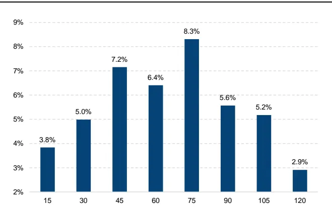
资料来源: Tinysoft，国信证券经济研究所整理

图 2：开盘收益五档分组检验
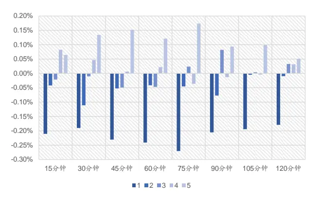
资料来源: Tinysoft，国信证券经济研究所整理

图 1 是使用时间序列上每日开盘在 15 分钟至 120 分钟时间，步长为 15 分钟跨度开盘收益与日内剩余时间收益的相关性。从图 1 可以看出，无论开盘收益的计算时间跨度是从 15 分钟还是到 120 分钟，IF 开盘收益与日内剩余时间收益均呈现比较显著的正相关性，也就是说，开盘收益往往决定了日内价格的走向。其中，开盘一个小时内相关性最高的时间为开盘后 45 分钟。

图 2 展示的是开盘收益五档分组检验结果，具体检验方法为将开盘收益从低到高分为五档，然后分别计算每档中日内剩余时间收益率的平均值。从五档分组来看 75分钟内的开盘动量效应都非常显著。整体呈现出开盘收益最低以及最高的两组分别是剩余时间收益最低以及最高的两组。而且，随着开盘收益的增加，整体日内剩余时间收益也随之增加。

整体来看，随着开盘时间跨度的增加日内动量效应呈现出显著性先增加后降低的趋势。从五档分组的多空收益来看，开盘一个小时内的时间中，45分钟级别的开盘动量效应最优。

## 股指期货开盘动量的刻画

前文检验了股指期货的开盘动量效应，本节我们将尝试对股指期货的开盘动量效应进行精准的刻画与进一步的探索并形成基础策略。

在趋势的判断技术中，趋势线是基础，在很多复杂的趋势交易的策略中，其最核心的原理依然是趋势线。

趋势线（Trend Line）:又分为向上趋势线与向下趋势线，当价格的趋势向上的时候，趋势线为所有更高的低点的连线。当趋势方向相反时，趋势线为所有更低的高点的连线。

当趋势形成时，它非常有可能沿着趋势线继续运行。同时趋势线也起到支撑的作用，当价格运行到趋势线附近也有被支撑的效果。因此，趋势线常常被用来确认趋势的形成。

图 3：开盘上涨趋势判断示意图
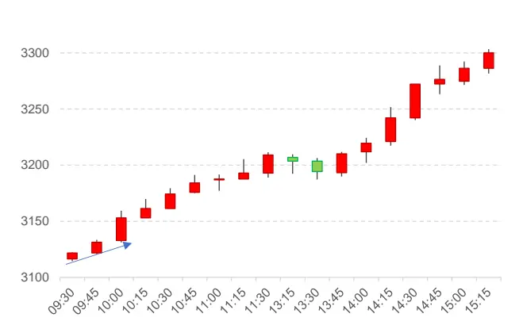
资料来源: Tinysoft，国信证券经济研究所整理

图 4：开盘下跌趋势判断示意图
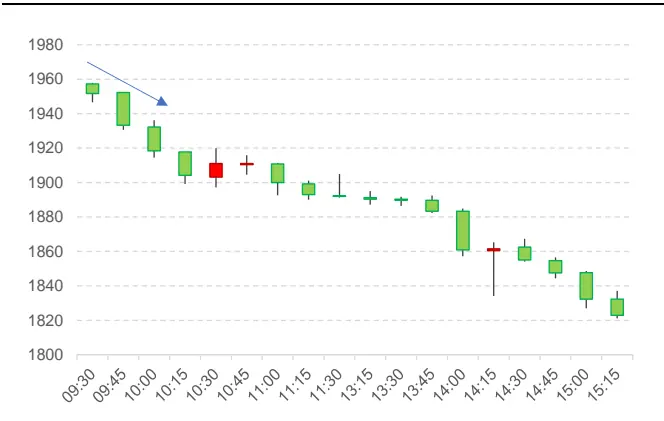
资料来源: Tinysoft，国信证券经济研究所整理

前文我们列举了开盘动量的检验结果，这里以开盘 45分钟为例，如果 15 分钟一个 K线的话，这里正好为开盘的前三根 K线。

图3以及图4显示的分别是开盘向上以及开盘向下的动量效应及全天价格走势，其中蓝色的线为趋势线。我们定义趋势线为：在最低价随 K 线依次上升，那么此为上升趋势线，最高价随 K线依次下降，那么此为下跌趋势线。

对于开盘动量而言，我们希望趋势的确认更加严格，因此我们定义：如果开盘价，最低价以及收盘价随 K 线依次上升，那么可以判定为上涨（多头）趋势。如果开盘价，最高价以及收盘价随 K线依次下降，那么可以判定为下跌（空头）趋势。

使用趋势线判断趋势相比直接使用收益率进行判定的好处是，第一，省去了对于收益率大小判定的参数寻优，第二，不仅对结果进行了判断，还对过程进行了刻画。

当趋势向上时，我们定义为多头趋势，当趋势向下时，我们定义为空头趋势，我们检验当开盘 45 分钟内，连续三根 K 线出现我们定义的多头趋势以及空头趋势时，当天剩余时间收益的描述性统计。

表 2：IF合约开盘多空趋势收益率描述性统计

| 方向 | 发生次数 | 平均收益 率 | 收益率中 位数 | 收益率下 四分位 | 收益率上 四分位 | 胜率 | 收益率T 值 |
| --- | --- | --- | --- | --- | --- | --- | --- |
| 多头趋势 | 258 | 0.32% | 0.12% | -0.47% | 0.91% | 57.36% | 4.03 |
| 空头趋势 | 254 | -0.26% | -0.13% | -0.78% | 0.41% | 43.31% | -3.21 |

资料来源: Tinysoft，国信证券经济研究所整理

从表 2 可以看出，多头趋势与空头趋势当天未来的收益率呈现出明显的区别。其中，多头趋势中平均收益率以及收益率的中位数均为正，且 T 值显著。收益率的上四分位显著大于下四分位，日度胜率为 57.36%，显示出未来收益率的分布中正收益率概率较高。而空头趋势中平均收益率以及收益率的中位数显著为负。收益率的下四分位显著小于上四分位，日度胜率为 43.31%，显示出未来收益率的分布中负收益率概率较高。

可以看出我们定义的多空趋势对日内剩余收益的预测效果非常显著且稳健，因此，我们尝试使用 15 分钟 K线构造基础策略：当开盘 45 分钟内，连续三根 K线出现我们定义的多头趋势时，开多仓。而当连续三根 K 线出现我们定义的空头趋势时，则开空仓，当天平仓，不持隔夜仓。

图 5：IF合约开盘动量基础策略净值表现
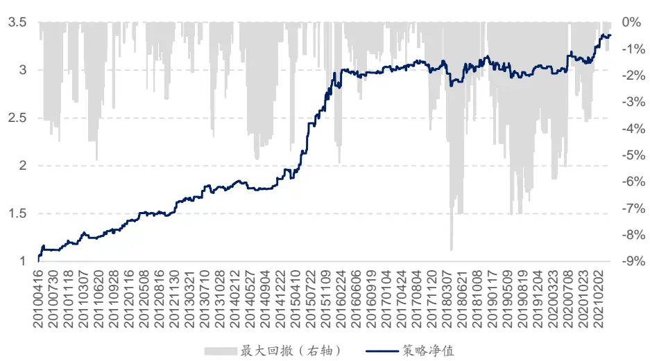
资料来源: Tinysoft，国信证券经济研究所整理

图 5 中为基础策略在 IF 合约上面的净值表现，其中，回测的交易成本由手续费以及冲击成本构成，手续费为 0.3%%，交易价格为信号触发后 5 分钟的成交量加权平均价（VWAP），其中，具体数据的处理、合约价格拼接以及收益率的计算可参阅附录—数据准备。其中，通过算法交易可实现冲击成本万一的偏离，因此，我们在进行回测时使用的交易成本为 1.3%%。

基础策略费后年化收益率为11.46%，年化夏普率为1.35，Calmar比率为1.34，全样本期最大回撤为 8.57%。策略的分年度统计如表 3所示：

表 3：IF合约基础策略年度收益统计

|  | 策略收益 | 最大回撤 | 夏普率 | 波动率 | Calmar | 月度胜率 |
| --- | --- | --- | --- | --- | --- | --- |
| 2010 | 18.23% | -4.49% | 1.98 | 12.02% | 4.07 | 66.67% |
| 2011 | 17.70% | -5.17% | 1.92 | 8.52% | 3.42 | 83.33% |
| 2012 | 17.12% | -2.87% | 2.14 | 7.41% | 5.96 | 75.00% |
| 2013 | 8.76% | -4.29% | 1.15 | 7.60% | 2.04 | 66.67% |
| 2014 | 5.06% | -5.15% | 0.87 | 5.78% | 0.98 | 58.33% |
| 2015 | 55.47% | -4.84% | 3.01 | 14.80% | 11.46 | 83.33% |
| 2016 | 4.88% | -5.29% | 0.61 | 8.18% | 0.92 | 58.33% |
| 2017 | -0.78% | -4.03% | -0.16 | 4.31% | -0.19 | 66.67% |
| 2018 | 2.28% | -8.44% | 0.30 | 8.56% | 0.27 | 58.33% |
| 2019 | -1.66% | -5.47% | -0.22 | 6.51% | -0.30 | 50.00% |
| 2020 | 3.55% | -3.73% | 0.57 | 6.36% | 0.95 | 50.00% |
| 20210430 | 7.25% | -1.05% | 3.42 | 6.28% | 6.91 | 100.00% |
| 全样本期 | 11.46% | -8.57% | 1.35 | 8.51% | 1.34 | 66.17% |

资料来源: Tinysoft，国信证券经济研究所整理

从表 3可以看出，策略除 2017 年以及 2019 年收益为负以外，其余年份收益均为正。但在 2015 年之后策略表现趋缓，同时，策略每年收益的波动也较大。这表明如果只使用基础策略还是有一些局限性，因此我们考虑在策略中加入风险控制。

## 风险控制

在进行策略的开发与设计时，对于风险的考量永远是第一位的，核心策略的优劣决定能获得多少盈利，而对于风险的控制与把握则决定投资者能在市场生存多久。因此本节首先探讨两种风控方式，一个是对于策略的止损，一个是对于波动的控制。

## 反向信号止损

从逻辑上面来说，趋势跟随类的策略的收益来源是识别出趋势并跟踪趋势的过程。而损失的来源则相应可以归因为对趋势的识别错误或者趋势尾端衰落的两个过程。

如前文所述，尽管开盘动量效应对当天收益的预测具有较高的胜率，其中，多头趋势的胜率为 57.36%，空头趋势的胜率为 43.31%，但是仍有当天的趋势信号判断错误的情况。

例如，当天开盘的 3 根 K线出发了我们定义的多头趋势信号，而在盘中行情出现了反转，向上的趋势线变为了向下的趋势线，即最高价逐次降低。那么这种情况则可能意味着开盘动量的衰减。

图 6：IF合约走势长期趋势图
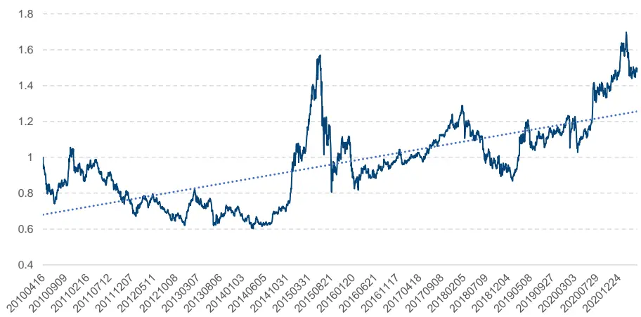
资料来源: Tinysoft，国信证券经济研究所整理

由于我国经济长期高速发展，股票市场长期向上，图 6 展示了 IF合约长期走势以及虚线为长期趋势，因此在进行止损时，对于多空趋势的止损应有不同，对于空头的止损应严格于多头止损。

我们定义：当策略开出多仓时，在盘中出现连续 5根 K线最高价逐次降低，则为反向信号，当策略开出空仓时，在盘中出现连续 3 根 K 线最低价逐次上升，则为反向信号。

图 7：开盘多头趋势反转案例
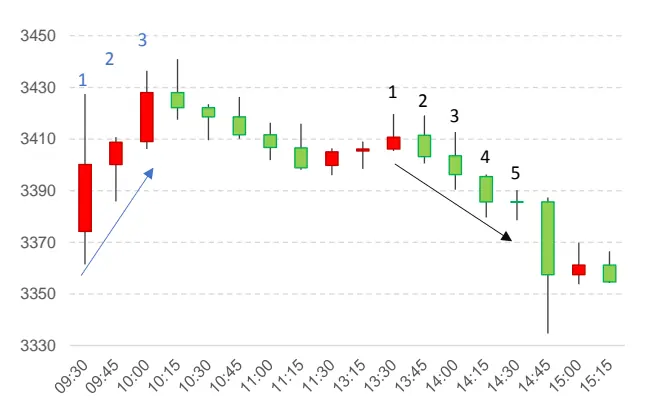
资料来源: Tinysoft，国信证券经济研究所整理

图 8：开盘空头趋势反转案例
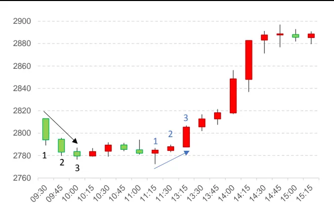
资料来源: Tinysoft，国信证券经济研究所整理

如图 7所示，为 IF 合约在 2015 年 12 月 10 日的日内走势图，当日开盘后在第3 根 K 线收盘时，发出了多头趋势信号，因此策略将在此时开出多仓。当策略运行到当日的第 15 根 K 线收盘时形成了向下的趋势线，此时趋势线由向上改为了向下，那么这可能意味着开盘多头趋势的衰减。

如图 8 所示，为 IF 合约在 2015 年 3 月 9 日的日内走势图，当日开盘后在第 3根 K 线收盘时，发出了空头趋势信号，因此策略将在此时开出空仓。而紧接着趋势线由向下改为了向上，并且在当日的第 10 根 K 线收盘时形成了向上的趋势线，那么此时则意味着趋势的衰减。当日内趋势衰减到一定程度，则可能意味着行情出现了与开盘动量方向相反的日内反向的结果。

我们将针对多头趋势以及空头趋势两种情况，统计日内出现反向信号的次数以及对应的开仓后日内剩余时间收益。

表 4：IF合约日内反向信号次数与反向信号后收益

| 日内反向 信号次数 | 方向 | 原始信号 数 | 发生次数 | 发生比例 | 平均收益 率 | 收益率中 位数 | 收益率下 四分位 | 收益率上 四分位 | 收益胜率 | 收益率T值 |
| --- | --- | --- | --- | --- | --- | --- | --- | --- | --- | --- |
| 1次 | 多头趋势 | 258 | 108 | 41.86% | 0.25% | 0.02% | -0.31% | 0.40% | 55.56% | 1.91 |
|  | 空头趋势 | 254 | 229 | 90.16% | -0.20% | -0.03% | -0.59% | 0.29% | 46.29% | -2.84 |
| 2次 | 多头趋势 | 258 | 59 | 22.87% | 0.13% | 0.01% | -0.08% | 0.19% | 64.41% | 1.60 |
|  | 空头趋势 | 254 | 192 | 75.59% | 0.03% | 0.00% | -0.22% | 0.30% | 54.69% | 0.56 |
| 3次 | 多头趋势 | 258 | 33 | 12.79% | -0.01% | 0.03% | -0.14% | 0.14% | 66.67% | -0.20 |
|  | 空头趋势 | 254 | 154 | 60.63% | 0.00% | 0.00% | -0.21% | 0.21% | 51.95% | 0.03 |

资料来源: Tinysoft，国信证券经济研究所整理

表 4 中我们统计了不同日内反向信号次数对应开仓后收益情况。具体而言，我们将所有开盘出现多头趋势以及空头趋势信号的样本日取出。当出现多头趋势信号时，策略在第 3 根 K 线收盘开多仓，当出现空头趋势信号时，策略在第 3根 K 线收盘开空仓。我们去查看该日内策略在出现不同次数止损时，从止损点开始到收盘的剩余时间内收益率。

从表 4 可以看出，随着日内出现反向信号次数的增多，则意味着开盘动量效应的预测效果越差。当日内出现 3 次反向信号时，无论开盘时出现的是多头趋势信号还是空头趋势信号，第三次止损信号后的平均收益都出现了反向。即日内剩余收益与开盘动量出现了反转。

因此，当策略开仓之后，我们需要时刻监控日内反向信号的出现，出现的次数越多代表当天开盘趋势的衰减越大。

## 吊灯止损法

上一节我们针对趋势的识别错误进行了反向信号止损方式的探讨。那么，针对趋势尾端的衰落我们使用吊灯止损法来应对。

吊灯止损法（Chandelier Stop）最早是由 Chuck LeBeau 提出，并由 AlexanderElder 发表在《come into my trading room》一书中。传统的亏损止损法是从开仓时便跟踪计算策略的浮盈浮亏，当策略出现浮亏大于一定阈值时止损清仓。而吊灯止损法与传统亏损止损法的区别是，吊灯止损法具有锁定部分盈利的特性。在趋势的运行过程中，时刻识别最优价格，当趋势从最优价格开始衰落到一定程度的时候进行止损。具体公式如下：

$$
optHigh=Max(high_{i})\ i=1,2,...
$$

$$
optLow=Min(low_{i})\quad i=1,2,\dots
$$

其中，optHigℎ以及optLow分别对应策略开多仓时以及开空仓时的最优价格，i为策略开仓后的 K 线根数。这里的最优价格由趋势的方向而定，如当前趋势向上，则对应开多仓，那么最优价格就是每一根新 K 线的最高价中的最高者，即随着趋势的运行不断记录趋势过程中最高价的最大值，如果当前收盘价低于最优价格回落 N个 ATR，则对当前仓位进行止损操作。反之亦然。

通常情况下，N 取 2-3，我们这里对多头趋势的止损取 N 为 2.5， 对空头趋势的止损取 N为 2。具体趋势的衰落以及止损示意图如图 9 以及图 10：

图 9：开盘多头趋势吊灯止损案例
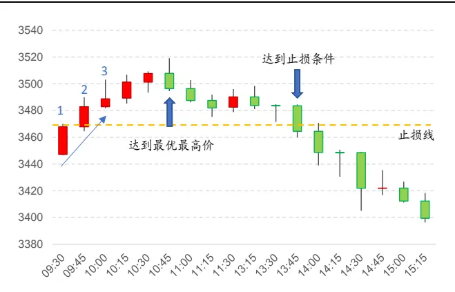
资料来源: Tinysoft，国信证券经济研究所整理

图 10：开盘空头趋势吊灯止损案例
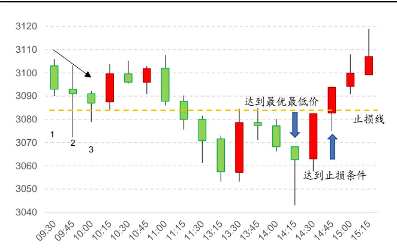
资料来源: Tinysoft，国信证券经济研究所整理

其中，图 9为 IF 合约在 2015 年 11 月 17 日的日内 K线走势。其中，开盘前 3根 K线触发了当日多头趋势信号，在出发信号开仓后，记录每一根新 K线的最高价，与开仓以来所有最高价的最大值为最优价格，当策略运行到 10:45 时，当日最优价格刷新到最高，随后当策略运行到当天 13:45 时，合约的收盘价突破了当前最优价格向下 2.5 倍 ATR，因此策略在此时则触发了吊灯止损的止损条件。

图 10 为 IF 合约在 2010 年 4 月 30 日的日内 K 线走势。其中，开盘前 3 根 K线触发了当日空头趋势信号，随后开始记录每一根 K 线的最低价，将最低值作为最优价格，当策略运行到 14:15 时，当日最优价格刷新新低。紧接着，在随后第二根 K线的收盘价突破了当前最优价格向上 2倍 ATR，触发了吊灯止损的止损条件。

我们对日内出现吊灯止损的情况与其止损触发后当日剩余时间收益做了统计，

如表 5 所示：

表 5：IF合约日内吊灯止损次数与止损后收益

| 日内反向 信号次数 | 方向 | 原始信号 数 | 发生次数 | 发生比例 | 平均收益 率 | 收益率中 位数 | 收益率下 四分位 | 收益率上 四分位 | 收益胜率 | 收益率T值 |
| --- | --- | --- | --- | --- | --- | --- | --- | --- | --- | --- |
| 1次 | 多头趋势 空头趋势 | 258 | 87 | 33.72% | 0.14% | 0.11% | -0.19% | 0.36% | 60.92% | 1.49 |
|  |  | 254 | 133 | 52.36% | -0.41% | -0.20% | -0.73% | 0.03% | 28.57% | -5.14 |
| 2次 | 多头趋势 | 258 | 6 | 2.33% | -0.97% | -0.96% | -1.17% | -0.91% | 0.00% | -5.91 |
|  | 空头趋势 | 254 | 30 | 11.81% | 0.61% | 0.66% | 0.34% | 0.82% | 86.67% | 4.48 |
| 3次 | 多头趋势 | 258 | 0 | 0.00% |  | = |  | - |  | 1 |
|  | 空头趋势 | 254 | 5 | 1.97% | 1.93% | 1.59% | 1.39% | 2.48% | 100.00% | 5.74 |

资料来源: Tinysoft，国信证券经济研究所整理

从表 5可以看出，日内出现吊灯止损次数越多，开盘动量效应的预测效果越差。同时，当日内出现 2 次以及上信号时，无论开盘时出现的是多头趋势信号还是空头趋势信号，日内剩余收益与开盘动量均出现了反转。

因此，无论当天是否触发了反向信号，吊灯止损的触发也同样意味着开盘趋势的衰落。当策略开仓之后，我们除了需要时刻监控日内反向信号的出现，还需要时刻监控吊灯止损的触发。

从前文对风险控制的探讨中可以发现，当止损信号第一次出现时就进行平仓是不明智的，因此，我们选择将资金平均分成三等分，每一次触发任一止损信号减仓一份资金，当触发第三次止损信号时，策略进行平仓。这样可以使得仓位的变化更平滑，有助于降低交易摩擦。

加入止损条件后策略表现如图 11 所示：

图 11：IF合约加入止损条件后策略表现
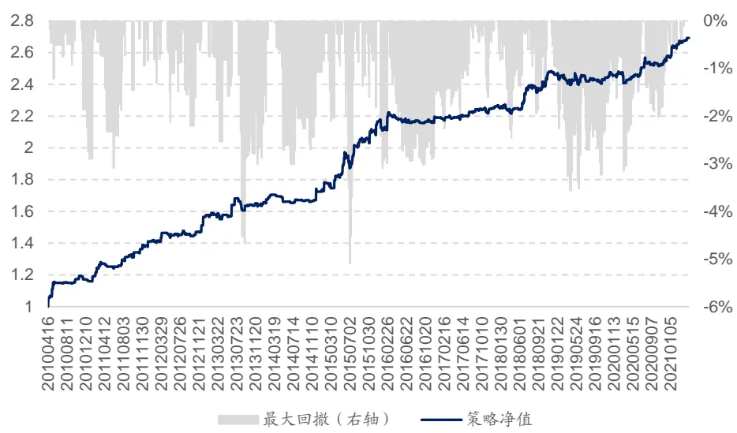
资料来源: Tinysoft，国信证券经济研究所整理

基础策略在加入止损条件后，费后年化收益率为 11.46%，年化夏普率为 1.35，Calmar 比率为 1.34，全样本期最大回撤为 8.57%。其中，基础策略在加入止损条件后的分年度统计如表 6 所示：

表 6：IF合约加入止损后年度收益统计

| 策略收益 | 最大回撤 | 夏普率 | 波动率 | Calmar | 月度胜率 |
| --- | --- | --- | --- | --- | --- |
| 2010 15.93% | -2.89% | 2.02 | 10.34% | 5.51 | 66.67% |
| 2011 18.79% | -3.09% | 2.40 | 7.17% | 6.09 | 66.67% |
| 2012 14.48% | -2.20% | 1.98 | 6.85% | 6.58 | 58.33% |
| 2013 4.42% | -4.66% | 0.64 | 7.17% | 0.95 | 58.33% |
| 2014 4.73% | -3.01% | 0.88 | 5.28% | 1.57 | 41.67% |
| 2015 25.62% | -5.09% | 2.36 | 9.70% | 5.04 | 75.00% |
| 2016 1.21% | -3.09% | 0.23 | 5.81% | 0.39 | 50.00% |
| 2017 3.11% | -1.60% | 1.10 | 2.76% | 1.94 | 66.67% |
| 2018 9.39% | -2.46% | 1.71 | 5.25% | 3.82 | 58.33% |
| 2019 -0.39% | -3.19% | -0.06 | 4.51% | -0.12 | 50.00% |
| 2020 4.36% | -2.99% | 0.99 | 4.34% | 1.46 | 66.67% |
| 20210430 4.76% | -0.62% | 3.18 | 4.47% | 7.70 | 100.00% |
| 全样本期 9.26% | -5.09% | 1.43 | 6.48% | 1.82 | 60.90% |

资料来源: Tinysoft，国信证券经济研究所整理

从表 6 可以看出，加入止损后的基础策略除 2019 年收益为负以外，其余年份收益均为正。与之前的基础策略相比，夏普率以及 Calmar 比率均有提升，其中夏普率由 1.35 提升至 1.43，Calmar 比率由 1.34 提升至 1.82，全样本期最大回撤由 8.57%降为 5.09%。加入止损后的策略体现出更强的稳健性，以及更高的收益回撤比。

## 隔夜仓

前文我们考察了股指期货的开盘动量效应，并形成了一个基础策略，策略表现稳健。股指期货除了具有开盘动量效应，其还有一个非常有趣的现象存在，就是日内与隔夜收益的不同。

为了刻画这一现象，我们考虑只持有隔夜仓，即当天收盘开多仓，第二天开盘平仓。在 IF合约上面实现的结果如图 12：

图 12：IF合约隔夜仓收益
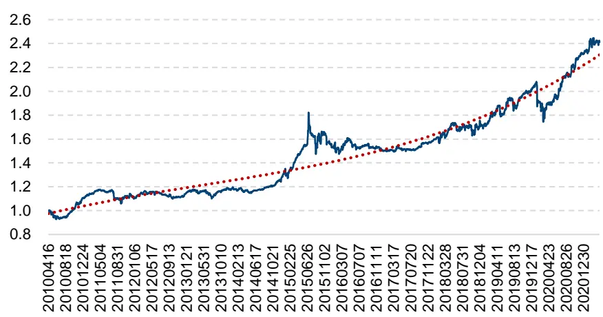
资料来源: Tinysoft，国信证券经济研究所整理

从图 12 中可以看出，IF 合约的隔夜收益长期趋势向上，因此，长期来看，IF合约的隔夜仓具有正向收益。

前文，我们梳理了股指期货合约的开盘动量效应。那么自然有一个疑问，如图13 所示既然开盘收益决定了当天的日内走势，那么是否会对之后的隔夜收益有影响呢？

图 13：开盘动量与日内收益及隔夜收益测试示意图
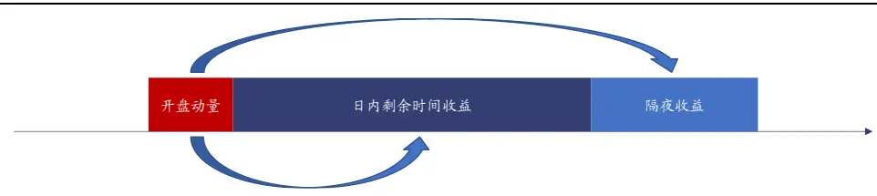
资料来源: 国信证券经济研究所整理

为检验开盘动量效应与隔夜收益的关系，我们做如下统计：当基础策略发出多头信号时，当日结束后的隔夜收益情况，以及当基础策略发出空头信号时，当日结束后的隔夜收益情况。

表 7：IF合约开盘多空趋势隔夜收益率描述性统计

| 方向 | 发生次数 | 平均隔夜收益率 | 隔夜收益率中位 数 | 隔夜收益率下四 分位 | 隔夜收益率上四 分位 | 隔夜收益胜率 | 隔夜收益率T值 |
| --- | --- | --- | --- | --- | --- | --- | --- |
| 多头趋势 | 258 | 0.14% | 0.10% | -0.08% | 0.34% | 65.89% | 4.81 |
| 空头趋势 | 254 | 0.03% | 0.01% | -0.19% | 0.26% | 53.15% | 0.47 |

资料来源: Tinysoft，国信证券经济研究所整理

从表 7 可以看出，开盘的多头趋势对于当天收盘后的隔夜收益率呈现出非常显著的预测效果。预测胜率高达 65.89%，平均可以获得 0.14%的隔夜收益率，且隔夜收益率的 T 值为 4.81。同时，由于股指长期来看隔夜收益较强，因此开盘空头趋势的隔夜收益率表现较弱，但长期来看并没有显著为负。空头趋势对于隔夜收益率几乎没有预测效果，可以看到开盘空头趋势当天收盘后的隔夜收益率预测胜率为 53.15%，统计的 T 值为 0.47。由上面的研究可以得出：开盘的多头趋势对于当天收盘后的隔夜收益率的预测效果显著，而空头趋势则不具备相应的预测性。

通过前文的统计，我们尝试在基础策略中加入一个新的规则：如果当天开盘动量为多头趋势，那么持有隔夜仓，持有到第二天的开盘进行平仓，如果当天开盘动量为空头趋势，那么不持隔夜仓，当天收盘平仓。加入隔夜仓判断之后策略表现如图 14所示：

图 14：IF合约加入隔夜仓判断后策略表现
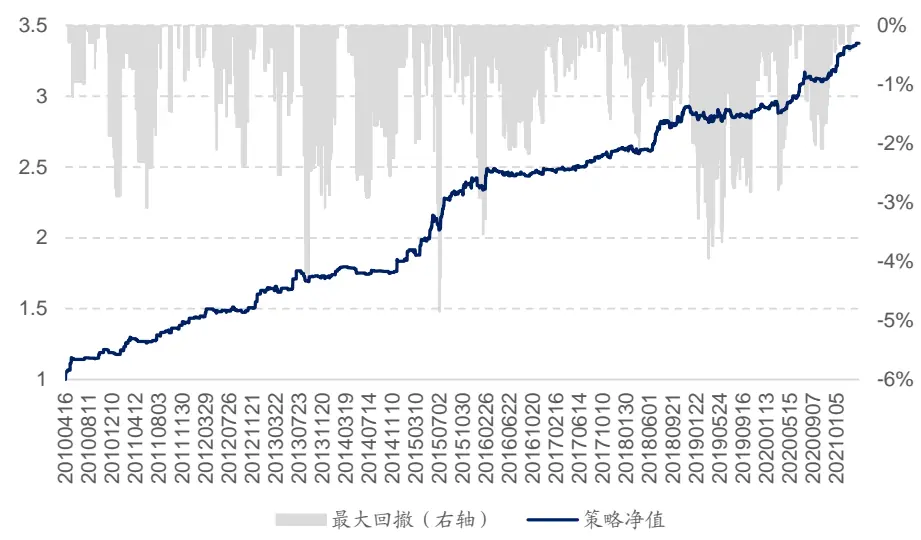
资料来源: Tinysoft，国信证券经济研究所整理

前述策略在加入隔夜仓判断后，费后年化收益率为11.46%，年化夏普率为1.35，

Calmar 比率为 1.34，全样本期最大回撤为 8.57%。策略的分年度统计如表 3所示：

表 8：IF合约加入隔夜仓判断后年度收益统计

|  | 策略收益 | 最大回撤 | 夏普率 | 波动率 | Calmar | 月度胜率 |
| --- | --- | --- | --- | --- | --- | --- |
| 2010 | 17.78% | -2.89% | 2.20 | 10.53% | 6.15 | 66.67% |
| 2011 | 18.78% | -3.09% | 2.35 | 7.33% | 6.08 | 66.67% |
| 2012 | 16.49% | -2.36% | 2.19 | 7.00% | 7.00 | 75.00% |
| 2013 | 6.16% | -4.33% | 0.83 | 7.60% | 1.42 | 66.67% |
| 2014 | 6.09% | -2.92% | 1.05 | 5.64% | 2.09 | 41.67% |
| 2015 | 31.35% | -4.85% | 2.51 | 10.93% | 6.46 | 75.00% |
| 2016 | 3.04% | -3.54% | 0.52 | 6.05% | 0.86 | 58.33% |
| 2017 | 5.86% | -1.59% | 1.79 | 3.16% | 3.68 | 75.00% |
| 2018 | 9.77% | -2.06% | 1.67 | 5.60% | 4.74 | 58.33% |
| 2019 | 1.43% | -2.88% | 0.31 | 4.88% | 0.50 | 58.33% |
| 2020 | 8.62% | -2.78% | 1.74 | 4.75% | 3.10 | 66.67% |
| 20210430 | 6.09% | -0.43% | 3.57 | 5.07% | 14.18 | 100.00% |
| 全样本期 | 11.48% | -4.85% | 1.67 | 6.89% | 2.37 | 65.41% |

资料来源: Tinysoft，国信证券经济研究所整理

从表 8 可以看出，加入隔夜仓判断后的基础策略在样本期内所有年份的收益均为正。与之前的仅加入止损后基础策略相比，在策略收益提升的同时，策略的夏普率以及 Calmar 比率均有提升，其中夏普率由 1.43 提升至 1.67，Calmar比率由 1.82 提升至 2.37，全样本期最大回撤由 5.09%降为 4.85%。基础策略在加入止损条件以及隔夜仓判断后，表现更加稳健。

## 杠杆设置

## 海龟资金管理法

策略中的风险主要由两部分组成，一部分是策略的潜在亏损，一部分是策略的波动。前文介绍了如何在策略中进行止损，接下来，我们主要围绕对策略波动进行风控的方法。

为使得策略在所有不同品种上面的波动幅度可控，我们需要根据不同品种的波动幅度进行交易量的调整。这里所说的波动幅度通常使用真实波动幅度均值（Average True Range，ATR）来度量。其中，ATR 指标的具体计算公式如下所示：

$$
TR=Max[(high-low),abs(high-preclose),abs(low-preclose)]
$$

$$
ATR=\frac{1}{n}\sum_{i=1}^{n}TR_{i}
$$

其中， $TR_{i}$ 为 True Range，用于衡量每日的波动幅度，ATR则是 $TR_{i}$ 的移动平均值。

前文我们在构造策略时，开仓杠杆均为 1 或-1，即满仓无杠杆情况下开多仓以及空仓。通过 ATR 指标来调整品种杠杆的基本原理是，将波动较高的品种赋予相对较低的杠杆，将波动较低的品种赋予相对较高的杠杆，因此杠杆率与 ATR呈反比关系。

更进一步地，对风险的控制要求我们知道 1单位 ATR的波动对应我们账户资金波动的多少，这里假设我们要让 1单位 ATR的波动正好等于我们策略整体资金规模的 0.5%。假设我们使用的是一个单位账户，即总资金规模为 1。那么，我们将 0.5%除以对应的 1 单位 ATR 则为我们实际应开出的合约数量。即此刻交易应该开出的合约手数。

如果我们需要计算的是一个杠杆率即当前开仓手数占整体资金规模可开仓手数的比例，那么需要除以满仓状态下可以开出的总合约数量，具体计算公式为：

$$
Pos_{ATR}=\frac{0.5\%}{ATR}
$$

$$
Pos=\frac{1}{Close}
$$

$$
\begin{array}{c}{{Lev_{ATR}=\displaystyle\frac{Pos_{ATR}}{Pos}}}\\{{=\displaystyle\frac{0.5^{0}/\mathrm{_0}}{ATR}\ast Close}}\end{array}
$$

其中， $Pos_{ATR}$ 为 1 单位 ATR 对应资金规模 0.5%波动的应开手数,Pos为全部资金对应满仓可开手数，Close为收盘价， $Lev_{ATR}$ 为应开手数除以满仓手数的开仓杠杆率。由上面算法计算出来的开仓杠杆率具有根据 ATR波动调整杠杆率大小的特性，当一个品种的日均波动较大时，我们倾向于给予该品种较低的杠杆，而反之，如果一个品种的日均波动较小，我们则可以给该品种较高的杠杆。从风险控制的角度如果一个品种的波动较大，给予较小杠杆也是出于对资金安全的考虑，防止由于较大的波动幅度而触发穿仓风险。

由于我们使用的是 15分钟为周期的 K线，因此，在计算 ATR 时使用的 K线数据依然是 15 分钟，从当前股指期货的交易时间来看，一天中共有 16 个 15 分钟。因此每天股指期货有 16 根 15 分钟的 K线。我们取 ATR 的长度为 16根 K线。

从图 15 可以看出，IF 合约的 ATR 值在 2015 年发生了较大的变化，波动显著增加之后快速回落，2016 至 2017 年 IF 合约的 ATR值进入了低点，随后 IF合约的 ATR稳中有升。

图 15：IF 合约 ATR 变化图
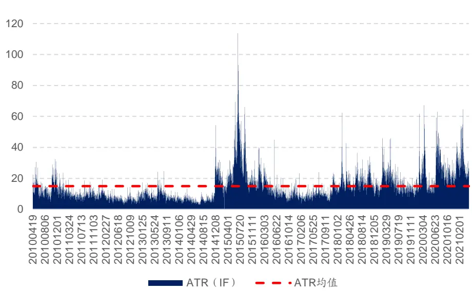
资料来源: Tinysoft，国信证券经济研究所整理

在计算 $.Lev_{ATR}$ 时，出于实际使用情况考虑，我们设置实际交易的杠杆率最高不超过 4倍杠杆。因此当 $Lev_{ATR}$ 的绝对值大于 4 时，我们截断为 4。

IF 合约 $Lev_{ATR}$ 的时间序列走势如图 16 所示：

图 16：IF合约 ATR调整杠杆率变化图
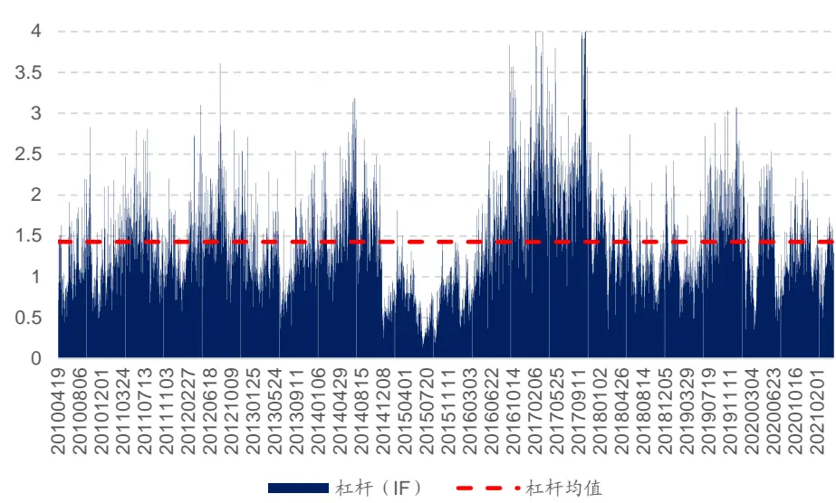
资料来源: Tinysoft，国信证券经济研究所整理

从图 16可以看出历史上平均而言 IF合约的 $Lev_{ATR}$ 围绕 1.5 上下波动，其中，IF合约长期平均 $Lev_{ATR}$ 为 1.43。

## 已实现波动率调整

当一个策略被设计研发出来之后，我们便可以实时监控这个策略的表现以及各个风险属性，其中一个重要的风险指标为策略的年化波动率。不同的策略逻辑对应的波动率不同，因此会有高波动策略以及低波动策略。那么不同的策略在实盘使用中，我们也希望用类似前文介绍的资金管理法对不同策略进行资金管理。同一个策略在不同品种上面表现出来的波动也不尽相同，出于对风险的考量，我们同样倾向于对策略波动较大的品种给予较低的杠杆率，而对于波动较小的品种给予较高的杠杆率。

具体做法是，我们在每个月月末回看不同品种上面的策略运行情况，计算过去一年该策略在该品种上的波动率，将目标波动率设置为 15%，那么波动率调整系数的计算公式可以表示为：

$$
Mul_{vol}=\frac{15\%}{Vol_{i}}
$$

其中， $Mul_{vol}$ 为经已实现波动率调整的系数， $Vol_{i}$ 为第 i个品种上策略过去一年的波动率。因此，结合前文介绍的 ATR 调整杠杆率，一个品种的开仓杠杆率应为：

$$
Lev=Mul_{vol}*Lev_{ATR}
$$

通过对不同品种上策略表现波动率的调整，可以使得策略在不同品种上面运行的整体风险趋于一致。

同样，出于实际使用情况考虑，我们设置最大杠杆率为 4 倍杠杆。因此当Lev的绝对值大于 4时，我们截断为 4。

经波动率调整后 IF合约Lev的时间序列走势如图 17：

图 17：IF合约 ATR及波动率调整杠杆变化图
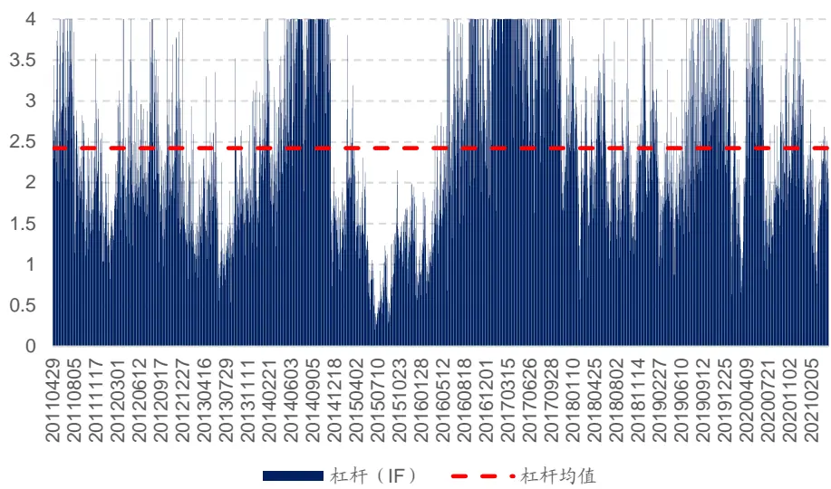
资料来源: Tinysoft，国信证券经济研究所整理

图 17 显示，长期来看 IF 合约在上述策略下的杠杆率平均为 2.42，在 2015 年策略在 IF 合约上的杠杆率降到最低。加入 ATR 以及波动调整之后策略表现如图 18 所示：

图 18：IF合约加入 ATR及波动调整后策略表现
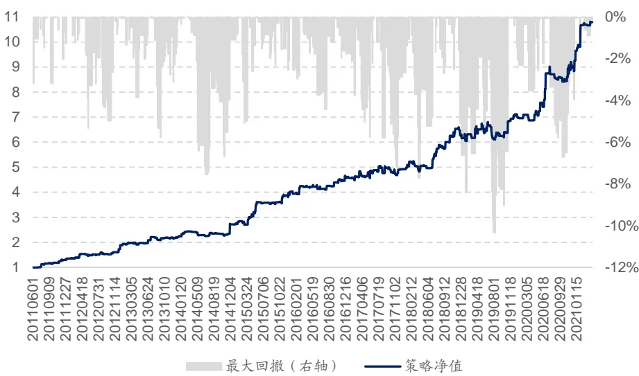
资料来源: Tinysoft，国信证券经济研究所整理

前述策略在加入 ATR 及波动调整的杠杆设置后，费后年化收益率为 23.70%，年化夏普率为 1.56，Calmar 比率为 2.30，全样本期最大回撤为 10.31%。策略的分年度统计如表 9所示：

表 9：IF合约加入 ATR及波动调整后年度收益统计

|  | 策略收益 | 最大回撤 | 夏普率 | 波动率 | Calmar | 月度胜率 |
| --- | --- | --- | --- | --- | --- | --- |
| 2011 | 29.54% | -3.20% | 1.81 | 14.67% | 9.22 | 75.00% |
| 2012 | 49.52% | -5.33% | 2.34 | 17.61% | 9.29 | 75.00% |
| 2013 | 14.16% | -5.76% | 1.16 | 12.10% | 2.46 | 75.00% |
| 2014 | 22.82% | -7.55% | 1.13 | 19.24% | 3.02 | 41.67% |
| 2015 | 48.00% | -5.08% | 2.29 | 17.50% | 9.44 | 75.00% |
| 2016 | 14.76% | -4.41% | 1.20 | 11.85% | 3.34 | 66.67% |
| 2017 | 6.62% | -7.23% | 0.49 | 15.25% | 0.92 | 66.67% |
| 2018 | 27.39% | -7.71% | 1.71 | 14.60% | 3.55 | 75.00% |
| 2019 | 11.90% | -10.31% | 0.77 | 15.91% | 1.15 | 58.33% |
| 2020 | 26.04% | -6.70% | 1.50 | 16.04% | 3.89 | 66.67% |
| 20210430 | 22.20% | -0.90% | 3.78 | 16.47% | 24.72 | 75.00% |
| 全样本期 | 23.70% | -10.31% | 1.56 | 15.15% | 2.30 | 69.92% |

资料来源: Tinysoft，国信证券经济研究所整理

从表 9可以看出，IF 合约加入 ATR 及波动调整后的策略在样本期内所有年份的收益均为正且有明显提升。与之前的仅加入隔夜仓策略相比，在策略收大幅提升，而夏普率以及 Calmar比率没有较大变化。

## 基于开盘动量效应的股指期货交易策略

前文我们针对IF合约进行了策略的细节探讨，下面我们基于前文的探讨与研究，利用股指期货的开盘动量效应结合隔夜收益以及综合风控系统构建股指期货策略，应用于全部股指期货合约。具体的策略构建流程如下：

## 投资标的：

IF、IC 以及 IH 三个股指期货的主力合约，等权分配资金。

## 开仓信号：

多头：开盘后前 3 跟 K线开盘价、最低价以及收盘价依次上涨

空头：开盘后前 3 跟 K线开盘价、最高价以及收盘价依次下跌。

## 减仓信号：

多头：连续 5根 K线最高价依次下跌、最优价格回撤 2.5 倍 ATR（吊灯止损法）

空头：连续 3根 K线最低价依次上涨、最优价格回撤 2倍 ATR（吊灯止损法）。

## 杠杆率调整：

ATR 调整：根据前文海龟资金管理法（1单位 ATR的波动对应策略整体资金规模的 0.5%）

已实现波动调整：以过去一年策略波动率为基准设置目标年化波动 15%

最终杠杆率：ATR 调整杠杆*已实现波动调整杠杆，最高 4 倍杠杆截断。

## 减仓逻辑：

出现减仓信号减开仓仓位 1/3，出现第三次减仓信号时平仓。

## 是否持隔夜仓：

当日开盘动量若为多头信号且日内没有平仓，则持有隔夜仓，否则当日收盘平仓。

## 成交价格：

信号触发后 5分钟 VWAP。

## 交易成本：

交易手续费 0.3%%，冲击成本 1%%。

用一个流程图可表示如图 19：

图 19：策略构建流程图
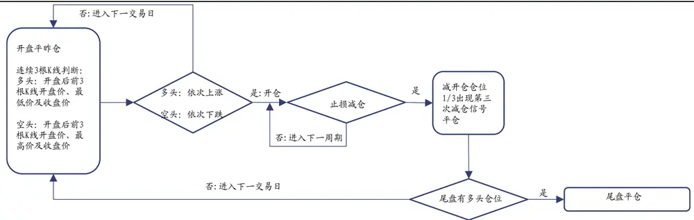
资料来源: Tinysoft，国信证券经济研究所整理

按照上述流程构建的基于开盘动量效应的股指期货交易策略历史表现稳定且具有较高收益率，2011 年以来在股指期货上面该 CTA 策略净值稳定攀升，同时回撤可控。具体走势如图 20 所示：

图 20：基于开盘动量效应的股指期货交易策略
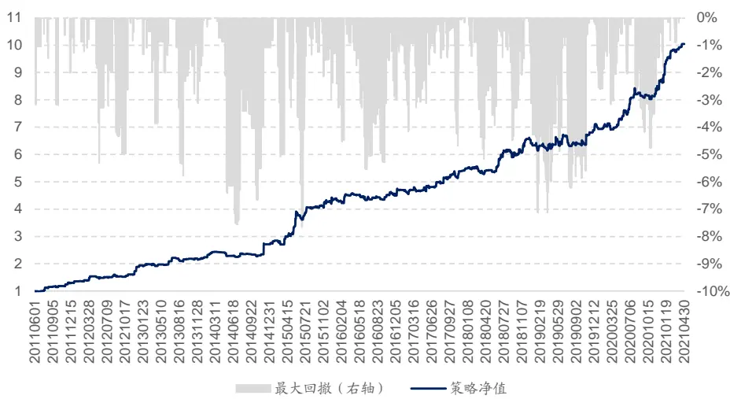
资料来源: Tinysoft，国信证券经济研究所整理

2011 年 6 月以来，基于开盘动量效应的股指期货交易策略费后年化收益率为25.79%，夏普率为 1.77，最大回撤为 7.66%，Calmar 比率为 3.37。可以看出策略表现非常稳健。其中，策略的分年度收益表现如表 10：

表 10：基于开盘动量效应的股指期货交易策略收益表现

|  | 策略收益 | 最大回撤 | 夏普率 | 波动率 | Calmar | 月度胜率 |
| --- | --- | --- | --- | --- | --- | --- |
| 2011 | 29.54% | -3.20% | 2.34 | 18.91% | 9.22 | 57.14% |
| 2012 | 49.52% | -5.33% | 2.34 | 17.61% | 9.29 | 75.00% |
| 2013 | 14.16% | -5.76% | 1.16 | 12.10% | 2.46 | 75.00% |
| 2014 | 22.82% | -7.55% | 1.13 | 19.24% | 3.02 | 41.67% |
| 2015 | 60.64% | -7.66% | 2.35 | 20.74% | 7.92 | 83.33% |
| 2016 | 7.98% | -5.53% | 0.75 | 10.91% | 1.44 | 66.67% |
| 2017 | 16.46% | -4.68% | 1.49 | 10.45% | 3.52 | 75.00% |
| 2018 | 16.79% | -5.17% | 1.45 | 11.03% | 3.25 | 58.33% |
| 2019 | 9.08% | -6.21% | 0.76 | 12.28% | 1.46 | 58.33% |
| 2020 | 23.98% | -4.75% | 2.16 | 10.05% | 5.05 | 66.67% |
| 20210430 | 15.91% | -0.90% | 4.12 | 11.04% | 17.72 | 100.00% |
| 全样本期 | 25.79% | -7.66% | 1.77 | 14.59% | 3.37 | 67.23% |

资料来源: Tinysoft，国信证券经济研究所整理

从表 10可以看出，每年收益回撤比都是大于 1.4 的，因此策略的分年度表现非常稳健。同时，相比前文基础策略在收益回撤比提升的同时，全样本期年化收益率也进一步提升。

由于我们控制目标年化波动率在 15%，因此实现出来全样本期的年化波动率为14.59%，与期望的目标波动率比较接近，而由于每年策略的表现略有差异，其中最大年化波动率出现在2015年，当年波动率到达20.74%，当年夏普率为2.35，收益回撤比为 7.92。

Fung and Hsieh（2001）中提到对于趋势跟随策略而言，其特性很像一个回溯跨式期权（lookback straddles），文中尝试使用这种奇异期权来复制趋势跟随策略，当然，这种复制是无法落地实现的，只是一种理论上的说明。这同时也说明趋势跟随策略与波动率有着较强的联系，通常情况下，波动率越高，趋势策略的收益越大。因此，像 2015 年市场中有这样大起大伏波动的状态，策略表现则非常好。而当市场出现震荡或者没有明显趋势的时候，则策略往往也难以表现出众。

图 21：股指期货各合约策略表现
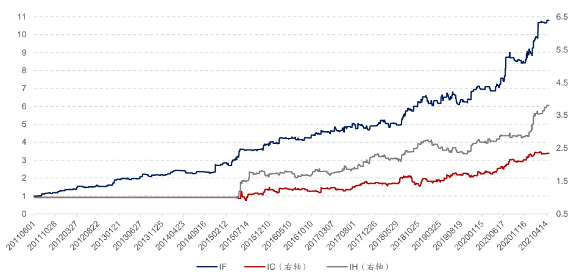
资料来源: Tinysoft，国信证券经济研究所整理

由前文的探讨可以看出，策略的逻辑可以适用于应用于全部股指期货标的，因此我们对合约不加以挑选和区分。策略在不同合约上的表现如图 21 所示。策略在不同合约上表现都很稳健。

图 22 显示的是策略在 IF 合约上自 2015 年以来的开仓信号点，其中红色为多头信号点，绿色为空头信号点。

图 22：策略自 2015 年以来在 IF 合约上信号点
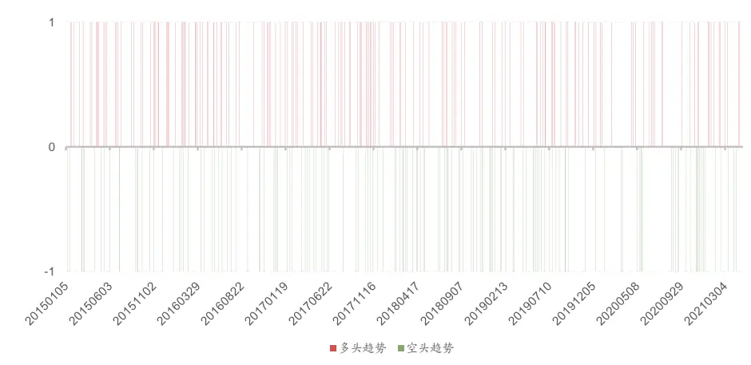
资料来源: Tinysoft，国信证券经济研究所整理

图 23 以及图 24展示的是策略在 IC以及 IH 合约上面的开仓信号点。由可以看出策略信号在不同合约上的交易频率分布比较均匀。

图 23：策略在 IC合约上信号点
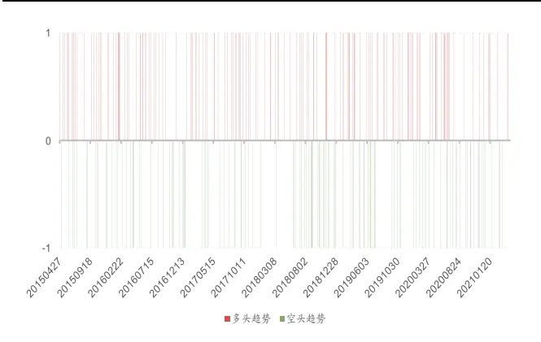
资料来源: Tinysoft，国信证券经济研究所整理

图 24：策略在 IH合约上信号点
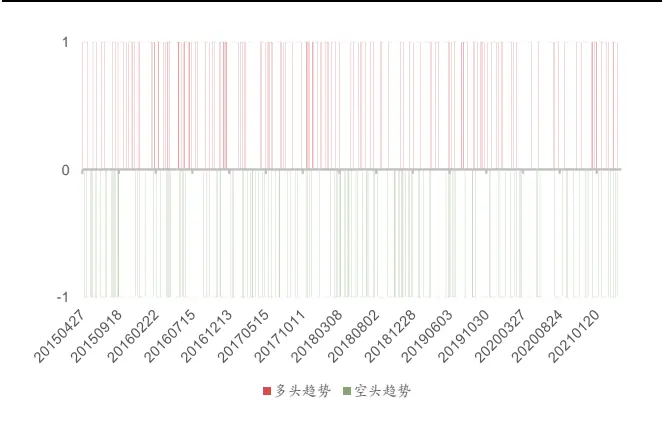
资料来源: Tinysoft，国信证券经济研究所整理

可以看出，基于开盘动量效应的股指期货交易策略的交易信号比较稀疏。其中，2021 年以来截至 2021 年 4月 30 日，IF 合约共发出开仓信号 14 次，占交易日比例的 17.72%，IC 合约共发出开仓信号 10 次，占交易日比例的 12.66%以及IH 合约共发出开仓信号 18 次，占交易日比例的 22.78%。

除了信号的触发频率，我们也统计了基于开盘动量效应的股指期货交易策略在不同合约上的表现情况，如表 11 所示：

表 11：股指期货各合约收益情况

|  | IF | IC | IH |
| --- | --- | --- | --- |
| 合约收益 | 204.07% | 66.58% | 118.28% |
| 合约权重占比 | 44.03% | 24.49% | 31.49% |
| 日均换手率 | 4.78% | 2.68% | 3.44% |
| 平均每年交易次数 | 42.46 | 49.51 | 52.61 |

资料来源: Tinysoft，国信证券经济研究所整理

在表 11中合约收益为全样本期各个合约的累计收益情况，其中权重占比为将三个合约的交易权重归一化后取均值，这样计算的目的是看在真实交易时各个合约的资金占用比例情况，而由于 IF 合约上市时间更早，在其他合约还没有上市时是全部资金都用来做该合约，因此交易占比较高。

如果从三个合约都上市的时间点：2015 年 4 月 16 日开始进行统计的话，策略在股指期货的三个合约上的分配则更加平均，如表 12 所示：

表 12：2015年 4月 16日之后股指期货各合约收益情况

|  | IF IC | IH |  |
| --- | --- | --- | --- |
| 合约收益 | 106.94% | 66.58% | 118.28% |
| 合约权重占比 | 34.16% | 28.80% | 37.04% |
| 日均换手率 | 6.07% | 5.11% | 6.55% |
| 平均每年交易次数 | 50.96 | 47.49 | 50.47 |

资料来源: Tinysoft，国信证券经济研究所整理

从表 12可以看出，策略在股指期货的三个合约上的信号权重占比较为接近，其中，IF合约信号权重占比为 34.16%、IC 合约合约信号权重占比为 28.80%以及IH 合约信号权重占比为 37.04%。每年的平均交易次数也比较均匀，IF、IC 以及 IH 合约平均每年交易次数分别为 50.96、47.49 以及 50.47，这说明三个合约对策略的适应性比较类似，策略表现比较均衡。并没有出现策略在一个合约上面开仓较多，而在另一个合约上面几乎不开仓的情况。同时累计收益较高的是IF 合约，较低的是IC合约。三个合约中日均换手率最高的为IH合约为6.55%，最低的为 IC 合约为 5.11%。

上述基于开盘动量效应的股指期货交易策略在进行回测时使用的交易成本为1.3%%，是由交易手续费 0.3%%以及冲击成本 1%%构成。交易价格为策略信号发出后 5 分钟的 VWAP均价，我们测试了不同冲击成本下策略的收益表现如表 13 所示：

表 13：不同交易成本下策略收益表现

| 交易成本 | 年化收益率 | 夏普率 | Calmar |
| --- | --- | --- | --- |
| 1.3%% | 25.79% | 1.77 | 3.37 |
| 1.5%% | 25.22% | 1.73 | 3.28 |
| 2%% | 23.81% | 1.63 | 2.98 |
| 2.5%% | 22.42% | 1.54 | 2.68 |

资料来源: Tinysoft，国信证券经济研究所整理

从表 13可以看出策略对于交易成本的变化不敏感，随着交易成本的增加策略年化收益率变化缓慢。当交易成本从 1.3%%增长至 2.5%%后，策略的年化收益率从 25.79%降到 22.42%，夏普率仅从 1.77 下降到 1.54。

图 25：不同交易成本下策略净值
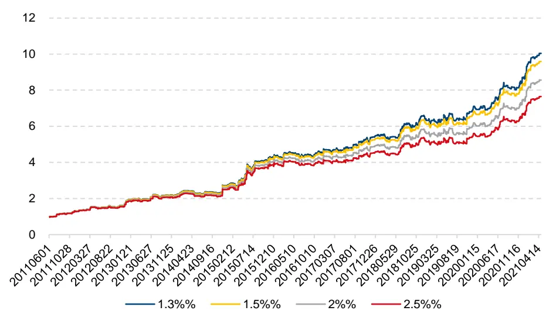
资料来源: Tinysoft，国信证券经济研究所整理

从图 25展示的不同交易成本下策略净值表现可以看出，交易成本的变化对策略净值的走势影响不大。基于开盘动量效应的股指期货交易策略在不同的交易成本下均可实现长期稳定的表现。

## 总结与展望

## 股指期货开盘动量效应

我们通过对股指期货开盘动量效应的研究发现，股指期货长期存在显著的开盘动量效应。为此我们定义：如果开盘价，最低价以及收盘价随 K 线依次上升，那么可以判定为上涨（多头）趋势。如果开盘价，最高价以及收盘价随 K 线依次下降，那么可以判定为下跌（空头）趋势。

## 风险控制

我们在进行策略的开发与设计时，对于风险的考量永远是第一位的。因此本节首先探讨两种止损方法，对于策略的止损我们选择了反向信号止损以及吊灯止损法。其中，反向信号止损为多头趋势下连续 5根 K线最高价依次下跌，空头趋势下连续 3根 K线最低价依次上涨。吊灯止损法为多头趋势下最优价格回落2.5 倍 ATR 止损，空头趋势下最优价格反向突破 2倍 ATR止损。

## 杠杆设置

对于波动的控制，一方面我们使用海龟交易法则中的 ATR资金管理法，来控制一单位 ATR 对应总资金规模的 0.5%，另一方面我们使用目标波动控制法，是根据已实现波动率进行杠杆调整的乘数以使得策略整体波动率控制在 15%。

## 基于开盘动量效应的股指期货交易策略

我们通过一系列的研究与探讨最终形成了基于开盘动量效应的股指期货交易策略，策略应用于 IF、IC 以及 IH 三个股指期货合约上，其中，策略费后年化收益率为 25.79%，夏普率为 1.77，最大回撤为 7.66%，Calmar 比率为 3.37。策略对于不用合约交易频率均衡，适应性相似，对于交易成本不敏感。

## 参考文献

- [Alexander@2002] Elder, Alexander. Come into my trading room: A complete guide to trading. Vol. 146. John Wiley & Sons, 2002.

Fung and Hsieh@2001] Fung, William, and David A. Hsieh. "The risk in hedge fund strategies: Theory and evidence from trend followers." The review of financial studies 14.2 (2001): 313-341.

- [Gao@2015] Gao, Lei, et al. "Intraday momentum: The first half-hour return predicts the last half-hour return." Available at SSRN 2552752 (2015).

[Lou@2018] Lou, Dong, Christopher Polk, and Spyros Skouras. "A tug of war: Overnight versus intraday expected returns." Journal of Financial Economics 134.1 (2019): 192-213.

## 附录——数据准备

在本节将介绍我们对数据的准备以及处理方法。在 CTA 策略的测试中，数据的处理主要涉及以下几个问题：主力合约如何确定，展期价格跳空如何处理，不同合约数据怎么拼接以及发单价格如何确定。下面我们将针对这些问题进行分析和解决。

## 主力合约的确定

在确定主力合约时，我们使用成交量以及持仓量均达到最大的合约作为主力合约。这其中，股指期货在合约到期月份的第三个周五进行交割，国债期货在合约到期月份的第二个周五进行交割，因此，如果上述品种在交割前还没有能够新的主力合约可以确定，那么需要在交割日前一个交易日强制切换至当时的次主力合约。同时，主力合约不可逆，一经确定不可反复。

## 合约切换的思考

在合约进行切换时，可能会出现前后两个主力合约的价格无法进行无缝对接的情况。如图 26所示：

图 26：IF1508 切换 IF1509 价格跳空
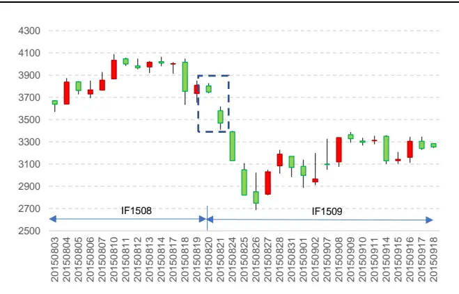
资料来源: Tinysoft，国信证券经济研究所整理

图 27：IF1508 切换 IF1509 价格复权
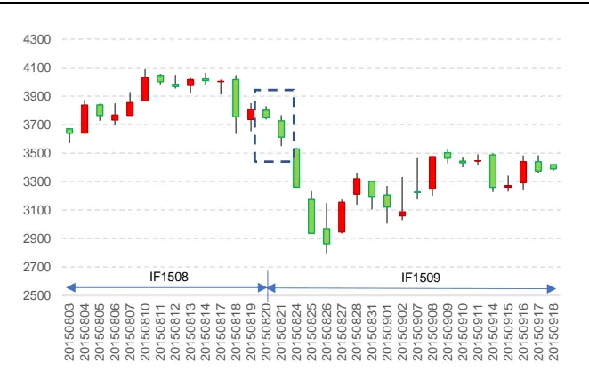
资料来源: Tinysoft，国信证券经济研究所整理

图 26 为 IF1508 合约切换到 IF1509合约的价格序列图，其中切换时点为 2015年 8 月 21日。从图 26可以看出，在切换的时间点出现了一个价格的大幅跳空低开的情况，如果认为这是行情的自然状态，则可能导致对行情判断的失误。从而导致策略判断失真。

那么在切换合约时，通常有两种做法，一种是根据新主力合约之前的业绩进行新交易信号的判断，以 IF 合约为例，当合约从 IF 切换到 IF 时，之后的策略计算都按照 IF的历史数据进行计算，这样做的好处是，策略信号来源于该标的且作用在该标的。而缺点是有些合约虽然切换到了新的主力合约，但是由于切换前该新合约交易并不活跃，加之有些策略需要使用大量历史数据进行处理和分析，因此可能导致信号失真，或者价格波动较大的情况。

还有一种做法是将价格数据进行复权。复权分为前复权以及后复权，如果向前复权的话，则当前的合约价格为真实价格，之前的合约价格数据为复权后的价格。这样做的好处是可以使用当前的真实合约价格来确认开仓数量，而缺点则是历史数据会随着新数据的更新而出现变化，尽管变化较小，但随着时间的推移以及浮点数的保存问题，有可能会出现新计算出来的策略开仓时点或者策略曲线与之前计算的无法完全匹配的情况。那么会在策略归因时，造成一定的困难。

我们所使用的方法是进行向后复权，这样做的前提是需要选择一个策略开始计算的日期为基期，一旦基期确定下来，后面行情如何更新都对历史数据造成改变。当然，如果基期发生了变化，则有可能导致历史数据的变化。由于 2010年以前上市的期货品种较少，且活跃度不高。因此我们所使用的基期则定为2010 年 1 月 1 日。

复权的具体做法为：在每次展期的时候，计算新主力合约以及旧主力合约的价格跳空比，以此作为当日之后新主力合约价格的复权因子。该复权因子的具体计算公式为：

$$
AdjFactor_{i}=AdjFactor_{i-1}\cdot\frac{Close_{i-1,old}}{Close_{i-1,new}}
$$

其中， $AdjFactor_{i-1}$ 为上一期复权因子， $Close_{i-1,old}$ 为旧主力合约展期前一日收盘价， $Close_{i-1,new}$ 为新主力合约展期前一日收盘价。这样计算出来的复权因子$AdjFactor_{i}$ 为当期复权因子。其中，基期的复权因子为 1。计算好复权因子之后，新的主力合约的开盘价、最高价、最低价以及收盘价都乘以当期的复权因子，即为复权价格。

这样使用复权价格可以很好地避免因切换合约带来的价格跳空的影响，具体在计算收益率时，如果直接使用原始价格进行计算：

$$
Return_{i}=\frac{Close_{i,new}}{Close_{i-1,old}}-1
$$

当新主力合约价格与旧主力合约价格出现跳空时，该收益率会出现异常值，而使用复权因子之后收益率的计算变为：

$$
\begin{array}{cll}{Return_{i}=\displaystyle\frac{AdjFactor_{i}\cdot Close_{i,new}}{AdjFactor_{i-1}\cdot Close_{i-1,old}}-1}\\{\displaystyle}\\{\displaystyle}&{=\frac{AdjFactor_{i-1}\cdot\frac{Close_{i-1,old}}{Close_{i-1,new}}\cdot Close_{i,new}}{AdjFactor_{i-1}\cdot Close_{i-1,old}}-1}\end{array}
$$

$$
=\frac{Close_{i,new}}{Close_{i-1,new}}-1
$$

可以看到，这样计算出来的收益率即为实际收益率，进而避免了因合约切换导致的策略信号漂移或者收益率无法计算的情况。

如图 27 展示的是经复权之后 IF1508 合约切换到 IF1509 合约的情况，可以看到，图 26 跳空的部分变得更加连续了。因此，通过对主力连续不同合约的价格进行复权处理，我们便可以得到连续无异常跳空的行情时间序列数据。

## 数据处理与拼接

本节将从两个维度分析数据处理中的相关问题。第一，当策略只包含股指期货的时候，数据的处理。其次，当策略需要做商品期货全品种时，数据处理的问题。

由于股指期货的三个品种的交易时间都是同步的，因此不存在不同合约时间对齐的问题。但是需要确定策略执行的收益率的计算方法，我们考虑实盘交易时在信号触发后的成交的价格为 5 分钟的 VWAP，具体可以根据产品规模而定。同时，交易时间越长对策略的时效性要求就越高，需要策略信号的衰减周期与交易时长相匹配。具体做法为计算策略信号触发后 5 分钟的成交额除以经合约乘数调整的成交量：

$$
VWAP_{5}=\frac{\sum_{i=1}^{5}Amount_{i}}{\sum_{i=1}^{5}Vol_{i}\cdot Multi}
$$

其中，Amounti为第 i 分钟的成交额， $Vol_{i}$ 为第 i 分钟的成交量,Multi为该品种的合约乘数。

当策略需要加入全部期货品种的时候，则需要考虑全品种的交易时间对齐的问题。部分商品期货有夜盘，部分商品期货没有。此外，所有商品期货的品种在上午 10点 15 分至 10 点 30 分期间为暂停交易时段。因此，进行时间对齐时非交易时段行情数据的处理就是一个需要解决的问题。我们的处理方式为非交易时间段行情序列设置为空值，信号延续交易时段信号，同时策略收益率设置为零。

当合约尚未上市时，将行情序列设置为空值，且不允许发出交易信号，收益率也设置为空值。

国信证券投资评级

| 类别 | 级别 | 定义 |
| --- | --- | --- |
| 股票投资评级 | 买入 | 预计6个月内，股价表现优于市场指数20%以上 |
|  | 增持 | 预计6个月内，股价表现优于市场指数10%-20%之间 |
|  | 中性 | 预计6个月内，股价表现介于市场指数±10%之间 |
|  | 卖出 | 预计6个月内，股价表现弱于市场指数10%以上 |
| 行业投资评级 | 超配 | 预计6个月内，行业指数表现优于市场指数10%以上 |
|  | 中性 | 预计6个月内，行业指数表现介于市场指数±10%之间 |
|  | 低配 | 预计6个月内，行业指数表现弱于市场指数10%以上 |

## 分析师承诺

作者保证报告所采用的数据均来自合规渠道，分析逻辑基于本人的职业理解，通过合理判断并得出结论，力求客观、公正，结论不受任何第三方的授意、影响，特此声明。

## 风险提示

本报告版权归国信证券股份有限公司（以下简称“我公司”）所有，仅供我公司客户使用。未经书面许可任何机构和个人不得以任何形式使用、复制或传播。任何有关本报告的摘要或节选都不代表本报告正式完整的观点，一切须以我公司向客户发布的本报告完整版本为准。本报告基于已公开的资料或信息撰写，但我公司不保证该资料及信息的完整性、准确性。本报告所载的信息、资料、建议及推测仅反映我公司于本报告公开发布当日的判断，在不同时期，我公司可能撰写并发布与本报告所载资料、建议及推测不一致的报告。我公司或关联机构可能会持有本报告中所提到的公司所发行的证券头寸并进行交易，还可能为这些公司提供或争取提供投资银行业务服务。我公司不保证本报告所含信息及资料处于最新状态；我公司将随时补充、更新和修订有关信息及资料，但不保证及时公开发布。

本报告仅供参考之用，不构成出售或购买证券或其他投资标的要约或邀请。在任何情况下，本报告中的信息和意见均不构成对任何个人的投资建议。任何形式的分享证券投资收益或者分担证券投资损失的书面或口头承诺均为无效。投资者应结合自己的投资目标和财务状况自行判断是否采用本报告所载内容和信息并自行承担风险，我公司及雇员对投资者使用本报告及其内容而造成的一切后果不承担任何法律责任。

## 证券投资咨询业务的说明

本公司具备中国证监会核准的证券投资咨询业务资格。证券投资咨询业务是指取得监管部门颁发的相关资格的机构及其咨询人员为证券投资者或客户提供证券投资的相关信息、分析、预测或建议，并直接或间接收取服务费用的活动。

证券研究报告是证券投资咨询业务的一种基本形式，指证券公司、证券投资咨询机构对证券及证券相关产品的价值、市场走势或者相关影响因素进行分析，形成证券估值、投资评级等投资分析意见，制作证券研究报告，并向客户发布的行为。

## 国信证券经济研究所

深圳深圳市罗湖区红岭中路 1012 号国信证券大厦18 层邮编：518001 总机：0755-82130833

上海
上海浦东民生路 1199弄证大五道口广场 1 号楼12 楼
邮编：200135
北京
北京西城区金融大街兴盛街 6 号国信证券 9 层
邮编：100032