金融工程

数量化投资

## 相关研究报告：

《CTA系列专题之一：基于开盘动量效应的股指期货交易策略》——2021-05-13

《FOF 系列专题之一：基金业绩粉饰与隐形交 易能力》——2020-08-26

《FOF 系列专题之二：基金经理前瞻能力与基 金业绩》——2020-10-28

《FOF 系列研究之三:基金经理调研能力与投资业绩》——2021-04-21

《超预期投资全攻略》——2020-09-30

《基于优秀基金持仓的业绩增强策略》——2020-11-15

《基于分析师认可度的成长股投资策略》——2021-05-12

《公募打新全解析——历史、建模与实践》—2020-12-09

《基于分析师推荐视角的港股投资策略》——2021-05-13

《JumpFit 行业轮动策略》——2021-05-13《北向因子能否长期有效？——来自亚太地区的实证》——2021-05-17

《百年港股风云录——历史、制度与实践》——2021-06-09

证券分析师：张欣慰

电话：021-60933159

E-MAIL： zhangxinwei1@guosen.com.cn

证券投资咨询执业资格证书编码：S0980520060001

联系人：刘凯

电话：010-88005479

E-MAIL： liukai6@guosen.com.cn

# 金融工程专题研究

2021 年 10 月 13 日

## 独立性声明：

作者保证报告所采用的数据均来自合规渠道，分析逻辑基于本人的职业理解，通过合理判断并得出结论，力求客观、公正，结论不受任何第三方的授意、影响，特此声明。

## 专题报告

# CTA 系列专题之二：基于 Bollinger通道的商品期货交易策略

## 布林通道（Bollinger Band）及其相关性质

布林通道由三条线组成，即均线，上轨道线以及下轨道线。当资产价格上穿上轨道线时，形成多头趋势，回到均线时平仓。当资产价格运行下穿下轨道线时，形成空头趋势，回到均线时平仓。

## 信号过滤、风险控制以及杠杆设置

当品种的持仓量处在放大阶段时进行开仓的单笔收益平均更高，因此，当持仓量放大时，触发开仓信号后，满仓开仓，当持仓量缩小时，触发开仓信号后，半仓开仓。

我们构建了止盈轨道线，随着轨道线系数的增加，平均止盈次数逐渐减少，意味着历史中真正突破止盈轨道线的机会变少。另一方面，随着止盈系数的增加，平均止盈后收益逐渐降低。布林通道策略在加入信号过滤以及止盈条件后，策略的稳定性以及整体表现都有了进一步提升。

我们使用海龟资金管理法中 ATR 调整的方法，当一个品种的日均波动较大时，我们倾向于给予该品种较低的杠杆，而反之，如果一个品种的日均波动较小，我们则可以给该品种较高的杠杆。

## 交易品种的确定与选择

我们使用过去半年中日均成交额超过 50 亿元的所有商品期货品种进行策略研究。在每个月末对过去一年策略在各个品种上面的表现进行测试，通过剔除交易信号触发过少以及表现不好的品种，对交易品种进行动态的选择。

## 基于布林通道的CTA策略

结合信号过滤，止盈判断以及综合风控系统后，基于布林通道的 CTA 策略历史表现稳定且具有较高收益率，2012 年以来该 CTA策略净值稳定攀升，同时回撤可控。2012 年以来，基于布林通道的 CTA策略费后年化收益率为 17.52%，夏普率为 1.72，最大回撤为 8.27%，Calmar 比率为 2.12。

## CTA 复合策略

我们将基于布林通道的完整 CTA 策略以及此前的基于开盘动量效应的股指期货交易策略等权复合，构造为 CTA 复合策略，复合策略的年化费后收益率为 20.55%，夏普率为 2.42，Calmar 为 3.86，并且复合策略每年的夏普率都大于 1，且每年 Calmar 都大于 2。

风险提示：市场环境变动风险，策略失效风险。

CTA 策略的第一篇以股指期货的开盘动量效应为基底，经逐步优化改进构建了股指期货投资策略，详见我们于 2021 年 5 月 13 日发布的专题报告《CTA系列专题之一：基于开盘动量效应的股指期货交易策略》。这一篇我们将把目光转向商品期货的 CTA 策略。提到 CTA 策略，最为主流的策略思想便是趋势跟随类的策略，这类策略的核心逻辑是如何判断趋势的形成。我们首先介绍一个通过通道突破的方式来判断趋势形成的策略，即基于布林通道的 CTA策略，也是趋势跟随类策略体系中最为经典的策略构造方式之一。

## 期货市场总览

## 期货市场交易品种及特性统计

近些年，期货市场逐步有新的合约品种加入，使得整体可投资标的变得丰富，也使得 CTA策略容量有所增加。

截至 2021 年 8月，全市场共有 70个期货品种可供交易，整体来看期货市场已经颇具规模。

表 1：各交易所在交易品种

| 交易所 | 交易品种 |
| --- | --- |
| 上海国际能源交易中心 | 国际铜、低硫燃料油、原油、20号胶 |
| 上海期货交易所 | 锌、沥青、燃油、热轧卷板、黄金、铝、白银、镍、铅、铜、螺纹钢、线材、橡胶、锡、不锈钢、纸浆 |
| 中国金融期货交易所 | 10年期国债期货、5年期国债期货、2年期国债期货、中证500期货、沪深300期货、上证50期货 |
| 大连商品交易所 | LPG、纤维板、PVC、焦煤、焦炭、鸡蛋、聚丙烯、塑料、生猪、乙二醇、粳米、棕榈油、铁矿石、豆粕、胶合板、玉米淀粉、 玉米、豆油、豆二、豆一、苯乙烯 |
| 郑州商品交易所 | 棉花、红枣、棉纱、玻璃、粳稻、晚籼稻、甲醇、菜油、短纤、花生、菜粕、早籼稻、菜籽、纯碱、硅铁、锰硅、白糖、PTA、 尿素、强麦、动力煤、普麦、苹果 |

资料来源: Tinysoft，国信证券经济研究所整理

表 1 中全部在交易的品种并不是都适宜进行策略开发和产品落地交易。由于部分品种现货市场的关注度较低等原因，其每日交易非常不活跃，这会导致一方面价格反应的信息失真，容易出现极端情况；另一方面在交易相关品种时容易产生较大的冲击成本或交易延时。

举例而言，下面的图 1 就统计了 2020 年 8月至 2021 年 8 月期间，除中国金融期货交易所上市的国债期货以及股指期货外，所有商品期货各个品种的日均成交额情况。

图 1：商品期货各品种 2020年以来日均成交额情况（亿元）
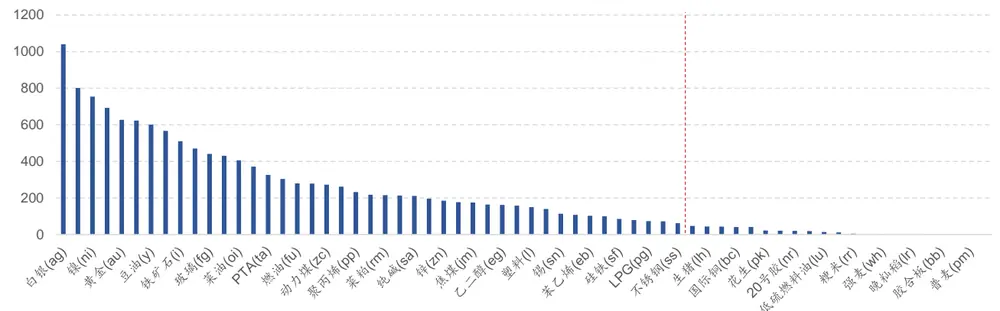
资料来源: Tinysoft，国信证券经济研究所整理

具体的品种筛选以及对成交额的判断，需要根据产品规模，策略信号频率，算法交易以及持仓周期等因素综合判断。从图 1 中可以看出，处在尾部区域的一些品种的日均成交额极低，其中，截至不锈钢（ss）品种的日均成交额大于 50亿元，而其后的尿素（ur）的日均成交额为 47 亿元。一般情况下，含有夜盘的商品期货品种，其 1分钟 K线的根数为 500 根左右，如果策略频率为 10 分钟，即假设每 10 分钟触发一次策略的信号，随后以未来 3 分钟的 TWAP 进行算法交易成交。极端情况下每次信号都是双边交易，对于日均成交额为 50亿元的品种而言，其日内平均每 3 分钟的交易额为 3000 万，如果我们希望策略的交易额占市场交易额的比重不超过 1/10，那么极端情况下策略无杠杆容量为单品种300 万。对于日均成交额排序在这之后的品种则更难以为策略提供合适的流动性。

因此，我们使用满足流动性条件为过去半年中日均成交额超过 50 亿元的所有商品期货品种进行策略研究。

## 布林通道及其相关性质

趋势跟随类策略，一直是 CTA 投资策略的主流策略之一，也是 CTA 投资策略中最为经典的策略类型之一。从行为金融学的角度来说，趋势类策略是值得坚持的。[Hurst@2013]中利用行为金融学来详细的阐述了趋势产生的原理，以及趋势从形成到终结的过程，即趋势的生命周期（The Lifecycle of a Trend），[Hurst@2013]解释道：趋势的起因是由于对信息的反应不足，趋势的延续是延迟的过度反应，最终趋势终结于价格回归基本面。

图 2：趋势的生命周期
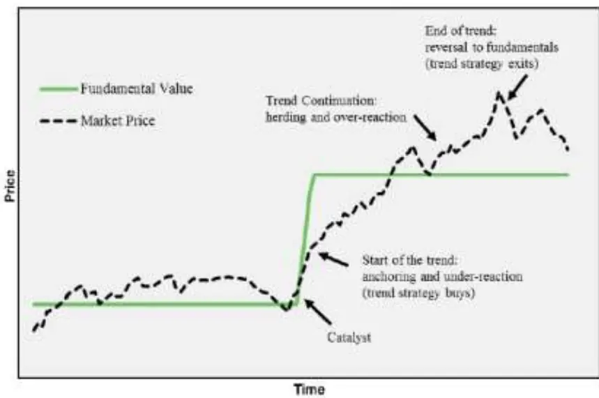
资料来源: Hurst, Ooi and Pedersen (2012)，国信证券经济研究所整理

下面我们将探讨如何对趋势进行刻画，同时在此基础上形成针对商品期货的CTA 策略。

## 布林通道（Bollinger Band）

作为趋势跟随类策略的经典策略之一，布林通道（Bollinger Band）旨在使用均线以及上下轨道线来刻画趋势的形成。当资产价格在上下轨道线之间运行时，则认为该资产当前无趋势，而当资产价格突破轨道线时，则认为趋势形成。本文我们将详细的探究布林通道及其特性，并在此基础上进行策略研究和开发。

具体而言，布林通道由三条线组成，即均线，上轨道线以及下轨道线。当资产价格上穿上轨道线时，形成多头趋势，回到均线时平仓。当资产价格运行下穿下轨道线时，形成空头趋势，回到均线时平仓。

其中，均线为过去一段时间收盘价的平均值，而布林通道的上下轨道线为均值上下偏离 N 个标准差所构成的曲线。

具体公式如下：

$$
\begin{array}{ll}{{UpLine=MA_{close}+N*STD_{close}}}&{{N>0}}\\{{}}&{{}}\\{{DownLine=MA_{close}-N*STD_{close}}}&{{N>0}}\end{array}
$$

其中，Up（Down）Line 为布林通道中的上下轨道线， $MA_{close}$ 为布林通道中的均线， $STD_{close}$ 为收盘价的标准差。

图 3：布林通道多头交易案例
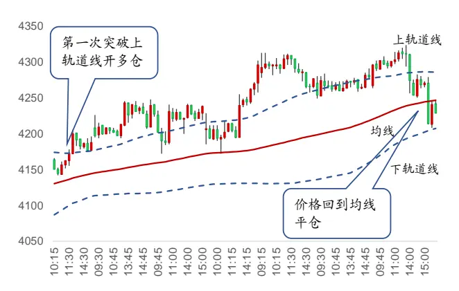
资料来源: Tinysoft，国信证券经济研究所整理

图 4：布林通道空头交易案例
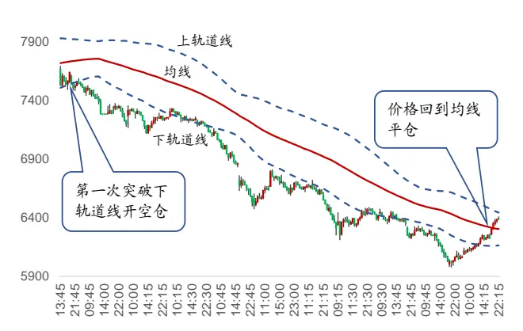
资料来源: Tinysoft，国信证券经济研究所整理

图 3 以及图 4 展示的是螺纹钢（RB）主力合约 15分钟 K线数据对应的布林通道多头交易以及空头交易信号案例。图中红色线为均线（MA100），蓝色虚线为上下轨道线（均线偏离一个标准差）。

图 3 中的 K线收盘价由布林通道上轨道线的下方上穿到上方，形成了对上轨道线的突破。进而对应策略开多仓的信号触发。而随后 K 线一直在均线的上方运行，策略处于多仓持有状态。在图 3 的末端，K 线收盘价回到均线，且下穿均线，进而触发了布林通道策略平仓的信号，策略在此时进行平仓。至此，策略完成了一次完整的多头交易过程。

图 4 中的 K线收盘价由布林通道下轨道线的上方下穿到下方，形成了对下轨道线的穿越。进而对应策略开空仓的信号触发。而随后 K 线一直在均线的下方运行，策略处于空仓持有状态。在图 4 的末端，K 线收盘价回到均线，且向上击穿均线，进而触发了布林通道策略平仓的信号，策略在此时进行平仓。至此，策略完成了一次完整的空头交易过程。

## 布林通道的特性

前文展示了布林通道策略的开仓以及平仓逻辑，当价格突破上轨时开多仓，突破下轨时开空仓，开仓后当价格回到均线时进行平仓。本节我们将尝试针对所有满足条件的商品期货品种，对布林通道策略的特性进行研究，进而形成基础策略。

构成布林通道策略的基础参数共有两个，一个是均线的长度（MAlen），一个是上下轨道线与均线偏离标准差的系数（beta）。这两个参数的搭配组合决定了策略的属性，下面我们就这针对两个参数的取值以及对应布林通道策略的相关属性进行测试和统计。

表 2：布林通道参数与每笔收益率

| betaMalen | 1 | 1.5 | 2 | 2.5 | 3 |
| --- | --- | --- | --- | --- | --- |
| 50 | 0.51% | 0.53% | 0.53% | 0.54% | 0.55% |
| 100 | 0.60% | 0.64% | 0.64% | 0.68% | 0.70% |
| 150 | 0.73% | 0.80% | 0.81% | 0.86% | 0.86% |
| 200 | 0.81% | 0.89% | 0.89% | 0.96% | 0.98% |
| 250 | 0.87% | 1.02% | 1.14% | 1.15% | 1.15% |
| 300 | 0.97% | 1.14% | 1.21% | 1.25% | 1.29% |

资料来源: Tinysoft，国信证券经济研究所整理

表 2 展示的是布林通道的参数组合与对应每个信号发出的每笔交易收益率的矩阵。其中，表格中第一列为均线长度（MAlen），第一行为均线偏离标准差的系数（beta）。可以看到，随着均线长度的增加，每笔交易收益率是线性提升的，同时，随着偏离系数的增加，每笔交易收益率也是线性提升的。

从逻辑上看，一个长期能够提供正收益的策略，如这个布林通道策略，均线长度的增加意味着对于趋势判断的时间区间长度增加，那么将可能伴随着持仓时间的增加以及单笔收益率的提升。

表 3 展示的是布林通道的参数组合与对应每个信号发出后的持仓天数。同样的，表格中第一列为均线长度（MAlen），第一行为均线偏离标准差的系数（beta）。可以看到随着均线长度的增加，以及偏离系数的增加，都伴随着持仓周期的拉长。

表 3：布林通道参数与平均持仓交易日天数

| betaMalen | 1 | 1.5 | 2 | 2.5 | 3 |
| --- | --- | --- | --- | --- | --- |
| 50 | 1.74 | 2.24 | 3.03 | 4.76 | 9.26 |
| 100 | 3.15 | 4.05 | 5.42 | 8.19 | 15.20 |
| 150 | 4.49 | 5.86 | 7.73 | 11.39 | 20.36 |
| 200 | 5.76 | 7.62 | 9.94 | 14.49 | 24.95 |
| 250 | 6.98 | 9.30 | 12.36 | 17.39 | 30.47 |
| 300 | 8.27 | 11.11 | 14.47 | 20.49 | 36.23 |

资料来源: Tinysoft，国信证券经济研究所整理

对于参数的选择，应尽量避免遍历后通过收益结果导向进行选择，这样比较容易造成参数选择的过拟合。从逻辑上来看，布林通道的 beta 系数不易过高，这样触发趋势形成的阈值过高，容易将信号触发在趋势的中后段。

其次，布林通道策略属于中长周期策略（对于 15 分钟 K 线划分长度而言，持仓周期一般为 2 周左右）。因此，这里我们选择参数组合为 300 根 K 线计算均线，beta 为 1.5。

因此，我们尝试使用 15 分钟 K 线构造布林通道基础策略：策略均线计算长度为 300 根 K线，上下轨道线计算系数为 1.5。

## 杠杆设置

## 海龟资金管理法

策略中的风险主要由两部分组成，一部分是策略的潜在亏损，一部分是策略的波动。前文介绍了如何在策略中进行止损，接下来，我们主要围绕对策略波动进行风控的方法。

为使得策略在所有不同品种上面的波动幅度可控，我们需要根据不同品种的波动幅度进行交易量的调整。这里所说的波动幅度通常使用真实波动幅度均值（Average True Range，ATR）来度量。其中，ATR 指标的具体计算公式如下所示：

$$
TR=Max[(high-low),abs(high-preclose),abs(low-preclose)]
$$

$$
ATR=\frac{1}{n}\sum_{i=1}^{n}TR_{i}
$$

其中， $TR_{i}$ 为 True Range，用于衡量每日的波动幅度，ATR则是 $TR_{i}$ 的移动平均值。

通过 ATR指标来调整品种杠杆的基本原理是，将波动较高的品种赋予相对较低的杠杆，将波动较低的品种赋予相对较高的杠杆，因此杠杆率与 ATR呈反比关系。

更进一步地，对风险的控制要求我们知道 1单位 ATR的波动对应我们账户资金波动的多少，这里假设我们要让 1单位 ATR的波动正好等于我们策略整体资金规模的 0.5%。假设我们使用的是一个单位账户，即总资金规模为 1。那么，我们将 0.5%除以对应的 1 单位 ATR 则为我们实际应开出的合约数量。即此刻交易应该开出的合约手数。

如果我们需要计算的是一个杠杆率即当前开仓手数占整体资金规模可开仓手数的比例，那么需要除以满仓状态下可以开出的总合约数量，具体计算公式为：

$$
Pos_{ATR}=\frac{0.5\%}{ATR}
$$

$$
Pos=\frac{1}{Close}
$$

$$
\begin{array}{c}{{Lev_{ATR}=\displaystyle\frac{Pos_{ATR}}{Pos}}}\\{{=\displaystyle\frac{0.5^{0}/\phantom{1}_{0}}{ATR}\ast Close}}\end{array}
$$

其中， $Pos_{ATR}$ 为 1 单位 ATR 对应资金规模 0.5%波动的应开手数,Pos为全部资金对应无杠杆满仓可开手数，Close为收盘价， $Lev_{ATR}$ 为应开手数除以无杠杆满仓可开手数的开仓杠杆率。由上面算法计算出来的开仓杠杆率具有根据 ATR波动调整杠杆率大小的特性，当一个品种的日均波动较大时，我们倾向于给予该品种较低的杠杆，而反之，如果一个品种的日均波动较小，我们则可以给该品种较高的杠杆。从风险控制的角度如果一个品种的波动较大，给予较小杠杆也是出于对资金安全的考虑，防止由于较大的波动幅度而触发穿仓风险。

在经过ATR调整之后，布林通道基础策略，在满足流动性条件商品期货品种下，

其平均杠杆率水平时序变化如图 5。

在计算 $.Lev_{ATR}$ 时，出于实际使用情况考虑，我们设置实际交易的杠杆率最高不超过 4倍杠杆。因此当 $Lev_{ATR}$ 的绝对值大于 4 时，我们截断为 4。

从图 5可以看出，长期来看策略的平均杠杆率为 1.16，历史上杠杆率出现峰值的时间段有两段，分别为 2012 年至 2013 年，另一段是 2019 年。近期杠杆率水平有所攀升。

图 5：ATR调整后杠杆率变化图
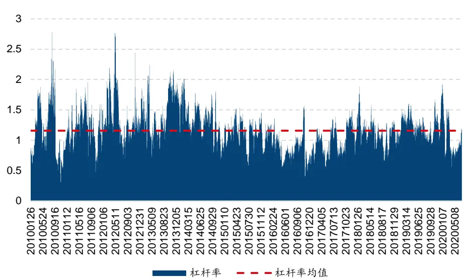
资料来源: Tinysoft，国信证券经济研究所整理

下面我们利用满足流动性条件的全部商品期货进行经ATR调整后布林通道基础策略的相关测试。

图 6：ATR调整后布林通道基础策略净值表现
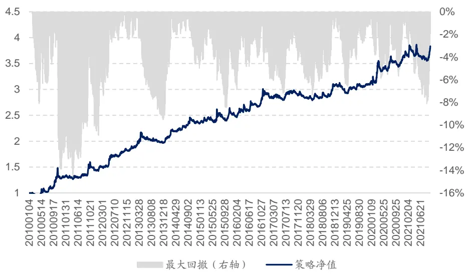
资料来源: Tinysoft，国信证券经济研究所整理

图6中为经ATR调整之后布林通道基础策略在满足流动性条件的商品期货所有品种上面运行的净值表现，其中，回测的交易成本由手续费以及冲击成本构成，手续费为0.3%%，交易价格为信号触发后5分钟的成交量加权平均价（VWAP），其中，具体数据的处理、合约价格拼接以及收益率的计算可参阅附录—数据准备。

其中，通过算法交易可实现冲击成本万一的偏离，因此，我们在进行回测时使用的交易成本为 1.3%%。

布林通道基础策略费后年化收益率为 11.96%，年化夏普率为 1.12，Calmar比率为 0.81，全样本期最大回撤为 14.67%。

布林通道基础策略的分年度统计如表 4 所示：

表 4：ATR调整后布林通道基础策略年度收益统计

|  | 策略收益 | 最大回撤 | 夏普率 | 波动率 | Calmar | 月度胜率 |
| --- | --- | --- | --- | --- | --- | --- |
| 2010 | 32.50% | 13.89% | 1.73 | 18.75% | 2.34 | 75.00% |
| 2011 | 9.36% | 10.51% | 0.68 | 13.76% | 0.89 | 58.33% |
| 2012 | 30.79% | 2.99% | 2.81 | 10.97% | 10.31 | 75.00% |
| 2013 | 5.17% | 9.52% | 0.44 | 11.74% | 0.54 | 50.00% |
| 2014 | 17.28% | 4.99% | 2.19 | 7.91% | 3.46 | 66.67% |
| 2015 | 9.21% | 8.45% | 0.80 | 11.49% | 1.09 | 58.33% |
| 2016 | 13.72% | 4.82% | 1.44 | 9.55% | 2.85 | 58.33% |
| 2017 | -0.60% | 4.52% | -0.09 | 7.05% | -0.13 | 41.67% |
| 2018 | 7.19% | 3.28% | 1.27 | 5.66% | 2.19 | 58.33% |
| 2019 | 0.82% | 6.56% | 0.16 | 5.23% | 0.12 | 50.00% |
| 2020 | 17.00% | 5.87% | 1.70 | 10.02% | 2.89 | 50.00% |
| 20210930 | 5.12% | 8.09% | 0.61 | 8.45% | 0.63 | 44.44% |
| 全样本期 | 11.96% | 14.67% | 1.12 | 10.70% | 0.81 | 57.45% |

资料来源: Tinysoft，国信证券经济研究所整理

从表 4 可以看出，基础策略自 2010 年以来， 2017 年收益为负，其余所有年份收益均为正。但是，基础策略每年收益的波动较大。

同时，从净值曲线上看，策略的表现呈现出“毛刺感”，净值曲线不光滑。这表明如果只使用基础策略还是有一些局限性，因此我们考虑在策略中加入信号的过滤以及风险控制。

## 风险控制

## 信号过滤

在进行策略的开发时，我们需要对策略每一次的信号触发，以及信号触发后该信号的性质以及质量作出评价。

我们来观察每一次信号触发时合约整体持仓量的变化情况，通过计算过去一段时间的持仓量均值，利用长短线持仓量表征持仓量处在放大还是缩小的阶段。对于窗口的长度，我们取均线长度的一半作为短线长度，构造均线长度（300根 K线）一致的持仓量均值作为长线持仓量以及短线长度（150根 K线）的持仓量均值作为短线持仓量。我们将短线持仓量除以长线持仓量构造持仓量变化率：

$$
OI_{pct}=\frac{OI_{short}}{OI_{long}}
$$

其中， $OI_{pct}$ 为持仓量变化率， $OI_{short}$ 为短线持仓量， $OI_{long}$ 为长线持仓量。当该值大于 1 时，则表明持仓量处在放大阶段中，当该值小于 1 时，则表明持仓量处在缩小阶段中。

表 5：持仓量与收益率的关系

|  | 单笔收益率均值 | 单笔收益率标准差 | 单笔收益率下四分位 | 单笔收益率上四分位 |
| --- | --- | --- | --- | --- |
| 持仓量放大 | 1.47% | 5.58% | -1.13% | 2.25% |
| 持仓量缩小 | 1.12% | 4.53% | -1.15% | 1.79% |

资料来源: Tinysoft，国信证券经济研究所整理

表 5 展示的是满足流动性条件的全部商品期货品种的持仓量与收益率的关系统计。从表 5 可以看到，当品种的持仓量处在放大阶段时进行开仓的单笔收益平均更高，每笔平均收益率为 1.47%，而当持仓量处在缩小阶段中进行开仓的单笔收益为 1.12%。

图 7：突破时持仓量处在放大阶段案例
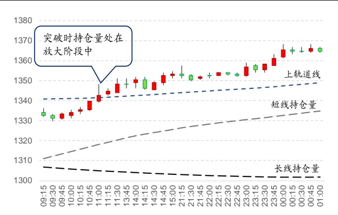
资料来源: Tinysoft，国信证券经济研究所整理

图 8：突破时持仓量处在缩小阶段案例
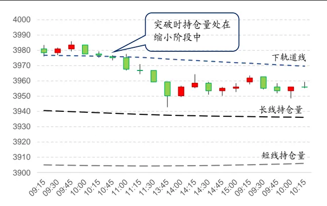
资料来源: Tinysoft，国信证券经济研究所整理

图 7 以及图 8 分别展示了螺纹钢（RB）在突破轨道线时持仓量分别处在放大以及缩小状态下的案例，其中，从图 7 的案例中可以看到当收盘价向上突破上轨道线时，多头进行开仓，此时的短线持仓量处在长线持仓量上方，持仓量处在放大阶段。

从图 8 的案例中可以看到，当收盘价向下突破下轨道线时，策略发出开空仓的信号，与此同时，该品种的短线持仓量处在长线持仓量下方，持仓量处在缩小阶段。

因此，我们将布林通道产生的所有信号进行了拆分，区分为持仓量放大时单笔收益以及持仓量缩小时单笔收益率。

我们考虑对信号进行持仓量是否放量的过滤：当持仓量放大时，触发开仓信号后，满仓开仓，当持仓量缩小时，触发开仓信号后，半仓开仓。其余逻辑与基础策略相同。

## 止盈轨道线

由于布林通道的基础策略自带退出机制，同时这个退出机制的判断是一个动态的过程。因此，策略自身已经包含了止损的逻辑。因此，本节将探讨的风险控制的方式有两种，一个是对于策略的止盈，一个是对于波动的控制。

由于布林通道的基础策略考虑了从进场到出场的全部信号逻辑，因此，我们自然会关心，均线平仓的逻辑是否是最优平仓点，或者说是否存在我们提前止盈的可能性？从而避免当趋势出现了衰落之后，而损失浮盈后出场。Fung andHsieh（2001）中提出趋势跟随类策略的收益率特性与回溯跨式期权（lookbackstraddles）相似，具有较强的后尾特征，因此在进行止盈设置时，一般将止盈区间设置稍宽一些。

下面我们就根据开仓时点的布林轨道来进行测试，考察每一笔交易中出现第一次突破止盈轨道线之后的收益率。其中，止盈轨道线的设置为开仓时点距离均线外 N倍标准差的轨道线。

表 6：布林通道止盈系数与止盈后收益统计

| 系数 | 平均止盈次数 | 收益率均值 | 收益率标准差 | 收益下四分位 | 收益上四分位 |
| --- | --- | --- | --- | --- | --- |
| 5 | 26.43 | 0.86% | 9.61% | -4.00% | 4.70% |
| 6 | 21.05 | 0.92% | 10.85% | -4.26% | 5.73% |
| 7 | 17.08 | 0.43% | 12.39% | -5.24% | 5.88% |
| 8 | 14.24 | -1.91% | 23.96% | -9.76% | 6.36% |
| 9 | 11.68 | -2.62% | 34.92% | -10.32% | 8.61% |
| 10 | 9.59 | -3.59% | 46.57% | -10.82% | 9.00% |

资料来源: Tinysoft，国信证券经济研究所整理

表 6 展示的是布林通道策略随着收盘价距离开仓时点均线 5 倍标准差设置止盈线，到收盘价距离开仓时点均线 10倍标准差，每一个标准差为一个步长，计算不同阈值对应止盈后收益的统计情况。可以看出，随着系数的增加，平均止盈次数逐渐减少，意味着历史中真正突破止盈轨道线的机会变少。另一方面，随着止盈系数的增加，平均止盈后收益逐渐降低，也就是说，通常情况下，盈利越大，其随后会吐浮盈的可能性就越强。因此，我们这里取止盈系数为 8，即当出发开仓信号时，计算开仓时点均线加上 8 倍标准差为止盈轨道线，当 K线运行的收盘价突破止盈轨道线时，进行止盈。

图 9：布林通道多头仓位止盈案例
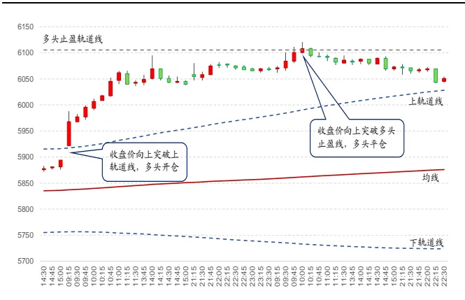
资料来源: Tinysoft，国信证券经济研究所整理

图 10：布林通道空头仓位止盈案例
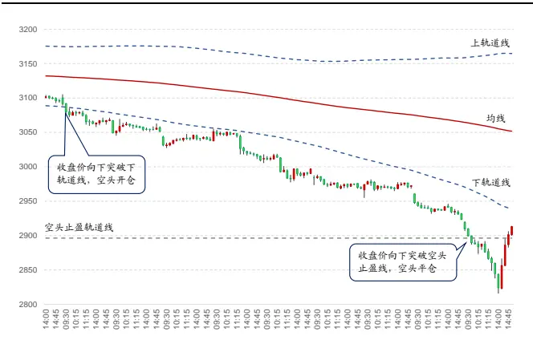
资料来源: Tinysoft，国信证券经济研究所整理

图 9 以及图 10 分别展示了布林通道多头止盈以及空头止盈案例，其中，图 9为豆粕（M.DCE）的多头止盈案例。可以看到当收盘价向上突破上轨道线时，多头进行开仓，此时的多头止盈轨道线为突破时均线上方 8 倍标准差。当 K线运行收盘价突破该止盈线时，对该笔多头进行平仓。

图 10 为螺纹钢（RB.SHF）的空头止盈案例，同样的，当收盘价向下突破下轨道线时，策略发出开空仓的信号，同时，记录当前均线下方 8 倍标准差的位置为当前空头止盈轨道线，当收盘价向下突破该轨道线时，进行该笔空头仓位的止盈操作。

因此，我们选择当策略触发开仓信号时，记录策略开仓时间点对应的止盈轨道线，当策略运行的收盘价突破止盈轨道线时策略进行止盈平仓。这样可以使得仓位的变化更平滑，减少后期趋势衰落造成的浮盈亏损。

综上所述，在经过信号的过滤、止盈设置后，便形成了经信号过滤及止盈后布林通道策略，至此，回顾策略的构建流程用一个流程图可表示如图 11：

图 11：经信号过滤及止盈后布林通道策略构建流程图
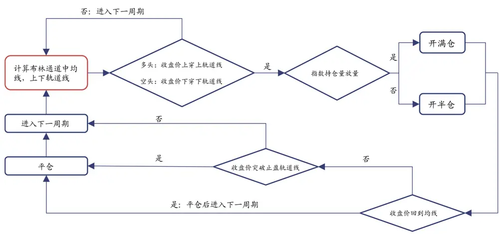
资料来源: Tinysoft，国信证券经济研究所整理

按照上述流程构建的经信号过滤及止盈后布林通道策略，在满足流动性条件的商品期货品种上面的净值表现如图 12 所示：

图 12：经信号过滤及止盈后布林通道策略净值表现
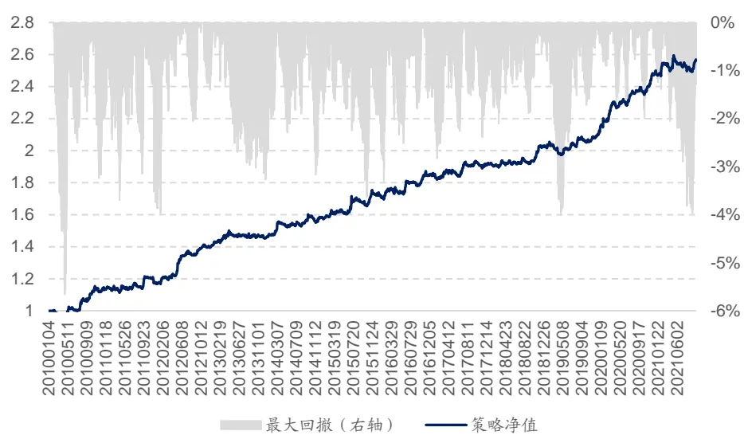
资料来源: Tinysoft，国信证券经济研究所整理

可以看出，相较于之前的基础策略，策略的稳定度得到了提升，下面对策略在不同年份的表现进行了测试，策略的分年度收益统计如表 7 所示：

表 7：经信号过滤及止盈后布林通道策略收益表现

|  | 策略收益 | 最大回撤 | 夏普率 | 波动率 | Calmar | 月度胜率 |
| --- | --- | --- | --- | --- | --- | --- |
| 2010 | 14.39% | 5.66% | 2.02 | 7.13% | 2.54 | 75.00% |
| 2011 | 2.95% | 3.86% | 0.46 | 6.44% | 0.76 | 50.00% |
| 2012 | 20.74% | 2.05% | 3.56 | 5.83% | 10.10 | 66.67% |
| 2013 | 3.08% | 3.27% | 0.61 | 5.08% | 0.94 | 50.00% |
| 2014 | 7.24% | 3.17% | 1.58 | 4.59% | 2.29 | 58.33% |
| 2015 | 10.66% | 3.62% | 1.78 | 5.99% | 2.94 | 66.67% |
| 2016 | 6.14% | 2.51% | 1.31 | 4.69% | 2.44 | 58.33% |
| 2017 | 3.98% | 2.39% | 0.94 | 4.22% | 1.67 | 58.33% |
| 2018 | 5.51% | 1.89% | 1.71 | 3.22% | 2.92 | 50.00% |
| 2019 | 4.44% | 4.01% | 1.27 | 3.50% | 1.11 | 58.33% |
| 2020 | 17.32% | 1.99% | 3.79 | 4.57% | 8.69 | 75.00% |
| 20210930 | 3.50% | 3.99% | 0.74 | 4.72% | 0.88 | 44.44% |
| 全样本期 | 8.25% | 5.66% | 1.61 | 5.13% | 1.46 | 59.57% |

资料来源: Tinysoft，国信证券经济研究所整理

经信号过滤及止盈后布林通道策略费后年化收益率为 8.25%，策略的夏普率由基础策略的1.12提升至1.61，策略的Calmar由原基础策略的0.81提升为1.46。策略体现出较强的稳定性。

## 交易品种动态筛选

对于同一个 CTA策略，往往难以适用所有的商品期货品种。尽管我们在开发策略时，希望找到可以适用于几乎所有商品期货品种的策略，但仍可能有部分品种长期表现出对于策略的不适用。在策略的实际使用中，如果可以通过动态识别策略在不同品种上面的表现，从而进行动态的交易品种的选择，那么可以使得策略的表现更加稳健。

图 13：动态筛选品种示意图
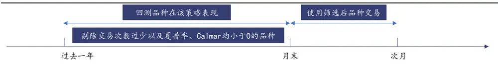
资料来源: 国信证券经济研究所整理

因此，如图 13 所示，我们在每个月末对所有已满足流动性条件的商品期货品种过去一年在策略上的表现进行测试，剔除过去一年中在该策略上交易次数小于5 次（表示策略在该品种上不易触发信号），或者在该策略上交易次数不少于 5次，但策略的夏普率以及 Calmar 均小于 0 的交易品种。

这种筛选方法往往可以将不适用该策略的品种进行剔除，之所以选择剔除不适应策略品种的逻辑，而不是筛选表现最好的品种的逻辑，是因为后者往往比较容易造成考察期的局部过拟合。

我们测试了前文经信号过滤及止盈后布林通道策略在使用品种的动态筛选方法之后的策略表现。

图 14：动态筛选品种后布林通道策略净值表现
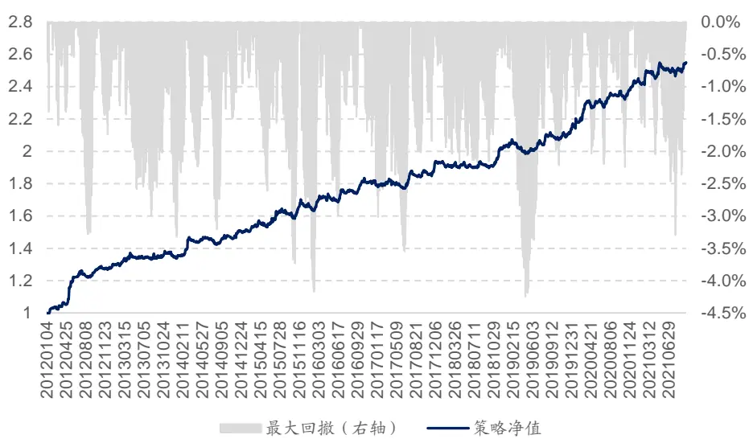
资料来源: Tinysoft，国信证券经济研究所整理

图 14 所展示的是前文经信号过滤及止盈后布林通道策略在使用品种的动态筛选方法之后的策略净值表现，从图 14 可以看出策略的稳定性得到了进一步的提升，同时，我们也统计了该策略的分年度表现如表 8 所示：

表 8：动态筛选品种后布林通道策略收益表现

|  | 策略收益 | 最大回撤 | 夏普率 | 波动率 | Calmar | 月度胜率 |
| --- | --- | --- | --- | --- | --- | --- |
| 2012 | 29.02% | 3.28% | 3.62 | 8.01% | 8.84 | 75.00% |
| 2013 | 4.04% | 3.18% | 0.65 | 6.19% | 1.27 | 50.00% |
| 2014 | 11.33% | 3.21% | 1.94 | 5.85% | 3.54 | 75.00% |
| 2015 | 12.25% | 3.73% | 1.98 | 6.20% | 3.28 | 75.00% |
| 2016 | 7.66% | 2.99% | 1.57 | 4.87% | 2.56 | 66.67% |
| 2017 | 6.72% | 3.30% | 1.38 | 4.87% | 2.04 | 58.33% |
| 2018 | 5.28% | 2.12% | 1.34 | 3.96% | 2.50 | 58.33% |
| 2019 | 5.09% | 4.25% | 1.23 | 4.13% | 1.20 | 58.33% |
| 2020 | 13.92% | 2.25% | 2.77 | 5.02% | 6.20 | 75.00% |
| 20210930 | 4.82% | 3.30% | 0.99 | 4.87% | 1.46 | 55.56% |
| 全样本期 | 9.93% | 4.25% | 1.79 | 5.53% | 2.34 | 64.96% |

资料来源: Tinysoft，国信证券经济研究所整理

经动态筛选品种后布林通道策略费后年化收益率为 9.93%，策略的夏普率由前述满足流动性条件全品种布林通道策略的 1.61 提升至 1.79，策略的 Calmar由原基础策略的 1.46 提升为 2.34。可以看出动态筛选品种的做法对策略表现的增益较为显著。

## 已实现波动率调整

当一个策略被设计研发出来之后，我们便可以实时监控这个策略的表现以及各个风险属性，其中一个重要的风险指标为策略的年化波动率。不同的策略逻辑对应的波动率不同，因此会有高波动策略以及低波动策略。那么不同的策略在实盘使用中，我们也希望用类似前文介绍的资金管理法对不同策略进行资金管理。

具体做法是，我们在每个月月末回看经动态筛选品种后布林通道策略整体的运行情况，计算过去一年该策略收益表现的波动率，将目标波动率设置为 10%（取决于对于策略预期的杠杆率水平，通常维持在 2-3 倍杠杆左右），那么波动率调整系数的计算公式可以表示为：

$$
Mul_{vol}=\frac{10\%}{Vol}
$$

其中， $Mul_{vol}$ 为经已实现波动率调整的系数，Vol为经动态筛选品种后策略过去一年的波动率。因此，结合前文介绍的 ATR调整杠杆率，一个品种的开仓杠杆率应为：

$$
Lev=Mul_{vol}*Lev_{ATR}
$$

通过对策略表现波动率的调整，可以使得策略在不同市场环境下运行的整体风险趋于一致。

同样，出于实际使用情况考虑，我们设置最大杠杆率为 4 倍杠杆。因此当Lev的绝对值大于 4时，我们截断为 4。

图 15：已实现波动率调整后策略杠杆变化图
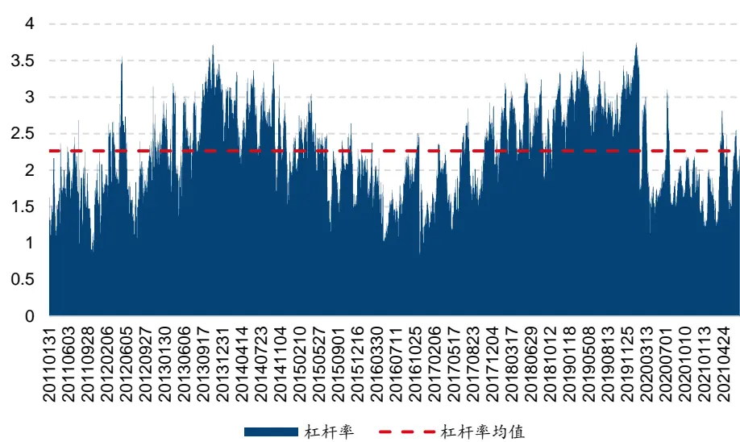
资料来源: Tinysoft，国信证券经济研究所整理

在经过已实现波动率调整后，基于布林通道的 CTA策略平均杠杆率的时序变化图如图 15 所示。

从图 15中看到，策略平均杠杆率为 2.24 倍，这个也是基于布林通道的 CTA策略的最终杠杆率变化水平。在 2013-2014 年间策略的历史杠杆率达到峰值，之后再 2016 年策略杠杆率到达低谷，之后，在 2019 年间，策略的杠杆率再次冲高。近期杠杆率虽有上升，但仍在历史均值附近。

至此，策略的全部逻辑已经探讨完毕，策略的最终表现以及相关特性将在下面进行详细阐述与测试。

## 基于布林通道的 CTA策略

前文以布林通道的基础构造以及逻辑为基底，在此基础上进行了逻辑上面的丰富和优化。之后我们基于前文的探讨，在经典布林通道 CTA策略的基础上加入了信号过滤，止盈判断以及综合风控系统后，结合品种的动态筛选机制，构建了我们最终版本的基于布林通道的 CTA策略。具体的策略构建流程如下：

## 投资标的：

过去半年中日均成交额超过 50 亿元的商品期货全品种的主力合约。

## 开仓信号：

多头：收盘价上穿布林通道上轨道线

空头：收盘价下穿布林通道下轨道线。

## 平仓信号：

多头：收盘价下穿布林通道均线

空头：收盘价上穿布林通道均线。

## 杠杆率调整：

ATR 调整：根据前文海龟资金管理法（1单位 ATR的波动对应策略整体资金规模的 0.5%）

已实现波动调整：以过去一年策略波动率为基准设置目标年化波动 10%

最终杠杆率：ATR 调整杠杆*已实现波动调整杠杆，最高 4 倍杠杆截断。

## 持仓量调整：

持仓量放量：满仓开仓

持仓量缩量：半仓开仓。

## 止盈逻辑：

多头：收盘价上穿止盈轨道线时平仓

空头：收盘价下穿止盈轨道线时平仓。

## 品种动态筛选：

剔除过去一年中在该策略上交易次数小于 5 次（表示策略在该品种上不易触发信号），或者在该策略上交易次数不少于 5次，但策略的夏普率以及 Calmar 均小于 0的交易品种。

## 资金分配：

经筛选后品种等权分配资金。

## 成交价格：

信号触发后 5分钟 VWAP。

## 交易成本：

交易手续费 0.3%%，冲击成本 1%%。

用一个流程图可表示如图 16：

图 16：策略构建流程图
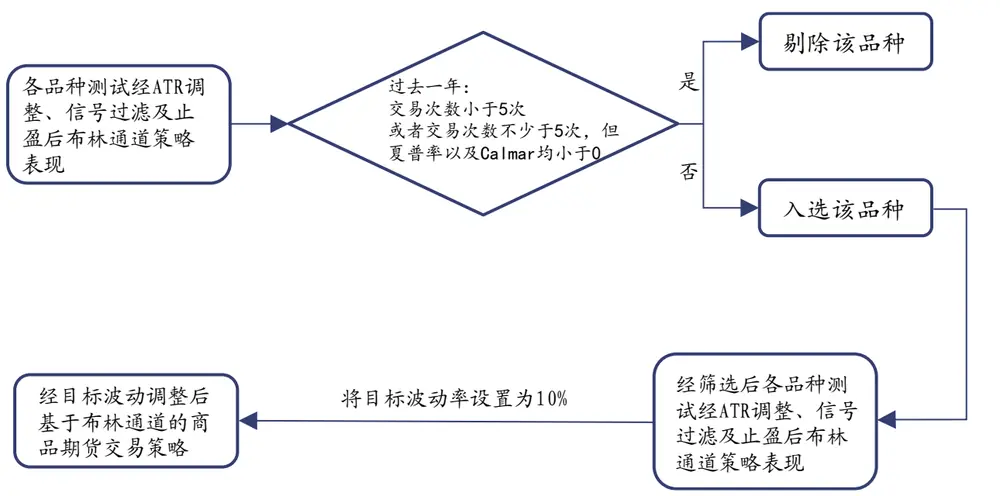
资料来源: Tinysoft，国信证券经济研究所整理

按照上述流程构建的基于布林通道的 CTA 策略历史表现稳定且具有较高收益率，2012 年以来该 CTA策略净值稳定攀升，同时回撤可控。具体走势如图 17所示：

图 17：基于布林通道的 CTA策略
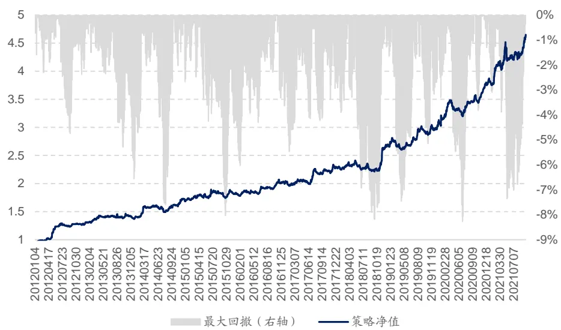
资料来源: Tinysoft，国信证券经济研究所整理

2012 年以来，基于布林通道的 CTA策略费后年化收益率为 17.52%，夏普率为1.72，最大回撤为 8.27%，Calmar 比率为 2.12。可以看出策略表现非常稳健。其中，策略的分年度收益表现如表 9：

表 9：基于布林通道的 CTA策略收益表现

|  | 策略收益 | 最大回撤 | 夏普率 | 波动率 | Calmar | 月度胜率 |
| --- | --- | --- | --- | --- | --- | --- |
| 2012 | 37.11% | 4.75% | 3.39 | 10.96% | 7.82 | 75.00% |
| 2013 | 6.04% | 6.56% | 0.65 | 9.28% | 0.92 | 66.67% |
| 2014 | 22.98% | 7.60% | 2.05 | 11.20% | 3.03 | 75.00% |
| 2015 | 8.85% | 8.02% | 0.85 | 10.41% | 1.10 | 58.33% |
| 2016 | 9.64% | 3.63% | 1.22 | 7.87% | 2.65 | 58.33% |
| 2017 | 13.73% | 4.22% | 1.46 | 9.37% | 3.25 | 66.67% |
| 2018 | 16.45% | 8.19% | 1.52 | 10.82% | 2.01 | 58.33% |
| 2019 | 13.14% | 7.45% | 1.48 | 8.86% | 1.76 | 58.33% |
| 2020 | 25.81% | 8.27% | 2.51 | 10.27% | 3.12 | 66.67% |
| 20210930 | 22.40% | 7.36% | 1.79 | 12.54% | 3.04 | 88.89% |
| 全样本期 | 17.52% | 8.27% | 1.72 | 10.16% | 2.12 | 66.67% |

资料来源: Tinysoft，国信证券经济研究所整理

从表 9 可以看出，策略每年收益都为正，因此策略的分年度表现非常稳健。同时，与前文基础策略相比，基于布林通道的 CTA策略全样本期年化收益率也进一步提升。

由于我们控制目标年化波动率在 10%，因此实现出来全样本期的年化波动率为10.16%，与期望的目标波动率比较接近，而由于每年策略的表现略有差异，其中最大年化波动率出现在2014年，当年波动率到达11.2%，当年夏普率为2.05，收益回撤比为 3.03。

除了策略整体收益表现，我们也统计了基于布林通道的 CTA策略在不同商品期货合约上的表现情况。如表 10 所示：

表 10：各合约收益情况及权重分配

| 品种代码 | A | AG | AL | AP | AU B |  | BU | C | CF | CJ CS |  |
| --- | --- | --- | --- | --- | --- | --- | --- | --- | --- | --- | --- |
| 品种累计收益 | -19.65% | 73.47% | 62.91% | -9.45% | 24.84% | 6.87% | 49.31% | -32.61% | 21.34% | 0.00% | -4.67% |
| 品种权重占比 | 0.42% | 4.41% | 0.81% | 2.20% | 4.25% | 0.09% | 2.73% | 2.92% | 2.30% | 0.00% | 0.13% |
| 平均换手率 | 0.02% | 0.42% | 0.05% | 0.09% | 0.35% | 0.01% | 0.21% | 0.24% | 0.22% | 0.00% | 0.01% |
| 平均每年交易次数 | 0 | 8 | 1 | 14 | 4 | 0 | 12 | 12 | 6 | 0 | 1 |
| 品种代码 | CU | EB | EG | FG | FU | HC | 1 | J | JD | JM L |  |
| 品种累计收益 | 34.38% | 45.29% | 66.41% | 50.91% | 63.00% | 85.58% | 209.66% | 153.00% | 39.46% | 69.15% | 92.03% |
| 品种权重占比 | 3.89% | 0.52% | 1.36% | 2.51% | 1.21% | 1.90% | 2.73% | 2.46% | 2.15% | 1.38% | 2.90% |
| 平均换手率 | 0.36% | 0.03% | 0.11% | 0.06% | 0.10% | 0.16% | 0.20% | 0.17% | 0.10% | 0.11% | 0.28% |
| 平均每年交易次数 | 7 | 11 | 14 | 2 | 11 | 11 | 14 | 8 | 8 | 6 | 13 |
| 品种代码 | M | MA | NI | 0l | P | PB | PP | RB | RM | RU | SA |
| 品种累计收益 | 91.85% | 100.32% | 72.49% | -7.06% | 163.39% | 19.24% | 49.63% | 262.24% | 49.95% | 123.13% | 0.87% |
| 品种权重占比 | 3.96% | 2.46% | 3.01% | 3.28% | 4.70% | 0.95% | 2.55% | 5.52% | 2.71% | 3.13% | 0.10% |
| 平均换手率 | 0.42% | 0.21% | 0.23% | 0.16% | 0.44% | 0.02% | 0.22% | 0.45% | 0.20% | 0.28% | 0.01% |
| 平均每年交易次数 | 11 | 12 | 9 | 5 | 12 | 1 | 14 | 13 | 7 | 12 | 2 |
| 品种代码 | SC | SF | SM | SN | SP | SR | SS | TA | UR | V | Y |
| 品种累计收益 | 6.73% | -2.74% | 13.43% | 71.36% | -50.27% | 23.82% | 46.17% | 208.94% | -12.68% | 0.00% | 30.15% |
| 品种权重占比 | 0.70% | 0.16% | 0.26% | 0.53% | 0.62% | 3.42% | 0.61% | 4.98% | 0.38% | 0.00% | 3.82% |
| 平均换手率 | 0.07% | 0.01% | 0.01% | 0.04% | 0.08% | 0.39% | 0.02% | 0.35% | 0.04% | 0.00% | 0.50% |
| 平均每年交易次数 | 5 | 2 | 2 | 5 | 10 | 9 | 3 | 11 | 8 | 0 | 12 |
| 品种代码 | zC | ZN |  |  |  |  |  |  |  |  |  |
| 品种累计收益 | 393.21% | -28.97% |  |  |  |  |  |  |  |  |  |
| 品种权重占比 | 6.05% | 2.82% |  |  |  |  |  |  |  |  |  |
| 平均换手率 | 0.16% | 0.24% |  |  |  |  |  |  |  |  |  |
| 平均每年交易次数 | 8 | 5 |  |  |  |  |  |  |  |  |  |

资料来源: Tinysoft，国信证券经济研究所整理

在表 10 中合约收益为全样本期（20120104-20210930）各个合约的累计收益情况，可以看出策略在不同合约上交易较为均匀，总计共 46 个品种，其中 35个品种的收益率皆为正。这体现出策略在不同品种上面的普适性。

从前文的探讨中，我们可以看到，基于布林通道的 CTA 策略逻辑简单，结果稳健，每年都可以提供正向收益，全样本期费后年化收益率为 17.52%，夏普率为1.72，Calmar 为 2.12。

上述基于布林通道的 CTA 策略在进行回测时使用的交易成本为 1.3%%，是由交易手续费 0.3%%以及冲击成本 1%%构成。交易价格为策略信号发出后 5 分钟的 VWAP均价，我们测试了不同冲击成本下策略的收益表现如表 11 所示：

表 11：不同交易成本下策略收益表现

| 交易成本 | 年化收益率 | 夏普率 | Calmar |
| --- | --- | --- | --- |
| 1.3%% | 17.52% | 1.72 | 2.12 |
| 1.5%% | 17.43% | 1.71 | 2.10 |
| 2%% | 17.20% | 1.69 | 2.06 |
| 2.5%% | 16.97% | 1.67 | 2.02 |

资料来源: Tinysoft，国信证券经济研究所整理

从表 11可以看出策略对于交易成本的变化不敏感，随着交易成本的增加策略年化收益率变化缓慢。当交易成本从 1.3%%增长至 2.5%%后，策略的年化收益率从 17.52%降到 16.97%，夏普率仅从 1.72 下降到 1.67。

图 18：不同交易成本下策略净值
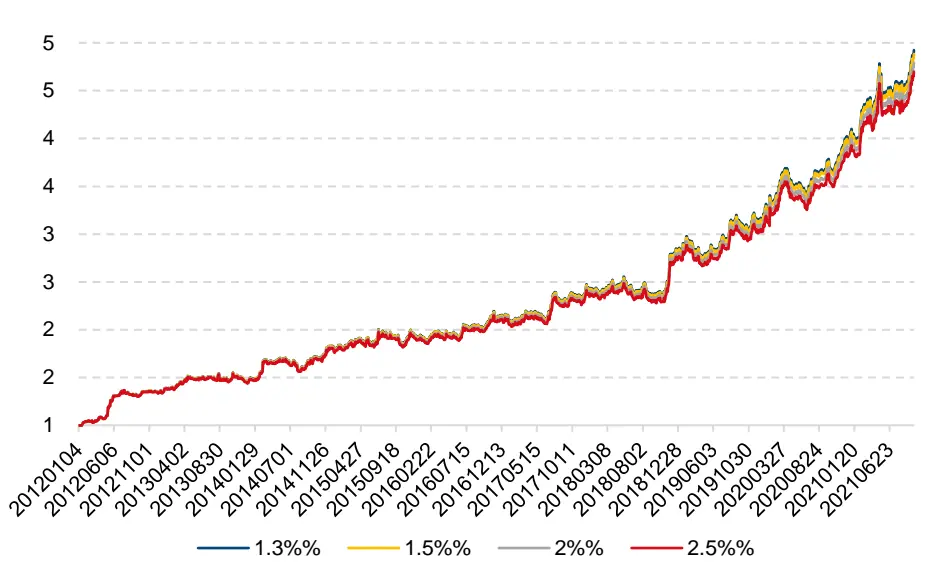
资料来源: Tinysoft，国信证券经济研究所整理

从图 18展示的不同交易成本下策略净值表现可以看出，交易成本的变化对策略净值的走势影响不大。基于布林通道的 CTA策略在不同的交易成本下均可实现长期稳定的表现。

## CTA 复合策略

前文我们通过测试和研究，呈现出了基于布林通道的完整 CTA策略。此为我们CTA系列专题的第二篇。此前，我们研究和开发了股指期货的 CTA策略，详细可参考我们于 2021 年 5 月 13 日发布的专题报告《CTA 系列专题之一：基于开盘动量效应的股指期货交易策略》。

基于布林通道的CTA策略与基于开盘动量效应的股指期货交易策略的长期相关性走势如图 19所示：

图 19：策略间相关系数变化图
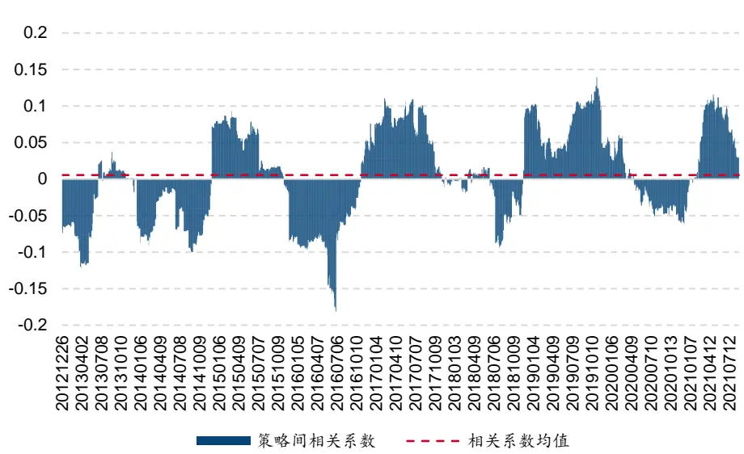
资料来源: Tinysoft，国信证券经济研究所整理

我们将这两个策略等权配置，月度再平衡，可以得到 CTA复合策略，复合策略的净值曲线如图 20：

图 20：CTA复合策略净值
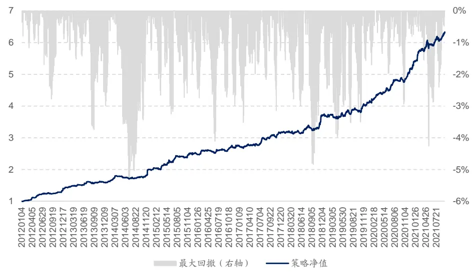
资料来源: Tinysoft，国信证券经济研究所整理

从图 19中可以看出，尽管策略间相关性有一定波动，但由于策略标的不同，策略逻辑不同，因此，策略间整体相关系数较小，长期相关性为 0.005，几乎为零。因此将这样两个策略进行组合，可以提升 CTA 策略的稳定性，在 CTA 产品中，往往需要多策略进行搭配使用。

图 20 显示的是 CTA 复合策略的净值曲线，从图中可以看出策略的净值曲线较为光滑，且收益较高，这比较符合我们的预期。其中，复合策略的分年度收益统计如表 12 所示：

表 12：CTA复合策略收益表现

|  | 策略收益 | 最大回撤 | 夏普率 | 波动率 | Calmar | 月度胜率 |
| --- | --- | --- | --- | --- | --- | --- |
| 2012 | 42.92% | 2.78% | 4.38 | 9.80% | 15.45 | 91.67% |
| 2013 | 11.69% | 3.75% | 1.55 | 7.53% | 3.12 | 66.67% |
| 2014 | 24.08% | 5.33% | 2.16 | 11.15% | 4.52 | 83.33% |
| 2015 | 27.09% | 3.25% | 2.71 | 9.99% | 8.34 | 66.67% |
| 2016 | 9.19% | 4.11% | 1.28 | 7.16% | 2.24 | 75.00% |
| 2017 | 15.63% | 3.15% | 2.25 | 6.96% | 4.96 | 66.67% |
| 2018 | 16.03% | 4.84% | 1.95 | 8.21% | 3.31 | 50.00% |
| 2019 | 11.23% | 3.70% | 1.43 | 7.86% | 3.04 | 58.33% |
| 2020 | 26.69% | 2.94% | 3.82 | 6.99% | 9.09 | 83.33% |
| 20210930 | 21.90% | 4.26% | 2.72 | 8.04% | 5.14 | 77.78% |
| 全样本期 | 20.55% | 5.33% | 2.42 | 8.49% | 3.86 | 71.79% |

资料来源: Tinysoft，国信证券经济研究所整理

从表 12 中可以看到，复合策略的年化费后收益率为 20.55%，夏普率为 2.42，Calmar 为 3.86，并且还可以看到，复合策略每年的夏普率都大于 1，且每年Calmar 都大于 2。

因此，复合策略的表现非常稳健。当CTA策略组合中的策略逐渐丰富起来之后，CTA复合策略的表现会更加优异，呈现出来的净值表现也将更加稳健。

## 总结与展望

## 布林通道（Bollinger Band）及其相关性质

布林通道由三条线组成，即均线，上轨道线以及下轨道线。当资产价格上穿上轨道线时，形成多头趋势，回到均线时平仓。当资产价格运行下穿下轨道线时，形成空头趋势，回到均线时平仓。

随着均线长度的增加，每笔交易收益率是线性提升的，同时，随着偏离系数的增加，每笔交易收益率也是线性提升的。随着均线长度的增加，以及偏离系数的增加，都伴随着持仓周期的拉长。因此我们根据预期持仓周期的长短进行参数选择。

## 杠杆设置

我们使用海龟资金管理法中 ATR 调整的方法，当一个品种的日均波动较大时，我们倾向于给予该品种较低的杠杆，而反之，如果一个品种的日均波动较小，我们则可以给该品种较高的杠杆。以及已实现波动率调整法，使得已实现杠杆率最终平均为 2.24 倍。

## 信号过滤

当品种的持仓量处在放大阶段时进行开仓的单笔收益平均更高，因此，当持仓量放大时，触发开仓信号后，满仓开仓，当持仓量缩小时，触发开仓信号后，半仓开仓。其余逻辑与基础策略相同。

## 风险控制

我们构建了止盈轨道线，随着轨道线系数的增加，平均止盈次数逐渐减少，意味着历史中真正突破止盈轨道线的机会变少。另一方面，随着止盈系数的增加，平均止盈后收益逐渐降低。

布林通道策略在加入信号过滤以及止盈条件后，策略的稳定性以及整体表现都有了进一步提升。

## 交易品种的动态筛选

我们使用过去半年中日均成交额超过 50 亿元的所有商品期货品种进行策略研究。我们在每个月末对过去一年策略在各个品种上面的表现进行测试，通过剔除交易信号触发过少以及表现不好的品种，对交易品种进行动态的选择。

## 基于布林通道的 CTA 策略

结合信号过滤，止盈判断以及综合风控系统后，基于布林通道的 CTA策略历史表现稳定且具有较高收益率，2012 年以来该 CTA 策略净值稳定攀升，同时回撤可控。

## CTA 复合策略

我们将基于布林通道的完整CTA策略以及此前的基于开盘动量效应的股指期货交易策略等权复合，构造为 CTA 复合策略，复合策略的年化费后收益率为20.55%，夏普率为 2.42，Calmar 为 3.86，并且复合策略每年的夏普率都大于1，且每年 Calmar 都大于 2。

## 参考文献

[Hurst@2013]Hurst, Brian, Yao Hua Ooi, and Lasse Heje Pedersen. "Demystifying managed futures." Journal of Investment Management 11.3 (2013): 42-58.

Fung and Hsieh@2001] Fung, William, and David A. Hsieh. "The risk in hedge fund strategies: Theory and evidence from trend followers." The review of financial studies 14.2 (2001): 313-341.

## 附录——数据准备

在本节将介绍我们对数据的准备以及处理方法。在 CTA 策略的测试中，数据的处理主要涉及以下几个问题：主力合约如何确定，展期价格跳空如何处理，不同合约数据怎么拼接以及发单价格如何确定。下面我们将针对这些问题进行分析和解决。

## 主力合约的确定

在确定主力合约时，我们使用成交量以及持仓量均达到最大的合约作为主力合约。这其中，股指期货在合约到期月份的第三个周五进行交割，国债期货在合约到期月份的第二个周五进行交割，因此，如果上述品种在交割前还没有能够新的主力合约可以确定，那么需要在交割日前一个交易日强制切换至当时的次主力合约。同时，主力合约不可逆，一经确定不可反复。

## 合约切换的思考

在合约进行切换时，可能会出现前后两个主力合约的价格无法进行无缝对接的情况。如图 21所示：

图 21：RB1901 切换 RB1905 价格跳空
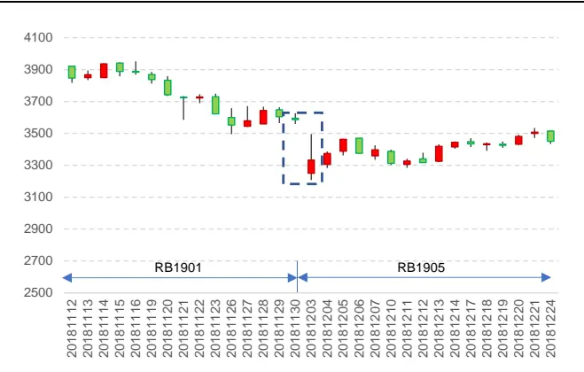
资料来源: Tinysoft，国信证券经济研究所整理

图 22：RB1901 切换 RB1905 价格复权
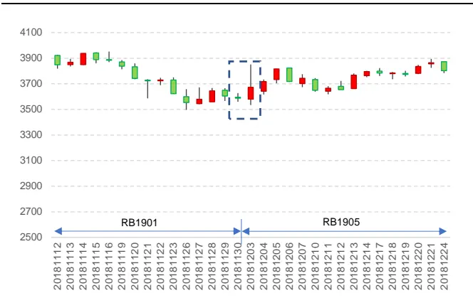
资料来源: Tinysoft，国信证券经济研究所整理

图21为RB1901合约切换到RB1905合约的价格序列图，其中切换时点为2018年 12 月 3日。从图 21可以看出，在切换的时间点出现了一个价格的大幅跳空低开的情况，如果认为这是行情的自然状态，则可能导致对行情判断的失误。从而导致策略判断失真。

那么在切换合约时，通常有两种做法，一种是根据新主力合约之前的业绩进行新交易信号的判断，以 RB 合约为例，当合约从 RB1901 切换到 RB1905 时，之后的策略计算都按照 RB 的历史数据进行计算，这样做的好处是，策略信号来源于该标的且作用在该标的。而缺点是有些合约虽然切换到了新的主力合约，但是由于切换前该新合约交易并不活跃，加之有些策略需要使用大量历史数据进行处理和分析，因此可能导致信号失真，或者价格波动较大的情况。

还有一种做法是将价格数据进行复权。复权分为前复权以及后复权，如果向前复权的话，则当前的合约价格为真实价格，之前的合约价格数据为复权后的价格。这样做的好处是可以使用当前的真实合约价格来确认开仓数量，而缺点则是历史数据会随着新数据的更新而出现变化，尽管变化较小，但随着时间的推移以及浮点数的保存问题，有可能会出现新计算出来的策略开仓时点或者策略曲线与之前计算的无法完全匹配的情况。那么会在策略归因时，造成一定的困难。

我们所使用的方法是进行向后复权，这样做的前提是需要选择一个策略开始计算的日期为基期，一旦基期确定下来，后面行情如何更新都对历史数据造成改变。当然，如果基期发生了变化，则有可能导致历史数据的变化。由于 2010年以前上市的期货品种较少，且活跃度不高。因此我们所使用的基期则定为2010 年 1 月 1 日。

复权的具体做法为：在每次展期的时候，计算新主力合约以及旧主力合约的价格跳空比，以此作为当日之后新主力合约价格的复权因子。该复权因子的具体计算公式为：

$$
AdjFactor_{i}=AdjFactor_{i-1}\cdot\frac{Close_{i-1,old}}{Close_{i-1,new}}
$$

其中， $AdjFactor_{i-1}$ 为上一期复权因子， $Close_{i-1,old}$ 为旧主力合约展期前一日收盘价， $Close_{i-1,new}$ 为新主力合约展期前一日收盘价。这样计算出来的复权因子$AdjFactor_{i}$ 为当期复权因子。其中，基期的复权因子为 1。计算好复权因子之后，新的主力合约的开盘价、最高价、最低价以及收盘价都乘以当期的复权因子，即为复权价格。

这样使用复权价格可以很好地避免因切换合约带来的价格跳空的影响，具体在计算收益率时，如果直接使用原始价格进行计算：

$$
Return_{i}=\frac{Close_{i,new}}{Close_{i-1,old}}-1
$$

当新主力合约价格与旧主力合约价格出现跳空时，该收益率会出现异常值， $\bar{\hbar}$ 使用复权因子之后收益率的计算变为：

$$
\begin{array}{l}{{Return_{i}=\displaystyle\frac{AdjFactor_{i}\cdot Close_{i,new}}{AdjFactor_{i-1}\cdot Close_{i-1,old}}-1}}\\{{\ }}\\{{=\displaystyle\frac{AdjFactor_{i-1}\cdot\frac{Close_{i-1,old}}{Close_{i-1,new}}\cdot Close_{i,new}}{AdjFactor_{i-1}\cdot Close_{i-1,old}}-1}}\\{{\ }}\\{{=\displaystyle\frac{Close_{i,new}}{Close_{i-1,new}}-1}}\end{array}
$$

可以看到，这样计算出来的收益率即为实际收益率，进而避免了因合约切换导致的策略信号漂移或者收益率无法计算的情况。

如图 22 展示的是经复权之后 RB1901 合约切换到 RB1905 合约的情况，可以看到，图 21 跳空的部分变得更加连续了。因此，通过对主力连续不同合约的价格进行复权处理，我们便可以得到连续无异常跳空的行情时间序列数据。

## 数据处理与拼接

本节将从两个维度分析数据处理中的相关问题。第一，当策略只包含股指期货的时候，数据的处理。其次，当策略需要做商品期货全品种时，数据处理的问题。

由于股指期货的三个品种的交易时间都是同步的，因此不存在不同合约时间对齐的问题。但是需要确定策略执行的收益率的计算方法，我们考虑实盘交易时在信号触发后的成交的价格为 5 分钟的 VWAP，具体可以根据产品规模而定。同时，交易时间越长对策略的时效性要求就越高，需要策略信号的衰减周期与交易时长相匹配。具体做法为计算策略信号触发后 5 分钟的成交额除以经合约乘数调整的成交量：

$$
VWAP_{5}=\frac{\sum_{i=1}^{5}Amount_{i}}{\sum_{i=1}^{5}Vol_{i}\cdot Multi}
$$

其中，Amount 为第 i 分钟的成交额， $Vol_{i}$ 为第 i 分钟的成交量,Multi为该品种的合约乘数。

当策略需要加入全部期货品种的时候，则需要考虑全品种的交易时间对齐的问题。部分商品期货有夜盘，部分商品期货没有。此外，所有商品期货的品种在上午 10点 15 分至 10 点 30 分期间为暂停交易时段。因此，进行时间对齐时非交易时段行情数据的处理就是一个需要解决的问题。我们的处理方式为非交易时间段行情序列设置为空值，信号延续交易时段信号，同时策略收益率设置为零。

当合约尚未上市时，将行情序列设置为空值，且不允许发出交易信号，收益率也设置为空值。

国信证券投资评级

| 类别 | 级别 | 定义 |
| --- | --- | --- |
| 股票投资评级 | 买入 | 预计6个月内，股价表现优于市场指数20%以上 |
|  | 增持 | 预计6个月内，股价表现优于市场指数10%-20%之间 |
|  | 中性 | 预计6个月内，股价表现介于市场指数±10%之间 |
|  | 卖出 | 预计6个月内，股价表现弱于市场指数10%以上 |
| 行业投资评级 | 超配 | 预计6个月内，行业指数表现优于市场指数10%以上 |
|  | 中性 | 预计6个月内，行业指数表现介于市场指数±10%之间 |
|  | 低配 | 预计6个月内，行业指数表现弱于市场指数10%以上 |

## 分析师承诺

作者保证报告所采用的数据均来自合规渠道，分析逻辑基于本人的职业理解，通过合理判断并得出结论，力求客观、公正，结论不受任何第三方的授意、影响，特此声明。

## 风险提示

本报告版权归国信证券股份有限公司（以下简称“我公司”）所有，仅供我公司客户使用。未经书面许可任何机构和个人不得以任何形式使用、复制或传播。任何有关本报告的摘要或节选都不代表本报告正式完整的观点，一切须以我公司向客户发布的本报告完整版本为准。本报告基于已公开的资料或信息撰写，但我公司不保证该资料及信息的完整性、准确性。本报告所载的信息、资料、建议及推测仅反映我公司于本报告公开发布当日的判断，在不同时期，我公司可能撰写并发布与本报告所载资料、建议及推测不一致的报告。我公司或关联机构可能会持有本报告中所提到的公司所发行的证券头寸并进行交易，还可能为这些公司提供或争取提供投资银行业务服务。我公司不保证本报告所含信息及资料处于最新状态；我公司将随时补充、更新和修订有关信息及资料，但不保证及时公开发布。

本报告仅供参考之用，不构成出售或购买证券或其他投资标的要约或邀请。在任何情况下，本报告中的信息和意见均不构成对任何个人的投资建议。任何形式的分享证券投资收益或者分担证券投资损失的书面或口头承诺均为无效。投资者应结合自己的投资目标和财务状况自行判断是否采用本报告所载内容和信息并自行承担风险，我公司及雇员对投资者使用本报告及其内容而造成的一切后果不承担任何法律责任。

## 证券投资咨询业务的说明

本公司具备中国证监会核准的证券投资咨询业务资格。证券投资咨询业务是指取得监管部门颁发的相关资格的机构及其咨询人员为证券投资者或客户提供证券投资的相关信息、分析、预测或建议，并直接或间接收取服务费用的活动。

证券研究报告是证券投资咨询业务的一种基本形式，指证券公司、证券投资咨询机构对证券及证券相关产品的价值、市场走势或者相关影响因素进行分析，形成证券估值、投资评级等投资分析意见，制作证券研究报告，并向客户发布的行为。

## 国信证券经济研究所

深圳深圳市罗湖区红岭中路 1012 号国信证券大厦18 层邮编：518001 总机：0755-82130833

上海
上海浦东民生路 1199弄证大五道口广场 1 号楼12 楼
邮编：200135
北京
北京西城区金融大街兴盛街 6 号国信证券 9 层
邮编：100032