# 金融工程专题研究

# CTA系列专题之三：基于Carry 的商品期货交易策略

## 核心观点

Carry 相关理论

我们从Carry收益的分解以及相关Carry收益的理论研究出发，通过Carry收益公式、持仓成本理论以及对冲压力假说等方面，阐述了投资者在不同期限结构下应做的交易决策：当主力合约价格低于次主力合约，做多主力合约，反之，当主力合约价格高于次主力合约，此时应做空主力合约。我们将Carry收益由高到低排序分为5档进行测试，发现Carry收益与策略夏普率呈现单调的负相关性。Carry收益越高策略夏普率越低，反之Carry收益越低策略夏普率越高。因此我们使用Carry收益最低一组作为多头组合，Carry收益最高一组作为空头组合，并以此形成Carry基础策略。Carry基础策略年化收益率11.2%，夏普率为1.15。体现出Carry收益逻辑的有效性。

单纯使用Carry收益作为信号进行交易则会忽视合约在价格的微观结构上的背离。经研究，在Carry基础策略的基础之上，我们发现开仓方向与动量效应产生共振时，策略收益显著，而当开仓方向与动量反向时，策略收益较弱。但此时可以通过成交、持仓量是否缩量来进行判断，当市场处于缩量时，策略依然能够产生正向期望。因此，在开仓方向与动量效应产生共振时，可满仓进行开仓，而当策略的开仓方向与动量效应出现反向，且市场处于缩量状态时，可半仓进行开仓。通过信号过滤后Carry基础策略的收益稳定性得到显著提升，Calmar 由 0.52 提升至 1.27，并且可以规避掉如 2013-2014 年Carry信号的阶段性回撤风险。

为防止策略出现系统性风险，同时出于对策略完整性的考量，我们加入了吊灯止损。吊灯止损是CTA策略中常见的止损方法，当合约价格从最优价格回落2.5倍ATR时，进行止损。

## 基于Carry的商品期货交易策略

我们以Carry基础策略为基础，通过加入信号过滤、风险控制以及杠杆设置等细节的处理，最终形成了基于Carry的商品期货交易策略，其中，策略费后年化收益率为25.96%，夏普率为1.73，Calmar比率为1.63。并且策略对于交易成本不敏感。

风险提示：市场环境变动风险，模型失效风险。

## 金融工程专题报告

## 金融工程·数量化投资

证券分析师：张欣慰

021-60933159

证券分析师：刘凯

zhangxinwei1@guosen.com.cn

010-88005479

S0980520060001

liukai6@guosen.com.cn

S0980522040002

## 相关研究报告

《CTA系列专题之二：基于 Bollinger 通道的商品期货交易策略》2021-10-13

《CTA系列专题之一：基于开盘动量效应的股指期货交易策略》2021-05-13

在我们CTA系列报告的前两篇报告中，我们聚焦于趋势跟随类策略，分别以股指期货为交易标的，基于股指期货市场的开盘动量效应提出了《基于开盘动量效应的股指期货交易策略》。之后，以商品期货为交易标的，系统的介绍了应用较为广泛，也是趋势跟随类策略中最为经典的策略之一的布林通道策略，形成了《基于Bollinger通道的商品期货交易策略》。上述两个策略的共同点主要有两个，一个是策略类型均为趋势跟随类策略，另一个是交易信号产生的来源均来自主力合约。而本文将从另一个CTA的策略类型出发，使用主力合约与次主力合约的信息基于Carry特征构造商品期货交易策略。

## 从 Carry 谈起

## 什么是 Carry 收益

投资者参与市场的目的是获得一定的利润，[Koijen@2018]则对投资者持有某项资产获得的 Carry 收益提出了定义。资产实际收益由 Carry 收益、预期价格变动以及不确定市场变动构成。具体计算公式如下：

$$
Return=carry+E(priceappreciation)+unexpectedpriceshock
$$

其中，R e t 为资产实际收益，c ���为 Carry 收益，�(���R ���R �c ��t )为预期价格变动以及����R �R ����R �ℎ���表示不确定市场变动。我们以下面的例子，简单地解释 Carry 收益。若投资者在 t 时持有 1 手 3 个月后交割的价值 3000元的某单一品种期货合约 A，持有一个月后至 t+1 时刻不换仓。t+1 时刻，同品种3 个月后交割的期货合约 B 为 4000 元，而期货合约 A 变为 2 月后交割的合约，假设合约价格上涨至 4500 元。如下图 1 所示：

图1：Carry收益示意图
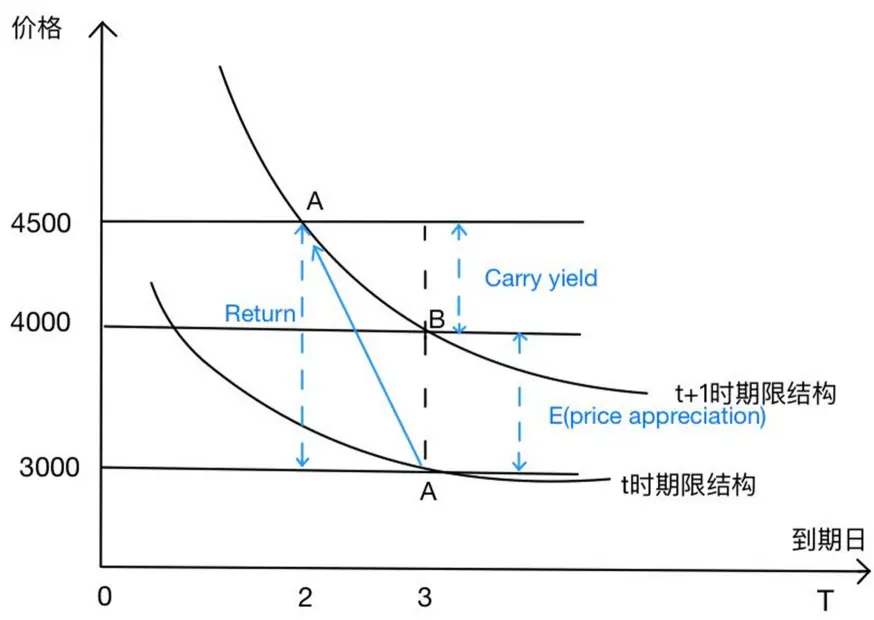
资料来源：国信证券经济研究所整理

则该投资者的持有总收益应为 4500-3000=1500 元。因预期价格变动产生的收益为 �(���R ���R �c ��t )=4000-3000=1000 元。根据 Carry 收益的定义，持仓 1个月后，投资者持有的合约从 3个月后交割的合约变为了 2个月后交割的合约，Carry 收益为 4500-4000=500 元。因此，Carry 收益计算的是将合约进行展期时的收益，也称展期收益。

在期货市场中，期货合约的 Carry 收益（Carry yield）为近月合约平仓向后展期到远月所得的收益，这里我们使用主力合约与次主力合约来代表近月合约和远月合约，下面的公式为 Gorton 和 Rouwenhorst 于 2006 年提出的计算 Carry 收益的方法：

$$
\left(\frac{\boldsymbol{F}_{1t}}{\boldsymbol{F}_{2t}}-1\right)*\frac{365}{D_{2t}-D_{1t}}
$$

其中， $F_{1t}$ 为主力合约在 t时的价格； $F_{2t}$ 为次主力合约在 t时的价格； $D_{1t}$ 和 $D_{2t}$ 为各自合约的交割日期。

我们对上述公式做一点修改，使用如下公式度量Carry收益，其含义与上述Gorton和 Rouwenhorst 的公式含义一致：

$$
\Bigl(\cfrac{F_{1t}}{F_{2t}}-1\Bigr)*\cfrac{1}{M_{2t}-M_{1t}}
$$

其中， $F_{1t}$ 为主力合约在 t时的价格； $F_{2t}$ 为次主力合约在 t时的价格； $M_{1t}$ 和 $M_{2t}$ 为各自合约的交割月份。

我们继续上例的讨论，若投资者在 t+1 时刻平仓期货合约 A，同时买入期货合约B，则投资者在保持持仓量不变的同时，降低了持仓成本 4500-4000=500 元，即投资者所获得的 Carry 收益。

通过上例我们可以知道，当主力合约价格高于次主力合约价格时，可以通过做空主力合约来降低持有成本，获取 Carry 收益。

## 期限结构与对冲压力假说

期货的 Carry 收益利用了主力合约和次主力合约因交割时间、市场需求等不同产生的价差。而描述这种价差的关系就称为期货的期限结构（Term structure）。市场上期货的期限结构是不断变化的，常见的两种期限结构是 Contango 结构和Backwardation 结构。在 Contango 结构下主力合约的价格要低于远月合约，期限结构向右上倾斜，此时，期货相对于现货（主力合约）升水。反之，Backwardation结构下，主力合约的价格要高于远月合约，期限结构向右下倾斜，此时，期货相对于现货（主力合约）贴水。其中，Contango 结构以及 Backwardation 结构如图 2以及图 3所示。

图 2所展示的是橡胶（RU）品种的主力合约、次主力合约以及接下来两个远月合约的价格排列图。可以看到，各个合约价格呈现出自主力合约开始逐步上升的趋势，因此，这一市场结构，我们称之为 Contango 结构。

与之相对应的，从图 3 中可以看到镍（NI）品种的主力合约、次主力合约以及接下来两个远月合约的价格排列图。图中主力合约价格最高，高于次主力合约。次主力合约以及接下来两个远月合约价格依次下降。这样的市场结构，我们称之为Backwardation 结构。

图2：Contango 结构
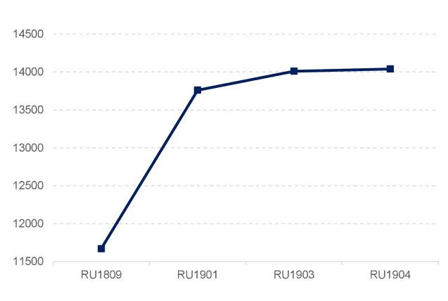
资料来源：Tinysoft，国信证券经济研究所整理

图3：Backwardation 结构
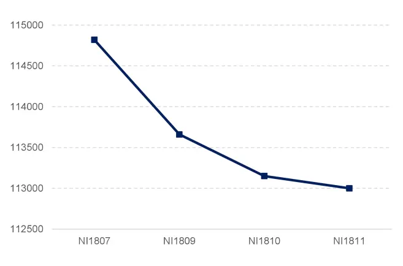
资料来源：Tinysoft，国信证券经济研究所整理

对冲压力假说（The hedging pressure hypothesis）是对期货升贴水结构的理论解 释 之 一 。 对 冲 压 力 假 说 是 [Cootner@1960] 为 支 持 Keynes 的 “NormalBackwardation”理论提出的，其思想是“净多头（空头）投机者要求风险溢价（Riskpremium）来承担净空头（多头）套保者试图避免的价格下跌（上涨）的风险”。不管期货相对现货是升水还是贴水，都会有风险溢价。如果套保者对未来现货价格看跌，导致期货市场空单过多，则会形成 Backwardation 结构，此时期货贴水，现货（主力合约）升水，投机者应做空主力合约。相反，若套保者对未来现货价格看涨，导致期货市场多单过多，则会形成 Contango 结构，此时期货升水，现货（主力合约）贴水，投机者应做多主力合约。

通过上述分析可以看出，投资者应该在 Carry 收益较大的方向进行交易。在Contango 结构下，主力合约因市场套保者多单过多导致贴水，主力合约价格低于次主力合约，此时应做多主力合约以获得可观的 Carry 收益；反之，在Backwardation 结构下，主力合约因市场套保者空单过多导致升水，主力合约价格高于次主力合约，此时应做空主力合约以获得较为丰厚的 Carry 收益。

## Carry 策略

前面我们通过 Carry 收益公式、持仓成本理论以及对冲压力假说等视角阐述了如何利用 Carry 特征进行主力合约的交易操作。即，当主力合约价格高于次主力合约价格时，做空主力合约。当主力合约价格低于次主力合约价格时，做多主力合约。本节我们将基于上述逻辑对 Carry 策略进行构造，并考察该策略的表现以及相关特性。

截至 2022 年 5月，全市场可供交易的商品期货品种共 64 个。其中，上海国际能源交易中心中交易的商品期货品种较新，品种种类较少。郑州商品交易所所交易的商品期货品种最多，为 23 个品种。同时，郑州商品交易所以交易粮油期货为主，上海期货交易所主要交易有色金属以及贵金属等。大连商品交易所主要交易农产品以及黑色系商品期货。

表1：各交易所在交易品种

| 交易所 商品期货品种 |  |
| --- | --- |
| 上海国际能源交易中心 国际铜、低硫燃料油、20号胶、原油 |  |
| 上海期货交易所 | 白银、铝、黄金、沥青、铜、燃油、热轧卷板、镍、铅、螺纹钢、橡胶、锡、纸浆、不锈钢、线材、锌 |
| 大连商品交易所 | 豆一、豆二、胶合板、玉米、玉米淀粉、苯乙烯、乙二醇、纤维板、铁矿石、焦炭、鸡蛋、焦煤、塑料、 生猪、豆粕、棕榈油、LPG、聚丙烯、粳米、PVC、豆油 苹果、棉花、红枣、棉纱、玻璃、粳稻、晚籼稻、甲醇、菜油、短纤、花生、普麦、早籼稻、菜粕、菜籽、 |
| 郑州商品交易所 | 纯碱、硅铁、锰硅、白糖、PTA、尿素、强麦、动力煤 |

资料来源：Tinysoft，国信证券经济研究所整理

我们统计了 2021 年 11月以来，除中国金融期货交易所上市的国债期货以及股指期货外，所有商品期货各个品种的日均成交额情况。

由于全部在交易的品种并不是都适宜进行策略开发和产品落地交易。其中，部分品种现货市场的关注度较低等原因，其每日交易非常不活跃，这会导致一方面价格反应的信息失真，容易出现极端情况；另一方面在交易相关品种时容易产生较大的冲击成本或交易延时。因此我们滚动使用当前时点满足流动性条件为过去半年中日均成交额超过 50 亿元的所有商品期货品种进行策略研究。

如我们在 2022 年 5月 5日进行交易时，需要使用 2021 年 11月以来的全部商品期货品种日均成交额进行判断，如图 4所示，我们拟使用的商品期货样本池则为所有短纤品种左侧的商品期货品种。

图4：商品期货各品种2021 年 11月以来日均成交额情况（亿元）
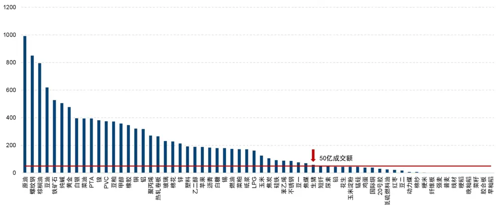
资料来源：Tinysoft，国信证券经济研究所整理

为平滑短期 Carry 收益的噪声，我们使用 Carry 收益的 10 日移动平均来表征主力合约与次主力合约的价格差异。如图 5 以及图 6 所示。

图 5展示的是豆油（Y）的 Carry 收益移动均线以及主力合约价格 K 线图。当 Carry收益移动均线处在 0 轴下方时，此时我们对主力合约开多仓。

反之，如图 6 所示，为焦炭（J）的 Carry 收益移动均线以及其主力合约价格 K线图。从图中可以看到，当 Carry 收益移动均线处在 0 轴上方时，我们应对主力合约开空仓。

图5：Carry策略开多仓示意图
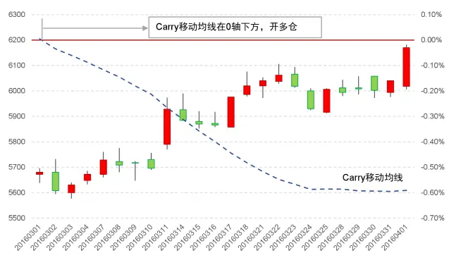
资料来源：Tinysoft，国信证券经济研究所整理

图6：Carry策略开空仓示意图
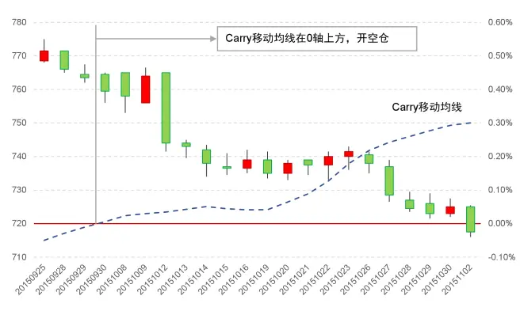
资料来源：Tinysoft，国信证券经济研究所整理

我们使用上述满足流动性条件的商品期货品种作为样本池。考察每个品种主力合约与次主力合约的 Carry 收益 10 日移动平均线作为开平仓信号，从而构建 Carry策略。

其中，移动平均线的计算公式如下：

$$
MA_{Carry}\;=\;\underset{i}{mean}\left(Carry_{i}\right)\;i\;=\;1,2,\cdots
$$

这里， $\mathrm{MA_{Carry}}$ 为 Carry 收益的移动平均值，Carryi为每日计算的该品种主力合约与次主力合约间的 Carry 收益。当 i 取值为 10 时，便得到 Carry 收益的 10 日移动平均值，每日滚动计算，即可得到 Carry 收益的 10 日移动平均线。

为对比不同 Carry 收益的大小与对应主力合约收益的关系，我们将截面下 Carry收益移动平均值从小到大分成 5档，考察每档收益表现情况，如图 7 以及图 8 所示。

图7：Carry分 5 档净值表现
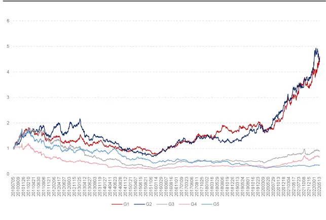
资料来源：Tinysoft，国信证券经济研究所整理

图8：Carry分 5 档年化夏普率
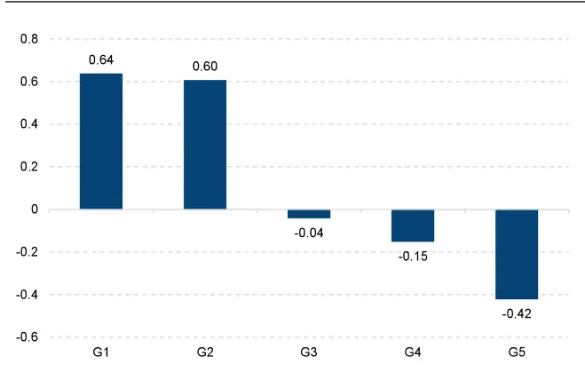
资料来源：Tinysoft，国信证券经济研究所整理

图 7展示的是将 Carry 分 5档净值表现，可以看到 Carry 最大一组（第 5组）在2011 年以来呈现出稳定向下的净值曲线，而 Carry 最小一组（第 1 组）在 2015年之前有所震荡，自 2015 年以来呈现出稳定增长的净值曲线。

图 8所展示的是将 Carry 分 5 档的年化夏普率，可以看到不同组别呈现出一定的线性性，随着 Carry 值的增加，年化夏普率逐渐降低。

因此，我们可以据此形成 Carry 基础策略：当主力合约与次主力合约的 Carry 收益 10 日移动平均线小于 0，且排名处在最小 20%组内，做多主力合约；当主力合约与次主力合约的 Carry 收益 10 日移动平均线大于 0，且排名处在最大 20%组内，做空主力合约。

图 9 展示的是 Carry 基础策略净值表现，以及表 2 列示了 Carry 基础策略分年度绩效统计。

从图 9可以看出，基于 Carry 的基础策略长期表现稳健，具有显著的正向期望收益。这表明，直接使用 Carry 理论对主力合约做开仓方向的判断可以长期获得较为稳定的正向收益。因此，可以作为基础策略，并且在此基础上进行改进和优化来增强基础策略的表现。

图9：Carry基础策略净值表现
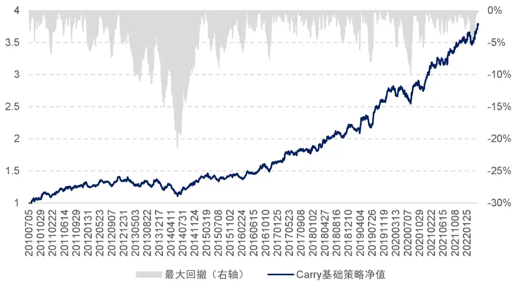
资料来源：Tinysoft，国信证券经济研究所整理

当然，我们也可以看出，策略的波动性较大，在 2013 年至 2014 年期间，策略出现较大回撤。以及图中 2019 年年底至 2020 年年初，也存在一波较大的回撤。具体在下方表 2中我们将该策略分年度的绩效进行统计。

表2：Carry基础策略绩效分年度统计

|  | 策略收益 | 最大回撤 | 夏普率 | 波动率 | Calmar | 月度胜率 |
| --- | --- | --- | --- | --- | --- | --- |
| 2010 | 14.18% | 4.89% | 1.43 | 9.90% | 2.90 | 83.33% |
| 2011 | 15.61% | 5.11% | 1.56 | 9.99% | 3.05 | 75.00% |
| 2012 | 2.33% | 7.24% | 0.31 | 7.62% | 0.32 | 58.33% |
| 2013 | -4.35% | 11.05% | -0.41 | 10.54% | -0.39 | 50.00% |
| 2014 | 4.06% | 14.93% | 0.33 | 12.29% | 0.27 | 66.67% |
| 2015 | 8.46% | 8.88% | 1.01 | 8.35% | 0.95 | 66.67% |
| 2016 | 12.24% | 7.56% | 1.33 | 9.23% | 1.62 | 75.00% |
| 2017 | 15.37% | 4.23% | 1.56 | 9.84% | 3.63 | 58.33% |
| 2018 | 16.10% | 4.89% | 1.75 | 9.23% | 3.29 | 66.67% |
| 2019 | 26.54% | 8.00% | 2.64 | 10.07% | 3.32 | 58.33% |
| 2020 | 7.02% | 9.73% | 0.72 | 9.70% | 0.72 | 33.33% |
| 2021 | 18.75% | 3.66% | 2.03 | 9.24% | 5.13 | 83.33% |
| 20220520 | 7.17% | 5.36% | 0.72 | 9.94% | 1.34 | 80.00% |
| 全样本期 | 11.20% | 21.45% | 1.15 | 9.72% | 0.52 | 65.10% |

资料来源：Tinysoft，国信证券经济研究所整理

表 2 所展示的是 Carry 基础策略绩效分年度统计情况。总体来看策略表现稳中有升，全样本期费后年化收益率为 11.2%，夏普率为 1.15，Calmar为 0.52。但是2014 年策略出现了一次较大的回撤，当年最大回撤为 14.93%。全样本期策略的最大回撤为 21.45%。

尽管 Carry 基础策略长期可以提供显著的正收益，但是我们仍希望对策略的稳定性进行提升。那么如何对 Carry 基础策略进行优化与改进呢？

接下来，我们将探讨以下问题：Carry 信号与动量信号共振或者背离时，是否具有不同的收益特征？成交量以及持仓量是否可以将 Carry 信号进行过滤？最后，我们将探讨止损条件的加入对于 Carry 策略的影响。

CTA策略中对于交易信号的过滤是必不可少的一环。往往单一信号会有阶段性不适应市场的情况。前面我们基于 Carry 基础策略可以看到，策略长期具有较强稳定性，但是短期波动有时较大。

尽管 Carry 基础策略的信号来源是主力合约以及次主力合约之间的期限结构，但是由于最终还是通过主力合约进行实现。因此，主力合约当前的价格特征也对策略表现构成影响。接下来，我们考察主力合约在不同动量特征下 Carry 基础策略的表现是否有所不同，从而进一步判断主力合约的动量特征是否能够决定策略的开仓权重。

## 动量信号过滤

为表征商品期货的动量特征，常见的判断方法通常是基于均线来进行的。这里我们使用当前收盘价与近 10 日收盘价移动平均线的位置关系来判断当前品种的动量特征。

如当前收盘价在近 10 日收盘价移动平均线之上，则我们认为当前品种趋势状态向上，反之，如当前收盘价在近 10 日收盘价移动平均线之下，则我们认为当前品种趋势状态向下。我们以此来判断品种的趋势状态。

图10：Carry为负且趋势向上
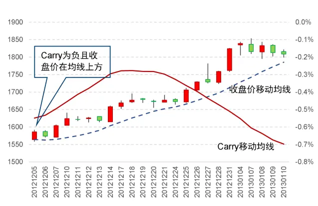
资料来源：Tinysoft，国信证券经济研究所整理

图11：Carry为正且趋势向下
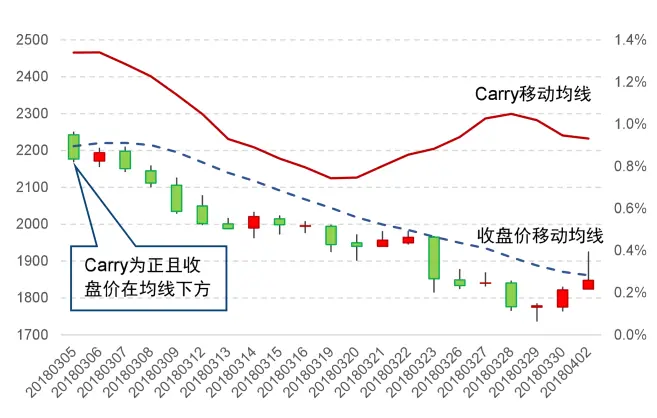
资料来源：Tinysoft，国信证券经济研究所整理

为更好的说明 Carry 收益方向与主力合约的趋势方向之间的关系，我们使用如下两个案例进行说明：当 Carry 收益为负时，我们倾向于做多主力合约，而当主力合约趋势向上时则产生 Carry 信号与动量信号共振如图 10 所示。当 Carry 收益为正时，由前面的探讨，我们应做空主力合约，而若此时主力合约的趋势方向向下，则与 Carry 信号方向产生共振，如图 11所示。

图 10 以及图 11展示了焦炭（J）所出现的上述两种情形。其中，图 10 所展示的是焦炭（J）合约 Carry 移动均线为负时，且此时合约收盘价在收盘价的移动均线上方，趋势方向与我们的开仓方向相一致。

图 11为焦炭（J）合约在 Carry 移动均线为正的情景，此时对应 Carry 基础策略的逻辑我们应该开空仓，同时收盘价在收盘价的移动均线下方，则合约的趋势方向与我们的期望开仓方向一致。

那么，这种 Carry 信号与合约趋势方向的共振是否对 Carry 的信号能产生过滤的效果呢？

如图 12 以及图 13 所示，我们分别测试了 Carry 收益移动平均线为正时，各个品种收盘价在收盘价移动均线上方以及下方时策略表现。同时，测试了 Carry 收益移动平均线为负时，收盘价位于移动均线两侧时的策略表现。

图12：Carry为正时不同趋势状态下策略表现
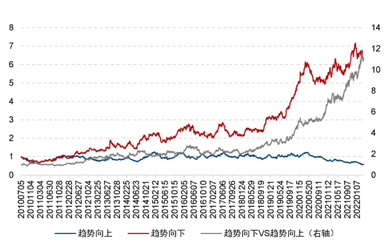
资料来源：Tinysoft，国信证券经济研究所整理

图13：Carry为负时不同趋势状态下策略表现
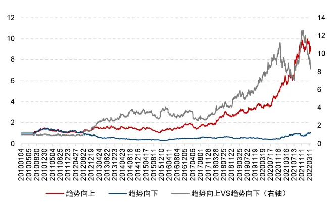
资料来源：Tinysoft，国信证券经济研究所整理

从图 12 可以看到当 Carry为正时，我们做空主力合约，而此时，如果主力合约的趋势状态方向向下则对于我们做空更有利。而反之，则表明当前虽然 Carry 基础策略发出信号，但是主力合约的趋势状态方向向上，与做空方向相反，则策略表现不佳。

图 13 所展示的是 Carry 为负时，主力合约在不同趋势状态下的策略表现，同样可以看出，由于 Carry 为负时，我们做多主力合约，因此当主力合约的趋势状态向上时，策略效果更好。

表3：Carry方向与合约趋势状态绩效统计

|  | 趋势状态 | 年化收益率 | 年化波动率 | 夏普率 |
| --- | --- | --- | --- | --- |
| Carry 为正 | 趋势向上 | -4.38% | 22.28% | -0.20 |
|  | 趋势向下 | 16.04% | 22.03% | 0.73 |
| Carry 为负 | 趋势向上 | 19.31% | 23.19% | 0.83 |
|  | 趋势向下 | 0.54% | 23.31% | 0.02 |

资料来源：Tinysoft，国信证券经济研究所整理

表 3 展示了在 Carry 呈现不同方向时，对应主力合约的不同趋势状态下，策略的绩效统计。可以看到在 Carry 为正（负）且趋势向下（上）时，为顺应趋势做空（多），此时收益显著为正。而其余情形下，策略呈现出震荡的情况，收益并不显著。

因此，我们可以得出：当 Carry 为正（负）且主力合约收盘价在均线下（上）方时，满仓开仓。

## 成交量以及持仓量信号过滤

通过前述我们结合 Carry 方向以及趋势状态对 Carry 策略的信号进行切分可以发现，当开仓方向顺应趋势时，策略表现较为突出。而当 Carry 策略信号与趋势状态相反时，就完全放弃交易从而空仓么？接下来，我们将结合 Carry 方向与趋势状态相反时的缩量与否这两种情况进行考察。

在进行市场是否缩量的判断中，我们依然使用上述对主力合约所处趋势状态的判断方法，即当成交量以及持仓量均在 10 日均线之下则为缩量状态，其余为非缩量状态。

图14：Carry方向与趋势方向相反时缩量与非缩量状态净值
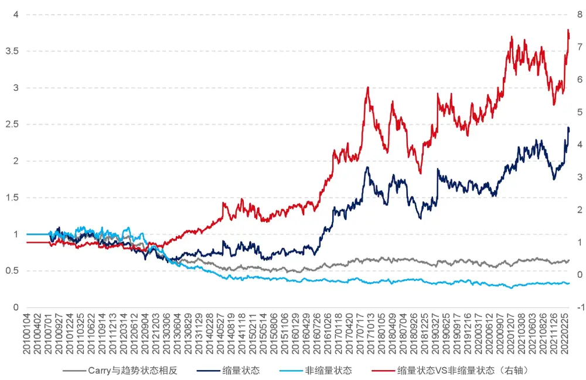
资料来源：Tinysoft，国信证券经济研究所整理

我们将 Carry 方向与趋势方向相反时的信号拆分成上述两种不同情形。经过测试可以得到策略在不同情形下的净值曲线，如图 14所示。

从图 14 中可以看出，在 Carry 方向与趋势方向相反时，当市场处在缩量状态下策略仍具有一定正向期望收益，而市场处在非缩量状态下策略收益持续为负。因此图 14 中缩量状态与非缩量状态的策略净值曲线形成了类似喇叭状。将 Carry 与趋势方向相反时的收益进行了拆分。

据此，我们可以看到，如果在 Carry 与趋势方向相反时就进行空仓，可能会放弃部分收益，但如果满仓去做这部分策略，收益的稳定性欠佳。因此，我们考虑当Carry 与趋势方向相反，且市场处在缩量状态时，半仓开仓。

在经过上述两步信号过滤之后，我们便可以得到经信号过滤后 Carry 策略，一方面，当 Carry 信号与合约动量方向发生共振时，可以对策略的表现起到增强的效果，但另一方面，当 Carry 信号与合约的动量方向相反时，我们可以通过市场是否处于缩量状态来进行判断，当此时市场处在缩量状态下策略依然具有较为显著的正收益，则此时我们可以开半仓进行操作。

图 15 展示的是经信号过滤后 Carry 策略净值表现，以及表 4 列示了经信号过滤后 Carry 策略分年度绩效统计。

图15：经信号过滤后 Carry策略净值表现
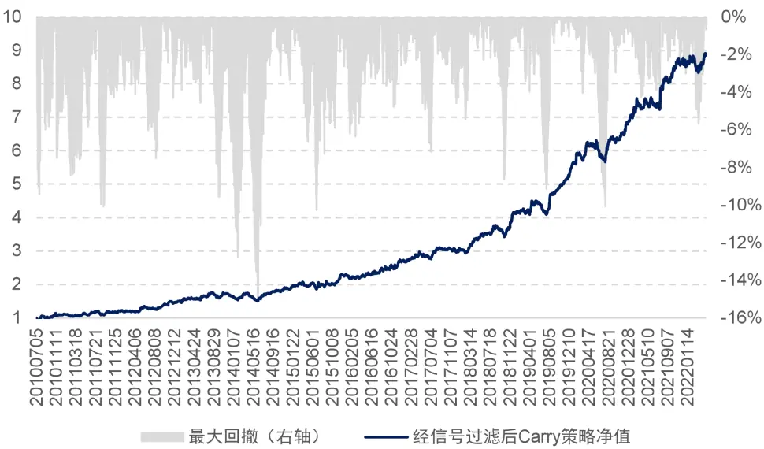
资料来源：Tinysoft，国信证券经济研究所整理

从图 15 可以看出，经信号过滤后 Carry策略相比前面 Carry 基础策略更为稳健，同时策略回撤有所降低。策略绩效的分年度统计如表 4所示。

表4：经信号过滤后 Carry策略绩效分年度统计

|  | 策略收益 | 最大回撤 | 夏普率 | 波动率 | Calmar | 月度胜率 |
| --- | --- | --- | --- | --- | --- | --- |
| 2010 | 10.89% | 9.42% | 0.73 | 14.93% | 1.16 | 91.67% |
| 2011 | 10.01% | 10.08% | 0.77 | 13.01% | 0.99 | 58.33% |
| 2012 | 22.03% | 7.51% | 1.92 | 11.50% | 2.93 | 66.67% |
| 2013 | 10.55% | 9.56% | 0.79 | 13.44% | 1.10 | 66.67% |
| 2014 | 12.14% | 14.19% | 0.91 | 13.32% | 0.86 | 58.33% |
| 2015 | 25.16% | 10.29% | 1.70 | 14.79% | 2.45 | 75.00% |
| 2016 | 17.14% | 4.89% | 1.23 | 13.96% | 3.51 | 83.33% |
| 2017 | 13.63% | 7.16% | 1.32 | 10.36% | 1.90 | 58.33% |
| 2018 | 33.88% | 8.64% | 2.91 | 11.64% | 3.92 | 66.67% |
| 2019 | 35.79% | 9.14% | 3.39 | 10.57% | 3.91 | 75.00% |
| 2020 | 23.43% | 10.09% | 2.06 | 11.40% | 2.32 | 58.33% |
| 2021 | 25.31% | 4.77% | 2.07 | 12.21% | 5.30 | 83.33% |
| 20220520 | 2.43% | 5.67% | 0.25 | 9.77% | 0.43 | 80.00% |
| 全样本期 | 19.02% | 15.03% | 1.51 | 12.58% | 1.27 | 70.47% |

资料来源：Tinysoft，国信证券经济研究所整理

表 4 所展示的是经信号过滤后 Carry 策略绩效分年度统计情况。全样本期费后年化收益率为 19.02%，夏普率由 1.15 提升至 1.51，Calmar 由 0.52 提升至 1.27。

可以看到在 Carry 基础策略的基础上对策略进行信号过滤能够显著提升策略的稳定性以及收益回撤比。

为防止系统性风险，以及策略对于市场环境阶段性的不适应情况。一套完整的CTA策略离不开信号处理，也离不开风险控制。接下来，我们尝试加入对前述模型的风险控制部分，引入一种止损方式：吊灯止损法。

吊灯止损法（Chandelier Stop）最早是由 Chuck LeBeau 提出，并由 AlexanderElder 发表在《come into my trading room》一书中。

在进行吊灯止损时，首先需确认最优价格（也是开仓后至当前时点最大浮盈）。具体公式如下：

$$
\begin{aligned}optHigh&=\max_{i}\left(high_{i}\right)\quad i=1,2,\ldots\\optLow&=\min_{i}\left(low_{i}\right)\quad i=1,2,\ldots\end{aligned}
$$

其中，optHigℎ以及 optLow 分别对应策略开多仓时以及开空仓时的最优价格，i为策略开仓后的 K 线根数。

这里的最优价格由开仓时候方向而定，当开多仓时，最优价格为每一根新 K 线的最高价中的最高者，即随着行情的运行不断记录运行过程中最高价的最大值。而当开空仓时，最优价格即为每一根新 K 线最低价中的最小者，即随着行情的运行不断记录运行过程中最低价的最小值。本文我们使用 15 分钟 K 线进行止损操作的计算。

当收盘价低于最优价格回落 N 个 ATR，则对当前仓位进行止损操作。反之亦然。
这里我们取 N 为 2.5.

与传统的止损方法不同的是，传统的亏损止损法是从开仓时便跟踪计算策略的浮盈浮亏，当策略出现浮亏大于一定阈值时止损清仓。而吊灯止损法具有锁定部分盈利的特性，因此也可称之为最大浮盈止损。

具体趋势的衰落以及止损示意图如图 16 以及图 17：

图16：多头仓位吊灯止损示意图
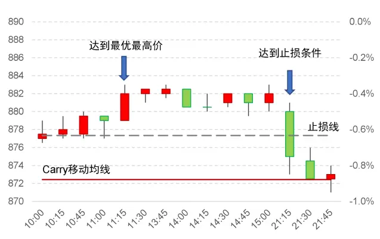
资料来源：Tinysoft，国信证券经济研究所整理

图17：空头仓位吊灯止损示意图
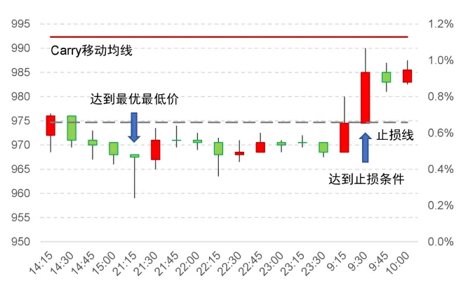
资料来源：Tinysoft，国信证券经济研究所整理

其中，图 16 为焦炭（J）合约在 2015 年 7 月 3 日的 K 线走势。我们从图中可以看到，Carry 的移动均线在 0 轴下方，因此，此时应对主力合约开多仓。在触发信号开仓后，我们依次记录每一根新 K 线的最高价，与开仓以来所有最高价的最大值为最优价格，当策略运行到 11:15 时，最优价格刷新到最高，随后当策略运行到 21:15 时，合约的收盘价突破了最优价格向下 2.5 倍 ATR，因此策略在此时则触发了吊灯止损的止损条件。

图 17 为焦煤（JM）合约在 2017 年 6月 14 日至 2017 年 6月 15 日的 K 线走势。其中，Carry 的移动均线在 0 轴上方，按照我们的开仓逻辑，此时应在主力合约上开空仓，随后开始记录每一根 K 线的最低价，将开仓以来所有最低价的最小值作为最优价格，当策略运行到 21:15 时，最优价格刷新新低。紧接着，在随后运行到次日的 9:30 时的收盘价突破了当前最优价格向上 2.5 倍 ATR，触发了吊灯止损的止损条件。

为探究吊灯止损实际发生的情况以及止损条件设置的合理性，我们考察每次触发吊灯止损信号后至假如没有设置止损条件自然平仓时点（止损后收益）的收益统计情况如表 5。

表5：吊灯止损次数与止损后收益

| 吊灯止损次数 | 发生比例 | 平均收益率 | 收益率中位数 | 收益率下四分位 | 收益率上四分位 | 收益胜率 | 收益率T值 |
| --- | --- | --- | --- | --- | --- | --- | --- |
| 1次 | 59.94% | 0.29% | 0.09% | -0.81% | 1.28% | 52.50% | 6.55 |
| 2次 | 12.35% | 0.03% | -0.44% | -2.56% | 2.10% | 43.29% | 0.13 |
| 3次 | 0.90% | -4.18% | -3.41% | -14.67% | 5.37% | 33.54% | -1.72 |

资料来源：Tinysoft，国信证券经济研究所整理

从表 5 可以看出，一笔交易中，如果出现吊灯止损次数越多，在触发止损条件后的收益率越低。甚至当极端情况触发了 3 次止损信号后，行情出现反转的概率较大。同时，还可以看出，当仅触发一次止损条件后，其止损后收益依然可能为正收益。

图18：加入止损后 Carry策略净值表现
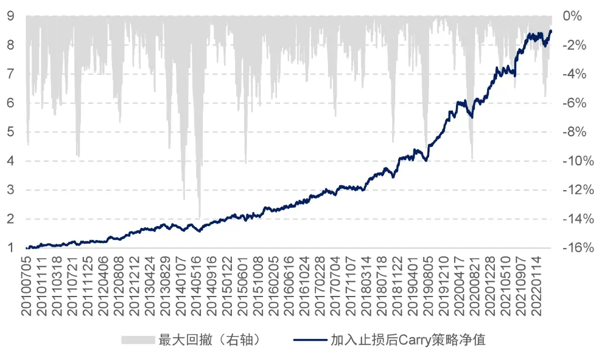
资料来源：Tinysoft，国信证券经济研究所整理

从前文对风险控制的探讨中可以发现，当止损信号第一次出现时，止损后收益胜率仅为 52.5%，但就此进行平仓很可能错过之后的部分收益。因此，我们选择将资金平均分成三等分，每一次触发吊灯止损信号减仓一份资金，当触发第三次止损信号时，策略进行平仓。这样同时也可以使得仓位的变化更平滑，有助于降低交易摩擦。

我们将止损条件加入到策略中，得到加入止损后 Carry 策略，图 18 展示的是加入止损后 Carry 策略净值表现，以及表 6 列示了加入止损后 Carry 策略分年度绩效统计。

表6：加入止损后 Carry策略绩效分年度统计

|  | 策略收益 | 最大回撤 | 夏普率 | 波动率 | Calmar | 月度胜率 |
| --- | --- | --- | --- | --- | --- | --- |
| 2010 | 12.35% | 8.88% | 0.83 | 14.84% | 1.39 | 91.67% |
| 2011 | 10.88% | 9.68% | 0.85 | 12.83% | 1.12 | 58.33% |
| 2012 | 25.65% | 7.31% | 2.28 | 11.23% | 3.51 | 66.67% |
| 2013 | 8.95% | 9.13% | 0.70 | 12.87% | 0.98 | 58.33% |
| 2014 | 13.06% | 13.34% | 1.01 | 12.91% | 0.98 | 58.33% |
| 2015 | 24.42% | 10.15% | 1.71 | 14.30% | 2.41 | 75.00% |
| 2016 | 16.12% | 4.49% | 1.20 | 13.47% | 3.59 | 75.00% |
| 2017 | 11.67% | 6.90% | 1.19 | 9.77% | 1.69 | 58.33% |
| 2018 | 30.76% | 8.68% | 2.70 | 11.37% | 3.54 | 66.67% |
| 2019 | 32.25% | 9.11% | 3.20 | 10.08% | 3.54 | 75.00% |
| 2020 | 22.73% | 9.84% | 2.05 | 11.08% | 2.31 | 58.33% |
| 2021 | 25.16% | 4.94% | 2.11 | 11.93% | 5.09 | 83.33% |
| 20220520 | 2.31% | 5.55% | 0.24 | 9.76% | 0.42 | 60.00% |
| 全样本期 | 18.58% | 13.89% | 1.52 | 12.23% | 1.34 | 68.46% |

资料来源：Tinysoft，国信证券经济研究所整理

表 6 所展示的是加入止损后 Carry 策略绩效分年度统计情况。全样本期费后年化收益率为 18.58%，Calmar 由 1.27 提升至 1.34。虽整体有小幅增益，但是止损条件的加入有助于防范策略的系统性风险。

## 杠杆设置

当一个策略被设计研发出来之后，我们便可以实时监控这个策略的表现以及各个风险属性，其中一个重要的风险指标为策略的年化波动率。不同的策略逻辑对应的波动率不同，因此会有高波动策略以及低波动策略。那么不同的策略在实盘使用中，我们也希望对不同策略进行资金管理。

具体做法是，我们在每个月月末回看策略整体的运行情况，计算过去一年该策略收益表现的波动率，将目标波动率设置为 15%（取决于对于策略预期的杠杆率水平，通常维持在 2倍杠杆左右），那么波动率调整系数的计算公式可以表示为：

$$
Mul_{vol}\;=\;\frac{15\%}{Vol}
$$

其中， $\mathrm{Mul}_{\mathrm{vol}}$ 为经已实现波动率调整的系数，Vol为策略在过去一年中的已实现波动率。通过对策略表现波动率的调整，可以使得策略在不同市场环境下运行的整体风险趋于一致。

出于实际使用情况考虑，我们设置最大杠杆率为 4 倍杠杆。因此当 Lev 的绝对值大于 4 时，我们截断为 4。

在经过已实现波动率调整后，基于 Carry 的商品期货交易策略平均杠杆率的时序变化图如图 19 所示。

图19：已实现波动率调整后策略杠杆变化图
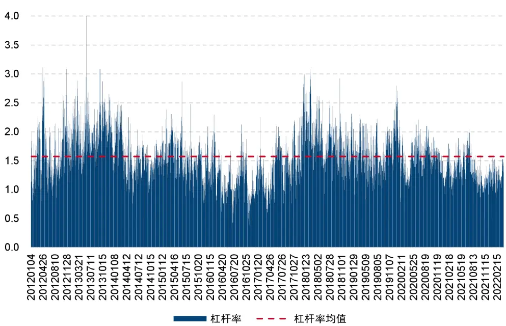
资料来源：Tinysoft，国信证券经济研究所整理

从图 19 中看到，策略平均杠杆率为 1.57 倍，这个也是基于 Carry 的商品期货交易策略的最终杠杆率变化水平。在 2012-2013 年间策略的历史杠杆率达到峰值，之后在 2016 年策略杠杆率到达低谷，之后，在 2018 年间，策略的杠杆率再次冲高。近期杠杆率有所回落，整体处在历史均值下方。

至此，策略的全部逻辑已经探讨完毕，策略的最终表现以及相关特性将在下面进行详细阐述与测试。

## 基于 Carry 的商品期货交易策略

我们从 Carry 策略的基础原理进行了讨论，同时对 Carry 基础策略进行到了测试和优化讨论，在进行了信号过滤以及止损设置后，经过已实现波动率调整，尽可能拉平每年策略的目标波动，最终我们构建了基于 Carry 的商品期货交易策略。具体的策略构建流程如下：

## 投资标的：

过去半年中日均成交额超过 50 亿元的商品期货全品种的主力合约。

开仓信号：

每日计算 Carry 的 10 日均值

多头：Carry的 10 日均值小于 0 且排名处在最小 20%组内

空头：Carry 的 10 日均值大于 0 且排名处在最大 20%组内。

## 动量及成交、持仓量调整：

开仓信号为多头（空头）信号且收盘价在 10 日均线上方（下方）：满仓开仓

开仓信号为多头（空头）信号且收盘价在 10 日均线下方（上方）且成交、持仓量均在 10 日均线下方：半仓开仓

## 减仓信号：

最优价格回撤 2.5 倍 ATR（吊灯止损法：当开多仓时，最优价格为每一根新 K 线的最高价中的最高者，即随着行情的运行不断记录运行过程中最高价的最大值。而当开空仓时，最优价格即为每一根新 K 线最低价中的最小者，即随着行情的运行不断记录运行过程中最低价的最小值。当收盘价低于最优价格回落 2.5 个 ATR，则对当前仓位进行止损操作，这里我们使用 15 分钟 K 线进行止损操作的计算）。出现减仓信号减开仓仓位 1/3，出现第三次减仓信号时平仓。

## 杠杆率调整：

ATR调整：海龟资金管理法（1 单位 ATR 的波动对应策略整体资金规模的 0.5%，详见附录 2—海龟资金管理法）

已实现波动调整：以过去一年策略波动率为基准设置目标年化波动 15%

最终杠杆率：ATR调整杠杆*已实现波动调整杠杆，最高 4倍杠杆截断。

## 资金分配：

满足开仓条件品种等权分配资金。

## 成交价格：

信号触发后 5分钟 VWAP。

## 交易成本：

交易手续费 0.3%%，冲击成本 1%%。

综上所述，在经过信号的过滤、止损设置后，便形成了基于 Carry 的商品期货交易策略，至此，回顾策略的构建流程用一个流程图可表示如图 20 所示：

图20：基于Carry的商品期货交易策略流程图
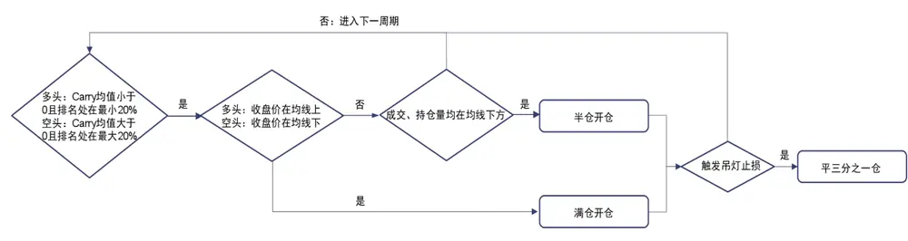
资料来源：国信证券经济研究所整理

按照上述流程构建的基于 Carry 的商品期货交易策略历史表现稳定且具有较高收益率，同时回撤可控。具体走势如图 21 所示：

图21：基于 Carry的商品期货交易策略净值
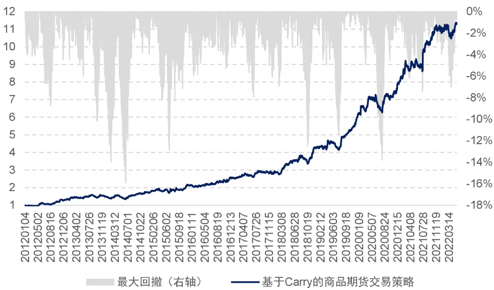
资料来源：Tinysoft，国信证券经济研究所整理

2012 年以来，基于 Carry 的商品期货交易策略费后年化收益率为 25.96%，夏普率为 1.73，Calmar 比率为 1.63。可以看出策略表现非常稳健。其中，策略的分年度收益表现如表 7：

从表 7 可以看出，策略表现非常稳健。同时，与前文基础策略相比，基于 Carry的商品期货交易策略全样本期年化收益率以及策略的整体稳定度都得到了进一步的提升。

表7：基于 Carry的商品期货交易策略绩效分年度统计

|  | 策略收益 | 最大回撤 | 夏普率 | 波动率 | Calmar | 月度胜率 |
| --- | --- | --- | --- | --- | --- | --- |
| 2012 | 34.47% | 8.78% | 2.46 | 14.00% | 3.93 | 66.67% |
| 2013 | 9.99% | 10.17% | 0.68 | 14.78% | 0.98 | 66.67% |
| 2014 | 15.09% | 15.11% | 1.02 | 14.74% | 1.00 | 58.33% |
| 2015 | 27.35% | 12.88% | 1.59 | 17.25% | 2.12 | 75.00% |
| 2016 | 18.12% | 5.29% | 1.22 | 14.91% | 3.43 | 83.33% |
| 2017 | 14.38% | 7.98% | 1.18 | 12.17% | 1.80 | 58.33% |
| 2018 | 44.71% | 12.51% | 2.71 | 16.49% | 3.57 | 66.67% |
| 2019 | 44.70% | 11.49% | 3.43 | 13.03% | 3.89 | 75.00% |
| 2020 | 31.31% | 13.79% | 2.04 | 15.36% | 2.27 | 58.33% |
| 2021 | 36.43% | 7.44% | 2.09 | 17.39% | 4.89 | 83.33% |
| 20220520 | 2.69% | 7.06% | 0.22 | 12.35% | 0.38 | 60.00% |
| 全样本期 | 25.96% | 15.90% | 1.73 | 14.99% | 1.63 | 68.80% |

资料来源：Tinysoft，国信证券经济研究所整理

由于我们控制目标年化波动率在 15%，因此实现出来全样本期的年化波动率为14.99%，与期望的目标波动率比较接近。

上述基于 Carry 的商品期货交易策略在进行回测时使用的交易成本为 1.3%%，是由交易手续费 0.3%%以及冲击成本 1%%构成。交易价格为策略信号发出后 5 分钟的 VWAP均价，我们测试了不同冲击成本下策略的收益表现如图 22 所示：

图22：不同交易成本下策略净值
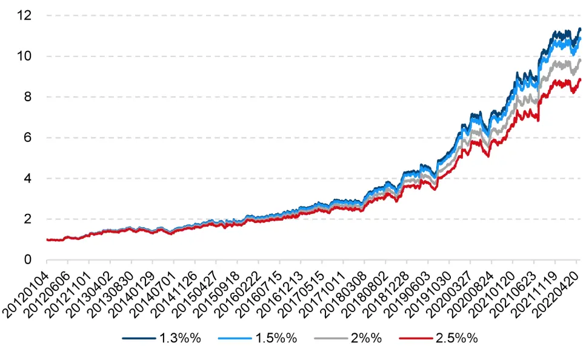
资料来源：Tinysoft，国信证券经济研究所整理

从图 22 中的不同交易成本下曲线可以看到，基于 Carry 的商品期货交易策略对于交易费用不敏感。具体各个交易成本下策略绩效统计如表 8。

从表 8 可以看出策略对于交易成本的变化不敏感，随着交易成本的增加策略年化收益率变化缓慢。当交易成本从 1.3%%增长至 2.5%%后，策略的年化收益率从25.96%降到 23.03%，夏普率仅从 1.73 下降到 1.54。

表8：不同交易成本下策略绩效统计

| 年化收益率 | 夏普率 | Calmar |
| --- | --- | --- |
| 1.3%% | 25.96% 1.73 | 1.63 |
| 1.5%% | 25.47% 1.70 | 1.57 |
| 2%% | 24.24% 1.62 | 1.44 |
| 2.5%% | 23.03% 1.54 | 1.31 |

资料来源：Tinysoft，国信证券经济研究所整理

综上，可以看到，交易成本的变化对策略净值的走势影响不大。基于 Carry 的商品期货交易策略在不同的交易成本下均可实现长期稳定的表现。

## 总结

## Carry 相关理论

我们从 Carry 收益的分解以及相关 Carry 收益的理论研究出发，通过 Carry 收益公式、持仓成本理论以及对冲压力假说等方面，阐述了投资者在不同期限结构下应做的交易决策：当主力合约价格低于次主力合约，做多主力合约，反之，当主力合约价格高于次主力合约，此时应做空主力合约。我们将 Carry 收益由高到低排序分为5档进行测试，发现Carry收益与策略夏普率呈现单调的负相关性。Carry收益越高策略夏普率越低，反之 Carry 收益越低策略夏普率越高。因此我们使用Carry 收益最低一组作为多头组合，Carry收益最高一组作为空头组合，并以此形成 Carry 基础策略。Carry 基础策略年化收益率 11.2%，夏普率为 1.15。体现出

Carry 收益逻辑的有效性。

单纯使用 Carry 收益作为信号进行交易则会忽视合约在价格的微观结构上的背离。经研究，在 Carry 基础策略的基础之上，我们发现开仓方向与动量效应产生共振时，策略收益显著，而当开仓方向与动量反向时，策略收益较弱。但此时可以通过成交、持仓量是否缩量来进行判断，当市场处于缩量时，策略依然能够产生正向期望。因此，在开仓方向与动量效应产生共振时，可满仓进行开仓，而当策略的开仓方向与动量效应出现反向，且市场处于缩量状态时，可半仓进行开仓。通过信号过滤后 Carry 基础策略的收益稳定性得到显著提升，Calmar 由 0.52 提升至 1.27，并且可以规避掉如 2013-2014 年 Carry 信号的阶段性回撤风险。

为防止策略出现系统性风险，同时出于对策略完整性的考量，我们加入了吊灯止损。吊灯止损是 CTA策略中常见的止损方法，当合约价格从最优价格回落 2.5 倍ATR时，进行止损。

## 基于 Carry 的商品期货交易策略

我们以 Carry 基础策略为基础，通过加入信号过滤、风险控制以及杠杆设置等细节的处理，最终形成了基于 Carry 的商品期货交易策略。其中，策略费后年化收益率为 25.96%，夏普率为 1.73，Calmar比率为 1.63。并且策略对于交易成本不敏感。

## 参考文献

Brennan M J . The Price of Convenience and the Valuation of Commodity Contingent Claims[J]. stochastic models & option values, 1991.

Cootner Paul. Returns to Speculators: Telser Versus Keynes[J]. Journal of Political Economy, 1960, 68(4): 396-404

Gorton G , Hayashi F , Rouwenhorst K . The Fundamentals of Commodity Futures Returns[J]. Yale School of Management Working Papers, 2008, 17(1):35-105.

Gorton G , Rouwenhorst K G . Facts and Fantasies about Commodity Futures[J]. Financial Analysts Journal, 2006.

- Koijen R , Moskowitz T J , Pedersen L H , et al. Carry[J]. Journal of financial economics, 2018, 127(2):197-225.

Kaldor N . Speculation and Economic Stability[J]. Review of Economic Studies, 1939, 7(1):1-27.

## 附录 1—数据准备

在本节将介绍我们对数据的准备以及处理方法。在 CTA策略的测试中，数据的处理主要涉及以下几个问题：主力合约如何确定，展期价格跳空如何处理，不同合约数据怎么拼接以及发单价格如何确定。下面我们将针对这些问题进行分析和解决。

## 主力合约的确定

在确定主力合约时，我们使用成交量以及持仓量均达到最大的合约作为主力合约。这其中，股指期货在合约到期月份的第三个周五进行交割，国债期货在合约到期月份的第二个周五进行交割，因此，如果上述品种在交割前还没有能够新的主力合约可以确定，那么需要在交割日前一个交易日强制切换至当时的次主力合约。同时，主力合约不可逆，一经确定不可反复。

## 合约切换的思考

在合约进行切换时，可能会出现前后两个主力合约的价格无法进行无缝对接的情况。如图 23以及图 24 所示：

图23：RB1901 切换 RB1905 价格跳空

资料来源：Tinysoft，国信证券经济研究所整理

图24：RB1901 切换 RB1905 价格复权

资料来源：Tinysoft，国信证券经济研究所整理

图 23 为 RB1901 合约切换到 RB1905 合约的价格序列图，其中切换时点为 2018年 12 月 3 日。从图 22 可以看出，在切换的时间点出现了一个价格的大幅跳空低开的情况，如果认为这是行情的自然状态，则可能导致对行情判断的失误。从而导致策略判断失真。

那么在切换合约时，通常有两种做法，一种是根据新主力合约之前的业绩进行新交易信号的判断，以 RB 合约为例，当合约从 RB1901 切换到 RB1905 时，之后的策略计算都按照 RB 的历史数据进行计算，这样做的好处是，策略信号来源于该标的且作用在该标的。而缺点是有些合约虽然切换到了新的主力合约，但是由于切换前该新合约交易并不活跃，加之有些策略需要使用大量历史数据进行处理和分析，因此可能导致信号失真，或者价格波动较大的情况。

还有一种做法是将价格数据进行复权。复权分为前复权以及后复权，如果向前复权的话，则当前的合约价格为真实价格，之前的合约价格数据为复权后的价格。这样做的好处是可以使用当前的真实合约价格来确认开仓数量，而缺点则是历史数据会随着新数据的更新而出现变化，尽管变化较小，但随着时间的推移以及浮点数的保存问题，有可能会出现新计算出来的策略开仓时点或者策略曲线与之前计算的无法完全匹配的情况。那么会在策略归因时，造成一定的困难。

我们所使用的方法是进行向后复权，这样做的前提是需要选择一个策略开始计算的日期为基期，一旦基期确定下来，后面行情如何更新都对历史数据造成改变。当然，如果基期发生了变化，则有可能导致历史数据的变化。由于 2010 年以前上市的期货品种较少，且活跃度不高。因此我们所使用的基期则定为 2010 年 1月 1日。

复权的具体做法为：在每次展期的时候，计算新主力合约以及旧主力合约的价格跳空比，以此作为当日之后新主力合约价格的复权因子。该复权因子的具体计算公式为：

$$
\mathrm{AdjFactor_{i}=AdjFactor_{i-1}*\frac{close_{i-1,old}}{close_{i-1,new}}}
$$

其中， $\mathrm{AdjFactor_{i-1}}$ 为上一期复权因子， $\mathsf{Close}_{\mathrm{i-1,old}}$ 为旧主力合约展期前一日收盘价， $\mathsf{Close}_{\mathrm{i-1,new}}$ 为新主力合约展期前一日收盘价。这样计算出来的复权因子AdjFactori为当期复权因子。其中，基期的复权因子为 1。计算好复权因子之后，新的主力合约的开盘价、最高价、最低价以及收盘价都乘以当期的复权因子，即为复权价格。

这样使用复权价格可以很好地避免因切换合约带来的价格跳空的影响，具体在计算收益率时，如果直接使用原始价格进行计算：

$$
\mathrm{Return_{i}}=\frac{\mathrm{close_{i,new}}}{\mathrm{close_{i-1,old}}}-1
$$

当新主力合约价格与旧主力合约价格出现跳空时，该收益率会出现异常值，而使用复权因子之后收益率的计算变为：

$$
\begin{aligned}Return_{i}&=\frac{AdjFactor_{i}*close_{i,new}}{AdjFactor_{i-1}*close_{i-1,old}}-1\\&=\frac{AdjFactor_{i-1}*\frac{Close_{i-1,old}}{Close_{i-1,new}}*close_{i,new}}{AdjFactor_{i-1}*Close_{i-1,old}}-1\\&=\frac{Close_{i,new}}{Close_{i-1,old}}-1\end{aligned}
$$

可以看到，这样计算出来的收益率即为实际收益率，进而避免了因合约切换导致的策略信号漂移或者收益率无法计算的情况。

如图 24 展示的是经复权之后 RB1901 合约切换到 RB1905 合约的情况，可以看到，图 23 跳空的部分变得更加连续了。因此，通过对主力连续不同合约的价格进行复权处理，我们便可以得到连续无异常跳空的行情时间序列数据。

## 数据处理与拼接

本节将从两个维度分析数据处理中的相关问题。第一，当策略只包含股指期货的时候，数据的处理。其次，当策略需要做商品期货全品种时，数据处理的问题。

由于股指期货的三个品种的交易时间都是同步的，因此不存在不同合约时间对齐的问题。但是需要确定策略执行的收益率的计算方法，我们考虑实盘交易时在信号触发后的成交的价格为 5分钟的 VWAP，具体可以根据产品规模而定。同时，交易时间越长对策略的时效性要求就越高，需要策略信号的衰减周期与交易时长相匹配。具体做法为计算策略信号触发后 5 分钟的成交额除以经合约乘数调整的成交量：

$$
\mathrm{VWAP}_{5}=\frac{\sum_{\mathrm{i}=1}^{5}\mathrm{Amount}_{\mathrm{i}}}{\sum_{\mathrm{i}=1}^{5}\mathrm{Vol}_{\mathrm{i}}*\mathrm{Multi}}
$$

其中，Amount 为第 i 分钟的成交额， $\mathrm{Vol_{i}}$ 为第 i 分钟的成交量, Multi 为该品种的合约乘数。

当策略需要加入全部期货品种的时候，则需要考虑全品种的交易时间对齐的问题。部分商品期货有夜盘，部分商品期货没有。此外，所有商品期货的品种在上午 10点 15 分至 10 点 30 分期间为暂停交易时段。因此，进行时间对齐时非交易时段行情数据的处理就是一个需要解决的问题。我们的处理方式为非交易时间段行情序列设置为空值，信号延续交易时段信号，同时策略收益率设置为零。

当合约尚未上市时，将行情序列设置为空值，且不允许发出交易信号，收益率也设置为空值。

## 附录 2—海龟资金管理法

策略中的风险主要由两部分组成，一部分是策略的潜在亏损，一部分是策略的波动。接下来，我们主要围绕对策略波动进行风控的方法进行介绍。

为使得策略在所有不同品种上面的波动幅度可控，我们需要根据不同品种的波动幅度进行交易量的调整。这里所说的波动幅度通常使用真实波动幅度均值（Average True Range，ATR）来度量。其中，ATR 指标的具体计算公式如下所示：

$$
\begin{aligned}TR\;=\;\mathsf{Max}\left[(high-low),abs(high&=preclose),abs(low-preclose)\right]\\ART\;=\;\frac{1}{n}\sum_{i=1}^{n}TR_{i}\end{aligned}
$$

其中， $TR_{i}$ 为 True Range，用于衡量每日的波动幅度，ATR 则是 $\cdot TR_{i}$ 的移动平均值。

通过 ATR 指标来调整品种杠杆的基本原理是，将波动较高的品种赋予相对较低的杠杆，将波动较低的品种赋予相对较高的杠杆，因此杠杆率与品种的 ATR 呈反比关系。

更进一步地，对风险的控制要求我们知道 1 单位 ATR的波动对应我们账户资金波动的多少，这里假设我们要让 1单位 ATR的波动正好等于我们策略整体资金规模的 0.5%。假设我们使用的是一个单位账户，即总资金规模为 1。那么，我们将0.5%除以对应的 1 单位 ATR 则为我们实际应开出的合约数量。即此刻交易应该开出的合约手数。

如果我们需要计算的是一个杠杆率即当前开仓手数占整体资金规模可开仓手数的比例，那么需要除以满仓状态下可以开出的总合约数量，具体计算公式为：

$$
Pos_{ATR}\;=\;\frac{0.5\%}{ATR}
$$

$$
\mathrm{Pos}={\frac{1}{\mathrm{Close}}}
$$

$$
\begin{aligned}Lev_{ATR}\;&=\;\frac{Pos_{ATR}}{Pos}\\&=\;\frac{0.5\%}{ATR}\;*\;Close\end{aligned}
$$

其中， $Pos_{ATR}$ 为 1 单位 ATR 对应资金规模 0.5%波动的应开手数, Pos 为全部资金对应满仓可开手数，Close 为收盘价， $Lev_{ATR}$ 为应开手数除以满仓手数的开仓杠杆率。由上面算法计算出来的开仓杠杆率具有根据 ATR 波动调整杠杆率大小的特性，当一个品种的日均波动较大时，我们倾向于给予该品种较低的杠杆，而反之，如果一个品种的日均波动较小，我们则可以给该品种较高的杠杆。从风险控制的角度如果一个品种的波动较大，给予较小杠杆也是出于对资金安全的考虑，防止由于较大的波动幅度而触发穿仓风险。

## 风险提示

市场环境变动风险

市场环境变动可能导致策略失效。

模型失效风险

模型样本外表现可能与样本内表现存在差异。

## 免责声明

分析师声明

作者保证报告所采用的数据均来自合规渠道；分析逻辑基于作者的职业理解，通过合理判断并得出结论，力求独立、客观、公正，结论不受任何第三方的授意或影响；作者在过去、现在或未来未就其研究报告所提供的具体建议或所表述的意见直接或间接收取任何报酬，特此声明。

## 国信证券投资评级

| 类别 | 级别 | 说明 |
| --- | --- | --- |
| 股票投资评级 | 买入 | 股价表现优于市场指数20%以上 |
|  | 增持 | 股价表现优于市场指数10%-20%之间 |
|  | 中性 | 股价表现介于市场指数±10%之间 |
|  | 卖出 | 股价表现弱于市场指数10%以上 |
| 行业投资评级 | 超配 | 行业指数表现优于市场指数10%以上 |
|  | 中性 | 行业指数表现介于市场指数±10%之间 |
|  | 低配 | 行业指数表现弱于市场指数10%以上 |

## 重要声明

本报告由国信证券股份有限公司（已具备中国证监会许可的证券投资咨询业务资格）制作；报告版权归国信证券股份有限公司（以下简称“我公司”）所有。 ，本公司不会因接收人收

到本报告而视其为客户。未经书面许可，任何机构和个人不得以任何形式使用、复制或传播。任何有关本报告的摘要或节选都不代表本报告正式完整的观点，一切须以我公司向客户发布的本报告完整版本为准。

本报告基于已公开的资料或信息撰写，但我公司不保证该资料及信息的完整性、准确性。本报告所载的信息、资料、建议及推测仅反映我公司于本报告公开发布当日的判断，在不同时期，我公司可能撰写并发布与本报告所载资料、建议及推测不一致的报告。我公司不保证本报告所含信息及资料处于最新状态；我公司可能随时补充、更新和修订有关信息及资料，投资者应当自行关注相关更新和修订内容。我公司或关联机构可能会持有本报告中所提到的公司所发行的证券并进行交易，还可能为这些公司提供或争取提供投资银行、财务顾问或金融产品等相关服务。本公司的资产管理部门、自营部门以及其他投资业务部门可能独立做出与本报告中意见或建议不一致的投资决策。

本报告仅供参考之用，不构成出售或购买证券或其他投资标的要约或邀请。在任何情况下，本报告中的信息和意见均不构成对任何个人的投资建议。任何形式的分享证券投资收益或者分担证券投资损失的书面或口头承诺均为无效。投资者应结合自己的投资目标和财务状况自行判断是否采用本报告所载内容和信息并自行承担风险，我公司及雇员对投资者使用本报告及其内容而造成的一切后果不承担任何法律责任。

## 证券投资咨询业务的说明

本公司具备中国证监会核准的证券投资咨询业务资格。证券投资咨询，是指从事证券投资咨询业务的机构及其投资咨询人员以下列形式为证券投资人或者客户提供证券投资分析、预测或者建议等直接或者间接有偿咨询服务的活动：接受投资人或者客户委托，提供证券投资咨询服务；举办有关证券投资咨询的讲座、报告会、分析会等；在报刊上发表证券投资咨询的文章、评论、报告，以及通过电台、电视台等公众传播媒体提供证券投资咨询服务；通过电话、传真、电脑网络等电信设备系统，提供证券投资咨询服务；中国证监会认定的其他形式。

发布证券研究报告是证券投资咨询业务的一种基本形式，指证券公司、证券投资咨询机构对证券及证券相关产品的价值、市场走势或者相关影响因素进行分析，形成证券估值、投资评级等投资分析意见，制作证券研究报告，并向客户发布的行为。

## 国信证券经济研究所

深圳深圳市福田区福华一路 125 号国信金融大厦 36 层邮编：518046 总机：0755-82130833

上海
上海浦东民生路 1199 弄证大五道口广场 1 号楼 12 层
邮编：200135
北京
北京西城区金融大街兴盛街 6 号国信证券 9 层
邮编：100032