# 金融工程专题研究

# CTA系列专题之四：基于道氏理论的商品期货交易策略

## 核心观点

我们从CharlesH.Dow的传奇人生以及道氏理论的历史出发，对道氏理论以及道氏理论中对趋势的描述进行了简要介绍。

MACD（Moving Average Convergence/Divergence）指标可以用来表征市场运行的方向，是动量类指标的一种。其基本原理是使用均线之间的距离对噪音进行过滤，从而对市场趋势进行初步判断。当MACD上穿信号线累计距离突破阈值后，市场可被初步判断为上升趋势，当MACD下穿信号线累计距离突破阈值后，市场可被初步判断为下降趋势。

如果只使用MACD作为信号进行交易则会由于信号的迟滞，导致在趋势发生逆转时判断受到局限。借鉴道氏理论对趋势的描述，在对市场趋势进行初步判断后，对拐点进行修正。策略相对只使用MACD信号进行趋势判断进行交易在稳定性上具有显著提升。

我们对于市场趋势的初步判断长期可获取正收益，在加入了拐点修正后策略的稳定性得到了显著提升，但我们还需要对策略的开仓时点进行检验与佐证，来平滑策略的收益曲线。通过对高低点的定量刻画，借鉴道氏理论，从而形成道氏趋势，将拐点修正后的市场趋势与道氏趋势相结合，当趋势共振时对策略进行开仓操作，策略表现可以得到进一步提升。

结合MACD对市场趋势初步判断后与道氏理论相融合对拐点进行修正，最终配合道氏趋势，形成基于道氏理论的商品期货交易策略。策略表现稳定且具有较高收益率，2012年以来该策略净值稳定攀升，同时回撤可控。基于道氏理论的商品期货交易策略费后年化收益率为21.74%，夏普率为1.42，Calmar 为 2.2。

## CTA复合策略

我们将基于道氏理论的商品期货交易策略与此前发布的基于开盘动量效应的股指期货交易策略、基于Bollinger通道的商品期货交易策略以及基于Carry的商品期货交易策略等权复合，构造为CTA复合策略。复合策略的年化费后收益率为 22.42%，夏普率为 2.61，Calmar为 3.56，且每年 Calmar均大于1。

风险提示：市场环境变动风险，模型失效风险。

## 金融工程专题报告

## 金融工程·数量化投资

证券分析师：张欣慰

021-60933159

证券分析师：刘凯

zhangxinwei1@guosen.com.cn

010-88005479

S0980520060001

liukai6@guosen.com.cn

S0980522040002

## 相关研究报告

《CTA系列专题之三：基于 Carry的商品期货交易策略》——2022-5-24

《CTA系列专题之二：基于 Bollinger 通道的商品期货交易策略》2021-10-13

《CTA系列专题之一：基于开盘动量效应的股指期货交易策略》2021-05-13

技术分析流派中，道氏理论的历史久远，声名远扬。在CharlesH.Dow创立道氏理论之后，发展至今已有100多年的历史。无论是学者还是投资者都持续的进行着总结与补充，道氏理论也逐步在被丰富和完善。道氏理论是趋势跟随类策略的一种，国信金工团队基于股指期货市场的开盘动量效应提出的《基于开盘动量效应的股指期货交易策略》便借鉴了这一思想。本文将系统地梳理道氏理论对于趋势的描述及刻画，对其中偏定性或较模糊的定义，尽可能通过简洁清晰的度量方法，构建出基于道氏理论的商品期货交易策略。

## Charles H. Dow

## Charles H. Dow

Charles H. Dow（Charles Henry Dow）在金融领域功勋卓越。Dow 最初的梦想是想做一名出色的记者，也曾在报社工作。后因机缘与 Edward Jones 相识，两个年轻人一起创立了道琼斯公司。起初在每天下午为华尔街的投资者提供两页纸的金融新闻摘要，他们将之命名为“the Customers’ Afternoon Letter”，后来慢慢壮大，道琼斯公司至今仍在金融市场享有巨大影响力。

Dow 与 Jones 还曾想到，要用一些比较有代表性的股票走势来表征市场，于是他们于 1884 年 7 月 3日首次提出了用了 11个上市公司（9个铁路公司，2 个非铁路公司）将股票价格简单求和得到了道琼斯指数，即股票市场的平均价格指数。虽然现在股票市场的指数日益增多，但他们是股票指数的鼻祖。

1889 年，道琼斯公司就有 50 名左右的员工，于是他们认为是时候将“theCustomers’ Afternoon Letter”转为一份正式的报纸了。于是，1889 年的 7 月 8 日Dow 创办的《华尔街日报》诞生了，Dow 主要负责编辑工作，而 Jones 则负责一些管理工作。

《华尔街日报》很快成为投资者重要的参考信息来源，值得一提的是，Dow 也会将他对股票投资的思想和理论发表在了《华尔街日报》上。

## 道氏理论历史

道氏理论是基于价格变动的技术分析方法之一，他所不同于其他技术分析流派的地方在于，道氏理论不是简单的对价格进行定量分析，这里面蕴含了 Dow 的方法论和他对市场的思考。

Dow 于 1851 年至 1902 年陆续在《华尔街日报》中登载他对市场的理解以及相关思想。他并没有系统的进行过整合，他的思想像珍珠一样散落在《华尔街日报》的历史期刊中。

于 1903 年，Samuel Armstrong Nelson 首次将 Dow 发表过的文章进行整理，并出版了《The ABC of Stock Speculation》，其中大部分章节都是 Dow 的文章。这也是首个在书中提到“Dow’s Theory”这一说法。随后 William Peter Hamilton 对Dow 的思想进行了系统的整理，出版了《The Stock Market Barometer》，并正式命名 Dow 的思想为道氏理论（The Dow Theory）。

后续人们不断进行总结和提炼，其中比较有代表性的文章和书籍为 Robert Rhea于 1932 年发表的《The Dow Theory》以及 Richard Russell 于 1961 年发表的《TheDow Theory Today》。

下面我们将对道氏理论进行回顾，对核心问题进行梳理和提炼。

道氏理论基本假设及定义

道氏理论内涵较多，主要包括了 Dow 对于市场的理解以及对股票价格运行模式的思考。本文我们将重点关注在 Dow 对市场趋势的描述中。

Richard Russell 于 1961 年发表的《The Dow Theory Today》一书中，第二章：“What Dow Wrought”中整理了道氏理论的 10 个关键要素，其中第 5 条阐述了对市场趋势的定义：如果出现连续的极值点（低点以及高点）上升，那么市场将处于上涨趋势中。反之，出现连续的极值点（低点以及高点）下降，那么市场将处于下跌趋势中。国信金工团队于 2021 年 5 月 13 日发布的《基于开盘动量效应的股指期货交易策略》，这里面我们定义开盘上涨或下跌的趋势，便是遵循了这一思想。

图1：铁矿石 K线及较大周期极值点
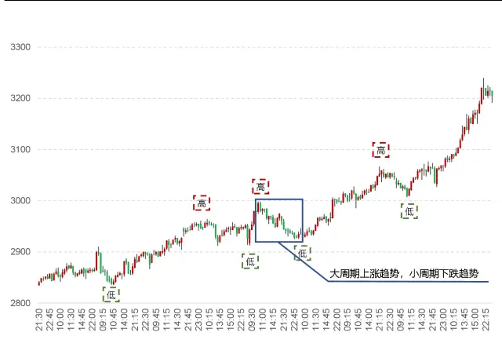
资料来源：Tinysoft，国信证券经济研究所整理

图2：铁矿石 K线及较小周期极值点
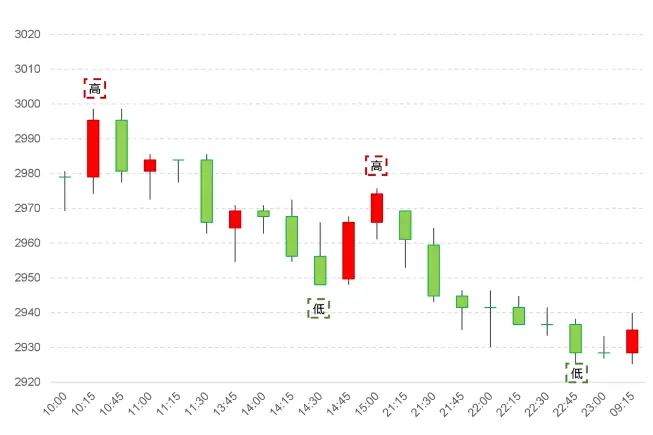
资料来源：Tinysoft，国信证券经济研究所整理

在接下来的研究中，我们将以铁矿石（I.DCE）为例进行说明。从图 1 中可以看到，随着铁矿石价格的一路上涨，其低点以及高点也呈现出依次上升的状态。这与道氏理论中所表述的低点依次上升且高点依次上升的情况相符合。

从上述对于趋势的定义中我们可以看到，尽管看起来非常直观，但是在实际进行落地时则会遇到下述三个问题：

1. 在同一个 K 线频率下（如本文使用 15 分钟 K 线），仍存在如图 1 所示跨周级别的周期趋势，也存在如图 2 所示跨日级别的周期趋势（其中图 2所示 K 线图为图 1中蓝色方框部分）。因此我们如何清晰的界定当下所处趋势状态则有待解决。

2. 在连续极值点上升的过程中（如图 1所示），仍可能出现连续极值点下降的情况（如图 2所示）。导致这种现象的原因，一方面是由于对当下趋势界定的标准不同，另一方面是对极值点的判断较为主观，标准不一。因此，我们需要系统化的对极值点进行描述。

3. 无论较大周期级别的趋势，还是较小周期级别的趋势，都会有转向的时点，在趋势转折时如何进行处理也是实盘策略中需要考虑的问题。

下面我们则就上述这些问题进行研究，在道氏理论的基础上通过更加定量化的方式构建基于道氏理论的商品期货交易策略。

## 道氏理论的量化表达

前面我们对道氏理论的历史以及道氏理论对于趋势的判断进行了整理和分析，不难发现，在使用道氏理论进行策略构建时仍有许多细节需要处理。

图3：策略构建框架
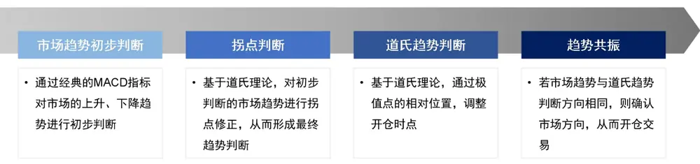
资料来源：国信证券经济研究所绘制

如图 3 所示，本文我们将通过经典的 MACD 指标对趋势进行初步判断，判断市场处在上升趋势还是下降趋势，后利用道氏理论对趋势拐点进行修正。在开仓时点的确认上，我们利用道氏趋势与市场上升或下降趋势是否共振进行判断，若共振则确认市场状态，开仓交易。

本节我们将对市场趋势进行初步判断，在对市场趋势进行判断时如果直接使用 K线进行计算则会引入噪音。这里我们使用经典的 MACD 指标对市场趋势进行初步判断。

利用 MACD 进行趋势判断最早由 GeraldAppel于 1970 提出的，下面我们将对这一指标进行简要介绍。

MACD（Moving Average Convergence/Divergence）指标可以用来解释市场运行的方向，是动量类指标的一种。其基本原理是使用均线之间的距离对噪音进行过滤，从而提取趋势。

具体计算方法为，首先，使用 12 根 K 线计算的短均线 MA（12）减去使用 26 根K 线计算的长均线 MA（26），这里为使均线更加平滑或者延迟性更低，可使用非简单均线的不同滤波手段，如 EMA（Exponential Moving Average）以及 WMA（Weighted Moving Average）等。

$$
MACD=MA(12)-MA(26)
$$

其中，MA 为移动均线，括号中为计算均线时使用的 K 线数量。这里使用的是MACD 指标的默认参数。

当 MACD 向上穿越信号线一定阈值时，则可判断当前市场处于上升趋势，当MACD 向下穿越信号线一定阈值时，则可判断当前市场处于下降趋势。

其中，信号线（Signal Line）为 MACD 指标 9 根 K 线的移动平均。这里的均线计算方法应与前述计算 MACD 时所使用的均线计算方法相同。

$$
SignalLine=MA_{MACD}(9)
$$

其中，S i g S ��为信号线， $MA_{MACD}$ 为 MACD 指标的移动均线，括号中为计算时使用的 K 线根数。这里也是使用的默认参数。可以看出，信号线为 MACD 的移动均线。

图 4所展示的是铁矿石的 K 线图、MACD 以及信号线。

图4：铁矿石 K 线图、MACD 及信号线
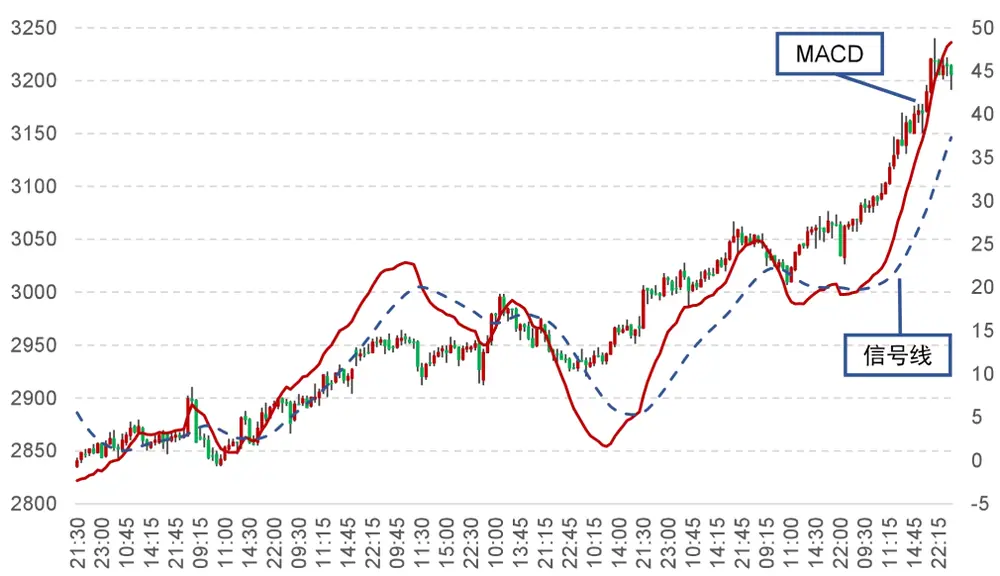
资料来源：Tinysoft，国信证券经济研究所整理

从图 4 可以看到，MACD 与信号线的穿越过程不都是十分清晰的，有时会有短时间的纠缠。我们称这样的穿越为“伪穿越”，在实际交易中不仅仅会增加交易成本，还有可能错失良好的趋势机会。

为避免“伪穿越”，我们将 MACD 与信号线的累计穿越距离加入一个阈值，即当MACD 上穿信号线累计距离突破阈值后，市场可被初步判断为上升趋势，当MACD 下穿信号线累计距离突破阈值后，市场可被初步判断为下降趋势。

其中，MACD 与信号线的累计穿越距离计算方式如下：

$$
\begin{array}{c}{{Diff_{MACD}=MACD-SignalLine}}\\{{}}\\{{Cum_{MACD}=\left\{\begin{array}{ll}{{Diff_{MACD,i}}}&{{\quad Diff_{MACD,i}\ \ast\ Diff_{MACD,i-1}\ <\ 0}}\\{{{\cal C}um_{MACD,i-1}\ +\ Diff_{MACD,i}\ }}&{{\quad Diff_{MACD,i}\ \ast\ Diff_{MACD,i-1}\ \geq\ 0}}\end{array}\right.}}\end{array}
$$

其中，S i g S ��为信号线， $Diff_{MACD}$ 为 MACD 与信号线的差值， $Cum_{MACD}$ 为MACD 与信号线的累计穿越距离。

当 MACD 初次穿越信号线时，MACD 与信号线的累计穿越距离即为当前 MACD与信号线的差值，后随着 MACD 稳定在信号线一方，MACD 与信号线的差值则进行累计，可以得到 MACD 与信号线的累计穿越距离。

我们使用 MACD 与信号线的累计穿越距离是否超过一定阈值，来判断市场是否处在上升、下降趋势。当 MACD 上穿信号线后，累计穿越距离大于一定阈值时，市场处在上升趋势，当 MACD 下穿信号线后，累计穿越距离大于一定阈值时，市场处在下降趋势。

具体公式如下：

$$
\pm\mathcal{H}_{\sf{A}}^{\pm\underline{{{A}}}\ddag\underline{{{\bf\Pi}}}}\colon{\cal C}um_{MACD}\geq\mathrm{~\ ~}a
$$

$$
\begin{array}{rl}{\neg\emptyset\Yleftarrow\emptyset\ddagger{\pmb{\mu}}{\pmb{\mu}}{\pmb{\mu}}{\pmb{\mu}}^{{\pmb{\mu}}}{\pmb{\mu}}^{{\pmb{\mu}}}:}&{{}Cum_{MACD}\leq-\textit{ a }}\end{array}
$$

其中， $Cum_{MACD}$ 为 MACD 与信号线的累计穿越距离，�为设定的阈值。这里的阈值通常被设定为真实波动幅度均值（Average True Range，ATR）。其中，ATR指标的具体计算公式如下所示：

$$
TR\ =\ \mathrm{Max}[(high-low),abs(high=preclose),abs(low-preclose)]
$$

$$
ATR\ =\ {\frac{1}{n}}{\sum_{i=1}^{n}TR_{i}}
$$

其中， $TR_{i}$ 为真实波动幅度（True Range），用于衡量每日的价格波动幅度，ATR则是 $TR_{i}$ 的移动平均值。

因此上述市场趋势的初步判断可以写为：

$$
\begin{array}{rl}{\pm\Re\mp\stackrel{\pm\Delta}{\ge}\stackrel{\pm\Re}{:}Cum_{MACD}\ge}&{{}ATR}\end{array}
$$

$$
\ T_{1}\beta\subsetneq\frac{4}{\pi}\beta\subsetneq\frac{4}{\pi}\beta:Cum_{MACD}\leq-\ ATR
$$

其中， $Cum_{MACD}$ 为 MACD 与信号线的累计穿越距离，�T 为真实波动幅度均值。
我们称本节所介绍的判断市场处在上升、下降趋势的方式为初步趋势判断策略。

图5：铁矿石初步趋势判断策略净值表现
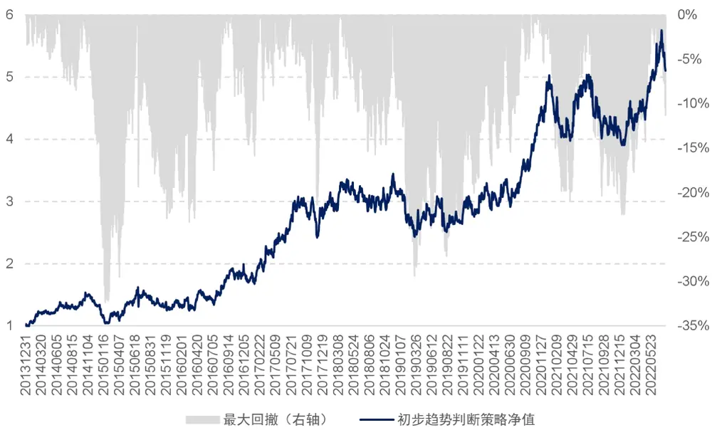
资料来源：Tinysoft，国信证券经济研究所整理

图 5展示的是利用铁矿石合约进行初步趋势判断策略的净值表现。可以看出，利用 MACD 的特性来对上升、下降趋势进行判断长期可以获得正向收益。但是收益的稳定性不强，且回撤较大。

表1：铁矿石初步趋势判断策略绩效分年度统计

|  | 策略收益 | 最大回撤 | 夏普率 | 波动率 | Calmar | 月度胜率 |
| --- | --- | --- | --- | --- | --- | --- |
| 2014 | 25.71% | 18.06% | 1.11 | 23.16% | 1.42 | 58.33% |
| 2015 | 9.92% | 22.93% | 0.27 | 37.28% | 0.43 | 41.67% |
| 2016 | 25.61% | 15.18% | 0.81 | 31.62% | 1.69 | 50.00% |
| 2017 | 65.83% | 21.40% | 1.99 | 33.13% | 3.08 | 66.67% |
| 2018 | 8.36% | 15.75% | 0.31 | 27.26% | 0.53 | 50.00% |
| 2019 | -11.67% | 23.97% | -0.37 | 31.45% | -0.49 | 33.33% |
| 2020 | 77.02% | 13.26% | 2.94 | 26.19% | 5.81 | 66.67% |
| 2021 | -19.07% | 22.48% | -0.67 | 28.35% | -0.85 | 33.33% |
| 20220729 | 29.28% | 11.31% | 1.11 | 26.48% | 2.59 | 71.43% |
| 全样本期 | 20.59% | 32.39% | 0.69 | 29.84% | 0.64 | 51.92% |

资料来源：Tinysoft，国信证券经济研究所整理

表 1对铁矿石合约的初步趋势判断策略的绩效进行了分年度统计。其中，策略年化收益为 20.59%，夏普率为 0.69，Calmar 为 0.64。

因此，我们可以看到利用 MACD 对于市场趋势的判断具有有效性，但要想增加策略的稳定性，对市场趋势还需要进一步判断和验证。

前面我们基于 MACD 指标对市场是否处于上升、下降趋势做出了判断，但是由于MACD 指标具有一定的滞后性，因此只通过 MACD 指标有时对于行情拐点的判断会出现延迟。

图6：铁矿石价格及上升趋势拐点
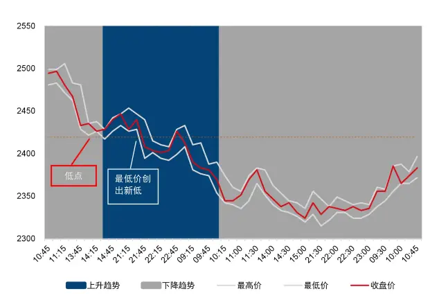
资料来源：Tinysoft，国信证券经济研究所整理

图7：铁矿石价格及下降趋势拐点
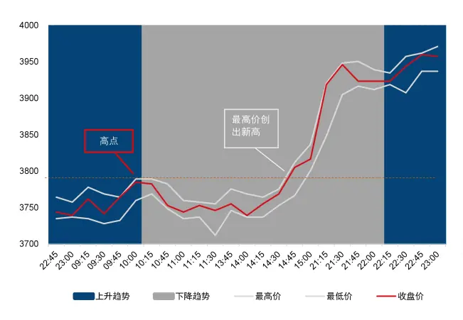
资料来源：Tinysoft，国信证券经济研究所整理

图 6所展示的是铁矿石最高价、最低价以及收盘价走势，可以看到，价格一路下跌后有小幅上扬。通过我们对市场趋势的初步判断，将这段行情划分为下降趋势转为上升趋势后转为下降趋势。

我们可以直观地从图中看出，被初步判断为上升趋势的部分，价格走势整体呈现出下跌状态。借鉴道氏理论中的定义，这部分价格持续创出新低，且低于上一下降趋势中最低点。

图 7所展示的是另一段铁矿石的价格走势，可以看到，在这段行情中，价格一路上涨，而市场趋势的初步判断结果为，市场先经历上升趋势，后转为下降趋势最后又转为上升趋势。

在图 7 中的下降趋势部分，价格呈现出来先水平后上涨的状态，整段过程价格仍以上涨为主。且价格也突破了上一上升趋势中的最高点。

我们可以据此对拐点进行判断，从而对初步判断的趋势进行修正：

若市场处于上升趋势，但最低价突破上一下降趋势中最低价的最小值，则趋势发生反转，即判断为下降趋势。

若市场处于下降趋势，但最高价突破上一上升趋势中最高价的最大值，则趋势发生反转，即判断为上升趋势。

图8以及图9则分别展示了前面图6以及图7在经过上述拐点修正后的趋势判断结果。

图8：铁矿石价格及上升趋势拐点修正
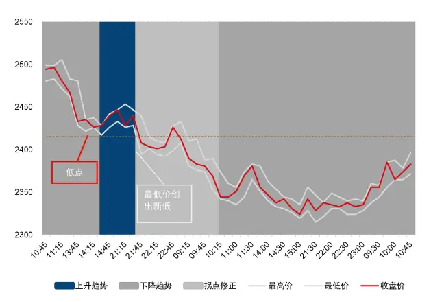
资料来源：Tinysoft，国信证券经济研究所整理

图9：铁矿石价格及下降趋势拐点修正
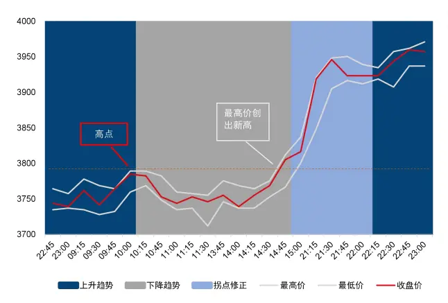
资料来源：Tinysoft，国信证券经济研究所整理

在图 8 以及图 9 中灰色部分为经初步判断为下降趋势的部分，蓝色部分为初步判断为上升趋势的部分。

图 8中在上升趋势判断后，随着行情的运行，时刻关注行情的最低价所形成的最小值，当最低价创出前一个下降趋势最低价新低后，我们随即将此上升趋势修正为下降趋势，经拐点修正后的下降趋势部分由浅灰色表示。

图 9展示的价格走势中，经初步判断市场先经由上升趋势，后转为下降趋势，最后再次转为上升趋势。

其中，在判断为下降趋势后，则开始记录此段行情的最高价的最大值，当处在此下降趋势中的最高价超过前一上升趋势最高价后，我们随即将此下降趋势修正为上升趋势，经拐点修正后的上升趋势部分由浅蓝色表示。

可以看到，在经过拐点修正后，策略对趋势的识别更加准确，当出现初步判断趋势与行情走势不符时，能够及时将趋势进行调整。

图 10 展示的是拐点修正策略净值表现，以及表 2 列示了拐点修正后策略分年度绩效统计。

从图 10 可以看出，拐点修正后策略长期表现稳健，具有显著的正向期望收益。
且相比前面初步判断趋势准确度有所提升。

图10：拐点修正后策略净值表现
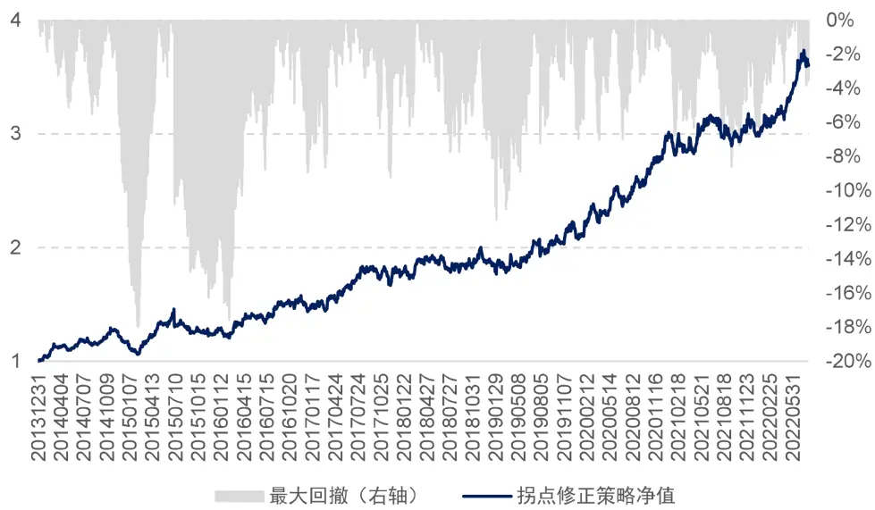
资料来源：Tinysoft，国信证券经济研究所整理

当然，我们也可以看出，策略的波动性较大，在 2014 年至 2015 年期间，策略出现较大回撤。具体在下方表 2 中我们将该策略分年度的绩效进行统计。

表2：拐点修正后策略绩效分年度统计

|  | 策略收益 | 最大回撤 | 夏普率 | 波动率 | Calmar | 月度胜率 |
| --- | --- | --- | --- | --- | --- | --- |
| 2014 | 14.36% | 12.12% | 1.23 | 11.66% | 1.18 | 66.67% |
| 2015 | 11.77% | 16.27% | 0.69 | 17.09% | 0.72 | 50.00% |
| 2016 | 13.05% | 8.94% | 0.85 | 15.42% | 1.46 | 58.33% |
| 2017 | 23.18% | 9.22% | 1.42 | 16.33% | 2.51 | 66.67% |
| 2018 | 5.26% | 7.73% | 0.40 | 13.27% | 0.68 | 50.00% |
| 2019 | 10.69% | 7.22% | 0.66 | 16.15% | 1.48 | 58.33% |
| 2020 | 43.23% | 7.01% | 3.27 | 13.24% | 6.17 | 66.67% |
| 2021 | 0.90% | 8.59% | 0.06 | 14.11% | 0.10 | 58.33% |
| 20220729 | 20.27% | 3.82% | 1.56 | 12.97% | 5.31 | 71.43% |
| 全样本期 | 15.87% | 18.00% | 1.08 | 14.64% | 0.88 | 60.58% |

资料来源：Tinysoft，国信证券经济研究所整理

表 2所展示的是拐点修正后策略绩效分年度统计情况。总体来看策略表现稳中有升，全样本期费后年化收益率为 15.87%，夏普率由 0.69 提升至 1.08，Calmar由 0.64 提升至 0.88。全样本期策略的最大回撤为 18%。

可以看到，在结合道氏理论对市场趋势初步判断的结果进行修正后，策略表现得到了全方位的提升。但是我们仍希望策略的表现体现出更强的稳定性。那么如何对策略进行优化与改进呢？

接下来，我们将探讨以下问题：何为道氏趋势？道氏趋势对当前策略有何启示？以及如何利用道氏趋势对策略开仓进行调整？

通过前面的讨论可知，我们对于市场趋势的判断长期可获取正收益，在加入了拐点判断后策略的稳定性得到了显著提升，但我们还需要对策略的开仓时点进行检验与佐证，来平滑策略的收益曲线。

图 11以及图 12 分别展示了铁矿石的最高价、最低价以及收盘价的价格曲线，以及通过 MACD 进行拐点修正后的市场上升以及下降趋势。

图11：铁矿石价格曲线上升趋势中最高点下降
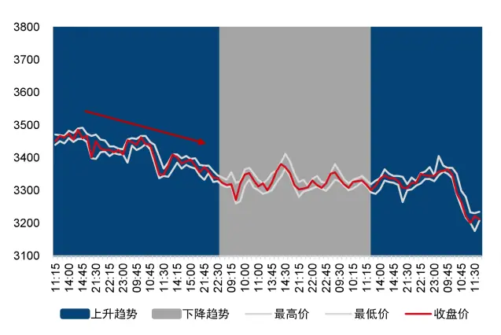
资料来源：Tinysoft，国信证券经济研究所整理

图12：铁矿石价格曲线下降趋势中最低点上升
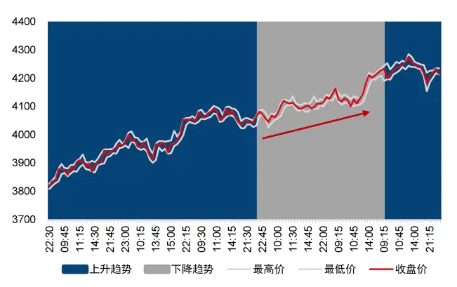
资料来源：Tinysoft，国信证券经济研究所整理

从图 11中可以看到，铁矿石的价格曲线正在下行，但拐点修正后的趋势判断出图中左侧部分为上升趋势，这显然与价格走势发生了背离。在实际交易中往往希望能够规避这样的信号。这里我们借鉴前述道氏理论对于趋势的定义，可以观察到价格曲线中最高价所构成的极值点连线方向向下，我们可以据此认为判断为铁矿石价格上涨趋势并未形成。

图 12 所展示的是在拐点修正后被判断为下降趋势的灰色区块中，铁矿石价格还在上升的情况。借鉴前述道氏理论对于趋势的定义，可以看到价格曲线中最低价所构成的极值点连线方向向上，因此与拐点修正后判断的下降趋势相背离，我们依旧无法认定铁矿石的价格处在下跌趋势中。

通过前面的案例可以看到，在趋势的判断中，道氏理论可以为我们提供指导，那么在实际交易中如何将道氏理论进行落地呢？本节我们将尝试提供一种解决方案。

道氏理论通过极值点的连续上升以及下降来判断趋势是否形成，这里的核心问题是对极值点的刻画。

由于市场的高低点一定是交替出现的，因此理论上当市场从上升趋势转向下降趋势时，市场最近的一个高点则已经形成，反之，当市场从下降趋势转为上升趋势时，市场则形成了最近的一个低点。

如图 13 所示，为铁矿石的最高价、最低价以及收盘价的价格走势，图中灰色部分为初步判断的下降趋势，蓝色部分为初步判断的上升趋势。

若当前行情运行到上升趋势，对应图中最右侧蓝色区域，则时刻记录最高价的最大值定义为临时高点（若当前为下降趋势则记录最低价的最小值，并定义为临时低点）。

上一个上升趋势（对于图中左侧第一个蓝色区域）中最高价的最大值则定义为当前第一高点（若当前为下降趋势，则上一个下降趋势中最低价的最小值为第一低点）。

最近两个下降趋势（分别对应图中右侧第一个灰色区域，对应图中左侧第一个灰色区域）中最低价最小值分别为第一、第二低点（若当前为下降趋势，则最近两个上升趋势中最高价最大值分别为第一、第二高点）。

图13：铁矿石价格曲线及高低点判断
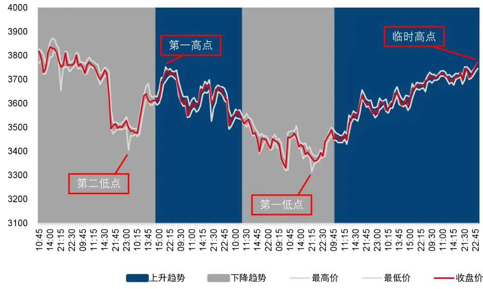
资料来源：Tinysoft，国信证券经济研究所整理

使用公式可以表述如下：

当最新趋势为上升趋势时：

$$
\left\{\begin{array}{ll}{\begin{array}{ll}{tempmax=max(high_{i})}&{\textit{ i }\in\boldsymbol{uptrend}_{0}}\\{\mathit{lastmax}_{1}=max(high_{j})}&{\textit{ j }\in\boldsymbol{uptrend}_{1}}\end{array}}\\\begin{array}{ll}{\boldsymbol{lastmin}_{1}=\begin{array}{ll}{min(low_{k})}&{\textit{ k }\in\boldsymbol{downtrend}_{1}}\\{\boldsymbol{lastmin}_{2}\ :=\begin{array}{ll}{min(low_{l})}&{\textit{ l }\in\boldsymbol{downtrend}_{2}}\end{array}}\end{array}\right.}\end{array}\end{array}
$$

当最新趋势为下降趋势时：

$$
\{\begin{array}{ll}tempmin=\begin{array}{lll}{min(low_{i})}&{i\in downtrend_{0}}\\{lastmin_{1}=\begin{array}{lll}{min(low_{j})}&{j\in downtrend_{1}}\end{array}}\\{lastmax_{1}}&{=\begin{array}{lll}{max(high_{k})}&{k\in uptrend_{1}}\\{lastmax_{2}}&{=\begin{array}{lll}{max(high_{l})}&{l\in uptrend_{2}}\end{array}}\end{array}}\end{array}\end{array}
$$

其中，��p ��S 以及l i p ��S 分别表示趋势为上升趋势以及下降趋势，�取值为0，1，2 等代表当前状态，上一状态，上两个状态等。即 $uptrend_{0}$ 代表当前上升趋势， $uptrend_{1}$ 代表上一个上升趋势，以此类推。

我们定义当第一低点大于第二低点时，为道氏上升趋势，当第一高点小于第二高点时，为道氏下降趋势。

据此，我们可以利用趋势共振对市场趋势进行修正：当经拐点修正后的市场上升趋势与道氏上升趋势同时成立时，我们开多仓，反之当拐点修正后的市场下降趋势与道氏下降趋势同时成立时，我们开空仓。当初步判断市场趋势与道氏趋势相反时空仓。

图 14 展示的是利用铁矿石合约在初步趋势判断与道氏趋势判断相一致时所作策略的净值表现。可以看出，相比之前初步趋势判断的净值表现，趋势共振后收益走势更加稳定。

图14：铁矿石趋势共振策略净值表现
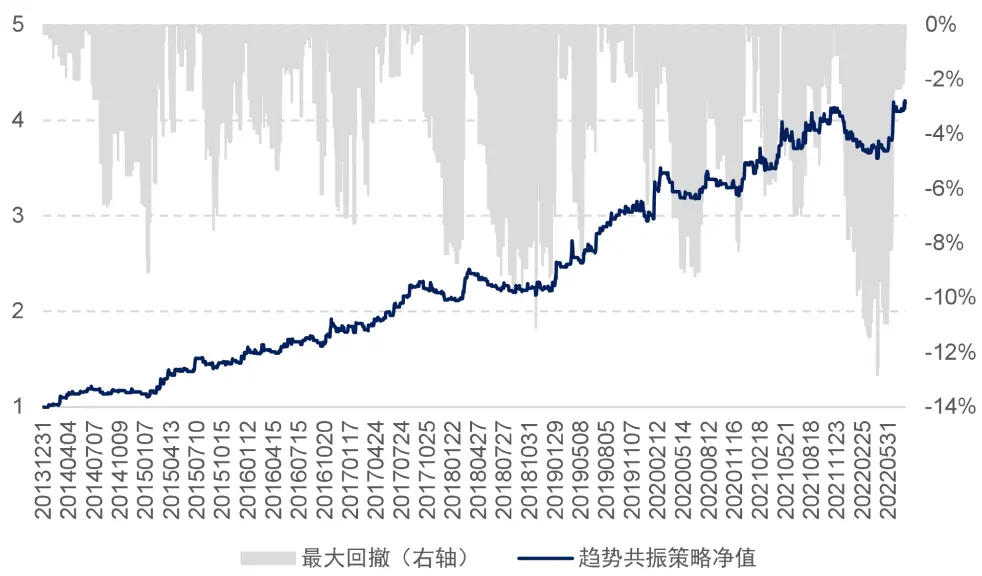
资料来源：Tinysoft，国信证券经济研究所整理

表 3对铁矿石合约的趋势共振策略的绩效进行了分年度统计。相比前面对于拐点修正策略的收益而言，夏普率从1.08提升到了1.26，Calmar由0.88提升至1.39。可以看到策略的稳定性进一步得到了提升。

其中，策略年化收益为 17.86%，全样本期最大回撤为 12.83%，历年最大回撤出现在 2018 年为 11.11%。

表3：铁矿石趋势共振策略绩效分年度统计

|  | 策略收益 最大回撤 |  | 夏普率 | 波动率 | Calmar | 月度胜率 |
| --- | --- | --- | --- | --- | --- | --- |
| 2014 | 13.67% | 6.66% | 1.26 | 10.88% | 2.05 | 66.67% |
| 2015 | 37.39% | 7.52% | 2.36 | 15.83% | 4.97 | 75.00% |
| 2016 | 14.27% | 7.05% | 0.99 | 14.36% | 2.02 | 66.67% |
| 2017 | 18.80% | 8.40% | 1.43 | 13.11% | 2.24 | 66.67% |
| 2018 | 5.78% | 11.11% | 0.50 | 11.47% | 0.52 | 41.67% |
| 2019 | 31.34% | 8.44% | 1.93 | 16.21% | 3.71 | 75.00% |
| 2020 | 19.93% | 9.23% | 1.37 | 14.55% | 2.16 | 50.00% |
| 2021 | 7.79% | 7.84% | 0.49 | 15.97% | 0.99 | 50.00% |
| 20220729 | 9.82% | 7.13% | 0.67 | 14.64% | 1.38 | 57.14% |
| 全样本期 | 17.86% | 12.83% | 1.26 | 14.18% | 1.39 | 61.54% |

资料来源：Tinysoft，国信证券经济研究所整理

至此，我们在 MACD 指标对市场趋势进行初步判断的基础上，结合道氏理论对趋势的拐点进行了修正，这样能够在一定程度上解决 MACD 指标的判断延迟问题。同时基于道氏理论构造了道氏趋势，通过与市场上升、下降趋势的共振来得到开仓点。

## 交易品种动态筛选

对于同一个 CTA策略，往往难以适用所有的商品期货品种。在策略的实际使用中，如果可以通过动态识别策略在不同品种上面的表现，从而进行动态的交易品种的选择，那么可以使得策略的表现更加稳健。

如图 15 所示，我们在每个月末对所有已满足流动性条件的商品期货品种过去一年在策略上的表现进行测试，剔除过去一年中在该策略上交易次数小于 5次（表示策略在该品种上不易触发信号），或者交易次数不少于 5 次，但策略收益率小于 0的交易品种。

图15：动态筛选品种示意图
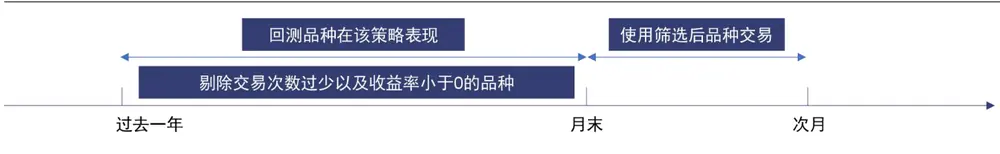
资料来源：国信证券经济研究所绘制

这种筛选方法往往可以将不适用该策略的品种进行剔除，之所以选择剔除不适应策略品种的逻辑，而不是筛选表现最好的品种的逻辑，是因为后者往往比较容易造成考察期的局部过拟合。

## 杠杆设置

在进行完待交易品种的筛选后，我们将对整个策略的杠杆进行设置，我们的目标是将策略在波动较小的时候，设置较高杠杆，在策略波动较大时，将杠杆水平设置较低。这样的做法一方面可以平抑策略的波动，提升整体稳定性，另一方面可以提升实际操作时策略的资金安全性。

策略杠杆设置的具体做法是，我们在每个月月末回看策略整体的运行情况，计算过去一年该策略收益表现的波动率，将目标波动率设置为 15%（取决于对于策略预期的杠杆率水平，通常维持在 2 倍杠杆左右），那么波动率调整系数的计算公式可以表示为：

$$
Mul_{vol}=\frac{15\%}{Vol}
$$

其中， $\mathrm{Mul}_{\mathrm{vol}}$ 为经已实现波动率调整的系数，Vol为策略在过去一年中的已实现波动率。通过对策略表现波动率的调整，可以使得策略在不同市场环境下运行的整体风险趋于一致。

出于实际使用情况考虑，我们设置最大杠杆率为 4 倍杠杆。因此当 Lev 的绝对值大于 4 时，我们截断为 4。

在经过已实现波动率调整后，基于道氏理论的商品期货交易策略平均杠杆率的时序变化图如图 16 所示。

从图 16 中看到，策略平均杠杆率为 2.05 倍，这个也是基于道氏理论的商品期货交易策略的最终杠杆率变化水平。在2013-2014年间策略的历史杠杆率达到峰值，在 2016 年策略杠杆率降到最低，之后，在 2018 年间，策略的杠杆率再次冲高。近期杠杆率有所回落，整体处在历史均值下方。

图16：已实现波动率调整后策略杠杆变化图
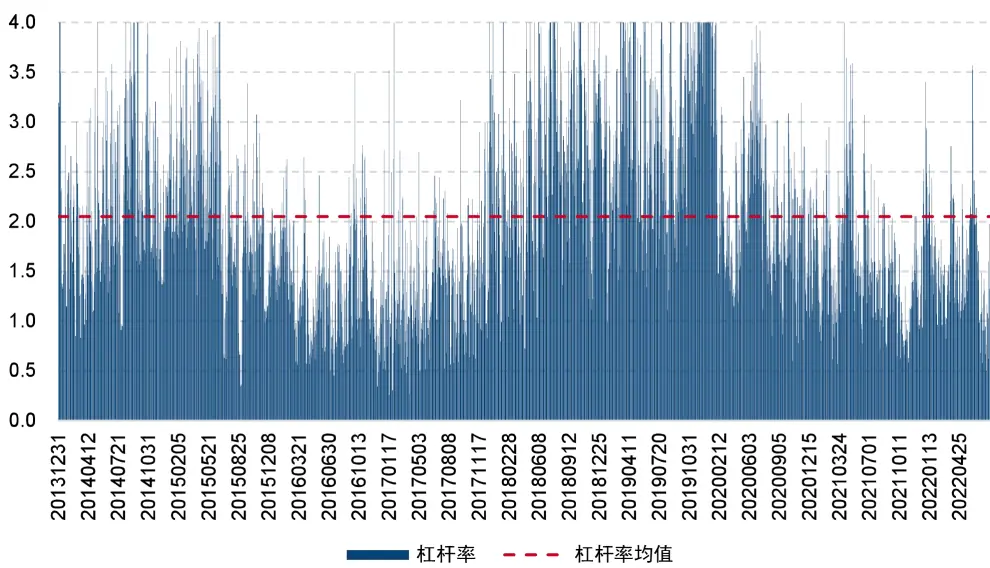
资料来源：Tinysoft，国信证券经济研究所整理

至此，策略的全部逻辑已经探讨完毕，策略的最终表现以及相关特性将在下面进行详细阐述与测试。

我们从 Charles H. Dow（Charles Henry Dow）的简介出发，到道氏理论的历史，对道氏理论有了初步的了解。

我们利用 MACD 指标对市场趋势进行初步判断，结合道氏理论对市场趋势拐点进行修正，并利用道氏理论对极值点运行规律的描述形成开仓逻辑，最终我们构建了基于道氏理论的商品期货交易策略。具体的策略构建流程如下：

## 投资标的：

过去半年中日均成交额超过 50 亿元的商品期货全品种的主力合约。

开仓信号：

多头：

1. MACD 上穿信号线累计距离大于等于 ATR（上升趋势）

2. 临时低点高于第一最低价（拐点修正）

3. 第一最低价大于第二最低价且收盘价大于等于临时高点（道氏趋势）空头：

1. MACD 下穿信号线累计距离小于等于 ATR（下降趋势）

2. 临时高点低于第一最高价（拐点修正）

3. 第一最高价小于第二最高价且收盘价小于等于临时低点（道氏趋势）

## 杠杆率调整：

ATR调整：海龟资金管理法（1 单位 ATR 的波动对应策略整体资金规模的 0.5%，详见附录 2—海龟资金管理法）

已实现波动调整：以过去一年策略波动率为基准设置目标年化波动 15%

最终杠杆率：ATR调整杠杆*已实现波动调整杠杆，最高 4倍杠杆截断。

品种动态筛选：

剔除过去一年中在该策略上交易次数小于 5 次（表示策略在该品种上不易触发信号），或者在该策略上交易次数不少于 5 次，但策略的收益率小于 0 的交易品种。

## 资金分配：

满足开仓条件品种等权分配资金。

成交价格：

信号触发后 5分钟 VWAP。

交易成本：

交易手续费 0.3%%，冲击成本 1%%。

综上所述，在经过上升、下降趋势判断，拐点修正以及道氏趋势共振后，便形成了基于道氏理论的商品期货交易策略，至此，回顾策略的构建流程用一个流程图可表示如图 17 所示：

图17：基于道氏理论的商品期货交易策略流程图
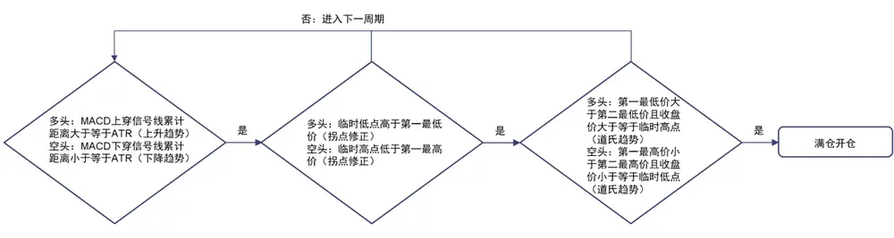
资料来源：国信证券经济研究所绘制

按照上述流程构建的基于道氏理论的商品期货交易策略历史表现稳定且具有较高收益率，同时回撤可控。具体走势如图 18 所示：

图18：基于道氏理论的商品期货交易策略净值
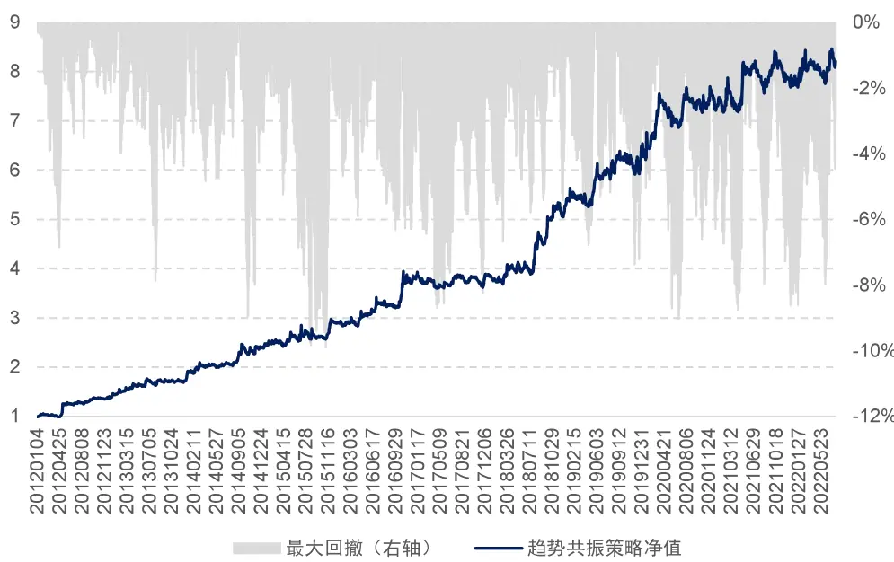
资料来源：Tinysoft，国信证券经济研究所整理

2012 年以来，基于道氏理论的商品期货交易策略费后年化收益率为 21.74%，夏普率为 1.42，Calmar 比率为 2.2。可以看出策略表现非常稳健。其中，策略的分年度收益表现如表 4 所示：

表4：基于道氏理论的商品期货交易策略绩效分年度统计

|  | 策略收益 | 最大回撤 | 夏普率 | 波动率 | Calmar | 月度胜率 |
| --- | --- | --- | --- | --- | --- | --- |
| 2012 | 44.07% | 6.85% | 2.87 | 15.37% | 6.44 | 58.33% |
| 2013 | 22.49% | 7.86% | 1.53 | 14.67% | 2.86 | 75.00% |
| 2014 | 36.41% | 8.96% | 2.34 | 15.53% | 4.06 | 75.00% |
| 2015 | 21.07% | 9.90% | 1.13 | 18.62% | 2.13 | 50.00% |
| 2016 | 31.25% | 6.33% | 1.91 | 16.39% | 4.94 | 66.67% |
| 2017 | 1.04% | 8.35% | 0.10 | 9.92% | 0.12 | 41.67% |
| 2018 | 36.96% | 5.78% | 2.35 | 15.72% | 6.39 | 66.67% |
| 2019 | 19.50% | 7.37% | 1.28 | 15.28% | 2.65 | 58.33% |
| 2020 | 15.79% | 9.04% | 0.97 | 16.33% | 1.75 | 50.00% |
| 2021 | 6.55% | 8.75% | 0.44 | 14.89% | 0.75 | 41.67% |
| 20220729 | 5.20% | 7.99% | 0.36 | 14.29% | 0.65 | 71.43% |
| 全样本期 | 21.74% | 9.90% | 1.42 | 15.34% | 2.20 | 59.06% |

资料来源：Tinysoft，国信证券经济研究所整理

由于我们控制目标年化波动率在 15%，因此实现出来全样本期的年化波动率为15.34%，与期望的目标波动率比较接近。

上述基于道氏理论的商品期货交易策略在进行回测时使用的交易成本为 1.3%%，是由交易手续费 0.3%%以及冲击成本 1%%构成。交易价格为策略信号发出后 5分钟的 VWAP 均价，我们测试了不同冲击成本下策略的收益表现如图 19 所示：

图19：不同交易成本下策略净值
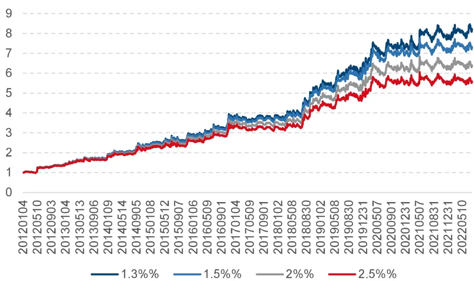
资料来源：Tinysoft，国信证券经济研究所整理

从图 19 中的不同交易成本下曲线可以看到，基于道氏理论的商品期货交易策略对于交易费用不敏感。具体各个交易成本下策略绩效统计如表 5。

从表 5 可以看出策略对于交易成本的变化不敏感，随着交易成本的增加策略年化收益率变化缓慢。当交易成本从 1.3%%增长至 2.5%%后，策略的年化收益率从21.74%降到 17.44%，夏普率仅从 1.42 下降到 1.13。

表5：不同交易成本下策略绩效统计

| 年化收益率 | 夏普率 Calmar |
| --- | --- |
| 1.3%% 21.74% | 1.42 2.20 |
| 1.5%% 20.43% | 1.33 1.93 |
| 2%% 18.93% | 1.23 1.74 |
| 2.5%% 17.44% | 1.13 1.56 |

资料来源：Tinysoft，国信证券经济研究所整理

综上，可以看到，交易成本的变化对策略净值的走势影响不大。基于道氏理论的商品期货交易策略在不同的交易成本下均可实现长期稳定的表现。

## CTA 复合策略

关于期货交易策略，在国信金工团队前期的 CTA系列专题中已经有较多的介绍，这里我们做一下简单的回顾，具体内容可参考对应的报告。

在 2021 年 5 月 13 日发布的专题报告《基于开盘动量效应的股指期货交易策略》利用开盘形态交易股指期货；

在2021年10月13日发布的专题报告《基于Bollinger通道的商品期货交易策略》在 Bollinger 通道策略的基础上利用持仓量过滤及品种的动态选择构建了商品期货交易策略；

在 2022 年 5 月 24 日发布的专题报告《基于 Carry 的商品期货交易策略》利用商

品期货的期限结构进行策略构建；

策略间彼此相关性较弱，长期相关性矩阵如表 6 所示：

表6：CTA策略相关性矩阵

|  | 开盘动量(股指) | Bollinger(商品) | Carry(商品) | 道氏理论(商品) |
| --- | --- | --- | --- | --- |
| 开盘动量(股指) | 1.00 | 0.02 | 0.02 | 0.01 |
| Bollinger(商品) |  | 1.00 | 0.29 | 0.46 |
| Carry(商品) |  |  | 1.00 | 0.29 |
| 道氏理论(商品) |  |  |  | 1.00 |

资料来源：Tinysoft，国信证券经济研究所整理

可以看到策略之间长期相关性在 0.5 以下，这表明各策略之间的线性相关性并不高，在进行线性合成时彼此之间可以体现出较强增益。

从表 6 中可以看出，由于策略逻辑不同且长期相关性较低，因此将这样四个策略进行组合，可以提升 CTA策略的稳定性，在 CTA产品中，往往需要多策略进行搭配使用。

我们将这四个策略等权配置，月度再平衡，可以得到 CTA复合策略，复合策略的净值曲线如图 20 所示：

图20：CTA 复合策略净值
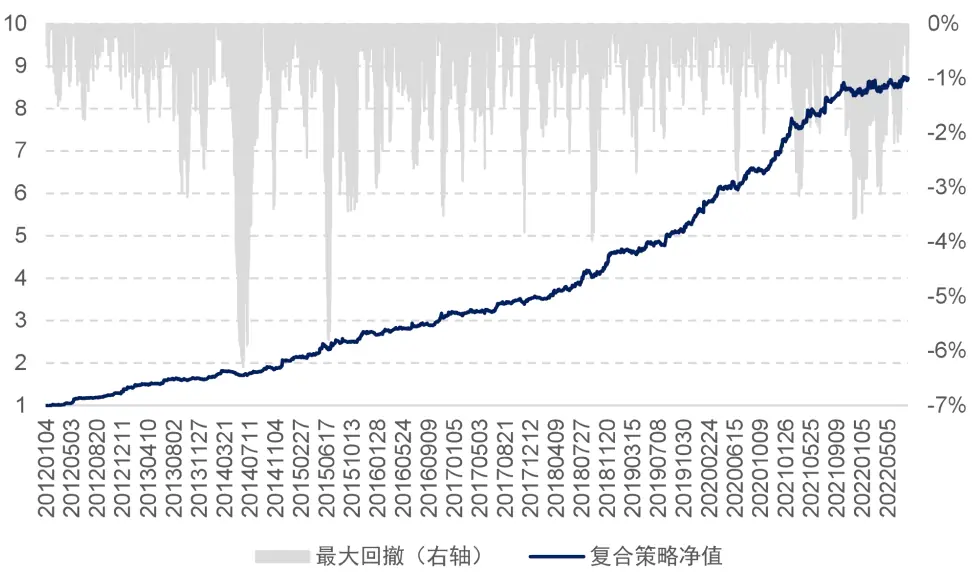
资料来源：Tinysoft，国信证券经济研究所整理

图 20 显示的是 CTA复合策略的净值曲线，从图中可以看出策略的净值曲线较为光滑，且收益较高，这比较符合我们的预期。其中，复合策略的分年度收益统计如表 7 所示：

表7：CTA复合策略绩效分年度统计

|  | 策略收益 最大回撤 |  | 夏普率 | 波动率 | Calmar | 月度胜率 |
| --- | --- | --- | --- | --- | --- | --- |
| 2012 | 42.23% | 1.76% | 4.34 | 9.72% | 24.00 | 91.67% |
| 2013 | 14.98% | 3.18% | 1.95 | 7.67% | 4.71 | 58.33% |
| 2014 | 25.30% | 6.29% | 2.53 | 10.00% | 4.02 | 66.67% |
| 2015 | 33.90% | 5.80% | 2.97 | 11.41% | 5.85 | 66.67% |
| 2016 | 16.54% | 3.52% | 2.03 | 8.15% | 4.69 | 83.33% |
| 2017 | 11.89% | 3.83% | 1.90 | 6.24% | 3.11 | 66.67% |
| 2018 | 28.74% | 3.98% | 3.32 | 8.65% | 7.23 | 83.33% |
| 2019 | 21.10% | 2.73% | 2.87 | 7.35% | 7.73 | 83.33% |
| 2020 | 25.24% | 3.10% | 3.10 | 8.14% | 8.14 | 66.67% |
| 2021 | 20.55% | 3.57% | 2.61 | 7.88% | 5.75 | 66.67% |
| 20220729 | 3.50% | 3.13% | 0.44 | 7.94% | 1.12 | 71.43% |
| 全样本期 | 22.42% | 6.29% | 2.61 | 8.60% | 3.56 | 73.23% |

资料来源：Tinysoft，国信证券经济研究所整理

从表 7 中可以看到，复合策略的年化费后收益率为 22.42%，夏普率为 2.61，Calmar 为 3.56。

因此，复合策略的表现非常稳健。当 CTA策略组合中的策略逐渐丰富起来之后，CTA复合策略的表现会更加优异，呈现出来的净值表现也将更加稳健。

## 总结

我们从 Charles H. Dow 的传奇人生以及道氏理论的历史出发，对道氏理论以及道氏理论中对趋势的描述进行了简要介绍。

MACD（Moving Average Convergence/Divergence）指标可以用来表征市场运行的方向，是动量类指标的一种。其基本原理是使用均线之间的距离对噪音进行过滤，从而对市场趋势进行初步判断。当 MACD 上穿信号线累计距离突破阈值后，市场可被初步判断为上升趋势，当 MACD 下穿信号线累计距离突破阈值后，市场可被初步判断为下降趋势。

如果只使用 MACD 作为信号进行交易则会由于信号的迟滞，导致在趋势发生逆转时判断受到局限。借鉴道氏理论对趋势的描述，在对市场趋势进行初步判断后，对拐点进行修正。策略相对只使用 MACD 信号进行趋势判断进行交易在稳定性上具有显著提升。

我们对于市场趋势的初步判断长期可获取正收益，在加入了拐点修正后策略的稳定性得到了显著提升，但我们还需要对策略的开仓时点进行检验与佐证，来平滑策略的收益曲线。通过对高低点的定量刻画，借鉴道氏理论，从而形成道氏趋势，将拐点修正后的市场趋势与道氏趋势相结合，当趋势共振时对策略进行开仓操作，策略表现可以得到进一步提升。

结合 MACD 对市场趋势初步判断后与道氏理论相融合对拐点进行修正，最终配合道氏趋势，形成基于道氏理论的商品期货交易策略。策略表现稳定且具有较高收益率，2012 年以来该策略净值稳定攀升，同时回撤可控。基于道氏理论的商品期货交易策略费后年化收益率为 21.74%，夏普率为 1.42，Calmar 为 2.2。

## CTA复合策略

我们将基于道氏理论的商品期货交易策略与此前发布的基于开盘动量效应的股指期货交易策略、基于 Bollinger通道的商品期货交易策略以及基于 Carry 的商品期货交易策略等权复合，构造为 CTA 复合策略。复合策略的年化费后收益率为22.42%，夏普率为 2.61，Calmar 为 3.56，且每年 Calmar 均大于 1。

## 参考文献

- Richard Russell. The Dow Theory Today.

- Samuel Armstrong Nelson. The ABC of Stock Speculation.

William Peter Hamilton. The Stock Market Barometer.

## 附录 1—数据准备

在本节将介绍我们对数据的准备以及处理方法。在 CTA策略的测试中，数据的处理主要涉及以下几个问题：主力合约如何确定，展期价格跳空如何处理，不同合约数据怎么拼接以及发单价格如何确定。下面我们将针对这些问题进行分析和解决。

## 主力合约的确定

在确定主力合约时，我们使用成交量以及持仓量均达到最大的合约作为主力合约。这其中，股指期货在合约到期月份的第三个周五进行交割，国债期货在合约到期月份的第二个周五进行交割，因此，如果上述品种在交割前还没有能够新的主力合约可以确定，那么需要在交割日前一个交易日强制切换至当时的次主力合约。同时，主力合约不可逆，一经确定不可反复。

## 合约切换的思考

在合约进行切换时，可能会出现前后两个主力合约的价格无法进行无缝对接的情况。如图 23 以及图 24 所示：

图21：RB1901 切换 RB1905 价格跳空
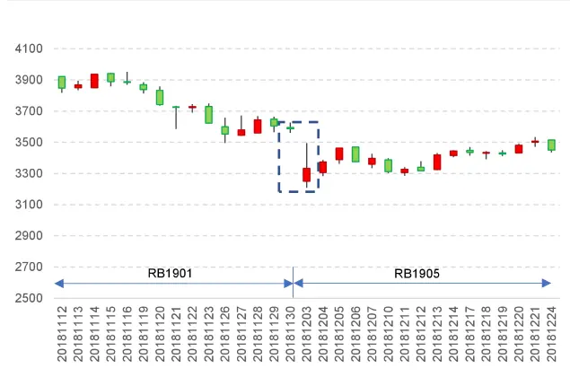
资料来源：Tinysoft，国信证券经济研究所整理

图22：RB1901 切换 RB1905 价格复权

资料来源：Tinysoft，国信证券经济研究所整理

图 23 为 RB1901 合约切换到 RB1905 合约的价格序列图，其中切换时点为 2018年 12 月 3 日。从图 22 可以看出，在切换的时间点出现了一个价格的大幅跳空低开的情况，如果认为这是行情的自然状态，则可能导致对行情判断的失误。从而导致策略判断失真。

那么在切换合约时，通常有两种做法，一种是根据新主力合约之前的业绩进行新交易信号的判断，以 RB 合约为例，当合约从 RB1901 切换到 RB1905 时，之后的策略计算都按照 RB 的历史数据进行计算，这样做的好处是，策略信号来源于该标的且作用在该标的。而缺点是有些合约虽然切换到了新的主力合约，但是由于切换前该新合约交易并不活跃，加之有些策略需要使用大量历史数据进行处理和分析，因此可能导致信号失真，或者价格波动较大的情况。

还有一种做法是将价格数据进行复权。复权分为前复权以及后复权，如果向前复权的话，则当前的合约价格为真实价格，之前的合约价格数据为复权后的价格。这样做的好处是可以使用当前的真实合约价格来确认开仓数量，而缺点则是历史数据会随着新数据的更新而出现变化，尽管变化较小，但随着时间的推移以及浮点数的保存问题，有可能会出现新计算出来的策略开仓时点或者策略曲线与之前计算的无法完全匹配的情况。那么会在策略归因时，造成一定的困难。

我们所使用的方法是进行向后复权，这样做的前提是需要选择一个策略开始计算的日期为基期，一旦基期确定下来，后面行情如何更新都对历史数据造成改变。当然，如果基期发生了变化，则有可能导致历史数据的变化。由于 2010 年以前上市的期货品种较少，且活跃度不高。因此我们所使用的基期则定为 2010 年 1月 1日。

复权的具体做法为：在每次展期的时候，计算新主力合约以及旧主力合约的价格跳空比，以此作为当日之后新主力合约价格的复权因子。该复权因子的具体计算公式为：

$$
AdjFactor_{i}=AdjFactor_{i-1}*\frac{Close_{i-1,old}}{Close_{i-1,new}}
$$

其中， $\mathrm{AdjFactor}_{\mathrm{i}-1}$ 为上一期复权因子， $\mathrm{Close}_{\mathrm{i}-1,\mathrm{old}}$ 为旧主力合约展期前一日收盘价， $\mathsf{Close}_{\mathrm{i}-1,\mathrm{new}}$ 为新主力合约展期前一日收盘价。这样计算出来的复权因子AdjFactori为当期复权因子。其中，基期的复权因子为 1。计算好复权因子之后，新的主力合约的开盘价、最高价、最低价以及收盘价都乘以当期的复权因子，即为复权价格。

这样使用复权价格可以很好地避免因切换合约带来的价格跳空的影响，具体在计算收益率时，如果直接使用原始价格进行计算：

$$
Return_{i}=\frac{Close_{i,new}}{Close_{i-1,old}}\ -\ 1
$$

当新主力合约价格与旧主力合约价格出现跳空时，该收益率会出现异常值，而使用复权因子之后收益率的计算变为：

$$
\begin{array}{rl}&{Return_{i}=\frac{AdjFactor_{i}*Close_{i,new}}{AdjFactor_{i-1}*Close_{i-1,old}}-1}\\&{\qquad=\frac{AdjFactor_{i-1}*\frac{Close_{i-1,old}}{Close_{i-1,new}}*Close_{i,new}}{AdjFactor_{i-1}*Close_{i-1,old}}-1}\\&{\qquad=\frac{Close_{i,new}}{Close_{i-1,old}}-1}\end{array}
$$

可以看到，这样计算出来的收益率即为实际收益率，进而避免了因合约切换导致的策略信号漂移或者收益率无法计算的情况。

如图 24 展示的是经复权之后 RB1901 合约切换到 RB1905 合约的情况，可以看到，图 23 跳空的部分变得更加连续了。因此，通过对主力连续不同合约的价格进行复权处理，我们便可以得到连续无异常跳空的行情时间序列数据。

## 数据处理与拼接

本节将从两个维度分析数据处理中的相关问题。第一，当策略只包含股指期货的时候，数据的处理。其次，当策略需要做商品期货全品种时，数据处理的问题。

由于股指期货的三个品种的交易时间都是同步的，因此不存在不同合约时间对齐的问题。但是需要确定策略执行的收益率的计算方法，我们考虑实盘交易时在信号触发后的成交的价格为 5分钟的 VWAP，具体可以根据产品规模而定。同时，交易时间越长对策略的时效性要求就越高，需要策略信号的衰减周期与交易时长相匹配。具体做法为计算策略信号触发后 5 分钟的成交额除以经合约乘数调整的成交量：

$$
VWAP_{5}=\frac{\sum_{i=1}^{5}Amount_{i}}{\sum_{i=1}^{5}Vol_{i}*Multi}
$$

其中，�l ��S 为第 i分钟的成交额， $Vol_{i}$ 为第 i分钟的成交量, C �S 为该品种的合约乘数。

当策略需要加入全部期货品种的时候，则需要考虑全品种的交易时间对齐的问题。部分商品期货有夜盘，部分商品期货没有。此外，所有商品期货的品种在上午 10点 15 分至 10 点 30 分期间为暂停交易时段。因此，进行时间对齐时非交易时段行情数据的处理就是一个需要解决的问题。我们的处理方式为非交易时间段行情序列设置为空值，信号延续交易时段信号，同时策略收益率设置为零。

当合约尚未上市时，将行情序列设置为空值，且不允许发出交易信号，收益率也设置为空值。

## 附录 2—海龟资金管理法

策略中的风险主要由两部分组成，一部分是策略的潜在亏损，一部分是策略的波动。接下来，我们主要围绕对策略波动进行风控的方法进行介绍。

为使得策略在所有不同品种上面的波动幅度可控，我们需要根据不同品种的波动幅度进行交易量的调整。这里所说的波动幅度通常使用真实波动幅度均值（Average True Range，ATR）来度量。其中，ATR 指标的具体计算公式如下所示：

$$
\begin{array}{c}{{TR=\mathrm{Max}[(high-low),abs(high=preclose),abs(low-preclose)]}}\\{{{}}}\\{{ATR=\displaystyle{\frac{1}{n}\sum_{i=1}^{n}TR_{i}}}}\end{array}
$$

其中， $TR_{i}$ 为 True Range，用于衡量每日的波动幅度，ATR 则是 $:TR_{i}$ 的移动平均值。

通过 ATR 指标来调整品种杠杆的基本原理是，将波动较高的品种赋予相对较低的杠杆，将波动较低的品种赋予相对较高的杠杆，因此杠杆率与品种的 ATR 呈反比关系。

更进一步地，对风险的控制要求我们知道 1 单位 ATR的波动对应我们账户资金波动的多少，这里假设我们要让 1单位 ATR的波动正好等于我们策略整体资金规模的 0.5%。假设我们使用的是一个单位账户，即总资金规模为 1。那么，我们将0.5%除以对应的 1 单位 ATR 则为我们实际应开出的合约数量。即此刻交易应该开出的合约手数。

如果我们需要计算的是一个杠杆率即当前开仓手数占整体资金规模可开仓手数的比例，那么需要除以满仓状态下可以开出的总合约数量，具体计算公式为：

$$
Pos_{ATR}\ =\ \frac{0.5\%}{ATR}
$$

$$
Pos={\frac{1}{Close}}
$$

$$
\begin{array}{c}{{Lev_{ATR}\ =\ \frac{Pos_{ATR}}{Pos}}}\\{{\ =\ \frac{0.5\%}{ATR}\ *\ Close}}\end{array}
$$

其中， $Pos_{ATR}$ 为 1 单位 ATR 对应资金规模 0.5%波动的应开手数, Pos 为全部资金对应满仓可开手数，Close 为收盘价， $Lev_{ATR}$ 为应开手数除以满仓手数的开仓杠杆率。由上面算法计算出来的开仓杠杆率具有根据 ATR 波动调整杠杆率大小的特性，当一个品种的日均波动较大时，我们倾向于给予该品种较低的杠杆，而反之，如果一个品种的日均波动较小，我们则可以给该品种较高的杠杆。从风险控制的角度如果一个品种的波动较大，给予较小杠杆也是出于对资金安全的考虑，防止由于较大的波动幅度而触发穿仓风险。

## 风险提示

市场环境变动风险

市场环境变动可能导致策略失效。

模型失效风险

模型样本外表现可能与样本内表现存在差异。

## 分析师声明

作者保证报告所采用的数据均来自合规渠道；分析逻辑基于作者的职业理解，通过合理判断并得出结论，力求独立、客观、公正，结论不受任何第三方的授意或影响；作者在过去、现在或未来未就其研究报告所提供的具体建议或所表述的意见直接或间接收取任何报酬，特此声明。

## 国信证券投资评级

| 类别 | 级别 | 说明 |
| --- | --- | --- |
| 股票投资评级 | 买入 | 股价表现优于市场指数20%以上 |
|  | 增持 | 股价表现优于市场指数10%-20%之间 |
|  | 中性 | 股价表现介于市场指数±10%之间 |
|  | 卖出 | 股价表现弱于市场指数10%以上 |
| 行业投资评级 | 超配 | 行业指数表现优于市场指数10%以上 |
|  | 中性 | 行业指数表现介于市场指数±10%之间 |
|  | 低配 | 行业指数表现弱于市场指数10%以上 |

## 重要声明

本报告由国信证券股份有限公司（已具备中国证监会许可的证券投资咨询业务资格）制作；报告版权归国信证券股份有限公司（以下简称“我公司”）所有。 ，本公司不会因接收人

收到本报告而视其为客户。未经书面许可，任何机构和个人不得以任何形式使用、复制或传播。任何有关本报告的摘要或节选都不代表本报告正式完整的观点，一切须以我公司向客户发布的本报告完整版本为准。

本报告基于已公开的资料或信息撰写，但我公司不保证该资料及信息的完整性、准确性。本报告所载的信息、资料、建议及推测仅反映我公司于本报告公开发布当日的判断，在不同时期，我公司可能撰写并发布与本报告所载资料、建议及推测不一致的报告。我公司不保证本报告所含信息及资料处于最新状态；我公司可能随时补充、更新和修订有关信息及资料，投资者应当自行关注相关更新和修订内容。我公司或关联机构可能会持有本报告中所提到的公司所发行的证券并进行交易，还可能为这些公司提供或争取提供投资银行、财务顾问或金融产品等相关服务。本公司的资产管理部门、自营部门以及其他投资业务部门可能独立做出与本报告中意见或建议不一致的投资决策。

本报告仅供参考之用，不构成出售或购买证券或其他投资标的要约或邀请。在任何情况下，本报告中的信息和意见均不构成对任何个人的投资建议。任何形式的分享证券投资收益或者分担证券投资损失的书面或口头承诺均为无效。投资者应结合自己的投资目标和财务状况自行判断是否采用本报告所载内容和信息并自行承担风险，我公司及雇员对投资者使用本报告及其内容而造成的一切后果不承担任何法律责任。

## 证券投资咨询业务的说明

本公司具备中国证监会核准的证券投资咨询业务资格。证券投资咨询，是指从事证券投资咨询业务的机构及其投资咨询人员以下列形式为证券投资人或者客户提供证券投资分析、预测或者建议等直接或者间接有偿咨询服务的活动：接受投资人或者客户委托，提供证券投资咨询服务；举办有关证券投资咨询的讲座、报告会、分析会等；在报刊上发表证券投资咨询的文章、评论、报告，以及通过电台、电视台等公众传播媒体提供证券投资咨询服务；通过电话、传真、电脑网络等电信设备系统，提供证券投资咨询服务；中国证监会认定的其他形式。

发布证券研究报告是证券投资咨询业务的一种基本形式，指证券公司、证券投资咨询机构对证券及证券相关产品的价值、市场走势或者相关影响因素进行分析，形成证券估值、投资评级等投资分析意见，制作证券研究报告，并向客户发布的行为。

## 国信证券经济研究所

深圳深圳市福田区福华一路 125 号国信金融大厦 36 层邮编：518046 总机：0755-82130833

上海
上海浦东民生路 1199 弄证大五道口广场 1 号楼 12 层
邮编：200135
北京
北京西城区金融大街兴盛街 6 号国信证券 9 层
邮编：100032