# 金融工程专题研究

# CTA系列专题之五：基于连续信号的商品期货交易策略

## 核心观点

从传统离散信号到连续信号

CTA 策略近年表现承压，因此我们希望对传统的 CTA 策略思路进行改进和优化。在 CTA策略中，交易信号扮演着指引和触发交易的角色。然而，传统的 CTA交易信号仅仅告诉我们开仓的方向，用 0、1、-1 来分别代表平仓、多仓和空仓。这意味着我们只有两种状态可选择，要么满仓，要么空仓，无法准确描绘信号的强弱。然而，信号强度常常蕴含着丰富的信息。因此，我们尝试寻找一种能够刻画 CTA信号强弱的方法。在本篇报告中，我们将信号强度分为两类，即开仓时点信号强弱和开仓后信号持续度。通过考虑信号的强度因素，我们观察到相较于传统策略，加入信号强度后的策略表现有明显的提升。

开仓时点信号强弱是指通过判断触发开仓信号强度或置信度来决定开仓与否，它用于衡量开仓信号的可靠性和预测能力，帮助决策是否执行开仓操作。我们在传统信号的基础上加入了价格波动强弱（由���与收盘价的比值计算）和价格的噪音变化趋势（通过趋势噪音比计算）两个条件，只有当价格波动率较低且价格趋势中的噪音不断减少时，我们才进行开仓。

在开仓之后，我们会对信号的持续度进行跟踪，并且根据信号的持续度来确定信号的强弱。概括来说，我们首先基于过去时刻价格的涨跌确定当前时刻价格上涨和下跌的概率，再将涨跌的概率作差，当差的绝对值大于 0.2 时，我们认为此时价格趋势较为清晰，进行开仓操作；并且将信号值确定为此时价格上涨或者下跌的概率，而并非传统信号中简单的1 和-1。

在经过已实现波动率调整后，我们构建了基于连续信号的商品期货交易策略，策略费后年化收益率为 23.1%，夏普率为 1.71，Calmar 比率为1.67，表现较为稳健。策略实现的全样本期的年化波动率为 13.85%，平均杠杆率为 2.5 倍。在 CTA市场持续回撤的 2022 年，策略仍实现了17.67%的收益率。

自 2022 年以来，5亿私募 CTA指数持续回撤，因策略设计差异，我们基于连续信号的商品期货交易策略与指数相关性仅 2.77%，因此，我们的策略得以在市场整体表现不佳时脱颖而出；同时，在如 2020 年 CTA市场整体表现亮眼时，我们的策略与5亿私募CTA指数的相关性则较高，维持在 0.6 以上。可见在市场整体表现较好时我们的策略与全市场有着一致正确的判断。相较于传统 CTA信号，我们能够实时判断涨跌概率提供连续信号，并相应地调整投资决策，从而在投资组合管理和风险控制方面具备优势，为投资者提供稳定可靠的回报。

风险提示：市场环境变动风险，模型失效风险。

## 金融工程专题报告

## 金融工程·数量化投资

证券分析师：张欣慰

021-60933159

证券分析师：刘凯

zhangxinwei1@guosen.com.cn

010-88005479

S0980520060001

liukai6@guosen.com.cn

S0980522040002

## 相关研究报告

《CTA系列专题之四：基于道氏理论的商品期货交易策略》——2022-8-9

《CTA系列专题之三：基于 Carry的商品期货交易策略》2022-5-24

《CTA系列专题之二：基于 Bollinger 通道的商品期货交易策略》2021-10-13

《CTA系列专题之一：基于开盘动量效应的股指期货交易策略》—2021-05-13

## CTA 市场现状

近些年，我国 CTA市场总体表现不佳。自 2017 到 2018 年，CTA策略迎来了近十年以来的第一次阵痛，自 2016 年底开始长达近一年的持续大幅回撤，让投资者对 CTA策略一直以来如类固收策略般的稳健性开始了质疑。2019 年初市场稍有回暖，2019 年底就又迎来了一波策略的回撤。至此，市场中的投资者依然认为CTA策略尚未进入稳定期。2020 年伴随着疫情的突袭，市场波动开始加大，CTA策略迎来一波大幅上涨。然而疫情带来阴霾仿佛笼罩了 CTA策略初期亮眼的表现，直至 2020 年中后期，CTA策略的出色收益才进入到投资者的视野。但是好景不长，伴随着黑色系价格调控以及俄乌冲突等多发因素的影响，2021年末以来，大批 CTA 产品再次回撤，面临较大投资者赎回压力。时至今日，CTA 市场依然面临着较大的市场考验以及策略下行压力。

## CTA 策略表现

图 1我们以朝阳永续编制的 5 亿私募 CTA指数（以规模大于 5 亿的私募机构旗下产品为基金池，筛选出机构代表性产品中策略分类为管理期货的产品作为 5 亿指数的成分基金构建指数。其中纳入 5亿私募 CTA指数的私募基金管理人共计 130家，纳入产品数据为 189 只。）为例，展示了 2015 年至今 CTA策略的净值走势以及回撤情况。

图1：5 亿私募CTA 指数净值走势与动态回撤
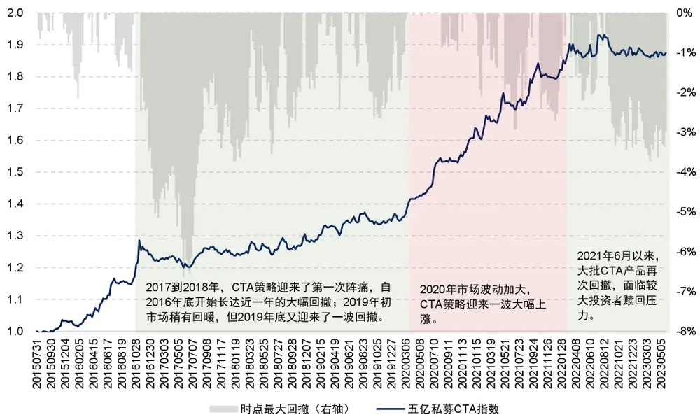
资料来源：朝阳永续，国信证券经济研究所整理

图 1中绿色区域标识出了净值曲线水平波动剧烈且动态回撤较大的区间，这代表着 CTA 策略在这段时间表现较差。如 5 亿私募 CTA 指数 2017 年全年收益率仅为 0.08%，但是当年的最大回撤却为 6.63%。而红色区域则标识净值曲线稳步上升且动态回撤较小的区间，所对应的时间为 2020 年初-2021 年。其中，2020 年5 亿私募 CTA 指数收益率为 19.38%，2021 年收益率为 11.54%。CTA 策略在这段时间表现较好。

私募 CTA 指数代表特定规模私募群体的平均表现，下面我们来观察 CTA领域中头部私募中产品的表现。表 1 展示了 5 只头部 CTA量化私募的 CTA产品自 2022年 6月 2日以来的业绩情况。

表1：2022年6 月来头部量化 CTA私募产品业绩情况

|  | 20220602-20230528 区间收益 | 20220602-20230528 区间最大回撤 | YTD 收益 | YTD 最大回撤 |
| --- | --- | --- | --- | --- |
| 产品A | -34.22% | -37.74% | -7.16% | -8.58% |
| 产品B | -28.29% | -29.53% | -17.06% | -19.75% |
| 产品C | -13.41% | -16.98% | -7.53% | -8.49% |
| 产品D | -5.59% | -9.30% | -2.50% | -4.78% |
| 产品E | -5.62% | -8.83% | -3.16% | -4.15% |

资料来源：朝阳永续，国信证券经济研究所整理

观察表 1可以发现这 5只 CTA产品近一年收益全部为负且有着较大的回撤，其中两只产品跌幅和回撤幅度甚至超过 20%。

表1充分表明了2022年来俄乌冲突、联邦基金利率上调等经济政治大事件对CTA市场的冲击，也从侧面展现了我国 CTA市场正处于水深火热之中。图 2 展示了这5 只 CTA产品的净值走势图。

图2：头部量化 CTA 私募产品净值图
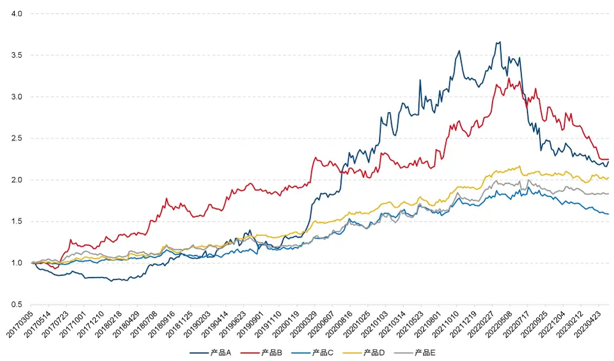
资料来源：朝阳永续，国信证券经济研究所整理

从图 2 中，我们可以看到 5条净值曲线于 2017 年至 2019 年上半年均处在横向波动的状态中，收益并不显著。2019 年中至 2022 年 6 月大多数产品均体现出较好的收益特征。但自 2022 年 6 月开始全部呈现下滑趋势。通过图 2 我们也可以清晰直观地感受到此次回撤的幅度之大与影响之深。

## CTA 策略表现不佳原因分析

归结 CTA策略失效的原因，往往离不开市场的波动率。Fung and Hsieh（2001）中提出趋势跟随类策略的收益率特性与回溯跨式期权（lookback straddles）相似，因此 CTA 策略的收益与市场波动息息相关，商品市场的波动率很大程度决定了

CTA策略是否可以盈利。当市场在波动率处在上行阶段或者维持高波动时，CTA策略往往能够盈利；而在波动率下行或者长期维持较低水平时，CTA策略往往表现不佳。

图 3展示了 2016年以来Wind商品指数收盘价收盘价点位与对应20日波动率的情况。绿色虚线区域代表了商品市场波动率下行的时期，同时也是 CTA策略表现不佳的时期，如 2017、2018 以及 2022 年；红色虚线区域是波动率上行的时期，同样也与 2020 和 2021 年 CTA表现比较好的时期相一致。

图3：Wind 商品指数 (CCFI.WI)收盘价及近 20 日波动率
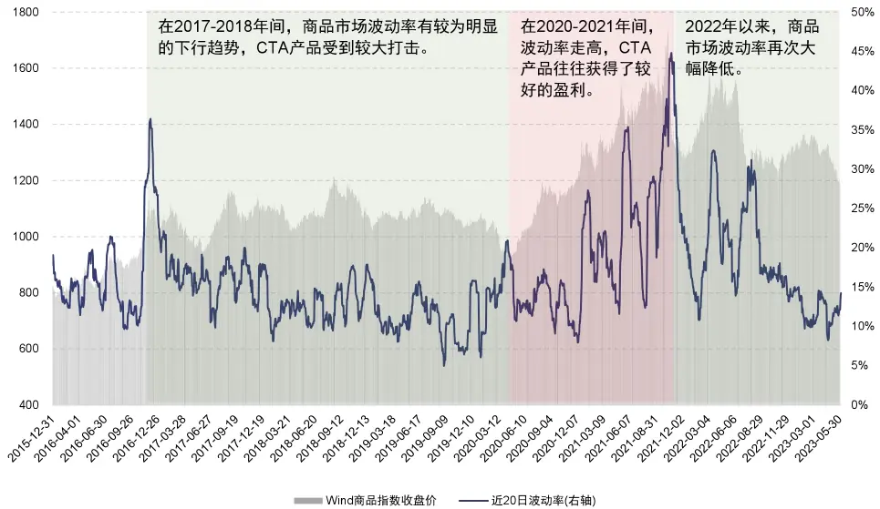
资料来源：WIND，国信证券经济研究所整理

从图 3 中可以看到，在 2017-2018 年间，商品市场波动率有较为明显的下行趋势，在此期间许多 CTA 产品都产生了较大回撤，CTA 产品的数量也随之大幅下降；随后在 2020-2021 年间，波动率走高，CTA产品大多获得了较好的盈利；自 2022年以来，商品市场波动率再次大幅降低，CTA产品继 2018 年以来再次受到较大打击。从当前时点来看，商品指数波动率仍在近十年的历史较低位横盘振荡。

一年多以来，CTA市场除了受到俄乌冲突、美联储加息等地缘政治以及国际经济等因素影响之外，还受到了我国政策的影响。其中较为典型的就是煤矿相关的期货交易。2021年初全球范围内实行普遍的货币宽松政策，加上经济复苏带来的需求扩大，焦煤价格大幅上涨。在此期间，那些做多黑色系的管理人收益不菲。然而于2021年10月19日，发改委发布《国家发展改革委研究依法对煤炭价格实行干预措施》（以下简称《干预措施》），指出当前煤价的涨幅已经完全脱离了供求的基本面，国家将依法对其实施干预。随着国家宏观政策的紧急收紧，焦煤价格急速反转，出现了剧烈回落。这破坏了中长期趋势追踪策略的盈利条件，导致了回撤的发生。

除此之外，郑州交易所于2022年8月4日发布《关于动力煤期货2308合约有关事项的公告》。该公告规定了动力煤期货的保证金为50%，且对仓位进行限制，规定非期货公司会员单日开仓的最大数量为20手。

图4所展示的是动力煤（ZC.CZC）期货合约2021年以来的K线走势以及成交量，可以看到上述这些限制直接导致如今动力煤期货鲜有交易。

图4：动力煤(ZC.CZC)2021 年至今周K 线及成交量变化
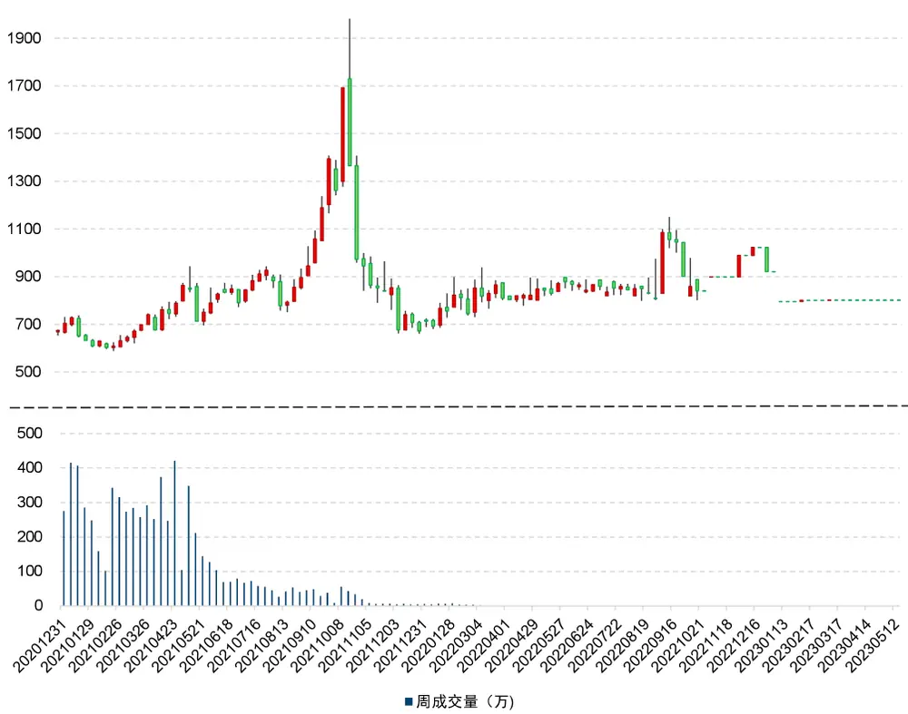
资料来源：Tinysoft，国信证券经济研究所整理

综上所述，我们在进行CTA策略的开发和研究时，应着重思考两个问题，一个是对传统CTA信号的优化，传统CTA信号通常只有三个状态：1，0，-1。即满仓多仓，空仓，满仓空仓。鲜有对开仓信号强弱的判断，信号状态较为离散。是否可以通过对信号强弱的判断使开仓信号状态连续化？另一个问题是，既然期货价格的波动对CTA策略的影响较大，那么在开平仓的设计中是否应考虑波动的影响？下面我们将对这两个问题进行分析和探讨。

## 传统 CTA 信号分析

CTA策略中的交易信号是一种指示或触发交易的信号或条件。这些信号通过技术分析指标、市场数据和策略规则计算得出，用于确定何时买入或卖出标的。传统的CTA交易信号只能决定开仓的方向，信号（Signal）只有三种取值，即0、1、-1，分别代表着平仓，多仓，空仓，意味着开仓信号只有满仓与空仓两个状态，例如，传统均线穿越策略的信号则呈现此特征。

## 均线穿越策略

均线穿越策略是另一种常见的趋势跟随策略，它基于移动平均线的交叉信号来确定买入和卖出时机。这个策略的基本原理是在趋势形成时开仓，持有资产直到趋势反转。当短均线从下而上穿越长均线时，表明形成了多头趋势，此时开仓做多。当长均线自下而上穿越短均线时，表明形成了空头趋势，此时开仓做空。

具体而言，我们首先确定两条移动平均线，分别是短期均线和长期均线。两条均线均使用移动平均（EMA）算法。

$$
\left\{\begin{array}{lcl}{EMA_{i}=Close_{i}}&{,i=1}\\{EMA_{i}=Close_{i}*K+EMA_{i-1}*(1-K)}&{,i>1}\end{array}\right.
$$

其中，E �为E �值，C l �为收盘价，i 表示第 i 根 K 线，公式中�为收盘价系数，1−�为上一个E �系数，其中 $K=2/(Length+1)$ 。

我们定义长均线的��e �ℎ为 $Len_{1}$ ，短均线的��e �ℎ为���2。我们将短均线与长均线作差得到指标����。最终我们以����来作为判断�e �C 的标准：

$$
signal=\left\{{\begin{array}{l}{{1if{\cal{D}}iff_{i}>0\ and{\cal{D}}Iff_{i}>mean({\cal{D}}iff_{i-Len_{2}+1}+...+{\cal{D}}iff_{i})}}\\{-1if{\cal{D}}iff_{i}<0\ and{\cal{D}}Iff_{i}<mean({\cal{D}}iff_{i-Len_{2}+1}+...+{\cal{D}}iff_{i})}\end{array}}\right.
$$

其中， $Len_{1}=100,Len_{2}=10$ o

图5：均线穿越交易案例
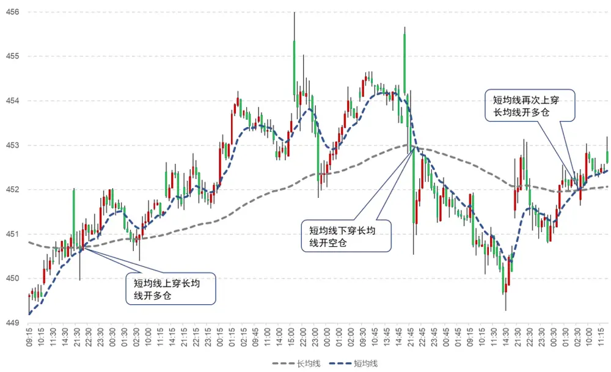
资料来源：Tinysoft，国信证券经济研究所整理

图5展示的是在2023年5月8日至2023年5月15日期间，黄金合约（AU.SHF）15 分钟 K 线数据对应的均线穿越案例（包括多头以及空头交易信号案例）。图中蓝色线为短期均线，灰色线为长期均线。

从策略的逻辑中可以看出，当短均线上穿长均线时，触发多仓信号，此时 Signal=1。
短均线下穿长均线时，触发空仓信号，此时 Signal=-1。

下图展示了上述 EMA 均线穿越策略的净值表现及对应时点的滚动最大回撤（文中测试结果均考虑交易手续费为 0.3%%，冲击成本为 1%%）。

可以看到，虽然策略净值整体上呈现出上升的趋势，但是在如 2011年、2017 年、2018 年以及 2022 年等年份均出现了一定的回撤，滚动回撤最高超过 14%。在2017 年至 2018 年间，EMA 均线穿越策略的净值出现了长期持续的回撤，表现明显不佳。

图6：EMA 均线穿越策略净值及动态回撤
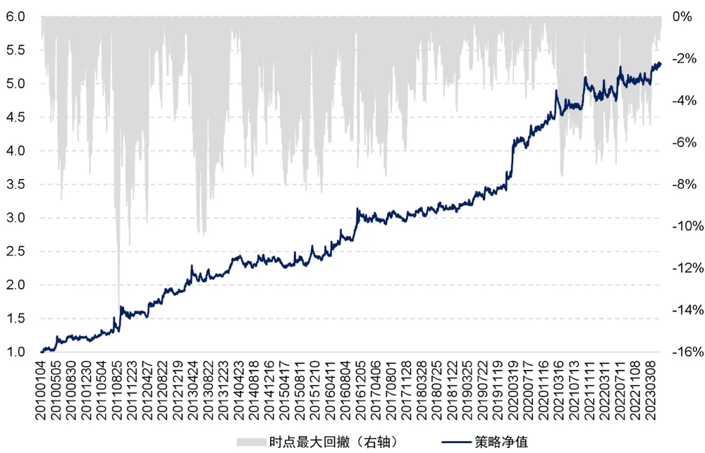
资料来源：Tinysoft，国信证券经济研究所整理

表 2展示了 EMA 均线穿越策略分年度的回测统计结果。可以看到，在 2016 年之前，EMA 均线穿越策略的收益、夏普率、Calmar 比率以及月度胜率均较高；但在 2016 年以后，除了 2019 及 2020 年以外，策略的收益及胜率均有明显的下滑。其中，EMA 均线穿越策略年化费后收益率为 13.06%，夏普率为 1.03，Calmar为 0.93。可以看出，策略缺乏稳定性。

表2：EMA均线穿越策略绩效分年度统计

| 年份 | 策略收益 | 最大回撤 | 夏普率 | 波动率 | Calmar | 月度胜率 |
| --- | --- | --- | --- | --- | --- | --- |
| 2010 | 23.40% | 8.70% | 1.40 | 16.76% | 2.69 | 66.67% |
| 2011 | 26.02% | 13.98% | 1.16 | 22.43% | 1.86 | 75.00% |
| 2012 | 24.43% | 5.65% | 1.76 | 13.89% | 4.32 | 75.00% |
| 2013 | 12.17% | 10.45% | 0.87 | 14.05% | 1.17 | 58.33% |
| 2014 | 8.31% | 7.60% | 0.88 | 9.48% | 1.09 | 58.33% |
| 2015 | 3.05% | 8.32% | 0.25 | 12.01% | 0.37 | 66.67% |
| 2016 | 24.29% | 7.18% | 1.70 | 14.30% | 3.38 | 58.33% |
| 2017 | 0.75% | 5.64% | 0.09 | 8.42% | 0.13 | 41.67% |
| 2018 | 2.01% | 4.52% | 0.28 | 7.25% | 0.44 | 58.33% |
| 2019 | 12.31% | 3.51% | 1.62 | 7.61% | 3.51 | 75.00% |
| 2020 | 28.73% | 3.87% | 2.24 | 12.85% | 7.43 | 83.33% |
| 2021 | 7.15% | 7.64% | 0.81 | 8.87% | 0.94 | 58.33% |
| 2022 | 5.68% | 6.11% | 0.54 | 10.47% | 0.93 | 58.33% |
| 20230531 | 4.39% | 3.37% | 0.61 | 7.22% | 1.30 | 80.00% |
| 全样本期 | 13.06% | 13.98% | 1.03 | 12.70% | 0.93 | 64.60% |

资料来源：Tinysoft，国信证券经济研究所整理

结合以上分析可以看到，在传统信号下，当短均线上穿长均线且二者距离走阔时，我们即选择开多仓（Signal=1）；当短均线下穿长均线且二者距离走阔时，即选择开空仓（Signal=-1）。策略没有空仓状态，在开仓之后，直到反向信号出现，则反手开仓。

因此，可以看出，EMA 均线穿越策略无法对信号强弱进行有效刻画。因此策略将每次均线穿越的过程不加以区分，均满仓开仓。而每次穿越轨道线时是否完全没有区别呢？我们来看下面这个案例：

图7：短均线上穿长均线后一路向上
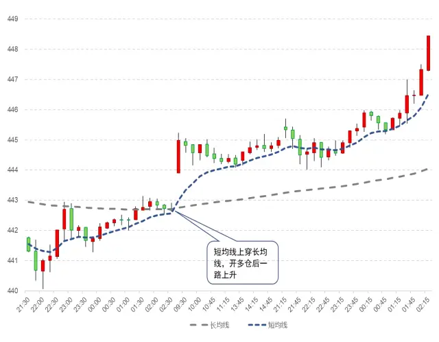
资料来源：Tinysoft，国信证券经济研究所整理

图8：短均线上穿长均线后横盘震荡
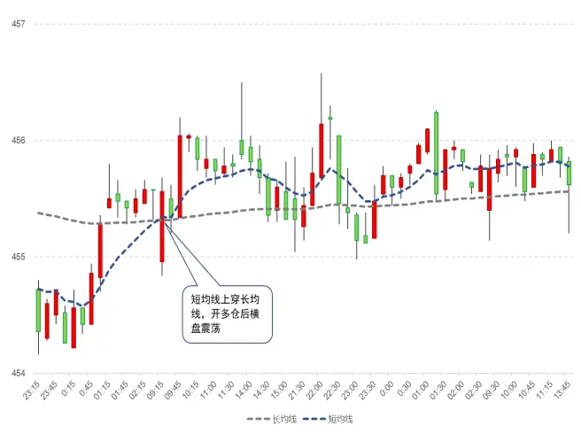
资料来源：Tinysoft，国信证券经济研究所整理

观察图 7我们发现，短均线上穿长均线后一路上升势不可挡，这意味着本次开仓将会为我们带来巨大的收益。然而图 8却展示了一种完全不同的情况，在短均线上穿长均先后，短均线并未延续上升态势而是长时期横盘震荡，这意味着本次开仓并不会带来很高收益。很明显图 7和图 8 的两个信号会带来完全不同的结果，所以不同的穿越是有区别的。

由此可知，在实际市场中，每次触发信号的情况都是不同的，信号有强弱之分，不同强弱的信号代表了趋势的强弱以及可持续性。因此，如果我们能将传统的CTA信号的三种状态转换成连续的交易信号，来对每次信号的强弱加以区分，较强的开仓信号对应较高的仓位，较弱的开仓信号对应较低的仓位，那么我们策略将会蕴含更多的信息。具体公式如下：

$$
Position_{i}=Lev_{i}*Signal_{i}
$$

其中，�l ����� 为第�个标的开仓权重，��� 为第�个标的的杠杆率，即当前开仓手数占整体资金规模可开仓手数的比例。此杠杆率水平由附录 2 中海龟资金管理法来确定。�e �C �为交易信号。接下来，我们将对如何刻画交易信号的强弱进行研究。

## 如何刻画信号强弱

上文提到，传统的CTA信号无法刻画信号强度，但信号强度往往蕴含着丰富的信息，因此我们试图去寻找能够刻画CTA信号强弱的方法。在此，我们将CTA信号强度分为两种，分别是开仓时点信号强弱与开仓后信号持续度。

图9展示了传统信号经信号强弱优化后的示意图。

图9：传统信号优化示意图
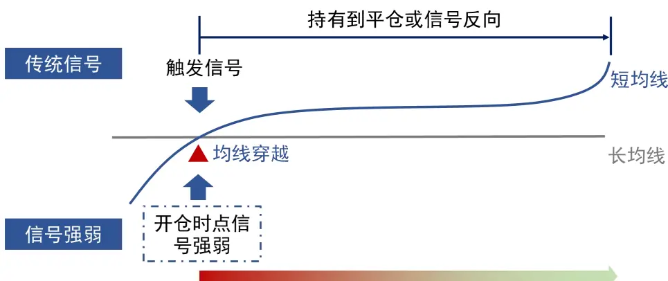
开仓后实时判断信号持续度
资料来源：国信证券经济研究所绘制

我们对传统信号进行的优化主要体现在两方面：首先，在判断是否开仓时，我们在传统信号的基础上进行了开仓时点信号强弱的判断（关于开仓信号强弱的判断的详细说明见本章开仓时点信号强弱一节），只有当信号通过了过滤条件，我们才进行开仓操作；其次，在开仓之后，不同于传统信号值恒为1或-1直至平仓或者信号反向的设定，我们会在持仓阶段实时监控信号持续强弱的变化（判断信号持续强弱的详细说明见本章信号持续度一节），并用价格在未来上升和下降趋势的概率差来对信号值进行实时调整，使得�e �C 不再局限于1、-1、0，而是反映了每一时刻未来价格变化的期望。

开仓时点信号强弱是指通过判断触发开仓信号强度或置信度来决定开仓与否。它用于衡量开仓信号的可靠性和预测能力，帮助决策是否执行开仓操作。

## 海龟资金管理法

开仓信号强度可以与资产的波动率相关联，较高的波动率可能表示信号的强度较高，而较低的波动率可能表示信号的强度较低。

海龟资金管理法是一种风险管理策略，该策略针对资产的波动来进行风险控制。波动幅度是指资产价格在一定时间内的波动程度。不同品种的波动性可能存在差异，某些品种可能更具波动性，而其他品种可能相对较稳定。因此，为了使策略在各个品种上的风险保持一致，我们需要根据品种的振幅进行交易量的调整。具体可参考附录2中海龟资金管理法。

海龟资金管理法确定杠杆率的具体计算公式为：

$$
\begin{array}{c}{{Lev_{ATR}=\displaystyle\frac{Pos_{ATR}}{Pos}=\displaystyle\frac{0.5\%}{ATR}\ast Close}}\\{{\mathbb{A}\mathbb{I}\colon\displaystyle\frac{ATR}{Close}=\displaystyle\frac{0.5\%}{Lev_{ATR}}}}\end{array}
$$

其中， $Pos_{ATR}$ 为1单位���对应资金规模0.5%波动的应开手数, �l 为全部资金对应满仓可开手数，C l �为收盘价， $Lev_{ATR}$ 为应开手数除以满仓手数的开仓杠杆率。由上面算法计算出来的开仓杠杆率具有根据���波动调整杠杆率大小的特性。

���与收盘价的比值衡量了价格振幅比率的大小，如果二者比值小于0.5%，则说明此时开仓杠杆率 $Lev_{ATR}>1$ ，此时波动较小，开仓信号较强；如果二者比值大于0.5%，则说明开仓杠杆率 $Lev_{ATR}<1$ ，此时波动较大，开仓信号较弱。我们对波动较小$(Lev_{ATR}>1)$ 以及波动较大 $(Lev_{ATR}<1)$ 时的策略表现进行了测试，测试结果如表3所示：

表3：波动调整杠杆率大小对策略绩效表现的影响

|  | 单笔收益率均值 | 单笔收益率标准差 | 单笔收益率下四分位 | 单笔收益率上四分位 |
| --- | --- | --- | --- | --- |
| $Lev_{ATR}<1$ | -0.15% | 0.41% | -0.12% | 0.01% |
| $Lev_{ATR}>1$ | 0.28% | 0.63% | 0.06% | 0.27% |
| 不加入LevATR过滤信号 | 0.25% | 0.72% | 0.03% | 0.21% |

资料来源：Tinysoft，国信证券经济研究所整理

从表3中可以看出，在传统信号的基础上加入 $.Lev_{ATR}>1$ 作为开仓过滤信号的表现要明显优于 ${Lev}_{ATR}<1$ 的表现；并且相对于传统信号，加 $\lambda Lev_{ATR}>1$ 过滤信号后策略的单笔收益率均值和上、下四分位均有所提升，收益的波动率降低。由此可见，将价格波动幅度作为开仓过滤信号的效果较为有效。因此，当开仓杠杆率 ${.Lev}_{ATR}<1$ ，即波动较小时，即使此时传统信号为1，我们依然平仓操作。

## 对价格变化中噪音的度量

[Turan G Bali、Nusret 等人@2011]研究了彩票型股票（近期出现极端收益的股票）的表现，发现遵循平滑价格路径的高动量股收益相较遵循跳跃价格路径的高动量股收益更高。[Da, Gurun 等人@2012]提出了投资者对信息反应不足的“温水煮青蛙”效应，同样证实了平滑的动量得到的关注更少，因而产生的动量效应更强大。由于 CTA策略往往依赖于价格的动量效应，因此我们认为价格变化的平稳程度可以作为 CTA信号强弱的另一种衡量方式。

具体而言，我们通过计算过去一段时间资产价格路径的位移路程比来作为我们的趋势噪音指标（��� T �������l ������）。趋势噪音指标中趋势的部分为一段时期内价格变化的主要趋势，可以用价格区间变动的“位移量”来衡量；而噪音部分则衡量了在大趋势下每个具体时刻价格相对于趋势的偏离程度。因此，趋势噪音衡量了价格变化的平稳程度。我们通过比较当日趋势噪音和 3日前趋势噪音的大小，可以判断出当前价格变化中的“噪音”是否在不断减少。当价格变化的“噪音”越来越小时，我们认为此时的信号较强。

具体来说，我们对于价格在某一时刻的趋势噪音衡量如下：

$$
TNR_{t,N}=\frac{|Close_{t}-Close_{t-N}|}{\sum_{i=t-N+1}^{t}|Close_{i}-Close_{i-1}|}
$$

其中， $TNR_{t,N}$ 代表在时刻�回看�期的价格趋势噪音，C l �代表价格，分子 $|Close_{t}-$ $Close_{t-N}|$ 表示期初与期末价格变化的绝对值，即价格曲线发生的“位移”；分母$\begin{array}{r}{\sum_{i=t-N+1}^{t}|Close_{i}-Close_{i-1}}\end{array}$ |表示在回看期内每次价格变动的绝对值之和，即价格曲线走过的“路程”。

下图通过一个例子展示了���的计算方式，蓝色曲线表示了某一资产的价格在一段时期内的变化曲线。在这段时期内，该价格曲线的“位移”为 X，即为示意图中红色箭头表示的部分；所经的“路程”为�，为示意图中灰色箭头表示的部分，将所有灰色箭头的长度相加，即得到了价格曲线走过的“路程”。当实现位移的路程增加，则意味着价格在从开始点到结束点的过程中徘徊的时间较长，因此，价格中所包含的噪音越强。反之，如果价格较为直接的由起始点走到了结束点，则表明价格中的噪音较弱。

图10：TNR 计算示意图
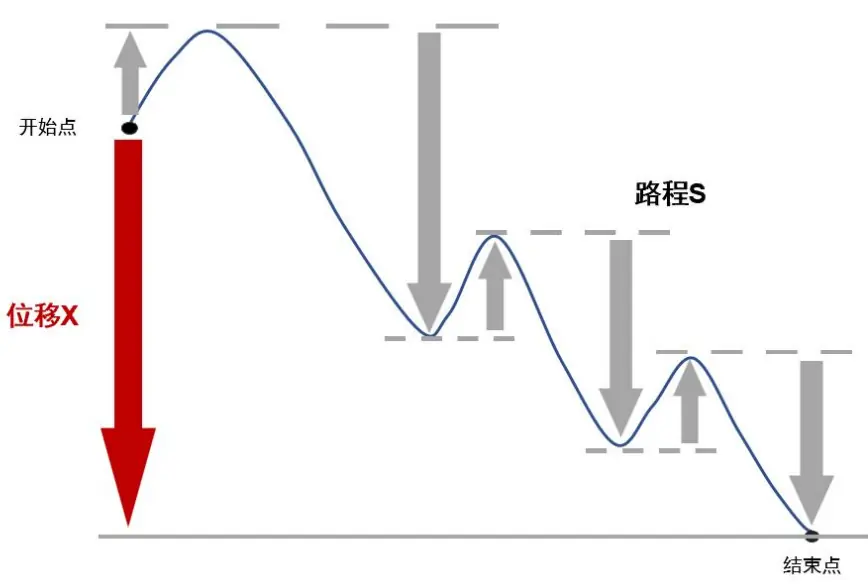
资料来源：国信证券经济研究所绘制

此外，在一段时期内位移量相同的价格曲线所对应的路径却可能相差很多。下图中左侧示意图展示了在无噪音状态下的价格变化曲线，此时价格变化的位移等于路程，��� = 1；中间示意图展示了在一定噪音下的价格变化过程，此时��� = 0.1；而右侧示意图所代表的价格波动程度要高于左侧的两图，在价格的变化过程中蕴含了更多的噪音，此时对应的 $TNR=0.01$ 。从中我们可以直观地观察到，当价格变化的趋势越明显、蕴含的噪音越小时，价格变化越平稳，���值越大。

图11：不同价格变化路径示意图
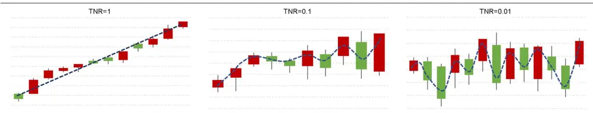
资料来源：国信证券经济研究所绘制

接下来，基于上述计算的���值的大小，我们对���的变化趋势进行了进一步的判断，计算方法为将当前时刻的���值减去�时刻前的���值。具体公式如下：

$$
\Delta TNR_{t,k}=TNR_{t}-\frac{\sum_{i=0}^{k-1}TNR_{t-i}}{k}
$$

其中， $TNR_{t}$ 为当期时刻的趋势噪音比， $\frac{\sum_{i=0}^{k-1}TNR_{t-i}}{k}$ 为过去�期的趋势信噪比平均值，$\Delta TNR_{t,k}$ 衡量了在过去�期趋势噪音比的变化情况：如果 $\Delta TNR_{t,k}$ 为正，则说明在过去这段对应时期���在增大，即价格变化中的噪音在减小；反之说明价格变化中的噪音在增大。特别地，我们设定 $k=3$

最后，我们同样将趋势噪音比���纳入衡量开仓信号强弱的指标，只有当 $\Delta TNR>$ 0，即价格变化中的噪声在减小时，我们才进行开仓操作。

表4：趋势噪音比变化大小对策略绩效表现的影响

|  | 单笔收益率均值 | 单笔收益率标准差 |  | 单笔收益率下四分位 单笔收益率上四分位 |
| --- | --- | --- | --- | --- |
| ΔTNR > 0 | 0.29% | 0.87% | 0.02% | 0.22% |
| ∆TNR < 0 | 0.14% | 0.33% | 0.02% | 0.14% |
| 不加入ΔTNR过滤信号 | 0.25% | 0.72% | 0.03% | 0.21% |

资料来源：Tinysoft，国信证券经济研究所整理

从表4可以看出，在传统信号的基础上加入∆���>0 作为开仓过滤信号后，策略的表现不论是相对于∆���<0时还是不加入∆TNR过滤信号时表现均有所提升。由此可见，在价格趋势的噪音减小时开仓效果较为有效。

至此，我们通过对价格波动强弱（由���与收盘价的比值计算）和价格的噪音变化趋势（通过趋势噪音比计算）进行刻画，完成了对开仓信号强弱部分的刻画。

在将开仓信号强弱加入开仓条件之后，策略的净值走势及回撤情况如下图 12所示。

图12：加入开仓信号强弱后的策略净值及时点最大回撤
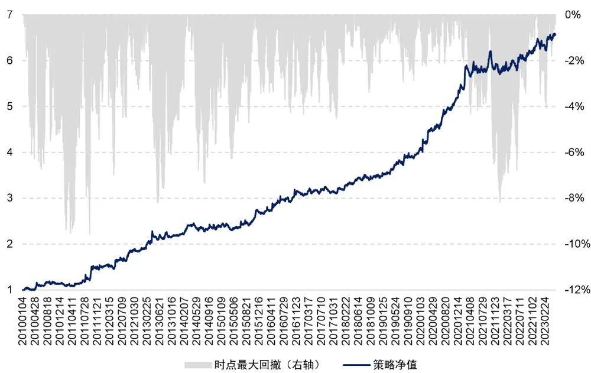
资料来源：Tinysoft，国信证券经济研究所整理

表 5展示了加入开仓信号强弱后策略绩效的分年度统计结果。将传统 CTA信号进行开仓信号强弱改进之后，策略的费后年化收益为 14.87%、夏普率为 1.38、Calmar 为 1.55，均相对于改进前有所提升；最大回撤为 9.59%，相对于之前的13.98%有明显降低。

表5：加入了开仓信号强弱后策略绩效的分年度统计结果

| 年份 | 策略收益 | 最大回撤 | 夏普率 | 波动率 | Calmar | 月度胜率 |
| --- | --- | --- | --- | --- | --- | --- |
| 2010 | 16.10% | 6.73% | 1.09 | 14.79% | 2.39 | 66.67% |
| 2011 | 29.87% | 9.59% | 1.55 | 19.21% | 3.12 | 66.67% |
| 2012 | 26.95% | 6.97% | 1.95 | 13.79% | 3.87 | 83.33% |
| 2013 | 15.45% | 8.21% | 1.21 | 12.80% | 1.88 | 66.67% |
| 2014 | 7.37% | 7.36% | 0.85 | 8.69% | 1.00 | 50.00% |
| 2015 | 13.27% | 6.13% | 1.37 | 9.66% | 2.16 | 83.33% |
| 2016 | 15.46% | 4.27% | 1.55 | 9.95% | 3.62 | 66.67% |
| 2017 | 3.34% | 4.54% | 0.53 | 6.32% | 0.73 | 58.33% |
| 2018 | 7.56% | 3.40% | 1.28 | 5.90% | 2.22 | 58.33% |
| 2019 | 17.87% | 2.92% | 2.50 | 7.14% | 6.12 | 75.00% |
| 2020 | 31.33% | 2.25% | 3.29 | 9.52% | 13.91 | 75.00% |
| 2021 | 7.43% | 7.71% | 0.93 | 7.97% | 0.96 | 66.67% |
| 2022 | 11.51% | 3.63% | 1.64 | 7.01% | 3.17 | 66.67% |
| 20230531 | 2.58% | 3.45% | 0.40 | 6.42% | 0.75 | 60.00% |
| 全样本期 | 14.87% | 9.59% | 1.38 | 10.76% | 1.55 | 67.70% |

资料来源：Tinysoft，国信证券经济研究所整理

当上述开仓信号触发后，我们进行开仓操作，随后，我们将对开仓后信号的持续度进行跟踪，并且根据信号的持续度来确定信号的强弱。

首先，我们引入了两个变量，当触发多头开仓信号时， $Long=1\mathrm{~;~}Short=0$ ；反之，当触发空头开仓信号时，则 $\mathit{Long}=0;\mathit{Short}=1$

在确定了开仓信号的方向之后，我们在每个时刻对价格未来上涨和下跌的概率做预测。首先对于初始时刻，我们假定：

$$
\begin{array}{ll}{Up~Prob_{t=t_{0}}}&{=0.5}\\{Down~Prob_{t=t_{0}}}&{=0.5}\end{array}
$$

其中， $t_{0}$ 表示第一次触发开仓条件的时间点， $UpProb_{t}$ 表示�时刻价格上涨的概率，���� $Prob_{t}$ 表示�时刻价格下跌的概率。特别地，我们设定，在初始 $t_{0}$ 时刻价格上涨和下跌的概率相等，均为 0.5。

对于 $t_{0}$ 之后的每个时刻，价格上涨和下跌的概率均与前一时刻价格涨跌的概率以及是否触发多头或空头信号有关：

$$
\left\{\begin{array}{ll}&{UpProb_{t}\quad=\quad UpProb_{t-1}+0.5*\quad(DownProb_{t-1}*Long_{t}-UpProb_{t-1}*Short_{t})}\\&{DownProb_{t}\quad=\ :DownProb_{t-1}+0.5*\quad(UpProb_{t-1}*Short_{t}-DownProb_{t-1}*Long_{t})}\end{array}\right.
$$

其中， $UpProb_{t-1}$ 表示前一时刻价格上涨的概率， $DownProb_{t-1}$ 表示前一时刻价格下跌的概率； $Long$ 表示当前是否触发了多头开仓信号，若触发了多头开仓信号，则 $Long_{t}$ 为 1，否则为 $0;~Short_{t}$ 表示当前是否触发了空头开仓信号，若触发了空头开仓信号，则 $Short_{t}$ 为 1，否则为 0。此外，值得注意的是，在任意时刻�，均满足 $Up~Prob_{t}~+Down~Prob_{t}=1$ C

$$
U2P_{t}=UpProb_{t}-DownProb_{t}
$$

其中， $U2P_{t}$ 表示�时刻价格涨跌的期望，即若上涨事件取值为 1，下跌事件取值为-1，各自事件乘以各自事件发生的概率后求和。

为方便理解，我们通过如下案例进行解释。图 13 所展示的是信号每次触发之后

价格上涨以及下跌概率的变化情况。

图13：信号触发后价格涨跌概率计算示意图
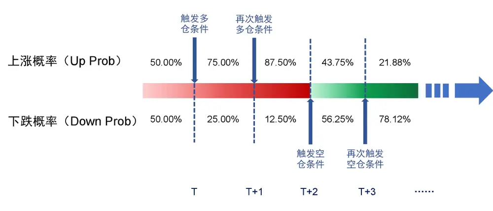
资料来源：国信证券经济研究所绘制

我们假设当前时刻 T为 $\mathfrak{t}_{0}$ 的下一时刻，即 $\mathrm{T}=\mathrm{t}_{0}+1$ ，且触发了多头开仓信号，即$\mathrm{Long_{T}}=1$ $\mathrm{Short}_{\mathrm{T}}=0$ 。若在 $\mathrm{t}_{0}$ 时刻为初始时刻，则在 T时刻价格上涨和下跌的概率分别为：

$$
\begin{array}{r}{\begin{array}{c}{UpProb_{T}=UpProb_{t_{0}}+0.5*\ (DownProb_{t_{0}}*Long_{T}-UpProb_{t_{0}}*Short_{T})}\\{=0.5*0.5*(0.5*1-0.5*0)}\\{=0.75}\\{DownProb_{T}=DownProb_{t_{0}}+0.5*\ (UpProb_{t_{0}}*Short_{T}-DownProb_{t_{0}}*Long_{T})}\\{=0.5+0.5*(0.5*0-0.5*1)=0.25}\end{array}}\end{array}
$$

则： $U2P_{T}=UpProb_{T}-DownProb_{T}=0.75-0.25=0.5$

如果在接下来的时刻，价格仍上涨，那么 $Up\ Prob$ 将持续增加，����T r 将持续减小，最终将导致二者的差值�2�持续上升。

当 $U2P$ 的绝对值大于 0.2 时，进行开仓操作，并且根据价格涨跌的概率来确定$Signal$ 的取值：

$$
{Signal}_{t}=\left\{\begin{array}{rlrl}&{{Up}{Prob}_{t}}&&{,{U2P}_{t}>0.2}\\&{{Down}{Prob}_{t}}&&{,{U2P}_{t}<-0.2}\\&{0}&&{,-0.2\le{U2P}_{t}\le0.2}\end{array}\right.
$$

其中， $U2P_{t}$ 表示 t时刻价格涨跌期望， $Up\ Prob_{t}$ 和 $DownProb_{t}$ 分别表示 t时刻价格上涨和下跌的概率。当 $U2P_{t}<-0.2$ 时， $Signal$ 等于下跌概率，当 $U2P_{t}>0.2$ 时， $Signal$ 等于上涨概率。

在考虑了信号持续度强弱之后，策略的净值走势及回撤如图 14 所示。

图14：考虑了信号强弱后的策略净值及时点最大回撤
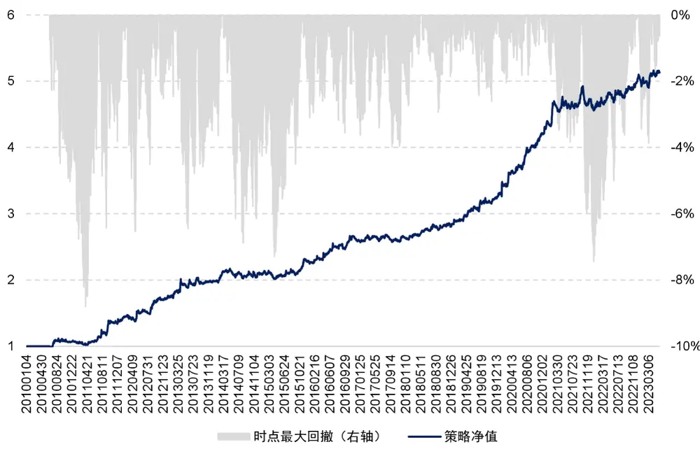
资料来源：Tinysoft，国信证券经济研究所整理

从表 6 所展示的考虑了信号强弱后策略的分年度统计结果中可以看到，将传统CTA信号进行信号强弱改进之后（包括开仓信号强弱以及信号持续度），策略的费后年化收益为 12.8%、夏普率为 1.45、Calmar 比率为 1.45。

相比于仅进行开仓信号过滤的改进方法，加入信号持续度之后的策略表现的提升主要体现在降低了策略的回撤和波动率，此时策略的最大回撤、波动率由之前的9.59%、10.76%分别下降到 8.8%和 8.85%，夏普率由之前的 1.38 增加到 1.45。

表6：考虑了信号强弱后策略绩效的分年度统计结果

| 年份 | 策略收益 | 最大回撤 | 夏普率 | 波动率 | Calmar | 月度胜率 |
| --- | --- | --- | --- | --- | --- | --- |
| 2010 | 8.73% | 5.04% | 0.96 | 9.07% | 1.73 | 83.33% |
| 2011 | 28.87% | 6.44% | 1.95 | 14.79% | 4.48 | 66.67% |
| 2012 | 25.45% | 6.54% | 2.10 | 12.13% | 3.89 | 66.67% |
| 2013 | 12.92% | 6.46% | 1.14 | 11.35% | 2.00 | 75.00% |
| 2014 | 5.00% | 6.88% | 0.65 | 7.73% | 0.73 | 50.00% |
| 2015 | 9.24% | 5.90% | 1.14 | 8.08% | 1.57 | 75.00% |
| 2016 | 14.15% | 3.56% | 1.74 | 8.12% | 3.98 | 58.33% |
| 2017 | 1.64% | 3.98% | 0.30 | 5.51% | 0.41 | 58.33% |
| 2018 | 6.37% | 2.94% | 1.20 | 5.30% | 2.17 | 58.33% |
| 2019 | 17.06% | 2.61% | 2.59 | 6.57% | 6.54 | 75.00% |
| 2020 | 30.92% | 2.05% | 3.46 | 8.94% | 15.05 | 83.33% |
| 2021 | 6.37% | 6.99% | 0.89 | 7.16% | 0.91 | 58.33% |
| 2022 | 9.44% | 3.11% | 1.55 | 6.09% | 3.03 | 66.67% |
| 20230531 | 2.32% | 3.03% | 0.38 | 6.03% | 0.76 | 60.00% |
| 全样本期 | 12.80% | 8.80% | 1.45 | 8.85% | 1.45 | 67.08% |

资料来源：Tinysoft，国信证券经济研究所整理

至此，我们完成了对信号持续度强弱的刻画。概括来说，我们首先基于过去时刻价格的涨跌确定了当前时刻价格上涨和下跌的概率，再将涨跌的概率作差，当差的绝对值大于 0.2 时，我们认为此时价格趋势较为清晰，进行开仓操作；并且将信号值确定为此时价格上涨或者下跌的概率，而并非传统信号中简单的 1和-1。

但我们也观察到，在分年度回测的统计结果中，每年策略的波动率水平往往差异较大，比如在 2011和 2012 年，呈现出高波动率、高收益的特征；而在 2017 和2018 年，波动率水平和收益却偏低。因此，我们考虑，是否可以通过对策略的波动率进行调整，以使得策略在不同市场环境下运行的整体风险趋于一致。

## 杠杆设置

从波动率的角度来看，商品交易策略有高波动策略和低波动率策略之分。不同的投资者对于策略波动率水平的选择和接受度也不尽相同。但是对于同一策略而言，一旦策略开始交易，投资者往往希望其波动率处在一个较为稳定的区间，而不是在高波动率和低波动率间不断变化切换。因此，在策略被研发设计之后，我们希望可以通过实时监控这个策略的表现以及风险属性，使得策略每年的波动率都近似为某一我们设定的目标波动率。

具体做法是，我们在每个月月末回看过去一年内策略的运行情况，计算过去一年策略收益表现的波动率，并且将目标波动率设置为 15%（取决于对于策略预期的杠杆率水平，通常维持在 2倍杠杆左右），那么波动率调整系数的计算公式可以表示为：

$$
Mul_{vol}=\frac{15\%}{Vol}
$$

其中， $\mathrm{Mul}_{\mathrm{vol}}$ 为经已实现波动率调整的系数，�C 为策略在过去一年中的已实现波动率。通过对策略表现波动率的调整，可以使得策略在不同市场环境下运行的整体风险趋于一致。

出于实际使用情况考虑，我们设置最大杠杆率为 4 倍杠杆。因此当 Lev 的绝对值大于 4 时，我们截断为 4。在经过已实现波动率调整后，策略平均杠杆率的时序变化如图 15所示。

图15：已实现波动率调整后策略杠杆变化图
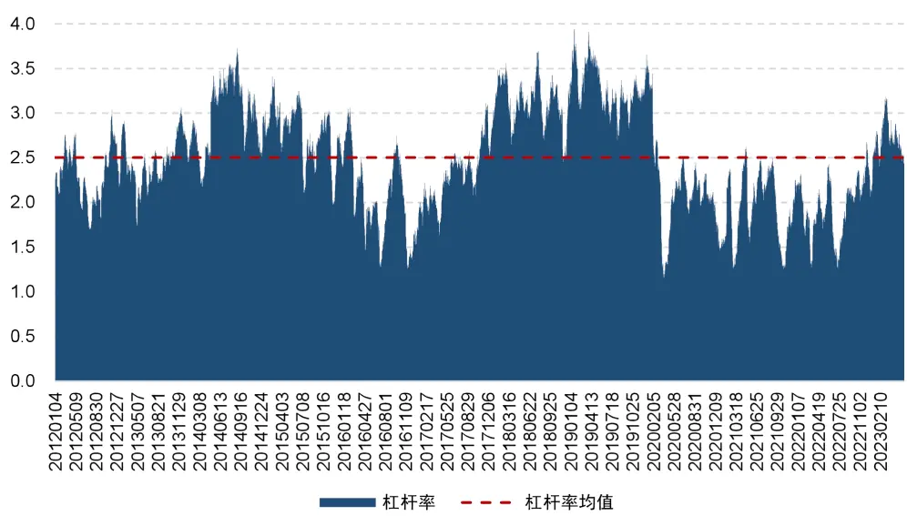
资料来源：Tinysoft，国信证券经济研究所整理

从图 15中看到，策略平均杠杆率为 2.5 倍。在 2014 年间策略的历史杠杆率达到峰值，之后在 2016 年策略杠杆率到达低谷，之后，在 2018-2019 年间，策略的杠杆率再次冲高。2022 年下半年以来杠杆率有所回升，目前杠杆率处在历史均值附近。

至此，策略的全部逻辑已经探讨完毕，策略的最终表现以及相关特性将在下面进行详细阐述与测试。

我们首先从传统的均线穿越策略的基础原理进行了讨论，同时对基础策略进行了测试和优化讨论，在分别进行了开仓时点信号强弱判断以及开仓后通过计算涨跌概率进行信号持续度检测，我们对传统均线穿越策略的信号进行了改进；之后通过已实现波动率调整，我们对策略每年的波动率进行了平滑。最终，我们构建了基于连续信号的商品期货交易策略。

## 基于连续信号的商品期货交易策略构建

具体的策略构建流程如下：

## 投资标的：

过去半年中日均成交额超过 50 亿元的商品期货全品种的主力合约。

## 开仓信号：

每 15 分钟计算商品价格的长短均线、ATR调整下的杠杆率 $(Lev_{ATR})$ 、价格的趋势噪音比变化（∆���）、价格涨跌概率差（�2�）

多头：同时满足长均线位于短均线上方且二者距离扩大、 $Lev_{ATR}>1,\ \Delta TNR<0$ $U2P>0.2$ ；

空头：同时满足短均线位于长均线上方且二者距离扩大、 $Lev_{ATR}>1,\ \Delta TNR<0$ �2� <− 0.2。

## 信号调整：

开仓信号为多头时，开仓信号为价格此时上涨的概率；

开仓信号为空头信号时，开仓信号为价格此时下跌的概率。

## 杠杆率调整：

ATR调整：海龟资金管理法（1 单位 ATR 的波动对应策略整体资金规模的 0.5%，详见附录 2—海龟资金管理法）

已实现波动调整：以过去一年策略波动率为基准设置目标年化波动 15%

最终杠杆率：ATR调整杠杆*已实现波动调整杠杆，最高 4倍杠杆截断。

## 资金分配：

满足开仓条件品种等权分配资金。

## 成交价格：

信号触发后 5分钟 VWAP。

## 交易成本：

交易手续费 0.3%%，冲击成本 1%%。

综上所述，在经过信号的过滤、信号持续性以及杠杆率调整后，便形成了基于连续信号的商品期货交易策略，至此，回顾策略的构建流程用一个流程图可表示如图 16 所示：

图16：基于连续信号的商品期货交易策略流程图
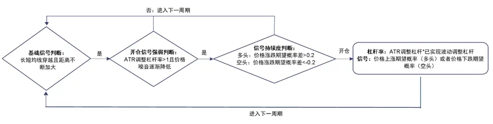
资料来源：国信证券经济研究所绘制

按照上述流程构建的基于连续信号的商品期货交易策略历史表现稳定且具有较高收益率，同时回撤可控。具体走势如图 17 所示：

图17：基于连续信号的商品期货交易策略净值
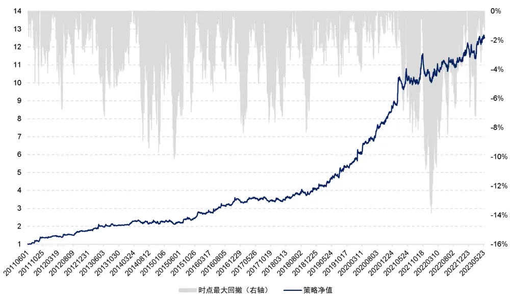
资料来源：Tinysoft，国信证券经济研究所整理

2011 年 6月以来，基于连续信号的商品期货交易策略费后年化收益率为 23.1%，夏普率为 1.71，Calmar比率为 1.67，表现较为稳健。其中，策略的分年度收益表现如表 7 所示：

表7：基于连续信号的商品期货交易策略绩效分年度统计

|  | 策略收益 | 最大回撤 | 夏普率 | 波动率 | Calmar | 月度胜率 |
| --- | --- | --- | --- | --- | --- | --- |
| 2011 | 41.53% | 5.08% | 2.09 | 19.87% | 8.17 | 71.43% |
| 2012 | 27.06% | 6.72% | 2.15 | 12.60% | 4.03 | 66.67% |
| 2013 | 16.10% | 7.21% | 1.21 | 13.29% | 2.23 | 66.67% |
| 2014 | 7.21% | 9.69% | 0.57 | 12.57% | 0.74 | 50.00% |
| 2015 | 22.32% | 9.85% | 1.62 | 13.76% | 2.27 | 75.00% |
| 2016 | 24.28% | 5.53% | 1.86 | 13.08% | 4.39 | 66.67% |
| 2017 | 2.89% | 7.67% | 0.30 | 9.73% | 0.38 | 50.00% |
| 2018 | 15.14% | 8.31% | 1.24 | 12.24% | 1.82 | 58.33% |
| 2019 | 41.71% | 4.52% | 2.95 | 14.13% | 9.23 | 75.00% |
| 2020 | 52.03% | 4.13% | 3.53 | 14.73% | 12.60 | 83.33% |
| 2021 | 16.24% | 13.34% | 1.09 | 14.85% | 1.22 | 50.00% |
| 2022 | 17.67% | 5.48% | 1.47 | 12.01% | 3.22 | 75.00% |
| 20230531 | 5.21% | 6.47% | 0.41 | 12.69% | 0.81 | 60.00% |
| 全样本期 | 23.10% | 13.85% | 1.71 | 13.48% | 1.67 | 65.28% |

资料来源：Tinysoft，国信证券经济研究所整理

从表 7 可以看出，策略表现非常稳健。同时，与前文的基础策略相比，基于连续信号的商品期货交易策略全样本期年化收益率以及策略的整体稳定度都得到了进一步的提升。

由于我们控制目标年化波动率在 15%，实现的全样本期的年化波动率为 13.48%，与期望的目标波动率比较接近。

上述基于连续信号的商品期货交易策略在进行回测时使用的交易成本为 1.3%%，是由交易手续费 0.3%%以及冲击成本 1%%构成。我们测试了不同冲击成本下策略的收益表现如图 18所示：

图18：不同交易成本下策略净值
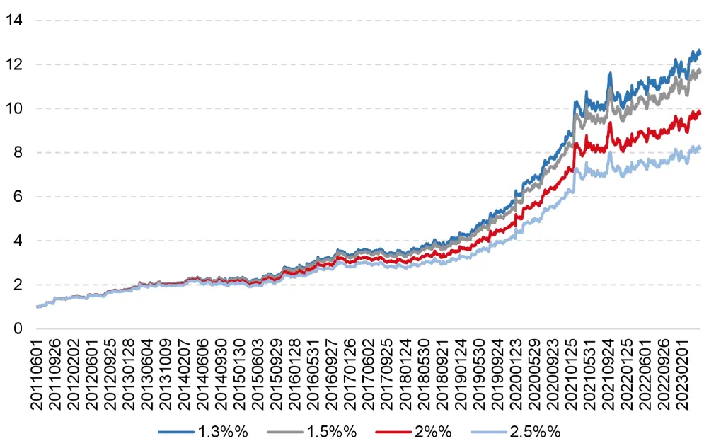
资料来源：Tinysoft，国信证券经济研究所整理

从图 18 中的不同交易成本下曲线可以看到，基于连续信号的商品期货交易策略对于交易费用不敏感。具体各个交易成本下策略绩效统计如表 8。

表8：不同交易成本下策略绩效统计

| 年化收益率 | 夏普率 Calmar |
| --- | --- |
| 1.3%% 23.10% | 1.71 1.67 |
| 1.5%% 22.38% | 1.66 1.61 |
|  | 1.53 1.46 |
| 2%% 20.62% 2.5%% 18.88% | 1.40 1.31 |

资料来源：Tinysoft，国信证券经济研究所整理

从表 8 可以看出策略对于交易成本的变化不敏感，随着交易成本的增加策略年化收益率变化缓慢。当交易成本从 1.3%%增长至 2.5%%后，策略的费后年化收益率从 23.1%降到 18.88%，夏普率从 1.71 下降到 1.4，变化较缓。

综上可以看到，交易成本的变化对策略净值的走势影响不大。基于连续信号的商品期货交易策略在不同的交易成本下均可实现长期稳定的表现。

## 基于连续信号的商品期货交易策略特质

正如前文所述，自 2022 年以来，5 亿私募 CTA指数一直在经历回撤。然而，由于我们的策略在设计上与传统 CTA 信号有所不同。传统 CTA交易信号仅提供有关开仓方向的信息，以 0、1 和-1 表示平仓、多仓和空仓。这种简单的二元表示意味着我们只能在两种状态中选择，即满仓或空仓，无法准确描绘信号的强弱。而我们的策略则通过跟踪信号的持续度，并根据其持续时间来确定信号的强弱，从而产生了显著差异。

图19：策略与 5亿私募 CTA 指数的滚动相关性
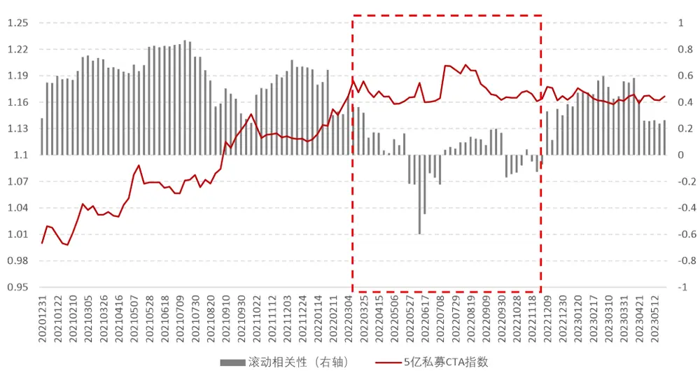
资料来源：朝阳永续，Tinysoft，国信证券经济研究所整理

如图 19 所示，策略自 2022 年 3 月至 2022 年 11月底的滚动相关性仅为 2.77%，不到 3%，而此时对应的正是市场上大部分 CTA产品表现不佳的时期，因此，我们的策略得以在市场整体表现不佳时脱颖而出，展现了较好的“去伪”能力；同时，在如 2020 年 CTA 市场整体表现亮眼时，我们的策略与 5 亿私募 CTA 指数的相关性则较高，基本维持在 0.6 以上的水平，可见在市场整体表现较好时我们的策略与全市场有着一致正确的判断，具备较好的“存真”能力。

综上所述，传统 CTA信号，如前所述，仅提供有限的关于市场情况的信息，无法捕捉到信号的微妙动态。而我们的策略采用了更为复杂的方法对信号进行了优化，超越了对市场仓位的简单二元表示。通过考虑信号的可持续度，我们能够洞察其持久性，并利用这一信息来判断信号的强弱。这种方法使我们能够辨别信号强度的微小变化，从而能够相应地调整投资决策。进而使得我们的策略在投资组合管理和风险控制方面具备一定的优势，并为投资者提供更加稳定和可靠的回报。

## 总结

## 从传统离散信号到连续信号

CTA策略近年表现承压，因此我们希望对传统的 CTA策略思路进行改进和优化。在 CTA策略中，交易信号扮演着指引和触发交易的角色。然而，传统的 CTA交易信号仅仅告诉我们开仓的方向，用 0、1、-1 来分别代表平仓、多仓和空仓。这意味着我们只有两种状态可选择，要么满仓，要么空仓，无法准确描绘信号的强弱。然而，信号强度常常蕴含着丰富的信息。因此，我们尝试寻找一种能够刻画CTA信号强弱的方法。在本篇报告中，我们将信号强度分为两类，即开仓时点信号强弱和开仓后信号持续度。通过考虑信号的强度因素，我们观察到相较于传统策略，加入信号强度后的策略表现有明显的提升。

开仓时点信号强弱是指通过判断触发开仓信号强度或置信度来决定开仓与否，它用于衡量开仓信号的可靠性和预测能力，帮助决策是否执行开仓操作。我们在传统信号的基础上加入了价格波动强弱（由 ATR与收盘价的比值计算）和价格的噪音变化趋势（通过趋势噪音比计算）两个条件，只有当价格波动率较低且价格趋势中的噪音不断减少时，我们才进行开仓。

在开仓之后，我们会对信号的持续度进行跟踪，并且根据信号的持续度来确定信号的强弱。概括来说，我们首先基于过去时刻价格的涨跌确定当前时刻价格上涨和下跌的概率，再将涨跌的概率作差，当差的绝对值大于 0.2 时，我们认为此时价格趋势较为清晰，进行开仓操作；并且将信号值确定为此时价格上涨或者下跌的概率，而并非传统信号中简单的 1和-1。

在经过已实现波动率调整后，我们构建了基于连续信号的商品期货交易策略，策略费后年化收益率为 23.1%，夏普率为 1.71，Calmar比率为 1.67，表现较为稳健。策略实现的全样本期的年化波动率为 13.85%，平均杠杆率为 2.5 倍。在 CTA市场持续回撤的 2022 年，策略仍实现了 17.67%的收益率。

自 2022 年以来，5 亿私募 CTA指数持续回撤，因策略设计差异，我们基于连续信号的商品期货交易策略与指数相关性仅 2.77%，因此，我们的策略得以在市场整体表现不佳时脱颖而出；同时，在如 2020 年 CTA市场整体表现亮眼时，我们的策略与 5 亿私募 CTA指数的相关性则较高，维持在 0.6 以上。可见在市场整体表现较好时我们的策略与全市场有着一致正确的判断。相较于传统 CTA信号，我们能够实时判断涨跌概率提供连续信号，并相应地调整投资决策，从而在投资组合管理和风险控制方面具备优势，为投资者提供稳定可靠的回报。

## 参考文献

Brennan M J . The Price of Convenience and the Valuation of Commodity Contingent Claims[J]. stochastic models & option values, 1991.

Cootner Paul. Returns to Speculators: Telser Versus Keynes[J]. Journal of Political Economy, 1960, 68(4): 396-404

Gorton G , Hayashi F , Rouwenhorst K . The Fundamentals of Commodity Futures Returns[J]. Yale School of Management Working Papers, 2008, 17(1):35-105.

- Gorton G , Rouwenhorst K G . Facts and Fantasies about Commodity Futures[J]. Financial Analysts Journal, 2006.

Koijen R , Moskowitz T J , Pedersen L H , et al. Carry[J]. Journal of financial economics, 2018, 127(2):197-225.

Kaldor N . Speculation and Economic Stability[J]. Review of Economic Studies, 1939, 7(1):1-27.

## 附录 1—数据准备

在本节将介绍我们对数据的准备以及处理方法。在 CTA策略的测试中，数据的处理主要涉及以下几个问题：主力合约如何确定，展期价格跳空如何处理，不同合约数据怎么拼接以及发单价格如何确定。下面我们将针对这些问题进行分析和解决。

## 主力合约的确定

在确定主力合约时，我们使用成交量以及持仓量均达到最大的合约作为主力合约。这其中，股指期货在合约到期月份的第三个周五进行交割，国债期货在合约到期月份的第二个周五进行交割，因此，如果上述品种在交割前还没有能够新的主力合约可以确定，那么需要在交割日前一个交易日强制切换至当时的次主力合约。同时，主力合约不可逆，一经确定不可反复。

## 合约切换的思考

在合约进行切换时，可能会出现前后两个主力合约的价格无法进行无缝对接的情况。如图 20以及图 21 所示：

图20：RB1901 切换 RB1905 价格跳空

资料来源：Tinysoft，国信证券经济研究所整理

图21：RB1901 切换 RB1905 价格复权
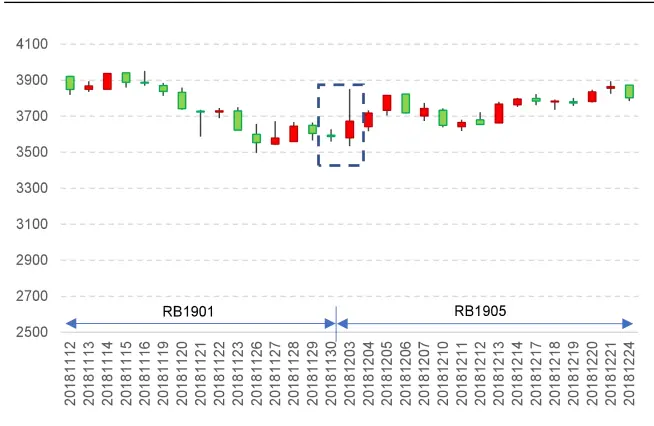
资料来源：Tinysoft，国信证券经济研究所整理

图 20 为 RB1901 合约切换到 RB1905 合约的价格序列图，其中切换时点为 2018年 12 月 3 日。从图 20 可以看出，在切换的时间点出现了一个价格的大幅跳空低开的情况，如果认为这是行情的自然状态，则可能导致对行情判断的失误。从而导致策略判断失真。

那么在切换合约时，通常有两种做法，一种是根据新主力合约之前的业绩进行新交易信号的判断，以 RB 合约为例，当合约从 RB1901 切换到 RB1905 时，之后的策略计算都按照 RB 的历史数据进行计算，这样做的好处是，策略信号来源于该标的且作用在该标的。而缺点是有些合约虽然切换到了新的主力合约，但是由于切换前该新合约交易并不活跃，加之有些策略需要使用大量历史数据进行处理和分析，因此可能导致信号失真，或者价格波动较大的情况。

还有一种做法是将价格数据进行复权。复权分为前复权以及后复权，如果向前复权的话，则当前的合约价格为真实价格，之前的合约价格数据为复权后的价格。这样做的好处是可以使用当前的真实合约价格来确认开仓数量，而缺点则是历史数据会随着新数据的更新而出现变化，尽管变化较小，但随着时间的推移以及浮点数的保存问题，有可能会出现新计算出来的策略开仓时点或者策略曲线与之前计算的无法完全匹配的情况。那么会在策略归因时，造成一定的困难。

我们所使用的方法是进行向后复权，这样做的前提是需要选择一个策略开始计算的日期为基期，一旦基期确定下来，后面行情如何更新都对历史数据造成改变。当然，如果基期发生了变化，则有可能导致历史数据的变化。由于 2010 年以前上市的期货品种较少，且活跃度不高。因此我们所使用的基期则定为 2010 年 1月 1日。

复权的具体做法为：在每次展期的时候，计算新主力合约以及旧主力合约的价格跳空比，以此作为当日之后新主力合约价格的复权因子。该复权因子的具体计算公式为：

$$
AdjFactor_{i}=AdjFactor_{i-1}*\frac{Close_{i-1,old}}{Close_{i-1,new}}
$$

其中， $\mathrm{AdjFactor}_{\mathrm{i}-1}$ 为上一期复权因子， $\mathrm{Close}_{\mathrm{i}-1,\mathrm{old}}$ 为旧主力合约展期前一日收盘价， $\mathsf{Close}_{\mathrm{i}-1,\mathrm{new}}$ 为新主力合约展期前一日收盘价。这样计算出来的复权因子AdjFactori为当期复权因子。其中，基期的复权因子为 1。计算好复权因子之后，新的主力合约的开盘价、最高价、最低价以及收盘价都乘以当期的复权因子，即为复权价格。

这样使用复权价格可以很好地避免因切换合约带来的价格跳空的影响，具体在计算收益率时，如果直接使用原始价格进行计算：

$$
Return_{i}=\frac{Close_{i,new}}{Close_{i-1,old}}\ -\ 1
$$

当新主力合约价格与旧主力合约价格出现跳空时，该收益率会出现异常值，而使用复权因子之后收益率的计算变为：

$$
\begin{array}{l}{{Return_{i}={\frac{AdjFactor_{i}*Close_{i,new}}{AdjFactor_{i-1}*Close_{i-1,old}}}-1}}\\{{\ }}\\{{\ }}\\{{\ ={\frac{AdjFactor_{i-1}*{\frac{Close_{i-1,old}}{Close_{i-1,new}}}*Close_{i,new}}{AdjFactor_{i-1}*Close_{i-1,old}}}-1}}\\{{\ }}\\{{\ }}\\{{\ }}\\{{\ }}\end{array}
$$

可以看到，这样计算出来的收益率即为实际收益率，进而避免了因合约切换导致的策略信号漂移或者收益率无法计算的情况。

如图 21 展示的是经复权之后 RB1901 合约切换到 RB1905 合约的情况，可以看到，图 20 跳空的部分变得更加连续了。因此，通过对主力连续不同合约的价格进行复权处理，我们便可以得到连续无异常跳空的行情时间序列数据。

## 数据处理与拼接

本节将从两个维度分析数据处理中的相关问题。第一，当策略只包含股指期货的时候，数据的处理。其次，当策略需要做商品期货全品种时，数据处理的问题。

由于股指期货的三个品种的交易时间都是同步的，因此不存在不同合约时间对齐的问题。但是需要确定策略执行的收益率的计算方法，我们考虑实盘交易时在信号触发后的成交的价格为 5分钟的 VWAP，具体可以根据产品规模而定。同时，交易时间越长对策略的时效性要求就越高，需要策略信号的衰减周期与交易时长相匹配。具体做法为计算策略信号触发后 5 分钟的成交额除以经合约乘数调整的成交量：

$$
VWAP_{5}=\frac{\sum_{i=1}^{5}Amount_{i}}{\sum_{i=1}^{5}Vol_{i}*Multi}
$$

其中，Amount 为第 i 分钟的成交额， $\mathrm{Vol_{i}}$ 为第 i 分钟的成交量, Multi 为该品种的合约乘数。

当策略需要加入全部期货品种的时候，则需要考虑全品种的交易时间对齐的问题。部分商品期货有夜盘，部分商品期货没有。此外，所有商品期货的品种在上午 10点 15 分至 10 点 30 分期间为暂停交易时段。因此，进行时间对齐时非交易时段行情数据的处理就是一个需要解决的问题。我们的处理方式为非交易时间段行情序列设置为空值，信号延续交易时段信号，同时策略收益率设置为零。

当合约尚未上市时，将行情序列设置为空值，且不允许发出交易信号，收益率也设置为空值。

## 附录 2—海龟资金管理法

策略中的风险主要由两部分组成，一部分是策略的潜在亏损，一部分是策略的波动。接下来，我们主要围绕对策略波动进行风控的方法进行介绍。

为使得策略在所有不同品种上面的振幅可控，我们需要根据不同品种的振幅进行交易量的调整。这里所说的振幅通常使用真实振幅均值（Average True Range，ATR）来度量。其中，ATR指标的具体计算公式如下所示：

$$
\begin{array}{c}{{TR=\mathrm{Max}[(high-low),abs(high=preclose),abs(low-preclose)]}}\\{{{}}}\\{{ATR=\displaystyle{\frac{1}{n}\sum_{i=1}^{n}TR_{i}}}}\end{array}
$$

其中， $TR_{i}$ 为 True Range，用于衡量每日的振幅，ATR 则是 $TR_{i}$ 的移动平均值。

通过 ATR 指标来调整品种杠杆的基本原理是，将波动较高的品种赋予相对较低的杠杆，将波动较低的品种赋予相对较高的杠杆，因此杠杆率与品种的 ATR 呈反比关系。

更进一步地，对风险的控制要求我们知道 1 单位 ATR的波动对应我们账户资金波动的多少，这里假设我们要让 1单位 ATR的波动正好等于我们策略整体资金规模的 0.5%。假设我们使用的是一个单位账户，即总资金规模为 1。那么，我们将0.5%除以对应的 1 单位 ATR 则为我们实际应开出的合约数量。即此刻交易应该开出的合约手数。

如果我们需要计算的是一个杠杆率即当前开仓手数占整体资金规模可开仓手数的比例，那么需要除以满仓状态下可以开出的总合约数量，具体计算公式为：

$$
Pos_{ATR}\ =\ \frac{0.5\%}{ATR}
$$

$$
Pos={\frac{1}{Close}}
$$

$$
\begin{array}{l}{{Lev_{ATR}=\ \frac{Pos_{ATR}}{Pos}}}\\{{\ }}\\{{\ =\ \frac{0.5\%}{ATR}\ *\ Close}}\end{array}
$$

其中， $Pos_{ATR}$ 为 1 单位 ATR 对应资金规模 0.5%波动的应开手数, Pos 为全部资金对应满仓可开手数，Close 为收盘价， $Lev_{ATR}$ 为应开手数除以满仓手数的开仓杠杆率。由上面算法计算出来的开仓杠杆率具有根据 ATR 波动调整杠杆率大小的特性，当一个品种的日均波动较大时，我们倾向于给予该品种较低的杠杆，而反之，如果一个品种的日均波动较小，我们则可以给该品种较高的杠杆。从风险控制的角度如果一个品种的波动较大，给予较小杠杆也是出于对资金安全的考虑，防止由于较大的振幅而触发穿仓风险。

## 风险提示

市场环境变动风险

市场环境变动可能导致策略失效。

模型失效风险

模型样本外表现可能与样本内表现存在差异。

## 免责声明

分析师声明

作者保证报告所采用的数据均来自合规渠道；分析逻辑基于作者的职业理解，通过合理判断并得出结论，力求独立、客观、公正，结论不受任何第三方的授意或影响；作者在过去、现在或未来未就其研究报告所提供的具体建议或所表述的意见直接或间接收取任何报酬，特此声明。

## 国信证券投资评级

| 类别 | 级别 | 说明 |
| --- | --- | --- |
| 股票投资评级 | 买入 | 股价表现优于市场指数20%以上 |
|  | 增持 | 股价表现优于市场指数10%-20%之间 |
|  | 中性 | 股价表现介于市场指数±10%之间 |
|  | 卖出 | 股价表现弱于市场指数10%以上 |
| 行业投资评级 | 超配 | 行业指数表现优于市场指数10%以上 |
|  | 中性 | 行业指数表现介于市场指数±10%之间 |
|  | 低配 | 行业指数表现弱于市场指数10%以上 |

## 重要声明

本报告由国信证券股份有限公司（已具备中国证监会许可的证券投资咨询业务资格）制作；报告版权归国信证券股份有限公司（以下简称“我公司”）所有。本报告仅供我公司客户使用，本公司不会因接收人收到本报告而视其为客户。未经书面许可，任何机构和个人不得以任何形式使用、复制或传播。任何有关本报告的摘要或节选都不代表本报告正式完整的观点，一切须以我公司向客户发布的本报告完整版本为准。

本报告基于已公开的资料或信息撰写，但我公司不保证该资料及信息的完整性、准确性。本报告所载的信息、资料、建议及推测仅反映我公司于本报告公开发布当日的判断，在不同时期，我公司可能撰写并发布与本报告所载资料、建议及推测不一致的报告。我公司不保证本报告所含信息及资料处于最新状态；我公司可能随时补充、更新和修订有关信息及资料，投资者应当自行关注相关更新和修订内容。我公司或关联机构可能会持有本报告中所提到的公司所发行的证券并进行交易，还可能为这些公司提供或争取提供投资银行、财务顾问或金融产品等相关服务。本公司的资产管理部门、自营部门以及其他投资业务部门可能独立做出与本报告中意见或建议不一致的投资决策。

本报告仅供参考之用，不构成出售或购买证券或其他投资标的要约或邀请。在任何情况下，本报告中的信息和意见均不构成对任何个人的投资建议。任何形式的分享证券投资收益或者分担证券投资损失的书面或口头承诺均为无效。投资者应结合自己的投资目标和财务状况自行判断是否采用本报告所载内容和信息并自行承担风险，我公司及雇员对投资者使用本报告及其内容而造成的一切后果不承担任何法律责任。

## 证券投资咨询业务的说明

本公司具备中国证监会核准的证券投资咨询业务资格。证券投资咨询，是指从事证券投资咨询业务的机构及其投资咨询人员以下列形式为证券投资人或者客户提供证券投资分析、预测或者建议等直接或者间接有偿咨询服务的活动：接受投资人或者客户委托，提供证券投资咨询服务；举办有关证券投资咨询的讲座、报告会、分析会等；在报刊上发表证券投资咨询的文章、评论、报告，以及通过电台、电视台等公众传播媒体提供证券投资咨询服务；通过电话、传真、电脑网络等电信设备系统，提供证券投资咨询服务；中国证监会认定的其他形式。

发布证券研究报告是证券投资咨询业务的一种基本形式，指证券公司、证券投资咨询机构对证券及证券相关产品的价值、市场走势或者相关影响因素进行分析，形成证券估值、投资评级等投资分析意见，制作证券研究报告，并向客户发布的行为。

## 国信证券经济研究所

深圳深圳市福田区福华一路 125 号国信金融大厦 36 层邮编：518046 总机：0755-82130833

上海
上海浦东民生路 1199 弄证大五道口广场 1 号楼 12 层
邮编：200135
北京
北京西城区金融大街兴盛街 6 号国信证券 9 层
邮编：100032