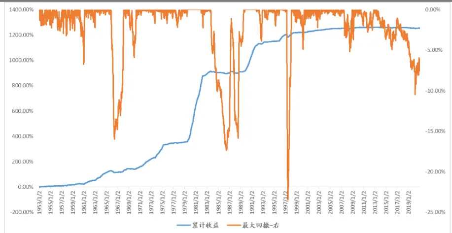
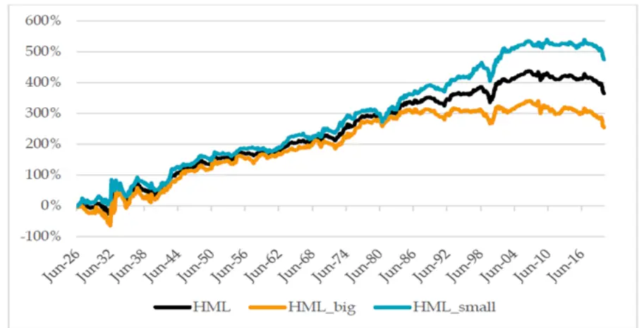
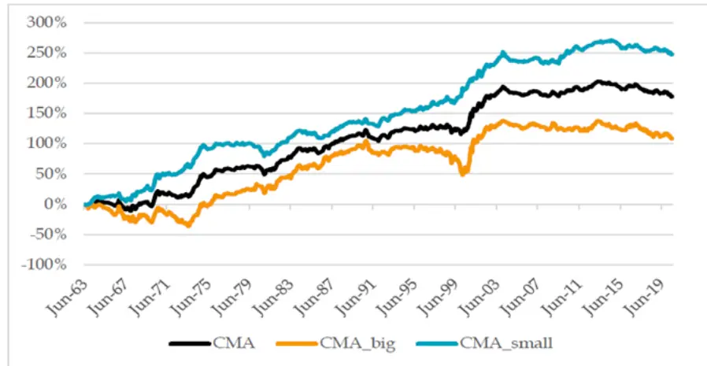
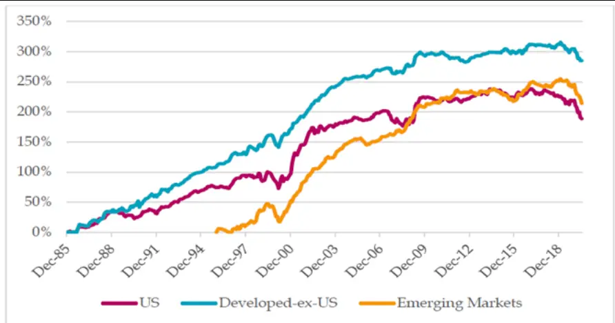
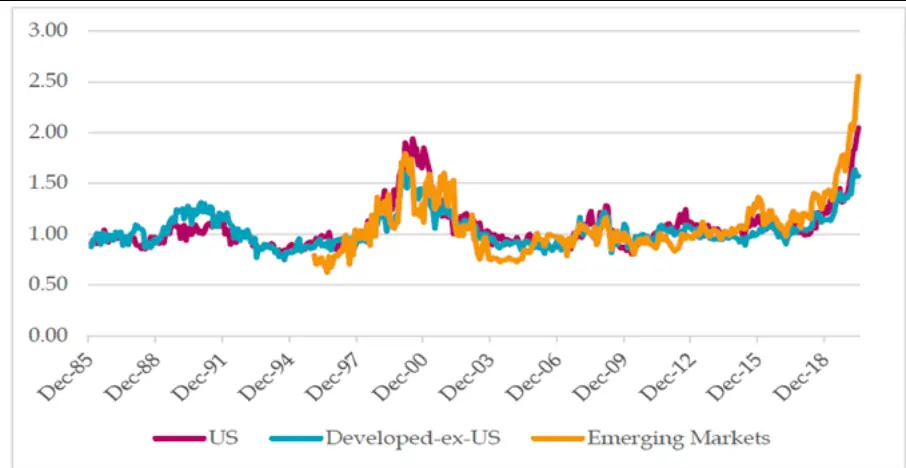

inInfo] [Table_Title] 2021.04.19

# 重振价值溢价

# ——学界纵横系列之一

陈奥林(分析师)

## 徐忠亚(分析师)

8 021-38674835

021-38032692

chenaolin@gtjas.com

证书编号 S0880516100001

xuzhongya@gtjas.com

S0880519090002

## 本报告导读：

价值溢价并未消失，只需一点努力，即可在股票收益横截面中识别出健康的价值溢价。

## 摘要：

[Table_Summary]• 近年来常用价值因子的表现较差，使人们对价值溢价产生了怀疑。事实上，常用HML价值因子表现欠佳已 30年，而不是最近才开始。

《Resurrecting the Value Premium》的研究表明，通过构建比 HML 因子仅复杂一点的增强价值因子，就可以重振价值溢价。

- 增强价值因子的构建包括三个部分：使用四个基本面指标共同度量价值；进行基础的风险管理；使用流动性较好的股票。

从1986年至2020年的美国年平均因子溢价超过 5%，在新兴国家和美国外发达国家年平均因子溢价超过8%。

该增强价值因子在最近几年虽然也有一定回撤，但长期的优异表现足以吸收这一回撤。同时本文发现这和 90 年代末科技泡沫时期价值因子的回撤较为相似，与估值差异扩大存在强相关。

价值投资的真正含义是以低于公司内在价值的价格买入，预期股价会向价值回归，而不是简单地投资某个指标。但是，在估值极端分化而基本面差异不大的情况下，投资估值指标具有一定意义。

当前 A 股的成长股与价值股的估值差异已来到历史高位，分化程度较高。在4月业绩披露期，若成长股没有很好的增速支持，均值回归可能将持续较长一段时间。

当前呈现经济回升，政策收紧的宏观环境，加之美债收益率上行，对高估值股票形成压力，成长股在宏观层面优势不再；此外，在基本面恢复的大环境下，盈利弹性较高的价值股为更好的选择。

金融工程

## 金融工程团队：

陈奥林：（分析师）

电话：021-38674835

邮箱：chenaolin@gtjas.com

证书编号：S0880516100001

## 杨能：（分析师）

电话：021-38032685

邮箱：yangneng@gtjas.com

证书编号：S0880519080008

## 殷钦怡：（分析师）

电话：021-38675855

邮箱：yinqinyi@gtjas.com

证书编号：S0880519080013

## 徐忠亚：（分析师）

电话：021- 38032692

邮箱：xuzhongya@gtjas.com

证书编号：S0880120110019

## 刘昺轶：（分析师）

电话：021-38677309

邮箱：liubingyi@gtjas.com

证书编号：S0880520050001

## 吕琪：（研究助理）

电话：021-38674754

邮箱：lvqi@gtjas.com

证书编号：S0880120080008

## [Table_R相关报告

AI 投 资 方 法 论 ： 从 多 因 子 到 多 信 号2021.04.17

基金赎回压力点位测算 2021.03.24

富国中证细分机械设备产业 ETF 投资价值分析 2021.03.23

系统化择时之路 2-检验的艺术 2021.03.15

南方中证 500ETF 投资价值分析 2021.02.24

## 1. 选题背景

近年来价值因子表现欠佳，价值股在 2010-2020 年甚至远远落后于成长股，使得人们对价值溢价的存在产生怀疑。事实上，常用 HML 价值因子表现欠佳已 30 年，而不是最近才开始。那么，价值风格是的失效是暂时还是永久性的？我们是否可以通过努力改善价值因子的表现？答案是肯定的。通过增加价值度量维度，我们能够获取更优的价值溢价。《Resurrecting the Value Premium》这篇报告，即从这一维度展开讨论，基于全球市场数据进行了回测论证。

图 1 美股价值风格70年：繁荣与 30年衰落

数据来源：国泰君安证券研究

当前呈经济回升，政策收紧的宏观环境，加之美债收益率上行，对高估值股票形成压力，成长股在宏观层面的优势不再；此外，在基本面恢复的大环境下，盈利弹性较高的价值股为更好的选择。

笔者认为，价值投资的真正含义是以低于公司内在价值的价格买入，预期股价会向价值回归，而不是简单地投资某个指标。但是，在估值极端分化而基本面差异不大的情况下，投资估值指标具有一定意义。从目前估值差异的角度来看，A股的成长股与价值股的估值差异已来到历史高位，分化程度较高。在 4月业绩披露期，若成长股没有很好的增速支持，均值回归可能将持续较长一段时间。

## 2. 核心结论

如何从量化的角度定义价值股？《Resurrecting the Value Premium》通过增加度量价值的指标，进行基础的风险管理以及使用流动性更好的股票构建了增强价值因子，以其长期的优异表现证明价值溢价并未消失，只需稍加努力即可在股票收益的横截面中识别出健康的价值溢价。

若使用传统的 HML 单因子方法，一般是根据市净率的高低将市场的股票进行排序，认为市净率较低的股票为价值股。使用市净率度量价值的一个重要前提是，账面价值能够较好地反映公司基本面的情况。随着时间的流逝，公司的无形资产占据了越来越重要的位置，账面价值越来越难以完整反映公司的全貌。研发、品牌等无形资产难以反映在公司的资产负债表中，但可以反映在对公司盈利能力以及运营效能影响中。因此，使用利润表以及现金流量表中的指标与市净率共同衡量价值更加合适。《Resurrecting the Value Premium》正是构造了这样的复合增强价值因子作为价值度量。

通过增加度量价值的指标，进行基础的风险管理以及使用流动性更好的股票即可构建增强价值因子。该因子长期表现良好，足以吸收近几年的回撤。本文表明，近几年的回撤大部分可以归因于估值差异的变大，与1990年代末的科技泡沫相似，价值溢价的真实幅度可能会被低估。

## 3. 文章背景

价值投资是经典的投资理念，众多价值指标如市盈率和账面市值比等广泛被学界和业界使用。另一方面，最近几十年多因子模型受到了极大的重视，其中1993年Fama和French提出著名的三因子模型中包含的HML价值因子成为了价值因子的代表。随着时间流逝，对于价值溢价的质疑声却渐渐大了起来。

第一次严重的质疑发生在 90 年代后期的科技泡沫时期，此时“昂贵”的成长股表现远远强于“便宜”的价值股。但 2000 年互联网泡沫破裂后，价值股的强势回归暂时打消了人们的念头。Asness 等（2000）指出，90年代末成长股的强势表现是由于不可持续的倍数扩张，也就是估值差异的扩大。在学界，价值因子仍然是重要的资产定价因子；在业界，基金公司将价值作为一种重要的投资风格，量化基金仍然将价值因子用于阿尔法的预测。

第二次质疑发生在 08 年全球金融危机后，人们发现理论上存在的价值溢价无法实质化。在 2010 年前后，价值股再次远远落后于成长股。针对质疑，Arnott et al.(2020)和 Fama and French(2020) 强调虽然价值因子近期的表现不佳，但仍然处于统计上可以接受的范围。部分学者也提出其他方面的观点以支持价值溢价。然而，这些研究并没能完全重振人们对价值溢价的信心。

针对以上的质疑，本文第一部分研究了 HML 因子的表现，发现 HML因子并非近期才表现欠佳，而是已经持续了几十年，而被认为包含了HML因子信息的CMA投资因子的表现也并不比HML好。之后，本文第二部分提出了比 HML 因子稍微复杂的价值投资策略，通过它得出价格溢价并未消失的结论，并分析了近几年价值策略出现回撤的原因。

## 4. 传统价值因子表现欠佳已近 30年

常用的价值因子HML以及被认为可以替代HML的投资因子CMA的表

现究竟如何？本节的内容显示，HML 因子在近 30 年表现不佳，CMA因子也并未强于 HML因子。

## 4.1. HML 价值因子

Fama and French（1993）使用账面市值比 B/M 和市值指标构造双重排序，以纽交所中上市公司的市值中位数为界把公司分为小市值（Small）和大市值（Big）两组，以账面市值比（B/M）的 30%和70%分位数为界分为High 组、Middle 组和 Low 组，一共分为六组

表 1：B/M和市值双重排序

|  | 高B/M | 中B/M | 低B/M |
| --- | --- | --- | --- |
| 小市值 | S/H | S/M | S/L |
| 大市值 | B/H | B/M | B/L |

资料来源：国泰君安证券研究

将每组中的股票收益率按市值加权得到六个投资组合，并构造 HML 因子

$$
\mathrm{HML}=\frac{1}{2}\left(\mathrm{S}/\mathrm{H}-\mathrm{S}/\mathrm{L}\right)+\frac{1}{2}\left(\mathrm{B}/\mathrm{H}-\mathrm{B}/\mathrm{L}\right)
$$

由上式可以看出，HML定义为小盘HML和大盘HML的等权平均。采用 Prof. Kenneth French 的在线公开数据库中的数据，本文研究了 HML因子在美国，新兴市场和美国外发达国家的表现。

图 2HML因子在美国的累积收益率

数据来源：《Resurrecting the Value Premium》,国泰君安证券研究

表 2：HML因子近 30年的表现1

| 市场 | 指标 | HML | HML big | HML small |
| --- | --- | --- | --- | --- |
| US | return(ann.) | 0.91 | -1.40 | 3.21 |
|  | t-statistic | (0.46) | (-0.66) | (1.45) |
| Developed-e x-US | return(ann.) | 3.25** | 1.53 | 4.98*** |
|  | t-statistic | (2.35) | (0.89) | (3.32) |
| Emerging | return(ann.) | 6.63*** | 2.42 | 10.83*** |

| Markets t-statistic (4.35) (1.35) |
| --- |

资料来源：《Resurrecting the Value Premium》，国泰君安证券研究

图2表明，自从1980 年以来，美国大盘股HML因子的累积收益率曲线较为平坦甚至下行，总 HML因子的略微上行大部分是由于小盘股HML因子的表现，但也在近30年表现较差。在HML因子的构建过程中，大小盘股权重设为相等，但事实上，大盘股的市值占到了总市值的 90%。

表2表明，近30 年来大盘股 HML因子的收益均不显著，而新兴市场和美国外发达国家的小盘股 HML 因子显著。考虑到小盘股由流动性最不好的、仅占市值的10%的股票组成，本文认为如果Fama 和French在提出 HML 因子时使用的是现在的数据，可能难以对价值溢价的存在提供足够的支持。

## 4.2.HML 因子的替代——CMA投资因子

Fama and French(2015)提出了五因子模型，在三因子模型的基础上加入了投资和盈利因子。CMA 即为以总资产变化率为依据的投资因子。事实上，价值股往往总资产变化率较低，成长股总资产变化率较高，因此HML和 CMA具有较强的相关性，这在统计上可以得到证明。Fama andFrench(2015)得出了HML可以舍弃的结论，认为使用其他四个因子已经足够，最终留下 HML 是由于其悠久的历史。Hou, Xue and Zhang(2015)甚至直接舍弃了 HML 因子，得到了四因子模型。总的来说，他们认为传统的价值因子可以由更好的投资因子取代。

CMA 真的可以完全替代 HML 吗？本文对此进行了研究。CMA 因子是根据市值和总资产变化率进行双重排序得到的，总资产变化率根据 70%和30%分位数分为激进、中性和保守三组。

表 3：总资产变化率和市值双重排序

|  | 激进 | 中性 | 低B/M |
| --- | --- | --- | --- |
| 小市值 | S/A | S/N | S/C |
| 大市值 | B/A | B/N | B/C |

资料来源：国泰君安证券研究

将每组中的股票收益率按市值加权得到六个投资组合，并构造 CMA 因子

$$
\mathrm{CMA}=\frac{1}{2}(\mathrm{S}/\mathrm{C}-\mathrm{S}/\mathrm{A})+\frac{1}{2}(\mathrm{B}/\mathrm{C}-\mathrm{B}/\mathrm{A})
$$

类似HML，CMA 定义为小盘CMA 和大盘CMA的等权平均。

从表4可以看到，近 30年来，CMA 因子的表现并未强于HML因子。

图 3CMA因子在美国的累计收益率

数据来源：《Resurrecting the Value Premium》,国泰君安证券研究

表 4：CMA因子的表现2

| 市场 | 指标 | CMA | CMA big | CMA small |
| --- | --- | --- | --- | --- |
| US | return(ann.) t-statistic | 2.16* (1.65) | 0.54 (0.30) | 3.78*** (3.00) |
| Developed-e x-US | return(ann.) t-statistic | 1.52 | 0.51 (0.38) | 2.51** |
| Emerging | return(ann.) | (1.36) 2.84** | 1.20 | (2.22) 4.49*** |
| Markets | t-statistic | (2.30) | (0.75) | (2.94) |

资料来源：《Resurrecting the Value Premium》，国泰君安证券研究

## 5. 增强价值因子

本节将通过构建增强价值因子并分析其表现，证明只需一点努力，即可在股票收益的横截面中识别出健康的价值溢价

## 5.1.增强价值因子的构建

为了说明价值溢价仍然存在，本节分三个步骤构建增强价值因子：增加度量价值的指标，进行基础的风险管理以及使用流动性更好的股票。本文使用的价值指标以及处理方式均有学术文献记载或从业者使用。

## 5.1.1. 使用来自三个报表的价值指标

Fama and French(1996)使用基于账面市值比的 HML 因子来度量价值，认为它已经包含了 EP 和股息率等其他指标的信息。但是随着时间推移，账面价值与价值的关系开始变弱，许多新经济和服务导向的公司（比如脸书和谷歌）的无形资产占据了重要部分。因此，有必要对账面市值比(B/M)进行调整。此外，B/M仅仅试图从资产负债表的信息中度量价值，未能利用利润表和现金流量表的信息，本文提出了三个额外的指标来度量价值，分别为 EBITDA/EV，CF/P 和 NPY。

EBITDA：折旧，摊销，息税前利润；

EV(enterprise value)：企业价值=股票市值+有息负债-现金；

CF/P：市现率的倒数；

NPY(net payout yield)：净支付率=（股利$+股票回购$-股票发行$）/股票市值$

其中，EBITDA/EV 指标不受非经营性损益的影响，不易受到折旧和摊销的会计影响，也不受公司资本结构的影响，是不少人认可的价值衡量指 标 ； CF/P 来 自 现 金 流 量 表 ； Jenter (2015) 和 Bali, Demirtas,Hovakimian(2010)认为NPY 反映了管理层对股票估值的看法。同时，本文对通过资本化研发费用R&D对B/M进行了调整。

类似 Asness and Frazzini (2013)，本文均使用最近的价格进行计算。对每一个指标，在股票横截面上对其进行 z-scores 标准化（取 3 倍标准差作为去极值的阈值）。最后取四个指标值的平均作为复合价值得分。

## 5.1.2. 进行基础的风险管理

由于某些行业天生较为“便宜”，比如公共事业；某些行业天生较为“昂贵”，比如科技。使用价值因子时可能会出现重度做多某个行业和重度做空另一个行业的现象，导致风险较为集中。同时 Asness, Porter, andStevens (2000) 和 Doeswijk and van Vliet (2011)观察到价值选股策略在行业内部表现比跨行业表现更好。因此本文在美国市场采取行业中性的措施，在GICS 的11个一级行业内部进行排序；在其他发达国家同时采取区域中性和行业中性，划分为北美洲、欧洲和太平洋地区；在新兴市场采取国家中性。

## 5.1.3. 使用流动性较好的股票

前面提到，HML 因子给予小盘股 50%的权重而它们仅占总市值的 10%.考虑到股票的流动性，本文采取标准（大/中盘）MSCI指数的成分股作为增强价值因子的股票池，这和 HML 因子构建时所划分的大盘股股票池类似。而在前面已经提到，HML 因子在大盘股的表现并不好，这意味着本文主动提高了对增强价值因子的要求与门槛。

与 HML 因子分为三组的处理方式不同，根据增强价值因子排序后，本文将其分为五组，使用第一组与第五组构建的多空组合代表因子。同时由于已经使用了流动性较好的股票，在组合内部采取的是等权重配置而非市值加权，以防止少数大市值股票占据绝大部分比例。

## 5.2.良好的表现——重振价值溢价

## 5.2.1. 增强价值因子的表现

本节对上述方法构建的增强价值因子的表现进行回测。价值指标数据来源于 Compustat 和 Worldscope 数据库。美国市场的样本开始时间节点为

1986 年 1 月，新兴国家以及美国外发达国家为 1996 年 1 月，结束时间均为 2020 年 6 月。

表 5：增强价值因子五分位组合的表现3

|  |  | Q1 | Q2 | Q3 | Q4 | Q5 | Q1-Q5 |
| --- | --- | --- | --- | --- | --- | --- | --- |
| US | mean(ann.) | 3.06*** | 1.28** | -0.62 | -1.31** | -2.41** | 5.47*** |
|  | t-statistic | (2.84) | (2.19) | (-1.17) | (-2.24) | (-2.36) | (2.93) |
| Develope d-ex-US | mean(ann.) | 4.97*** | 1.47*** | -1.06*** | -2.04*** | -3.29*** | 8.26*** |
|  | t-statistic | (5.79) | (3.65) | (-2.81) | (-4.73) | (-4.59) | (5.74) |
| Emerging | mean(ann.) | 4.83*** | 0.76 | -0.47 | -1.14* | -3.92*** | 8.75*** |
| Markets | t-statistic | (4.73) | (1.10) | (-0.79) | (-1.82) | (-3.47) | (4.48) |

资料来源：《Resurrecting the Value Premium》，国泰君安证券研究

图 4增强价值因子的累积收益率

数据来源：《Resurrecting the Value Premium》,国泰君安证券研究

表5表明，增强价值因子的多空组合的收益率显著，且多头组合单侧也是显著的，这说明因子溢价并不会因为做空限制而消失。

图4表明，增强价值因子的累积收益曲线长期上行明显，虽然在近几年也有一定的回撤，但长期的上行完全可以吸收这一回撤。如果不拘泥于传统学术上的价值因子，我们可以清晰地看到，股票横截面仍然存在价值溢价。因此可以得出结论，本文对标准价值因子的各种改进可以有效地恢复价值溢价。

## 5.2.2. 增强价值因子是否偏斜

可能会有读者认为增强价值因子存在溢价是因为偏向了其他有溢价的非价值因子，比如盈利因子。为了打消读者的疑虑，本文将增强价值因子收益率在时序上关于 Fama-French因子作回归。

表 6：增强价值因子关于 Fama-French因子的回归结果4

| 含HML | Alpha (ann.) | Beta Mkt-RF | Beta SMB | Beta HML | Beta | Beta CMA | Beta WML |  |
| --- | --- | --- | --- | --- | --- | --- | --- | --- |
|  |  |  |  |  |  |  |  | RMW |
| US |  |  |  |  |  |  |  |  |
| estimate | 5.26*** | 0.06** | 0.17*** | 0.37*** | 0.25*** | 0.18** | -0.35*** |  |
| t-statistic | (4.10) | (2.36) | (4.41) | (7.56) | (4.91) | (2.46) | (-14.57) |  |
| Developed-ex-US |  |  |  |  |  |  |  |  |
| estimate | 7.60*** | -0.04** | 0.13*** | 0.71*** | 0.12 | -0.16** | -0.27*** |  |
| t-statistic | (6.81) | (-2.12) | (3.02) | (13.99) | (1.61) | (-2.42) | (-9.61) |  |
| Emerging Markets |  |  |  |  |  |  |  |  |
| estimate | 6.90*** | -0.05** | 0.02 | 0.59*** | 0.25** | 0.38*** | -0.41*** |  |
| t-statistic | (4.17) | (-2.10) | (0.25) | (8.78) | (2.32) | (4.43) | (-8.90) |  |
| 不含HML | Alpha | Beta | Beta |  | Beta | Beta | Beta |  |
|  | (ann.) | Mkt-RF | SMB |  | RMW | CMA | WML |  |
| US |  |  |  |  |  |  |  |  |
| estimate | 4.31*** | 0.09*** | 0.19*** |  | 0.37*** | 0.52*** | -0.41*** |  |
| t-statistic | (3.16) | (3.17) | (4.68) |  | (7.23) | (9.03) | (-16.74) |  |
| Developed-ex-US |  |  |  |  |  |  |  |  |
| estimate | 10.34*** | -0.04 | 0.22*** |  | 0.01 | 0.33*** | -0.36*** |  |
| t-statistic | (7.57) | (-1.42) | (4.06) |  |  |  |  |  |
| Emerging Markets |  |  |  |  | (0.10) | (4.94) | (-10.87) |  |
| estimate | 11.76*** | -0.04 | -0.04 |  | -0.18* | 0.60*** | -0.46*** |  |
| t-statistic | (6.70) | (-1.49) | (-0.60) |  | (-1.65) | (6.61) | (-8.73) |  |

资料来源：《Resurrecting the Value Premium》，国泰君安证券研究

在含有HML的第一个表中，增强价值因子在HML上的暴露最为显著，这说明了因子并未偏离价值风格。另一个负向暴露显著的是 WML动量因子，这符合 Asness et al. (2015) and Hanauer (2020)表明的当使用最近的价格计算价值指标时，价值因子会与动量因子负相关。在不含 HML 的第二个表中，暴露转移到了CMA因子上，符合之前说的 CMA和HML强相关。值得注意的是去掉 HML 因子之后，虽然 Alpha 项在美国小幅度减小，但在另外两类市场却大幅提升，说明增强价值因子并不能由其他风格的因子解释。

## 5.2.3. 回撤的原因

增强价值因子长期表现良好，但在近几年仍然有一段回撤。本节将对回撤的原因进行分析。

在整个样本区间，只有一处与近几年的回撤相似，即为 90 年代末的科技泡沫时期。Asness et al.(2000)表明这段时期成长股的优秀表现是被不可持续的倍数扩张驱动的，也就是估值价差的扩大。定义最便宜的五分之一股票的估值与最贵的五分之一股票的估值的比率作为增强价值因子的估值差异，具体计算方法如下：

以 B/M 为例，在某一特定时间节点，根据 B/M 排序选出最便宜的五分之一股票和最贵的五分之一股票。取出两组股票对应 B/M的中位数作除法，其商作为B/M在该时点的 spread。在所有时点重复以上操作，得到B/M 的 spread 时序。

对 EBITDA/EV 和 CF/P 均作上述操作，最终得到三个 spread 时序。每个 spread 时序除以其中位数做标准化处理。

取三个 spread 时序的均值，得到最终的 spread 时序。

图 5增强价值因子的估值差异

数据来源：《Resurrecting the Value Premium》,国泰君安证券研究

增强价值因子在最近几年出现了与 90 年代末类似的倍数扩张，本文认为其中有三种含义。

一是与人们认为由于大量的资金进行了价值投资和套利，导致价值溢价消失的观点矛盾。如果这个观点成立的话，价值股和成长股之间的估值差异应该减小。因此价值套利会导致价值策略失效的观点并不成立。

二是目前的条件价值回报很高。我们知道，1990年代末的估值差异很快在 2000 年代早期迎来了均值回归，期间价值股的表现远超成长股。Asness et al. (2000)等文发现了估值差异与未来价值溢价的显著正相关关系。

三是增强价值因子近几年的回撤可以由估值差异的扩大解释。作增强价值因子收益率与估值差异变化量的回归得到表 7，可以发现价值溢价与估值差异的变化有显著的负相关关系。剔除了估值差异的变化的影响后，价值溢价由表 5 中的 5.47% (t=2.93)跃至 7.93%（t=4.16），这说明估值差异的扩大正是导致价值溢价变小的原因。

表 7：增强价值因子收益对估值差异变化的回归结果5

| 市场 | 指标 | Return adj.(ann.) | Beta ∆spread | $\mathsf{Adj.}\pmb{R}^{2}$ |
| --- | --- | --- | --- | --- |
| US | estimate | 7.93*** | -0.70** | 56% |
|  | t-statistic | (4.16) | (-5.59) |  |
| Developed -ex-US | estimate | 9.66*** | -0.47*** | 36% |
| Emerging | t-statistic estimate | (5.69) 12.67*** | (-4.42) -0.48*** | 35% |
| Markets | t-statistic | (4.05) | (-4.29) |  |

资料来源：《Resurrecting the Value Premium》，国泰君安证券研究

## 6. 总结

## 6.1. 原文结论

本文旨在提振人们对价值溢价的信心。事实上，学术上的 HML 因子表现欠佳不仅是在近几年，而是已经几十年了，我们不应该因为 HML 因子表现不佳就认为价值溢价已经消失。通过有文献和业界支撑的指标和简单操作，即可构建增强价值因子，识别出横截面的价值溢价。

通过增加度量价值的指标，进行基础的风险管理以及使用流动性更好的股票即可构建增强价值因子。该因子长期表现良好，足以吸收近几年的回撤。本文表明，近几年的回撤大部分可以归因于估值差异的变大，与1990年代末的科技泡沫相似，价值溢价的真实幅度可能会被低估。

## 6.2. 我们的思考

如何从量化的角度定义价值股？若使用传统的 HML 单因子方法，一般是根据市净率的高低将市场的股票进行排序，认为市净率较低的股票为价值股。使用市净率度量价值的一个重要前提是，账面价值能够较好地反映公司基本面的情况。随着时间的流逝，公司的无形资产占据了越来越重要的位置，账面价值越来越难以完整反映公司的全貌。研发、品牌等无形资产难以反映在公司的资产负债表中，但可以反映在对公司盈利能力以及运营效能影响中。因此，使用利润表以及现金流量表中的指标与市净率共同衡量价值更加合适。《Resurrecting the Value Premium》中构造了这样的复合增强价值因子作为价值度量。

今年春节以前A股存在明显的机构抱团现象，抱团的对象大多为大盘成长股，而春节过后，出现了抱团瓦解的现象，价值股表现强势。尽管抱团的瓦解可能与市场情绪有关，但笔者认为更多还是对基本面的回归。2020年机构抱团的重点对象为白酒和新能源板块。在新冠疫情冲击全球的大环境下，白酒作为消费板块的代表，其穿越周期的属性为机构所青睐；而流动性的宽松和政策的加持形成了新能源板块的利好，这是一个典型的成长板块。这两个板块的上涨逻辑在当时成为了股市的相对“确定性”，也成就了大盘成长股的高估值。

抱团本身不是风险，但抱团的高估值股票如果没有良好的基本面支撑或者宏观环境支撑，将难以维持。当前呈经济回升，政策收紧的宏观环境，加之美债收益率上行，对高估值股票形成压力，成长股在宏观层面的优势不再；此外，在基本面恢复的大环境下，盈利弹性较高的价值股为更好的选择。

价值投资的真正含义是以低于公司内在价值的价格买入，预期股价会向价值回归，而不是简单地投资某个指标。但是，在估值极端分化而基本面差异不大的情况下，投资估值指标具有一定意义。从目前估值差异的角度来看，A股的成长股与价值股的估值差异已来到历史高位，分化程度较高。在4月业绩披露期，若成长股没有很好的增速支持，均值回归可能将持续较长一段时间。

## 本公司具有中国证监会核准的证券投资咨询业务资格

## 分析师声明

作者具有中国证券业协会授予的证券投资咨询执业资格或相当的专业胜任能力，保证报告所采用的数据均来自合规渠道，分析逻辑基于作者的职业理解，本报告清晰准确地反映了作者的研究观点，力求独立、客观和公正，结论不受任何第三方的授意或影响，特此声明。

## 免责声明

本报告仅供国泰君安证券股份有限公司（以下简称“本公司”）的客户使用。本公司不会因接收人收到本报告而视其为本公司的当然客户。本报告仅在相关法律许可的情况下发放，并仅为提供信息而发放，概不构成任何广告。

本报告的信息来源于已公开的资料，本公司对该等信息的准确性、完整性或可靠性不作任何保证。本报告所载的资料、意见及推测仅反映本公司于发布本报告当日的判断，本报告所指的证券或投资标的的价格、价值及投资收入可升可跌。过往表现不应作为日后的表现依据。在不同时期，本公司可发出与本报告所载资料、意见及推测不一致的报告。本公司不保证本报告所含信息保持在最新状态。同时，本公司对本报告所含信息可在不发出通知的情形下做出修改，投资者应当自行关注相应的更新或修改。

本报告中所指的投资及服务可能不适合个别客户，不构成客户私人咨询建议。在任何情况下，本报告中的信息或所表述的意见均不构成对任何人的投资建议。在任何情况下，本公司、本公司员工或者关联机构不承诺投资者一定获利，不与投资者分享投资收益，也不对任何人因使用本报告中的任何内容所引致的任何损失负任何责任。投资者务必注意，其据此做出的任何投资决策与本公司、本公司员工或者关联机构无关。

本公司利用信息隔离墙控制内部一个或多个领域、部门或关联机构之间的信息流动。因此，投资者应注意，在法律许可的情况下，本公司及其所属关联机构可能会持有报告中提到的公司所发行的证券或期权并进行证券或期权交易，也可能为这些公司提供或者争取提供投资银行、财务顾问或者金融产品等相关服务。在法律许可的情况下，本公司的员工可能担任本报告所提到的公司的董事。

市场有风险，投资需谨慎。投资者不应将本报告作为作出投资决策的唯一参考因素，亦不应认为本报告可以取代自己的判断。
在决定投资前，如有需要，投资者务必向专业人士咨询并谨慎决策。

本报告版权仅为本公司所有，未经书面许可，任何机构和个人不得以任何形式翻版、复制、发表或引用。如征得本公司同意进行引用、刊发的，需在允许的范围内使用，并注明出处为“国泰君安证券研究”，且不得对本报告进行任何有悖原意的引用、删节和修改。

若本公司以外的其他机构（以下简称“该机构”）发送本报告，则由该机构独自为此发送行为负责。通过此途径获得本报告的投资者应自行联系该机构以要求获悉更详细信息或进而交易本报告中提及的证券。本报告不构成本公司向该机构之客户提供的投资建议，本公司、本公司员工或者关联机构亦不为该机构之客户因使用本报告或报告所载内容引起的任何损失承担任何责任。

## 评级说明

## 1.投资建议的比较标准

投资评级分为股票评级和行业评级。

以报告发布后的12个月内的市场表现为比较标准，报告发布日后的 12个月内的公司股价（或行业指数）的涨跌幅相对同期的沪深 300 指数涨跌幅为基准。

## 2.投资建议的评级标准

报告发布日后的 12 个月内的公司股价（或行业指数）的涨跌幅相对同期的沪深 300 指数的涨跌幅。

|  | 评级 | 说明 |
| --- | --- | --- |
| 股票投资评级 | 增持 | 相对沪深300指数涨幅15%以上 |
|  | 谨慎增持 | 相对沪深300指数涨幅介于5%～15%之间 |
|  | 中性 | 相对沪深300指数涨幅介于-5%～5% |
|  | 减持 | 相对沪深 300指数下跌 5%以上 |
| 行业投资评级 | 增持 | 明显强于沪深 300 指数 |
|  | 中性 | 基本与沪深 300指数持平 |
|  | 减持 | 明显弱于沪深300指数 |

## 国泰君安证券研究所

|  | 上海 | 深圳 | 北京 |
| --- | --- | --- | --- |
| 地址 | 上海市静安区新闸路669号博华广场 20层 | 深圳市福田区益田路 6009 号新世界 商务中心34层 | 北京市西城区金融大街甲9号金融 街中心南楼18层 |
| 邮编 | 200041 | 518026 | 100032 |
| 电话 | （021)38676666 | (0755)23976888 | (010)83939888 |
|  | E-mail: gtjaresearch@gtjas.com |  |  |