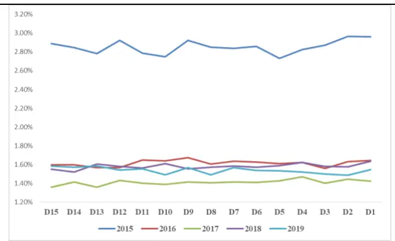
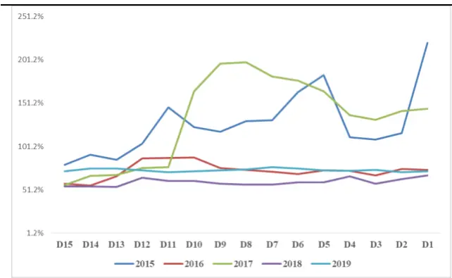
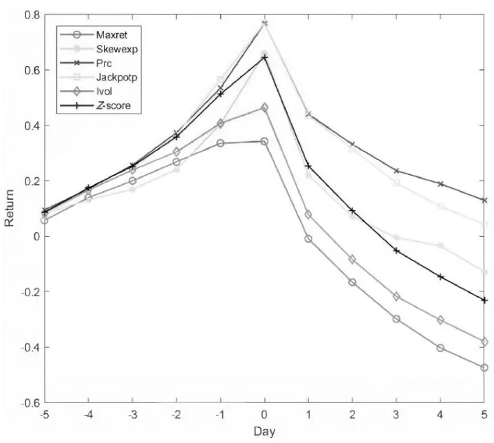
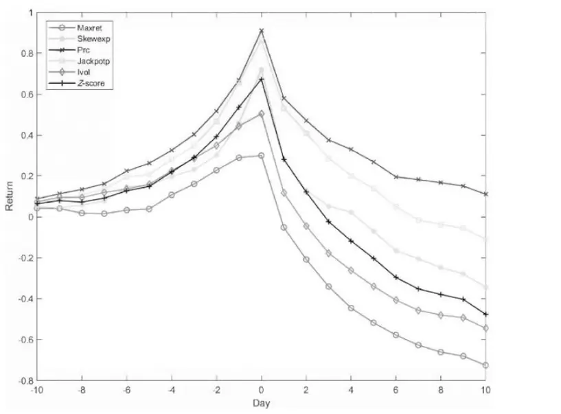
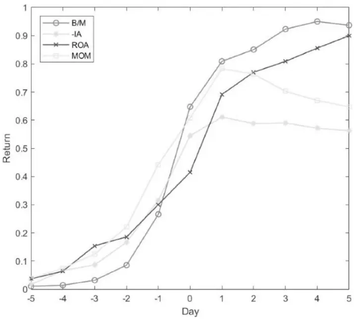
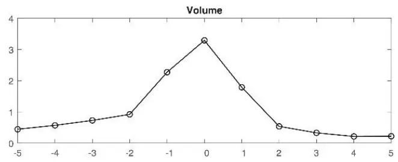
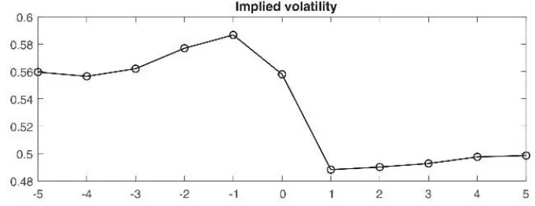
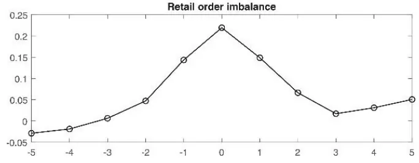

inInfo] [Table_Title] 2021.04.28

# 财报公告期的彩票类股票策略

## ——学界纵横系列之二

陈奥林(分析师)

## 徐忠亚(分析师)

8 021-38674835

021-38032692

chenaolin@gtjas.com

xuzhongya@gtjas.com

证书编号 S0880516100001

S0880519090002

## 本报告导读：

彩票类股票在财报窗口期存在特殊模式：财报发布前被高估，发布后表现不佳。基于此构建策略能获取超额收益。

## 摘要：

le_Summary]人们在财报季对投机性资产的需求快速大幅上涨。彩票股是在特定时间可能获得短期高收益的股票，可以满足财报季的投机需求。

《 Time-varying demand for lottery: Speculation ahead of earningsannouncements》一文发现彩票类股票在财报发布前窗口期被高估而在财报发布后窗口期表现不佳，即累计收益呈现倒V 模式。

倒 V 型收益模式的主要原因是投资者对投机资产的偏好和注意力驱动的散户交易。从时间看，财报信息公开之前；从特征看，散户比例高、市场换手率高和赌博偏好的地区，这种模式更为明显。

- 对投机资产的偏好与注意力驱动机制不同，两者均对倒 V 模式的产生据有推动作用。

注意力驱动的散户交易突增导致财报发布前套利活动能力受限；财报发布后不确定性降低，套利能力恢复，市场回归均衡。

- 基于这一模式的改进策略相对于传统的彩票股策略每月平均Fama-French 四因子 alpha 值从 1.09％增加到 1.50％，表明策略的改进是有效的。

- 我国市场可能存在相似但形式上略有不同的收益模式。受到财务披露模式的影响，本文策略的实际应用有待进一步优化。

金融工程

## 金融工程团队：

陈奥林：（分析师）

电话：021-38674835

邮箱：chenaolin@gtjas.com

证书编号：S0880516100001

## 杨能：（分析师）

电话：021-38032685

邮箱：yangneng@gtjas.com

证书编号：S0880519080008

## 殷钦怡：（分析师）

电话：021-38675855

邮箱：yinqinyi@gtjas.com

证书编号：S0880519080013

## 徐忠亚：（分析师）

电话：021- 38032692

邮箱：xuzhongya@gtjas.com

证书编号：S0880120110019

## 刘昺轶：（分析师）

电话：021-38677309

邮箱：liubingyi@gtjas.com

证书编号：S0880520050001

## 吕琪：（研究助理）

电话：021-38674754

邮箱：lvqi@gtjas.com

证书编号：S0880120080008

## [Table_R相关报告

GDPNOW： 精 细 化 宏 观实 时预 测 体 系2021.04.26

减持潮中，核心基金在主动增持哪些行业和个股 2021.04.24

股票指数分红预测详解与跟踪 2021.04.23

重振价值溢价 2021.04.20

AI 投 资 方 法 论 ： 从 多 因 子 到 多 信 号2021.04.17

## 1. 选题背景

财务报告通常为市场投资者带来大量新信息，一般认为在财报发布后，市场会对新信息作出反应从而影响股票收益率。然而在财报正式发布前，知情交易者可以根据尚未公开的消息提前做出部署。下图给出的是基于A股公司公告数据进行的相关检验：以A股上市公司公告作为研究样本，对公告日前个股是否存在异常收益和成交进行检验1。可以发现，在不同类型的公告期前，不论是收益还是成交均存在显著的异动现象。

图 1收益异动各年度统计值

数据来源：Wind，国泰君安证券研究

图 2成交异动各年度统计值

数据来源：Wind，国泰君安证券研究

在这种情况下，消息不灵通的投资者是否只能放弃这一机会呢？答案是否定的。投机性较强的投资者可以根据财报发布前窗口的市场情况押注尚未公开的信息；或根据历史情况押注特定的股票，以期获得高额收益。

以往的研究更多集中于财报窗口期的择时。如著名的盈余惯性效应，描述了财报公布前后窗口收益的正相关性。然而对资产池不做任何限制，导致了实际应用中基于这一效应的策略稳定性较差。这提示我们有必要对股票池进行筛选，特定的股票可能具有特别的表现。《Time-varyingdemand for lottery: Speculation ahead of earnings announcements》一文，着眼于“彩票”类股票在财报窗口期的表现，为这一类问题提供了新的解决思路。

## 2. 核心结论

财务报告带来的新信息可能会让市场为之一振，一些投资者不愿错过稍纵即逝的机会，在财报发布前便提前入场，想要凭借自己的运气在将来市场动荡时占据上风。但不是所有股票都能获得如此青睐。有一些股票就像彩票一样，比其他股票更有可能在特定的时候获得高收益。于是，在财报发布之前，这些股票广受追捧，价格持续上涨；然而财报发布之后，又如同彩票一样，中奖者寥寥无几，“彩票股”随着抛售一路下跌。

本文发现人们在财报季对投机性资产的需求快速大幅上涨，随着财报的公开快速下降，“彩票股”在财报窗口期的累计收益曲线恰似倒 V。进一步的研究表明，这种需求来源于对投机资产的偏好和套利局限。对投机资产的偏好在财报发布前上升，且受到不同国家市场、宗教信仰等地区性因素影响。财报发布前散户交易突增，套利活动难以维持市场均衡；财报发布后尘埃落定，散户交易者逐步退场，套利者恢复套利能力。

这一现象可以为财报季的投资决策提供帮助。通过筛选“彩票股”，投资者可以在财报发布前的窗口建仓持有这些股票，获得相对稳定的收益；也可以在财报发布后的窗口提前卖出彩票股、持有非彩票股规避损失。基于事前高收益和事后反转构建的彩票股改进策略是有效的，相较于标准彩票策略收益情况有所改善。

文章主要研究方法、结论和策略总结如下：

1. 本文研究了财报季彩票类股票倒 V 型收益模式的成因和应用，这一现象可以为财报季决策提供依据；

2. 研究方法是分组统计收益和Fama-Macbeth模型，得出倒V 型收益曲线的主要原因是财报窗口对投机性资产的偏好和注意力驱动的散户交易，文章构建的策略比传统策略收益更高；

3. 实际策略：每月月初筛选本月发布财报的公司，以上月末彩票股性质排序，在财报公布前 10 天买入持有彩票股，在财报当天卖出彩票股、买入非彩票股并持有至月底卖出。

## 3. 文章背景

市场定价效率不是一成不变的。Rosch 等（2017）的研究表明，在财报发布发布之前，需求和特质波动率的改变导致市场定价效率偏低。这一现象在特定的股票上尤为显著，文章将这种波动较大且容易在特定日收益中脱颖而出的股票称为“彩票类股票”（lottery-like stocks）。Bali 等（2011）的研究表明，最有可能获得高单日回报的股票通常在未来一段时间里收益惨淡。

文章发现了彩票股在财报发布前被高估而在发布后表现不佳。这一现象的原因一般认为存在两类因素：对投机资产的偏好和套利局限。对投机资产的偏好在发布之前尤其高，且受到市场、宗教信仰等地区性因素影响。套利局限包含两层含义，其一，Aboody 等（2010）的研究表明存在注意力驱动的散户交易，散户在发布前会对投机性强的股票过度关注，而在发布后对负面新闻过度反应；其二，由于特质波动和流动性的限制，在发布前套利者针对于噪声交易者的行动能力被削弱，而在发布后不确定性问题得到解决，套利能力恢复。

与之前研究的不同在于，本文不着重分析财报发布前收益高的股票在发布后的反转效应，而关注发布前高收益的模式。在分析收益特定的倒V模式的基础上，本文通过一系列实证检验分析这一现象的成因，并将此应用于改进传统的基于财报发布的择时策略。

## 4. 财报窗口期彩票股收益模式

股票的彩票性质即短期投机性，当一些股票在未来一段时间内有可能获得高收益时，人们便在这些股票上进行投机。我们将彩票性质强的股票称之为“彩票类股票”或“彩票股”。

本节在提出彩票性质衡量指标的基础上，发现彩票性强的股票在财报发布之前的一小段时间收益持续为正、在发布后的一小段时间收益持续为负，并使用Fama-Macbeth模型分析了彩票性质对窗口期收益率的影响。

## 4.1. 彩票性质的衡量

本文结合 Kumar 等（2019）、Bali 等（2011）和 Conrad 等（2014）的研究思路，提出五个基于个股的投机性代理指标，以此衡量个股“彩票”性质的强弱。

表1展示了本文使用的五个彩票性质的代理指标和一个综合指标Z-score。五个彩票性质代理指标均与预期收益负相关。计算指标用到的股票收益数据来自于 CRSP，会计数据来自 Compustat。

表 1：财报发布窗口（-5，+5）累计收益

| 指标 | 指标含义和构建方法 |
| --- | --- |
| Maxret | 过去一个月最高单日收益率 |
| Skewexp | 预期特质偏度：将特质偏度和60个月之前的特质偏度、特质波动率以及一系列控制变量的回归系数作为权重，求后者的平均值 |
| Prc | 对收盘价做标准化处理： Prc = -log(1 + Price) |
| Jackpotp | 头奖概率：将偏度、对数收益、公司寿命等一系列个股层面的指标做加权平均，使用逻辑斯谛函数标准化 |
| Ivol | 特质波动率：Fama-French三因子模型残差的标准差 |
| Z - score | 对于每支股票的每个月，将以上五个指标转化为对应的等级后进行标准化处理，计算五个指标得分的平均值 |

资料来源：《Time-varying demand for lottery》，国泰君安证券研究

## 4.2. 彩票类股票的倒 V型累计收益

本节展示了彩票类股票在财报发布前后特有的倒V型累计收益模式。有财报发布的公司股票根据前一个月五个代理指标和一个综合指标分为五组，计算每组在发布（-5，5）窗口内的等权平均累计超额收益，统计最高组和最低组累计收益之差绘制下图。数据来自 CRSP，时间区间为1972 年 1 月至 2014 年 12 月2。

图3表明，彩票类股票（高投机性股票）在收益发布之前具有显著正收益，在收益发布之后具有显著负收益，呈现出典型的倒V模式。这一模式对不同的代理指标均成立，且在更长时间窗口（-10，10）中成立。文章使用其他指标重复这一过程，包括账面市值比、收益动量、ROA和资产投资，未发现倒V 模式，表明这是投机性指标的特有模式。

图 3：财报发布窗口（-5，+5）累计收益

数据来源：《Time-varying demand for lottery》,国泰君安证券研究

图 4：财报发布窗口（-10，+10）累计收益

数据来源：《Time-varying demand for lottery》,国泰君安证券研究

图 5：财报发布窗口（-10，+10）累计收益

数据来源：《Time-varying demand for lottery》,国泰君安证券研究

按照每个彩票指标上一个月的数值将本月发布财报的公司分为五个组合，统计每组在窗口期的累计收益。由于很多公司在收盘期间发布财报，因此在收益统计中去除了第 0 天。为保证这一收益模式仅在财报发布窗口出现，本文遵循 So 等（2014）的方法随机抽取 10~40 天数据重复实验。

表 2 表明，彩票性质越强，在财报发布事前收益越高，事后收益越低；表3和表4表明，随机选取的伪日期并没有产生稳健的收益模式，倒V型收益模式是财报发布窗口期独有的。

表 2：真实公告日期的收益分层现象明显

| Proxy= | Maxret | Skewexp | Prc | Jackpotp | Ivol | Z - score |
| --- | --- | --- | --- | --- | --- | --- |
| Panel A：事前超额收益（-5，-1） |  |  |  |  |  |  |
| Q1 | 0.114 | 0.219 | 0.147 | 0.075 | 0.096 | 0.065 |
| Q2 | 0.207 | 0.218 | 0.175 | 0.173 | 0.171 | 0.212 |
| Q3 | 0.311 | 0.230 | 0.192 | 0.297 | 0.317 | 0.266 |
| Q4 | 0.427 | 0.420 | 0.309 | 0.466 | 0.418 | 0.384 |
| Q5 | 0.452 | 0.627 | 0.689 | 0.646 | 0.509 | 0.583 |
| Q5-Q1 | 0.339 | 0.408 | 0.542 | 0.570 | 0.413 | 0.518 |
| t-stat | (3.46) | (3.67) | (5.79) | (5.19) | (3.83) | (4.71) |
| Panel B: 事后超额收益（+1，+5） |  |  |  |  |  |  |
| Q1 | 0.127 | 0.082 | 0.097 | 0.111 | 0.144 | 0.167 |
| Q2 | 0.113 | 0.058 | 0.051 | 0.117 | 0.106 | 0.131 |
| Q3 | -0.047 | -0.019 | -0.045 | -0.046 | -0.013 | -0.007 |
| Q4 | -0.203 | -0.286 | -0.274 | -0.223 | -0.253 | -0.303 |
| Q5 | -0.633 | -0.618 | -0.470 | -0.535 | -0.626 | -0.631 |
| Q5-Q1 | -0.760 | -0.700 | -0.567 | -0.646 | -0.769 | -0.798 |
| t-stat | (-7.34) | (-5.68) | (-5.96) | (-5.75) | (-6.87) | (-6.78) |

资料来源：《Time-varying demand for lottery》，国泰君安证券研究

表 3：随机生成日期收益分层不明显

| Proxy= | Maxret | Skewexp | Prc | Jackpotp | Ivol | Z - score |
| --- | --- | --- | --- | --- | --- | --- |
| Panel A: 事前超额收益（-5，-1） |  |  |  |  |  |  |
| Q1 | 0.057 | 0.013 | 0.025 | 0.012 | 0.047 | 0.049 |
| Q2 | 0.042 | 0.034 | -0.026 | 0.041 | 0.053 | 0.033 |
| Q3 | 0.072 | 0.051 | 0.033 | 0.056 | 0.065 | 0.038 |
| Q4 | 0.049 | 0.060 | 0.014 | 0.043 | 0.037 | 0.036 |
| Q5 | -0.008 | 0.043 | 0.167 | 0.082 | 0.010 | 0.042 |
| Q5-Q1 | -0.064 | 0.030 | 0.141 | 0.071 | -0.036 | -0.007 |
| t-stat | (-0.91) | (0.31) | (1.71) | (0.80) | (-0.45) | (-0.08) |
| Panel B: 事后超额收益（+1，+5） |  |  |  |  |  |  |
| Q1 | 0.080 | 0.011 | 0.023 | 0.031 | 0.055 | 0.063 |
| Q2 | 0.052 | -0.021 | 0.025 | 0.002 | 0.054 | 0.041 |
| Q3 | 0.042 | -0.027 | 0.010 | 0.046 | 0.061 | 0.046 |
| Q4 | 0.027 | -0.043 | 0.022 | 0.041 | 0.025 | 0.031 |
| Q5 | 0.004 | 0.082 | 0.125 | 0.106 | 0.009 | 0.022 |
| Q5-Q1 | -0.076 | 0.071 | 0.103 | 0.075 | -0.046 | -0.041 |
| t-stat | (-1.1) | (0.82) | (1.44) | (1.00) | (-0.64) | (-0.54) |

资料来源：《Time-varying demand for lottery》，国泰君安证券研究

表 4：真实日期和随机生成日期之差收益分层明显

| Proxy= | Maxret | Skewexp | Prc | Jackpotp | Ivol | Z - score |
| --- | --- | --- | --- | --- | --- | --- |
| Panel A: 事前超额收益（-5，-1） |  |  |  |  |  |  |
| Q1 | 0.057 | 0.206 | 0.122 | 0.064 | 0.049 | 0.016 |
| Q2 | 0.164 | 0.185 | 0.201 | 0.132 | 0.118 | 0.179 |
| Q3 | 0.239 | 0.178 | 0.158 | 0.241 | 0.252 | 0.228 |
| Q4 | 0.379 | 0.359 | 0.295 | 0.423 | 0.381 | 0.348 |
| Q5 | 0.460 | 0.584 | 0.522 | 0.564 | 0.499 | 0.541 |
| Q5-Q1 | 0.403 | 0.378 | 0.401 | 0.500 | 0.450 | 0.525 |
| t-stat | (4.34) | (3.00) | (4.57) | (4.96) | (4.33) | (5.17) |
| Panel B: 事后超额收益（+1，+5） |  |  |  |  |  |  |
| Q1 | 0.047 | 0.070 | 0.074 | 0.080 | 0.088 | 0.104 |
| Q2 | 0.062 | 0.080 | 0.025 | 0.115 | 0.052 | 0.090 |
| Q3 | -0.089 | 0.007 | -0.055 | -0.092 | -0.074 | -0.053 |
| Q4 | -0.230 | -0.243 | -0.296 | -0.263 | -0.278 | -0.334 |
| Q5 | -0.637 | -0.700 | -0.595 | -0.641 | -0.635 | -0.653 |
| Q5-Q1 | -0.684 | -0.770 | -0.669 | -0.721 | -0.723 | -0.757 |
| t-stat | (-6.80) | (-6.67) | (-7.80) | (-6.83) | (-6.82) | (-7.60) |

资料来源：《Time-varying demand for lottery》，国泰君安证券研究

## 4.3. 更加精确的分析：Fama-Macbeth 模型

本节分别以事前超额收益（-5，-1）和事后超额收益（+1，+5）作为被解释变量，分别以滞后一个月的五个代理指标和一个综合指标作为解释变量，控制市净率、市值、换手率和不同周期的动量，构建 Fama-Macbeth回归。为避免极端值的影响，数据剔除了最大和最小的 1%.

表5表明，在控制了市净率、市值等因素后，六个彩票代理指标对于事前、事后窗口期收益率的影响都是显著的。这表明投资者在财报发布之前对彩票类股票具有更高偏好，这种偏好使得发布前收益为正、发布后收益为负。并且，从代理指标的系数上看，发布后的负面作用整体强于发布前的正面作用。这些结论与4.2节的结论一致。

表 5：Fama-Macbeth 回归结果

| Proxy= | Maxret | Skewexp | Prc | Jackpotp | Ivol | Z - score |
| --- | --- | --- | --- | --- | --- | --- |
| Panel A：事前超额收益（-5，-1） |  |  |  |  |  |  |
| Proxy | 1.279 (2.48) | 0.317 (4.50) | 0.199 (4.32) | 6.811 (3.09) | 4.078 (2.34) | 0.180 (3.53) |
| LogMB | -0.019 (-0.60) | 0.000 (0.01) | -0.015 (-0.49) | -0.024 (-0.79) | -0.019 (-0.62) | -0.028 (-0.93) |
| LogME | -0.097 (-6.80) | -0.042 (-2.55) | -0.046 (-3.500 | -0.079 (-5.060 | -0.091 (-6.65) | -0.052 (-3.74) |
| MOM(-1,0) | -0.567 (-2.91) | -0.458 (-2.12) | -0.374 (-2.11) | -0.470 (-2.66) | -0.487 (-2.71) | -0.483 (-2.67) |
| MOM(-12,-1) | 0.471 (6.78) | 0.245 (3.15) | 0.526 (8.11) | 0.467 (6.77) | 0.474 (6.90) | 0.509 (7.66) |
| MOM(-36,-12) | -0.075 (-3.15) | -0.046 (-1.78) | -0.054 (-2.42) | -0.056 (-2.57) | -0.073 (-3.09) | -0.064 (-2.88) |
| Turnover | -1.007 (-1.57) | 1.960 (3.55) | -0.801 (-1.28) | -0.854 (-1.32) | -1.059 (-1.64) | -1.238 (-2.05) |
| Panel B：事后超额收益（+1，+5） |  |  |  |  |  |  |
| Proxy | -2.971 (-5.01) | -0.063 (-7.74) | -0.350 (-7.78) | -11.870 (-4.05) | -9.717 (-4.90) | -0.339 (-6.63) |
| LogMB | -0.138 (-4.29) | -0.164 (-1.48) | -0.135 (-4.14) | -0.132 (-3.88) | -0.134 (-4.16) | -0.112 (-3.58) |
| LogME | 0.082 (5.86) | 0.015 (0.76) | -0.009 (-0.67) | 0.084 (5.19) | 0.073 (5.54) | -0.005 (-0.34) |
| MOM(-1,0) | -0.446 (-2.71) | -0.537 (-2.89) | -0.957 (-6.61) | -0.759 (-4.94) | -0.684 (-4.54) | -0.666 (-4.37) |
| MOM(-12,-1) | -0.156 (-2.79) | -0.274 (-4.12) | -0.238 (-4.40) | -0.184 (-3.20) | -0.149 (-2.70) | -0.194 (-3.55) |
| MOM(-36,-12) | 0.012 (0.45) | 0.019 (0.73) | -0.039 (-1.56) | 0.009 (0.33) | 0.010 (0.41) | -0.007 (-0.29) |
| Turnover | -2.377 (-4.56) | -2.097 (-4.16) | -2.757 (-5.20) | -2.679 (-4.87) | -2.304 (-4.32) | -2.002 (-4.02) |

资料来源：《Time-varying demand for lottery》，国泰君安证券研究

## 5. 深层机制透视

本节将通过控制一系列指标，具体分析前面倒V模式的深层机制。正如文章背景部分的分析，主要的原因包括对投机性资产的偏好和套利局限。

对投机性资产的偏好导致彩票类股票价格上涨，偏好随时间变化，在财报发布前的窗口更加强烈。这种偏好直观上看类似于在窗口期吸引了投资者的注意力，但它们是两个独立的作用机制。投机性行为受到人们赌博偏好的影响，因此本文也从期权市场、宗教信仰和市场换手率方面获得了一些思路。

套利局限的影响体现在，财报发布前散户交易增加，套利者受到股票流动性和特质性波动的限制难以维持市场均衡，投机性交易直接反映在股价上，导致彩票类股票上涨幅度较大；而在财报发布后不确定性降低，套利者恢复套利能力。所以，影响套利活动的一个重要问题是散户交易的强度，本文通过小额订单失衡和机构投资者持股比例等方面的检验得到了一些证据。

## 5.1. 注意力机制的影响

在财报发布前，有一些的股票可能更能引起投资者的注意，比如过去12个月累计收益高、历史非预期收益高等等。投资者在财报发布前的窗口更倾向于持有这样的股票，使得它们在窗口期的收益上升。我们把这一过程称为注意力机制。本文构建了五个注意力的指标，如下表所示。通过控制注意力机制，本文发现对投机资产的偏好是倒V 收益模式的原因之一。

表 6：注意力指标

| 指标 | 含义和构建方法 | 数据来源 |
| --- | --- | --- |
| MediaCoverage | 虚拟变量，若包含在 RavenPack新闻数据中则为1，否则为0 | RavenPack 数据库 |
| \|SUE\| | 最近的盈利意外中收益变动幅度 | CRSP |
| PD | 公司总部所在地人口密度 | 美国人口普查局 |
| SCIH | 社交网络指数，用于衡量社会联系紧密程度 | Facebook |
| Attn | 使用z-score方法，对于每支股票的每个月，将以上五个指标转化为对应的等级后进行标准化处理，计算五个指标得分的平均值 |  |

资料来源：《Time-varying demand for lottery》，国泰君安证券研究

注意力机制看起来与彩票性质非常相似，财报发布前投机性强的股票更有可能吸引投资者注意力，Aboody等（2010）的研究表明过去 12个月累计收益高的股票在财报发布期间存在类似的倒V模式。但注意力与偏好从原理上不同的机制，后面的实证检验也将证明，注意力机制不能替代偏好的作用。

表 7：控制过去12个月收益的分组累计超额收益统计3

| Proxy= | Maxret | Skewexp | Prc | Jackpotp | Ivol | Z - score |
| --- | --- | --- | --- | --- | --- | --- |
| Panel A：全部组合 |  |  |  |  |  |  |
| Panel A.1：事前超额收益（-5，-1） |  |  |  |  |  |  |
| Q1 | 0.189 | 0.213 | 0.096 | 0.114 | 0.117 | 0.094 |
| Q5 | 0.441 | 0.630 | 0.756 | 0.713 | 0.506 | 0.627 |
| Q5-Q1 | 0.253 | 0.417 | 0.661 | 0.599 | 0.389 | 0.533 |
| t-stat | (3.53) | (4.65) | (8.39) | (7.17) | (5.27) | (6.46) |
| Panel A.2: 事后超额收益（+1，+5） |  |  |  |  |  |  |
| Q1 | 0.106 | 0.096 | 0.094 | 0.092 | 0.114 | 0.146 |
| Q5 | -0.469 | -0.550 | -0.403 | -0.458 | -0.445 | -0.472 |
| Q5-Q1 | -0.575 | -0.647 | -0.497 | -0.550 | -0.559 | -0.618 |
| t-stat | (-7.82) | (-6.49) | (-6.26) | (-6.24) | (-7.14) | (-7.25) |
| Panel B: 剔除过去收益最大的组合 |  |  |  |  |  |  |
| Panel B.1：事前超额收益（-5，-1） |  |  |  |  |  |  |
| Q1 | 0.102 | 0.129 | 0.087 | 0.054 | 0.084 | 0.054 |
| Q5 | 0.371 | 0.573 | 0.649 | 0.590 | 0.424 | 0.513 |
| Q5-Q1 | 0.269 | 0.444 | 0.562 | 0.536 | 0.339 | 0.459 |
| t-stat | (2.85) | (3.77) | (5.83) | (4.82) | (3.27) | (4.25) |
| Panel B.2: 事后超额收益（+1，+5） |  |  |  |  |  |  |
| Q1 | 0.127 | 0.170 | 0.163 | 0.127 | 0.141 | 0.170 |
| Q5 | -0.473 | -0.563 | -0.396 | -0.475 | -0.456 | -0.502 |
| Q5-Q1 | -0.600 | -0.732 | -0.559 | -0.601 | -0.597 | -0.671 |
| t-stat | (-6.18) | (-5.27) | (-5.76) | (-5.37) | (-5.75) | (-5.99) |

资料来源：《Time-varying demand for lottery》，国泰君安证券研究

表7Panel A表明，在控制了过去 12个月收益的情况下，彩票类股票在财报发布之前具有正收益、在发布之后具有负收益，且彩票指标越大，事前累计收益越高、事后累计收益越低，结果与 4.2 节基本一致。这表明对投机性资产的偏好也具有不可替代的作用。表7 Panel B剔除了过去12个月收益最大的组合后重复实验的结果表明，这一结论是稳健的。

新闻媒体的报道是注意力的另一个代理指标，投资者可能对过去 12 个月收益漠不关心，但会关注公司的新闻报道。因此下面按照财报发布前是否有媒体报道将公司分为两组，重复上面的统计。

表 8：控制是否有媒体报道的分组收益统计

| Proxy= | Maxret | Skewexp | Prc | Jackpotp | Ivol | Z - score |  |
| --- | --- | --- | --- | --- | --- | --- | --- |
| Panel A：事前超额收益（-5，-1） |  |  |  |  |  |  |  |
| Panel A.1： 无媒体报道 |  |  |  |  |  |  |  |
| Q1 | 0.044 | 0.095 | 0.109 | 0.117 | 0.017 |  | 0.038 |
| Q5 | 0.363 | 0.417 | 0.602 | 0.625 |  | 0.457 | 0.530 |
| Q5-Q1 | 0.319 | 0.322 | 0.493 | 0.509 |  | 0.440 | 0.491 |
| t-stat | (1.64) | (1.97) | (3.02) | (2.44) |  | (2.16) | (2.40) |
| Panel A.2: 有媒体报道 |  |  |  |  |  |  |  |
| Q1 | 0.172 | 0.219 | 0.131 | 0.110 |  | 0.094 | 0.071 |
| Q5 Q5-Q1 | 1.097 | 1.245 | 1.317 | 1.345 |  | 1.234 | 1.371 |
| t-stat | 0.925 | 1.026 | 1.186 |  | 1.235 | 1.140 | 1.300 |
|  | (2.81) | (3.52) | (3.96) | (3.21) |  | (3.02) | (3.36) |
| Panel B：事后超额收益（+1，+5） |  |  |  |  |  |  |  |
|  |  |  | Panel B.1： 无媒体报道 |  |  |  |  |
| Q1 Q5 | 0.318 -1.207 | 0.234 -0.836 | 0.167 -0.975 | 0.249 -1.225 |  | 0.351 | 0.332 -1.343 |
| Q5-Q1 | -1.525 | -1.070 | -1.141 |  | -1.474 | -1.231 -1.583 | -1.675 |
| t-stat | (-7.05) | (-5.37) | (-5.49) |  | (-5.85) | (-6.53) | (-6.91) |
|  |  |  | Panel B.2: 有媒体报道 |  |  |  |  |
| Q1 | 0.153 | 0.182 | 0.156 | 0.118 |  | 0.250 | 0.286 |
| Q5 | -1.120 | -0.947 | -0.998 | -1.034 |  | -1.174 | -1.267 |
| Q5-Q1 | -1.273 | -1.129 | -1.154 | -1.153 |  | -1.425 | -1.533 |
| t-stat | (-5.75) | (-6.00) | (-5.63) |  | (-5.01) | (-6.11) | (-6.03) |

资料来源：《Time-varying demand for lottery》，国泰君安证券研究

表8表明，有媒体报道的组在公告前正收益更高，公告后负收益没有明显区别，表明注意力机制在倒V模式的形成中具有一定的作用，尤其在财报发布前会推高股价。

表9~表13分别使用非预期收益变动幅度、地区人口密度、社会联系紧密程度以及三者的 Z-score 值作为注意力的代理指标，表明在控制了注意力指标后，彩票类股票在盈余公告之前具有正收益、在公告之后具有负收益，且彩票指标越大，事前累计收益越高、事后累计收益越低，这表明注意力机制和偏好机制存在区别，本文提到的偏好机制是造成收益倒V 模式的原因。

表 9：注意力综合指标和彩票综合指标双重排序的累计超额收益统计

| Attn port.= | P1 | P2 | P3 | P4 | P5 | 平均值 |
| --- | --- | --- | --- | --- | --- | --- |
|  |  |  | Panel A：事前超额收益（-5，-1） |  |  |  |
| Q1 | 0.008 | 0.041 | 0.101 | 0.117 | 0.077 | 0.069 |
| Q2 | 0.027 | 0.136 | 0.231 | 0.302 | 0.300 | 0.199 |
| Q3 | 0.160 | 0.247 | 0.253 | 0.356 | 0.386 | 0.280 |
| Q4 | 0.221 | 0.329 | 0.363 | 0.405 | 0.599 | 0.384 |
| Q5 | 0.586 | 0.591 | 0.559 | 0.546 | 0.631 | 0.583 |
| Q5-Q1 | 0.579 | 0.550 | 0.458 | 0.429 | 0.554 | 0.514 |
| t-stat | (4.53) | (4.70) | (3.70) | (3.08) | (3.68) | (4.72) |

| Panel B: 事后超额收益（+1，+5） |  |  |  |  |  |  |
| --- | --- | --- | --- | --- | --- | --- |
| Q1 | 0.180 | 0.185 | 0.114 | 0.173 | 0.165 | 0.163 |
| Q2 | 0.165 | 0.108 | 0.137 | 0.164 | 0.112 | 0.137 |
| Q3 | 0.139 | -0.012 | -0.078 | -0.020 | -0.067 | -0.007 |
| Q4 | -0.116 | -0.358 | -0.354 | -0.342 | -0.0228 | -0.292 |
| Q5 | -0.622 | -0.649 | -0.547 | -0.601 | -0.790 | -0.642 |
| Q5-Q1 | -0.801 | -0.834 | -0.662 | -0.774 | -0.955 | -0.805 |
| t-stat | (-6.23) | (-6.09) | (-4.74) | (-5.55) | (-6.91) | (-6.89) |

资料来源：《Time-varying demand for lottery》，国泰君安证券研究

表 10：经过|SUE|调整的累计超额收益统计

| Proxy= | Maxret | Skewexp | Prc | Jackpotp | Ivol | Z - score |
| --- | --- | --- | --- | --- | --- | --- |
|  | Panel A：事前超额收益（-5，-1） |  |  |  |  |  |
| Q1 | 0.129 | 0.223 | 0.142 | 0.080 | 0.096 | 0.077 |
| Q5 | 0.458 | 0.636 | 0.701 | 0.644 | 0.505 | 0.616 |
| Q5-Q1 | 0.329 | 0.413 | 0.560 | 0.564 | 0.409 | 0.539 |
| t-stat | (3.50) | (3.74) | (6.04) | (5.23) | (3.97) | (5.01) |

| Q1 | 0.120 | 0.080 | 0.111 | 0.117 | 0.131 | 0.154 |
| --- | --- | --- | --- | --- | --- | --- |
| Q5 | -0.546 | -0.589 | -0.436 | -0.515 | -0.541 | -0.569 |
| Q5-Q1 | -0.665 | -0.670 | -0.546 | -0.631 | -0.672 | -0.724 |
| t-stat | (-6.88) | (-5.61) | (-5.86) | (-5.75) | (-6.58) | (-6.55) |

资料来源：《Time-varying demand for lottery》，国泰君安证券研究

表 11：经过PD调整的累计超额收益统计

| Proxy= | Maxret | Skewexp | Prc | Jackpotp | Ivol | Z - score |
| --- | --- | --- | --- | --- | --- | --- |
|  | Panel A：事前超额收益（-5，-1） |  |  |  |  |  |
| Q1 | 0.110 | 0.217 | 0.130 | 0.052 | 0.084 | 0.070 |
| Q5 | 0.468 | 0.638 | 0.680 | 0.666 | 0.522 | 0.595 |
| Q5-Q1 | 0.358 | 0.421 | 0.550 | 0.615 | 0.438 | 0.524 |
| t-stat | (3.38) | (3.78) | (5.49) | (5.23) | (3.87) | (4.48) |

| Panel B：事后超额收益（+1，+5） |  |  |  |  |  |  |
| --- | --- | --- | --- | --- | --- | --- |
| Q1 | 0.108 | 0.066 | 0.063 | 0.094 | 0.111 | 0.147 |
| Q5 | -0.617 | -0.567 | -0.427 | -0.518 | -0.591 | -0.586 |
| Q5-Q1 | -0.726 | -0.633 | -0.490 | -0.612 | -0.702 | -0.733 |
| t-stat | (-6.69) | (-5.25) | (-4.88) | (-5.16) | (-5.93) | (-6.05) |

资料来源：《Time-varying demand for lottery》，国泰君安证券研究

表 12：经过 SCIH调整的累计超额收益统计

| Proxy= | Maxret | Skewexp | Prc | Jackpotp | Ivol | Z - score |
| --- | --- | --- | --- | --- | --- | --- |
| Panel A：事前超额收益（-5，-1） |  |  |  |  |  |  |
| Q1 | 0.110 | 0.218 | 0.135 | 0.069 | 0.086 | 0.066 |
| Q5 | 0.446 | 0.648 | 0.700 | 0.648 | 0.506 | 0.593 |
| Q5-Q1 | 0.336 | 0.430 | 0.564 | 0.579 | 0.420 | 0.526 |
| t-stat | (3.47) | (3.88) | (6.07) | (5.37) | (3.96) | (4.85) |
| Panel B: 事后超额收益（+1，+5） |  |  |  |  |  |  |
| Q1 | 0.115 | 0.065 | 0.080 | 0.111 | 0.135 | 0.154 |
| Q5 | -0.615 | -0.587 | -0.440 | -0.53 | -0.608 | -0.598 |
| Q5-Q1 | -0.730 | -0.652 | -0.519 | -0.643 | -0.743 | -0.753 |
| t-stat | (-7.39) | (-5.43) | (-5.46) | (-5.78) | (-6.83) | (-6.60) |

资料来源：《Time-varying demand for lottery》，国泰君安证券研究

表 13：经过 Attn调整的累计超额收益统计

| Proxy= | Maxret | Skewexp | Prc | Jackpotp | Ivol | Z - score |
| --- | --- | --- | --- | --- | --- | --- |
|  | Panel A：事前超额收益（-5，-1） |  |  |  |  |  |
| Q1 | 0.123 | 0.072 | 0.089 | 0.114 | 0.141 | 0.163 |
| Q5 Q5-Q1 t-stat | -0.623 -0.746 (-7.26) | -0.605 -0.677 (-5.42) | -0.463 -0.522 (-5.73) | -0.529 -0.643 (-5.68) | -0.622 -0.762 (-6.85) | -0.642 -0.805 (-6.89) |
| Panel B: 事后超额收益（+1，+5） |  |  |  |  |  |  |
| Q1 | 0.123 | 0.072 | 0.089 | 0.114 | 0.141 | 0.163 |
| Q5 | -0.623 | -0.605 | -0.463 | -0.529 | -0.622 | -0.642 |
| Q5-Q1 | -0.746 | -0.677 | -0.522 | -0.643 | -0.762 | -0.805 |
| t-stat | (-7.26) | (-5.42) | (-5.73) | (-5.68) | (-6.85) | (-6.89) |

资料来源：《Time-varying demand for lottery》，国泰君安证券研究

表 14 向 4.3 节构建的 Fama-Macbeth 回归模型中添加注意力综合指标，表明注意力机制和偏好机制不能相互替代，两者均对发布前后收益的倒V 模式具有一定的影响。

表 14：Fama-Macbeth 回归

| Proxy= | Maxret | Skewexp | Prc | Jackpotp | Ivol | Z - score |
| --- | --- | --- | --- | --- | --- | --- |
| Panel A：事前超额收益（-5，-1） |  |  |  |  |  |  |
| Attn | 0.100 (4.77) | 0.102 (3.72) | 0.091 (4.59) | 0.095 (4.44) | 0.099 (4.72) | 0.091 (4.59) |
| Proxy | 1.366 (2.15) | 0.294 (4.57) | 0.203 (4.30) | 6.421 (3.23) | 4.494 (2.05) | 0.154 (2.98) |
| LogMB | -0.040 (-1.33) | -0.014 (-0.40) | -0.038 (-1.28) | -0.035 (-1.17) | -0.040 (-1.32) | -0.050 (-1.77) |
| LogME | -0.105 (-7.51) -0.489 | -0.049 (-2.96) | -0.047 (-3.65) | -0.086 (-5.74) | -0.102 (-7.66) | -0.064 (-4.71) |
| MOM(-1,0) | (-2.63) 0.453 | -0.376 (-1.85) 0.226 | -0.351 (-2.08) | -0.448 (-2.62) | -0.446 (-2.61) | -0.447 (-2.58) |
| MOM(-12,-1) | (6.35) -0.065 | (2.82) -0.036 | 0.518 (7.79) -0.041 | 0.459 (6.59) -0.048 | 0.455 (6.51) -0.063 | 0.496 (7.32) |
| MOM(-36,-12) | (-2.78) -1.176 | (-1.46) -1.711 | (-1.88) | (-2.31) -1.110 | (-2.73) | -0.052 (-2.44) |
| Turnover | (-1.96) | (3.34) | -1.099 (-1.91) | (-1.82) | -1.219 (-2.03) | -1.496 (-2.66) |
| Panel B：事后超额收益（+1，+5） |  |  |  |  |  |  |
| Attn | -0.074 (-3.91) | -0.098 (-4.22) | -0.060 (-3.25) | -0.077 (-3.65) | -0.072 (-3.83) | -0.057 (-3.07) |
| Proxy | -3.241 (-5.27) | -0.628 (-7.44) | -0.377 (-8.10) | -12.136 (-4.35) | -11.104 (-5.74) | -0.327 (-7.00) |
| LogMB | -0.142 (-4.42 | -0.175 (-4.58 | -0.143 (-4.36 | -0.136 (-4.03 | -0.136 (-4.24 | -0.133 (-3.65 |
| LogME | 0.081 (5.90) | 0.016 (0.80) | -0.015 (-1.10) | 0.084 (5.24) | 0.069 (5.32) | -0.015 (-1.02) |
| MOM(-1,0) | -0.382 (-2.39) | -0.508 (-2.76) | -0.928 (-6.61) | -0.708 (-4.70) | -0.621 (-4.25) | -0.622 (-4.25) |
| MOM(-12,-1) | -0.123 (-2.15) | -0.256 (-3.79) | -0.207 (-3.67) | -0.174 (-3.02) | -0.120 (-2.13) | -0.169 (-3.02) |
| MOM(-36,-12) | 0.007 (0.28) | 0.024 (0.95) | -0.044 (-1.93) | -0.002 (-0.09) | 0.005 (-0.21) | -0.012 (-0.53) |
| Turnover | -2.460 (-4.58) | -2.214 (-4.45) | -2.930 (-5.40) | -2.802 (-4.78) | -2.346 (-4.28) | -2.121 (-4.13) |

资料来源：《Time-varying demand for lottery》，国泰君安证券研究

## 5.2. 小额订单失衡的影响

小额订单失衡是散户交易的特征，后者可能导致彩票类股票在财报发布之前股价上涨。根据小额订单失衡指标RIMB 对股票进行分组，重复上一节的过程。这一部分仅使用了 1983 年至 2000 年的数据，其中 1983年至1992年的交易数据来自证券市场研究协会（ISSM），1993年至2000年的交易数据来自于纽约证券交易所（NYSE）和美国运通（Amex）普通股的交易和报价数据。RIMB 指标构建过程如下：

首先划分交易规模。每个月根据上个月末的公司规模分为五组，在每组中依据下表所示数据作为断点区分大、中小额交易。如在小市值组中，交易额小于3400美元则为小额交易，大于6800 美元则为大额交易。

表 15：交易规模分界点表

| 公司市值五分位分组 | 小 | 2 | 3 | 4 | 大 |
| --- | --- | --- | --- | --- | --- |
| 小额交易分界点（$） | 3400 | 4800 | 7300 | 10300 | 16400 |
| 大额交易分界点（$） | 6800 | 9600 | 14600 | 20600 | 32800 |

资料来源：《Time-varying demand for lottery》，国泰君安证券研究

其次将交易分为买方驱动单和卖方驱动单。如果以低于报价中点的价格成交，则为卖方单；如果以高于报价中点的价格成交，则为买方单；如果成交价恰好为报价中点，则依据上一笔成交的交易判断：若高于上一笔成交价则为买单，否则为卖单。取每个时间窗口内小额买单和卖单交易总量 BUYVOL 和 SELLVOL，构建小额订单失衡指标 RIMB。

$$
RIMB=\frac{BUYVOL-SELLVOL}{BUYVOL+SELLVOL}
$$

为了准确捕捉散户投资者情绪变化，将财报发布后 30~59 个交易日分为6个5日窗口，计算这五个窗口 RIMB的平均值作为基准。在发布前窗口（-5，-1）和发布后窗口（+1，+5）计算指标，以衡量小额订单失衡情况。

由于时间区间的不同，本节重复了5.1节的检验；并构建了 Fama-French回归，解释变量包括彩票性质指标、RIMB 以及两者的交叉项。

表 16~表 19 表明，在财报发布发布之前的一段时间，彩票股票的小额订单失衡比非彩票股票更多，表明散户交易对财报发布前的股价上涨具有推动作用。在文中未展示的结果中，一些证据表明个人投资者更有可能在财报公布之前购买彩票类股票，与Barber等（2002）的发现一致。

表 16：1983-2000 期间组合收益情况

| Proxy= | Maxret | Skewexp | Prc | Jackpotp | Ivol | Z - score |  |
| --- | --- | --- | --- | --- | --- | --- | --- |
| Panel A：无条件彩票股组合 |  |  |  |  |  |  |  |
|  | 1.324 | 1.292 |  | Panel A.1：事前超额收益（-5，-1） | 3.036 |  | 2.913 |
| Q5-Q1 t-stat |  | (1.65) | 2.992 | 2.600 | (6.09) |  | (4.82) |
|  | (2.97) |  | (4.82) | (3.84) |  |  |  |
| Panel A.2：事后超额收益（+1，+5） |  |  |  |  |  |  |  |
| Q5-Q1 | -0.297 | -0.009 | 0.926 | 0.314 | 0.786 |  | 0.554 |
| t-stat | (-0.79) | (-0.02) | (1.51) | (0.52) |  | (1.51) | (0.97) |
| Panel B:控制过去12 个月收益的组合 |  |  |  |  |  |  |  |
| Panel B.1：全部组合 |  |  |  |  |  |  |  |
| Panel B.1.1：事前超额收益（-5，-1） |  |  |  |  |  |  |  |
| Q5-Q1 |  | 0.502 |  |  |  |  |  |
| t-stat | 0.903 |  | 1.520 | 1.721 |  | 2.061 | 1.737 |
|  | (2.30) | (0.71) | (2.66) |  | (2.91) | (5.02) | (3.31) |
| Panel B.1.2：事后超额收益（+1，+5） |  |  |  |  |  |  |  |
| Q5-Q1 | -0.542 | -1.077 | -0.170 | -0.799 |  | -0.015 | -0.477 |

| t-stat | (-1.47) | (-2.10) | (-0.32) | (-1.48) | (-0.04) | (-1.01) |
| --- | --- | --- | --- | --- | --- | --- |
| Panel B.2: | 剔除过去12个月收益前10%的组合 |  |  |  |  |  |
| Q5-Q1 | 1.266 | Panel B.2.1：事前超额收益（-5，-1） 1.189 | 2.590 | 2.322 | 2.948 | 2.682 |
| t-stat | (2.71) | (1.41) Panel B.2.2：事后超额收益（+1，+5） | (3.91) | (3.25) | (5.47) | (4.14) |
|  | -0.283 | -0.158 | 0.677 | 0.268 | 0.798 | 0.640 |
| Q5-Q1 |  |  |  |  |  |  |
| t-stat | (-0.70) | (-0.26) | (1.04) | (0.42) | (1.40) | (1.08) |

资料来源：《Time-varying demand for lottery》，国泰君安证券研究

表 17：1983-2000 期间根据 Attn 和 Z-score 交叉排序的组合收益情况

| Attn port.= | P1 | P2 | P3 | P4 | P5 | Ave |
| --- | --- | --- | --- | --- | --- | --- |
| Panel A：事前超额收益（-5，-1） |  |  |  |  |  |  |
| Q5-Q1 | 2.699 | 2.754 | 2.541 | 3.457 | 3.081 | 2.906 |
| t-stat | (2.95) | (3.46) | (3.16) | (4.20) | (3.90) | (4.79) |
| Panel B：事后超额收益（+1，+5） |  |  |  |  |  |  |
| Q5-Q1 | 0.165 | 0.236 | 0.752 | 1.204 | 1.014 |  |
| t-stat | (0.18) | (0.33) | (1.01) | (1.44) | (1.10) | 0.674 (1.18) |

资料来源：《Time-varying demand for lottery》，国泰君安证券研究

表 18：1983-2000 期间组合收益情况

| Proxy= | Maxrei | Skewexp | Prc | Jackpo | Ivol | Z - score |
| --- | --- | --- | --- | --- | --- | --- |
| Panel A：控制\|SUE\| |  |  |  |  |  |  |
| Q5-Q1 t-stat | 1.302 (2.98 | Panel A.1：事前超额收益（-5，-1） 1.494 (2.01 | 2.918 (4.63 | 2.817 (4.33 | 3.147 (6.51 | 2.966 (4.98) |
| Panel A.2:事后超额收益（+1，+5） -0.371 |  |  |  |  |  |  |
| Q5-Q1 t-stat | (-0.97) | -0.002 (0.00) | 0.811 (1.30) | 0.408 (0.69) | 0.772 (1.46) | 0.468 (0.82) |
| Panel B:控制 PD Panel B.1：事前超额收益（-5，-1） |  |  |  |  |  |  |
| Q5-Q1 t-stat | 1.132 | 1.524 | 3.217 | 2.691 | 2.879 | 2.728 |
|  | (2.51) | (2.07) | (5.42) | (4.18) | (6.06) | (4.70) |
| Panel B.2:事后超额收益（+1，+5） |  |  |  |  |  |  |
| Q5-Q1 | -0.440 | -0.269 | 0.825 | 0.415 | 0.679 | 0.462 |
| t-stat | (-1.18) | (-0.44) | (1.31) | (0.67) | (1.30) | (0.83) |
| Panel C:控制 SCIH |  |  |  |  |  |  |
| Q5-Q1 t-stat | 1.337 | 1.445 | 2.981 | Panel C.1：事前超额收益（-5，-1） 2.694 | 2.909 | 2.805 |
|  | (3.04) | (1.98) | (4.68) | (4.26) | (5.76) | (4.67) |
| Panel C.2：事后超额收益（+1，+5） |  |  |  |  |  |  |
| Q5-Q1 t-stat | -0.292 (-0.77) | -0.009 (-0.01) | 1.023 (1.62) | 0.305 (0.48) | 0.789 (1.51) | 0.442 (0.76) |
| Panel D: 控制 Attn |  |  |  |  |  |  |
| Panel D.1：事前超额收益（-5，-1） |  |  |  |  |  |  |
| Q5-Q1 | 1.384 | 1.391 | 2.880 | 2.775 | 3.143 | 2.906 |
| t-stat | (3.27) | (1.81) | (4.65) | (4.24) | (6.36) | (4.79) |
| Panel D.2：事后超额收益（+1，+5） |  |  |  |  |  |  |
| Q5-Q1 t-stat | -0.214 | 0.114 (0.20) | 0.950 (1.53) | 0.290 (0.47) | 0.912 | 0.674 (1.18) |

资料来源：《Time-varying demand for lottery》，国泰君安证券研究

表 19：1983-2000 期间组合收益情况

| Proxy= | Maxret | Skewexp | Prc | Jackpotp | Ivol | Z - score |
| --- | --- | --- | --- | --- | --- | --- |
|  | Panel A：事前超额收益（-5，-1） |  |  |  |  |  |
| RIMB | 0.022 (13.67) | 0.013 (6.01) | 0.121 (24.76) | 0.021 (12.94) | 0.010 (5.37) | 0.056 (25.15) |
| Proxy | 0.042 (3.94) | 0.010 (7.20) | 0.005 (6.21) | 0.430 (6.45) | 0.176 (4.41) | 0.005 (5.90) |
| Proxy | 0.421 | 0.047 | 0.028 | 2.217 | 1.629 | 0.033 |

| × RIMB | (14.90) | (15.00) | (19.95) (15.39) | (16.95) | (17.31) |
| --- | --- | --- | --- | --- | --- |
| Panel B：事后超额收益（+1，+5） |  |  |  |  |  |
| RIMB | 0.024 (12.78) | 0.014 0.117 (6.64) (24.28) | 0.022 (12.56) | 0.012 (6.15) | 0.055 (24.89) |
| Proxy | -0.014 (-1.34) | -0.002 -0.001 (-1.48) | -0.020 (-1.40) (-0.28) | -0.034 (-0.97) | -0.001 (-2.21) |
| Proxy × RIMB | 0.379 (14.56) | 0.046 0.027 (15.85) (19.61) | 2.107 (14.54) | 1.519 (16.89) | 0.030 (17.05) |

资料来源：《Time-varying demand for lottery》，国泰君安证券研究

## 5.3. 赌博偏好的检验：来自期权市场的证据

本节分析了对投机性资产的偏好是否与赌博偏好相关。虚值（OTM）看涨期权没有内在价值、只有时间价值，期权费很低；其时间价值来自于未来价格上涨，使虚值期权转化为实值期权，借此获取高额回报。因此，虚值看涨期权天然带有赌博属性。通过虚值看涨期权的交易情况变化可以分析财报窗口的投机性变动情况。

本文将行权价与现价之比大于 1.05的看涨期权定义为虚值看涨期权。统计这些期权的交易量、隐含波动率和小额订单失衡情况。其中交易量、隐含波动率数据统计当日交易量相对于过去三个月平均值的百分比变动；小额订单失衡关注下个月到期的短期期权，首先将期权合约交易量转化为对应的股票交易量，指标构造的后续步骤与5.2节相同。

期权交易量和隐含波动率数据来自于 OptionMetrics，时间区间为 1996年至 2014 年，预先排除了非标准结算、违反基本套利条件、未平仓头寸为零和数据缺失的期权。期权订单数据来自于国际证券交易所（ISE）的开盘/收盘交易资料，时间区间为 2008年至2014年。

图6表明，财报发布之前存在较强的投机性行为。虚值看涨期权交易量和小额订单失衡情况相呼应，在财报发布当天达到高峰。在财报发布之前隐含波动率飙升，然后在收益公告之后骤降。这些现象表明财报发布之前对投机性资产的需求增加，导致了彩票类股票的收益上升。

图 6：OTM看涨期权交易量、隐含波动率和小额订单失衡情况

数据来源：《Time-varying demand for lottery》,国泰君安证券研究

## 5.4. 宗教信仰的影响

天主教和新教教义对赌博行为的认可度存在差异，Kumar等（2011）指出可以用两者信徒比例 CPRATIO 衡量地区性赌博偏好，进而分析赌博偏好对投机性资产偏好的关系。数据来自于美国宗教数据档案库（ARDA），对缺失的年份进行线性插值，并与Compustat的公司总部位置数据连接，得到公司级别的指标数据。

表 20表明，在具有较强赌博偏好的地区的公司中，收益的倒 V 模式更明显，这一现象验证了对投机性资产的偏好是这一特殊收益模式的形成原因。

表 20：Fama-Macbeth 回归

| Proxy= | Maxret | Skewexp | Prc | Jackpotp | Ivol | Z - score |
| --- | --- | --- | --- | --- | --- | --- |
| Panel A：事前超额收益（-5，-1） |  |  |  |  |  |  |
| logCPRATIO | -0.001 (-0.07) | 0.010 (0.50) | 0.104 (2.06) | 0.002 (0.11) | -0.020 (-0.84) | 0.034 (2.69) |
| Proxy | 1.967 (3.49) | 0.400 (5.00) | 0.245 (4.79) | 8.329 (3.56) | 6.434 (3.54) | 0.247 (4.74) |
| Proxy × logCPRATIO | 0.722 (2.16) | 0.052 (1.95) | 0.026 (1.61) | 1.785 (1.32) | 2.709 (2.41) | 0.032 (2.08) |
| Panel B：事后超额收益（+1，+5） |  |  |  |  |  |  |
| logCPRATIO | -0.041 (-2.34) | 0.011 (0.41) | -0.081 (-1.82) | -0.012 (-0.73) | -0.027 (-1.30) | -0.014 (-1.21) |
| Proxy | -2.703 (-3.94) | -0.614 (-6.81) | -0.331 (-6.76) | -9.677 (-3.10) | -9.090 (-4.16) | -0.313 (-5.80) |
| Proxy × logCPRATIO | 0.271 (0.91) | -0.051 (-1.45) | -0.024 (-1.69) | -0.755 (-0.68) | 0.118 (0.13) | -0.014 (-0.98) |

数据来源：《Time-varying demand for lottery》,国泰君安证券研究

## 5.5. 不同国家市场的差异

换手率可以衡量股票流动性，换手率高的股票往往是短线资金追逐的对象，投机性较强，股价风险相对较大。本文将市场换手率作为衡量一个市场整体投机性的代理变量；并选取了 38 个国家的股票市场，构建Maxret、Prc和 Ivol指标和一个 z-score指标。非美国公司的公司级股票和会计数据来自Compustat Global数据库，非美国公司的财报公布日期来自彭博社，38 个国家的国内股票市场换手率数据来自世界银行。

本节首先将国家按照换手率分为三组，每组统计窗口期累计收益，结果记录在下表PanelA；随后构建了两组 Fama-Macbeth 回归，解释变量分别为彩票性质综合指数 z-score 和换手率以及两者的交叉项，结果记录在下表 Panel B.

表 21：不同国家按换手率分组的收益分层结果

| Group= | Low | High | High-Low |
| --- | --- | --- | --- |
|  | Panel A.1：事前超额收益（-5，-1） |  |  |
| Q1 | 0.051 | 0.096 |  |
| Q5 | 0.093 | 0.709 |  |
| Q5-Q1 | 0.042 | 0.613 | 0.571 |
| t-stat | (0.24) | (3.39) | (3.24) |
| Panel A.2：事后超额收益（+1，+5） |  |  |  |
| Q1 | 0.151 | 0.212 |  |
| Q5 | -0.653 | -1.005 |  |
| Q5-Q1 | -0.803 | -1.217 | -0.413 |
| t-stat | (-4.66) | (-7.18) | (-1.84) |

数据来源：《Time-varying demand for lottery》,国泰君安证券研究

表 22：不同国家的收益 Fama– MacBeth 回归

| Group= | (I)单一解释变量分组统计 |  |  | （I）多解释变量 High-Low |
| --- | --- | --- | --- | --- |
|  | Low | High | High-Low |  |
| TurnoverAG |  | Panel B.1：事前超额收益（-5，-1） |  | 0.050 |
| Z-score |  |  |  | (0.31) |
|  | 0.045 | 0.218 | 0.173 | -0.135 |
| Z - score | (0.61) | (2.46) | (2.05) | (-1.83) |
|  |  |  |  | 0.003 |
| × TurnoverAG |  |  |  | (3.84) |
|  |  | Panel B.2：事后超额收益（+1，+5） |  |  |
| TurnoverAG |  |  |  | -0.847 |
| Z-score |  |  |  | (-3.71) |
|  | -0.310 | -0.492 | -0.182 | -0.096 |
|  | (-4.51) | (-5.96) | (-1.86) | (-1.01) |
| Z - score |  |  |  | -0.003 |
| × TurnoverAG |  |  |  |  |
|  |  |  |  | (-2.72) |

数据来源：《Time-varying demand for lottery》,国泰君安证券研究

表 21 表明，财报公布之前彩票股表现优于非彩票股的现象在不同国家广泛存在，且在换手率较高的国家中这一现象更为明显。表 22 得到了相同的结论，彩票性质在这一现象中具有重要意义。

## 5.6. 机构投资者所有权的影响

与个人投资者相比，机构投资者应较少受到诸如注意力、彩票偏好之类的行为偏见的影响。按照上一季度末机构投资者持股比例 IO 将股票均分为两组重复上面的检验，IO 数据来自于 Thomson Financial 13F 数据库。

表 23 表明，机构投资者比例越低，事前股票累计收益越高，事后股票表现不佳的情况越严重，与前面的分析一致。

表 23：高 IO组和低 IO组差额的累计收益统计

| Proxy= | Maxret | Skewexp | Prc | Jackpotp | Ivol | Z - score |
| --- | --- | --- | --- | --- | --- | --- |
| Panel A：事前超额收益（-5，-1） |  |  |  |  |  |  |
| Panel A.1：高 IO 组 |  |  |  |  |  |  |
| Q1 | 0.117 | 0.176 | 0.141 | 0.169 | 0.145 | 0.118 |
| Q5 | 0.520 | 0.727 | 0.752 | 0.727 | 0.575 | 0.624 |
| Q5-Q1 | 0.403 | 0.551 | 0.611 | 0.558 | 0.430 | 0.506 |
| t-stat | (3.45) | (4.07) | (4.62) | (4.23) | (3.28) | (3.72) |
| Panel A.2: 低 IO 组 |  |  |  |  |  |  |
| Q1 | 0.025 | 0.257 | 0.158 | 0.068 | 0.050 | 0.042 |
| Q5 | 0.337 | 0.301 | 0.227 | 0.291 | 0.342 | 0.316 |
| Q5-Q1 | 0.312 | 0.044 | 0.069 | 0.223 | 0.291 | 0.274 |
| t-stat | (2.66) | (0.35) | (0.67) | (1.74) | (2.24) | (1.98) |
| Panel A.3: 高 IO 组和低 IO 组差额 |  |  |  |  |  |  |
| Q5-Q1 | -0.091 | -0.508 | -0.542 | -0.335 | -0.138 | -0.232 |
| t-stat | (-1.04) | (-4.07) | (-4.93) | (-3.13) | (-1.45) | (-2.22) |
| Panel B：事后超额收益（+1，+5） |  |  |  |  |  |  |
| Panel B.1：高 IO 组 |  |  |  |  |  |  |
| Q1 | 0.070 | -0.111 | -0.103 | -0.043 | 0.061 | 0.093 |
| Q5 | -0.896 | -0.822 | -0.687 | -0.760 | -0.846 | -0.824 |
| Q5-Q1 | -0.967 | -0.711 | -0.584 | -0.717 | -0.908 | -0.917 |
| t-stat | (-6.87) | (-5.07) | (-4.69) | (-4.88) | (-6.05) | (-6.03) |
| Panel B.2:低 IO 组 |  |  |  |  |  |  |
|  | 0.146 | 0.108 | 0.123 | 0.135 | 0.176 | 0.204 |
| Q5 | -0.214 | -0.066 | -0.079 | -0.037 | -0.220 | -0.208 |
| Q5-Q1 | -0.359 | -0.174 | -0.202 | -0.172 | -0.395 | -0.412 |
| t-stat | (-3.13) | (-1.31) | (-1.75) | (-1.31) | (-3.01) | (-2.94) |
|  |  | Panel B.3: 高 IO 组和低 IO 组差额 |  |  |  |  |
| Q5-Q1 | 0.607 | 0.537 | 0.382 | 0.545 | 0.512 | 0.505 |
| t-stat | (5.91) | (4.36) | (3.31) | (4.34) | (4.72) | (4.63) |

数据来源：《Time-varying demand for lottery》,国泰君安证券研究

## 5.7. 其他稳健性检验

一般而言，彩票类股票的偏度往往高于非彩票类股票，且财报发布窗口的偏度可能高于平时。因此，投资者对彩票类股票的偏好可能部分地来自于异常增高的偏度。为了检验此假设，本文统计了不同组合在实际事件期间和伪事件期间的收益偏度和盈利意外。

如表24所示，彩票类股票在（-1，+ 1）窗口收益比非彩票类股票偏度更高。彩票股在财报窗口期的实际偏度要比其他时间更高，而非彩票股票的偏斜度在事件窗口和非事件窗口中是相似的。此外，彩票股的盈利意外也比非彩票股更高。

表 24：财报窗口期已实现收益的偏度和盈利意外

| Proxy= | Maxret | Skewexp | Prc | Jackpotp | Ivol | Z - score |
| --- | --- | --- | --- | --- | --- | --- |
| Panel A：事前超额收益（-5，-1） |  |  |  |  |  |  |
| Panel A.1：高 IO 组 |  |  |  |  |  |  |
| Q1 | 1.468 | 0.278 | 0.079 | 0.203 | 0.645 | 0.118 |
| Q5 | 3.601 | 4.156 | 4.011 | 3.981 | 3.732 | 3.890 |
| Q5-Q1 | 2.134 | 3.878 | 3.932 | 3.778 | 3.087 | 3.772 |
| Panel A.2:低 IO 组 |  |  |  |  |  |  |
| Q1 | 1.263 | 0.177 | -0.445 | 0.832 | 0.747 | 0.681 |
| Q5 | 1.583 | -0.680 | 2.267 | 1.694 | 1.492 | 0.973 |
| Q5-Q1 | 0.320 | -0.857 | 2.712 | 0.862 | 0.745 | 0.292 |
| Panel A.3: 高 IO 组和低 IO 组差额 |  |  |  |  |  |  |
| Q1 | 0.205 | 0.101 | 0.254 | -0.628 | -0.102 | -0.563 |
| Q5 | 2.018 | 4.836 | 1.744 | 2.287 | 2.240 | 2.917 |
| Q5-Q1 | 1.813 | 4.735 | 1.220 | 2.916 | 2.343 | 3.480 |
| Panel B: 事后超额收益（+1，+5） |  |  |  |  |  |  |
| Q1 | -3.900 | -2.651 | -1.419 | -4.363 | -4.234 | -3.874 |
| Q5 | -1.342 | -1.146 | -1.107 | -1.159 | -1.213 | -1.083 |
| Q5-Q1 | 2.559 | 1.506 | 0.312 | 3.204 | 3.021 | 2.791 |

数据来源：《Time-varying demand for lottery》,国泰君安证券研究

本节对财报发布窗口期的其他细节问题也进行了检验和分析。

首先，本文前面所有检验的窗口期都不包含第0天，这是由于很多公司在收盘期间发布新的财报，导致并不存在交易日中的“当天”。在附录中采用了多种窗口期划定方法，如事前窗口期为（-5，0）、事后窗口期为（0，+5），或者依据 Engelberg 等（2018）的方法将发布当天、前一天或后一天当中交易量最高的日子记为财报发布日，得到的结果基本相同。

其次，如果存在知情交易，那么财报发布的消息内容应当对窗口期收益产生不同的影响。文章附录的补充检验表明，当财报发布为好消息或中性消息时，在发布之前，彩票股的收益确实比非彩票股的收益更高；当财报发布为坏消息时，在宣布收益之前，彩票股的收益与非彩票股区别不大。这一现象表明知情投资者交易对事前收益具有重要影响。

最后，文章检验了共同基金和对冲基金对这一现象的影响，结果记录在了附录中。共同基金的总净资产和回报数据来自 CRSP；对冲基金每月总净资产和回报数据来自汤森路透理柏对冲基金（TASS）数据库。时间序列回归的结果表明，在财报发布之前，共同基金流动与彩票股的价格上涨之间具有显著的正相关关系，而对冲基金流动具有不显著的负相关关系。这些结果表明对冲基金是市场中的套利者，且在财报发布前其套利能力被削弱了；共同基金的行为实际上对财报发布前股票的错误定价有推动作用。

## 6. 对传统策略的改进

传统策略基于彩票性质强的股票未来收益率低这一结论，持有非彩票股票并卖空彩票股票。基于本文发现的财报发布前彩票股高收益的特征，可以构建一个两阶段的策略。

第一步，每个月初将本月有公布财报计划的公司作为股票池，以上个月的彩票指标为依据排序，在财报发布之前的窗口（-10，-1）买入前五分之一的股票，并作空后五分之一，按照市值加权构建组合。若窗口（-10，-1）均处于上个月，则放弃建仓机会。

第二步，在财报发布后恢复为传统的彩票股策略，即卖出所持彩票股并作空它们，买入并持有非彩票股票。至本月月底全部清空。

对于衡量彩排性质的每个指标，使用 1972 年至 2014 年的数据回测（Skewexp 从 1988 年开始），统计平均收益和 Fama-French 四因子模型的α情况。

表 25 表明，改进的策略提高了收益。以 Z-score 为例，每月平均Fama-French 四因子 alpha 值从 1.09％增加到 1.50％，表明策略的改进是有效的。

表 25：改进的彩票股策略收益情况

| Proxy= | Maxret | Skewexp | Prc | Jackpotp | Ivol | Z - score |
| --- | --- | --- | --- | --- | --- | --- |
| Panel A: 标准彩票策略 |  |  |  |  |  |  |
| Q1 | 0.577 | 0.790 | 0.522 | 0.547 | 0.568 | 0.583 |
| Q5 | 0.145 | 0.211 | 0.523 | -0.186 | -0.244 | -0.449 |
| Q1-Q5 | 0.432 | 0.579 | -0.001 | 0.733 | 0.811 | 1.031 |
| t-stat | (1.59) | (1.61) | (-0.00) | (2.10) | (2.76) | (2.99) |
| FF4αQ1-Q5 | 0.514 | 0.412 | -0.006 | 0.835 | 0.881 | 1.085 |
| t-stat | (2.95) | (1.82) | (-0.03) | (4.36) | (4.85) | (5.01) |
| Panel B: 改进彩票策略 |  |  |  |  |  |  |
| Q1 | 0.359 | 0.460 | 0.256 | 0.271 | 0.299 | 0.322 |
| Q5 Q1-Q5 | -0.236 0.595 | -0.277 0.737 | -0.165 0.421 | -0.729 1.000 | -0.586 0.885 | -0.910 1.231 |
| t-stat | (2.58) | (2.54) | (1.50) | (3.45) | (3.55) | (4.22) |
| FF4αQ1-Q5 | 0.810 | 0.795 | 0.597 | 1.288 | 1.144 | 1.500 |
| t-stat | (4.16) | (3.37) | (2.53) | (6.55) | (6.31) | (7.30) |
| Panel C: 改进彩票策略和标准彩票策略之差 |  |  |  |  |  |  |
| Q1 | -0.218 | -0.329 | -0.266 | -0.276 | -0.269 | -0.261 |
| Q5 | -0.381 | -0.488 | -0.689 | -0.543 | -0.342 | -0.461 |
| Q1-Q5 | 0.163 | 0.158 | 0.422 | 0.267 | 0.073 | 0.200 |
| t-stat | (1.23) | (0.94) | (3.20) | (1.71) | (0.55) | (1.46) |
| FF4αQ1-Q5 | 0.295 | 0.382 | 0.603 | 0.453 | 0.263 | 0.415 |
| t-stat | (1.79) | (2.10) | (3.71) | (2.45) | (1.61) | (2.48) |

数据来源：《Time-varying demand for lottery》,国泰君安证券研究

## 7. 总结

## 7.1. 原文结论

财报发布窗口一直以来是业界和学界关注的重点时期，有关于公司未来发展的新消息可能使股票收益率大幅波动。本文分析了财报发布窗口期彩票股收益的倒V 模式，即财报发布前窗口期具有显著正收益，财报发布后窗口期收益为显著为负。

这一现象来源于人们对投机资产的偏好和套利的局限，因而在财报信息公开之前和散户比例高、市场换手率高和赌博偏好的地区更为明显。基于事前高收益和事后反转构建的彩票股改进策略是有效的，相较于标准彩票策略收益情况有所改善。

## 7.2. 我们的思考

在财报发布窗口择时的前提是存在知情交易者交易，因而可以通过财报发布前的市场状况推定知情交易的方向，以此进行套利。若认为财报公开的信息仍有价值，则事前收益和事后收益应该方向相同；若认为事前收益已经过度反应了信息，则两者方向相反。这两种情况的区别取决于市场信息效率、投资者素质、市场流动性等诸多因素，因而不同国家、不同品种的市场的表现形式都可能不同。但财报发布窗口，尤其是财报发布前的市场状况，其重要性是毋庸置疑的。

随着证券市场的发展和完善，诸如对冲基金的市场套利和高频交易者在市场中会具有更加重要的地位和作用。这些投资者对市场套利机会更加敏感，可以快速反应并通过套利消除投资机会。在这样的环境中，本文研究的财报季效应可能会逐渐减弱，乃至不复存在。

本文所作的分析大都针对美国股票市场，我们可以推断在散户比例更高、投机氛围相对较强的国内股市，这样的现象应当是存在的，但具体的形式有待进一步的研究。如果更多投资者从知情交易的角度出发，在财报窗口投机，考虑到套利能力的限制，这一现象可能会更显著。

本文基于事前高收益和事后反转构建的彩票股策略是比较完整的，既包括了财报窗口期的择股，也包括了窗口期之前股票池的构建。但文章的回测并未包含佣金、手续费、交易滑点等交易成本，考虑到本文提出的策略操作频率较高，交易成本的引入可能会侵蚀部分收益。还有一个不能忽略的问题是，我国的财务披露包含快报、业绩预告和财务报告等三个环节，且前两个环节不具有强制性；市场在信息第一次公开时反应最为强烈，但无法预期发布时间的快报和业绩预告也导致财报发布前的建仓期难以确定，这为策略的具体实施增加了挑战。

## 本公司具有中国证监会核准的证券投资咨询业务资格

## 分析师声明

作者具有中国证券业协会授予的证券投资咨询执业资格或相当的专业胜任能力，保证报告所采用的数据均来自合规渠道，分析逻辑基于作者的职业理解，本报告清晰准确地反映了作者的研究观点，力求独立、客观和公正，结论不受任何第三方的授意或影响，特此声明。

## 免责声明

本报告仅供国泰君安证券股份有限公司（以下简称“本公司”）的客户使用。本公司不会因接收人收到本报告而视其为本公司的当然客户。本报告仅在相关法律许可的情况下发放，并仅为提供信息而发放，概不构成任何广告。

本报告的信息来源于已公开的资料，本公司对该等信息的准确性、完整性或可靠性不作任何保证。本报告所载的资料、意见及推测仅反映本公司于发布本报告当日的判断，本报告所指的证券或投资标的的价格、价值及投资收入可升可跌。过往表现不应作为日后的表现依据。在不同时期，本公司可发出与本报告所载资料、意见及推测不一致的报告。本公司不保证本报告所含信息保持在最新状态。同时，本公司对本报告所含信息可在不发出通知的情形下做出修改，投资者应当自行关注相应的更新或修改。

本报告中所指的投资及服务可能不适合个别客户，不构成客户私人咨询建议。在任何情况下，本报告中的信息或所表述的意见均不构成对任何人的投资建议。在任何情况下，本公司、本公司员工或者关联机构不承诺投资者一定获利，不与投资者分享投资收益，也不对任何人因使用本报告中的任何内容所引致的任何损失负任何责任。投资者务必注意，其据此做出的任何投资决策与本公司、本公司员工或者关联机构无关。

本公司利用信息隔离墙控制内部一个或多个领域、部门或关联机构之间的信息流动。因此，投资者应注意，在法律许可的情况下，本公司及其所属关联机构可能会持有报告中提到的公司所发行的证券或期权并进行证券或期权交易，也可能为这些公司提供或者争取提供投资银行、财务顾问或者金融产品等相关服务。在法律许可的情况下，本公司的员工可能担任本报告所提到的公司的董事。

市场有风险，投资需谨慎。投资者不应将本报告作为作出投资决策的唯一参考因素，亦不应认为本报告可以取代自己的判断。
在决定投资前，如有需要，投资者务必向专业人士咨询并谨慎决策。

本报告版权仅为本公司所有，未经书面许可，任何机构和个人不得以任何形式翻版、复制、发表或引用。如征得本公司同意进行引用、刊发的，需在允许的范围内使用，并注明出处为“国泰君安证券研究”，且不得对本报告进行任何有悖原意的引用、删节和修改。

若本公司以外的其他机构（以下简称“该机构”）发送本报告，则由该机构独自为此发送行为负责。通过此途径获得本报告的投资者应自行联系该机构以要求获悉更详细信息或进而交易本报告中提及的证券。本报告不构成本公司向该机构之客户提供的投资建议，本公司、本公司员工或者关联机构亦不为该机构之客户因使用本报告或报告所载内容引起的任何损失承担任何责任。

## 评级说明

## 1.投资建议的比较标准

投资评级分为股票评级和行业评级。

以报告发布后的12个月内的市场表现为比较标准，报告发布日后的 12个月内的公司股价（或行业指数）的涨跌幅相对同期的沪深 300 指数涨跌幅为基准。

## 2.投资建议的评级标准

报告发布日后的 12 个月内的公司股价（或行业指数）的涨跌幅相对同期的沪深 300 指数的涨跌幅。

|  | 评级 | 说明 |
| --- | --- | --- |
| 股票投资评级 | 增持 | 相对沪深300指数涨幅15%以上 |
|  | 谨慎增持 | 相对沪深 300指数涨幅介于5%～15%之间 |
|  | 中性 | 相对沪深300 指数涨幅介于-5%～5% |
|  | 减持 | 相对沪深 300指数下跌 5%以上 |
| 行业投资评级 | 增持 | 明显强于沪深 300 指数 |
|  | 中性 | 基本与沪深 300指数持平 |
|  | 减持 | 明显弱于沪深300指数 |

## 国泰君安证券研究所

|  | 上海 | 深圳 | 北京 |
| --- | --- | --- | --- |
| 地址 | 上海市静安区新闸路669号博华广场 20层 | 深圳市福田区益田路 6009 号新世界 商务中心34层 | 北京市西城区金融大街甲9号金融 街中心南楼18层 |
| 邮编 | 200041 | 518026 | 100032 |
| 电话 | （021)38676666 | (0755)23976888 | (010)83939888 |
|  | E-mail: gtjaresearch@gtjas.com |  |  |