inInfo] [Table_Title] 2021.05.05

# 选股组合如何对冲宏观风险

## ——学界纵横系列之三

陈奥林(分析师)

## 杨能(分析师)

8 021-38674835

chenaolin@gtjas.com

021-38032685

证书编号 S0880516100001

yangneng@gtjas.com

S0880519080008

## 本报告导读：

基于特殊二阶段回归模型，可以有效捕捉宏观经济风险，获取新的增量信息，从而帮助投资者获取更高的边际回报。

## 摘要：

le_Summary] 回顾 A 股风格切换的重要节点，投资风格和风险偏好的转变通常与宏观经济环境密不可分。目前国内经济受国际疫情恢复不确定性，导致宏观不确定性上升，宏观经济风险对投资组合影响正不断加大。

- 传统风险模型分析投资组合的风险来源由基本面因子和特质风险解释，忽略了宏观经济波动对投资组合的影响。

《Quantifying Macroeconomic Risk》一文发现通过有效捕捉宏观经济风险，可以为市场环境定位、风险来源、绩效归因和投资组合表现作出增量信息贡献。

关键模型是在传统风险模型基础上，通过引入捕捉宏观风险效应机制，从而构建的宏观风险模型。作者选取合适的宏观因子，并进行了宏观风险模型有效性验证。实证结果表明宏观因子对基本面因子具有一定的解释力度，能够有效替代部分传统风险模型中的基本面因子。

该宏观风险模型能够在多个方面进行应用，以达到为投资者提供宏观层面增量信息的目的。具体包括：分析投资组合在各个宏观因子上的暴露度，从而对市场环境进行准确定位；对投资组合进行风险来源分解，判断实际风险来源以及是否得到合理回报；对投资组合进行绩效归因，了解策略收益的真实驱动力；利用对冲宏观经济风险来提升策略表现，有效缩小策略最大回撤。

- 通过为投资组合设定宏观风险暴露上限，发现相比较于没有限制的策略对应表现，该策略年化收益提升 23%，最大回撤下降超过 50%。

金融工程

## 金融工程团队：

陈奥林：（分析师）

电话：021-38674835

邮箱：chenaolin@gtjas.com

证书编号：S0880516100001

## 杨能：（分析师）

电话：021-38032685

邮箱：yangneng@gtjas.com

证书编号：S0880519080008

## 殷钦怡：（分析师）

电话：021-38675855

邮箱：yinqinyi@gtjas.com

证书编号：S0880519080013

## 徐忠亚：（分析师）

电话：021- 38032692

邮箱：xuzhongya@gtjas.com

证书编号：S0880120110019

## 刘昺轶：（分析师）

电话：021-38677309

邮箱：liubingyi@gtjas.com

证书编号：S0880520050001

## 吕琪：（研究助理）

电话：021-38674754

邮箱：lvqi@gtjas.com

证书编号：S0880120080008

## [Table_R相关报告

财报公告期的彩票类股票策略 2021.04.28GDPNOW： 精 细 化 宏 观实 时预 测 体 系2021.04.26

减持潮中，核心基金在主动增持哪些行业和个股 2021.04.24

股票指数分红预测详解与跟踪 2021.04.23

重振价值溢价 2021.04.20

## 1. 选题背景

回顾A股风格切换的重要节点，投资风格与风险偏好的转变通常与宏观经济环境密不可分。2011年年初，利率上行、期限利差收窄，经济复苏过程中利率中枢上移，市场风格由成长向价值切换；2013 年经济复苏，中小企业盈利预期乐观 ，市场风格由大盘向小盘切换；2018年10月流动性进入宽松周期，十年期国债利率维持低位，市场风格由价值向成长切换。目前国内经济受国际疫情恢复不确定性，导致宏观不确定性在逐渐上升，宏观经济风险对投资组合影响正不断加大。

对于量化投资者而言，如何量化宏观经济信息，并将其纳入组合构建是量化研究的难点之一，本篇报告推荐的学术文章提供了一种新的量化宏观信息的思路。

## 2. 核心结论

文章的结论主要分为两个部分，包括模型的有效性检验相关结论以及宏观风险模型应用相关结论。

一方面，文章检验了新构建的二阶段模型的有效性，即宏观因子是否能够有效解释基本面因子。通过检验回归调整R 方，发现单个基本面因子的部分收益可以由宏观因子合理解释；通过判断投影回归系数符号的经济有效性和数值稳定性，发现宏观因子对基本面因子的解释满足统计显著和经济显著性质；通过单因子投资组合风险拆解，发现该投资组合大约三分之一的风险都来自于宏观因子波动。

另一方面，文章指出了宏观经济风险模型对投资决策增量信息贡献的增益作用，具体表现在四个方面。通过分析投资组合在各个宏观因子上的暴露度，发现在2009、2012、2016三个时间点体现出了极端宏观风险暴露值，这与历史实际情况一致；通过对投资组合进行风险来源分解，发现宏观因子风险分散在传统风险模型中的各个基本面因子风险贡献中，真正的风险来源没有在传统风险模型中被捕获；通过对投资组合进行绩效归因，发现投资组合在 2016 年期间表现较差的原因归因于宏观经济因素而非像风险模型描述的归因于风格因子；通过为投资组合设定宏观风险暴露上限，发现相比较于没有限制的策略对应表现，该策略年化收益提升23%，最大回撤下降超过 50%。

## 3. 文章背景

投资组合的风险来源真的如传统因子模型所分析的那样，可以由风格、行业、公司因子和特质风险全部解释吗，宏观波动在这过程中又扮演什么角色？ Qontigo 和 State Street Global Advisors 合作的论文《QuantifyingMacroeconomic Risk》主要围绕上述问题进去展开分析。

传统风险模型具有清晰的经济含义，并被反复验证能够捕捉与标的资 $\cdot 产$ 相关的大部分系统性风险。但在全球经济复苏大背景下，人们预期乐观，风险偏好上升，导致个股与宏观层面因素相关性上升，关注传统风险模型中所缺失的对宏观风险的考虑显得尤为重要。

以往的文献通过两种解决方法来加入对宏观因子的考虑。第一种方法是在构建传统风险模型的同时，对宏观因子单独构建一个类似的时间序列模型；第二种方法是将宏观因子与原有的基本面因子同时作为风险模型的自变量输入，得到一个整体的时间序列模型。这两种方法的缺点在于基本面因子和宏观因子之间存在（高度）相关性。

《Quantifying Macroeconomic Risk》提供一种新的解决思路，能够有效解决相关性这一问题。文章建立在 “量化宏观风险”的思想基础上，具体做法是通过使用基本面因子在宏观因子层面的投影替代原有的基本面因子，从而完成一个二阶段的回归模型以构建新的宏观风险模型，有效捕捉宏观经济风险。这个框架首次在2016年Axioma 的年度投资者大会上被展示，后被 State Street Global Advisors 改进使用。

通过模拟动量策略投资组合并分析风险及收益表现，发现新的宏观风险模型下，投资组合收益和风险来源并不完全来自于传统模型中风格因子等基本面因子，而是来自于市场动态变化所产生的的宏观波动。这一结论说明通过宏观风险模型对投资组合进行有效分析后，可以获取新的增量信息，从而帮助基金经理获取更高的边际回报。

## 4. 核心模型

## 4.1. 基础模型

文章首先给出单个国家的多因子模型如下，

$$
r=Xf+\varepsilon\tag{1}
$$

其中r 代表标的资产收益率，X为基本面因子暴露度向量，f为基本面因子收益向量，ε为特质风险回报。文章使用的多因子模型为 AXWW4 模型，其中根据因子性质，包括了风格因子、行业因子和公司因子三类基本面因子。

由多因子模型可以推导得到传统风险模型。具体地，对多因子模型等式两边同时求方差，并假设 $cov(f,\varepsilon)\;=\;0$ ，可得

$$
var(r)\;=\;X\Sigma_{ff}X^{\prime}\;+\;\Sigma_{\varepsilon\varepsilon}\tag{2}
$$

其中 $\Sigma_{ff}$ 代表基本面因子收益方差协方差矩阵， $\Sigma_{\varepsilon\varepsilon}$ 代表特质风险方差。接下来，根据之前的思路，文章将引入捕捉宏观风险效应机制。假设基本面因子收益是宏观因子收益的线性组合，即

$$
f=\beta g+\delta\tag{3}
$$

其中 $g$ 为宏观因子收益，δ为残差基本面因子收益。

将公式3 带入多因子模型，可得宏观因子模型，即

$$
r\;=\;X\beta g\;+\;X\delta\;+\;\varepsilon\tag{4}
$$

以及新的风险模型如下

$$
var(r)\;=\;[X\beta\quad X]\begin{bmatrix}\Sigma_{gg}&\Sigma_{g\delta}\\\Sigma^{\prime}{}_{g\delta}&\Sigma_{\delta\delta}\end{bmatrix}[\begin{matrix}\beta^{\prime}X^{\prime}\\X^{\prime}\end{matrix}]+\Sigma_{\varepsilon\varepsilon}\tag{5}
$$

假设 $\begin{array}{r}{(cov(g,\delta)\;=\;0}\end{array}$ ，我们得到简化的宏观风险模型，即

$$
\begin{array}{r}{var(r)=[X\beta\quad X]\left[\begin{matrix}{\Sigma_{gg}}&{0}\\{0}&{\Sigma_{ff}-\beta\Sigma_{gg}\beta^{\prime}}\end{matrix}\right][\begin{matrix}{\beta^{\prime}X^{\prime}}\\{X^{\prime}}\end{matrix}]+\Sigma_{\varepsilon\varepsilon}}\end{array}\tag{6}
$$

对比传统风险模型和简化后的宏观风险模型，可以发现两者衡量的风险大小相同，不同的是宏观风险模型优先使用宏观因子来解释组合风险，强调了宏观因子模型是多因子模型的线性变换。

## 4.2. 宏观因子选取

宏观因子的选取主要考虑到三个方面的因素：

a.选取的宏观因子要与标的资产和投资策略相关，例如不同的国家具有不同的宏观特征，选取的宏观因子也应该随之变化

b.选取的宏观因子可交易且可获取数据频率高于每周，这一考虑排除了包括GDP 在内的一系列低频或不可交易的宏观因子的使用

c.选取的宏观因子之间不存在多重共线性，这保证了基本面因子在宏观因子层面上投影的有效性

在考虑以上三个方面后，文章挑选了五个关键宏观因子来构建最终的宏观风险模型，包括利率变化（分为平移和斜率两种变化）、高息信用利差、能源价格和贵金属价格，具体信息如下表：

表 1: 宏观因子定义

| 因子名称 | 变量定义 | 类型 | 彭博标签 |
| --- | --- | --- | --- |
| 利率平移 | 美国收益率曲线第一主成分 | 变化值 | N/A |
| 利率斜率 | 美国收益率曲线第二主成分 | 变化值 | N/A |
| 信用利差 | 彭博巴克莱全球高收益 OAS 指数 | 变化值 | LG30OAS |
| 能源价格 | 彭博能源指数 | 收益率 | BCOMENTR |
| 贵金属价格 | 彭博贵金属指数 | 收益率 | BCOMENTR |

资料来源：《Quantifying Macroeconomic Risk》，国泰君安证券研究

以上的宏观因子捕捉传统宏观经济效应，包括增长、通胀预期以及政策影响。

## 4.3. 模型有效性检验

宏观因子能否解释大部分的基本面因子收益是检验模型有效性的关键。文章从三个角度出发进行相应的检验，包括回归调整 R方的检验、回归系数检验和对应单因子投资组合风险分解来源检验。

## 4.3.1. 投影回归调整 R 方

模型的关键在于使用基本面因子在宏观因子层面的投影替代原有模型中的基本面因子，这一替代的有效性可以通过检验回归结果的调整 R方来检验。通过对每个基本面因子构建投影回归模型（即公式 3），得到各个基本面因子所对应的调整 R方，展示在图1中：

图 1宏观因子对基本面因子的解释力：调整 R方
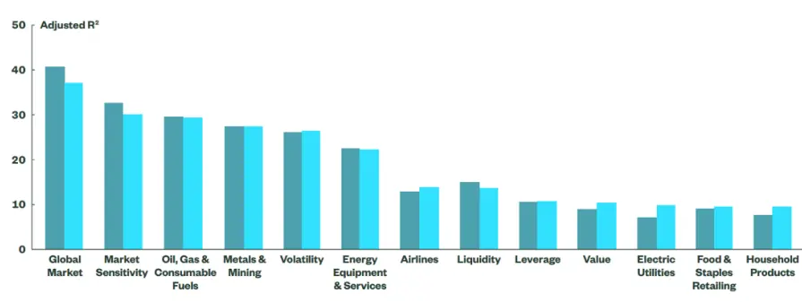
资料来源：《Quantifying Macroeconomic Risk》，国泰君安证券研究

从图1中可以看到总量、市场相关的基本面因子调整 R方更高，比如全球市场因子、市场敏感度因子等，而公司特质相关的基本面因子调整 R方相对较低，比如价值因子、杠杆率因子等。但总的来说，回归结果中调整R 方说明了宏观因子可以合理解释部分的基本面因子收益。

## 4.3.2. 投影回归系数

替代的经济含义也需要进行相应的检验，需要确保回归系数自身具有比较直观的经济含义并保持相对稳定。文章以市场敏感度因子为例，进行投影回归模型的实证检验，各个宏观因子回归系数如图 2所展示：

图 2市场敏感度因子回归系数：β
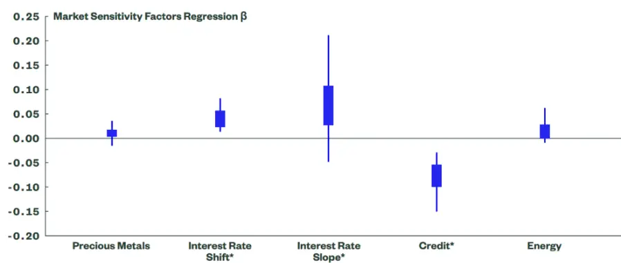
资料来源：《Quantifying Macroeconomic Risk》，国泰君安证券研究
*β按 0.1比例进行缩放

从图2中可以看到市场敏感度因子在信用利差因子上有负敞口，而在利率因子上有正敞口，我们可以从经济角度来解释这一结果。当信用利差较大时，市场投资者往往处于风险规避状态，风险资产市场下行，不同板块受到影响效果差别很大，不同风险资产对市场反应分化明显，同时考虑到市场下行阶段投资者在处置效应引导下有更弱交易倾向，使得一定程度上个股的反应没有整体市场剧烈，市场敏感度不高，从而体现出来市场敏感度因子和信用利差因子的负相关关系。另一方面，当利率向上时，投资者具有较大的风险偏好，市场上涨背后的因素更具有普适性，例如经济复苏带来盈利性改善、降准支撑股市整体估值等因素，投资者的追涨杀跌导致的羊群效应也很容易抬升整体股价，个股和大盘相关性更强，从而体现出来市场敏感度因子和利率因子的正相关关系。

## 4.3.3. 单因子投资组合风险拆解

为了控制其他基本面因子对研究的特定单个基本面因子的干扰，文章通过对单个基本面因子构建对应因子模拟投资组合（FMP），使用宏观风险模型对 FMP 事前波动率进行拆解以检验对应基本面因子和宏观因子之间的关系。FMP 投资组合构建确保对应的单个基本面因子上的风险暴露为 1 且在其他基本面因子上的风险暴露为 0。以敏感度因子为例，对应FMP 风险拆解结果如图 3所展示：

图 3市场敏感度因子 FMP风险拆解
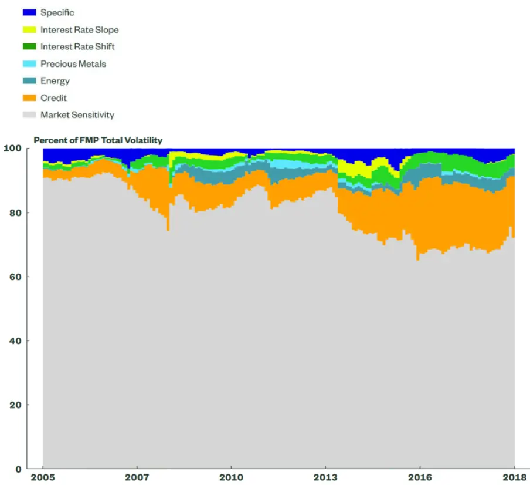
资料来源：《Quantifying Macroeconomic Risk》，国泰君安证券研究
*β按 0.1比例进行缩放

从图3中可以看到在后半段的样本期内，FMP 三分之一的风险来自于宏观因子，尤其是信用利差因子。

其他风格基本面因子的 FMP风险拆解如表2 所示：

表 2: 风格因子 FMP风险拆解：风险贡献比例

| 因子名称 | FMP 因子风险(%) | 宏观因子风险(%) 特质风险(%) |
| --- | --- | --- |
| 市场敏感度 | 80.3 (8.1) 17.1 （8.1） | 2.6 (1.4) |
| 波动率 | 80.9（5.3） | 13.8（5.6） 5.3（2.3) |
| 价值 | 74.1（4.9） | 7.1 (5.8) 18.8(6.2) |
| 流动性 | 76.6 （4.5） | 6.6(3.1） 16.8(5.0) |
| 中期动量 | 86.5 (2.6） | 6.1（3.4） 7.4 (3.3) |
| 杠杆率 | 70.7 （5.0) | 5.2 (3.8） 24.1（6.4) |
| 股息率 | 76.5（4.6) | 3.8(3.3) 19.7 (6.2) |

| 外汇敏感度 70.1(6.0） | 3.4 (2.2) 26.4 (6.8) |
| --- | --- |
| 成长 68.4(7.3) | 2.8（2.9） 28.8（8.8） |
| 盈利收益率 70.7 (5.4) | 2.8（2.6) 26.5(6.3) |
| 规模 89.7 （2.4) | 2.6（1.7) 7.6 (2.0) |
| 利润率 63.3 (6.6) | 2.0（2.4） 34.7 (7.8) |

资料来源：《Quantifying Macroeconomic Risk》，国泰君安证券研究
*括号内是标准差

从表2中可以看出市场敏感度因子和波动因子对应的FMP风险来源中，宏观因子占比相对更大。这一实证结果进一步验证了宏观因子可以对基本面因子进行部分解释。

## 5. 模型的应用

模型的应用主要包括四个方面：分析投资组合在各个宏观因子上的暴露度；对投资组合进行风险来源分解；对投资组合进行绩效归因；利用对冲宏观经济风险来提升策略表现。

在具体应用之前，文章通过模拟买入持有动量策略构建了对应的投资组合以供分析。该动量策略对标富时全球指数（FTSE），确保策略具有一定代表性，并在优化过程中不对动量和市场敏感度设置风险敞口限制。回测样本期为2005年至2018年。动量策略表现数据统计结果见表3：

表 3: 模拟动量策略表现

| 主动回报 1.34% |
| --- |
| 跟踪误差（事后） 4.33% |
| 信息比率 0.31 |
| 最大回撤 -19.75% |
| 平均月换手率（单边） 5.88% |
| 平均月换手费率 0.20% |
| 平均 Alpha 模型传递系数 0.17 |
| 平均中期动量指数 0.46 |
| 平均活跃份额 82.92% |
| 平均股票数量 252 |

资料来源：《Quantifying Macroeconomic Risk》，国泰君安证券研究

动量策略表现和FTSE 表现对比见图4：

图 4 动量策略年度表现 v.s.富时全球指数（FTSE）年度表现
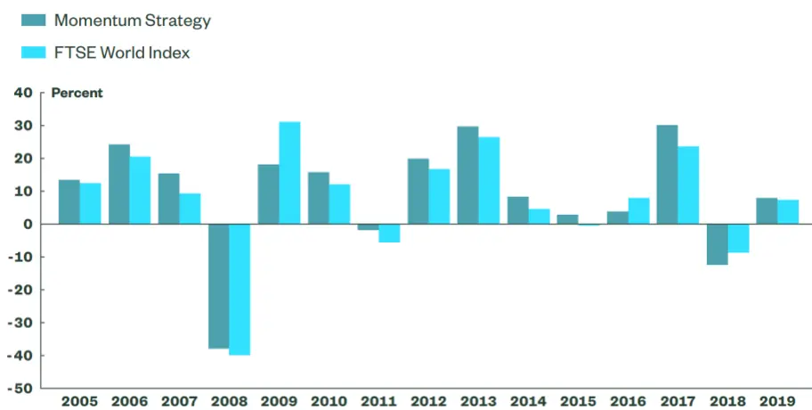
资料来源：《Quantifying Macroeconomic Risk》，国泰君安证券研究

从图4中可以看到大部分情况下主动策略表现优于被动指数表现。

## 5.1. 宏观因子层面暴露度分析

相比较于FMP，模拟的动量策略会受到多个基本面因子影响，风险来源更加广泛并具有现实意义。通过二阶段宏观因子模型回归，获取并对比动量策略和FTSE 对应的各个宏观因子暴露值，得到图 5：

图 5 动量策略相对于 FTSE的宏观因子收益暴露度
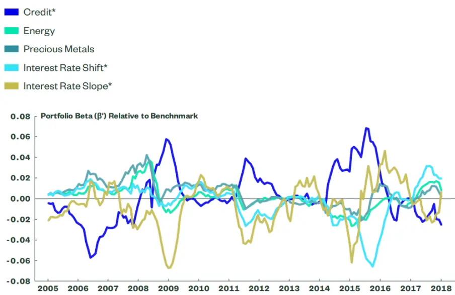
资料来源：《Quantifying Macroeconomic Risk》，国泰君安证券研究
*β按 0.1比例进行缩放

从图5中可以发现在 2009年、2012年和 2016年三个时间点都出现了极端风险暴露值，这是多因子模型没有捕捉到的。这些极端的风险暴露值集中于利率平移因子和信用利差两个因子上。

文章猜测动量策略和 FTSE 风险暴露值的差异来源于市场动态变化。从历史上来看，2016年中期，投资者出于对经济增长的担忧，怀疑美联储提高利率可信度，导致美国十年期利率触碰历史低点，这一现象导致投资组合对利率变化更加敏感。考虑到这种暴露值差异也可能是由于动量策略在对应的时间点对不同板块的配置上存在一定倾向导致，文章检验了动量策略在周期型板块和防御型板块上仓位变化，发现在三个极端风险暴露值时间点对应的板块配置并无明显规律，从而否定了这一可能性。通过分析投资组合在不同宏观因子上暴露度，可以准确定位投资组合所处市场环境的动态变化，这是多因子模型无法捕捉到的信息。

## 5.2. 风险来源分解

投资组合的风险是因子暴露、因子波动率和相关性的函数，所以除了分析动量策略投资组合在宏观因子上的暴露度信息外，宏观因子本身的波动率和相关性也是宏观风险模型可提供的重要信息。通过宏观风险模型对动量策略收益跟踪误差进行风险拆解，得到结果显示在图 6中：

图 6 事前跟踪误差分解（宏观风险模型分解结果）
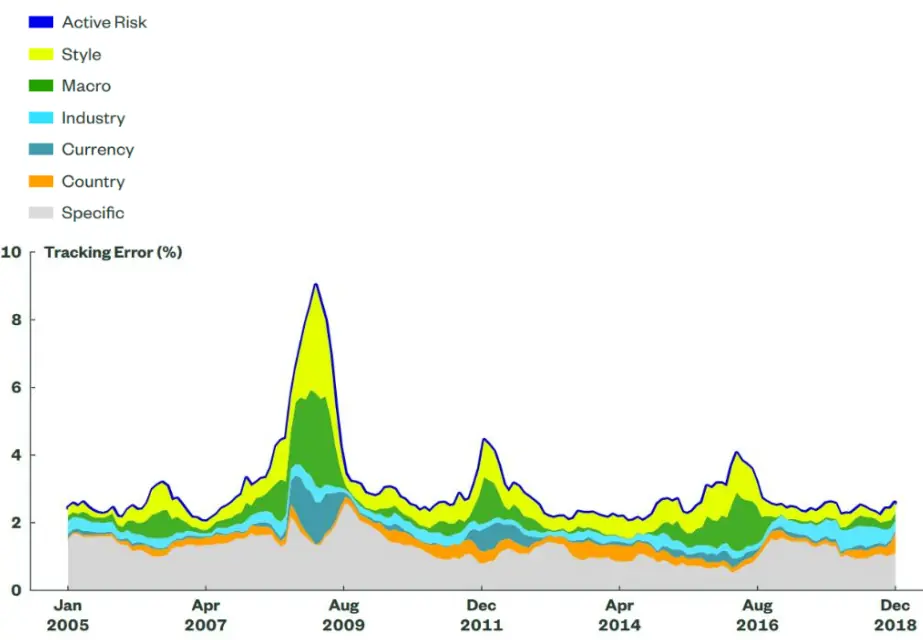
资料来源：《Quantifying Macroeconomic Risk》，国泰君安证券研究

从图6中可以看到，在一些时期，宏观因子风险是组合跟踪误差的重要驱动因素。文章将2016年作为子样本进行单独分析，风险贡献拆解结果如图7：

图 7 宏观风险模型v.s.传统风险模型：风险贡献组成结果对比
资料来源：《Quantifying Macroeconomic Risk》，国泰君安证券研究
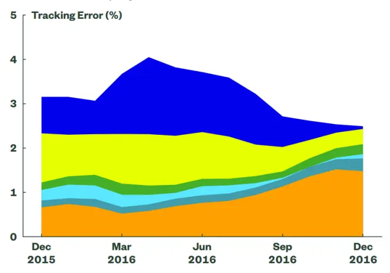
MacroStyleIndustryCurrency CountrySpecific
*左图为宏观风险模型结果，右图为传统风险模型结果。

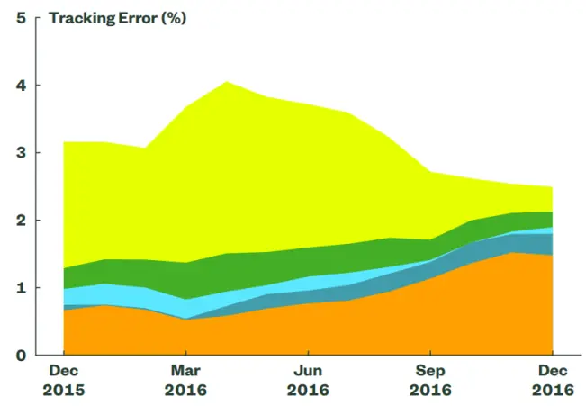

从图7中发现，2016年上半年面临重大宏观风险，而这些风险在传统风险模型中分散在风格、行业、国家等基本面因子风险贡献中，真正的风险来源没有在传统风险模型中被捕获。这一关键信息的了解是必要的，因为这可以帮助基金经理判断风险是否得到了合理的回报，以便及时调整对应的头寸。

## 5.3. 绩效归因

在理想情况下，根据动量策略的构建原理，绩效归因的结果会集中于动量因子本身，但是在现实情况中，考虑到投资组合会受到其他因素的影响，因此对投资组合进行绩效归因是必要的。对2016 年3-4月子样本期间动量策略表现进行绩效归因，结果显示在图8 中：

图 8 绩效归因结果
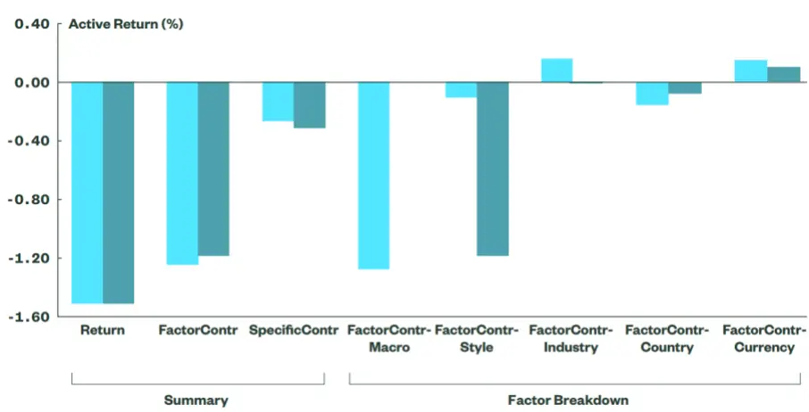
资料来源：《Quantifying Macroeconomic Risk》，国泰君安证券研究*浅蓝色（左柱）为宏观因子模型结果，深蓝色（右柱）为多因子模型结果。

从图8中可以看到，2016年动量策略表现差于FTSE 并不像多因子模型所描述的归因于风格因子，而是像宏观因子模型所描述的归因于宏观经济因素。

## 5.4. 策略构建提升

考虑对冲宏观风险能够有效提升改善策略表现。具体地，文章在动量策略优化条件中添加宏观因子风险暴露限制，从而得到有宏观风险限制的动量策略表现，对比结果见表 4：

表 4: 有宏观限制的动量策略表现 v.s.没有宏观限制的动量策略表现

|  | 无限制策略 | 有限制策略 | 变化百分比 |
| --- | --- | --- | --- |
| 主动回报 | 1.34% | 1.65% | 23% |
| 跟踪误差（事后） | 4.33% | 3.30% | -24% |
| 信息比率 | 0.31 | 0.50 | 61% |
| 最大回撤 | -19.75% | -8.42% | -57% |
| 平均月换手率（单边） | 5.88% | 5.87% | 0% |
| 平均月换手费率 | 0.20% | 0.20% | 0% |
| 平均 Alpha 模型传递系数 | 0.17 | 0.16 | -5% |
| 平均中期动量指数 | 0.46 | 0.42 | -10% |
| 平均活跃份额 | 82.92% | 82.39% | -1% |
| 平均股票数量 | 252 | 252 | 0% |

资料来源：《Quantifying Macroeconomic Risk》，国泰君安证券研究

从表 4 中可以看到，策略表现回报提升了 23%，信息比率提升了 61%，并且有效降低了一半以上的最大回撤。

文章尝试从两方面分析策略改善的原因。一方面对比分析了有宏观风险限制动量策略和无宏观风险限制动量策略的历史回撤。历史回撤表现展示在图9 中：

图 9 策略历史回撤对比
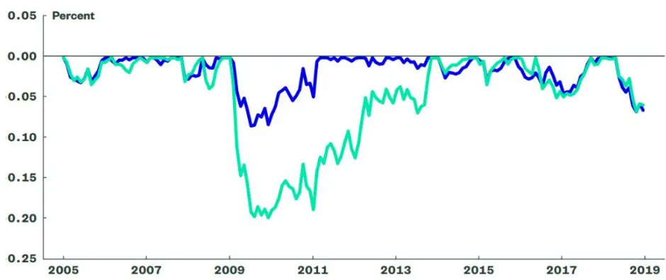
资料来源：《Quantifying Macroeconomic Risk》，国泰君安证券研究
*蓝色为有限制动量策略，绿色为无限制动量策略

从图 9 中可以发现，有宏观风险限制动量策略在 2009 年的回撤降低的尤为明显，在该期间投资组合严重暴露在信用利差持续扩大的风险之下，这说明宏观风险暴露的限制使得改善后的动量策略有效规避了该期间的宏观经济风险。

另一方面，文章计算策略改善前后在动量因子上的暴露值，结果显示在

图 10：

图 10 动量因子暴露值
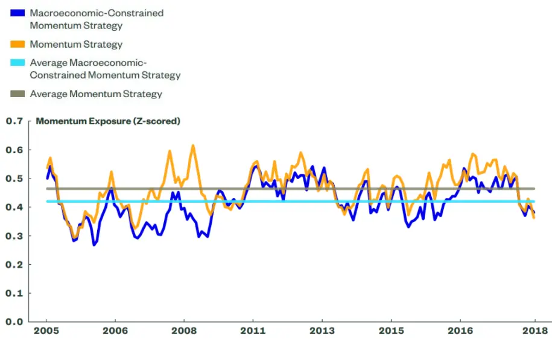
资料来源：《Quantifying Macroeconomic Risk》，国泰君安证券研究

从图 10 中可以看到，有宏观风险限制动量策略在动量因子上的暴露相对更小，鉴于改善后的动量策略经风险调整回报更高，这种动量因子暴露较低的成本是值得的，实现了宏观风险的有效对冲。

## 6. 总结

## 6.1. 原文结论

在文章中， Qontigo 和 State Street Global Advisors 通过将基本面因子投影至宏观因子层面，从而在传统风险模型基础上构建了宏观风险模型。该模型可应用于暴露值分析、风险来源分析、绩效归因以及投资组合构建等多个方面，为投资经理提供宏观风险层面的新信息，以得到更高的边际风险调整回报。

## 6.2. 我们的思考

风险模型基本面因子在不同宏观风险因子上的敞口存在差异性，通过对应的宏观因子表现可以推导得到当前市场环境。例如市场敏感度在利率平移因子上的正敞口说明，当利率向上时，市场投资者往往处于风险偏好状态，风险资产市场上行，经济复苏带来盈利性改善、降息支撑股市整体估值等因素具有普适性，此时交易者容易追涨杀跌，个股对市场敏感度更高。

这一市场正好对应当前国内市场环境，以经济复苏为主线的乐观经济预期提升了投资者风险偏好，如何捕捉投资组合中的宏观因子风险，并设定对应风险暴露上限以提升策略组合收益、降低策略组合最大回撤是有意义的。

文章的整体模型框架和应用是比较完整的，从基础模型的搭建，到模型有效性的检验，最后给出模型的具体应用。从数据统计显著性到模型背后的经济含义解释都相对完整。

文章所做的分析适用于全球资本市场，模型的有效性关键在于宏观因子的选择，具体如何根据国内宏观环境选择可交易高频的宏观因子是策略在国内市场应用的难点，有待进一步的研究。同时在设定宏观风险暴露上限的策略组合优化中，如何进一步提升优化也是策略具体实施过程中可以考虑的另一方向。

## 本公司具有中国证监会核准的证券投资咨询业务资格

## 分析师声明

作者具有中国证券业协会授予的证券投资咨询执业资格或相当的专业胜任能力，保证报告所采用的数据均来自合规渠道，分析逻辑基于作者的职业理解，本报告清晰准确地反映了作者的研究观点，力求独立、客观和公正，结论不受任何第三方的授意或影响，特此声明。

## 免责声明

本报告仅供国泰君安证券股份有限公司（以下简称“本公司”）的客户使用。本公司不会因接收人收到本报告而视其为本公司的当然客户。本报告仅在相关法律许可的情况下发放，并仅为提供信息而发放，概不构成任何广告。

本报告的信息来源于已公开的资料，本公司对该等信息的准确性、完整性或可靠性不作任何保证。本报告所载的资料、意见及推测仅反映本公司于发布本报告当日的判断，本报告所指的证券或投资标的的价格、价值及投资收入可升可跌。过往表现不应作为日后的表现依据。在不同时期，本公司可发出与本报告所载资料、意见及推测不一致的报告。本公司不保证本报告所含信息保持在最新状态。同时，本公司对本报告所含信息可在不发出通知的情形下做出修改，投资者应当自行关注相应的更新或修改。

本报告中所指的投资及服务可能不适合个别客户，不构成客户私人咨询建议。在任何情况下，本报告中的信息或所表述的意见均不构成对任何人的投资建议。在任何情况下，本公司、本公司员工或者关联机构不承诺投资者一定获利，不与投资者分享投资收益，也不对任何人因使用本报告中的任何内容所引致的任何损失负任何责任。投资者务必注意，其据此做出的任何投资决策与本公司、本公司员工或者关联机构无关。

本公司利用信息隔离墙控制内部一个或多个领域、部门或关联机构之间的信息流动。因此，投资者应注意，在法律许可的情况下，本公司及其所属关联机构可能会持有报告中提到的公司所发行的证券或期权并进行证券或期权交易，也可能为这些公司提供或者争取提供投资银行、财务顾问或者金融产品等相关服务。在法律许可的情况下，本公司的员工可能担任本报告所提到的公司的董事。

市场有风险，投资需谨慎。投资者不应将本报告作为作出投资决策的唯一参考因素，亦不应认为本报告可以取代自己的判断。
在决定投资前，如有需要，投资者务必向专业人士咨询并谨慎决策。

本报告版权仅为本公司所有，未经书面许可，任何机构和个人不得以任何形式翻版、复制、发表或引用。如征得本公司同意进行引用、刊发的，需在允许的范围内使用，并注明出处为“国泰君安证券研究”，且不得对本报告进行任何有悖原意的引用、删节和修改。

若本公司以外的其他机构（以下简称“该机构”）发送本报告，则由该机构独自为此发送行为负责。通过此途径获得本报告的投资者应自行联系该机构以要求获悉更详细信息或进而交易本报告中提及的证券。本报告不构成本公司向该机构之客户提供的投资建议，本公司、本公司员工或者关联机构亦不为该机构之客户因使用本报告或报告所载内容引起的任何损失承担任何责任。

## 评级说明

## 1.投资建议的比较标准

投资评级分为股票评级和行业评级。

以报告发布后的 12 个月内的市场表现为比较标准，报告发布日后的 12 个月内的公司股价（或行业指数）的涨跌幅相对同期的沪深 300 指数涨跌幅为基准。

## 2.投资建议的评级标准

报告发布日后的 12 个月内的公司股价（或行业指数）的涨跌幅相对同期的沪深 300 指数的涨跌幅。

| 评级 |  | 说明 |
| --- | --- | --- |
| 股票投资评级 | 增持 | 相对沪深 300 指数涨幅15%以上 |
|  | 谨慎增持 | 相对沪深300指数涨幅介于5%～15%之间 |
|  | 中性 | 相对沪深 300指数涨幅介于-5%～5% |
|  | 减持 | 相对沪深 300 指数下跌 5%以上 |
| 行业投资评级 | 增持 | 明显强于沪深300指数 |
|  | 中性 | 基本与沪深300指数持平 |
|  | 减持 | 明显弱于沪深300指数 |

## 国泰君安证券研究所

|  | 上海 | 深圳 | 北京 |
| --- | --- | --- | --- |
| 地址 | 上海市静安区新闸路 669 号博华广 | 深圳市福田区益田路6009号新世界 商务中心34层 | 北京市西城区金融大街甲9号金融 街中心南楼18层 |
| 邮编 | 场20层 200041 | 518026 | 100032 |
| 电话 | (021)38676666 | (0755)23976888 | (010)83939888 |
|  | E-mail: gtjaresearch@gtjas.com |  |  |