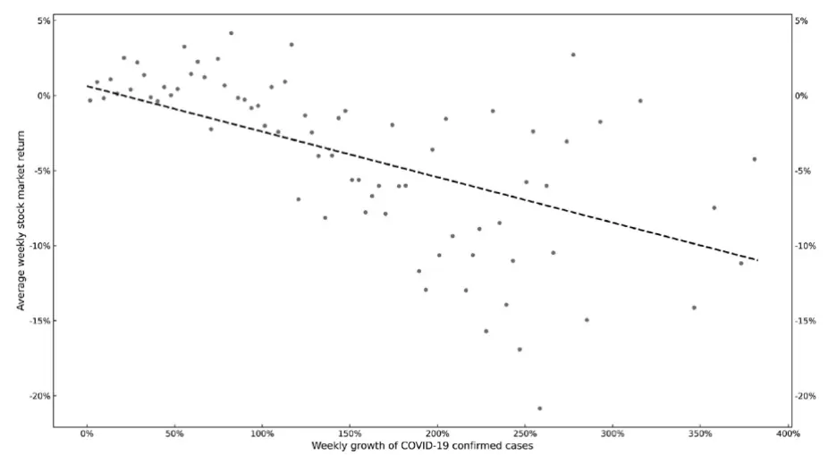

inInfo] [Table_Title] 2021.05.08

# 全球疫情冲击下，哪些公司更具免疫力

## ——学界纵横系列之四

陈奥林(分析师)

## 徐忠亚(分析师)

8 021-38674835

021-38032692

chenaolin@gtjas.com

xuzhongya@gtjas.com

证书编号 S0880516100001

S0880519090002

## 本报告导读：

面对 COVID-19的冲击，股价表现相对较好的公司具备怎样的特征？

## 摘要：

[Table_Summary]• 财务方面：疫情前拥有更多现金、利润和可贷款额度，负债更少的公司股价表现较好。

- 跨地区供需方面：全球供应链、客户所在地受到新冠影响较小的公司股价表现较好。

- 公司社会责任方面：疫情前有更多CSR 活动的公司股价表现较好。

公司治理方面：管理层防御行为较少，为稳固自己的职位而采取的措施较少的公司股价表现较好。

所有者结构方面：家族控股（尤其是直接控股且家族成员不担任管理层），大公司或政府控股，且管理层较少持股的公司股价表现较好；资管公司（尤其是对冲基金）持有较大股份，管理层持有较多股份的公司股价表现较差。

观察本文得出的结论，我们会发现在 2020年 1 月至 5月表现相对较好的公司是我们常说的质量较高、基本面较好且受疫情影响较小的公司，这给践行基本面投资的投资者以信心。可能有个别基本面良好的公司由于所在行业受到疫情冲击较大等因素表现不佳，但从全球市场的总体来看，仍然领先于其他公司。

金融工程

## 金融工程团队：

陈奥林：（分析师）

电话：021-38674835

邮箱：chenaolin@gtjas.com

证书编号：S0880516100001

## 杨能：（分析师）

电话：021-38032685

邮箱：yangneng@gtjas.com

证书编号：S0880519080008

## 殷钦怡：（分析师）

电话：021-38675855

邮箱：yinqinyi@gtjas.com

证书编号：S0880519080013

## 徐忠亚：（分析师）

电话：021- 38032692

邮箱：xuzhongya@gtjas.com

证书编号：S0880120110019

## 刘昺轶：（分析师）

电话：021-38677309

邮箱：liubingyi@gtjas.com

证书编号：S0880520050001

## 吕琪：（研究助理）

电话：021-38674754

邮箱：lvqi@gtjas.com

证书编号：S0880120080008

## [Table_R相关报告

选股组合如何对冲宏观风险 2021.05.05

财报公告期的彩票类股票策略 2021.04.28

GDPNOW： 精 细 化 宏 观实 时预 测 体 系2021.04.26

减持潮中，核心基金在主动增持哪些行业和个股 2021.04.24

股票指数分红预测详解与跟踪 2021.04.23

## 1. 选题背景

由COVID-19引发的全球经济危机与以往的危机不同，这是一次全球性的公共卫生危机，使得跨国、本国的经济活动均受到限制。Reinhart 和Rogoff（2009）的书中总结了近八百年来的危机相似之处，但他在Reinhart（2020）中强调，与过去的危机相比，COVID-19 大流行的原因、范围和严重性是不一样的。这促使人们研究不同特征的企业对COVID-19的反应。

COVID-19大流行还引发了巨大的、差异性的股价波动。在2020年的前五个月中，标普500指数从高位下跌至低位，跌幅为 34%，三月份共发生了4次熔断。巴西，中国香港，意大利和日本的跌幅达到 46%，25%，41%和 31%。在中国市场，1月 23日武汉封城消息传出之后，上证综指大跌 2.8%；节后 2 月 3 日，上证综指暴跌 7.7%。即使在同一国家同一行业，不同股票的收益也有较大区别，比如从 2020 年 2 月到 5 月，美国制造业不同股票间的周收益率标准差达到20%。产生差异的原因是什么？是哪些特征影响了公司对新冠的“免疫力”？

通过构建五个方面的多个公司特征变量，使用 61 个经济体中超过 6700个公司在2020年1至5月的数据进行分析，海外文献《Corporate immunityto the COVID-19 pandemic》对这个问题做出了回答。

## 2. 核心结论

财务方面，疫情前拥有更多现金、利润和可贷款额度，负债更少的公司股价表现较好。

跨地区供需方面，全球供应链、客户所在地受到新冠影响较小的公司股价表现较好。

公司社会责任方面，疫情前有更多CSR 活动的公司股价表现较好。这符合以下观点：企业社会责任提高了利益相关者的忠诚度，加强了与他们的联系，这使工人，供应商和客户更愿意在面临危机时提供支持。

公司治理方面，管理层防御行为较少，即为稳固自己的职位而采取的措施较少的公司股价表现较好。

所有者结构方面，家族控股（尤其是直接控股且家族成员不担任管理层），大公司或政府控股，且管理层较少持股的公司股价表现较好；资管公司（尤其是对冲基金）持有较大股份，管理层持有较多股份的公司股价表现较差。

这篇文章从微观层面对全球公司的“免疫力”进行了探究，使用量化的方法来构建指标变量，得出的结论对在市场面临突发事件时的投资具有一定的参考意义。观察本文得出的结论，我们会发现在 2020年1月至5月表现相对较好的公司是我们常说的质量较高、基本面较好且受疫情影响较小的公司，这给践行基本面投资的投资者以信心。可能有个别基本面良好的公司由于所在行业受到疫情冲击较大等因素表现不佳，但从全球市场的总体来看，他们仍然领先于其他公司。

## 3. 影响公司免疫力的因素

本节将对影响公司免疫力的五类因素进行研究，相当于研究一个函数，其因变量为公司股价对大流行的反应，自变量为公司或国家的各类特征（变量的构造方式以及数据来源见附录表 10 和表 11）。本节分为四个部分，3.1 为分析方法的介绍，3.2 为国家层面的分析结果，3.3 为公司层面的分析结果，3.4 则为联合检验及鲁棒性分析的结果。

## 3.1. 分析方法

对国家层面（3.2节）的因素，本文采取的回归式为：

$$
Ret_{c,t}=\alpha COVID19_{c,t}+\pmb{\beta}\pmb{X}_{c}^{\prime}+\delta_{c}+\delta_{t}+\epsilon_{c,t}\tag{1}
$$

其中 $c,$ t分别是经济体和周数的下标。 $Ret_{c,t}$ 是股市指数从第 t-1 周到第 t周 的 收 益 率 ， 对 应 着 附 录 变 量 表 10 中 的 Weekly Market Return.$COVID19_{c,t}$ 为累计确诊病例的周增长率。 $\delta_{c}$ 和 $\cdot\delta_{t}$ 均为虚拟变量的集合， $\delta_{c}$ 代表着每个经济体特有，但是不随时间变化的未被观测到的因素； $\delta_{t}$ 代表着每个时间点特有，但是不随经济体变化的未被观测到的因素。包含这两项旨在排除掉这两方面不可观测因素对 $\beta X_{c}^{\prime}$ 项的影响。

应该重点关注的是 $\pmb{\beta}\pmb{X}_{\pmb{c}}^{\prime}$ 项。 $X_{c}^{\prime}$ 向量中包含了经济体或公司特征的指标，比如政府的刺激措施以及大流行前的国家特征（包括政府债务，经济发展情况，人口年龄等）。本文使用最小二乘法估计系数 $i\beta$ ，并标注其在经济体层面的聚类稳健标准误（即假设同一个经济体内任何两个观测值之间都是相互关联的，而不同经济体的观测值是互不关联的）。可以看到，（1）式主要是为了评估不同经济体之间的差异，并且等号右端的第一项与第二项之间是加法的关系。

对公司层面（3.3节）的因素，本文采取的回归式为：

$$
Ret_{i,t}=\beta X_{i,pre2020}^{\prime}\times COVID19_{C,t}+\delta_{i}+\delta_{j,t}+\delta_{c,t}+\epsilon_{i,t}\tag{2}
$$

其中 $i,c,j,$ t分别是公司，经济体，行业和周数的下标。同样使用固定效应的方法排除了无法观测因素的影响后，由于要研究的是公司在 2020年前的已有特征如何影响其在新冠大流行期间的收益率，（2）式中对$\pmb{\beta}X_{i,pre2020}^{\prime}$ 项和 $COVD19_{C,t}$ 项采取了乘积的形式。 $X_{i,pre2020}^{\prime}$ 中包含了财务，跨地区供需，CSR，公司治理以及所有权结构共五个公司层面的指标。类似国家层面的方法，采取最小二乘法估计 $\cdot\beta1$ 并标注其在经济体层面的聚类稳健标准误。

注：由于同一个变量可能与不同的变量组合作为解释变量，导致在原文中的表格较多且表格较大，本报告的结果表格中的变量并不一定同时作为解释变量进入回归，只是选取了该变量在关键回归的结果以代表其与股价收益率的关系。如需查看更多细节，请查阅原文《Corporate immunityto the COVID-19 pandemic》.

## 3.2. 国家层面

图 1表明，股票收益与 COVID-19病例的增长率之间存在强烈的负相关关系。表 1表明，意大利周围国家的股市表现与意大利的病例数呈负相关，并且与意大利的距离越近，相关性越强；当本国的病例数出现后，意大利病例数对本国股市表现的影响减弱。而中国附近国家的股市对于中国病例数的增长则没有明显的反应。

鼓励保持社交距离的政策对股市是有利的。虽然社交隔离政策阻碍了短期经济活动，但人们相信这有利于长期的发展。财政刺激和国家机构对公司债的购买与股市的表现呈正相关。而政府债务占 GDP 的比重，人均 GDP，GDP 增长率，65 岁以上的人口百分比以及法律传统与股市表现则没有显著关系。

表 1：COVID-19大流行期间，国家特征对股市收益率的影响

| 变量 系数（标准误） |
| --- |
| COVID19 -1.031(-0.175) |
| COVID19 (Italy), Distance-wgt -1.079(0.411) |
| COVID19 (Italy), Distance-wgt * #Weeks since 100th Case 0.803(0.191) |
| COVID19 (China), Distance-wgt 0.363(0.255) |
| COVID19 (China), Distance-wgt * #Weeks since 100th Case -5.243(33.27) |
| #Weeks since 100th Case 0.00382(0.149) |
| Lockdown 0.262(0.116) |
| Fiscal Stimulus 0.251(0.0888) |
| Corporate Debt Purchase 0.114(0.0530) |
| Corporate Debt Purchase (Dummy) 1.076(0.256) |
| Government Debt to GDP * COVID19 -0.00407(0.00426) |
| GDP per Capita * COVID19 0.341(0.228) |
| GDP Growth * COVID19 14.68(8.972) |
| %Population (Above Age 65) * COVID19 -0.00344(0.0375) |
| Civil Law * COVID19 -0.256(0.282) |

数据来源：《Corporate immunity to the COVID-19 pandemic》，国泰君安证券研究

图 1：新冠病例增速对股市收益率的影响

数据来源：《Corporate immunity to the COVID-19 pandemic》，国泰君安证券研究

## 3.3. 公司层面

## 3.3.1. 财务状况

表 2表明，持有更多现金，负债更少，利润更高的公司对 COVID-19的适应力更强。以现金变量Cash为例，其数据的标准差为 0.186（见附录表 11），平均的COVID-19周增长率为0.725个百分点，回归系数为1.852，则 现 金 变 量 Cash 增 加 一 个 标 准 差 ， 相 应 股 票 收 益 率 提 高0.186*1.852*0.725=0.25 个百分点。相比之下，未提取信用额度 UndrawnCredit每增加一个标准差，相应股票收益率提高0.08 个百分点，仅为持有现金效果的三分之一。

此外，本文还将代表政府购买债券的变量加入回归，发现当政府购买增加时，负债与股票收益率之间的负相关性减弱，现金与股票收益率之间的正相关性同样减弱。

表 2：财务特征对大流行期间公司股价的影响

| 变量 | 系数（标准误） |
| --- | --- |
| COVID19 | -1.422 (0.241) |
| Firm Size * COVID19 | 0.085 (0.041) |
| Leverage*COVID19 | -1.236 (0.281) |
| Cash * COVID19 | 1.852 (0.629) |
| ROA * COVID19 | 1.768 (0.334) |
| Undrawn Credit * COVID19 | 0.966 (0.600) |
| Maturing Debt * COVID19 | -0.510 (0.123) |
| ROA (Operating Income) * COVID19 | 3.144 (1.264) |
| ROA (EBITDA) * COVID19 | 2.781 (0.570) |
| ROA (EBIT) * COVID19 | 3.17 (0.635) |

数据来源：《Corporate immunity to the COVID-19 pandemic》，国泰君安证券研究

## 3.3.2. 全球供应链和国际客户

表 3表明，供应商和客户所在国家受新冠影响越深，公司股价受到的负面影响越大。当供应商暴露程度和国际客户暴露程度分别下降一个标准差时，收益率分别提升 0.14 和 0.35个百分点。

表 3：国际化程度对大流行期间公司股价的影响

| 变量 | 系数（标准误） |
| --- | --- |
| Suppliers'Exposure | -0.323 (0.088) |
| Customers'Exposure | -0.776 (0.185) |

数据来源：《Corporate immunity to the COVID-19 pandemic》，国泰君安证券研究

## 3.3.3. CSR

表 4 表明，2020 年前 CSR 水平较高的公司的股票价格对 COVID-19 的承受力更强。无论是统计 CSR 总得分还是各个子指数（环境，社会和CSR 战略），都会得到这个结论。当 CSR 总得分上升一个标准差时，收益率将上涨0.13个百分点。

有研究认为，企业社会责任提升会使公司对大流行的适应力增强是因为CSR 通过加强与利益相关者之间的联系以及忠诚度，使他们在大流行期间对公司提供支持，从而达到提高公司免疫力的效果。由于忠诚度难以衡量，若在越重视环境和人权的国家，CSR 对股价的影响越明显，就可以说明这一点。这是因为在这样的国家中，企业社会责任活动更能提高利益相关者的忠诚度，并加强与他们的联系。本文的 Social Norms变量衡量了国家对环境和人权的重视程度，可以看到 Social Norms ∗ CSRScore与收益率的正相关性比单独的CSR Score更加显著，这就验证了这一解释。

表 4：CSR水平对大流行期间公司股价的影响

| 变量 | 系数（标准误） |
| --- | --- |
| CSR Score * COVID19 | 0.900 (0.385) |
| Environmental * COVID19 | 0.735 (0.364) |
| Social * COVID19 | 0.638 (0.249) |
| CSR Strategy * COVID19 | 0.495 (0.216) |
| Social Norms * CSR Score * COVID19 | 1.315 (0.317) |

数据来源：《Corporate immunity to the COVID-19 pandemic》，国泰君安证券研究

## 3.3.4. 公司治理

表 5表明，反收购措施的数量越多，管理层为稳固其地位采取的防御越强，管理层越“根深蒂固”，公司股价在大流行中越容易下跌。Fama和Jesen(1983)提出，当管理层的地位稳固之后，他们就可以更加放心地谋求私人利益，即管理防御假说。Johnson et al.(2000)和 Johnson, La Porta,Lopez-de-Silanes, and Shleifer (2000)指出，危机的到来给高管以牺牲其他利益相关者的利益来获取私人资源的行为创造了机会。

此外，虽然董事会规模变量BoardSize在表 5中是显著的，但在同时包含其他公司特征后，其在 3.4 节的联合检验中失去了显著性。股价对大流行的反应并没有受到董事会规模与独立董事数量的显著影响。

制度方面，公司薪酬是否与业绩高低或长期目标的实现挂钩均不对公司免疫力造成显著影响。

表 5：公司治理特征对大流行期间公司股价的影响

| 变量 | 系数（标准误） |
| --- | --- |
| Antitakeover Devices * COVID19 | -0.063 (0.030) |
| Board Size * COVID19 | 0.031 (0.015) |
| Board Independence * COVID19 | -0.000 (0.003) |
| Performance-based Compensation * COVID19 | -0.128 (0.130) |
| Executive Compensation LT Objectives * COVID19 | -0.079 (0.093) |

数据来源：《Corporate immunity to the COVID-19 pandemic》，国泰君安证券研究

## 3.3.5. 所有权结构

本节将讨论公司所有权对免疫力的影响，公司所有者分为：个人或家族，政府，银行或其他金融机构，其他非金融公司，作为重大股东的资管公司，持股较多的管理层。其中，对家族控制的公司又需要关注两个问题：家族是通过直接持股还是通过金字塔型的多层持股实现控制？家族成员是否担任公司的管理层？若公司被非金融公司控制，又考虑控股公司的规模为大或者小；若公司被资管公司重仓，又考虑该资管公司是对冲基金还是其他资管公司。回归分析的结果如表 6所示。

表 6：所有权结构特征对大流行期间公司股价的影响

| 变量 | 系数（标准误） |
| --- | --- |
| Individual/Family * COVID19 | 0.378 (0.124) |
| Government * COVID19 | 0.179 (0.091) |
| Bank and Other FI * COVID19 | 0.269 (0.134) |
| Corporation * COVID19 | 0.260 (0.130) |
| Asset Management Companies * COVID19 | -1.387 (0.410) |
| Individual/Family (Manager) * COVID19 | 0.058 (0.197) |
| Individual/Family (Not Manager) * COVID19 | 0.569 (0.120) |
| Individual/Family (Direct) * COVID19 | 0.538 (0.138) |
| Individual/Family (Pyramid) * COVID19 | 0.241 (0.174) |
| Corporation (Large) * COVID19 | 0.434 (0.147) |
| Corporation (Small) * COVID19 | 0.182 (0.151) |
| Hedge Fund * COVID19 | -4.178 (0.805) |
| Other AMC * COVID19 | -1.068 (0.329) |
| Management Ownership * COVID19 | -0.806 (0.319) |
| Management Ownership (Low) * COVID19 | 18.99 (4.641) |
| Management Ownership (High) * COVID19 | -0.747 (0.310) |
| Management Ownership (Dummy, Low) * COVID19 | 0.233 (0.0729) |
| Management Ownership (Dummy, Medium) * COVID19 | -0.181 (0.153) |
| Management Ownership (Dummy, High) * COVID19 | -0.197 (0.107) |

数据来源：《Corporate immunity to the COVID-19 pandemic》，国泰君安证券研究

## 3.3.5.1. 基础所有权结构

表 6表明，被家族、非金融公司、政府、银行和其他金融机构控制的公司免疫力强于公众广泛持股的公司，而被资产管理公司重仓的公司股票表现比较糟糕。当公司的 Asset Management Companies 指标值上升一个标准差时，面对新冠平均周增长率（0.725%），股票收益率将下降 0.17个百分点。

在学界，关于家族控制对公司应急能力的影响有着矛盾的观点。Lins et al.(2013) 发现，在全球金融危机期间，家族企业采取了以牺牲其他股东的利益为代价来保持其控制权的行动；Sraer and Thesmar（2007）指出，家族控制的公司不太可能因不利的冲击而解雇工人，这可能会加剧股价下跌。而 Kandel and Lazear (1992)认为，家族所有者对企业的爱惜程度更高；Donnelley (1964)认为，家族持有的公司与非股东的利益相关者关系更加密切，这些有助于增强公司应对危机的能力。从本文的结果来看，后一种观点，也就是支持家族控制有利于公司免疫力的观点似乎更加正确。

Stein (2009)和 Khandani and Lo (2011)表明，资产管理公司尤其是对冲基金，常常会使用量化交易策略，从而造成过度拥挤和甩卖，在危机期间的甩卖会导致股价的大幅下跌。同时，对冲基金常常会在短期使用杠杆，即使没有大幅的基本面波动，流动性的中断也会造成股票的大量卖出。这解释了资产公司持股尤其使对冲基金持股对公司免疫力的负面影响。

## 3.3.5.2. 控股家族的细分

表 6 和表 7 表明，家族控股且家族成员不担任管理层可以显著提升公司免疫力，而家族是直接控股还是通过金字塔形式控股则对公司免疫力没有显著影响。Anderson et al. (2003)表明，当家族成员担任 CEO 职位时，债务成本要高于拥有外部 CEO 的家族企业的债务成本。其他相关研究也强调，专业且非家族成员的CEO能为公司提供更有价值的服务。

表 7：家庭成员是否担任高管以及是否直接持股对公司免疫力的影响

| 回归系数差 | P值 |
| --- | --- |
| Family Manager versus Not Manager | 0.012 |
| Family Direct versus Pyramid | 0.172 |

数据来源：《Corporate immunity to the COVID-19 pandemic》，国泰君安证券研究

## 3.3.5.3. 控股非金融公司的细分

对于控股公司为非金融公司的情况，根据控股公司规模分为大小两组。表 6 表明，相对于公众广泛控股，大公司控股有助于提高公司免疫力，而小公司控股则对公司免疫力无显著提升。表 8表明，控股公司的规模差异对公司免疫力的影响是显著的。这一结果与大公司拥有雄厚的财力来支撑被控股公司，并对子公司坚定维护的观点是一致的。

表 8：控股公司规模大小对被控股公司免疫力的影响

| 回归系数差 | P值 |
| --- | --- |
| Corporation Large versus Small | 0.071 |

数据来源：《Corporate immunity to the COVID-19 pandemic》，国泰君安证券研究

## 3.3.5.4. 大量持股的资产管理公司的细分

对于大量股份被资产管理公司持有的情况，分为对冲基金和其他资管公司两组。表 6表明，对冲基金大量持股会使公司在面临危机时表现更差。Stein(2009)和 Khandani and Lo(2011)表明在应对危机时，对冲基金（和其他积极管理的基金）会迅速出售股票，对价格造成了下行压力。《金融时报(2020a)》报道说：“自本月初以来，量化基金整体上的持仓规模几乎减少了一半。” 另一方面，危机的到来会使投资人大量赎回对冲基金的份额，BarclayHedge（2020）报告说：“投资人的赎回从 2 月份的 81亿美元猛增到下个月的 856 亿美元。

## 3.3.5.5. 管理层持股情况的细分

表 6 和表 9 表明，管理层持股越多，公司应对大流行的表现就越差。传统的代理理论认为，持股使管理层与公司利益一致，从而产生激励作用，但前文所述的管理防御假说认为持股太多会使管理层地位稳固，降低其应对危机的积极性，甚至从危机中谋取私人利益。此外，Morck et al.(1988) 发现，高层管理者的所有权加剧了内部人员和外部投资者之间的代理问题。Lemmon and Lins（2003）发现，在 1997-1998 年东亚金融危机期间，管理人员具有较高控制权的公司的表现不佳。

表 9：管理层持股多少对公司免疫力的影响

| 回归系数差 | P值 |
| --- | --- |
| Management Ownership High versus Low | 0.000 |
| Management Ownership (Dummy) High versus Low | 0.003 |

数据来源：《Corporate immunity to the COVID-19 pandemic》，国泰君安证券研究

## 3.4. 联合检验所有变量以及鲁棒性分析

原文在该节将所有变量同时进行回归分析，结果显示，除了董事会规模Board Size 变量在联合分析时变为不显著之外，其他变量的结果与前文一致，这说明各个公司特征变量受到其他特征的影响较小。同时，通过将股票周收益变量替换为周超额收益，将新冠确诊病例增长率替换为现有病例增长率和检测数量增长率，证明了前文结果的鲁棒性。

## 4. 总结

## 4.1. 原文结论

财务方面，疫情前拥有更多现金、利润和可贷款额度，负债更少的公司股价表现较好。

跨地区供需方面，全球供应链、客户所在地受到新冠影响较小的公司股价表现较好。

公司社会责任方面，疫情前有更多CSR 活动的公司股价表现较好。这符合以下观点：企业社会责任提高了利益相关者的忠诚度，加强了与他们的联系，这使工人，供应商和客户更愿意在面临危机时提供支持。

公司治理方面，管理层防御行为较少，即为稳固自己的职位而采取的措施较少的公司股价表现较好。

所有者结构方面，家族控股（尤其是直接控股且家族成员不担任管理层），大公司或政府控股，且管理层较少持股的公司股价表现较好；资管公司（尤其是对冲基金）持有较大股份，管理层持有较多股份的公司股价表现较差。

## 4.2. 我们的思考

这篇文章从微观特征层面对全球公司的“免疫力”进行了探究，使用量化的方法来构建指标变量，得出的结论对在市场面临突发事件时的投资具有一定的参考意义。观察本文得出的结论，我们会发现在 2020 年 1月至5月表现相对较好的公司是我们常说的质量较高、基本面较好且受疫情影响较小的公司，这给践行基本面投资的投资者以信心。可能有个别基本面良好的公司受到疫情冲击较大，但从全球市场的总体来看，他们仍然领先于其他公司。此外，本文考察的公司治理和所有权结构在危机期间对股价的影响也给我们提供了一个新的思路，即当危机到来时，公司内部的因素同样值得考虑，比如管理层持股较少的公司反而表现更好。

在疫情期间，A 股投资者较为关心的是行业间的轮动，比如本文同期的2020年1月至5 月是“喝酒吃药”的时间。像本文这样直接关注行业内乃至全市场个股的共性特征的研究更加符合因子投资者的投资理念。虽然A 股的数据可能与本文有所差异，但其量化指标的构建方法值得我们学习，比如使用反收购措施的数量来量化管理层防御的程度等。这些指标大多数有理论的支持，影响公司免疫力的因素有很多，我们应结合A股的实际情况进行挖掘与探索。

## 5. 附录

表 10：变量定义

| 变量 | 定义 | 数据来源 |
| --- | --- | --- |
| Weekly Stock Return Abnormal Return | 使用一周中最后一个交易日的股息调整后收盘价进行计算 每家公司的 Weekly Stock Return 变量值减去 Beta 与国内市场 Thomson Reuters Datastream | Thomson Reuters Datastream |
|  | 收益率之积，其中 Beta 由 Thomson Reuters Datastream 提供， 并使用过去五年中相对于国内股票的市值加权指数的月度 数据进行计算 |  |
| COVID19 | 某经济体中新冠累计确诊病例的周增长率。对于经济体 c 的 Johns Hopkins University |  |
| 请务必阅读正文之后的免责条款部分 11 of 17 |  |  |

| 第t周， |  | $COVD19_{c,t}=\log(1+第$ t 周的累计确诊病例数)-log(1+ 第 t-1 周的累计确诊病例数) | Center for Systems Science and Engineering (JHU CSSE) |
| --- | --- | --- | --- |
| COVID19, Active |  | 某经济体中现存新冠病例数的周增长率。 $COVID19_{c,t},Actime=log(1+$ 第 t 周的现存病例数)-log(1+第 t-1 | JHU CSSE |
| COVID19, Testing Adjusted 1 | 周的现存病例数)，其中现存病例数=累计确诊病例数-康复病 |  |  |
|  | 例数-死亡病例数 |  |  |
|  | 周检测阳性率的变化。 $COVID19_{c,t},Testing\;Adjusted\;1=$ | JHU CSSE; Foundation for Innovative New |  |
|  | $\frac{\Delta Case_{c,t}}{\Delta Test_{c,t}}-\frac{\Delta Case_{c,t-1}}{\Delta Test_{c,t}-1},$ 其中 $\Delta Case_{c,t}$ 是在第t周的新增确诊病例 | Diagnostics(FIND) |  |
|  | 数， $\Delta Test_{c,t}$ 是在第t周的新增检测数。计算出结果之后乘以 |  |  |
|  | COVID19, Testing Adjusted 2 | 100 累计阳性率的变化。。 | JHU CSSE; FIND |
|  | $\begin{aligned}COVID19_{c,t},Testing&\;Adjusted\;2\\&=\ln\left(1+\frac{第\;t\;周的累计确诊数}{第\;t\;周的总检测数}\right)\\&-\ln\left(1+\frac{第\;t-1\;周的累计确诊数}{第\;t-1\;周的总检测数}\right)\end{aligned}$ |  |  |
| 公司特征 | 计算出结果之后乘以100 |  |  |
| Firm Size |  |  |  |
| Leverage | 总资产账面价值的自然对数 | Thomson Reuters Worldscope |  |
| Cash | 总负债与总资产的比率 | Thomson Reuters Worldscope |  |
| ROA | 现金和短期投资总额除以总资产 | Thomson Reuters Worldscope |  |
| ROA(Operating Income) | 净利润除以总资产 | Thomson Reuters Worldscope |  |
|  | 经营性收入除以总资产。其中经营性收入等于总收入减经营 性费用 | Thomson Reuters Worldscope |  |
| ROA(EBITDA) | 折旧、摊销、息税前利润除以总资产 | Thomson Reuters Worldscope |  |
| ROA(EBIT) Undrawn Credit | 息税前利润除以总资产 | Thomson Reuters Worldscope |  |
| Maturing Debt | 未提取的循环信用额除以总资产 | Capital IQ Capital Structure |  |
|  | 2020 年二至四季度到期且未偿还的债务总额除以 2019 年底 Capital IQ Capital Structure 的总债务。 |  |  |
| Supplier's Exposure | 对于公司f在第t周， $SuppliersExposure_{f,t}为COVD19_{c,t}$ 加权平均值，权重为大流行前该公司在经济体c的供应商数 | 的 FactSet Revere; JHU CSSE |  |
| Customer's Exposure | 量占该公司总供应商数量的比例 对于公司 f 在第 t 周，Customer's Exposuref,t为 $COVID19_{c,t}$ | FactSet Revere; JHU CSSE |  |
| CSR Score | 的加权平均值，权重为大流行前该公司在经济体c的收入占 该公司总收入的比例 环境，社会和企业社会责任战略指数的平均值，用于衡量公Thomson Reuters ASSET4 |  |  |
|  | 司对环境的重视程度（包括资源使用，排放和绿色创新)， 非股东利益相关者和社会主题（包括员工福利，人权和给予 |  |  |
|  | 客户、供应商和公司经营的待遇)，以及企业社会责任(CSR) |  |  |
|  | 活动水平。 |  |  |
| Environmental |  |  |  |
|  | 包含三个组成部分（资源使用，减排和绿色创新)，反映了 | Thomson Reuters ASSET4 |  |
|  | 公司在减少材料、能源或水的使用以及改善供应链管理的能 |  |  |
|  | 力，寻求更加生态高效的解决方案、减少生产和运营过程中 |  |  |
|  | 的环境排放、降低其客户的环境成本的能力。 |  |  |
| Social | 反映企业增强员工福利（Workforce)，促进人权（Human | Thomson Reuters ASSET4 |  |
| CSR Strategy | 企业组织、运营和实施CSR战略的程度的指数。包括公司是 否成立了CSR可持续发展委员会，发布了CSR、健康与安 全以及可持续性报告，以及这些报告是否根据《全球报告倡 议指南》发布，是否对与CSR相关的问题进行了外部审核等。 如果反收购措施的数量大于两个，则等于数量本身，否则等 于零。反收购措施包括毒丸计划，分组委员会，空头支票， | Thomson Reuters ASSET4 Thomson Reuters ASSET4 |  |
|  | 多数票，双重股权结构，黄金降落伞，有限的股东召开特别 会议的权利，累积投票权，优先购买权，公司交叉持股，机 密投票政策，有限董事责任，重大交易的股东批准，公平价 格规定，董事罢免的限制，股东建议的预先通知，书面同意 要求以及扩大的选区规定。 |  |  |
| Board Size Board Independence | 董事会成员总数。 | Thomson Reuters ASSET4 |  |
| Performance-based | 独立董事所占董事会成员总数的比例。 如果公司对高级管理人员和董事会成员实行基于绩效的薪 Thomson Reuters ASSET4 | Thomson Reuters ASSET4 |  |
| Compensation | 酬政策，则该指标等于1；否则，该指标等于0。 |  |  |
| Executive Compensation LT | 如果高管薪酬和董事会薪酬与长期目标（即未来两年以上的 Thomson Reuters ASSET4 |  |  |
| Objectives Individual/Family | 目标）的实现挂钩，则等于1；否则，该指标等于0。 如果公司的最终控股股东被归类为个人或家庭，则该指标等 Bureau van Dijk Orbis |  |  |
| Individual/Family | 于1，否则为0。 如果一家公司是由个人或家族通过直接持股控制的，则该指 Bureau van Dijk Orbis |  |  |
| (Direct) | 标等于1，否则为0。 如果公司是由个人或家族通过金字塔型多层控制链进行控 Bureau van Dijk Orbis |  |  |
| Individual/Family (Pyramid) | 制的，则该指标等于1，否则为0。 |  |  |
| Individual/Family | 如果公司的控股家族成员也担任高管（首席执行官或执行董 Bureau van Dijk Orbis |  |  |
| (Manager) Individual/Family (Not | 事)，则等于1，否则等于0 如果公司的控股家族成员不担任高管，则该指标等于1；否 Bureau van Dijk Orbis |  |  |
| Manager) | 则，该指标等于0。 |  |  |
| Government | 如果公司的最终控股股东为政府，则该指标等于1，否则为 Bureau van Dijk Orbis 零。 |  |  |
| Corporation | 如果一家公司的最终控股股东为公众广泛控股的公司，则该 Bureau van Dijk Orbis 指标等于1，否则为零。 |  |  |
| Corporation (Large) | 当控股公司的规模在所有公司的规模分布中处于前百分之 Bureau van Dijk Orbis 一时，该指标等于1，否则为0。 |  |  |
| Corporation (Small) | 当控股公司的规模不在所有公司的规模分布的前百分之一 Bureau van Dijk Orbis |  |  |
| Bank and Other FI | 时，该指标等于1，否则为0。 如果公司的最终控股股东被为银行或其他金融机构，则该指 Bureau van Dijk Orbis |  |  |
| Asset Management | 标等于1，否则为0。 作为大股东的资产管理公司（AMC）的总持股比例，其中 Thomson Reuters Ownership |  |  |
| Companies | AMC包括共同基金，投资和资产管理公司，投资银行，对 冲基金，金融公司以及私募股权和风险投资公司。大股东是 |  |  |
| Hedge Fund | 指拥有至少5%在外流通股的投资者。 对冲基金大股东的总持股量占所有股份的比例。对冲基金指 | Thomson Reuters Ownership |  |
|  | 被允许使用传统基金所不使用的激进策略的公司，包括卖 |  |  |
|  | 空，杠杆，程序交易，掉期，套利和衍生工具，例如Citadel， |  |  |
| Other AMC | Two Sigma 和文艺复兴公司等。 非对冲基金的资产管理公司大股东的总持股量 | Thomson Reuters Ownership |  |
| Management Ownership | 管理层持股所占百分比。 | Bureau van Dijk Orbis |  |
| Management Ownership(Low) | 如果 Management Ownership 低于该值非零的公司的中位数， Bureau van Dijk Orbis 则等于 Management Ownership，否则为0。 |  |  |
| Management Ownership(High) | 如果 Management Ownership 高于该值非零的公司的中位数， Bureau van Dijk Orbis 则等于 Management Ownership，否则为 0。 |  |  |
| Management Ownership(Dummy, Low) | 如果 Management Ownership 低于该值非零的公司的中位数，Bureau van Dijk Orbis 则等于1，否则为0。 |  |  |
| Management Ownership(Dummy, High) | 如果 Management Ownership 高于该值非零的公司的中位数，Bureau van Dijk Orbis 则等于1，否则为0。 |  |  |
| Management Ownership(Dummy, Medium) 经济体特征 | 如果 Management Ownership 在该值非零的公司的中位数和 Bureau van Dijk Orbis 75%分位数之间，则等于1，否则为0。 |  |  |
| Weekly Market Return | 从 t-1 周的最后一个交易日到 t 周的最后一个交易日，c 国的 Thomson Reuters Datastream 股票市场指数的每周收益。使用每个国家/地区中最具代表性 的市场指数。 |  |  |
| COVID19 (Italy), Distance-wgt | 对于每个国家 c，对第 t 周意大利的病例增长率使用反距离 JHU CSSE 加权法进行加权。 |  |  |
| COVID19 (China), | 对于每个国家 c，对第 t 周中国的病例增长率使用反距离加 JHU CSSE |  |  |
| Distance-wgt #Weeks since 100th Case | 权法进行加权。 COVID-19 病例数达到 100 以来的周数。 | JHU CSSE |  |
| Lockdown | 政府隔离和关闭政策的八项指标之和：学校和大学的关闭，Oxford COVID-19 Government |  |  |
|  | 工作场所的关闭，公共活动的取消，私人聚会的限制，公共 交通的关闭，就地避难的命令，城市或地区之间内部流动的 限制，以及对国际旅行的限制。我们将每个指标标准化为0 | Response Tracker |  |
| Fiscal Stimulus | 到1之间的值，并对每个国家和时间段的八个指标求和。 以下指标的第一主成分：政府直接向失业或无法工作的人支 Oxford COVID-19 Government 付的现金，政府为家庭提供的财政债务减免，财政刺激支出 Response Tracker |  |  |
| Corporate Debt | 占国内生产总值（GDP）的比重。 在政府宣布购买公司债券后的几周内，该指标等于1，否则 IMF Policy Tracker |  |  |
| Corporate Debt Purchase | 为0 截至每周星期五，政府购买公司债券的累计金额除以大流行 | IMF Policy Tracker; IMF |  |
| Government Debt to | 前公司债券的总金额（百分比） 2017年测量的，政府债务总额与GDP的比率（百分比） | Global Debt Database Global Financial Development |  |
| GDP GDP per Capita | 2018 年人均 GDP 的自然对数。 | Database |  |
| GDP Growth | 2018 年的 GDP 增长率 | World Development Indicators World Development Indicators |  |
| %Population(Above Age 65) | 2018年，65岁以上人口占人口总量的百分比。 | World Development Indicators |  |
| Civil Law | 如果一国的法律体系是大陆法系，则该指标等于1；如果法 La Porta et al. (2008) 律体系是英美法系，则该指标等于0。 |  |  |
| Social Norms | 如果该国家的环境优先级和人权得分均高于样本中位数，则 World Values Survey |  |  |
| 于经济的百分比。人权得分是受访者认为国家尊重人权的程 | 该指标等于1，否则为0。环境优先级是受访者将环境优先 |  |  |

数据来源：《Corporate immunity to the COVID-19 pandemic》，国泰君安证券研究

表 11：各变量的相应数据情况

| 变量 | 样本个数 | 均值 | 标准差 |
| --- | --- | --- | --- |
| Weekly Stock Return | 126,711 | -0.678 | 9.85 |
| Abnormal Return | 126,431 | -0.176 | 8.200 |
| C0VID19 | 1,208 | 0.470 | 0.707 |
| COVID 19 (exposed economy-week) | 784 | 0.725 | 0.766 |
| COVID19, Active | 1,208 | 0.404 | 0.805 |
| COVID19, Testing Adjusted 1 | 879 | 0.172 | 2.36 |
| COVID19, Testing Adjusted 2 Firm characteristics | 944 | 0.331 | 1.65 |
| Firm Size | 126,711 | 15 | 1.70 |
| Leverage | 126,711 | 0.284 | 0.22 |
| Cash | 126,711 | 0.157 | 0.186 |
| ROA | 126,711 | 0.015 | 0.163 |
| ROA (Operating Income) | 126,669 | 0.047 | 0.133 |
| ROA (EBITDA) | 123,081 | 0.085 | 0.148 |
| ROA (EBIT) | 125,409 | 0.045 | 0.141 |
| Undrawn Credit | 86,216 | 0.106 | 0.118 |
| Maturing Debt | 79,877 | 0.093 | 0.184 |
| Suppliers' Exposure | 111,294 | 0.552 | 0.604 |
| Customers' Exposure | 121,853 | 0.545 | 0.620 |
| Suppliers' Exposure (exposed firm) | 92,897 | 0.661 | 0.604 |
| Customers' Exposure (exposed firm) | 100,686 | 0.660 | 0.624 |
| CSR Score | 126,711 | 0.508 | 0.200 |
| Environmental | 126,690 | 0.508 | 0.223 |
| Social | 126,690 | 0.509 | 0.212 |
| CSR Strategy | 126,711 | 0.507 | 0.270 |
| Antitakeover Devices | 126,690 | 3.5 | 2.9 |
| Board Size | 124,591 | 9.11 | 2.9 |
| Board Independence | 124,633 | 61.1 | 24.9 |
| Performance-based Compensation | 124,675 | 0.87 | 0.337 |
| Executive Compensation LT Objectives | 124,675 | 0.097 | 0.295 |
| Individual/Family | 126,711 | 0.060 | 0.237 |
| Bank and Other Fl | 126,711 | 0.028 | 0.165 |
| Corporation | 126,711 | 0.070 | 0.256 |
| Government | 126,711 | 0.037 | 0.188 |
| Asset Management Companies | 126,669 | 0.161 | 0.170 |
| Hedge Fund | 126,669 | 0.011 | 0.045 |
| Other AMC | 126,669 | 0.150 | 0.159 |
| Management Ownership | 122,388 | 0.035 | 0.112 |
| Management Ownership (nonzero) Economy traits | 44,031 | 0.097 | 0.169 |
| Weekly Market Return | 1,132 | -0.824 | 5.33 |
| COVID 19 (Italy), Distance-wgt | 1,132 | 0.42 | 0.687 |
| COVID19 (China), Distance-wgt | 1,132 | 0.335 | 1 |
| Lockdown | 1,132 | 3.10 | 3.01 |
| Fiscal Stimulus | 1,132 | 1.11 | 2.06 |
| Corporate Debt Purchase | 1,132 | 0.123 | 0.749 |
| Corporate Debt Purchase (Dummy) | 1,132 | 0.081 | 0.273 |
| GDP per Capita | 1,132 | 9.870 | 1.11 |

| GDP Growth | 1,132 | 0.029 0.018 |
| --- | --- | --- |
| %Population (Above Age 65) | 1,132 13.30 | 6.56 |
| Civil Law | 1,132 | 0.667 0.472 |
| Government Debt to GDP | 1,048 42.0 | 41.4 |

数据来源：《Corporate immunity to the COVID-19 pandemic》，国泰君安证券研究

## 本公司具有中国证监会核准的证券投资咨询业务资格

## 分析师声明

作者具有中国证券业协会授予的证券投资咨询执业资格或相当的专业胜任能力，保证报告所采用的数据均来自合规渠道，分析逻辑基于作者的职业理解，本报告清晰准确地反映了作者的研究观点，力求独立、客观和公正，结论不受任何第三方的授意或影响，特此声明。

## 免责声明

本报告仅供国泰君安证券股份有限公司（以下简称“本公司”）的客户使用。本公司不会因接收人收到本报告而视其为本公司的当然客户。本报告仅在相关法律许可的情况下发放，并仅为提供信息而发放，概不构成任何广告。

本报告的信息来源于已公开的资料，本公司对该等信息的准确性、完整性或可靠性不作任何保证。本报告所载的资料、意见及推测仅反映本公司于发布本报告当日的判断，本报告所指的证券或投资标的的价格、价值及投资收入可升可跌。过往表现不应作为日后的表现依据。在不同时期，本公司可发出与本报告所载资料、意见及推测不一致的报告。本公司不保证本报告所含信息保持在最新状态。同时，本公司对本报告所含信息可在不发出通知的情形下做出修改，投资者应当自行关注相应的更新或修改。

本报告中所指的投资及服务可能不适合个别客户，不构成客户私人咨询建议。在任何情况下，本报告中的信息或所表述的意见均不构成对任何人的投资建议。在任何情况下，本公司、本公司员工或者关联机构不承诺投资者一定获利，不与投资者分享投资收益，也不对任何人因使用本报告中的任何内容所引致的任何损失负任何责任。投资者务必注意，其据此做出的任何投资决策与本公司、本公司员工或者关联机构无关。

本公司利用信息隔离墙控制内部一个或多个领域、部门或关联机构之间的信息流动。因此，投资者应注意，在法律许可的情况下，本公司及其所属关联机构可能会持有报告中提到的公司所发行的证券或期权并进行证券或期权交易，也可能为这些公司提供或者争取提供投资银行、财务顾问或者金融产品等相关服务。在法律许可的情况下，本公司的员工可能担任本报告所提到的公司的董事。

市场有风险，投资需谨慎。投资者不应将本报告作为作出投资决策的唯一参考因素，亦不应认为本报告可以取代自己的判断。
在决定投资前，如有需要，投资者务必向专业人士咨询并谨慎决策。

本报告版权仅为本公司所有，未经书面许可，任何机构和个人不得以任何形式翻版、复制、发表或引用。如征得本公司同意进行引用、刊发的，需在允许的范围内使用，并注明出处为“国泰君安证券研究”，且不得对本报告进行任何有悖原意的引用、删节和修改。

若本公司以外的其他机构（以下简称“该机构”）发送本报告，则由该机构独自为此发送行为负责。通过此途径获得本报告的投资者应自行联系该机构以要求获悉更详细信息或进而交易本报告中提及的证券。本报告不构成本公司向该机构之客户提供的投资建议，本公司、本公司员工或者关联机构亦不为该机构之客户因使用本报告或报告所载内容引起的任何损失承担任何责任。

## 评级说明

## 1.投资建议的比较标准

投资评级分为股票评级和行业评级。

以报告发布后的12个月内的市场表现为比较标准，报告发布日后的 12个月内的公司股价（或行业指数）的涨跌幅相对同期的沪深 300 指数涨跌幅为基准。

## 2.投资建议的评级标准

报告发布日后的 12 个月内的公司股价（或行业指数）的涨跌幅相对同期的沪深 300 指数的涨跌幅。

|  | 评级 | 说明 |
| --- | --- | --- |
| 股票投资评级 | 增持 | 相对沪深300 指数涨幅15%以上 |
|  | 谨慎增持 | 相对沪深 300指数涨幅介于5%～15%之间 |
|  | 中性 | 相对沪深300指数涨幅介于-5%～5% |
|  | 减持 | 相对沪深 300 指数下跌 5%以上 |
| 行业投资评级 | 增持 | 明显强于沪深 300 指数 |
|  | 中性 | 基本与沪深 300指数持平 |
|  | 减持 | 明显弱于沪深300指数 |

## 国泰君安证券研究所

|  | 上海 | 深圳 | 北京 |
| --- | --- | --- | --- |
| 地址 | 上海市静安区新闸路669号博华广场 20层 | 深圳市福田区益田路 6009 号新世界 商务中心34层 | 北京市西城区金融大街甲9号金融 街中心南楼18层 |
| 邮编 | 200041 | 518026 | 100032 |
| 电话 | （021)38676666 | (0755)23976888 | (010)83939888 |
|  | E-mail: gtjaresearch@gtjas.com |  |  |