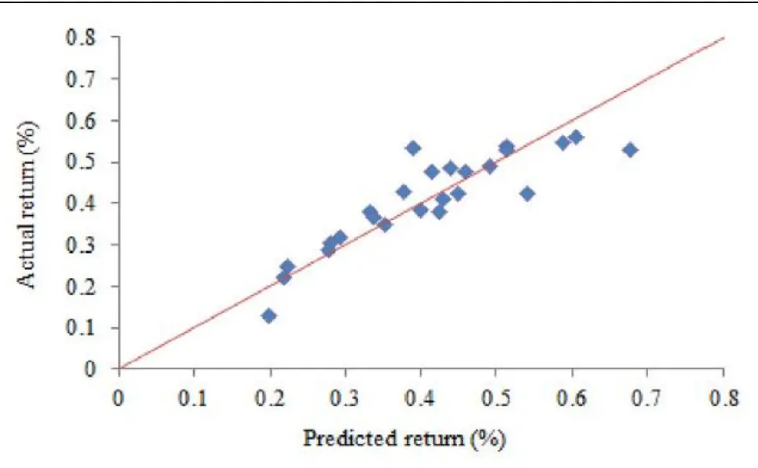
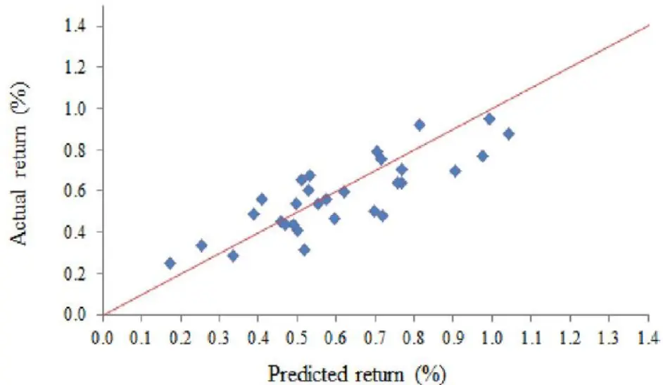
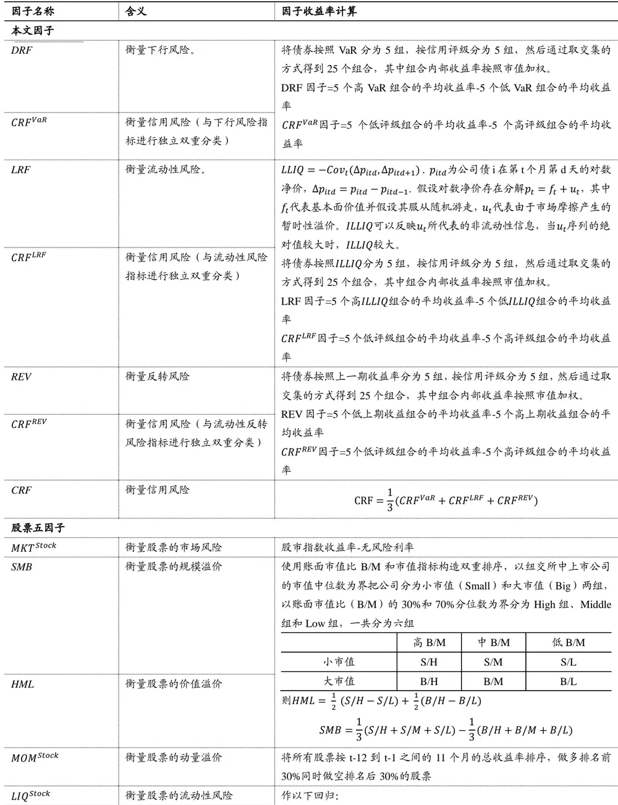

inInfo] [Table_Title] 2021.05.24

# 公司债定价因子模型研究

## ——学界纵横系列之五

陈奥林(分析师)

## 徐忠亚(分析师)

8 021-38674835

021-38032692

chenaolin@gtjas.com

证书编号 S0880516100001

xuzhongya@gtjas.com

S0880519090002

## 本报告导读：

截面上的个债收益率受何因素影响？预测能力较强的因子有哪些？

## 摘要：

- le_Summary]相对于股票持有者，公司债持有者对下行风险更加敏感，将承受信用违约风险和更高的流动性风险。

针对这三个方面的风险，本文使用对应的个债指标（VaR，信用评级和ILLIQ）构建了对应的风险因子（DRF，CRF和 LRF），发现他们对公司债未来收益横截面的变化具有较强的预测作用，并且无法被现有的股票和债券市场因子所解释。

- 公司债收益率分布并非正态，而是有偏且尖峰厚尾的。

根据下行风险指标VaR构造的多空组合月均收益率为 0.99% （年化后为11.88%）。剔除了股票五因子和债券五因子的影响之后，多空组合月均收益仍达到0.72%，相当于8.42%的显著年化收益。

- 反转指标（滞后一期收益率）作为个债特征对收益率具有预测效果，但无法作为市场的风险因子。

- 在规模/期限分类和行业分类的组合上，由 DRF，CRF，LRF 和市场因子组成的四因子模型比现有文献中的因子模型表现更加优异。

我国的公司债评级还处于初级阶段，评级机构间存在恶性竞争、独立性和评级质量存疑等问题，甚至还出现了较为明显的违约率倒挂现象，在中国债市使用个债评级构建信用风险因子可能失效。

金融工程

## 金融工程团队：

陈奥林：（分析师）

电话：021-38674835

邮箱：chenaolin@gtjas.com

证书编号：S0880516100001

## 杨能：（分析师）

电话：021-38032685

邮箱：yangneng@gtjas.com

证书编号：S0880519080008

## 殷钦怡：（分析师）

电话：021-38675855

邮箱：yinqinyi@gtjas.com

证书编号：S0880519080013

## 徐忠亚：（分析师）

电话：021- 38032692

邮箱：xuzhongya@gtjas.com

证书编号：S0880120110019

## 刘昺轶：（分析师）

电话：021-38677309

邮箱：liubingyi@gtjas.com

证书编号：S0880520050001

## 吕琪：（研究助理）

电话：021-38674754

邮箱：lvqi@gtjas.com

证书编号：S0880120080008

## [Table_R相关报告

核心指数成分股调整名单及冲击成本预测 2021.05.17

全球疫情冲击下，哪些公司更具免疫力2021.05.09

选股组合如何对冲宏观风险 2021.05.05

财报公告期的彩票类股票策略 2021.04.28

GDPNOW： 精 细 化 宏 观实 时预 测 体 系2021.04.26

## 1. 选题背景

近几十年来，学界涌现了大量关于股市收益横截面的风险因子的研究。然而对于公司债市场的相关研究却很少。相对于美国股市的规模（19万亿美元），公司债市场规模相对较小（12万亿美元）。然而公司债的发行规模却远大于股票发行规模：2010 年以来，公司债的年均发行量为 1.3万亿美元，而股票的年均发行量只有 0.265 万亿美元。另一方面，公司债在机构的投资组合中的重要性逐渐上升。因此，寻找能够决定公司债市场收益横截面差异的风险因子愈发重要。

在以往少量的公司债截面研究中，学者们大多直接采用股票的因子或宏观因子，这些因子在解释个债收益时表现欠佳，并且在行业分类组合和规模/期限分类组合的中表现较差。虽然股票和债券都一定程度地反映了公司的基本面情况，但两者还是存在区别。首先，相对于股票持有者，债券持有者对下行风险更加敏感；其次，债券对票息和本金的偿付有着硬性要求，投资者将承受信用违约风险；最后，公司债市场有场外交易的性质和其他特征，且市场参与者大多为机构投资者，倾向于长期持有，因此，投资者将承受更高的流动性风险。

根据上述的公司债市场与股市的重要不同点，《Common risk factors in thecross-section of corporate bond returns》提出了从个债层面构造的，衡量下行风险、信用风险和流动性风险的因子，并对他们进行全面的检验，证明了他们在预测公司债收益横截面差异时拥有良好的表现。

## 2. 核心结论

相对于股票持有者，债券持有者对下行风险更加敏感，将承受信用违约风险和更高的流动性风险。针对这三个方面的风险，本文使用对应的个债指标（VaR，信用评级和 ILLIQ）构建了对应的风险因子（DRF，CRF和 LRF），发现他们对公司债未来收益横截面的变化具有较强的预测作用，并且无法被现有的股票和债券市场因子所解释。于此同时，本文发现反转因子（滞后一期收益率）作为个债特征对收益率具有预测效果，但无法作为市场的风险因子。

本文进一步在规模/期限分类和行业分类的组合上检验了这些因子。我们发现由DRF，CRF，LRF和市场因子组成的四因子模型比现有文献中的因子模型表现更加优异。

## 3. 数据及变量定义

## 3.1. 公司债数据

本文研究的样本区间为 2002 年 7 月至 2016 年 12 月。由于构建因子变量时使用的数据频率存在差别，难以找到同时包含多种频率的数据库，本文采取直接从TRACE数据库中获取日内交易数据，结合 FISD 数据库中的数据进行统一计算。

对 TRACE 数据库中的日内数据，采取如下方式进行过滤：滤除不在公开市场交易的公司债；滤除结构性票据、抵押支持债券、资产支持债券、机构支持债券以及股权挂钩票据；滤除可转债；滤除交易价格在 5$以下以及 1000$以上的债券；滤除浮动利息债券；滤除距离到期日不到 1 年的债券；滤除处于发行期间（已被授权发行但还未进行公开交易）的债券、被锁定的债券以及含有特殊交易条款的债券；滤除已取消的交易记录，并调整与之相关的记录；滤除交易额少于10000$的交易记录。

## 3.2. 公司债收益率

收益率计算频率为月度，公式如下：

$$
r_{i,t}=\frac{P_{i,t}+AI_{i,t}+C_{i,t}}{P_{i,t-1}+AI_{i,t-1}}-1
$$

其中，i为公司债下标，t表第t个月， $P_{i,t}$ 为净价， $AI_{i,t}$ 为应计利息， $C_{i,t}$ 为票息。令 $\cdot R_{i,t}=r_{i,t}-r_{f,t}$ 表示超额收益率， $r_{f,t}$ 为第 t期的无风险利率（使用1月期的国库券利率作为代表）。使用TRACE日内逐笔数据计算月度收益率时，首先使用当日每笔交易净价根据成交量进行加权以计算每日净价，然后计算月收益率。由于公司债的交易次数可能较少，无法保证每个交易日均有交易产生，采取两种情形计算月收益率，一种是计算第t−1个月末到第t个月末的收益率，另一种是计算第t个月初到第t个月末的收益率。月末指的是当月最后五天的交易，如果最后五天有多笔交易的话，以最后一笔交易为准；月初类似。

最终得到的数据有包含 4079 个公司发行的 38957 个债券，一共有1,243,543个观察值（每个观察值对应某支债券某个月数据）。表 1表明，债券平均月收益率为 0.68%，平均评级为8.32（对应 BBB+等级），平均规模为3.93亿美元，平均期限为 9.49年，75%为投资级债券，25%为高利率债券。

表 1：数据及指标的统计

|  | N | Mean | Median | SD | 5th | 95th |
| --- | --- | --- | --- | --- | --- | --- |
| Bond return (%) | 1,243,543 | 0.68 | 0.50 | 3.13 | -3.66 | 5.59 |
| Rating | 1,243,543 | 8.32 | 7.65 | 4.05 | 2.25 | 16.30 |
| Time to maturity (maturity, year) | 1,243,543 | 9.49 | 6.60 | 8.26 | 1.51 | 26.69 |
| Amount out (size, $million) | 1,243,543 | 393.73 | 269.59 | 478.63 | 5.17 | 1353.24 |
| Downside risk (5% VaR) | 579,333 | 5.84 | 4.08 | 5.78 | 1.17 | 16.75 |
| Illiquidity (ILLIQ) | 977,011 | 2.14 | 0.46 | 5.17 | -0.23 | 10.16 |
| Bond market beta (βbond) | 584,223 | 1.12 | 1.01 | 1.15 | 0.15 | 3.72 |

数据来源：《Common risk factors in the cross-section of corporate bond returns》，国泰君安证券研究

## 3.3. 公司债的截面风险特征

此前的不少研究使用股票市场的风险因子作为债券风险因子，认为股票与债券均为或有索取权，两者可以看作统一的市场，并且债券的违约风险也与股票的涨跌息息相关。但是债券市场也有其特点，比如信用风险对债券的影响远大于股票，债券持有者往往对下行风险更加敏感，债券流动性比股票要差，债券市场主要被机构投资者主导等。此外，Chordiaet al.(2017)和 Choi and Kim(2018)也表明，两个市场的溢价还是存在差异的。因此，本文直接基于公司债的个体特征识别风险因子，而不是使用股票市场的因子或者债券市场的整体因子。下面将介绍从个债收益横截面提取出的3 个因子。

## 3.3.1. 下行风险

为提高各公司对小概率突发事件的应对能力，监管机构常常要求公司持有一定量的准备金，这就要求对公司面临的风险以及损失有一定的评估。常见的下行风险度量为在险价值（VaR）。VaR是损失分布的分位数，概率为p的VaR 被定义为使得损失大于VaR的概率为（至多）p，而损失小于VaR 的概率为（至少）1-p。本文选取的是36个月时间窗口组成的历史分布下5%的VaR，也就是说，对于某个债券，将最近 36个月的损失进行排序，选取第二大的损失值作为VaR. 表 1表明，以VaR表示的下行风险为 5.84%，意味着在下一个月中有 5%的概率平均损失会超过5.84%.

作为一种风险度量，VaR因为不符合次可加性而受到指摘，期望损失值（ES, expected shortfall）被认为是一种更好的度量。然而，本文网络附录的结果表明，使用 VaR 或 ES 作为下行风险的度量并未使结果产生明显的区别，因此正文使用VaR进行研究。

## 3.3.2. 信用风险

本文直接使用个债的信用评级来作为信用风险的度量，评级主要来自标普和穆迪。个债的评级综合了发行人的财务状况，运营绩效和风险管理策略的信息，以及债券特征（如票面利率，期限和期权特征）等，使用评级来衡量信用风险是一个自然的选择。我们从 FISD 数据库(MergentFixed Income Securities Database)中获取债券的评级，然后进行排序编号，比如1代表 AAA级，2代表 AA+级，…，21代表CCC 级。其中1（AAA）到 10（BBB-）为投资级债券，10 以后的为非投资级债券。如果某个公司债在标普和穆迪都有评级的数据，将其平均值作为最终评级。

以往的学术研究中也有采用其他指标作为信用风险的度量，比如违约距离和信用违约互换利差（CDS spread）。与债券评级不同，这些度量大都为公司层面而不是个债层面的，利用公司的资产负债表进行计算；同时，一般只能获得少数大公司的信用违约互换利差数据。本文的目标是研究个债收益横截面，而一个公司可能发行了多个债券，因此，采用个债的信用评级较为合适。

## 3.3.3. 流动性风险

现有文献表明，流动性风险是债券市场风险的重要组成部分。Chen et al.

(2007) 和 Dick-Nielsen et al. (2012)表明公司债利差与流动性相关，Baoet al. (2011)表明个债非流动性解释了债券收益率利差差异的很大一部分。参考 Bao, Pan, and Wang (2011)的做法，本文构建个债的非流动性度量，即 ILLIQ.

$$
ILLIQ=-Cov_{t}(\Delta p_{itd},\Delta p_{itd+1})
$$

其中 $p_{itd}$ 为公司债i在第 t个月第 d天的对数价格， $\Delta p_{itd}=p_{itd}-p_{itd-1}$

## 3.3.4. 市场暴露β

首先对个债的超额收益率（个债收益率减1月期国库券利率）市值加权以计算债券市场的超额收益率 $MKT^{Bond}$ ，然后对每个公司债在 36 个月的滚动窗口对MKTBond作时间序列回归得到暴露 $\beta^{Bond}$ . 如表 1 所示，$\beta^{Bond}$ 的5%分位数为 0.15，95%分位数为3.72，跨度较大。

## 3.3.5. 统计结果

表 2列举了各个指标间的相关性。下行风险VaR 与市场暴露 $\beta^{Bond}$ 、非流动性、评级（信用风险）均为正相关；市场暴露 $\beta^{Bond}$ 与非流动性、评级也为正相关。除评级外，到期期限与所有风险度量指标正相关，这意味着到期期限越长，市场暴露 $\beta^{Bond}$ 、下行风险和流动性风险越大，债券评级越低。同时，债券规模越小，VaR和流动性风险越大。债券评级和规模的关系较弱，到期期限和规模的关系较弱。

表 2：指标的截面相关性

|  | Rating | Maturity | Size | VaR | ILLIQ | $\beta^{bond}$ |
| --- | --- | --- | --- | --- | --- | --- |
| Rating | 1 | -0.138 | -0.021 | 0.383 | 0.117 | 0.089 |
| Maturity |  | 1 | -0.042 | 0.171 | 0.106 | 0.356 |
| Size |  |  | 1 | -0.108 | -0.160 | 0.076 |
| VaR |  |  |  | 1 | 0.323 | 0.195 |
| ILLIQ |  |  |  |  | 1 | 0.098 |
| βbond |  |  |  |  |  | 1 |

数据来源：《Common risk factors in the cross-section of corporate bond returns》，国泰君安证券研究

## 4. 公司债下行风险和预期收益率

本文研究发现，公司债的收益率分布为有偏且尖峰厚尾，这意味着极端情况出现的频率较大，如果使用正态假设给债券定价，往往低估其下行风险。我们将首先研究公司债收益率是否服从正态分布，再探索本文提出的下行风险、流动性风险、信用风险以及市场暴露是否与截面未来收益率相关。

## 4.1. 收益率的正态性检验

首先检验个债的时序收益率分布。通过计算，在38957个债券中，有84.6%的债券在 10%的显著性水平下波动率不为 0，有 19548 个债券收益率分布为正偏态，其中48%为显著正偏；19409个债券收益率分布为负偏态，其中49.5%为显著负偏；26493个有超额峰度，其中有67.7%为显著尖峰。Jarque-Bera 正态性检验显示，79.9%的个债收益率分布在 10%的显著性水平下拒绝了正态性假设。接着我们检验各个截面的收益率分布。通过计算，每个截面分布的高阶矩均显著不为 0，并且拒绝了正态分布的假设。

由于债券收益率分布并非正态，而是有偏且尖峰厚尾的，作为高阶距的非线性函数的下行风险能够更好地衡量风险，从而对公司债进行定价。

## 4.2. 下行风险的单变量组合分析

根据下行风险（5%VaR）大小，我们将每期的所有公司债分成 5组，组内使用市值加权计算该组的收益率，并将该收益率分别关于上一期的著名的股票五因子以及债券五因子进行回归。其中股票五因子从 Fama andFrench (1993) 、Carhart (1997) 以及 Pastor and Stambaugh (2003) 中得出，包含股票市场超额收益MKTStcok，规模因子SMB，价值因子HML，动量因子MOMStock，以及流动性因子LIQStock. 债券五因子为 Fama andFrench (1993) 、Elton et al. (1995) 和 Bessembinder et al. (2009) 中得出，包含债券市场超额收益MKTBond，违约风险因子DEF，期限因子TERM，动量因子MOM，以及流动性因子LIQBond. 这些因子较为著名，具体的构建方法可以参见附录表 10.

结果如表 3 所示。随着组合平均VaR的增加，平均月收益率从 0.21%增加到了 1.20%，多空组合收益率为 0.99%且显著，这意味着高 VaR 组合的年收益将比低VaR组合高出11.88%. 即使是同时控制了股票五因子和债券五因子这十个风险因子后，高VaR 组的月收益仍然比低VaR 组高出0.72%，相当于8.42%的显著年化收益。这意味着厌恶损失的债券投资者会选择具有较高收益率和较低VaR 的债券，下行风险对股票截面收益率是有预测能力的。

值得注意的一点是，随着VaR的增加，本文提出的其他因子，包括市场暴露βBond、流动性风险 ILLIQ、信用风险 Rating 以及到期期限 Maturity都在单调递增，债券规模Size在单调减小，那VaR 的预测能力是否可以被其他因子所替代呢？下面将使用双变量组合分析来回答这一问题。

表 3：下行风险单变量分组分析结果

| Quintiles | Average VaR | Average return | Five-factor stock alpha | Five-factor bond alpha | Ten-factor alpha | Average portfolio characteristics |  |  |  |  |
| --- | --- | --- | --- | --- | --- | --- | --- | --- | --- | --- |
|  |  |  |  |  |  | βBond | ILLIQ | Rating | Maturity | Size |
| Low VaR | 1.59 | 0.21 | 0.19 | 0.03 | 0.03 | 0.55 | 0.57 | 7.02 | 4.43 | 0.56 |
| 2 | 2.95 | (1.10) | (1.28) | (1.05) | (1.09) |  |  |  |  |  |
|  |  | 0.34 | 0.30 | 0.04 | 0.05 | 0.82 | 1.15 | 7.69 | 7.07 | 0.46 |
| 3 | 4.38 | (2.99) | (2.78) | (1.17) | (1.35) |  | 1.82 |  | 10.39 |  |
|  |  | 0.44 | 0.37 | 0.04 | 0.04 | 1.06 |  | 7.91 |  | 0.43 |
| 4 | 6.71 | (2.77) 0.62 | (2.58) 0.54 | (0.65) | (0.79) | 1.44 | 2.72 | 8.64 | 13.26 |  |
|  |  |  |  | 0.17 | 0.19 |  |  |  |  | 0.41 |
| High VaR | 15.72 | (3.02) 1.20 | (3.32) 0.99 | (1.82) 0.81 | (1.98) 0.75 | 2.52 | 5.20 | 12.16 | 12.15 |  |
|  |  |  |  |  |  |  |  |  |  | 0.34 |
| High - Low Return/Alpha | 14.13*** | (4.18) | (4.41) | (4.32) | (3.16) |  |  |  |  |  |
|  | (9.94) | 0.99*** (3.95) | 0.79*** (3.82) | 0.78*** (3.90) | 0.72*** (2.82) |  |  |  |  |  |

数据来源：《Common risk factors in the cross-section of corporate bond returns》，国泰君安证券研究

## 4.3. 下行风险的双变量组合分析

以表 4中的控制信用评级变量为例，先按照信用评级将公司债分为5组，然后每组内部再按照 VaR大小分为5组。这样所有债券的 VaR,1组中就包含了各种信用评级的公司，避免了VaR 低的组中大部分为信用评级较高的公司的情况，也就是控制了信用评级变量，其他 VaR分组类似。组合收益率是通过个债的市值规模进行加权，表 4 和表 5 中显示的是组合收益率关于十因子回归后的截距项及其t统计量。

表 4和表 5 显示，在控制信用评级变量后，组合未来收益率还是随 VaR单调上升，且高 VaR 组合比低 VaR 组合月收益率高出 0.46%并且显著。控制到期期限变量、规模变量或流动性变量后的结果也是如此。即使在控制了其他特征后，下行风险VaR 依旧有对截面收益率差异有较强的预测能力。

表 4：控制信用评级或到期期限变量后，VaR分组组合的表现

|  | 控制信用评级变量 |  |  | 控制到期期限变量 |  |  |  |
| --- | --- | --- | --- | --- | --- | --- | --- |
|  | 所有债券 | 投资级 | 非投资级 | 所有债券 | 短期 | 中期 | 长期 |
| VaR,1 | 0.04 | 0.02 | 0.32 | -0.05 | -0.08 | -0.06 | 0.01 |
|  | (1.07) | (0.96) | (3.01) | (-1.19) | (-1.22) | (-1.34) | (0.44) |
| VaR,2 | 0.11 | 0.05 | 0.31 | -0.02 | -0.14 | -0.01 | 0.07 |
|  | (3.75) | (2.25) | (3.15) | (-0.57) | (-2.47) | (-0.35) | (3.06) |
| VaR,3 | 0.12 | 0.03 | 0.43 | 0.12 | 0.08 | 0.11 | 0.18 |
|  | (3.11) | (1.23) | (3.68) | (3.23) | (1.37) | (2.03) | (4.73) |
| VaR,4 | 0.18 | -0.03 | 0.42 | 0.20 | 0.16 | 0.23 | 0.27 |
|  | (3.02) | (-1.16) | (2.61) | (2.67) | (1.42) | (1.71) | (3.77) |
| VaR,5 | 0.51 | 0.40 | 1.10 | 0.86 | 0.56 | 0.74 | 1.00 |
|  | (3.41) | (1.39) | (4.46) | (4.36) | (2.78) | (2.91) | (4.83) |
| VaR,5 - VaR,1 | 0.46** | 0.38** | 0.78*** | 0.91*** | 0.64*** | 0.81*** | 0.99*** |
| Return/Alpha diff. | (2.60) | (2.46) | (3.38) | (4.10) | (2.66) | (2.88) | (4.59) |

数据来源：《Common risk factors in the cross-section of corporate bond returns》，国泰君安证券研究

表 5：控制规模变量或流动性变量后，VaR分组组合的表现

|  | 控制规模变量 |  |  | 控制流动性变量 |  |  |
| --- | --- | --- | --- | --- | --- | --- |
|  | 所有债券 | 小债券 | 大债券 | 所有债券 | 投资级 | 非投资级 |
| VaR,1 | 0.06 | 0.04 | 0.05 | -0.01 | -0.01 | 0.13 |
|  | (0.96) | (0.55) | (0.96) | (-0.20) | (-0.28) | (1.15) |
| VaR,2 | 0.08 | 0.18 | 0.06 | 0.07 | 0.02 | 0.30 |
|  | (1.20) | (1.94) | (1.57) | (2.69) | (0.89) | (2.54) |
| VaR,3 | 0.19 | 0.38 | 0.08 | 0.09 | 0.03 | 0.39 |
|  | (4.16) | (4.09) | (1.63) | (1.98) | (1.41) | (3.03) |
| VaR,4 | 0.26 | 0.49 | 0.10 | 0.19 | 0.01 | 0.65 |
|  | (3.10) | (3.05) | (1.56) | (2.50) | (0.45) | (3.43) |
| VaR,5 | 0.71 | 0.83 | 0.65 | 0.72 | 0.37 | 1.29 |
|  | (4.17) | (2.77) | (3.50) | (4.26) | (2.03) | (4.46) |
| VaR,5 - VaR,1 | 0.65*** | 0.79** | 0.60*** | 0.72*** | 0.38** | 1.16*** |
| Return/Alpha diff. | (3.48) | (2.37) | (3.08) | (3.90) | (2.48) | (3.55) |

数据来源：《Common risk factors in the cross-section of corporate bond returns》，国泰君安证券研究

## 4.4. 下行风险的来源

由于公司债收益率分布非正态，下行风险是分布高阶矩的非线性函数。本文的统计结果显示，表 3中下行风险因子VaR产生的99个基点收益中，有 64 个基点来自于波动率，25 个基点来自于偏度，6 个基点来自于峰度。总体来看，波动率和偏度对VaR的优秀预测能力作出了较大贡献。

## 4.5. 个债层面的 Fama-Macbeth 回归

前两节的分析都是在组合层面上的分组检验，本节将直接在个债层面上分析各个指标 $(\ VaR_{i,t},Rating_{i,t},ILLIQ_{i,t},\beta_{i,t}^{Bond})$ ）对截面收益率的预测能力。

$$
R_{i,t+1}=\lambda_{0,t}+\lambda_{1,t}VaR_{i,t}+\lambda_{2,t}Rating_{i,t}+\lambda_{3,t}ILLIQ_{i,t}+\lambda_{4,t}\beta_{i,t}^{Bond}+\sum_{k=1}^{K}\lambda_{i,k,t}Control_{i,k,t}+\epsilon_{i,t}
$$

其中 $R_{i,t+1}$ 是个债i在第t+1个月的超额收益， $Control_{i,k,t}$ 为其他控制变量，包括距离到期日的时长 MAT，市值的对数 SIZE，滞后一期的收益率 REV，以及在违约风险的暴露 $\cdot\beta^{DEF}$ 和在期限风险的暴露 $\cdot\beta^{TERM}$ . 使用Fama-Macbeth 方法确定回归系数。

从回归（2）（4）（6）（8）可以看到， $VaR_{i,t},Rating_{i,t},ILLIQ_{i,t},\beta_{i,t}^{Bond}$ 均有显著的收益率预测能力，但同时含有这四个变量的回归（9）（10）显示，信用风险 Rating 和市场暴露 $\mathcal{\beta}_{i,t}^{Bond}$ 的预测能力变得不显著了。可见下行风险 $VaR_{i,t}$ 和流动性风险 $ILLIQ_{i,t}$ 对未来收益率具有更强的解释能力，并且在一定程度上可以替代其他两个变量。与此同时，在表 6 的后 5个控制变量中，只有反转变量 REV 较为显著，因此本文也将对其进行一定的研究。

表 6：个债层面的 Fama-Macbeth 回归结果

| 回归 | Intercept | 5%VaR | Rating | ILLIQ | $\beta^{Bond}$ | $\beta^{DEF}$ | $\pmb{\beta}^{TERM}$ | Maturity | Size | REV | $\mathbf{\nabla}Adj.\mathbf{\nabla}R^{2}$ |
| --- | --- | --- | --- | --- | --- | --- | --- | --- | --- | --- | --- |
| (1) | -0.011 (-0.10) | 0.064 (4.88) |  |  |  |  |  |  |  |  | 0.086 |
| (2) | 0.127 (0.96) | 0.052 (4.36) |  |  |  | -0.006 (-1.03) | 0.002 | -0.002 (-0.46) | -0.012 (-0.84) | -0.122 | 0.173 |
| (3) | -0.182 (-1.32) |  | 0.068 |  |  |  | (0.23) |  |  | (-9.24) | 0.054 |
| (4) | -0.130 (-1.23) |  | (3.84) 0.064 |  |  | -0.008 | 0.018 | 0.015 | -0.001 | -0.119 | 0.155 |
| (5) | 0.463 (3.41) |  | (2.84) | 0.081 |  | (-1.46) | (1.28) | (2.12) | (-1.00) | (-9.36) | 0.028 |
| (6) | 0.304 (2.68) |  |  | (6.45) 0.066 |  | -0.007 | 0.041 | 0.007 | 0.030 | -0.079 | 0.152 |
| (7) | 0.209 |  |  | (6.32) | 0.486 | (-0.90) | (1.37) | (1.17) | (0.99) | (-5.29) | 0.055 |
| (8) | (1.72) 0.224 |  |  |  | (3.15) 0.318 | -0.023 | 0.026 |  |  |  |  |
|  | (2.50) |  |  |  | (2.14) | (-2.76) | (1.63) | 0.004 (0.72) | -0.053 | -0.069 | 0.156 |
| (9) | -0.195 | 0.111 | 0.031 | 0.047 | -0.097 |  |  |  | (-1.13) | (-3.27) |  |
| (10) |  |  |  |  |  |  |  |  |  |  | 0.144 |
|  | (-1.37) | (5.29) | (1.50) | (6.22) | (-0.94) |  |  |  |  |  |  |
|  | -0.178 (-1.55) | 0.106 (4.72) | 0.030 (1.48) | 0.041 (5.25) | -0.097 (-0.95) | -0.002 (-0.31) | 0.003 (0.31) | 0.002 (0.30) | 0.000 (3.22) | -0.132 (-8.51) | 0.217 |

数据来源：《Common risk factors in the cross-section of corporate bond returns》，国泰君安证券研究

## 5. 公司债市场的共同风险因子

首先，我们将介绍本文提出的公司债市场的四因子，包括下行风险因子，信用风险因子，流动性风险因子以及反转因子，并测试它们是否会被已存的著名因子所解释；然后，我们将探究这四个因子是否能有效地捕捉市场的系统性风险从而获得风险溢价；最后我们在行业分类和规模/期限分类组合中对其进行检验，并与现存因子的效果进行比较

## 5.1. 本文的新风险因子：DRF, CRF, LRF 和 REV

针对下行风险因子 DRF，流动性风险因子 LRF 以及反转因子 REV，我们采取的因子构造方法为与信用风险因子CRF进行独立双重排序。其中下行风险以 5%的 VaR 作为度量，流动性风险以 ILLIQ 作为度量，反转以滞后一期的收益率作为度量，信用风险以评级作为度量。

以 DRF 因子为例，分别将债券按照 VaR 分为 5 组，按信用评级分为 5组，然后通过取交集的方式得到 25 个组合，其中组合内部收益率按照市值加权。则

DRF因子=5个高VaR组合的平均收益率-5个低VaR组合的平均收益率CRFVaR因子=5 个低评级组合的平均收益率-5 个高评级组合的平均收益率

使用同样的方法得到 LRF 因子，CRFLRF，REV 因子和CRFREV. 最后 CRF因子为CRFVaR、CRFLRF和CRFREV的均值。具体可以参见附录表 10.

表 7 表明，上述新的四因子的收益率均显著。表 8 为四因子在控制了著名的现存因子后的表现，其中model1 为股票的五因子模型，model2为债券的五因子模型，model 3 为结合了前两个五因子模型的十因子模型。可以看到，在控制了这些著名因子后，新四因子收益率仍然显著，这说明已有因子并不能捕获新四因子的信息，新四因子解释了未来收益率的重要来源。

同时，本文通过芝加哥国家活动指数（CFNAI）将样本期分为衰退期与非衰退期。结果显示，下行风险因子 DRF，流动性风险因子 LRF 和信用风险因子CRF在经济下行期间能够产生更高的风险溢价。

表 7：因子收益情况

|  | Mean | t-stat |
| --- | --- | --- |
| MKTBond | 0.39 | 3.58 |
| Downside risk factor (DRF) | 0.70 | 3.60 |
| Credit risk factor (CRF) | 0.43 | 2.78 |
| Liquidity risk factor (LRF) | 0.52 | 5.02 |
| Return reversal factor (REV) | 0.41 | 4.05 |

数据来源：《Common risk factors in the cross-section of corporate bond returns》，国泰君安证券研究

表 8：控制了著名的因子后的因子收益

|  | Model 1 | Model 2 | Model 3 |
| --- | --- | --- | --- |
| DRF alpha | 0.83 | 0.79 | 0.80 |
| t-stat | (2.90) | (3.19) | (2.76) |
| CRF alpha | 0.44 | 0.34 | 0.35 |
| t-stat | (2.92) | (2.01) | (1.89) |
| LRF alpha | 0.37 | 0.32 | 0.32 |
| t-stat | (3.15) | (2.79) | (2.45) |
| REV alpha | 0.48 | 0.49 | 0.46 |
| t-stat | (4.10) | (4.46) | (4.74) |

数据来源：《Common risk factors in the cross-section of corporate bond returns》，国泰君安证券研究

## 5.2. 因子暴露是否被定价

如果一个因子可以解释个债间的系统性差异和共同的风险溢价，那它的因子暴露β应该具备对截面收益率差异的预测能力。基于这个思路，本节首先通过36个月的滚动窗口回归获取各个因子的暴露 $_{\cdot\beta}$

$$
R_{i,t}=\alpha_{i,t}+\beta_{i,t}^{MKT}\cdot MKT_{t}^{Bond}+\beta_{i,t}^{Factor}\cdot Factor_{t}+\epsilon_{i,t}
$$

其中 $Factor_{t}$ 为新的四因子：DRF, CRF, LRF 和 REV. 而 $\beta_{i,t}^{Factor}$ 为对应的因子暴露 $\beta_{i,t}^{\mathrm{DRF}},\ \beta_{i,t}^{CRF},\beta_{i,t}^{\mathrm{LRF}}\mathcal{\vec{H}}\beta_{i,t}^{\mathrm{REV}}$

接着我们将 $\beta_{i,t}^{Factor}$ 作为解释变量， $R_{i,t+1}$ 作为被解释变量，进行Fama-Macbeth回归。表 9中，回归（2）显示，下行风险无论是作为风险因子（看 $\beta^{DRF}$ 的预测能力）,还是作为个债的特征（看 VaR 的预测能力），均具有较强的预测能力。信用风险和流动性风险也是如此，无论是作为因子还是特征，均有较好的表现。然而从回归（5）可以看出，反转因子暴露 $\beta^{REV}$ 的预测能力并不显著，而 REV 本身的表现较好，因此反转可以作为单个债券的特征预测收益率，而不能作为债券市场的共同风险因子。

表 9：因子暴露的预测能力

| 回归 | Intercept | $\beta^{Bond}$ | $\beta^{DRF}$ | $\beta^{CRF}$ | $\beta^{LRF}\beta^{REV}$ |  | VaR | Rating | ILLIQ | REV | Maturity | Size | Adj. |
| --- | --- | --- | --- | --- | --- | --- | --- | --- | --- | --- | --- | --- | --- |
| (1) | 0.513 | 0.301 | 0.399 | 0.816 | 0.267 | -0.174 |  |  |  |  |  |  | 0.103 |
| (2) | (3.32) | (2.85) | (2.99) | (4.89) | (2.39) | (-1.27) |  |  |  |  |  |  |  |
|  | -0.088 | 0.202 | 0.275 | 0.118 | 0.272 | -0.049 | 0.158 |  |  |  |  |  | 0.152 |
|  | (-0.97) | (2.34) | (2.78) | (2.23) | (2.31) | (-0.54) | (4.61) |  |  |  |  |  |  |
| (3) | -0.237 | 0.269 | 0.403 | 0.430 | 0.321 | -0.095 |  | 0.095 |  |  |  |  | 0.128 |
|  | (-1.74) | (2.63) | (2.37) | (4.36) | (2.74) | (-0.71) |  | (3.27) |  |  |  |  |  |
| (4) | 0.315 | 0.282 | 0.443 | 0.545 | 0.331 | -0.076 |  |  | 0.095 |  |  |  | 0.136 |
| (5) | (2.94) | (2.66) | (2.82) | (3.86) | (2.33) | (-0.54) |  |  | (5.59) |  |  |  |  |
|  | 0.466 | 0.261 | 0.321 | 0.627 | 0.162 | -0.234 |  |  |  | -0.035 |  |  | 0.125 |
| (6) | (3.90) | (2.74) | (2.69) | (4.01) | (2.22) | (-1.91) |  |  |  | (-3.69) |  |  |  |
|  | 0.411 | 0.296 | 0.357 | 0.799 | 0.255 | -0.165 |  |  |  |  | 0.009 |  | 0.129 |
| (7) | (3.12) | (2.71) | (2.75) | (4.83) | (2.28) | (-1.16) |  |  |  |  | (1.44) |  |  |
|  | 0.975 | 0.318 | 0.434 | 0.737 | 0.305 | -0.132 |  |  |  |  |  | -0.090 | 0.112 |
| (8) | (2.31) | (1.28) | (2.92) | (4.73) | (2.36) | (-0.93) |  |  |  |  |  | (-1.68) |  |
|  | -0.346 | 0.172 | 0.351 | 0.493 | 0.289 | -0.102 | 0.126 | 0.044 | 0.055 | -0.118 | -0.005 | 0.007 | 0.234 |
|  | (-2.90) | (1.05) | (2.51) | (2.60) | (2.85) | (-1.17) | (5.60) | (1.11) | (6.81) | (-7.40) | (-0.88) | (0.36) |  |

数据来源：《Common risk factors in the cross-section of corporate bond returns》，国泰君安证券研究

## 5.3. 备选的检验组合

Lewellen et al. (2010)认为直接测试按因子排序的组合无法保证因子载荷的独立变动，应该采用事先选择好的组合进行检验。因此本文采取与被测试因子无关的分组方式，检验各种因子对各组收益率的预测能力。

按照规模和期限进行双变量独立分组得到 25 个组合，按照行业分组得到 30 个组合，然后用不同模型对各个组合的收益率进行解释。模型 1为著名的股票五因子；模型 2 为著名的债券五因子；模型 3为本文介绍的三因子模型，包含市场超额收益率MKTBond，信用风险因子CRF以及流动性风险因子LRF；模型 4 为本文介绍的四因子模型，包含市场超额收益率MKTBond，下行风险因子DRF，信用风险因子CRF以及流动性风险因子LRF；模型 5 为本文介绍的五因子模型，包含市场超额收益率MKTBond，下行风险因子DRF，信用风险因子CRF，流动性风险因子LRF以及反转因子REV.

结果显示，模型 1 到 5 的解释能力依次增强。模型 3 强于模型 2 表明，使用本文介绍的信用风险因子以及流动性风险因子，比使用传统的违约风险因子、期限因子、动量因子以及流动性因子的预测效果更佳；模型4 强于模型 3 则突出了下行风险对收益率的重要预测能力；模型 5 虽然较模型4 有所改善，但并不明显，说明在四因子模型中加入反转因子的必要性不大。

图 1：MKTBond，DRF，CRF以及LRF在 25个规模/期限分组中的平均预测表现

数据来源：《Common risk factors in the cross-section of corporate bond returns》

图 2： $MKT^{Bond}$ ，DRF，CRF以及LRF在 30个行业分组中的平均预测表现

数据来源：《Common risk factors in the cross-section of corporate bond returns》

## 5.4. 鲁棒性检验

在网络附录中，本文使用正交化后的风险因子、不同的下行风险指标（比如expected shortfall）、不同的流动性风险指标以及更长的样本区间进行了检验，发现结果与正文保持一致，证明了本文主要结果的鲁棒性。

## 6. 总结

## 6.1. 本文文献结论

大量文献研究了股票收益横截面的风险因子，但很少有关于债券横截面的相关研究。本文旨在探索可预测公司债收益截面的风险因子，以填补这一空白。

与此前文献大多使用股市因子和宏观因子相区别，本文直接使用个债的指标进行因子构建。我们发现下行风险、信用风险和流动性风险对未来公司债收益横截面的变化具有较强的预测作用，并使用对应的个债指标（VaR，信用评级和ILLIQ）构建了新的风险因子（DRF，CRF和 LRF）。这些因子具有经济学的支撑和统计上的显著性，并且无法被现有的股票和债券市场因子所解释。于此同时，本文发现反转因子（滞后一期收益率）作为个债特征对收益率具有预测效果，但无法作为市场的风险因子。

本文进一步在规模/期限分类和行业分类的组合上检验了这些因子。我们发现由DRF，CRF，LRF和市场因子组成的四因子模型比现有文献中的因子模型表现更加优异。结果表明，公司债在现有因子模型下的超额收益实际上是对下行风险、信用风险和流动性风险的补偿。因此，公司债投资者应考虑债券在 DRF，CRF和 LRF上的风险敞口。

## 6.2. 我们的思考

相对于股票市场，债券由于其收益的相对确定性，常作为低波动的大类资产纳入投资组合。在多个债券品种中，公司债的风险较高，截面收益差异较大。本文利用个债指标，提出了三个可预测收益率截面的因子，较为新颖。但我国公司债市场与美国公司债市场在发行方式、交易市场和监管等方面存在一定的区别，比如我国的公司债评级还处于初级阶段，评级机构间存在恶性竞争、独立性和评级质量存疑等问题，甚至还出现了较为明显的违约率倒挂现象，这意味着使用个债评级作为信用风险因子可能在中国债市失效。如何将这三个因子与我国实际情况结合，甚至寻找更为有效的公司债截面因子，仍有待进一步的研究。

## 7. 附录

表 10：文中涉及的因子定义

## 债券五因子

| MKTBond | 衡量公司债的市场风险 | 所有公司债相对于1月期国库券的超额收益率的市值加权平均 |
| --- | --- | --- |
| $DEF$ | 衡量公司债的违约风险 | 长期公司债组合与长期政府债券间的收益率之差 |
| TERM | 衡量公司债的期限风险 | 长期政府债券的月收益与1月期国库券的收益率 $\div\frac{\varkappa}{\pi}$ |
| $MOM^{Bond}$ | 衡量公司债的动量溢价 | 使用债券动量和信用评级的双重排序构造。其中动量为 t-7月到t-2月的累积收益率。 |
| $LIQ^{Bond}$ | 衡量公司债的流动性风险 | 计算过程与 $LIQ^{Stock}$ 类似，只是把股票的数据换成公司债的数据，并且最后计算个债的流动性暴露时使用的回归为 $r_{i,t}^{e}=\beta_{i}^{0}+\beta_{i}^{L}L_{t}+\beta_{i}^{M}MKT_{t}+\beta_{i}^{S}SMB_{t}+\beta_{i}^{H}HML_{t}+\beta_{i}^{D}DEF_{t}$ $+\beta_{i}^{T}TERM_{t}+\epsilon_{i,t}$ |

数据来源：《Common risk factors in the cross-section of corporate bond returns》，国泰君安证券研究

## 本公司具有中国证监会核准的证券投资咨询业务资格

## 分析师声明

作者具有中国证券业协会授予的证券投资咨询执业资格或相当的专业胜任能力，保证报告所采用的数据均来自合规渠道，分析逻辑基于作者的职业理解，本报告清晰准确地反映了作者的研究观点，力求独立、客观和公正，结论不受任何第三方的授意或影响，特此声明。

## 免责声明

本报告仅供国泰君安证券股份有限公司（以下简称“本公司”）的客户使用。本公司不会因接收人收到本报告而视其为本公司的当然客户。本报告仅在相关法律许可的情况下发放，并仅为提供信息而发放，概不构成任何广告。

本报告的信息来源于已公开的资料，本公司对该等信息的准确性、完整性或可靠性不作任何保证。本报告所载的资料、意见及推测仅反映本公司于发布本报告当日的判断，本报告所指的证券或投资标的的价格、价值及投资收入可升可跌。过往表现不应作为日后的表现依据。在不同时期，本公司可发出与本报告所载资料、意见及推测不一致的报告。本公司不保证本报告所含信息保持在最新状态。同时，本公司对本报告所含信息可在不发出通知的情形下做出修改，投资者应当自行关注相应的更新或修改。

本报告中所指的投资及服务可能不适合个别客户，不构成客户私人咨询建议。在任何情况下，本报告中的信息或所表述的意见均不构成对任何人的投资建议。在任何情况下，本公司、本公司员工或者关联机构不承诺投资者一定获利，不与投资者分享投资收益，也不对任何人因使用本报告中的任何内容所引致的任何损失负任何责任。投资者务必注意，其据此做出的任何投资决策与本公司、本公司员工或者关联机构无关。

本公司利用信息隔离墙控制内部一个或多个领域、部门或关联机构之间的信息流动。因此，投资者应注意，在法律许可的情况下，本公司及其所属关联机构可能会持有报告中提到的公司所发行的证券或期权并进行证券或期权交易，也可能为这些公司提供或者争取提供投资银行、财务顾问或者金融产品等相关服务。在法律许可的情况下，本公司的员工可能担任本报告所提到的公司的董事。

市场有风险，投资需谨慎。投资者不应将本报告作为作出投资决策的唯一参考因素，亦不应认为本报告可以取代自己的判断。
在决定投资前，如有需要，投资者务必向专业人士咨询并谨慎决策。

本报告版权仅为本公司所有，未经书面许可，任何机构和个人不得以任何形式翻版、复制、发表或引用。如征得本公司同意进行引用、刊发的，需在允许的范围内使用，并注明出处为“国泰君安证券研究”，且不得对本报告进行任何有悖原意的引用、删节和修改。

若本公司以外的其他机构（以下简称“该机构”）发送本报告，则由该机构独自为此发送行为负责。通过此途径获得本报告的投资者应自行联系该机构以要求获悉更详细信息或进而交易本报告中提及的证券。本报告不构成本公司向该机构之客户提供的投资建议，本公司、本公司员工或者关联机构亦不为该机构之客户因使用本报告或报告所载内容引起的任何损失承担任何责任。

## 评级说明

## 1.投资建议的比较标准

投资评级分为股票评级和行业评级。

以报告发布后的12个月内的市场表现为比较标准，报告发布日后的 12个月内的公司股价（或行业指数）的涨跌幅相对同期的沪深 300 指数涨跌幅为基准。

## 2.投资建议的评级标准

报告发布日后的 12 个月内的公司股价（或行业指数）的涨跌幅相对同期的沪深 300 指数的涨跌幅。

|  | 评级 | 说明 |
| --- | --- | --- |
| 股票投资评级 | 增持 | 相对沪深300指数涨幅15%以上 |
|  | 谨慎增持 | 相对沪深300指数涨幅介于5%～15%之间 |
|  | 中性 | 相对沪深300指数涨幅介于-5%～5% |
|  | 减持 | 相对沪深 300指数下跌 5%以上 |
| 行业投资评级 | 增持 | 明显强于沪深 300 指数 |
|  | 中性 | 基本与沪深 300指数持平 |
|  | 减持 | 明显弱于沪深300指数 |

## 国泰君安证券研究所

|  | 上海 | 深圳 | 北京 |
| --- | --- | --- | --- |
| 地址 | 上海市静安区新闸路669号博华广场 20层 | 深圳市福田区益田路 6009 号新世界 商务中心34层 | 北京市西城区金融大街甲9号金融 街中心南楼18层 |
| 邮编 | 200041 | 518026 | 100032 |
| 电话 | （021)38676666 | (0755)23976888 | (010)83939888 |
|  | E-mail: gtjaresearch@gtjas.com |  |  |