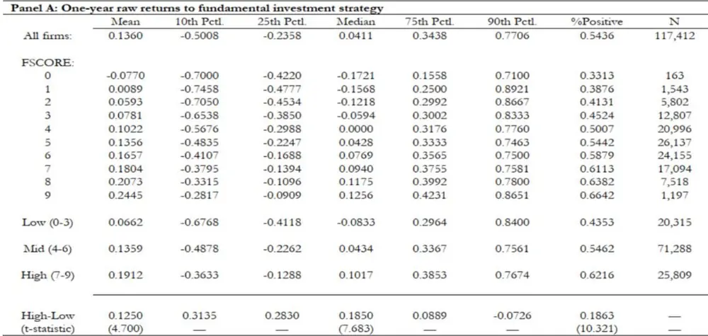
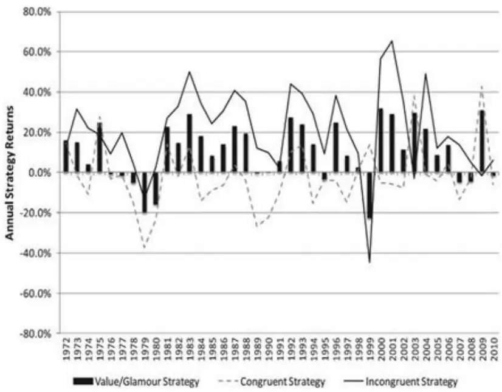
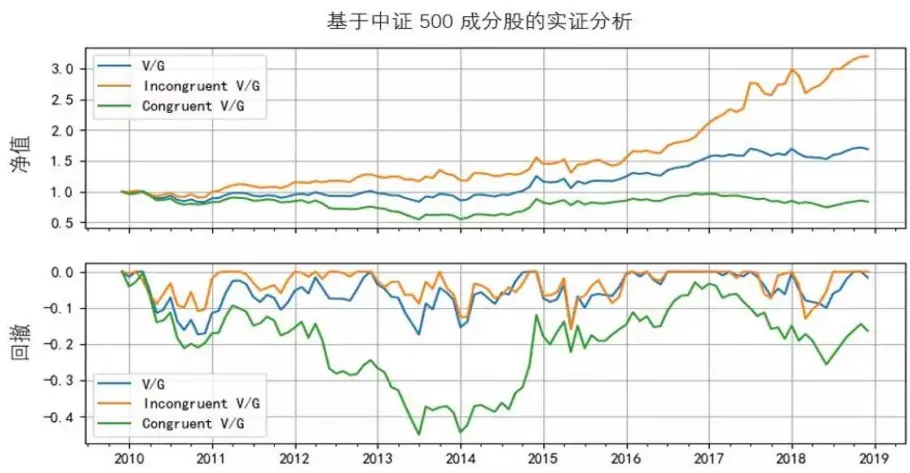

inInfo] [Table_Title] 2021.05.28

# 价值溢价的来源：预期偏差导致的错误定 价

## ——学界纵横系列之六

陈奥林(分析师)

殷钦怡(分析师)

021-38674835

chenaolin@gtjas.com

021-38675855

yinqinyi@gtjas.com

证书编号 S0880516100001

S0880519080013

## 本报告导读：

作者通过预期偏差的理论，阐明了低估值股票战胜高估值股票背后的原因主要来自于错误定价。

le_Summary]对于基本面预期约等于市场预期（不存在预期偏差）的股票，它们的价格已经较好的反映了其内在价值，在未来很可能不会带来超额收益。但是当基本面预期和市场预期不一致时，就存在预期偏差。按照Piotroski and So (2012) 的猜想，预期偏差造成了错误定价；预期偏差的修正可以带来超额收益；

Piotroski and So认为，判断一家公司是否被低估首先是要判断公司的价值，《Identifying Expectation Errors in Value/Glamour Strategies: AFundamental Analysis Approach》一文提出了一种量化的方法，定义了F-score 这个指标，该方法通过在财报中提取出有用的信息来反映公司的基本面预期。

使用 F-SCORE 模型，通过 9 个指标给股票的基本面打分，以此作为股票的基本面预期。这 9 个指标从盈利能力、财务杠杆及流动比率、经营效率三个维度衡量一个公司的内在价值及基本面预期。与此同时用B/M Ratio的高低来反映市场对于个股存在高估或者低估。

Piotroski and So 将预期偏差组合定义为高 F-score、高 BM Ratio 的股票组合，高F-score反映了个股的基本面预期较高，高 BM Ratio则反映了个股的市场预期较低，存在低估，此类股票存在由预期偏差导致的定价偏差，后续存在定价修正带来的超额收益。相对应的，低 F-score、低BM Ratio的股票组合可以被定义为市场预期大于基本面预期的高估组合，同样存在预期偏差，后续存在负向超额收益的空间。

通过在美股实证，作者发现，预期偏差组合年化收益可达 22.64%，大幅超越非预期偏差组合21.5%，且常规的做多低估值股票的策略收益几乎全部来自于低估值股票中存在预期偏差的个股。

金融工程

## 金融工程团队：

陈奥林：（分析师）

电话：021-38674835

邮箱：chenaolin@gtjas.com

证书编号：S0880516100001

## 杨能：（分析师）

电话：021-38032685

邮箱：yangneng@gtjas.com

证书编号：S0880519080008

## 殷钦怡：（分析师）

电话：021-38675855

邮箱：yinqinyi@gtjas.com

证书编号：S0880519080013

## 徐忠亚：（分析师）

电话：021- 38032692

邮箱：xuzhongya@gtjas.com

证书编号：S0880120110019

## 刘昺轶：（分析师）

电话：021-38677309

邮箱：liubingyi@gtjas.com

证书编号：S0880520050001

## 吕琪：（研究助理）

电话：021-38674754

邮箱：lvqi@gtjas.com

证书编号：S0880120080008

公司债定价因子模型研究 2021.05.24

核心指数成分股调整名单及冲击成本预测 2021.05.17

全球疫情冲击下，哪些公司更具免疫力2021.05.09

## 1. 选题背景

在投资中，预期是最重要的事。市场的预期，与个人的预期，二者相互作用。没有了预期，也就不会有偏离市场平均的情况发生。预期偏差，可以说是股票产生超额收益（超额亏损）的动因。

价值投资的一种理解可以解释为：寻找基于已知信息情况下，市场定价偏低的股票。

以 BM ratio为代表的价值因子在美股上长盛不衰。在 A 股上，价值因子在资产定价以及因子选股上的作用也不容忽视。但是仅仅用 BM ratio一个指标不足以衡量公司的内在价值。

对于量化投资者而言，如何更好地量化公司的基本面信息是量化研究的难点之一，本篇报告推荐的 Piotroski and So 的学术文章《IdentifyingExpectation Errors in Value/Glamour Strategies: A Fundamental AnalysisApproach》提供了一种量化公司基本面并构建组合的思路。

## 2. 核心结论

预期偏差的存在导致了定价的偏差，预期偏差的修正可以带来超额收益；作者使用自构建的F-score来刻画基本面预期，用BM Ratio来刻画市场预期，并使用这两个指标通过构建具有递进关系的策略来印证该结论。

Value/Glamour Strategy 策略代表仅以 BM 为指标构建的对高账面市值公司的做多和低账面市值公司的做空的策略。

Congruent Strategy 策略包括对低 F-SCORE 高 BMRatio 的公司做多，对高 F-SCORE 低 BM Ratio 的公司做空。

Incongruent Strategy 策略包括对高 F-SCORE、高 BMRatio 的公司的做多和对低F-SCORE、低BM Ratio的公司做空的策略。即做多市场预期小于基本面预期的低估值股票和做空市场预期大于基本面预期的高估值股票，即做多有正预期偏差（修正预期偏差会带来超额收益）的公司同时做空有负预期偏差（修正预期偏差会带来超额亏损）的公司。

数据表明 Incongruent Strategy 策略明显跑赢其它两个策略。IncongruentV/G strategy 可以获得 22.64% 的年化收益率；而另一方面，单纯的Congruent V/G strategy 的收益率近似为零。

## 3. 文章背景

正如格雷厄姆和多德(1934)所讨论的，老练的投资者利用历史财务信息来选择有利可图的投资机会。这些投资策略的成功要求价格不能准确地反映历史信息对未来现金流的影响，导致股票价格暂时偏离一些公司的基本价值。假设交易或套利没有障碍，长线投资者可以通过捕捉预期偏差和后续价格修正来获利。

根据 Baker and Wurgler (2006)，投资者情绪高涨时期产生的市场价格，其中隐含的业绩预期进一步偏离稳固的基本面。因此，利用这些预期偏差的交易策略，能在市场情绪高涨期间为投资组合带来更大的回报。与这些系统性错误定价的观点一致，我们发现，在投资者情绪高(低)时期，Incongruent Strategy 策略的回报最大(最小)，而 congruent Strategy 策略在这些时期的回报没有显著差异。

Piotroski（2000）使用历史财务报表数据将账面市值比高（BM）的公司分类为当前财务状况良好的公司和财务状况较差的公司。他们使用 F-score 的 9 个指标给股票的基本面打分，以此作为股票的基本面预期。这9个指标从盈利能力、财务杠杆及流动比率、经营效率三个维度衡量一个公司的内在价值。

## 4. 核心策略

## 4.1. F-SCORE 统计量的构建

文章首先定义 F-SCORE 的构建方法，根据企业财务状况的变化对企业进行分类。F-SCORE 统计量的构建：

这一统计数据基于九个财务指标，旨在衡量公司财务状况的三个不同维度:盈利能力、财务杠杆及流动比率和运营效率的变化。所使用的指标易于解释和实现。每个指标按照表1 的打分方式来判断得分情况，综合度量F-SCORE，总分九个二进制信号的和，被设计用来衡量公司财务状况的整体改善或恶化。

表 1 ：F-SCORE 统计量的构建

|  | 指标 | 打分方式 |
| --- | --- | --- |
| 盈利能力 | ROA | 大于零得1分，小于零得0分 |
|  | 经营活动现金流 | 大于零得1分，小于零得0分 |
|  | ROA 同比 | 上升得1分，下降得0分 |
|  | 应计利润 | 小于零得1分，大于零得0分 |
| 财务杠杆及流动比率 | 长期负债率同比 | 下降得1分，上升得0分 |
|  | 流动比率同比 | 上升得1分，下降得0分 |
|  | 股票增发 | 不增发得1分，增发得0分 |
| 运营效率 | 毛利润率同比 | 上升得1分，下降得0分 |
|  | 资产周转率同比 | 上升得1分，下降得0分 |

数据来源：国泰君安证券研究

F-SCORE 方法通过以上 9 个标准来考察公司的财务状况：

符合一点得一分，总分九分。通过现金流,公司扩张程度，杠杆水平，偿

债能力水平，毛利率增长与否，资产周转率等指标来量化公司的基本面。

这 9 个指标打分的总分取值范围是 0 至 9，分数越高说明上市公司的基本面越好。得分最差的公司（0-3）的基本面恶化情况最显著，被归类为低 F-SCORE公司。得分中等的的公司（4-6）的基本面正常，被归类为中 F-SCORE公司。另外，得分最高的公司（F-SCORE 大于或等于7-9）在基本面方面是最好的，被归类为高F-SCORE 的公司。

表 2：相关性检验

|  | F-SCORE | BM | EP | CP | SG | TO |
| --- | --- | --- | --- | --- | --- | --- |
| F-SCORE |  | 0.030 | 0.400 | 0.430 | -0.037 | -0.057 |
| BM | 0.030 |  | 0.170 | 0.343 | -0.333 | -0.253 |
| EP | 0.400 | 0.170 |  | 0.428 | 0.038 | -0.048 |
| CP | 0.430 | 0.343 | 0.428 |  | -0.144 | -0.121 |
| SG | -0.037 | -0.333 | 0.038 | -0.144 |  | 0.249 |
| TO | -0.057 | -0.253 | -0.048 | -0.121 | 0.249 |  |

数据来源：《Identifying Expectation Errors in Value/Glamour Strategies》

以上为五个常用的相对估值指标：账面市值比（BM），现金流与股价比率（CP），盈利价格比率（EP），sales growth（SG）和股东权益周转率（TO）。将这5 个指标与 F-SCORE 做相关性回归：

表2中包含 F-SCORE 与我们的相对估值比率之间的相关性。所有的相关性均在 10％的水平上显著。具有较高 F-SCORE 的公司还具有许多价值特征，其中 F-SCORE 账面市值比（BM），现金流与股价比率（CP），盈利价格比率（EP）呈正相关，salesgrowth（SG）和股东权益周转率（TO）则呈负相关。这些相关性与低估值（高估值）状态与过去业绩负（正）相关的结论一致。

传统假设市场参与者对公司财务状况变化的信息反应不足，F-SCORE对公司股票的未来收益表现成功进行了区分。

表 3：基本面投资策略的年回报（基于 F-score）

数据来源：《Identifying Expectation Errors in Value/Glamour Strategies》

基本面改善最明显的公司（F-SCORE≥7）产生的年平均原始收益为19.12％，而基本面最差的公司（F-SCORE≤3）的平均年原始收益为6.62％。在本文的实证主要检验高 F-SCORE 低市场预期的组合的收益表现是否优于低F-SCORE高市场预期的组合。

## 4.2. BM 统计量的构建

本文定义低BM的股票对应人们的市场预期较高；高 BM对应人们的市场预期较低。文中依据公司的BM值处于前一年样本公司分布的百分位情况，将公司分为三类：前 30百分位数（高估值），在第 30和第70百分位数之间（中等），或高于第 70百分位数（低估值）。

## 4.3. 预期偏差组合的定义

用 BM ratio 表示投资者对于股票的市场预期，用 F-SCORE 来表示股票的基本面好坏情况，按照基本面预期和市场预期分别分成高、中、低三档进行组合：

表 4 ：BM ratio 与 F-SCORE

|  | 低BM 高估值 | 中BM |  |
| --- | --- | --- | --- |
|  |  | Middle | 高BM 低估值 Value |
| 低F-SCORE | Glamour 市场预期>基本 |  | 市场预期≈基 |
|  | 面预期 |  | 本面预期 |
| 中F-SCORE |  | 市场预期≈基 本面预期 |  |
| 高F-SCORE | 市场预期≈基 本面预期 |  | 市场预期<基本 面预期 |

数据来源：《Identifying Expectation Errors》

Piotroski and So (2012) 认为，对于基本面优秀的股票，市场会倾向于给它较高的估值；同理，对于基本面很差的股票，市场对它们的低预期也非常合理。

这两类股票的基本面预期基本等于市场预期（不存在预期偏差），它们的价格已经反映了其内在价值，在未来不会带来超额收益。

所以真正能带来收益的股票是基本面预期高（F-score 高）、市场预期低（高 BM）的低估值股票，一旦预期偏差修正，这些股票就会获得正的超额收益；会带来亏损的是基本面预期低（F-score 低）、市场预期高（低BM）的高估值股票，一旦预期偏差修正，这些股票就会获得负的超额收益。

## 5. 策略构建

Piotroski and So (2012) 在美股上进行了实证，构建了三个对冲策略。

Value/Glamour Strategy 策略代表仅以 BM 为指标构建的对高账面市值公司的做多和低账面市值公司的做空的策略。

Congruent Strategy 策略包括对 F-SCORE 低的低估值（Value）股票做多，对F-SCORE 高的高估值（Glamour）股票公司做空。

Incongruent Strategy 策略包括对 F-SCORE 高的低估值（Value）股票做多和对 F-SCORE 低的高估值（Glamour）股票做空的策略。

图1显示了我们的样本从1972年到2010年每一年的三种投资策略的年度规模调整后的买入和持有回报。

图 1三种策略的年度回报：IS策略收益最为显著

数据来源：《Identifying Expectation Errors in Value/Glamour Strategies》

这三种策略在实证中的年化收益率如下图所示：Incongruent Strategy 远远跑赢另外两个策略；在 39 年的时间周期里，只有 5 年跑输Value/Glamour 策略，3 年跑输 Congruent Strategy 。且常规 V/G 对冲策略中的收益几乎全部来自存在预期偏差的股票。

表 6 ：取决于公司的基本面的价值/成长策略的回报

|  | Panel A: 12-Month Returns |  |  |  |  | Panel B: 24-Month Returns |  |  |  |  |
| --- | --- | --- | --- | --- | --- | --- | --- | --- | --- | --- |
|  | Glamour | Middle | Value | V-G Diff. | (t-statistic) | Glamour | Middle | Value | V-G Diff. | (t-statistic) |
| Unconditional | -0.0549 | 0.0143 | 0.0632 | 0.1181 | (9.813) | -0.0894 | 0.0248 | 0.1036 | 0.1930 | (16.081) |
| Low FSCORE (0–3) | -0.1438 | -0.0328 | 0.0221 | 0.1659 | (13.799) | -0.2230 | -0.0652 | 0.0047 | 0.2277 | (18.943) |
| Mid FSCORE (4–6) | -0.0511 | 0.0172 | 0.0693 | 0.1204 | (17.562) | -0.0847 | 0.0285 | 0.1172 | 0.2019 | (29.428) |
| High FSCORE (7–9) | 0.0207 | 0.0382 | 0.0826 | 0.0619 | (5.107) | 0.0276 | 0.0753 | 0.1536 | 0.1260 | (10.471) |
| High-Low | 0.1644 | 0.0710 | 0.0604 |  |  | 0.2506 | 0.1405 | 0.1489 |  |  |
| (t-statistic) | (14.010) | (7.348) | (5.398) |  |  | (61.987) | (15.696) | (21.398) |  |  |
| Congruent V/G Strategy |  |  |  | 0.0014 | (0.128) |  |  |  | -0.0229 | (−1.213) |
| Incongruent V/G Strategy |  |  |  | 0.2264 | (18.727) |  |  |  | 0.3766 | (19.842) |
| N | Glamour | Middle | Value |  |  |  |  |  |  |  |
| Low FSCORE (0–3) | 8,293 | 9,301 | 6,593 |  |  |  |  |  |  |  |
| Mid FSCORE (4–6) | 25,952 | 37,224 | 20,198 |  |  |  |  |  |  |  |
| High FSCORE (7–9) | 8,418 | 13,801 | 7,524 |  |  |  |  |  |  |  |

数据来源：《Identifying Expectation Errors in Value/Glamour Strategies》

表 6 中表明 Incongruent V/G 策略的年化收益率为 22.64% ，而 congruentV/G 策略的年化收益率只有 0.14%，跑输 21.5%；可见当市场预期与个股的基本面表现过度一致时，个股基本面的预期变化会被迅速定价，后续不存在超额收益的空间。只有当市场预期与个股的基本面预期出现偏离，市场由于预期偏差的存在出现了定价偏差时，个股后续才能体现出超额收益。

## 6. 总结

## 6.1. 原文结论

作者提出了预期偏差（expectation errors）的概念，指出低估值股票长期战胜高估值股票背后的原因是错误定价。低估值股票的长期市场表现优于高估值股票，是因为高估值股票的价格反映了市场的乐观预期，低估值股票的价格反映了市场的悲观预期，而这两种预期往往是偏离基本面的。

作者根据市场预期是否与其基本面强度相符来对公司进行分类，并构建策略。

通过即做多有正预期偏差（修正预期偏差会带来超额收益）的公司同时做空有负预期偏差（修正预期偏差会带来超额亏损）的公司，来获取定价修正带来的超额收益。

## 6.2. 思考

国内目前也有相应的量化策略，如石川博士的《寻找股票市场中的预期偏差》中对于中证500 的预期偏差策略。

以中证 500 成分股为选股池，回测期为 2009 年 12 月到 2018 年 12月。每月末将 P/B 最小的 150 支选为低估值股票（Value）；P/B 最高的150 支选为高估值股票(Glamour)；

同时，对股票按照上述 F-score 打分（由于股票增发维度的数据质量问题，我们放弃该指标，用剩余 8 个指标打分）。在 150 支低估值股票中，选出 F-score 最高的 50 支作为存在预期偏差的低估值股票；在 150支高估值股票中，选出 F-score 最低的 50 支作为存在预期偏差的高估值股票。每月调仓、等权配置，不考虑任何交易成本。

该文章同样构建了对照组合。具体来说：将 P/B 最小的 150 支股票中F-score 最低的 50 支标记为为不存在预期偏差的低估值股票（Value）；将 P/B 最大的 150 支股票中 F-score 最高的 50 支标记为不存在预期偏差的高估值股票(Glamour)。

此外，我们使用 P/B 最小的 150 支股票构建常规的低估值股票（Value）组合；P/B 最大的 150 支股票构建常规的高估值股票(Glamour)组合。常规、预期偏差、以及没有预期偏差口径下，Value 和Glamour投资组合在回测期内的表现如下表所示。可以得到一致的结论：低估值股票相对于高估值股票存在超额收益的来源主要是组合中存在预期偏差的股票，而这背后的逻辑是预期偏差的修正。

表 7 ：对比组策略的市场表现 (回测期2009年 12月至 2018年12月)

|  | 常规 |  | 存在预期偏差 |  | 没有预期偏差 |  |
| --- | --- | --- | --- | --- | --- | --- |
|  | Value | Glamour | Value | Glamour | Value | Glamour |
| 年化收益率 夏普比率（年 | 3.60 | -3.48 | 7.45 | -7.75 | -0.33 | 0.70 |
| 化） | 0.27 | 0.02 | 0.40 | -0.11 | 0.13 | 0.16 |
| 最大回撤% | -43.56 | -63.49 | -40.45 | -72.18 | -50.11 | -55.11 |

数据来源：《寻找股票市场中的预期偏差》，国泰君安证券研究

同时该文章参考了 Piotroski and So (2012) 的思路，使用低估值股票和高估值股票投资组合构建三个多空对冲组合：

1. 常规对冲组合（V/G）：做多常规低估值股票、做空常规高估值股票；

2. 预期偏差对冲组合（Incongruent V/G）：做多存在预期偏差的低估值股票、做空存在预期偏差的高估值股票；

3. 非预期偏差对冲组合（Congruent V/G）：做多非预期偏差低估值股票、做空非预期偏差高估值股票。这三个组合的风险、收益情况如下：

表 8 ：三种策略的市场表现(回测期 2009 年 12 月至 2018 年 12 月)

|  | 常规对冲组合（V/G） | 预期偏差对冲组合非预期偏差对冲组合 (Incongruent V/G) | (Congruent V/G) |
| --- | --- | --- | --- |
| 年化收益率 | 6.00 | 13.78 | -1.97 |
| 夏普比率（年化） | 0.48 | 0.90 | -0.05 |
| 最大回撤% | -17.42 | -15.93 | -45.14 |

数据来源：《寻找股票市场中的预期偏差》，国泰君安证券研究

图2展示了这三个策略在回测期内的净值表现和回撤情况，预期偏差对冲组合（Incongruent V/G）跑赢了常规 V/G 组合以及非预期偏差 V/G组合，且不含预期偏差的组合表现最差。

图 2 三个策略在回测期内的净值表现和回撤情况

数据来源：《寻找股票市场中的预期偏差》，国泰君安证券研究

从在中证500的实证来看，这个策略对A股的中证500也同样有效。

两篇文章主要使用市净率为重要指标，该指标比较稳定，因为净资产不会像利润那样波动很大，所以市净率的变化，通常能够反应市场的高估和低估；但市净率对于技术创新型企业不太适用，体现不出来新经济的优势。

那么文中对于中证500 的预期偏差策略回测，所选用的中证 500指数是否适用市净率指标来分析，仍有待商榷。是否可以用更合适的指标来量化预期偏差，是该策略能否更好的应用于A 股所需要思考的问题。

## 本公司具有中国证监会核准的证券投资咨询业务资格

## 分析师声明

作者具有中国证券业协会授予的证券投资咨询执业资格或相当的专业胜任能力，保证报告所采用的数据均来自合规渠道，分析逻辑基于作者的职业理解，本报告清晰准确地反映了作者的研究观点，力求独立、客观和公正，结论不受任何第三方的授意或影响，特此声明。

## 免责声明

本报告仅供国泰君安证券股份有限公司（以下简称“本公司”）的客户使用。本公司不会因接收人收到本报告而视其为本公司的当然客户。本报告仅在相关法律许可的情况下发放，并仅为提供信息而发放，概不构成任何广告。

本报告的信息来源于已公开的资料，本公司对该等信息的准确性、完整性或可靠性不作任何保证。本报告所载的资料、意见及推测仅反映本公司于发布本报告当日的判断，本报告所指的证券或投资标的的价格、价值及投资收入可升可跌。过往表现不应作为日后的表现依据。在不同时期，本公司可发出与本报告所载资料、意见及推测不一致的报告。本公司不保证本报告所含信息保持在最新状态。同时，本公司对本报告所含信息可在不发出通知的情形下做出修改，投资者应当自行关注相应的更新或修改。

本报告中所指的投资及服务可能不适合个别客户，不构成客户私人咨询建议。在任何情况下，本报告中的信息或所表述的意见均不构成对任何人的投资建议。在任何情况下，本公司、本公司员工或者关联机构不承诺投资者一定获利，不与投资者分享投资收益，也不对任何人因使用本报告中的任何内容所引致的任何损失负任何责任。投资者务必注意，其据此做出的任何投资决策与本公司、本公司员工或者关联机构无关。

本公司利用信息隔离墙控制内部一个或多个领域、部门或关联机构之间的信息流动。因此，投资者应注意，在法律许可的情况下，本公司及其所属关联机构可能会持有报告中提到的公司所发行的证券或期权并进行证券或期权交易，也可能为这些公司提供或者争取提供投资银行、财务顾问或者金融产品等相关服务。在法律许可的情况下，本公司的员工可能担任本报告所提到的公司的董事。

市场有风险，投资需谨慎。投资者不应将本报告作为作出投资决策的唯一参考因素，亦不应认为本报告可以取代自己的判断。
在决定投资前，如有需要，投资者务必向专业人士咨询并谨慎决策。

本报告版权仅为本公司所有，未经书面许可，任何机构和个人不得以任何形式翻版、复制、发表或引用。如征得本公司同意进行引用、刊发的，需在允许的范围内使用，并注明出处为“国泰君安证券研究”，且不得对本报告进行任何有悖原意的引用、删节和修改。

若本公司以外的其他机构（以下简称“该机构”）发送本报告，则由该机构独自为此发送行为负责。通过此途径获得本报告的投资者应自行联系该机构以要求获悉更详细信息或进而交易本报告中提及的证券。本报告不构成本公司向该机构之客户提供的投资建议，本公司、本公司员工或者关联机构亦不为该机构之客户因使用本报告或报告所载内容引起的任何损失承担任何责任。

## 评级说明

## 1.投资建议的比较标准

投资评级分为股票评级和行业评级。

以报告发布后的 12 个月内的市场表现为比较标准，报告发布日后的 12 个月内的公司股价（或行业指数）的涨跌幅相对同期的沪深 300 指数涨跌幅为基准。

## 2.投资建议的评级标准

报告发布日后的 12 个月内的公司股价（或行业指数）的涨跌幅相对同期的沪深 300 指数的涨跌幅。

| 评级 |  | 说明 |
| --- | --- | --- |
| 股票投资评级 | 增持 | 相对沪深 300 指数涨幅15%以上 |
|  | 谨慎增持 | 相对沪深 300指数涨幅介于 5%～15%之间 |
|  | 中性 | 相对沪深 300 指数涨幅介于-5%～5% |
|  | 减持 | 相对沪深 300 指数下跌 5%以上 |
| 行业投资评级 | 增持 | 明显强于沪深300指数 |
|  | 中性 | 基本与沪深 300指数持平 |
|  | 减持 | 明显弱于沪深300指数 |

## 国泰君安证券研究所

|  | 上海 | 深圳 | 北京 |
| --- | --- | --- | --- |
| 地址 | 上海市静安区新闸路 669 号博华广 场 20层 | 深圳市福田区益田路6009号新世界 商务中心34层 | 北京市西城区金融大街甲9号金融 街中心南楼18层 |
| 邮编 | 200041 | 518026 | 100032 |
| 电话 | （021)38676666 | (0755)23976888 | (010)83939888 |
| E-mail: gtjaresearch@gtjas.com |  |  |  |