inInfo] [Table_Title] 2021.06.08

# 碳排放量如何影响了股票收益

## ——学界纵横系列之七

陈奥林(分析师)

## 徐忠亚(分析师)

8 021-38674835

021-38032692

chenaolin@gtjas.com

xuzhongya@gtjas.com

证书编号 S0880516100001

S0880519090002

## 本报告导读：

市场开始认识到碳排放风险对公司价值和股票收益的影响，公司碳排放量与股票收益正相关。

## 摘要：

le_Summary]近些年来，温室气体排放对气候和经济社会的影响愈发强烈，环境保护、低碳排放的思想逐渐深入人心，金融业也对公司碳排放愈加关注。

《Do investors care about carbon risk?》一文发现公司碳排放量与股票收益正相关。碳排放风险溢价是由于承担了更多的风险，从而需要更高的收益予以补偿。

碳排放风险本质上来源于投资者对相关风险认识之后的投资偏好，机构投资者对特定行业或公司的撤资行为对碳排放风险溢价具有重要影响。

银行、生物技术和油气行业的碳排放量相对最高，这几个行业中机构撤资行为没有明显公司特征；在剔除这几个行业之后之后，规模大、资本支出低、成长能力强的公司更有可能受到机构关注。

在碳排放因子和风险因子的时间序列回归中发现，传统风险因子不能解释碳排放风险溢价，碳排放因子包含横截面收益中的独特信息。

碳风险溢价在近些年才出现。在 2015 年《巴黎协定》签署之后，碳风险溢价明显增加；在 1990 年代当碳排放尚未成为共识之际，碳风险溢价相对更低。随着投资者对碳排放风险的认识日益深入，碳排放风险可能从当前的 α 异象逐渐演化为 β 因子，成为解释股票收益的重要因子。

- 我国企业社会责任（ESG/CSR）方兴未艾，沪深A股中仅有 1000余家公司发布社会责任报告，ESG仍有很大发展空间。

金融工程

## 金融工程团队：

陈奥林：（分析师）

电话：021-38674835

邮箱：chenaolin@gtjas.com

证书编号：S0880516100001

## 杨能：（分析师）

电话：021-38032685

邮箱：yangneng@gtjas.com

证书编号：S0880519080008

## 殷钦怡：（分析师）

电话：021-38675855

邮箱：yinqinyi@gtjas.com

证书编号：S0880519080013

## 徐忠亚：（分析师）

电话：021- 38032692

邮箱：xuzhongya@gtjas.com

证书编号：S0880120110019

## 刘昺轶：（分析师）

电话：021-38677309

邮箱：liubingyi@gtjas.com

证书编号：S0880520050001

## 吕琪：（研究助理）

电话：021-38674754

邮箱：lvqi@gtjas.com

证书编号：S0880120080008

## [Table_R相关报告

富国沪深 300ESG 基准 ETF 投资价值分析2021.06.08

金融板块基本面量化及策略配置 2021.06.01

价值溢价的来源：预期偏差导致的错误定价2021.05.30

技术因子的非线性预测力 2021.05.30

系统化择时之路 3-一力降十会 2021.05.26

## 1. 选题背景

时下ESG 的热度和在投资决策中的重要性与日俱增，越来越多企业发布社会责任报告（CSR）和内部控制报告，主动披露企业经营对生态、社会的影响以及公司治理水平。出色的公司治理能力可以提高公司经营管理效率，对公司价值有正面作用，公司治理在经济新常态下具有十分重要的意义。我国的CSR报告涵盖企业对政府、股东、消费者、员工、生态、社区等多方面责任，是衡量上市公司是否具备足够社会责任感的重要标准。随着法律法规逐渐完善，企业在生态和社会领域的贡献对公司价值也会有促进作用。

图 1：国内泛ESG基金数量和规模
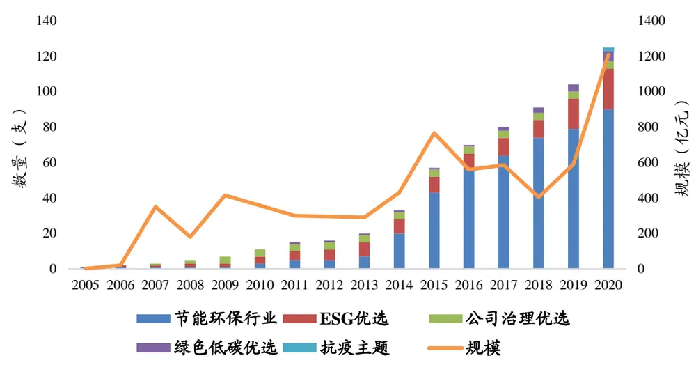
数据来源：《中国责任投资年度报告 2020》，国泰君安证券研究

图 2：A股公司社会责任报告发布数量
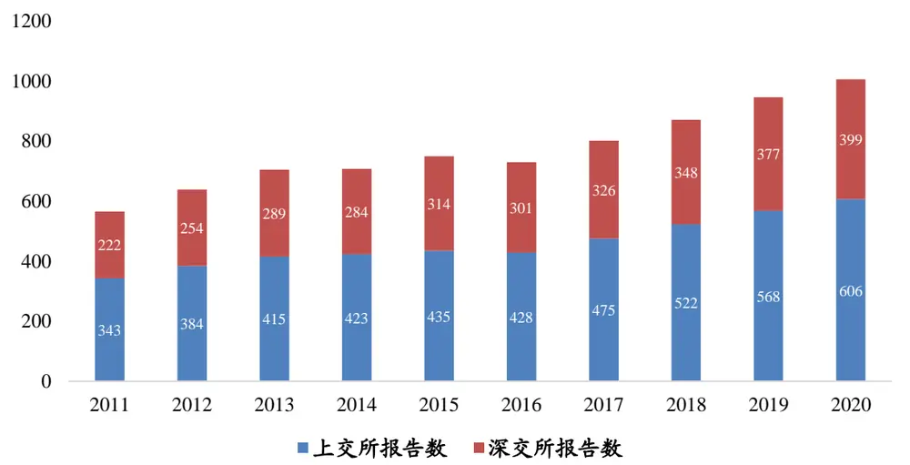
数据来源：《中国责任投资年度报告 2020》，国泰君安证券研究

ESG 对于投资决策的意义更多在于剔除具有高风险、“黑天鹅”风险的公司，从而有效避免踩雷。但单纯的负面清单对于投资决策的意义是有限的，如何将ESG转变为正向策略是目前的关键问题。《Do investors careabout carbon risk?》一文提出碳排放量与股票收益正相关，为我们提供了新的思路。今年两会提出我国力争 2030 年前实现碳达峰、2060 年前实现碳中和，在这一背景下讨论碳排放对公司价值和股票收益的影响具有重要意义。

## 2. 核心结论

近些年来，温室气体排放对气候和经济社会的影响愈发强烈，环境保护、低碳排放的思想逐渐深入人心，金融业也对公司碳排放愈加关注。传统的观点基于监管限制、化石能源价格和新能源替代风险的考虑，一般认为碳排放量增加对公司价值和股票收益具有负面影响。

本文发现公司碳排放量越高，其股票收益就越高。本文认为碳排放风险溢价是由于承担了更多的风险，从而需要更高的收益予以补偿，其股票收益应当更高。随着投资者对碳排放风险的认识日益深入，碳排放风险可能从当前的α异象演化为β因子，成为解释股票收益的重要因子。本文发现，碳风险溢价在近些年方才出现；在2015年《巴黎协定》签署之后，碳风险溢价明显增加；在1990年代当碳排放尚未成为共识之际，碳风险溢价相对更低。

碳排放风险本质上来源于投资者对相关风险认识之后的投资偏好，机构投资者对特定行业或公司的撤资行为对碳排放风险溢价具有重要影响。本文发现银行、生物技术和油气行业的碳排放量相对最高，且在这些行业内部公司特征对于机构选股并无作用；在控制行业因素之后，规模大、资本支出低、成长能力强的公司更有可能受到机构关注。在碳排放因子和风险因子的时间序列回归中发现，传统风险因子不能解释碳排放风险溢价，碳排放因子包含横截面收益中的独特信息。

## 3. 文章背景

二氧化碳排放对气候变化和国际社会的影响与日俱增。2015 年 12 月的巴黎 COP 21 气候协议，195 个签署国承诺将全球变暖限制在低于工业化前水平 2°C 的水平。与此同时，金融业对气候变化的参与度不断上升。机构投资者越来越多地追踪上市公司和企业的温室气体排放量，成立了气候行动100+联盟，与公司合作减少碳排放。

因此，有关碳排放风险的第一个问题是，碳排放是否影响股票收益？碳排放会增加公司的风险，包括化石能源价格变动、环保政策限制和新能源技术的替代风险，因此投资者要求更高的收益以补偿高风险。但如果机构投资者尚未对此形成共识，可能导致碳排放风险尚未反映在股价中。埃克森美孚（ExxonMobil）首席执行官达伦·伍兹声明：“投资公司设定碳排放目标，然后出售部分资产，这会降低投资组合的碳排放强度，但没有解决全世界的问题。（埃克森美孚公司）正在采取措施解决整个社会的问题，而不是试图参加选美比赛。”分析师对于未来现金流的分析通常不包括碳排放风险及其定价，这也导致碳排放风险可能被忽视、相关股票可能被低估。

在鼓励节能减排的社会中，碳排放在某种意义上已经上升为道德层面的约束，高碳排放的公司可能会被刻意回避，这也导致了这些公司被低估。这里一个关键问题在于，投资者的这种回避行为是在公司层面还是行业层面？换言之，当投资者根据碳排放指标筛选股票时，公司层面的特征和行业特征哪个更加重要？

随着ESG 的兴起，近几年有关气候变化与公司价值的问题受到学界广泛关注。但以往研究的大部分观点与本文相左，认为碳排放是股票价值的负面影响因素。Matsumura、Prakash 和 Vera-Munoz（2014）发现碳排放量与公司价值负相关，但自愿披露可以减轻碳排放量对估值的负面影响。Krueger、Sautner 和 Starks（2020）发现机构投资者普遍认为碳排放代表着重大风险，因此不认为碳风险定价过低。Hsu、Li 和 Tsou（2019）与本文结论相仿，认为污染严重的公司更容易受到环境监管风险的影响，从而获得更高的平均回报。

## 4. 对碳排放的衡量

公司级别的碳排放数据来自于七个机构：CDP、Trucost、MSCI、Sustainalytics、汤森路透、彭博和 ISS，且主要来自于 CDP 和 Trucost。时间区间为2005年-2017年。所有机构遵循《温室气体协议》对公司碳排放量衡量的标准。从来源上，碳排放包括生产直接排放、使用能源的间接排放和产品使用、废物处理等公司经营活动中的排放。对碳排放的衡量包括三个口径：

·Scope 1：公司拥有或控制的企业的直接排放，包括生产中使用的化石燃料带来的碳排放；

·Scope 2：公司消耗的购买的热能、蒸汽和电力带来的间接排放；

·Scope 3：由公司运营和产品引起、但来自于公司控制权以外的排放，包括采购材料生产、产品使用、废物处理和外包活动产生的排放。

对于每个口径，统计碳排放的总量（TOT）、增量和排放强度（INT）指标。并根据Trucost提供的数据补充了一些指标，包括：

·CARBON DIRECT/INDIRECT：对应 Scope 1/2，但范围更广

·GHG DIRECT/ INDIRECT：衡量公司直接/间接碳排放对环境的影响，以美元计量

表3表明，不同指标之间呈正相关，但相关系数较小。SCOPE 1 TOT和SCOPE 1 INT 之间相关系数仅为 0.6，表明相同排放强度的公司可能具有明显不同的排放水平。

表4表明，碳排放指标具有显著的自相关性。表5表明，碳排放总量和增量先增后减，在2008年达到最高点；而碳排放强度整体上逐年下降。

图4表明，2015年符合条件的公司数目迅速增加，这可能为检验带来一定干扰。后面的分析表明这一变化使 2015 年之后的碳风险溢价显著增加。

表 6 和表 7 表明，每个行业中都有高碳排放公司。根据口径 1 的排序，消费金融、储蓄&抵押以及资本市场这三个行业是最清洁的；而银行、生物技术、石油和天然气行业碳排放最高，每个行业中各有超过150家高碳排放公司。本文将碳排放量高的三个行业称为突出的（salient）行业，在后面的部分分析中剔除了这几个行业。

图5表明，不同指标标准差的变化并不完全同步，但碳排放增长率的标准差随时间变化非常稳定；且 2015 年样本公司数量增加对于碳排放量指标的标准差并无太大影响。

表 1：碳排放指标及描述性统计

| Variable | Mean | Median | Std. Dev. |
| --- | --- | --- | --- |
| Log (Carbon Emissions Scope 1 (tons CO₂e)) | 10.55 | 10.47 | 2.95 |
| Log (Carbon Emissions Scope 2 (tons CO₂e)) | 10.52 | 10.66 | 2.36 |
| Log (Carbon Emissions Scope 3 (tons CO₂e)) | 12.31 | 12.46 | 2.25 |
| Growth Rate in Carbon Emissions Scope 1 (winsorized at 2.5%) | 0.08 | 0.03 | 0.36 |
| Growth Rate in Carbon Emissions Scope 2 (winsorized at 2.5%) | 0.14 | 0.05 | 0.45 |
| Growth Rate in Carbon Emissions Scope 3 (winsorized at 2.5%) | 0.09 | 0.06 | 0.24 |
| Carbon Intensity Scope 1 (tons CO₂e/USD m.)/100 (winsorized at 2.5%) | 1.92 | 0.15 | 5.88 |
| Carbon Intensity Scope 2 (tons CO₂e/USD m.)/100 (winsorized at 2.5%) | 0.34 | 0.18 | 0.46 |
| Carbon Intensity Scope 3 (tons CO₂e/USD m.) /100 (winsorized at 2.5%) | 1.58 | 0.98 | 1.59 |
| Carbon Intensity Direct (winsorized at 2.5%)/100 | 2.12 | 0.16 | 6.45 |
| Carbon Intensity Indirect (winsorized at 2.5%)/100 | 1.04 | 0.58 | 1.31 |
| GHG Direct Impact Ratio (winsorized at 2.5%) | 0.75 | 0.06 | 2.29 |
| GHG Indirect Impact Ratio (winsorized at 2.5%) | 0.71 | 0.47 | 0.68 |

数据来源：《Do investors care about carbon risk?》，国泰君安证券研究

表 2：公司碳排放指标和其他特征数据

| Calculation Method | Imputed | Direct |
| --- | --- | --- |
| SCOPE 1 TOT | 1366013 | 5954876 |
| SCOPE 2 TOT | 264203 | 957827 |
| SCOPE 3 TOT | 1433741 | 4057516 |
| SCOPE 1 INT | 211.76 | 588.91 |
| SCOPE 2 INT | 35.89 | 68.26 |
| SCOPE 3 INT | 158.11 | 197.92 |
| RET (%) | 1.00 | 1.09 |
| LOGSIZE | 8.22 | 9.64 |
| B/M | 0.50 | 0.48 |
| LEVERAGE | 0.24 | 0.27 |
| MOM | 0.15 | 0.13 |
| INVEST/A | 0.05 | 0.05 |
| ROE | 9.88 | 14.89 |
| HHI | 0.84 | 0.72 |
| LOGPPE | 6.19 | 8.03 |
| BETA | 1.13 | 1.04 |
| VOLAT | 0.10 | 0.07 |
| SALESGR (%) | 1.67 | -0.16 |
| EPSGR (%) | 1.53 | 0.25 |

数据来源：《Do investors care about carbon risk?》，国泰君安证券研究

表 3：碳排放指标相关系数

|  | SCOPE 1 TOT | SCOPE 2 TOT | SCOPE 3 TOT | SCOPE 1 INT | SCOPE 2 INT | SCOPE 3 INT |
| --- | --- | --- | --- | --- | --- | --- |
| SCOPE 1 TOT | 1.00 |  |  |  |  |  |
| SCOPE 2 TOT | 0.39 | 1.00 |  |  |  |  |
| SCOPE 3 TOT | 0.51 | 0.75 | 1.00 |  |  |  |
| SCOPE 1 INT | 0.60 | 0.03 | 0.03 | 1.00 |  |  |
| SCOPE 2 INT | 0.05 | 0.24 | 0.02 | 0.10 | 1.00 |  |
| SCOPE 3 INT | 0.21 | 0.09 | 0.27 | 0.25 | 0.10 | 1.00 |

数据来源：《Do investors care about carbon risk?》，国泰君安证券研究

表 4：碳排放因子自回归结果统计

| VARIABLES | (1) LOG (SCOPE 1) | (2) LOG (SCOPE 2) | (3) LOG (SCOPE 3) | (4) ΔSCOPE 1 | (5) ΔSCOPE 2 | (6) ΔSCOPE 3 | (7) SCOPE 1 INT | (8) SCOPE 2 INT | (9) SCOPE 3 INT |
| --- | --- | --- | --- | --- | --- | --- | --- | --- | --- |
| LOG (SCOPE 1 TOT)t-1 | 0.977*** |  |  |  |  |  |  |  |  |
|  | (0.003) |  |  |  |  |  |  |  |  |
| LOG (SCOPE 2 TOT)t-1 |  | 0.955*** |  |  |  |  |  |  |  |
| LOG (SCOPE 3 |  | (0.005) | 0.967*** |  |  |  |  |  |  |
| TOT)t-1 |  |  | (0.004) |  |  |  |  |  |  |
| ∆SCOPE 1t-1 |  |  |  | 0.045* (0.021) | 0.025 |  |  |  |  |
| ∆SCOPE 2t-1 |  |  |  |  | (0.015) | 0.190*** |  |  |  |
| ∆SCOPE 3t-1 |  |  |  |  |  | (0.047) | 0.945*** |  |  |
| SCOPE 1 INTt-1 |  |  |  |  |  |  | (0.005) | 0.946*** |  |
| SCOPE 2 INTt-1 |  |  |  |  |  |  |  | (0.012) | 0.969*** |
| SCOPE 3 INTt-1 Constant | 0.281*** | 0.573*** | 0.475*** | 0.057*** | 0.106*** | 0.053*** | 0.065*** | 0.026*** | (0.021) 0.031 |
| Year/month F.E. | (0.033) | (0.052) Yes | (0.046) Yes | (0.001) Yes | (0.002) Yes | (0.003) Yes | (0.013) Yes | (0.004) Yes | (0.033) Yes |
| Observations R-squared | Yes 156,446 0.972 | 156,374 0.945 | 156,578 0.975 | 122,686 0.014 | 122,602 0.020 | 122,794 0.085 | 156,578 0.962 | 156,578 0.850 | 156,578 0.964 |

数据来源：《Do investors care about carbon risk?》，国泰君安证券研究

表 5：碳排放量逐年指标

| Year | SCOPE 1 TOT | SCOPE 2 TOT | SCOPE 3 TOT | SCOPE 1 INT | SCOPE 2 INT | SCOPE 3 INT |
| --- | --- | --- | --- | --- | --- | --- |
| Panel A: Full sample |  |  |  |  |  |  |
| 2005 | 2697225 | 335402 | 2414925 | 411.16 | 37.55 | 229.79 |
| 2006 | 2775999 | 379869 | 2229797 | 373.64 | 39.17 | 205.90 |
| 2007 | 2893335 | 410656 | 2281158 | 341.57 | 37.38 | 193.13 |
| 2008 | 3147450 | 683294 | 2750231 | 308.70 | 39.75 | 164.33 |
| 2009 | 2482940 | 385670 | 1907531 | 334.35 | 41.41 | 184.06 |
| 2010 | 2655585 | 400848 | 1987772 | 339.68 | 40.47 | 173.56 |
| 2011 | 2639823 | 440716 | 2217712 | 305.06 | 40.20 | 169.39 |
| 2012 | 2417298 | 431992 | 2222692 | 308.23 | 39.57 | 160.65 |
| 2013 | 2223849 | 398491 | 2046741 | 335.82 | 39.22 | 159.69 |
| 2014 | 2255386 | 425080 | 1979578 | 281.89 | 54.37 | 152.26 |
| 2015 | 2161598 | 419362 | 1783537 | 273.32 | 56.79 | 150.77 |
| 2016 | 883498 | 184335 | 858982 | 154.25 | 33.66 | 139.00 |
| 2017 | 809277 | 176805 | 935203 | 139.29 | 33.88 | 145.53 |
|  |  |  | Panel B: Legacy s | ample |  |  |
| 2005 | 2697225 | 335402 | 2414925 | 411.16 | 37.55 | 229.79 |
| 2006 | 2775999 | 379869 | 2229797 | 373.64 | 39.17 | 205.90 |
| 2007 | 2893335 | 410656 | 2281158 | 341.57 | 37.38 | 193.13 |
| 2008 | 3147450 | 683294 | 2750231 | 308.70 | 39.75 | 164.33 |
| 2009 | 2482940 | 385670 | 1907531 | 334.35 | 41.41 | 184.06 |
| 2010 | 2655585 | 400848 | 1987772 | 339.68 | 40.47 | 173.56 |
| 2011 | 2639823 | 440716 | 2217712 | 305.06 | 40.20 | 169.39 |
| 2012 | 2417298 | 431992 | 2222692 | 308.23 | 39.57 | 160.65 |

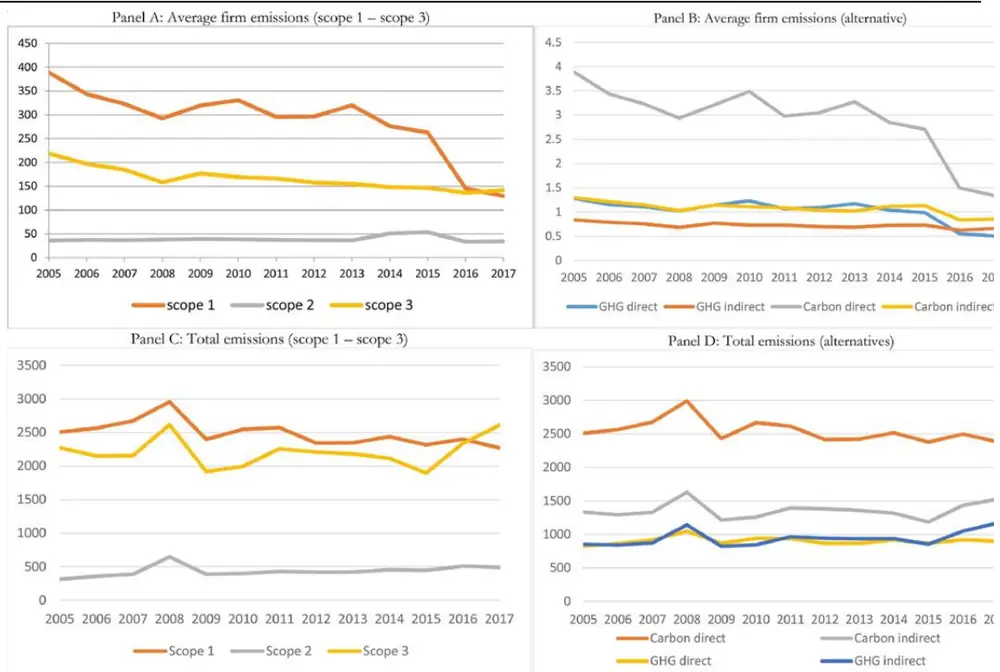
图 3：碳排放量的时间序列变动情况

| 2013 | 2223849 | 398491 | 2046741 | 335.82 | 39.22 | 159.69 |
| --- | --- | --- | --- | --- | --- | --- |
| 2014 |  |  |  |  |  |  |
|  | 2255386 | 425080 | 1979578 | 281.89 | 54.37 | 152.26 |
| 2015 | 2161598 | 419362 | 1783537 | 273.32 | 56.79 | 150.77 |
| 2016 | 1993060 | 404850 | 1874254 | 269.09 | 45.78 | 167.35 |
| 2017 | 1922550 | 404904 | 2149459 | 243.38 | 44.95 | 176.12 |

数据来源：《Do investors care about carbon risk?》，国泰君安证券研究
数据来源：《Do investors care about carbon risk?》

图 4：不同年份样本中公司数量
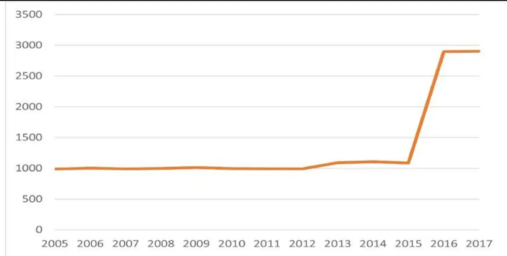
数据来源：《Do investors care about carbon risk?》

表 6：不同行业高碳排放公司数量

| GIC6 | Industry Name | # ofFirms | GIC6 | Industry Name | # ofFirms |
| --- | --- | --- | --- | --- | --- |
| 1 | Energy Equipment & Services | 75 | 37 | Tobacco | 9 |
| 2 | Oil, Gas & Consumable Fuels | 164 | 38 | Household Products | 12 |
| 3 | Chemicals | 81 | 39 | Personal Products | 15 |
| 4 | Construction Materials | 17 | 40 | Health Care Equipment & Supplies | 109 |
| 5 | Containers & Packaging | 21 | 41 | Health Care Providers & Services | 77 |
| 6 | Metals & Mining | 47 | 42 | Health Care Technology | 20 |
| 7 | Paper & Forest Products | 12 | 43 | Biotechnology | 203 |
| 8 | Aerospace & Defence | 46 | 44 | Pharmaceuticals | 87 |
| 9 | Building Products | 32 | 45 | Life Sciences Tools & Services | 34 |
| 10 | Construction & Engineering | 36 | 46 | Banks | 260 |
| 11 | Electrical Equipment | 54 | 47 | Thrifts & Mortgage Finance | 61 |
| 12 | Industrial Conglomerates | 16 | 48 | Diversified Financial Services | 28 |
| 13 | Machinery | 118 | 49 | Consumer Finance | 37 |
| 14 | Trading Companies & Distributors | 40 | 50 | Capital Markets | 92 |
| 15 | Commercial Services & Supplies | 69 | 51 | Mortgage Real Estate Investment Trusts(REITs) | 22 |
| 16 | Professional Services | 42 | 52 | Insurance | 111 |
| 17 | Air Freight & Logistics | 15 | 53 | Internet Software & Services | 100 |
| 18 | Airlines | 13 | 54 | IT Services | 102 |
| 19 | Marine | 27 | 55 | Software | 150 |
| 20 | Road & Rail | 31 | 56 | Communications Equipment | 47 |
| 21 | Transportation Infrastructure | 5 | 57 | Technology Hardware, Storage & Peripherals | 34 |
| 22 | Auto Components | 43 | 58 | Electronic Equipment, Instruments &Components | 82 |
| 23 | Automobiles | 8 | 59 | Semiconductors & Semiconductor Equipment | 103 |
| 24 | Household Durables | 64 | 60 | Diversified Telecommunication Services | 34 |
| 25 | Leisure Products | 21 | 61 | Wireless Telecommunication Services | 15 |
| 26 | Textiles, Apparel & Luxury Goods | 41 | 62 | Media | 49 |
| 27 | Hotels, Restaurants & Leisure | 95 | 63 | Entertainment | 22 |
| 28 | Diversified Consumer Services | 38 | 64 | Interactive Media & Services | 29 |
| 29 | Media | 83 | 65 | Electric Utilities | 42 |
| 30 | Distributors | 8 | 66 | Gas Utilities | 17 |
| 31 | Internet & Direct Marketing Retail | 45 | 67 | Multi-Utilities | 30 |
| 32 | Multiline Retail | 17 | 68 | Water Utilities | 13 |
| 33 | Specialty Retail | 110 | 69 | Independent Power and Renewable ElectricityProducers | 17 |
| 34 | Food & Staples Retailing | 27 | 70 | Equity Real Estate Investment Trusts (REITs) | 184 |
| 35 | Beverages | 17 | 71 | Real Estate Management & Development | 35 |
| 36 | Food Products | 57 | Total |  | 3917 |

数据来源：《Do investors care about carbon risk?》，国泰君安证券研究

表 7：不同行业的碳排放量

| GIC 6 | Scope 1 | GIC 6 |  | Scope 2 | GIC 6 |  | Scope 3 |  |
| --- | --- | --- | --- | --- | --- | --- | --- | --- |
|  | Pan | el A: Largest e |  | missions (avg | .) |  |  |  |
| 69 | 33300000 | 34 |  | 2163081 | 23 |  | 18700000 |  |
| 65 | 30700000 | 2363 |  | 2094174 | 36 |  | 11800000 |  |
| 18 | 17600000 |  |  | 1749360 | 37 |  | 6847386 |  |
| 67 | 17200000 |  |  | 1475783 | 12 |  | 6575213 |  |
| 6 | 6343545 | 7 |  | 1375637 | 35 |  | 6106099 |  |
| 2 | 6302663 | 60 |  | 1219956 | 2 |  | 6049237 |  |
| 17 | 4316221 |  | 1238 | 1014037 | 34 |  | 5882429 |  |
| 4 | 3827648 |  |  | 994783 |  | 38 |  | 4313762 |
| 73 | 3286922 | 322 |  | 825501 | 6 |  | 3580245 |  |
|  | 3280770 |  |  | 820777 | 22 |  | 3285134 |  |
|  | Pan | el B: Smallest |  | emissions (avg | .) |  |  |  |
| 47 | 601 | 47 |  | 1756 | 47 |  | 15193 |  |
| 50 | 6767 | 42 |  | 11824 | 51 |  | 27069 |  |
| 46 | 6965 | 19 |  | 21798 | 68 |  | 41182 |  |
| 49 | 7469 | 16 |  | 22653 | 42 |  | 64097 |  |
| 64 | 7649 | 43 |  | 24606 | 71 |  | 84764 |  |
| 51 | 8770 | 50 |  | 35404 | 70 |  | 102300 |  |
| 53 | 8898 | 51 |  | 36013 | 16 |  | 114132 |  |
| 55 | 9132 | 66 |  | 39177 | 46 |  | 116073 |  |
| 42 | 11657 | 45 |  | 44082 | 28 |  | 145311 |  |
| 16 | 17895 | 46 |  | 45627 | 43 |  | 151772 |  |

数据来源：《Do investors care about carbon risk?》，国泰君安证券研究

图 5：不同行业碳排放量标准差随时间变动情况
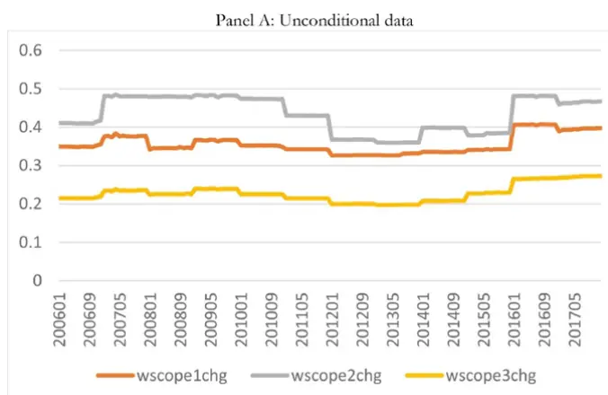
数据来源：《Do investors care about carbon risk?》

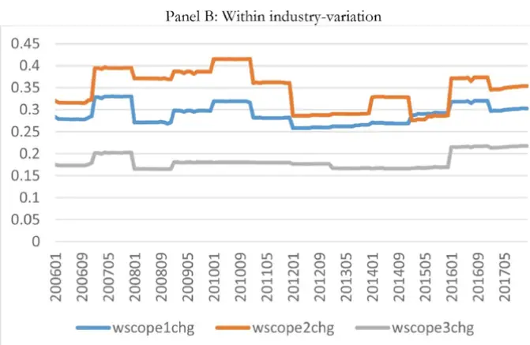

## 5. 碳排放风险的来源

## 5.1. 公司特征

本节以碳排放量三个指标作为因变量，分析公司特征对碳排放量的影响。公司特征包括：市值、BM、ROE、财务杠杆、投资比率，以及：赫芬达尔集中度指数HHI，用以衡量每个业务部门收入的多元化程度；厂房和设备价值的自然对数LOGPPE；公司上一年收益的市场β；上一年收益波动率VOLAT；经市值标准化的公司年收入SALESGR；经股价标准化的每股收益等指标。

表 8：公司截面特征数据

| Variable | Mean | Median | Std. Dev. |
| --- | --- | --- | --- |
| RET (%) | 1.14 | 1.08 | 10.84 |
| LOGSIZE | 8.25 | 8.25 | 1.57 |
| B/M (winsorized at 2.5%) | 0.50 | 0.39 | 0.41 |
| LEVERAGE (winsorized at 2.5%) | 0.24 | 0.22 | 0.18 |
| MOM (winsorized at 0.5%) | 0.15 | 0.11 | 0.45 |
| INVEST/A (winsorized at 2.5%) | 0.05 | 0.03 | 0.05 |
| ROE (winsorized at 2.5%, in %) | 9.76 | 11.32 | 21.23 |
| HHI | 0.82 | 1.00 | 0.24 |
| LOGPPE | 6.22 | 6.34 | 2.26 |
| BETA | 1.10 | 1.05 | 0.44 |
| VOLAT (winsorized at 0.5%) | 0.10 | 0.08 | 0.06 |
| SALESGR (winsorized at 0.5%) | 0.02 | 0.03 | 0.30 |
| EPSGR (winsorized at 0.5%) | 0.01 | 0.00 | 0.43 |

数据来源：《Do investors care about carbon risk?》，国泰君安证券研究

结果如表9所示，所有口径的总量和增量指标与公司规模正相关，但排放强度指标与规模无明显关系。此外，资本支出低、成长能力强的公司碳排放量较高。文章在附录表中表明，规模大、账面市销率和杠杆高的公司更有可能对外披露碳排放量数据。

表 9：碳排放量的影响因素

|  | (1) LOG | (2) LOG | (3) LOG | (4) ΔSCOPE | (5) ΔSCOPE | (6) ΔSCOPE | (7) SCOPE1 | (8) SCOPE 2 | (9) SCOPE 3 |
| --- | --- | --- | --- | --- | --- | --- | --- | --- | --- |
| Variables LOGSIZE | (SCOPE 1) 0.438*** | (SCOPE 2) 0.571*** | (SCOPE 3) 0.572*** | 1 0.026*** | 2 0.026*** | 3 0.027*** | INT -0.118* | INT 0.002 | INT -0.021** |
| B/M | (0.036) 0.464*** | (0.032) 0.555*** | (0.022) 0.562*** | (0.008) -0.033** | (0.008) -0.038 | (0.006) -0.041** | (0.063) -0.003 | (0.006) 0.003 | (0.009) 0.000 |
| ROE | (0.060) 0.006*** | (0.059) 0.006*** | (0.054) 0.007*** | (0.015) 0.002*** | (0.021) 0.002*** | (0.017) 0.001*** | (0.107) -0.002 | (0.010) -0.000 | (0.013) 0.000 |
| LEVERAGE | (0.001) 0.531** | (0.001) 0.625*** | (0.001) 0.574*** | (0.000) 0.026 | (0.001) 0.010 | (0.000) 0.019 | (0.002) 0.364 | (0.000) 0.002 | (0.000) -0.056* |
| INVEST/A | (0.196) -2.026*** | (0.188) -1.950*** | (0.162) -2.457*** | (0.020) 0.676*** | (0.030) 0.706*** | (0.023) 0.530*** | (0.230) -0.586 | (0.030) -0.067 | (0.030) -0.446** |
| HHI | (0.489) -1.044*** | (0.460) -0.569*** | (0.432) -0.499*** | (0.145) 0.014 | (0.132) -0.024 | (0.117) 0.023** | (1.161) -2.185*** | (0.153) 0.009 | (0.201) -0.260*** |
| LOGPPE | (0.119) 0.376*** | (0.081) 0.372*** | (0.063) 0.317*** | (0.021) 0.033*** | (0.024) 0.034*** | (0.008) 0.030*** | (0.497) 0.127*** | (0.030) 0.025*** | (0.062) 0.026*** |
| SALESGR | (0.036) 0.237*** | (0.037) 0.190** | (0.023) 0.231** | (0.005) 0.311*** | (0.006) 0.343*** | (0.006) 0.320*** | (0.042) -0.085 | (0.007) -0.019** | (0.007) 0.010 |
| EPSGR | (0.059) 0.137** | (0.062) 0.146** | (0.077) 0.144** | (0.042) -0.005 | (0.041) -0.011 | (0.030) 0.001 | (0.070) 0.009 | (0.007) 0.006** | (0.024) -0.002 |
| Year/month | (0.049) Yes | (0.049) Yes | (0.050) Yes | (0.008) Yes | (0.012) Yes | (0.006) Yes | (0.038) | (0.003) | (0.006) |
| F.E. Industry F.E. | Yes | Yes | Yes | Yes | Yes | Yes | Yes Yes | Yes Yes | Yes |
| Observations R-squared | 189,187 0.899 | 189,115 0.849 | 189,283 0.905 | 156,506 0.150 | 156,410 0.136 | 156,578 0.320 | 189,283 0.786 | 189,283 0.650 | Yes 189,283 0.935 |

数据来源：《Do investors care about carbon risk?》，国泰君安证券研究

## 5.2. 传统风险因子的解释能力

本节通过时间序列模型分析碳排放风险因子能否由已有的风险因子解释，构建时间序列模型

$$
a_{1,t}=c_{0}+cF_{t}+\varepsilon_{t}
$$

其中 $a_{1,t}$ 是上一节通过横截面方法得到的碳排放风险因子， $\boldsymbol{F}_{t}$ 为一系列风险因子，包括MKTRF、HML、SMB、MOM、CMA等经典因子，来自于Ken French；BAB是长期投资于低 β股票而短期投资于高β 股票的投资组合的月收益；LIQ 是Pastor和Stambaugh构建的流动性因子。

表11-表 13表明，在控制了若干风险因子后，基于碳排放总量和碳排放增量的碳风险溢价依然显著，基于碳排放强度的碳风险溢价不明显。总体上，碳溢价无法用已知的风险因素来解释。这一结果加强了在上一节中的发现，即碳排放水平包含有关平均收益横截面的独特信息。

表 10：时间序列模型变量表

| Variable | Mean | Median | Std. Dev. |
| --- | --- | --- | --- |
| MKTRF (in %) | 0.70 | 1.06 | 4.08 |
| HML (in %) | 0.00 | -0.22 | 2.57 |
| SMB (in %) | 0.07 | 0.04 | 2.26 |
| MOM (in %) | 0.07 | 0.36 | 4.53 |
| CMA (in %) | 0.02 | -0.06 | 1.39 |
| BAB (in %) | 0.49 | 0.74 | 2.66 |
| LIQ (in %) | 0.15 | 0.38 | 3.59 |

数据来源：《Do investors care about carbon risk?》，国泰君安证券研究

表 11：基于碳排放总量风险溢价的时间序列回归

| Variables | LOG (SCOPE 1 TOT) (1) | (2) | LOG (SCOPE 2 TOT) (3) (4) | LOG (SCOPE 3 TOT) (5) | (6) |
| --- | --- | --- | --- | --- | --- |
| MKTRF |  | -1.176 | 3.298*** |  | 3.429** |
| HML |  | (0.714) | (1.084) |  | (1.357) |
|  |  | -6.020*** | -4.284** |  | -6.444** |
| SMB | (1.598) -0.331 |  | (1.759) 1.184 |  | (2.537) 1.539 |
| MOM | (0.887) 0.399 |  | (2.858) -3.853** |  | (1.840) -3.580*** |
| CMA |  | (0.559) 0.086*** | (1.721) |  | (1.281) 0.116*** |
| BAB | (0.028) 0.772 |  | 0.053 (0.036) |  | (0.036) 1.581 |
| LIQ |  | (0.824) | 0.303 (1.749) |  | (1.681) |
| NET ISSUANCE | 2.658*** (0.768) |  | 0.816 (1.135) |  | 3.094*** (1.016) |
|  | 1.250 (1.015) |  | -1.603 (2.207) |  | 0.376 (2.352) |
| IDIO VOL |  | 1.566** | 0.986 (1.332) |  | 0.414 (1.319) |
| Constant | 0.058** (0.026) | (0.723) 0.053** | 0.085** 0.070*** | 0.103*** | 0.065** (0.027) |
| Industry adj. | No | (0.023) No | (0.037) No | (0.027) No | (0.035) No |
| Adj. R2 Observations | 0.001 | 0.331 | 0.001 | 0.335 | No 0.001 0.247 |

数据来源：《Do investors care about carbon risk?》，国泰君安证券研究

表 12：基于碳排放增量风险溢价的时间序列回归

| Variables | ΔSCOPE 1 |  | ΔSCOPE 2 |  | ΔSCOPE 3 |  |
| --- | --- | --- | --- | --- | --- | --- |
|  | (1) | (2) | (3) | (4) | (5) | (6) |
| MKTRF |  | 4.847 |  | -2.463 |  | 8.303 |
| HML |  | (5.605) |  | (2.516) |  | (8.965) |
|  |  | -8.427** |  | -5.897* |  | -17.483** |
| SMB |  | (3.853) |  | (3.362) |  | (7.113) |
|  |  | -15.284** |  | -9.960* |  | -23.109* |
| MOM |  | (6.419) |  | (5.667) |  | (13.738) |
|  |  | 3.223 |  | 3.703 |  | 9.171 |
| CMA |  | (4.704) |  | (2.727) |  | (8.912) |
|  |  | -0.159* |  | -0.153*** |  | -0.468*** |
| BAB |  | (0.087) |  | (0.058) |  | (0.168) |
|  |  | -8.919*** |  | 2.396 |  | 11.861 |
| LIQ |  | (3.255) |  | (2.036) |  | (8.199) |
|  |  | 0.808 |  | -1.343 |  | 9.512* |
| NET ISSUANCE |  | (2.495) |  | (2.342) |  | (4.847) |
|  |  | 4.702 |  | 1.724 |  | 15.976 |
| IDIO VOL |  | (5.262) |  | (4.821) |  | (13.211) |
|  |  | 3.851 |  | 6.477* |  | 16.111 |
| Constant |  | (6.820) |  | (3.474) |  | (11.811) |
|  | 0.640*** | 0.643*** | 0.435*** | 0.463*** | 1.559*** | 1.424*** |
| Industry adj. | (0.089) | (0.120) | (0.065) | (0.063) | (0.237) | (0.250) |
|  | No | No | No | No | No | No |
| Adj. R2 | 0.001 | 0.107 | 0.001 | 0.178 | 0.001 | 0.290 |
| Observations | 144 | 144 | 144 | 144 | 144 | 144 |

数据来源：《Do investors care about carbon risk?》，国泰君安证券研究

表 13：基于碳排放强度风险溢价的时间序列回归

| Variables | SCOPE 1 INT (1) (2) | SCOPE 2 INT (3) (4) | SCOPE 3 INT (5) | (6) |
| --- | --- | --- | --- | --- |
| MKTRF | -0.793*** | 1.790 |  | 0.820 (0.880) |
| HML | (0.177) -0.927*** |  | (2.810) -6.181 | -4.063** |
| SMB | (0.315) -1.027** |  | (4.340) -9.486 | (1.635) -0.722 |
| MOM | (0.519) 0.855*** |  | (6.371) -1.195 | (1.214) -0.449 |
| CMA | (0.214) 0.001 |  | (2.970) 0.008 | (0.597) 0.039 |
| BAB | (0.007) 0.302 |  | (0.101) -4.055 | (0.031) -0.645 |
| LIQ | (0.391) 0.229 (0.297) |  | (3.961) 0.372 (2.942) | (0.915) 2.608*** (0.800) |

| NET ISSUANCE |  | 0.445 (0.304) |  | -6.006 (5.742) |  | -0.139 (1.159) |
| --- | --- | --- | --- | --- | --- | --- |
| IDIO VOL |  | 0.333 (0.293) |  | 8.908*** (3.069) |  | 0.424 (0.723) |
| Constant | -0.006 (0.008) | -0.004 (0.007) | 0.121 (0.102) | 0.181* (0.097) | 0.018 (0.027) | 0.012 (0.028) |
| Industry adj. | No | No | No | No | No | No |
| Adj. R2 | 0.001 | 0.413 | 0.001 | 0.135 | 0.001 | 0.104 |
| Observations | 156 | 156 | 156 | 156 | 156 | 156 |

数据来源：《Do investors care about carbon risk?》，国泰君安证券研究

## 5.3. 机构投资者撤资行为

一些机构投资者可能实施可持续投资政策，而有意避开碳排放量高的公司；对于已有头寸的公司，可能撤出资金。本节使用下面的模型分析机构投资者持股比例与碳排放量的关系。

$$
IO_{i,t}=d_{0}+d_{1}Emission_{j,t}+d_{2}Controls_{j,t}+\varepsilon_{i,t}
$$

表15表明，碳排放量对机构投资者持股行为确实会产生影响，口径1的排放量增加一个标准差对应咨询公司、保险公司和养老基金的持股比例分别下降 21%、5%和 4%.但机构持股下降并不能解释碳排放风险溢价，表明机构并不会根据碳排放量筛选公司，机构持股不是碳风险溢价的主要来源。

表16表明，除了那几个高碳排放行业以外，其他行业没有任何发现机构持股减少的现象，对于不同类别的投资者都是如此。这一现象表明，机构投资者减少特定公司持股比例是为了从某些行业中抽身，而非针对于特定公司。在附录中的补充检验表明，机构并没有针对碳排放总量减少持股，而是减少对碳排放增量和碳排放强度高的公司持股，且这一现象对于养老基金尤其明显。

表 14：公司所有权数据

| Variable | Mean | Median | Std. Dev. |
| --- | --- | --- | --- |
| IO (in %) | 76.84 | 82.93 | 22.22 |
| IO_BANKS (in %) | 0.10 | 0.07 | 0.16 |
| IO_INSURANCE (in %) | 0.35 | 0.13 | 3.11 |
| IO_INVESTCOS. (in %) | 18.19 | 18.37 | 8.64 |
| IO_ADVISERS (in %) | 43.94 | 46.11 | 15.39 |
| IO_PENSIONS (in %) | 3.40 | 3.51 | 2.31 |
| IO_HFS (in %) | 10.87 | 7.73 | 10.04 |
| PRINV (winsorized at 0.5%) | 0.05 | 0.03 | 0.11 |
| VOLAT (winsorized at 0.5%) | 0.10 | 0.08 | 0.06 |
| VOLUME (in $million) (winsorized at 2.5%) | 0.44 | 0.21 | 0.56 |
| NASDAQ | 0.30 | 0.00 | 0.46 |
| SP500 | 0.37 | 0.00 | 0.48 |

数据来源：《Do investors care about carbon risk?》，国泰君安证券研究

表 15：机构投资者持股与碳排放量
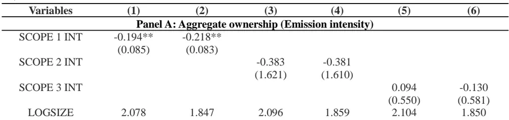
数据来源：《Do investors care about carbon risk?》，国泰君安证券研究

表 16：剔除碳排放量高的公司后碳排放量与机构持股相关性更不明显

| Variables | (1) | (2) | (3) | (4) | (5) | (6) |
| --- | --- | --- | --- | --- | --- | --- |
| Panel A: Aggregate ownership |  |  |  |  |  |  |
| SCOPE 1 INT | -0.015 (0.094) | -0.007 (0.104) |  |  |  |  |
| SCOPE 2 INT |  |  | -0.565 (1.968) | -0.525 (2.024) |  |  |
| SCOPE 3 INT |  |  |  |  | 0.421 (0.538) | 0.246 (0.568) |
| Controls | Yes | Yes | Yes | Yes | Yes | Yes |
| Year/month F.E. State fixed effect | Yes | Yes | Yes | Yes | Yes | Yes |
| Observations | No | Yes | No | Yes | No | Yes |
| R-squared | 152,799 | 143,337 | 152,799 | 143,337 | 152,799 | 143,337 |
|  | 0.126 | 0.169 | 0.126 | 0.169 | 0.127 | 0.170 |
| Panel B: Disaggregate ownership |  |  |  |  |  |  |
| Variables | (1) Banks | (2) Insurance | (3) Invest. Cos. | (4) Advisers | (5) Pensions | (6) Hedge Funds |
| SCOPE 1 INT | 0.001* (0.000) | -0.013 (0.012) | -0.059 (0.041) | -0.060 (0.078) | 0.009 (0.010) | 0.114 (0.068) |
| SCOPE 2 INT | 0.006 (0.006) | -0.298* (0.164) | -0.320 (0.487) | -0.224 (1.252) | 0.051 (0.124) | 0.261 (0.523) |
| SCOPE 3 INT | 0.004* (0.002) | -0.015 (0.077) | 0.063 (0.125) | 0.436 (0.376) | 0.041 (0.031) | -0.282 (0.170) |
| Controls | Yes | Yes | Yes | Yes | Yes | Yes |
| Year/month F.E. | Yes | Yes | Yes | Yes | Yes | Yes |
| State fixed effect | Yes | Yes | Yes | Yes | Yes | Yes |
| Observations | 143,337 | 143,337 | 143,337 | 143,337 | 143,337 | 143,337 |

数据来源：《Do investors care about carbon risk?》，国泰君安证券研究

## 5.4. 投资者认知程度

投资者对碳风险认识的不断变化也可能影响股票收益中的碳溢价。尤其是，人们期望对气候变化的认识更高的时期将具有更高的碳溢价。

## 5.4.1. 《巴黎协定》的影响

本节分析了 2015 年《巴黎协定》前后碳风险溢价的变化。《巴黎协定》可能既提高了人们对与碳排放有关的风险的认识，也提高了限制碳排放的监管干预措施的预期。因此，碳风险溢价应该在2015年之后增加。

表 表明，基于三个口径的碳排放风险溢价在 年子期间确实更大，对于口径1和口径2 尤其如此。这一现象表明投资者在《巴黎协定》签订后更加关注碳排放风险。值得注意的是，在2015 年之后样本中增加了很多新公司，作者在附录中讨论了这一问题并发现 2015 年之后风险溢价的提高主要归因于新增加的公司，且剔除了这些新公司后碳风险溢价变得很小。但作者认为这一现象并不意味着 2015 年之后投资者不再对碳排放风险定价，而认为可能是统计误差。

本节进一步检验了《巴黎协定》与股票收益之间的关系，构建以下模型，分析高碳排放量（实验组）和低碳排放量（对照组）股票收益的差异。

$$
RET_{i,t}=e_{0}+e_{1}TREAT*AFTER_{j,t}+e_{2}Controls+e_{3}\mu_{i}+\varepsilon_{i,t}
$$

其中TREAT是区分实验组与对照组的虚拟变量，AFTER是区分《巴黎协定》（2015年12月）之前与之后的虚拟变量，Controls包含一系列公司特征变量。

表 18 表明，基于口径 1 的排放量对收益具有强大而积极的影响，但其他两个口径却没有显著影响。此外，口径3的排放强度具有很强的负系数，而其他两个口径的强度影响并不显著。这一现象的原因可能是收益中噪声过大造成统计误差，或者投资者信念调整较为缓慢。

表 17：碳排放量和股票收益：时间区间子样本检验

|  | 2005-2015 |  |  | 2016-2017 |  |  |
| --- | --- | --- | --- | --- | --- | --- |
| Variables | (1) | (2) | (3) | (4) | (5) | (6) |
| Panel A: Total emissions |  |  |  |  |  |  |
| LOG (SCOPE 1 TOT) | 0.127*** (0.037) |  |  | 0.205** (0.075) |  |  |
| LOG (SCOPE 2 TOT) |  | 0.127*** (0.042) | 0.265*** |  | 0.233** (0.087) | 0.340*** |
| LOG (SCOPE 3 TOT) |  |  | (0.086) |  |  | (0.107) |
| Controls | Yes | Yes | Yes | Yes | Yes | Yes |
| Year/month F.E. | Yes | Yes | Yes | Yes | Yes | Yes |
| Industry F.E. Observations | Yes | Yes | Yes 121,778 | Yes | Yes | Yes 62,606 |
| R-squared | 121,694 0.268 | 121,622 0.269 | 0.269 | 62,594 0.115 | 62,594 0.115 | 0.115 |
| Panel B: Growth rate in total emissions |  |  |  |  |  |  |
| Variables ∆SCOPE 1 | (1) | (2) | (3) | (4) | (5) | (6) |
|  | 0.610*** (0.161) | 0.265*** |  | 0.629** (0.249) | 0.459** |  |
| ∆SCOPE 2 |  | (0.097) |  |  | (0.193) |  |
| ∆SCOPE 3 |  |  | 1.259*** (0.355) |  |  | 1.032** (0.436) |
| Controls | Yes | Yes | Yes | Yes | Yes | Yes |
| Year/month F.E. | Yes | Yes | Yes | Yes | Yes | Yes |
| Industry F.E. | Yes | Yes | Yes | Yes | Yes | Yes |
| Observations | 108,888 | 108,804 | 108,948 | 44,163 | 44,151 | 44,175 |
| R-squared | 0.278 | 0.279 | 0.279 | 0.089 | 0.089 | 0.089 |
| Panel C: Emission intensity |  |  |  |  |  |  |
| Variables | (1) | (2) | (3) | (4) | (5) | (6) |
| Variables | (1) | (2) | (3) | (4) | (5) | (6) |
| Panel A: Total emissions |  |  |  |  |  |  |
| TREAT1*AFTER | 10.615*** (1.175) |  |  | 10.705*** (1.200) |  |  |
| TREAT2*AFTER |  | -1.783 (5.861) |  |  | -1.681 (5.821) |  |
| TREAT3*AFTER |  |  | -8.917 (6.081) |  |  | -8.782 (6.127) |
| Controls | Yes | Yes | Yes | Yes | Yes | Yes |
| Firm F.E. | Yes | Yes | Yes | Yes | Yes | Yes |
| Year/month F.E. | Yes | Yes | Yes | Yes | Yes | Yes |
| Industry F.E. | No | No | No | Yes | Yes | Yes |
| Observations | 5,452 | 6,604 | 6,604 | 5,452 | 6,604 | 6,324 |
| Panel B: Growth rate in total emissions |  |  |  |  |  |  |
| TREAT1*AFTER | 0.438 |  |  | 4.425 (3.373) |  |  |
| TREAT2*AFTER | (4.426) | -3.712 (3.541) |  |  | 0.361 (2.592) |  |
| TREAT3*AFTER |  |  | 0.396 (4.338) |  |  | 3.671 (3.927) |
| Controls | Yes | Yes | Yes | Yes | Yes | Yes |
| Firm F.E. | Yes | Yes | Yes | Yes | Yes | Yes |
| Year/month F.E. | Yes | Yes | Yes | Yes | Yes | Yes |
| Industry F.E. | No | No | No | Yes | Yes | Yes |
| Observations | 5,764 | 5,706 | 5,901 | 5,764 | 5,706 | 5,901 |
| Panel C: Emission intensity |  |  |  |  |  |  |
| TREAT1*AFTER | 2.825 |  |  | 2.855 (5.994) |  |  |
| TREAT2*AFTER | (5.876) | -0.016 (5.344) |  |  | 0.021 (5.417) |  |
| TREAT3*AFTER |  |  | -7.614*** (2.070) |  |  | -7.749*** (2.128) |
| Controls | Yes | Yes | Yes | Yes | Yes | Yes |
| Firm F.E. | Yes | Yes | Yes | Yes | Yes | Yes |
| Year/month F.E. | Yes | Yes | Yes | Yes | Yes | Yes |
| Industry F.E. | No | No | No | Yes | Yes | Yes |
| Observations | 4,540 | 4,853 | 4,736 | 4,540 | 4,853 | 4,736 |

| SCOPE 1 INT | 0.005 (0.007) | 0.010 (0.019) |  |  |  |  |
| --- | --- | --- | --- | --- | --- | --- |
| SCOPE 2 INT |  | 0.091 (0.094) |  |  | 0.117 (0.125) |  |
| SCOPE 3 INT |  |  | 0.030 (0.091) |  |  | 0.040 (0.087) |
| Controls | Yes | Yes | Yes | Yes | Yes | Yes |
| Year/month F.E. | Yes | Yes | Yes | Yes | Yes | Yes |
| Industry F.E. | Yes | Yes | Yes | Yes | Yes | Yes |
| Observations | 121,778 | 121,778 | 121,778 | 62,606 | 62,606 | 62,606 |
| R-squared | 0.268 | 0.268 | 0.268 | 0.114 | 0.114 | 0.114 |

数据来源：《Do investors care about carbon risk?》，国泰君安证券研究
数据来源：《Do investors care about carbon risk?》，国泰君安证券研究

表 18：《巴黎协定》的签署与股票收益的关系

## 5.4.2. 与 1990 年代对比

1990年代气候变化和碳排放尚未成为突出问题，而在最近二十年中，大气中二氧化碳的积累和屡破纪录的温度使气候变化逐渐引起广泛关注。因此，如果碳风险溢价与人的认知密切相关，那么1990 年代的溢价应该更低。

由于碳排放水平是高度自相关的，并且碳排放的横截面变化随时间变化是稳定的，本节假设1990年代每个有股票交易的公司的碳排放强度（INT）等于 2005-2017 年期间首次正式报告的数值。并通过碳排放强度与公司销售额的乘积来估算1990-1999年公司的碳排放总量。

表 19 表明，1990 年代几乎没有明显的碳风险溢价，表明投资者尚未在此期间内化碳风险，而是在过去的二十年中随着气候变化、全球变暖的影响、可再生能源的技术进步等报告和政治行动逐渐认识到碳排放的问题。

表 19：碳排放和股票收益子样本检验

| Variables | (1) | (2) | (3) | (4) | (5) | (6) |
| --- | --- | --- | --- | --- | --- | --- |
| Panel A: (2005-2017) |  |  |  |  |  |  |
| LOG (SCOPE 1 TOT) | 0.097*** (0.024) | 0.186*** (0.043) |  | 0.291*** (0.046) | 0.336*** (0.065) | 0.585*** |
| LOG (SCOPE 2 TOT) |  |  | 0.245*** |  |  |  |
| LOG (SCOPE 3 TOT) |  | Yes | (0.043) Yes |  | Yes | (0.127) Yes |
| Controls Year/month F.E. | Yes Yes | Yes | Yes | Yes Yes | Yes | Yes |
| Industry F.E. | No | No | No | Yes | Yes | Yes |
| Observations | 161,122 | 161,062 | 161,313 | 161,122 | 161,062 | 161,313 |
| R-squared | 0.199 | 0.200 | 0.200 | 0.203 | 0.203 | 0.204 |
| Panel B: (1990-1999) -0.037 |  |  |  |  |  |  |
| LOG (SCOPE 1 TOT) | (0.034) | 0.033 |  | 0.082 (0.078) | 0.236 |  |
| LOG (SCOPE 2 TOT) |  | (0.045) | 0.005 |  | (0.134) | 0.318* |
| LOG (SCOPE 3 TOT) |  |  | (0.059) |  |  | (0.162) |
| Controls | Yes | Yes | Yes | Yes | Yes | Yes |
| Year/month F.E. | Yes | Yes | Yes | Yes | Yes | Yes |
| Industry F.E. | No | No | No | Yes | Yes | Yes |
| Observations | 59,878 0.149 | 59,878 0.149 | 59,878 0.149 | 59,878 0.156 | 59,878 0.156 | 59,878 0.156 |

数据来源：《Do investors care about carbon risk?》，国泰君安证券研究

## 6. 碳排放量对股票收益的影响

本节通过截面回归的方法分析碳排放量对股票收益的影响，分别将三个口径的碳排放量指标作为自变量，构建截面回归模型。

$$
RET_{i,t}=a_{0}+a_{1}LOG(TOTEmissions)_{i,t}+a_{2}Controls_{i,t-1}+\mu_{t}+\varepsilon_{i,t}
$$

其中控制变量包括一系列公司特征，如表8 所示。

表20-表22表明，在控制了公司特征之后，三个口径的碳排放总量和碳排放强度对收益都有显著影响，而碳排放强度无显著影响。且在公司特征中杠杆的影响是不可忽视的。表中（4）-（6）列中添加了行业固定效应。结果表明，行业对于碳排放具有显著影响，相比于没有行业影响的模型（1-3 列），相关系数了增加 70%-280%.考虑到模型使用了同期数据分析，本文通过附录中的补充检验排除了前瞻性问题的影响。

第4节的分析表明，只有少数行业产生了大量的碳排放，且在碳排放量对股票收益的影响中，行业因素吸收了公司因素。本节通过剔除少数几个碳排放量极高的行业，尝试分析公司层面因素的影响。并从样本中分别剔除了碳排放最高的行业以及新上市的公司，对于三个口径的排放强度指标再次统计，得到的结果如图7-图 8所示。

表23表明，剔除了碳排放量最高的几个行业之后，公司层面的碳风险溢价更加明显。这一发现暗示，在碳排放量整体高的行业中，投资者对公司层面的碳风险溢价差异并不那么敏感。

表 20：碳排放总量（TOT）对截面收益的影响

| Variables | (1) | (2) | (3) | (4) | (5) | (6) |
| --- | --- | --- | --- | --- | --- | --- |
| LOG (SCOPE 1 TOT) | 0.043** (0.023) |  |  | 0.164*** (0.036) |  |  |
| LOG (SCOPE 2 TOT) |  | 0.098** |  |  | 0.167*** |  |
| LOG (SCOPE 3 TOT) |  | (0.042) | 0.135** |  | (0.048) | 0.312*** |
| LOGSIZE | -0.140 | -0.184 | (0.046) -0.193 | -0.302* | -0.327* | (0.071) -0.410** |
| B/M | (0.163) 0.460 | (0.167) 0.469 | (0.165) 0.444 | (0.148) 0.656** | (0.154) 0.642** | (0.163) 0.562** |
| LEVERAGE | (0.260) -0.559* | (0.266) -0.579* | (0.258) -0.498* | (0.234) -0.699*** | (0.229) -0.712*** | (0.224) -0.790*** |
| MOM | (0.272) 0.321 | (0.280) 0.348 | (0.274) 0.338 | (0.177) 0.284 | (0.171) 0.294 | (0.167) 0.301 |
| INVEST/A | (0.276) -2.218 | (0.272) -1.914 | (0.274) -1.587 | (0.291) 0.277 | (0.290) 0.267 | (0.290) 0.699 |
| ROE | (1.740) 0.010* | (1.794) 0.009 | (1.838) 0.008 | (2.111) 0.009* | (2.126) 0.009* | (2.082) 0.007* |
| HHI | (0.005) 0.032 | (0.005) -0.026 | (0.005) 0.137 | (0.004) 0.130* | (0.004) 0.052 | (0.004) 0.111 |
| LOGPPE | (0.110) -0.015 | (0.112) -0.027 | (0.101) -0.045 | (0.072) 0.020 | (0.073) 0.019 | (0.071) -0.017 |
| BETA | (0.100) 0.059 | (0.088) 0.023 | (0.090) 0.047 | (0.058) 0.045 | (0.058) 0.040 | (0.057) 0.063 |
| VOLAT | (0.131) 0.978 | (0.131) 0.674 | (0.130) 0.749 | (0.148) 0.622 | (0.147) 0.501 | (0.146) 0.549 |
| SALESGR | (3.571) 0.692 | (3.415) 0.688 | (3.506) 0.672 | (3.290) 0.679 | (3.285) 0.686 | (3.269) 0.648 |
| EPSGR | (0.429) 0.592** | (0.430) 0.589** | (0.420) 0.575** | (0.412) 0.637** | (0.412) 0.636** | (0.407) 0.615** |
| Year/month F.E. | (0.234) Yes | (0.231) Yes | (0.232) Yes | (0.231) Yes | (0.233) Yes | (0.227) Yes |
| Industry F.E. | No | No | No | Yes | Yes | Yes |
| Observations | 184,288 | 184,216 | 184,384 | 184,288 | 184,216 | 184,384 |
| R-squared | 0.203 | 0.204 | 0.204 | 0.206 | 0.206 | 0.206 |

数据来源：《Do investors care about carbon risk?》，国泰君安证券研究

表 21：碳排放增量（Δ）对截面收益的影响

| Variables | (1) | (2) | (3) | (4) | (5) | (6) |
| --- | --- | --- | --- | --- | --- | --- |
| ∆SCOPE 1 | 0.641*** |  |  | 0.627*** |  |  |
| ∆SCOPE 2 | (0.153) | 0.345** |  | (0.144) | 0.321** |  |
|  |  | (0.125) |  |  | (0.120) |  |
| ∆SCOPE 3 |  |  | 1.203*** (0.318) |  |  | 1.186*** (0.314) |
| LOGSIZE | -0.023 (0.110) | -0.013 (0.112) | -0.037 (0.111) | -0.107 (0.114) | -0.099 (0.115) | -0.121 (0.117) |
| B/M | 0.391 (0.232) | 0.388 (0.233) | 0.410* | 0.771** | 0.764** | 0.789*** |
| LEVERAGE | -0.433* (0.217) | -0.414* | (0.226) -0.441* | (0.257) -0.794*** | (0.257) -0.785*** | (0.246) -0.799*** |
| MOM | 0.204 (0.265) | (0.216) 0.217 | (0.213) 0.166 | (0.213) 0.160 | (0.217) 0.175 | (0.214) 0.124 |
| INVEST/A | -2.508 | (0.268) -2.244 | (0.267) -2.638 | (0.264) -0.620 | (0.266) -0.463 | (0.264) -0.807 |
| ROE | (1.820) 0.009** | (1.848) 0.009** | (1.867) 0.009** | (2.326) 0.008** | (2.291) 0.008** | (2.341) 0.009** |
| HHI | (0.004) -0.143 | (0.004) -0.112 | (0.004) -0.162 | (0.003) -0.072 | (0.003) -0.056 | (0.003) -0.089 |
| LOGPPE | (0.154) -0.006 | (0.153) -0.015 | (0.151) 0.006 | (0.098) 0.053 | (0.097) 0.045 | (0.102) 0.066 |
| BETA | (0.058) 0.109 | (0.057) 0.119 | (0.060) 0.106 | (0.041) 0.155 | (0.041) 0.166 | (0.044) 0.145 |
| VOLAT | (0.165) 1.853 | (0.165) 2.004 | (0.168) 1.800 | (0.158) 1.373 | (0.157) 1.504 | (0.162) 1.341 |
| SALESGR | (4.240) 0.459 | (4.226) | (4.274) | (4.072) | (4.075) | (4.107) |
|  |  | (0.454) | (0.430) | (0.429) | (0.434) |  |
|  |  |  |  | 0.641** | 0.641** | 0.636** |
|  | 0.573** | 0.573** | 0.568** |  |  |  |
|  |  | 0.544 | 0.280 | 0.463 | 0.549 | 0.284 |
|  | (0.447) |  |  |  |  |  |
|  |  |  |  |  |  | (0.402) |
| EPSGR |  |  |  |  |  |  |
|  | (0.247) | (0.246) | (0.250) | (0.263) | (0.263) | (0.266) |
| Year/month F.E. | Yes | Yes | Yes | Yes | Yes | Yes |
| Industry F.E. | No | No | No | Yes | Yes | Yes |
| Observations | 153,051 | 152,955 | 153,123 | 153,051 | 152,955 | 153,123 |
|  | 0.218 |  |  |  |  |  |
| R-squared |  | 0.218 | 0.218 |  |  |  |
|  |  |  |  | 0.221 | 0.221 | 0.222 |

数据来源：《Do investors care about carbon risk?》，国泰君安证券研究

表 22：碳排放强度（INT）对截面收益的影响

| Variables | (1) | (2) | (3) | (4) | (5) | (6) |
| --- | --- | --- | --- | --- | --- | --- |
| SCOPE 1 INT | -0.010 (0.012) |  |  | 0.005 |  |  |
| SCOPE 2 INT |  | 0.145 |  | (0.006) | 0.081 |  |
| SCOPE 3 INT |  | (0.121) | 0.055 |  | (0.074) | 0.048 |
| LOGSIZE | -0.154 | -0.133 | (0.033) -0.124 | -0.229 | -0.230 | (0.075) -0.229 |
| B/M | (0.169) 0.456 | (0.159) 0.470 | (0.164) 0.479* | (0.142) 0.732** | (0.141) 0.732** | (0.142) 0.732** |
| LEVERAGE | (0.264) -0.545* | (0.269) -0.558* | (0.258) -0.532* | (0.244) -0.608*** | (0.243) -0.606*** | (0.244) -0.603*** |
| MOM | (0.264) 0.332 | (0.269) 0.321 | (0.263) 0.317 | (0.195) 0.282 | (0.195) 0.282 | (0.196) 0.281 |
| INVEST/A | (0.277) -1.953 | (0.279) -2.047 | (0.279) -1.916 | (0.292) -0.041 | (0.292) -0.037 | (0.291) -0.022 |
| ROE | (1.815) 0.010* | (1.823) 0.010* | (1.867) 0.010* | (2.123) 0.010** | (2.127) 0.010** | (2.134) 0.010** |
| HHI | (0.005) -0.139 | (0.005) -0.069 | (0.005) 0.028 | (0.004) -0.032 | (0.004) -0.043 | (0.004) -0.030 |
| LOGPPE | (0.137) 0.034 | (0.113) 0.010 | (0.082) 0.006 | (0.074) 0.081 | (0.072) 0.079 | (0.067) 0.080 |
| BETA | (0.099) 0.047 (0.131) | (0.087) 0.045 (0.131) | (0.093) 0.051 | (0.065) 0.035 | (0.064) 0.034 | (0.066) 0.036 (0.148) |
| VOLAT | 1.027 (3.512) | 0.978 (3.527) | (0.131) 1.028 | (0.148) 0.577 | (0.148) 0.558 | 0.572 (3.300) |
| SALESGR | 0.709 (0.435) | 0.714 | (3.563) 0.712 | (3.296) 0.718 | (3.297) 0.719 (0.413) | 0.717 (0.413) |
| EPSGR | 0.600** (0.234) | (0.432) 0.600** (0.232) | (0.427) 0.600** (0.232) | (0.414) 0.660** (0.235) | 0.660** (0.236) | 0.661** (0.235) |
| Year/month F.E. | Yes | Yes | Yes | Yes | Yes | Yes |
| Industry F.E. | No | No |  |  |  |  |
| Observations | 184,384 | 184,384 | No 184,384 | Yes 184,384 | Yes 184,384 | Yes 184,384 |

数据来源：《Do investors care about carbon risk?》，国泰君安证券研究

图 6：基于碳排放总量的碳风险累计溢价
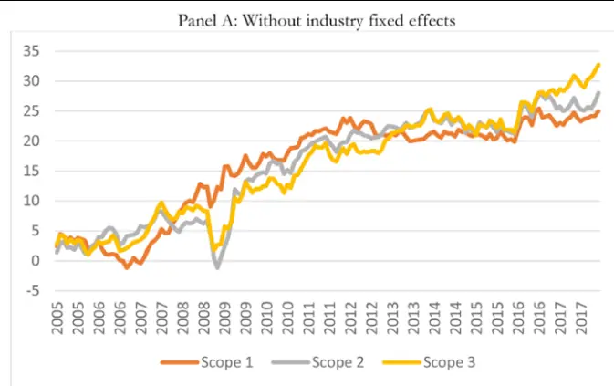
数据来源：《Do investors care about carbon risk?》

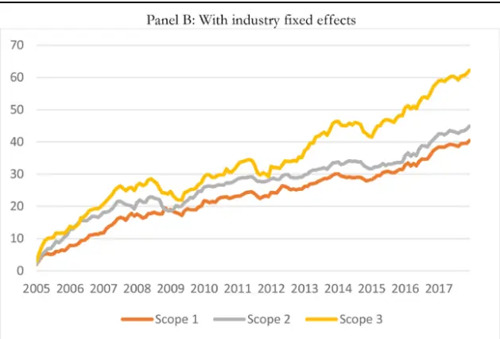

## 图 7：基于碳排放增量的碳风险累计溢价

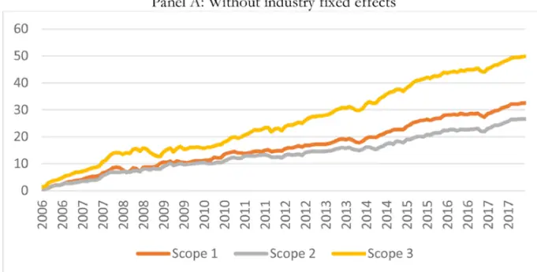
数据来源：《Do investors care about carbon risk?》

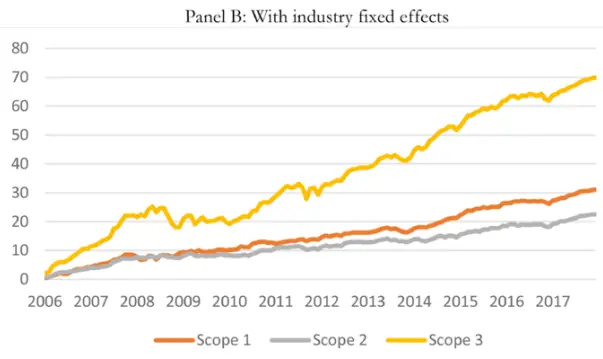

图 8：基于碳排放强度的碳风险累计溢价
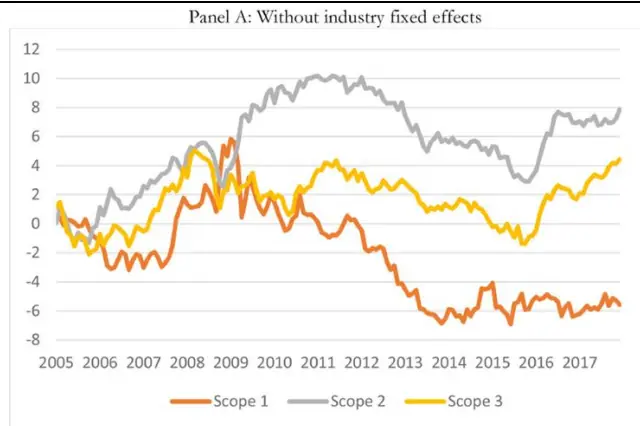
数据来源：《Do investors care about carbon risk?》

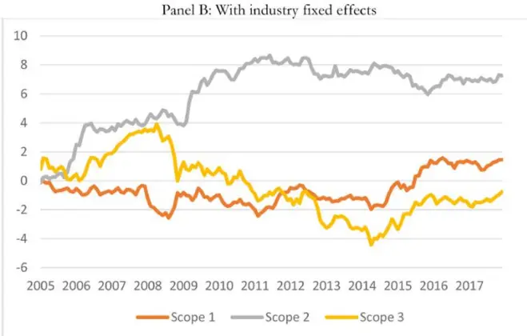

表 23：剔除碳排放量高的公司后碳排放量与股票收益相关性更高

| Variables | (1) | (2) | (3) | (4) | (5) | (6) |
| --- | --- | --- | --- | --- | --- | --- |
| Panel A: Total emissions |  |  |  |  |  |  |
| LOG (SCOPE 1 TOT) | 0.072** (0.025) |  |  | 0.177*** (0.044) |  |  |
| LOG (SCOPE 2 TOT) |  | 0.097** (0.039) |  |  | 0.227*** (0.057) |  |
| LOG (SCOPE 3 TOT) |  |  | 0.117** (0.048) |  |  | 0.324*** (0.074) |
| Controls Year/month F.E. | Yes | Yes Yes | Yes Yes | Yes Yes | Yes Yes | Yes Yes |
| Industry F.E. | Yes No | No | No | Yes | Yes | Yes |
| Observations | 164,094 | 164,166 | 164,190 | 164,094 | 164,166 | 164,190 |
| R-squared | 0.213 | 0.213 | 0.213 | 0.216 | 0.216 | 0.216 |
|  |  | Panel B: Growth rate in total emissions |  |  |  |  |
| Variables ΔSCOPE 1 | (1) | (2) | (3) | (4) | (5) | (6) |
|  | 0.657*** (0.151) |  |  | 0.630*** (0.142) |  |  |
| ∆SCOPE 2 |  | 0.463*** (0.117) |  |  | 0.438*** (0.112) |  |
| ∆SCOPE 3 |  |  | 1.480*** (0.321) |  |  | 1.456*** (0.322) |
| Controls Year/month F.E. | Yes Yes | Yes Yes | Yes | Yes | Yes | Yes |
| Industry F.E. | No | No | Yes No | Yes Yes | Yes Yes | Yes |
| Observations | 135,522 | 135,570 | 135,594 | 135,522 | 135,570 | Yes |
|  |  | 0.230 |  | 0.233 |  | 135,594 |
| R-squared | 0.230 | Panel C: Emission intensity | 0.230 |  | 0.233 | 0.233 |
| (1) (2) (3) |  |  |  |  |  |  |
| Variables SCOPE 1 INT | 0.004 |  |  | (4) -0.012 | (5) | (6) |
|  | (0.016) |  |  | (0.016) |  |  |
| SCOPE 2 INT |  | 0.154 (0.102) |  |  | 0.150 |  |
| SCOPE 3 INT |  | 0.054 (0.035) |  |  |  | 0.160* (0.078) |
| Controls | Yes | Yes | Yes | Yes | Yes | Yes |
| Year/month F.E. | Yes | Yes | Yes | Yes | Yes | Yes |
| Industry F.E. | No | No | No | Yes | Yes | Yes |
| Observations | 164,190 | 164,190 | 164,190 | 164,190 | 164,190 | 164,190 |
| R-squared | 0.213 | 0.213 | 0.213 | 0.216 | 0.216 | 0.216 |

数据来源：《Do investors care about carbon risk?》，国泰君安证券研究

图 9：基于碳排放强度的碳风险累计溢价：全部样本和剔除碳排放最高的公司
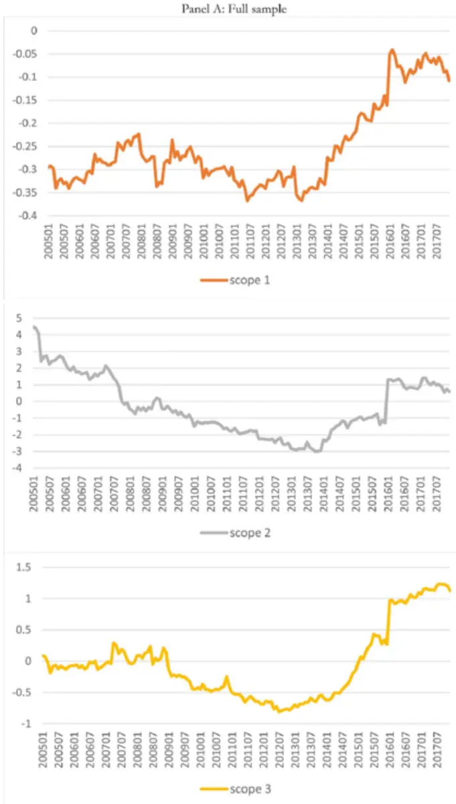

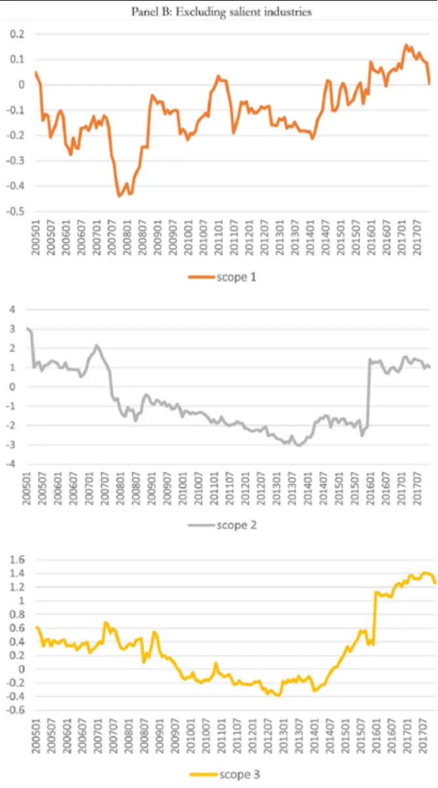
数据来源：《Do investors care about carbon risk?》

## 图 10：基于碳排放强度的碳风险累计溢价：剔除碳排放最高和新上市的公司

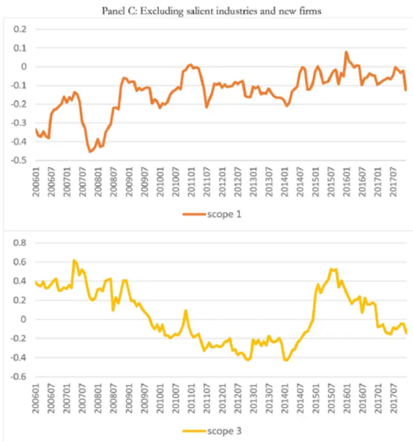
数据来源：《Do investors care about carbon risk?》

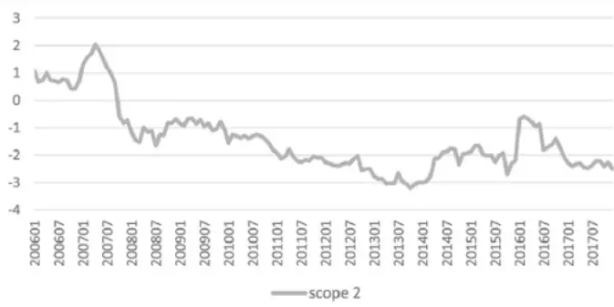

## 6.1. 盈利意外的影响

为了排除盈利意外的影响，从每月收益中减去收益公告日的收益，将剩余的部分作为因变量重新进行回归分析。结果如表24所示，结论与上面基本一致，表明碳风险溢价不是盈利意外。

表 24：剔除盈余公告收益的截面回归

| Variables | (1) | (2) | (3) | (4) | (5) | (6) |
| --- | --- | --- | --- | --- | --- | --- |
| Panel A: Total emissions |  |  |  |  |  |  |
| LOG (SCOPE 1 TOT) | 0.044* (0.024) |  |  | 0.152*** (0.031) |  |  |
| LOG (SCOPE 2 TOT) |  | 0.088** (0.040) |  |  | 0.150*** (0.044) |  |
| LOG (SCOPE 3 TOT) |  |  | 0.121** (0.047) |  |  | 0.279*** (0.067) |
| Controls Year/month F.E. | Yes Yes | Yes Yes | Yes Yes | Yes Yes | Yes Yes | Yes Yes |
| Industry F.E. | No | No | No | Yes | Yes | Yes |
| Observations | 184,288 | 184,216 | 184,384 | 184,288 | 184,216 | 184,384 |
| R-squared | 0.220 | 0.221 | 0.220 | 0.223 | 0.223 | 0.223 |
| ∆SCOPE 1 | Panel B: Growth rate in total emissions |  |  |  |  |  |
|  | 0.552*** (0.137) |  |  | 0.532*** (0.131) |  |  |
| ∆SCOPE 2 |  | 0.288** |  |  | 0.266** (0.108) |  |
| ∆SCOPE 3 |  | (0.111) | 0.896** |  |  | 0.882** |
|  |  |  | (0.313) |  |  | (0.316) |
| Controls | Yes | Yes | Yes | Yes | Yes | Yes |
| Year/month F.E. | Yes | Yes | Yes | Yes | Yes | Yes |
| Industry F.E. | No | No | No | Yes | Yes | Yes |
| Observations | 153,051 | 152,955 | 153,123 | 153,051 | 152,955 | 153,123 |
| R-squared | 0.235 | 0.236 | 0.235 | 0.239 | 0.239 | 0.239 |
|  |  |  | Panel C: Emission intensity |  |  |  |
| SCOPE 1 INT |  |  |  |  |  |  |
|  | -0.008 |  |  | 0.004 |  |  |
|  | (0.011) |  |  | (0.007) |  |  |
| SCOPE 2 INT |  | 0.155 |  |  | 0.079 |  |
|  |  | (0.124) |  |  |  |  |
|  |  |  |  |  | (0.068) |  |
| SCOPE 3 INT |  |  | 0.050 |  |  | 0.029 |
| (0.032) |  |  |  |  |  | (0.071) |
| Controls | Yes | Yes | Yes | Yes | Yes | Yes |
| Year/month F.E. | Yes | Yes | Yes | Yes | Yes | Yes |
| Industry F.E. | No | No | No | Yes | Yes | Yes |
| Observations R-squared | 184,384 0.220 | 184,384 0.220 | 184,384 0.220 | 184,384 0.223 | 184,384 0.223 | 184,384 0.223 |

数据来源：《Do investors care about carbon risk?》，国泰君安证券研究

## 7. 稳健性检验

第一，本文剔除了2008年金融危机期间重复检验，表明危机时期不会对结果产生明显影响。第二，使用Trucost行业分类替代GIC6 行业分类，结果没有明显差异。第三，在对《巴黎协定》前后的碳风险溢价的分析中排除了碳排放量最高的行业，结果并无二致。

第四，将样本按照是否主动披露分为两类，结果发现与未公开排放的企业相比口径1 排放总量的风险溢价较小，且显著程度较弱，表明不愿主动披露的公司可能已经采取了措施减少排放量。第五，将三个口径加总作为自变量，得到相同的结论。

第六，机构投资者对碳排放增量高的小规模公司持股较少，作者认为这可能是基于碳排放总量机械筛选的结果。第七，机构投资者对于碳排放量显著高的行业以外的行业的公司持股比例与公司碳排放量水平正相关，这可能也是机械筛选的结果。第八，公司市值、BM、PPE、杠杆等公司特征对于碳风险溢价也有显著影响，控制这些指标是有必要的。

第九，使用自然对数分析机构所有权与碳排放量的关系，并无明显差异。第十，仅使用 2005-2015 年的数据得到的碳风险溢价略小于 2005-2017区间，表明2015年之后碳风险溢价确实有明显上升。

## 8. 总结

## 8.1. 本文文献结论

气候变化如何影响股票收益？这一问题对于经济社会和投资决策都具有重要意义。本文通过基于碳排放总量和增量的横截面收益分析发现，碳排放与股票收益之间具有显著的正相关关系。但碳排放强度指标与股票收益之间不具有显著关系，两个具有相同碳排放强度的公司由于规模不同可能具有不同的碳排放总量；机构投资者可能根据碳排放总量筛选公司或行业，因而碳排放强度指标未受到重视。

本文通过研究发现碳排放风险溢价可能与某些公司特征、投资者持股偏好和投资者对碳排放风险的认识密切相关。少数行业的碳排放量很高，而在剔除了这些行业之后之后，规模大、资本支出低、成长能力强的公司更有可能受到机构关注。碳排放风险溢价并不能被已有的风险因子解释，表明这一风险中包含着解释股票收益的独特信息。此外，有关证据表明，随着碳排放和风险溢价逐渐被投资者认识，投资者正在开始对碳排放风险进行定价，其风险溢价逐渐扩大。

## 8.2. 我们的思考

有关ESG 价值的讨论涉及企业经营的目标，传统的观点认为应当最大化股东价值，较新的观点认为应该在目标中加入企业社会责任（ESG/CSR），更有甚者提出应当最大化所有利益相关方的价值。强调股东价值最大化符合自由竞争理论，但过分强调企业个体价值并不利于社会整体的福利。强调企业社会责任对于经济社会的持续高质量发展是有意义的，我国提出的2060碳中和目标，归根结底需要落实到企业经营和发展上。

本文提出的碳排放风险溢价是由于投资者承担了更多的风险，因此随着投资者认知的深入，从一开始的α异象逐渐转变为β 因子。这一因子的影响能力取决于监管政策的作用范围，如果对碳排放的限制仅集中于特定行业或个股，那么因子范围也仅针对于行业或个股层面；而在碳中和目标的大背景之下，我们预期有关碳排放的监管措施可能适用于所有碳排放行为，因此这一因子可能衡量了部分系统性风险。

碳排放风险不能仅仅理解为化石燃料的供应问题，在投资者普遍为碳排放风险定价的环境中，投资者可以根据风险偏好和需求配置合适的资产。碳排放风险因子会在投资组合中发挥越来越重要的作用。

ESG 投资发展仍面临两个问题。一是社会对 ESG 的认可以及公司披露有待强化，2015 年《巴黎协定》之后国际社会对于企业 ESG 的认可度大幅增加，ESG 的发展和普及尚有很长的路要走。我国ESG（CSR）方才起步，2020年沪深A 股中仅有 1000家企业发布社会责任报告。二是ESG 因子的构建，除了本文提出的碳排放风险因子以外还有更多的现象和因子有待发掘；且ESG因子可能与市值、成长能力等公司特征密切相关，如何提取出有效的ESG 因子仍需要进一步研究。

## 本公司具有中国证监会核准的证券投资咨询业务资格

## 分析师声明

作者具有中国证券业协会授予的证券投资咨询执业资格或相当的专业胜任能力，保证报告所采用的数据均来自合规渠道，分析逻辑基于作者的职业理解，本报告清晰准确地反映了作者的研究观点，力求独立、客观和公正，结论不受任何第三方的授意或影响，特此声明。

## 免责声明