inInfo] [Table_Title] 2021.06.10

# 天然气期货的高频交易模式是怎样的

## ——学界纵横系列之八

陈奥林(分析师)

刘昺轶(分析师)

8 021-38674835

021-38677309

chenaolin@gtjas.com

证书编号 S0880516100001

liubingyi@gtjas.com

S0880520050001

## 本报告导读：

天然气期货交易市场的高、低频交易具备怎么样的交易模式？

## 是否存在算法交易？

## 摘要：

le_Summary]分析工具方面：信号处理工具用于提取交易数据中的明显的交易模式，如非均匀傅立叶变化、Lomb-Scargle 谱分析。非均匀傅立叶变化是更有效的提取工具。

交易模式方面：交易中高频贸易普遍兴起，相对强度不断提升，频谱图高频成分相对强度持续增加。所有交易中每天一次的低频交易峰值最为突出。

算法交易方面：算法交易存在依据明显，频谱图中每分钟一次的交易，峰值突出，相对强度逐年提升。大量交易发生在每分钟的前几秒，尤其是第一秒，该规律正逐年增强。

观察本文结论，我们发现天然气期货市场中存在大规模的高频交易，算法交易盛行。广泛的算法交易存在本身很可能影响了市场行为，这可能放大了市场的波动性，使得市场对级联事件的反应更加快速、剧烈。

金融工程

## 金融工程团队：

陈奥林：（分析师）

电话：021-38674835

邮箱：chenaolin@gtjas.com

证书编号：S0880516100001

## 杨能：（分析师）

电话：021-38032685

邮箱：yangneng@gtjas.com

证书编号：S0880519080008

## 殷钦怡：（分析师）

电话：021-38675855

邮箱：yinqinyi@gtjas.com

证书编号：S0880519080013

## 徐忠亚：（分析师）

电话：021- 38032692

邮箱：xuzhongya@gtjas.com

证书编号：S0880120110019

## 刘昺轶：（分析师）

电话：021-38677309

邮箱：liubingyi@gtjas.com

证书编号：S0880520050001

## 吕琪：（研究助理）

电话：021-38674754

邮箱：lvqi@gtjas.com

证书编号：S0880120080008

## [Table_R相关报告

富国沪深 300ESG 基准 ETF 投资价值分析2021.06.08

碳排放量如何影响了股票收益 2021.06.08

金融板块基本面量化及策略配置 2021.06.01价值溢价的来源：预期偏差导致的错误定价2021.05.30

技术因子的非线性预测力 2021.05.30

## 1. 选题背景

随着计算能力的提升和美国、欧盟监管措施的变化，高频交易的规模迅速提升，算法交易对人工交易的替代性越来越强。据估计，高频交易公司的股票交易量占美国股票市场交易量的 60%以上，期货交易量占总交易量的50%。然而，快速的算法交易可能会放大市场固有的波动性，导致级联事件的发生，如 2010 年5 月6 日发生的闪电崩盘。

因此，分析市场的低频交易、高频交易的交易模式，检验算法交易的存在是理解市场非常重要的一点。通过傅立叶变化、Lomb Scargle 等信号处理工具，海外文献《Intraday Patterns in Natural Gas Futures: ExtractingSignals from High-Frequency Trading Data》在美国天然气期货市场上对这些问题进行了讨论。

## 2. 核心结论

分析工具方面：信号处理工具用于提取交易数据中的明显的交易模式，如非均匀傅立叶变化、Lomb-Scargle 谱分析。非均匀傅立叶变化是更有效的提取工具。

高频交易方面：交易中高频贸易普遍兴起，相对强度不断提升，频谱图高频成分相对强度持续增加。所有交易中每天一次的低频交易峰值最为突出。高频交易的特征近年来越来越明显，而且这一规律强于市场操作结构所产生的规律。

算法交易方面：算法交易存在依据明显，频谱图中每分钟一次的交易，峰值明显强于很大范围内的峰值，相对强度逐年提升。每年该特殊峰值都恰好出现在每分钟一次，这一精确性证明了市场中存在基于时间触发的算法交易。大量交易发生在每分钟的前5 秒，尤其是第一秒，且近年来这一现象愈发突出。这有力地证明天然气期货市场中存在算法交易，如 TWAP、VWAP。

观察本文结论，我们发现天然气期货市场中存在大规模的高频交易，算法交易盛行。广泛的算法交易存在本身很可能影响了市场行为，这可能放大了市场的波动性，使得市场对级联事件的反应更加快速、剧烈。

## 3. 交易价格分析

本节将对天然气期货市场中高、低频交易的交易模式进行分析，非均匀傅立叶变化(NUFFT)和 Lomb-Scargle谱分析是主要的分析工具。频谱图分析结果表明，高频成分的幅值明显高于市场操作结构应有的幅值。

## 3.1.1. 市场操作结构

## 3.1.1.1. 市场运作时间

天然气期货交易在芝加哥商品交易所交易，代码为 NG。期货的电子交易市场 Globex 和 ClearPort 除周六外都正常运作，每周运作 6 天，每天开放时间为当天 18:00 至次日 17:15，每天 17:15 至 18:00 会有 45 分钟休息时间。交易记录数据未能区分交易在 Globex 还是 ClearPort 进行，但在Open Cry交易运行时交易量明显较高。

市场中所有的操作都受到市场工作时间表的影响，所以在具体分析交易活动前，本文需要先分析市场运作时间对市场操作结构的影响。

## 3.1.1.2. 操作结构频谱分析

本文定义了一个函数来将市场工作时间表的影响转换为傅立叶频谱，当市场打开时为 1，当市场关闭时为 0。图 1 显示了该函数的傅立叶频谱图。图中的 x 轴是频率，y 轴是振幅。两个轴均为对数比例。频谱中的频率以年为单位进行测量，每年一次的交易的频率为 1，每周一次的操作频率为 52，一年有 52 周。每天出现一次的周期模式在正常年份的频率为365，在闰年为366。类似地，每小时一次交易的频率是 8760(365 *24)，每分钟一次交易的频率是 525600 (365 * 24 * 60)。

图 1天然气市场操作结构的傅立叶频谱
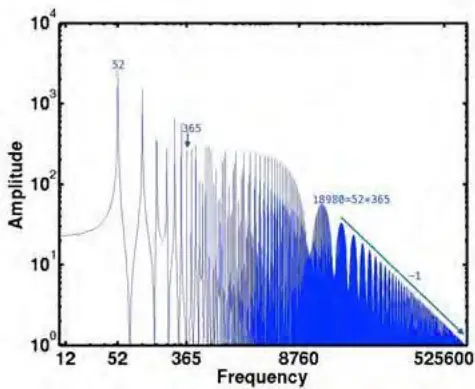
数 据 来 源 ： 《 Intraday Patterns in Natural Gas Futures: Extracting Signals fromHigh-Frequency Trading Data》国泰君安证券研究

## 3.1.1.3. 突出的交易模式

频谱图展确定特定交易频率的相对强度，例如每天一次(频率为365)和每周一次(频率为52)的交易强度。市场交易模式的观察如下。

（1）每周一次的交易最为常见，频率为52 的振荡具有最显著振幅、峰值最突出。每周一次的频率和美国能源部(DOE)发布库存报告的频率一致。

（2）振幅前五的频率为每周 1 次、每周 2 次、每周 5 次、每周 6 次、每周 3 次，频率是以下 52 的倍数:52、104、260、312 和 156。

（3）365 处有一峰值(每天 1 次)。然而，该峰值低于附近峰值，每周 6次和8次。每天1次的交易规律并不显著。正常来说，每天的开盘收盘应存在一定的规律性，按天为周期的交易模式在频谱中可能会占据更为显著的位置，但结果不明显。

（4）当频率较高时，频谱图中出现了一系列以周、日为周期形成的峰值，此类点的频率多为 18,980 的倍数(=365*52)。

（5）较高频率处，振幅与频率出现了幂律关系 g∝kα ，其中 g 表示峰值的幅值，k表示峰值的频率。频率为18,980若干倍的点，形成了多个峰值，且这些峰值在图 1 右方中形成了一条直线。指数α为-1，这意味着g∝1/k。这种幂律关系是描述市场开放和关闭的阶跃函数的特征。傅立叶谱中的这种幂律关系符合预期。

## 3.1.2. 基于非均匀快速傅立叶变化（NUFFT）的交易价格分析

前文介绍了市场操作结构所带来的交易模式，本节分析具体的交易数据所展现的交易模式。本文使用 NUFFT 对 2007 年至 2013 年之间的天然气交易价格进行变化，计算 1,000,000个频率对应的振幅，如图 2所示。因为相邻频率的幅值几乎没有连续性，所以频谱图的点是离散绘制的。

## 3.1.2.1. 突出的交易模式

NUFFT 下，天然气期货市场中每天一次（365）的交易频率峰值最高，这一规律在2007年到2013 年都保持一致，而且与实际交易中的每日交易周期契合。该结果与图1 的每周一次不一致。

图 2 天然气期货价格NUFFT频谱图
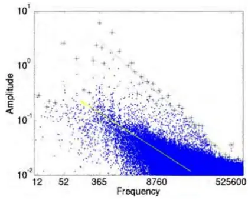
(a) 2007

(b) 2008

(c) 2009

(e) 2011

(d) 2010
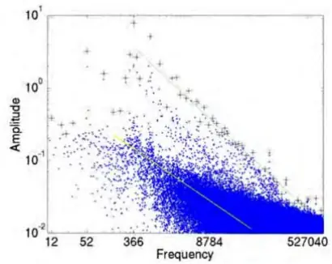
(f) 2012

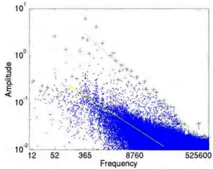
(g) 2013
数据来源：《Intraday Patterns in Natural Gas Futures: Extracting Signals from High-Frequency Trading Data》国泰君安证券 研究

表3显示了 NUFFT 转化后峰值最突出的 5个频率。排名首位是 365/366（每天一次），这可能是是市场开盘后立刻进行的交易形成了每日单次交易循环；峰值第二突出的是 730/732（每天两次）的交易频率，这可能是开盘后交易、收盘前交易形成的每日两次交易循环；第三位是 52（每周一次），这与前一傅立叶频谱的最高峰值一致，与美国能源部(DOE)库存报告发布频率一致。

表 3：NUFFT 频谱图中各年份最突出的 5 个频率

| 峰值最突出的5 个频率节点 |  |  |  |  |
| --- | --- | --- | --- | --- |
| 年份 | 1st | 2nd 3rd | 4nd | 5th |
| 2007 | 365 730 | 52 | 312 | 416 |
| 2008 | 366 | 732 52 | 313 | 418 |
| 2009 | 365 | 730 52 | 312 | 416 |
| 2010 | 365 | 730 52 | 312 | 416 |
| 2011 | 365 | 730 52 | 312 | 416 |
| 2012 | 366 | 732 52 | 313 | 418 |
| 2013 | 365 | 730 52 | 312 | 416 |

数 据 来 源 ： 《 Intraday Patterns in Natural Gas Futures: Extracting Signals fromHigh-Frequency Trading Data》国泰君安证券研究

5 个频率在各个年份都非常稳定，这说明产生这些峰值背后的潜在机制是稳定的。由于这些频率与图 1中的频率不同，所以，在市场操作结构之外的因素在 NUFFT 频谱图中创造了突出的每日峰值。具体而言，紧随市场开盘后、市场收盘前的每日交易热潮形成了 NUFFT 中的交易峰值，如每日一次、两次等。

## 3.1.2.2. 高频成分的幂律关系

NUFFT 不仅捕捉到了市场中低频交易的模式特征，还显示了高频交易的特殊幂律关系。

NUFFT 变化后，频率较高时，峰值的幅度与频率呈反比关系。为量化这种幂律关系，本文在图 4 中将支配范围较大的峰值标记为“+”，然后对频率介于每天一次（8,760）与每分钟一次（525,600）的峰值进行回归来计算幂律关系的指数。结果如图4 所示。

结果表明，七个年份的幂律关系指数都显著大于-1。

市场中的高频分量的峰值明显强于比市场操作结构会产生的高频峰值。这说明，除了交易操作结构外，市场中还存在其他能产生高频峰值的因素，如高频交易的普及。

此外，图4中的数据点非常接近图中的线性回归线，这表明高频成分的幂律关系指数逐年增加，市场中高频成分的相对强度逐年增强，背后因素众多。

图 4不同年份频率与峰值的幂律关系指数
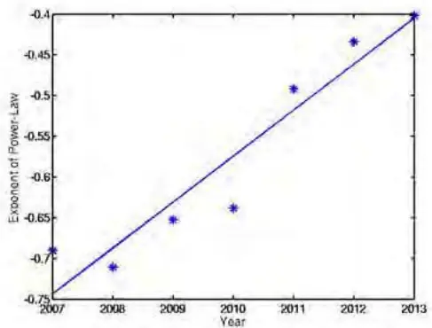
数 据 来 源 ： 《 Intraday Patterns in Natural Gas Futures: Extracting Signals fromHigh-Frequency Trading Data》国泰君安证券研究

大量自动化高频交易活动的产生促使市场中的高频成分不断增强。实际上，多项研究都证明了高频成分中频率与峰值幅值间存在幂律关系，另一目标就是挖掘这一幂律关系的来源。市场的开放、关闭本身就会引起这种幂律关系，而在实际交易数据中，这一幂律关系要明显强于操作结构自然形成的幂律关系，指数明显大于-1，且逐年增强。因此，高频成分的突出的相对强度是由自动化高频交易活动的增加所形成的。

## 3.1.2.3. 算法交易的存在

有明显的证据表明市场中存在频繁的每分钟一次的交易活动。据图 2所示，2007-2013 年间，每年在每分钟一次处均出现了明显的峰值。在2009-2013 年间，该峰值的幅度比附近100,000个频率的幅度平均值强十倍以上，相对强度均大于 10. 相对强度为峰值幅度与附近 100,000 个频率的平均幅度之比，见表5。

特殊峰值恰好出现在每分钟一次。这样精确的结果表明这些峰值很可能起源于某些系统性的操作，如自动触发的交易活动。

表 5：每分钟一次局部峰值的频率和相对强度

| 年 | 频率 相对强度 |
| --- | --- |
| 2007 | 525600 6.7 |
| 2008 | 527040 5.1 |
| 2009 | 525600 13.7 |
| 2010 | 525600 20.3 |
| 2011 | 525600 15.6 |
| 2012 | 527040 15.7 |

数 据 来 源 ： 《 Intraday Patterns in Natural Gas Futures: Extracting Signals fromHigh-Frequency Trading Data》国泰君安证券研究

## 3.1.3. Lomb Scargle 谱分析

Lomb-Scargle 谱分析方法是一种研究不均匀采样时间序列频谱的技术，该方法在傅立叶变化的基础上优化了对长时间间隙带来的低频噪音的处理方法。应用 Lomb-Scargle 谱分析方法的交易数据处理结果如图 4。

图 6 天然气期货价格 Lomb Scargle 频谱图
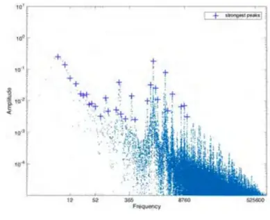
(a) 2007

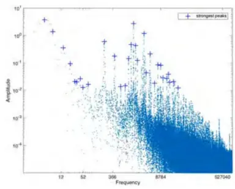

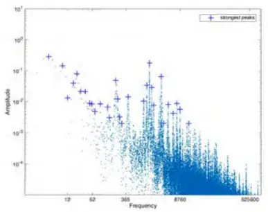
(c) 2009

(b) 2008
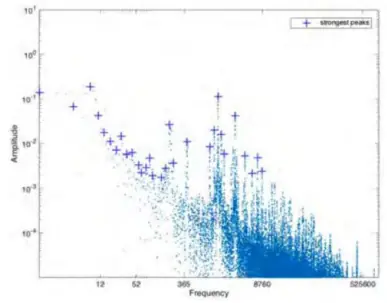
(d) 2010

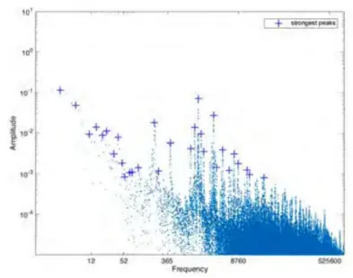

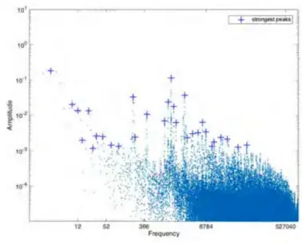
(f) 2012

(e) 2011
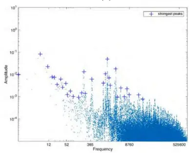
(g) 2013
数据来源：《Intraday Patterns in Natural Gas Futures: Extracting Signals from High-Frequency Trading Data》国泰君安证券 研究

两类提取结果相似，但结论明显不同。它们在图的左边都有最高的峰值，而具有较高频率的峰值按照幂律关系下降，两类方法都捕捉了市场中存在的共同特征。但结果明显不同。如，表7中Lomb-Scargle 图中具有最强峰值的频率为 1, 462，接近每天四次(4*365=1,460)，而 NUFFT 的最强峰值出现在 365（每天一次）。从实际交易场景中，每天一次的交易周期是合理的，这可能与市场的日常操作、每日交易量的变化相关，但每天四次的交易缺乏合理的机制，这说明 NUFFT 更有可能把握住了交易操作的本质。

表 7：Lomb-Scargle频谱图中各年份最突出的 5个频率

| 峰值最突出的5 个频率节点 |  |  |  |  |
| --- | --- | --- | --- | --- |
| 年份 | 1st | 2nd 3rd | 4nd | 5th |
| 2007 | 6 | 1462 9 | 2918 | 12 |
| 2008 | 4 | 1464 7 | 2924 | 213 |
| 2009 | 4 | 1452 9 | 21 | 2908 |
| 2010 | 8 | 1 1456 | 4 | 11 |
| 2011 | 3 | 1451 6 | 2899 | 204 |
| 2012 | 3 | 1459 2915 | 205 | 1251 |
| 2013 | 6 | 1462 11 | 2905 | 215 |

数 据 来 源 ： 《 Intraday Patterns in Natural Gas Futures: Extracting Signals fromHigh-Frequency Trading Data》国泰君安证券研究

## 3.1.3.1. 信号处理工具比较

NUFFT 是比 Lomb Scargle 更有效的模式提取工具。Lomb-Scargle 谱分析方法是为了填补空值而设计的，而天然气期货的交易记录并没有明显的空值，这可能是该方法与 NUFFT 结论不一致的原因。另外，Lomb-Scargle 谱分析一般用于捕捉主要峰值(Jenkins 和 Jarvis，1999)，这也解释了为什么 Lomb-Scargle 频谱图中没有捕捉到 NUFFT 观察到的每分钟一次的高频峰值。NUFFT 变化下主要峰值的频率在不同年份下保持一致，Lomb-Scargle分析下主要峰值的频率变动非常明显。NUFFT 所捕捉到的主要峰值频率与天然气市场特点、实际交易规律更为匹配，因此我们认为NUFFT 捕捉到的信号更为有效。

## 4. 交易量分析

根据对交易价格的分析，本文确定了市场中存在一个周期性的、稳定的交易模式：每分钟一次的交易循环。接下来，本节将对一分钟内发生的交易量进行分析。

## 4.1.1. 每秒交易占比

基于时间触发的算法交易会使交易集中发生在每分钟的第一秒。一项S&P500 期货交易研究发现很大一部分的交易发生在一分钟内的第一秒。这证明了大量交易活动都是由触发器触发的，这些交易会按照触发规则在每分钟的第一秒开始执行。基于时间的交易策略种类繁多，如常用的的时间加权平均价格交易(TWAP)、交易量量加权平均价格交易(VWAP)，类似的策略都按照固定的时间间隔重新计算价格后调整交易操作。

为检验算法交易的存在，本文分析了天然起期货市场中一分钟内的交易活动。图8显示了一分钟内各秒数交易量占总交易量的比例。

图 8自2013 年起一分钟内特定秒数的交易量占该分钟总交易量的比例
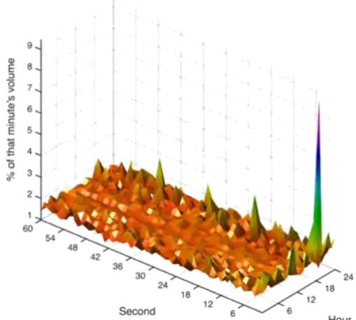
数 据 来 源 ： 《 Intraday Patterns in Natural Gas Futures: Extracting Signals fromHigh-Frequency Trading Data》国泰君安证券研究

在不移除市场操作结构影响的情况下，一分钟内的交易集中发生在第一秒，一分钟内的交易不均匀发生。如果每秒发生的交易数量相同，那么每一秒钟都会有 $\cdot\frac{1}{60}$ 交易发生，约为 1.67%。图 8 结果表明，不同秒数发生的交易数量不同，有许多明显的峰值，如 18点的第 0 秒等。

## 4.1.2. 市场操作结构的影响

市场操作结构会影响交易操作，本文移除了开盘后第一分钟的交易数据来消除市场操作结构的影响。

由图 8 可知，最高的峰值出现在 18 点的第 1 秒，而且这一结论在其他年份也是相同的。该时间点对应着芝加哥商品交易所（CME）NG 期货电子市场的每日开盘时间。这是因为在每天下午6点开盘前 45 分钟内，电子订单会堆积呈一个队列，其中大多数订单都会在开盘后的前几秒执行。如果订单在市场休市期间以和正常营业时间相同的速率堆积，那么市场开放后的第一秒内需要处理的订单数量将等于 6 点内所有订单的43%。但，值得注意的是，在下午 6 点各秒发生的交易量和电子订单量是不同的，所以下午六点的第一秒发生的交易比例可能与 43%有明显的不同。

不过，即使将这一点纳入考虑，我们仍然预期在开盘时处理的交易数目会远高于平均处理的交易数目。图 9 给出了各年份一天内每分钟处理的交易数。

很大一部分交易将在市场开放后的第一秒内处理。给定一年的交易样本数据，将交易按所发生的小时数、分钟数加总，得到交易计数图 9。图9中的红色“+”表示开盘后立即发生的交易。图 9表明在开盘后立即进行的交易数量远远高于随后的时间。因此本文移除了开盘后的第一分钟内的交易数据，来消除这一市场结构性特征。

图 9 各年份一天内每分钟发生交易计数图（以对数标记）
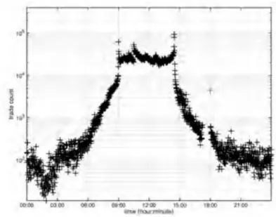
(a) 2007

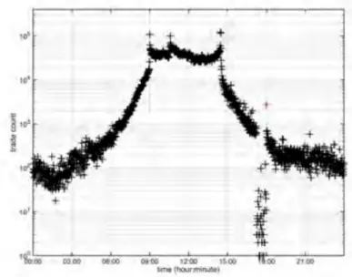

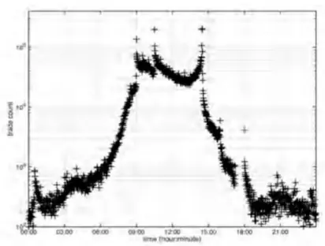
(c) 2009

(b) 2008

(d) 2010

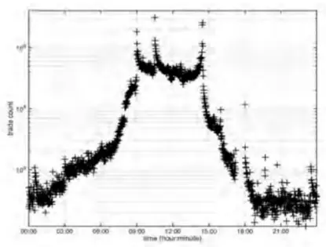

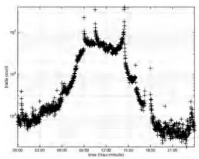
(f) 2012

(e) 2011
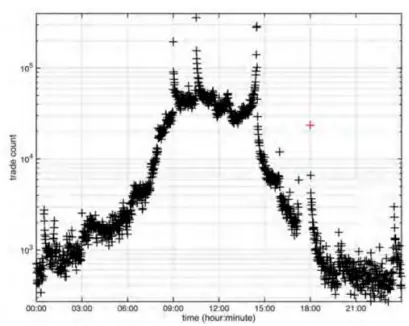
(g) 2013
数据来源：《Intraday Patterns in Natural Gas Futures: Extracting Signals from High-Frequency Trading Data》国泰君安证 券研究

## 4.1.3. 算法交易的存在

在移除了开盘后第一分钟内发生的交易后，一分钟内每秒交易量占总交易量的比例如图10。

在每分钟的前几秒内出现了大量的峰值，基于时间触发的自动化交易活跃度不断提升。表11显示了各年份中最大交易量秒数所处位置按小时数的集合。比如，在2013年里，24小时中有10个小时里，第一秒贡献了一分钟内的最大交易量 $(\mathrm{{s}=0,\mathrm{{t}=10)}}$ 。而在24 小时中有 15个小时，前 5秒中的某一秒贡献了一分钟内的最大交易量（s<=5,t=15)。前几秒对总交易量的贡献随着年份不断增强，在 2007 年前 7 秒仅贡献了 6 小时的最大交易量，而在 2008 至 2013 年贡献度不断增加，到 2013 年，前 7 秒贡献了 17 个小时的最大交易量。这一趋势表明据时钟触发的自动化交易活跃度不断提高。

图 10 移除开盘后第一分钟交易数据后，一分钟内特定秒数交易量占总交易量的比例
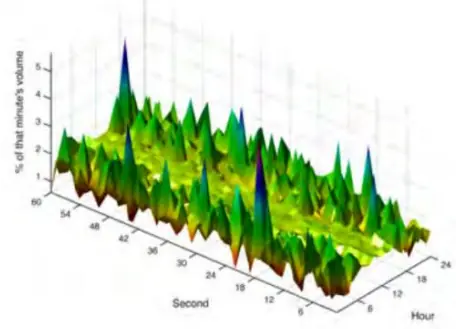

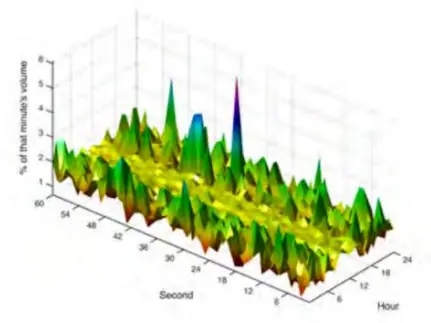

(a) 2007
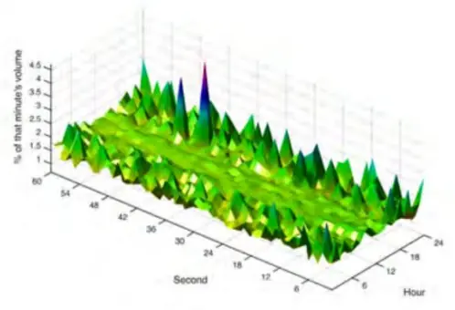

(b) 2008
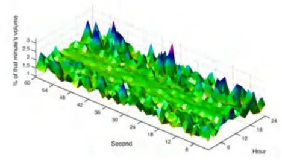

(c) 2009
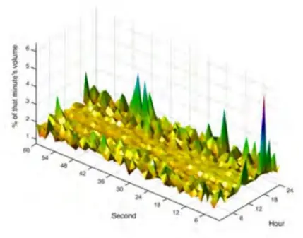
(e) 2011

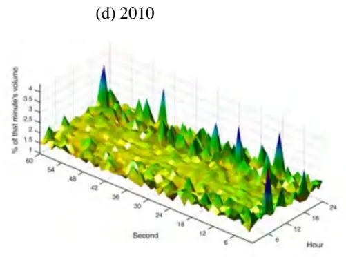
(f) 2012

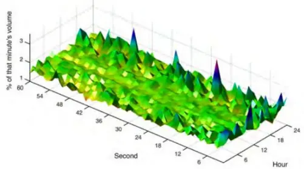
(g) 2013
数据来源：《Intraday Patterns in Natural Gas Futures: Extracting Signals from High-Frequency Trading Data》国泰君安证 券研究

表 11：最大交易量秒数所处的位置按小时数的集合表

| 年份 | S=0 S<=4 | S<=5 | S<=6 |
| --- | --- | --- | --- |
| 2007 | 0 3 | 5 | 6 |
| 2008 | 1 2 | 2 | 3 |
| 2009 | 7 9 | 9 | 10 |
| 2010 | 11 11 | 11 | 11 |
| 2011 | 11 11 | 12 | 12 |
| 2012 | 9 12 | 12 | 12 |
| 2013 | 10 15 | 17 | 17 |

数 据 来 源 ： 《 Intraday Patterns in Natural Gas Futures: Extracting Signals fromHigh-Frequency Trading Data》国泰君安证券研究

## 5. 总结

分析工具方面：信号处理工具用于提取交易数据中的明显的交易模式，如非均匀傅立叶变化、Lomb-Scargle 谱分析。非均匀傅立叶变化是更有效的提取工具。

高频交易方面：交易中高频贸易普遍兴起，相对强度不断提升，频谱图高频成分相对强度持续增加。所有交易中每天一次的低频交易峰值最为突出。高频交易的特征近年来越来越明显，而且这一规律强于市场操作结构所产生的规律。

算法交易方面：算法交易存在依据明显，频谱图中每分钟一次的交易，峰值明显强于很大范围内的峰值，相对强度逐年提升。每年该特殊峰值都恰好出现在每分钟一次，这一精确性证明了市场中存在基于时间触发的算法交易。大量交易发生在每分钟的前5 秒，尤其是第一秒，且近年来这一现象愈发突出。这有力地证明天然气期货市场中存在算法交易，如 TWAP、VWAP。

观察本文结论，我们发现天然气期货市场中存在大规模的高频交易，算法交易盛行。广泛的算法交易存在本身很可能影响了市场行为，这可能放大了市场的波动性，使得市场对级联事件的反应更加快速、剧烈。

## 本公司具有中国证监会核准的证券投资咨询业务资格

## 分析师声明

作者具有中国证券业协会授予的证券投资咨询执业资格或相当的专业胜任能力，保证报告所采用的数据均来自合规渠道，分析逻辑基于作者的职业理解，本报告清晰准确地反映了作者的研究观点，力求独立、客观和公正，结论不受任何第三方的授意或影响，特此声明。

## 免责声明