inInfo] [Table_Title] 2021.06.14

# 全球宏观风险因子模型研究

## ——学界纵横系列之九

陈奥林(分析师)

## 徐忠亚(分析师)

8 021-38674835

021-38032692

chenaolin@gtjas.com

xuzhongya@gtjas.com

证书编号 S0880516100001

S0880519090002

## 本报告导读：

跨国家、跨资产的价值与动量溢价源于何处？驱动全球市场收益横截面的因子模型是否存在？

## 摘要：

le_Summary]价值与动量在跨国家、跨资产市场上均存在正溢价，但两者相关性为负，且两者的等权组合也有正的溢价。这对现有资产定价模型提出了较大的挑战。

使用工业增加值，未预期通胀，预期通胀变化，期限利差以及违约利差共五个指标构造 CRR 全球宏观因子，可以解释价值与动量溢价的问题，并对其他跨国家、跨资产组合同样具备解释能力。

价值与动量在全球 CRR 因子上的暴露符号相反，且绝对值大小存在差异，这解释了两者的负相关性以及两者等权组合的正溢价。

在对48个价值与动量组合的定价中，全球CRR宏观因子模型的R2和定价误差优于AMP 三因子模型和 Fama-French 五因子模型。同时，各个CRR因子对定价结果的影响均有较好的经济学解释。

- 在103个包含其他组合的扩展测试集中，尽管Fama-French 五因子的构造与测试资产集存在重合，但全球 CRR 因子模型的表现与其接近。

与基于收益率构造的因子相比，宏观因子需使用回归方法计算因子暴露和因子收益率，易受噪声影响，但全球 CRR因子的表现接近甚至优于基于收益率构造的因子模型，并对跨国家和跨资产的组合具有良好的解释能力。

全球宏观因子在解释全球市场收益横截面差异，理解共同风险因子结构方面，具有重要的作用。

金融工程

## 金融工程团队：

陈奥林：（分析师）

电话：021-38674835

邮箱：chenaolin@gtjas.com

证书编号：S0880516100001

## 杨能：（分析师）

电话：021-38032685

邮箱：yangneng@gtjas.com

证书编号：S0880519080008

## 殷钦怡：（分析师）

电话：021-38675855

邮箱：yinqinyi@gtjas.com

证书编号：S0880519080013

## 徐忠亚：（分析师）

电话：021- 38032692

邮箱：xuzhongya@gtjas.com

证书编号：S0880120110019

## 刘昺轶：（分析师）

电话：021-38677309

邮箱：liubingyi@gtjas.com

证书编号：S0880520050001

## 吕琪：（研究助理）

电话：021-38674754

邮箱：lvqi@gtjas.com

证书编号：S0880120080008

## [Table_R相关报告

写在首批 REITs 上市之前:网下询价与公众认 购行为，共识之外差异仍存 2021.06.11

天然气期货的高频交易模式是怎样的2021.06.10

富国沪深 300ESG 基准 ETF 投资价值分析2021.06.08

碳排放量如何影响了股票收益 2021.06.08

金融板块基本面量化及策略配置 2021.06.01

## 1. 选题背景

人们习惯将价值与动量称之为因子，但在学术界，若采用了不含价值和动量的定价模型，并且两者的收益率不能被定价模型所解释，那他们就应该被称为异象。在本文，我们认为价值和动量是两个备受争议的异象，从而对两者进行研究。

Asness, Moskowitz and Pedersen (2013)发现即使在跨国家、跨资产类别进行研究，价值和动量仍然存在溢价，同时他们提出了三个问题：一是两者均存在正的溢价，但他们之间相关性却为负；二是简单地将这两个负相关的异象等权重结合得到的组合也有正的溢价；三是其他的风险因子比如流动性因子等，均无法对两者的溢价作出解释。这三个问题对现有资产定价模型的解释力提出了挑战。

我们知道，一个好的定价模型应该可以解释尽可能多的异象，或者说在该定价模型下的异象较少。针对股票市场的价值和动量溢价，存在基于q 理论的资产定价模型对其进行解释，但是在其他的非股票资产中，并没有资产定价模型可以解释两者。同时，某一资产或者根据其个体特征构造的多空组合的收益，都需要使用基于该资产的个体特征构造的因子来进行解释，比如盈利因子，投资因子和规模因子等。是否存在一个统一的模型，可以解释跨资产和跨国家的组合收益呢？

事实上，现有研究中的因子模型仅能解释部分特征组合在部分国家和部分资产的收益，而不能解释所有特征在所有国家和所有资产的收益，并且这些因子的构造大多直接基于个体的特征，对于他们所代表的风险的共同来源也没有直接的宏观经济解释。

《A Global Macroeconomic Risk Model for Value, Momentum, and OtherAsset Classes》基于 Chen, Roll, and Ross's (1986)提出的五个美国的宏观因子（在本文中将其称为CRR因子），使用全球性指标构建了其全球版本。通过实证发现，全球 CRR 因子不仅能较好地回答 Asness, Moskowitz,and Pedersen (2013)提出的三个关于价值和动量的问题，还对使用其他特征构造的组合在所有资产类别中均具有良好的解释力。这说明不同资产市场在某种程度上是一个整体，而全球 CRR 因子是解释全球市场的有力武器。同时，全球 CRR因子具有良好的经济学理论支撑。

## 2. 核心结论

价值与动量在跨国家、跨资产市场上均存在正溢价，但两者相关性为负，且两者的等权组合也有正的溢价。这对现有资产定价模型提出了较大的挑战。

使用工业增加值，未预期通胀，预期通胀变化，期限利差以及违约利差共五个指标构造 CRR 全球宏观因子，可以解释价值与动量溢价的相关问题，并对其他跨国家、跨资产组合同样具备解释能力。

价值与动量在全球 CRR 因子上的暴露符号相反，且绝对值大小存在差异，这解释了两者的负相关性以及两者等权组合的正溢价。

在对48个价值与动量组合的定价中，全球CRR 宏观因子模型的R2和定价误差优于 AMP 三因子模型和 Fama-French 五因子模型。同时，各个CRR因子对定价结果的影响均有较好的经济学解释。

在包含 103 个包含其他组合的测试集中，尽管 Fama-French 五因子的构造与测试资产集存在重合，但全球 CRR因子模型的表现与其接近。

与基于收益率构造的因子相比，宏观因子需使用回归方法计算因子暴露和因子收益率，易受噪声影响，但全球 CRR 因子的表现接近甚至优于基于收益率构造的因子模型，并对跨国家和跨资产的组合具有良好的解释能力。

全球宏观因子在解释全球市场收益横截面差异，理解共同风险因子结构方面，具有重要的作用。

## 3. 数据及变量定义

首先针对动量和价值组合进行分析。在8 个市场和资产中，对价值和动量各自排序后分为3层，共有 8*(3+3)=48 个组合。其中市场和资产包括美国股票市场（U.S.），英国股票市场（U.K.），欧洲股票市场（EU），日本股票市场（JP），股指期货（EI），货币（CR），政府债券（FI）和商品期货（CM）。使用的数据是 Asness, Moskowitz, and Pedersen (2013)所使用数据的扩展版本，来源于 AQR 的官网 www.aqr.com. 样本期为1983年4月至 2018年 12月。同时，本文还从AQR收集了 22个价值和动量多空组合以及他们的合并组合数据，其中合并组合是价值和动量多空组合一比一加权而来。

## 3.1. 数据统计

表 1 汇总了各个组合的平均超额收益和 t 统计量。 $V_{1},V_{2},V_{3}$ 为价值分层组合， $M_{1},M_{2},M_{3}$ 是动量分层组合；V为价值多空组合，M为动量多空组合，C为两者的结合。表 1 为在 8 个市场与资产中各组合的表现，表 2为全球市场与资产（All），全球股权市场（Eq）以及全球非股权市场（O）的表现。表 3为在各个市场与资产类别中，价值与动量多空组合间的相关系数。

从表 1可以看出，价值和动量效应在多数情况下是显著的。从后三列来看，价值和动量溢价显著的国家和资产较多，但与 Asness, Moskowitz, andPedersen (2013)相比，在一些国家和资产的溢价失去了显著性，本文认为这是因为使用了不同的样本区间。但在本文关注的跨资产和跨国家的情况下，表 2 表明，所有国家和所有资产组成的市场（All），全球股票市场（Eq）和全球非股票市场（O）中的价值和动量效应都是显著的，并且股票市场的价值和动量效应比非股票市场更强。

通过表 3，价值和动量溢价间的负相关性得到验证，但是两者在所有国家和资产的溢价均为正，两者的合并组合也有正的溢价，并且合并组合的溢价绝大多数情况下是显著的（除在固定收益市场 FI 之外）。这对现存资产定价模型提出了挑战，为何价值与动量在各个国家和资产中都存在正的超额收益？为何两者相关性为负？在两者相关性为负的情况下，为何其等权组合仍然能有一个正的超额收益？两者等权组合的溢价是否意味着错误定价或者新的风险？这些正是本文要回答的问题。

表 1：各市场和资产中，价值和动量组合的平均超额收益

|  | $\underline{{\boldsymbol{V}_{1}}}$ | $\underline{{\boldsymbol{V}_{2}}}$ | $\underline{{\boldsymbol{V}_{3}}}$ | $\underline{{{\pmb{M}}_{1}}}$ | $M_{2}$ | $\underline{{{M}_{3}}}$ | V | M | $c$ |
| --- | --- | --- | --- | --- | --- | --- | --- | --- | --- |
| U.S. | 0.59 | 0.62 | 0.68 | 0.52 | 0.59 | 0.79 | 0.17 | 0.42 | 0.29 |
|  | (2.56) | (3.11) | (3.20) | (2.10) | (3.06) | (3.38) | (0.81) | (1.84) | (3.26) |
| U.K. | 0.46 | 0.56 | 0.76 | 0.17 | 0.75 | 0.85 | 0.32 | 0.79 | 0.55 |
|  | (1.97) | (2.21) | (2.81) | (0.55) | (3.17) | (3.20) | (1.65) | (3.56) | (6.19) |
| EU | 0.68 | 0.75 | 0.90 | 0.47 | 0.74 | 0.91 | 0.16 | 0.61 | 0.39 |
|  | (2.68) | (3.07) | (3.46) | (1.56) | (3.08) | (3.53) | (1.14) | (3.28) | (4.97) |
| JP | 0.07 | 0.41 | 0.72 | 0.22 | 0.25 | 0.38 | 0.69 | 0.20 | 0.45 |
|  | (0.23) | (1.47) | (2.51) | (0.67) | (0.91) | (1.26) | (3.57) | (0.88) | (4.99) |
| EI | 0.42 | 0.59 | 0.70 | 0.28 | 0.65 | 0.78 | 0.25 | 0.44 | 0.35 |
|  | (1.97) | (2.72) | (3.08) | (1.26) | (3.09) | (3.49) | (2.09) | (2.96) | (4.86) |
| CR | 0.02 | 0.11 | 0.22 | 0.00 | 0.14 | 0.19 | 0.23 | 0.15 | 0.19 |
|  | (0.19) | (0.93) | (2.01) | (0.01) | (1.26) | (1.65) | (2.16) | (1.32) | (3.18) |
| FI | 0.21 | 0.30 | 0.28 | 0.27 | 0.23 | 0.29 | 0.05 | 0.06 | 0.05 |
|  | (2.32) | (4.00) | (3.82) | (3.50) | (3.11) | (3.64) | (0.69) | (0.91) | (1.25) |
| CM | -0.03 | 0.20 | 0.41 | -0.12 | 0.07 | 0.57 | 0.42 | 0.64 | 0.53 |
|  | (-0.14) | (0.98) | (1.89) | (-0.52) | (0.40) | (2.38) | (1.53) | (2.48) | (3.72) |

数据来源：《A Global Macroeconomic Risk Model for Value, Momentum, and Other Asset Classes》，国泰君安证券研究

表 2：跨国家和跨资产的价值与动量溢价

| Global | V | M | C |
| --- | --- | --- | --- |
| All | 0.24 | 0.34 | 0.29 |
| Eq | (3.07) | (3.49) | (7.62) |
|  | 0.31 | 0.50 | 0.41 |
| 0 | (2.07) | (2.86) | (2.86) |
|  | 0.19 | 0.23 | 0.21 |
|  | (2.95) | (3.15) | (5.85) |

数据来源：《A Global Macroeconomic Risk Model for Value, Momentum, and Other AssetClasses》，国泰君安证券研究

表 3：各市场和资产中，价值和动量因子间的相关系数

| U.S. | U.K. | EU | JP | EI | CR | FI | All | Eq | 0 |
| --- | --- | --- | --- | --- | --- | --- | --- | --- | --- |
| -0.67 | -0.64 | -0.57 | -0.65 | -0.46 | -0.42 | -0.23 | -0.64 | -0.68 | -0.46 |

数据来源：《A Global Macroeconomic Risk Model for Value, Momentum, and Other Asset Classes》，国泰君安证券研究

## 3.2. 全球风险因子

为了衡量全球宏观经济风险，本文使用全球宏观指标构造了全球 CRR因子。这些因子是对所有国家的 CRR 因子使用GDP 加权得出。具体来说，我们的全球样本包括欧洲大陆（奥地利、比利时、丹麦、法国、德国、意大利、荷兰、挪威、葡萄牙、西班牙和瑞典）、日本、英国和美国。为了计算 GDP 权重，我们使用经合组织（OECD）数据库中以美元计价的GDP 数据。

本文选取的宏观指标共五个，为MP,UIMDEI,UTS以及UPR。指标的具体定义如下：

MP为工业产量增速， $MP=logIP_{t}-logIP_{t-1}$ ，其中 $IP_{t}$ 为第t个月的全球工业生产指数，来源于OECD 数据库。

UI为未预期通胀， $UI_{t}=I_{t}-E[I_{t}|t-1]$

DEI为预期通胀的变化量， $DEI_{t}=E[I_{t+1}|t]-E[I_{t}|t-1]$ . 其中 $I_{t}$ 为通胀率， $I_{t}=logCPI_{t}-logCPI_{t-1}$ ，CPI为季节调整后的消费者物价指数。预期通胀率 $E[I_{t}|t-1]=r_{f,t}-E[RHO_{t}|t-1]$ ，其中r 是短期利率， $r_{f,t}$ $RHO_{t}=r_{f,t}-I_{t}$ 为实际收益率。全球短期利率 $\cdot r_{f,t}$ 为每个国家短期利率的GDP 加权平均值。对于美国，我们使用 CRSP 数据库的 1 月期国库券利率，对于欧洲国家和日本，我们使用 Datastream 数据库的短期利率。受 Fama and Gibbons (1984) 的启发，本文对短期利率采取移动平均方法进行建模，即 $RHO_{t}-RHO_{t-1}=u_{t}+\theta u_{t-1}$ ，然后计算E $\begin{array}{rlr}{\mathrm{[}RHO_{t}|t-1]=}\end{array}$ $\left(r_{f,t-1}-I_{t-1}\right)-\hat{u}_{t}-\theta\hat{u}_{t-1}$

UTS为全球的期限溢价，通过对全球各国的长期政府债券与短期政府债券的利差进行GDP 加权得到。

UPR是违约利差，为穆迪评级Baa与 Aaa的公司债的收益率之差。

## 4. 截面资产定价实证

为了解全球宏观经济因子是否可以回答 Asness, Pedersen and Moskowitz（2013）提出的问题，第一步是估计 5 个 CRR 全球宏观风险因子的风险价格（即因子收益率），并检验这些因子是否可以解释不同组合的收益横截面。因此，我们采取常用的线性模型

$$
E\left(r_{i,t}\right)=\lambda_{0}+\beta^{\prime}\lambda
$$

其中 $r_{i,t}$ 为资 $\cdot\vec{j^{z}}$ i的超额收益率， $\lambda_{0}$ 为常数项，λ为因子的风险价格向量（常被称为因子收益率）， $\beta$ 为回归系数（常被称为因子暴露和因子载荷）。我们采取Fama-MacBeth 回归对模型进行估计。

具体来说，第一步回归为每个资产i在时序上的回归

$$
\boldsymbol{r}_{i,t}=\alpha_{i}+\beta_{i,MP}M\boldsymbol{P}_{t}+\beta_{i,UI}UI_{t}+\beta_{i,DEI}DEI_{t}+\beta_{i,UTS}UTS_{t}+\beta_{i,UPR}UPR_{t}+\epsilon_{i,UP}UI_{t},
$$

其中 $MP_{t},UI_{t},DEI_{t},UTS_{t}\mathcal{\vec{F}}^{\circ}UPR_{t}$ 分别为工业 $\dot{\mathcal{P}}$ 量增长率，未预期通胀，预期通胀的变化率，期限利差以及违约利差。回归所得系数估计为$\hat{\beta}_{i,MP},\hat{\beta}_{i,UI},\hat{\beta}_{i,DEI},\hat{\beta}_{i,UTS}\hat{\mathcal{F}}^{\alpha}\hat{\beta}_{i,UPR}$

第二步为截面上的回归

$$
\bar{r}_{i,t}=\alpha_{i}+\hat{\beta}_{i,MP}\lambda_{MP}+\hat{\beta}_{i,UI}\lambda_{UI}+\hat{\beta}_{i,DEI}\lambda_{DEI}+\hat{\beta}_{i,UTS}\lambda_{UTS}+\hat{\beta}_{i,UPR}\lambda_{UPR}+\eta_{i}
$$

这里 $\bar{\boldsymbol{r}}_{i,t}$ 为组合i的平均超额收益率， $\lambda_{MP}$ 为工业产量因子的风险价格， $\lambda_{UI}$ 为未预期通胀因子的风险价格， $\lambda_{DEI}$ 为预期通胀变化因子的风险价格，$\lambda_{UTS}$ 为期限利差因子的风险价格， $\lambda_{UPR}$ 为违约利差因子的风险价格。

## 4.1. 全球 CRR因子模型对48个价值与动量组合的定价表现

从表 4可以看到，MP, DEI和UPR因子是显著的。其中 MP 因子的风险价格为 0.37，这意味着在 MP 因子上的暴露多一单位，每个月的收益率应增加0.37%，年化后约为 4.5%. 在48 个组合中，除三个固定收益市场的组合在 MP 上的暴露为负（可能是由于避险投资）之外，所有组合在MP 的暴露均为正值。48 个投资组合的暴露平均值为 0.42. 并且在股票市场的平均暴露为 0.53，非股票市场的平均暴露为 0.22，这意味着 MP因子给股票收益的平均贡献为每年 2.36%，给非股票市场的贡献为每年0.98%. MP 因子的暴露为正与 Chen, Roll, and Ross(1986)和 Liu and Zhang(2008)中的结论一致，他们认为这是对承担系统性生产风险的回报。而由于股票的现金流与经济生产的关系更加密切，股票在 MP 因子上的暴露大于非股票资产。

DEI 因子的风险价格为-0.22，符号为负与 Chen、Roll 和 Ross（1986）的估计一致，认为投资者对推动预期通胀的正向冲击是厌恶的。在所有股票组合中，DEI 的因子暴露都为负，范围从-1.90 到-0.02，平均值为-0.81，这意味着对收益率的贡献为每年 2.14%. 股票对 DEI 的负暴露与现有文献的估计一致（例如 Bodie（1976）和Fama（1981）），认为股票收益与预期通胀的负相关关系是预期通胀与未来实体经济活动（比如未来 GNP 或未来实际投资）之间的负相关关系引起的。Bekaert andEngstrom (2010) 发现，高预期通胀时期往往与实际经济增长不确定性增加和风险厌恶异常高的时期相吻合，而这两者都会打压股价。

对于固定收益市场中的组合，DEI 暴露也为负，平均-0.70，这意味着1.87% 的年化收益贡献。这是因为预期通胀的增加会降低未来固定现金流的实际价值。而商品在 DEI的暴露为正。对这种正暴露的一个解释是，当预期通胀增加时，不确定性也会增加（Ball（1992）和 Grier and Perry（1998））。高通胀风险提高了投资者的对冲需求，而购买一揽子大宗商品可以抵御通胀（Bodie (1983)）。

UPR 的风险价格为-0.02。违约利差上升通常被解释为信用状况恶化（Hahn and Lee (2006)），因此在 UPR 暴露为负的资产可用于对冲较差的信用状况。此外，Boons (2016) 发现违约利差对工业生产增长和芝加哥联储国家活动指数有预测效果，为负向预测。UPR 的负风险价格与默顿 (1973) 提出的 ICAPM 一致，认为与违约利差正相关的资产可用于对冲不断恶化的投资环境（Santa Clara and Maio（2012）和 Cooper andMaio（2019））。除美国股票、股指期货和一些商品具有负的 UPR 因子暴露外，大部分资产的暴露是正的。

表 4：48个价值与动量组合回归所得的全球 CRR因子的风险价格

|  | $\widehat{\gamma}_{\mathbf{0}}$ | $\widehat{\gamma}_{MP}$ | ${\underline{{\widehat{\gamma}}}}_{UI}$ | $\underline{{\widehat{\gamma}_{DEI}}}$ | $\widehat{\gamma}_{UTS}$ | $\widehat{\gamma}_{UPR}$ | R2(%) | Avg.P.E. |
| --- | --- | --- | --- | --- | --- | --- | --- | --- |
| Price of risk | 0.272 | 0.371 | -0.027 | -0.217 | -0.021 | -0.017 | 50.5 | 0.144 |
| t-statistic | 4.212 | 3.521 | -0.662 | -4.513 | -1.059 | -4.164 |  |  |

数据来源：《A Global Macroeconomic Risk Model for Value, Momentum, and Other Asset Classes》，国泰君安证券研究

现在来看一下全球版CRR五因子模型的总体表现情况。使用类似 Lettauand Ludvigson(2001)中的计算方法，得出截面回归的R2值为 51%，这意味着拟合的效果较好，尤其是对这样一个未使用收益率构造因子的模型来说。图 1 展示了 48 个价值和动量组合的实际收益率与模型收益率的关系，可以看到散点位于45 度线附近，说明全球版CRR模型很好地解释了跨国家和资产的价值溢价与动量溢价。表 5 中为全球版 CRR 模型的定价误差（P.E.）以及实际收益率与模型收益率的比例（AR/ER）,其中在股票市场的平均定价误差为每月0.17%，非股票市场为每月0.13%，AR/ER 的平均值为 1.19，中位数为 1.06，足以说明模型解释 48 个价值与动量组合的截面差异的优秀能力。同时，这种解释力表明，全球市场在某种程度上是跨国家和跨资产的整体，全球宏观风险因子可以解释一定程度的价值和动量溢价。

图 1：全球 CRR五因子模型的模型收益率与实际收益率
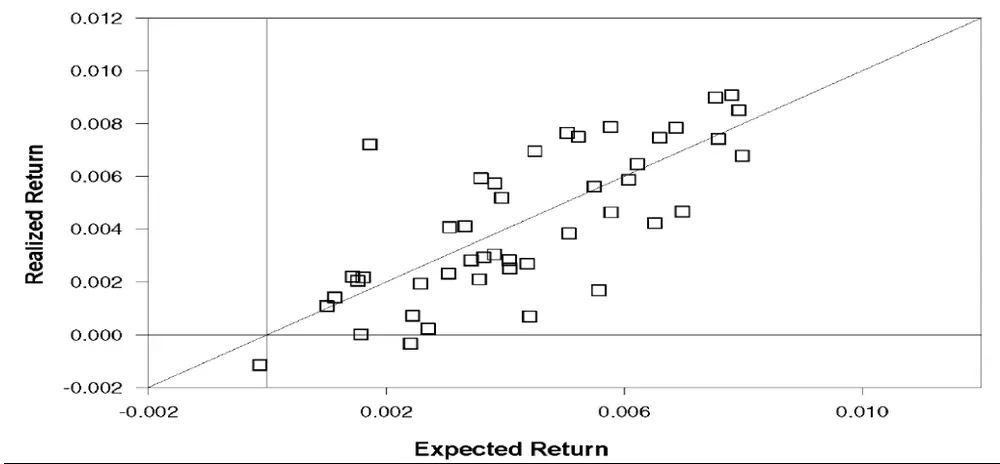
数据来源：《A Global Macroeconomic Risk Model for Value, Momentum, and Other Asset Classes》

表 5：全球CRR因子模型的定价误差

|  |  |  | $\pmb{V}_{2}$ | $V_{3}$ | $\underline{{{\pmb{M}}_{1}}}$ | $M_{2}$ | $M_{3}$ |
| --- | --- | --- | --- | --- | --- | --- | --- |
| U.S. | P.E. | $\underline{{\boldsymbol{V}_{1}}}$ 0.086 | 0.108 | 0.299 | 0.125 | 0.234 | 0.211 |
| U.K. | AR/ER | 1.171 | 1.211 | 1.794 | 1.317 | 1.651 | 1.366 |
|  | P.E. | -0.114 | 0.013 | 0.261 | -0.389 | 0.228 | 0.058 |
| EU | AR/ER | 0.803 | 1.023 | 1.518 | 0.302 | 1.436 | 1.074 |
|  | P.E. | -0.120 | 0.087 | 0.146 | -0.232 | -0.014 | 0.128 |
| JP | AR/ER | 0.850 | 1.132 | 1.194 | 0.668 | 0.981 | 1.164 |
|  | P.E. | -0.371 | 0.101 | 0.549 | 0.078 | -0.156 | -0.122 |
| El | AR/ER | -0.157 | 1.330 | 4.187 | 1.544 | 0.618 | 0.760 |
|  | P.E. | -0.229 | -0.020 | 0.247 | -0.122 | 0.025 | 0.096 |
| CU | AR/ER | 0.648 | 0.967 | 1.550 | 0.699 | 1.040 | 1.140 |
|  | P.E. | -0.247 | 0.007 | 0.057 | -0.155 | 0.029 | -0.064 |
| FI | AR/ER | 0.085 | 1.075 | 1.355 | 0.009 | 1.256 | 0.752 |
|  | P.E. | -0.146 | -0.078 | -0.060 | -0.167 | -0.072 | -0.071 |
| CM | AR/ER | 0.589 | 0.796 | 0.824 | 0.618 | 0.763 | 0.805 |
|  | P.E. | -0.274 | 0.053 | 0.079 | -0.102 | -0.172 | 0.191 |
|  | AR/ER | -0.139 | 1.352 | 1.238 | 8.853 | 0.294 | 1.501 |

数据来源：《A Global Macroeconomic Risk Model for Value, Momentum, and Other Asset Classes》，国泰君安证券研究

## 4.2. 对价值与动量溢价问题的回答

我们现在研究全球 CRR 因子模型是否可以回答 Asness, Pedersen andMoskowitz（2013）提出的问题，即为什么价值和动量呈负相关但却都有正溢价，并且两者等权组合也有正的溢价？为了回答这个问题，我们首先要关注的是价值和动量组合在全球 CRR 因子上的暴露，以及合并组合的因子暴露。

图 2展示了各组合的因子暴露，三种颜色的柱子分别代表价值、动量以及合并组合的因子暴露。在 11 个划分中（含全球市场、全球股票市场、全球非股票市场以及 8 个国家和资产），有 7 个的价值组合和动量组合在MP 因子的暴露异号。与 Liu 和 Zhang（2008）的观点一致，在大多数情况下，动量组合在 MP 因子的暴露为正，其中在货币市场以及所有的股票市场，动量组合在都有正的MP 因子暴露。相比之下，有 6 个价值组合对 MP 因子的暴露为负。由于不同组合在 MP 的暴露大小不同，其合并组合在大多数情况下仍然具有正的暴露，也因此存在正的超额回报。

在 DEI 和 UPR 上，价值和动量组合的因子暴露同样异号。除在固定收益市场外，价值和动量组合具有相反的UPR 因子暴露，其中十个价值组合为正暴露，所有动量组合的因子暴露为负。这意味着动量策略在信用状况较差和高度不确定的时期会产生低回报。总体而言，动量组合对 MP的正暴露和对 UPR 的负暴露与 Chordia and Shivakumar (2002) 中发现的动量表现是顺周期的结论一致，且动量策略仅能在经济扩张期盈利。合并组合在 UPR因子的暴露大部分为负值，从而导致其存在正溢价。

总而言之，图 2 表明价值和动量组合对各个全球 CRR 因子的暴露通常异号。同时，由于价值与动量在全球CRR因子上的暴露大小并不相同，其合并组合也具有不小的因子暴露，也因此具有正的溢价。

图 2：价值组合，动量组合及合并组合的因子暴露
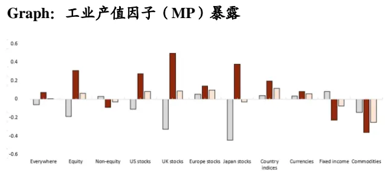
Graph：预期通胀变动因子（DEI）暴露

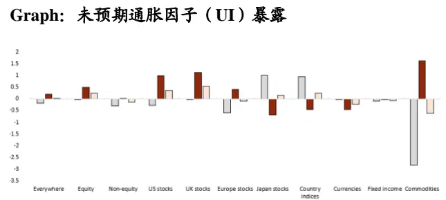
Graph：期限利差因子（UTS）暴露

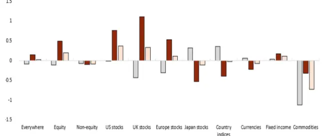
Graph：违约利差因子（UPR）暴露

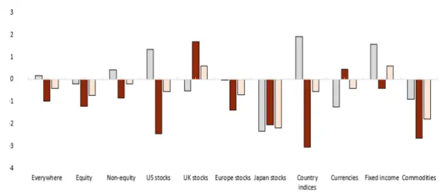

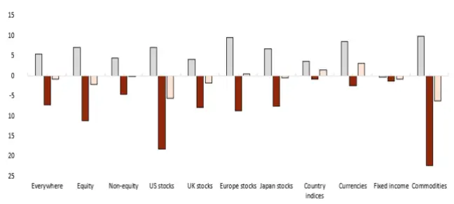
数据来源：《A Global Macroeconomic Risk Model for Value, Momentum, and Other Asset Classes》

为了进一步说明，价值与动量组合的负相关是由全球 CRR 宏观因子模型驱动的，表 6 展示了价值组合与动量组合的模型收益率间的相关性，$\rho_{V,m}$ 是实际收益率的相关系数， $\rho_{implied}$ 是模型拟合收益率的相关系数。可以看到，模型收益率的相关系数同样为负，其绝对值甚至比实际收益率间的相关系数更大，说明全球 CRR 因子模型可以很好地解释两者的负相关关系。

总而言之，在全球 CRR 因子上的不同暴露是价值与动量组合负相关性的来源，也是合并组合产生溢价的原因。本节的内容还表明，在价值与动量效应上，全球 CRR 因子的解释能力并不局限于股票市场，在非股票市场中的表现同样优秀。这有利于我们更好地理解驱动跨国家和跨资产收益横截面的因子结构，该因子结构植根于可观察到的宏观经济风险。

表 6：价值与动量组合的相关系数

| U.S. | U.K. | EU | JP |
| --- | --- | --- | --- |
| ρv,M | -0.67 -0.64 | -0.57 | -0.65 |
| ρimplied | -0.95 -0.89 | -0.89 | -0.75 |

|  | EI | CR | FI | CM |
| --- | --- | --- | --- | --- |
| ρv,M | -0.46 | -0.42 | -0.23 | -0.43 |
| ρimplied | -0.77 | -0.62 | -0.53 | -0.63 |

| Global All |  | Global Stocks | Global Other |
| --- | --- | --- | --- |
| ρv,M | -0.64 | -0.68 | -0.46 |
| ρimplied | -0.97 | -0.94 | -0.82 |

数据来源：《A Global Macroeconomic Risk Model for Value, Momentum, and Other AssetClasses》，国泰君安证券研究

## 4.3. 时变因子暴露

前文的回归分析基于因子暴露为常数的假设，下面使用 5年的滚动窗口研究该假设是否成立，即因子暴露是否存在趋势性变化。从图 3可以看出，因子暴露并没有时间趋势性，并且在1990年代末和 2000年代初之后出现了明显的均值回归，可以认为样本期内的常数因子暴露假设是成立的。另外，从图 3观察到 1990年代末和2000年代初的因子暴露出现了明显的波动，这导致价值与动量组合在同期的收益率出现了大幅波动，这在图 4 中可以得到验证。同时，从图 3 中可以明显观察到价值与动量在 CRR 因子上的暴露的异号关系，这再一次验证了全球宏观因子对两者负相关关系的解释能力。

图 3：跨国家和跨市场价值与动量组合的因子暴露滚动估计值
MP因子暴露滚动估计值
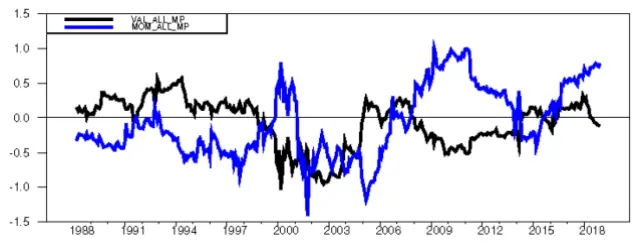
UI因子暴露滚动估计值

UTS因子暴露滚动估计值
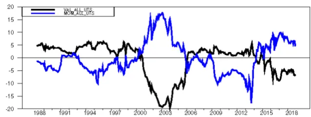

UPR因子暴露滚动估计值
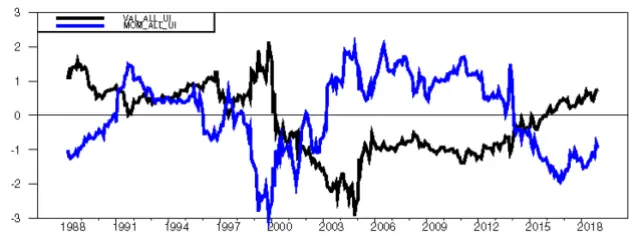

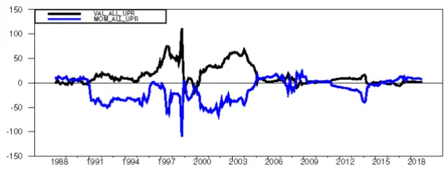

DEI 因子暴露滚动估计值
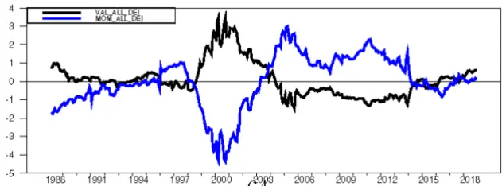
数据来源：《A Global Macroeconomic Risk Model for Value, Momentum, and Other Asset Classes》

图 4：价值和动量组合在全球的溢价情况
价值组合的全球溢价
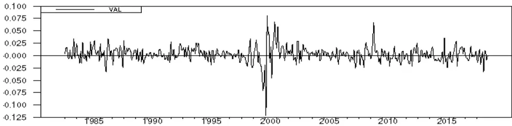
动量组合的全球溢价

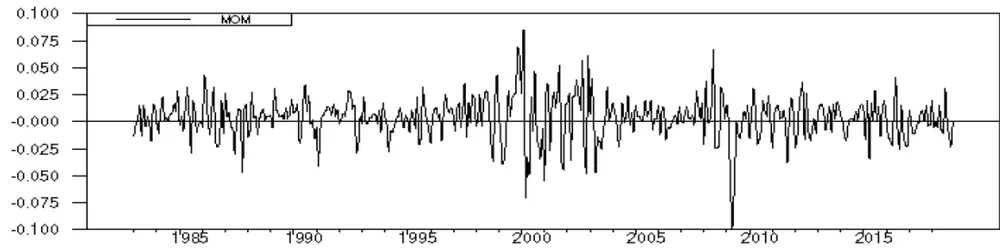
数据来源：《A Global Macroeconomic Risk Model for Value, Momentum, and Other Asset Classes》

## 4.4. 与其他因子模型的比较

我们现在对全球 CRR 因子模型与其他因子模型的性能进行比较。本文选取了 Asness, Moskowitz and Pedersen (2013) 的三因子模型以及 Fama和 French (2017) 的五因子模型。Asness, Moskowitz and Pedersen (2013)中的三个因子分别为MSCI 世界股票市场指数、全球价值因子以及全球动量因子。Fama and French (2017) 的国际五因子除包含全球市场的超额收益外，还包括规模 (SMB)、价值 (HML)、经营利润 (RMW) 和投资(CMA) 因子。

注意到这两个模型中的因子都是基于收益率构建的，其中市场因子为收益率直接加权得到，其他因子为按照特征排序后对收益率进行多空和加权得到。与基于收益率构造的因子相比，由于宏观因子的因子暴露和因子收益率均需要从回归中进行估计，会受到噪声数据的影响。因此，在进行两类模型的比较时，应该考虑到这一点。

Fama and French (2017)使用的数据为 1990 年 7 月至 2018 年 12 月，比前文研究时采用的样本期（1983 年4月至 2018年 12月）短，为了便于模型间的比较，我们缩短样本期后重新对全球 CRR 模型进行了估计，结果如表 7 所示。可以看到，Asness, Moskowitz and Pedersen (2013)的三因子模型解释力较差，R2值为 25%，并且全球价值因子对解释 48 个价值与动量组合的收益差异并没有显著效果。Fama 和 French (2017) 五因子模型的R2值为 27%，同样较低，并且估计得到的 SMB 因子和 CMA因子的风险价格符号为负。总的来看，这两个模型的表现较为接近。相比之下，全球CRR因子模型的定价误差更小，且R2达到了 46%. 这说明在解释价值与动量的跨市场跨资产组合上，全球 CRR 因子的表现更加优异。

与长样本期的结果表 2相比，DEI因子的风险价格失去了显著性，这可能是因为短样本期内的通胀较为温和；UPR和 MP因子保持显著，UTS因子从不显著变为显著。注意到每个因子的正负与表 2保持一致，体现了在样本期变动时全球CRR 因子模型的稳定性。

表 7：48个价值与动量组合下，三个模型中各个因子的风险价格

| Panel A. AMP Factors |  |  |  |  |  |  |  |  |
| --- | --- | --- | --- | --- | --- | --- | --- | --- |
|  | Yo | γm | γval | YM0M | R²(%) | Avg.P.E. |  |  |
| Price of risk | 0.115 | 0.301 | 0.092 | 0.249 | 25.3 | 0.181 |  |  |
| t-statistic | 1.703 | 3.471 | 0.989 | 2.850 |  |  |  |  |
| Panel B. Fama-French Factors |  |  |  |  |  |  |  |  |
|  | Yo | γm | YSMB | YHML | YRMW | YCMA | R²(%) | Avg.P.E. |
| Price of risk | 0.209 | 0.185 | -0.385 | -0.164 | 0.248 | -0.274 | 27.0 | 0.165 |
| t-statistic | 3.01 | 2.145 | -2.164 | -1.190 | 1.795 | -2.183 |  |  |
| Panel C. Global CRR Factors |  |  |  |  |  |  |  |  |
| Price of risk | Yo | YMP | YUI | VDEI | YUTS | YUPR | R2(%) | Avg.P.E. |
|  | 0.34 | 0.414 | -0.049 | -0.057 | -0.037 | -0.022 | 46.4 | 0.138 |
| t-statistic | 5.553 | 3.741 | -1.234 | -0.841 | -2.644 | -4.592 |  |  |

数据来源：《A Global Macroeconomic Risk Model for Value, Momentum, and Other Asset Classes》，国泰君安证券研究

## 4.5. 对其他资产组合的解释能力

如果全球 CRR 因子是跨市场跨资产的不同因子结构的共同风险来源，如果全球市场在某种程度上是一体化的，那么全球 CRR 因子应该能够解释其他组合的风险溢价，而不仅仅是价值与动量组合。为了验证这一点，我们将测试集换成了 103 个组合。这103个组合中包含了上文的 48个价值与动量组合，13 个国际化 betting-against-beta（BAB）组合，10个国际化质量组合以及32个其他组合。根据32 个其他组合的不同，可以分为三个测试集。

三个测试集中除了 32 个其他组合有所区别外，前 71 个组合是一致的。BAB 投资组合来源于 Asness, Moskowitz and Pedersen (2013) ，构造方式为做多低beta的股票，做空高 beta的股票。质量组合为做多高质量的股票，做空低质量的股票，其中质量是对一家公司的盈利能力、增长、稳定性和支付能力的共同衡量。BAB 组合和质量组合的构建细节来自Frazzini and Pedersen (2013)和 Asness, Frazzini, and Pedersen (2019)，数据来自 aqr.com. 剩下的 32 个组合有三种选取方式：第一组测试资产选取了 Fama and French (2017) 构建的 32 个国际股票投资组合，这些组合按规模、账面市值比和经营利润排序；第二组测试资产使用 Fama andFrench 的另一组 32 个投资组合，按规模、账面市值比和投资排序；第三组测试资产使用Fama and French 的另一组32个投资组合，按规模、经营利润和投资排序。之所以选择 Famaand French的这些组合，是因为Fama and French (2017) 认为，规模、账面市值比、投资和盈利能力是投资组合分类的重要特征，并且被大量研究和文献所接受。测试的样本长度为短样本期（1990年7月至 2018年 12月）。

表 8 展示了三个测试集下全球 CRR 模型的表现。与仅含有价值和动量组合时的结果表 4相比，我们发现MP 因子不再显著。在第一组测试集中，DEI 因子溢价变为正，由于测试集的改变，变号的问题可能并不重要。R2值为 32%，定价误差为 0.19%. 模型对第二组资产定价的表现稍差，R2值为 25%，定价误差为每月 0.22%. 风险价格的符号与第一组相同，只是 UTS 因子的符号发生了变化，但 UTS 因子在三个测试集均不显著，其变号的影响不大。第三组测试资产的结果与第二组相似，R2为27%，平均定价误差为每月 0.23%. 总体来看，与 48 个价值和动量组合下的表现相比，全球 CRR 因子模型在扩展测试资产集下的表现有所下降。

表 8：三个测试集下全球CRR因子的风险价格
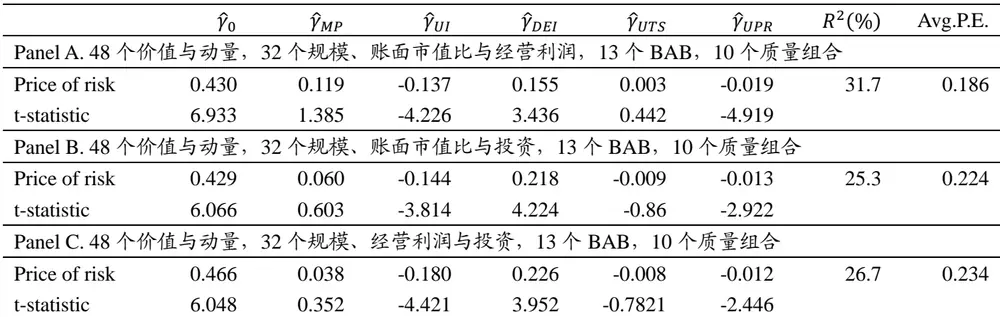
数据来源：《A Global Macroeconomic Risk Model for Value, Momentum, and Other Asset Classes》，国泰君安证券研究

为了形成对比，我们研究 Fama and French (2017) 五因子模型在这组扩展资产上的表现。这是对全球 CRR 因子模型的一个有趣的挑战，因为Fama and French (2017) 因子的构建正是基于三组 Fama and French(2017) 的测试资产集。Fama and French (2017) 五因子的表现如表 9 所示。

在第一组测试资产中，只有 RWM盈利因子是显著的，其他四个因子均不显著，R2为31%，定价误差为每月0.18%，这与全球CRR因子的32%，和 0.19%十分接近。在第二组测试资产中，该五因子模型的R2为 42%，优于全球 CRR 因子模型；定价误差为每月 0.23%，与全球 CRR 模型接近。但我们发现唯一为正且具有显著性的因子是 RMW，并且市场因子的风险溢价变为负数。第三组测试资产中，各个因子的符号与第二组类似，R2 为 29%，定价误差为 0.23%，这与全球 CRR 模型的表现相差无几。

将表 9 与表 7 进行比较，我们会发现当变换测试资产集时，Fama andFrench (2017) 五因子模型也有较多的变号。这说明对于全球 CRR 因子模型和 Fama and French (2017) 五因子模型，测试资产的选择确实对风险价格的符号存在影响。Famaand French 五因子是基于规模、经营利润、盈利和投资构建的，因子的构建方式与测试组合的构造存在重合，所以我们预期它的表现会好于全球 CRR 模型，但从结果来看，Fama andFrench (2017) 五因子模型的表现与全球 CRR 因子模型大致相同。

总而言之，在扩展测试集上，全球CRR 因子模型的表现与 Fama-French(2017) 模型接近，这说明全球 CRR 因子对更多组合的共同风险仍然具有解释能力。

表 9：三个测试集下Fama-French五因子的风险价格
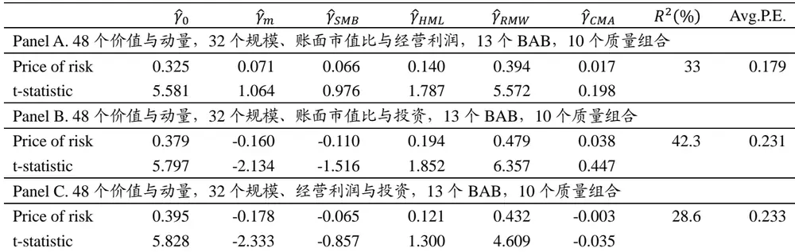
数据来源：《A Global Macroeconomic Risk Model for Value, Momentum, and Other Asset Classes》，国泰君安证券研究

## 5. 总结

## 5.1. 本文文献结论

本文表明，全球 CRR 因子对跨国家、跨资产的价值与动量溢价具有较强解释力，甚至能够解释两者的等权组合的溢价。同时，全球 CRR 因子模型解释了价值和动量策略间的负相关性，回答了Asness,Moskowitz,and Pedersen (2013) 中对资产定价模型提出的问题。

金融市场的风险与全球宏观经济变量以及全球商业周期密切相关。因此，全球宏观经济模型加深了我们对跨市场跨资产收益的驱动因素的经济来源的理解，这是基于特征构建的因子不易做到的。

除价值与动量组合外，全球 CRR 因子模型在解释按规模、账面市值比、经营利润、投资、贝塔值和质量排序的组合的收益横截面时也有良好表现。

## 5.2. 我们的思考

宏观因子一直是投资者关注的重点，一方面是因为宏观环境对于各大类资产、中观层面的行业和风格乃至微观层面的个体均具有重要影响，另一方面宏观因子一般具有较强的可解释性。

这篇文章使用五个宏观因子对部分组合的溢价进行了解释，主要是对各个组合在宏观因子上的暴露进行分析，这体现了宏观因子对跨市场和跨资产收益横截面的解释能力。若将全球市场视为一个整体进行研究，宏观因子将是非常重要的武器。尤其是对在全球各个市场进行投资与对冲的投资者来说，宏观因素是不容忽略的。

原文对宏观因子的使用集中于较大的组合，但也为今后更加细致的研究提供了一些思路。宏观因子是否对行业、风格乃至个体的收益具有解释能力？哪些宏观因子在何时的解释能力较强？这些都具有重要的研究意义。

## 本公司具有中国证监会核准的证券投资咨询业务资格

## 分析师声明

作者具有中国证券业协会授予的证券投资咨询执业资格或相当的专业胜任能力，保证报告所采用的数据均来自合规渠道，分析逻辑基于作者的职业理解，本报告清晰准确地反映了作者的研究观点，力求独立、客观和公正，结论不受任何第三方的授意或影响，特此声明。

## 免责声明