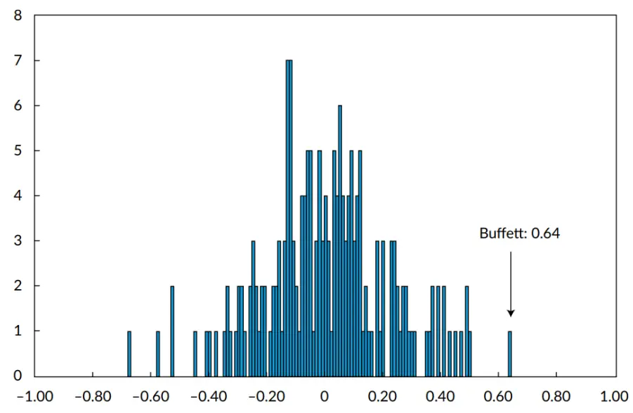
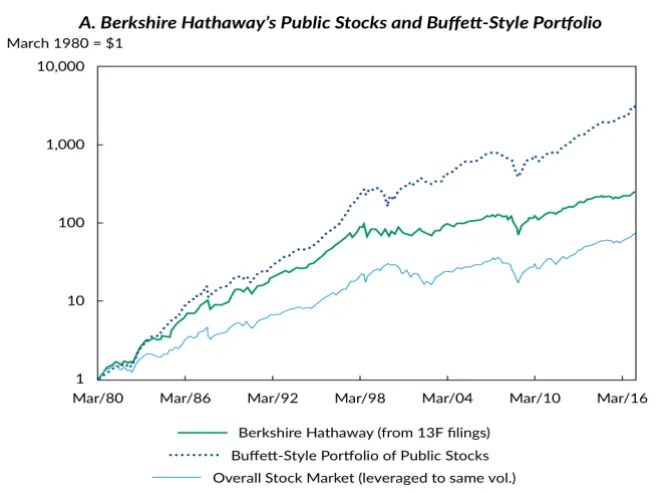
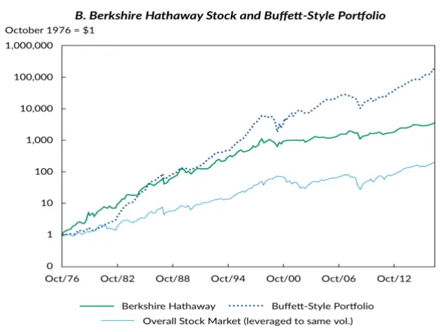

inInfo] [Table_Title] 2021.06.22

# 基金经理研究：巴菲特的成功哲学

## ——学界纵横系列之十

陈奥林(分析师)

## 殷钦怡(分析师)

8 021-38674835

021-38675855

chenaolin@gtjas.com

证书编号 S0880516100001

yinqinyi@gtjas.com

S0880519080013

## 本报告导读：

本文使用多个因子定量的分析了巴菲特的持仓风格，为价值投资提供了可践行的证据

## 摘要：

e_Summary]巴菲特几十年来的业绩有目共睹，伯克希尔哈撒韦公司的平均年化投资回报率较美国国债高出 18.6%。Frazzini 和 Pedersen（2018）拆分巴菲特业绩回报的来源为三部分，其拥有的上市公司的业绩回报、拥有的非上市公司的业绩回报以及使用杠杆放大的收益。

通过分拆其收益数据，巴菲特投资上市股票的超额收益和夏普比率都高于非上市公司股权收益，这表明巴菲特的过人之处主要来自于他的选股能力，而非作为类公司管理者的“经理人能力”。

为分析巴菲特选股能力的特征及选股偏好，Frazzini 和Pedersen 用六个因子来量化分析巴菲特的投资组合，并总结出其特点，分别是MKT、SMB、HML（Fama 三因子）、UMD 动量因子、 BAB 贝塔因子和QMJ盈利因子。组合长期对HML、BAB和QMJ因子的风险暴露显著，即巴菲特持仓的股票有几个基本特征:安全(低贝塔值和低波动性)、便宜(即市净率低的价值股票)和高质量(盈利、稳定、成长性高的股息率股票)。巴菲特的成功来自于长期坚持这种优质的策略——购买廉价、安全、优质的股票。

巴菲特还特别善于利用杠杆提高自己的回报，通过计算，伯克希尔哈撒韦从1976-2017年的杠杆率为 1.7，且公司的杠杆成本非常低，源于其拥有的保险浮存金，伯克希尔的负债中平均约35%由保险浮存金构成。同时受益于高债务评级，巴菲特享有非常低的融资利率。伯克希尔保险浮存金的预计平均年化成本仅为1.72%，比美国国债平均利率低约 3%。因此，巴菲特的低成本保险和再保险业务使他能够获得廉价、长期的杠杆。

该策略在A股同样适用，胡熠和顾明 (2018) 已经做过相关研究：他们从安全性、便宜性和质量三个维度构建了综合的巴菲特风格选股指标 B-Score 并构建组合，发现 B-score 能够很好地区分横截面股票收益，基于B-score的市值加权对冲组合经过 Fama-French三因子调整后的年化超额收益达到18％。

金融工程

## 金融工程团队：

陈奥林：（分析师）

电话：021-38674835

邮箱：chenaolin@gtjas.com

证书编号：S0880516100001

## 杨能：（分析师）

电话：021-38032685

邮箱：yangneng@gtjas.com

证书编号：S0880519080008

## 殷钦怡：（分析师）

电话：021-38675855

邮箱：yinqinyi@gtjas.com

证书编号：S0880519080013

## 徐忠亚：（分析师）

电话：021- 38032692

邮箱：xuzhongya@gtjas.com

证书编号：S0880120110019

## 刘昺轶：（分析师）

电话：021-38677309

邮箱：liubingyi@gtjas.com

证书编号：S0880520050001

## 吕琪：（研究助理）

电话：021-38674754

邮箱：lvqi@gtjas.com

证书编号：S0880120080008

## 赵展成：（研究助理）

电话：021-38676911

邮箱：Zhaozhancheng@gtjas.com

证书编号：S0880120110019

## [Table_R相关报告

美股 40 年：机构化进程中的风格演绎2021.06.22

南方中证科创创业 50ETF 投资价值分析2021.06.16

全球宏观风险因子模型研究 2021.06.16

写在首批 REITs 上市之前:网下询价与公众认 购行为，共识之外差异仍存 2021.06.11

天然气期货的高频交易模式是怎样的2021.06.10

## 1. 选题背景

关于沃伦·巴菲特 (Warren Buffett) 及其投资风格的说法和文章有很多，但几乎没有严格的实证分析来解释他的市场表现。每个投资者对巴菲特的投资方法都有自己的看法。对于价值投资者和量化投资者而言，如何用因子去量化巴菲特的投资方法是十分重要的探索，本篇报告推荐的 Andrea Frazzini, David Kabiller 和 Lasse Heje Pedersen 的学术文章《Buffett’s Alpha》使用因子模型定量地分析了巴菲特的投资哲学，为价值投资原则提供了可践行的证据。

## 2. 核心结论

巴菲特的投资组合的几个基本特征:他购买安全(低贝塔值和低波动性)、便宜(即市净率低的价值股票)和高质量(盈利、稳定、成长性高的股息率股票)的股票，并长期坚持该策略，同时利用杠杆提高了自己的回报。巴菲特的杠杆比率约为 1.7 倍，这提高了他的风险和超额回报。

在数十年的时间里，巴菲特坚持自己的投资理念，他的伯克希尔的平均年化投资回报率较美国国债高出18.6%。

## 3. 巴菲特的业绩表现

沃伦巴菲特的业绩显然是出类拔萃的。若投资者在1976年10月在伯克希尔哈撒韦投资1 美元，在 2017年3 月价值将超过 3685美元。在这段时间内，伯克希尔的平均年化投资回报率较美国国债高出 18.6%，远高于美国股市7.5%的平均超额回报率。

伯克希尔哈撒韦股票的风险也高于市场；它的波动率为23.5%，高于15.3%的市场波动率。然而相对于其风险，伯克希尔的超额回报率也很高；它获得的 Sharpe 比率为 18.6%/23.5% = 0.79，是市场 Sharpe 比率 0.49的 1.6 倍。

伯克希尔的市场贝塔系数为 0.69，根据市场风险敞口调整伯克希尔的业绩后，它的信息比率为 0.64。

这些指标反映了巴菲特令人印象深刻的历史回报，但也反映了伯克希尔哈撒韦的风险也一直存在，伯克希尔经历过多年的衰落期。例如，从1998年6月30日至2000年 2月29日，伯克希尔损失了44%的市值，而同期整个股市上涨了32%。许多基金经理如果跑输市场 76%，肯定难以幸存，但巴菲特的名声和公司的独特结构使他能够在互联网泡沫破灭时坚持下去并强势反弹。

为了客观看待巴菲特的表现，我们将伯克希尔的夏普比率与所有其他的美国普通股票的夏普比率进行了比较。如果巴菲特更多作为一个投资者而不是公司管理者，那么主动管理的共同基金可能是一个比其他股票更好的参照组。下文表 1 显示了伯克希尔与两个参照组的数据比较。

表 1：巴菲特相对于所有其他股票和共同基金的表现：1976-2017

|  | A. Sample Distribution of Sharpe Ratios |  |  |  |  | Buffett Performance |  |
| --- | --- | --- | --- | --- | --- | --- | --- |
|  | Number of Stocks/ |  | 95th | 99th |  |  |  |
| Stock/Fund Measure | Funds |  | Median Percentile |  | Percentile Maximum | Rank | Percentile |
| Sharpe ratio of equity mutual funds |  |  |  |  |  |  |  |
| All funds in CRSP data | 4,585 | 0.36 | 0.69 | 1.10 | 3.20 | 137 | 97.0% |
| All funds alive in 1976 and 2017 All funds alive in 1976 with at least | 133 | 0.36 | 0.54 | 0.63 | 0.79 | 1 | 100.0% |
| 10-year history | 304 | 0.30 | 0.49 | 0.61 | 0.79 | 1 | 100.0% |
| All funds with at least 10-year history | 2,872 | 0.39 | 0.62 | 0.74 | 0.99 | 11 | 99.7% |
| All funds with at least 30-year history | 432 | 0.38 | 0.59 | 0.73 | 0.93 | 3 | 99.5% |
| All funds with at least 40-year history | 186 | 0.33 | 0.52 | 0.63 | 0.79 | 1 | 100.0% |
| Sharpe ratio of common stocks |  |  |  |  |  |  |  |
| All stocks in CRSP data | 23,257 | 0.21 | 0.88 | 1.47 | 2.68 | 1,454 | 93.8% |
| All stocks alive in 1976 and 2017 | 504 | 0.36 | 0.51 | 0.57 | 0.79 | 1 | 100.0% |
| All stocks alive in 1976 with at least |  |  |  |  |  |  |  |
| 10-year history | 3,774 | 0.28 | 0.51 | 0.62 | 0.89 | 8 | 99.8% |
| All stocks with at least 10-year history | 9,523 | 0.28 | 0.57 | 0.75 | 1.12 | 57 | 99.4% |
| All stocks with at least 30-year history |  |  | 0.52 |  |  |  |  |
|  | 2,021 | 0.32 |  | 0.61 | 0.81 | 2 | 100.0% |
| All stocks with at least 40-year history | 1,111 | 0.34 | 0.50 | 0.55 | 0.79 | 1 | 100.0% |

数据来源：《Buffett’s Alpha》

在 1976-2017 年 CRSP 数据库中，巴菲特的业绩在所有共同基金中排名前 3%，在所有股票中排名前 7%。但是比巴菲特夏普比率高或业绩更好的股票和共同基金往往存在时间较短。

为了尽量减少随机性的影响，表 1 还将伯克希尔-哈撒韦和至少存续了10年、30年和 40年的股票和共同基金进行对比。从这个角度来看，巴菲特的表现是真正卓越的。在 1976 年至 2017 年这至少有 40 年历史的所有股票中，伯克希尔实现了最高的夏普比率和信息比率。这就意味着如果投资者能回到过去，并在 1976 年挑选一只股票，伯克希尔将是最好的选择。

图1：伯克希尔的投资业绩在共同基金中所处的位置

数据来源：《Buffett’s Alpha》

图 1 说明了巴菲特在存续期超过 40 年的共同基金的业绩分布中处于最优分布区间。

## 4. 巴菲特的杠杆：规模和成本

沃伦巴菲特的超额回报来源于两点：高夏普比率以及他利用杠杆获得回报的能力。通过研究了伯克希尔哈撒韦公司的资产负债表，可以计算它的杠杆水平：

$$
\begin{array}{r}{\mathrm{~L~t~}=\frac{TA_{t}^{MV}+Cas\bar{\lambda}_{t}^{MV}}{Equity_{t}^{MV}}}\end{array}
$$

其中，TA 是总资产，Cash 是伯克希尔哈撒韦公司持有的现金，Equity是伯克希尔的股票价值，上标 MV 是市场价值。文中作者使用该方法计算了每个月的杠杆率。我们希望总是使用市场价值来计算杠杆，但对于某些变量，我们只能观察账面价值(用上标 BV 表示)。规定伯克希尔的股票市场价值是股价乘以流通股，现金持有来自伯克希尔的合并资产负债表(见附录A)。资产负债表还提供了总资产的账面价值TABV和权益的账面价值EquityBV，这使我们可以估计总资产的市场价值为：

$$
TA_{t}^{MV}=TA_{t}^{BV}+Equity_{t}^{MV}{-}Equity_{t}^{BV}
$$

使用这种方法，我们估计巴菲特的平均杠杆率为 1.7。这一杠杆水平解释了为什么伯克希尔-哈撒韦公司投资了一些相对稳定的资产，却有较高的波动性。

巴菲特的杠杆率也解释了伯克希尔哈撒韦公司的股价波动性明显高于其持有的股票的投资组合，如表 2 所示。伯克希尔 23.5%的股票波动率是是其上市股票组合 16.2%波动率的1.4倍。

表 2：伯克希尔哈撒韦收益分解：上市公司股票，非上市公司股权及杠杆的运用

|  | Performance |  |  | Overall Stock Market | Buffett-Style Portfolio |  |  | Buffett-Style Long-Only Portfolio |  |  |
| --- | --- | --- | --- | --- | --- | --- | --- | --- | --- | --- |
|  | Berkshire Hathaway | Public US Stocks (from 13F filings) | Private Holdings |  | Berkshire Hathaway | Public US | Private | Berkshire | Public US Stocks (from | Private 13F filings) Holdings |
|  |  |  |  |  |  | Stocks (from 13F flings) | Holdings |  |  |  |
| Sample | 1976-2017 | 1980-2017 | 1984-2017 | 1976-2017 | 1976-2017 | 1980-2017 | 1984-2017 | 1976-2017 | 1980-2017 | 1984-2017 |
| Beta | 0.69 | 0.77 | 0.29 | 1.00 | 0.69 | 0.77 | 0.29 | 0.85 | 0.86 | 0.87 |
| Average excess return | 18.6% | 12.0% | 9.3% | 7.5% | 28.5% | 19.0% | 18.1% | 8.4% | 8.6% | 8.3% |
| Total volatility | 23.5% | 16.2% | 20.6% | 15.3% | 23.5% | 16.2% | 20.6% | 13.7% | 13.8% | 14.3% |
| Idiosyncratic |  |  |  |  |  |  |  |  |  |  |
| volatility | 21.1% | 11.2% | 20.1% | 0.0% | 21.1% | 11.2% | 20.1% | 4.4% | 4.5% | 5.1% |
| Sharpe ratio | 0.79 | 0.74 | 0.45 | 0.49 | 1.21 | 1.17 | 0.88 | 0.61 | 0.62 | 0.58 |
| Information |  |  |  |  |  |  |  |  |  |  |
| ratio Leverage | 0.64 | 0.51 1.00 | 0.35 | 0.00 | 1.11 | 1.13 | 0.78 | 0.45 | 0.38 | 0.25 |
|  | 1.71 |  | 1.00 | 1.00 | 5.09 | 2.99 | 4.14 | 1.00 | 1.00 | 1.00 |
| Subperiod excess returns |  |  |  |  |  |  |  |  |  |  |
| 1976-1980 | 41.2% | 31.5% |  | 7.3% | 5.8% | 27.3% |  | 7.9% | 30.5% |  |
| 1981-1985 | 28.6 | 21.3 | 18.4% | 4.8 | 52.5 | 28.1 | 38.2% | 7.0 | 6.3 | 9.7% |
| 1986-1990 | 17.3 | 12.6 | 9.6 | 5.7 | 23.2 | 14.0 | 18.1 | 9.5 | 10.7 | 8.3 |
| 1991-1995 | 29.7 | 18.8 | 22.9 | 12.6 | 38.1 | 23.2 | 25.9 | 11.5 | 11.5 | 12.0 |
| 1996-2000 | 14.9 | 12.1 | 8.7 | 12.1 | 37.1 | 23.1 | 26.0 | 16.2 | 16.2 | 14.1 |
| 2001-2005 | 3.2 | 2.2 | 1.8 | 0.9 | 28.0 | 14.2 | 13.8 | -0.8 | -1.6 | 1.1 |
| 2006-2010 | 6.1 | 4.1 | 4.0 | 2.5 | 1.9 | 3.6 | -5.7 | 2.7 | 1.1 | 1.0 |
| 2011-2015 | 10.8 | 9.9 | 5.0 | 12.1 | 33.8 | 21.8 | 21.8 | 11.2 | 11.5 | 11.0 |
| 2016-2017 | 19.3 | 13.6 | 11.1 | 15.0 | 45.3 | 32.9 | 20.3 | 15.0 | 14.6 | 14.5 |

数据来源：《Buffett’s Alpha》

巴菲特的杠杆规模在一定程度上解释了他是如何战胜市场的——但只是部分原因。例如，如果对市场应用1.7比1的杠杆，那么市场的平均超额回报率就会放大到约 12.7%。然而，这种杠杆化的市场回报率仍然远远低于伯克希尔18.6%的平均超额回报率。

除了巴菲特的杠杆率之外，他的杠杆来源(包括条款和成本)也很有趣。伯克希尔哈撒韦公司的债务从 1989年到2009年一直享有 AAA评级。受益于高评级，巴菲特享有非常低的融资利率。

伯克希尔-哈撒韦公司的杠杆成本非常低，源于其拥有的保险浮存金。保险浮存金类似“贷款”，即预先收取保险费，然后再支付各种各样的索赔。表3 显示，伯克希尔保险浮存金的预计平均年化成本仅为 1.72%，比美国国债平均利率低约3 个百分点。因此，巴菲特的低成本保险和再保险业务使他在获得廉价、长期杠杆的独特机会方面具有显著优势。在收集伯克希尔年度报告中的保险浮存金数据后，我们计算出伯克希尔的负债中平均约35%由保险浮存金构成。

表 3：巴菲特的杠杆成本:保险浮存金
Spread over Benchmark Rates

|  | Fraction of Years with Negative Cost Funds (truncated)a | Average Cost of | T-Bill | Fed Funds Rate | One-Month LIBOR | Six-Month LIBOR | 10-Year Bond |
| --- | --- | --- | --- | --- | --- | --- | --- |
| 1967-1970 | 0.75 | 0.29 | -5.20 | -6.03 |  |  | -5.93 |
| 1971-1975 | 0.60 | 4.45 | -1.18 | -2.38 |  |  | -2.51 |
| 1976-1980 | 1.00 | 0.00 | -7.52 | -8.61 |  |  | -8.88 |
| 1981-1985 | 0.20 | 10.95 | 1.10 | -0.26 |  |  | -1.28 |
| 1986-1990 | 0.00 | 3.07 | -3.56 | -4.60 | -4.79 | -4.90 | -5.30 |
| 1991-1995 | 0.60 | 2.21 | -2.00 | -2.24 | -2.46 | -2.71 | -4.64 |
| 1995-2000 | 0.60 | 2.36 | -2.70 | -3.10 | -3.33 | -3.48 | -3.56 |
| 2001-2005 | 0.60 | 1.29 | -0.82 | -0.96 | -1.05 | -1.19 | -3.11 |
| 2006-2010 | 1.00 | -4.73 | -6.94 | -7.18 | -7.43 | -7.73 | -8.59 |
| 2011-2015 | 1.00 | -2.37 | -2.42 | -2.48 | -2.57 | -2.86 | -4.68 |
| 2016-2017 | 0.50 | 0.23 | -0.39 | -0.46 | -0.57 | -1.03 | -1.85 |
| Full sample | 0.63 | 1.72 | -2.97 | -3.61 | -3.42 | -3.64 | -4.71 |

数据来源：伯克希尔哈撒韦年度报告

## 5. 拆分巴菲特的投资：上市公司&非上市公司

伯克希尔哈撒韦的股票回报率可以分解为其拥有的上市公司的业绩报酬、其拥有的非上市公司的业绩报酬以及其使用的杠杆。上市公司的表现是衡量沃伦巴菲特股票选择能力的一个指标，而非上市公司的表现可能会进一步反映出他作为管理者的成功。

为了评估巴菲特的选股能力，我们使用伯克希尔哈撒韦公司的 13F文件收集了其上市公司的投资组合，并构建了月度时间序列，包括伯克希尔所有上市股票的市场价值， $Public_{t}^{MV}$ ，以及这个模拟投资组合的月度回没有变化)，我们从13F文件中收集伯克希尔哈撒韦的普通股持仓情况，并根据市值加权计算出月度投资组合回报。该投资组合中的股票每个季度更新，投资组合每月进行再平衡以保持权重不变。

我们无法直接观察巴菲特旗下的非上市公司的价值和业绩，但根据我们已知的情况，我们可以反推出这些公司的价值。我们可以用总资产减去公开交易的股票的价值和现金，从而得到非上市公司的市场价值，$\mathrm{Private}_{t}^{MV}$ ：

$$
\mathrm{Private}_{t}^{MV}=TA_{t}^{MV}-\mathrm{Publc}_{t}^{MV}-\mathrm{Cas}_{t}^{MV}
$$

然后，剔除上市公司股票投资组合变化，拆分或增发的影响因素，用下式

计

$$
\begin{aligned}&r_{t+1}^{Private}=\frac{\Delta\mathsf{Private}_{t+1}^{MV}}{\mathsf{Private}_{t}^{MV}}\\&=\frac{r_{t+1}^{f}\mathsf{Liabilities}_{t}^{MV}+r_{t+1}^{\mathsf{Equity}}\mathsf{Equity}_{t}^{MV}-r_{t+1}^{\mathsf{Public}}\mathsf{Public}_{t}^{MV}-\mathsf{r}_{t+1}^{f}\mathsf{Cash}_{t}^{MV}}{\mathsf{Private}_{t}^{MV}}\\\end{aligned}
$$

公

司的投资收益率 $\cdot r_{t+1}^{private}$

$r_{t+1}^{f}$ 为无风险的国债利率， $r_{t+1}^{Equity}$ 为伯克希尔股票收益率，负债的市值可以用下式计算：

$$
\mathrm{Liabibility}_{t}^{MV}=TA_{t}^{MV}-\mathrm{Equity}_{t}^{MV}
$$

根据我们对巴菲特公开和私下的回报以及他的杠杆率的估计，我们可以分解伯克希尔的业绩。伯克希尔的超额回报可以分解为公开上市股票的回

报

$$
\begin{aligned}&\boldsymbol{r}_{t\mp}^{和}\boldsymbol{r}_{t+1}^{Equity}-\boldsymbol{r}_{t+1}^{f}=\\&\overset{上}{\underset{和}{=}}\Big[\boldsymbol{w}_{t}\Big(\boldsymbol{r}_{t+1}^{Priode}-\boldsymbol{r}_{t+1}^{f}\Big)+\big(\boldsymbol{1}-\boldsymbol{w}_{t}\big)\Big(\boldsymbol{r}_{t+1}^{Pultic}-\boldsymbol{r}_{t+1}^{f}\big)\Big]\boldsymbol{L}_{t}\\&会\end{aligned}
$$

司的回报的加权平均值，杠杆率为L:

伯克希尔的投资组合中非上市公司的权重为：

$$
\mathrm{W_{t}=\frac{Privalte_{t}^{MV}}{Privalte_{t}^{MV}+Pulblic_{t}^{MV}}}
$$

通过实证，我们发现，从 1980 年到 2017 年，伯克希尔平均持有 65%的非上市公司，其余 35%投资于上市公司。随着时间的推移，伯克希尔对非上市公司的依赖一直在稳步增长，从上世纪80 年代初的不到20%上升到 2017 年的 78%以上。

表2显示了巴菲特的公开和非公开头寸的表现，两者都表现良好。巴菲特的公共和私人投资组合在平均超额回报、风险和夏普比率方面都超过了整体股市的水平。公开上市股票的夏普比率高于非上市股票，这表明巴菲特的过人之处主要来自于他的选股能力，而不一定是他作为经理人的增值。

伯克希尔哈撒韦公司的整体股票回报率远远高于上市公司股票和非上市公司组合的回报率。原因在于，伯克希尔不是简单地将上市公司和私人公司的股票加权平均，他同时也使用杠杆来放大收益。此外，伯克希尔的夏普比率高于单纯的持有上市公司股票和非上市公司，这反映了分散投资的好处。

## 6. 巴菲特的 Alpha和投资风格:他偏好哪种股票?

沃伦•巴菲特的回报可以归因于他的选股能力和运用杠杆的能力，那么他是如何选择自己的公司的呢?为了回答这个问题，我们考虑了巴菲特的E

$$
\begin{aligned}\mathsf{r}_{\mathsf{d}}^{\mathsf{r}}\mathsf{r}_{\mathsf{t}}-\mathsf{r}_{\mathsf{t}}^{\mathsf{f}}=&\alpha+\mathsf{\beta}_{\mathsf{1}}\mathsf{MKT}_{\mathsf{t}}+\mathsf{\beta}_{\mathsf{2}}\mathsf{SMB}_{\mathsf{t}}+\mathsf{\beta}_{\mathsf{3}}\mathsf{HML}_{\mathsf{t}}\\&+\mathsf{\beta}_{\mathsf{4}}\mathsf{UMD}_{\mathsf{t}}+\mathsf{\beta}_{\mathsf{5}}\mathsf{BAB}_{\mathsf{t}}+\mathsf{\beta}_{\mathsf{6}}\mathsf{QML}_{\mathsf{t}}+\mathsf{\varepsilon}_{\mathsf{t}}\end{aligned}
$$

其中，MKT,SMB,HML是 Fama三因子模型中的三个因子：

MKT 是整个股票市场的超额收益，代表整体市场的回报率减去无风险零 利率的结果。

SMB（Small minus Big）是市值因子，对应了做多市值较小的公司与做空市值较大的公司的投资组合带来的收益率。

HML(High minus Low)是账面市值比因子，对应的是做多高 BM 公司、做空低BM公司的投资组合带来的收益率。

UMD(Up minus down)即过去十二个月中回报率最高的股票组合减去过去十二个月回报率最低的股票组合。该因子假设的是过去表现好的股票更大概率在下一期表现得更好,过去表现差的股票也会在下一期表现得更差。

BAB（Betting against Beta）即低 Beta 的股票组合减去高 Beta 的股票组合。

QMJ（Quality minus Junk），代表的是高质量公司比低质量公司更容易带来回报，质量包括：成长能力、盈利能力、安全能力（Beta水平，低杠杆率）、分红能力。

表 4：伯克希尔哈撒韦持有什么类型的公司？

| Berkshire Stock, 10/1976-3/2017 |  |  |  |  | 13F Portfolio, 4/1980-3/2017 |  |  |  | Private Holdings, 4/1980-3/2017 |  |  |  |
| --- | --- | --- | --- | --- | --- | --- | --- | --- | --- | --- | --- | --- |
| Alpha | 13.4% | 11.0% | 8.5% | 5.4% | 5.8% | 4.5% | 3.0% | 0.3% | 7.0% | 4.9% | 3.9% | 3.5% |
| MKT | (4.01) | (3.30) | (2.55) | (1.55) | (3.09) | (2.46) | (1.62) | (0.16) | (1.98) | (1.40) | (1.10) | (0.91) |
|  | 0.69 | 0.83 | 0.83 | 0.95 | 0.77 | 0.85 | 0.86 | 0.95 | 0.30 | 0.39 | 0.40 | 0.42 |
| SMB | (11.00) | (12.74) | (12.99) | (12.77) | (22.06) | (23.81) | (24.36) | (23.52) | (4.46) | (5.63) | (5.72) | (5.03) |
|  |  | -0.29 | -0.30 | -0.13 |  | -0.19 | -0.19 | -0.05 |  | -0.26 | -0.25 | -0.23 |
| HML |  | (-3.11) | (-3.19) | (-1.17) |  | (-3.73) | (-3.79) | (-0.95) |  | (-2.65) | (-2.56) | (-1.95) |
|  |  | 0.47 | 0.31 | 0.40 |  | 0.28 | 0.19 | 0.25 |  | 0.28 | 0.21 | 0.22 |
| UMD |  | (4.68) | (2.82) | (3.55) |  | (5.20) | (3.25) | (4.32) |  | (2.63) | (1.80) | (1.85) |
|  |  | 0.06 | -0.02 | -0.05 |  | -0.01 | -0.06 | -0.09 |  | 0.08 | 0.04 | 0.04 |
| BAB |  | (1.00) | (-0.25) | (-0.80) |  | (-0.36) | (-1.66) | (-2.58) |  | (1.24) | (0.62) | (0.51) |
|  |  |  | 0.33 | 0.27 |  |  | 0.19 | 0.15 |  |  | 0.15 | 0.14 |
| QMJ |  |  | (3.79) | (3.04) |  |  | (4.08) | (3.18) |  |  | (1.61) | (1.53) |
|  |  |  |  | 0.47 |  |  |  | 0.37 |  |  |  | 0.07 |
| R² |  |  |  | (3.06) |  |  |  | (4.55) |  |  |  | (0.43) |
|  | 0.20 | 0.25 | 0.27 | 0.29 | 0.52 | 0.58 | 0.59 | 0.61 | 0.05 | 0.08 | 0.08 |  |
| Obs. | 486 | 486 | 486 | 486 | 444 | 444 | 444 | 444 | 399 | 399 | 399 | 0.08 399 |

数据来源：《Buffett’s Alpha》

如表4所示，我们分别以伯克希尔哈撒韦股票、它持有的上市公司股票和非上市股票的超额回报rt-rf为被解释变量来进行回归分析。

如前所述，我们首先对 MKT进行回归,得到伯克希尔的β值小于 1，α值显著。接下来在控制变量中加入SMB、HML、UMD。

规模因子SMB是做多市值较小的公司与做空市值较大的公司的策略。因此，对 SMB的正向暴露反映了购买小市值股票的趋势，因此伯克希尔的负向暴露反映了购买大市值股票的倾向。

价值因子 HML 是一种做多高 BM 公司、做空低 BM 公司策略。因此对 HML的正向暴露反映了伯克希尔倾向于购买便宜的股票

动量因子UMD，它相当于购买在过去一年中相对于同行表现良好的股票，而卖空相对表现不佳的股票。伯克希尔对 UMD 的投资暴露不显著，这意味着巴菲特在选择股票时并不是在追逐趋势。

总的来说，这四个因子还不能解释表4 所示的大部分阿尔法值，大市值和估值低的特征不能很好地解释巴菲特的超额收益。

为了探寻巴菲特的超额收益来源，我们加入了 BAB 因子（Bettingagainst Beta）即购买安全的(即低贝塔系数)股票，而回避风险(即高贝塔系数)股票；QMJ 因子（Quality minus Junk），购买高质量的公司，即具有成长能力、盈利能力、安全能力（Beta 水平，低杠杆率）、分红能力的公司。

从表4可以看出，伯克希尔哈撒韦公司对 BAB和 QMJ因子的风险暴露显著，说明巴菲特喜欢购买低 beta（安全）、高质量的股票。在控制这两个因子的情况下，伯克希尔公开股票投资组合的 alpha值降到了统计上不显著的0.3%。也就是说，这些因子几乎完全解释了巴菲特上市股票投资组合的表现。

因此，巴菲特成功的秘密是买入安全、高质量、价值型股票的策略，这两个因子也在很大程度上解释了伯克希尔的整体股票回报和非上市公司的回报。

沃伦·巴菲特是举世公认最杰出的价值投资者，他对安全、高质量股票的专注，对他的业绩非常重要。我们的统计结果与巴菲特自己在伯克希尔哈撒韦公司 2008 年年度报告中的说法一致:“无论是袜子还是股票，我都喜欢购买打折的优质商品。”

再次强调，采用学术界研究的因子来解密巴菲特的投资收益来源，不会减少巴菲特的成功带给我们的震撼。他早在几十年前就已经将学术界的因子付诸于实盘购买股票，并取得了惊人的年化收益率。加杠杆购买低β、优质股票对于巴菲特的卓越投资表现有显著贡献。

## 7. 系统化的巴菲特策略

鉴于我们可以将沃伦巴菲特的业绩归因于杠杆率，以及他对安全、高质量、价值型股票的专注，我们想系统性地复现巴菲特的策略。巴菲特是出色的主动选股者，但我们试图追溯巴菲特的根源，并本着格雷厄姆和多德(1934年)的精神，专注于系统地实施筛选。

我们考虑了系统性的巴菲特投资组合，跟踪巴菲特的风险敞口和主动选股的策略。首先，我们捕捉到巴菲特的风险敞口，βBuffett，作为伯克希尔哈撒韦公司的市场投资组合超额回报的单变量回归斜率。其次，我们通过将伯克希尔月度收益率（经 beta 调整后）对各因子进行回归，从而捕捉到巴菲特的选股偏好：

$$
\begin{aligned}&r_{t}-r_{t}^{f}-\beta^{Buffett}\mathsf{MKT}_{t}=\\&\alpha+\mathsf{mMKT}_{t}+\mathsf{sSMB}_{t}+\mathsf{hHML}_{t}\\&+u\mathsf{UMD}_{t}+\mathsf{bBAB}_{t}+q\mathsf{QML}_{t}+\varepsilon_{t}\\\end{aligned}
$$

回归系数与表4第五列的回归系数相同，除了其中的市场风险敞口减去βBuffettMKTt。等号右边剔除了 alpha 和误差项，表示巴菲特的主动选股偏好:

$$
r_{t}^{A}{=}\operatorname{\mathit{\textsf{mMKTt}}{+}\mathit{\textsf{SSMBt}}{+}\mathit{\textsf{hIMLt}}{+}\mathit{\textsf{uUMDt}}{+}\mathit{\textsf{bBABt}}{+}\mathit{\textsf{qQMJt}}}
$$

我们重新调整了这个主动选股回报序列，以匹配伯克希尔的特殊波动率，

$$
r_{t}^{Active}=r_{t}^{A}\frac{\overline{{\sigma}}_{I}}{\sigma_{r_{t}^{A}}}.
$$

σl，以模拟杠杆的使用，并抵消任何衰减偏差:

最后，我们将伯克希尔的市场风险敞口和无风险回报 rf加回来，构建了我们的系统性巴菲特式投资组合:

$$
\mathbf{r_{t}^{Buffettstyle}}\mathbf{=}\mathbf{r_{t}^{f}}+\mathbf{\nabla\beta^{Buffett}}MKT_{t}+\mathbf{r_{t}^{Active}}
$$

这种系统性的巴菲特式策略是一种与伯克希尔的贝塔系数、特殊波动性、总波动性和主动选股匹配的多元化投资组合。类似地，我们基于伯克希尔哈撒韦公司上市公司股票和非上市公司股权的持有量和波动性，构建了一个巴菲特式的投资组合。

图 2：巴菲特式投资组合及伯克希尔哈撒韦公司收益表现

数据来源：《Buffett’s Alpha》

图2展示了伯克希尔哈撒韦公司、巴菲特的上市股票以及我们构建的巴菲特式投资策略的累计收益率，其中图A 显示了伯克希尔哈撒韦公司持有的公开交易股票的投资组合累计回报、模拟巴菲特投资组合的累计回报、以及整体市场回报。图B 则加入了非上市公司股权收益。

可以看到，无论是否纳入非上市公司股权收益的因素，巴菲特的投资组合都大幅跑赢同期的全市场收益率，且文中构建的巴菲特风格策略跑赢巴菲特的实盘表现，但模拟的巴菲特风格的投资组合没有考虑交易成本和其他成本。

最后，表5展示了我们构建的巴菲特式投资组合和实际巴菲特投资组合的相关性、alpha和因子暴露的情况。

表 5：巴菲特的回报vs.系统性巴菲特策略

|  | Berkshire Regressed on Systematic Portfolio |  |  | Systematic Portfolio Regressed on Berkshire |  |  |
| --- | --- | --- | --- | --- | --- | --- |
|  |  | Public US |  |  | Public US |  |
|  | Berkshire Hathaway | Stocks (from 13F filings) | Private Holdings | Berkshire Hathaway | Stocks (from 13F filings) | Private Holdings |
| Sample Alpha | 1976-2017 | 1980-2017 | 1984-2017 | 1976-2017 | 1980-2017 | 1984-2017 |
| (annualized) | 5.4% | 0.3% | 3.5% | 18.7% | 10.2% | 14.2% |
|  | (1.64) | (0.17) | (0.98) | (5.85) | (5.99) | (4.10) |
| Loading | 0.34 | 0.43 | 0.23 | 0.34 | 0.43 | 0.23 |
|  | (8.05) | (10.01) | (4.60) | (8.05) | (10.01) | (4.60) |
| MKT | 0.45 | 0.44 | 0.23 | 0.45 | 0.44 | 0.23 |
|  | (6.87) | (9.59) | (3.45) | (6.87) | (9.59) | (3.45) |
| Correlation | 0.48 | 0.73 | 0.26 | 0.48 | 0.73 | 0.26 |
| R2 | 0.29 | 0.61 | 0.09 | 0.29 | 0.61 | 0.09 |

数据来源：13F数据库

系统性投资组合与伯克希尔的上市公司股票组合之间的相关性为73%(见表5)，这意味着我们的系统性投资组合解释了 73%的上市公司股票组合的方差。

最初，交易成本在早期很小，随着伯克希尔的成长，交易成本也在增加，这可能是伯克希尔收益逐渐减少的部分原因。此外，伯克希尔最初关注的是小型公司，这反映在前半部分的正向规模因子（SMB）暴露上，但之后可能越来越被迫关注大盘股。表4显示，伯克希尔对 SMB因子具有负向规模因子（SMB）暴露。因此，伯克希尔的收益递减也可能与容量限制有关。

对于上市公司股票，伯克希尔可能面临双重的公司税，也就是说，投资组合公司的收益和伯克希尔在获得股息或实现资本利得时需要间接缴税。不过，伯克希尔可以从收到的股息中扣除 70%-80%，通过持有这些头寸来推迟缴纳资本利得税。作为跨国公司，还可以将收益分配到海外来最小化税收。因此，很难评估伯克希尔总体上是否处于税收劣势。

## 8. 结论

## 8.1. 原文结论

在研究的样本中，我们发现伯克希尔哈撒韦公司的夏普比率在所有公司中是最高的，比所有成立超过40年的美国共同基金的夏普比率都要高。我们发现，伯克希尔哈撒韦公司在1976年至2017年的夏普比率为0.79，尽管这个夏普比率几乎是整个股市的两倍，但它比许多投资者想象的要低。根据市场敞口进行调整后，巴菲特的信息比率更低，为 0.64。该夏普比率反映了其较高的平均回报率，但也反映了较大的风险、阶段性亏损和大幅回撤。

我们考虑了巴菲特的能力是他购买正确股票的能力还是他作为CEO 的能力。我们将伯克希尔哈撒韦公司的收益分解为两部分: 上市公司股票投资和非上市公司投资，我们发现，二者对巴菲特的业绩都有贡献，但上市股票的投资组合表现更好，这表明巴菲特的技能主要是在选股方面。

巴菲特严重依赖非上市公司，包括保险和再保险业务。一个原因可能是税收，另一个原因可能是这种结构提供了稳定融资来源(巴菲特35%的负债是由保险浮存金（例如提前收取的保费）)构成的，其平均成本低于国债利率,让他能够充分发挥自身的选股能力。

巴菲特的投资组合的几个基本特征:他购买安全(低贝塔值和低波动性)、便宜(即市净率低的价值股票)和高质量(盈利、稳定、成长性高的股息率股票)的股票。有趣的是，具有这些特征的股票通常表现良好，所以这些特征有助于解释巴菲特的投资。

总之巴菲特长期坚持一种良好的策略——购买廉价、安全、优质的股票，在其他人可能被迫贱卖或转换职业的艰难时期幸存下来，并利用杠杆提高了自己的回报。巴菲特的杠杆比率约为 1.7 比 1，这提高了他的风险和超额回报。他的成就包括在数十年的时间里坚持信念、有资金运作、有技巧地运用杠杆和显著风险。

## 8.2. 思考

巴菲特相信，投资就是创造价值本身，只要方向正确，滚起自己的雪球，就会产生源源不断的回报。他更像是一个股权投资者，他看中的都是公司持续经营赚钱的能力，至于价差都是无心插柳的结果。所以他总是在比较各种资产的收益率和风险，当股票高估时，他就大量买入债券。当美国房市出现泡沫时，他开始看空美国，大量投资外币和信用衍生品。

巴菲特的独特之处在于他不断地收购保险公司，然后再用保险公司的浮存金，收购其他喜欢的公司，持续创造现金流。股市只要低迷，他就有源源不断的钱来抄底。涨起来他也很少卖.这种滚雪球的方式，让他战胜了指数。

同时巴菲特也深谙资产配置的方法，通过他的资产配置比例的动态调节来实现抄底和逃顶。当股市大涨，他的动态调整体系一定会卖掉一部分股票仓位买入债券，所以最后等市场跌下来，人们会发现，巴菲特又成功逃顶。

那么巴菲特的价值投资风格在中国是否有效？

国内的学者胡熠和顾明 (2018) [1]已经做过相关研究：巴菲特风格在 A股同样表现优异。他们的做法与 Frazzini, Kabiller, and Pedersen(2018) 有所差异，他们从安全性、便宜性和质量三个维度构建了综合的巴菲特风格选股指标 B-Score。

他们用市场 beta 和异质波动率（IVOL）来衡量股票的安全性，用账面市值比（BM）、 广告费用（ADV）和研发费用（RD）来度量股票的便宜程度，并用毛利润资产比（GPOA）、应计利润（ACC）和净经营性资产（NOA）来表征股票的质量。

他们基于 2005 年 1 月至 2016 年 12 月 A 股市场的实证研究结果表明，B-Score 构建的组合可带来显著的超额收益，其平均收益率高于单独的指标构建的组合收益（安全性、便宜性和质量），且波动率显著降低，从而显著性大大提升。而后续的双变量分组检验和稳健性分析也表明， B-Score 指标可获取稳健的超额收益，巴菲特风格在 A 股有着优异表现。

## 参考文献

[1]巴菲特的阿尔法:来自中国股票市场的实证研究[J]. 胡熠,顾明.管理世界. 2018(08)

## 本公司具有中国证监会核准的证券投资咨询业务资格

## 分析师声明

作者具有中国证券业协会授予的证券投资咨询执业资格或相当的专业胜任能力，保证报告所采用的数据均来自合规渠道，分析逻辑基于作者的职业理解，本报告清晰准确地反映了作者的研究观点，力求独立、客观和公正，结论不受任何第三方的授意或影响，特此声明。

## 免责声明