inInfo] [Table_Title] 2021.06.22

# 基于机器学习的日内波动率预测

## ——学界纵横系列之十

陈奥林(分析师)

## 刘昺轶(分析师)

8 021-38674835

021-38677309

chenaolin@gtjas.com

证书编号 S0880516100001

liubingyi@gtjas.com

S0880520050001

## 本报告导读：

通过机器学习，我们如何提升波动率模型的表现？

## 摘要：

le_Summary]历史背景：长时间来，学界及业界开发了包括日内估计、GARCH、连续时间模型等近200-300种描述及预测波动率的模型。从交易信号到算法策略，这些模型为许多量化组合提供了极为重要的参考。

- 预测波动率的重要性：波动率模型为建立交易信号、算法策略、量化组合的分配都提供了重要参考。

波动率预测的难点：对于金融市场上不同类的资产，仅仅一类模型将很难给出一个有效的预测。我们需要对不同的资产标的针对性地使用不同种类的波动率模型来得到可靠的结果。

人工选择合适的模型是一个非常复杂且低效的方法。通过监督性学习算法，我们可以自动化这一过程。同时，通过对一些指标的监测，这个算法可以自动地修正其结果并给出相对准确的波动率预测。对基于波动率的量化模型而言，这个算法是非常有帮助的。

金融工程

## 金融工程团队：

陈奥林：（分析师）

电话：021-38674835

邮箱：chenaolin@gtjas.com

证书编号：S0880516100001

## 杨能：（分析师）

电话：021-38032685

邮箱：yangneng@gtjas.com

证书编号：S0880519080008

## 殷钦怡：（分析师）

电话：021-38675855

邮箱：yinqinyi@gtjas.com

证书编号：S0880519080013

## 徐忠亚：（分析师）

电话：021- 38032692

邮箱：xuzhongya@gtjas.com

证书编号：S0880120110019

## 刘昺轶：（分析师）

电话：021-38677309

邮箱：liubingyi@gtjas.com

证书编号：S0880520050001

## 吕琪：（研究助理）

电话：021-38674754

邮箱：lvqi@gtjas.com

证书编号：S0880120080008

## 赵展成：（研究助理）

电话：021-38676911

邮箱：Zhaozhancheng@gtjas.com

证书编号：S0880120110019

## [Table_R相关报告

美股 40 年：机构化进程中的风格演绎2021.06.22

南方中证科创创业 50ETF 投资价值分析2021.06.16

全球宏观风险因子模型研究 2021.06.16

写在首批 REITs 上市之前:网下询价与公众认 购行为，共识之外差异仍存 2021.06.11

天然气期货的高频交易模式是怎样的2021.06.10

## 1. 机器学习在波动率模型中的用途

## 1.1. 降低策略回测和执行的维度

在波动率交易的策略中通常有两部分的参数：波动率及策略本身的参数。
这两部分的参数共同组成了一个二维的参数集。

在量化策略中，高维度的数据或参数通常会使策略变得更加复杂。通过机器学习，Sepp（2018）将这个二维的参数集分解成为两个正交的集合。这个降维操作使策略的回测及执行变得更加简单。

## 1.2. 模型设计

基于机器学习与贝叶斯统计，波动性模型的策略设计有三个部分：

1. 波动率模型：我们可以把由不同波动率模型得到的收益分布的超参数作为监督性学习的参数

2. 贝叶斯概率：找出收益数据基于（1）的条件概率

3. 策略参数：通过组合（1）与（2），预测实际波动率

## 1.3. 最优波动率模型与交易策略

最优的波动率模型有许多的应用：

1. 波动率交易：从大宗商品到股票市场，这个模型可以给出预期的波动率用于辅助波动率交易。

2. 跟随趋势：最优模型可以标准化交易时间序列的标准差。同时，最优模型也可以检测时间序列的自相关。

3. 资产分配：通过对资产协方差矩阵的标准化，我们可以更好的进行组合内的资产分配。

## 2. 波动率交易

## 2.1. 实际波动率的应用场景：预测风险溢价

根据Sepp，期权的价值由以下的四部分组成：

1. 复制成本（ 已实现Gamma ） = 已实现波动率 × Gamma

2. 交易成本 $\ (delta\overrightarrow{x}y\prime\overrightarrow{\varphi})=|$ 已实现Gamma| × 买卖差价

3. 敞口风险(无法对冲的delta风险) = 价格崩溃或低流动性

4. 市场估值(vega)风险= 隐含波动率的变化

我们可以使用实际波动率来预测波动率的风险溢价。我们可以通过买入点差较小的期权和卖出点差较大的期权来进行 Delta 对冲。我们也可以通过实际波动率来预测期权价格的回撤。

## 2.1.1. 期权策略盈亏

本文中，通过Delta 对冲的跨式期权的收益由以下公式表达：

$$
4\times5=67/72\div368(Theta\frac{53}{5}\overline{{{5}}})-\frac{3}{5}\times5\overline{{{5}}}\times57/7=(Gamma\frac{53}{5}\overline{{{5}}})
$$

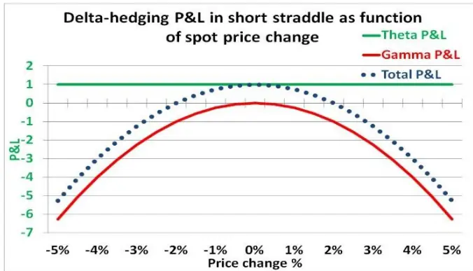
图 1 Delta对冲盈亏与即期价格变化的关系

数据来源：国泰君安证券研究

## 3. 备选的波动率模型

在监督性学习过程中，作者使用了多类别的波动率模型。

1. 样本空间估计量：这是一种日内估计量。它假设波动率满足随机游走性质。

2. GARCH 模型

3. 贝叶斯参数模型

4. 隐马尔科夫模型

## 4. 如何评价最优波动率模型

我们如何判断模型是否存在过拟合的情况？作者否定了根据策略盈亏来判断模型表现的方法并给出了三个原因。第一，Delta 对冲策略存在很强的周期性。某一阶段的亏损并不能代表模型一定存在过拟合的情况。第二，与线性的买卖预测不同，波动率预测本身会影响对冲的决策。第三，与正股不同，期权策略被许多不同因素共同影响着：行权价格、行权日期、对冲策略等。

如果盈亏不是很好的评价方式，我们应如何评价波动率模型的表现？作者给出的答案是将模型的预测与基准测试的结果进行比较。例如，对于日终对冲，我们可以将模型预测的收盘波动率与基准进行比较。我们同时也可以通过分布测试来判断预测结果的稳定性。

## 4.1. 强预测力模型

定义模型的样本分布Z(n):

$$
Z(n)={\frac{{\vec{\infty}}\pm\pmb{\mathcal{W}}[{\overline{{\varrho}}}]\pmb{\mathcal{H}}(n)}{\lambda\pmb{\mathcal{W}}\pmb{\bar{\Xi}}\pmb{\mathcal{H}}\pmb{\mathcal{S}}\mp\pmb{\bar{j}}\pmb{\mathcal{W}}(n)}}
$$

对于一个强有力的模型，Z(n)应该遵循标准正态分布。我们可以通过正态检测来选出符合标准的模型。同时，一个强有力模型给出的波动率范围会是相对小且精确的。

图 2 模型预测的样本分布
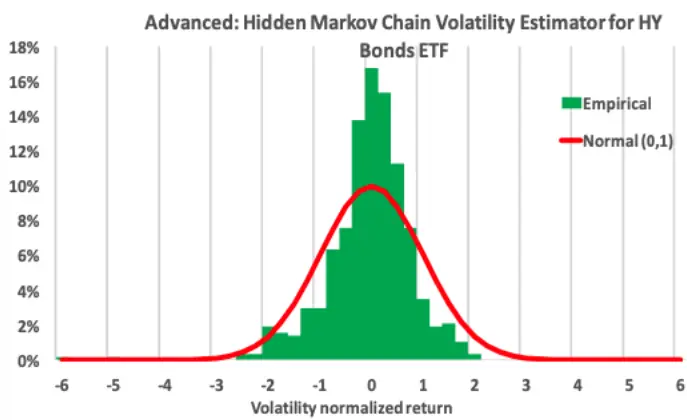
数据来源：《Machine Learning for Volatility Trading》，国泰君安证券研究

图 3 模型预测的范围（标准化）

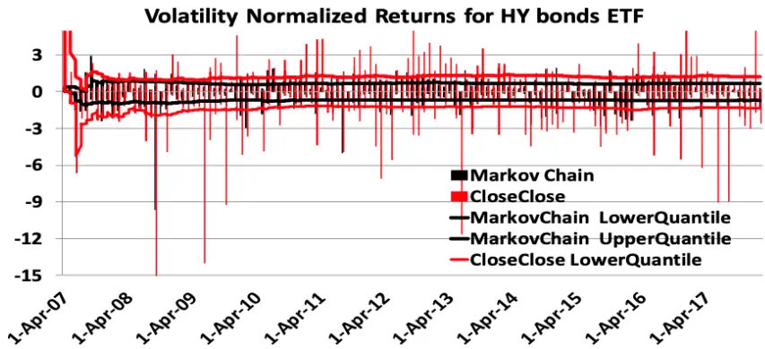
数据来源：《Machine Learning for Volatility Trading》，国泰君安证券研究

## 5. 监督性学习

## 5.1. 流程

作者详细给出了一个完整通过监督性学习产生最佳模型的流程：

1. 选择备选模型：从（3）中提到的四种类别中选出大于三十个具有不同参数的备选模型。

2. 统计测试：通过使用至少一种统计检验检测备选模型预测

3. 结果的统计功效。

4. 备选模型的排名：我们可以对备选模型通过不同的统计监测进行排序。对于 M种统计测试，我们可以得到 M种不同的排名

5. 根据排名选择模型：在这一步，选择排名靠前的模型或模型组合

6. 监督性学习：以上的步骤将会周期化（交易日/月/年）执行。在通过分析一定量的排名与选择结果后，我们可以在下一次的排名时利用这些历史数据去预测排名靠前的组合。

## 5.1.1. 举例：标普500指数波动率

在这个例子里，作者使用了三年的滑动窗口对不同模型的表现进行了预测。作者将备选模型进行了编号（1，2，3，……）。在预测标普500 指数波动率上，马尔可夫模型 31和 32 常常取得榜首。同时，作为相对简单的模型，日内模型 1-10也十分可靠。

图 4 每三年标普500波动率预测前三名（模型均经过正态检测）
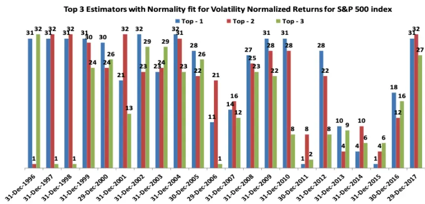
数据来源：《Machine Learning for Volatility Trading》，国泰君安证券研究

## 5.1.2. 财报日对预测的影响

在财报日，股票的涨跌及有关期权的日内波动率常常会有非常极端的变化。

图 5 亚马逊（AMZN）的每日回报率（财报日已用红点标出）

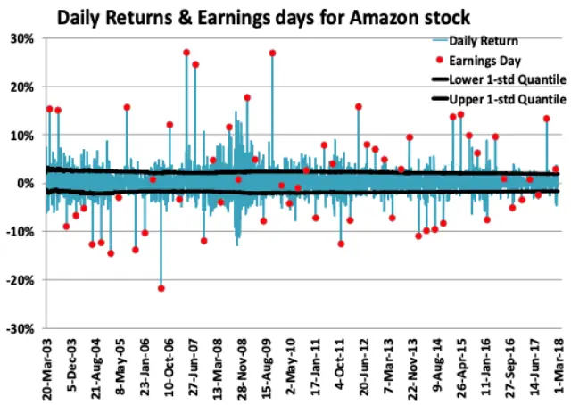
数据来源：《Machine Learning for Volatility Trading》，国泰君安证券研究

图 6 亚马逊（AMZN）的日内波动率（财报日已用红点标出）
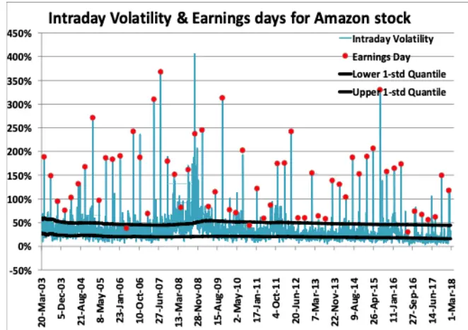
数据来源：《Machine Learning for Volatility Trading》，国泰君安证券研究

具体地说，我们可以通过给予财报日日期相对高的权重（隐含与实际波动率）来解决这个问题。我们可以通过分析平值期权的周期性结构特征来得到隐含波动率的调整参数。对于实际波动率，分析历史数据是给出权重的一个重要的方法。

图 7 亚马逊（AMZN）平值期权的隐含波动率（财报日前一天已用红点标出）
1m At-the-money implied volatility for Amazon stock
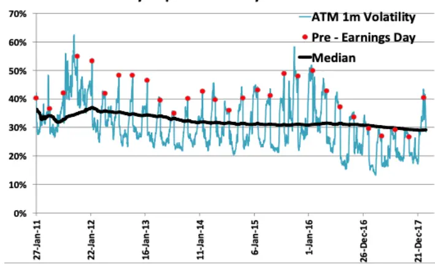
数据来源：《Machine Learning for Volatility Trading》，国泰君安证券研究

图 8 亚马逊（AMZN）在财报日附近波动率预测与实际的对比（红色：实际波动率，蓝色：预测波动率）
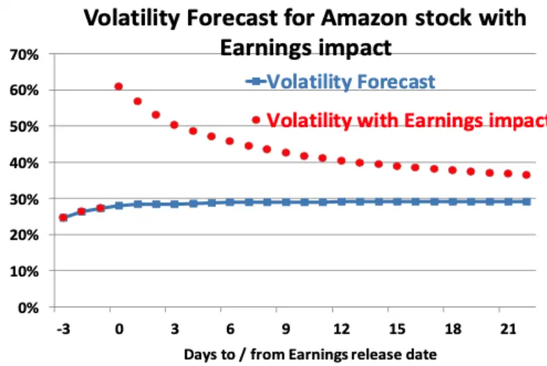
数据来源：《Machine Learning for Volatility Trading》，国泰君安证券研究

在获得隐含波动率之后，财报当天回报率的绝对值即可通过以下公式得出：

$$
{\biggl|}{\frac{H\cdot B}{2}}[{\overline{{\mathbf{\Lambda}}}}]+[{\overline{{\mathbf{\Lambda}}}}]{\overline{{\mathbf{\Lambda}}}}+{\biggl|}=LE{\mathbf{\Lambda}}[{\overline{{\mathbf{\Lambda}}}}]{\mathbf{\Lambda}}[{\overline{{\mathbf{\Lambda}}}}]+{\mathbf{\Lambda}}[{\overline{{\mathbf{\Lambda}}}}]{\overline{{\mathbf{\Lambda}}}}[{\mathbf{\Lambda}}]+\boxed{H\times1}{\mathbf{\Lambda}}[{\mathbf{\Lambda}}]{\mathbf{\Lambda}}{\hat{\mathbf{\Lambda}}}[{\overline{{\mathbf{\Lambda}}}}]=-{\mathbf{\Lambda}}[-1].
$$

我们可以通过对历史波动率与回报率进行线性回归来得到这个比例因子。

图 9 亚马逊（AMZN）每日回报率的绝对值

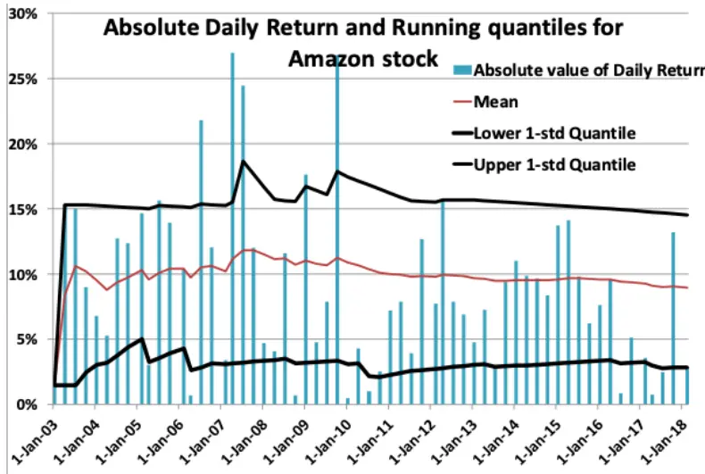
数据来源：《Machine Learning for Volatility Trading》，国泰君安证券研究

图 10亚马逊（AMZN）日内回报率与日内波动率的线性回归

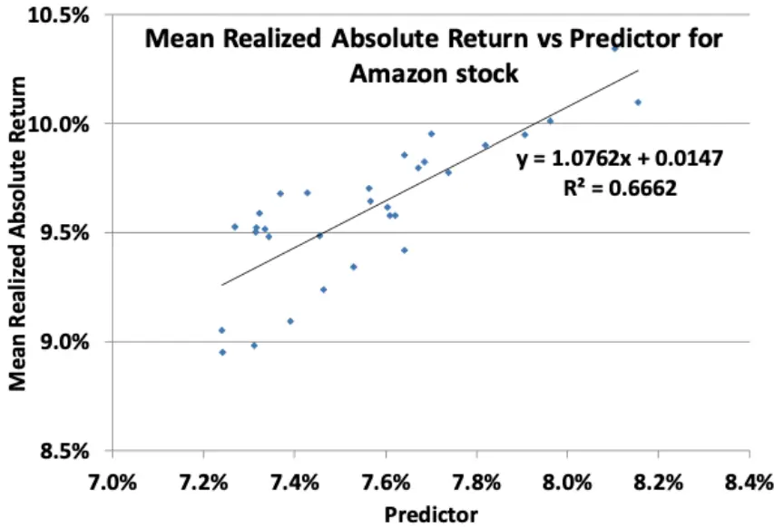
数据来源：《Machine Learning for Volatility Trading》，国泰君安证券研究

## 5.2. 资产分类

不同类资产通常具有不同的波动率。所以，对于不同类别的资产，我们需要对它们分别进行以上所提到的排序与选择流程。所以，实际的波动率预测将会有三个部分：

1. 将不同类别的资产（股指、科技股、期货、外汇市场等）数据进行分类。

2. 将以上提到的N种波动率模型分别应用于每一种资产上。之后，在每一种资产类别内通过 M 种统计测试分别对这 N 种模型进行排序。

3. 若我们需要预测某个标的的波动率，我们可以通过使用该资产所在类别中排名相对靠前的模型（或模型的组合）进行预测。

## 5.3. 与搜索引擎的类比

以上提到的监督性学习算法可以被类比为一种搜索引擎。如果我们想要执行标普500指数的Delta 对冲策略，我们可以在 2018年 5月 14 日想要预测标普 500 指数下月的波动率（提出问询）。收到问询以后，“搜索引擎”（模型）将会依照以上提到的测试与排序结果输出最佳模型（或模型的线性组合）的波动率预测。最后，为保持高的“用户满意度”，我们可以根据实现盈亏来调整“搜索引擎”的权重，从而使下一次的波动率预测更为准确。

## 5.4. 自动化风险控制

对于期权策略，本模型可以控制三种不同的期权风险

1. Delta 风险：标的资产价格的变化驱动了Delta 值的变化。通过对不同类别标的给予不同的换算系数后将 Delta 的变化趋势进行聚合，本模型可以通过学习聚合数据来解决这个问题。

2. Vega 风险：Vega 风险主要来自于隐含波动率的剧烈变化与Delta 变化的双重影响。本模型可以通过学习不同行权日期/价格期权的Vega 与Delta的聚合数据来解决这一问题。

3. Gamma 风险：Gamma 反映了期权对应标的价格变化的二阶导数（Delta变化率）。为了防止对应标的变化的速度急速加快或减缓（Gamma 风险），特定情境下的压力测试是非常有必要的。

对于 Delta 与 Vega 风险而言，我们只有两到三个风险因子来预测它们

的发生。为了解决该问题，我们需要对波动率曲面进行主成分分析。

图 11 主成分数量与波动率与波动率曲面R2的关系
% Portion of variance explained by components fors&P500 Index changes in the implied volatility surface AMZN stock
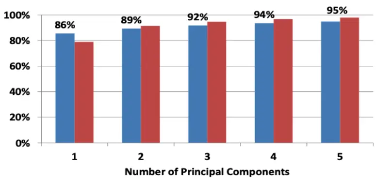
数据来源：《Machine Learning for Volatility Trading》，国泰君安证券研究

## 5.4.1. 线性回归

线性回归对于减少 Delta 与 vega 风险都很有效。对于 Delta 风险而言，我们可以通过回归分析发现波动率与对应标的价格的关系。

图 121 个月到期平值期权波动率与标普500 指数每日变化率关系
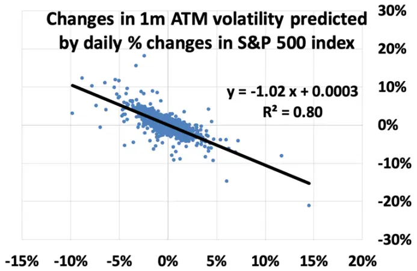
数据来源：《Machine Learning for Volatility Trading》，国泰君安证券研究

图 13不同到期日标普500 平值期权的Beta
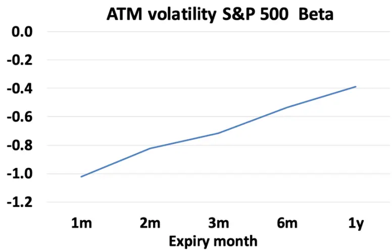
对于 Vega 风险，一个市场化的预测模型为：
我们可以通过加入波动率倾斜beta来对Delta导致的Vega风险进行有效的对冲。

图 14波动率倾斜与标普 500 指数每日变化率预测 1个月到期平值期权波动率的百分比

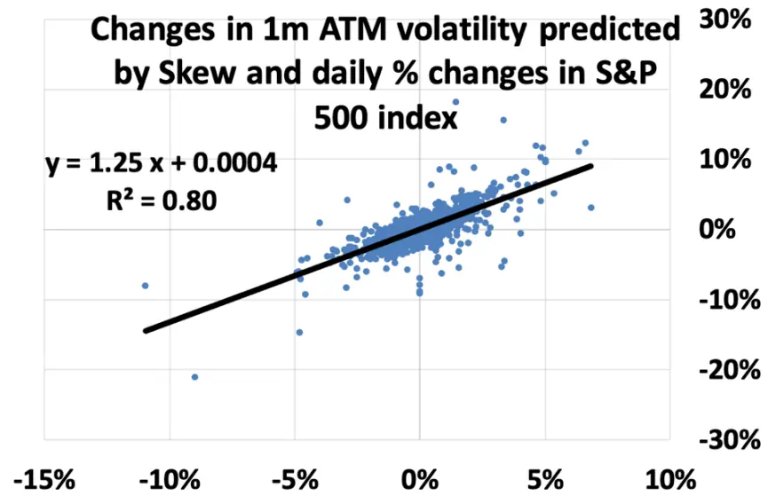
数据来源：《Machine Learning for Volatility Trading》，国泰君安证券研究

图 15不同到期日标普500 平值期权波动率倾斜的贝塔

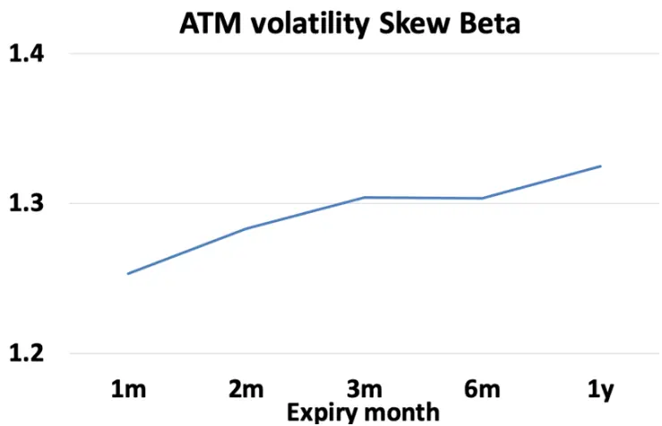
数据来源：《Machine Learning for Volatility Trading》，国泰君安证券研究

## 6. 结语

几十年来，学界与业界提出并完善的波动率模型常常使人感到眼花缭乱。如何选择正确的模型（及参数）是一个非常重要的问题。Sepp 提出的机器学习模型有效地简化了这个流程。

Sepp 认为波动率具有很强的特征性。对于不同类的资产而言，它们的波动性往往有很大的区别。另一方面，同一个标的在不同的时间点也可能有不同的波动率。这让我们无法得到一个有效且通用的波动率预测模型。

基于以上的前提，Sepp 将训练数据进行了聚合与分类，并周期性地在不同时间对他的模型进行训练。在完成训练之后，Sepp 使用了模型盈亏等指标来提供反馈并改善模型。

对于模型的选择，Sepp 认为奥卡姆剃刀是一个非常重要的原则：选择一个需要最少假设的答案。一个存在太多层或需要过多的假设的模型会是误差反馈变得低效。

以上的描述使 Sepp 提出的模型与搜索引擎高度相似。与 Sepp 的模型一样，搜索引擎也需要一个搜索的目标（波动率）、处理请求、给出预测。

## 本公司具有中国证监会核准的证券投资咨询业务资格

## 分析师声明

作者具有中国证券业协会授予的证券投资咨询执业资格或相当的专业胜任能力，保证报告所采用的数据均来自合规渠道，分析逻辑基于作者的职业理解，本报告清晰准确地反映了作者的研究观点，力求独立、客观和公正，结论不受任何第三方的授意或影响，特此声明。

## 免责声明