inInfo][Table_Title]2021.07.14

# 防御性因子择时：低频化风险控制工具

## ——学界纵横系列之十三

陈奥林(分析师)

## 殷钦怡(分析师)

8 021-38674835

021-38675855

chenaolin@gtjas.com

yinqinyi@gtjas.com

证书编号 S0880516100001

S0880519080013

## 本报告导读：

对投资组合进行低频化的防御性因子择时，可以在市场面临极端情况时降低组合风险，减少本金损失。

## 摘要：

le_Summary]一个出色的投资组合的基础是平衡的资产种类配置或因子配置，但因子溢价通常虽时间变动。投资者常采用三种策略以应对这种变动：忽略短期变动、建立短期预测模型、防御性因子择时。其中防御性因子择时通过对特定指标的观测，于市场极端风险情况下进行（低频的）降低组合风险的操作，来避免投资者在不佳的市场环境时遭受较大损失。

防御性因子择时中使用的三个指标分别为风险容忍指标，分散比率指标与因子估值指标。其中前两个指标拥有互补性，可以解释较多情况的市场。同时，前两个指标为整体指标：当观测到这两个指标出现极端情况（一般为极速下跌或极端负值），通常选择将整个投资组合进行去风险化。而因子估值指标则对每个因子分别估测，当因子估值出现极端情况时，仅需要调整投资组合对特定因子的风险暴露度即可。

在因子选择上，本文仅选择了数个宏观因子。这是因为当出现极端市场情况时，这些宏观因子的变化更为明显且更容易捕捉。并且宏观因子相对风格因子而言通常能够解释更多的资产种类收益率。本文选择的因子为经济增长、实际利率、通胀、信贷、新兴市场与流动性。

本文将所提出的防御性因子择时策略于近年来的数次下行市场案例进行了回测。这些案例包括 2010 年与 2012 年的欧债危机，2013 年的缩减恐慌，2015 年的中国股市衰退与石油担忧。数据显示，若根据防御性因子择时策略，在观测到对应指标出现极端值后对投资组合进行去风险化，都能使最大回撤在一定程度上缩小，这说明了该策略的有效性。

防御性因子择时的优点主要如下：操作频率低，这意味着较低的分析与操作成本。对市场的捕捉能力强，风险容忍指标与分散比率的互补性让其能够在较多情况下进行预测。有效调整组合风险，根据该策略将投资组合去风险化均能在对应时期帮助投资者避免一定程度的亏损。通过选择更多的指标或因子，该策略的优点或许能获得进一步的提升。

金融工程

## 金融工程团队：

陈奥林：（分析师）

电话：021-38674835

邮箱：chenaolin@gtjas.com

证书编号：S0880516100001

## 杨能：（分析师）

电话：021-38032685

邮箱：yangneng@gtjas.com

证书编号：S0880519080008

## 殷钦怡：（分析师）

电话：021-38675855

邮箱：yinqinyi@gtjas.com

证书编号：S0880519080013

## 徐忠亚：（分析师）

电话：021- 38032692

邮箱：xuzhongya@gtjas.com

证书编号：S0880519090002

## 刘昺轶：（分析师）

电话：021-38677309

邮箱：liubingyi@gtjas.com

证书编号：S0880520050001

## 吕琪：（研究助理）

电话：021-38674754

邮箱：lvqi@gtjas.com

证书编号：S0880120080008

## 赵展成：（研究助理）

电话：021-38676911

邮箱：Zhaozhancheng@gtjas.com

证书编号：S0880120110019

## [Table_R相关报告

易方达中证科创创业 50ETF投资价值分析2021.07.11

企业社会责任的纳入如何降低了组合风险2021.07.01

美股 40年：机构抱团与核心资产估值演绎2021.06.24

环境-性格双核基金评价框架 2021.06.23

基 于 机 器 学 习 的 日 内 波 动 率 预 测2021.06.22

## 1. 概述

作者在如何应对因子策略经常遭遇的因子溢价变动问题上提出了三种可能的解决方案，并着重对第三种策略，即防御性因子择时进行了详尽的解释。防御性因子择时通过在特定时期降低资产组合对特定因子的风险暴露度，以保证资本在不景气的市场环境下得以留存。在此策略下，投资者的目标并非自己的投资组合长期跑赢某一基准，而是为了进一步的降低组合风险。这种降低风险的行为通常只针对较贵且分散性较差的因子，且应是低频行为。但当市场环境极差或对风险度的容忍度极低时，该策略也可以直接针对整个投资组合。

本文使用如下三个量化指标来进行防御性因子择时，分别为风险容忍度，分散比率及因子估值。本文同时参考了因子择时与风险管理两个领域的研究，并为所提出的指标提供了历史市场案例进行参考与研究。

## 2. 宏观因子

## 2.1. 基本特征

选择宏观因子时，应确保其满足以下三个基本特征：宏观因子有助于解释资产类别的回报率；宏观因子通过不可分散的风险溢价长期以来获得了收益；宏观因子是经济直观的，即其影响能够涵盖较多资产种类，并且通过暴露于这些因子可以获得长期风险溢价。

## 2.2. 因子模拟组合

通过对 2004 年-2017 年间 14 个主要资产种类的分析与计算，Fergis 发现前三个主要成分对收益的解释率达到 82%，而前六个主要成分的解释率则高达 92%。换言之，这些主流资产种类的收益数据可以用较少数量的因子来代表。以此为基础，本文选择了如下六个宏观因子1，下表为这些因子与定义。同时，为每一个宏观因子均构建一个模拟的多空投资组合，该组合应最大限度的暴露于对应的因子，且最小限度的暴露于其他因子。

表 1：宏观因子及定义

| Factor | Economic Rationale |  | Factor Mimicking Portfolio |
| --- | --- | --- | --- |
| Economic Growth | Reward for taking exposure to the global economy | Long: Short: | Equity futures, listed real estate (real estate investment trusts), commodities Cash |
| Real Rates | Reward for taking exposure to the risk of movements in interest rates | Long: Short: | Basket of sovereign inflation-linked bonds Cash |
| Inflation | Reward for taking exposure to changes in prices | Long: Short: | Basket of nominal sovereign bonds Basket of inflation-linked sovereigns of matching maturity |
| Credit | Reward for lending to corporations rather than governments | Long: Short: | Investment-grade bonds, high-yield bonds Government bonds |
| Emerging Markets | Reward for taking exposure to the additional political risk from emerging markets | Long: Short: | Emerging market equity, emerging market debt |
| Liquidity | Reward for taking exposure to illiquid assets | Long: Short: | Developed market equity, developed government bonds Small-cap equity |

数据来源：《Defensive Factor Timing》

## 2.3. 模拟组合的经济直觉

下图分别展示了模仿经济增长、实际利率与通胀因子而得的投资组合的表现

图 1 经济增长因子与实际经济增长的超预期值高度相似
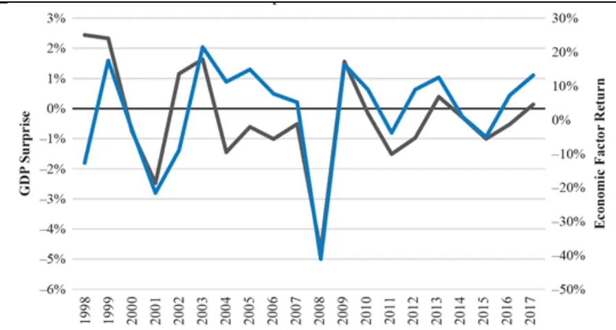
数据来源：《Defensive Factor Timing》

图 2 利率因子与实际利率的超预期值高度相似
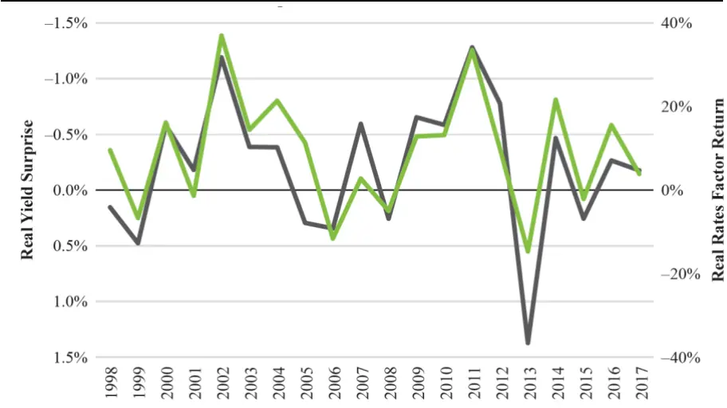
数据来源：《Defensive Factor Timing》

图 3 通胀因子与实际通胀的超预期值高度相似
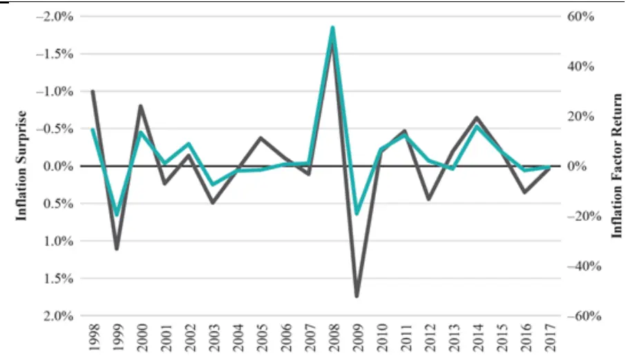
数据来源：《Defensive Factor Timing》

通过对三图的分析可以发现，无论是经济增长、实际利率或通胀、因子模仿组合的表现均和对该因子的超预期有着显著的正相关性，故证明了每一个宏观因子模仿组合均捕捉了该因子的风险溢价。

## 3. 防御性因子择时指标

首先构建一个稳健的战略性投资组合。一个简易的策略是风险平权，即在投资组合对各个因子模仿组合的暴露度相同的基础上根据投资者个人的目标或风险喜好进行微调。本文选择了如下的投资组合：组合风险的 30%来源于经济增长，30%来源于实际利率2，剩余的 40%来源于通胀、信用、新兴市场、流动性的等权重组合。按比例将投资组合调整至无条件波动率为 10%。我们的系统策略是当观测到极端的风险回避、收益相关性或因子估值时偏离（或再分配）原有的战略因子配置 $5$ 期望波动率。

## 3.1. 风险容忍度指标

在通常的经济环境下，我们期望资产的收益率与其风险是正相关的。但在风险容忍度较低的时期，这种相关性可能会变为负相关。即当投资者陷入恐慌情绪时，会逃离高风险资产并建仓安全资 $\cdot\dot{\bar{r}}$ ，因此风险资 $\cdot\dot{\vec{r}}$ 的价格会降低，而安全资 $\dot{\mathcal{P}}$ 的价格会抬高。在这种环境下，即使投资组合的分散性很高，也可能会因为高风险资产而大量亏损。为了确定这种风险容忍度较低的时期，本文如下定义了风险容忍指标（Risk ToleranceIndicator，下文简称 RTI）：

$$
RTI=Corr[q(R_{t}),q(\sigma_{t})]
$$

其中 $q(R_{t})$ 为收益率的排名， $q(\sigma_{t)}$ 为波动率的排名，RTI 为两者的相关性。RTI 为正代表投资者的信心增强，反之则代表投资者信心下降。当 RTI到达极端负值时，投资者可以在保持投资资产种类的同时按比例缩小对多因子投资组合的暴露度。下图是根据周收益计算取得的 RTI 值历史数据。

图 4 风险容忍指标略领先于 MSCI 全球股票指数1 年收益率
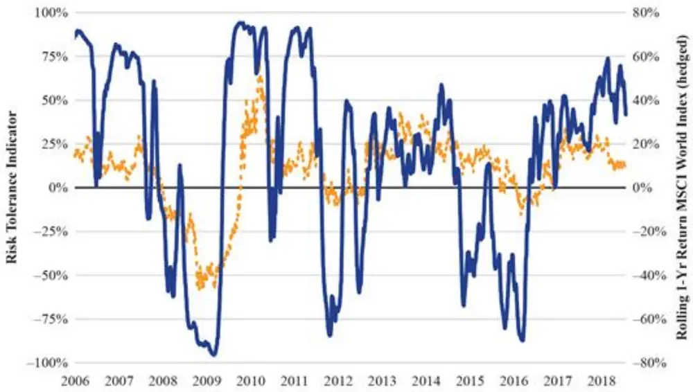
数据来源：《Defensive Factor Timing》

可见当股票收益率下跌时，投资者信心降低并转向较为安全的资产,RTI也随之相应降低，如 2008 年与 2011 年。

## 3.2. 分散比率指标

在市场不景气时，资产种类间的相关性同样可能存在变化，并且导致投资组合的分散性并不如预期中有效。基于这种效应，本文提出了分散比率指标，以估测投资组合的集中度：

$$
\textcircled{1}\frac{4}{\textcircled{1}}\times\frac{1}{\textcircled{2}}=\frac{\sum w_{i}\sigma_{i}}{\sigma_{p}}
$$

其中 $w_{i},\sigma_{i}$ 分别为资产 i 的权重与波动率， $\sigma_{p}$ 为投资组合的波动率。3分散比率越高，说明资产组合的分散性越高，投资者能从资产组合中获益的可能性越大。

战略性多因子投资组合的目的是通过平衡宏观因子的历史数据风险来最大化分散性，因此很容易受到这种相关性的影响，因此参考分散比率指标可以在相关性高的时期降低投资组合的风险性。

下图是一个 20/80 股债配置4的资产组合的回报率与其分散比率，可以看到在 2013 年的缩减恐慌中，分散比率与回报率同时下降。

图 5 金融危机时，20/80 股债配置组合收益率与分散比率同步下降
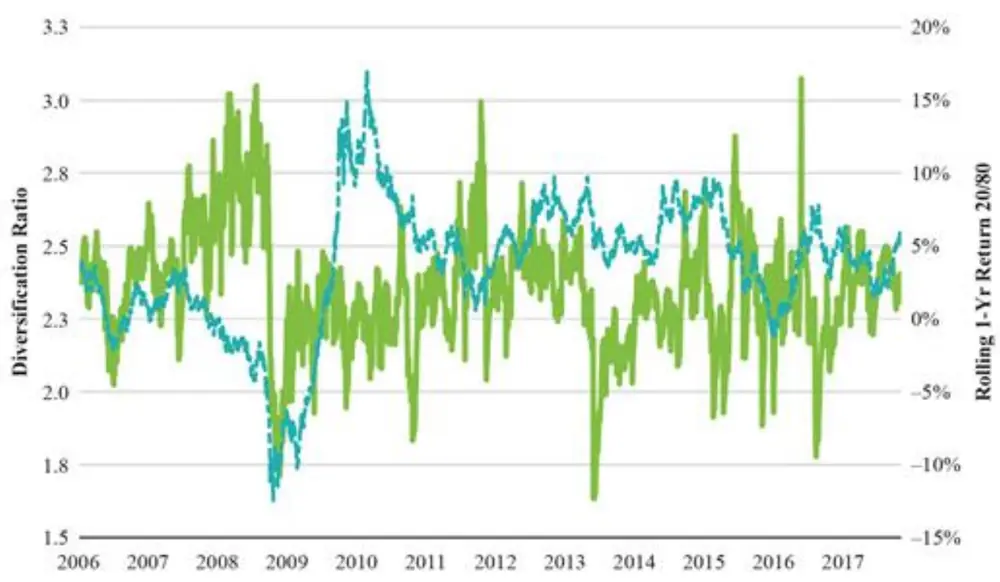
数据来源：《Defensive Factor Timing》

## 3.3. 估值指标

因子和所有的可投资资产一样，可以和其历史长期平均数据进行对比-比过去更贵或更便宜。因此我们可以构建估值指标以估测其价格和内在价值的关系。在此部分中，文章分别对每个宏观因子进行估值并衡量其相对历史价值。一个正的估值指标代表其当前价格较便宜，反之则代表当前价格更贵。

经济增长：使用 Shiller的周期调整市盈率5作为经济增长估值指标。

实际利率：使用发达国家的实际利率与预期 GDP 增长率的关系作为实际利率估值指标。

通胀：比较五年政府债券隐含的盈亏平衡与预期通胀率作为通胀估值指标。

信贷：计算当前信贷利差与违约损失的差值作为信用的估值指标。

新兴市场：同时通过股票与债券估值来估测。股票方面对比新兴市场与发达市场的 Shiller 收益率与股息收益率。债券方面对比新兴债券与美国国债的利差与长期平均值的差异。

流动性：流通性估值指标同时考虑了两种策略：小减大效应6与波动率卖出7。对于较小的股票，我们仍对比小盘股与大盘股的 Shiller 收益率。

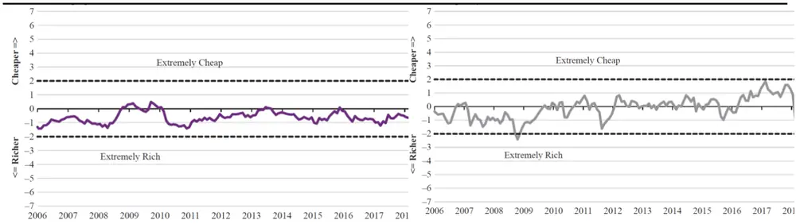
图 10 新兴市场因子估值长期较为便宜
图 11 流动性因子波动加剧

波动率卖出则包含两个指标：VIX8期限结构隐含的套利与现货 VIX 对基本价值的比率9。

下图展示了各个因子在 2016-2018年间的估值水平。其中值得注意的是，实际利率因子长期较为昂贵，而在 08 年金融危机后的一段时间，通胀因子较贵，而信贷与经济增长因子则极为便宜，这是由金融危机的安全效应所导致的。

图 6 利率因子长期较为昂贵
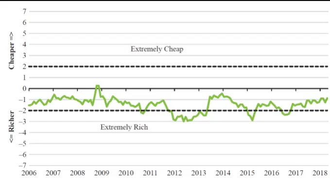
图 7 通胀因子在金融危机之后估值升高
数据来源：《Defensive Factor Timing》

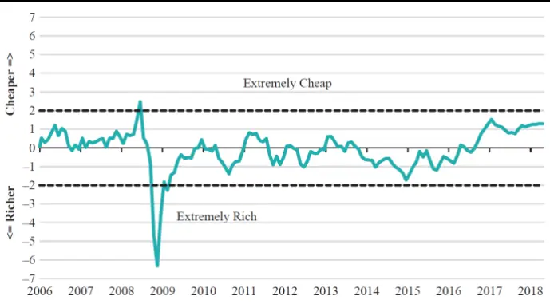

图 8 信用因子估值长期较为便宜
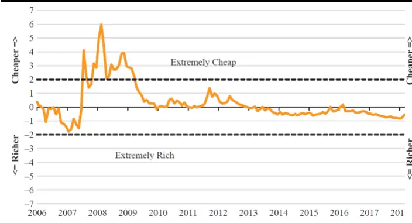

图 9 经济增长因子金融危机之后估值下降
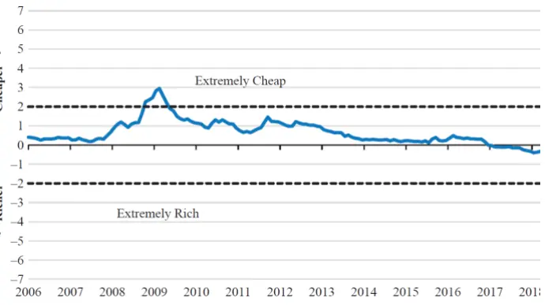
数据来源：《Defensive Factor Timing》
数据来源：《Defensive Factor Timing》

## 4. 实证结果

Fergis 回顾了近年的几次市场案例并讨论了防御性因子择时在这些案例中可以起到的作用。如前文所提，防御性因子择时的目的是保护资产免受长期损失，因此仅当指标出现极端情况时才会采取措施。故此策略的行动频率很低，约 12-18 月一次。

同时需要注意的是，在 2006 年-2018 年的历史样本中，RTI 与分散比率的相关系数约为-0.2，这意味着两指标是互补的。

下图是在四个案例的对应时间段的 RTI 指标与分散比率的数据。

图 12 不同时间段 RTI指标出现显著差异
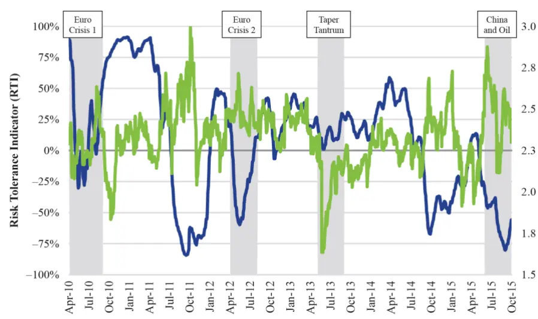
数据来源：《Defensive Factor Timing》

## 4.1. 2010 与 2012 欧债危机

如上图可见，RTI 指数在 2010 年 4 月后极速下跌，这种极端的风险环境应触发防御性因子择时。投资者可以在 2010 年 5 月-9 月开始调整组合风险。将组合去风险 20%后，调整后的投资组合最大回撤仅为 3.3%，小于原投资组合的 4.1%，这说明了 RTI 指数的有效性。

于 2010 年第二季度使用 RTI 指标也会带来相似的结果。观测到 2012 年4 月 RTI 指标快速下降后，在 2012 年 5 月-8 月将组合去风险 20%，同样能将最大回撤由 1.9%缩小至 1.5%。

## 4.2. 2013 年缩减恐慌

在 2013 年 5 月开始的缩减恐慌中市场表现并不寻常：债券和股票的价格同时下跌。这种状况下 RTI 指标的预测性则会失效。如上图，于 2013年第二季度 RTI 虽有所下降，但仍保持正值。但我们可以注意到，在该时间段分散比率大幅下降，这将成为一个有效的预测指标。在观测到分散比率大幅下降后，在 2013 年 6 月将投资组合去风险化 20%。

与此同时，Fergis 观测到缩减恐慌期间因子估值指标如下：

图 13 美联储 Taper时刻，实际利率因子性价比下降
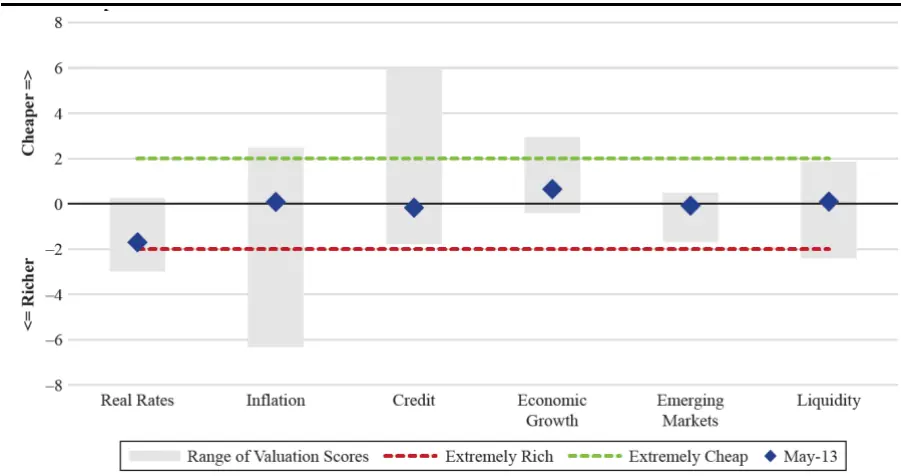
数据来源：《Defensive Factor Timing》

可见实际利率因子较为昂贵，而经济增长因子较为便宜，故我们将投资组合对实际利率的暴露度调低 5%，而将对经济增长因子的暴露率相对调高。

在对比调整后的投资组合与原组合后可以发现，投资组合在此期间的最大回撤由原组合的 9.5%缩小到了 7.3%。

## 4.3. 2015 年石油担忧

2015 年 7 月，随着 RTI 指标再次快速下跌，我们依然选择将投资组合去风险化 20%，直至 2015 年 10 月 RTI 指标回升。这种调整同样将该期间的最大回撤由 5.5%缩小到了 4.5%

## 5. 结论

本文提出的防御性因子择时策略是投资者应对极端风险环境时的一种选择。作者为该策略选择了 3 个指标，并通过这些指标来决定降低投资组合风险的时机。其中的风险容忍指标与分散比率指标拥有一定的负相关，保证了其可以互补并能于各种各样的市场环境中保持有效。作者同时回顾了近年来的数次市场案例，并验证了该策略能够在这些情况中帮助投资者避免损失。

从文章所提供的历史数据来看，该策略仅能有限程度地降低最大回撤。然而，该策略仅在极端情况下采取措施，故仅要求较为低频的操作，同时使用该策略的成本也较低。同时，当市场环境越极端时（原组合亏损越多时），该策略所能规避的亏损也越多。因此我们认为防御性因子择时是在降低组合风险方面的有效策略，并且有被实际使用的价值。

同时，该策略仍然有进一步优化的空间，例如添加更多的指标进行预测，或选择更多的宏观因子甚至风格因子。这些方面的改进或许能够进一步提升该策略的效果。

## 本公司具有中国证监会核准的证券投资咨询业务资格

## 分析师声明

作者具有中国证券业协会授予的证券投资咨询执业资格或相当的专业胜任能力，保证报告所采用的数据均来自合规渠道，分析逻辑基于作者的职业理解，本报告清晰准确地反映了作者的研究观点，力求独立、客观和公正，结论不受任何第三方的授意或影响，特此声明。

## 免责声明