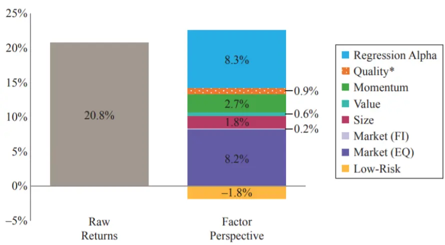

nInfo] [Table_Title] 2021.07.16

# 基金经理研究之二：彼得林奇的成长股投资之道

## ——学界纵横系列之十四

陈奥林(分析师)

## 殷钦怡(分析师)

8 021-38674835

021-38675855

chenaolin@gtjas.com

yinqinyi@gtjas.com

证书编号 S0880516100001

S0880519080013

## 本报告导读：

本文分析了彼得林奇如何投资及分析股票的方法论，尤其是其在成长股投资上的方法与思考。

le_Summary]1977-1990 年这 13 年之内，彼得林奇作为麦哲伦基金（MegellanFund）的基金经理人创造了惊人的业绩。林奇在管理麦哲伦基金期间获得了年化 20.8%的投资回报。同期美国股票年化回报为 7.1%。

彼得林奇分析公司主要有三个步骤，首先判断该公司股票究竟是属于缓慢增长型，稳定增长型、快速增长型、困境反转型、隐蔽资产型、周期型公司股票这六种类型中的哪一种类型。下一步就是通过自己的十三条选股偏好来了解该公司的各种细节，看公司如何经营运作以使业务更加繁荣，增长更加强劲，或者实现其他预期将会产生的良好效果，从而预测公司未来的发展趋势。第三步，根据股票的市盈率倍数和增长速度，判断当前股价水平相对于公司的未来发展前景的估值情况。

- 彼得林奇投资生涯中用自己这套方法论选出过很多牛股，如克莱斯勒、房利美等。

彼得林奇会按照这 6 种分类构建投资组合，他最偏好成长股，快速增长型股票的投资占基金资产的 30%-40%，稳定增长型股票的投资占基金资产的 10%-20%，周期型股票的投资占基金资产的 10%-20%，剩下的基金资产投资于困境反转型和隐蔽资产型公司的股票。

国内的研究目前主要聚焦在 PEG 指标在中国资本市场的适用性，得到的结论主要有：PEG 指标在熊市中对于投资决策较为无效，在股市上行态势中较股市下跌态势显得更为有效。

金融工程

## 金融工程团队：

陈奥林：（分析师）

电话：021-38674835

邮箱：chenaolin@gtjas.com

证书编号：S0880516100001

## 杨能：（分析师）

电话：021-38032685

邮箱：yangneng@gtjas.com

证书编号：S0880519080008

## 殷钦怡：（分析师）

电话：021-38675855

邮箱：yinqinyi@gtjas.com

证书编号：S0880519080013

## 徐忠亚：（分析师）

电话：021- 38032692

邮箱：xuzhongya@gtjas.com

证书编号：S0880519090002

## 刘昺轶：（分析师）

电话：021-38677309

邮箱：liubingyi@gtjas.com

证书编号：S0880520050001

## 吕琪：（研究助理）

电话：021-38674754

邮箱：lvqi@gtjas.com

证书编号：S0880120080008

## 赵展成：（研究助理）

电话：021-38676911

邮箱：Zhaozhancheng@gtjas.com

证书编号：S0880120110019

## [Table_Re相关报告

防御性因子择时：低频化风险控制工具2021.07.14

易方达中证科创创业 50ETF投资价值分析2021.07.11

企业社会责任的纳入如何降低了组合风险2021.07.01

美股 40年：机构抱团与核心资产估值演绎2021.06.24

环境-性格双核基金评价框架 2021.06.23

## 1. 选题背景

本文引用 AQR 的《SUPERSTAR INVESTORS》来概括彼得林奇的业绩并分析其业绩来源，并引用彼得林奇的《One up on Wall Street》和《Beatingthe street》介绍彼得林奇的选股方法论。

## 2. 核心结论

彼得林奇将股票分成了六类，分别是缓慢增长型，稳定增长型，快速增长型，周期型和困境反转型，以及隐蔽资产型，他按照这 6 种分类构建投资组合，彼得林奇最偏好成长股，快速增长型股票的投资占基金资产的 30%-40%，稳定增长型股票的投资占基金资产的 10%-20%，周期型股票的投资占基金资产的 10%-20%，剩下的基金资产投资于困境反转型和隐蔽资产型公司的股票。

在 13 年的时间里，彼得林奇运用自己的投资策略，获得了年化 20.8%的投资回报，同期美国股票年化回报为 7.1%。

## 3. 彼得林奇的业绩表现

1977—1990 年这 13 年之内，彼得林奇作为麦哲伦基金（Megellan Fund）的基金经理人创造了惊人的业绩。

表 1：彼得林奇管理的麦哲伦基金长期大幅跑赢权益指数

| 5/1977– 5/1990 | Average Return | Volatility | Sharpe Ratio | Annual Outperformance | Information Ratio |
| --- | --- | --- | --- | --- | --- |
| Magellan | 20.8% | 21.2% | 0.98 | 13.7% | 1.78 |
| US Equities | 7.1% | 16.4% | 0.43 | 1 | 1 |

资料来源：AQR、CRSP、晨星

林奇在管理麦哲伦基金期间获得了年化 20.8%的投资回报。同期美国股票年化回报为 7.1%。林奇的夏普比率为 0.98，远超同期美国股市夏普比率（0.43）。

在《SUPERSTAR INVESTORS》一文中，用了几个因子来回归分析彼得林奇的收益来源；分别是：

市场因子，Kenneth French 数据库中的美国股市因子和巴克莱美国综合债券指数

规模因子 SMB（Small minus Big），对应了做多市值较小的公司与做空市值较大的公司的投资组合带来的收益率。

价值因子 HML(High minus Low)，即账面市值比因子，对应的是做多高BM 公司、做空低 BM 公司的投资组合带来的收益率。

动量因子 UMD (Up minus down)因子，即过去十二个月中回报率最高的股票组合减去过去十二个月回报率最低的股票组合。该因子假设的是过去表现好的股票更大概率在下一期表现得更好。

质量因子 QMJ（Quality minus Junk），代表的是高质量公司比低质量公司更容易带来回报.

低风险因子 BAB（Betting against Beta）即低 Beta 的股票组合减去高Beta 的股票组合。

图 1:基于回归的收益归因显示，林奇的 alpha 获取能力显著

资料来源：CRSP 数据库，《SUPERSTAR INVESTORS》

上图是林奇管理的麦哲伦基金在 1977—1990 年间的回报来源分析。彼得林奇年化 20.8%的投资回报中，有 8.2%来自于市场回报，有 2.7%%来自于动量因子，有 1.8%来自于规模因子，还有 0.9%来自于质量因子，有0.6%来自于价值因子。彼得林奇还在这些因素以外创造了 8.3%的阿尔法收益，说明他战胜市场的能力较强。

## 4. 彼得林奇对股票的六种分类及十三条选股法则

## 4.1. 六种分类

在《One up on Wall Street》中彼得林奇将股票分为了 6 种并给出了各种股票的买入卖出信号，分别是缓慢增长型，稳定增长型，快速增长型，周期型和困境反转型，以及隐蔽资产型。

缓慢增长型，通常情况下，这些大而成熟的公司的增长速度会略快于GDP。

他们经历过快速增长的时期，但已经达到事业高峰，比如公用事业和银行。这类公司通常会支付大量的股息，因为公司已经不能想出扩张新业务的方法。在林奇的投资组合中，基本没有增长率为 2%-4%的公司，因为公司的增长速度不快，股票失去了成长的意义。

对这类公司的投资需要时刻关注股息率，当股票下跌30%，意味着股息率上升，此时应该更多买入。当股票上涨30-50%，股息率大幅下降，这时全部卖出并收回未来 3-5 年才能赚回来的股息。

稳定增长型，比如可口可乐、百时美、宝洁、贝尔电话等，这类公司盈利年均增长基本在 10-12%左右。这些拥有数十亿美元市值的大公司并非那种反应敏捷的快速增长型公司，但是它们的增长速度要快于那些缓慢增长型公司。投资于稳定增长型股票能否获得一笔可观的收益，取决于买入的时机是否正确和买入价格是否合理。如果买入时估值过高或持有时间较短，获得的投资收益率与购买债券或者持有货币基金差不多。

卖出的信号是业务受到冲击，增长率下降的时候或当股价线超过收益线，或者市盈率远远超过正常市盈率及同行业市盈率水平，应该考虑卖出这只股票,等股价回落后再买回来。

快速增长型，彼得林奇最喜欢这类公司，规模小，成长性强，年均增长20-25%，这其中有很多的 10 倍~20 倍大牛股的机会。彼得林奇尤其偏好在平庸的行业里，却有出色业绩的高增长公司。比如酒店行业，年增长只有 2%，而万豪酒店的年均增长 20%。这类公司要随时追踪他的增长，一旦他的增长回归行业平均水平，那么就意味着股价会迅速回落。林奇偏好那种资产负债表良好又有利润快速增长的公司。投资快速增长型公司股票的诀窍是弄清楚它们的增长期什么时候会结束以及是否他现在的股价已经反映了这种增长。

卖出信号是销售额下降，高管离职，市盈率明显高于盈利增长率，公司的高速增长已经不可持续，比如股票市盈率高达 30 倍，而未来两年最乐观的盈利增长率预期只有 15%~20%。

周期型，周期型公司是指那些销售收入和盈利以一种有规律的方式不断上涨和下跌的公司。在增长型行业中，公司业务一直在不断扩张，而在周期型行业中，公司发展过程则是扩张、收缩、再扩张、再收缩，如此不断循环往复。这种公司包括地产，汽车，航空，轮胎，钢铁，化学，有色煤炭，猪肉养殖等等。时机选择是投资周期型公司股票的关键，必须能够发现公司业务衰退或者繁荣的早期迹象。

当公司业务处在周期的底点时可以买入；在盈利最多，市盈率最低的时候，行业处在周期顶点的时候卖出，还要注意公司基本面的变化，比如如果这个季度的存货开始增加或大宗商品价格下跌，也是一个卖出的信号。

困境反转型，困境反转型公司的股价往往非常迅速地收复失地，克莱斯勒公司、福特公司、佩恩中央铁路公司等都已经证明了这一点。投资成功的困境反转型公司股票的最大好处在于在所有类型的股票中，这类股票的上涨和下跌与整个股票市场涨跌的关联程度最小。

买入的条件是投资者知道未来股价反转需要的因素；卖出一只困境反转型股粟的最佳时机是在公司成功转危为安之后，所有的困难都已经得到解决，并且每个投资者都知道这家公司已经东山再起了，此时股价已经反映了它的价值。

隐蔽资产型，就是公司有资产未被市场发现，可能是现金、房地产、煤矿资产、特许经营权或土地储备等。

买入的条件是隐蔽的资产的价值没有反应在股票价格上；卖出的条件是隐蔽的资产贬值或机构持股者数量上升，因为价值一定已经反映在了股价之上。

## 4.2. 13 条选股法则

彼得林奇有 13 条选股法则，概括了他的选股偏好。

第一至五条，总结而言为受到市场的关注越小越好。第一，公司的名字越乏味枯燥，越简单越好，最好用名字就能体现业务。第二，从业务来看，简单直接的业务也是彼得林奇很喜欢的，同时拥有枯燥公司名字和业务的公司意味着更少受到市场的关注，当这种股票已经有很好的表现以后，市场才会出现各种利好消息，这促使投资者买入这种类型公司的股票，从而进一步推升股价。第三，公司业务不但枯燥，还令人厌恶，没有分析师愿意跟踪这种公司，市场关注度低，但业绩良好且不断支持股价上涨。第四，公司业务让人压抑，比如丧葬服务，这些公司在暴涨之前，经常被研究机构主动忽略。第五，机构没有持股，分析师也不追踪的股票，这种股票如果利润增长很快或业绩持续改善，有一定可能性成为十倍股。相反，被市场高度关注的股票估值一定不在低位了。

第六，新公司从母公司分拆出来的，有成为十倍股的潜质，大型母公司一般不愿意看到分拆出来的子公司上市后陷入困境，因为这会反过来影响母公司股价的表现，所以母公司基本会把公司的核心资产，独立分拆上市，彼得林奇认为，研究分拆上市的公司是业余投资者发现十倍股的机会。

第七，被谣言包围，恶性新闻不断。比如一家垃圾处理公司，市场一直传言它处理有毒垃圾，且受黑手党控制，所以投资者不敢买入，结果这家公司上涨了 100 倍，当股票暴涨之后，阴谋论散去，人们开始研究这家公司，但为时已晚。

第八，公司处于零增长行业之中，在增长率为零的行业，特别是让人厌烦和压抑的行业中，不用担心竞争的问题。很少有其他公司会对这样零增长行业感兴趣。这样公司就有更大的优势来继续保持增长（护城河的优势）以及扩大市场份额，就像丧葬业中的 SCI 公司那样。SCI 公司已经拥有了全国殡仪馆中的 5%，并且没有什么对手可以阻止 SCI 公司把拥有量增加到 10%或 15%。

第九，公司有一个利基，即拥有排他性的地区独家经营特许权。企业有一个细分领域市场并且有足够的优势，甚至没有竞争者。比如你如果有个石料厂，判断标准就是看公司的产品能不能随意涨价而不影响销量。如果涨价后销量不下滑，这家公司就极具长期投资价值。

第十，偏好生产药品、软饮料、剃须刀片或者香烟的公司的股票，即消费品公司，最好是快消品。

第十一，公司是高技术产品的用户。即不要买入那些价格竞争的公司，因为他们会因为价格战利润会越来越低。但是他的客户在这些公司受损的同时，就可以降低成本，提高利润。

第十二至第十三条，公司内部人高管增持，公司回购股票。

## 5. 彼得林奇的投资历史

## 5.1. 管理麦哲伦基金初期

彼得林奇买入一家公司的标准有 5 个，小盘和中盘成长股，发展前景改善的公司，股价过低的周期股，股息收益率高不断分红的公司，以及其他价值被严重低估的公司。

1997 年 12 月底，彼得林奇的重仓股包括:康格里默(Congoleum)公司一共持有 51 000 股，市值高达 833 000 美元。彼得林奇买入这家公司的原因是这家公司发明了一种新的聚乙烯基薄膜地板材料，还利用生产预制房屋的组合式生产技术，为国防部制造小型驱逐舰，两个因素将改善公司发展前景。

另一个重仓股塔可钟连锁快餐公司(Taco Bell)是因为它的墨西哥煎玉米卷味道出色，即产品好，公司很容易在另外一个地方顺利地复制在上一个地方很成功的经营模式，在公司不断扩张的过程中，公司盈利以每年 20%~30%的速度增长；二是因为美国90%的人们还没有吃过这种美食，有很大的发展潜力，三是因为这家公司有着良好的业绩记录和稳健的资产负债表，四是由于这家公司的总部办公室像普通车库一样简陋。

彼得林奇还投资了两家大型石油公司:美国优尼科（Unocal)石油公司和皇家荷兰石油公司，因为他发现皇家荷兰石油公司业绩正在大幅好转，而华尔街的投资人还没有意识到这一点，即市场存在预期错配，于是彼得林奇在股价处于低位时买入了这只反转型股票。

彼得林奇还投资了自助建材超市家得宝，因为该公司店员服务专业，产品丰富：螺丝、螺栓、砖和灰泥等各种建材商品丰富，而且价格便宜。相对于价格又贵、品种又少的社区小油漆店和小五金店有极大竞争优势。彼得林奇买入家得宝公司时，它只是处于发展初期，其股价也只有 25 美分(根据后来拆股进行了调整)，但可惜 1 年后彼得林奇发现了他认为上涨潜力更大的股票，就将家得宝的股票卖出了。遗憾的是，之后家得宝15 年从 25 美分上涨到了 65 美元，上涨了 260 倍，彼得林奇发现了这家好公司却与上涨 260 倍的大牛股失之交臂。彼得林奇错过的类似牛股还有：阿尔伯逊公司(Albertson), 一只超级成长股,后来上涨了 300多倍;玩具反斗城公司，也是一只超级成长股;华纳通信公司；联邦快递公司，彼得林奇在 5美元时买进，而等它涨到 10美元时就过早获利卖出股票，但是两年后该股票上涨到 70 美元。彼得林奇总结，并不是对所有股票都要无条件忠诚长期持有，而是说对于那些投资吸引力变得越来越大的公司，要一直坚决长期持有，而不应该短期持有后就过早卖出。

1980 年，美联储了抑制经济过热，，把利率提高到了历史最高水平。在这种形势下，尽管银行业增长前景非常好，但是银行股已经下跌到了低于账面价值。彼得林奇发现了保险股和银行股的投资机会。在利率最高点，恰恰是股市最不乐观的时候，利率最高点，未来必然是降息周期，银行和保险公司基本面，未来会越来越好。彼得林奇发现，亚特兰大银行，股票市盈率只有市场平均水平的一半，而随后 5 年，这家银行还跟另一家银行合并，股价借此上涨了 30 倍。

## 5.2. 管理麦哲伦基金中期

彼得林奇在这个阶段特别喜欢每年盈利增速 20%左右的公司，他认为这是大牛股的最基本条件，如果这个水平保持 3 年，他的盈利水平就是现在的 2 倍。如果保持 7 年，就是现在的 4 倍以上。那么理所应当，他的股价也会翻 4 倍。

彼得林奇重仓投资于零售业和餐饮类公司的股票，因为他们的增长速度甚至和高科技公司一样快，而且还有巨大的先发优势。Pep Boys 公司、七棵橡树公司、Chart House 公司、得力信用公司(Telcredit) 和库伯轮胎公司(Cooper Tire)，这些公司都有共同的特点，资产负债表稳健，发展前景良好，且较为冷门，很多基金不敢重仓这些冷门股票，因为一旦股价下跌，基金经理会面临管理层及投资者的职责。

彼得林奇还总结出他自己的股债轮动思路，如果长期国债的投资收益率高出标普 500 股票指数红利收益率 6 个百分点甚至更多的时候，那么应该卖出股票买入国债。利率顶峰的时候，是投资债券的好时机，因为未来利率下降，债券的价格会越来越高，也许能获得超额的收益率，不低于股票市场。

彼得林奇认为，股价大跌而被严重低估，才是一个选股者真正的最佳投资机会。股市大跌是一个趁机低价买入股票的机会。巨大的财富往往就是在这种股市大跌中才有机会赚到的。

正是基于这种想法，彼得林奇在 1982 年 3 月买人了克莱斯勒公司的股票。一开始彼得林奇认为，汽车行业复苏，福特汽车公司将会大大受益，在与福特公司的交流中，彼得林奇发现克莱斯勒公司会在汽车复苏中受益更多。和往常一样，对一个投资机会的研究却导致发现了另一个更好的投资机会。那时，由于市场都预计这家美国第三大汽车公司将会破产，就像宾州中央铁路公司这家大公司轰动一时的破产一样，因此克莱斯勒公司的股价曾经一度跌到只有 2 美元。彼得林奇研究克莱斯勒公司的资产负债表，发现这家公司有超过 10 亿美元的现金，这些现金大部分来自于坦克业务出售，克莱斯勒公司不仅拥有足够的资金继续维持一段时间的生存，而且公司还在不断创新，开发的新产品充满活力。1982 年从春天到夏天，彼得林奇大量买入这只股票。到 6 月底，克莱斯勒已经成为彼得林奇的第一大重仓股。到了 7 月份，麦哲伦基金 5%的资金全部投资到这只股票上了，这已经是证监会所允许的基金投资单只股票的规模上限。整个秋季，克莱斯勒公司都是彼得林奇的第一大重仓股，当时基金的 11%资金都投在了汽车股上，还有 10%投资在零售业股票上。

克莱斯勒公司在 1983年大部分时间里都直保持着第一大重仓股的地位，在 8 个月内就上涨了一倍。

折扣商店股票刚上市时很受市场追捧，可是好景不长，投资者预期过高,以至于公司业绩根本不可能达到这么高的预期，于是股价大跌，投资者纷纷抛售。但彼得林奇发现，这些公司业务确实好得惊人并且已经偿还了债务，资产负债表变得十分稳健，盈利持续向上增长，可是股价仍然持续向下徘徊，彼得林奇认为这是个绝对完美的投资机会。于是他大量买入了好市多公司、Wholesale 俱乐部公司和佩斯公司的股份，这 3 只股票都上涨了很多，其中好市多公司股票上涨了 3 倍。

彼得林奇还构建了细分的股票轮动策略，他的股票组合中一部分是小盘成长股和周期股，另一部分是保守的白马股。一旦股市下跌，他就会将一部分白马股的仓位转换到小盘成长股和周期股。一旦市场回升，他就反向操作。在整个他的投资生涯中，早期在麦哲伦基金规模很小的时候，他的投资基本集中在大公司上面，但随着麦哲伦基金规模的不断扩大。他的投资反而集中到了小公司上面。

## 5.3. 管理麦哲伦基金晚期

在这个时期，彼得林奇总结出最值得买入的好股票，也许就是你已经持有的那只股票。一个能超预期发挥的公司，首先其价值必须被严重低估，否则你的买入价就可能已经过高。如果市场上的流行观点都比你的观点悲观许多，那么你必须不断核实真实情况，确保自己没有盲目乐观。事物总是处在不断变化中，不是变得更好就是变得更坏，而你必须紧随变化适时调整策略。

房利美就是一个很好的例子，彼得林奇对房利美的投资很曲折。

1977 年，彼得林奇第一次买入这家公司，但之后由于市场利率上升，这家利用“短借长贷”赚取利息差的公司出现了成本上升的情况，进而严重亏损。随后彼得林奇就卖出了这只股票，后来这家公司也从 9 美元跌回到了 2 美元。

1982 年，律师马克斯韦尔成为领导，下决心要停止房利美的业绩动荡的状况，希望采取的措施有两条:①停止“短借长贷”;②模仿“房地美”

(Freddie Mac)打包抵押房产权。即买入一批房产抵押合约，然后捆绑打包再次出售给银行，保险公司。这一下房利美的经营思路发生了重大变化，转变成了通道业务，把风险转嫁给了银行与保险公司，于是彼得林奇在 1982 年在公司巨亏的情况下，重新买回了这个股票，而公司股价也从 2 美元涨回到了 9 美元。

由于房利美是一家准政府机构，它能够以比其他银行、IBM、通用汽车或者其他各类公司更低的利息获得资金。例如，它可以借到利息为 8%的 15年期贷款，然后购买利息为 9%的 15 年期住房抵押合约，从中赚取 1%的差价，所以这家公司的护城河和门槛很高。1983 年彼得林奇已经结束亏损，但房利美的股价并没有涨太多，之后彼得林奇慢慢加仓，但股价又跌回去了一半，因为德克萨斯州的炒房客开始弃房断供，而一些做抵押贷款的公司纷纷倒闭。但彼得林奇反而认为这个情况给房利美带来了扩张机会。于是彼得林奇果断把他加到了重仓股。在他加仓后，果然股价又涨了一倍，回到了 9 美元的位置。

1986 年，房利美公司对自己进行了重新塑造，公司已经处在爆炸式发展的前夜。但是大部分证券分析师们仍旧持有悲观看法。在 1986 年的最后5 个月中，股价从每股 8 美元上涨到每股 12 美元。公司当年的每股收益是 1.44 美元。

1988 年，彼得林奇进一步加大了麦哲伦基金在这个股票上的仓位，1988年全年大部分时间维持在 3%左右的资金比例上。公司该年度的每股收益从 1.55 美元上升到了 2.14 美元。公司在严格的新标准下发放的住房贷款已经占到了整个投资组合的 60%。从 1984 年开始房利美公司没收的房产储量也第一次进入了下降通道。不仅如此，政府也制定了按揭贷款行业的新会计准则。在此之前，按揭贷款的还款一 到账就马上计为收入。公司可能上个季度收到 1亿美元的还款，下一个季度却只能收到 1000万美元的还款。这种会计体系造成了房利美公司每季度收入的严重起伏，公司季报的收入锐减时常发生。这破坏了投资者的信心，时不时就导致股价滑铁卢。在新会计准则下，还贷费用必须根据每一次按揭贷款的生命期平均分摊计算。自这些法规生效后，房利美再没有哪个季度收入突然严重下降过。

1989 年，麦哲伦基金 4%的资金都投资到了房利美的股票上，随着年末的到来，这个比例一度到达 5%的界限。房利美现在打包的住房抵押担保证券总额达到了 2250 亿美元。它可以从这项 1981 年还不存在的打包业务上获得高达 4 亿美元的利润。此时世界上还没有一家储贷协会希望拥有住房抵押权，它们统统卖给了房利美或者房地美公司。最终，华尔街接受了这个观点:这家公司能以 15%~20%的增长率继续成长。股价从每股16美元上涨到每股 42 美元，一年的时间内涨到了原来的 2.5 倍。

正如股票市场，上经常发生的那样，经过几年的耐心等待，在一年中获得了全额的回报。按照这个相对高价计算，房利美的股票市盈率是 10倍，所以还是被低估。之后房利美一度涨到每股 69 美元。

华尔街的投资者们习惯忽视这种变化。老房利美给人留下的糟糕印象还历历在目，人们看不见正从眼前崛起的新房利美。彼得林奇发现了这个投资机会，凭借 2 亿美元的投资获得了 6 倍的收益。

## 6. 彼得林奇的估值系统及投资组合构建

## 6.1. 估值指标

PEG 指标，也就是上市企业市盈率与盈利增长的比率。作为一相对理想参考指标，PEG 不但考虑市盈率所代表的公司目前财务情况，还兼顾未来一定时期的公司利润增长。PEG 指标首见于英国投资大师 Jim Slater的论述。

彼得林奇发扬了 PEG 的概念，具体来讲，PEG 指标(市盈率相对盈利增长比率)是用公司的市盈率除以公司的盈利增长速度；如果小于等于 1，则具备较大投资价值，如果大于 1，则投资价值较差。

彼得林奇主要用该指标去判断稳定增长型和快速增长型股票的投资价值，即分析该公司的成长速度和估值之间的关系，判断公司未来是否能带来较大回报。

## 6.2. 彼得林奇的投资组合比例

在彼得林奇的组合中，快速增长型股票的投资占基金资产的 30%~40%，其余大部分基金资产分散投资于其他五种类型公司股票，10%~20%左右的基金资产投资于稳定增长型公司的股票，10%~20%左右的基金资产投资于周期型公司的股票，剩下的基金资产投资于困境反转型公司的股票。尽管彼得林奇总体上拥有 1400 只股票，但他管理的麦哲伦基金的一半资产只投资于 100 只股票，2/3 的基金资产投资于 200 只股票，1%的资金分散投资于 500 只其他股票。

## 7. 总结

彼得林奇每年要调研 500-600 家公司，在规模和质量上，都达到了当时的世界之最。他贯穿始终的敬业态度，体现在他与上市公司的通话频率、数量、时间上，他对自己投资的上市公司的经营模式、财报数据、管理层特点、持有周期、跟踪重点都如数家珍。

本文主要介绍了彼得林奇的选股方法论，彼得林奇分析公司主要有三个步骤，首先将上市公司分为六类分别是：缓慢增长型，稳定增长型、快速增长型、困境反转型、隐蔽资产型、周期型公司，然后判断这只股票属于这六种类型中的哪一种类型。下一步就是通过自己的十三条选股偏好来了解该公司的各种细节，研究公司将如何经营运作以使业务更加繁荣，增长更加强劲，从而预测公司未来的发展趋势。第三步，根据股票的市盈率倍数和增长速度，判断当前股价水平相对于公司的未来发展前景的估值情况。

这些他认为发展潜力很大的股票会根据六种分类进入他的投资组合，并按照上文的比例分散他的资金。在股票轮动策略上，他的股票组合中一部分是小盘成长股和周期股，另一部分是保守的白马股。一旦股市下跌，他就会将一部分白马股的仓位转换到小盘成长股和周期股。一旦市场回升，他就反向操作。

在资产配置上，彼得林奇也使用了股债轮动思路，如果长期国债的投资收益率高出标普 500 股票指数红利收益率 6 个百分点甚至更多的时候，他会卖出股票买入国债。所以在任何市场环境下，彼得林奇都有资金及策略来应对并获得超额收益。

## 8. PEG 指标在中国市场的应用

目前国内对于彼得林奇的投资策略的实践主要集中在他的 PEG 指标，国内学术界针对 PEG 指标在中国的适用性的研究有：

张静[1] (2008)首先使用历史数据作为预测未来每股盈利增长率的依据。其实证得到了以下几点: 在 2005年末至 2007年末中国股市的牛市行情中，PEG 指标作为投资依据绩效表现较大盘更好。在 2000 年末至 2005年末，与 2008 年中的熊市行情中，这段时间 PEG 选股无效，击败市场的尝试多是徒劳。张静建议投资人实际投资中应与 PE 指标和其他估值指标综合使用，以避免单独使用 PEG 可能的风险。

樊越[2](2010)利用了上海证券交易所于 2009 年的股票价格与预期分红数，2010 与 2011 年预测 EPS 等数据，就 PE 与 PEG 指标的有效性进行回归分析比较，得出 PEG 指标选股在实证中优于 PE 指标的结论。

田开锐[3](2011)，首次使用 PEG 指标针对中国股市 2001 年至 2010 年以行业方向进行分析。得到几点结论:除了 2005 年以外，其余年份跨行业比较中，行业 PEG 与投资收益率呈现负相关，负相关性在股市牛市较股市熊市时显著。若依照不同的 PEG 值将各种行业组合区分为高低与负数等三组，结果 2002 年至 2011 年低 PEG 的行业组合回报率都高于负 PEG的行业组合及高 PEG 行业组合的回报率。在 2005 至 2007 年股市牛市这一时间中，低 PEG 组合的收益率超出其他组合的幅度较其他年度更为显著。

牛茜[4](2013)在 PEG 对选股决策的有效性，在 2008 年至 2009 年期间的分析,得到与张静相同，也就是 PEG 指标在熊市中对于投资决策是较为无效的。除去 2008 年到 2009 年这段特殊时期，低 PEG 组合会得到较高PEG 组合更加高的投资回报率。PEG 指标投资决策，在股市上行态势中较股市下跌态势显得更为有效。

林政伯[5]（2015）以 PEG 值作为投资组合选取依据。并将不同投资组合调整频率细分为不同投资策略,使用数据库中 2006 年 6 月至 2014 年 7月的历史信息验证各投资策略的有效性与超额收益。研究结果得出 PEG指标运用在中国中小企业板存在显著的有效性;

## 参考文献

[1]PEG 指标在中国股票市场有效性的实证研究. 张静. 2010

[2]PE、PEG 指标在选股中的有效性分析[J].现代经济信息, 樊越.2010

[3]基于行业 PEG 的投资有效性研究[D].田开锐.2011

[4]PEG 对选股决策的有效性分析[D].牛茜.2013

[5]利用 PEG 估值思维投资中国股市策略研究[D].林政伯 2015

## 本公司具有中国证监会核准的证券投资咨询业务资格

## 分析师声明

作者具有中国证券业协会授予的证券投资咨询执业资格或相当的专业胜任能力，保证报告所采用的数据均来自合规渠道，分析逻辑基于作者的职业理解，本报告清晰准确地反映了作者的研究观点，力求独立、客观和公正，结论不受任何第三方的授意或影响，特此声明。

## 免责声明