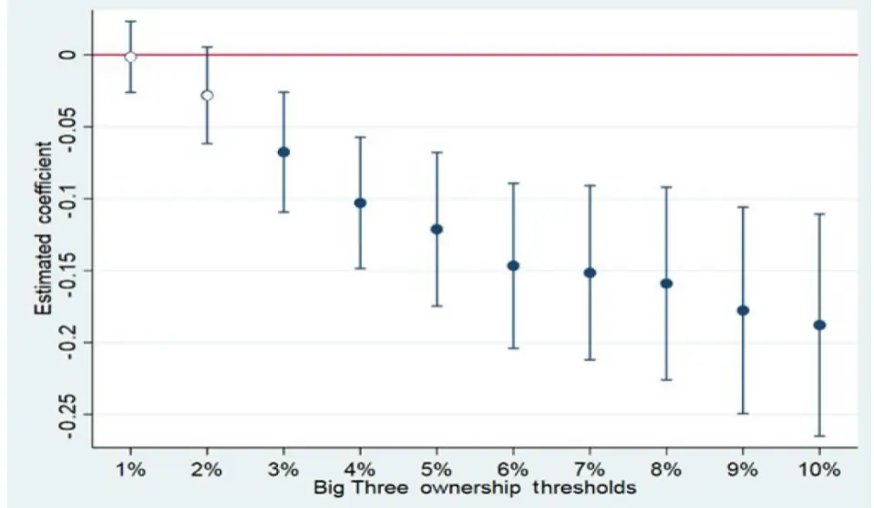
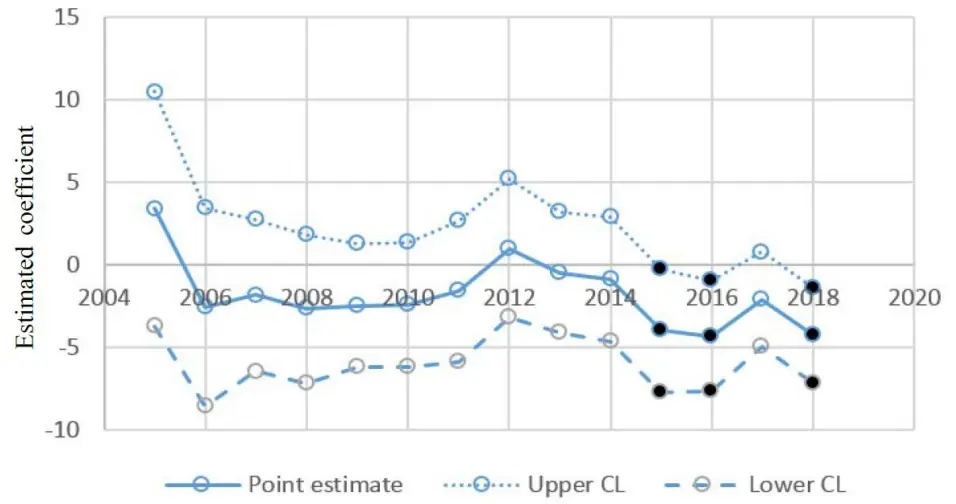

nInfo] [Table_Title] 2021.07.20

# 机构投资者如何助力企业减少碳排放

## ——学界纵横系列之十五

陈奥林(分析师)

## 徐忠亚(分析师)

8 021-38674835

021-38032692

chenaolin@gtjas.com

xuzhongya@gtjas.com

证书编号 S0880516100001

S0880519090002

## 本报告导读：

作为大型投资机构的代表，三巨头有干涉标的公司减碳排的动机与实力，并以行动助力碳减排。

## 摘要：

le_Summary]三巨头具备减少碳排放的动机：三巨头将大量资金投资于指数基金，减碳排有利于减小分散化投资所面临的系统性风险，以及留住重视社会和环境问题的客户，并且监控标的公司对三巨头可能是有收益的。

三巨头具备要求标的公司减少碳排放的实力：三巨头的庞大资金量使其通常持有其投资组合公司的大量股份，他们可以通过投票、公开声明等方式对公司施压，改变公司的战略及治理结构，从而达到碳减排的目的。即使不是大股东，三巨头持股量的增长速度，其他机构投资者对他们的跟随效应，以及通过其他途径间接对公司的控制，也足以使他们具备足够的影响力。

三巨头的干涉存在偏好：他们更喜欢干涉持股比例较高、市值较大、处于 MSCI 指数中的公司，且上一年碳排放量较高的公司被加入干涉列表的概率更大。

三巨头的持股比例与碳排放量呈负相关：当公司成为三巨头干涉目标的概率更大时，这种情况会更加明显；随着时间的推移，三巨头增加了处理环境问题的承诺，负相关关系也更加显著，且主要由贝莱德和道富推动。但这种关系主要在 MSCI 成分公司中出现，非 MSCI成分的公司碳排量与三巨头持股比例的关系较弱。

三巨头的减碳排行为对全球减碳排目标的实现具有一定意义：平均而言，被三巨头的持股比例每增加一个标准差，企业碳排量约减少约2%。

对 A股的 ESG投资来说，本文启发投资者关注大型投资者（包括大型指数投资者）对其投资组合公司的影响。一方面，为减少碳排放作出较大努力的机构投资者具备良好的社会责任，符合 ESG 投资的主题；另一方面，被大型机构持有或重仓的公司，其 ESG 行为受到有力干涉的概率可能更大，从而成为良好 ESG 投资标的的可能性也更大。

金融工程

## 金融工程团队：

陈奥林：（分析师）

电话：021-38674835

邮箱：chenaolin@gtjas.com

证书编号：S0880516100001

## 杨能：（分析师）

电话：021-38032685

邮箱：yangneng@gtjas.com

证书编号：S0880519080008

## 殷钦怡：（分析师）

电话：021-38675855

邮箱：yinqinyi@gtjas.com

证书编号：S0880519080013

## 徐忠亚：（分析师）

电话：021- 38032692

邮箱：xuzhongya@gtjas.com

证书编号：S0880519090002

## 刘昺轶：（分析师）

电话：021-38677309

邮箱：liubingyi@gtjas.com

证书编号：S0880520050001

## 吕琪：（研究助理）

电话：021-38674754

邮箱：lvqi@gtjas.com

证书编号：S0880120080008

## 赵展成：（研究助理）

电话：021-38676911

邮箱：Zhaozhancheng@gtjas.com

证书编号：S0880120110019

## [Table_Re相关报告

基金经理研究之二：彼得林奇的成长股投资之道 2021.07.16

防御性因子择时：低频化风险控制工具2021.07.14

易方达中证科创创业 50ETF 投资价值分析2021.07.11

企业社会责任的纳入如何降低了组合风险2021.07.01

美股 40 年：机构抱团与核心资产估值演绎2021.06.24

## 1. 选题背景

随着全球气候变化的加剧以及人们环境保护意识的增强，减少二氧化碳排放成为了人类共同的目标。投资领域， 投资在我国兴起，政策和意识的转变使投资者开始关注具有良好社会责任、碳排放量较少的企业。在学界，部分研究开始探索碳排放量和气候风险对企业价值乃至股价的影响(Bansal, Ochoa and Kiku, 2017; Bolton and Kacperczyk,2019; Hsu, Liand Tsou; 2019)；也有研究表明，机构所有权与企业环境得分之间存在正相关关系(Dyck,2019).

《The Big Three and Corporate Carbon Emissions Around the World》与上述研究的不同之处在于：一是研究了具体的机构，即三巨头，而三巨头在投资领域的地位是非常高的，具有很强的代表性；二是三巨头的大量投资为指数投资，而指数投资者一般被认为较少干涉企业事务（包括社会责任），但本文结果表明，指数投资者同样具有监督企业减少碳排放的动机；三是对三巨头的干涉行为研究较为细致，从他们的干涉动机、干涉方式、干涉偏好，到最终的干涉结果，以及对全球减碳排的贡献，都有一定的描述，形成了较为完整的行为链条。

近年来，越来越多的人要求大型投资者向其投资组合中的公司施压，要求其控制温室气体 (GHG) 排放。作为全球指数基金行业的龙头，被称为“三巨头”的贝莱德(BlackRock)、先锋集团(Vanguard)和道富银行(StateStreet) 的领导人已就其减碳排的意图发表公开声明。本文的结果在一定程度上说明，三巨头减少企业碳排放的努力是有意义的。

对 A 股的 ESG 投资来说，本文启发投资者关注大型投资者（包括大型指数投资者）对其投资组合公司的影响。一方面，为减少碳排放作出较大努力的机构投资者具备良好的社会责任，符合 ESG 投资的主题；另一方面，被大型机构持有或重仓的公司，其 ESG 行为受到有力干涉的概率可能更大，从而成为良好 ESG 投资标的的可能性也更大。

## 2. 核心结论

三巨头具备减少碳排放的动机：三巨头将大量资金投资于指数基金，减碳排有利于减小分散化投资所面临的系统性风险，以及留住重视社会和环境问题的客户，并且监控标的公司对三巨头可能是有收益的。

三巨头具备要求标的公司减少碳排放的实力：三巨头的庞大资金量使其通常持有其投资组合公司的大量股份，他们可以通过投票、公开声明等方式对公司施压，改变公司的战略及治理结构，从而达到碳减排的目的。即使不是大股东，三巨头持股量的增长速度，其他机构投资者对他们的跟随效应，以及通过其他途径间接对公司的控制，也足以使他们具备足够的影响力。

三巨头的干涉存在偏好：他们更喜欢干涉持股比例较高、市值较大、处于 MSCI 指数中的公司，且上一年碳排放量较高的公司被加入干涉列表的概率更大。

三巨头的持股比例与碳排放量呈负相关：当公司成为三巨头干涉目标的概率更大时，这种情况会更加明显；随着时间的推移，三巨头增加了处理环境问题的承诺，负相关关系也更加显著，且主要由贝莱德和道富推动。但这种关系主要在 MSCI 成分公司中出现，非 MSCI 成分的公司碳排量与三巨头持股比例的关系较弱。

三巨头的减碳排行为对全球减碳排目标的实现具有一定意义：平均而言，被三巨头的持股比例每增加一个标准差，企业碳排量约减少约 2%。

对 A股的 ESG投资来说，本文启发投资者关注大型投资者（包括大型指数投资者）对其投资组合公司的影响。一方面，为减少碳排放作出较大努力的机构投资者具备良好的社会责任，符合 ESG 投资的主题；另一方面，被大型机构持有或重仓的公司，其 ESG 行为受到有力干涉的概率可能更大，从而成为良好 ESG 投资标的的可能性也更大。

## 3. 理论假设

## 3.1. 三巨头具备减碳排的动机

## 3.1.1. 减碳排有利于减小分散化投资所面临的系统性风险

一般认为二氧化碳排放并不是公司股东需要承担的成本，而是全社会需要承担的成本，我们称之为外部因素。从这个角度来说，股东并没有减少碳排放的动机。但是，对于三巨头这类大型多元化（分散型）资产管理 公 司 来 说 ， 事 情 并 没 有 这 么 简 单 。 Hansen and Lott(1996) 和Hartford(1997)认为，标的公司若把外部因素内部化，可以提升大型多元化资管公司的收益。这些外部因素（包括气候变化）会对公司资产产生直接损害，以及社会耻辱、引发监管等间接损害。

Brinkman,Hoffman and Oppenhei(2008)表明，气候变化会影响投资组合的估值。气候变化的风险相当于系统性风险，若能通过一些成本较低的手段使标的公司降低碳排放，达到降低系统性风险的效果，将使投资额巨大且分散的三巨头受益，增加其投资组合的价值。

## 3.1.2. 减碳排可以留住重视社会和环境问题的客户

另外，即使指数投资经理（三巨头的投资很大一部分为指数基金）认为气候变化并不会对其投资组合的价值产生影响，三巨头也可以推动减少碳排放，以吸引或留住对环境问题敏感的客户。若三巨头对减少碳排放方面的社会需求缺乏回应，可能导致资金流向被认为对社会和环境更具责任感的资产管理公司。事实上，最近的证据表明，投资者对可持续性的 重 视 超 过 了 金 钱 动 机 （ Riedl and Smeets, 2017; Hartzmark and

Sussman,2019），并且不少共同基金也在竞争具有气候保护意识的投资标的（Ceccarelli, Ramelli and Wagner,2020）。

最近关于投资者对气候风险态度的调查证明，部分投资者认为减少碳排放将会增大收益。例如，根据对大量投资经理的调查，Krueger, Sautner得出结论，机构投资者认为气候风险对其投资组合公司的财务表现具有影响，并且风险已经开始显现。

## 3.1.3. 指数投资者监控标的公司是有收益的

有人质疑三巨头减碳排的动机，因为三巨头发起的大多数投资工具都是被动管理的，而被动投资者对特定公司进行监控的动机相对较弱（Bebchuk and Hirst,2019a)，所以只需要较少的员工进行管理工作。

对此，本文提出三点异议。首先，关于指数投资者监控标的公司的收益一直存在争论，最近的几篇论文表明，监控标的公司的收益可能比想象的更大（Appel, Gormley and Keim, 2016; McCahery, Sautner and Starks，2016；Fisch, Hamdani and Davidoff Solomon, 2020）。此外，根据晨星最近的一份报告，顶尖主动基金的管理团队更小，但同样表现出类似于三巨头的投票行为，以参与投资组合公司的决策（Morningstar, 2017）。最近的研究还表明，被动投资者有动机来监控跨领域问题，例如可持续性和公司治理的问题。与监控兼并收购行为相比，监控这些问题所需的成本较低（Appel, Gormley and Keim,2016；Gormley,2020）。最后，三巨头的管理团队比想象中更庞大，因为他们的团队与全球数千名基金经理合作，他们可以为三巨头提供有价值的反馈。

## 3.2. 三巨头的行为如何减少二氧化碳排放？

股东通常通过三种方式影响公司行为：出售（或不购买）股票、行使投票权、与管理层接触。与一般指数基金不同，大型指数基金公司通常持有其投资组合公司的大量股份，从而成为关键选民（Coates, 2019）。三巨头的支持在董事选举中也很重要，无视三巨头的明确要求对公司经理和董事来说可能代价高昂。

此外，三巨头也可以在没有明确约定的情况下对公司经理施加影响。通过公开声明，三巨头可以将他们的偏好传达给数千家投资组合公司，而无需单独与每家公司的管理层接触。例如，贝莱德经常向其投资组合中碳密集度较高的公司发送信函，要求他们披露气候风险情况（贝莱德，2018）。公司的经理或董事可以响应此类公开要求，以在关键投票项目上获得三巨头的支持。根据 Condon (2020) 的说法，在埃克森美孚 2017年的年会上，该公司的最大股东贝莱德投票反对连任两名董事会成员，以抗议“不参与”政策，而该政策阻止董事与股东讨论应对气候变化的战略。投票后，埃克森美孚重新考虑了这个战略，并允许董事与股东会面。

此外，三巨头通过改变公司的治理结构来间接减少二氧化碳排放（Gordon and Pound, 1993; Carleton, Nelson and Weisbach, 1998）。恰当的治理结构可以使公司经理对所有投资者（不仅仅是三巨头）提出的对待气候风险的要求做出更积极的回应。

虽然减少碳排放成本高昂，但企业可以通过相对高效的产品和流程来控制排放，比如星巴克最近推出的无吸管冷饮盖。此外，公司可以改善物流以减少与运输相关的排放、转换能源和实施二氧化碳捕获和储存技术等。最后，公司可以提高用户的能源效率。

## 4. 数据、样本和指标

## 4.1. 数据和样本构建

我们的初始样本为 Trucost（企业碳排放数据的商业提供商）在 2005 年至 2018 年期间涵盖的所有上市公司。Trucost 从公开来源收集碳排放数据，当涵盖的公司未公开披露其碳排放量时，Trucost 会根据模型估算公司的年度碳排放量。数据的可靠性方面，部分国家已出台法规和政策确保公司向 Trucost 提供数据的真实性。Bolton and Kacperczyk (2019)发现 CDP、Trucost、MSCI、Sustainalytics 和 Thomson Reuters 五家数据提供商的碳排数据相关性为 0.99，达到相互验证的效果.

我们从 FactSet/LionShares 数据库中获取机构所有权数据，从 CompustatGlobal 和 Datastream/WorldScope 中获取股票价格、资产负债表和损益表等数据。

表 1 为样本选择的步骤。本文最终使用机构所有权和财务数据均未缺失的样本，并分为 MSCI 成分股和其他公司两个子样本集。

表 1：样本选择与划分

|  | firm-years | distinct firms |
| --- | --- | --- |
| 2005 至 2018 年 Trucost 涵盖的公司 | 55,118 | 9,973 |
| 减缺少机构所有权信息的数据后 | 44,252 | 8,109 |
| 减缺少会计和市场数据数据后 | 42,193 | 7,751 |
| 最终样本 |  |  |
| MSCI 成分股 | 19,224 | 2,104 |
| 其他公司 | 22,969 | 5,647 |

数据来源：《The Big Three and Corporate Carbon Emissions Around the World》，国泰君安证券研究

## 4.2. 指标选择和描述性统计

主要的变量定义见附录表 5，这里只对主要的变量进行说明。

定义 $Log(CO_{2})$ 为以公吨为单位衡量的公司年度温室气体排放量的对数，Big3_ℎldg为三巨头在该年度持有的该公司股权的比例（包括直接持有或通过管理共同基金持有）。其中，三巨头对大部分样本公司都持有指数基金（在 MSCI 成分股中，三巨头平均持有 4.8%的股份，其中 4%由三巨头管理的指数基金拥有）。NonBig3_ℎldg是除三巨头之外的机构投资者持有的公司股权的比例。

测试中包含公司层面的控制变量Controls，定义如下。Size是总资产的对数，用以控制因规模不同导致的不同公众压力。Log(BM) 是账面市值比的对数，用以控制公司的增长能力。ROA为净资产收益率，用以控制过去的业绩表现。Leverage为杠杆率，PPE是机器、厂房和设备与公司总资产的比率，使用这两个变量来衡量信用状况，这是因为高杠杆公司不得不应付经常性的现金流出，这可能会妨碍对环境有益的投资的融资；相反，可质押资产对融资有正向作用。所有控制变量都在 1 和 99百分位数处进行截尾处理。实证过程使用在公司和年份层面进行的双重聚类标准误。

附录表 6 显示了变量的描述性统计。MSCI 三大公司的平均持股比例为4.8%，标准差为 4%，75 百分位数为 7%。这表明三巨头在全球众多公司中拥有巨大的投票权（Fichtner, Heemskerk and Garcia-Bernardo, 2017）。总机构所有权（即Big3_ℎldg和NonBig3_ℎldg 的总和）平均为 45%，该值与 Bena et al. (2017)的研究一致。附录表 6 还显示，我们的样本包含了各类规模、杠杆和盈利能力（子表 A）以及不同国家和行业（子表B和 C）的公司。

## 5. 三巨头对投资组合标的公司的干涉和参与

为了衡量三巨头是否可以促使公司减少碳排放，我们首先分析了这些大型投资者对其投资组合中公司的干涉情况。三巨头最近在投资管理报告(ISR) 中披露了参与其投资组合公司的业务往来的可比数据。

根据 ISR 中的叙述，三巨头的参与大多不仅仅是向标的公司发送一封信。例如，贝莱德的 ISR 指出，该基金的投资管理部门“与被干涉的公司进行了实质性对话”。ISR 还指出，该基金出于以下原因与公司合作：(1) 确保贝莱德能够做出明智的投票决定；(2) 解释其投票和治理准则；(3) 传达其对长期价值创造和良好治理实践的思考。

我们从三巨头发布的最新 ISR 中手动收集信息，不考虑通过信件进行的约定，仅包括通过电话和面对面会议进行的约定。贝莱德 2019 年 ISR包括从 2018 年7 月1 日到 2019 年6 月 30 日的干涉情况，先锋的 2019年 ISR 包括从 2018 年 7 月 1 日到 2018 年 12 月 31 日的干涉，道富 2019年的 ISR 包括从 2018年 1月 1 日到 2018年 12月 31 日的干涉。道富和先锋根据干涉原因将约定分为几大类，贝莱德只是发布了一份干涉公司的名单。

首先分析这些数据的描述性统计。从绝对值来看，我们观察到，在 ISR报告涵盖的时期内，三巨头与较多公司进行了接触：贝莱德与 1,458 家公司接洽，道富与 686 家公司接洽，先锋与 356 家公司接洽。然而，从相对比例来说，三巨头接洽的公司占比较小，贝莱德、道富和先锋分别与其投资组合公司的 9%、5%和 3%进行了接触。与未包含在 MSCI 中的公司相比，三巨头与 MSCI 中的公司接触的频率要高得多：2018 年，

48% (15%)的 MSCI（非 MSCI）成为三巨头接洽的目标。从绝对值来看，被干涉的 MSCI 公司数量也远高于非 MSCI 公司（分别为 625 和 275）。因此，三巨头似乎将他们的干涉重点放在每个国家最大的上市公司上（MSCI 世界指数旨在覆盖 24 个发达国家总市值的 85%），这些公司更有影响力、对气候变化的潜在影响更大。

接下来，我们探索以下问题，是什么因素决定了公司被三巨头干涉的概率？使用多变量回归，左侧变量为指示变量Engagement_BlackRock、Engagement_StateStreet 和 Engagement_Vanguard，如果该公司被包含在三巨头 2019 年ISR 披露的参与名单中，则等于 1，否则为 0。右侧变量定义如下： $Log(CO_{2})$ 是先前定义的温室气体排放量的对数，Big3_ℎldg是由贝莱德、先锋或道富管理的基金持有的股份比例，MSCI_constituent指示该公司是否为 MSCI 成分股，controls 控制变量则如之前所定义。

表 2 显示了 logit 和 OLS 回归的估计结果。结果表明，如果目标公司在上一年表现出较高的碳排放水平，则三巨头干涉的可能性较高（Log(CO )系数为正且显著）。表 2 还显示，三巨头更喜欢与受控制程度更高的公司打交道（三大机构所有权变量前的系数为正且显著）。同时，规模大、在 MSCI_constituent 中的公司被干涉的概率更高。

表 2：三巨头更喜欢干涉受控制、大规模、MSCI 中的公司

|  | Engagement_BlackRock |  |  | Engagement_StateStreet |  |  | Engagement_Vanguard |  |  |
| --- | --- | --- | --- | --- | --- | --- | --- | --- | --- |
|  | Logit (1) | OLS (2) | OLS (3) | Logit (4) | OLS (5) | OLS (6) | Logit (7) | OLS (8) | OLS (9) |
| Log(CO2) | 0.156*** | 0.022*** | 0.025*** | 0.315*** | 0.013*** | 0.009** | 0.190*** | 0.006** | 0.003 |
| BlackRock_hldg | (5.803) | (5.233) | (3.676) | (5.937) | (5.649) | (2.355) | (3.791) | (2.374) | (0.671) |
|  | 16.890*** | 2.425 *** | 2.232*** |  |  |  |  |  |  |
| StateStreet_hldg | (8.631) | (7.414) | (5.863) |  |  |  |  |  |  |
|  |  |  |  | 57.763*** | 4.083*** | 2.107*** |  |  |  |
|  |  |  |  | (7.382) | (8.231) | (2.944) |  |  |  |
| Vanguard_hldg |  |  |  |  |  |  | 23.363 *** | 1.218 *** | -0.115 |
| MSCI_constituent |  |  |  |  |  |  | (10.227) | (9.453) | (-0.458) |
|  | 0.752*** | 0.153 *** | 0.134*** | 0.692*** | 0.029*** | 0.029** | 0.711*** | 0.043*** | 0.045*** |
|  | (6.704) | (8.071) | (6.977) | (2.886) | (2.658) | (2.489) | (3.013) | (3.857) | (3.941) |
| Controls: Size |  |  |  |  |  |  |  |  |  |
|  | 0.292*** | 0.043*** | 0.052*** | 0.365*** | 0.013*** | 0.024*** | 0.690*** | 0.026*** | 0.036*** |
| Log(BM) | (7.360) | (6.966) | (6.288) | (4.823) | (3.715) | (5-017) | (9.188) | (7.112) | (7.278) |
|  | -0.051 | -0.009 | -0.015 | -0.241** | -0.016*** | -0.009 | _0.320*** | -0.024*** | -0.014** |
| ROA | (-0.849) | (-0.963) | (-1.508) | (-2.298) | (-2.932) | (-1.632) | (-3.027) | (-4.294) | (-2.392) |
|  | 0.114 | -0.111 | -0.132 | 1.083 | -0.036 | 0.010 | 4.326*** | -0.002 | 0.043 |
| Leverage | (0-155) | (-1.224) | (-1.443) | (0.700) | (-0.703) | (0.180) | (2.671) | (-0.037) | (0.821) |
|  | -0.826*** | -0.139 *** | -0.105** | 0.358 | 0.003 | -0.004 | -0.943* | -0.058** | -0.064** |
| PPE | (-2.892) | (-3.165) | (-2.384) | (0.685) | (0.120) | (-0.140) | (-1.816) | (-2.264) | (-2.446) |
|  | -0.287 | -0.045 | -0.017 | 0.227 | 0.021 | 0.021 | 0.326 | 0.022 | 0.029 |
|  | (-1 523) | (-1.565) | (-0.516) | (0.663) | (1.264) | (1.085) | (0.992) | (1.298) | (1.490) |
| Country FE | NO | NO | YES | NO | NO | YES | NO | NO | YES |
| Industry FE | NO | NO | YES | NO | NO | YES | NO | NO | YES |
| Pseudo $R^{2}/R^{2}$ | 0.16 | 0.17 | 0.22 | 0.24 | 0.11 | 0.14 | 0.29 | 0.12 | 0.16 |
| # obs. | 3,262 | 3,262 | 3,262 | 3,286 | 3,286 | 3,286 | 3,323 | 3,323 | 3,323 |

数据来源：《The Big Three and Corporate Carbon Emissions Around the World》，国泰君安证券研究

## 6. 碳排放与三巨头持股的负相关关系

先前的结果表明，三巨头有选择地与其投资组合中的部分公司就环境问题进行接触。接下来，我们将探讨三巨头拥有更高的所有权是否会带来更低的碳排放水平。为了研究三巨头所有权与企业碳排放之间的关系，我们估计了以下模型：

$$
\begin{array}{c}{{Log(CO_{2})_{it}=\alpha+\beta*Big3\_hldg_{it-1}+\gamma*NonBig3\_hldg_{it-1}+\Phi}}\\{{*Controls_{it-1}+\tau_{t}+\delta_{i}+\epsilon_{it}}}\end{array}
$$

其中 Big3_ℎldg、NonBig3_ℎldg和Controls的定义如前。i和t分别指的是i公司和第t年。所有自变量都是在上一年年底得到的。 $\tau_{t}$ 和δ 分别表示年份和企业的固定效应。由于我们对参与概率的测试结果（表 2）表明，三巨头将监测工作重点放在 MSCI 成分股的环境问题上，在估算该模型时，我们将 的成分股与其他公司区分来。

表 3 显示了该测试的结果。对于 MSCI 公司的子样本（即第 1-3 列），Big3_ℎldg的系数为负且显著，说明碳排放量随三大公司的所有权增加而减少。与此结果相反，NonBig3_ℎldg的系数在统计上不显着，表明在非 MSCI 成公司的碳排放与三巨头所有权关系较弱。

表 3：MSCI 成分公司的碳排量与三巨头持股呈负相关

|  | MSCI |  |  | Non-MSCI |  |  |
| --- | --- | --- | --- | --- | --- | --- |
|  | (1) | (2) | (3) | (4) | (5) | (6) |
| Big3_hldg | -3.44*** | -1.69** | -1.00*** | -0.76 | 0.66 | 0.46 |
| NonBig3_hldg | (-5.76) | (-2.27) | (-2.83) | (-1.09) | (1.41) | (1.60) |
|  | -0.04 | -0.12 | -0.07 | 0.36*** | 0.26** | 0.18** |
|  | (-0.25) | (-0.74) | (-0.75) | (3.43) | (2.50) | (2.47) |
| Controls: |  |  |  |  |  |  |
| Size | 0.79*** | 0.80*** | 0.55*** | 081*** | 0.79*** | 0.56*** |
| Log(BM) | (42.88) | (42.21) | (13.77) | (50.85) | (54.50) | (14.96) |
|  | 0.01 | 0.01 | -0.02** | -0.06*** | -0.06*** | -0.05*** |
| ROA | (0.55) | (0.30) | (-2.29) | (-3.25) | (-3.16) | (-4.36) |
|  | 1.52*** | 153*** | 0.89*** | 2.95*** | 2.83*** | 0.57*** |
| Leverage | (4.55) | (4.65) | (5.39) | (14.26) | (12.89) | (6.30) |
|  | 0.03 | 0.02 | 0.05 | 0.38*** | 0.41*** | 0.17** |
|  | (0.23) | (0.15) | (0.69) | (3.03) | (3.29) | (2.22) |
| PPE | 1.27*** | 1.27*** | -0.01 | 1.19*** | 1.15*** | 0.51*** |
|  | (8.32) | (8.24) | (-0.08) | (12.01) | (11.54) | (4.38) |
| Country FE | YES | YES | NO | YES | YES | NO |
| Industry FE | YES | YES | NO | YES | YES | NO |
| Year FE | NO | YES | YES | NO | YES | YES |
| Firm FE | NO | NO | YES | NO | NO | YES |
| $R^{2}$ | 0.75 | 0.75 | 0.98 | 0.73 | 0.74 | 0.98 |
| # obs. | 19,224 | 19,224 | 19,134 | 22,969 | 22,969 | 22,468 |

数据来源：《The Big Three and Corporate Carbon Emissions Around the World》，国泰君安证券研究

图 1 分析了负向关系是否在三巨头持有大量股份的情况下更加显著，即在三巨头可能具有更大控制权的情况下。在图 1 的分析中，我们重新估计了回归方程，用一组指示变量替换 Big3_ℎldg，每个指示变量指示Big3_ℎldg值的一个 1%区间。也就是说，如果 $Big3\_hldg\in\ [0\%,1\%]$ 则第一个指示变量等于 1，否则为 0；如果 $Big3\_hldg\in(1\%,2\%]$ ，则第二个指示变量等于 1，否则为 0，依此类推。如果 $Big3\_hldg>10\%$ 则最后一个指标变量等于 1，否则为 0。我们将[0%,1%]区间视为基准，排除Big3_ℎldg ∈ [0%,1%]的指示变量。如图 1 所示，当三巨头的所有权超过 3%-4%的阈值时，所有权与 $CO_{2}$ 排放之间的关系变得显着。这与我们的推测一致，只有当三巨头有能力在关键投票中发挥关键作用时，公司才会响应三巨头的减排要求。

图 1：当所有权大于 3%时，所有权与 $CO_{2}.$ 排放间的负向关系变得显著

数据来源：《The Big Three and Corporate Carbon Emissions Around the World》；注：实心圆点表明该区间的指示变量的系数与 [0%,1%]的指示变量的系数显著不同。

此外，我们提出了三个观点，以理解三巨头即使不持有多数股权也能影响公司的决策的现象。首先，三巨头持股量可能在未来快速增长（Bebchuk and Hirst, 2019）。第二，三巨头在环境问题上的立场可能会对其他机构投资者产生影响。例如，一些没有资源监控公司治理的被动投资者可能会遵循三巨头的政策。此外，如果发现三巨头愿意支持减碳排，一些环保活动人士可能会感到鼓舞并向公司施压。第三，三巨头的影响力可能超出他们管理的共同基金的持股。例如，大型机构通常通过其投资家族中的投资工具（例如养老基金和主动基金，甚至包括对冲基金）持有公司债务并间接拥有公司股票。因此，在公司中的所有权比例只是对三巨头对公司的影响的保守估计。

附录表 7 为表 3 的变体，其中我们关注的是变化量而不是绝对水平。在附录表 7 的子表 A 中，我们将Big3_ℎldg替换为Big3_increase，如果Δ_Big3_ℎldg > 1%，则该指示变量等于 1，该变量标识了三巨头所有权显着增加的情况。结果是Big3_increase的系数始终为负且显著。

此外，附录表 7 的子表 B分析了多年来 MSCI 成分公司的碳排量变化与三巨头所有权变化之间的关系。因变量为 $\Delta_{-}CO_{2}\ (t-s,t)$ ，定义为从t−s年到t年 $CO_{2}$ 排放量的变化比率，即 $\begin{array}{r}{\frac{CO_{2t}-CO_{2t-s}}{CO_{2t-s}},s=1,\ldots\ldots,12}\end{array}$ 。解释变量是 $\Delta_{-}Big3\_hldg\left(t-s-1,t-1\right)$ ，定义为Big3_ℎldg从t − s − 1年到t −1年的变化； $\Delta_{-}NonBig3_{-}hldg\left(t-s-1,t-1\right)$ ，定义为NonBig3_ℎldg从t− s− 1年到t−1年的变化。结果表明，三巨头所有权的变化与 MSCI公司随后的碳排放变化呈负相关，虽然排放的部分减少在随后的一年已经可以观察到，但明显的变化可能更晚才能观察到（例如，公司可能需要一年以上的时间来实施变革，或者这些变化可能需要一些时间才能生效）。

为了深入研究结果的真正来源，在表 4 中，我们将Big3_ℎldg分解为各个机构的持有量：BlackRock _ℎldg、StateStreet_ℎldg和Vanguard_ℎldg。我们还以三种方式分解 NonBig3_ℎldg。首先，我们将NonBig3_ℎldg拆分为NonBig3_large（定义为除三巨头之外的最大 100 家机构持有的股权的比例）和NonBig3_small（定义为NonBig3_ℎldg和NonBig3_large之间的差额）。其次，我们将NonBig3_ℎldg拆分为NonBig3_index（定义为除三巨头之外的指数公司持有的股权比例）和NonBig3_nonIndex（定义为NonBig3_ℎldg和 NonBig3_index之间的差值）。第三，我们将NonBig3_Hldg拆分为NonBig3_LT（定义为除三巨头之外的长期投资者持有的股权比例）和NonBig3_ST（定义为NonBig3_ℎldg之间的差值）和NonBig3_LT）。

表 4：三巨头所有权与 CO2 排放量之间的负相关是由贝莱德和道富推动的

|  | MS CI |  |  |  | Non-MS CI |  |  |  |
| --- | --- | --- | --- | --- | --- | --- | --- | --- |
| Big3_hldg | (1) | (2) | (3) | (4) | (5) | (6) | (7) | (8) |
|  |  | -0.82** | -1.10*** | -0.96*** |  | 0.44 | 0.42 | 0.47 |
|  |  | (-2.33) | (-3.20) | (-2.79) |  | (1.47) | (1.49) | (1.63) |
| BlackRock_hldg | -2.79*** |  |  |  | -0.21 |  |  |  |
|  | (-5.27) |  |  |  | (-0.49) |  |  |  |
|  | -2.45* |  |  |  | -0.84 |  |  |  |
| Vanguard_hldg | (-1.94) |  |  |  | (-0.64) |  |  |  |
|  | 0.62 |  |  |  | 2.00*** |  |  |  |
| NonBig3_hldg | (1.13) |  |  |  | (3.26) |  |  |  |
|  | -0.05 |  |  |  | 0.18** |  |  |  |
|  | (-0.57) |  |  |  | (2.48) |  |  |  |

| NonBig3_index | 1.49*** |  | 0.02 |  |  |
| --- | --- | --- | --- | --- | --- |
|  | (-2.69) |  | (0.05) |  |  |
| NonBig3 _nonindex | -0.06 |  | 0.17** |  |  |
|  | (-0.60) |  | (2.42) |  |  |
| NonBig3_LT | -0.34*** |  |  | -0.03 |  |
| NonBig3_ST | (-2.56) 0.14 |  |  | (-0.30) 0.28*** |  |
|  | (1.39) |  | (4.05) |  |  |
| NonBig3_large | -0.26** |  |  |  | 0.15 |
| NonBig3_small | (-2.10) |  |  |  |  |
|  |  |  | 0.12 |  | (1.53) 0.20** |
|  |  | (1.15) |  |  | (2.73) |
| Controls | YES YES | YES | YES | YES YES | YES YES |
| Year FE | YES YES | YES | YES | YES YES | YES YES |
| Firm FE | YES YES | YES | YES | YES YES | YES YES |
| R² # obs. | 0.98 0.98 | 0.98 19,134 19,134 | 0.98 22,468 | 0.98 0.98 22,468 | 0.98 0.98 |

数据来源：《The Big Three and Corporate Carbon Emissions Around the World》，国泰君安证券研究

如表 4 所示，三巨头所有权与 CO2 排放量之间的负相关是由贝莱德和道富推动的，同时与三巨头具有相似特征（指数投资，长期投资，规模大）的非三巨头基金的拥有权同样与碳排量负相关，但相关的显著程度小于三巨头。

表 3、附录表 7 和表 4还提供了非MSCI成分股的子样本结果。表 3 显示非 MSCI 成分股样本中NonBig3_ℎldg的系数为正且显著，我们从两个方面来解释这个结果。首先，这种正相关在附录表 7 的平行测试中没有显著性，说明正相关关系并不一定成立。其次，表 4 显示，非 MSCI 成分股的碳排量和非三巨头机构间的正相关关系由非长期、规模不大的非指数基金驱动。因此，对非 MSCI 成分股子样本的NonBig3_ℎldg系数为正的一种解释是，主动投资者可能会为了短期业绩而向公司施压，导致公司碳排量增大。

研究三巨头的潜在影响是否大到足以为全球的碳减排目标做出重大贡献是一项非常艰巨的任务，超出了本文的范围，但从本文的结果也可以看出一些端倪。在表 3 中，Big3_ℎldg系数的范围从-3.44 到-1.00，-1.00的系数表明给定公司的被三巨头的持股比例每增加一个标准偏差，企业碳排量约减少约 2%（Big3_ℎldg的公司间数据的标准差为 2.11%）。同样，附录表 7 第 (3) 列中Big3_increase系数的也接近-0.02，这表明三巨头持股比例的增加使企业碳排量减少约 2%。对当前的减排目标来说，减少 2%已经相当多了。例如，区域温室气体倡议 (RGGI) 的目标是从2015 年到 2020 年每年将排放上限降低 2.5%（即五年内降低 12.5%）。虽然在非 MSCI 公司中，三巨头对碳排量的影响似乎微不足道，但三巨头对 MSCI 公司的减碳排有显著作用，而在我们的 MSCI 样本公司中，16%的公司的碳排量占到了全球排放总量的 56%（截至 2018 年）。

然而，也有研究表明，要阻止全球气候变暖需要更大的减碳量。根据联合国最近的一项研究，到 2030 年，温室气体排放量需要下降 55%（即每年约 5%），才能将全球变暖幅度限制在 1.5 度。此外，2%为Big3_ℎldg的公司间标准差，因此不能认为每年都能减少 2%的排放量。

## 7. 进一步讨论

## 7.1. 增加固定效应并不影响结论

附录表 8 使用更严格的固定效应结构，对 MSCI 样本重复了表 3 和附录表 7（子表 A）中的分析。结果显示，结果对固定效应的变化并不敏感；Big3_ℎldg和Big3_increase的系数在所有模型中仍然为负且显著。

## 7.2. 干涉概率越高，持股比例与碳排量的负相关关系越明显

顺应之前的逻辑，我们猜测，被干涉概率越高，三巨头持股比例与碳排量的负相关关系越明显。这实际上是将表 2（三巨头与公司接洽的概率的决定因素）和表 3（三巨头持股与碳排量之间的关系）中的分析联系起来。

在表 3 的分 析中 增加Big3_ℎldg 和 Big3_target 的 交叉 项， 其 中Big3_target是指示变量，若为高概率干涉的公司则为 1，否则为 0。具体而言，根据表 2 中模型估计的干涉概率，如果每一个巨头的干涉概率都在前五分之一（或四分之一，三分之一）中，则Big3_target等于 1，否则为 0。

结果如附录表 9 所示，交叉项的系数为负且显著。且定义Big3_target使用的分位数越高（比如前五分之一比前四分之一高），系数就越显著。这进一步说明了三巨头干涉概率越高，持股比例与碳排量的负相关关系越明显。

## 7.3. 三巨头持股比例与碳排量的负相关随时间推移而增强

通过逐年回归得到的Big3_ℎldg系数衡量当年三巨头持股比例与碳排量的负相关关系强弱。图 2 表明，随着时间的推移，三巨头所有权与二氧化碳排放量之间的负向关系变得更强。事实上，该关联似乎仅在最近几年才显著（图中的实心点）。这可能是因为 2015 年《巴黎协定》后日益增长的环境保护需求，使得这些大型投资者向其投资组合中的公司施压，以遏制温室气体排放。

图 2：三巨头持股比例与碳排量的负相关随时间推移而增强接下来，我们将探讨这是否是三巨头对环境问题的承诺增加造成的。构建三个类别的指标来度量机构改善环境的承诺，三个类别为：与公司的互动，投票行为，以及公开声明。三个类别中共含有 7 个子项，将每个子 项 的 指 标 值 相 加 作 为 三 巨 头 的 承 诺 次 数 ， 记 为BlackRock _commitment StateStreet_commitment 和Vanguard_commitment。结果如附录表 10 的子表 A 所示，commitment和 target 形成的交叉项的系数为负且显著，这表明近年来三巨头对处理环境问题的承诺的增加与碳排量的减少有关。本文还选取 comitment 指标突然增加后的时期作为短样本期再次进行检验，结论维持不变。

数据来源：《The Big Three and Corporate Carbon Emissions Around the World》

## 7.4. 罗素指数调整导致三巨头持股变动对碳减排的影响较大

本节将罗素 1000/2000 指数的变动作为三巨头持股比例的外生性来源，进一步探索三巨头持股比例与碳排量的关系。事实上，罗素 1000 底部的股票市值与罗素 2000 顶部的相差不大，由于市值频繁变动，每次指数调整时（罗素指数成分股每年 月底调整），分界点附近的股票是划入罗素 1000 还是 2000 显得较为随机。但是对三巨头这类指数投资者来说，划入罗素 1000 底部还是罗素 2000 顶部，可能对最终投资的权重产生较大影响。对于投资于以罗素 1000 为基准的被动基金的资金，只有很小一部分投资于该指数底部的股票；而对于投资于以罗素 2000 为基准的被动基金的资金，将有较大部分投资于指数顶部的股票。

因此，从罗素 1000 到罗素 2000 的转变可能会增加三巨头在该公司的所有权。利用这点，根据最近研究使用罗素指数分配作为公司所有权结构外生变化来源的论文(Appel, Gormley and Keim, 2019b; Glossner，2018），我们选取罗素 1000 底部的 500（400, 300）只股票和罗素 2000的前 500（400,300）只股票作为样本，使用两阶段最小二乘法进行如下估计：

$$
\begin{array}{rl}&{\hat{\tilde{\mathbf{\mu}}}_{\mathcal{H}}^{*}-\mathbb{H}\hat{\boldsymbol{\gamma}}\triangleq\colon Big3\_hldg_{it}=\alpha+\beta\ast Russell2000_{it}+\sum\lambda_{n}\ast(\ln(Mktcap_{it}))^{n}+v\ast}\\&{\ln(Float_{it})+\phi_{1}\ast Band_{it}+\phi_{2}\ast Russell2000_{it-1}+\phi_{3}\ast Band_{it}\ast}\\&{Russell2000_{it-1}+\tau_{t}+\delta_{i}+\epsilon_{i}}\end{array}
$$

第 二 阶 段 ： $\begin{array}{r}{Log(CO_{2})_{it+1}=\alpha+\beta*B\iota g\widehat{3\ldots hl}dg_{\iota t}+\sum\lambda_{n}*(\ln(Mktcap_{it}))^{n}+v*\widehat{A}_{n+1}(\ln(Mktcap_{it})).}\end{array}$ $\ln(Float_{it})+\phi_{1}*Band_{it}+\phi_{2}*Russell2000_{it-1}+\phi_{3}*Band_{it}$

$$
Russell2000_{it-1}+\tau_{t}+\delta_{i}+\epsilon_{it}
$$

$Russell2000_{it}$ 为指示变量，若i公司在第t年被分配如罗素 2000，则为 1，否则为 0；于 1 的指标。 $Mktcap_{it}.$ 是第t年 5 月底股票i的市值，它是按照 Ben-David, Franzoni and Moussawi（2019）的方法计算得出的（这是因为我们并不能准确知道罗素到底基于何时的市值进行调整）。 $Float_{it}$ 是截至第t年 6 月底股票i的流通市值； $Band_{it}$ 为指示变量，如果公司 5月底的市值在选定区间内（比如选择分界点附近的 500 只股票），则等于 1，否则为 0（有关罗素指数分配程序的更多信息，请参见原文的在线附录）。由于是否包含在指数中对 $Big3\_hldg$ 的影响可能不是线性的，我们允许ln $(Mktcap_{it})$ 的次数为可以为 1、2 和 3。

附录表 11 的子表 A为第一阶段估计的结果。Russell2000的系数为正且非常显著，表明罗素 2000 顶部的公司的三巨头持股比例比罗素 1000 底部的公司高出近一个百分点。附录表 11 的面板 B 为第二阶段估计的结果， $B\imath g3\_hldg_{\imath t}$ 的系数一般为负且显著。与表 3 中的估计系数相比，附录表 11 中的系数大了很多，范围为-5.34 到-6.86，这表明三巨头持股比例增加 1 个百分点将多减碳排 7%左右。总体来看，罗素指数调整导致的三巨头持股变动，对市值在罗素 1000 和罗素 2000 分界点之间的公司的碳减排影响较大。

## 8. 结论

## 8.1. 本文文献结论

本文考察了三巨头（即贝莱德、先锋和道富环球）在减少全球企业碳排放方面的作用。文中证据表明，三巨头对投资组合内的公司的干涉与碳排放有关，并且三巨头将他们的干涉重点放在他们持有大量股份的大公司上。我们还发现，若三巨头拥有更高的所有权，碳排放量更低。当公司成为三巨头干涉目标的概率更大时，这种情况会更加明显，尤其是在样本期的后期（因为三巨头增加了处理环境问题的承诺）。

总体而言，我们的结果与受三巨头影响的公司更有可能减少企业碳排放的观点一致。考虑到大型投资机构越来越被视为推动企业减少碳排放的催化剂，我们的论证尤为重要（Andersson, Bolton and Samma, 2016；OECD, 2017）。

本文存在以下三方面不足。首先，虽然结果具有启发性，但我们的证据不足以证明三巨头对企业碳排量的影响存在因果关系，仍需要进一步的研究来探究这种因果关系。其次，我们的结果并未说明与三巨头所有权相关的碳排量减少是否会增加股东财富。第三，本文结论并不意味着三巨头提供的监控水平是最优的。期待未来的研究能把进一步解决这些重要的问题。

## 8.2. 我们的思考

笔者认为，本文最大的特点是呈现了具体的大型（指数）投资机构干涉其投资组合公司碳排放量的行为链条，并给出了相关的实证。这为我们提供了一个新的思路，在对社会环境高度重视的今天，不仅是二氧化碳排放量会影响股价从而影响投资行为，投资行为同样会影响二氧化碳排放量，从而形成良性循环。

对 A 股的 ESG 投资来说，本文启发投资者关注大型投资者（包括大型指数投资者）对其投资组合公司的影响。一方面，为减少碳排放作出较大努力的机构投资者具备良好的社会责任，符合 ESG 投资的主题；另一方面，被大型机构持有或重仓的公司，其 ESG 行为受到有力干涉的概率可能更大，从而成为良好 ESG 投资标的的可能性也更大。

## 9. 附录

附录表 5：变量定义

| Log(CO₂) | 公司温室气体排放总量的对数，以二氧化碳排放量的单位为公吨。 |
| --- | --- |
|  | 公司总资产的对数。 |
| Size |  |
| Log(BM) | 账面市值比的对数。 |
| ROA | 总资产收益率 |
| Leverage | 总负债/总资产。其中总债务=长期负债+流动负债中的有息负债。 |
| PPE | 机器、厂房和设备。 |
| Engagement_BlackRock | 如果贝莱德在2018年7月1日至2019年6月30日期间与该公司有实质性对话，则该指标 |
|  | 变量为1，否则为0。 如果道富在2018年1月1日至2018年12月31日期间与公司有关于环境和社会问题的实质 |
| Engagement_StateStreet Engagement_Vanguard | 性对话，则指标变量等于1，否则为0。 |
|  | 如果先锋在2018年7月1日至2018年12月31日期间与公司有关于“战略和风险监督”（包 |
|  | 括环境问题）的实质性对话，则该指标变量等于1，否则为0。 |
|  | 三巨头在公司中的持股，即由贝莱德、先锋或道富环球的共同基金所拥有的公司股权的比例。 |
| Big3_hldg |  |
| BlackRock_hldg | 贝莱德在公司的持股，即贝莱德共同基金拥有的公司股权的比例。 |
| StateStreet_hldg | 道富在公司中的持股，即道富环球共同基金所拥有的公司股权的比例。 |
| Vanguard_hldg | 先锋在公司中的持股，即先锋共同基金拥有的公司股权的比例。 |
| MSCI_constituent | 指示变量，如果公司是MSCI成分股，则等于1，否则等于0。 |
| NonBig3_hldg | 非三巨头在公司中的持股，即由贝莱德、先锋和道富环球以外的机构管理的基金所拥有的公 司股权的比例。 |
| NonBig3_index | 三巨头以外的指数公司持有的公司股权的比例。 |
| NonBig3_nonIndex | 等于NonBig3_hldg - NonBig3_index |
| NonBig3_LT | 三巨头以外的长期投资者持有的公司股权的比例。如果投资者的投资组合周转率分位数处于 |
| NonBig3_ST | 33%以下，则该投资者被定义为长期投资者。 三巨头以外的短期投资者持有的公司股权的比例。等于NonBig3_hldg-NonBig3_LT. |
| NonBig3_large | 除三巨头外，管理资产(AUM)最多的100家机构持有的公司股权比例。 |
| NonBig3_small | 等于NonBig3_hldg −NonBig3_large |
| Big3_target | 如果三个巨头的参与概率（如表2中的分析所预测）都在样本分布的前五分之一中，则指 |
| BlackRock_target | 标变量等于1，否则为0。 指示变量，贝莱德的参与概率（如表2中的分析所预测的）是否在样本期间分布的前五分之 |
| StateStreet_target | 指示变量，道富环球的参与概率（如表2中的分析所预测的）是否在样本期间分布的前五分 之一。 |
| Vanguard_target | 指示变量，先锋投资的参与概率（如表3中的分析所预测的）是否在样本期间分布的前五分 |
| BlackRock_commitment | 之一。 衡量贝莱德处理环境问题的承诺力度 |
| StateStreet_commitment | 衡量道富环球处理环境问题的承诺力度 |
| Vanguard_commitment | 衡量先锋应对环境问题的承诺力度 |

数据来源：《The Big Three and Corporate Carbon Emissions Around the World》，国泰君安证券研究

附录表 6：变量数据的描述性统计
子表 A：关键变量的描述性统计

|  | MS CI firms |  |  |  |  | Non-MS CI firms |  |  |  |  |
| --- | --- | --- | --- | --- | --- | --- | --- | --- | --- | --- |
|  | Stddev | P25 | Median | Mean | P75 | Stddev | P25 | Median | Mean | P75 |
| Log(CO₂) | 1.81 | 13.01 | 14.18 | 14.25 | 15.52 | 1.99 | 10.32 | 11.74 | 11.65 | 13.00 |
| Big3_hldg | 0.040 | 0.016 | 0.035 | 0.048 | 0.070 | 0.052 | 0.005 | 0.018 | 0.042 | 0.062 |
| BlackRock_hldg | 0.013 | 0.008 | 0.015 | 0.018 | 0.024 | 0.024 | 0.001 | 0.006 | 0.018 | 0.026 |
| StateStreet_hldg | 0.008 | 0.001 | 0.005 | 0.008 | 0.012 | 0.006 | 0.000 | 0.001 | 0.004 | 0.004 |
| Vanguard_hldg | 0.024 | 0.004 | 0.011 | 0.022 | 0.035 | 0.027 | 0.000 | 0.008 | 0.020 | 0.029 |
| NonBig3_hldg | 0.288 | 0.147 | 0.309 | 0.405 | 0.695 | 0.275 | 0.095 | 0.250 | 0.334 | 0.545 |
| Controls: |  |  |  |  |  |  |  |  |  |  |
| Size | 1.51 | 8.49 | 9.37 | 9.56 | 10.45 | 1.5 | 6.02 | 6.96 | 7.01 | 7.91 |
| Log(BM) | 0.83 | -1.24 | -0.74 | -0.83 | -0.28 | 0.92 | -1.14 | -0.57 | -0.67 | -0.05 |
| ROA | 0.06 | 0.02 | 0.04 | 0.05 | 0.08 | 0.1 | 0.01 | 0.04 | 0.03 | 0.07 |
| Leverage | 0.17 | 0.11 | 0.23 | 0.24 | 0.35 | 0.19 | 0.04 | 0.18 | 0.21 | 0.33 |
| PPE | 0.24 | 0.07 | 0.21 | 0.27 | 0.42 | 0.24 | 0.05 | 0.19 | 0.25 | 0.38 |

数据来源：《The Big Three and Corporate Carbon Emissions Around the World》，国泰君安证券研究

子表 B：按国家划分的描述性统计

|  | MS CI firms |  |  |  |  | Non-MS CI firms |  |  |  |  |  |
| --- | --- | --- | --- | --- | --- | --- | --- | --- | --- | --- | --- |
|  | # obs. | % obs. | # firms | Mean CO₂ (millions tons) | Mean Big3_hldg | # obs. | % obs. | # firms | Mean CO2 (millions tons) | Mean Big3_hldg |  |
|  | Austria | 105 | 0.5 | 14 | 8.00 | 0.02 | 123 | 0.5 | 23 | 0.49 | 0.02 |
| Australia | 835 | 4.3 | 95 | 4.21 | 0.03 | 1,367 | 6.0 | 288 | 0.26 | 0.02 |  |
| Belgium | 146 | 0.8 | 18 | 5.20 | 0.02 | 125 | 0.5 | 32 | 1.08 | 0.02 |  |
| Canada | 1,019 | 5.3 | 116 | 4.06 | 0.03 | 976 | 4.2 | 255 | 0.58 | 0.02 |  |
| Switzerland | 428 | 2.2 | 50 | 9.18 | 0.03 | 766 | 3.3 | 143 | 0.59 | 0.01 |  |
| Germany | 597 | 3.1 | 67 | 17.09 | 0.03 | 616 | 2.7 | 134 | 2.41 | 0.02 |  |
| Denmark | 160 | 0.8 | 22 | 1.56 | 0.02 | 109 | 0.5 | 25 | 5.91 | 0.02 |  |
| Spain | 328 | 1.7 | 40 | 9.20 | 0.02 | 189 | 0.8 | 43 | 1.37 | 0.01 |  |
| Finland | 207 | 1.1 | 23 | 4.72 | 0.02 | 127 | 0.6 | 30 | 0.68 | 0.01 |  |
| France | 863 | 4.5 | 82 | 12.08 | 0.02 | 503 | 2.2 | 117 | 0.96 | 0.01 |  |
| Great Britain | 1,252 | 6.5 | 158 | 6.00 | 0.03 | 3,048 | 13.3 | 404 | 0.36 | 0.02 |  |
| Greece | 48 | 0.2 | 10 | 9.23 | 0.01 | 85 | 0.4 | 16 | 0.36 | 0.01 |  |
| Hong Kong | 422 | 2.2 | 54 | 3.97 | 0.02 | 510 | 2.2 | 80 | 3.47 | 0.02 |  |
| Ireland | 240 | 1.2 | 29 | 4.69 | 0.07 | 74 | 0.3 | 17 | 0.61 | 0.03 |  |
| Israel | 83 | 0.4 | 15 | 2.13 | 0.02 | 344 | 1.5 | 71 | 0.39 | 0.01 |  |
| Italy | 262 | 1.4 | 36 | 13.93 | 0.02 | 414 | 1.8 | 96 | 1.75 | 0.01 |  |
| Japan | 4,345 | 22.6 | 429 | 6.41 | 0.02 | 5,030 | 21.9 | 1,664 | 0.41 | 0.01 |  |
| Netherlands | 297 | 1.5 | 33 | 5.86 | 0.03 | 295 | 1.3 | 57 | 0.77 | 0.02 |  |
| Norway | 116 | 0.6 | 17 | 10.26 | 0.01 | 136 | 0.6 | 38 | 0.44 | 0.01 |  |
| New Zealand | 67 | 0.3 | 11 | 1.39 | 0.02 | 99 | 0.4 | 29 | 0.67 | 0.01 |  |
| Portugal | 87 | 0.5 | 11 | 7.29 | 0.01 | 26 | 0.1 | 8 | 2.26 | 0.01 |  |
| Sweden | 331 | 1.7 | 34 | 2.40 | 0.02 | 415 | 1.8 | 110 | 0.58 | 0.01 |  |
| Singapore | 328 | 1.7 | 34 | 4.21 | 0.02 | 193 | 0.8 | 52 | 0.41 | 0.01 |  |
| US | 6,658 | 34.6 | 706 | 8.05 | 0.09 | 7,399 | 32.2 | 1,915 | 0.75 | 0.10 |  |

数据来源：《The Big Three and Corporate Carbon Emissions Around the World》，国泰君安证券研究

子表 C：按行业划分的描述性统计

|  | MSCI firms |  |  |  |  | Non-MSCI firms |  |  |  |  |
| --- | --- | --- | --- | --- | --- | --- | --- | --- | --- | --- |
|  | # obs. | % obs. # firms |  | Mean CO₂ (millions tons) | Mean Big3_hldg |  | # obs. % obs. # firms |  | Mean CO2 (millions tons) | Mean Big3_hldg |
| Food | 881 | 4.6 | 97 | 11.64 | 0.04 | 909 | 4.0 | 226 | 1.47 | 0.03 |
| Mining and minerals | 412 | 2.1 | 50 | 10.72 | 0.05 | 797 | 3.5 | 165 | 0.86 | 0.04 |
| Oil and petroleum products | 1,007 | 5.2 | 118 | 22.20 | 0.06 | 756 | 3.3 | 170 | 1.45 | 0.05 |
| Textiles, apparel & footwear | 231 | 1.2 | 25 | 3.07 | 0.04 | 294 | 1.3 | 86 | 0.42 | 0.03 |
| Consumer durables | 314 | 1.6 | 34 | 4.73 | 0.05 | 532 | 2.3 | 128 | 0.41 | 0.04 |
| Chemicals | 668 | 3.5 | 69 | 10.28 | 0.04 | 559 | 2.4 | 133 | 1.27 | 0.04 |
| Drugs, soap, perfume, tobacco | 977 | 5.1 | 99 | 3.48 | 0.05 | 767 | 3.3 | 198 | 0.24 | 0.04 |
| Construction and constr. materials | 986 | 5.1 | 113 | 8.34 | 0.04 | 1,556 | 6.8 | 402 | 0.86 | 0.03 |
| Steel works, etc. | 340 | 1.8 | 41 | 20.98 | 0.03 | 383 | 1.7 | 74 | 1.89 | 0.05 |
| Fabricated products | 108 | 0.6 | 9 | 4.02 | 0.07 | 235 | 1.0 | 53 | 0.75 | 0.06 |
| Machinery and business equipment | 2,071 | 10.8 | 223 | 3.39 | 0.05 | 2,568 | 11.2 | 600 | 0.41 | 0.04 |
| Automobiles | 562 | 2.9 | 56 | 11.99 | 0.05 | 573 | 2.5 | 126 | 2.49 | 0.04 |
| Transportation | 1,159 | 6.0 | 126 | 6.70 | 0.04 | 995 | 4.3 | 217 | 1.65 | 0.04 |
| Utilities | 1,126 | 5.9 | 109 | 34.03 | 0.06 | 592 | 2.6 | 112 | 4.67 | 0.06 |
| Retail stores | 1,237 | 6.4 | 130 | 3.77 | 0.05 | 1,457 | 6.3 | 380 | 0.47 | 0.04 |
| Banks, insurance, and other financials | 3,025 | 15.7 | 329 | 0.71 | 0.04 | 3,269 | 14.2 | 825 | 0.22 | 0.05 |
| Other | 4,120 | 21.4 | 476 | 1.93 | 0.05 | 6,727 | 29.3 | 1,752 | 0.28 | 0.04 |

数据来源：《The Big Three and Corporate Carbon Emissions Around the World》，国泰君安证券研究

## 附录表 7：碳排量与三巨头所有权变化量的关系

子表 A：三巨头所有权显著增加可以减少碳排量

|  | 被解释变量： $\pmb{Log}(\pmb{CO}_{2})$ |  |  |  |  |  |
| --- | --- | --- | --- | --- | --- | --- |
|  | MSCI |  |  | Non-MS CI |  |  |
|  | (1) | (2) | (3) | (4) | (5) | (6) |
| Big3_increase | -0.10*** | -0.04** | -0.02*** | -0.05* | -0.02 | 0.00 |
|  | (-4.49) | (-2.52) | (-3.97) | (-1.65) | (-0.63) | (0.33) |
| NonBig3_increase | -0.02 | -0.04* | -0.01* | -0.02 | -0.03* | 0.00 |
|  | (-0.65) | (-2.05) | (-1.93) | (-1.45) | (-2.09) | (0.50) |
| Controls | YES | YES | YES | YES | YES | YES |
| Country FE | YES | YES | NO | YES | YES | NO |
| Industry FE | YES | YES | NO | YES | YES | NO |
| Year FE | NO | YES | YES | NO | YES | YES |
| Firm FE | NO | NO | YES | NO | NO | YES |
| R² | 0.74 | 0.75 | 0.98 | 0.73 | 0.74 | 0.98 |
| # obs. | 19,224 | 19,224 | 19,134 | 22,969 | 22,969 | 22,468 |

数据来源：《The Big Three and Corporate Carbon Emissions Around the World》，国泰君安证券研究

子表 B：MSCI 成分股中，碳排量随三巨头所有权的增加而减少

|  | 被解释变量：Δ $.co_{2}(t-s,t)$ |  |  |  |  |  |  |  |  |  |  |
| --- | --- | --- | --- | --- | --- | --- | --- | --- | --- | --- | --- |
|  | S=1 | S=2 | S=3 | S=4 | S=5 | S=6 | S=7 | S=8 | S=9 | S=10 S=11 | S=12 |
| ∆_Big3_hldg(t − s − 1,t − 1) | -0.78** | -1.42, | -2.68** | -4.07** | -3.81, —5.14** | -4.75** | -4.58** | -6.76* | -3.32, | -4.45** | -5.46* |
|  | (-2.08) | (-1.82) | (-2.16) | (-2.18) (-1.76) | (-2.11) | (-2.26) | (-2.52) | (-1-69) | (-1-90) | (-2.01) | (-1.88) |
| ∆_NonBig3_hldg(t− s − 1,t − 1) | 0.20** | 0.07 | -0.34 | -0.13 -0.65** | -1.48 | -1.39* | -1.97' | -3.41 | -1.31** | -0.97 | -1.16 |
|  | (2.17) | (0.44) | (-0.73) | (-0-53) | (-2-02) (-1-58) | (-1.83) | (-1.89) | (-1.53) | (-2.13) | (-1-20) | (-1-22) |
| Controls | YES | YES | YES | YES | YES | YES YES | YES | YES | YES | YES | YES |
| Year FE | YES | YES | YES | YES | YES | YES YES | YES | YES | YES | YES | YES |
| R² | 0.01 | 0.01 | 0.02 | 0.02 | 0.03 0.04 | 0.07 | 0.11 | 0.07 | 0.16 | 0.20 | 0.17 |
| # obs. | 16,980 | 14,917 | 13,025 | 11,350 | 9,824 | 8,390 7,072 | 5,856 | 4,699 | 3,620 | 2,595 | 1,631 |

数据来源：《The Big Three and Corporate Carbon Emissions Around the World》，国泰君安证券研究

子表 C：非 MSCI 成分股中，碳排量与三巨头所有权的关系并不显著

|  | 被解释变量： ∆_CO2(t − s,t) |  |  |  |  |  |  |  |  |  |  |  |
| --- | --- | --- | --- | --- | --- | --- | --- | --- | --- | --- | --- | --- |
|  | S=1 | S=2 | S=3 | S=4 | S=5 | S=6 | S=7 | S=8 | S=9 | S=10 | S=11 | S=12 |
| ∆_Big3_hldg(t−s −1,t −1) | 1.31 | 1.46 | 1.81 | 1.00 | 5.51 | 4.83 | -1.23 | -0.19 | 2.29 | 2.31 | 0.34 | -2.34 |
|  | (1-20) | (0.87) | (1.06) | (0.90) | (1.04) | (1.06) | (-0.51) | (-0.06) | (0.63) | (0.53) | (0.10) | (-0.67) |
| ∆_NonBig3_hldg(t− s − 1, t− 1) | 0.93* | 1.51** | 0.75 | 1.40 | 1.96 | 1.20 | 0.28 | 0.60 | 1.51 | 2.43 | 1.95 | 0.55 |
|  | (1.75) | (2.23) | (1.52) | (1.14) | (1-11) | (0.89) | (0.49) | (0.82) | -107 | -105 | -101 | (0.67) |
| Controls | YES | YES | YES | YES | YES | YES | YES | YES | YES | YES | YES | YES |
| Year FE | YES | YES | YES | YES | YES | YES | YES | YES | YES | YES | YES | YES |
| R² | 0.01 | 0.03 | 0.04 | 0.03 | 0.03 | 0.04 | 0.09 | 0.09 | 0.09 | 0.08 | 0.08 | 0.14 |
| # obs. | 16,964 | 11,765 | 7,638 | 6,237 | 4,982 | 3,953 | 3,306 | 2,714 | 2,162 | 1,613 | 1,165 | 717 |

数据来源：《The Big Three and Corporate Carbon Emissions Around the World》，国泰君安证券研究

附录表 8：增加固定效应并不影响主要结论

|  | 被解释变量： $Log(CO_{2})$ |  |  |  |  |  |  |  |  |  |
| --- | --- | --- | --- | --- | --- | --- | --- | --- | --- | --- |
|  | Continuous Variables |  |  |  |  | Indicator for ∆_Big3_hldg > 1% |  |  |  |  |
|  | (1) | (2) | (3) | (4) | (5) | (6) | (7) | (8) | (9) | (10) |
|  | Big3_hldg | -1.21 *** | -1.24 *** | -0.87** | -0.98** * | -0.53* |  |  |  |  |
| (-2.87) |  | (-3.78) | (-2.48) | (-2.77) | (-1.92) |  |  |  |  |  |
| NouBig3_hldg | -0.03 | 0.06 | -0.06 | -0.08 | 0.06 |  |  |  |  |  |
|  | (-0.21) | (0.77) | (-0.79) | (-0.81) | (0.87) |  |  |  |  |  |
| Big3_increase |  |  |  |  |  | -0.05*** | -0.02*** | -0.02*** | -0.02*** | -0.01** |
| NonBig3_increase |  |  |  |  |  | (-5.65) | (-3.35) | (-4.06) | (-3.95) | (-2.12) |
|  |  |  |  |  | -0.02** |  | 0.00 | -0.01* | -0.01** | 0.00 |
|  |  |  |  |  |  | (-2.16) | (0.09) | (-1.92) | (-2.41) | (-0.11) |
| Controls | NO | YES | YES | YES | YES | NO | YES | YES | YES | YES |
| Firm FE | YES | YES | YES | YES | YES | YES | YES | YES | YES | YES |
| Year FE | YES | NO | NO | NO | NO | YES | NO | NO | NO | NO |
| Country-year FE | NO | YES | NO | NO | NO | NO | YES | NO | NO | NO |
| Industry-year FE | NO | NO | YES | NO | NO | NO | NO | YES | NO | NO |
| Size-decil e-year FE | NO | NO | NO | YES | NO | NO | NO | NO | YES | NO |
| Country-industry-y | NO | NO | NO | NO | YES | NO | NO | NO | NO | YES |
| earFE |  |  |  |  |  |  |  |  |  |  |
| R2 | 0.97 | 0.98 | 0.98 | 0.98 | 0.99 | 0.97 | 0.98 | 0.98 | 0.98 | 0.99 |
| # obs. | 19,134 | 19,133 | 19,106 | 19,134 | 17,318 | 19,134 | 19,133 | 19,106 | 19,134 | 17,318 |

数据来源：《The Big Three and Corporate Carbon Emissions Around the World》，国泰君安证券研究

附录表 9：三巨头干涉概率越高，持股比例与碳排量的负相关关系越明显

|  | 被解释变量：Log(CO2) |  |  |
| --- | --- | --- | --- |
|  | Top quintile | Top quartile | Top tercile |
| Big3_hldg*Big3_target | (1) | (2) | (3) |
|  | -1.80*** | -0.93** | -0.77** |
| Big3_hldg | (-3.29) | (-2.08) | (-2.22) |
|  | -0.81** | -0.93*** | -1.05*** |
| NonBig3_hldg | (-2.30) | (-2.65) | (-2.83) |
|  | -0.09 | -0.08 | -0.08 |
|  | (-0.91) | (−0.80) | (−0.80) |
| Controls | YES | YES | YES |
| Year FE | YES | YES | YES |
| Firm FE | YES | YES | YES |

数据来源：《The Big Three and Corporate Carbon Emissions Around the World》，国泰君安证券研究

## 附录表 10：三巨头的环保承诺与碳排量显著负相关

子表 A：全样本期

|  | 被解释变量：Log(CO2) |  |  |
| --- | --- | --- | --- |
|  | (1) | (2) | (3) |
| BlackRock_target*BlackRock_commitment | -0.03*** |  |  |
|  | (-5.20) |  |  |
| StateStreet_target*StateStreet_commitment |  | -0.03*** (-3.90) |  |
| Vanguard_target*Vanguard_commitment |  |  | -0.03*** |
|  |  |  | (-3.31) |
| Controls | YES |  | YES |
|  |  | YES |  |

| Year FE | YES | YES YES |
| --- | --- | --- |
| Firm FE | YES | YES YES |
| R² | 0.98 0.98 | 0.98 |
| #obs. | 19,134 19,134 | 19,134 |

数据来源：《The Big Three and Corporate Carbon Emissions Around the World》，国泰君安证券研究

子表 B：短样本期

|  | 被解释变量：Log(CO₂) |  |  |
| --- | --- | --- | --- |
|  | (1) | (2) | (3) |
| BlackRock_target*Post_2016 | -0.04*** |  |  |
|  | (-3.19) |  |  |
| StateS treet_target*Post_2013 |  | -0.03** (-2.11) |  |
| Vanguard_target*Post_2017 |  |  | -0.03*** |
|  |  |  | (-2.28) |
| Controls | YES | YES | YES |
| Year FE | YES | YES | YES |
| Firm FE | YES | YES | YES |
| R² | 0.99 | 0.99 | 0.99 |
| #obs. | 5,212 | 5,405 | 3,870 |

数据来源：《The Big Three and Corporate Carbon Emissions Around the World》，国泰君安证券研究

## 附录表 11：罗素指数调整导致的三巨头持股变动对碳减排的影响较大

第一阶段最小二乘结果：

| 被解释变量：Big3_hldg |  |  |  |  |  |  |  |  |  |
| --- | --- | --- | --- | --- | --- | --- | --- | --- | --- |
| Russell2000t | (1) | (2) | (3) | (4) | (5) | (6) | (7) | (8) | (9) |
|  | 0.01*** | 0.01*** | 0.01*** | 0.01*** | 0.01*** | 0.01*** | 0.01*** | 0.01*** | 0.01*** |
|  | (4.87) | (5.57) | (5.79) | (4.80) | (5.43) | (5.80) | (4.40) | (5.35) | (5.75) |
| Polynomial order, N | 1 | 1 | 1 | 2 | 2 | 2 | 3 | 3 | 3 |
| Bandwidth | 500 | 400 | 300 | 500 | 400 | 300 | 500 | 400 | 300 |
| Float control | YES | YES | YES | YES | YES | YES | YES | YES | YES |
| Firm FE | YES | YES | YES | YES | YES | YES | YES | YES | YES |
| Year FE | YES | YES | YES | YES | YES | YES | YES | YES | YES |
| Kleibergen-Paap F-stat. | 23.71 | 31.08 | 33.58 | 23.02 | 29.46 | 33.61 | 19.39 | 28.57 | 33.11 |
| R² | 0.91 | 0.91 | 0.91 | 0.91 | 0.91 | 0.91 | 0.91 | 0.91 | 0.91 |
| # obs. | 5,643 | 4,371 | 3,182 | 5,643 | 4,371 | 3,182 | 5,643 | 4,371 | 3,182 |

数据来源：《The Big Three and Corporate Carbon Emissions Around the World》，国泰君安证券研究

第二阶段最小二乘结果：

|  | 被解释变量： $Log(CO_{2})$ |  |  |  |  |  |  |  |  |
| --- | --- | --- | --- | --- | --- | --- | --- | --- | --- |
|  | (1) | (2) | (3) | (4) | (5) | (6) | (7) | (8) | (9) |
| Russell2000t | -6.65* | -6.86** | -5.34* | -6.61* | -6.85** | -5.34* | -6.39 | -6.66** | -5.34* |
|  | (-1.68) | (−2.12) | (-1.80) | (-1.70) | (-2.06) | (-1.80) | (-1.63) | (-2.03) | (-1.83) |
| Polynomial order, N | 1 | 1 | 1 | 2 | 2 | 2 | 3 | 3 | 3 |
| Banding controls | YES | YES | YES | YES | YES | YES | YES | YES | YES |
| Bandwidth | 500 | 400 | 300 | 500 | 400 | 300 | 500 | 400 | 300 |
| Float control | YES | YES | YES | YES | YES | YES | YES | YES | YES |
| Firm FE | YES | YES | YES | YES | YES | YES | YES | YES | YES |
| Year FE | YES | YES | YES | YES | YES | YES | YES | YES | YES |
| R² | 0.98 | 0.98 | 0.98 | 0.98 | 0.98 | 0.98 | 0.98 | 0.98 | 0.98 |
| # obs. | 5,643 | 4,371 | 3,182 | 5,643 | 4,371 | 3,182 | 5,643 | 4,371 | 3,182 |

数据来源：《The Big Three and Corporate Carbon Emissions Around the World》，国泰君安证券研究

## 本公司具有中国证监会核准的证券投资咨询业务资格

## 分析师声明

作者具有中国证券业协会授予的证券投资咨询执业资格或相当的专业胜任能力，保证报告所采用的数据均来自合规渠道，分析逻辑基于作者的职业理解，本报告清晰准确地反映了作者的研究观点，力求独立、客观和公正，结论不受任何第三方的授意或影响，特此声明。

## 免责声明

的当然客户。本报告仅在相关法律许可的情况下发放，并仅为提供信息而发放，概不构成任何广告。

本报告的信息来源于已公开的资料，本公司对该等信息的准确性、完整性或可靠性不作任何保证。本报告所载的资料、意见及推测仅反映本公司于发布本报告当日的判断，本报告所指的证券或投资标的的价格、价值及投资收入可升可跌。过往表现不应作为日后的表现依据。在不同时期，本公司可发出与本报告所载资料、意见及推测不一致的报告。本公司不保证本报告所含信息保持在最新状态。同时，本公司对本报告所含信息可在不发出通知的情形下做出修改，投资者应当自行关注相应的更新或修改。

本报告中所指的投资及服务可能不适合个别客户，不构成客户私人咨询建议。在任何情况下，本报告中的信息或所表述的意见均不构成对任何人的投资建议。在任何情况下，本公司、本公司员工或者关联机构不承诺投资者一定获利，不与投资者分享投资收益，也不对任何人因使用本报告中的任何内容所引致的任何损失负任何责任。投资者务必注意，其据此做出的任何投资决策与本公司、本公司员工或者关联机构无关。

本公司利用信息隔离墙控制内部一个或多个领域、部门或关联机构之间的信息流动。因此，投资者应注意，在法律许可的情况下，本公司及其所属关联机构可能会持有报告中提到的公司所发行的证券或期权并进行证券或期权交易，也可能为这些公司提供或者争取提供投资银行、财务顾问或者金融产品等相关服务。在法律许可的情况下，本公司的员工可能担任本报告所提到的公司的董事。

市场有风险，投资需谨慎。投资者不应将本报告作为作出投资决策的唯一参考因素，亦不应认为本报告可以取代自己的判断。
在决定投资前，如有需要，投资者务必向专业人士咨询并谨慎决策。

本报告版权仅为本公司所有，未经书面许可，任何机构和个人不得以任何形式翻版、复制、发表或引用。如征得本公司同意进行引用、刊发的，需在允许的范围内使用，并注明出处为“国泰君安证券研究”，且不得对本报告进行任何有悖原意的引用、删节和修改。

若本公司以外的其他机构（以下简称“该机构”）发送本报告，则由该机构独自为此发送行为负责。通过此途径获得本报告的投资者应自行联系该机构以要求获悉更详细信息或进而交易本报告中提及的证券。本报告不构成本公司向该机构之客户提供的投资建议，本公司、本公司员工或者关联机构亦不为该机构之客户因使用本报告或报告所载内容引起的任何损失承担任何责任。

## 评级说明

## 1.投资建议的比较标准

投资评级分为股票评级和行业评级。

以报告发布后的12个月内的市场表现为比较标准，报告发布日后的 12个月内的公司股价（或行业指数）的涨跌幅相对同期的沪深 300 指数涨跌幅为基准。

## 2.投资建议的评级标准

报告发布日后的 12 个月内的公司股价（或行业指数）的涨跌幅相对同期的沪深300 指数的涨跌幅。

| 评级 | 说明 |  |
| --- | --- | --- |
| 股票投资评级 | 增持 | 相对沪深 300 指数涨幅 15%以上 |
|  | 谨慎增持 | 相对沪深 300指数涨幅介于 5%～15%之间 |
|  | 中性 | 相对沪深300指数涨幅介于-5%～5% |
|  | 减持 | 相对沪深 300 指数下跌 5%以上 |
| 行业投资评级 | 增持 | 明显强于沪深 300 指数 |
|  | 中性 | 基本与沪深 300指数持平 |
|  | 减持 | 明显弱于沪深300指数 |

## 国泰君安证券研究所

|  | 上海 | 深圳 | 北京 |
| --- | --- | --- | --- |
| 地址 | 上海市静安区新闸路669号博华广场 20层 | 深圳市福田区益田路 6009 号新世界 商务中心34层 | 北京市西城区金融大街甲 9号金融 街中心南楼18层 |
| 邮编 | 200041 | 518026 | 100032 |
| 电话 | (021)38676666 | (0755)23976888 | （010)83939888 |
|  | E-mail: gtjaresearch@gtjas.com |  |  |