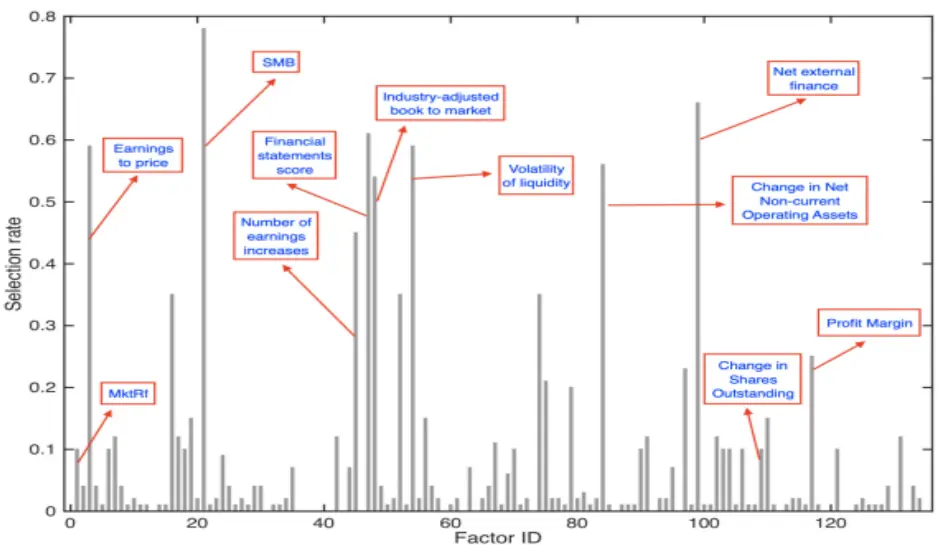
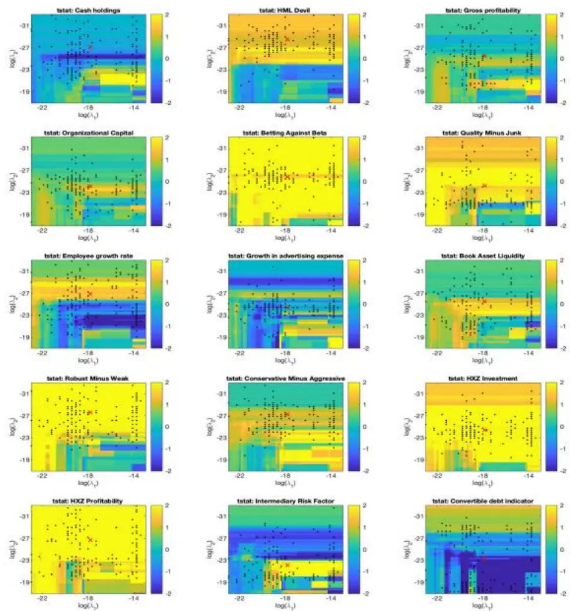

nInfo] [Table_Title] 2021.07.21

# 基于随机贴现模型的因子筛选法

## ——学界纵横系列之十六

陈奥林(分析师)

杨能(分析师)

8 021-38674835

021-38032685

chenaolin@gtjas.com

yangneng@gtjas.com

证书编号 S0880516100001

S0880519080008

## 本报告导读：

本文介绍了一种判断新因子是否具有边际贡献的方法，主要解决遗漏变量偏差问题。

## 摘要：

le_Summary]近年来，实证资产定价模型的研究不断深化，同时 AI 在因子挖掘上的应用使得因子数量呈指数上升。判断新因子是否在已有的高维因子库上提供新息，需要建立更系统的评价体系。

《Taming the factor zoo: A Test of New Factors》介绍了一种检验新因子边际贡献的方法。该方法通过两步 LASSO 回归，对已有的高维因子库进行双重选择，缓解变量遗漏所带来的误差问题。

文章得出的主要结论：第一，近年新提出的因子中，BETA、投资能力（HXZ 的 IA）和盈利能力因子（Fama-French 的 RMW、HXZ 的 ROE）有显著贡献。同时对比不同基准模型，双重选择方法可以充分利用因子库中包含的信息，减小变量遗漏误差，进而更保守地评估新因子贡献。第二，随着时间递归地应用文章方法，可以对因子库进行缩减。第三，文章方法对于模型参数具有稳健性，其他机器学习的变量选择方法也与文章的实证结果相似。

本文将文章方法从资产定价模型拓展到机器学习背景下的技术因子挖掘，使用双重选择方法对技术因子进行逐步回归，发现双重选择方法虽能在一定程度精简因子库，剔除部分相关性较高的因子，但效果不显著。由于文章方法基于随机贴现模型，其在纯技术因子库上的应用有待进一步研究。

金融工程

## 金融工程团队：

陈奥林：（分析师）

电话：021-38674835

邮箱：chenaolin@gtjas.com

证书编号：S0880516100001

## 杨能：（分析师）

电话：021-38032685

邮箱：yangneng@gtjas.com

证书编号：S0880519080008

## 殷钦怡：（分析师）

电话：021-38675855

邮箱：yinqinyi@gtjas.com

证书编号：S0880519080013

## 徐忠亚：（分析师）

电话：021- 38032692

邮箱：xuzhongya@gtjas.com

证书编号：S0880519090002

## 刘昺轶：（分析师）

电话：021-38677309

邮箱：liubingyi@gtjas.com

证书编号：S0880520050001

## 吕琪：（研究助理）

电话：021-38674754

邮箱：lvqi@gtjas.com

证书编号：S0880120080008

## 赵展成：（研究助理）

电话：021-38676911

邮箱：Zhaozhancheng@gtjas.com

证书编号：S0880120110019

## [Table_Re相关报告

机构投资者如何助力企业减少碳排放2021.07.20

基金经理研究之二：彼得林奇的成长股投资之道 2021.07.16

防御性因子择时：低频化风险控制工具2021.07.14

易方达中证科创创业 50ETF投资价值分析2021.07.11

企业社会责任的纳入如何降低了组合风险2021.07.01

## 1. 文章背景及结论

## 1.1. 选题背景

近年来，Hou et al. (2019a)的 q-factor 模型对 FF 五因子模型的抨击，引发了学术界关于资产定价模型的因子大战，同时 AI 在因子挖掘上的应用使得因子数量呈指数上升。在这个因子泛滥的时代，factor zoo 逐渐演变成 factor ocean，判断新因子是否在已有因子的基础上提供新息，需要建立更系统的评价体系。

Barillas 和 Shanken（2018）以及 Fama 和 French（2018）通过检验资产定价模型中加入新因子前后的 alpha 变化来衡量新因子的贡献。而面对高维因子库，目前已有 LASSO、PCA等方法对原有因子库进行降维，但这些方法可能出现变量遗漏问题，同时没有适当的计量方法解决模型选择错误的问题。这意味着，简单的使用 LASSO 之类的模型来进行因子筛选并不可靠。

本篇报告推荐的《Taming the factor zoo》提供了一种在高维环境下缓解变量遗漏问题的新因子检验方法。

借鉴文章的方法，我们对技术因子进行逐步回归筛选有效因子，希望将文章方法从资产定价模型拓展到机器学习背景下的因子挖掘。

## 1.2. 核心结论

文章（Taming the factor zoo）提出双重选择方法缩减因子库，并通过实证检验近年来文献提出的新因子。

文章得出的主要结论：第一，近年新提出的因子中，BETA、投资能力（HXZ 的 IA）和盈利能力因子（Fama-French 的 RMW、HXZ 的 ROE）有显著贡献。同时对比不同基准模型，双重选择方法可以充分利用因子库中包含的信息，减小变量遗漏误差，进而更保守地评估新因子贡献。第二，随着时间递归地应用文章方法，可以对因子库进行缩减。第三，文章方法对于模型参数具有稳健性，其他机器学习的变量选择方法也与文章的实证结果相似。

本文将文章的方法应用于纯技术因子的评估，发现双重选择方法虽能在一定程度精简因子库，剔除部分相关性较高的因子，但效果不显著。由于文章方法基于随机贴现模型，其在纯技术因子库上的应用有待进一步研究。

## 2. 核心模型

## 2.1. 基础模型

## 2.1.1. 随机贴现因子模型（SDF）

《Taming the factor zoo》一文是基于随机贴现模型提出的，随机贴现因子的载荷可以作为因子贡献的评价指标。随机贴现因子模型的推导如下，

对于任一时刻 t，随机贴现因子的定义为：

$$
m_{t+1}=1-b_{t}^{T}R_{t+1}\tag{1}
$$

其中 $R_{t+1}$ 为横截面个股超额收益率， $b_{t}$ 为 SDF 的回归系数。 $b_{t}$ 可由观察到的 d 个因子特征，假设 SDF 回归系数可以表示为：

$$
b_{t}=v_{t}\lambda_{t}\tag{2}
$$

其中 $v_{t}\mathrm{~(~n^{*}d~)~}$ 为个股因子值，需要横截面进行零均值化使 $E(v_{t})=0,\lambda_{t}$ （d*1）为时变系数。

将上式(2)带入(1)，可得另一种 SDF 模型：

$$
m_{t+1}=1-\lambda_{t}^{T}F_{t+1}\tag{3}
$$

其中 $F_{t+1}=v_{t}^{T}R_{t}$ 为因子投资组合，也可理解为因子收益率。 $\lambda_{t}$ 就是 SDF的载荷。

根据随机贴现模型的定义:

$$
E[m_{t+1}R_{t+1}]=0\tag{4}
$$

将 SDF 定义带入上式可得：

$$
E\big((1-\lambda_{t}^{T}F_{t+1})R_{t+1}\big)=0\tag{5}
$$

通过广义矩估计（Generalized method of moments）可得

$$
E\left(R\right)=\gamma_{0}+\lambda_{t}^{T}C_{f},C_{f}=Cov\left(R,F\right)\tag{6}
$$

因子的 SDF 载荷 $\lambda_{t}$ 和风险溢价都有重要但独特的经济解释， $而$ Cochrane（2009）提出 SDF 载荷作为因子库筛选的指标更合适。

## 2.1.2. 遗漏变量偏差

《Taming the factor zoo》提出的方法主要是为了解决遗漏变量带来的偏差问题。遗漏变量指的是模型中遗漏了重要的因子，该问题将导致因子的载荷估计存在偏差，且更严重的是偏差的方向可正可负。

用简单多因子模型为例，假设 y 对 $[x_{1}$ 和 ${}^{\imath}x_{2}$ 满足如下线性回归模型：

$$
y=\beta_{0}+\beta_{1}x_{1}+\beta_{2}x_{2}+\varepsilon\tag{7}
$$

由于遗漏变量问题，假设令 y 只对 $[x_{1}$ 回归，并通过 OLS 估计。通过简单的计量经济学知识可知， $x_{1}$ 的回归系数的偏差如下：

$$
bias\left(\stackrel{\sim}{\beta}_{1}\right)=E\left(\stackrel{\sim}{\beta}_{1}\right)-\beta_{1}=\beta_{2}\stackrel{\sim}{\delta}_{1}\tag{8}
$$

其中 $\beta_{2}$ 是真实模型中 $\mathrm{y}$ 对 $x_{2}$ 的回归系数， $\delta_{1}$ 是 $x_{2}.$ 对 $[x_{1}$ 的回归系数。上式说明 $\beta_{1}$ 的偏差由 $\beta_{2}$ 和 $\iota\delta_{11}$ 共同决定，它的符号受这两部分的影响。遗漏变量的存在使得因子溢价的估计是有偏的（biased），它也被称为遗漏变量偏差（omitted variable bias）。

从传统计量经济学的角度来说，遗漏变量问题可以通过加入更多的解释变量来解决。但是在多因子模型中塞入太多的因子容易造成样本内的过拟合。

## 2.2. 双重选择方法

《Taming the factor zoo》提出的双重选择方法，结合了两阶段横截面回归和双重 LASSO(Belloni et al. (2014b))。该方法应用于评价新因子是否在原有的资产定价模型中提供边际贡献，使用双重选择目的是精简原有的定价模型，减小模型选择的偏差。

## 2.2.1. 计算步骤

双重选择方法具体计算步骤如下：

第一重 LASSO 回归：

根据公式（6）推导的 $E(r_{t})=\gamma_{0}+C_{口}\lambda_{口}$ ，进行 LASSO 回归获得载荷 $\lambda_{口}:$

$$
\operatorname*{min}_{\mathbf{\gamma},\mathbf{\lambda}}\Bigl\{\mathbf{n}^{-1}\bigl\|\overline{{\mathbf{r}}}-\mathbf{\gamma}-\widehat{\mathsf{C}_{\mathsf{h}}}\mathbf{\lambda}\bigr\|^{2}+\mathbf{\tau}_{\mathbf{\gamma}_{0}}\mathbf{n}^{-1}\bigr\|\mathbf{\lambda}\bigr\|\Bigr\}\tag{9}
$$

其中 $\widehat{\mathsf{C}_{\mathsf{h}}}=\mathsf{Cov}(\mathsf{r}_{\mathsf{t}},\mathsf{h}_{\mathsf{t}})=\mathsf{T}^{-1}\mathsf{R}\mathsf{H}^{\mathsf{T}},$ ，τ $0^{\prime}$ 是 LASSO 回归的惩罚程度。

这一步的目的是选取 $h_{\mathbf{t}}$ 中随机贴现模型载荷显著的有效因子,降低维数。

第二重 LASSO 回归：

如果 $E(r_{t})=\gamma_{0}+C_{g}\lambda_{g}+C_{口}\lambda_{口}$ 中遗漏变量，则根据公式（8）可得$\lambda_{\mathrm{~g~}}$ 的估计偏差=λ χ

$\lambda_{\mathrm{~h~}}$ 是已有因子的随机贴现因子载荷， $\chi.$ 是 $C_{g}$ 对 $C_{\perp}$ 的回归系数，即：

$$
C_{g}=\xi^{T}+C_{\Box}\chi^{T}+C_{\mu}.
$$

若回归系数 $\chi$ 为 0，则说明不存在遗漏变量偏差，但如果存在显著 $-\chi_{1}$ ，则表示存在遗漏的变量，因此可根据该方程选择 $\cdot h_{\mathbf{t}}$ 中与 $\mathbf{g}_{\mathbf{t}}$ 相关的因子，减小遗漏变量偏差。

根据上式将 $\mathbf{\nabla}^{\cdot}\mathbf{g}_{\mathbf{t}}$ 中的每一个因子 $\mathbf{g}_{\mathbf{j}}$ 和收益的协方差与 $\mathbf{h}_{\mathrm{t}}因$ 子收益协方差进行第二重 LASSO 回归，获得系数χ：

$$
\operatorname*{min}_{\boldsymbol{\xi}_{\mathrm{\scriptsize~j}},\boldsymbol{\tau}_{\mathrm{\scriptsize~j}}}\left\{\mathsf{n}^{-1}\;\left\|\widehat{\mathsf{C}_{\mathsf{g},\mathrm{j}}}-\boldsymbol{\xi}_{\mathrm{\scriptsize~j}}-\widehat{\mathsf{C}_{\mathsf{h}}}\boldsymbol{\tau}_{\mathrm{\scriptsize~j}}^{\mathrm{\scriptsize~T}}\right\|^{2}+\boldsymbol{\tau}_{\mathrm{\scriptsize~j}}\mathsf{n}^{-1}\left\|\boldsymbol{\tau}_{\mathrm{\scriptsize~j}}^{\mathrm{\scriptsize~T}}\right\|\right\}\tag{10}
$$

第二重 LASSO 回归，选择 $h_{\mathbf{t}}$ 中与新因子相关性较高的因子，减小遗漏变量偏差，解决了 $高$ 维因子库检验新因子的主要问题，也是文章的创新点。

横截面回归：

双重选择后，将筛选的因子与 $\mathbf{g}_{\mathrm{t}}$ 构建新的因子集，进行横截面回归：

$$
\arg\min_{\xi_{\mathrm{j}},\times_{\mathrm{j}}}\left\{\left\|\overline{\mathbf{r}}-\gamma_{0}-\widehat{\mathbb{C}_{\mathrm{g}}}\lambda_{\mathrm{g}}-\widehat{\mathbb{C}_{\mathrm{h}}}\lambda_{\mathrm{h}}\right\|^{2},\lambda_{\mathrm{h,j}}=0\right\}\tag{11}
$$

其中 j 是不包括在两步 LASSO 回归选择中的因子。若 $\lambda_{\mathrm{~g~l~}}$ 显著不为 0，则因子 $\mathbf{g_{t}}$ 有边际贡献。

## 2.2.2. 对比其他模型

《Taming the factor zoo》的双重选择方法，采用 LASSO 模型，是因为其是线性的，有更好的解释能力。文章提出 LASSO 也可以用其他模型替代，例如决策树、随机森林、boosting 和神经网络（Chernozhukov (2018)）等机器学习方法，或子集选择、偏最小二乘法、PCA 等变量选择方法。

双重选择方法可以与其他方法进行对比。Harvey 和 Liu（2016）采用逐步回归方法，评估每个因子的边际贡献，进而构建最佳模型。但如果预选模型有多余因子，则可能无法找到最优模型。由于双重选择方法考虑了模型选择错误，文章认为是更优的选择。后续文章会对不同模型进行稳健性检验。

## 3. 原文实证分析

## 3.1. 数据

《Taming the factor zoo》一文搜集 1976 年 7 月至 2017 年 12 月来源自不同数据库的因子数据。通过 top30%-bottom30%多空市值加权投资组合构造了 150 个因子收益率（详见附录）。

由于投资组合和单个资产的选择之间存在偏差，文章关注投资组合，而非单个资产为标的。投资组合一般会有更高的 beta 和信噪比，而且没有数据遗漏的问题。同时 Harvey 和 Liu(2016)指出，投资组合数据过少可能会产生偏差。Litzenberger 和 Ramaswamy 认为，投资组合数量太少会降低效率。

文章使用 750 个投资组合作为测试资产。测试资产按规模和其他因子进行 3×2 组合（将股票按大、中、小盘和其他因子的 top50%和 bottom50%分成 6组）。需要注意的是每个3×2投资组合中的股票数量可以不一致，文章只囊括了 6 组中的股票数量都大于 10 的因子，满足条件的总共有125 个因子，因此产生了 750 个投资组合（125×3×2）。

## 3.2. 新因子评估

《Taming the factor zoo》将 2012 年以前提出的 135 个因子作为因子库，评估 2012 年至 2016 年提出的 15 个新因子的贡献。

图 1 为第一重 LASSO 回归各因子的入选概率。在 200 次模拟中，只有SMB被选择的概率超过 70%，多数因子在 1%-20%之间波动。这也说明仅使用一次 LASSO 回归并不能完美的选择正确的模型。

图 1 因子选中概率

数据来源：《Taming the Factor Zoo》，国泰君安证券研究

文章在第一重 LASSO 中，从因子库中筛选了四个因子：SMB（21），净外部财务（99），流通股变化（109）和利润率（117），可以看出所选因子和常用的基准模型十分接近。在第二重 LASSO 回归中，平均所选因子个数在 20-80 个之间。

两次 所选因子数量的差异主要由于选择的目标不同。第一重LASSO 主要是为了寻找能够解释横截面预期收益率的因子，因此惩罚系数 τ0 较高，尽可能构建一个简单的模型。而第二重 LASSO 主要目的是为了尽可能保留会使 $\lambda_{g}.$ 估计值产生偏差的因子，甚至可能是冗余因子。第二重 LASSO 平均所选因子个数是符合预期的，因为很多因子之间存在相关性。仅将第一步 LASSO 回归的结果作为基础模型，可能会存在较大的遗漏变量偏差。

图 2 检验新因子的统计结果

|  |  | (1) DS |  | (2) SS |  | (3) FF3 |  | (4) No Selection |  | (5) Avg. Ret. |  |
| --- | --- | --- | --- | --- | --- | --- | --- | --- | --- | --- | --- |
| id | Factor Description | λs (bp) | tstat (DS) | $\lambda_{s}$ (bp) | tstat | $\lambda_{s}$ | tstat | λs | tstat | avg.ret. tstat |  |
| 136 | Cash holdings | -34 | -0.42 | 15 | (SS) 0.17 | (bp) 10 | (OLS) 0.54 | (bp) -18 | (OLS) -0.16 | (bp) 13 | 0.98 |
|  | 137 HML Devil | 54 | 1.04 | -13 | -0.25 |  | -100-2.46** | 68 | 0.84 | 23 | 1.46 |
| 138 | Gross profitability | 20 | 0.48 | 3 | 0.06 | 23 | 2.00** | 13 | 0.26 | 15 | 1.45 |
| 139 | Organizational Capital | 28 | 0.92 | -1 | -0.03 | 20 | 1.91* | 16 | 0.41 | 21 | 2.05** |
| 140 | Betting Against Beta | 35 | 1.45 | 38 | 1.50 | 36 | 2.25** | 49 | 1.49 | 91 | 5.98*** |
| 141 | Quality Minus Junk | 73 | 2.03** | 4 | 0.11 | 39 | 3.10*** | 50 | 1.04 | 43 | 3.87*** |
| 142 | Employee growth | 43 | 1.36 | -4 | -0.12 | -12 | -0.89 | 18 | 0.37 | 8 | 0.83 |
| 143 | Growth in advertising | -12 | -1.18 | 0 | 0.03 | 12 | 1.32 | -2 | -0.13 | 7 | 0.84 |
| 144 | Book Asset Liquidity | 40 | 1.07 | 5 | 0.12 | 20 | 1.59 | 20 | 0.42 | 9 | 0.79 |
| 145 | RMW | 160 | 4.45*** | 15 | 0.41 | 20 | 1.80* | 74 | 1.48 | 34 | 3.21*** |
| 146 | CMA | 38 | 1.10 | 0 | 0.01 | 3 | 0.28 | 7 | 0.14 | 26 | 3.02*** |
|  | 147 HXZ IA | 51 | 2.11** | 5 | 0.21 | 21 | 1.94* | 40 | 1.08 | 34 | 4.17*** |
| 148 | HXZ ROE | 77 | 3.37*** | 23 | 0.83 | 33 | 2.92*** | 104 | 2.87*** | 57 | 4.99*** |
| 149 | Intermediary Risk Factor 112 |  | 2.21** | 60 | 1.19 | 4 | 0.08 | 22 | 0.32 |  |  |
| 150 | Convertible debt | -15 | -1.36 | -39 | -3.22*** | 26 | 3.32*** | 17 | 1.01 | 11 | 1.70* |

数据来源：《Taming the Factor Zoo》，国泰君安证券研究

图 2 是不同基准模型下新因子 SDF 载荷的统计结果。第一列使用的是文章提出的双重选择方法（DS），第二列只使用第一重 LASSO 回归筛选得

到的因子作为基准模型。第三列是将 Fama-French 三因子作为基准模型。
第四列将所有因子作为基准模型。第五列是因子的平均风险溢价。

双重选择方法的结果显示，最近五年提出的因子大多是冗余或者无效的。其中有少部分因子有重要贡献：1）盈利能力因子（RMW、ROE）：2）投资能力因子 IA；3)He 的不可交易中间资本因子；4)质量因子（QMJ）。该结果与 三因子模型和因子风险溢价（第三、五列）结果相似，但双重选择方法下显著的因子数量更少，证明双重选择方法对新因子的评估更为保守。而第二列和第四列的结果表明，只使用一重 LASSO 和使用所有因子，都对新因子的评估造成较大偏差。

总体上看，图 2 的结果可以说明选择基础模型的方法对 SDF 载荷和因子有效性评价有着至关重要的作用。文章提出的双重选择方法可以帮助研究人员充分利用因子库中包含的信息，而不引入偏差，更保守地评估新因子的边际贡献。

## 3.3. 递归测试

## 3.3.1. 逐年递归评估因子

《Taming the factor zoo》一文从 1994 年开始的每一年，使用双重选择方法检验给定年度引入的新因子贡献。需要注意的是，此实证是递归的，即在评估时间 t 引入的因子时，仅使用 t 年度之前的信息。

图 3 按年度划分的因子递归检验

| Year | (1) # Assets | (2) # Controls | (3) |  |  |  |  |  |  |  |  |  |  |  |
| --- | --- | --- | --- | --- | --- | --- | --- | --- | --- | --- | --- | --- | --- | --- |
|  |  |  |  |  |  | New factors (IDs) |  |  |  |  |  |  |  |  |
| 1994 | 138 | 25 | 26 | 27 |  |  |  |  |  |  |  |  |  |  |
| 1995 | 150 | 27 | 28 | 29 | 30 |  |  |  |  |  |  |  |  |  |
| 1996 | 150 | 30 | 31 | 32 | 33 |  |  |  |  |  |  |  |  |  |
| 1997 | 168 | 33 | 34 |  |  |  |  |  |  |  |  |  |  |  |
| 1998 | 174 | 34 | 35 | 36 | 37 | 38 | 39 | 40 | 41 | 42 | 43 | 44 |  |  |
| 1999 | 228 | 44 | 45 | 46 |  |  |  |  |  |  |  |  |  |  |
| 2000 | 234 | 46 | 47 | 48 | 49 | 50 | 51 |  |  |  |  |  |  |  |
| 2001 | 252 | 51 | 52 | 53 | 54 | 55 | 56 | 57 | 58 |  |  |  |  |  |
| 2002 | 294 | 58 | 59 | 60 | 61 |  |  |  |  |  |  |  |  |  |
| 2003 | 312 | 61 | 62 | 63 | 64 | 65 | 66 |  |  |  |  |  |  |  |
| 2004 | 336 | 66 | 67 | 68 | 69 | 70 | 71 | 72 | 73 | 74 |  |  |  |  |
| 2005 | 372 | 74 | 75 | 76 | 77 | 78 | 79 | 80 | 81 | 82 | 83 | 84 | 85 | 86 |
| 2006 |  |  | 87 | 88 | 89 | 90 |  |  |  |  |  |  |  |  |
|  | 456 | 90 | 91 | 92 | 93 | 94 | 95 | 96 | 97 | 98 | 99 | 100 | 101 | 102 |
| 2007 | 516 | 102 | 103 | 104 | 105 | 106 | 107 | 108 |  |  |  |  |  |  |
| 2008 | 552 | 108 | 109 | 110 | 111 | 112 | 113 | 114 | 115 | 116 | 117 | 118 | 119 | 120 |
| 2009 | 618 | 120 | 121 | 122 | 123 | 124 |  |  |  |  |  |  |  |  |
| 2010 | 636 | 124 | 125 | 126 | 127 | 128 | 129 |  |  |  |  |  |  |  |
| 2011 | 666 | 129 | 130 | 131 | 132 | 133 | 134 | 135 |  |  |  |  |  |  |
| 2012 | 702 | 135 | 136 |  |  |  |  |  |  |  |  |  |  |  |
| 2013 | 708 | 136 | 137 | 138 | 139 |  |  |  |  |  |  |  |  |  |
| 2014 | 720 | 139 | 140 | 141 | 142 | 143 | 144 |  |  |  |  |  |  |  |
| 2015 | 738 | 144 | 145 | 146 | 147 | 148 |  |  |  |  |  |  |  |  |
| 2016 | 750 | 148 | 149 | 150 |  |  |  |  |  |  |  |  |  |  |

数据来源：《Taming the Factor Zoo》，国泰君安证券研究

图3为测试结果，加下划线的即为贡献显著的因子。可以看出如果从1994年开始每年进行双重选择，只有 17 个因子被认为是有用的，其中绝大多数被认为是多冗余或无效因子。

## 3.3.2. 逐步回归

本节文章提供一种新的递归方法。首先设置 ht 的初始模型（Fama-French四因子），然后对其他所有因子进行评估，并选择t统计量最高的因子gt，并在未来迭代中需要加入此因子。文章希望在每次迭代时能够正好加入一个因子，同时当没有更多因子被认为对现有集合有贡献时，此递归结束。

在文章的实证中，最后一次迭代中的基准因子为：

表 1：基准因子（按选择顺序排序）

| 顺序 | D | 因子名称 |
| --- | --- | --- |
| 1 | 148 | HXZ Profitability |
| 2 | 88 | Change in Financial Liabilities |
| 3 | 51 | Industry -adjusted size |
| 4 | 62 | Liquidity |
| 5 | 74 | Tax income to book income |
| 6 | 61 | Illiquidity |
| 7 | 49 | Industry -adjusted cash flow to price ratio |
| 8 | 122 | Sin stocks |
| 9 | 6 | Share price |
| 10 | 55 | Advertising Expense-to-market |
| 11 | 72 | Net Operating Assets |
| 12 | 53 | Volatility of liquidity (dollar trading volume) |
| 13 | 119 | Industry-adjusted change in asset turnover |
| 14 | 140 | Betting Against Beta |
| 15 | 44 | Industry adjusted % change in capital expenditures |
| 16 | 147 | HXZ Investment |
| 17 | 65 | Order backlog |
| 18 | 32 | Sales to price |
| 19 | 31 | Working capital accruals |
| 20 | 87 | Change in Short- term Investments |
| 21 | 123 | Revenue surprise |
| 22 | 5 | Unexpected quarterly earnings |

数据来源：《Taming the Factor Zoo》，国泰君安证券研究

逐步回归所选出的因子与上一节所选出的因子大约有一半是相同的。这表明有几个因子（例如，BETA，HXZ 投资和盈利能力）不仅对先前引入的因子做出了重要贡献，而且对其他所有因子也都做出了重要贡献。总体而言，这两种做法都对高维因子库进行了筛选，选择出对超额收益较有解释力度的因子。

## 3.4. 稳健性检验

## 3.4.1. 参数稳健性检验

本节《Taming the factor zoo》一文探讨了双重选择方法对参数变化的稳健性。双重 LASSO 需要选择两个在合理范围内的参数。文章选择 200 个随机种子进行交叉验证，然后检验每个 $-\lambda_{g}$ 的 t 统计量随参数的不同而变化的情况。

图表 4 展示了稳健性分析的结果，其中每一个面板代表一个因子，不同颜色代表被检验因子的 t 统计量。横轴是第一重 LASSO 的参数，纵轴是第二重 LASSO 的参数，红叉表示 200 个调整参数的平均值。

该图用以证明双重选择方法的稳健性。BETA、投资能力和盈利能力因子十分稳健，而机构投资、CMA、营销费用增长等因子并不稳健。

图 4：不同参数下因子显著性热图

数据来源：《Taming the Factor Zoo》，国泰君安证券研究

## 3.4.2. 不同模型的稳健性检验

本节文章对不同资产组合和不同模型进行稳健性测试。

图 6 展示了稳健性测试结果，第一列为文章最初模型的统计结果，第二列将测试数据转为 5×5 的资产组合，第三列使用 Giglio 和 Xiu（2016）的 202 个投资组合，可以看出文章结果对不同资产具有稳健性。

其余三列为不同机器学习方法的结果。第四列为 LASSO 与 Ridge 相结合的 Elastic Net。第五列使用 Kozak，Nagel 和 Santosh（2020）提出的方法，先构建因子的 PCA，然后在主要成分上使用 LASSO。第六列使用Harvey 和 Liu（2016）建议的正向逐步回归方法，将因子加入的模型中，直到没有因子能够对模型 BIC 指标进行提升。以上三种方法与文章提出的双重选择结果相似，说明文章方法具有稳健性。

总体而言，尽管某些因子的有效性在稳健性测试中有所不同，但主要结论相当稳健。因此，相对于 2012 年之前文献中引入的所有因子，可以认为最近引入的一些因子（如 QWJ、RMW、ROE、IA等）具有显著贡献。

图 5：所选资产和正则化方法的稳健性检验结果

|  |  | (1) Bivariate 3 × 2 |  | (2) |  | (3) |  | (4) |  | (5) |  | (6) |  |
| --- | --- | --- | --- | --- | --- | --- | --- | --- | --- | --- | --- | --- | --- |
|  |  |  |  | Bivariate 5 × 5 |  | 202 Portfolios |  | Elastic Net |  | PCA |  | Stepwise |  |
|  |  | λs (bp) | tstat (DS) | λs | tstat | λs | tstat | λs | tstat | λs | tstat (DS) | λs | tstat |
| id | Factor Description Cash holdings | -34 | -0.42 | (bp) | (DS) | (bp) | (DS) | (bp) | (DS) | (bp) |  | (bp) | (DS) |
| 136 137 | HML Devil | 54 |  | 34 | 0.40 | 131 | 0.89 | -13 | -0.14 1.23 | -65 | -0.62 -0.51 | -73 | -0.87 |
| 138 | Gross profitability | 20 | 1.04 0.48 | 15 | 0.29 | 56 | 0.57 | 62 |  | -27 |  | 49 | 1.01 |
| 139 | Organizational Capital | 28 |  | 28 | 0.66 | 88 | 1.42 | -11 | -0.26 | 16 | 0.35 | 16 | 0.47 |
| 140 | Betting Against Beta | 35 | 0.92 | 23 | 0.75 | 6 | 0.16 | 12 | 0.38 | 21 | 0.57 | 0 | 0.01 |
| 141 | Quality Minus Junk |  | 1.45 2.03** | 43 | 1.94* | 31 | 1.03 | 28 | 1.12 2.13** | 59 | 2.56*** | 62 | 2.57*** |
| 142 | Employee growth | 73 43 | 1.36 | 58 | 1.67 | 123 | 2.45** | 74 |  | 71 | 1.89* | 40 | 1.16 |
| 143 | Growth in advertising | -12 | -1.18 | 12 6 | 0.34 | 54 | 1.34 | 51 | 1.49 | -4 | -0.09 | 33 | 0.98 0.27 |
| 144 | Book Asset Liquidity | 40 | 1.07 |  | 0.57 | 17 | 1.30 | 9 26 | 0.74 0.68 | -6 24 | -0.57 0.63 | 3 | 1.00 |
| 145 | RMW | 160 | 4.45*** | -24 | -0.61 3.13*** | 37 | 0.77 1.98** |  | 3.43*** |  |  | 33 | 2.71*** |
| 146 | CMA | 38 | 1.10 | 104 |  | 112 |  | 125 |  | 88 | 2.11** | 96 |  |
| 147 | HXZ IA | 51 | 2.11** | 19 | 0.59 | 33 | 0.52 -1.42 | 32 | 0.85 2.77*** | 18 36 | 0.44 1.31 | 23 | 0.67 1.92* |
| 148 | HXZ ROE | 77 | 3.37*** | 44 | 1.87* 2.62*** | -45 | 2.22*** | 69 | 3.85*** |  |  | 49 | 3.87*** |
| 149 |  | 112 | 2.21** | 72 |  | 116 |  | 103 |  | 41 103 | 1.46 1.92* | 101 | -0.17 |
|  | Intermediary Risk Factor |  |  | 38 | 0.73 | -16 | -0.33 5.13*** | -16 | -0.33 |  |  | -10 |  |
| 150 | Convertible debt | -15 | -1.36 | -6 | -0.56 | 68 |  | -12 | -1.08 | -9 | -0.88 | 0 | -0.02 |

数据来源：《Taming the Factor Zoo》，国泰君安证券研究

## 4. 原文结论

《Taming the factor zoo》一文提出了一种基于随机贴现模型检验新因子贡献的方法，此方法在结合传统两阶段回归和 Belloni，Chernozhukov 和Hansen（2014b）提出的双重选择方法，同时因子库可以是高维度的，也可以包含多个无用或冗余因子。文章主要解决了模型选择中的遗漏变量偏差问题。

将方法应用于近 30 年文献中提出的大量因子，发现的主要结论：第一，近年新提出的因子（尤其是投资能力、盈利能力）可以对资产定价有显著贡献。第二，实证发现，随着时间递归地应用文章方法，可以对因子库进行缩减。第三，文章方法对于模型参数具有稳健性，同时使用其他机器学习的变量选择方法，也与文章的实证结果相似，说明双重选择方法可以克服模型选择错误而能够产生正确的推论。

总体而言，文章的结果为资产定价研究的持续发展作出贡献，同时需要指出的是文章研究新因子相对于大量现有因子的边际贡献是一种保守且有效的筛选新因子的方法，这也为处理海量因子库给出了一条途径。

## 5. 我们的实证与思考

## 5.1. 技术因子实证分析

本节我们将《Taming the factor zoo》提出的双重选择方法用于对技术因子的贡献评估。我们参考文章的逐步回归方法，对 66 个技术因子（见附录）进行逐步回归，每次在双重选择后的横截面回归中，选择 t 统计量最高的因子加入基准模型，当没有更多因子被认为对现有因子集合有贡献时（t 统计量不显著），此递归结束。

原技术因子集包含较多相关性较大的因子,希望能通过文章方法精简因子库，删除相关性较大的因子，选择边际贡献较大的因子。

表 2 显示的是按次序选择的因子集。对比选择前后因子的最高相关性，选择的绝大多数因子最大相关性减小，但也将相关性较大的因子入选，例如 vpin 和 volume_vr 类因子。同时表 3 计算选择前后因子库的绝对相关性均值，发现双重选择方法并没有显著降低因子间的相关性。

表 2：选择后的因子集

| 选择次序 | 技术因子 | 相关性最大值 | 原因子集相关 性最大值 |
| --- | --- | --- | --- |
| 1 | gammacorr_neut | 26.77% | 28.37% |
| 2 | vo120_neut | 17.46% | 42.01% |
| 3 | gp5_neut | 24.53% | 24.53% |
| 4 | smartmoney-d_neut | 36.41% | 73.30% |
| 5 | jumpdown_d_neut | 9.73% | 36.96% |
| 6 | volume_vr_2w_neut | 68.98% | 68.98% |
| 7 | vpin_w_neut | 67.00% | 67.00% |
| 8 | 1ockedstk_w_neut | 22.97% | 60.75% |
| 9 | volume_vr_neut | 68.98% | 68.98% |
| 10 | vpin_2w_neut | 67.00% | 67.00% |
| 11 | rstr_5d | 48.25% | 63.84% |
| 12 | corr_cp-turnover_w_neut | 19.53% | 21.72% |
| 13 | stod_neut | 41.07% | 86.52% |
| 14 | gp3_neut | 47.19% | 59.93% |
| 15 | vpin_m_neut | 62.22% | 62.22% |
| 16 | gp4_neut | 29.10% | 40.76% |
| 17 | vstd_m_neut | 47.19% | 58.81% |
| 18 | tcap-neut | 1.92% | 2.90% |
| 19 | wr-neut | 48.25% | 64.94% |

数据来源：国泰君安证券研究

表 3：绝对相关性均值

| 绝对相关性均值 | 选择前 | 选择后 |
| --- | --- | --- |
| 因子值 | 18.44% | 17.82% |
| 因子收益率 | 36.25% | 38.00% |

数据来源：国泰君安证券研究

表 4 为只使用一次 LASSO 回归的选择模型，作为与双重选择模型的对比。模型中 Alpha 取 0.0002 使得系数不为 0 的因子数量与双重选择模型相近。发现两个模型半数因子重叠，证明双重选择模型具有一定稳健性。

表 4：一次 LASSO 回归

| 因子 | LASSO 回归系数 |
| --- | --- |
| 1 | vstd_w_neut 0.38 |
| 2 rstr_5d | 0.13 |
| 3 vpin_w_neut | 0.09 |
| 4 Wr-neut | 0.07 |
| 5 gp2_neut | 0.07 |
| 6 | corr_cp-turnover_w-neut 0.06 |
| 7 ivol_neut | 0.04 |
| 8 mf_inflow_1m_neut | -0.01 |
| 9 | volume_1ast_15min_2w_neut -0.02 |
| 10 tcap-neut | -0.03 |
| 11 gammacorr-neut | -0.07 |
| 12 gp3_neut | -0.11 |
| 13 gp1_neut | -0.13 |
| 14 1ockedstk_neut | -0.14 |
| 15 1ockedstk_m_neut | -0.16 |
| 16 jumpdown_d_neut | -0.18 |
| 17 stod_neut | -0.22 |

数据来源：国泰君安证券研究

实证结果显示，在纯技术因子库的应用上，双重选择方法虽能在一定程度精简因子库，剔除部分相关性较高的因子，但效果不显著。

双重选择方法是基于资产定价模型提出的，资产定价模型中的因子具有经济学意义，且因子对收益的解释力度较大，因此应用双重选择方法可在精简因子库的基础上检验新因子。而在技术因子库中没有对收益解释力度较强的核心因子，且通过修改参数构成的同类因子相关性较大，使用双重选择方法对因子精简的效果不明显。

## 5.2. 我们的思考

随着因子投资的兴起，新因子的挖掘成为学术界和业界的重点研究方向之一。然而目前对于新因子的贡献多使用相关系数检验，可能无法很好的度量高维基准模型下新因子的边际贡献。文章(Taming the factor zoo)的方法对因子库的构建有着重要指导意义，可以帮助投资者更好把握新因子的作用。同时通过对技术因子的实证分析发现，文章的方法虽能在一定程度精简因子库，剔除部分相关性较高的因子，但效果不显著。由于双重选择方法是基于随机贴现模型提出的，其在纯技术因子库上的应用有待进一步研究。

## 6. 参考文献

[1] Feng G , Giglio S , Xiu D . Taming the Factor Zoo: A Test of New Factors[J]. Social Science Electronic Publishing.

[2] Haddad V , Kozak S , Santosh S . Factor Timing[J]. NBER Working Papers, 2020.

[3] Kozak S , Nagel S , Santosh S . Shrinking the Cross Section[J]. Social Science Electronic Publishing.

## 7. 附录

表 5: 原文因子库

| ID | Description | Year.pub | Year.end | Avg.Ret. | Annual S.R. | Reference |
| --- | --- | --- | --- | --- | --- | --- |
| 1 | Excess Market Return | 1972 | 1965 | 0.64% | 50.60% | Jensen et al.(1972) |
| 2 | Market Beta | 1973 | 1968 | -0.08% | -5.40% | Fama and M acBeth (1973) |
| 3 | Earnings to price | 1977 | 1971 | 0.28% | 29.70% | Basu (1977) |
|  |  |  |  |  |  | Litzenberger and Ramaswamy |
| 4 | Dividend to price | 1979 | 1977 | 0.01% | 0.60% | (1979) |
| 5 | Unexpected quarterly earnings | 1982 | 1980 | 0.12% | 26.30% | Rendleman et al. (1982) |
| 6 | Share price | 1982 | 1978 | 0.02% | 2.20% | Miller and Scholes (1982) |
| 7 | Long-Term Reversal | 1985 | 1982 | 0.34% | 36.30% | Bondt and Thaler (1985) |
| 8 | Leverage | 1988 | 1981 | 0.21% | 24.30% | Bhandari (1988) |
| 9 | Cash flow to debt | 1989 | 1984 | -0.09% | -17.00% | Ou and Penman (1989) |
| 10 | Current ratio | 1989 | 1984 | 0.06% | 7.70% | Ou and Penman (1989) |
| 11 | % change in current ratio | 1989 | 1984 | 0.00% | 0.50% | Ou and Penman (1989) |
| 12 | % change in quick ratio | 1989 | 1984 | -0.04% | -11.90% | Ou and Penman (1989) |
| 13 | % change sales-to-inventory | 1989 | 1984 | 0.17% | 46.20% | Ou and Penman (1989) |
| 14 | Quick ratio | 1989 | 1984 | -0.02% | -2.90% | Ou and Penman (1989) |
| 15 | Sales to cash | 1989 | 1984 | 0.01% | 1.50% | Ou and Penman (1989) |
| 16 | Sales to inventory | 1989 | 1984 | 0.09% | 16.10% | Ou and Penman (1989) |
| 17 | Sales to receivables | 1989 | 1984 | 0.14% | 22.80% | Ou and Penman (1989) |
| 18 | Bic-ask spread | 1989 | 1979 | -0.04% | -3.30% | Amihud and Mendelson (1989) |
| 19 | Depreciation /PP&E | 1992 | 1988 | 0.11% | 12.10% | Holthausen and Larcker (1992) |
| 20 | % change in depreciation | 1992 | 1988 | 0.08% | 23.10% | Holthausen and Larcker (1992) |
| 21 | Small Minus Big | 1993 | 1991 | 0.21% | 24.50% | Fama and French (1993) |
| 22 | High Minus Low | 1993 | 1991 | 0.28% | 34.30% | Fama and French (1993) |
| 23 | Short-Term Reversal | 1993 | 1989 | 0.15% | 21.70% | Jegadeesh and Titman (1993) |
| 24 | 6-month momentum | 1993 | 1989 | 0.21% | 27.80% | Jegadeesh and Titman (1993) |
| 25 | 36-month momentum | 1993 | 1989 | 0.09% | 13.40% | Jegadeesh and Titman (1993) |
| 26 | Sales growth | 1994 | 1990 | 0.04% | 5.80% | Lakonishok et al. (1994) |
| 27 | Cash flow-to-price | 1994 | 1990 | 0.31% | 32.50% | Lakonishok et al. (1994) |
| 28 | New equity issue | 1995 | 1990 | 0.10% | 8.70% | Loughran and Ritter (1995) |
| 29 | Dividend initiation | 1995 | 1988 | -0.03% | -3.40% | Michaely et al. (1995) |
| 30 | Dividend omission | 1995 | 1988 | -0.18% | -18.00% | Michaely et al. (1995) |
| 31 | Working capital accruals | 1996 | 1991 | 0.22% | 46.00% | Sloan (1996) |
| 32 | Sales to price | 1996 | 1991 | 0.35% | 41.80% | Barbee Jr et al. (1996) |
| 33 | Capital turnover | 1996 | 1993 | -0.11% | -16.60% | Haugen and Baker (1996) |
| 34 | Momentum | 1997 | 1993 | 0.63% | 50.20% | Carhart (1997) |
| 35 | Share turnover | 1998 | 1991 | -0.02% | -2.10% | Datar et al. (1998) |
|  | % change in grass margin- % |  |  |  |  |  |
| 36 | change in sales | 1998 | 1988 | -0.05% | -12.40% | Abarbanell and Bushee (1998) |
|  | % change in sales - % change in |  |  |  |  |  |
| 37 | inventory | 1998 | 1988 | 0.14% | 42.10% | Abarbanell and Bushee (1998) |
| 38 | % change in sales - % change in A/R | 1998 | 1988 | 0.14% | 43.50% | Abarbanell and Bushee (1998) |
|  | % change in sales - % change in |  |  |  |  |  |
| 39 | SG&A | 1998 | 1988 | 0.09% | 19.60% | Abarbanell and Bushee (1998) |
| 40 | Effective 'Tax Rate | 1998 | 1988 | -0.04% | -9.10% | Abarbanell and Bushee (1998) |
| 41 | Labor Force Efficiency | 1998 | 1988 | -0.03% | -8.50% | Abarbanell and Bushee (1998) |
| 42 | Ohlson's O-score | 1998 | 1995 | 0.05% | 9.30% | Dichev(1998) |
| 43 | Altman's Z-score | 1998 | 1995 | 0.20% | 22.10% | Dichev (1998) |
|  | Industry adjusted % change in |  |  |  |  |  |
| 44 | capital expenditures | 1998 | 1988 | 0.10% | 20.50% | Abarbanell and Bushee (1998) |
| 45 | Number of earnings increases | 1999 | 1992 | 0.01% | 2.80% | Barth et al. (1999) |
| 46 | Industry momentum | 1999 | 1995 | 0.01% | 1.40% | Moskowitz and Grinblatt (1999) |
| 47 | Financial statements score | 2000 | 1996 | 0.08% | 18.40% | Piotroski (2000) |
| 48 | Industry -adjusted book to market | 2000 | 1998 | 0.22% | 38.00% | Asness et al. (2000) |
| 49 | Industry -adjusted cash flow to price ratio |  |  |  |  | Asness et al (2000) |
|  | Industry-adjusted change in | 2000 | 1998 | 0.26% | 52.10% |  |
| 50 | employees | 2000 | 1998 | -0.01% | -1.50% | Asness et al (2000) |
| 51 | Industry -adjusted size | 2000 | 1998 | 0.36% | 36.30% | Asness et al. (2000) |
| 52 | Dollar trading volume | 2001 | 1995 | 0.38% | 35.80% | Chordia et al.(2001) |
|  | Volatility of liquidity (dollar trading |  |  |  |  |  |
| 53 | volume) | 2001 | 1995 | 0.20% | 38.80% | Chordia et al. (2001) |
|  | Volatility of liquidity (share |  |  |  |  |  |
| 54 | turnover) | 2001 | 1995 | 0.02% | 2.10% | Chordia et al. (2001) |
| 55 | Advertising Expense-to-market | 2001 | 1995 | -0.13% | -15.60% | Chan et al.(2001) |
| 56 | R&D Expense-to-market | 2001 | 1995 | 0.34% | 36.20% | Chan et al.(2001) |
| 57 | R&D-to-sales | 2001 | 1995 | 0.06% | 5.50% | Chan et al.(2001) |
| 58 | Kaplan-Zingales Index | 2001 | 1997 | 0.22% | 25.30% | Lamont et al.(2001) |
| 59 | Change in inventory | 2002 | 1997 | 0.18% | 40.70% | Thomas and Zhang (2002) |
| 60 | Change in tax expense | 2002 | 1997 | 0.09% | 18.00% | Thomas and Zhang (2002) |
| 61 | Illiquidity | 2002 | 1997 | 0.34% | 28.60% | Amihud (2002) |
| 62 | Liquidity | 2003 | 2000 | 0.38% | 38.60% | Pastor and Stambaugh (2003) |
| 63 | Idiosyncratic return volatility | 2003 | 1997 | 0.07% | 5.10% | Ali et al. (2003) |
|  | Growth in long term net operating |  |  |  |  |  |
| 64 | assets | 2003 | 1993 | 0.22% | 51.80% | Fairfield et al. (2003) |
| 65 | Order backlog | 2003 | 1999 | 0.05% | 5.70% | Rajgopal et al.(2003) |
|  | Changes in Long-term Net |  |  |  |  |  |
| 66 | Operating Assets | 2003 | 1993 | 0.24% | 56.00% | Fairfield et al. (2003) |
| 67 | Cash flow to price ratio | 2004 | 1997 | 0.27% | 31.70% | Desai et al. (2004) |
| 68 | R&D increase | 2004 | 2001 | 0.06% | 11.10% | Eberhart et al.(2004) |
| 69 | Corporate investment | 2004 | 1995 | 0.13% | 36.40% | Titman ct al.(2004) |
| 70 | Earnings volatility | 2004 | 2001 | 0.10% | 10.70% | Francis ct al.(2004) |
| 71 | Abnormal Corporate Investment | 2004 | 1995 | 0.13% | 31.20% | Titman et al.(2004) |
| 72 | Net Operating Assets | 2004 | 2002 | 0.31% | 66.60% | Hirshleifer et al.(2004) |
| 73 | Changes in Net Operating Assets | 2004 | 2002 | 0.14% | 41.60% | Hirshleifer et al.(2004) |
| 74 | Tax income to book income | 2004 | 2000 | 0.14% | 28.30% | Lev and Nissim(2004) |
| 75 | Price delay | 2005 | 2001 | 0.07% | 16.80% | Hou and Moskowitz (2005) |
|  | # Years since first Compustat |  |  |  |  |  |
| 76 | coverage Growth in common shareholder | 2005 | 2001 | 0.01% | 1.10% | Jiang et al. (2005) |
| 77 | equity | 2005 | 2001 | 0.15% |  | Richardson et al.(2005) |
| 78 | Growth in long-term debt | 2005 | 2001 | 0.06% | 27.60% 13.30% | Richardson et al.(2005) |
| 79 | Change in Current Operating Assets | 2005 | 2001 | 0.19% | 34.60% |  |
|  | Change in Current Operating |  |  |  |  | Richardson et al.(2005) |
| 80 | Liabilities | 2005 | 2001 | 0.03% | 6.30% | Richardson et al.(2005) |
|  | Changes in Net Non-cash Working |  |  |  |  |  |
| 81 | Capital | 2005 | 2001 | 0.11% | 25.20% | Richardson et al.(2005) |
|  | Change in Non-current Operating |  |  |  |  |  |
| 82 | Assets | 2005 | 2001 | 0.21% | 44.50% | Richardson et al.(2005) |
|  | Change in Non-current Operating |  |  |  |  |  |
| 83 | Liabilities | 2005 | 2001 | 0.04% | 9.60% | Richardson et al.(2005) |
|  | Change in Net Non-current |  |  |  |  |  |
| 84 | Operating Assets | 2005 | 2001 | 0.23% | 35.40% | Richardson et al.(2005) |
| 85 | Change in Net Financial Assets | 2005 | 2001 | 0.23% | 59.00% | Richardson et al.(2005) |
| 86 | Total accruals | 2005 | 2001 | 0.19% | 44.80% | Richardson et al.(2005) |
| 87 | Change in Short- term Investments | 2005 | 2001 | -0.03% | -8.30% | Richardson et al.(2005) |
| 88 | Change in Financial Liabilities | 2005 | 2001 | 0.18% | 56.10% | Richardson et al.(2005) |
| 89 | Change in Book Equity | 2005 | 2001 | 0.17% | 30.00% | Richardson et al.(2005) |
| 90 | Financial statements performance | 2005 | 2001 | 0.17% | 37.10% | Mohanram (2005) |
| 91 | Change in 6-mont h momentum | 2006 | 2006 | 0.21% | 29.80% | Gettleman and Marks (2006) |
|  |  |  |  |  |  | Anderson and Garcia-Feijoo |
| 92 | Growth in capital expenditures | 2006 | 1999 | 0.14% | 30.40% | (2006) |
| 93 | Return volatility | 2006 | 2000 | -0.02% | -1.70% | Ang et al.(2006) |
| 94 | Zero trading day s | 2006 | 2003 | -0.05% | -4.40% | Liu(2006) |
| 95 | Three-year Investment Growth | 2006 | 1999 | 0.11% | 23.60% | Anderson and Garcia-Feijoo |
| 96 | Composite Equity Issuance | 2006 | 2003 | -0.01% | -2.20% | Daniel and Titman (2006) |
| 97 | Net equity finance | 2006 | 2000 | 0.08% | 9.70% | Bradshaw ct al.(2006) |
| 98 | Net debt finance | 2006 | 2000 | 0.17% | 48.30% | Bradshaw et al.(2006) |
| 99 | Net external finance | 2006 | 2000 | 0.22% | 38.60% | Bradshaw et al. (2006) |
| 100 | Revenue Surprises | 2006 | 2003 | 0.05% | 9.00% | Jegadeesh and Livnat (2006) |
| 101 | Industry Concentration | 2006 | 2001 | 0.03% | 3.80% | Hou and Robinson (2006) |
| 102 | Whited-Wu Index | 2006 | 2001 | -0.02% | -2.60% | Whited and Wu (2006) |
| 103 | Return on invested capital | 2007 | 2005 | 0.18% | 29.30% | Brown and Rowe (2007) |
| 104 | Debt capacity /firm tangibility | 2007 | 2000 | 0.05% | 7.10% | Almeida and Campello (2007) |
| 105 | Payout yield | 2007 | 2003 | 0.16% | 17.50% | Boudoukh et al.(2007) |
| 106 | Net payout yield | 2007 | 2003 | 0.16% | 17.20% | Boudoukh et al.(2007) |
| 107 | Net debt-to-price | 2007 | 1950 | 0.02% | 2.50% | Penman et al. (2007) |
| 108 | Enterprise book-to-price | 2007 | 2001 | 0.14% | 14.70% | Penman et al.(2007) |
| 109 | Change in shares outstanding | 2008 | 1969 | 0.24% | 36.10% | Pontiff and Woodgate (2008) |
|  | Abnormal earnings announcement |  |  |  |  |  |
| 110 111 | volume | 2008 | 2006 | -0.08% | 17.00% | Lerman et al.(2008) |
| 112 | Earnings announcement return seasonality | 2008 | 2004 | 0.02% | 6.80% | Brandt et al. ( 20U8) |
|  | Changes in PPE and Inventory-to- | 2008 | 2002 | 0.16% | 17.30% | Heston and Sadka (2008) |
| 113 |  |  | 2005 | 0.19% | 42.00% |  |
| 114 | assets Investment Growth | 2008 | 2003 |  | 39.50% | Lyandres et al.(2008) Xing (2008) |
| 115 |  | 2008 |  | 0.17% |  |  |
| 116 | Composite Debt Issuance | 2008 | 2005 | 0.08% 0.09% | 21.60% | Lyandrcs ct al.(2008) |
| 117 | Return on net operating assets | 2008 | 2002 2002 |  | 8.60% | Soliman (2008) Soliman (2008) |
| 118 | Profit margin Asset turnover | 2008 | 2002 | 0.02% 0.06% | 4.40% 6.70% | Soliman (2008) |
|  | Industry-adjusted change in asset | 2008 |  |  |  |  |
| 119 | turnover | 2008 | 2002 | 0.14% | 41.10% | Soliman (2008) |
|  | Industry-adjusted change in profit |  |  |  |  |  |
| 120 | margin | 2008 | 2002 | -0.01% | -3.20% | Soliman (2008) |
| 121 | Cash productivity | 2009 | 2009 | 0.27% | 37.60% | Chandrashekar and Rao (2009) |
| 122 | Sin stocks | 2009 | 2006 | 0.44% | 41.60% | Hong and Kacperczyk (2009) |
| 123 | Revenue surprise | 2009 | 2005 | 0.12% | 19.30% | Kama (2009) |
| 124 | Cash flow volatility | 2009 | 2008 | 0.20% | 26.60% | Huang (2009) |
| 125 | Absolute accruals | 2010 | 2008 | -0.05% | -8.60% | Bandyopadhyay et al.(2010) |
| 126 | Capital expenditures and inventory | 2010 | 2006 | 0.19% | 42.80% | Chen and Zhang (2010) |
| 127 | Return on assets | 2010 | 2005 | -0.09% | -13.90% | Balakrishnan et al.(2010) |
| 128 | Accrual volatility | 2010 | 2008 | 0.19% | 26.60% | Bandy opadhyay et al.(2010) |
| 129 | Industry -adjusted Real Estate Ratio | 2010 | 2005 | 0.11% | 17.30% | Tuzel (2010) |
| 130 | Percent accruals | 2011 | 2008 | 0.16% | 35.00% | Hafzalla et al.(2011) |
| 131 | Maximum daily return | 2011 | 2005 | 0.00% | -0.30% | Bali et al.(2011) |
| 132 | Operating Leverage | 2011 | 2008 | 0.20% | 32.80% | Novy-M arx(2013a) |
| 133 | Inventory Growth | 2011 | 2009 | 0.13% | 30.10% | Belo and Lin (2011) |
| 134 | Percent Operating Accruals | 2011 | 2008 | 0.15% | 28.90% | Hafzalla et al.(2011) |
| 135 | Enterprise multiple | 2011 | 2009 | 0.11% | 17.60% | Loughran and Wellman (2011) |
| 136 | Cash holdings | 2012 | 2009 | 0.13% | 15.30% | Palazzo (2012) |
| 137 | HMLDevil | 2013 | 2011 | 0.23% | 22.60% | Asness and Frazzini (2013) |
| 138 | Gross profitability | 2013 | 2010 | 0.15% | 22.50% | Novy-M arx(2013b) |
| 139 | Organizational Capital | 2013 | 2008 | 0.21% | 31.90% | Eisfeldt and Papanikolaou (2013) |
| 140 | Betting Against Beta | 2014 | 2012 | 0.91% | 92.80% | Frazzini and Pedersen (2014) |
| 141 | Quality Minus Junk | 2014 | 2012 | 0.43% | 60.10% | Asness et al.(2014) |
| 142 | Employee growth rate | 2014 | 2010 | 0.08% | 12.90% | Belo et al. (2014) |
| 143 | Growth in advertising expense | 2014 | 2010 | 0.07% | 13.00% | Lou (2014) |
| 144 | Book Asset Liquidity | 2014 | 2006 | 0.09% | 12.30% | Ortiz-Molina and Phillips (2014) |
| 145 | Robust Minus Weak | 2015 | 2013 | 0.34% | 49.80% | Fama and French (2015) |
| 146 | Conservative Minus Aggressive | 2015 | 2013 | 0.26% | 46.80% | Fama and French (2015) |
| 147 | HXZ Investment | 2015 | 2012 | 0.34% | 64.70% | Hou et al.(2015) |
| 148 | HXZ Profitability | 2015 | 2012 | 0.57% | 77.50% | Hou et al.(2015) |
| 149 | Intermediary Investment | 2016 | 2012 |  |  | He et al.(2017) |
| 150 | Convertible debt indicator | 2016 | 2012 | 0.11% | 26.40% | Valta (2016) |

数据来源：《Taming the Factor Zoo》，国泰君安证券研究

表 6 技术因子库

| D | 因子简称 | 因子计算说明 | N:计算窗口（日） | S:平滑窗口(日） |
| --- | --- | --- | --- | --- |
| 1 | lockedstk_neut | bk = RollingM ean(vwap,10) | 60 |  |
| 2 | lockedstk_m_neut | vrbp = PctChange( bk , 1 ) | 20 |  |
| 3 | lockedstk_2w_neut | sppi= (amount- bk*volume)/share*Shift(bk) | 10 |  |
|  | lockedstk_w_neut | sppi_sqrt = SignedSqrt(sppi) factor=RollingSum(sppi_sqrt*vrbp,N)/RollingSum(sppi_ sqrt*sppi_sqrt,N) | 5 |  |
| 4 5 | jumpdown_neut | factor = RollingM ean(op/cp_pre,S) |  | 20 |
| 6 | jumpdown_2w_neut |  |  | 10 |
| 7 | jumpdown_w_neut |  | - | 5 |
| 8 | jumpdown_d_neut |  | - | 1 |
| 9 | rstr_20d | factor = PctChange(cp,N) | 20 | - |
| 10 | rstr_10d |  | 10 | - |
| 11 | rstr_5d |  | 5 |  |
|  |  |  |  | - |
| 12 | stod_neut | factor = RollingM ean(turn,S) | - | 1 |
| 13 | stow_neut |  |  | 5 |
| 14 | stow2_neut |  | 一 | 10 |
| 15 | stom_neut |  |  | 20 |
| 16 | corr_cp_turnover_w _neut | factor = RollingCorr(cp,turn,N) | 5 |  |
| 17 | corr_cp_turnover_2 w_neut |  | 10 |  |
| 18 | corr_cp_turnover_m _neut |  | 20 |  |
| 19 | vol5_neut | factor = RollingStd(rtn,N) | 5 |  |
| 20 vol10_neut 21 |  | 10 |  |  |
| vol20_neut 22 |  |  | 20 - |  |
| vol40_neut |  |  | 40 - |  |
| 23 vstd_w_neut | factor = RollingStd(volume,N)/RollingMean(volume,N) | 5 | - |  |
| 24 vstd_2w_neut |  | 10 | - |  |
| 25 vstd_m_neut |  | 20 |  |  |
| 26 | wr_w_neut | 10 | 5 |  |
| 27 | factor=(RollingM ax(hp,N)-cp)/(RollingM ax(hp,N)- RollingMin(lp,N)) |  |  |  |
| wr_neut | 20 |  |  |  |
| 28 29 | ivr_neut | factor = RollingRegR2( rtn ,M KT,HML,SMB,N) 20 |  |  |
|  | ivol_neut | resid = RollingRegResid( rtn ,M KT,HML,SM B,N) 20 |  |  |
| 30 | factor= volumerise_d_neut | factor = Std(resid) | 1 |  |
| 31 32 | factor= volumerise_w_neut | RollingMean(volume,N)/RollingMean(volume,60) RollingMean(volume,N)/RollingMean(volume,60) | 5 |  |
| 33 | tcap_neut | 最新总市值 |  |  |
| 34 | vov_w_neut | factor = RollingStd(Scale(intravol),N) | - 5 |  |
| 35 | vov_2w_neut |  | 10 |  |
| 36 | vov_m_neut |  | 20 |  |
| vov_2m_neut |  |  |  |  |
| 37 38 | volume_vr_d_neut | vr=Var(RollingSum(volume,3min))/Var(RollingSum(volu | 40 |  |
|  |  |  |  | 1 |
| 39 | volume_vr_w_neut me,10min)) |  |  | 5 |
| 40 | volume_vr_2w_neut factor = RollingM ean(vr,S) |  |  | 10 |
| 41 | volume_vr_m_neut |  |  | 20 |
| 42 | mf_inflow_w_neut |  |  | 5 |
| 43 mf_inflow_2w_neut | inflow=(inst_inflow+1_inflow)/mcap |  |  | 10 |
| 44 | mf_inflow_m_neut | factor = RollingM ean(inflow,S) |  | 20 |
| 45 | vpin_neut |  |  | 1 |
| 46 |  |  |  |  |
| 47 | vpin_w_neut vpin_2w_neut | factor = RollingM ean(pin,S) |  | 5 |
| 48 | vpin_m_neut |  |  | 10 |
|  |  |  |  | 20 |
| 49 | volume_last_15min_ d_neut | vol=volume(14:45-15:00)/volume(9:30-15:00) factor = RollingM ean(vol,S) |  | 1 |
|  | volume_last_15min |  |  |  |
| 50 | w_neut |  |  | 5 |
|  | volume_last_15min_ |  |  | 10 |
| 51 | 2w_neut |  |  |  |
|  | volume_last_15min |  |  | 20 |
| 52 | m_neut | factor = RollingMean(vwap_smart/vwap,S) |  |  |
| 53 | smartmoney_neut |  |  | 1 |
| 54 | smartmoney_w_neut |  | 5 |  |
| 55 | smartmoney_2w_ne ut |  | 10 |  |
| 56 | smartmoney_m_neut |  | 20 |  |
| 57 | gammacorr_neut | corr=RollingCorr(Log(trades_count),log(volume),5) factor = RollingM ean(corr,S) | 20 |  |
| 58 | gp1_neut | Inv(abs(RollingRegBetaTime(AbsLog(Rank(vwap2cp)),5))) |  |  |
| 59 | gp2_neut | Neut(neg(v), vwap2cp) |  |  |
| 60 | gp3_neut | RollingCorr(Rank(neg(amount)), SignedLog(abs(amount)), 14) |  |  |
| 61 | gp4_neut | RollingMin(AbsLogDiff(Rank(vwap2cp)), 8) |  |  |
| 62 | gp5_neut | UperBB1(Rank(AbsLog(Delta(Scale(amount), 10))), abs(abs(17))) |  |  |
| 63 | gp6_neut | RollingCorr(Delta(hp2lp, 15), RollingRegBetaTime(vwap2cp, 20), abs(abs(16))) |  |  |
| 64 | gp7_neut | LperBB2(amt*hp, 14) |  |  |
| 65 | gp8_neut | RollingSkew(RollingEwa(vwap2cp,5),20) |  |  |
| 66 | gp9_neut | RollingMin(vwap2cp,20) |  |  |

数据来源：国泰君安证券研究

## 本公司具有中国证监会核准的证券投资咨询业务资格

## 分析师声明

作者具有中国证券业协会授予的证券投资咨询执业资格或相当的专业胜任能力，保证报告所采用的数据均来自合规渠道，分析逻辑基于作者的职业理解，本报告清晰准确地反映了作者的研究观点，力求独立、客观和公正，结论不受任何第三方的授意或影响，特此声明。

## 免责声明

的当然客户。本报告仅在相关法律许可的情况下发放，并仅为提供信息而发放，概不构成任何广告。

本报告的信息来源于已公开的资料，本公司对该等信息的准确性、完整性或可靠性不作任何保证。本报告所载的资料、意见及推测仅反映本公司于发布本报告当日的判断，本报告所指的证券或投资标的的价格、价值及投资收入可升可跌。过往表现不应作为日后的表现依据。在不同时期，本公司可发出与本报告所载资料、意见及推测不一致的报告。本公司不保证本报告所含信息保持在最新状态。同时，本公司对本报告所含信息可在不发出通知的情形下做出修改，投资者应当自行关注相应的更新或修改。

本报告中所指的投资及服务可能不适合个别客户，不构成客户私人咨询建议。在任何情况下，本报告中的信息或所表述的意见均不构成对任何人的投资建议。在任何情况下，本公司、本公司员工或者关联机构不承诺投资者一定获利，不与投资者分享投资收益，也不对任何人因使用本报告中的任何内容所引致的任何损失负任何责任。投资者务必注意，其据此做出的任何投资决策与本公司、本公司员工或者关联机构无关。

本公司利用信息隔离墙控制内部一个或多个领域、部门或关联机构之间的信息流动。因此，投资者应注意，在法律许可的情况下，本公司及其所属关联机构可能会持有报告中提到的公司所发行的证券或期权并进行证券或期权交易，也可能为这些公司提供或者争取提供投资银行、财务顾问或者金融产品等相关服务。在法律许可的情况下，本公司的员工可能担任本报告所提到的公司的董事。

市场有风险，投资需谨慎。投资者不应将本报告作为作出投资决策的唯一参考因素，亦不应认为本报告可以取代自己的判断。
在决定投资前，如有需要，投资者务必向专业人士咨询并谨慎决策。

本报告版权仅为本公司所有，未经书面许可，任何机构和个人不得以任何形式翻版、复制、发表或引用。如征得本公司同意进行引用、刊发的，需在允许的范围内使用，并注明出处为“国泰君安证券研究”，且不得对本报告进行任何有悖原意的引用、删节和修改。

若本公司以外的其他机构（以下简称“该机构”）发送本报告，则由该机构独自为此发送行为负责。通过此途径获得本报告的投资者应自行联系该机构以要求获悉更详细信息或进而交易本报告中提及的证券。本报告不构成本公司向该机构之客户提供的投资建议，本公司、本公司员工或者关联机构亦不为该机构之客户因使用本报告或报告所载内容引起的任何损失承担任何责任。

## 评级说明

## 1.投资建议的比较标准

投资评级分为股票评级和行业评级。以报告发布后的 12 个月内的市场表现为比较标准，报告发布日后的 12 个月内的公司股价（或行业指数）的涨跌幅相对同期的沪深 300 指数涨跌幅为基准。

## 2.投资建议的评级标准

报告发布日后的 12 个月内的公司股价（或行业指数）的涨跌幅相对同期的沪深300 指数的涨跌幅。

| 评级 |  | 说明 |
| --- | --- | --- |
| 股票投资评级 | 增持 | 相对沪深 300 指数涨幅 15%以上 |
|  | 谨慎增持 | 相对沪深300指数涨幅介于5%～15%之间 |
|  | 中性 | 相对沪深300指数涨幅介于-5%～5% |
|  | 减持 | 相对沪深300 指数下跌 5%以上 |
| 行业投资评级 | 增持 | 明显强于沪深 300 指数 |
|  | 中性 | 基本与沪深 300指数持平 |
|  | 减持 | 明显弱于沪深300指数 |

## 国泰君安证券研究所

|  | 上海 | 深圳 | 北京 |
| --- | --- | --- | --- |
| 地址 | 上海市静安区新闸路669 号博华广 场20层 | 深圳市福田区益田路6009号新世界 商务中心34层 | 北京市西城区金融大街甲9号金融 街中心南楼18层 |
| 邮编 | 200041 | 518026 | 100032 |
| 电话 | （021）38676666 | （0755）23976888 | (010)83939888 |
|  | E-mail: gtjaresearch@gtjas.com |  |  |