nInfo] [Table_Title] 2021.07.22

# 通胀环境下的投资策略

## ——学界纵横系列之十七

陈奥林(分析师)

## 徐忠亚(分析师)

8 021-38674835

021-38032692

chenaolin@gtjas.com

证书编号 S0880516100001

xuzhongya@gtjas.com

S0880519090002

## 本报告导读：

通胀环境中股票、债券和房地产表现不佳，大宗商品、收藏品和趋势跟踪策略表现更好，动量、质量和投资因子表现占优。

le_Summary]超预期通胀相比于通胀水平对资产收益具有更加深远的影响。本文使用当期 CPI 同比增速的变化表示超预期通胀，以此为基础分析各类金融资产、实物资产和一系列动态策略在通胀环境中的表现。

资产相关性：股票收益与通胀的相关关系受到通胀水平的影响，债券收益与通胀水平负相关，大宗商品收益与通胀水平正相关。

- 资产收益表现：通胀期股票、债券和住宅房地产的实际收益为负，大宗商品和收藏品的实际收益为正。

- 因子收益表现：股票市场因子在通胀期的表现出现分化，动量、质量和投资因子表现优于其他因子。

- 行业表现：美股行业板块中除了能源和医疗健康以外，在通胀期均有较大幅度下跌，耐用消费品、金融等板块跌幅靠前；细分行业中软件、房地产和玩具领跌，黄金、原油和医疗器械表现较好。

趋势跟踪策略表现：期货市场趋势跟踪策略普遍具有较高正收益，债券和大宗商品期货的趋势跟踪策略收益尤其高，受益于两者与通胀的显著相关关系。趋势跟踪策略在美国处于通胀时表现最好，受益于美国在资本市场的定价权。

分散化增益：本国发生通货膨胀时，本国股市往往表现最差，而其他国家股市收益可能反而良好，投资者可以通过多元化配置股票规避通胀风险。当多个国家同时处于通胀期时，债券收益相对更低、大宗商品收益相对更高。

金融工程

## 金融工程团队：

陈奥林：（分析师）

电话：021-38674835

邮箱：chenaolin@gtjas.com

证书编号：S0880516100001

## 杨能：（分析师）

电话：021-38032685

邮箱：yangneng@gtjas.com

证书编号：S0880519080008

## 殷钦怡：（分析师）

电话：021-38675855

邮箱：yinqinyi@gtjas.com

证书编号：S0880519080013

## 徐忠亚：（分析师）

电话：021- 38032692

邮箱：xuzhongya@gtjas.com

证书编号：S0880519090002

## 刘昺轶：（分析师）

电话：021-38677309

邮箱：liubingyi@gtjas.com

证书编号：S0880520050001

## 吕琪：（研究助理）

电话：021-38674754

邮箱：lvqi@gtjas.com

证书编号：S0880120080008

## 赵展成：（研究助理）

电话：021-38676911

邮箱：Zhaozhancheng@gtjas.com

证书编号：S0880120110019

## [Table_Re相关报告

基于随机贴现模型的因子筛选法 2021.07.22机构投 资者如何助力企业减少碳排放2021.07.20

基金经理研究之二：彼得林奇的成长股投资之道 2021.07.16

防御性因子择时：低频化风险控制工具2021.07.14

易方达中证科创创业 50ETF 投资价值分析2021.07.11

## 1. 选题背景

当前国际市场流动性过度充裕引发了投资者对于未来高通胀的担忧。疫情之下全球各国普遍维持宽松的财政和货币政策向市场投放了海量流动性，通胀水平大幅上行。资本市场也体现出通胀的特征，海外股市和房地产价格持续上涨；国债名义收益率持续上行，但实际收益率却位于零以下。

《The Best Strategies for Inflationary Times》一文详细分析了美国通胀期各类资产收益的情况，搭建起通胀期资产收益变化的量化框架。本文分析的资产包括以股票和债券为代表的金融资产，以大宗商品、住宅房地产和收藏品为代表的实物资产，以及股市因子多空策略和期货趋势跟踪策略为代表的动态策略。

美股风格因子和细分行业在通胀期的收益情况如下图所示，通胀期和非通胀期的划分遵循本文的标准。动量、价值和市值因子在通胀期的表现好于非通胀期，流动性、杠杆、成长和波动率因子在通胀期的表现更差。通胀期美股整体跌幅较大，细分行业中黄金、煤炭和医疗器械小幅上涨，软件、房地产和玩具领跌。

图 1：1960~2020 通胀期美股风格因子年化收益
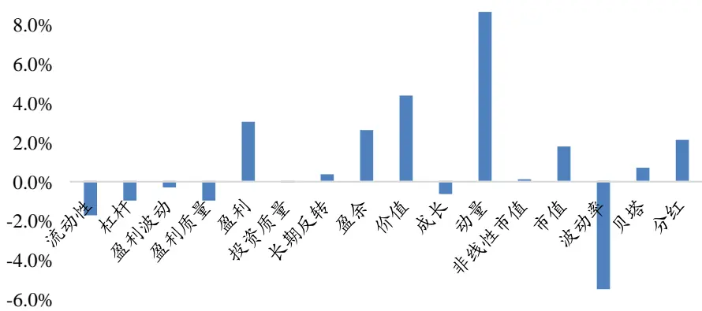
数据来源：国泰君安证券研究

图 2：1926~2020 通胀期美股细分行业年化收益
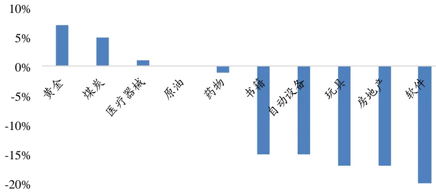
数据来源：国泰君安证券研究。注：仅统计涨幅前五和后五的细分行业。

## 2. 主要结论

超预期通胀相比于通胀水平对资产收益具有更加深远的影响。本文使用当期 CPI 同比增速的变化表示超预期通胀，将 CPI 同比增速从 2%上涨到峰值（超过 5% ）并下落到过去 24 个月最高值 50%的区间划分为通胀期，以此为基础分析各类金融资产、实物资产和一系列动态策略在通胀环境中的表现。

通货膨胀对金融资产的影响包括预期现金流和贴现率两部分，对贴现率的影响更为重要。股票和债券在通胀期的收益显著为负，债券收益与通胀水平均呈负相关，股票收益与通胀的相关关系则受到当前通胀水平的影响。

一部分实物资产包含在 CPI 统计口径中，它们价格的变化与通胀水平天然同步，但未必完全一致；其他资产则可能具有更复杂的相关关系。大宗商品在通胀期的实际收益均为正，且大宗商品整体收益与通胀水平均呈正相关；房地产在通胀期的表现不佳；艺术品在通胀期收益较高，但市场空间较小。

通胀冲击并非一蹴而就，通胀的趋势性变动给予趋势跟踪策略更多机会，债券、外汇、股票和大宗商品这四种主要的期货资产在通胀期的实际收益均为正；债券和大宗商品期货上趋势跟踪策略收益尤其高，受益于两者与通胀的显著相关关系。股市因子多空组合在通胀期的收益出现分化，动量、质量和投资因子表现优于其他因子。

通胀时期多国资产收益的统计结果表明，在本国通货膨胀时，本国股市往往表现最差，而其他国家股市收益可能反而良好，投资者可以通过多元化配置股票规避通胀风险。当多个国家同时处于通胀期时，债券收益相对更低、大宗商品收益相对更高。趋势跟踪策略在美国处于通胀时表现最好，可能受益于美国在资本市场的定价权，后者使美国资产价格变动具有先发优势。

## 3. 文章背景

2008 年危机以来，美国货币和财政政策都促成了反通胀的经济环境，导致通货膨胀整体处于低位且波动较小。如图 3 所示，2008 年危机之后CPI 三度探底，在 2020 年疫情之前持续低于 2%的货币政策目标水平。通胀以 CPI 当月同比增速衡量，浅红色区域为通胀期，深红色区域为经济衰退期。我们注意到 1960 年以来的数次高通胀都伴随着经济衰退。

但在美国疫情爆发之后，大幅宽松的货币和财政政策向市场释放了海量流动性，引发了投资者对当前高通胀的担忧。在 2020 年2 月~2021 年 2月期间，美国广义货币增长4.2万亿美元（从15.5万亿增加到19.7万亿，增幅达 27.1%）。同时，据美国国会预算办公室(CBO)估计，2020 年美国的财政赤字为 3.1 万亿美元，占 GDP 的 15%；在 2021 年赤字将缩减至2.3 万亿美元，占 GDP 的 10%。

本文着重于通胀环境中不同类别资产和策略的收益情况，帮助投资者有效调整投资组合，以便于在未来高通胀预期得到证实时更好地应对宏观经济风险。

图 3：1926-2020 年美国通胀情况
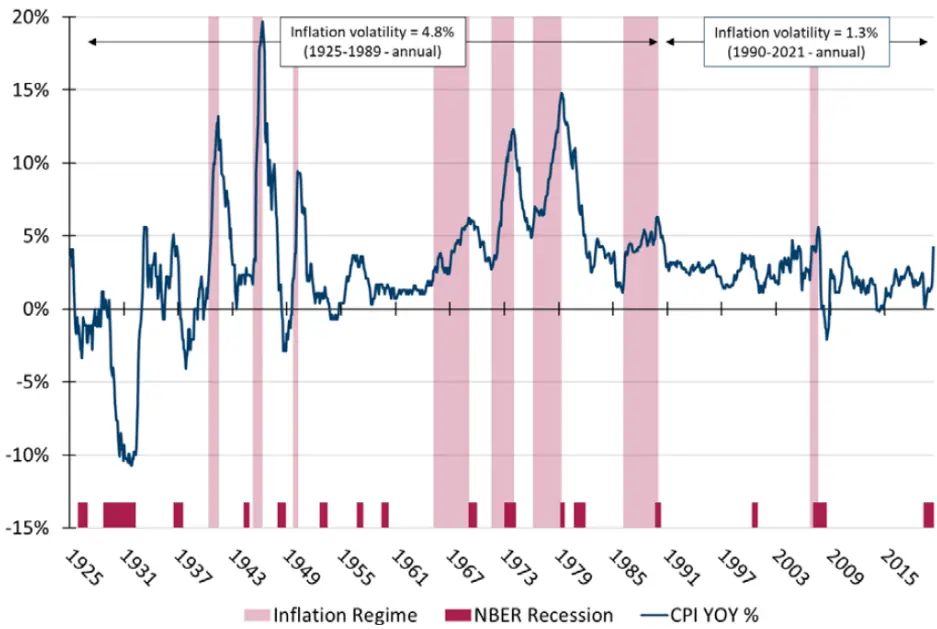
数据来源：《The Best Strategies for Inflationary Times》

## 4. 超预期通胀与通胀期划分

## 4.1. 超预期通胀的衡量

通胀水平可以分为预期到的通胀和超预期通胀两部分。预期通胀对资产价格的影响有限，投资者可以通过对冲减弱或消除预期通胀的影响。相比之下，投资者更加关注意料之外的通胀变化，如通胀低迷期的突然上升和通胀上行期的拐点，超预期通胀反映了未来经济发展的趋势，对资产价格具有深远的影响。

学术上对超预期通胀的定义是实际通胀水平减去预期通胀，即 t 时刻的实际值减去 t-1 时刻对 t 时刻的预测值。这一过程的难点在于对未来通胀的预测，作者指出可以使用通胀保值债券（TIPS）的价格和名义国债中的盈亏平衡通胀率（BEI）衡量，但是这两个指标的问题在于样本期太短，因此本文使用通货膨胀的变化表征超预期通胀。1

高通胀时期包括了上行至峰值和从峰值下降两个阶段，本文侧重于研究上行部分，即超预期通胀为正的阶段。在下行阶段尽管通胀水平依然很高，但边际上超预期通胀为负，可能导致资产价格的反向变动。

## 4.2. 通胀指标选取和通胀时期的划分

本文使用 CPI 当月同比增速衡量通货膨胀情况。作者表明在选取通胀指标时存在两个问题悬而未决：一是在过去几十年里技术进步导致商品质量提高，价格指标无法反映技术进步带来的实质上的通缩效应；二是各个指标都只衡量了一部分商品的价格变动，缺乏统一的衡量标准。因此，综合样本期和数据频率的考虑，本文选取 标题通胀（即一般意义上的 CPI）当月同比增速作为通胀指标。

本文将高通胀定义为 CPI 同比增速达到或超过 5%，并围绕这一时期划分通胀期：从 CPI 同比增速超过 2%开始，经过 CPI 峰值（>5%），并在CPI 同比增速下行并低于过去 24 个月内峰值的 50%时结束。在过去百年间，本文共筛选出了 8 个通胀期，表 1 展示了特定通胀期整体和 CPI 各分项的物价变化情况。

表 1: 美国通胀期 CPI 组成成分价格变化情况
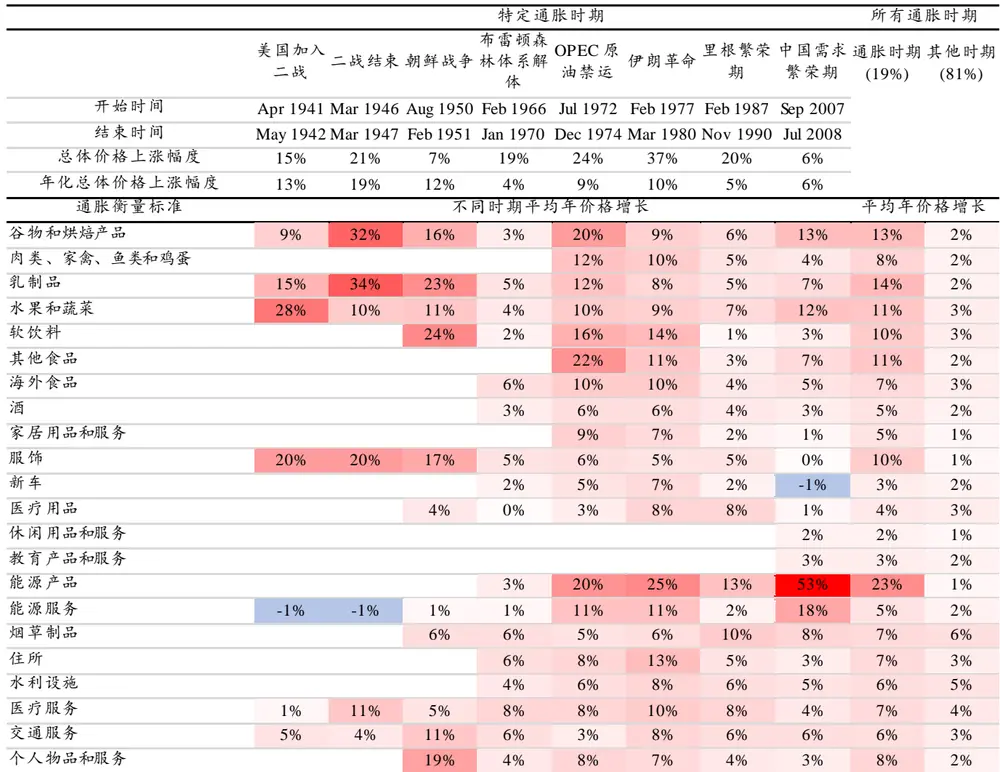
数据来源：《The Best Strategies for Inflationary Times》，国泰君安证券研究。注：空白表明无统计数据，下同

## 5. 通货膨胀对资产价格的影响

衡量通胀对资产价格的影响本质上是在计算通胀风险的β系数，本文通过分析通胀期资产价格变动幅度求解这一问题。作者指出衡量两者的关系存在两个挑战：一是从通胀数据中分离长期趋势和短期波动，二是确定通胀与资产价格变动最相关的通胀区间。

本文涵盖的资产包括金融资产和实物资产两类，金融资产包括股票和债券，实物资产包括大宗商品、房地产和艺术品，在此基础上本文也分析了若干动态策略在通胀期的表现。下面的分析将指出，以股票和债券为代表的金融资产价格与通胀负相关；实物资产中大宗商品价格和艺术品与通胀正相关，但房地产在通胀期表现不佳；股市因子策略在通胀期明显分化，动量、质量和投资因子表现优于其他因子；趋势跟踪策略整体上表现良好，债券和大宗商品期货上趋势跟踪策略收益尤其高。

表 2: 美国通胀期各类策略收益的汇总统计

| 特定通胀时期 |  |  |  |  |  | 所有通胀时期 |  |  |  |  |  |
| --- | --- | --- | --- | --- | --- | --- | --- | --- | --- | --- | --- |
|  | 美国加入 二战 | 二战结束朝鲜战争林体系解 |  |  | 布雷顿森 OPEC 原 油禁运 | 伊朗革命 | 期 | 里根繁荣中国需求通胀时期其他时期全部时期 繁荣期 | (19%) |  | (81%) (100%) |
| 开始时间 |  |  |  |  |  |  |  |  |  |  |  |
|  | Apr 1941 |  | Mar 1946 Aug 1950 Feb 1966 | 体 |  | Jul 1972 Feb 1977 | Feb 1987 | Sep 2007 |  |  |  |
| 结束时间 |  | May 1942 Mar 1947 | Feb 1951 | Jan 1970 |  | Dec 1974 Mar 1980 Nov 1990 |  | Jul 2008 |  |  |  |
| 价格水平整体变化 | 15% | 21% | 7% | 19% | 24% 37% | 20% |  | 6% |  |  |  |
| 持续时间（月） | 14 | 13 | 7 | 48 | 30 | 33 46 |  | 11 |  |  |  |
| 策略 |  |  |  | 真实收益(总收益) |  |  |  |  | 真实收益（年化） |  |  |
| (被动)大宗商品-能源 | -3% | 2% | -6% | -16% | 264% | 57% | 201% | 68% 41% | -1% | 3% |  |
| (主动)趋势跟踪-全部类别 | 20% | 23% | 19% | 135% | 196% | 100% 65% | 17% | 25% | 15% | 16% |  |
| (主动)趋势跟踪-大宗商品 |  |  | 1% | 54% | 173% 33% | 132% | 25% | 20% | 8% | 10% |  |
| (被动)大宗商品-工业品 |  |  |  | 115% | 38% | -6% | 306% 3% | 19% | 4% | 7% |  |
| (主动)趋势跟踪-债券 |  |  |  | 79% | 54% | 149% | 6% 6% | 15% | 9% | 10% |  |
| (被动)大宗商品-合计 |  | 12% | 6% | 26% | 85% | 38% | 84% 21% | 14% | 1% | 4% |  |
| (被动)大宗商品-黄金 |  |  |  |  | 166% | 154% | -18% 27% | 13% | -1% | 1% |  |
| (被动)大宗商品-贵重品 |  |  |  | 28% | 29% | 185% | -27% 33% | 11% | -2% | 1% |  |
| (主动)趋势跟踪-股票 | 20% | 23% | 24% | 77% | 23% | -13% | 13% -3% | 8% | 11% | 10% |  |
| (被动)大宗商品-软商品 |  |  |  | -41% | 243% | 15% | 11% 15% | 8% | -3% | -1% |  |
| (主动)股市因子-截面动量 | -15% | -18% | 7% | 35% | 38% | 44% | 41% 26% | 8% | 4% | 5% |  |
| (被动)大宗商品-农产品 |  | 12% | 6% | -23% | 197% | -21% | 6% | 33% 7% | -3% | 0% |  |
| (主动)趋势跟踪-外汇 |  |  |  |  | -14% | 16% | 42% | 6% 4% | 4% | 4% |  |
| (主动)股市因子-质量因子(QMJ) |  |  |  | 14% | -1% | -12% | 40% | 7% 3% | 3% | 3% |  |
| (被动)固定收益-TIPS |  |  |  | -3% | 13% | -2% | 11% 6% | 2% | 3% | 3% |  |
| (主动)股市因子-投资因子(CMA) |  |  |  | -7% | 31% | -9% | 24% | -10% 2% | 2% | 2% |  |
| (被动)长期股权投资-能源行业 | -14% | -10% | 25% | -19% | -19% | 31% | 31% | 2% 1% | 8% | 6% |  |
| (主动)股市因子-盈利因子(RMW) |  |  |  | 4% | -24% | -8% | 18% | 6% -1% | 2% | 2% |  |
| (主动)股市因子-价值因子(HML) | -4% | -17% | 3% | -8% | 36% | -11% | -3% | -7% -1% | 2% | 2% |  |
| (被动)房地产-住宅房地产 | -17% | 4% | -4% | -2% | -7% | 11% | 0% | -13% -2% | 2% | 1% |  |
| (主动)股市因子-低波动性因子(BAB) | -24% | -6% | -3% | 28% | -13% | 9% | -7% | -22% -3% | 8% | 6% |  |
| (被动)固定收益-2 年期国债 | -13% | -17% | -6% | -1% | -7% | -17% | 11% | 0% -3% | 2% | 1% |  |
| (主动)股市因子-规模因子(SMB) | -11% | -23% | -4% | 45% | -43% | 32% | -26% | -4% -4% | 1% | 0% |  |
| (被动)固定收益-10年期国债 | -11% | -17% | -6% | -13% | -12% | -31% | 8% | 5% -5% | 4% | 2% |  |
| (被动)固定收益-高收益债 | -4% | -11% | 0% | -18% | -21% | -38% | -10% | -8% -7% | 6% | 4% |  |
| (被动)长期股权投资-市场综合 | -24% | -27% | 24% | -7% | -46% | -14% | 12% | -17% -7% | 10% | 7% |  |
| (被动)固定收益-投资级债券 | -7% | -12% | -3% | -23% | -20% | -43% | -5% | 1% -7% | 6% | 3% |  |
| (被动)固定收益-30年期国债 | -17% | -17% | -6% | -20% | -28% | -41% | 13% | 2% -8% | 5% | 3% |  |
| (被动)长期股权投资-消费耐用品 | -16% | -32% | 24% | -30% | -62% | -27% | -28% | -36% -15% | 13% | 7% |  |

数据来源：《The Best Strategies for Inflationary Times》，国泰君安证券研究

## 5.1. 金融资产价格与通胀负相关

金融资产的价格反映了证券现金流和贴现率的长期变化。2 通胀对债券价格的影响主要体现在贴现率上，预期贴现率包含预期实际利率、预期通货膨胀和风险溢价。根据前面的假设，当期通胀上行导致预期通胀上行，于是贴现率上升而债券价格下跌。此外，通胀的不确定性也会影响风险评价，进而对风险溢价造成影响。

通胀对股票价格的影响包括预期现金流和贴现率两方面。作者指出存在四种可能性：其一，高通胀带来的经济不确定性影响公司新订单和成本，导致利润率下降；其二，通胀高涨，尤其是超预期通胀很高，很可能意味着未来经济萧条，影响企业预期现金流；其三，高通胀环境中对折旧的调整导致资本支出高的公司利润下滑；其四，超预期通胀导致风险溢价上升，影响股票价格。

表 3 展示了美国不同通胀时期股票、国债以及两者占比 60%/40%的策略的收益情况，表明股票和债券在通胀期的收益明显低于非通胀期，且通胀期的实际收益均为负，与上面分析的结论一致。附录表 展示了美国股市细分行业在不同通胀期的收益表现。

表 3: 美国不同通胀时期股票和国债收益率情况

|  | 特定通胀时期 |  |  |  |  |  |  |  | 所有通胀时期 |  |  |  |  |
| --- | --- | --- | --- | --- | --- | --- | --- | --- | --- | --- | --- | --- | --- |
|  | 美国加 入二战 | 二战结 束 | 朝鲜战 争 | 布雷顿 森林体 系解体 | OPEC 原 油禁运 | 伊朗革 命 | 里根繁 荣期 | 中国需 求繁荣 | Inflation (19%) | Other (81%) | ALL Hit rate (100%) |  | t stat |
| 开始时间 |  | Apr 1941 | Mar 1946 Aug 1950 Feb 1966 |  |  |  |  | 期 |  |  |  |  |  |
|  |  |  |  |  | Jul 1972 | Feb 1977 | Feb 1987 Sep 2007 |  |  |  |  |  |  |
| 结束时间 | May 1942 Mar 1947 |  | Feb 1951 | Jan 1970 | Dec 1974 Mar 1980 Nov 1990 |  | Jul 2008 |  |  |  |  |  |  |
| 整体价格变化幅度 | 15% 14 | 21% | 7% | 19% 48 | 24% 30 | 37% 33 | 20% | 6% |  |  |  |  |  |
| 持续时间（月） | 13 |  | 7 |  |  |  | 46 | 11 |  |  |  |  |  |
| 策略 股票 | -13% | -12% | 32% | 名义收益率(总收益) 10% | -32% |  |  |  |  | 名义收益率（年化） |  |  |  |
| 国债 |  |  |  |  |  | 18% | 35% | -12% | 0% 3% | 12% | 10% | 50% 88% | -3.2* -1.8 |
| 60/40 | 3% -7% | 0% -7% | 0% 18% | 4% 8% | 9% -17% | -5% 9% | 30% 35% | 11% -3% | 2% | 6% 10% | 5% 9% | 50% | -3.6* |
|  | (总收益) |  |  |  |  |  |  |  |  | 实际收益（年化） |  |  |  |
| 策略 | -24% | -27% |  | 实际收益 -7% | -46% | -14% |  | -17% | -7% | 10% | 7% | 25% | -4.8* |
| 股票 国债 |  |  | 24% |  | -12% |  | 12% |  |  |  |  |  | -5.1* |
| 60/40 | -11% -19% | -17% -23% | -6% 11% | -13% -9% | -34% | -31% -20% | 8% 12% | 5% -8% | -5% -6% | 4% 8% | 2% 6% | 25% 25% | -6.0* |

数据来源：《The Best Strategies for Inflationary Times》，国泰君安证券研究。注：倒数第二列命中率（Hit rate）为产生正收益的时期占全部时期的比例，最后一列的 t 检验用于检验通胀期和非通胀期的收益是否存在显著差异

## 5.1.1. 股票收益与通胀的分层和分行业相关性分析

图 4 展示了股票年化收益（12 个月）和同期通胀变化的散点图。1926年以来 当月同比增速的中位数是 ，图 黄色和蓝色散点分别代表区间起点 CPI 超过和低于 2.6%的数据。简单线性拟合的结果（黄线和蓝线）表明，当起点 CPI 较高、未来存在较大紧缩风险时，通胀与股票收益正相关；反之，当起点 CPI 较低、未来存在较大通胀风险时，通胀与股票收益负相关。图5展示了股票收益和通胀变化分层数据的相关性，印证了图 3 的结论。

表 展示了美国股市不同行业在通胀期的收益情况，能源行业是唯一一个实际收益为正的行业，然而下一节的分析将指出能源行业的股票涨幅远远落后于能源商品，作者指出这可能与公司运营和对冲行为有关。同时，消费耐用品、零售、金融业等在通胀期跌幅最大，作者指出金融业表现下行可能受到违约风险增加和货币政策效力滞后的影响。

图 4：股票收益和通胀变化（年化实际值）
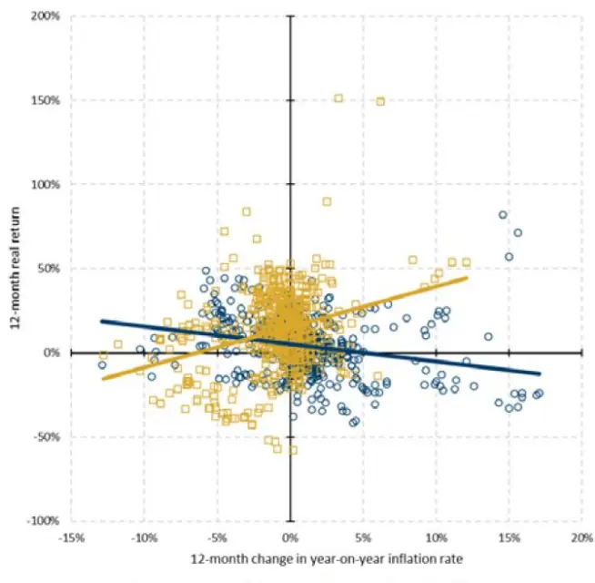
数据来源：《The Best Strategies for Inflationary Times》

图 5：股票收益和通胀变化相关性（年化实际值）
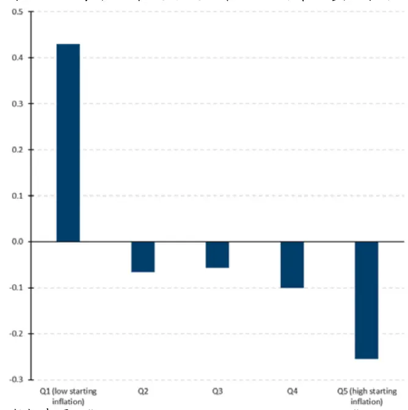
数据来源：《The Best Strategies for Inflationary Times》

表 4: 美国通胀期不同行业股票收益情况

|  | 特定通胀时期 |  |  |  |  |  |  |  | 所有通胀时期 |  |  |  |  |
| --- | --- | --- | --- | --- | --- | --- | --- | --- | --- | --- | --- | --- | --- |
|  | 美国加 入二战 | 二战结 束 | 朝鲜战 争 | 布雷顿 森林体 | OPEC 原 油禁运 | 伊朗革 命 | 里根繁 荣期 | 中国需 求繁荣 期 | Inflation (19%) | Other (81%) | All (100%) | Hit rate | t stat |
|  |  | Apr 1941 Mar 1946 Aug 1950 Feb 1966 |  | 系解体 | Jul 1972 | Feb 1977 | Feb 1987 Sep 2007 |  |  |  |  |  |  |
| 开始时间 结束时间 |  |  |  |  |  |  |  |  |  |  |  |  |  |
| 整体价格变化幅度 | May 1942 Mar 1947 Feb 1951 | 21% |  | Jan 1970 | Dec 1974 Mar 1980 Nov 1990 |  |  | Jul 2008 |  |  |  |  |  |
| 策略 | 15% |  | 7% | 19% 实际收益率(总收益) | 24% | 37% | 20% | 6% |  | 实际收益率（年化） |  |  |  |
| 非耐用消费品 |  | -24% | 11% |  | -56% | -15% | 42% | -7% | -6% | 11% | 8% | 38% | -3.7* |
| 耐用消费品 | -24% -16% | -32% | 24% | 5% -30% | -62% | -27% | -28% | -36% | -15% | 13% | 7% | 13% | -5.0* |
| 制造业 | -23% | -23% | 27% | -9% | -52% | -12% | -2% | -15% | -8% | 11% | 7% | 13% | -3.7* |
| 能源 | -14% | -10% | 25% | -19% | -19% | 31% | 31% | 2% | 1% | 8% | 6% | 50% | -1.4 |
| 化学 | -25% | -17% | 27% | -23% | -37% | -24% | 9% | 2% | -6% | 11% | 8% | 38% | -3.5* |
| 商业设施 | -26% | -34% | 19% | 37% | -58% | -11% | -29% | -15% | -9% | 12% | 8% | 25% | -3.9* |
| 通信 | -32% | -25% | 3% | -19% | -15% | -24% | 41% | -27% | -7% | 9% | 6% | 25% | -4.1* |
| 公共设施 | -43% | -20% | 12% | -24% | -38% | -22% | 8% | -3% | -9% | 10% | 6% | 25% | -4.5* |
| 零售 | -25% | -24% | 19% | 14% | -64% | -27% | 6% | -15% | -9% | 12% | 8% | 38% | -3.9* |
| 健康 | -18% | -8% | -42% | 25% | -42% | -2% | 43% | -6% | -1% | 11% | 9% | 38% | -2.2* |
| 金融 | -20% | -29% | 18% | 23% | -53% | -5% | -24% | -35% | -9% | 11% | 7% | 25% | -3.7* |
| 其他 | -20% | -36% | 25% | -12% | -62% | 7% | -4% | -21% | -10% | 8% | 5% | 25% | -3.1* |

数据来源：《The Best Strategies for Inflationary Times》，国泰君安证券研究

## 5.1.2. 债券收益与通胀的分层和分类相关性分析

按照图 3 和图 4 的方法，图 6 和图 7 分析了 10 年期国债收益和通胀情况，结果表明债券收益与通胀明显负相关，这一关系与区间起点的通胀水平无关。

表 展示了不同类型债券在通胀期的收益情况，除了通胀保值债券（ ）以外，债券的实际收益与通胀负相关。投资级债券的久期通常在 6-8 年之间，投机级（高收益）债券的久期通常在 4-6 年之间，十年期国债的久期一般在 7-9 年之间，理论上久期越长对通胀变化引起的收益率波动就越敏感，但表 5 的结果完全相反，这可能是由于投资者担心通胀和违约风险加剧从而抛售公司债券并持有国债。

图 6：债券收益和通胀变化（年化实际值）
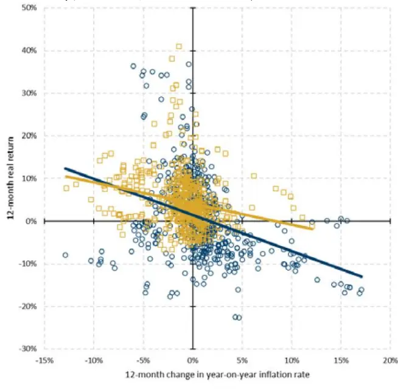
数据来源：《The Best Strategies for Inflationary Times》

图 7：债券收益和通胀变化相关性（年化实际值）
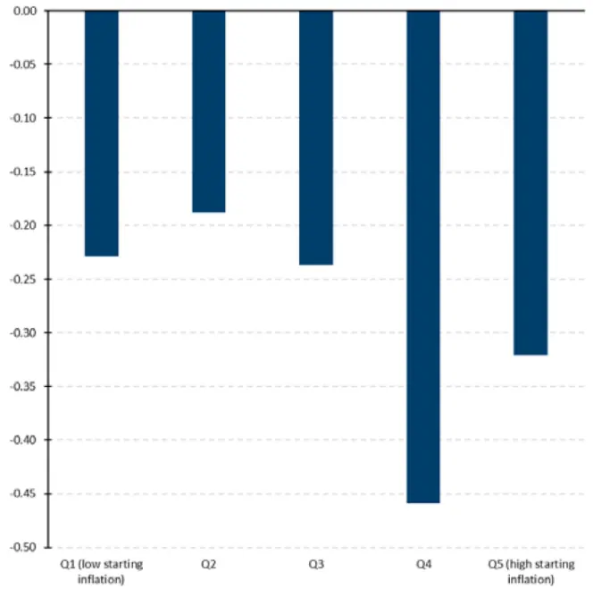
数据来源：《The Best Strategies for Inflationary Times》

表 5: 美国通胀期不同债券收益情况3

|  | 特定通胀时期 |  |  |  |  |  |  |  | 所有通胀时期 |  |  |  |  |
| --- | --- | --- | --- | --- | --- | --- | --- | --- | --- | --- | --- | --- | --- |
|  | 美国加 入二战 | 二战结 束 | 朝鲜战 争 | 布雷顿 森林体 系解体 | OPEC 原 油禁运 | 伊朗革 命 | 里根繁 荣期 | 中国需 求繁荣 期 | Inflation (19%) | Other (81%) | All Hit rate (100%) |  | t stat |
| 开始时间 |  |  | Apr 1941 Mar 1946 Aug 1950 Feb 1966 |  | Jul 1972 | Feb 1977 | Feb 1987 | Sep 2007 |  |  |  |  |  |
| 结束时间 |  | May 1942 Mar 1947 Feb 1951 Jan 1970 |  |  | Dec 1974 Mar 1980 Nov 1990 |  |  | Jul 2008 |  |  |  |  |  |
| 整体价格变化幅度 | 15% | 21% | 7% | 19% | 24% | 37% | 20% | 6% |  |  |  |  |  |
| 策略 |  |  |  | 实际收益率(总收益) |  |  |  |  |  | 实际收益率（年化） |  |  |  |
| 美国30年期国债 | -17% | -17% | -6% | -20% | -28% | -41% | 13% | 2% | -8% | 5% | 3% | 25% | -5.0* |
| 美国 10 年期国债 | -11% | -17% | -6% | -13% | -12% | -31% | 8% | 5% | -5% | 4% | 2% | 25% | -5.1* |
| 美国2 年期国债 | -13% | -17% | -6% | -1% | -7% | -17% | 11% | 0% | -3% | 2% | 1% | 13% | -5.8* |
| 美国投资级信用债券 | -7% | -12% | -3% | -23% | -20% | -43% | -5% | 1% | -7% | 6% | 3% | 13% | -8.1* |
| 美国高收益信用债券 | -4% | -11% | 0% | -18% | -21% | -38% | -10% | -8% | -7% | 6% | 4% | 13% | -7.8* |
| 美国通胀保值债券(TIPS) |  |  |  | -3% | 13% | -2% | 11% | 6% | 2% | 3% | 3% | 60% | -0.6 |

数据来源：《The Best Strategies for Inflationary Times》，国泰君安证券研究

## 5.2. 实物资产收益与通胀的关系

本节分析的实物资产包括大宗商品、房地产和艺术品三大类。下面的分析将表明，大宗商品在通胀期收益为正，房地产在通胀期收益为负，艺术品在通胀期收益为正。

## 5.2.1. 大宗商品在通胀期收益为正

商品价格变化往往是通货膨胀的根源，一些大宗商品价格纳入CPI指数，直接影响通胀水平。但大宗商品涵盖的范围很大，有很多商品未纳入价格指数，也在通胀期获得正收益。

本小节考虑了全部类别的大宗商品，表 6 表明，大宗商品在通胀期表现明显更好，能源、工业金属和贵重品在通胀期涨幅最大，农业、畜牧业和软商品涨幅相对较低。值得注意的是，科技发展与大宗商品的表现密切相关，例如，电动汽车技术的发展可能影响传统能源的收益，半导体和芯片的短缺也可能制约了科技行业的发展。

图 8 和图9 表明大宗商品收益与通胀水平正相关，且这一结论与区间起点通胀水平无关。

表 6: 美国大宗商品在通胀期的表现

|  | 特定通胀时期 |  |  |  |  |  |  |  |  | 所有通胀时期 |  |  |  |
| --- | --- | --- | --- | --- | --- | --- | --- | --- | --- | --- | --- | --- | --- |
|  | 美国加 入二战 | 二战结 束 | 朝鲜战 争 | 布雷顿 森林体 系解体 | OPEC 原 油禁运 | 伊朗革 命 | 里根繁 荣期 | 中国需 求繁荣 | Inflation (19%) | Other (81%) | All (100%) | Hit rate | t stat |
| 开始时间 | Apr 1941 | Mar 1946 Aug 1950 Feb 1966 |  |  | Jul 1972 | Feb 1977 | Feb 1987 | 期 Sep 2007 |  |  |  |  |  |
| 结束时间 |  | May 1942Mar 1947 | Feb 1951 | Jan 1970 | Dec 1974Mar 1980Nov 1990 |  |  | Jul 2008 |  |  |  |  |  |
| 整体价格变化幅度 | 15% | 21% | 7% | 19% | 24% | 37% | 20% | 6% |  |  |  |  |  |
| 策略 |  |  |  | 实际收益率(总收益) |  |  |  |  |  | 实际收益率（年化） |  |  |  |
| 工业金属 |  |  |  | 115% | 389% | -6% | 306% | 3% | 19% | 4% | 7% | 80% | 1.7 |
| 贵重品 |  |  |  | 28% | 29% | 185% | -27% | 33% | 11% | -2% | 1% | 80% | 1.7 |
| 农业 |  | 12% | 6% | -23% | 197% | -21% | 6% | 33% | 7% | -3% | 0% | 71% | 1.8 |
| 软商品 |  |  |  | -41% | 243% | 15% | 11% | 15% | 8% | -3% | -1% | 80% | 1.6 |
| 畜牧业 |  |  |  | 69% | -21% | 35% | 97% | -23% | 7% | 1% | 2% | 60% | 1.1 |
| 能源 | -3% | 2% | -6% | -16% | 264% | 57% | 201% | 68% | 41% | -1% | 3% | 100% | 1.7 |
| 金 |  |  |  |  | 166% | 154% | -18% | 27% | 13% | -1% | 1% | 67% | 1.6 |
| 银 |  |  |  | 9% | 99% | 210% | -41% | 36% | 12% | -5% | 0% | 80% | 1.8 |
| 商品总计 |  | 12% | 6% | 26% | 85% | 38% | 84% | 21% | 14% | 1% | 4% | 100% | 3.1* |

数据来源：《The Best Strategies for Inflationary Times》，国泰君安证券研究

图 8：大宗商品收益和通胀变化（年化实际值）
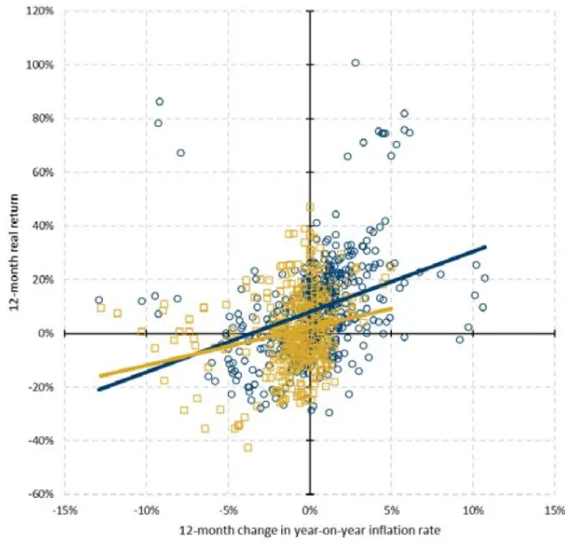
数据来源：《The Best Strategies for Inflationary Times》

图 9：大宗商品收益和通胀变化相关性（年化实际值）
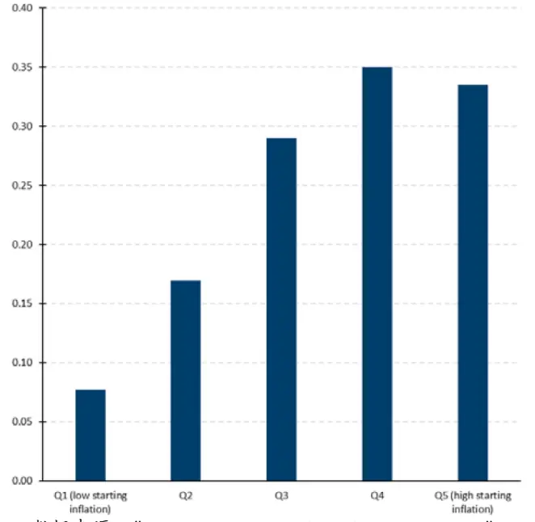
数据来源：《The Best Strategies for Inflationary Times》

## 5.2.2. 房地产在通胀期收益为负

本小节分析了住宅房地产在通胀期的表现。表 7 表明，住宅房地产在通胀期实际收益为负，无法实现通胀保值功能；但在通胀期的表现（-2%）与非通胀期（2%）差异不大，可以认为房地产比金融资产稳健性更高。

附录表 12 和表 13 表明，英国房地产与美国情况基本一致；日本房地产由于使用了住宅用地价值而非住房价值，在通胀期表现出更高的收益。

表 7: 美国住宅房地产在通胀期的表现

|  | 特定通胀时期 |  |  |  |  |  |  |  | 所有通胀时期 |  |  |  |  |
| --- | --- | --- | --- | --- | --- | --- | --- | --- | --- | --- | --- | --- | --- |
|  | 美国加 入二战 | 二战结 束 | 朝鮮战 争 | 布雷顿 森林体 | OPEC 原 油禁运 | 伊朗革 命 | 里根繁 荣期 | 中国需 求繁荣 期 | Inflation (19%) | Other (81%) | All Hit rate (100%) |  | t stat |
| 开始时间 |  | Apr 1941 |  | Mar 1946 Aug 1950 Feb 1966 | 系解体 | Jul 1972 Feb 1977 | Feb 1987 | Sep 2007 |  |  |  |  |  |
| 结束时间 |  | May 1942Mar 1947 | Feb 1951 | Jan 1970 | Dec 1974Mar 1980Nov 1990 |  |  | Jul 2008 |  |  |  |  |  |
| 整体价格变化幅度 | 15% | 21% | 7% | 19% | 24% | 37% | 20% | 6% |  |  |  |  |  |
| 策略 |  |  |  |  |  |  |  |  |  | 实际收益率（年化） |  |  |  |
|  |  |  |  | 实际收益率(总收益) |  |  |  |  |  |  |  |  |  |
| 住宅房地产 | -17% | 4% | -4% | -2% | -7% | 11% | 0% | -13% | -2% | 2% | 1% | 25% | -5.1* |

数据来源：《The Best Strategies for Inflationary Times》，国泰君安证券研究

## 5.2.3. 收藏品在通胀期收益为正

本小节考虑了以艺术品、红酒和邮票为代表的收藏品在通胀期的收益。如表 8 所示，这三种资产在通胀期的实际收益均为正，具有很好的通胀保值功能；红酒在通胀期收益略低于非通胀期，但在各时期基本维持稳定。

尽管收藏品在通胀期收益情况良好，但由于交易量较小，不太可能作为机构投资组合的一部分。财富商业洞察（Fortune Business Insights, FBI）的数据表明 2019 年全球葡萄酒市场营业额为 3640 亿美元，而葡萄酒收藏仅占很小一部分；相比之下，世界银行估计 2019 年全球股市交易额为 60 万亿美元。

表 8: 美国收藏品在通胀期的表现

| 特定通胀时期 |  |  |  |  |  |  |  |  |  | 所有通胀时期 |  |  |  |
| --- | --- | --- | --- | --- | --- | --- | --- | --- | --- | --- | --- | --- | --- |
|  | 美国加入 二战 |  |  | 布雷顿森 二战结束朝鲜战争林体系解 体 | OPEC 原 油禁运 | 伊朗革命 | 期 | 里根繁荣中国需求 繁荣期 | Inflation | (19%) | Other All (81%) (100%) |  | Hit rate |
| 开始时间 | Apr 1941 | Mar 1946 | Aug 1950 | Feb 1966 | Jul 1972 | Feb 1977 | Feb 1987 |  | Sep 2007 |  |  |  |  |
| 结束时间 |  | May 1942 Mar 1947 | Feb 1951 | Jan 1970 | Dec 1974 | Mar 1980 |  | Nov 1990 | Jul 2008 |  |  |  |  |
| 整体价格变化幅度 | 15% | 21% | 7% | 19% | 24% |  | 37% | 20% | 6% |  |  |  |  |
| 策略 |  |  |  |  | 实际收益率(总收益) |  |  |  |  |  | 实际收益率（年化） |  |  |
| 艺术品 | 3% | -14% | -25% | 96% | 18% |  | 54% | 61% | -13% | 7% | 2% | 3% | 63% |
| 红酒 | 156% | -39% | -6% | 15% | -26% |  | 120% | 0% | -13% | 5% | 6% | 6% | 50% |
| 邮票 | 4% | -5% | -18% | 35% | 4% | 204% |  | 6% | 16% | 9% | 3% | 4% | 75% |

数据来源：《 》，国泰君安证券研究

## 5.3. 动态投资策略在通胀期的表现

前两节可以看作对金融和实物资产的被动投资策略，本节涵盖的动态投资策略包括股市因子多空组合和期货与远期的趋势跟踪策略。动态策略的交易成本可能很高，本文综合考虑了手续费、滑点和卖空成本的影响，使用 Harvey 等(2019)提出范围的最大值：股市策略年化 2%，期货策略年化 0.8%。下面的分析将表明，股市因子策略在通胀期明显分化，动量、质量和投资因子表现优于其他因子；趋势跟踪策略整体上表现良好，债券和大宗商品期货上趋势跟踪策略收益尤其高。

## 5.3.1. 股市因子策略收益分化

表9展示了一系列经典因子的多空组合策略在通胀期的收益，投资因子、动量因子和质量因子在通胀期收益为正，规模因子、价值因子、盈利因子和贝塔因子收益均为负。

小规模公司表现相对更差，这可能与通胀环境下的规模经济有关：当现金价值不稳定时，公司需要付出额外成本，大公司更有可能拥有必要的基础设施以应对这一变化。价值因子表现更差是出乎意料的，一般认为久期较长的成长股受到通胀的影响更大，这一结果也表明分母端的影响可能更加重要。投资因子和质量因子在通胀期的表现与非通胀期一致，表明这两个因子稳定性更强。

表 9: 美国股市因子多空组合策略在通胀期的表现

|  | 特定通胀时期 |  |  |  |  |  |  |  | 所有通胀时期 |  |  |  |  |
| --- | --- | --- | --- | --- | --- | --- | --- | --- | --- | --- | --- | --- | --- |
|  | 美国加 入二战 | 二战结 束 | 朝鲜战 | 布雷顿 森林体 | OPEC 原 油禁运 | 伊朗革 命 | 里根繁 荣期 | 中国需 求繁荣 期 | Inflation (19%) | Other (81%) | All (100%) | Hit rate | t stat |
|  |  |  | 争 Mar 1946 Aug 1950 Feb 1966 | 系解体 |  |  |  |  |  |  |  |  |  |
| 开始时间 | Apr 1941 |  |  |  | Jul 1972 | Feb 1977 | Feb 1987 | Sep 2007 |  |  |  |  |  |
| 结束时间 | May 1942 Mar 1947 |  | Feb 1951 | Jan 1970 | Dec 1974 | Mar 1980 | Nov 1990 | Jul 2008 |  |  |  |  |  |
| 整体价格变化幅度 | 15% | 21% | 7% | 19% | 24% | 37% | 20% | 6% |  | 实际收益率（年化） |  |  |  |
| 策略 |  |  |  |  | 实际收益率(总收益) |  |  |  |  |  |  |  |  |
| 规模因子 (SMB) | -11% | -23% | -4% | 45% | -43% | 32% | -26% | -4% | -4% | 1% | 0% | 25% | -1.8 |
| 价值因子 (HML) | -4% | -17% | 3% | -8% | 36% | -11% | -3% | -7% | -1% | 2% | 2% | 25% | -1.5 |
| 盈利因子 (RMW) |  |  |  | 4% | -24% | -8% | 18% | 6% | -1% | 2% | 2% | 60% | -1.5 |
| 投资因子 (CMA) |  |  |  | -7% | 31% | -9% | 24% | -10% | 2% | 2% | 2% | 40% | -0.1 |
| 动量因子 (MOM) | -15% | -18% | 7% | 35% | 38% | 44% | 41% | 26% | 8% | 4% | 5% | 75% | 0.6 |
| 质量因子 (QMJ) |  |  |  | 14% | -1% | -12% | 40% | 7% | 3% -3% | 3% | 3% | 60% | -0.1 |
| 贝塔因子 (BAB) | -24% | -6% | -3% | 28% | -13% | 9% | -7% | -22% |  | 8% | 6% | 25% | -4.2* |

数据来源：《The Best Strategies for Inflationary Times》，国泰君安证券研究

## 5.3.2. 期货趋势跟踪策略表现较好

本小节根据 Hamill 等（2016）和 Harvey 等（2021）的方法构建了适用于流动性期货和远期的趋势跟踪策略。表 10 表明，债券、外汇、股票和大宗商品这四种主要的期货资产在通胀期的实际收益均为正。

债券和大宗商品趋势跟踪策略在所有通胀期都具有显著正收益，并且显著高于非通胀期，这与前面的分析结论是一致的：债券收益与通胀负相关，大宗商品收益与通胀正相关，这一相关关系与通胀水平无关，因此趋势跟踪总能获得正收益。相比之下，由于股票收益与通胀的关系取决于市场通胀水平，这里对股票期货的趋势跟踪效果不佳。

表 10: 美国期货趋势跟踪策略在通胀期的表现

|  | 特定通胀时期 |  |  |  |  |  |  |  | 所有通胀时期 |  |  |  |  |
| --- | --- | --- | --- | --- | --- | --- | --- | --- | --- | --- | --- | --- | --- |
|  | 美国加 入二战 | 二战结 東 | 朝鲜战 | 布雷顿 森林体 | OPEC 原 油禁运 | 伊朗革 命 | 里根繁 荣期 | 中国需 求繁荣 | Inflation (19%) | Other (81%) | All (100%) | Hit rate | t stat |
|  |  |  | 争 | 系解体 |  |  | 期 |  |  |  |  |  |  |
| 开始时间 | Apr 1941 |  | Mar 1946Aug 1950 Feb 1966 |  | Jul 1972 | Feb 1977 | Feb 1987 | Sep 2007 |  |  |  |  |  |
| 结束时间 | May 1942 Mar 1947 |  | Feb 1951 | Jan 1970 | Dec 1974 Mar 1980 Nov 1990 |  |  | Jul 2008 |  |  |  |  |  |
| 整体价格变化幅度 | 15% | 21% | 7% | 19% | 24% | 37% | 20% | 6% |  |  |  |  |  |
| 策略（趋势跟踪） |  |  |  | 实际收益率(总收益) |  |  |  |  |  | 实际收益率（年化） |  |  |  |
| 债券 |  |  |  | 79% | 54% | 149% | 6% | 6% | 15% | 9% | 10% | 100% | 1.9 |
| 外汇 |  |  |  |  | -14% | 16% | 42% | 6% | 4% | 4% | 4% | 75% | 0.5 |
| 股票 | 20% | 23% | 24% | 77% | 23% | -13% | 13% | -3% | 8% | 11% | 10% | 75% | -0.9 |
| 大宗商品 |  |  | 1% | 54% | 173% | 33% | 132% | 25% | 20% | 8% | 10% | 100% | 2.8* |
| 全部资产 | 20% | 23% | 19% | 135% | 196% | 100% | 65% | 17% | 25% | 15% | 16% | 100% | 2.8* |

数据来源：《The Best Strategies for Inflationary Times》，国泰君安证券研究

## 6. 国际资产配置与展望

## 6.1. 通胀期的国际资产配置

本节运用同样的方法对英国和日本的情况进行分析，图 10 和图 11 展示了英国和日本的 CPI 当月同比增速的变动以及通胀期的划分（浅红色区域）。附录表 和表 展示了英国和日本不同资产在本国通胀期的收益情况。表 展示了不同类别资产和趋势跟踪策略在通胀期和非通胀期的表现情况。股票市场的结果表明，在本国通货膨胀时，本国股市往往表现最差，而其他国家股市收益可能尚好。例如，美国通胀时期美股平均年化收益率为-7%，而英国和日本股市同期收益率分别为+6%和+9%。因此，投资者可以通过多元化配置股票规避通胀风险。

债券市场的结果表明，在本国通胀时，本国债券表现最差，其他国家债券收益也相对低迷。大宗商品和趋势跟踪策略在任何一国通胀期均表现良好，当三个国家均处于通胀期时，大宗商品收益尤其高。趋势跟踪策略在美国通胀时表现最好，可能受益于美国在基本面和市场价格的国际领导地位，后者使美国资产价格变动具有先发优势。

图 10：英国 CPI 当月同步增速
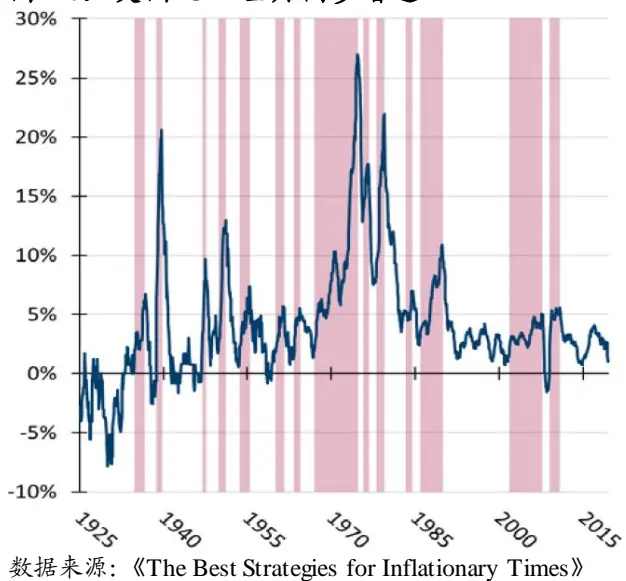

图 11：日本 CPI 当月同步增速
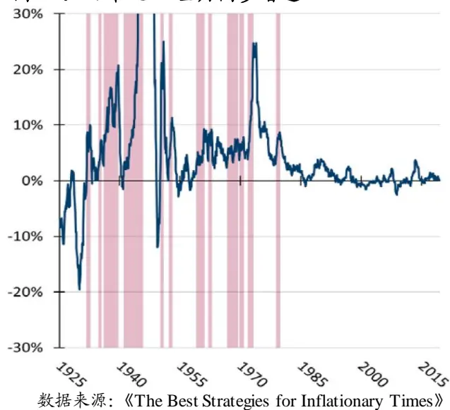

表 11: 不同国家在通胀期和非通胀期年化实际收益比较

| 美国 |  |  |  | 英国 |  |  |  | 日本 |  | 同时处于通胀期的国家数量 |  |  |  |
| --- | --- | --- | --- | --- | --- | --- | --- | --- | --- | --- | --- | --- | --- |
| 资产/策略 | 货币基准 | 通胀期 | 其它 | 全部 | 通胀期 | 其它 | 全部 | 通胀期 | 其它 | 全部 0 | 1 | 2 | 3 |
| % of time |  | 19% | 81% | 100% | 34% | 66% | 100% | 22% | 78% 100% | 49% | 32% | 15% | 4% |
| 美国股市 | 元美元 | -7% | 10% | 7% | 6% | 8% | 7% | 9% 7% | 7% | 8% | 12% | -1% | -7% |
| 英国股市 | 英镑 | -2% | 7% | 5% | 0% | 8% | 5% 3% | 6% | 5% | 7% | 11% | -7% | -7% |
| 日本股市 | 日元 | -7% | 6% | 4% | 9% | 1% | 4% -10% | 8% | 4% | 7% | 5% | -11% | 8% |
| 美国债券 | 美元 | -5% | 4% | 2% | 1% | 3% | 2% | 0% 3% | 2% | 5% | 1% | 0% | -8% |
| 英国债券 | 英镑 | -2% | 3% | 2% | -3% | 5% | 2% | -2% 3% | 2% | 6% | 1% | -1% | -12% |
| 日本债券 | 日元 | -10% | 1% | -1% | -2% | -1% | -1% | -16% | 4% -1% | 5% | -3% | -11% | -12% |
| 大宗商品 | 美元 | 16% | 1% | 4% | 9% | 1% | 4% | 10% | 3% 4% | -1% | 8% | 9% | 21% |
|  | 英镑 | 18% | 1% | 5% | 8% | 3% | 5% | 10% | 4% 5% | 0% | 7% | 8% | 23% |
|  | 日元 | 12% | 0% | 2% | 8% | -1% | 2% 6% | 2% | 2% | -2% | 5% | 8% | 16% |
| 趋势跟踪 | 美元 | 25% | 15% | 16% | 19% | 15% | 16% | 20% | 15% | 16% 15% | 15% | 16% | 48% |
|  | 英镑 | 29% | 14% | 17% | 17% | 17% | 17% | 20% | 16% 17% | 16% | 15% | 16% | 50% |
|  | 日元 | 16% | 11% | 12% | 17% | 10% | 12% | 2% 15% | 12% | 15% | 8% | 6% | 41% |

数据来源：《The Best Strategies for Inflationary Times》，国泰君安证券研究

## 6.2. 当前通胀展望与比特币

任何对历史事件的分析都面临着一个问题：当前的环境跟以往有什么不同吗？例如，1970 年代国际通胀飙升的背后是 OPEC 原油禁运，而当时原油是世界各国经济发展的命脉，原油禁运直接导致了成本推动的通货膨胀。随着碳中和概念的推广和新能源技术的发展，未来对传统能源的需求可能会大幅降低，届时原油市场的变化对通货膨胀的影响可能减弱。因此，在分析未来通胀环境时尤其需要避免刻舟求剑。

近些年来比特币持续受到投资者关注，本文在最后表明比特币作为通胀保值资产的不可行性。比特币的供应数量上限导致其本身带有稀缺性和通缩属性，这与黄金异曲同工，但是比特币不能作为通胀保值资产的原因有两点：其一，比特币价格波动剧烈，并且具有非零的通胀贝塔和市场贝塔，在 2020 年初美国疫情爆发时，比特币一度下跌 53%，随后暴涨 800%；其二，黄金本身对冲通胀的能力有限，一方面黄金波动性也很大，另一方面数据统计表明，除了伊朗革命时期（1978~1980）以外，黄金在通胀期的表现均不佳。

## 7. 总结

## 7.1. 本文文献总结

2008 年危机以来，在财政和货币政策制约下各国通胀一直保持温和。但在 2020 年疫情之后，美国大幅宽松的财政和货币政策向市场投入海量流动性，通胀水平急剧上升，在这一背景下有必要将通胀风险纳入投资决策。

本文并非对通胀水平的预测，而是侧重于各类资产在通胀环境中的表现，包括：以股票和债券为代表的金融资产，以大宗商品、房地产和收藏品为代表的实物资产，以及股市因子策略和期货趋势跟踪策略。在方法论上，本文表明超预期通胀与资产收益更为相关，并使用 CPI 同比增速的变化表征超预期通胀；本文不仅分析了各类资产收益与通胀环境的整体关系，也区分各国不同通胀时期进行了具体分析。

通货膨胀对金融资产的影响包括预期现金流和贴现率两部分，对贴现率的影响更为重要。统计结果表明，股票和债券在通胀期的收益显著为负。未来通胀预期下行时，股票收益与通胀水平负相关，反之当未来通胀预期上行时正相关；不论当前通胀水平如何，债券收益与通胀水平均呈负相关。

一部分实物资产包含在 CPI 统计口径中，它们价格的变化与通胀水平天然同步，但未必完全一致；其他资产则可能具有更复杂的相关关系。大宗商品在通胀期的实际收益均为正，且不论当前通胀水平如何，大宗商品整体收益与通胀水平均呈正相关；房地产在通胀期的表现不佳；艺术品在通胀期收益很高，但市场空间较小，不足以纳入机构投资组合。

在动态策略中，股市因子（Fama-French）多空组合策略在通胀期的收益出现分化，动量、质量和投资因子表现优于其他因子。趋势跟踪策略整体上表现良好，债券、外汇、股票和大宗商品这四种主要的期货资产在通胀期的实际收益均为正；债券和大宗商品期货上趋势跟踪策略收益尤其高，受益于两者与通胀的显著相关关系。

通胀时期多国资产收益的统计结果表明，在本国通货膨胀时，本国股市往往表现最差，而其他国家股市收益可能反而良好，投资者可以通过多元化配置股票规避通胀风险。此外，比特币由于波动剧烈且波动与市场组合相关而不能作为通胀保值资产。

## 7.2. 我们的思考

宏观经济波动对资产价格的影响已经受到业界和学界的广泛关注，以量化的方式衡量经济增长、通胀等宏观经济变量对资产价格的影响有助于完善投资策略。本文则关注通胀对不同类别资产收益的影响，分析了通胀环境中有效的资产配置和投资策略。通货膨胀在宏观经济和投资策略中具有举足轻重的地位。通胀变化引致货币政策变动，进而对宏观经济发展阶段和方向具有重要影响。历史经验表明，高通胀之后有较大概率引致萧条。通胀直接影响实物资产价格和金融资产预期现金流和贴现率，有必要纳入投资决策。

本文的一个创新之处在于分析超预期通胀对资产收益的影响，而非通胀水平本身。预期因素在宏观调控和投资中都具有核心地位。超预期通胀在分析中仅考虑正负性，因而更加稳定，可以反映长周期上资产价格的趋势性变动。考虑到数据样本区间长度的问题，本文仅使用通货膨胀的改变量作为超预期通胀的代理指标。作者也指出可以使用通胀保值债券（TIPS）收益率和名义国债中的盈亏平衡通胀率（BEI）衡量超预期通胀，市场交易行为得到的变量应该可以得出更为准确的结果。

分析通胀期不同资产收益的变动幅度实质上是在计算通胀贝塔，这一过程有两个额外的问题需要注意。一是贝塔系数的计算精度取决于数据频率和样本期长度，数据频率越高、时间区间越长，计算的结果越精确；二是通胀贝塔系数的时变性与通胀绝对水平的问题，资产收益在通胀期和通缩期的变化可能完全不同，资产收益与通胀的关系也可能不完全线性相关，因此需要持续跟踪通胀贝塔的动态变化。

## 8. 附录

表 12: 英国通胀期资产表现

|  | Panel A:特定通胀时期 |  |  |  |  |  |  |  |  |  |  |  |  |  |  |
| --- | --- | --- | --- | --- | --- | --- | --- | --- | --- | --- | --- | --- | --- | --- | --- |
|  | 机 | 退位危英国加 入二战 | 立 | 印度独朝鲜战 争 | 苏伊士 运河危 机 | 柏林墙 建成 | 成为首 相 | 威尔逊 | OPEC原英国加 油禁运 | 入 IMF | 伊朗革矿工罢 命 | 工 | Big Bang | 中国需 求繁荣 期 | 欧元区 危机 |
| 开始时间 | 1935.10 | 1939.9 |  | 1947.11 1950.10 | 1954.7 | 1961.1 | 1964.4 | 1967.12 |  | 1976.8 | 1979.1 | 1984.3 |  | 1986.11 2002.10 2009.12 |  |
| 结束时间 | 1937.07 | 1940.8 | 1948.6 | 1952.1 | 1956.4 | 1962.5 | 1965.4 |  | 1975.8 | 1977.7 | 1980.5 | 1985.4 | 1990.10 | 2008.7 | 2011.9 |
| 整体价格变化幅 度 | 7% | 21% | 8% | 16% | 11% | 7% | 6% |  | 122% | 18% | 29% | 9% | 32% | 22% | 10% |
| 持续时间（月） | 22 | 12 | 8 | 16 | 22 | 17 | 13 |  | 93 | 12 | 17 | 14 | 48 | 70 | 22 |
| 策略 |  |  |  |  |  |  | 名义收益率(总收益) |  |  |  |  |  |  |  |  |
| 股票 | 16% | -17% | 5% | 1% | 28% | -4% | 0 | 60% |  | 31% | 20% | 37% | 54% | 78% | 4% |
| 国债 | 2% | 8% | 3% | -6% | -8% | 8% | -2% |  | 45% | 18% | 13% | 12% | 44% | 26% | 17% |
| 策略 |  |  |  |  |  |  | 实际收益 |  | (总收益) |  |  |  |  |  |  |
| 股票 | 8% | -31% | -3% | -13% | 15% | -10% | -6% |  | -28% | 11% | -6% | 26% | 16% | 46% | -5% |
| 国债 | -5% | -10% | -5% | -20% | -17% | 1% | -8% |  | -35% | 0% | -12% | 3% | 9% | 3% | 7% |
| 住宅房地产 | -7% | -12% | 3% | -9% | -4% | 4% | 3% |  | 26% | -9% | 8% | 1% | 24% | 34% | -8% |
|  | Panel B:所有通胀时期 |  |  |  |  |  |  |  |  |  |  |  |  |  |  |
|  | Inflation (19%) | Other (81%) | All (100%) | Hit rate |  |  |  |  |  |  |  |  |  |  |  |
| 策略 |  | 名义收益率（年化） |  |  |  |  |  |  |  |  |  |  |  |  |  |
| 股票 | 8% | 0.11 | 10% |  | 79% |  |  |  |  |  |  |  |  |  |  |
| 国债 | 5% | 7% | 6% | 79% |  |  |  |  |  |  |  |  |  |  |  |
| 策略 |  | 实际收益 | (年化) |  |  |  |  |  |  |  |  |  |  |  |  |
| 股票 国债 | 0% | 8% | 0.05 | 43% |  |  |  |  |  |  |  |  |  |  |  |
| 住宅房地产 | -3% | 5% | 2% | 43% |  |  |  |  |  |  |  |  |  |  |  |
|  | 1% | 3% | 3% |  | 57% |  |  |  |  |  |  |  |  |  |  |

数据来源：《The Best Strategies for Inflationary Times》，国泰君安证券研究

表 13: 日本通胀期资产表现

|  | Panel A：特定通胀时期 |  |  |  |  |  |  |  |  |  |  |
| --- | --- | --- | --- | --- | --- | --- | --- | --- | --- | --- | --- |
|  | 高桥改革 | 中日紧张日本侵华 局势 | 战争 | 二战 | 道奇财政一系列自 紧缩计划然灾害 |  | 台风维拉经济奇迹 | Izanagi 繁荣期 |  | 馆野会未 OPEC 原 遂政变油禁运 | 伊朗革命 |
| 开始时间 | 09-32 | 08-35 | 12-36 | 12-41 | 01-51 | 02-53 | 12-59 12-62 | 08-67 | 09-70 | 10-72 | 10-79 |
| 结束时间 | 07-33 | 04-36 | 07-40 | 08-46 | 10-51 | 12-53 11-61 | 09-63 | 04-70 | 09-71 | 02-74 | 09-80 |
| 整体价格变化幅度 | 9% | 7% | 68% | 1423% | 19% | 8% 12% | 9% | 20% | 10% | 29% | 9% |
| 持续时间（月） | 11 | 9 | 44 | 57 | 10 | 11 24 | 10 | 33 | 13 | 17 | 12 |
| 策略 |  |  |  |  | 名义收益率(总收益) |  |  |  |  |  |  |
| 股票 | 78% | 16% | 42% | -19% | 78% | -12% 13% | 3% | 53% | 20% | 2% | 7% |
| 国债 | 11% | 3% | 14% | 22% | 5% | -3% -4% | 19% | 19% | 8% | -7% | 2% |
| 策略 |  |  |  |  |  | 实际收益（总收益） |  |  |  |  |  |
| 股票 | 63% | 8% | -15% | -95% | 50% | -19% | 1% -6% | 28% | 9% | -21% | -2% |
| 国债 | 2% | -4% | -32% | -92% | -12% | -10% | -14% 10% | -1% | -2% | -28% | -6% |
| 住宅房地产 |  |  |  |  |  | 56% | 4% | 39% | 8% | 13% | 4% |
| Panel B:所有通胀时期 |  |  |  |  |  |  |  |  |  |  |  |
|  | Inflation (19%) | Other (81%) | All (100%) | Hit rate |  |  |  |  |  |  |  |
| 各策 |  |  | 名义收益率（年化） |  |  |  |  |  |  |  |  |
| 股票 | 11% | 11% | 11% | 83% |  |  |  |  |  |  |  |
| 国债 | 0.04 | 0.07 | 0.06 | 0.75 |  |  |  |  |  |  |  |

| 策略 | 实际收益（年化） |  |
| --- | --- | --- |
| 股票 | -10% 8% | 4% 50% |
| 国债 | -16% 4% | -1% 17% |
| 住宅房地产 | 12% 1% | 3% 100% |

数据来源：《The Best Strategies for Inflationary Times》，国泰君安证券研究

表 14: 美国股市细分市场在通胀期的表现

| 特定通胀时期 |  |  |  |  |  |  |  |  | 所有通胀时期 |  |  |  |
| --- | --- | --- | --- | --- | --- | --- | --- | --- | --- | --- | --- | --- |
|  | 美国加入 二战 | 二战结束 | 朝鲜战争 | 布雷顿森 林体系解 体 | OPEC 原 油禁运 | 伊朗革命 | 里根繁荣 期 | 中国需求 繁荣期 | Inflation (19%) | Other (81%) | All (100%) | Hit rate |
| 开始时间 | Apr 1941 | Mar 1946 | Aug 1950 | Feb 1966 | Jul 1972 | Feb 1977 | Feb 1987 | Sep 2007 |  |  |  |  |
| 结束时间 | May 1942 | Mar 1947 | Feb 1951 | Jan 1970 | Dec 1974 | Mar 1980 | Nov 1990 | Jul 2008 |  |  |  |  |
| 整体价格变化幅度 | 15% | 21% | 7% | 19% | 24% | 37% | 20% | 6% |  |  |  |  |
| 策略 |  |  |  | 实际收益率(总收益) |  |  |  |  |  | 实际收益率（年化） |  |  |
| 农产品 | -23% | 15% | 24% | -7% | 42% | 1% | -19% | 53% | -2% | 7% | 5% | 50% |
| 食品 | -22% | -24% | 8% | 3% | -38% | -26% | 62% | -6% | -4% | 11% | 8% | 38% |
| 苏打 |  |  |  | 45% 25% | -66% | -23% -10% | -15% | -32% | -10% | 14% | 8% | 20% |
| 啤酒 | 7% | -40% | 21% |  | -65% | -2% | 92% | -1% | -3% | 12% 11% | 9% | 50% |
| 烟草 | -32% | -20% | -2% | 8% | -38% |  | 121% | -4% | -2% | 9% | 9% | 25% |
| 玩具 | -48% | -26% | 17% | -35% | -78% | -21% | -3% | -24% | -17% |  | 4% | 13% |
| 娱乐品 | 20% | -36% | 9% | 76% | -76% | 31% | 16% | -42% | -7% | 11% | 8% | 63% |
| 书籍 | -34% | -47% | 33% 20% | -11% | -69% | 4% -32% | -17% | -42% | -15% | 10% 10% | 5% 6% | 25% |
| 居家用品 | -24% | -21% -22% | 18% | 8% 6% | -61% -76% | 4% | -2% | -6% | -9% | 11% | 6% | 25% |
| 服饰 | -13% |  |  | 16% | -86% | 158% | -18% 28% | -27% -17% | -11% | 7% | 4% | 38% |
| 健康 | 1% | -12% | 25% | 99% | -54% | -9% | 28% | -2% | -5% 1% | 11% | 9% | 60% 50% |
| 医疗器械 | -19% | -8% | 17% | 15% | -38% | -5% | 45% | -7% | -1% | 11% | 9% | 38% |
| 药物 | -25% | -17% | 28% | -41% | -30% | -20% | 2% | 6% | -7% | 11% | 7% | 38% |
| 化学品 橡胶 | -19% | -32% | 28% | 16% | -64% | -6% | -4% | -20% | -9% | 12% | 8% | 25% |
| 纺织品 | -19% | -23% | 23% | -27% | -65% | -14% | -6% | -34% | -12% | 9% | 5% | 13% |
| 建材 | -18% | -24% | 28% | 11% | -57% | -7% | -7% | -25% | -8% | 10% | 6% | 25% |
| 建筑 | -38% | -34% | 32% | 9% | -59% | 46% | -5% | -16% | -7% | 7% | 4% | 38% |
| 钢铁 | -24% | -21% | 27% | -24% | -15% | -23% | 5% | -9% | -6% | 6% | 3% | 25% |
| 加工品 |  |  |  | -27% | -53% | 21% | 9% | 12% | -5% | 3% | 1% | 60% |
| 机械 | -20% | -27% | 28% | -19% | -44% | -2% | 4% | -8% | -6% | 10% | 7% |  |
| 电子设备 | -27% | -38% | 19% | 0% | -66% | 1% | 2% | -10% |  | 12% | 8% | 25% |
| 自动设备 | -16% | -32% | 25% | -27% | -61% | -34% | -23% | -40% | -10% -15% | 12% | 7% | 50% 13% |
| 飞机 | -24% | -43% | 15% | -53% | -61% | 52% | -15% | -25% | -13% | 15% | 9% |  |
| 轮船 | -28% | -28% | 18% | -12% | -30% | 30% | -65% | 4% | -10% | 9% | 5% | 25% |
| 枪支 |  |  |  | -31% | -35% | 38% | -8% | -4% | -4% | 13% | 8% | 38% 20% |

| 金融 | -13% | -34% | 23% | 18% | -55% | -1% | -35% | -29% | -10% | 11% | 7% | 25% |
| --- | --- | --- | --- | --- | --- | --- | --- | --- | --- | --- | --- | --- |
| 其他 | -13% | -22% | 21% | -25% | -74% | 11% | 6% | -25% | -11% | 6% | 2% | 38% |

数据来源：《The Best Strategies for Inflationary Times》，国泰君安证券研究

## 本公司具有中国证监会核准的证券投资咨询业务资格

## 分析师声明

作者具有中国证券业协会授予的证券投资咨询执业资格或相当的专业胜任能力，保证报告所采用的数据均来自合规渠道，分析逻辑基于作者的职业理解，本报告清晰准确地反映了作者的研究观点，力求独立、客观和公正，结论不受任何第三方的授意或影响，特此声明。

## 免责声明

的当然客户。本报告仅在相关法律许可的情况下发放，并仅为提供信息而发放，概不构成任何广告。

本报告的信息来源于已公开的资料，本公司对该等信息的准确性、完整性或可靠性不作任何保证。本报告所载的资料、意见及推测仅反映本公司于发布本报告当日的判断，本报告所指的证券或投资标的的价格、价值及投资收入可升可跌。过往表现不应作为日后的表现依据。在不同时期，本公司可发出与本报告所载资料、意见及推测不一致的报告。本公司不保证本报告所含信息保持在最新状态。同时，本公司对本报告所含信息可在不发出通知的情形下做出修改，投资者应当自行关注相应的更新或修改。

本报告中所指的投资及服务可能不适合个别客户，不构成客户私人咨询建议。在任何情况下，本报告中的信息或所表述的意见均不构成对任何人的投资建议。在任何情况下，本公司、本公司员工或者关联机构不承诺投资者一定获利，不与投资者分享投资收益，也不对任何人因使用本报告中的任何内容所引致的任何损失负任何责任。投资者务必注意，其据此做出的任何投资决策与本公司、本公司员工或者关联机构无关。

本公司利用信息隔离墙控制内部一个或多个领域、部门或关联机构之间的信息流动。因此，投资者应注意，在法律许可的情况下，本公司及其所属关联机构可能会持有报告中提到的公司所发行的证券或期权并进行证券或期权交易，也可能为这些公司提供或者争取提供投资银行、财务顾问或者金融产品等相关服务。在法律许可的情况下，本公司的员工可能担任本报告所提到的公司的董事。

市场有风险，投资需谨慎。投资者不应将本报告作为作出投资决策的唯一参考因素，亦不应认为本报告可以取代自己的判断。
在决定投资前，如有需要，投资者务必向专业人士咨询并谨慎决策。

本报告版权仅为本公司所有，未经书面许可，任何机构和个人不得以任何形式翻版、复制、发表或引用。如征得本公司同意进行引用、刊发的，需在允许的范围内使用，并注明出处为“国泰君安证券研究”，且不得对本报告进行任何有悖原意的引用、删节和修改。

若本公司以外的其他机构（以下简称“该机构”）发送本报告，则由该机构独自为此发送行为负责。通过此途径获得本报告的投资者应自行联系该机构以要求获悉更详细信息或进而交易本报告中提及的证券。本报告不构成本公司向该机构之客户提供的投资建议，本公司、本公司员工或者关联机构亦不为该机构之客户因使用本报告或报告所载内容引起的任何损失承担任何责任。

## 评级说明

## 1.投资建议的比较标准

投资评级分为股票评级和行业评级。

以报告发布后的12个月内的市场表现为比较标准，报告发布日后的 12个月内的公司股价（或行业指数）的涨跌幅相对同期的沪深 300 指数涨跌幅为基准。

## 2.投资建议的评级标准

报告发布日后的 12 个月内的公司股价（或行业指数）的涨跌幅相对同期的沪深300 指数的涨跌幅。

| 评级 | 说明 |  |
| --- | --- | --- |
| 股票投资评级 | 增持 | 相对沪深 300 指数涨幅 15%以上 |
|  | 谨慎增持 | 相对沪深 300指数涨幅介于 5%～15%之间 |
|  | 中性 | 相对沪深300指数涨幅介于-5%～5% |
|  | 减持 | 相对沪深 300 指数下跌 5%以上 |
| 行业投资评级 | 增持 | 明显强于沪深 300 指数 |
|  | 中性 | 基本与沪深 300指数持平 |
|  | 减持 | 明显弱于沪深300指数 |

## 国泰君安证券研究所

|  | 上海 | 深圳 | 北京 |
| --- | --- | --- | --- |
| 地址 | 上海市静安区新闸路669号博华广场 20层 | 深圳市福田区益田路 6009 号新世界 商务中心34层 | 北京市西城区金融大街甲 9号金融 街中心南楼18层 |
| 邮编 | 200041 | 518026 | 100032 |
| 电话 | (021)38676666 | (0755)23976888 | （010)83939888 |
|  | E-mail: gtjaresearch@gtjas.com |  |  |