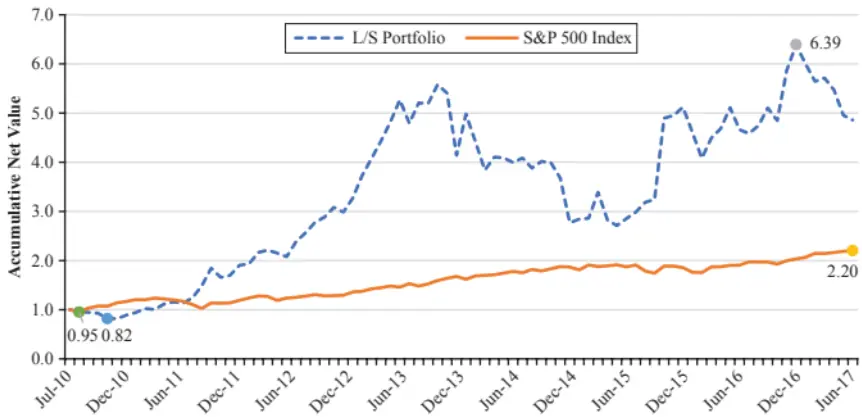

nInfo] [Table_Title] 2021.07.26

# 基于中美供应链的投资异象

## ——学界纵横系列之十八

陈奥林(分析师)

8 021-38674835

## 杨能(分析师)

chenaolin@gtjas.com

021-38032685

证书编号 S0880516100001

yangneng@gtjas.com

S0880519080008

## 本报告导读：

本篇报告推荐的学术文献提出了一个新的思路来研究上市公司股价的联动情况：存在供应链关系的上市公司股价变化是自下而上传导的，这种异象甚至跨国都有效。

## 摘要：

le_Summary]由于跨国环境造成的投资者对海外公开信息的收集和处理有限以及供应链-客户经济联系的重要意义，跨国供应商-客户联系可能成为超额收益的一个重要来源。

《Return Predictability: Evidence from the US–China Supply Chain》使用美国供应商及其主要中国客户的样本检验了中国客户公司股票的收益率对于美国供应商公司股票的价值的影响。

- 基于客户公司股票上月回报率为正(负)购买(出售)其供应商股票来形成一个 L/S 投资组合策略。该投资策略提供了显著的异常回报。

文章的结论主要包括投资组合策略的构建以及对于可预测性的验证，验证内容包括超额收益的来源以及利用供应链数据信息进行预测的方向。结论主要有三：（1）中国客户公司的收益率对美国供应商股票收益率有可预测性；（2）可预测性直接产生于供应链关系；（3）美国供应商公司的收益率对中国客户股票收益率没有可预测性。

- 在 Fama-French 五因素模型中，在 5%显著性水平上，来自 L/S 投资组合策略的异常月收益率为 2.179%(等权重组合情况)。

不仅部分美国公司的收益率会由于特殊经济联系，与中国部分公司的收益率具有较大的相关性；随着快速的金融自由化进程，中国股市受外部经济和金融冲击的影响也在不断扩大。包括中国在内的国际股市可能会发生同步的结构性变化。

金融工程

## 金融工程团队：

陈奥林：（分析师）

电话：021-38674835

邮箱：chenaolin@gtjas.com

证书编号：S0880516100001

## 杨能：（分析师）

电话：021-38032685

邮箱：yangneng@gtjas.com

证书编号：S0880519080008

## 殷钦怡：（分析师）

电话：021-38675855

邮箱：yinqinyi@gtjas.com

证书编号：S0880519080013

## 徐忠亚：（分析师）

电话：021- 38032692

邮箱：xuzhongya@gtjas.com

证书编号：S0880519090002

## 刘昺轶：（分析师）

电话：021-38677309

邮箱：liubingyi@gtjas.com

证书编号：S0880520050001

## 吕琪：（研究助理）

电话：021-38674754

邮箱：lvqi@gtjas.com

证书编号：S0880120080008

## 赵展成：（研究助理）

电话：021-38676911

邮箱：Zhaozhancheng@gtjas.com

证书编号：S0880120110019

## [Table_Re相关报告

通胀环境下的投资策略 2021.07.22

明星基金在主动买入哪些行业和个股2021.07.22

基于随机贴现模型的因子筛选法 2021.07.22机构投资者如何助力企业减少碳排放2021.07.20

基金经理研究之二：彼得林奇的成长股投资之道 2021.07.16

## 1. 选题背景

现阶段基于产业链的研究框架日渐成熟。技术、产业需求、政策变化影响的传导会同时影响上下游企业。作为产业链的重要维度，基于供应链联系的业务驱动的逻辑可以帮助投资者预判企业表现。且随着企业全球经营网络的构建，跨国的产业链上下游关系也应引起注意。由于产业链的传导机制，进出口企业必然会受到海外交易对手经营状况的影响。而国内对于这部分联动情况研究有限。本篇报告推荐的《ReturnPredictability: Evidence from the US–China Supply Chain》提供了预测股价的一种新思路——基于跨国的供应链数据提供的信息，对于供应链上下游公司的股价表现进行预判。

## 2. 核心结论

《Return Predictability: Evidence from the US–China Supply Chain》的结论主要包括投资组合策略的构建以及对于可预测性的验证，验证内容包括超额收益的来源以及利用供应链数据信息进行预测的方向。结论主要有三：（1）中国客户公司的收益率对美国供应商股票收益率有可预测性；（2）可预测性直接产生于供应链关系；（3）美国供应商公司的收益率对中国客户股票收益率没有可预测性。

由于信息的传播可能不像有效市场假说假设的那样准确，投资者同时收集和处理所有公开信息的能力有限。本文提出了一个新的视角来研究价值相关信息的缓慢扩散所带来的回报可预测性。利用美中跨国供应链数据作为样本，文章发现中国客户的回报率可以预测美国供应商的回报率。基于这种可预测性的投资组合策略提供了可观的经济价值。

更具体地说，通过客户上月回报率为正(负)的情况下购买(出售)其供应商股票来形成一个 L/S 投资组合策略。该投资策略提供了显著的异常回报，当包含各种经典风险因素时，这种回报是稳健的。例如，在 Fama-French五因素模型中，在 5%显著性水平上，来自 L/S 投资组合策略的异常月收益率为 2.179%(等权重组合情况)。

## 3. 文章背景

国际金融危机的爆发，证明了国际股票市场的联动性。而对于主要国家之间股票市场存在联动性的原因主要有两个观点：一是与经济基本面有关，即在宏观经济层面存在一些共同的基本变量，这些变量可以同时影响不同经济体的几个股票市场；二是与市场传染有关，主要认为由于市场参与者不是完全理性的，从而在信息不对称的条件下，易产生羊群效应、趋同效应等特征。

供应商-客户联系是一种重要的经济联系。跨国的供应商关系在投资者同时收集和处理所有公开信息能力有限的情况下，更易成为超额收益来源。

供应链上的企业通过其贸易关系直接相互作用，并通过其投入和产出的市场价格间接相互作用；他们还面临类似的需求/供应或技术冲击。由于供应商和客户之间存在着牢固的经济联系，任何与客户价值相关的信息都应该与供应商的价值相关。现阶段学术研究集中于供应链在行业或企业层面产生的回报可预测性，主要发现基于国内，即区域内的企业的供应链。而随着中美经济联系变得更加密切，具有供应链联系的跨国上市公司股票的联动效应也引起了学界注意。

现阶段中美公司之间密切的关系在许多领域带来了互利的结果。因此，投资者在计算美国供应商公司的价值时，有必要考虑有关中国客户公司的公开信息。《Return Predictability: Evidence from the US–China SupplyChain》使用美国供应商及其主要中国客户的样本检验了中国客户公司的收益率对于美国供应商公司的价值的影响。

## 4. 核心模型

## 4.1. 跨国供应链介绍

美国的公司通常在 t + 1 年公布财年 t 的年度报告。因此，文章匹配美国供应商和中国客户在年度报告发布后的回报，从发布年份 t + 1 的 7 月到下一年 t + 2 的 6 月。两家公司在此期间的关系成为公开信息。股票收益的时间段为 2010 年 7 月至 2017 年 6 月。文章只保留那些与中国客户相关的环节，以形成跨国供应链样本。并手动检查每个链接，以确保在匹配来自中国市场的数据时的准确性。有些关系在中国客户公司上市之前就已经存在了，这些链接并不进入样本。大多数客户-供应商链接都缺少针对每个客户的总销售额百分比数据。因此，并不形成价值加权投资组合。样本中的一些公司在一个财年中有两个或两个以上的主要客户，作者对于这些有多个主要客户的供应商公司构建了一个对于客户回报率和客户行业回报等权重进行加权的组合。2009 年至 2015 年跨国供应链的详细分布如下表：

表 1 跨国供应链的详细分布

| Year (会计年度) | N (供应链数量) | Return (等权重投资组合的月平均回报率) |
| --- | --- | --- |
| 2009 | 22 | -1.305% |
| 2010 | 22 | -4.412% |
| 2011 | 27 | 2.483% |
| 2012 | 20 | 0.365% |
| 2013 | 23 | -0.497% |
| 2014 | 20 | -1.168% |
| 2015 | 39 | 1.145% |
| 均值 |  |  |
|  | 24 | -0.484% |
| 供应链总数 |  | 173 |

数据来源：《Return Predictability: Evidence from the US–China Supply Chain》

上表展示了 2009 年至 2015 年跨国供应链的详细分布。在不同年份有关系的相同客户-供应商被视为不同的客户-供应商链接。文章的最终样本包括 173 个公司年的客户-供应商链接。供应链的数量每年保持相对稳定，2015 年达到最高点。

表 2 跨国供应链的详细分布

|  |  |  |  |  | 25% 分位数 | 50% 分位数 | 75% 分位数 | 99% 分位数 |
| --- | --- | --- | --- | --- | --- | --- | --- | --- |
|  | N | 平均数 | 标准差 | 1% 分位数 |  |  |  |  |
| 美国供应商公司的回报率 | 173 | -0.240% | 7.548% | -39.908% | -2.152% | 0.163% | 2.913% | 16.040% |
| 中国客户公司的回报率 | 173 | 0.650% | 3.527% | -7.207% | -1.765% | 0.064% | 2.620% | 11.975% |
| 美国市场的市场超额回报(MKT) | 84 | 1.254% | 3.521% | -7.590% | -0.985% | 1.135% | 3.530% | 11.350% |
| 规模因素(SMB) | 84 | 0.017% | 2.276% | -4.570% | -1.550% | 0.270% | 1.515% | 6.810% |
| B/M 比率因素(HML) | 84 | -0.098% | 2.179% | -4.140% | -1.520% | -0.330% | 1.115% | 8.270% |
| 动量因素(MOM) | 84 | 0.237% | 2.975% | -7.920% | -1.280% | 0.310% | 1.900% | 10.290% |
| 盈利因素(RMW) | 84 | 0.115% | 1.587% | -3.710% | -1.160% | 0.240% | 1.220% | 3.610% |
| 投资模式因素(CMA) | 84 | 0.046% | 1.371% | -2.610% | -0.970% | -0.025% | 0.895% | 3.670% |
| 公司市值 | 173 | 1,178.909 | 1,747.617 | 6.826 | 82.844 | 399.357 | 1,833.500 | 8,167.517 |
| 供应链公司的 B/M 值 | 173 | 54.447 | 699.514 | -0.607 | 0.360 | 0.860 | 1.503 | 9.295 |

数据来源：《Return Predictability: Evidence from the US–China Supply Chain》

表 2 展示了整个样本中股票回报、风险因素、市场价值和市盈率的汇总统计数据。作为跨国供应链中的供应商，美国公司的月平均回报率为-0.240%，远低于中国客户的月平均回报率 0.650%。这种差异可能是由于两国市场的整体表现。

## 4.2. 组合表现

## 4.2.1. 投资组合的构建

构建投资组合主要有 4 个步骤：

a.在 t 月初，根据中国客户公司股票收益率在 t-1 月是正还是负，将美国供应商公司的股票分入两个投资组合——正投资组合和负投资组合（若美国供应商公司的中国客户公司数量超过一个，则对于中国客户公司的回报率进行等权重加权平均得到客户公司回报率）

b.正投资组合与负投资组合内的美国供应商股票的价值（权重）是相等的

c.通过买入正投资组合和卖出负投资组合内的股票来形成 L/S 投资组合策略，投资组合每月都会进行再平衡

d.从风险因素的投资组合异常回报的时间序列回归计算异常回报。文章使用 Newey 和 West (1987)的方法调整标准误差，该方法考虑了异方差性和自相关一致性

## 4.2.2. 组合结果

基于客户滞后的月度回报的 L/S 投资组合策略，会在随后的表现中产生显著的异常回报。下表中的面板 A和面板 B分别展示了等权重投资组合和价值加权投资组合的异常回报。每个月初，样本中的美股都是根据每个公司主要客户(如果中国客户数量超过一个，则为等权重投资组合)的滞后月度回报进行排序的。L/S 列显示零成本投资组合的异常回报，该投资组合购买客户公司股票在前一个月有正回报的美国供应商公司，并出售前一个月客户公司股票为负回报的供应商公司股票，形成 L/S 投资组合策略。投资组合每月都会重新平衡。异常收益的计算基于资本资产定价模型(CAPM)、三因素模型(Fama和 French 1993)、四因素模型(Carhart1997)和五因素模型(Fama 和 French 2015)。我们使用 Newey 和 West (1987)的方法调整标准误差，该方法考虑了异方差性和自相关一致性。t 统计数据显示在系数估计值下方。组合具体表现如下：

表 3 组合表现

|  |  | Q1 (negative) | Q2 (positive) | L/S |
| --- | --- | --- | --- | --- |
| Panel A: Equal Weights |  |  |  |  |
| CAPM Alpha | Alpha | -1.975%** | 0.057% | 2.033%* |
|  | t-Statistics | (-2.297) | (0.077) | (1.842) |
| Three-Factor Alpha | Alpha | -1.998%** | 0.031% | 2.029%* |
|  | t-Statistics | (-2.169) | (0.043) | (1.810) |
| Four-Factor Alpha | Alpha | -1.626% | 0.590% | 2.216%* |
|  | t-Statistics | (-1.636) | (0.762) | (1.899) |
| Five-Factor Alpha | Alpha | -1.945%** | 0.234% | 2.179%** |
|  | t-Statistics | (-2.164) | (0.301) | (1.990) |
| Panel B: Value Weights |  |  |  |  |
| CAPM Alpha | Alpha | -1.999%*** | 0.063% | 2.063%* |
|  | t-Statistics | (-2.365) | (0.087) | (1.880) |
| Three-Factor Alpha | Alpha | -2.016%** | 0.031% | 2.047%* |
|  | t-Statistics | (-2.231) | (0.043) | (1.838) |
| Four-Factor Alpha | Alpha | -1.640%* | 0.576% | 2.216%* |
|  | t-Statistics | (-1.677) | (0.754) | (1.903) |
| Five-Factor Alpha | Alpha | -1.968%** | 0.216% | 2.184%** |
|  | t-Statistics | (-2.236) | (0.280) | (2.009) |

数据来源：《Return Predictability: Evidence from the US–China Supply Chain》

上表展示了全部样本投资组合的异常月收益。L/S 投资组合策略的显著异常回报证实了这种关系具有相当大的经济价值。例如，等权重的 L/S投资组合策略在样本期内产生了 2.179%的异常月收益率(五因素模型)。

下图展示了 2010 年7 月至2017 年 6月基于供应链形成的 L/S策略组合和标准普尔 500 指数组合的累计净值。

## 图 2 组合表现

数据来源：《Return Predictability: Evidence from the US–China Supply Chain》

总体而言，L/S 投资组合策略的表现优于标准普尔 500 指数。

## 4.3. 验证可预测性的存在

使用 Fama-MacBeth 回归方法来检验收益可预测性的存在性。本文为那些在同一财年有两个或两个以上中国客户的供应商公司构建了客户回报和客户行业回报的同等加权组合。

回归模型由下式给出：

$$
\begin{array}{r}{RET_{t}=\alpha+\gamma CRET_{t-1}+\beta_{1}INDRET_{t-1}+\beta_{2}RET_{t-1}+\beta_{3}SIZE_{t-1}}\\{+\beta_{4}B/M_{t-1}(+\beta_{5}CINDRET_{t-1}+\beta_{6}CRET_{t-2})+\varepsilon_{t}\quad}\end{array}\tag{1}
$$

其中，因变量 $RET_{t}$ 指供应商公司在 t 月的股票回报率。自变量 $CRET_{t-1}$ 指供应商的主要中国客户公司在 t-1 月的股票回报率。其余指标， $RET_{t-1}$ 指供应商公司在 t-1 月的回报率， $INDRET_{t-1}$ 指供应商公司股票所在行业在 t-1 月的回报率， $SIZE_{t-1}$ 指滞后的公司市场价值， $B/M_{t-1}$ 即滞后的B/M 比值。 $CINDRET_{t-1}$ 指滞后的客户公司所在行业的（平均）回报率，$CRET_{t-2}$ 指 t-2 月的客户公司的回报率。

每月系数估计值的时间序列平均值和相应的 t 统计数据在表 4 中报告，并根据 Newey 和 West(1987)异方差和自相关一致标准误差计算。面板 A和面板B分别显示了公告后样本和公告前样本的结果。具体结果见下表：

表 4 Fama-MacBeth 回归分析

| 因子名称 | panel A: Sample after announcement |  |  | panel B: Sample before announcement |  |  |
| --- | --- | --- | --- | --- | --- | --- |
|  | 1 | 2 | 3 | 4 | 5 | 6 |
| 常数项 | 0.074 | 0.064 | 0.017 | -0.033 | -0.057 | 0.011 |
|  | (0.784) | (0.698) | (0.182) | (-0.369) | (-0.430) | (0.085) |
| $CRET_{t-1}$ | 0.163* | 0.156* | 0.247** | -0.005 | -0.043 | 0.059 |
|  | (1.833) | (1.720) | (2.071) | (-0.108) | (-0.603) | (0.690) |
| $INDRET_{t-1}$ | -0.049 | -0.075 | -0.195 | 0.048 | 0.135 | 0.106 |
|  | (-0.286) | (-0.407) | (-0.887) | (0.329) | (0.473) | (0.448) |
| $RET_{t-1}$ | -0.045 | -0.050 | -0.043 | -0.079** | -0.071 | -0.071* |
|  | (-1.015) | (-1.079) | (-0.965) | (-2.188) | (-1.975) | (-1.672) |

| $\pmb{SIZE}_{t-1}$ -0.003 | -0.002 0.001 | 0.002 | 0.002 -0.001 |
| --- | --- | --- | --- |
| (-0.685) | (-0.567) (0.008) | (0.414) | (0.384) (-0.039) |
| $B/M_{t-1}$ -0.008 | -0.008 -0.005 | -0.005 | 0.001 0.001 |
| (-1.271) | (-1.318) (-1.006) | (-0.865) | (0.112) (0.042) |
| $CINDRET_{t-1}$ | 0.174 0.082 |  | 0.047 -0.002 |
|  | (0.860) (0.361) |  | (0.207) (-0.007) |
| $CRET_{t-2}$ | 0.084 |  | -0.073 |
|  | (1.025) |  | (-1.045) |
| $\mathbf{ADJ}{\cdot}R^{2}$ 0.149 | 0.153 0.170 | 0.134 | 0.165 0.187 |
| Observations 1,883 | 1,883 1,883 | 1,809 | 1,809 1,809 |

数据来源：《Return Predictability: Evidence from the US–China Supply Chain》

表 4 报告的回归结果：在面板 A中，对于第 1、2 和 3 列， $CRET_{t-1}$ 的系数是显著且正的；在面板 B中，对于第 4、5 和 6 列， $CRET_{t}.$ 的系数是不显著和随机的。回归结果提供了强有力的证据，表明供应链上的公共信息有助于回报的可预测性，在包括其他控制变量后，该结果仍是显著和稳健的。在面板 A的第 3 列中， $CRET_{t-1}$ 的系数为 0.247，这意味着客户公司股票回报增加 1%将使供应商公司的股票回报增加 0.247%。

## 4.4. 验证可预测性直接源于供应链关系

## 4.4.1. PSM 方法构建新样本

本文使用 PSM（Propensity Score Method）方法证明可预测性直接源于供应链。倾向指数被定义为与美国供应商有供应链关系的条件概率，由罗森鲍姆和鲁宾(1983)开发。本文计算中国股票市场的所有公司的倾向指数，然后用倾向指数把中国客户公司匹配到其倾向指数最相似的中国公司。利用倾向指数构建新样本的过程如下：

a.用 Logit model 估计概率，公式为：

$$
\begin{array}{r}{p\big(X_{p,t}\big)=prob\big(Customer_{p,t}=1\big|X_{p,t}\big)=\frac{\exp{(\beta_{t}X_{p,t})}}{1+\exp{(\beta_{t}X_{p,t})}}}\end{array}\tag{2}
$$

其中， $,X_{p,t}$ 是可能影响中国公司 p 在 t 年是否与美国公司有业务往来的向量，包括资产规模、每股收益、每股资产价值、资产回报率、每股营业收入、公司成立以来的年限、固定资产比率和资产负债率。这些变量中的每一个都与公司的业务绩效高度相关。同时使用一个虚拟变量Customer来确定该公司是否是美国供应商的客户。

b. 获取 Fama-MacBeth 回归所需的公司数据后将中国公司分为两组：客户组，包括美国供应商的中国客户公司；控制组，即伪样本，包括没有这种联系的中国客户公司。然后根据等式 2 估计 Logit 模型，以确定每个变量的系数。

c. 用 PSM 估计出中国股市所有公司的倾向指数之后，用最近邻匹配方法(Becker 和 Ichino 2002)在中国公司范围内为每个中国客户公司寻找一个控制公司。基本思想是找到倾向指数值与目标客户公司最接近的匹配公司。然后将中国客户与他们最相似的控制样本公司相匹配。如此便为鲁棒性测试构建了一个伪样本即控制公司样本。Fama-MacBeth 回归中与每个中国客户公司相关的所有变量都被其对应的控制公司的数据代替，来证明可预测性直接来源于供应链关系。回归模型由下式给出:

$$
\begin{array}{r}{RET_{t}=\alpha+\gamma CRET_{t}^{p}+\beta_{1}INDRET_{t-1}+\beta_{2}RET_{t-1}+\beta_{3}SIZE_{t-1}}\\{+\beta_{4}B/M_{t-1}(+\beta_{5}CINDRET_{t-1}^{p}+\beta_{6}CRET_{t-2}^{p})+\varepsilon_{t}\quad\quad}\end{array}\tag{3}
$$

## 4.4.2. PSM 回归分析

对所有回归使用伪样本的结果具体如下：

表 5 PSM回归分析

| 因子名称 | panel A: Sample after announcement |  |  | panel B: Sample before announcement |  |  |
| --- | --- | --- | --- | --- | --- | --- |
|  | 1 | 2 | 3 | 4 | 5 | 6 |
| 常数项 | -0.010 | 0.013 | -0.014 | -0.022 | -0.001 | 0.009 |
|  | (-0.151) | 0.203 | -0.211 | (-0.292) | (-0.014) | (0.106) |
| $CRET_{t-1}^{p}$ | -0.126* | -0.100 | -0.163 | -0.049 | 0.033 | -0.032 |
|  | (-1.712) | (-1.249) | (-1.506) | (-0.658) | (0.380) | (-0.328) |
| $INDRET_{t-1}$ | 0.177 | 0.149 | 0.031 | 0.006 | -0.077 | -0.138 |
|  | (1.138) | (0.900) | (0.230) | (0.037) | (-0.541) | (-0.874) |
| $RET_{t-1}$ | -0.093* | -0.103** | -0.106* | -0.090** | -0.083* | -0.093* |
|  | (-1.783) | (-1.981) | (-1.822) | (-2.011) | (-1.735) | (-1.830) |
| $\pmb{SIZE}_{t-1}$ | 0.001 | -0.001 | 0.001 | 0.001 | -0.001 | -0.001 |
|  | (0.350) | (-0.211) | (0.308) | (0.258) | (-0.024) | (-0.263) |
| $B/M_{t-1}$ | -0.003 | -0.005 | -0.003 | -0.006 | -0.006 | -0.005 |
|  | (-0.611) | (-0.851) | (-0.485) | (-0.997) | (-0.846) | (-0.802) |
| $CINDRET_{t-1}^{p}$ |  | -0.250 | -0.272** |  | 0.042 | 0.128 |
|  |  | (-1.489) | (-2.187) |  | (0.178) | (0.622) |
| $CRET_{t-2}^{p}$ |  |  | -0.214** |  |  | 0.054 |
|  |  |  | (-2.161) |  |  | (0.518) |
| $\mathbf{ADJ}{\cdot}R^{2}$ | 0.132 | 0.142 | 0.158 | 0.119 | 0.159 | 0.185 |
| Observations | 1,916 | 1,916 | 1,916 | 2,036 | 2,036 | 2,036 |

数据来源：《Return Predictability: Evidence from the US–China Supply Chain》

表 展示了对所有回归使用伪样本的结果。在面板 中，除了第 列之外， $CRET_{t-1}^{p}$ 的系数变为负值且不显著。由于控制公司与供应商没有联系，回报的可预测性会消失。面板 B类似于表 4 中的面板 B——使用公告前的样本。对于所有的回归， $CRET_{t-1}^{p}$ 没有明显的可预测性。这一结果支持真实的客户-供应商联系导致回报的可预测性。

## 4.5. 研究供应商对客户公司的预测性

接下来，文章继续探索了另一个方向的可预测性——美国的供应商公司股票回报率是否可以预测中国的客户公司股票回报率。文章仍然使用公告后的样本和公告前的样本来检验效果。区别在于因变量是客户回报率。同样，文章为那些在同一年有两个或更多供应商的客户公司构建了一个供应商回报和供应商行业回报的同等加权组合。然后，文章使用 Fama-MacBeth 回归方法检验回报可预测性的存在性。回归模型由下式给出：

$$
\begin{array}{r}{CRET_{t}=\alpha+\gamma RET_{t-1}+\beta_{1}CINDRET_{t-1}+\beta_{2}CRET_{t-1}+\beta_{3}CSIZE_{t-1}}\\{+\beta_{4}CB/M_{t-1}(+\beta_{5}INDRET_{t-1}+\beta_{6}RET_{t-2})+\varepsilon_{t}\qquad(4)}\end{array}
$$

其中，因变量 $CRET_{t}$ 是 t 月的客户股票回报率，自变量是公司主要供应商在美国 t– 1 月的滞后(平均)股票回报率， $RET_{t-1}$ 。我们还将客户公司自身的滞后回报 $(CRET_{t-1})$ 、客户所在行业的滞后回报 $(CINDRET_{t-1})$ 、滞后市值 $(CSIZE_{t-1})$ 和滞后 B/M 比率 $(CB/M_{t-1})$ 视为基本模型的控制变量。滞后回报还包括供应商行业投资组合回报 $(INDRET_{t-1})$ ，以控制跨行业效应。

表 6 Fama-MacBeth 回归—反向分析

| 因子名称 | panel A: Sample after announcement |  |  | panel B: Sample before announcement |  |  |
| --- | --- | --- | --- | --- | --- | --- |
|  | 1 | 2 | 3 | 4 | 5 | 6 |
| 常数项 | 0.029 | 0.010 | 0.047 | 0.100** | 0.099** | 0.080* |
|  | (0.621) | (0.208) | (1.007) | (2.315) | (2.081) | (1.748) |
| $RET_{t-1}$ | 0.003 | -0.016 | -0.042 | -0.004 | 0.024 | 0.009 |
|  | (0.119) | (-0.462) | (-0.912) | (-0.225) | (0.916) | (0.372) |
| $CINDRET_{t-1}$ | -0.062 | -0.024 | -0.138 | -0.084 | -0.088 | -0.141 |
|  | (-0.605) | (-0.217) | (-1.034) | (-0.944) | (-0.913) | (-1.172) |
| $CRET_{t-1}$ | -0.055 | -0.053 | -0.047 | -0.032 | -0.020 | -0.020 |
|  | (-1.481) | (-1.328) | (-1.014) | (-0.848) | (-0.493) | (-0.471) |
| $CSIZE_{t-1}$ | -0.001 | 0.160 | 0.185 | -0.006*** | -0.126 | -0.102 |
|  | (-0.320) | (1.217) | (1.038) | (-2.522) | (-1.117) | (-0.928) |
| $CB/M_{t-1}$ | 0.003 | -0.001 | -0.001 | 0.006 | -0.006*** | -0.005*** |
|  | (0.617) | (-0.027) | (-0.506) | (1.019) | (-2.358) | (-2.188) |
| $INDRET_{t-1}$ |  | 0.002 | 0.001 |  | 0.003 | 0.004 |
|  |  | (0.555) | (0.352) |  | (0.688) | (0.825) |
| $RET_{t-2}$ |  |  | 0.086 |  |  | -0.022 |
|  |  |  | (1.383) |  |  | (-0.687) |
| $\mathbf{ADJ}\cdot\mathbf{R}^{2}$ | 0.141 | 0.170 | 0.199 | 0.131 | 0.165 | 0.176 |
| Observations | 1,916 | 1,916 | 1,916 | 1,972 | 1,972 | 1,972 |

数据来源：《Return Predictability: Evidence from the US–China Supply Chain》

表 6 报告了供应商回报率能否预测客户回报率的结果。t 统计量是根据Newey 和 West(1987)的异方差性和自相关一致性标准误差计算的。面板A 和 B 分别显示了公告后样本和公告前样本的结果。在面板 A 中，列1、2 和 3 的 $RET_{t-1}$ 系数在统计上不显著，列 2 和 3 的系数为负。在面板B中，对于第 4、5 和 6 列， $CRET_{t-1}$ 的系数也是不显著和随机的。结果表明，在这个方向上没有明显的预测能力。

## 5. 总结

## 5.1. 原文结论

《Return Predictability: Evidence from the US–China Supply Chain》提出了一个新的思路来研究上市公司股价的联动情况：存在供应链关系的上市公司股价变化是自下而上传导的，这种异象甚至跨国都是有效的。

利用 2009-2015 年的中美跨国供应链，文章发现中国客户的股票回报率可以预测美国供应商的回报率。基于这种可预测性的投资组合策略提供了可观的经济价值。更具体地说，依据客户公司上月股票回报率为正(负)，购买(出售)供应商股票来形成一个 L/S 投资组合策略。该投资策略提供了显著的异常回报，当包含各种经典风险因素时，这种回报是稳健的。例如，在 Fama-French 五因素模型中，在 5%显著性水平上，来自 L/S 投资组合策略的异常月收益率为 2.179%(等权重组合情况)。

## 5.2. 我们的思考

由于供应商-客户的经济联系产生的可预测性说明市场并非完全有效。我们可以进一步去研究对于股价联动有显著影响的其余跨国经济联系，以形成基于 A股公司的买卖策略。

同时与中国公司有重要经济联系的其余海外市场也应该引起我们的关注。实际上不仅部分美国公司的收益率会由于特殊经济联系，与中国部分公司的收益率具有较大的相关性；随着快速的金融自由化进程，中国股市受外部经济和金融冲击的影响也在不断扩大。包括中国在内的国际股市可能会发生同步的结构性变化。Tay 和 Zhu (2000)检验了环太平洋市场的价格和波动溢出效应。他们发现，在一个地区引起市场波动的信息可以迅速传递到邻近地区或最有效和最开放的市场，导致该地区市场之间的显著同步。Chan、Lien 和 Weng(2008)揭示，在后危机和后 9/11 时期，从美国市场到香港市场存在单向因果关系。通过研究和跟踪中国市场依赖程度最高的市场，可帮助投资者对于市场结构性风险形成预判。

文章所做的分析适用于全球资本市场，模型的有效性关键在于跨市场公司供应链数据信息，至于其余的经济联系以及相关性较强的市场，有待进一步的研究。这为投资者预测 A 股市场公司情况提供了可行的逻辑。

## 本公司具有中国证监会核准的证券投资咨询业务资格

## 分析师声明

作者具有中国证券业协会授予的证券投资咨询执业资格或相当的专业胜任能力，保证报告所采用的数据均来自合规渠道，分析逻辑基于作者的职业理解，本报告清晰准确地反映了作者的研究观点，力求独立、客观和公正，结论不受任何第三方的授意或影响，特此声明。

## 免责声明

的当然客户。本报告仅在相关法律许可的情况下发放，并仅为提供信息而发放，概不构成任何广告。

本报告的信息来源于已公开的资料，本公司对该等信息的准确性、完整性或可靠性不作任何保证。本报告所载的资料、意见及推测仅反映本公司于发布本报告当日的判断，本报告所指的证券或投资标的的价格、价值及投资收入可升可跌。过往表现不应作为日后的表现依据。在不同时期，本公司可发出与本报告所载资料、意见及推测不一致的报告。本公司不保证本报告所含信息保持在最新状态。同时，本公司对本报告所含信息可在不发出通知的情形下做出修改，投资者应当自行关注相应的更新或修改。

本报告中所指的投资及服务可能不适合个别客户，不构成客户私人咨询建议。在任何情况下，本报告中的信息或所表述的意见均不构成对任何人的投资建议。在任何情况下，本公司、本公司员工或者关联机构不承诺投资者一定获利，不与投资者分享投资收益，也不对任何人因使用本报告中的任何内容所引致的任何损失负任何责任。投资者务必注意，其据此做出的任何投资决策与本公司、本公司员工或者关联机构无关。

本公司利用信息隔离墙控制内部一个或多个领域、部门或关联机构之间的信息流动。因此，投资者应注意，在法律许可的情况下，本公司及其所属关联机构可能会持有报告中提到的公司所发行的证券或期权并进行证券或期权交易，也可能为这些公司提供或者争取提供投资银行、财务顾问或者金融产品等相关服务。在法律许可的情况下，本公司的员工可能担任本报告所提到的公司的董事。

市场有风险，投资需谨慎。投资者不应将本报告作为作出投资决策的唯一参考因素，亦不应认为本报告可以取代自己的判断。
在决定投资前，如有需要，投资者务必向专业人士咨询并谨慎决策。

本报告版权仅为本公司所有，未经书面许可，任何机构和个人不得以任何形式翻版、复制、发表或引用。如征得本公司同意进行引用、刊发的，需在允许的范围内使用，并注明出处为“国泰君安证券研究”，且不得对本报告进行任何有悖原意的引用、删节和修改。

若本公司以外的其他机构（以下简称“该机构”）发送本报告，则由该机构独自为此发送行为负责。通过此途径获得本报告的投资者应自行联系该机构以要求获悉更详细信息或进而交易本报告中提及的证券。本报告不构成本公司向该机构之客户提供的投资建议，本公司、本公司员工或者关联机构亦不为该机构之客户因使用本报告或报告所载内容引起的任何损失承担任何责任。

## 评级说明

## 1.投资建议的比较标准

投资评级分为股票评级和行业评级。以报告发布后的 12 个月内的市场表现为比较标准，报告发布日后的 12 个月内的公司股价（或行业指数）的涨跌幅相对同期的沪深 300 指数涨跌幅为基准。

## 2.投资建议的评级标准

报告发布日后的 12 个月内的公司股价（或行业指数）的涨跌幅相对同期的沪深300 指数的涨跌幅。

| 评级 |  | 说明 |
| --- | --- | --- |
| 股票投资评级 | 增持 | 相对沪深 300 指数涨幅 15%以上 |
|  | 谨慎增持 | 相对沪深 300指数涨幅介于5%～15%之间 |
|  | 中性 | 相对沪深300指数涨幅介于-5%～5% |
|  | 减持 | 相对沪深300 指数下跌5%以上 |
| 行业投资评级 | 增持 | 明显强于沪深 300 指数 |
|  | 中性 | 基本与沪深 300指数持平 |
|  | 减持 | 明显弱于沪深300指数 |

## 国泰君安证券研究所

|  | 上海 | 深圳 | 北京 |
| --- | --- | --- | --- |
| 地址 | 上海市静安区新闸路669 号博华广 场20层 | 深圳市福田区益田路6009号新世界 商务中心34层 | 北京市西城区金融大街甲9号金融 街中心南楼18层 |
| 邮编 | 200041 | 518026 | 100032 |
| 电话 | （021）38676666 | （0755）23976888 | (010)83939888 |
|  | E-mail: gtjaresearch@gtjas.com |  |  |