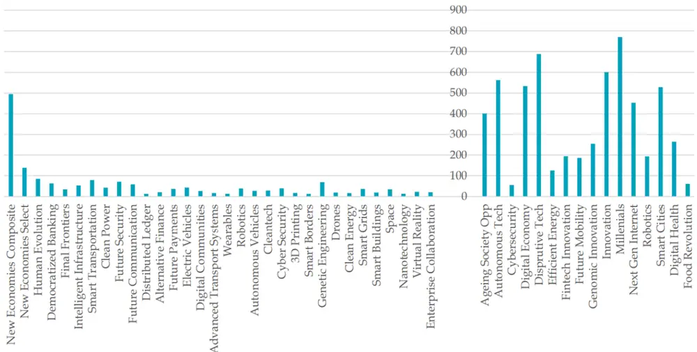
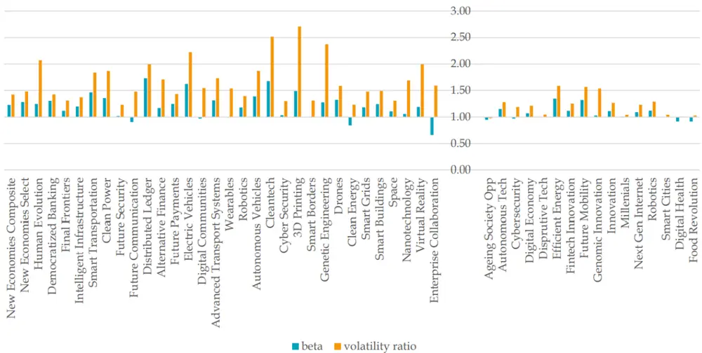
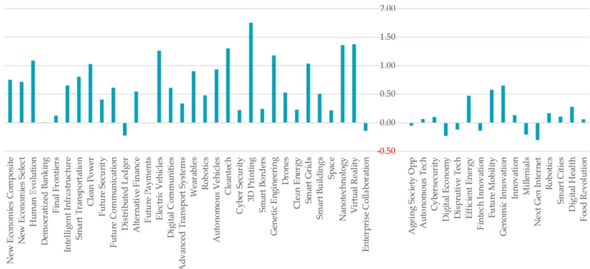
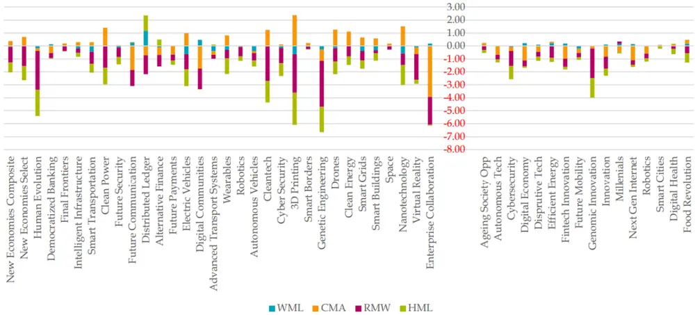
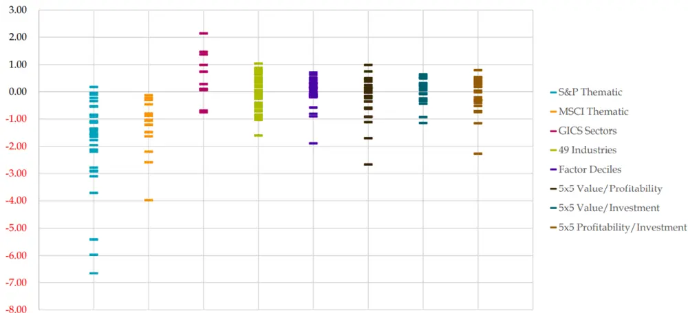
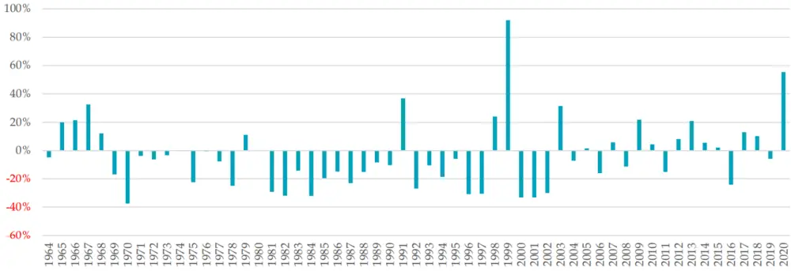
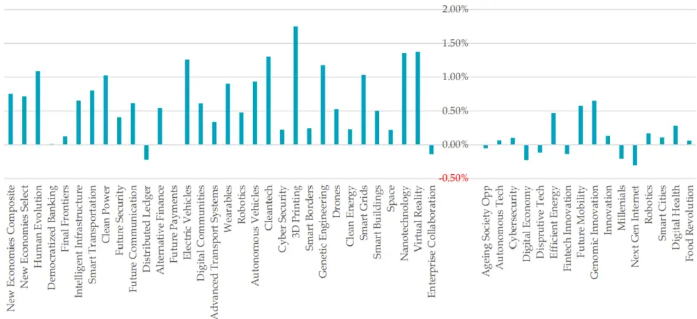

# 主题投资指数的风险特征

# ——学界纵横系列之十九

## 陈奥林(分析师)

8 021-38674835

chenaolin@gtjas.com

证书编号 S0880516100001

## 本报告导读：

主题指数多投资于低盈利、高估值的成长股，在盈利因子和价值因子上有显著的负面敞口。

## 摘要：

le_Summary]主题投资通过挖掘经济发展中的长期结构性和变革性驱动因素，挖掘受益于该主题的投资机会，形成的一种跨行业、跨区域、跨产业链的投资方式。与题材炒作不同之处在于，主题投资是长期投资、核心是未来业绩的改善。

S&P 和 MSCI 在近些年推出了一系列国际主题投资指数，本文通过这些主题指数在 Fama-French 六因子上的风险敞口分析了其风险特征。

主题指数通常在盈利因子和价值因子上有显著的负面敞口，表明其成分股多为低盈利、高估值的成长股，这意味着主题指数是在投资于未来盈利能力。

主题指数在动量因子上的风险敞口不显著，考虑到动量因子本身是一个高度动态的资产组合，这意味着主题指数相对稳定、是长期的投资。

主题指数的市场贝塔和波动率均较高，表明承担了较高的系统性风险。S&P 主题指数在规模因子上的敞口明显大于 MSCI 主题指数，这是受到了成分股权重设定的影响。

主题指数在价值、盈利、投资和动量因子上的总风险敞口普遍为负数，假设这些因子的长期年化风险溢价等于历史平均值（3%），这一结果意味着主题指数收益低于基准，主题投资与追求因子收益的量化交易具有本质的不同。

尽管风险敞口的结论表明主题指数的预期收益较低，但依然存在市场需求。投资者可能出于因子负风险溢价或其他风险特征的考虑投资于主题指数，亦或相信主题投资故事或希望相关领域得到长足发展。

陈奥林：（分析师）

电话：021-38674835

邮箱：chenaolin@gtjas.com

证书编号：S0880516100001

## 杨能：（分析师）

电话：021-38032685

邮箱：yangneng@gtjas.com

证书编号：S0880519080008

## 殷钦怡：（分析师）

电话：021-38675855

邮箱：yinqinyi@gtjas.com

证书编号：S0880519080013

## 徐忠亚：（分析师）

电话：021- 38032692

邮箱：xuzhongya@gtjas.com

证书编号：S0880519090002

## 刘昺轶：（分析师）

电话：021-38677309

邮箱：liubingyi@gtjas.com

证书编号：S0880520050001

## 吕琪：（研究助理）

电话：021-38674754

邮箱：lvqi@gtjas.com

证书编号：S0880120080008

## 赵展成：（研究助理）

电话：021-38676911

邮箱：Zhaozhancheng@gtjas.com

证书编号：S0880120110019

## 徐浩天：（研究助理）

电话：021-38038430

邮箱：xuhaotian@gtjas.com

证书编号：S0880121070119

## 张烨垲：（研究助理）

电话：021-38038427

邮箱：zhangyekai@gtjas.com

证书编号：S0880121070118

## [Table_Re相关报告

日 本 经 济 变 迁 与 核 心 资 产 估 值 变 化2021.08.25

美 国 经 济 变 迁 与 核 心 资 产 估 值 变 化2021.08.25

中国核 心资产是否存在长期估值溢价2021.08.25

## 1. 选题背景

主题投资是通过挖掘经济发展中的长期结构性和变革性驱动因素，挖掘受益于该主题的投资机会，形成的一种跨行业、跨区域、跨产业链的投资方式。与题材炒作不同之处在于，主题投资是长期投资、核心是未来业绩的改善。

MSCI 于今年 4 月发布了中国主题投资指数，包括技术创新、环境和资源以及社会和生活方式三大板块，共 10 个主题和 20 个指数1。如下表所示，这也是 MSCI 首次为单一国家推出主题指数。

表 1: MSCI 中国主题指数：A股在岸指数概览

| 主题名称 | 主题指数 | 成分股个数 | 占比前三的行业 |
| --- | --- | --- | --- |
| Disruptive Technology | 颠覆性科技指数 | 169 | 信息技术、工业、医疗 |
| Future Mobiliy | 未来出行指数 | 118 | 工业、材料、信息技术 |
| Robotics | 机器人技术指数 | 63 | 工业、信息技术、可选消费 |
| Digital Economy | 数字经济指数 | 105 | 信息技术、通讯业务、金融 |
| Autonomous Technology & Industrial Innovation | 自动化技术与产业创新指数 | 178 | 工业、信息技术、可选消费 |
| Next Generation Internet Innovation | 下一代互联网创新指数 | 47 | 信息技术、工业、通信服务 |
| Efficient Energy | 高效能源指数 | 48 | 工业、信息技术、必需消费 |
| Smart Cities | 智慧城市指数 | 228 | 信息技术、工业、公共事业 |
| Millennials | 千禧一代指数 | 87 | 信息技术、必需消费、通信服务 |
| Ageing Society Opportunities | 老龄化社会机会指数 | 62 | 医疗保健、金融、可选消费 |

数据来源：MSCI，国泰君安证券研究

那么，这些主题投资指数在风险上有何特征呢？《Betting Against Quant:Examining the Factor Exposures of Thematic Indices 》 一 文 通 过Fama-French 六因子模型，分析了 S&P 和 MSCI 在世界范围内的主题指数的风险特征，对主题投资具有指导性意义。

## 2. 核心结论

本文通过 Fama-French 六因子模型分析了主题指数在不同因子上的风险敞口。主题指数通常在盈利因子和价值因子上有显著的负面敞口，表明其成分股多为低盈利、高估值的成长股，这意味着主题指数是在投资于未来盈利能力。

主题指数的市场贝塔和波动率均较高，表明承担了较高的系统性风险。S&P 主题指数在规模因子上的敞口明显大于 MSCI 主题指数，这是受到了成分股权重设定的影响。主题指数在动量因子上的风险敞口很小，考虑到动量因子本身是一个高度动态的资产组合，这意味着主题指数相对稳定，是长期的投资而非短期市场套利。

主题指数在价值、盈利、投资和动量因子上的总风险敞口普遍为负数，假设这些因子的长期年化风险溢价等于历史平均值（3%），这一结果意味着主题指数收益低于基准，主题投资与追求因子收益的量化交易具有本质的不同。

尽管风险敞口的结论表明主题指数的预期收益较低，但依然存在市场需求。投资者可能出于因子负风险溢价或其他风险特征的考虑投资于主题指数，亦或单纯相信主题的投资故事或希望相关领域得到长足发展。

## 3. 文章背景

S&P 和 MSCI 近期推出了一系列主题股票指数。MSCI 将主题投资描述为“一种自上而下的投资方法，旨在确定长期的结构性趋势，这些趋势在瞬息万变的世界中有望成为主导和重要的解释性因素。”他们的主题指数围绕“新兴的宏观经济、地缘政治和技术趋势而设计，这些趋势被认为具有结构性和变革性，因此有望长期影响社会的行为和需求。”S&P表示主题指数为投资者提供了“一系列技术支持的、通常具有开创性的行业，通常统称为第四次工业革命”，包括网络安全、机器人、自动驾驶汽车和清洁能源等。本文通过 Fama-French 六因素模型分析指数在不同因子上的风险敞口，从而分析了主题指数的风险特征。

## 4. 主题指数概览

本文研究的主题指数均来自于标准普尔（S&P）和明晟（MSCI），包括32个S&P主题指数和16个MSCI主题指数。考虑到部分指数发布较晚，本文使用相同的算法对指数发布前的历史数据进行填充，保证每个指数得到至少 3 年的数据。由于幸存者偏差，回填的数据可能略高于真实情况，但在计算因子暴露时影响不大。

图 1：S&P 和 MSCI 主题指数的成分股数量（截止 2021.4）

数据来源：《Betting Against Quant: Examining the Factor Exposures of Thematic Indices》

## 5. 实证检验

本文使用 Fama-French 六因子模型分析不同主题指数的因子暴露，如下式所示。等式左侧收益率为指数的超额收益率，收益基准为国债收益率。主要的因子包括市场贝塔（β）、规模因子（SMB）、价值因子（HML）、盈利因子（RMW）、投资因子（CMA）和动量因子（WML）。

$$
R_{i,t}^{e}=\alpha+\beta_{i}R_{m,t}^{e}+s_{i}SMB_{t}+h_{i}HML+r_{i}RMW_{t}+c_{i}CMA_{t}+w_{i}WML+\varepsilon_{i,t}
$$

回测期为 2013.6~2021.4，如上一节所述，每个指数通过回填获得至少三年的数据。本文同时计算了一系列组合的因子暴露作为参考，包括 GICS全球 11 个行业指数、美国 49 个行业组合、按照价值因子、盈利因子和投资因子双重排序的十分位组合和 5×5 组合，这些数据来自于标准普尔和 Kenneth French。

## 5.1. 市场贝塔和波动率

S&P 主题指数的市场贝塔和特质波动率均较高，表明 S&P 主题指数承担了较高的系统性风险和特质性风险；MSCI 主题指数与 S&P 主题指数的结果相似，只是风险敞口略小。

如图 2 所示，几乎所有 S&P 主题指数的市场贝塔都大于 1，且平均水平为 1.21。本文通过指数波动率除以同期市场波动率获得指数的特质波动率，所有 S&P 主题指数的的波动率均大于 1，且平均水平为 1.67。MSCI主题指数在市场风险暴露的影响方向上与 S&P 主题指数相同，但风险敞口略小，平均市场贝塔为 1.07，平均波动率为 1.22。

图 2：S&P 和 MSCI 主题指数的成分股数量（截止 2021.4）

数据来源：《Betting Against Quant: Examining the Factor Exposures of Thematic Indices》

## 5.2. 规模因子

大部分 S&P 主题指数在规模因子上的风险敞口较大，显著高于 MSCI主题指数。如图 3 所示，S&P 主题指数的平均值为 0.65，而 MSCI 主题指数的平均值仅为 0.1 左右。作者指出这一差异与指数构建方法有关，S&P 主题指数使用等权重构建指数，而 MSCI 主题指数使用市值加权。

图 3：S&P（左）和 MSCI 主题指数在规模因子上的风险敞口

数据来源：《Betting Against Quant: Examining the Factor Exposures of Thematic Indices》

## 5.3. 价值因子、盈利因子、投资因子和动量因子

几乎所有主题指数在价值因子和盈利因子上均具有显著的负敞口，这一结果表明主题指数大量投资于盈利能力弱且估值较高的股票，即成长型股票。这一现象在 S&P 主题指数中更为显著，如图 4 所示，S&P 主题指数在价值因子上的平均敞口为-0.64，在盈利因子的平均敞口为-1.18；MSCI 主题指数在价值因子上的平均敞口为-0.41，在盈利因子的平均敞口为-0.57。

同时，S&P 主题指数在投资因子上的敞口大小和方向不一，且平均值接近于 0，仅为 0.07；而 MSCI 主题指数在投资因子敞口显著为负，平均值为-0.39。本文借用 Fama 和 French（2015）以及 Blitz 和 Hanauer（2021a）的结论，投资因子可以理解为另类的“负价值因子”，因此此处的结论也可以佐证价值因子的结论，在因子双重排序分组检验中也可以使用投资因子代替价值因子。

此外，所有主题指数在动量因子上的敞口要小得多，S&P 主题指数的平均敞口为-0.1，MSCI 主题指数的平均敞口为 0.07。动量因子本身反映了一个高度动态的投资组合，因此这一结论反映出主题投资组合相对稳定，是长期投资而非短期市场套利。

图 4：S&P（左）和 MSCI 主题指数在价值因子、盈利因子、投资因子和动量因子上的风险敞口

数据来源：《Betting Against Quant: Examining the Factor Exposures of Thematic Indices》

本文进一步表明，市场贝塔仅衡量了系统性风险，未能反映指数标的资产的特质性风险；且以往的研究表明规模溢价已经变得十分微弱（Blitz和 Hanauer (2021b)），无法通过简单的投资组合获得。因此，本文衡量了各指数在价值因子、盈利因子、投资因子和动量因子上的总风险敞口，如图 5 所示。图中还包括了 GICS 国际行业指数、美国 49 个行业指数以及按照价值因子、盈利因子和投资因子划分的十分位投资组合和 5×5投资组合在这些因子上的总风险敞口做为对比，图中每条短线表示一个指数的总敞口情况。

几乎所有主题指数在这些因子上的总风险敞口均为负数，主要是受到价值因子和盈利因子的负敞口的影响，S&P 主题指数平均为-1.86，MSCI主题指数平均为-1.29。假设Fama-French因子的长期年化风险溢价为3%（历史平均值），这一结果意味着主题指数收益低于基准，S&P 主题指数为-5.58%，MSCI 主题指数为-3.87%。

相比之下，GICS 国际行业指数和美国行业指数中有相当一部分指数在这些因子上的总风险敞口为正。因子十分位组合和 5×5 组合的因子总风险敞口的分布基于 0 对称，并且“价值最低×盈利最低”2的组合的总敞口为-2.66、“盈利最低×投资最低”的组合总敞口为-2.28，均为 5×5分组结果中最低。这一结果表明主题指数的投资组合具有相对更弱的盈利能力和更低的估值。

图 5：不同投资组合在价值因子、盈利因子、投资因子和动量因子上的总风险暴露

数据来源：《Betting Against Quant: Examining the Factor Exposures of Thematic Indices》

## 6. 主题指数的投资动因分析

前面的分析表明，主题指数表现出在价值因子和盈利因子上的负风险敞口，因此在因子年化收益 3%的假设下，主题指数收益未能跑赢基准收益。作者指出，主题指数的构建方式实际上是在与做多价值和盈利因子的量化投资者交易，因此预期收益较低。但主题投资仍然有客户需求，本节将分析投资于主题指数的可能动因。

第一种解释是因子溢价不可信。价值因子和盈利因子的溢价可能一开始就不存在，只是数据挖掘产生的“幻觉”。此外，由于投资者情绪和宏观经济条件的变化，因子溢价可能不存在或为负，Blitz（2021）发现自主题指数发布以来，指数包含的低盈利、高估值的股票反而收益更高。图 展示了“价值最低×盈利最低”组合在 年间的年化收益，尽管大部分时间收益情况较差，但近几年也存在正收益。因此，因子溢价可能不存在或为负，使具有负敞口的主题投资可能具有较高的期望收益。

图 6：“价值最低×盈利最低”组合年化收益：1964~2020

数据来源：《Betting Against Quant: Examining the Factor Exposures of Thematic Indices》

第二种解释是主题指数存在其他特征提高预期收益。投资者基于其他特征选股，可能只是恰好购买了盈利较差的高估值股票。例如，如 Shefrin和 Statman（2000）所述，投资者可能偏好彩票类股票，从而希望通过主题投资获得可能的高收益。

第三种解释是投资者被主题指数的历史收益和投资故事吸引。主题指数历史收益的平均 alpha 均为正，S&P 主题指数为年化 9.5%，MSCI 主题指数为年化 4.6%。然而正如前文所述，通过数据回填得到的历史收益可能存在高估，因此作者认为过去高收益不完全合理。同时，炒作和宣传也使这些相关基金对散户和情绪驱动的投资者更有吸引力，但往往这些基金发行后表现不佳（Ben-David、Franzoni、Kim 和 Moussawi（2021））。因此，作者认为主题指数可能主要针对受到历史收益和投资故事吸引的散户投资者。

图 7：S&P（左）和 MSCI 主题指数的六因素模型Alpha

数据来源：《Betting Against Quant: Examining the Factor Exposures of Thematic Indices》

第四种解释是主题指数的投资者更关注收益以外的主题特征。例如可持续发展与清洁能源的主题，作者认为，如果对这些主题的投资有助于创造更美好的世界，那么投资者可能愿意牺牲一部分财务上的收益。

## 7. 总结

## 7.1. 原文结论

S&P 和 MSCI 近期推出了一系列主题指数，本文通过 Fama-French 六因素模型的回归分析发现这些主题指数在盈利因子和价值因子上有显著的负风险敞口，表明主题指数主要投资于低盈利且高估值的成长股，即投资于未来的业绩。

根据资产定价理论，考虑到因子的历史风险溢价平均为正（3%），则主题指数可能获得较低的预期收益，这与量化投资的思想背道而驰。尽管如此，作者分析了投资者投资于主题指数的一些动因。作者最后指出，可以通过构建资产组合和主动管理策略改善主题指数投资收益。

## 7.2. 我们的思考

在很长一段时间里，A股市场概念炒作盛行，新政策、新概念刚提出时市场热度陡然上升，相关板块和个股一时间广受追捧；但往往好景不长，市场迅速降温，资金便追逐新的热点而去了。主题投资和概念炒作之间的关系是辩证的，一方面主题投资关注受益于结构性、变革性驱动因素的长期投资机会，题材炒作只关注短期波动和市场套利；而另一方面，主题明确之前往往经历过题材炒作。

划分题材炒作与主题投资的关键是是否对业绩造成实质影响。只有主题的发展深刻影响到公司经营发展的逻辑和预期，题材炒作才会进一步发展为主题投资。主题投资是长期、持续的过程，对相关行业和产业链具有深远的影响。

本文的核心假设是风险因子的平均年化溢价为 ，在这一假设之下，作者根据主题指数在价值、盈利、投资和动量因子上的总敞口平均值为负，得出主题指数预期收益较低的结论。文章后面分析投资主题指数的动因也是先验地认为主题指数收益较低。这一假设值得推敲。主题投资往往在主题发展早期就已布局，随着主题的发展和公司业绩的改善，个股风险属性可能会有颠覆性的改变。本文提供的风险特征具有一定的指导价值，在主题投资中要更加关注长期发展逻辑和预期，不能囿于历史数据挖掘得到的结论。

## 本公司具有中国证监会核准的证券投资咨询业务资格

## 分析师声明

作者具有中国证券业协会授予的证券投资咨询执业资格或相当的专业胜任能力，保证报告所采用的数据均来自合规渠道，分析逻辑基于作者的职业理解，本报告清晰准确地反映了作者的研究观点，力求独立、客观和公正，结论不受任何第三方的授意或影响，特此声明。

## 免责声明

的当然客户。本报告仅在相关法律许可的情况下发放，并仅为提供信息而发放，概不构成任何广告。

本报告的信息来源于已公开的资料，本公司对该等信息的准确性、完整性或可靠性不作任何保证。本报告所载的资料、意见及推测仅反映本公司于发布本报告当日的判断，本报告所指的证券或投资标的的价格、价值及投资收入可升可跌。过往表现不应作为日后的表现依据。在不同时期，本公司可发出与本报告所载资料、意见及推测不一致的报告。本公司不保证本报告所含信息保持在最新状态。同时，本公司对本报告所含信息可在不发出通知的情形下做出修改，投资者应当自行关注相应的更新或修改。

本报告中所指的投资及服务可能不适合个别客户，不构成客户私人咨询建议。在任何情况下，本报告中的信息或所表述的意见均不构成对任何人的投资建议。在任何情况下，本公司、本公司员工或者关联机构不承诺投资者一定获利，不与投资者分享投资收益，也不对任何人因使用本报告中的任何内容所引致的任何损失负任何责任。投资者务必注意，其据此做出的任何投资决策与本公司、本公司员工或者关联机构无关。

本公司利用信息隔离墙控制内部一个或多个领域、部门或关联机构之间的信息流动。因此，投资者应注意，在法律许可的情况下，本公司及其所属关联机构可能会持有报告中提到的公司所发行的证券或期权并进行证券或期权交易，也可能为这些公司提供或者争取提供投资银行、财务顾问或者金融产品等相关服务。在法律许可的情况下，本公司的员工可能担任本报告所提到的公司的董事。

市场有风险，投资需谨慎。投资者不应将本报告作为作出投资决策的唯一参考因素，亦不应认为本报告可以取代自己的判断。
在决定投资前，如有需要，投资者务必向专业人士咨询并谨慎决策。

本报告版权仅为本公司所有，未经书面许可，任何机构和个人不得以任何形式翻版、复制、发表或引用。如征得本公司同意进行引用、刊发的，需在允许的范围内使用，并注明出处为“国泰君安证券研究”，且不得对本报告进行任何有悖原意的引用、删节和修改。

若本公司以外的其他机构（以下简称“该机构”）发送本报告，则由该机构独自为此发送行为负责。通过此途径获得本报告的投资者应自行联系该机构以要求获悉更详细信息或进而交易本报告中提及的证券。本报告不构成本公司向该机构之客户提供的投资建议，本公司、本公司员工或者关联机构亦不为该机构之客户因使用本报告或报告所载内容引起的任何损失承担任何责任。

## 评级说明

## 1.投资建议的比较标准

投资评级分为股票评级和行业评级。

以报告发布后的12个月内的市场表现为比较标准，报告发布日后的 12个月内的公司股价（或行业指数）的涨跌幅相对同期的沪深 300 指数涨跌幅为基准。

## 2.投资建议的评级标准

报告发布日后的 12 个月内的公司股价（或行业指数）的涨跌幅相对同期的沪深300 指数的涨跌幅。

| 评级 | 说明 |  |
| --- | --- | --- |
| 股票投资评级 | 增持 | 相对沪深 300 指数涨幅 15%以上 |
|  | 谨慎增持 | 相对沪深 300指数涨幅介于 5%～15%之间 |
|  | 中性 | 相对沪深300指数涨幅介于-5%～5% |
|  | 减持 | 相对沪深 300 指数下跌 5%以上 |
| 行业投资评级 | 增持 | 明显强于沪深 300 指数 |
|  | 中性 | 基本与沪深 300指数持平 |
|  | 减持 | 明显弱于沪深 300指数 |

## 国泰君安证券研究所

|  | 上海 | 深圳 | 北京 |
| --- | --- | --- | --- |
| 地址 | 上海市静安区新闸路669号博华广场 20层 | 深圳市福田区益田路 6009 号新世界 商务中心34层 | 北京市西城区金融大街甲9号金融 街中心南楼18层 |
| 邮编 | 200041 | 518026 | 100032 |
| 电话 | (021)38676666 | (0755)23976888 | （010)83939888 |
|  | E-mail: gtjaresearch@gtjas.com |  |  |