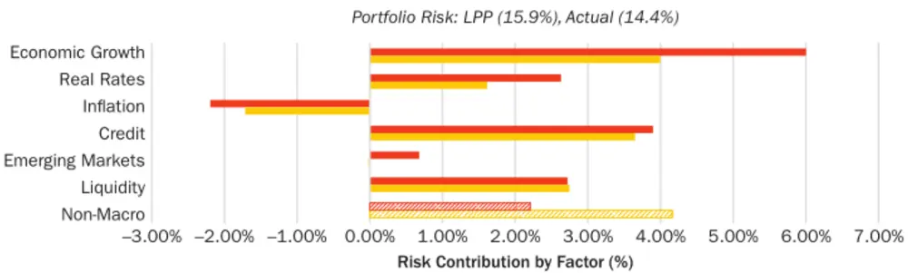
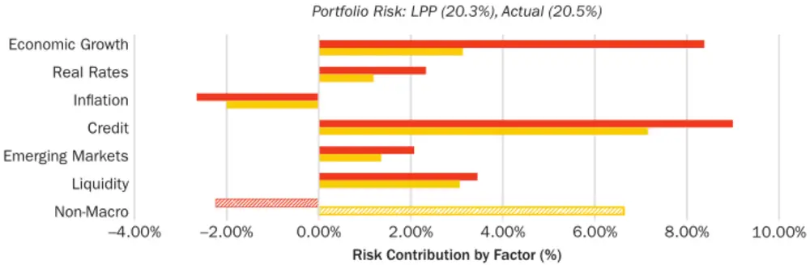
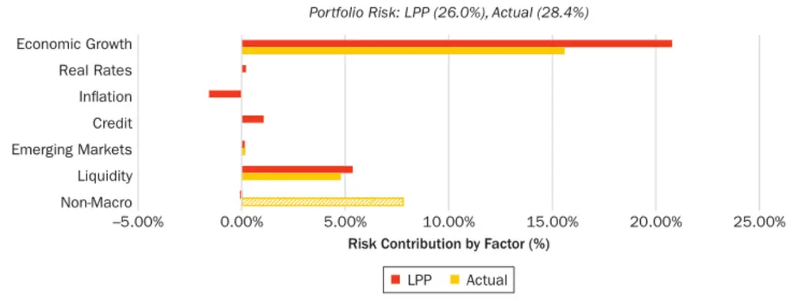
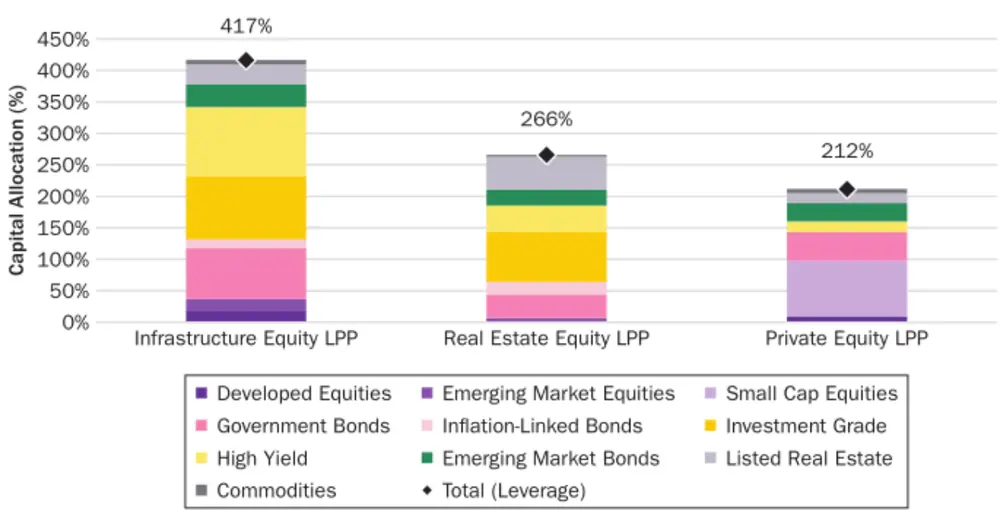

nInfo] [Table_Title] 2021.10.25

# 基于宏观因子拆解非流通性私募资产的风险要素

## ——学界纵横系列之二十

## 陈奥林(分析师)

## 殷钦怡(分析师)

8 021-38674835

021-38675855

chenaolin@gtjas.com

yinqinyi@gtjas.com

证书编号 S0880516100001

S0880519080013

## 本报告导读：

本报告通过宏观因子法，详细分析了过往鉴于低流动性和不透明度存在显著分析难度的私募资产的宏观风险要素，以期帮助私募投资者更好的认清投资组合的风险来源。摘要：

le_Summary]追随着耶鲁大学基金会的脚步，越来越多的投资机构将非流动性的私人市场资产种类添加至自己的投资组合中，因此，如何建立一个稳定有效的公共-私人资产组合变的比以往更亟待解决。

私人市场资产的超额收益率通常来自于其额外的非宏观风险与非流动性，并通过投资经理的专业水平以从这些风险中获得收益，因此对比私人资产与公共资产的一个关键点即为判断私人资产的此两种特征所带来的溢价

本文的重心并非用广义、稳定的宏观因子去解释私人市场资产，而是将私人资产中流动、系统性的成分剥除以判断其的流动性溢价与私人市场的阿尔法值。并通过构建与目标私人资产近似的流动性私人市场组合（LPP）以帮助投资者规避投资私人资产时常遇到的困难：暴露度偏差、现金拖累与不效率的资本管理。

本文选取了私人房地产、私人基建与私人股本，利用回归分析计算其对六种宏观因子的暴露度并阐述了该暴露度的存在原因，以此为基础构建对应 LPP 并与实际资产的收益、风险、夏普值等进行对比，得出各资产与其 LPP 的表现差异并进行了解释。

本文提出的 LPP 不仅可以应用于单独私人资产，亦可以在考虑私人资产间的信息与相关性的前提下构建包含多种私人资产的投资组合的 LPP，并在假定私人资产投资的生命周期前提下构建最适的公共-私人混合资产组合。

金融工程

## 金融工程团队：

陈奥林：（分析师）

电话：021-38674835

邮箱：chenaolin@gtjas.com

证书编号：S0880516100001

杨能：（分析师）

电话：021-38032685

邮箱：yangneng@gtjas.com

证书编号：S0880519080008

## 殷钦怡：（分析师）

电话：021-38675855

邮箱：yinqinyi@gtjas.com

证书编号：S0880519080013

## 徐忠亚：（分析师）

电话：021- 38032692

邮箱：xuzhongya@gtjas.com

证书编号：S0880120110019

## 刘昺轶：（分析师）

电话：021-38677309

邮箱：liubingyi@gtjas.com

证书编号：S0880520050001

## 赵展成：（研究助理）

电话：021-38676911

邮箱：Zhaozhancheng@gtjas.com

证书编号：S0880120110019

## 张烨垲：（研究助理）

电话：021-38038427

邮箱：zhangyekai@gtjas.com

证书编号：S0880121070118

## 徐浩天：（研究助理）

电话：021-38038430

邮箱：xuhaotian@gtjas.com

证书编号：S0880121070119

## [Table_Re相关报告

美股和 A 股的定价时间差 2021.10.22

华夏 MSCI中国A50互联互通ETF价值分析2021.10.22

华安深证 100ETF 投资价值分析 2021.10.17

北交所并不是一个简单的“中国版纳斯达克”

——论“专精特新”定位的因地制宜2021.10.15

场外衍生品市场格局与主流产品 2021.10.12

## 1. 选题背景与概述

近年来，投资机构的组合中流动资产的占比逐年下降，从 1990 年的 93%一路降至 2018 年的 71%，与此同时，这些组合对私募市场的投资持续增加。随着私募市场资产获得越来越大的投资占比，利用宏观因子来分析私募市场资产的重要性显而易见。与私募市场相比，假如公共市场资产能带来相同的回报与风险，其总是有着更低的交易成本与更高的透明度，因此若要寻找最适的私募资产组合，有效地对两种市场资产进行对比是十分必要的。

本文引用了 Gladstone，Madhavan，Rana 和 Ang 的文献《Macro FactorModel：Application to Liquid Private Portfolios》，详细介绍了一个利用宏观因子模拟流动性私募资产组合以构建公共-私人多资产组合的投资模型。

作者将私人房地产、基建、私人股本等拆分至对宏观因子的暴露度。其中私人房地产与基建几乎对所有宏观因子有着暴露度，但其中以经济增长和信贷最甚，私人股本则只能被经济增长与流动性因子所解释。系统性的宏观因子大约可以解释这些非流动性资产的风险的三分之二，而剩余三分之一则被非宏观因子所驱动。

宏观因子是可以被可交易的流动组合所复制的，因此我们可以建立流动性私募市场组合（Liquid Private Portfolios, LPPs）以模拟私募市场的回报。我们在建立 LPPs 时尽可能的将风险敞口平衡于各因子间以获取最大的分散度，所构建的 LPPs 与其目标资产有着高度的相关性，并能够帮助私募市场投资者更好的解决暴露度校准及现金管理的困难。

在完成 LPPs 的构建后，可以通过宏观因子来构建一个公共-私人的多资产组合。作者根据因子溢价进行资金分配，再将这些分配用公共资产与私募资产的不同组合进行表示。

## 1.1. 建立流动性私募投资组合的必要性

本文认为，LPPs 的建立可以在以下几个方面有效解决私募市场投资者所常面对的困难情况。

## 1.1.1. 校准暴露敞口

现金流的时间点与不确定性对投资回报的影响是巨大的。在许多情况下，投资私募市场时需要保留现金以满足后续的资本动用，这会使投资组合产生一个对私募资产暴露度过低的风险（因为闲置资本的存在）。本文的宏观因子框架提供了一个构建分散、流动的组合以模仿目标私募市场的暴露程度的方法。

## 1.1.2. 摆脱现金拖累

通过基于因子的私募资产模仿组合，既可以获取长期的风险溢价，又能够避免需要手头保有额外现金或短期债券的现金拖累。

## 1.1.3. 投资周期内的资金管理

流动性组合为资本运用与再投资提供了有效可行的方法。通常的私募市场无法随时的进行追加投资，而当资金回归至投资者时，LPP 允许投资者继续利用这些资金获取模仿私募市场资产的回报。

## 2. 宏观因子与模拟私募组合

本文在宏观因子选择上遵循了资产配置领域论文最广为使用的因子组，即经济增长、实际利率、通胀、信贷、新兴市场与流动性。下表展示了这些宏观因子的因子溢价与代表这些因子的可交易资产。

表 1：宏观因子与其背后的可交易资产

| Macro Factor | Risk Premiums | Tradable Representation |
| --- | --- | --- |
| Economic Growth | Reward for taking exposure to the global economy; seek to capture surprises in gross domestic product | Long developed-market equities, listed real estate, commodities |
| Real Rates | Reward for bearing exposure to changes in real interest rates | Long inflation-linked bonds |
| Inflation | Risk of bearing exposure to changes in nominal prices; seek to capture surprises in Consumer Price Index | Long nominal government bonds versus short inflation-linked bonds |
| Credit | Reward for lending to institutions that are subject to default | Long investment-grade and high-yield bonds versus short nominal bonds |
| Emerging Markets | Reward for taking exposure to the additional political and economic risk in emerging markets | Long emerging equities versus short developed equities; long emerging debt versus developed debt |
| Liquidity | Reward for providing liquidity | Long small-cap versus short large-cap equities; equity volatility futures; commodity volatility futures |

数据来源：Macro Factor Model: Application to Liquid Private Portfolios

每个宏观因子都是由一个可交易的公共市场组合所代表的，这将允许我们在构建 LPPs 时保证所构建组合的流动性。需注意的是因子的模仿组合中可能存在做空。随后基于风险特征1，将每个资产的收益对这些宏观因子进行回归分析以获取这些资产的因子暴露程度。

为确保对公共与私募资产的处理方式相同，这种方法要求对私募资产的经济风险进行估计。对公共市场波动率的标准估测通常不适用于非流动性投资的周期性估价。本文通过估计（假若能够每天进行交易的）非流动性资产调至市价的波动率以保持处理方式的一致性。

## 2.1. 模型结构与成分

本文选取了 Booker 的模型2作为基础结构以表示这些私募资产，即下式：

$$
\begin{array}{l}{{r_{priv}=\beta_{lev}\big(Public~risk~c\dot{x}aracteristics+Private~risk~c\dot{\iota}aracteristic}}\\{{\qquad+~Idiosyncratic}\big)+FX}\end{array}
$$

其中 $r_{priv}$ 是给定私募资产的日收益率，括号内分别为公共市场风险特征、私募市场风险特征与特殊风险特征所带来的收益率，由于括号内为无杠杆情况下的风险暴露，我们将其乘以 $\beta_{lev}$ 以进行扩放（或缩放），最后我们向式中加入可能的外汇暴露 FX。

此式中，暴露乘数 $\beta_{lev}$ 代表根据杠杆调整后的贝塔值，对于私人股本，其代表对公共股票市场的贝塔值，而对于私人房地产或基建，其代表意义需要根据具体的资产来进行决定。

公共市场风险特征是投资的系统性风险来源，多数情况下会根据流动性市场数据进行校准，且在不同私募资产中也通常是共通的。

私募市场风险特征是私募资产的独特的收益的来源。对其进行估计时需要同时使用公共与私募市场的数据。计算这类特征的目的是克服私募市场数据的信息缺失、周期性数据、收益平滑化等所带来的困难。

特殊风险特征是为了估测特定投资的具体风险，例如早期的风险投资相比成熟的融资并购有更高的特殊风险。特殊风险投资同时反映了投资的集中度。例如一个基建 FOF 与一个投资组合应比单独购买一个 FOF 的特殊风险更低。

由于私募市场组合通常是全球化的，任何非本国货币且未被对冲的资产都会导致外汇暴露 FX 的存在。

## 2.2. 建立 LPPs

根据上式表述的模型结构，本文选取 2006 年 1 月-2021 年 1 月间的月度收益率（基于美元）并构建最适宏观因子组合。该组合目标为最小化与私募资产因子暴露间的跟踪误差，同时部分强调收益最大化以确定一个分散的流动性因子组合。

其中收益最大化组合根据下式进行计算：（N 资产种类，M 印字）

$$
Max_{w_{LPP}}\ q(w_{LPP}^{T}R)-\lambda\big(w_{LPP}^{T}F-e_{priv}^{T}\big)\sum\big(w_{LPP}^{T}F-e_{priv}^{T}\big)^{T}
$$

式中 w 为资产权重，R 为资产期望收益率，q 为目标函数的收益最大化组成犬冢，λ为风险厌恶系数，F 为对因子的暴露矩阵（N*M），e 为目标私募资产的因子暴露，∑为因子的协方差矩阵，F 为 LPP 的因子暴露，L为 LPP 所能允许的最大杠杆倍数。

## 3. 实证结果

下图展示了各个非流动性资产收益率与模拟该资产的 LLP收益率对各个宏观因子的风险暴露程度。

如图 1 可见，这些私募资产的风险约有 25%-35%来自于非系统性或特殊风险，这是预期之中的，如选题背景所述，如果私募资产不能提供独有的收益机会的话，相同暴露度的公共资产总是更适合投资的。

图 1：各私募资产与 LLP组合的风险暴露度

Panel A: Real Estate Equity

Panel B: Infrastructure Equity

Panel C: Private Equity

数据来源：Macro Factor Model: Application to Liquid Private Portfolios

表 2：非流动性资产的 LPPs数据和真实回报对比3

|  | Real Estate Equity |  | Infrastructure Equity |  | Private Equity |  |
| --- | --- | --- | --- | --- | --- | --- |
|  | Actual | LPP | Actual | LPP | Actual | LPP |
| Leverage |  | 266% | 一 | 417% | — | 212% |
| Returnª | 10.28% | 7.74% | 6.66% | 8.04% | 13.25% | 6.18% |
| Portfolio Risk (ex post) | 13.97% | 15.19% | 17.83% | 16.90% | 23.04% | 23.70% |
| SRb | 0.63 | 0.41 | 0.29 | 0.39 | 0.51 | 0.20 |
| Correlation |  | 0.97 |  | 0.84 |  | 0.85 |
| Max Drawdown | -41% | -45% | -60% | -55% | -67% | -71% |
| Portfolio Risk (ex ante) | 14.43% | 15.94% | 20.53% | 20.34% | 28.37% | 25.98% |
| Contribution from Macro Factors | 10.27% | 13.73% | 13.90% | 22.58% | 20.57% | 26.02% |
| Contribution from Non-Macro | 4.16% | 2.21% | 6.63% | -2.24% | 7.80% | -0.04% |
| Tracking Error |  | 4.31% |  | 12.22% |  | 15.21% |
| Contribution from Macro Factors |  | 1.53% |  | 1.24% |  | 0.39% |
| Contribution from Non-Macro |  | 2.78% |  | 10.98% |  | 14.83% |

数据来源：《Macro Factor Model: Application to Liquid Private Portfolios》

## 3.1. 私人房地产

图1表A可见私人房地产与其模拟LPP均正相关于经济增长、真实利率、信贷因子与流动性因子；其正暴露于通胀因子，但由于通胀因子与其他因子的低相关性，其风险贡献度为负。

在获取私人房地产 LPP 时，我们将非宏观风险除外以确保最大化宏观因子暴露敞口。从 LLP 构成中可以看出，经济增长和真实利率会贡献更多的风险，而真实资产与 LPP对信贷与流动性因子的暴露程度则几乎相同。表 2展示了现实私募市场资产与其对应 LPP的收益、风险、回撤等数据。对于房地产资产而言，最适 LPP 的风险（15.9%）略高于真实资产的风险（14.4%），两者都有较高的夏普率，其中真实资产的夏普率较高，但其主要来源于投资经理的技能水平与非流动性带来的溢价。LPP 的最大回撤同样与真实资产相似。

## 3.2. 私人基建

选择一个由绿地投资4和褐地投资5共同组成的全球基建资产。如图 1 表 2所示，该资产的风险主要来源于经济增长与信贷。与房地产相同，通胀因子对私人基建资产的风险贡献为负，但私人基建对信贷的暴露度则远高于私人房地产。

于表 2 可见，基建资产所对应 LPP 的组合风险（20.3%）与实际资产的波动率（20.5%）非常相似。同时可以注意到 LPP 的非宏观风险贡献为负，考虑到该资产种类原本的高波动率，这是流动性 LPP 吸引力的一个潜在来源。

通过对宏观因子风险溢价的分散，私人基建的 LPP 可以达到较真实资产更高的夏普率以及更低的最大回撤，但其一个缺点是要求较高的杠杆倍率（4.2 倍）。

## 3.3. 私募股权

图 1 展示了私募股权对经济增长巨大的正暴露度，同时其对流动性的暴露度也较私人房地产与基建更高。真实私人股本资产的风险可以被经济增长因子解释约 55%（这与公共股票与私人股本之间的关系契合），可以被流动性因子解释约 17%（来自于非流动性的溢价），剩余 27%则为非宏观因素。

表 2 可见,私人股本所对应的 LPP 虽满足了相近的波动率，但真实私募股权的特异风险特征为其所带去的收益导致 LPP的收益率远低于真实资产，同时由于私募股权的高波动性，其对应的 LPP 也有着最大的追踪误差。

## 4. 流动性资产配置

本文所构建的 LPPs 由宏观因子组成，而前文所提这些宏观因子本身由可交易的资产组合所代表的，因此 LPPs 本身可以由流动性资产种类所构成。下表是构成三种资产的 LPP 的流动性资产配置。

与房地产/基建 LPP 对信贷因子的较高暴露度一致，两种 LPP 均将资产的最大部分分配给了高收益债券债券与投资级债券。同时，各个 LLP 的杠杆部分主要均应用于了固定收益债券。房地产 LPP近将很小的部分（7%）分配至了股票，并将 52%分配至指定房地产已进行补足（考虑到会自然的将私人房地产与 REITs 进行对比，这种分配是符合直觉的）。基建 LLP则在股票与可选公共资产部分进行了相似的分配（37%与 38%）以满足周期性的因子暴露。

私募股权将近乎一半的资产（98%）分配至股票，且绝大多数为小盘股，因为小盘股能同时反应私募股权 LPP 暴露度最高的两个宏观因子，即经济增长与流动性。出于收益率与因子分散的目标，私人股本 LPP 同时对各种固收资产进行了一定分配。

这种分配可以以多种方式进行改进，例如在构建组合时允许对 ETF 进行投资。表 4 为在允许投资 ETF 并且限制使用杠杆时三种 LPP 的投资组合构成。

表 3：LPP资产配置组合中各流动性资产的配置比例

| Asset Class | Instrument | Infrastructure Equity LPP | Real Estate Equity LPP | Private Equity LPP |
| --- | --- | --- | --- | --- |
| Equity |  | 37% | 7% | 98% |
| Developed Equities | Futures | 18% | 3% | 10% |
| Emerging Market Equities | TRS | 19% | 3% | 0% |
| Small Cap Equities | TRS | 0% | 0% | 88% |
| Fixed Income |  | 341% | 204% | 92% |
| Government Bonds | Futures/IRS | 80% | 37% | 46% |
| Inflation-Linked Bonds | Physical Bonds | 14% | 21% | 0% |
| Investment Grade | CDX | 100% | 79% | 0% |
| High Yield | CDX | 110% | 42% | 17% |
| Emerging Market Bonds | Futures/IRS | 36% | 25% | 29% |
| Alternative |  | 38% | 55% | 22% |
| Listed Real Estate | TRS | 31% | 52% | 16% |
| Commodities | TRS | 7% | 3% | 7% |
| Total (Leverage) |  | 417% | 266% | 212% |

数据来源：《Mcro Factor Model: Application to Liquid Private Portfolios》

表 4:加入ETF 后的私募资产 LPP 构成

| Asset Class Sub-Asset Class |  | Representative Index | Infrastructure Equity LPP Weight | Real Estate Equity LPP Weight | Private Equity LPP Weight |
| --- | --- | --- | --- | --- | --- |
| Equity | Developed Equities | FTSE UK Dividend + Index | 0.0% | 0.0% | 3.6% |
| Equity | Developed Equities | S&P 500 Index | 0.0% | 0.0% | 1.5% |
| Equity | Developed Equities | STOXX Europe 50 Index | 2.7% | 0.9% | 0.0% |
| Equity | Developed Equities | EURO STOXX 50 ex-Financials Index | 22.0% | 0.0% | 0.0% |
| Equity | EM Equities | MSCI EmergingMarkets Index | 8.0% | 0.0% | 0.0% |
| Equity | Small-Cap Equities | MSCI USA Small Cap Index | 0.0% | 0.0% | 65.0% |
| Equity | Small-Cap Equities | MSCI United Kingdom Small Cap Index | 0.0% | 0.0% | 3.6% |
| Fixed Income | Aggregate Bonds | Bloomberg Barclays US Aggregate Bond Index | 37.9% | 44.7% | 17.7% |
| Fixed Income | High Yield | Markit iBoxx USD Liquid High Yield Capped Index | 0.0% | 4.9% | 0.0% |
| Fixed Income | High Yield | Markit iBoxx Euro Liquid High Yield Index | 0.0% | 4.9% | 0.0% |
| Fixed Income | High Yield | Markit iBoxx Global Developed Markets Liquid High-Yield Capped Index | 0.0% | 4.9% | 0.0% |
| Fixed Income | Inflation-Linked Bonds | FTSE Actuaries UK Conventional Gilts All Stocks Index | 0.0% | 0.0% | 8.1% |
| Alternative | Listed Real Estate | FTSE EPRA/NAREIT UK Property Index | 3.0% | 0.0% | 0.5% |
| Alternative | Listed Real Estate | FTSE EPRA/NAREIT United States Dividend + Index | 0.0% | 19.6% | 0.0% |
| Alternative | Listed Real Estate | FTSE EPRA/NAREIT Developed Asia Index | 10.0% | 4.3% | 0.0% |
| Alternative | Listed Real Estate | MSCI UK IMI Liquid Real Estate Index | 1.5% | 3.8% | 0.0% |
| Alternative | Listed Real Estate | FTSE EPRA/NAREIT Developed Dividend + Index | 10.7% | 0.0% | 0.0% |
| Alternative | Listed Real Estate | STOXX Europe 600 Real Estate Index | 4.3% | 12.0% | 0.0% |
| Alternative | Listed Real Estate | FTSE EPRA/NAREIT UK Property Index | 3.0% | 0.0% | 0.5% |
| Total |  |  | 100% | 100% | 100% |

数据来源：《Macro Factor Model: Application to Liquid Private Portfolios》

## 5. 结论与思考

本文构建了三种不同私募资产的流动性投资组合（LPP），并通过实证分析计算了这些资产对六种宏观因子的风险暴露程度。同时，作者发现这些 LPP 均与实际的对应资产有着较高的契合度并通常提供更低的最大回撤。在投资组合层面上，同样可以对包含私人房地产、基建、股本三种资产在内的私人投资组合构建最适 LPP。

本文为对私募市场进行投资的机构或个人投资者提供了一种依照宏观因子将私募资产流动性化的思路。遵从该思路投资者可以对目标的私募资产种类使用可交易的流动性资产以进行近似的复制，该复制的收益及风险并不一定较原资产更优，但较原资产而言能更精准的控制对目标因子的暴露度及帮助投资者更有效的利用现金。同时，通过对 LPP 的构建，能够将私募资产的系统性风险剥除以得出其非流动性产生的溢价及私募市场的阿尔法值并帮助投资者更好的判断其投资价值。

本文的思路同样有进一步的改进空间。本文模型在构建 LPP 时只考虑了对宏观因子的暴露度，将风格因子结合入该模型或许可进一步提升其有效性。另外，本文的基础框架中并未考虑私募市场投资的阿尔法值，将阿尔法值考虑至等号右式可能可能会导致为了准确追踪该私募市场投资所需的杠杆倍率增加。

## 本公司具有中国证监会核准的证券投资咨询业务资格

## 分析师声明

作者具有中国证券业协会授予的证券投资咨询执业资格或相当的专业胜任能力，保证报告所采用的数据均来自合规渠道，分析逻辑基于作者的职业理解，本报告清晰准确地反映了作者的研究观点，力求独立、客观和公正，结论不受任何第三方的授意或影响，特此声明。

## 免责声明

本报告仅供国泰君安证券股份有限公司（以下简称“本公司”）的客户使用。本公司不会因接收人收到本报告而视其为本公司的当然客户。本报告仅在相关法律许可的情况下发放，并仅为提供信息而发放，概不构成任何广告。

本报告的信息来源于已公开的资料，本公司对该等信息的准确性、完整性或可靠性不作任何保证。本报告所载的资料、意见及推测仅反映本公司于发布本报告当日的判断，本报告所指的证券或投资标的的价格、价值及投资收入可升可跌。过往表现不应作为日后的表现依据。在不同时期，本公司可发出与本报告所载资料、意见及推测不一致的报告。本公司不保证本报告所含信息保持在最新状态。同时，本公司对本报告所含信息可在不发出通知的情形下做出修改，投资者应当自行关注相应的更新或修改。

本报告中所指的投资及服务可能不适合个别客户，不构成客户私人咨询建议。在任何情况下，本报告中的信息或所表述的意见均不构成对任何人的投资建议。在任何情况下，本公司、本公司员工或者关联机构不承诺投资者一定获利，不与投资者分享投资收益，也不对任何人因使用本报告中的任何内容所引致的任何损失负任何责任。投资者务必注意，其据此做出的任何投资决策与本公司、本公司员工或者关联机构无关。

本公司利用信息隔离墙控制内部一个或多个领域、部门或关联机构之间的信息流动。因此，投资者应注意，在法律许可的情况下，本公司及其所属关联机构可能会持有报告中提到的公司所发行的证券或期权并进行证券或期权交易，也可能为这些公司提供或者争取提供投资银行、财务顾问或者金融产品等相关服务。在法律许可的情况下，本公司的员工可能担任本报告所提到的公司的董事。

市场有风险，投资需谨慎。投资者不应将本报告作为作出投资决策的唯一参考因素，亦不应认为本报告可以取代自己的判断。
在决定投资前，如有需要，投资者务必向专业人士咨询并谨慎决策。

本报告版权仅为本公司所有，未经书面许可，任何机构和个人不得以任何形式翻版、复制、发表或引用。如征得本公司同意进行引用、刊发的，需在允许的范围内使用，并注明出处为“国泰君安证券研究”，且不得对本报告进行任何有悖原意的引用、删节和修改。

若本公司以外的其他机构（以下简称“该机构”）发送本报告，则由该机构独自为此发送行为负责。通过此途径获得本报告的投资者应自行联系该机构以要求获悉更详细信息或进而交易本报告中提及的证券。本报告不构成本公司向该机构之客户提供的投资建议，本公司、本公司员工或者关联机构亦不为该机构之客户因使用本报告或报告所载内容引起的任何损失承担任何责任。

## 评级说明

## 1.投资建议的比较标准

投资评级分为股票评级和行业评级。以报告发布后的 12 个月内的市场表现为比较标准，报告发布日后的 12 个月内的公司股价（或行业指数）的涨跌幅相对同期的沪深 300 指数涨跌幅为基准。

## 2.投资建议的评级标准

报告发布日后的 12 个月内的公司股价（或行业指数）的涨跌幅相对同期的沪深300 指数的涨跌幅。

| 评级 |  | 说明 |
| --- | --- | --- |
| 股票投资评级 | 增持 | 相对沪深 300 指数涨幅 15%以上 |
|  | 谨慎增持 | 相对沪深 300指数涨幅介于 5%～15%之间 |
|  | 中性 | 相对沪深300指数涨幅介于-5%～5% |
|  | 减持 | 相对沪深300 指数下跌 5%以上 |
| 行业投资评级 | 增持 | 明显强于沪深 300 指数 |
|  | 中性 | 基本与沪深 300指数持平 |
|  | 减持 | 明显弱于沪深300指数 |

## 国泰君安证券研究所

|  | 上海 | 深圳 | 北京 |
| --- | --- | --- | --- |
| 地址 | 上海市静安区新闸路669 号博华广 场20层 | 深圳市福田区益田路6009号新世界 商务中心34层 | 北京市西城区金融大街甲9号金融 街中心南楼18层 |
| 邮编 | 200041 | 518026 | 100032 |
| 电话 | （021）38676666 | （0755）23976888 | (010)83939888 |
|  | E-mail: gtjaresearch@gtjas.com |  |  |