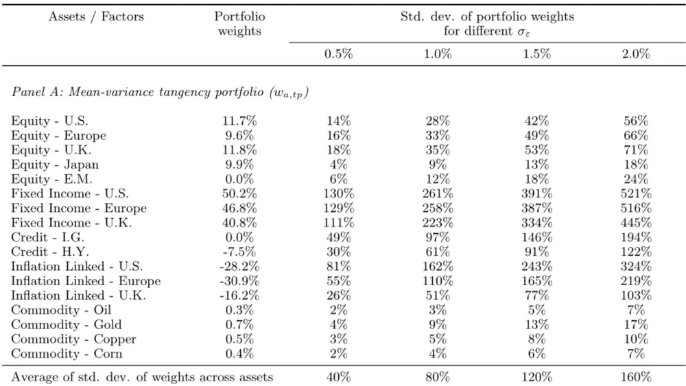
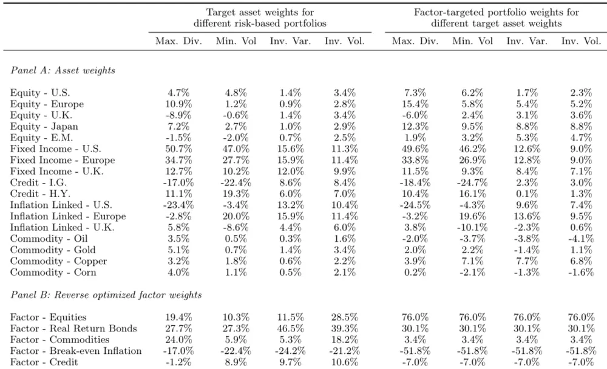
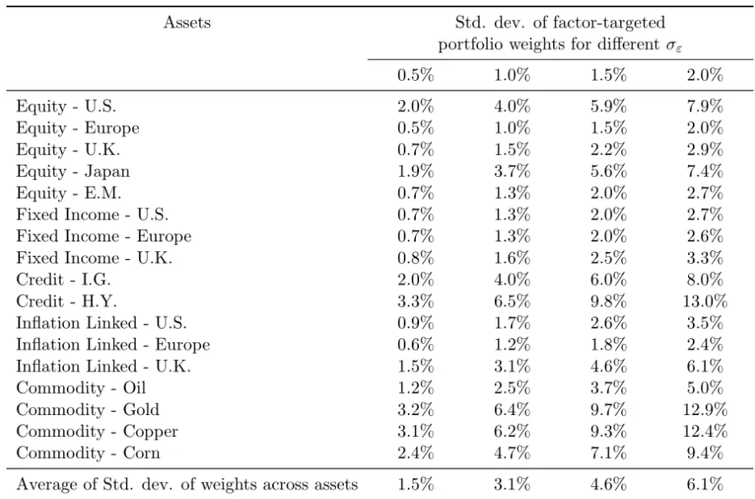

nInfo] [Table_Title] 2021.11.08

# 反转最优化下的因子靶向资产组合

## ——学界纵横系列之二十一

陈奥林(分析师)

## 殷钦怡(分析师)

8 021-38674835

021-38675855

chenaolin@gtjas.com

yinqinyi@gtjas.com

证书编号 S0880516100001

S0880519080013

## 本报告导读：

本报告提出了反转最优化方法，可以解决传统的均值方差优化时对于参数过于敏感的问题。

## 摘要：

le_Summary]使用因子以进行资产组合配置的方法在学术界与机构投资者中备受推崇，一方面是因为多数研究证明单独资产的确会被一系列的风险因子所驱动，另一方面则是因子配置下的组合通常表现更加稳定—这一点在 08 年的金融危机后显得更加至关重要。本报告引用了 Lee 与Salerno 的文献《Factor-targeted Asset Allocation: a ReverseOptimization Approach》,该文献提出了反转最优化因子权重，并将其作为确立资产组合的一种思路。

在经过模拟后，本文发现反转最优化因子权重下的均值方差前沿组合较传统的资产权重法稳定得多。给定定价误差的标准差为 0.5%时，使用传统均值方差模型的资产组合标准差约为 40%，而使用反转最优化因子的组合标准差仅为 10%。同时，在不存在定价误差时，传统模型的夏普值较高，但随着定价误差的标准差增大，其夏普值也会迅速衰减。

本文同样对比了所提出的因子靶向组合及对应的风险出发组合，其中后者并不受定价误差影响（只由风险暴露协方差矩阵决定）。作者发现，当不存在定价误差时，因子靶向组合的夏普率更高，而当存在较高定价误差时两者夏普率则较为接近。

本文对 5000 种情景下的资产回报率进行模拟，分别对比了均值方差法、四种风险出发配置法及作者所提出的反转最优化法的表现，并通过实证证明当存在定价误差时，反转最优化下的因子权重比传统的均值方差法更为稳定，而将该因子权重代入回风险出发配置法后，所得因子靶向组合的权重稳定性又进一步提升。

遵从文章所进行的实证分析，作者同样发现当存在一定的定价误差时，因子靶向组合的夏普值高概率优于传统均值方差模型下的夏普值。作者提出，当存在定价误差时，最优因子权重与不存在误差情况下有所不同，故当存在定价误差但投资者未考虑该误差时，所取得的最优权重组合往往是次优解。

金融工程

## 金融工程团队：

陈奥林：（分析师）

电话：021-38674835

邮箱：chenaolin@gtjas.com

证书编号：S0880516100001

杨能：（分析师）

电话：021-38032685

邮箱：yangneng@gtjas.com

证书编号：S0880519080008

## 殷钦怡：（分析师）

电话：021-38675855

邮箱：yinqinyi@gtjas.com

证书编号：S0880519080013

## 徐忠亚：（分析师）

电话：021- 38032692

邮箱：xuzhongya@gtjas.com

证书编号：S0880120110019

## 刘昺轶：（分析师）

电话：021-38677309邮箱：liubingyi@gtjas.com证书编号：S0880520050001

## 赵展成：（研究助理）

电话：021-38676911邮箱：Zhaozhancheng@gtjas.com证书编号：S0880120110019

## 张烨垲：（研究助理）

电话：021-38038427

邮箱：zhangyekai@gtjas.com

证书编号：S0880121070118

## 徐浩天：（研究助理）

电话：021-38038430

邮箱：xuhaotian@gtjas.com

证书编号：S0880121070119

## [Table_Re相关报告

基本面量化：科技板块分子端优势强化2021.11.08

后抱团时代，下一阶段的核心是基金的特质化选股能力 2021.10.30

“类滞涨”后续故事如何演绎 2021.10.30基于宏观因子拆解非流通性私募资产的风险要素 2021.10.25

美股和 A 股的定价时间差 2021.10.22

## 1. 选题背景与概述

直至今日，对于因子投资相关的数个问题学术界仍未有统一的答案。例如，当资产受到特异性误差影响时，投资者如何决定对不同风险因子的最优暴露敞口；投资者如何通过简单但稳定的方法将因子暴露度映射于资产；以因子为基础的资产组合建立方式为何较传统的资产出发资产组合有着更好的表现等。在文献《Factor-targeted Asset Allocation: aReverse Optimization Approach》中，作者 Lee 和 Salerno 提出了反转最优化因子权重并通过这种新的资产组合思路来回答这三个问题。

首先，假定资产的期望回报率由已知的一组风险因子决定的同时受随机定价误差影响，本文提供了一种使用反转最优化以计算给定资产组合的因子期望回报率的方法。对于给定的任意权重资产组合与指定的因子，计算当定价误差最小条件下资产组合是均值方差最优时的隐含因子回报，如果此时资产组合处于均值方差前沿，则这些因子回报是与其因子风险溢价相符的的。用计算出的因子回报率建立均值方差因子组合，作者将其作为反转最优化因子权重。

其次，本文检验了当存在定价误差时均值方差前沿组合的反转最优化因子权重。广为所知的是，均值方差模型对回报率的输入极其敏感。但本文认为对应的反转最优化因子权重相比之下要稳定得多。作者提出均值方差前沿组合的因子回报率等同于真实的因子期望回报率与因子回报误差的和。当相关足够多的资产时，因子回报误差的估计值较资产定价误差更为稳定，以使反转最优化因子权重更为稳定。

本文模拟了包含特异性误差的线性因子模型的反转最优化因子权重并评估了均值方差前沿组合权重与对应反转最优化因子权重的稳定性，然后直接以两种因子靶向方法建立组合并通过夏普率进行对比。

## 2. 研究方法

## 2.1. 反转最优化因子权重

对于 N 种资产，假设其收益率遵从线性因子结构，其中 $\mu_{f}$ 为实际因子回报，∑f为 M 个因子的协方差矩阵，同时定义 B 为 N x

M 的因子负荷矩阵，ε为定价误差向量，从而使

$$
\mu_{a}=B\mu_{f}+\epsilon\tag{1}
$$

随后计算在最小化定价误差时令资产权重 $w_{\alpha}$ 为均值方差最优的隐含因子回报 $\cdot\mu_{f}^{\ast}$ ，即

$$
\lambda\sum aw_{a}=B\mu_{f}+\epsilon\tag{2}
$$

$$
\mu_{f}^{*}=\left(B^{'}B\right)^{-1}B^{'}\lambda\sum aw_{a}\tag{3}
$$

通过隐含因子回报可求得最优化反转因子权重：

$$
w_{f}^{*}=\bigl(\lambda\sum f\bigr)^{-1}\mu_{f}^{*}
$$

为将资产权重转化为反转最优化因子权重的隐含因子负荷矩阵。

$$
\begin{array}{rl}&{B=\left(\displaystyle\sum f\right)^{-1}\left(B^{\mathbf{\alpha}^{\prime}}\mathbf{\Sigma}B\right)^{-1}B^{\mathbf{\alpha}^{\prime}}\displaystyle\sum a}\\&{\qquad w_{f}^{*}=Bw_{a}}\\&{\qquad=\left(\lambda\displaystyle\sum f\right)^{-1}\left(B^{\mathbf{\alpha}^{\prime}}\mathbf{\Sigma}B\right)^{-1}B^{\mathbf{\alpha}^{\prime}}\displaystyle\sum a\left(\sum a\right)^{-1}B\mu_{f}}\\&{\qquad=\left(\lambda\displaystyle\sum f\right)^{-1}\mu_{f}}\end{array}\tag{4}
$$

(5)

## 2.2. 均值方差前沿组合的反转最优化因子权重

给定资产期望超额收益 ${\mathbf{}}\cdot{\mu}_{a}$ 与协方差矩阵∑a时，均值方差前沿组合的资产权重为

$$
w_{a,tp}=\frac{(\sum a)^{-1}\mu_{a}}{\left|\boldsymbol{1}_{N}^{'}\left(\sum a\right)^{-1}\boldsymbol{\mu}_{a}\right|}\tag{6}
$$

根据 3.1 中反转最优化因子权重的计算方式可以计算出均值方差前沿组合的反转最优化因子权重：

$$
w_{f,tp}^{*}={\frac{(\sum f)^{-1}\left(B^{'}\ B\right)^{-1}B^{'}\ \mu_{a}}{\left|1_{N}^{'}(\sum a)^{-1}\mu_{a}\right|}}\tag{7}
$$

## 2.3. 因子靶向资产配置

使用该反转最优化进行组合建立时，需要输入为目标因子风险敞 $\boxed{\pi}\ (\ \overline{{w}}_{f})$ 与目标资产权重 $\displaystyle\left(\overline{{w}}_{a}\right)$ ）。此步骤中，我们的目标是使反转最优化因子权重与实际权重的偏差最小化，即

$$
\begin{array}{rl}{\mathrm{Arg}min_{w}\lambda\left(Bw-\overline{{w}}_{f}^{\prime}\right)\left(Bw-\overline{{w}}_{f}^{\prime}\right)^{\prime}}&{{}+\left(1-\lambda\right)\left(w-\overline{{w}}_{a}^{\prime}\right)\left(w-\overline{{w}}_{a}\right)}\end{array}\tag{8}
$$

其中前项为与反转最优化因子权重的偏差，后项为与目标资产权重的偏差。由于目标是最小化与反转最优化因子权重的偏差，故本文为λ指定一个足够大的值（0.999）。对于目标因子风险敞口，选择 3.2 中计算所得的均值方差组合反转最优化因子权重（式 7），对于目标资产权重，文章分别对 4 种风险出发资产配置方法进行了计算与评估，该 4 种方法分别为最大分散、最小波动率、逆方差与逆波动率。

## 3. 实证分析

作者通过下式以对不同配置方法（假定存在定价误差的线性因子结构）进行评价：

$$
\mu_{a}=B\mu_{f}+\sigma_{\varepsilon}Z_{N}\tag{9}
$$

其中 $Z_{N}$ 为 $_\mathrm{~\mathrm{~N~}\mathrm{~x~}1}$ 的随机误差向量。 $\sigma_{\varepsilon}$ 为误差标准差。

本文对 5000 种给定因子风险溢价 $\mu_{f}$ 的情景下的资产期望回报率进行模拟，并分别计算因子靶向配置、传统均值方差配置、及 3.3 中所提及 4种配置方法的夏普率。同时计算每种配置方法下夏普率的均值与标准差，并判断提出的因子靶向配置在多少数量的情景下表现优于均值方差前沿配置。

## 3.1. 模型输入

根据以下方法选择进行输入的数据：

∑a:选取 2005-2020 年间 17 种资产的历史数据以计算其协方差矩阵。

∑f:选取 5 个因子，构造其因子模仿组合并取其历史样本协方差矩阵。
5 因子分别为股票、真实利率、大宗商品、通胀与信贷。

B：将资产历史收益率做对因子模仿组合收益率的线性回归以取得因子负荷矩阵。

$\mu_{f}.$ 根据对应因子的模拟组合等缩放至 10%年波动率后的风险溢价，每个因子风险溢价具体对应见下表 1。

$\mu_{a}.$ 资产期望收益率，依照 ${\bf\nabla}\cdot\mu_{a}=B\mu_{f}$ 计算所得。

表 1：因子风险溢价 $\pmb{\mu}_{f}$ 数值及定义

| Factors | Risk Premiums $\mu_{f}$ | Definitions |
| --- | --- | --- |
| Equities | 3.00% | Inverse volatility weighted equity basket (U.S., Europe, U.K., Japan), scaled to 10% annualized volatility. |
| Real Return Bonds | 0.75% | Inverse volatility weighted real return bond bas- ket (U.S., Europe, U.K.), scaled to 10% annualized volatility. |
| Commodities | 1.00% | Inverse volatility weighted commodity basket (Oil, Gold, Copper, Corn), scaled to 10% annualized volatility. |
| Break-even Inflation | -0.25% | Long 1 unit on the Real Return Bonds factor, and short 1 unit on the inverse volatility weighted fixed income basket (U.S., Europe, U.K.) scaled to 10% annualized volatility. The break-even inflation fac- |
| Credit | 1.00% | tor is then scaled to 10% annualized volatility. Long 1 unit on the Credit - H.Y. asset and short 0.5 units on the Fixed Income - U.S. asset for an approximately neutral interest rate duration credit portfolio. |

数据来源：《Macro Factor Model: Application to Liquid Private Portfolios》

## 3.2. 模拟结果

根据式（9）计算存在定价误差的因子模型下均值方差前沿组合的期望收益率，结果如下表 2 所示：

表 2：均值方差前沿组合及其反转最优因子权重

Panel B: Reverse optimized factor weights from the mean-variance tangency portfolio $(w_{f,tp}^{*})$

| Factor - Equities | 76.0% | 9% | 19% | 28% | 38% |
| --- | --- | --- | --- | --- | --- |
| Factor - Real Return Bonds | 30.1% | 6% | 12% | 18% | 25% |
| Factor - Commodities | 3.4% | 4% | 7% | 11% | 14% |
| Factor - Break-even Inflation | -51.8% | 16% | 32% | 48% | 65% |
| Factor - Credit | -7.0% | 14% | 28% | 42% | 56% |
| Average of std. dev. of weights across factors |  | 10% | 20% | 30% | 39% |

数据来源：《Macro Factor Model: Application to Liquid Private Portfolios》

可见均值方差前沿组合的权重受定价误差影响极大，但根据式（7）计算出其反转最优化因子权重后（表 2 下），该组合权重稳定性呈现大幅提高：当误差标准差为2%时，5000个前沿组合的权重平均标准差高达160%，而因子权重平均标准差仅为 39%。该数据证明即使式（9）会导致组合权重存在高不稳定性，反转最优化因子权重也可进行有效补救。

这种稳定性的提高可以归因于两点，其一为当资产数量较多时，隐含因子回报率误差显著低于资产定价误差；其二为当因子数量较资产数量更小时，因子协方差逆矩阵存在更少的极值。

将上述式（1）与式（3）结合可得

$$
\mu_{f}^{*}=\mu_{f}+\left(B^{'}B\right)^{-1}B^{'}\varepsilon\tag{10}
$$

即隐含因子超额收益等于其真实值与一个由定价误差ε决定的误差值的和。同理，均值方差因子权重也等同于其最优权重与一个误差元素的和，即：

$$
w_{f}^{*}=\left(\lambda\sum f\right)^{-1}\mu_{f}+\left(\lambda\sum f\right)^{-1}\left(B^{'}~B\right)^{-1}B^{'}~\varepsilon\tag{11}
$$

其中误差元素为因子协方差矩阵的逆矩阵乘以因子回报率误差。故当该逆矩阵存在较少极值、且因子回报率误差较小时，所得的权重误差较小，即与均值方差资产组合比权重更为稳定。

## 3.3. 因子靶向组合权重稳定性

对上述式（8）求解以得：

$$
w=\left[\gamma B^{'}B+(1-\gamma)I_{N*N}\right]^{-1}\left(\gamma B^{'}\ \overline{{{w}}}_{f}+(1-\gamma)\overline{{{w}}}_{a}\right)\tag{12}
$$

对于四种风险出发目标组合，将 4.2 中所求得的反转最优化因子权重$w_{f,tp}^{*}$ 代入式 12 中的 $\overline{{w}}_{f}.$ ，以计算因子靶向组合权重 $w_{tp,x}$ 。表 3 展示了各配置方法下组合权重，表 4 则展示了其因子权重的稳定性。

表 3：不同目标组合下的资产权重

数 据 来 源 ：《 Factor-targeted Asset Allocation》

表 4：因子靶向组合的权重稳定性

数 据 来 源 ：《 Factor-targeted Asset Allocation》

表 4 为我们提供了两个结论：即四种风险策略下每个资产的权重标准差完全相同，及权重标准差较使用反转最优化因子权重的均值方差组合（表 2）更加稳定。在误差标准差为 2%的情景下，权重标准差平均值进一步由 39%降低至6.1%。该权重稳定性同样代表着风险敞口上的稳定性，事实上，本文所求得的因子靶向组合较均值方差组合有着更稳定的风险风散，而四种风险策略下的因子组合风险分散则较为相似。下表展示了不同策略下风险贡献度的稳定性：

表 5：风险贡献度稳定性

|  |  | Factor-targeted Portfolios |  |  |  |
| --- | --- | --- | --- | --- | --- |
|  | MVO | MaxDiv | MinVol | InvVar | InvVol |
| Equity - U.S. | 1.7% | 0.5% | 0.5% | 0.5% | 0.5% |
| Equity - Europe | 2.2% | 0.4% | 0.2% | 0.2% | 0.2% |
| Equity - U.K. | 2.2% | 0.1% | 0.2% | 0.2% | 0.2% |
| Equity - Japan | 0.6% | 0.6% | 0.5% | 0.5% | 0.5% |
| Equity - E.M. | 0.9% | 0.2% | 0.2% | 0.2% | 0.2% |
| Fixed Income - U.S. | 3.0% | 0.3% | 0.3% | 0.1% | 0.1% |
| Fixed Income - Europe | 3.2% | 0.2% | 0.1% | 0.1% | 0.1% |
| Fixed Income - U.K. | 2.8% | 0.1% | 0.1% | 0.1% | 0.1% |
| Credit - I.G. | 1.6% | 0.1% | 0.2% | 0.1% | 0.1% |
| Credit - H.Y. | 1.0% | 0.3% | 0.4% | 0.3% | 0.3% |
| Inflation Linked - U.S. | 2.0% | 0.1% | 0.0% | 0.1% | 0.1% |
| Inflation Linked - Europe | 1.4% | 0.0% | 0.1% | 0.1% | 0.1% |
| Inflation Linked - U.K. | 0.6% | 0.1% | 0.1% | 0.1% | 0.1% |
| Commodity - Oil | 0.1% | 0.1% | 0.1% | 0.1% | 0.1% |
| Commodity - Gold | 0.1% | 0.3% | 0.3% | 0.3% | 0.3% |
| Commodity - Copper | 0.2% | 0.9% | 1.1% | 1.1% | 1.1% |
| Commodity - Corn | 0.1% | 0.3% | 0.3% | 0.3% | 0.3% |
| Average | 1.4% | 0.3% | 0.3% | 0.3% | 0.3% |

数 据 来 源 ：《 Factor-targeted Asset Allocation》

表 4、表 5 共同证实因子靶向组合在权重、风险敞口等一系列方面均有着较高稳定性。

## 3.4. 因子靶向组合表现

作者对 5000 种情景下分别计算上述不同策略的夏普率，并对因子靶向组合表现优于传统均值方差组合的概率进行计算，结果如下表：

表 6：因子靶向组合表现更优的概率

|  | $\sigma_{\varepsilon}$ |  |  |  |  |  |  |  |  |
| --- | --- | --- | --- | --- | --- | --- | --- | --- | --- |
|  | 0.00% | 0.25% | 0.50% | 0.75% | 1.00% | 1.25% | 1.50% | 1.75% | 2.00% |
| MaxDiv | 0.0% | 31.1% | 88.4% | 96.1% | 97.4% | 97.6% | 97.5% | 97.2% | 96.8% |
| MinVol | 0.0% | 7.2% | 67.3% | 87.8% | 92.8% | 94.3% | 94.7% | 94.8% | 94.2% |
| InvVar | 0.0% | 3.9% | 57.5% | 82.9% | 89.7% | 92.0% | 92.6% | 92.7% | 92.4% |
| InvVol | 0.0% | 3.5% | 55.7% | 81.3% | 88.9% | 91.2% | 91.8% | 91.9% | 91.8% |

数据来源：《Factor-targeted Asset Allocation》

由表 6 可见，当完全不存在定价误差或因子收益率误差时，无论采用何种风险策略均无法比均值方差组合表现更优（当不存在误差时、根据定义均值方差组合即为夏普率最高的组合），但当误差标准差增至 0.75%时，各策略夏普值高于均值方差模型的概率均大于 80%，当误差标准差增至1.25%时该概率则均大于 90%,该结果说明当存在一定的误差（σ>0.5%）情况下，因子靶向组合表现优于均值方差组合。而对于因子靶向组合与不使用反转最优化因子的风险策略组合的表现对比，则会根据不同的定价误差及因子不同的风险溢价有所变化。

## 4. 结论与思考

Lee 和 Salerno 提出遵从因子结构的传统的均值方差模型投资组合可以通过反转最优化以进行改进，改进后的因子模型的资产权重稳定性有着显著提高。该反转最优化因子权重可以作为理想因子暴露度重新构建投资组合。

在此基础上，本文以改进后的均值方差模型隐含因子权重为目标因子风险敞口，并在最大分散、最小波动率、逆方差与逆波动率四种风险策略中添加了额外最优化目标，即实际因子权重与上述隐含因子权重的偏离最低。通过对 5000 种情景的模拟实证分析，作者发现所提出的因子靶向组合在存在定价误差时有着更高的平均夏普值，且表现高概率优于均值方差族和。同时，因子靶向组合的权重也更为稳健，且因子靶向组合在匹配理想因子风险敞口的同时最大化了组合的风险分散程度。

文章同样对本报告未涵盖的部分内容进行了实证及理论证明，例如因子靶向组合的权重受资产期望收益率等输入值的影响较低（敏感性较低），以及在计算反转最优化因子权重时使用隐含因子负荷矩阵（上文 B）所得组合会优于使用标准因子负荷矩阵（上文 B）所得结果。

本文提出了一种将传统均值方差模型、最小风险模型及因子模型相结合的思路。对于报告前文所提出的三个问题，通过从均值方差模型中提取隐含因子权重，帮助投资者解决了如何选取因子暴露敞口的问题，再通过将隐含因子权重代入最小风险策略以完成因子对资产的映射。同时，Lee 和 Salerno 通过实证模拟分析证明了因子靶向模型优于均值方差模型的一大原因是定价误差的存在。这些问题的解答能够令投资者在使用放心地将因子靶向模型应用于实际投资。

## 本公司具有中国证监会核准的证券投资咨询业务资格

## 分析师声明

作者具有中国证券业协会授予的证券投资咨询执业资格或相当的专业胜任能力，保证报告所采用的数据均来自合规渠道，分析逻辑基于作者的职业理解，本报告清晰准确地反映了作者的研究观点，力求独立、客观和公正，结论不受任何第三方的授意或影响，特此声明。

## 免责声明

本报告仅供国泰君安证券股份有限公司（以下简称“本公司”）的客户使用。本公司不会因接收人收到本报告而视其为本公司的当然客户。本报告仅在相关法律许可的情况下发放，并仅为提供信息而发放，概不构成任何广告。

本报告的信息来源于已公开的资料，本公司对该等信息的准确性、完整性或可靠性不作任何保证。本报告所载的资料、意见及推测仅反映本公司于发布本报告当日的判断，本报告所指的证券或投资标的的价格、价值及投资收入可升可跌。过往表现不应作为日后的表现依据。在不同时期，本公司可发出与本报告所载资料、意见及推测不一致的报告。本公司不保证本报告所含信息保持在最新状态。同时，本公司对本报告所含信息可在不发出通知的情形下做出修改，投资者应当自行关注相应的更新或修改。

本报告中所指的投资及服务可能不适合个别客户，不构成客户私人咨询建议。在任何情况下，本报告中的信息或所表述的意见均不构成对任何人的投资建议。在任何情况下，本公司、本公司员工或者关联机构不承诺投资者一定获利，不与投资者分享投资收益，也不对任何人因使用本报告中的任何内容所引致的任何损失负任何责任。投资者务必注意，其据此做出的任何投资决策与本公司、本公司员工或者关联机构无关。

本公司利用信息隔离墙控制内部一个或多个领域、部门或关联机构之间的信息流动。因此，投资者应注意，在法律许可的情况下，本公司及其所属关联机构可能会持有报告中提到的公司所发行的证券或期权并进行证券或期权交易，也可能为这些公司提供或者争取提供投资银行、财务顾问或者金融产品等相关服务。在法律许可的情况下，本公司的员工可能担任本报告所提到的公司的董事。

市场有风险，投资需谨慎。投资者不应将本报告作为作出投资决策的唯一参考因素，亦不应认为本报告可以取代自己的判断。
在决定投资前，如有需要，投资者务必向专业人士咨询并谨慎决策。

本报告版权仅为本公司所有，未经书面许可，任何机构和个人不得以任何形式翻版、复制、发表或引用。如征得本公司同意进行引用、刊发的，需在允许的范围内使用，并注明出处为“国泰君安证券研究”，且不得对本报告进行任何有悖原意的引用、删节和修改。

若本公司以外的其他机构（以下简称“该机构”）发送本报告，则由该机构独自为此发送行为负责。通过此途径获得本报告的投资者应自行联系该机构以要求获悉更详细信息或进而交易本报告中提及的证券。本报告不构成本公司向该机构之客户提供的投资建议，本公司、本公司员工或者关联机构亦不为该机构之客户因使用本报告或报告所载内容引起的任何损失承担任何责任。

## 评级说明

## 1.投资建议的比较标准

投资评级分为股票评级和行业评级。以报告发布后的 12 个月内的市场表现为比较标准，报告发布日后的 12 个月内的公司股价（或行业指数）的涨跌幅相对同期的沪深 300 指数涨跌幅为基准。

## 2.投资建议的评级标准

报告发布日后的 12 个月内的公司股价（或行业指数）的涨跌幅相对同期的沪深300 指数的涨跌幅。

| 评级 |  | 说明 |
| --- | --- | --- |
| 股票投资评级 | 增持 | 相对沪深 300 指数涨幅 15%以上 |
|  | 谨慎增持 | 相对沪深 300指数涨幅介于5%～15%之间 |
|  | 中性 | 相对沪深300指数涨幅介于-5%～5% |
|  | 减持 | 相对沪深300 指数下跌 5%以上 |
| 行业投资评级 | 增持 | 明显强于沪深 300 指数 |
|  | 中性 | 基本与沪深 300 指数持平 |
|  | 减持 | 明显弱于沪深300指数 |

## 国泰君安证券研究所

|  | 上海 | 深圳 | 北京 |
| --- | --- | --- | --- |
| 地址 | 上海市静安区新闸路669 号博华广 场20层 | 深圳市福田区益田路6009号新世界 商务中心34层 | 北京市西城区金融大街甲9号金融 街中心南楼18层 |
| 邮编 | 200041 | 518026 | 100032 |
| 电话 | （021）38676666 | （0755）23976888 | (010)83939888 |
|  | E-mail: gtjaresearch@gtjas.com |  |  |