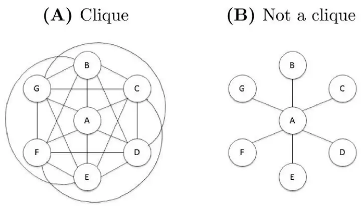
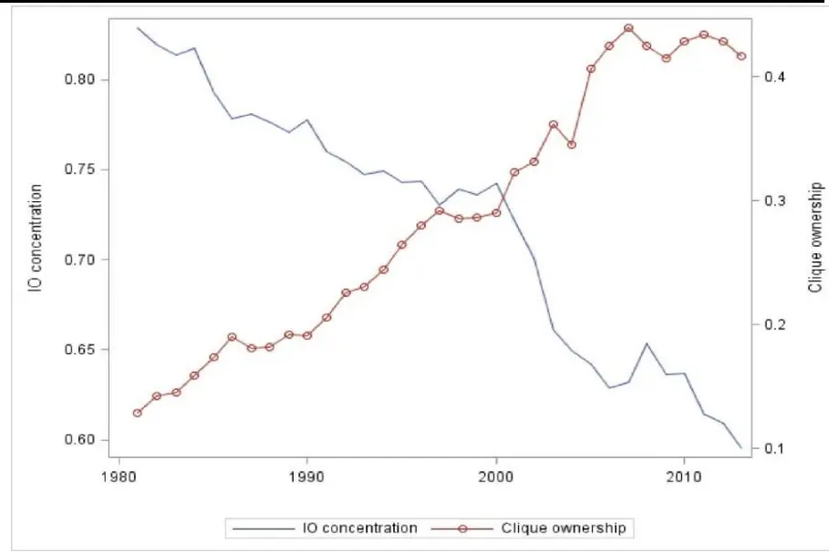
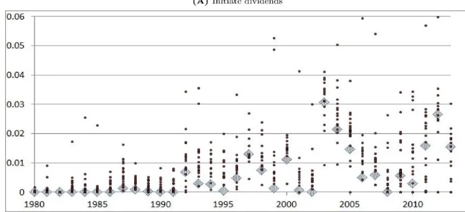
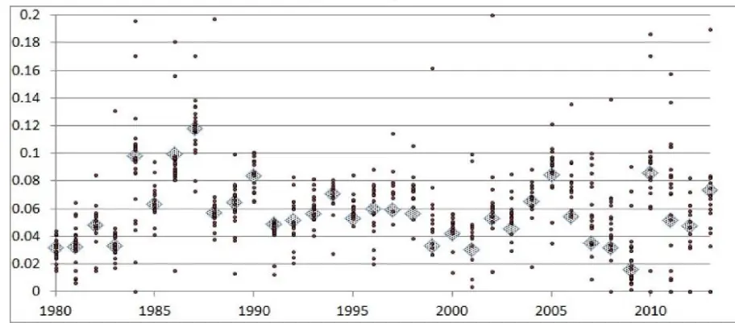
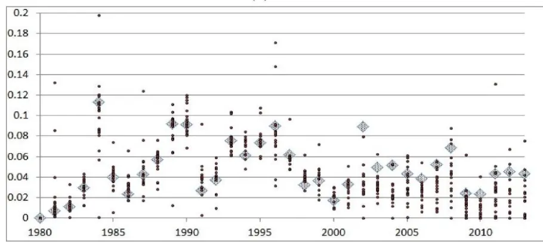
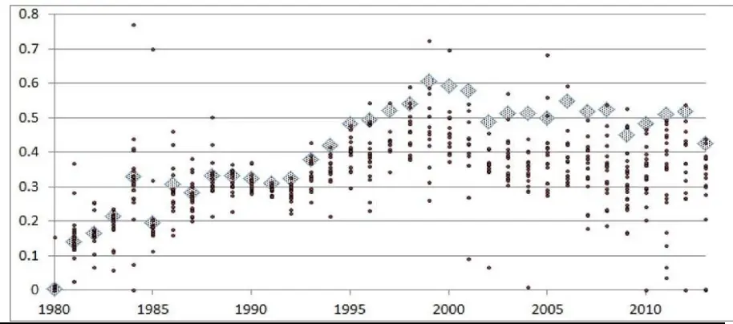

nInfo] [Table_Title]2021.11.11

# 机构抱团与公司治理关系研究

## ——学界纵横系列之二十二

陈奥林(分析师)

## 徐忠亚(分析师)

8 021-38674835

021-38032692

chenaolin@gtjas.com

xuzhongya@gtjas.com

证书编号 S0880516100001

S0880519090002

## 本报告导读：

机构投资者相互联系形成机构集团，集团持股的模式可以在股权分散的情况下实现有效的公司治理。

[Table_Summary]• 在经济增速放缓、市场总需求增长有限的格局之下，公司治理能力在我国市场投资决策中发挥着越来越重要的地位。

- 在传统公司金融的框架中，大股东是监督管理层的核心力量，小股东在这一问题上存在“搭便车”行为。

《Institutional investor cliques and governance》一文表明，当股权分散时，机构投资者之间会相互协调，形成庞大的机构集团。过去三十年间公司的机构投资者股权集中度下降，而集团持股总量上升，表明集团正在替代大额持股的机构成为新的股东形式。

话语权机制指投资者可以通过投票权影响公司重大事项的决策。当集团持股总量高时，集团可以通过投票对管理层的不良提案直接干预，从而提高公司治理效率。

退出威胁机制是指股东可以通过退出和撤资威胁激励管理层，提高公司治理效率。当机构之间存在协调时，退出威胁机制的积极影响减弱，从而降低公司治理效率。

2003 年美国机构丑闻的证据表明机构间协调与公司治理之间存在因果关系。集团持股可以减少投票中的意见不一致情况，降低代理成本，进而提升未来公司价值。

在股权分散的环境中，机构通过共同持股相互联系、通过投票权可以实现有效的公司治理。这一模式可以避免股权集中带来的代理问题，且投资者分散持股符合当前市场发展趋势。

金融工程

## 金融工程团队：

陈奥林：（分析师）

电话：021-38674835

邮箱：chenaolin@gtjas.com

证书编号：S0880516100001

杨能：（分析师）

电话：021-38032685

邮箱：yangneng@gtjas.com

证书编号：S0880519080008

## 殷钦怡：（分析师）

电话：021-38675855

邮箱：yinqinyi@gtjas.com

证书编号：S0880519080013

## 徐忠亚：（分析师）

电话：021- 38032692

邮箱：xuzhongya@gtjas.com

证书编号：S0880120110019

## 刘昺轶：（分析师）

电话：021-38677309

邮箱：liubingyi@gtjas.com

证书编号：S0880520050001

## 赵展成：（研究助理）

电话：021-38676911

邮箱：Zhaozhancheng@gtjas.com

证书编号：S0880120110019

## 张烨垲：（研究助理）

电话：021-38038427

邮箱：zhangyekai@gtjas.com

证书编号：S0880121070118

## 徐浩天：（研究助理）

电话：021-38038430

邮箱：xuhaotian@gtjas.com

证书编号：S0880121070119

## [Table_Re相关报告

生猪贝塔机会加种业景气周期，关注农业ETF投资机会 2021.11.09

基本面量化：科技板块分子端优势强化2021.11.08

反转 最 优 化 下 的 因 子 靶 向 资 产 组 合2021.11.08

文化差异对动量风格的影响 2021.11.08

后抱团时代，下一阶段的核心是基金的特质化选股能力 2021.10.30

## 1. 选题背景

公司治理能力在我国市场投资决策中发挥着越来越重要的地位。在经济增速放缓、市场总需求增长有限的格局之下，只有发展势头良好、竞争能力强的公司才能在激烈的竞争中占据一席之地。优秀的内部治理能力无疑是保证未来业绩快速、高质量增长的强心剂。

在传统公司金融的框架中，大股东是监督管理层的核心力量，小股东在这一问题上存在“搭便车”行为。大股东治理的模式要求公司股权集中于大股东手中，大股东与公司利益绑定，产生了监督公司的动力。然而大股东一言堂的模式也使大股东有可能通过操控股价的方式侵害小股东权益，这是作为投资者不愿看到的。

那么，在股权分散的情况下，有没有可能通过某种特殊的机制保证公司治理的效率呢？《Institutional investor cliques and governance》一文提供了一个方向。当公司的股东主要是机构投资者时，持有少量股份的一众机构如果通过共同持股形成相互联系的集团，也会对公司治理产生不可忽视的影响。

## 2. 核心结论

股东对于公司治理具有重要影响。传统的公司金融理论基于股东独立决策的假设，强调大股东在治理中的积极作用。而本文发现机构投资者之间会相互协调，形成庞大的机构集团，从而对公司治理产生新的影响。

机构集团可以通过话语权机制提高公司治理效率。话语权机制是指投资者可以通过行使投票权影响公司重大事项的决策。当集团持股总量高时，集团可以通过投票对管理层的不良提案直接干预，并减少股东意见不一致带来的代理问题，从而提高公司治理效率。

机构集团同时通过影响退出威胁机制而影响公司治理效率。退出威胁机制是指股东可以通过退出和撤资威胁激励管理层，提高公司治理效率。而当机构之间存在协调时，退出威胁机制对提高公司治理效率的积极影响会减弱。

近 年以来美国市场机构持股集中度大幅下降，取而代之的是机构集团持股比例逐渐上升。本文针对集团持股对公司治理的影响做了多方研究，但未能从整体上判断这一变化对公司治理效率的影响是好是坏。本文的启示在于，不能仅从股权集中度的大小判断公司治理能力，股权分散的公司也许因为投资者的协调而拥有公司治理高效率。

## 3. 文章背景

传统的公司治理理论强调大股东治理，小股东在公司治理问题上存在搭便车行为（Shleifer 和 Vishny，1986）。因此，传统的观点认为所有权分散会阻碍公司治理。但是 Edmans 和 Holderness（2016）发现一些投资者并非独立行动，而是携手合作以共同影响公司决策。在过去 30 年中，机构所有权的集中度有所降低，这表明机构协调正在代替集中控股。

本文主要研究机构投资者协调与公司治理之间的关系。在这一问题上，Shleifer 和 Vishny（1986）认为协调的投资者通过投票中的话语权克服了搭便车问题，从而增强了公司治理效率；埃德曼斯和曼索（2011）认为，协调的投资者使退出威胁失效，从而削弱了公司治理。

## 4. 机构间协调：集团的形成

## 4.1. 集团结构

机构投资者共同持股增加了相互协调的可能性。本文基于这一假设，使用机构共同持股情况衡量机构之间的联系。具体地，如果两个机构投资者在上一年末同时拥有至少一家公司至少 5%的股份，则认为这两个投资者之间存在联系。那么，多个投资者之间的联系应该如何衡量呢？这里我们需要引入图结构描述这一关系。

图 1：集团结构（A）和非集团结构（B）

数据来源：《Institutional investor cliques and governance》，国泰君安证券研究

上图描述了机构之间的集团型结构和非集团型结构。当存在集团型结构时（上左图），信息可以在投资者之间自由传递；当不存在集团型结构时，信息只能通过 A传递给其他投资者。当投资者之间形成集团时，可以认为投资者之间存在较强的联系，在行使投票权时更有可能协调统一。

本文使用 Louvain 算法区分投资者是否属于某一集团。该算法通过最大化模块度 Q，将投资者关系的图结构数据划分为不同的集团，使其在集团内的联系密度相对于集团外更高。

$$
maxQ=\frac{1}{2m}\sum_{i,j}\left[A_{ij}-\frac{k_{i}k_{j}}{2m}\right]\delta\left(c_{i},c_{j}\right)
$$

每年年初根据上一年的持股情况重新计算投资者的集团属性，得到二分类的数据结果：“属于某个集团（clique）”或“不属于任何集团”。

在此基础上，本文构建了三个机构持股的代理指标。

①公司的集团持股总量 Clique ownersℎip

$$
\begin{aligned}&向量因转成总量\;Clique\;ownership_{j,t}\\&\quad Clique\;ownership_{j,t}=\sum_{i}^{N}\lambda_{i,t}1(Clique\;insituation_{i,t})\\\end{aligned}
$$

其中 $\lambda_{i,t}$ 是机构持股比例； $1(Clique\;institution_{i,t})$ 是示性变量，当机构属于某个集团时为 1，不属于任何集团时为 0，根据 Louvain 算法判断机构是否属于某个集团。

②所有集团持股比例平方和 Clique Herfindaℎlj,t

③持股比例最大的集团的持股比例 $Clique\;own.\;{-top1}_{j,t}$

表 1：数据描述性统计

|  | Mean | Median | Std. dev | 10th | 90th |
| --- | --- | --- | --- | --- | --- |
| Panel A：机构数据 |  |  |  |  |  |
| 集团机构 | 0.36 | 0.00 | 0.48 | 0.00 | 1.00 |
| AUM | 17567.62 | 1898.24 | 99720.38 | 394.98 | 26439.53 |
| 头寸数量 | 1136.76 | 461.00 | 2143.02 | 118.00 | 2572.00 |
| 平均持股规模 | 0.01 | 0.00 | 0.02 | 0.00 | 0.01 |
| 投资公司 | 0.74 | 1.00 | 0.44 | 0.00 | 1.00 |
| 银行 | 0.12 | 0.00 | 0.33 | 0.00 | 1.00 |
| 保险公司 | 0.04 | 0.00 | 0.20 | 0.00 | 0.00 |
| 企业养老金 | 0.02 | 0.00 | 0.14 | 0.00 | 0.00 |
| 公共养老金 | 0.01 | 0.00 | 0.10 | 0.00 | 0.00 |
| 捐赠基金 | 0.01 | 0.00 | 0.09 | 0.00 | 0.00 |
| 其他 | 0.06 | 0.00 | 0.23 | 0.00 | 0.00 |
| 观测数 |  |  |  |  |  |
| Panel B：公司数据 集团持股总量 |  |  |  |  |  |
|  | 0.29 | 0.21 | 0.29 | 0.01 | 0.69 |
| 集团持股比例平方和 | 0.06 | 0.01 | 0.89 | 0.00 | 0.12 |
| 集团最大持股比例 | 0.13 | 0.09 | 0.17 | 0.01 | 0.30 |
| 机构持股集中度 | 0.72 | 0.76 | 0.25 | 0.36 | 1.00 |
| 机构持股总量 | 0.33 | 0.25 | 0.32 | 0.01 | 0.78 |
| 机构持有股票数 | 536.25 | 318.60 | 614.29 | 15.60 | 1427.77 |
| 公司大股东数量 | 1.24 | 1.00 | 1.53 | 0.00 | 3.00 |
| 长期投资者 | 0.04 | 0.01 | 0.08 | 0.00 | 0.13 |
| 准指数投资者 | 0.20 | 0.14 | 0.21 | 0.01 | 0.49 |
| 短期投资者 | 0.08 | 0.04 | 0.11 | 0.00 | 0.22 |
| 机构总资产 | 30856.07 | 6811.88 | 50430.55 | 140.99 | 106501.89 |
| 公司资产 | 7252.78 | 319.07 | 66592.60 | 23.08 | 7196.38 |
| 账面杠杆率 | 0.17 | 0.11 | 0.22 | 0.00 | 0.43 |
| 对数市值账面比 | 0.48 218,352 | 0.48 | 1.16 | -0.63 | 1.74 |
| 观测数 |  |  |  |  |  |

数据来源：《Institutional investor cliques and governance》，国泰君安证券研究

表 1 展示了机构投资者持股比例等数据的情况。当机构持股比例高或公司股权集中度低时，集团持股总量越高。这暗示所有权集中和集团所有权之间可能存在替代效应。机构所有权数据来自汤森路透 13F 数据库。

图 2：机构持股集中度和集团持股总量的替代关系

数据来源：《Institutional investor cliques and governance》，国泰君安证券研究

## 4.2. 机构协调的来源

本节使用线性概率模型衡量某个机构是否属于集团与机构特征的关系。模型的因变量是双值变量：属于集团（z=1）或不属于集团（z=0）；自变量包括：机构类型的指标（投资公司、保险公司、银行和其他），交易类型指标（长期、短期和准指数投资），以及管理资产总量（AUM），持仓头寸数量、大额头寸数量和平均持股规模等。

表 2：机构协调的来源检验：机构特征1

|  | (1) In a clique | (2) In a clique | (3) In a clique |
| --- | --- | --- | --- |
| AUM | -0.049 (0.11) | -0.073 (0.12) | -0.050 (0.12) |
| 头寸数量 | 0.048*** (0.00) | 0.049*** (0.00) | 0.049*** (0.00) |
| 大额头寸数量 | 0.978* (0.51) | 1.004* (0.52) | 0.938* (0.50) |
| 平均持股规模 | 9.560*** (1.05) | 10.452*** (0.97) | 9.606*** 1.06) |
| 长期投资 | 0.156*** (0.03) |  | 0.157*** (0.03) |
| 短期投资 | 0.088*** (0.01) |  | 0.084*** (0.01) |
| 投资公司 |  | 0.138*** (0.03) | 0.118*** (0.03) |
| 保险公司 |  | 0.115*** (0.04) | 0.106*** (0.04) |
| 银行 |  | 0.125*** (0.03) | 0.123*** (0.03) |
| 捐赠基金 |  | 0.046 (0.08) | 0.027 (0.08) |
| 其他公司 |  | 0.110*** (0.04) | 0.089*** (0.04) |
| 常数项 | 0.298*** | 0.205*** | 0.191*** |
|  | (0.02) | (0.04) | (0.04) |
| 观测数 | 51699 | 51699 | 51699 |
| 是否有年份效应 | 是 | 是 | 是 |

数据来源：《Institutional investor cliques and governance》，国泰君安证券研究

表 2 表明，资产管理规模与机构是否形成集团之间没有明显关系，即，大机构并不一定属于集团。集团要求成员之间相互存在广泛联系，而大机构可能只是与很多投资者分别建立了联系，而不能形成集团。除了养老金以外的大多数机构都有可能属于集团；属于集团的机构最有可能是专业投资者，尤其是指数投资者。

## 5. 话语权机制

话语权机制是指投资者可以通过行使投票权影响公司重大事项的决策。如果上面集团持股的代理指标反映了机构投资者的协调，那么集团持股比例越高，通过话语权机制提高公司治理效率的能力应该更越强。本节检验了股东投票、联合持股、股东提案质量、代理权之争、公司具体事务中集团持股的影响。

## 5.1. 集团持股和投票效率

股东投票是检验股东协调与公司治理关系的绝佳时机。如果两个机构在投票上进行协调，那么相比于不协调的情况下，他们同时提出赞成或反对的可能性更高。由于只有共同基金有这部分数据，这部分仅研究共同基金。

如果共同基金投赞同票则记为 1，否则为 0。考虑到一个机构可能有多支基金在同一件事上行使投票权，因此在机构之内以AUM为权重求平均，作为机构投票的代理指标。作者指出在少数情况下同一机构的不同基金投票结果可能不同。

对于在同一件事上投票的两个机构，随机选其中一个投票指标向另一个投票指标回归。模型的控制变量包括衡量两个机构是否属于同一集团的虚拟变量和交叉项。

表 3：集团持股与关联投票

|  | (1) Vote | (2) Vote | (3) Vote | (4) Vote | (5) Vote |
| --- | --- | --- | --- | --- | --- |
| Same clique × Peer vote | 0.038*** (0.01) | 0.038*** (0.01) | 0.036*** (0.01) | 0.035*** (0.01) | 0.043*** (0.00) |
| Peer vote | 0.501*** (0.01) | 0.499*** (0.01) | 0.513*** (0.01) | 0.511*** (0.01) | 0.435*** (0.01) |
| Same clique | 0.033*** (0.01) | 0.031*** (0.01) | 0.033*** (0.01) | 0.030*** | 0.034*** |
| 年份效应 | 否 | 是 | 否 | (0.01) 是 | (0.00) 否 |
| 机构效应 | 否 | 否 | 是 | 是 | 否 |
| 会议效应 | 否 | 否 | 否 | 否 | 是 |

数据来源：《Institutional investor cliques and governance》，国泰君安证券研究

表3表明，当机构属于同一个集团时，投票结果的相关性会提高8~10%。同时，Same clique 项系数为负表明同一集团内的机构很少同时投出赞成票。

在此基础上，将反对投票的比例作为因变量，分别使用公司的集团持股总量、所有集团持股比例平方和以及集团最大持股比例作为集团所有权的代理指标，分别使用 ISS 推荐意见和 Davis 等 (2007)的议案质量指标和一系列指标做为控制变量，分析董事选举和其他事项的投票中机构协调的影响。

表 4：基于 ISS建议分类的回归结果统计

|  | (1) Per.Vote against | (2) Per.Vote against | (3) Per.Vote against | (4) Per.Vote against | (5) Per.Vote against | (6) Per.Vote against |
| --- | --- | --- | --- | --- | --- | --- |
| Clique ownershipt-1 | -0.072*** (0.02) | -0.014 (0.02) |  |  |  |  |
| Clique ownershipt-1 × Bad proposals1ss | 0.213*** (0.01) | 0.171*** (0.01) | -0.062*** |  |  |  |
| Clique Herfindahlt-1 |  |  | (0.02) 0.273*** | -0.069*** (0.01) |  |  |
| Clique Herfindahlt-1× Bad proposals1ss |  |  | (0.06) | 0.201*** (0.04) |  |  |
| Clique own. —top1t-1 |  |  |  |  | -0.029*** (0.01) | -0.036*** (0.01) 0.111*** |
| Clique own.—top1t-1× Bad proposals1ss | 0.016*** | 0.069*** | 0.103*** |  | 0.244*** (0.03) | (0.02) |
| Bad proposalsss | (0.00) | (0.01) | (0.00) | 0.143*** (0.00) | 0.075*** (0.01) | 0.137*** (0.01) |
| Dedicatedt-1 | 0.073*** (0.02) | 0.041*** (0.02) | 0.042*** (0.01) | 0.057*** (0.01) | 0.036*** (0.01) | 0.055*** (0.01) |
| Transientt-1 | 0.012 (0.01) | 0.001 (0.01) | 0.009 (0.01) | 0.001 (0.01) | 0.010 (0.01) | -0.000 (0.01) |
| Num. of stocks in owners' portfoliot-1 | -0.025*** (0.01) | -0.002 (0.01) | -0.022*** (0.01) | -0.008 (0.01) | -0.019** (0.01) | -0.007 (0.01) |
| Number of inst. ownerst-1 | -0.008 (0.01) | 0.028** (0.01) | -0.008 (0.01) | 0.025* (0.01) | -0.006 (0.01) | 0.026* (0.01) |
| Own of top 5t−1 | -0.050*** (0.01) | -0.036*** (0.01) | -0.040*** (0.01) | -0.018 (0.01) | -0.050*** (0.01) | -0.020 (0.01) |
| Num. of blockholdert-1 | 0.001*** (0.00) | -0.000 (0.00) | 0.001** (0.00) | -0.000 (0.00) | 0.001** (0.00) | -0.000 (0.00) |
| Market to book (bps)t-1 | -0.001 (0.00) | 0.002*** (0.00) | -0.001 (0.00) | 0.002*** (0.00) | -0.002 (0.00) | 0.002*** (0.00) |
| Ln(Size)t-1 | -0.004*** (0.00) | -0.007*** (0.00) | -0.004*** (0.00) | -0.007*** (0.00) | -0.004*** (0.00) | -0.007*** (0.00) |
| Assets of owners ($Tril.)t-1 | -0.035 (0.02) | 0.008 (0.03) | -0.055** (0.02) | -0.002 (0.03) | -0.047* (0.02) | -0.002 (0.03) |
| 观测数 | 128,091 | 45,142 | 128,091 | 45,142 | 128,060 | 45,129 |
| 年份效应 | 是 | 是 | 是 | 是 | 是 | 是 |
| 公司效应 | 是 | 是 | 是 | 是 | 是 | 是 |
| 会议类型 | 全部 | 全部 | 全部 | 全部 | 全部 | 全部 |
| 投票类型 | 董事选举 | 其他 | 董事选举 | 其他 | 董事选举 | 其他 |

数据来源：《Institutional investor cliques and governance》，国泰君安证券研究

表 5：基于 Davis 等（2007）质量分类的回归结果统计

|  | (1) Per.Vote against | (2) Per.Vote against | (3) Per.Vote against |
| --- | --- | --- | --- |
| Clique ownershipt-1 | 0.010 (0.02) |  |  |
| Clique ownershipt-1 × Good proposalspk2007 | -0.030*** (0.00) |  |  |
| Clique Herfindahlt-1 |  | -0.048*** (0.01) |  |
| Clique Herfindahlt-1× Good proposalspk2007 |  | -0.130*** (0.02) |  |
| Clique own. —top1t−1 |  |  | -0.024*** (0.01) |
| Clique own. —top1t-1 × Good proposalspk2007 |  |  | -0.059*** (0.01) |
| Good proposalspk2007 | -0.161*** (0.00) | -0.161*** (0.00) | -0.161*** (0.00) |
| Institutional ownershipt-1 | 0.040** (0.02) | 0.059*** (0.01) | 0.057*** (0.01) |
| Dedicatedt-1 | 0.003 (0.01) | 0.001 (0.01) | 0.001 (0.01) |
| Transientt-1 | -0.003 (0.01) | -0.009 (0.01) | -0.008 (0.01) |
| Num. of stocks in owners' portfoliot-1 | 0.005 (0.00) | 0.003 (0.00) | 0.004 (0.00) |
| Number of inst. ownerst-1 | 0.029** (0.01) | 0.025* (0.01) | 0.027** (0.01) |
| Own of top $5_{t-1}$ | -0.030** (0.01) | -0.016 (0.01) | -0.017 (0.01) |
| Num. of blockholdert-1 | -0.001 (0.00) | -0.000 (0.00) | -0.000 |
| Market to book $(bps)_{t-1}$ | 0.002*** | 0.002*** | (0.00) 0.002*** |
| Ln(Size)t-1 | (0.00) -0.007*** | (0.00) -0.007*** | (0.00) -0.007*** |
| Assets of owners ($Tril.)t-1 | (0.00) -0.009 | (0.00) -0.008 | (0.00) -0.010 |
| 观测数 | (0.03) 45,142 | (0.03) 45,142 | (0.03) 45,129 |
| 年份效应 | 是 | 是 | 是 |
| 公司效应 | 是 | 是 | 是 |
|  | 全部 | 全部 |  |
| 会议类型 |  |  | 全部 |
| 投票类型 | 其他 | 其他 | 其他 |

数据来源：《Institutional investor cliques and governance》，国泰君安证券研究

表 4 和表 5 表明，当提案质量较低时，集团所有权越高，反对投票的比例越高。当集团持股总量增加一个标准差，反对票的比例增加 6.2%；当集团持股比例平方和增加一个标准差时，反对票比例增加 24%；集团最高持股比例与集团持股总量结果类似。

## 5.1.1. 外部冲击对机构协调和投票的影响

2003 年 9 月，25 家基金公司被美国证券交易委员会指控非法交易，导致基金公司大量资金流出并倒闭，这会重塑既有的机构集团结构。本节通过上述丑闻之后一段时间内集团持股和投票的变化，分析机构协调机制对投票的动态影响。

首先，构建公司层面的指标Treatment ，衡量公司被丑闻机构影响的程度。其中 $\lambda_{i,j}$ 是机构 i持有公司j股票的比例，N 是机构总数， $|C_{i}|$ |是与机构 i有关的机构数量， $1_{k}$ 是衡量机构是否为 2003 年丑闻涉及机构的虚拟变量。

$$
Treatment_{j}={\sum}_{i}^{N}\lambda_{i,j}(\frac{1}{|C_{i}|}{\sum}_{k\in C_{i}}1_{k}),
$$

其次，文章构建了两阶段回归以检验集团持股和丑闻对反对投票比例的影响。

第一阶段，构建衡量集团持股数量的指标及其与提案质量的交叉变量。
使用历史数据拟合模型参数，再根据因变量数据得到两个变量的估计值。

$$
\begin{aligned}Clique\ own_{j,t,l}=\varnothing_{1}\big(Treat_{j}\times Post_{t}\big)+\varnothing_{2}Treat_{j}+X_{j,t}\psi+\delta_{j}+\theta_{t}+\mu_{j,t,l}\\\\Clique\ own_{j,t,l}\times Prop.quad_{j,t,l}=\xi_{1}\big(Treat_{j}\times Post_{t}\times Prop.quad_{j,t,l}\big)\\+\xi_{2}Treat_{j}+X_{j,t}\lambda+\delta_{j}+\theta_{t}+v_{j,t,l}\end{aligned}
$$

第二阶段，将上面两个变量的估计值作为自变量拟合下列方程。

$$
\begin{aligned}Votes\ against_{j,t,l}&=\beta_{1}Clique\ \widehat{own_{\gamma,t,l}}+\beta_{2}\big(Clique\ \widehat{own_{\gamma,t,l}\times Prop.\quad qual_{\gamma,t,l}}\big)\\&+\beta_{3}Treat_{j}+X_{j,t}\lambda+\delta_{j}+\theta_{t}+\varepsilon_{j,t,l}\end{aligned}
$$

表 6：外部冲击影响下的集团持股对公司投票的影响

|  | (1) Clique own. | (2) Clique own. | (3) Clique own. |
| --- | --- | --- | --- |
| 第一阶段 |  |  |  |
| Treatment × Post | -1.918*** (0.41) | -2.016*** (0.47) | -2.016*** (0.47) |
|  | Votes against | Votes against | Votes against |
| 第二阶段 |  |  |  |
| Clique ownershipt-1 | 0.728*** (0.28) | 1.681*** (0.61) | 4.273** (1.92) |
| Clique ownershipt-1× Bad proposalsIss | 0.082*** (0.01) | 0.238*** (0.05) |  |
| Clique ownershipt-1× Good proposalpK2007 |  |  | -4.641 (2.95) |
| Bad proposaliss | 0.010** (0.00) | 0.090*** (0.02) |  |
| Good proposalDK2007 |  |  | 0.181*** (0.01) |
| Scandal fund 10 | -0.110* (0.06) | -0.270* (0.16) | -0.972* (0.54) |
| 观测数 | 19,507 | 4582 | 4582 |
| 第一阶段F检验值 | 7.126 | 7.114 | 1.857 |
| 控制变量 | 是 | 是 | 是 |
| 年份效应 | 是 | 是 | 是 |
| 公司效应 | 是 | 是 | 是 |
| 会议类型 | 全部 | 全部 | 全部 |
| 投票类型 | 董事选举 | 其他 | 其他 |

数据来源：《Institutional investor cliques and governance》，国泰君安证券研究

表 6 表明，在 2003-2005 年间，受丑闻影响更大的机构属于集团的可能性有所降低。集团持股比例越高，反对票比例越高，且在提案质量较低时尤其显著。这一现象是集团投票有效性的体现，表明集团持股比例高时，公司治理效率确实提高了。

## 5.2. 集团持股和共同所有权

当机构持有公司超过 5%以上的股权时需要进行目的披露，当机构联合

持股时需要联合披露。本节检验了集团持股是否与联合披露有关。以机构在 13D 中提交的联合披露数量的对数为因变量，以机构是否属于集团的虚拟变量为主要自变量，构建了下表的回归。

表 7：集团持股和联合披露

| 因变量： ln(1 + Num.joint13D) | (1) | (2) | (3) | (4) |
| --- | --- | --- | --- | --- |
| In a clique | 0.109*** (0.01) | 0.095*** (0.01) | 0.082*** (0.01) | 0.101*** (0.01) |
| ln(1 + Solo 13D) |  | 0.117*** (0.03) | 0.088** (0.04) | 0.108*** (0.03) |
| AUM |  |  | -0.000 (0.00) | 0.000 (0.00) |
| ln(1 + Num.stocks) |  |  | 0.001 (0.00) | -0.008** (0.00) |
| 准指数投资者 |  |  | -0.014* (0.01) |  |
| 长期投资者 |  |  | 0.212*** (0.07) |  |
| 企业养老金 |  |  |  | 0.047 (0.04) |
| 投资公司 |  |  |  | 0.026* (0.01) |
| 保险公司 |  |  |  | 0.110*** (0.04) |
| 银行 |  |  |  | -0.002 (0.01) |
| 公共养老金 |  |  |  | -0.004 (0.02) |
| 其他 |  |  |  | 0.020 (0.02) |
| 常数项 | 0.017*** (0.00) | 0.015*** (0.00) | 0.019 (0.02) | 0.044* (0.02) |
| 观测数 R² | 4,150 0.030 | 4,150 0.044 | 3,828 0.063 | 3,828 0.049 |

数据来源：《Institutional investor cliques and governance》，国泰君安证券研究

表 7 表明，属于集团的机构有更大的可能性共同持有股份。这暗示着集团成员更有可能参与明确公开的、协调一致的行动。

## 5.3. 集团持股与股东提案频率和代理权之争

本节首先通过条件逻辑模型分析了集团持股比例和提案频率的关系，结果表明两者存在相对较弱的相关性，表格详见文章附录。其次想从证监会文件（SEC filings）中寻找代理权之争的证据，但在 2004-2013 年间仅有 111 个事件样本，无法形成有效的检验。因此，这些结果仅暗示集团持股比例与两者存在联系，但未能证实显著的相关性。

## 5.4. 集团持股与公司业绩

投资者深度参与公司治理体现在对公司具体事务的影响上。本文选取以下四类事务：发放股利、进行回购、资产重组剥离以及收购，统计各机构的意见。下图每个实点代表一个集团意见的中位数，菱形代表不属于集团的机构的意见中位数。

图 3：机构对公司发放股利和进行回购的意见情况

(B) Initiate repurchases

数据来源：《Institutional investor cliques and governance》，国泰君安证券研究

图 4：机构对公司重组和收购的意见情况

(D) Acquire

数据来源：《Institutional investor cliques and governance》，国泰君安证券研究

图 3 和图 4 表明，各集团对公司具体事务的意见存在很大差异；并且在发放股利和收购问题上而言，属于某个集团的机构与其他机构相比存在显著差异，且 2000 年以后在资产重组问题上也存在显著差异。这些结果表明集团在公司治理的一些具体事务上也存在协调，这有助于减少公司内部代理问题。

表 8：集团持股与公司未来业绩

| 因变量 | (1) Dividend | (2) Repurchase | (3) | (4) |
| --- | --- | --- | --- | --- |
| Dividend clique ownership | initiationt+1 0.015* | initiationt+1 0.015 | $Acquisition_{t+1}$ 0.014 | $Divestiture_{t+1}$ -0.017* |
|  | (0.01) -0.008 | (0.02) -0.009 | (0.02) -0.007 | (0.01) -0.005 |
| Repurchase clique ownership | (0.01) 0.004 | (0.01) -0.005 | (0.01) -0.029* | (0.01) -0.022*** |
| Anti-acquisition clique ownership | (0.01) -0.007 | (0.01) -0.008 | (0.01) -0.013 | (0.01) |
| Divestiture clique ownership | (0.01) 0.012 | (0.01) | (0.01) | 0.018** (0.01) |
| Clique ownership | (0.02) | -0.039 (0.04) | -0.083* (0.04) | -0.018 (0.02) |
| Institutional ownership | -0.017 (0.02) | 0.076** (0.03) | 0.131*** (0.04) | 0.010 (0.02) |
| 观测数 | 129,382 | 104,354 | 130,000 | 130,000 |
| 控制变量 | 是 | 是 | 是 | 是 |
| 年份效应 | 是 | 是 | 是 | 是 |
| 公司效应 | 是 | 是 | 是 | 是 |

数据来源：《Institutional investor cliques and governance》，国泰君安证券研究

表 8 表明，特定类型集团的所有权与下一阶段公司政策在这一方面的变化相关：与股利分配和收购相关的集团都体现出对相关事务的影响，但几乎没有证据表明集团持股行为与回购有关。

作者指出这一现象可能有两种解释：某一方面专业的集团更擅长预测未来，或者这些集团的投票实际上影响了公司的决策。判断两者孰是孰非有待进一步研究，但可以确定的是，专业领域的集团所有权比例与公司未来金融政策正相关。

## 6. 退出威胁机制

退出威胁机制是指股东可以通过退出和撤资威胁激励管理层，提高公司治理效率。如果集团内部存在机构协调，那么当机构属于集团时，退出威胁的效果应该会降低。

## 6.1. 集团持股和交易行为

如果多个机构收到相似信息但不能合作，那么机构会同时利用消息进行交易。这些信息将很快反映在价格中，价格快速变化对机构而言并不是好事。而如果代理商可以相互协调，那么他们可能缓慢出售自己的头寸，以最大限度地降低价格影响。

本节通过机构持股比例与其滞后项的回归分析了集团持股对机构交易行为的影响。其中 Multiple clique owners 是衡量本机构所持股票是否有其他集团的机构持股的虚拟变量，Sale 是衡量之后的机构交易是否为卖出的虚拟变量。

表 9：集团持股和交易行为

| Independent variable: ∆Ownt |  |  |  |  |  |  |
| --- | --- | --- | --- | --- | --- | --- |
|  | (1) | (2) | (3) | (4) | (5) | (6) |
| $\varDelta Own._{t-1}\times$ Multiple clique owners | 0.0935*** | $0.0748^{***}$ | 0.0759*** | 0.0468** | 0.0294 | 0.0305* |
|  | (0.02) | (0.01) | (0.01) | (0.02) | (0.02) | (0.02) |
| $\varDelta Own._{t-1}\times$ Multiple clique owners × |  |  |  | 0.0082 | 0.0476** | 0.0465** |
| $Sale_{t-1}$ |  |  |  | (0.02) | (0.02) | (0.02) |
| $\varDelta Own._{t-1}$ | -0.2469*** (0.01) | -0.2150*** (0.01) | -0.2129*** (0.01) | -0.3601*** (0.02) | -0.3197*** (0.02) | -0.3177*** (0.02) |
| Multiple clique owners | 0.0004*** (0.00) | -0.0002*** (0.00) | -0.0002*** | 0.0000 | -0.0004*** | -0.0004*** |
| $Sale_{t-1}$ |  |  | (0.00) | (0.00) -0.0015*** | (0.00) -0.0017*** | (0.00) -0.0017*** |
| $Sale_{t-1}\times\Delta Own_{\cdot t-1}$ |  |  |  | (0.00) 0.3764*** | (0.00) 0.3086*** | (0.00) 0.3056*** |
| Multiple clique owners × |  |  |  | (0.02) | (0.03) | (0.03) |
| $Sale_{t-1}$ |  |  |  | 0.0007*** | 0.0009*** | 0.0009*** |
| 观测数 | 29,599,982 | 29,599,982 | 29,548,726 | (0.00) 29,599,982 | (0.00) | (0.00) |
| 机构季度效应 | 是 | 否 | 是 |  | 29,599,982 | 29,548,726 |
| 股票季度效应 | 否 | 是 | 是 | 是 否 | 否 是 | 是 是 |

数据来源：《Institutional investor cliques and governance》，国泰君安证券研究

表 8 表明，当本机构所持股票有其他集团的机构持股时，自相关性的影响更为强烈；而机构持股的自相关项本身对后续持股比例具有负面影响，这一点是不寻常的，且当有其他集团的机构共同持股时，这种负面影响还会下降 35%。

如果两个机构通过协调以减少交易的影响，那么不论买或卖都应该协调。本表的检验还表明，当股票由一个集团的多个成员持有时，集团成员的卖出行为具有很强的自相关性，表明成员之间存在协调、减持行为缓慢。

## 6.2. 集团持股和退出威胁

退出威胁是指公司股东通过威胁退出和撤资的方式对公司治理的影响，股东退出会带来资金和声誉的双重压力，大股东可以通过这一机制达成自己的目的。

退出威胁是无法直接观测的，本节首先使用流动性冲击对公司价值的影响衡量退出机制的意义。文献表明，当多个独立的大机构拥有公司时，公司价值对流动性的敏感性很高，流动性冲击通过退出威胁提高治理效率。那么，当公司由集团所有时，协调机制会减弱推出威胁的影响，因此公司价值对流动性的敏感性较低、积极的流动性冲击的价值效应应该会更弱。

表 10：集团持股和退出威胁

| 因变量：托宾q | (1) | (2) | (3) | (4) | (5) | (6) |
| --- | --- | --- | --- | --- | --- | --- |
|  | q | q | q | q | q | q |
| Clique ownershipt-1 | 1.476 | 2.294** |  |  |  |  |
| Decimalization × | (1.12) | (1.12) |  |  |  |  |
| Clique ownershipt-1 | -0.687*** | -1.842*** |  |  |  |  |
| Clique Herfindahlt-1 | (0.19) | (0.28) | 2.783*** | 4.845*** |  |  |
|  |  |  | (0.71) | (1.12) |  |  |
| Decimalization × Clique Herfindahlt-1 |  |  | -1.040** | -4.291*** |  |  |
|  |  |  | (0.50) | (1.04) | 2.300*** |  |
| Cliques own.— top 1t-1 |  |  |  |  | (0.63) | 4.199*** (0.79) |
| Decimalization × |  |  |  |  | -0.757** | -4.456*** |
| Cliques own.— top 1t-1 | 0.557 |  | -0.660 |  | (0.38) | (0.83) |
| Ownership by blockst-1 | (0.76) | -1.360 (0.83) | (0.76) | -2.021** (0.87) | -0.206 (0.83) | -2.248** (0.96) |
| Decimalization × |  | 2.686*** |  | 2.181*** |  | 3.396*** |
| Ownership by blockst-1 |  | (0.39) |  | (0.48) |  | (0.57) |
| Decimalization | -0.196** (0.09) | -0.176* (0.09) | -0.387*** (0.06) | -0.503*** (0.07) | -0.352*** (0.09) | -0.225** |
| Ln(Market cap)t-1 | -0.486*** (0.09) | -0.462*** | -0.495*** | -0.484*** | -0.503*** | (0.09) -0.492*** |
| Number of blockholderst-1 | -0.058 (0.07) | (0.09) -0.033 | (0.09) 0.017 | (0.09) 0.035 | (0.09) -0.023 | (0.09) 0.001 |
| Book leveraget-1 | -0.067 | (0.06) 0.001 | (0.07) -0.109 | (0.07) -0.075 | (0.07) 0.019 | (0.07) 0.100 |
| Inst.ownershipt-1 | (1.08) -1.807* | (1.07) -1.697 | (1.08) -1.459*** | (1.07) -1.433*** | (1.09) -1.361*** | (1.09) -1.166** |
| Annual stock returnt-1 | (1.06) 0.353*** | (1.05) 0.338*** | (0.54) 0.355*** | (0.54) 0.347*** | (0.52) 0.354*** | (0.53) 0.344*** |
| CapExt-1 | (0.05) -0.000 | (0.05) 0.000 | (0.06) -0.000 | (0.05) -0.000 | (0.06) -0.000 | (0.05) -0.000 |
| Dividend payert-1 | (0.00) 0.308* | (0.00) | (0.00) | (0.00) | (0.00) 0.302 | (0.00) |
|  | (0.19) | 0.306 (0.19) | 0.314* (0.18) | 0.312* (0.19) | (0.19) | 0.284 (0.19) |
| 观测数 公司效应 | 7765 | 7765 | 7765 | 7765 | 7736 | 7736 |
| R² | Yes 0.127 | Yes 0.136 | Yes 0.126 | Yes 0.130 | Yes 0.126 | Yes 0.133 |

数据来源：《Institutional investor cliques and governance》，国泰君安证券研究

表 表明，当集团持股比例高时，机构间协调使得退出威胁的作用大打折扣，从而导致公司治理能力弱化、公司价值减弱。因此，只有当公司股东中有多个大股东不属于集团时，流动性冲击才能提高公司价值。

对退出威胁的另一种解释是流动性通过话语权对治理产生负面影响。在均衡状态下，集团将持有通过话语权治理效率较高的公司，而避免持有通过退出机制治理效率低的公司。本节后半部分使用股票价值的敏感度和第二年授予的经理期权对股票价格的敏感性来衡量经理人短视情况。

表 11：集团持股与经理人短视

|  | (1) | (2) | (3) | (4) | (5) | (6) |
| --- | --- | --- | --- | --- | --- | --- |
|  | Clique ownership | Clique ownership | Clique Herfindahl | Clique Herfindahl | Top cliques own. | Top cliques own. |
| Vesting equity aensitivityt-1 | -0.098*** (0.03) |  | -0.031*** (0.01) |  | -0.046** (0.02) |  |
| CEO age |  | -0.004* |  | -0.002*** |  | -0.002** |
| Ln(Market cap)t-1 | 0.036*** | (0.00) 0.036*** | 0.009*** | (0.00) 0.007*** | 0.014*** | (0.00) 0.012*** |
| Ln(Market to book) t-1 | (0.00) 0.003 | (0.00) 0.006** | (0.00) 0.003* | (0.00) 0.002*** | (0.00) 0.005* | (0.00) 0.002 |
| Dividend payert-1 | (0.00) -0.022*** | (0.00) -0.021*** | (0.00) -0.004* | (0.00) -0.002** | (0.00) -0.004 | (0.00) -0.001 |
| Number of blockholderst-1 | (0.01) 0.021*** | (0.00) 0.023*** | (0.00) -0.007* | (0.00) -0.005*** | (0.00) -0.007* | (0.00) -0.008*** |
| Block ownershipt-1 | (0.00) 0.337*** | (0.00) 0.426*** | (0.00) 0.304*** | (0.00) 0.278*** | (0.00) 0.378*** | (0.00) 0.414*** |
| Annual stock return | (0.04) 0.008** | (0.03) 0.017*** | (0.05) -0.001 | (0.02) 0.001 | (0.05) -0.003* | (0.02) 0.001 |
| 观测数 | (0.00) 6234 | (0.00) 21,420 | (0.00) | (0.00) | (0.00) | (0.00) |
| 年份效应 | 是 | 是 | 6234 是 | 21,420 | 6233 | 21,418 是 |
| 行业效应 |  |  |  | 是 | 是 |  |
| R2 | 是 0.558 | 是 0.572 | 是 0.519 | 是 0.535 | 是 0.487 | 是 0.496 |

数据来源：《Institutional investor cliques and governance》，国泰君安证券研究

表 11 表明，在经理短视的公司股东中，机构协调的情况最少。这一结果与所有权进行内生性调整的结论一致，均衡投资者会持有边际生产率最高的公司。

## 7. 稳健性检验

首先，一个常见的假设是，集团的成员并不协调，只是各自独立获得了信息而采取了相似的行为。本文指出前文描述的几个事实可以排除这种可能性：其一，机构不会独立行动而提交联合披露；其二，独立行动不会减缓卖出头寸的速度；其三，如果集团成员不协调，而只是有相同信息，那么退出威胁应该更强。

其次，本文检验了集团持股是否取代了其他的协调机制，如集体诉讼。Crane 等(2018)表明 1999 年关于硅图公司的判例似乎降低了集体诉讼的能力，股权集中度随着搭便车的增加而提高。本文发现当公司由集团所有时这一现象更弱，表明集团持股比例高时不依赖于其他协调机制。

最后，本文检验了集团持股比例的替代性指标的效果，使用一个相关性的聚合指标得到了类似的结论。考虑到机构可以通过协调避免单独持有大额股权，本文剔除了大于5%的股权后重复检验得到的结论基本一致。

## 8. 结论和反思

## 8.1. 本文文献结论

机构间的广泛联系使这些机构形成意见统一的集合体，称之为集团。数据统计发现过去几十年间公司的机构投资者股权集中度下降，而集团持股总量上升，表明集团正在替代大额持股的机构成为新的股东形式。

机构投资者集团对其持股比例高的公司可以通过话语权机制提高公司治理效率。当集团持股总量高时，集团可以通过投票对管理层的不良提案直接干预；2003 年机构丑闻的证据表明机构间协调与公司治理之间存在因果关系。集团持股可以减少投票中的意见不一致情况，降低代理成本，进而提升未来公司价值。

集团的存在也使得退出威胁机制的效果减弱，降低公司治理效率。机构间的协调使机构在卖出同一公司股票时速度放缓，以减少价格冲击的影响。此外，当机构间存在协调时，公司价值对流动性冲击的反应更强烈。

## 8.2. 我们的思考

在国内市场总需求增速有限的环境中，行业内公司一同发展的机会越来越少，公司想要进一步的扩张和增长更多依靠提高市场份额、获得更多业内资源。提高公司治理水平可以提高公司经营效率，保障公司健康持续的发展，在同业竞争中取得先机。

衡量公司治理效率和效果一般包括股东权利与控股股东、董事与董事会、监事与监事会、经理层、信息披露、利益相关者、经营业绩等七个方面。其中股东权利与市场投资者最为相关，也是投资者最为关注的方面。大股东治理是传统公司治理中的重要一环，但大股东集中持股甚至控股的模式与市场发展方向并不契合。

在传统的公司治理理论中，大股东治理模式来源于博弈论中的智猪博弈（Pig’s payoffs），公司利益与大股东利益更为相关，小股东相信大股东会为了自身利益的考虑而监督公司，于是出现了小股东搭便车的现象。大股东可能攫取私利，但尽管如此，大股东的存在也是必要的。如果市场投资者都是持股比例相近的小股东，则股东监督机制演化为公共地悲剧，没有人会为了公共利益而花费成本监督公司。

本文是对大股东治理模式的挑战。在股权分散的环境中，机构通过共同持股联系在一起，通过投票权可以实现有效的公司治理。如此一来，公司治理可以避免股权集中带来的代理问题，且机构投资者分散持股符合当前市场发展趋势。单从这一点看，这是一个不错的制度安排。

文章指出机构协调的不足之处在于使退出威胁机制失效，减弱了对管理层的激励机制。但是退出威胁机制一定能提高公司治理的效率吗？这一机制的目的在于使管理层按照股东的利益行事，但股东的目的一定是公司价值最大化吗？如果控股股东意图通过金字塔结构掏空底层公司，此时的退出威胁机制实际上为虎作伥。

本文为公司治理的股东监督机制提供了新的思路。在公司治理的领域中还有很多值得探讨的方向和问题，但毫无疑问的是，公司治理在投资决策中正发挥着越来越重要的作用。

## 本公司具有中国证监会核准的证券投资咨询业务资格

## 分析师声明

作者具有中国证券业协会授予的证券投资咨询执业资格或相当的专业胜任能力，保证报告所采用的数据均来自合规渠道，分析逻辑基于作者的职业理解，本报告清晰准确地反映了作者的研究观点，力求独立、客观和公正，结论不受任何第三方的授意或影响，特此声明。

## 免责声明

本报告仅供国泰君安证券股份有限公司（以下简称“本公司”）的客户使用。本公司不会因接收人收到本报告而视其为本公司的当然客户。本报告仅在相关法律许可的情况下发放，并仅为提供信息而发放，概不构成任何广告。

本报告的信息来源于已公开的资料，本公司对该等信息的准确性、完整性或可靠性不作任何保证。本报告所载的资料、意见及推测仅反映本公司于发布本报告当日的判断，本报告所指的证券或投资标的的价格、价值及投资收入可升可跌。过往表现不应作为日后的表现依据。在不同时期，本公司可发出与本报告所载资料、意见及推测不一致的报告。本公司不保证本报告所含信息保持在最新状态。同时，本公司对本报告所含信息可在不发出通知的情形下做出修改，投资者应当自行关注相应的更新或修改。

本报告中所指的投资及服务可能不适合个别客户，不构成客户私人咨询建议。在任何情况下，本报告中的信息或所表述的意见均不构成对任何人的投资建议。在任何情况下，本公司、本公司员工或者关联机构不承诺投资者一定获利，不与投资者分享投资收益，也不对任何人因使用本报告中的任何内容所引致的任何损失负任何责任。投资者务必注意，其据此做出的任何投资决策与本公司、本公司员工或者关联机构无关。

本公司利用信息隔离墙控制内部一个或多个领域、部门或关联机构之间的信息流动。因此，投资者应注意，在法律许可的情况下，本公司及其所属关联机构可能会持有报告中提到的公司所发行的证券或期权并进行证券或期权交易，也可能为这些公司提供或者争取提供投资银行、财务顾问或者金融产品等相关服务。在法律许可的情况下，本公司的员工可能担任本报告所提到的公司的董事。

市场有风险，投资需谨慎。投资者不应将本报告作为作出投资决策的唯一参考因素，亦不应认为本报告可以取代自己的判断。
在决定投资前，如有需要，投资者务必向专业人士咨询并谨慎决策。

本报告版权仅为本公司所有，未经书面许可，任何机构和个人不得以任何形式翻版、复制、发表或引用。如征得本公司同意进行引用、刊发的，需在允许的范围内使用，并注明出处为“国泰君安证券研究”，且不得对本报告进行任何有悖原意的引用、删节和修改。

若本公司以外的其他机构（以下简称“该机构”）发送本报告，则由该机构独自为此发送行为负责。通过此途径获得本报告的投资者应自行联系该机构以要求获悉更详细信息或进而交易本报告中提及的证券。本报告不构成本公司向该机构之客户提供的投资建议，本公司、本公司员工或者关联机构亦不为该机构之客户因使用本报告或报告所载内容引起的任何损失承担任何责任。

## 评级说明

## 1.投资建议的比较标准

投资评级分为股票评级和行业评级。以报告发布后的 12 个月内的市场表现为比较标准，报告发布日后的 12 个月内的公司股价（或行业指数）的涨跌幅相对同期的沪深 300 指数涨跌幅为基准。

## 2.投资建议的评级标准

报告发布日后的 12 个月内的公司股价（或行业指数）的涨跌幅相对同期的沪深300 指数的涨跌幅。

| 评级 |  | 说明 |
| --- | --- | --- |
| 股票投资评级 | 增持 | 相对沪深 300 指数涨幅 15%以上 |
|  | 谨慎增持 | 相对沪深 300指数涨幅介于 5%～15%之间 |
|  | 中性 | 相对沪深300指数涨幅介于-5%～5% |
|  | 减持 | 相对沪深300 指数下跌 5%以上 |
| 行业投资评级 | 增持 | 明显强于沪深 300 指数 |
|  | 中性 | 基本与沪深 300指数持平 |
|  | 减持 | 明显弱于沪深300指数 |

## 国泰君安证券研究所

|  | 上海 | 深圳 | 北京 |
| --- | --- | --- | --- |
| 地址 | 上海市静安区新闸路669 号博华广 场20层 | 深圳市福田区益田路6009号新世界 商务中心34层 | 北京市西城区金融大街甲9号金融 街中心南楼18层 |
| 邮编 | 200041 | 518026 | 100032 |
| 电话 | （021）38676666 | （0755）23976888 | (010)83939888 |
|  | E-mail: gtjaresearch@gtjas.com |  |  |