nInfo] [Table_Title] 2021.11.15

# 如何评价量化策略拥挤度

## ——学界纵横系列之二十三

陈奥林(分析师)

## 杨能(分析师)

8 021-38674835

chenaolin@gtjas.com

021-38032685

证书编号 S0880516100001

yangneng@gtjas.com

S0880519080008

## 本报告导读：

本篇报告展示了一套衡量量化策略拥挤程度的框架，从卖空需求和股票联动两个视角分析了量化交易者的趋同交易行为，对投资具有一定启示意义。

## 摘要：

le_Summary]量化策略着眼于挖掘市场异象带来的超额收益，而根据市场有效假说，量化交易者的套利行为会缩小并最终消除市场异象的套利机会。随着市场异象逐渐成为市场共识，量化投资者希望采取相同的策略从超额收益中分一杯羹；但如果一个策略是拥挤的，那么没有人能够通过这一策略获得很高的超额收益。

文章提出了一套衡量量化投资策略拥挤程度的框架，包括两个互补的方法：一是通过卖空需求差异衡量市场多空交易者（套利者）对不具吸引力股票的额外卖空需求，二是通过股票联动现象衡量多头交易者的相似交易行为。

两个方法角度不同，但对于量化策略在不同时段的拥挤情况的结论基本一致。在 2008 年危机之前，价值和动量策略的拥挤程度较高；在危机发生后，策略的拥挤程度大幅下降至不显著区间；随后逐渐恢复至危机前的水平。

金融工程

## 金融工程团队：

陈奥林：（分析师）

电话：021-38674835

邮箱：chenaolin@gtjas.com

证书编号：S0880516100001

杨能：（分析师）

电话：021-38032685

邮箱：yangneng@gtjas.com

证书编号：S0880519080008

殷钦怡：（分析师）

电话：021-38675855

邮箱：yinqinyi@gtjas.com

证书编号：S0880519080013

徐忠亚：（分析师）

电话：021- 38032692

邮箱：xuzhongya@gtjas.com

证书编号：S0880120110019

刘昺轶：（分析师）

电话：021-38677309

邮箱：liubingyi@gtjas.com

证书编号：S0880520050001

赵展成：（研究助理）

电话：021-38676911

邮箱：Zhaozhancheng@gtjas.com

证书编号：S0880120110019

## 张烨垲：（研究助理）

电话：021-38038427

邮箱：zhangyekai@gtjas.com

证书编号：S0880121070118

徐浩天：（研究助理）

电话：021-38038430

邮箱：xuhaotian@gtjas.com

证书编号：S0880121070119

## [Table_Re相关报告

机构抱团与公司治理关系研究 2021.11.12生猪贝塔机会加种业景气周期，关注农业ETF投资机会 2021.11.09

基本面量化：科技板块分子端优势强化2021.11.08

反转 最 优 化 下 的 因 子 靶 向 资 产 组 合2021.11.08

文化差异对动量风格的影响 2021.11.08

## 1. 选题背景

近几年量化基金规模大幅增长。根据中国证券投资基金业协会提供的数据，截至2020年年末共有量化/对冲策略基金13465只，规模合计6999.87亿元，较 2019 年年末分别增长 26.2%和 66.5%；2020 年量化基金新备案规模 318.69 亿元，同比增长 365.0%。

图 1：2020 年量化私募规模快速扩张
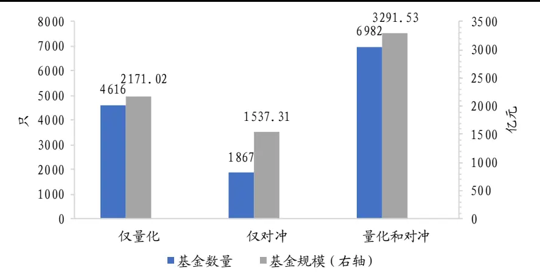
数据来源：中国证券投资基金业协会，国泰君安证券研究

但是 2021 年 9 月中旬以来，国内明星量化私募产品遭遇了一轮大面积回撤，部分甚至创出历史最大回撤。私募排排网数据显示，指数增强产品中 2021年以来有回撤的品种的年内最大回撤平均值为 9.49%，其中82只指数增强产品最大回撤超过 10%；市场中性策略产品中，2021 年以来有回撤的品种年内最大回撤平均值为 4.97%，其中 73 只市场中性策略产品最大回撤超过 10%。

对于这一次量化策略收益下降，除了市场环境多变和资金的季节性以外，市面上一些观点将其归因于量化策略的趋同。这一点不无道理：根据市场有效假说，只要有足够多的投资者套利就可以使市场达到有效，从而消除套利机会。由于量化策略的可复制性，量化投资者会普遍采用少数几个在当前市场上有效的策略，投资策略的趋同也将导致策略未来收益的下降。

这种投资者采取相同策略的现象可以称为“策略的拥挤”。那么我们应该如何衡量 一个策 略的拥 挤程度呢 ？《Standing Out From the Crowd:Measuring Crowding in Quantitative Strategies》一文提供了一套自下而上衡量量化策略拥挤程度的框架，通过卖空需求差异和股票联动现象从两个角度构建策略拥挤程度指标，对投资具有一定的启示意义。

## 2. 核心结论

量化策略着眼于挖掘市场异象带来的超额收益，而根据市场有效假说，量化交易者的套利行为会缩小并最终消除市场异象的套利机会。随着市场异象逐渐成为市场共识，量化投资者希望采取相同的策略从这超额收益中分一杯羹。如果一个策略是拥挤的，那么没有人能够通过这一策略获得很高的超额收益。

文章提出了一套衡量量化投资策略拥挤程度的框架，包括两个互补的方法：一是通过卖空需求差异衡量市场多空交易者（套利者）对不具吸引力股票的额外卖空需求，二是通过股票联动现象衡量多头交易者的相似交易行为。

两个方法角度不同，但对于量化策略在不同时段的拥挤情况的结论基本一致。文章着重于分析 2008 年金融危机前后价值策略、动量策略的拥挤情况，结果表明在危机之前，几种策略的拥挤程度较高；在危机发生后，策略的拥挤程度大幅下降至不显著区间；随后逐渐恢复至危机前的水平。

## 3. 文章背景

2008 年金融危机之后，量化投资者发现一些经典的量化策略并不像之前那么有效，例如价值策略和动量策略。市场对此的普遍认识是，大量投资者正在使用相同的量化策略，策略因此变得过于拥挤，导致大部分的策略收益被套利掉了。

文章因此提出了一套衡量量化策略拥挤程度的框架，包括两个互补的视角，分别从卖空需求差异和股票联动现象入手分析投资者相似的交易行为。文章以此分析了 2008 年金融危机和 2007 年量化危机前后经典量化策略的拥挤程度，文章关注的量化策略主要是价值策略和动量策略。

## 4. 量化策略的拥挤程度

本节构建了两种具有互补性的指标衡量量化策略的拥挤程度，一是通过卖空需求差异衡量市场多空交易者（套利者）对不具吸引力股票的额外卖空需求，二是通过股票联动现象衡量多头交易者的相似交易行为。

## 4.1. 卖空需求差异

量化策略的多空组合从股票池中筛选出最具吸引力和最不具吸引力的股票组合。文章认为，对于任意一种量化策略而言，如果市场对最不具吸引力的股票的做空需求比具有吸引力的股票高得多，则表明策略的拥挤程度更高（即套利者正在广泛应用这种策略）。

本节借助个股卖空需求数据，分析了经典量化策略下具有吸引力和不具吸引力的股票之间的平均卖空需求差异，以此衡量经典量化策略的拥挤程度。结果表明，价值策略和动量策略在 2008 年危机之前较为拥挤，在危机期间拥挤程度下降并在危机后逐渐上升。

个股卖空数据来自于 DataExplorers。文章使用类似于 Hanson 和 Sunderam（2012）的横截面回归框架来衡量卖空需求的差异。对于某一量化策略，按照因子排序股票，等分为十个组合；并且使最具吸引力的个股位于 q=1的组合中，使最不具有吸引力的个股处于 q=10 的组合中。

回归模型如下所示：

$$
U_{i,t}=c+\sum_{j=1}^{J}\sum_{q=2}^{q}\beta_{t,j,q}D_{i,t,j,q}+\sum_{q=2}^{Q}\beta_{t,size,q}D_{i,t,size,q}+\sum_{q=2}^{Q}\beta_{t,\sigma,q}D_{i,t,\sigma,q}+\sum_{q=2}^{Q}\beta_{t,r_{t-1},q}D_{i,t,r_{t-1},q}+\varepsilon_{i,t}
$$

其中因变量和各虚拟变量的含义如表 1 所示，在回归中控制个股市值、波动率和上一期收益率。上面的公式未加入 q=1 的虚拟变量，以此区分最不具吸引力和最具吸引力的股票。

表 1：卖空需求回归模型变量表

| 类别 | 变量 | 含义 |
| --- | --- | --- |
| 因变量 | $U_{i,t}$ | 个股i 在时间t 的利用率：在t 时刻卖空股票的总数除 以可借用的股票库存总量。 |
| 自变量 | $D_{i,t,j,q}$ | 虚拟变量，表示股票i在时间t时是否处于因子j的第 q 个分位数 |
| 控制变量 | $D_{i,t,size,q}$ | 虚拟变量，表示股票i在时间t 时是否处于市值的第q 个分位数 |
|  | $D_{i,t,\sigma,q}$ | 虚拟变量，表示股票i在时间t时是否处于波动率的第 q 个分位数 |
|  | $D_{i,t,r_{t-1},q}$ | 虚拟变量，表示股票i在时间t时是否处于上一期价格 |
|  |  | 的第 q 个分位数 |

数据来源：《Standing Out From the Crowd: Measuring Crowding in Quantitative
Strategies》，国泰君安证券研究

文章使用上述方法分析了价值策略和动量策略的拥挤程度。文章将价值定义为滚动过去 12 个月的 E/P（E2P），将动量定义为过去 12 个月总收益减去过去 1 个月总收益（PM12）。这两个策略在 2006-2013 年的拥挤程度变化情况如图 1 所示，股票池为 Russell 3000。

图 2 表明，在 2007 年“量化危机”之前，价值策略（E2P）和动量策略（PM12）的拥挤程度较高且十分显著。在次贷危机之前，两个策略的平均收益率约为 13%；在 2008 年 Q3 危机爆发后，投资者快速降低杠杆率导致策略收益率下降。

图 2：基于卖空需求差异的价值策略和动量策略拥挤程度（股票池：Russell 3000）
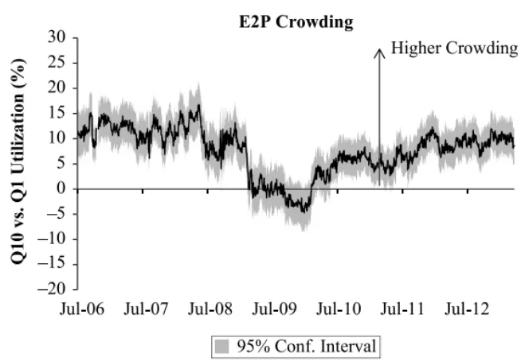

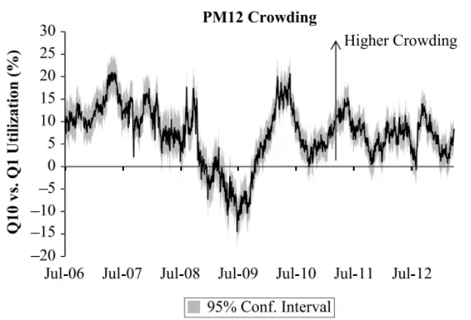
数据来源：《Standing Out From the Crowd: Measuring Crowding in Quantitative Strategies》。注：纵轴可以理解为无吸引力股票和有吸引力股票之间的卖空需求的差异，差异越大则策略拥挤情况越高。图中灰色区域为 95%置信区间，下同。

在危机最严重的时期，价值策略（E2P）并未出现显著的拥挤现象，动量策略（PM12）在波动之后，拥挤度指标呈现出负值，表明投资者实际上更多地做空过去上涨幅度最高的股票。动量策略出现的反转不无道理，在牛市末期收益较高的股票具有更高的风险，投资者不愿在危机时期继续持有这些股票。

在危机后的几年里，价值策略（E2P）的拥挤程度稳步回升，到 2012 年末基本回到危机前的水平。相比之下，动量策略（PM12）的拥挤程度波动较大，反映了市场在“风险承担”和“风险规避”之间摇摆不定：每当投资者风险偏好下行时，投资者就不愿继续持有之前上涨过多的股票，因而动量策略的拥挤程度就会下降。

仅考虑大市值股票时结果有所区别，图 3 展示了股票池为 Russell 1000时两个策略拥挤程度的变化。结果表明，策略拥挤程度的总体变化过程保持一致，危机前时期的策略拥挤程度高于危机后时期；但在大盘股中这两个策略的拥挤程度在 2008 年 9 月（雷曼兄弟倒闭）时大幅上升，表现出对大市值股票的追捧。

图 3：基于卖空需求差异的价值策略和动量策略拥挤程度（股票池：Russell 1000）
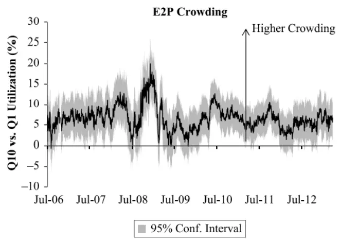

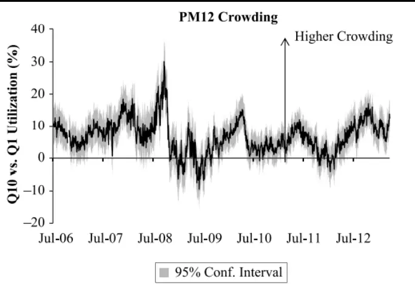
数据来源：《Standing Out From the Crowd: Measuring Crowding in Quantitative Strategies》

## 4.2. 股票联动现象

上一节的方法要求投资者进行多空双向交易，而现实中很多基金经理只需要考虑长期投资，因而这种方法并不完全适用。本节提出了一种仅考虑做多的方法，通过衡量一篮子股票之间的联动现象来分析量化策略的拥挤程度。

文章认为，如果一个策略是拥挤的，那么有吸引力的股票之间的联动现象应该更显著。投资者将这一部分股票作为整体交易，而不是作为单一证券进行交易，因此这些股票之间的相关性会增加。当这一部分股票打包成 ETF 或互换时，这些股票之间的联动现象应该更加明显。

文章着重于分析日内的联动现象，本节衡量股票联动的方法如下。考虑到分钟级数据对个股流动性的要求比较高，本节的分析仅针对 Russell1000 成分股。

1. 在时间点 t，统计 Russell 1000 指数成分股过去 21 个交易日的一分钟收益（包括隔夜收益）。美国交易日有 390 个一分钟时段，加上隔夜收益，每只股票共有 391×21=8211 个分钟级收益数据。

2. 使用 CAPM 模型将个股分钟级数据与等权市场组合收益率回归，取残差作为个股特质性收益率，以保证与 4.1 节结果的可比性。

3. 按照策略所用因子将股票池等分十组，选取最有吸引力的那一组。（例如如果因子是 E2P，则选择 E2P 得分最高的 10%；如果因子是PM12，则选择过去收益最高的 10%。）

4. 使用第 2步的个股特质性收益计算第 3步组合中两两组合的收益相关性，然后计算两两组合相关性的中位数（MPC）。

5. 生成 1000 个随机投资组合，组合包含的股票数量与第 3 步的投资组合相同。重复第 4 步的过程，得到 1000 个 MPC，计算其 95%置信区间。

通过上述过程，可以得到策略做多组合的联动程度和市场平均联动程度，如图 3 所示，若策略做多组合的联动程度（黑线）向上超出市场联动程度的 95%置信区间（灰色带），则认为该策略是拥挤的（即策略被广泛使用）。

图 4 表明，在大市值股票中，价值策略（E2P）在 2008 年 9 月出现显著的拥挤现象，并一直持续到 2010 年年中。动量策略（PM12）则从 2007年年中就出现了显著的拥挤现象，在 2008 年 8 月达到最高，随后快速下降并在危机后时期反复出现策略拥挤的情况。这些结论与 4.1 节的结论基本一致。

图 4：基于股票联动的价值策略和动量策略拥挤程度（股票池：Russell 1000）
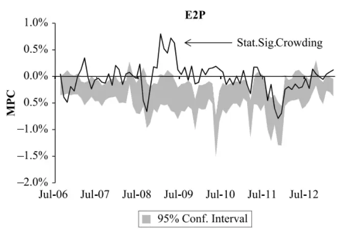

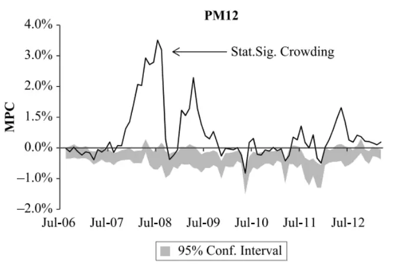
数据来源：《Standing Out From the Crowd: Measuring Crowding in Quantitative Strategies》

## 4.3. 两种方法的比较

为了便于比较上述两种方法，文章对 4.2 节构建的股票联动指标（MPC）进行修正，将策略做多组合的 MPC除以同期1000个随机组合的平均值，构建相对联动指标（RMPC）。

两种拥挤指标在价值策略和动量策略上的对比情况如图 5 所示，灰色带表示两个指标均显示存在显著拥挤的时间段。图 5 的结果表明，两种策略拥挤指标尽管从不同角度处理问题，但得到的结论十分相似：对于价值策略（E2P）而言，从 2007 年 7 月到 2008 年 Q3 策略拥挤程度较高，而在 2008 年危机之后下降；对于动量策略（PM12）而言，两个指标均在 2008 年 Q3 急剧上升见顶，然后随着投资者风险偏好下降而快速下降。

图 5：两种拥挤指标在价值策略和动量策略上的对比（股票池：Russell 1000）
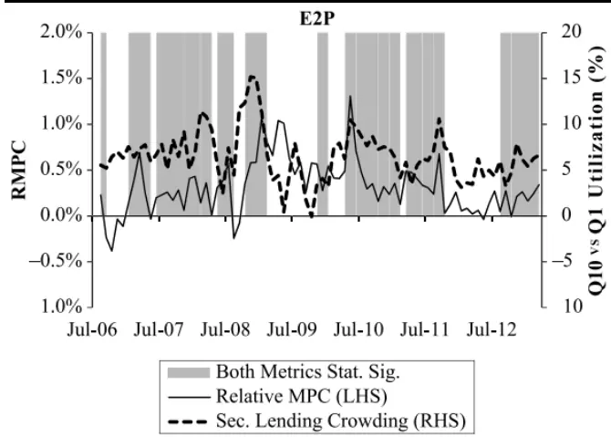

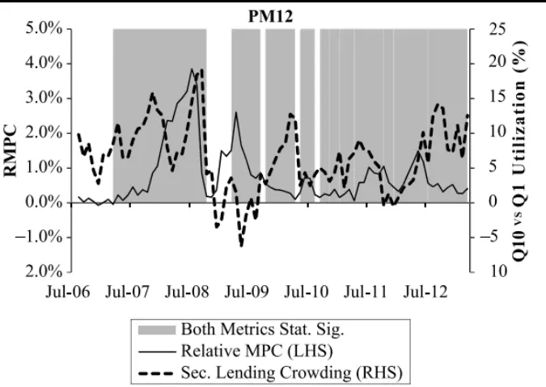
数据来源：《Standing Out From the Crowd: Measuring Crowding in Quantitative Strategies》

两个指标也存在一些不同的时期，考虑到两者视角的不同，这种差异也是合理的。基于卖空需求差异的指标关注具有吸引力股票和不具吸引力股票之间的差异，基于股票联动的指标关注有吸引力股票内部情况。文章指出，应该考虑研究问题的实际情况而选取适合的方法。例如，目前（2013 年）流行的策略是低波动策略，即购买波动率（或贝塔系数）高于市场的股票。这种策略基本上只考虑多头，因此使用基于股票联动的指标是有意义的。又例如，如果想衡量市场中性的多因素模型策略的拥挤程度，应当使用基于卖空需求差异的指标。

文章指出，应当仔细考虑每种方法需要控制那些变量。在基于卖空需求差异的指标中，文章控制了市值、波动率和上一期的收益；在基于股票联动的指标中，文章控制了市场 beta。在这一方面需要进一步的敏感性分析，以避免其他因素的干扰。例如，低价股的平均波动性往往较低，因此需要在价值策略中控制波动率因素；又例如，次贷危机期间低价股往往是违约风险较高的股票（文章尚未控制违约风险因素），因此该时期价值策略拥挤程度较低也不排除只是反映了对违约风险较高的银行股的追捧。

## 4.4. 多因素量化策略

尽管价值和动量是许多量化模型的主要成分，但绝不是量化投资者使用的唯一因素。因此，本节考虑以下六个因素：价值（E2P）、动量（PM12）、1 个月反转（RE1）、3 个月一致预期收益修正（ER3）、资本收益率（ROE）和每股收益同比增长（GRO）。在对每个变量归一化之后，文章通过对六个因素等权构建了一个简单的多因素模型（MFM）。

图 6 左图展示了每个时期显示显著拥挤的单变量的个数，右图展示了多因子模型策略下两种拥挤指标在不同时期的变化情况。

图 6 的结果表明，本节构建的六因素模型策略在 2006-2013 年的大部分时间里都表现出明显拥挤；2009 年策略拥挤程度大幅下降，大多数量化基金经理业绩不佳、基金赎回增加；2012-2013 年策略拥挤程度下降至不显著的水平，与上文中价值策略和动量策略的情况一致。

图 6：六因素量化策略的拥挤程度（股票池：Russell 1000）
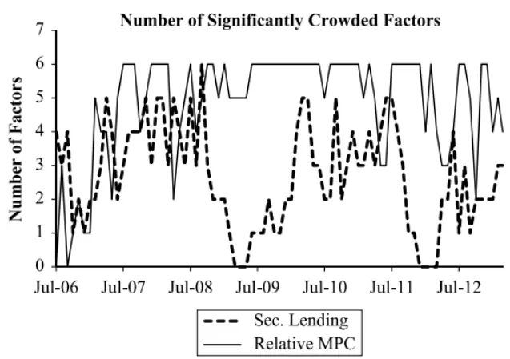

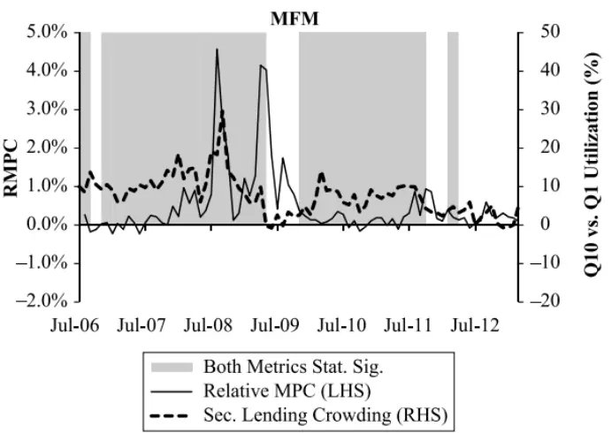
数据来源：《Standing Out From the Crowd: Measuring Crowding in Quantitative Strategies》

## 4.5. 2007 年“量化危机”的启示

许多常见的量化因子在 2007 年 8 月的前两周遭受了猛烈的回撤，事后的普遍共识是将回撤归因于去杠杆化造成的螺旋式下跌（Khandani和 Lo，2011）。文章借助这段时期分析策略拥挤指标的有效性，表明文章构建的指标确实可以反映策略拥挤程度。由于时间区间较短，本节的分析仅使用基于卖空需求差异的指标（4.1 节）。

图 7 中的灰色条表示因子的日度 IC 表现，实线和虚线分别衡量了在Russell 3000 和 Russell 1000 股票池中的价值策略和动量策略的拥挤情况。

图 7 的结果表明，在 2007 年 8 月的前两周，价值策略（E2P）和动量策略（PM12）的拥挤程度均较高，随后拥挤程度大幅下降：8 月 13 日价值策略拥挤程度下降 5个标准差，8 月9 日动量策略拥挤程度下降3.5个标准差。这一结果支持去杠杆化的投资故事。在 2007 年 8 月中旬之后两个策略的拥挤程度快速回升至量化危机前水平，表明量化投资者在事后重新考虑了这些因素并继续采用这两个经典策略。

图 7：2007 年 7-8 月“量化危机”期间策略的拥挤情况变化（股票池：Russell 1000 和 Russell 3000）
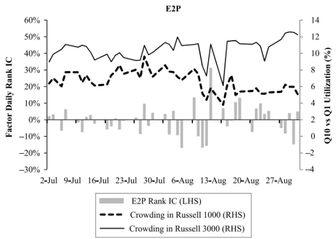

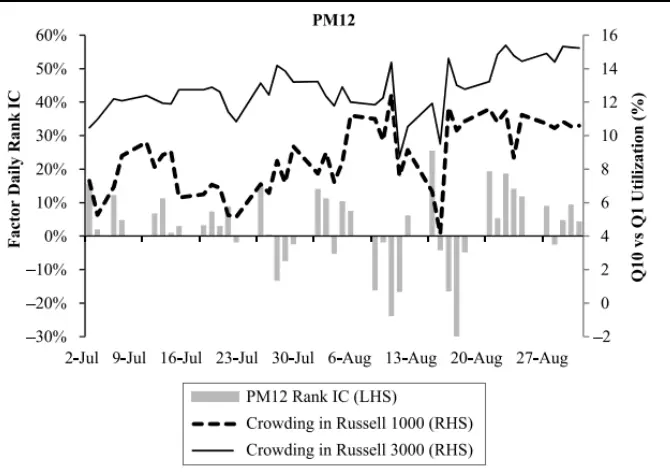
数据来源：《Standing Out From the Crowd: Measuring Crowding in Quantitative Strategies》

## 5. 稳健性检验

本节检验第 4 节构建的指标对各种因素的稳健性。

图 8 展示了在基于卖空需求差异的模型（4.1 节）中去掉控制变量的结果。对于价值策略（E2P），去除控制变量会明显增加策略拥挤程度，但时间序列的变化模式是相似的；对于动量策略（PM12），去掉控制变量的影响不大。这一结果表明模型选择的控制变量都是必要的。

图 9 表明五分位分组和十分位分组对结果的影响不大。文章设想隔夜收益较大，因而可能主导了股票之间的相关性，但图 10 表明，忽略隔夜回报时的结果几乎没有差异。图 11 表明，使用均值整体上影响不大，但受到极端值的影响往往会产生更大的结果。

图 8：在基于卖空需求差异的模型中去掉控制变量
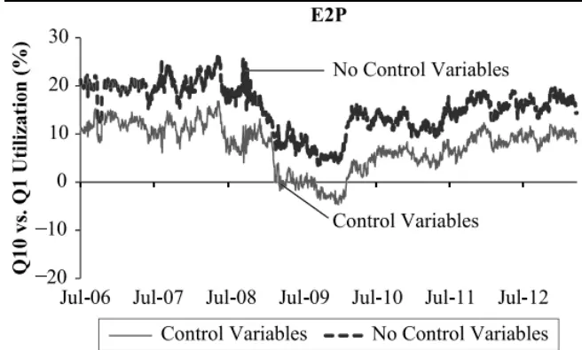

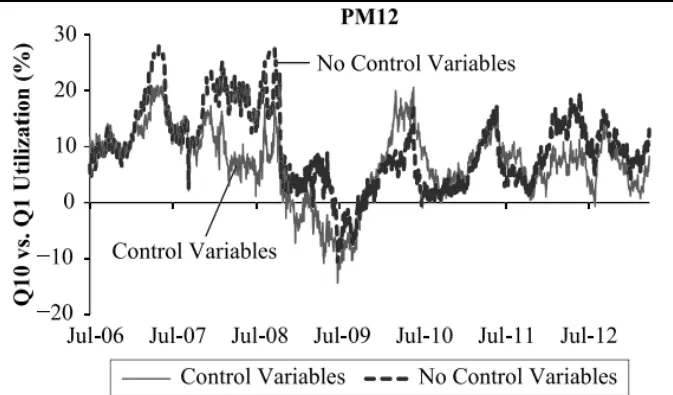
数据来源：《Standing Out From the Crowd: Measuring Crowding in Quantitative Strategies》

图 9：在基于卖空需求差异的模型中使用五分位分组
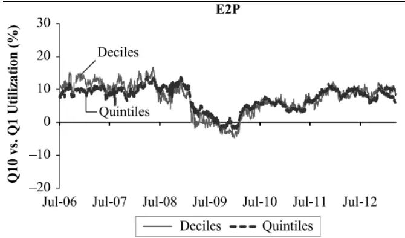

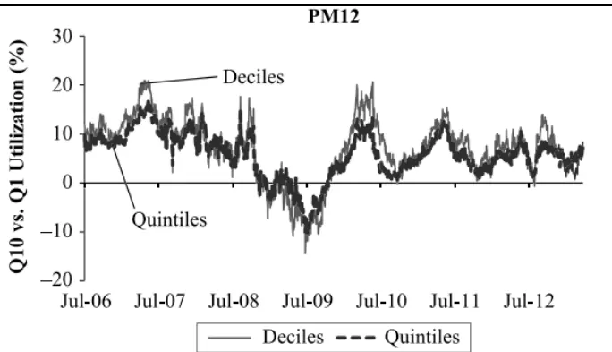
数据来源：《Standing Out From the Crowd: Measuring Crowding in Quantitative Strategies》

图 10：在基于股票联动的模型中去除隔夜收益
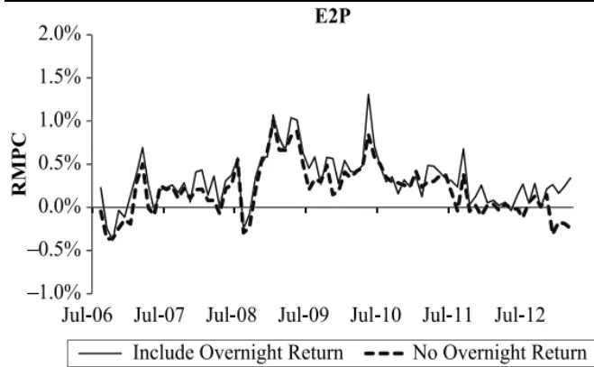

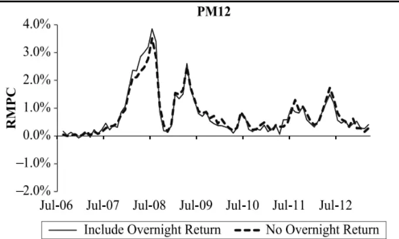
数据来源：《Standing Out From the Crowd: Measuring Crowding in Quantitative Strategies》

图 11：在基于股票联动的模型中使用平均值
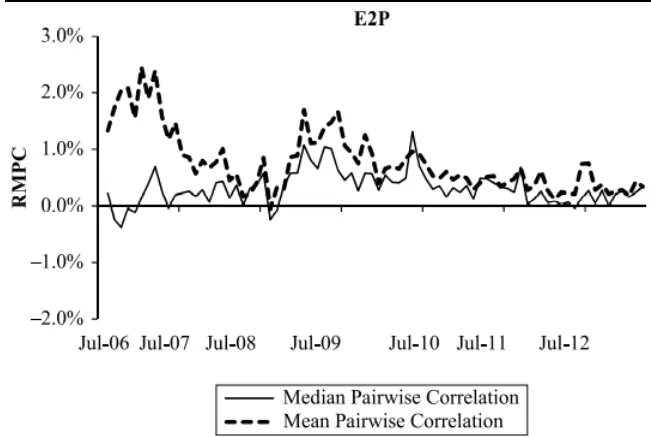

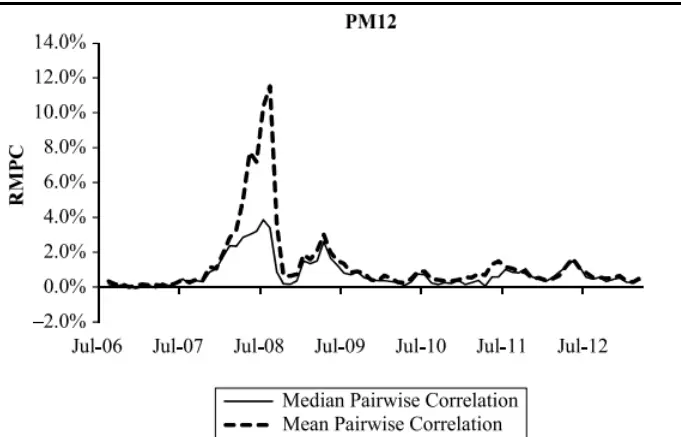
数据来源：《Standing Out From the Crowd: Measuring Crowding in Quantitative Strategies》

## 6. 结论

## 6.1. 文章结论

文章提出了一套几乎可以实时衡量量化投资策略拥挤程度的框架，包括两个互补的方法：一是通过卖空需求差异衡量市场多空交易者（套利者）对不具吸引力股票的额外卖空需求，二是通过股票联动现象衡量多头交易者的相似交易行为。两个方法角度不同，但量化策略在不同时段的拥挤情况的结论基本一致。通过 2007 年量化危机的事件分析，文章认为这一套框架的确可以衡量策略的拥挤情况。

文章分析了 2006-2013 年价值策略、动量策略和六因素模型策略的拥挤情况，结果表明在 2008 年次贷危机之前，几种策略的拥挤程度较高；在危机发生后，策略的拥挤程度大幅下降至不显著区间；随后逐渐恢复至危机前的水平。

文章希望未来将研究重点放在（因子）策略拥挤与后续因子表现之间的关系。如果基于某个因子构建的量化策略当前表现出拥挤的现象，那么未来这个策略的表现是好是坏？答案并不简单。文章认为，一些因子的效果取决于投资者类别。例如，当投资者都在买卖相同的股票时，动量策略的收益应该会更好；而如果投资者已经准备通过套利消除市场错误定价，那么未来这一策略的收益可能更早。文章认为这些都是未来值得研究的有趣问题。

## 6.2. 我们的思考

2008 年的金融危机之后，投资者在进行投资决策时更加注重了风险控制。量化投资者在策略上的选择更加谨慎，也导致了市场量化策略的趋同。我国目前量化私募基金的数量和规模快速扩张，在投资策略的选择上不免面临策略拥挤的问题；在交易趋同的环境中，策略选择面临抉择：比别人更快还是比别人更好？

“比别人更快”意味着在相同的信息和策略上，率先抢占定价误差的套利区间。这样的思路理论上是可行的，但仍存在两个问题：一是随着计算机硬件的发展和算法的进步，一些交易机器的反应速度已经可以达到毫秒级甚至更快，提升速度带来的红利正在逐渐消退；二是依靠反应速度的交易往往伴随着赢者通吃和赢者诅咒，未能抢占先机的投资者难以从市场异象中获利，抢占先机的投资者由于付出额外成本收益也会下降。

“比别人更好”更加看重策略的质量，在市场策略拥挤时更需要独特的选股能力，通过与众不同的策略发掘市场尚未充分认识的投资机会也是未来量化投资发展的重要方向。

此外，文章的结果显示在熊市期间价值和动量策略拥挤程度不高，表明牛市期间行之有效的量化策略在熊市期间并不一定适用，投资者纷纷抛弃了价值和动量策略。我们并不能事前得知下一阶段是牛市还是熊市，因此在量化策略的选择上，仍需兼顾稳健性和跨周期收益能力。

## 本公司具有中国证监会核准的证券投资咨询业务资格

## 分析师声明

作者具有中国证券业协会授予的证券投资咨询执业资格或相当的专业胜任能力，保证报告所采用的数据均来自合规渠道，分析逻辑基于作者的职业理解，本报告清晰准确地反映了作者的研究观点，力求独立、客观和公正，结论不受任何第三方的授意或影响，特此声明。

## 免责声明

本报告仅供国泰君安证券股份有限公司（以下简称“本公司”）的客户使用。本公司不会因接收人收到本报告而视其为本公司的当然客户。本报告仅在相关法律许可的情况下发放，并仅为提供信息而发放，概不构成任何广告。

本报告的信息来源于已公开的资料，本公司对该等信息的准确性、完整性或可靠性不作任何保证。本报告所载的资料、意见及推测仅反映本公司于发布本报告当日的判断，本报告所指的证券或投资标的的价格、价值及投资收入可升可跌。过往表现不应作为日后的表现依据。在不同时期，本公司可发出与本报告所载资料、意见及推测不一致的报告。本公司不保证本报告所含信息保持在最新状态。同时，本公司对本报告所含信息可在不发出通知的情形下做出修改，投资者应当自行关注相应的更新或修改。

本报告中所指的投资及服务可能不适合个别客户，不构成客户私人咨询建议。在任何情况下，本报告中的信息或所表述的意见均不构成对任何人的投资建议。在任何情况下，本公司、本公司员工或者关联机构不承诺投资者一定获利，不与投资者分享投资收益，也不对任何人因使用本报告中的任何内容所引致的任何损失负任何责任。投资者务必注意，其据此做出的任何投资决策与本公司、本公司员工或者关联机构无关。

本公司利用信息隔离墙控制内部一个或多个领域、部门或关联机构之间的信息流动。因此，投资者应注意，在法律许可的情况下，本公司及其所属关联机构可能会持有报告中提到的公司所发行的证券或期权并进行证券或期权交易，也可能为这些公司提供或者争取提供投资银行、财务顾问或者金融产品等相关服务。在法律许可的情况下，本公司的员工可能担任本报告所提到的公司的董事。

市场有风险，投资需谨慎。投资者不应将本报告作为作出投资决策的唯一参考因素，亦不应认为本报告可以取代自己的判断。
在决定投资前，如有需要，投资者务必向专业人士咨询并谨慎决策。

本报告版权仅为本公司所有，未经书面许可，任何机构和个人不得以任何形式翻版、复制、发表或引用。如征得本公司同意进行引用、刊发的，需在允许的范围内使用，并注明出处为“国泰君安证券研究”，且不得对本报告进行任何有悖原意的引用、删节和修改。

若本公司以外的其他机构（以下简称“该机构”）发送本报告，则由该机构独自为此发送行为负责。通过此途径获得本报告的投资者应自行联系该机构以要求获悉更详细信息或进而交易本报告中提及的证券。本报告不构成本公司向该机构之客户提供的投资建议，本公司、本公司员工或者关联机构亦不为该机构之客户因使用本报告或报告所载内容引起的任何损失承担任何责任。

## 评级说明

## 1.投资建议的比较标准

投资评级分为股票评级和行业评级。以报告发布后的 12 个月内的市场表现为比较标准，报告发布日后的 12 个月内的公司股价（或行业指数）的涨跌幅相对同期的沪深 300 指数涨跌幅为基准。

## 2.投资建议的评级标准

报告发布日后的 12 个月内的公司股价（或行业指数）的涨跌幅相对同期的沪深300 指数的涨跌幅。

| 评级 |  | 说明 |
| --- | --- | --- |
| 股票投资评级 | 增持 | 相对沪深 300指数涨幅15%以上 |
|  | 谨慎增持 | 相对沪深 300指数涨幅介于5%～15%之间 |
|  | 中性 | 相对沪深300指数涨幅介于-5%～5% |
|  | 减持 | 相对沪深300 指数下跌 5%以上 |
| 行业投资评级 | 增持 | 明显强于沪深 300指数 |
|  | 中性 | 基本与沪深 300指数持平 |
|  | 减持 | 明显弱于沪深300指数 |

## 国泰君安证券研究所

|  | 上海 | 深圳 | 北京 |
| --- | --- | --- | --- |
| 地址 | 上海市静安区新闸路669 号博华广 场20层 | 深圳市福田区益田路6009号新世界 商务中心34层 | 北京市西城区金融大街甲9号金融 街中心南楼18层 |
| 邮编 | 200041 | 518026 | 100032 |
| 电话 | （021）38676666 | （0755）23976888 | (010)83939888 |
|  | E-mail: gtjaresearch@gtjas.com |  |  |