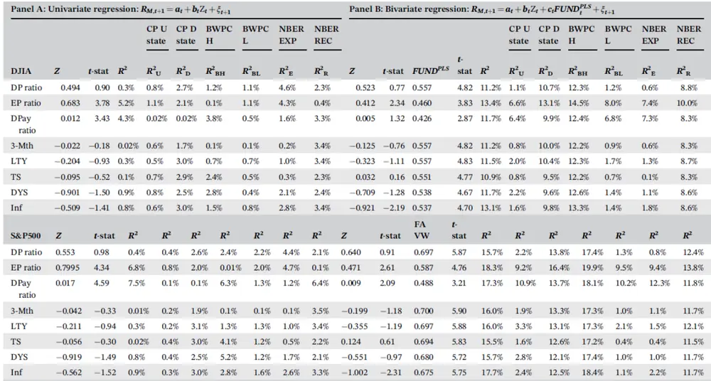

nInfo] [Table_Title] 2021.11.16

# 基本面指数化与市场超额回报率的预测

## ——学界纵横系列之二十四

陈奥林(分析师)

## 徐浩天(研究助理)

8 021-38674835

021-38038430

chenaolin@gtjas.com

xuhaotian@gtjas.com

证书编号 S0880516100001

S0880121070119

## 本报告导读：

作者构建了一个能够刻画基本面信息的指数FUNDPLS，并证明该指数对市场超额回报率有较显著的预测能力。

## 摘要：

le_Summary]作者通过 Partial least squares (PLS)的方法，结合 Piotroski(2000) 所选取的能够代表公司基本面信息的 10 个财务指标，构建出了一个新的基本面指数FUNDPLS。这种方法减少了财务指标中异质性（Idiosyncratic error），并显著提高指数对市场超额回报的预测能力。

作者利用美国市场所有的股票数据，证明该指数对市场超额回报率有显著的预测能力。并通过比较发现，FUNDPLS的预测能力显著优于Piotroski（2000）建议的总财务评分指数FUNDPIOT以及同等加权的财务价值指数FUNDEW。

值得注意的是，FUNDPLS对市场超额回报的解释力在市场下行时期，市场情绪高涨时期，或者经济萧条周期中尤为显著。

为了结果的严谨与正确，作者进行了样本外检验、控制相关经济变量的二元回归检验和长期预测能力的检验。可喜的是，FUNDPLS的预测能力仍是显著的。

金融工程

## 金融工程团队：

陈奥林：（分析师）

电话：021-38674835

邮箱：chenaolin@gtjas.com

证书编号：S0880516100001

杨能：（分析师）

电话：021-38032685

邮箱：yangneng@gtjas.com

证书编号：S0880519080008

## 殷钦怡：（分析师）

电话：021-38675855

邮箱：yinqinyi@gtjas.com

证书编号：S0880519080013

## 徐忠亚：（分析师）

电话：021- 38032692

邮箱：xuzhongya@gtjas.com

证书编号：S0880120110019

## 刘昺轶：（分析师）

电话：021-38677309

邮箱：liubingyi@gtjas.com

证书编号：S0880520050001

## 赵展成：（研究助理）

电话：021-38676911

邮箱：Zhaozhancheng@gtjas.com

证书编号：S0880120110019

## 张烨垲：（研究助理）

电话：021-38038427

邮箱：zhangyekai@gtjas.com

证书编号：S0880121070118

## 徐浩天：（研究助理）

电话：021-38038430

邮箱：xuhaotian@gtjas.com

证书编号：S0880121070119

## [Table_Re相关报告

如何评价量化策略拥挤度 2021.11.15

机构抱团与公司治理关系研究 2021.11.12

生猪贝塔机会加种业景气周期，关注农业ETF投资机会 2021.11.09

基本面量化：科技板块分子端优势强化2021.11.08

反转 最 优 化 下 的 因 子 靶 向 资 产 组 合2021.11.08

## 1. 选题背景

获取股票投资的超额收益是每一位投资者追求的最终目标，投资者们总是希望能利用上市公司的相关信息，洞悉公司过去的财务状况以及经营业绩，判断企业真实市场价值，全面掌握股价变动趋势，据此进行合理投资，获取超额收益。

对于量化投资者而言，通过量化公司的基本面信息，以预测超额收益率一直是量化研究的热点之一。本篇报告介绍的 Samuel YM Ze-To 的学术文章 《Fundamental index aligned and excess market return predictability》通过 Partial least squares (PLS)的方法，构建基本面指数FUNDPLS，以预测股票市场的超额回报率，为投资者们提供了一种新的量化思路。

## 2. 核心结论

作者通过 Partial least squares (PLS)的方法，结合 Piotroski (2000) 所选取的能够代表公司基本面信息的 10 个财务指标，构建出了一个新的基本面指数FUNDPLS，并运用美国市场的数据，证明该指数对市场超额回报率有显著的预测能力。

与将财务指标简单加总的FUNDPIOT (Piotroski, 2000)以及等权加总的指数FUNDEW相比，本文的基本面指数FUNDPLS无论在样本内或样本外预测，均具有更好的表现。

为排除伪相关的可能，作者控制了八个对回报率可能有预测能力的经济因素后，再对FUNDPLS的预测能力进行检验，发现结果仍是显著的。

最后，从长期预测能力上看，FUNDPLS对市场超额回报率的预测显著性高达 9 期。

## 3. 文章背景

一直以来，研究者们都在积极寻找能够预测股票收益率的因子。这些因子包括宏观经济因素、市场情绪、技术分析指标、基本面信息等等。 其中，基本面信息更是引起了学术界广泛的研究。研究表明，多种基本面特征均对收益率有预测能力，比如风险因素、流动性因素、价格水平等等。那么，随之而来的一个问题就是，如何综合这些因素以预测收益率呢？

Greenetal.（2017）的解决办法是，构建了一个同时含有这些因素的回归方程，因为他发现这些因素的线性相关关系很弱（ ）。但是这种方法显然会受到样本量及参数自由度的限制。因此，更为主流的方法是指数化（Indexation）。

本文即是使用了由 Wold（1966, 1975）提出并由 Kelly & Pruitt（2015）改进的 Partial Least Squares（PLS）方法，综合考虑了 10 主要的财务指标，从而构建出一个新的指数FUNDPLS，来预测市场的回报率。

## 4. 数据来源与指数构建

本文收集了来自纽约证券交易所和纳斯达克的所有股票的月度数据，时间跨度为 1997 年 1 月至 2018 年 11 月。相应的，市场超额回报率的计算方式为市场指数（包括道琼斯工业平均指数（DJIA）及标普 500（S&P500））减去无风险利率（美国国库券 3 月期利率）。

## 4.1. 基本面指数FUNDPLS的构建

首先，构建财务统计量 $\boldsymbol{S}_{j,t},$ ，该指标反映了公司j在时间t的财务状况。根据 Piotroski（2000）的方法，本文从盈利能力、财务杠杆及流动比率、股本发行和运营效率这五个维度，选取了能够衡量公司财务状况 10 个财务指标。接下来以 0 为临界点，对各指标打分，得到 10 个哑变量，最后将其加总。

表 1：统计量 $s_{j,t}$ 的构建

| Indicator |  | Notation | 大于0时 | 小于0时 |
| --- | --- | --- | --- | --- |
| 盈利能力 | Return on assets | ROA | 1 | 0 |
|  | Cash flow from operations | CFO | 1 | 0 |
|  | Accruals | ACC | 0 | 1 |
|  | Change of return on assets | ∆ROA | 1 | 0 |
|  | Return on equity | ROE | 1 | 0 |
|  | Change in gross profit margin | ∆GPM | 1 | 0 |
|  | 财务杠杆 change of leverage | ΔLEV | 0 | 1 |
| 流动比率 | change of Liquidity | ∆LIQ | 1 | 0 |
| 股本发行 | change of common equity | ΔEQ | 0 | 1 |
| 运营效率 | change of asset turnover | ΔATO | 1 | 0 |

数据来源：《Fundamental index aligned and excess market return predictability》

第二步，用 PLS 方法构建指数 $FUND^{PLS}$ 。其中，第一阶段的回归是用每一个公司的 $S_{j,t-1}$ 对超额市场回报率 $.R_{t}$ 进行时序回归：

$$
S_{j,t-1}=\alpha_{j,0}+\alpha_{j,1}R_{t}+\xi_{j,t-1}\tag{1}
$$

其中， $t=1,\ldots,T$ 。这样可以得到参数估计值 $\hat{\alpha}_{j}=\left(\hat{\alpha}_{j,0},\hat{\alpha}_{j,1}\right)^{\prime},j=$ $1,\ldots,N.$ 。其中 $\alpha_{j,1}$ 反映了 $R_{t}对$ 由 $S_{j,t-1}$ 构建的基本面指数的敏感程度。第二阶段的回归是用每个月的 $S_{j,t}$ 对刚刚得到的因子 $\hat{\alpha}_{j,1}$ 进行横截面回归：

$$
S_{j,t}=\gamma_{t}+FUND_{t}^{PLS}\hat{\alpha}_{j,1}+\psi_{j,t}\tag{2}
$$

其中， $j=1,\ldots,N.$ 。这样，我们就得到了基本面指数 $FUND_{t}^{PLS}$ 的估计值。公式（1）提取出 $S_{j,t-1}$ 与预测超额市场回报率 $.R_{t1}$ 相关的部分，并剔除了不相关的部分（Huang et al., 2015）

## 4.2. 基准指数

为了对比 $FUND^{PLS}$ 的预测能力，作者构建了以下指数作为基准。

表 2：基准指数

| 指数 | 定义 |
| --- | --- |
| $\boxed{FUND^{PIOT}}$ | 所有股票的 $S_{j,t}的$ 等权加总 |
| $FUND^{EW}$ | 首先计算每一个财务指标的平均值 $F_{EW},$ 再对各个 $\cdot F_{EW}$ 等权加总 |
| EW_Indicators | 对每个前文提到的每一个Indicator 直接等权平均 |
| VW_Indicators | 对每个前文提到的每一个Indicator市值加权平均 |

数据来源：国泰君安证券研究

综上所述，目前获得的指标及其描述性统计见表 3。

表 3: 描述性统计

| Name | Mean | Median | 1st | 25th | 75th | 99th | STD | SKEW | KURT | SR |
| --- | --- | --- | --- | --- | --- | --- | --- | --- | --- | --- |
| DJIA | 0.003 | 0.006 | -0.121 | -0.020 | 0.031 | 0.084 | 0.042 | -0.630 | 1.301 | 0.071 |
| S&P500 | 0.003 | 0.008 | -0.113 | -0.021 | 0.032 | 0.085 | 0.043 | –0.750 | 1.767 | 0.070 |
| $FUND^{PLS}$ | -0.002 | -4.9E-11 | -0.071 | -4.2E-06 | 9.9E-08 | 0.018 | 0.023 | -7.258 | 83.447 |  |
| FUNDPIOT | 3.239 | 3.163 | 1.201 | 2.859 | 3.724 | 4.430 | 0.745 | -0.544 | 0.304 |  |
| FUNDEW | 0.504 | -0.050 | -5.989 | -0.227 | 0.192 | 10.272 | 2.941 | 1.466 | 4.556 |  |
| VW_ACC | 0.0002 | -0.050 | -0.109 | -0.057 | –0.033 | 0.621 | 0.152 | 3.029 | 8.169 |  |
| VW_CFO | 0.091 | 0.125 | -0.447 | 0.114 | 0.128 | 0.163 | 0.115 | -3.718 | 13.582 |  |
| VW_ΔROA | –0.017 | 0.001 | –0.424 | -0.033 | 0.012 | 0.153 | 0.097 | -2.304 | 7.358 |  |
| VW_ΔLEV | -0.003 | -0.003 | -0.036 | -0.013 | 0.003 | 0.040 | 0.014 | 0.695 | 1.653 |  |
| VW\|_ΔLIQ | -0.024 | –0.017 | –0.312 | -0.051 | 0.013 | 0.130 | 0.085 | -4.157 | 30.568 |  |
| VW_ROA | 0.091 | 0.075 | 0.008 | 0.063 | 0.090 | 0.542 | 0.086 | 4.383 | 20.284 |  |
| VW_ΔEQ | 0.235 | 0.072 | 0.000 | 0.050 | 0.136 | 2.518 | 0.472 | 3.690 | 14.279 |  |
| VW_∆GPM | 0.004 | 0.002 | -0.071 | -0.0002 | 0.008 | 0.072 | 0.018 | -0.455 | 9.839 |  |
| VW_ΔATO | -0.074 | -0.041 | -0.584 | -0.098 | -0.0005 | 0.230 | 0.154 | -1.624 | 3.651 |  |
| VW_ROE | 0.195 | 0.214 | -0.272 | 0.168 | 0.246 | 0.649 | 0.192 | -1.816 | 10.614 |  |

数据来源：《Fundamental index aligned and excess market return predictability》

## 5. 实证分析

## 5.1. 超额市场回报率的预测

首先，作者检验了基本面指数 $FUND^{PLS_{\bar{\lambda}}}$ 对超额市场回报率 $.R_{t}$ 的预测能力。作者通过构建了以下回归方程，发现 $_{FUND^{PLS}\bar{x}}$ 对超额市场回报率 $R_{t}$ 的解释能力高达 11%，显著优于其他的指标。

$$
R_{t+1}^{M}=\alpha+\beta X_{t}+\varepsilon_{t+1}\tag{3}
$$

其中， $R_{t+1}^{M}$ 是超额市场回报率（股票市场指数（DJIA、S&P500）的对数月回报率减去无风险利率）， $X_{t}$ 是前文提到的基本面指数（包括FUNDPLS,FUNDPIOT, FUNDEW,EW_ Indicator, VW_ Indicator ）。回 归结果见表 4 的第 2-6 列。

表 4: 超额市场回报率的预测

|  |  |  |  |  | Full | Li U state | Li D state | BWPC H | BWPC L | Huang PLS H | Huang PLS L | NBER EXP | NBER REC |
| --- | --- | --- | --- | --- | --- | --- | --- | --- | --- | --- | --- | --- | --- |
| DJIA | Slope | t-stat | Intercept | t-stat | $\pmb{R}^{2}$ | $R_{\textbf{ U }}^{2}$ | $R_{\textbf{ D }}^{2}$ | $R_{\mathrm{~BH}}^{2}$ | $R_{\mathrm{\bf~BL}}^{2}$ | $R_{\mathbf{HH}}^{2}$ | $R_{\mathbf{HL}}^{2}$ | $\boldsymbol{R}_{\textbf{ E }}^{2}$ | $R_{\textbf{ R }}^{2}$ |
| FUNDPLS | 0.545 | 4.72 | 0.007 | 2.48 | 11.00% | 0.47% | 10.00% | 12.00% | 0.62% | 11.00% | 0.89% | 0.08% | 8.10% |
| FUNDPIOT | 0.0046 | 1.55 | -0.010 | –1.12 | 0.96% | 0.65% | 1.00% | 2.20% | 1.40% | 0.23% | 0.23% | 3.30% | 3.00% |
| FUNDEW | 0.0003 | 0.35 | 0.003 | 1.08 | 0.05% | 0.4% | 0.1% | 1.1% | 0.01% | 4.0% | 0.05% | 0.01% | 5.80% |
| EW_ACC | 0.00004 | 0.20 | 0.003 | 1.04 | 0.02% | 0.47% | 0.02% | 0.55% | 0.002% | 0.76% | 0.02% | 0.01% | 0.86% |
| EW_CFO | -0.00001 | -0.05 | 0.003 | 1.06 | 0.001% | 0.67% | 0.001% | 0.05% | 0.002% | 3.90% | 0.02% | 0.02% | 3.50% |
| EW_ΔROA | 0.002 | 1.47 | 0.004 | 1.34 | 0.91% | 0.70% | 0.90% | 2.50% | 0.06% | 3.50% | 0.001% | 0.01% | 3.60% |
| EW_ΔLEV | -0.0001 | -0.46 | 0.002 | 0.87 | 0.09% | 0.43% | 0.09% | 0.76% | 0.10% | 0.53% | 0.11% | 0.11% | 1.50% |
| EW_ΔLIQ | 0.0002 | 0.26 | 0.003 | 1.04 | 0.03% | 0.28% | 0.03% | 0.002% | 0.03% | 0.37% | 0.02% | 0.02% | 6.20% |
| EW_ROA | 0.002 | 1.30 | 0.004 | 1.41 | 0.68% | 0.18% | 0.68% | 4.00% | 0.03% | 4.80% | 0.001% | 0.05% | 4.40% |
| EW_ΔEQ | 0.0001 | 0.43 | 0.003 | 0.88 | 0.07% | 0.46% | 0.08% | 0.30% | 0.07% | 2.60% | 0.12% | 0.10% | 3.60% |
| EW_ΔMGN | 0.006 | 0.94 | 0.003 | 1.09 | 0.36% | 0.74% | 0.36% | 0.47% | 0.09% | 0.62% | 0.09% | 0.49% | 6.20% |
| EW_ΔATO EW_ROE | -0.001 | -1.23 | 0.002 | 0.64 | 0.64% | 0.10% | 0.64% | 0.20% | 0.39% | 1.90% | 0.21% | 0.33% | 2.20% |
|  | -0.0004 | -0.35 | 0.003 | 1.21 | 0.05% | 0.72% | 0.05% | 1.20% | 0.02% | 2.60% | 0.03% | 0.01% | 4.30% |
| S&P500 | Slope | t-stat |  | Intercept | t-stat | R² | $\mathbf{R}_{\mathbf{U}}^{2}$ | $R_{\mathrm{~\bf~D~}}^{2}$ | $R_{\mathbf{BH}}^{2}$ | $R_{\mathrm{\bf~BL}}^{2}$ $R_{\mathbf{HH}}^{2}$ | $R_{\mathbf{\nabla}\mathbf{H}\mathbf{L}}^{2}$ | $\mathbf{R}_{\textbf{ E }}^{2}$ | $R_{\mathrm{~\bf~R~}}^{2}$ |
| FUNDPLS | 0.685 | 5.76 | 0.007 |  | 2.57 | 15.00% | 0.39% | 15.00% | 17.00% | 0.34% 16.00% | 0.71% | 0.21% | 11.00% |
| FUNDPIOT | 0.0046 | 1.50 | -0.010 |  | -1.15 | 0.90% | 0.79% | 0.98% | 4.10% | 2.30% 0.85% | 0.74% | 3.10% | 2.90% |
| FUNDEW | 0.0003 | 0.30 | 0.0024 |  | 0.85 | 0.04% | 0.3% | 0.04% | 1.2% | 0.001% 6.0% | 0.02% | 0.01% | 6.80% |
| VW_ACC | -0.0004 | -0.02 | 0.003 |  | 0.92 | 0.001% | 0.84% | 0.004% | 0.70% | 0.09% | 0.02% 0.003% | 0.001% | 0.02% |
| VW_CFO | 0.013 | 0.53 | 0.001 |  | 0.39 | 0.11% | 0.88% | 0.13% | 1.20% | 0.74% 0.01% | 0.06% | 0.18% | 0.14% |
| VW_ΔROA | 0.022 | 0.76 | 0.002 |  | 0.74 | 0.24% | 1.20% | 0.20% | 2.30% | 0.00% 3.60% | 0.10% | 0.00% | 5.00% |
| VW_ΔLEV | 0.057 0.020 | 0.29 0.61 | 0.002 |  | 0.67 | 0.04% | 0.001% | 0.04% | 2.30% | 0.19% 3.30% | 0.52% | 0.13% | 6.20% |
| VW_ΔLIQ | 0.022 | 0.68 | 0.002 0.001 |  | 0.76 0.14 | 0.16% | 0.89% | 0.14% | 0.59% | 0.01% 0.09% | 0.08% | 0.09% | 0.16% |
| VW_ROA | 0.001 | 0.09 | 0.002 |  | 0.78 | 0.18% 0.00% | 0.90% 0.30% | 0.20% 0.002% | 0.40% 0.01% | 0.32% 0.001% 0.03% | 0.12% 0.002% | 0.32% 0.02% | 0.68% |
| VW_ΔEQ |  | 2.31 | 0.001 |  | 0.39 | 2.10% | 0.09% | 2.10% | 0.42% | 0.00% 4.10% | 2.30% |  | 3.90% |
| VW_ΔMGN | 0.3539 |  |  |  |  |  |  |  |  |  | 1.20% | 1.00% | 9.20% |

数据来源：《Fundamental index aligned and excess market return predictability》

接下来，作者检验了FUNDPLS的预测能力是状态独立的（statedependent）。根据 Li & Galvani（2018）的定义，将市场状态分为上行的（UP）和下行的（DOWN）。在此基础上，根据公式（4）重新估计R2统计量。

$$
R_{X}^{2}=1-\frac{\sum_{t=1}^{T}D_{X,t}\varepsilon_{X,t}^{2}}{\sum_{t=1}^{T}D_{X,t}\big(R_{M,t}-\overline{{R_{M}}}\big)^{2}}.\tag{4}
$$

其中， $X=UP,DOWN$ $D_{X,t}$ 是一个指示函数（当t时期的市场属于X状态时为 1，否则为 0）。 $\varepsilon_{X,t}^{2}$ 是回归式（3）的残差平方， $\overline{{R_{M}}}$ 是超额回报率 $\cdot R_{M,t}$ 的均值。估计结果见表 4 的第 7-8 列。数据显示， $FUND^{PLS}$ 在市场下行阶段表现出更有效的预测能力 $\left(R_{D}^{2}=10\%VSR_{U}^{2}=0.47\%\right)$ ）,并且这种状态的显著的差异是基准指数所不具备的。

相似的，作者也对 $FUND^{PLS}$ 的预测能力在不同的市场情绪、经济周期下进行了检验。估计结果见表 4 的第 9-14 列。数据显示， $FUND^{PLS}$ 在高涨的市场情绪、经济萧条时期能够表现出更有效的预测能力,并且这种状态的显著的差异是基准指数所不具备的。这个结论和已有的文献研究是相符的。

## 5.2. 样本外检验

接下来，作者将前五年的数据（2003 年 2 月-2008 年 1 月）作为训练集，剩下的数据（2008 年 2 月-2018 年 11 月）作为测试集，对 $FUND^{PLS}$ 的预测能力进行样本外检验。

首先运用训练集的数据按照公式（3）进行回归，得到参数的估计值α̃和$\tilde{\beta},$ ，接着用测试集的数据进行预测：

$$
\tilde{R}_{M,t+1}=\tilde{\alpha}_{t}+\tilde{\beta_{t}}X_{t}\tag{5}
$$

预测结果的检验则是选择了统计量 ${}^{\cdot}R_{OS}^{2}$ （Campbell & Thompson, 2008）、调整后的 MSFE（Clark & West, 2007）以及 CW test。预测结果见表 5。

表 5: 样本外检验

| DJIA | $R_{\mathrm{~os~}}^{2}$ | MSFE | CW test | $R_{\textbf{ U }}^{2}$ | MSFE | CW test | $R_{\mathrm{~\bf~D~}}^{2}$ | MSFE | CW test | $R_{\mathrm{~EXP}}^{2}$ | MSFE | CW test | $R_{\mathbf{REC}}^{2}$ | MSFE | CW test |
| --- | --- | --- | --- | --- | --- | --- | --- | --- | --- | --- | --- | --- | --- | --- | --- |
| FUNDPLS | 5.89% | 0.13% | 4.685 | 7.7% | 0.05% | 2.352 | 5.6% | 0.08% | 4.151 | 4.7% | 0.11% | 3.156 | 8.1% | 0.02% | 3.352 |
| FUNDPIOT | 9.16% | 0.13% | 3.368 | 13.0% | 0.05% | 2.562 | 10.0% | 0.08% | 3.510 | 11.9% | 0.10% | 2.793 | -8.3% | 0.02% | 3.548 |
| FUNDEW | 5.12% | 0.13% | 3.154 | 4.4% | 0.05% | 1,985 | 6.3% | 0.08% | 3.154 | 6.0% | 0.11% | 2.612 | -3.4% | 0.02% | 3.286 |
| EW_ACC | 4.51% | 0.13% | 3.158 | 3.9% | 0.05% | 2.020 | 6.0% | 0.08% | 3.298 | 5.1% | 0.11% | 1.917 | -2.3% | 0.02% | 0.427 |
| EW_CFO | 4.75% | 0.13% | 2.932 | 4.7% | 0.05% | 2.841 | 6.5% | 0.08% | 3.228 | 5.6% | 0.11% | 1.924 | -1.9% | 0.02% | 0.288 |
| EW_ΔROA | 1.88% | 0.14% | 2.052 | 6.2% | 0.05% | 2.651 | 1.0% | 0.08% | 1.487 | 3.6% | 0.11% | 1.578 | –14.9% | 0.02% | 1.726 |
| EW_ΔLEV | 9.76% | 0.13% | 2.664 | 7.6% | 0.05% | 2.061 | 12.1% | 0.07% | 3.176 | 8.8% | 0.11% | 1.949 | 13.8% | 0.02% | 1.766 |
| EW_ΔLIQ | 1.43% | 0.14% | 1.525 | 3.2% | 0.05% | 3.106 | 3.4% | 0.08% | 1.729 | 5.2% | 0.11% | 3.152 | -29.8% | 0.03% | -1.680 |
| EW_ROA | –5.65% | 0.15% | 1.237 | 3.4% | 0.05% | 1.767 | -4.6% | 0.09% | 1.296 | 4.2% | 0.11% | 2.942 | -48.8% | 0.03% | 2.245 |
| EW_ΔEQ | 4.31% | 0.13% | 2.353 | 4.2% | 0.05% | 2.216 | 6.8% | 0.08% | 3.064 | 5.6% | 0.11% | 1.976 | -1.8% | 0.02% | 0.742 |
| EW_ΔMGN | 5.82% | 0.13% | 2.821 | 9.9% | 0.05% | 3.207 | 1.3% | 0.08% | 1.945 | 9.1% | 0.11% | 2.715 | -20.4% | 0.03% | -0.934 |
| EW_ΔATO | -1.00% | 0.14% | 1.387 | 2.3% | 0.05% | 2.032 | 0.7% | 0.08% | 1.520 | 4.7% | 0.11% | 2.761 | -24.8% | 0.03% | 2.391 |
| EW_ROE | 1.40% | 0.14% | 1.472 | 5.0% | 0.05% | 2.714 | 1.3% | 0.08% | 1.840 | 6.5% | 0.11% | 1.861 | –27.9% | 0.03% | -1.326 |
| S&P500 |  |  |  |  |  |  |  |  |  |  |  |  |  |  |  |
| FUNDPLS | 6.3% | 0.15% | 5.015 | 7.7% | 0.05% | 2.352 | 5.6% | 0.08% | 4.151 | 4.7% | 0.11% | 3.156 | 8.1% | 0.02% | 3.352 |
| FUNDPIOT | 9.4% | 0.14% | 3.252 | 13.0% | 0.05% | 2.562 | 10.0% | 0.08% | 3.510 | 11.9% | 0.10% | 2.793 | -8.3% | 0.02% | 3.548 |
| FUNDEW | 5.7% | 0.15% | 3.730 | 4.4% | 0.05% | 1.985 | 6.3% | 0.08% | 3.154 | 6.0% | 0.11% | 2.612 | -3.4% | 0.02% | 3.286 |
| VW_ACC | 3.4% | 0.15% | 1.540 | 1.4% | 0.05% | 2.334 | 8.0% | 0.08% | 2.287 | 6.9% | 0.11% | 1.475 | -4.9% | 0.02% | -1.958 |
| VW_CFO | 7.7% | 0.14% | 3.325 | 6.2% | 0.05% | 2.810 | 6.7% | 0.08% | 3.455 | 6.3% | 0.11% | 2.218 | 5.4% | 0.02% | 5.869 |
| VW_ΔROA | 0.9% | 0.15% | 1.887 | 5.2% | 0.05% | 2.522 | 0.9% | 0.08% | 1.523 | 4.7% | 0.11% | 1.972 | -19.3% | 0.02% | 1.710 |
| VW_ΔLEV | -0.3% | 0.16% | 2.090 | 8.9% | 0.05% | 3.236 | -1.0% | 0.09% | 1.216 | 8.5% | 0.11% | 2.599 | -36.0% | 0.03% | 2.281 |
| VW_ΔLIQ | -2.5% | 0.16% | -0.328 | 7.1% | 0.05% | 2.549 | -5.0% | 0.09% | -0.787 | 3.2% | 0.11% | 3.866 | -24.5% | 0.03% | -1.188 |
| VW_ROA | 0.04% | 0.16% | 1.108 | 4.5% | 0.05% | 3.382 | -0.6% | 0.09% | 1.481 | 7.7% | 0.11% | 1.824 | -47.7% | 0.03% | -0.577 |
| VW_ΔEQ | 6.46% | 0.15% | 1.919 | 4.0% | 0.05% | 2.618 | 8.7% | 0.08% | 2.194 | 7.8% | 0.11% | 1.639 | -2.2% | 0.02% | -0.897 |
| VW_ΔMGN | 10.19% | 0.14% | 2.966 | 13.6% | 0.05% | 2.181 | 2.8% | 0.08% | 2.281 | 10.9% | 0.10% | 1.627 | –11.5% | 0.02% | 2.075 |
| VW_ΔATO | 0.21% | 0.16% | 1.339 | -2.9% | 0.06% | 0.469 | 3.8% | 0.08% | 2.380 | 3.0% | 0.11% | 1.589 | -14.4% | 0.02% 0.02% | 0.605 2.178 |

数据来源：《Fundamental index aligned and excess market return predictability》

数据显示， $FUND^{PLS}$ 的回归结果得到了正的 $R_{OS}^{2}$ 并且能够显著通过 CWtest。同时注意到，只有 $FUND^{PLS}$ 能够在经济萧条时期拥有正的 $R_{OS}^{2}$ 。由此可见， $FUND^{PLS}$ 的样本外预测能力胜过其他的基本面指数。

## 5.3. 控制经济因素

为了排除伪相关的可能，作者在这一节控制了八个对市场回报率有解释能力的经济变量（如下表），在此基础上再次检验 $FUND^{PLS}$ 的预测能力。

表 6：经济变量

| Indicator | Notation |
| --- | --- |
| Dividend yield ratio | DPratio |
| Earning-to-price ratio | EP ratio |
| Dividend payout ratio | DPay ratio |
| Treasury bill rate | 3-Mth |
| Long-term yield | LTY |
| Term spread | TS |
| Default yield ratio | DYS |
| Inflation rate | Inf |

数据来源：《Fundamental index aligned and excess market return predictability》

表 7: 控制经济变量的回归

数据来源：《Fundamental index aligned and excess market return predictability》

首先进行单变量回归：

$$
R_{M,t+1}=a_{t}+b_{t}Z_{t}+\xi_{t+1}\tag{6}
$$

其中， $Z_{t}$ 是上述八个经济变量之一。回归结果见表 7 的 PanelA。回归结果显示，EPratio 和 DPayratio 对超额市场回报率有较强的解释力（其 $\cdot R^{2}$ 都高于 4.3%）。

接下来进行二元回归：

$$
R_{M,t+1}=a_{t}+b_{t}Z_{t}+c_{t}FUND^{PLS}+\xi_{t+1}\tag{7}
$$

回归结果见表 7 的 PanelB。可以看到在控制了经济变量之后， $FUND^{PLS}$ 仍然对超额回报率具有显著的预测能力。

## 5.4. 长期预测能力

假定基本面对回报率的影响是持久的，作者在这一节对FUNDPLS的长期预测能力进行了检验。

以五年为窗口期，同样将数据分为测试集及训练集，进行样本内和样本外预测。下表说明了回归的结果。数据显示，FUNDPLS的系数在长达 9期的预测中仍是显著的，并且在 6 期的时候达到峰值 $(R^{2}=11.5\%)$ 与前文结论相似的是， $FUND^{PLS}$ 的预测能力依旧在市场下行状态中有更好的表现。

因此我们可以得出结论， $FUND^{PLS}$ 在长期中仍然对市场超额回报率有显著的预测能力。

表 8: 长期预测能力

|  | Slope | t- stat | t= Intercept | Full |  |  | state | Li D state | CP U state | CP D state | BWPC H | BWPC L | Huang PLS H | Huang PLS L° | NBER EXP | NBER REC |
| --- | --- | --- | --- | --- | --- | --- | --- | --- | --- | --- | --- | --- | --- | --- | --- | --- |
| DJIA $R_{t+1}$ | 0.545 | 4.72 |  | stat $R^{2}$ 2.48 10.7% | $R_{\mathrm{~os~}}^{2}$ 5.89% | $R_{\mathrm{\bf~LU}}^{2}$ 0.5% | $R_{\mathrm{\bf~LU}}^{2}$ 10.5% | $R_{\mathbf{cv}}^{2}$ 0.6% | $R_{\mathbf{\nabla}\mathbf{CD}}^{2}$ 9.3% | $R_{\mathbf{\nabla BH}}^{2}$ 12.1% | $R_{\mathrm{\bf~BL}}^{2}$ 0.6% | $R_{\mathbf{HH}}^{2}$ 11.2% | $R_{\mathrm{~HL}}^{2}$ |  | $R_{\textbf{ E }}^{2}$ | $\pmb{R}_{\textbf{ R }}^{2}$ |
| $R_{t+3}$ | 0.857 | 4.11 | 0.007 0.019 | 4.08 |  |  |  |  |  |  |  |  |  | 0.9% 0.3% | 0.1% 0.1% | 8.1% 8.4% |
| $R_{t+\;6}$ | 1.550 | 4.87 0.038 | 5.23 | 8.4% 11.5% | 7.46% 6.45% | 0.6% 0.1% | 8.2% 11.4% | 1.2% 2.6% | 6.0% 7.4% | 11.0% 14.1% | 0.2% 0.001% | 11.2% 13.6% | 0.2% |  |  | 11.1% |
| $R_{t+9}$ | 1.073 | 2.57 0.053 |  | 5.50 3.6% | 4.87% | 0.2% | 3.5% | 0.5% | 2.7% | 4.7% | 0.002% | 4.8% |  |  | 0.002% | 3.6% |
| Rt + 12 | 0.640 | 1.32 0.068 | 6.02 | 1.0% | 4.37% | 0.001% |  | 0.2% |  |  | 0.002% | 1.5% |  | 0.1% 0.2% | 0.02% | 1.1% |
| Rt + 24 | 0.764 | 1.11 0.126 | 7.81 | 0.7% | 3.08% | 0.001% | 1.0% 0.7% | 0.7% | 0.6% 0.1% | 1.7% 0.8% | 0.1% | 0.5% |  |  | 0.04% | 0.3% |
| S&P500 | Slope | t-stat | Intercept |  | t-stat | $\pmb{R}^{2}$ | $R_{\mathrm{~os~}}^{2}$ |  | $R_{\mathbf{\nabla}\mathbf{L}\mathbf{U}}^{2}$ | $R_{\mathbf{cv}}^{2}$ |  |  |  | 0.6% | 0.1% | $R_{\textbf{ R }}^{2}$ |
| Rt+ 1 | 0.685 | 5.76 | 0.0069 |  |  |  |  | $R_{\mathbf{\nabla}\mathbf{L}\mathbf{U}}^{2}$ |  | $R_{\mathbf{\nabla}\mathbf{CD}}^{2}$ | R BH | $R_{\mathrm{~\bf~BL}}^{2}$ | RHH | R2HL | R²E |  |
|  | 1.114 | 4.99 | 0.020 | 2.57 |  | 15.1% | 6.35% | 0.4% | 14.8% 1.4% 2.9% | 11.9% | 16.9% | 0.3% | 16.1% | 0.7% | 0.2% | 11.3% |
| $R_{t+3}$ | 1.681 |  |  | 3.98 |  | 11.8% | 7.76% | 0.4% | 11.7% |  | 6.7% 14.7% | 0.04% | 14.3% | 0.3% | 0.01% | 10.7% |
| Rt + 6 | 1.044 | 4.84 2.32 | 0.039 0.054 | 4.92 |  | 11.4% 2.9% | 6.40% | 0.03% 0.1% | 11.4% 2.8% | 6.5% | 13.9% | 0.01% 0.001% | 13.7% | 0.1% | 0.002% | 10.5% |
| Rt + 9 Rt + 12 | 0.659 | 1.27 | 0.070 | 5.21 5.74 |  |  | 4.58% 4.10% | 0.1% | 2.9% 0.4% 0.9% 0.2% | 1.8% 0.3% | 3.9% 1.4% | 0.02% | 4.3% 1.3% | 0.02% 0.1% | 0.04% 0.02% | 2.8% |
| Rt + 24 | 0.844 | 1.11 | 0.129 | 7.27 |  | 0.9% 0.7% | 3.14% | 0.1% | 0.7% 0.6% | 0.1% | 0.7% | 0.02% | 0.6% | 0.3% | 0.1% | 0.8% |
|  |  |  |  |  |  |  |  |  |  |  |  |  |  |  |  | 0.3% |

数据来源：《Fundamental index aligned and excess market return predictability》

## 6. 结论

## 6.1. 原文结论

本文的结果表明，基本面指数 $FUND^{PLS}$ 对股市的超额回报率具有显著的预测能力。本文采用了 PLS 的方法来构建指数，并将 Piotroski（2000）的财务指标纳入该指数。这种方法的优点是，它有助于减少财务指标中异质性（Idiosyncratic error），并显著提高指数对市场超额回报的预测能力。

本文证明，FUNDPLS与市场加总超额回报之间存在显著的正关系，并且该指数的预测能力明显优于 Piotroski（2000）建议的总财务评分指数$FUND^{PIOT}$ 以及同等加权的财务价值指数FUNDEW。

## 6.2. 我们的思考

本文用 PLS 的方法，将整个大盘的基本面信息浓缩在指数 $FUND^{PLS}.$ 上，从而预测市场整体的超额回报率。利用 PLS 的方法构建因子，可在降维的同时尽可能最大化因子对股票收益的预测能力，在我们需要对输入数据进行降维时是一种可供参考的方法。

但是，在实际应用中，文章中的一些处理方法并不严谨：

1. 财务数据更新频率无法达到月度（monthly）。一般来说，公司的财务数据由年报、半年报、季报发布，一个季度更新一次。当预测步长为季度时（quarterly），FUNDPLS对市场的超额回报率的解释能力，特别是长期的预测能力，是否仍是显著的，有待商榷。

2. 控制经济变量的方法还可以更严谨。在控制经济因素一节中，作者参考前人的研究文献，只选用了一个能够刻画宏观经济的的维度。但是，经济要素通常是从多个维度影响回报率，或许比较严谨的方法是，综合考虑多个经济变量来刻画宏观经济对回报率的影响。

## 公司具有中国证监会核准的证券投资咨询业务资格

## 分析师声明

作者具有中国证券业协会授予的证券投资咨询执业资格或相当的专业胜任能力，保证报告所采用的数据均来自合规渠道，分析逻辑基于作者的职业理解，本报告清晰准确地反映了作者的研究观点，力求独立、客观和公正，结论不受任何第三方的授意或影响，特此声明。

## 免责声明

本报告仅供国泰君安证券股份有限公司（以下简称“本公司”）的客户使用。本公司不会因接收人收到本报告而视其为本公司的当然客户。本报告仅在相关法律许可的情况下发放，并仅为提供信息而发放，概不构成任何广告。

本报告的信息来源于已公开的资料，本公司对该等信息的准确性、完整性或可靠性不作任何保证。本报告所载的资料、意见及推测仅反映本公司于发布本报告当日的判断，本报告所指的证券或投资标的的价格、价值及投资收入可升可跌。过往表现不应作为日后的表现依据。在不同时期，本公司可发出与本报告所载资料、意见及推测不一致的报告。本公司不保证本报告所含信息保持在最新状态。同时，本公司对本报告所含信息可在不发出通知的情形下做出修改，投资者应当自行关注相应的更新或修改。

本报告中所指的投资及服务可能不适合个别客户，不构成客户私人咨询建议。在任何情况下，本报告中的信息或所表述的意见均不构成对任何人的投资建议。在任何情况下，本公司、本公司员工或者关联机构不承诺投资者一定获利，不与投资者分享投资收益，也不对任何人因使用本报告中的任何内容所引致的任何损失负任何责任。投资者务必注意，其据此做出的任何投资决策与本公司、本公司员工或者关联机构无关。

本公司利用信息隔离墙控制内部一个或多个领域、部门或关联机构之间的信息流动。因此，投资者应注意，在法律许可的情况下，本公司及其所属关联机构可能会持有报告中提到的公司所发行的证券或期权并进行证券或期权交易，也可能为这些公司提供或者争取提供投资银行、财务顾问或者金融产品等相关服务。在法律许可的情况下，本公司的员工可能担任本报告所提到的公司的董事。

市场有风险，投资需谨慎。投资者不应将本报告作为作出投资决策的唯一参考因素，亦不应认为本报告可以取代自己的判断。
在决定投资前，如有需要，投资者务必向专业人士咨询并谨慎决策。

本报告版权仅为本公司所有，未经书面许可，任何机构和个人不得以任何形式翻版、复制、发表或引用。如征得本公司同意进行引用、刊发的，需在允许的范围内使用，并注明出处为“国泰君安证券研究”，且不得对本报告进行任何有悖原意的引用、删节和修改。

若本公司以外的其他机构（以下简称“该机构”）发送本报告，则由该机构独自为此发送行为负责。通过此途径获得本报告的投资者应自行联系该机构以要求获悉更详细信息或进而交易本报告中提及的证券。本报告不构成本公司向该机构之客户提供的投资建议，本公司、本公司员工或者关联机构亦不为该机构之客户因使用本报告或报告所载内容引起的任何损失承担任何责任。

## 评级说明

## 1.投资建议的比较标准

投资评级分为股票评级和行业评级。以报告发布后的 12 个月内的市场表现为比较标准，报告发布日后的 12 个月内的公司股价（或行业指数）的涨跌幅相对同期的沪深 300 指数涨跌幅为基准。

## 2.投资建议的评级标准

报告发布日后的 12 个月内的公司股价（或行业指数）的涨跌幅相对同期的沪深300 指数的涨跌幅。

| 评级 | 说明 |  |
| --- | --- | --- |
| 股票投资评级 | 增持 | 相对沪深 300 指数涨幅 15%以上 |
|  | 谨慎增持 | 相对沪深300指数涨幅介于5%～15%之间 |
|  | 中性 | 相对沪深300指数涨幅介于-5%～5% |
|  | 减持 | 相对沪深 300指数下跌5%以上 |
| 行业投资评级 | 增持 | 明显强于沪深300指数 |
|  | 中性 | 基本与沪深300指数持平 |
|  | 减持 | 明显弱于沪深 300指数 |

## 国泰君安证券研究所

|  | 上海 | 深圳 | 北京 |
| --- | --- | --- | --- |
| 地址 | 上海市静安区新闸路 669 号博华广 | 深圳市福田区益田路6009号新世界 商务中心34层 | 北京市西城区金融大街甲9号金融 街中心南楼18层 |
| 邮编 | 场 20 层 200041 | 518026 | 100032 |
| 电话 | (021)38676666 | (0755)23976888 | (010)83939888 |
|  | E-mail: gtjaresearch@gtjas.com |  |  |