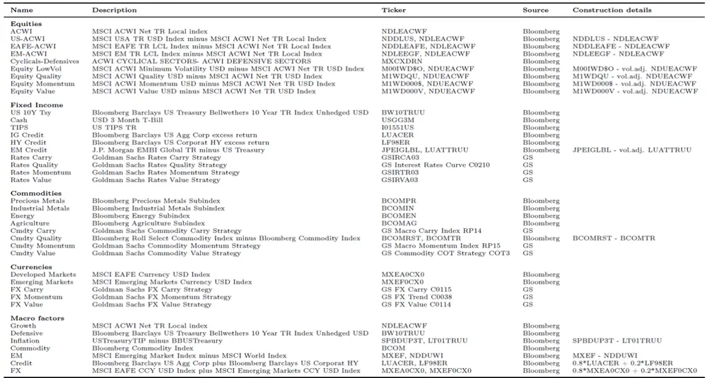
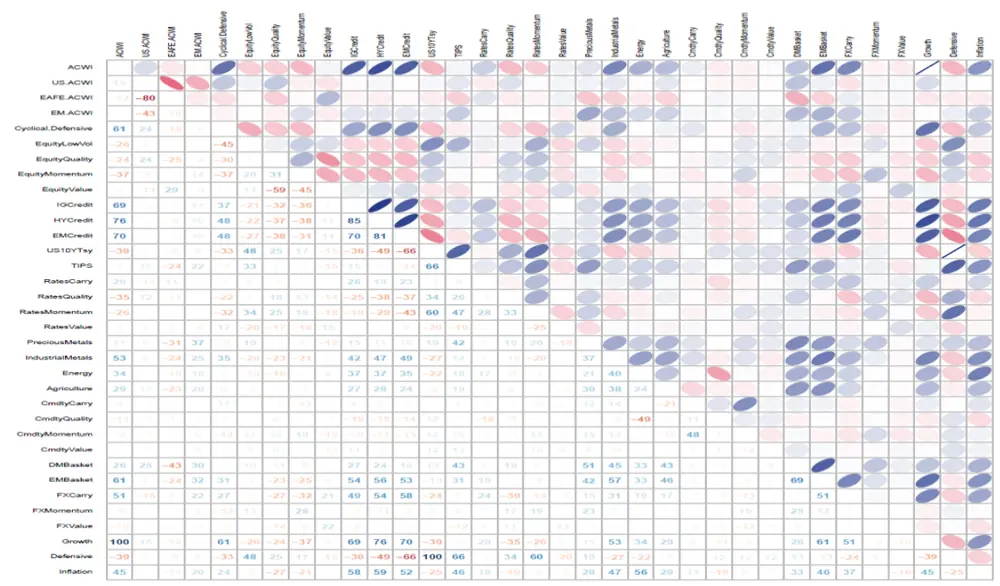
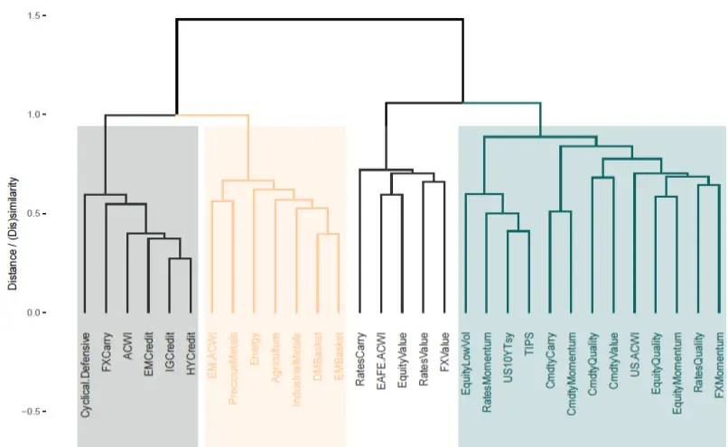
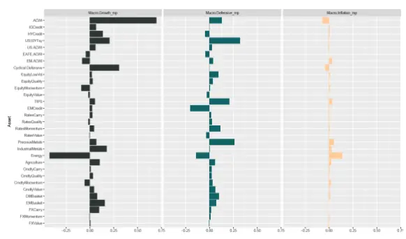
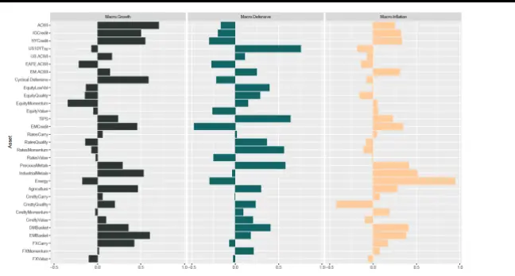
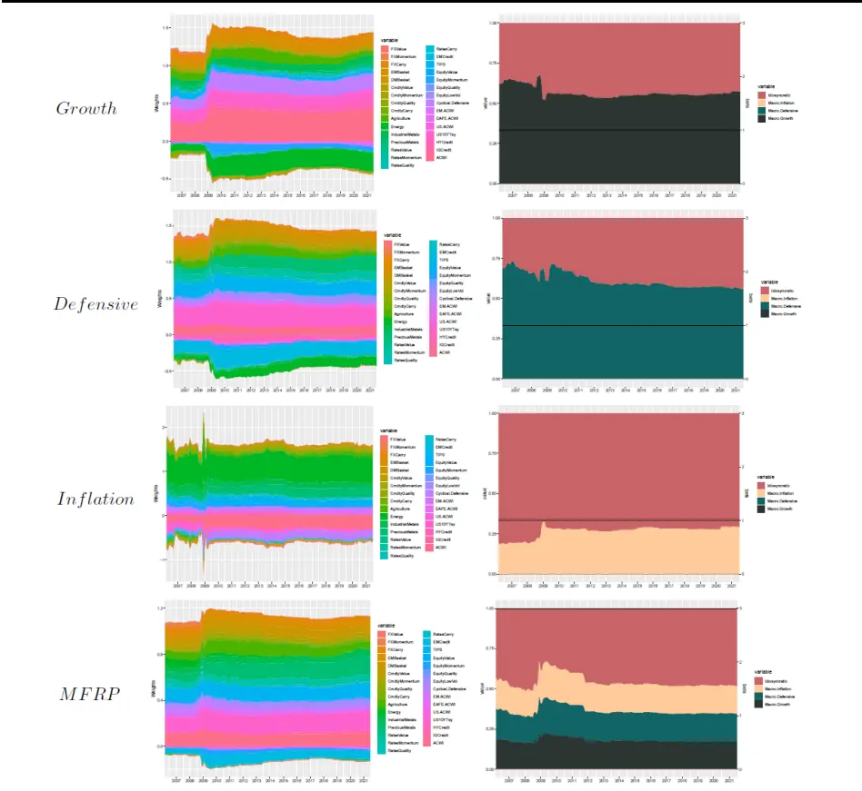
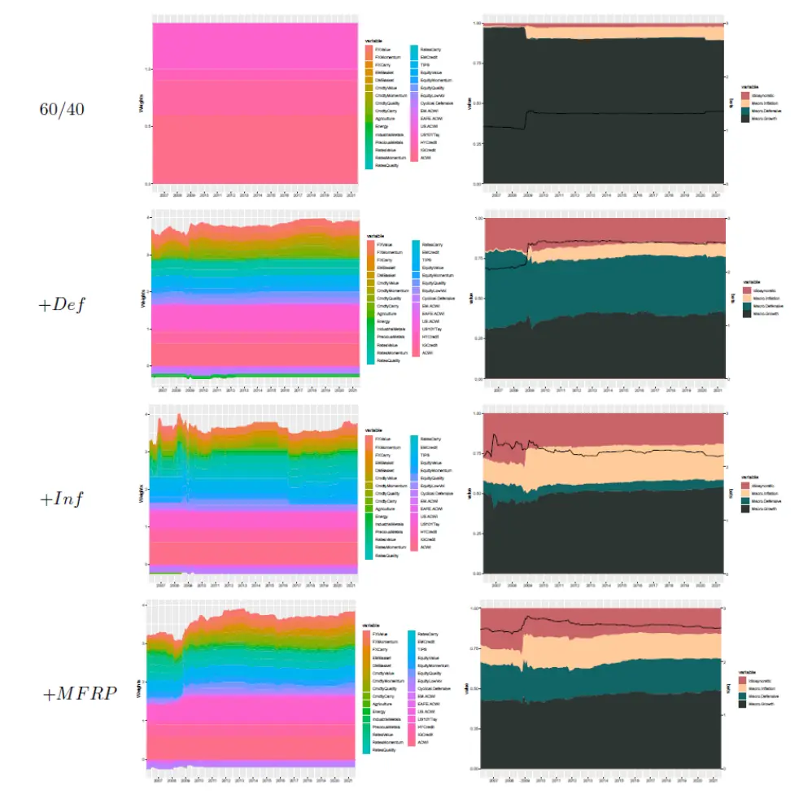

nInfo] [Table_Title] 2021.11.17

# 纳入风格的宏观因子组合构建

## ——学界纵横系列之二十五

陈奥林(分析师)

## 徐忠亚(分析师)

8 021-38674835

021-38032692

chenaolin@gtjas.com

xuzhongya@gtjas.com

证书编号 S0880516100001

S0880519090002

## 本报告导读：

如何建立宏观因子投资组合，从而实现多资产、多风格的投资分散化？本文给出一些建议。

## 摘要：

[Table_Summary]• 资产配置时应考虑分散风险的来源，而不是仅考虑资产类别的分散。后者可能因宏观环境变化导致资产间相关性增加而失效。

本文将宏观因子视为风险的真正来源，在构建宏观因子时将市场风格也纳入其中。选取经济增长、防御和通胀三大宏观因子对资产和风格的收益进行解释，资产表现的时变和风格的切换来源于其在宏观因子上的敞口。

在构建正交宏观因子及其模拟投资组合时，采取“最小误差变换矩阵”的方法。该方法在实现因子正交化的同时，力求正交因子与原因子的距离最小。从正交宏观因子在各资产、风格的权重和相关性来看，这样做实现了保留经济可解释性和权重稳定性的目标。

以“有效投注数量”作为分散程度的度量，以其最大化为目标，进行宏观因子的分散化投资，获得宏观因子的风险平价组合。“不将鸡蛋放入同一个篮子里”，有效投注数量相当于篮子的数量，篮子越多，分散程度越高。

风险平价组合和三个宏观因子模拟投资组合的表现：正增长环境下，经济增长组合显示出非凡的收益率(19.64%和 22.29%)，但在负增长时期表现不佳( 9.65%)；通胀 MFMP 和防御 MFMP 则成功地减轻了通胀时期和经济衰退时期的宏观风险。风险平价组合的波动率最小，且换手率明显低于三个宏观因子组合，以放弃少量好处为代价降低了宏观经济对组合的冲击。

将已有组合向宏观因子组合调整可提高组合表现。以加入防御因子为例，原 60/40 组合的风险以经济增长风险为主，全样本的年化收益为 7.34%，最大回撤 36.54%，夏普比率为 0.73，衡量分散程度的有效投注数量为 1.27%；加入防御因子后，年化收益提升至 11.79%，最大回撤降至 22.95%，夏普比率升至 1.12，有效投注数量增至 2.47.

金融工程

## 金融工程团队：

陈奥林：（分析师）

电话：021-38674835

邮箱：chenaolin@gtjas.com

证书编号：S0880516100001

杨能：（分析师）

电话：021-38032685

邮箱：yangneng@gtjas.com

证书编号：S0880519080008

## 殷钦怡：（分析师）

电话：021-38675855

邮箱：yinqinyi@gtjas.com

证书编号：S0880519080013

## 徐忠亚：（分析师）

电话：021- 38032692

邮箱：xuzhongya@gtjas.com

证书编号：S0880120110019

## 刘昺轶：（分析师）

电话：021-38677309

邮箱：liubingyi@gtjas.com

证书编号：S0880520050001

## 赵展成：（研究助理）

电话：021-38676911

邮箱：Zhaozhancheng@gtjas.com

证书编号：S0880120110019

## 张烨垲：（研究助理）

电话：021-38038427

邮箱：zhangyekai@gtjas.com

证书编号：S0880121070118

## 徐浩天：（研究助理）

电话：021-38038430

邮箱：xuhaotian@gtjas.com

证书编号：S0880121070119

## [Table_Re相关报告

基本面指数化与市场超额回报率的预测2021.11.16

如何评价量化策略拥挤度 2021.11.15

机构抱团与公司治理关系研究 2021.11.12

生猪贝塔机会加种业景气周期，关注农业ETF投资机会 2021.11.09

基本面量化：科技板块分子端优势强化2021.11.08

## 1. 引言

分散化是现代资产管理的核心原则，这可以追溯到 1952 年马科维兹的开创性工作。投资者们往往追求不同资产类别间的分散投资，但有研究表明，在熊市（尤其是极端时期），不同资产间的相关性可能会发生改变，甚至变得高度相关，从而使仅按资产类别分散的投资失效。因此，我们应该深入地了解使资产间相关性发生变动的驱动因素，从而更好地配置资产。Alexander, Harald, Mark and Sandra 于 2021 年 8 月完成的《Macro Factor Investing with Style》一文建议使用宏观因子对不同资产类别、不同风格因子的收益变化进行解释。

本文研究宏观因子投资策略，旨在通过一组简单的宏观经济因子实现配置的高度多元化。这就涉及两个问题，一是如何构建宏观因子，二是如何投资宏观因子并尽可能分散化。对于问题一，本文将宏观状态变量和风格变量相结合来构建宏观因子，加入风格变量使得宏观因子可以更好地捕捉随宏观状态变化的风格切换。对于问题二，本文选取“有效投注数量”作为组合分散程度的度量指标，建立了“有效投注数量”最大的风险平价组合。简单来说，“不把鸡蛋放进同一个篮子里的原则”中篮子的数量就相当于有效投注数量，篮子越多，分散程度越高。本文与传统分散配置思路的不同在于，将组合中“资产的分散”变成了“宏观因子的分散”。

此外，本文还研究了如何在现有组合上进行调整，以最小的交易成本使其接近目标宏观因子组合。考虑到了每次调仓时保持各资产权重的尽量稳定从而减小交易成本，是本文方法的一大特点。

本文的正文包括如下部分：首先介绍对资产、风格与宏观因子的构建与数据进行介绍；然后介绍正交宏观因子及其模拟投资组合的构建方法，以及宏观因子的分散化配置方法；最后介绍宏观因子的实际投资效果，包括各资产的因子暴露、三个宏观因子模拟投资组合和风险平价组合的表现、以及将已有组合向宏观因子组合调整的效果。

## 2. 资产、风格与宏观因子介绍

多因子模型将资产收益率分解为因子收益率、因子暴露以及非系统风险溢价：

$$
R=B\cdot F+\epsilon
$$

这里 $F\in R^{K\times1}$ 表示因子收益率， $B\in R^{N\times K}$ 为各个资产在各个因子的暴露，$\epsilon\in R^{N\times1}$ 为特质性风险溢价。假设ε与各资产、因子均不相关且期望为 0，则有

$$
E(R)=r_{f}+B\cdot RP
$$

其中 $r_{f}\in R^{N\times1}$ 为无风险利率， $RP\in R^{K\times1}$ 为因子的风险溢价。众多著名的因子模型都采用了这个模型，比如 Fama, and French (1993), Carhart(1997), Hou, Xue, and Zhang (2015), 和 Fama and French (2015).

虽然多因子模型已经深入人心，但许多资产配置方法只考虑资产的分散化，并未考虑系统性风险即因子风险的分散化。即使在配置过程中考虑了某个特定因子(以下称为风格因子)，通常也不会系统地跨多个资产类别和风格因子。而宏观因子投资框架可以做到这一点。

定义宏观因子一般有两种方法。一是根据产出、就业等宏观数据来捕捉经济的不同状态。这种方法可解释性较强，但存在数据的滞后性、低频性以及可能存在的后期修正，这使得站在当前时点很难用这些数据指导后续的短期配置，因此这种方法更适用于长期配置。二是使用主成分分析等统计学的方法进行分解。这种方法的缺点是经济可解释性较差。

然而，不管宏观经济因子的定义如何，要想落实到实际投资，重要的是构建可投资的宏观因子(宏观因子模拟投资组合，MFMP)。换句话说，MFMP 是能够复制原始因子表现的可实际投资的资产组合。

构造 MFMP 的方法又有多种，比如两阶段回归模型(Fama and MacBeth,1973)和机器学习方法(Jurczenko and Teiletche, 2019)等。但是，这些方法往往会有高周转率和交易成本，这可能是由因子暴露的估计误差(而不是因子暴露的实际变化)造成的。因此，获得稳定的 MFMP 对于宏观因子的有效投资至关重要。本文提出方法则有助于构建稳定且直观的宏观投资组合。

选取一定数量的资产、风格因子和宏观因子作为我们的研究对象。本文研究多种大类资产，包括股票、固定收益、大宗商品和货币。样本期为2001 年 1 月至 2021 年 6 月，使用的是彭博和高盛的月度数据。

## 2.1. 资产与风格

股票方面，我们考虑了 5 种资产以及 4 种风格因素。摩根士丹利资本国际全球指数（MSCI All Country World Index, ACWI）代表全球股市，年化超额收益为 5.69%，波动率为 14.27%. USACWI、EAFE-ACWI、EM-ACWI 为对应地区收益率减去 ACWI 收益率，Cyclical-Defensive 为美国周期性股票与防御性股票的收益率之差。四个股票风格因子为质量、动量、价值和低波动性，是相应的 MSCI ACWI 风格指数与 MSCI ACWI之间的差。

固定收益方面，我们考虑美国 10 年期国债、TIPS、IG、HY和新兴市场信贷。前两者可视为避险资产。

汇率方面，考虑四个风格因子:套利、质量、动量和价值。

大宗商品方面，我们考虑了四大板块:贵金属和工业金属(PM 和 IM)、能源和农业(Ags)；以及四个风格因子：套利、质量、动量和价值。

货币方面，我们使用两个指数：发达市场(MSCI EAFE 货币)指数和新兴市场(MSCI 新兴市场货币)指数；以及三个FX 风格因子:利差、价值和动量。

表 1：资产、风格因子与宏观因子数据描述

数据来源：《Macro Factor Investing with Style》, 国泰君安证券研究

统计各个资产间的相关程度。我们发现与全球股市指数高度正相关的是：Cyclical-Defensive（相关系数为 0.61），三个信用资产（0.69 至 0.76），大宗商品（0.11 至 0.53），新兴市场指数（0.61）和外汇套利策略（0.51）。与全球股市指数高度负相关的是：美国公债，低波动率风格和动量风格。

图 1：各资产的相关系数

数据来源：《Macro Factor Investing with Style》, 国泰君安证券研究

各资产的描述性统计情况见附录表 2。

## 2.2. 宏观因子

定义三个宏观因子，分别为经济增长、通胀和防御。经济增长和通胀反映了投资者对预期未来现金流的担忧，正的增长会导致预期未来现金流的增加，衰退则相反；高通胀则导致预期现金流的现值减少。除了增长和通胀，我们还可以考虑几个额外的变量，特别是如果我们想要捕获较高比例的资产回报变化(参见 Bass, Gladstone, and Ang, 2017)。然而，我们认为更实际的做法是关注一组简单的宏观因子，以帮助驾驭经济周期。因此，我们增加了一个防御因子，它在增长和通胀资产预期表现不佳时表现良好。

为了验证我们选择这三个宏观因子的合理性，对多个资产、风格进行聚类。可以看到，4 个类中有三个与经济增长、通胀和防御有关。经济增长类包括了全球股票指数、三种信用利差资产以及 Cyclical-Defensive.通胀类与股票类较为接近，包括四个大宗商品、两个外汇篮子和新兴市场股票利差。防御类内资产种类最多，包含美国国债、TIPS、防御风格、低波动风格、利率动量等。

图 2：多资产、多风格的聚类：有三个类与经济增长、通胀和防御有关

数据来源：《Macro Factor Investing with Style》, 国泰君安证券研究

为每个宏观因子选择最佳代理变量。增长因子由摩根士丹利资本国际ACWI 给出的全球股票指数回报来代表。防御性因素以美国长期国债为代表。通胀因素是用 TIPS 减去美国国债来衡量的。具体的构建方式见表 1.

我们对宏观经济因子的选择与 Bass、Gladstone 和 Ang(2017)的早期研究有关。他们使用主成分分析发现经济增长、实际利率和通货膨胀可解释85%的资产回报。因此，在研究宏观因素配置时，我们选择了增长、通胀和防御性。

## 3. 正交宏观因子与其分散化配置

## 3.1. 正交宏观因子及其模拟投资组合

本节我们构建宏观因子的模拟投资组合，即最接近宏观因子表现的可投资组合。

假设有N个可投资资产，对应N维收益率向量R. 投资组合的配置权重向量为ω，则组合收益率为

$$
R^{\omega}=\omega^{T}R
$$

如果我们认为组合收益率是受 K个因子驱动的，那么

$$
R=B\cdot F+\epsilon
$$

$$
R^{\omega}=b^{T}F
$$

其中F为 K个因子的收益率向量，B为N个资产在K个因子上的因子暴露矩阵，b为投资组合的因子暴露向量。

设R的协方差阵为Σ, F的协方差矩阵为 $\Sigma_{F1}$ ，则有

$$
\Sigma=B\Sigma_{F}B^{T}+U
$$

其中U为非系统性风险矩阵.

我们首先试图对Rw进行正交分解，以得到多个正交因子。常用的分解是主成分分析，但这种方法得到的正交因子（主成分）往往不具备经济含义，并且估计协方差矩阵时产生的误差会使该方法的稳定性较差（ Bernardi, Leippold and Lohre, 2018 ）。 因 此 ， 本 文 使 用 Meucci,Santangelo and Deguest (2015)中的方法进行因子正交化。这种方法的关键在于追求正交后因子与原因子F的差距最小，以保持其可解释性。

具体来说，寻找“最小误差变换矩阵 ${{}^{\circ}}t_{orth}$ ，满足

$$
t_{orth}=\operatorname*{argmin}_{Cor(tF)=Id_{K}}\sqrt{\frac{1}{K}{\sum_{k=1}^{K}Var(\frac{(tF)_{k}-F_{k}}{\sigma_{k}^{F}})}},
$$

其中 $Id_{k}$ 为单位矩阵， $\sigma^{F}$ 为原因子F的方差向量。则变换后的因子 $F_{orth}=$ $t_{orth}F$ ，协方差矩阵 $\cdot\Sigma_{orth}=t_{orth}^{T}\Sigma_{F}t_{orth}$ . 从而有

$$
\Sigma=B\Sigma_{F}B^{T}+U=(t_{orth}^{-1}B^{T})^{T}\Sigma_{orth}(t_{orth}^{-1}B^{T})+U
$$

接下来，我们采取 Deguest, Martellini, and Meucci (2013) 中的方式定义宏观因子模拟投资组合（macro factor-mimicking portfolios，下文称为MFMPs）

$$
R_{FMP}=t_{orth}B^{-1}R
$$

这里的 $B^{-1}$ 为原因子载荷矩阵的穆尔-彭罗斯广义逆矩阵。矩阵 $t_{orth}B^{-1}$ 为 $K*N$ ，每一行代表对应因子的各资产的投资权重。

## 3.2. 宏观因子的分散化配置

上一节我们介绍了宏观因子模拟投资组合的创建方法，本节旨在对宏观因子进行配置。在缺乏对未来经济情景的看法的情况下，投资者们常常追求投资的分散化。如果一个投资组合均匀地暴露于不同的风险源，则该投资组合具有良好的分散性。简单来说，一个分散化的宏观因子投资组合将确保投资组合风险由三个宏观风险因子均匀地驱动。需要注意的是，这不同于传统的风险平价策略，传统风险平价是追求风险在各个资产的均匀分布，而本文的“风险平价”追求在不同风险源（宏观风险因子）上的均匀分布。

Meucci(2009)和 Meucci, Santangelo, and Deguest(2015)提出了不相关风险源的风险平价策略，以获得最大的分散程度。根据“将鸡蛋放进不同的篮子里”的原则，各个资产可以看做是多个不同鸡蛋，各个风险源可以看做是不同的篮子。他们认为，最好的分散是增加篮子的数量，而不是增加鸡蛋的数量。所以，他们提出了“组合的有效投注数”（the effective numberof uncorrelated bets）这一概念。

投资组合的方差满足：

$$
Var(R^{\omega})=\omega^{T}\Sigma\omega=\omega_{orth}^{T}\Sigma_{orbit}\omega=\sum_{k=1}^{K}\omega_{orth,k}^{2}\sigma_{orth,k}^{2}
$$

定义正交因子 k 的风险贡献为 $\rho_{k}=\frac{\omega_{orth,k}^{2}\sigma_{orth,k}^{2}}{Var(R^{\omega})}=\frac{\omega_{orth,k}^{2}\sigma_{orth,k}^{2}}{\sum_{k=1}^{K}\omega_{orth,k}^{2}\sigma_{orth,k}^{2}}$ Meucci(2009)提出用分布熵来衡量投资组合的分散化程度，这对应于驱动投资组合风险的正交的有效押注数量

$$
N_{Ent}=\exp(-\sum_{k=1}^{K}\rho_{k}\ln(\rho_{k})),
$$

显然，若组合风险只由一个风险源驱动，则 $\rho_{k}=1$ ,有效投注数量 $N_{Ent}=1$ 若组合风险由K个风险源驱动，且这K个风险源的贡献均等（即 $\begin{array}{r}{\rho_{k}=\frac{1}{K})}\end{array}$ 时，有效投注数量最大（即 $N_{Ent}=K~)$

资产配置要确定的是各资产的权重ω，为此需要先确定 $.\omega_{orth}$ 使得有效投注数量最大。根据 $\begin{array}{r}{\cdot\rho_{k}=\frac{1}{K},}\end{array}$ ，我们可以选取

$$
\omega_{orth}=\Sigma_{orth}^{-\frac{1}{2}}
$$

之后，我们反解出资产权重

$$
\omega=(B_{orth}^{-1})^{T}\omega_{orth}=(t_{orth}^{T}B^{-1})^{T}\omega_{orth}
$$

并归一化：

$$
\omega^{*}=\frac{\omega}{\mathbf{1}^{T}\omega}=\frac{(t_{orth}^{T}B^{-1})^{T}\Sigma_{orth}^{-\frac{1}{2}}}{\mathbf{1}^{T}(t_{orth}^{T}B^{-1})^{T}\Sigma_{orth}^{-\frac{1}{2}}}
$$

其中1为元素全为 1 的 K维向量。

## 4. 宏观因子投资实践

## 4.1. 各资产对宏观因子的敏感性（因子暴露）

本节探究各资产、风格在宏观因子上的暴露情况。

股票类：（1）地域：由于 MSCI ACWI 本身即用于增长因子的定义，其在增长因子上的暴露为 1. 而美国股票指数的超额收益（相对于 ACWI）在增长因子上有正暴露，说明当全球经济正增长时，美国的表现将由于全球指数 。 指数则在增长和防御因子上有负的暴露，新兴市场在通胀因子上则有正的暴露。（2）行业：周期性行业理所应当地在增长有正暴露，防御性行业在防御因子有正暴露。（3）风格：低波动率和质量风格有较大的正的防御因子暴露，说明其防御属性。动量风格则在增长因子上有强烈的负暴露，防御暴露则为正。价值风格较为特殊，在三个宏观因子上暴露均为负，尤其是缺乏防御性。

固收类：美国 10 年期国债的防御属性最强，TIPS 的防通胀属性最强。对于三种信贷资产，宏观因子对其解释程度大概为 60%（调整后的R2）。不出所料，投资级、高收益和新兴市场信贷表现出巨大的正增长因子敏感性和负防御性。所有这些都显示出正的通胀风险敏感性。相比之下，宏观因子对利率因子的解释能力就小了许多。除价值利率因子外，利率因子的防御属性均为正。

大宗商品类：宏观因子可解释能源和工业金属的三分之一左右，两者均对通胀因子有正的暴露。工业金属则对增长因子有正暴露，能源对防御因子有负暴露。贵金属在防御、通胀上均有显著正暴露。农业则有温和的增长、通胀暴露。总体来说，四个大宗商品板块都有较好的通胀对冲能力，而商品的风格因素则与宏观因子几乎没有显著关系。

货币类：发达国家和新兴地区的货币篮子对三个宏观因子均有正的暴露，但新兴地区对正增长的敏感性则大得多。

## 4.2. 宏观因子与其风险平价组合

计算出各种资产、风格对三个宏观因子的暴露之后，可以根据上一章的内容构建宏观因子模拟投资组合（MFMP）了。图 3 是使用全样本计算所得三个 MFMP 中各资产的权重，图 3：MFMP 中各资产的权重图 4：MFMP 与各资产的相关系数则是 MFMP 与各个资产间的相关系数。

增长 在股票中有很大的正权重，在能源中有相当大的负权重。我们可以观察到投资级和高收益信贷以及 Cyclical-Defensive 的权重为正。增长 MFMP 还对大宗商品(IM、PM 和 Ags)给予了正的权重。外汇利差交易的权重为正，而股票动量和外汇动量的权重为负。值得注意的是，能源上较大的负权重导致能源资产与增长 MFMP 的相关性相对较弱。

防御 MFMP 则中，美国国债、TIPS 和英国国债的正权重较大。此外，我们观察到防御性风格的正权重，如股票低波动率、利率动量和质量，以及所有大宗商品风格因子以及两个货币篮子。新兴市场信贷和能源的权重则为负。

通胀 MFMP 的特点是各资产权重均较小。股票权重为负，而大宗商品、能源、贵金属权重为正。总体而言，权重主要集中在大宗商品，其次是外汇和股票。

图 3：MFMP中各资产的权重

数据来源：《Macro Factor Investing with Style》, 国泰君安证券研究

图 4：MFMP与各资产的相关系数

下面采取样本外的方法来计算计算宏观因子组合。首先选取前 60 个月的数据作为样本，第一次计算宏观因子组合，即得到样本外 2006 年 2月的组合。之后依次将数据添加进样本中，计算下一个月的组合。下图左半图描述了三个 在各个资产和风格中的权重，右半图为的宏观风险贡献。最后一行则是宏观因子风险平价组合（macro factor riskparity, MFRP）。可以看到各个宏观因子模拟组合只对相应的宏观风险有所贡献，对另两种宏观风险贡献为 0，剩余则是对非系统性风险的贡献。

图 5：宏观因子模拟组合和风险平价组合中各资产权重及风险贡献

数据来源：《Macro Factor Investing with Style》, 国泰君安证券研究

可以看出，宏观因子模拟投资组合只依赖于目标宏观因子。增长 MFMP在波动较高的时期 特别是在大金融危机期间和之后，即全球金融危机期间)显示出明显的杠杆权重，而权重在经济稳定增长时期(如 2014 年至2018 年)下降。防御 MFMP 表现出平稳的权重配置，成交量很小。通胀MFMP 在大宗商品上有明显的杠杆化投资，在全球金融危机期间，能源类商品的杠杆化投资飙升。然而，自那以后，它的权重一直相当稳定，通胀因子模拟投资组合也因此较为纯粹。

最后，我们看一下三个 MFMP 以逆波动率的形式配置的结果风险平价组合 MFRP（最后一行）。可以看到，在不同时点，MFRP 对三种个宏观风险均有大小相同的贡献。值得注意的是，MFRP 的投资各个资产的权重随着时间的推移是相当稳定的，几乎没有杠杆或卖空活动。

下面看一下三个 MFMP 组合以及风险平价组合 MFRP 组合的表现。在全样本期，增长MFMP收益最高，在8.97%的波动性下实现了年均9.71%的收益。而通胀 MFMP 则产生了-11.35%的负收益，这使得风险平价MFRP 组合的总回报降低到 3.56%，夏普比率为 0.54，低于增长 MFMP的1.08和防御组合的0.76. 但是MFRP的波动率最低，且值得注意的是，MFRP 的换手率（2.84%）远低于其他组合，且在任何时候的有效押注数量（number of bets）均为 3.

我们进一步将样本期划分为不同的“通胀-增长”阶段进行观察。在正增长环境下，增长 MFMP 显示出非凡的收益率(19.64%和 22.29%)，但在负增长时期表现不佳( 9.65%)。通胀 MFMP 和防御 MFMP 则成功地减轻了通胀和经济衰退的宏观风险。在通胀且增长的环境下，通胀 MFMP 年化收益为 17.38%，波动率为 15.23%. 在通缩或危机时期，防御 MFMP 是唯一正收益的组合，年化收益 13.32%，波动 9.04%. 风险平价组合 MFRP吸收了三个组合的优点、减弱了其缺点，以放弃少量好处为代价降低了宏观经济对组合的冲击。

## 4.3. 将已有组合向宏观因子组合调整

如果我们有一个基准配置（比如 组合），我们可以将某个宏观因子模拟组合 MFMP 或风险平价组合 MFRP 作为目标，对基准配置进行调整，在组合权重变动尽可能小的情况下加大其分散程度并接近目标组合。以目标为 MFRP 组合为例，首先计算出 MFRP 中各资产应有的权重 $\omega^{*}$ ，令期望收益 $.\mu=\gamma\Sigma\omega^{*}$ ，Γ和 $\imath\lambda_{TC}$ 为交易成本矩阵和换算因数。最终目标ω和原权重 $\left[\omega_{0}\right.$ 间的差 $\Delta\omega=\omega-\omega_{0}$ 即为需要调整的权重，满足

$$
\operatorname*{max}_{\omega}(\omega^{\prime}(\mu+2\lambda_{TC}\Gamma\omega_{0})-\omega^{\prime}\left(\frac{\gamma}{2}\Sigma+\lambda_{TC}\Gamma\right)\omega)
$$

根据 Dichtl, Drobetz, Lohre, and Rother (2021)，设置 $\lambda_{TC}=0.3,\gamma=5.$ . 求解后结果如图 6 所示。以加入防御因子为例，原 60/40 组合的风险以经济增长风险为主，全样本的年化收益为 7.34%，最大回撤 36.54%，夏普比率为 0.73，衡量分散程度的有效投注数量为 1.27%；加入防御因子后，年化收益提升至 11.79%，最大回撤降至 22.95%，夏普比率升至 1.12，有效投注数量增至 2.47.

图 6：60/40 组合向宏观因子组合调整后的各资产权重及风险贡献

数据来源：《Macro Factor Investing with Style》, 国泰君安证券研究

## 5. 我们的思考

本文的启发点在于：一是将配置重心从资产分散化转向风险来源分散化；二是在构建宏观因子时纳入了风格因素，试图捕捉宏观状态变化时的风格切换；三是在构建正交宏观因子时，使用“最小误差变换矩阵”的方法保持其经济解释性和权重稳定性；四是以“有效投注数量”最大化为主要思想，进行宏观因子组合的分散化投资；五是介绍了将现有组合向宏观因子组合调整的方法与效果。

资产配置是投资的重要部分，要想在变化的宏观环境中更好地完成配置，需要系统性的方法。这仍然是我们今后研究的重要方向。

## 6. 附录

表 2：各资产、风格和宏观因子的描述性统计

|  | Ret p.a. | Vol p.a. | SR | t-stat | Min | Max | MaxDD |
| --- | --- | --- | --- | --- | --- | --- | --- |
| Equities |  |  |  |  |  |  |  |
| ACWI | 5.69 | 14.27 | 0.40 | 1.80 | -16.98 | 11.42 | -51.86 |
| US-ACWI | 1.28 | 3.45 | 0.37 | 1.68 | -2.80 | 2.81 | -16.64 |
| EAFE-ACWI | -2.10 | 4.31 | -0.49 | -2.21 | -5.76 | 3.35 | -38.51 |
| EM-ACWI | 4.03 | 8.95 | 0.45 | 2.03 | -6.13 | 8.05 | -35.81 |
| Cyclical-Defensive | 0.56 | 11.57 | 0.05 | 0.22 | -12.2 | 13.63 | -57.31 |
| Equity Low Vol | 2.48 | 4.76 | 0.52 | 2.35 | -4.34 | 4.89 | -15.70 |
| Equity Quality | 3.11 | 3.48 | 0.89 | 4.04 | -2.20 | 4.81 | -10.78 |
| Equity Momentum | 4.73 | 7.46 | 0.63 | 2.86 | -7.71 | 12.91 | -17.82 |
| Equity Value | -1.72 | 3.23 | -0.53 | -2.40 | -3.44 | 2.49 | -35.30 |
| Fixed Income |  |  |  |  |  |  |  |
| US10YTsy | 3.41 | 7.25 | 0.47 | 2.13 | -7.15 | 9.03 | -12.42 |
| TIPS | 4.00 | 5.70 | 0.70 | 3.17 | -8.73 | 5.83 | -13.03 |
| IG Credit | 1.18 | 5.27 | 0.22 | 1.01 | -10.40 | 5.39 | -24.2 |
| HY Credit | 3.76 | 10.64 | 0.35 | 1.60 | -16.50 | 13.21 | -44.76 |
| EM Credit | 0.15 | 12.44 | 0.01 | 0.05 | -17.49 | 9.42 | -42.71 |
| Rates Carry | 1.56 | 3.79 | 0.41 | 1.86 | -4.13 | 2.98 | -12.21 |
| Rates Quality | -0.14 | 2.94 | -0.05 | -0.22 | -2.34 | 3.82 | -19.87 |
| Rates Momentum | 2.28 | 4.37 | 0.52 | 2.35 | -3.32 | 3.71 | -10.68 |
| Rates Value | -0.53 | 3.80 | -0.14 | -0.63 | -3.68 | 2.73 | -21.84 |
| Commodities |  |  |  |  |  |  |  |
| Precious Metals | 7.51 | 19.30 | 0.39 | 1.76 | -19.01 | 14.45 | -51.18 |
| Industrial Metals | 4.57 | 21.63 | 0.21 | 0.95 | -26.97 | 21.35 | -67.00 |
| Energy | -6.21 | 29.36 | -0.21 | -0.96 | -35.13 | 24.78 | -97.25 |
| Agriculture | 0.09 | 19.94 | 0.00 | 0.02 | -18.97 | 15.85 | -67.60 |
| Cmdty Carry | 2.74 | 8.14 | 0.34 | 1.52 | -6.93 | 7.40 | -35.25 |
| Cmdty Quality | 3.92 | 2.70 | 1.45 | 6.56 | -2.49 | 4.74 | -3.74 |
| Cmdty Momentum | -1.06 | 9.67 | -0.11 | -0.49 | -7.94 | 9.38 | -50.54 |
| Cmdty Value | 3.29 | 7.50 | 0.44 | 1.98 | -5.57 | 6.84 | -14.75 |
| Currencies |  |  |  |  |  |  |  |
| DM Basket | 1.00 | 7.02 | 0.14 | 0.64 | -5.49 | 6.28 | -28.44 |
| EM Basket | 2.70 | 6.36 | 0.42 | 1.91 | -7.56 | 5.17 | -19.21 |
| FX Carry | 3.34 | 6.27 | 0.53 | 2.41 | -8.15 | 7.11 | -16.59 |
| FX Momentum | 1.70 | 4.87 | 0.35 | 1.57 | -3.27 | 5.24 | -12.20 |
| FX Value | 1.07 | 4.50 | 0.24 | 1.08 | -6.43 | 4.77 | -18.82 |
| Macro factors |  |  |  |  |  |  |  |
| Growth | 5.69 | 14.27 | 0.40 | 1.80 | -16.98 | 11.42 | -51.86 |
| Defensive | 3.41 | 7.25 | 0.47 | 2.13 | -7.15 | 9.03 | -12.42 |
| Inflation | 1.21 | 2.65 | 0.46 | 2.07 | -6.16 | 2.49 | -10.87 |
| Commodity | -0.83 | 15.89 | -0.05 | -0.24 | -21.38 | 12.98 | -75.52 |
| FX | 1.34 | 6.56 | 0.20 | 0.92 | -5.81 | 5.90 | -25.67 |
| EM | 1.15 | 11.49 | 0.10 | 0.45 | -9.05 | 7.93 | -60.66 |
| Credit | 1.69 | 6.13 | 0.28 | 1.25 | -10.98 | 6.95 | -28.66 |

数据来源：《Macro Factor Investing with Style》, 国泰君安证券研究

## 本公司具有中国证监会核准的证券投资咨询业务资格

## 分析师声明

作者具有中国证券业协会授予的证券投资咨询执业资格或相当的专业胜任能力，保证报告所采用的数据均来自合规渠道，分析逻辑基于作者的职业理解，本报告清晰准确地反映了作者的研究观点，力求独立、客观和公正，结论不受任何第三方的授意或影响，特此声明。

## 免责声明

本报告仅供国泰君安证券股份有限公司（以下简称“本公司”）的客户使用。本公司不会因接收人收到本报告而视其为本公司的当然客户。本报告仅在相关法律许可的情况下发放，并仅为提供信息而发放，概不构成任何广告。

本报告的信息来源于已公开的资料，本公司对该等信息的准确性、完整性或可靠性不作任何保证。本报告所载的资料、意见及推测仅反映本公司于发布本报告当日的判断，本报告所指的证券或投资标的的价格、价值及投资收入可升可跌。过往表现不应作为日后的表现依据。在不同时期，本公司可发出与本报告所载资料、意见及推测不一致的报告。本公司不保证本报告所含信息保持在最新状态。同时，本公司对本报告所含信息可在不发出通知的情形下做出修改，投资者应当自行关注相应的更新或修改。

本报告中所指的投资及服务可能不适合个别客户，不构成客户私人咨询建议。在任何情况下，本报告中的信息或所表述的意见均不构成对任何人的投资建议。在任何情况下，本公司、本公司员工或者关联机构不承诺投资者一定获利，不与投资者分享投资收益，也不对任何人因使用本报告中的任何内容所引致的任何损失负任何责任。投资者务必注意，其据此做出的任何投资决策与本公司、本公司员工或者关联机构无关。

本公司利用信息隔离墙控制内部一个或多个领域、部门或关联机构之间的信息流动。因此，投资者应注意，在法律许可的情况下，本公司及其所属关联机构可能会持有报告中提到的公司所发行的证券或期权并进行证券或期权交易，也可能为这些公司提供或者争取提供投资银行、财务顾问或者金融产品等相关服务。在法律许可的情况下，本公司的员工可能担任本报告所提到的公司的董事。

市场有风险，投资需谨慎。投资者不应将本报告作为作出投资决策的唯一参考因素，亦不应认为本报告可以取代自己的判断。
在决定投资前，如有需要，投资者务必向专业人士咨询并谨慎决策。

本报告版权仅为本公司所有，未经书面许可，任何机构和个人不得以任何形式翻版、复制、发表或引用。如征得本公司同意进行引用、刊发的，需在允许的范围内使用，并注明出处为“国泰君安证券研究”，且不得对本报告进行任何有悖原意的引用、删节和修改。

若本公司以外的其他机构（以下简称“该机构”）发送本报告，则由该机构独自为此发送行为负责。通过此途径获得本报告的投资者应自行联系该机构以要求获悉更详细信息或进而交易本报告中提及的证券。本报告不构成本公司向该机构之客户提供的投资建议，本公司、本公司员工或者关联机构亦不为该机构之客户因使用本报告或报告所载内容引起的任何损失承担任何责任。

## 评级说明

## 1.投资建议的比较标准

投资评级分为股票评级和行业评级。

以报告发布后的12个月内的市场表现为比较标准，报告发布日后的 12个月内的公司股价（或行业指数）的涨跌幅相对同期的沪深 300 指数涨跌幅为基准。

## 2.投资建议的评级标准

报告发布日后的 12 个月内的公司股价（或行业指数）的涨跌幅相对同期的沪深300 指数的涨跌幅。

|  | 评级 说明 |  |
| --- | --- | --- |
| 股票投资评级 | 增持 | 相对沪深 300 指数涨幅 15%以上 |
|  | 谨慎增持 | 相对沪深 300指数涨幅介于 5%～15%之间 |
|  | 中性 | 相对沪深 300指数涨幅介于-5%～5% |
|  | 减持 | 相对沪深 300 指数下跌 5%以上 |
| 行业投资评级 | 增持 | 明显强于沪深 300 指数 |
|  | 中性 | 基本与沪深 300指数持平 |
|  | 减持 | 明显弱于沪深 300指数 |

## 国泰君安证券研究所

|  | 上海 | 深圳 | 北京 |
| --- | --- | --- | --- |
| 地址 | 上海市静安区新闸路669号博华广场 20层 | 深圳市福田区益田路 6009 号新世界 商务中心34层 | 北京市西城区金融大街甲9号金融 街中心南楼18层 |
| 邮编 | 200041 | 518026 | 100032 |
| 电话 | (021)38676666 | （0755）23976888 | （010)83939888 |
|  | E-mail: gtjaresearch@gtjas.com |  |  |