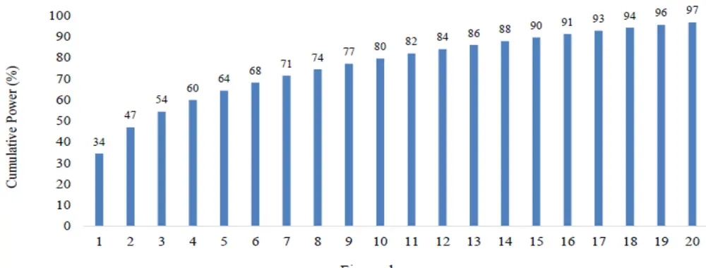

# 基金风格识别与风格配置维度的业绩归因

# ——学界纵横系列之二十六

陈奥林(分析师)

8 021-38674835

chenaolin@gtjas.com

证书编号 S0880516100001

## 本报告导读：

本文利用主成分分析和 Pearson相关系数提取和识别基金风格，并从风格配置维度将基金收益拆解为初始风格收益、风格择时收益以及风格专业知识收益。

le_Summary]风格配置是基金超额收益的重要来源。有效的风格识别、基于风格配置的业绩归因可以帮助投资者评价基金的风格配置能力，实现基金优选。

利用主成分分析方法从基金收益率中提取风格指标，通过 Pearson相关系数确定基金风格。样本期间，利用主成分分析方法从每一个研究窗口所有基金的收益率中提取出主成分，将前 20 大特征值对应的主成分作为基金风格的代理指标。计算基金收益率与各主成分之间的 Pearson 相关系数，相关系数最大的主成分即为基金风格。

基金风格择时能力显著，前瞻理论假说得到佐证。前瞻理论假说认为，有能力的基金经理可以有效分析、预测、切换至未来具有良好投资机会且取得更好业绩的风格。统计分析和多元回归结果显示，风格切换后的 6 月、12 月内，新风格收益显著高于初始风格收益，表明风格切换有助于提高基金业绩，支持了前瞻理论假说。

风格专业知识助力基金业绩进一步提振。将基金划分为风格切换与非风格切换基金两种类型。相比于非风格切换基金，风格切换基金可以取得更高的（超额）收益，业绩提振明显。

基金风格切换收益拆解，风格专业知识收益占主导地位。将风格切换收益拆解为风格择时收益与风格专业知识收益，在风格切换后的12 个月中，风格择时收益平均为 0.76%，且风格专业知识收益平均为 1.10%，风格专业知识收益占据主导地位。

陈奥林：（分析师）

电话：021-38674835

邮箱：chenaolin@gtjas.com

证书编号：S0880516100001

杨能：（分析师）

电话：021-38032685

邮箱：yangneng@gtjas.com

证书编号：S0880519080008

## 殷钦怡：（分析师）

电话：021-38675855

邮箱：yinqinyi@gtjas.com

证书编号：S0880519080013

## 徐忠亚：（分析师）

电话：021- 38032692

邮箱：xuzhongya@gtjas.com

证书编号：S0880120110019

## 刘昺轶：（分析师）

电话：021-38677309

邮箱：liubingyi@gtjas.com

证书编号：S0880520050001

## 赵展成：（研究助理）

电话：021-38676911邮箱：Zhaozhancheng@gtjas.com证书编号：S0880120110019

## 张烨垲：（研究助理）

电话：021-38038427

邮箱：zhangyekai@gtjas.com

证书编号：S0880121070118

## 徐浩天：（研究助理）

电话：021-38038430

邮箱：xuhaotian@gtjas.com

证书编号：S0880121070119

## [Table_Re相关报告

纳入风格的宏观因子组合构建 2021.11.18基本面指数化与市场超额回报率的预测2021.11.16

如何评价量化策略拥挤度 2021.11.15

机构抱团与公司治理关系研究 2021.11.12

生猪贝塔机会加种业景气周期，关注农业ETF投资机会 2021.11.09

## 1. 引言

现有研究表明，行业配置、风格配置、个券选择、市场择时是投资组合超额收益的主要来源。在风格频切的市场行情中，基金经理能否准确识别风格切换趋势，及时调整投资风格是提高组合收益的关键。基于这一角度，对于市场投资者而言，如何挑选具有良好风格切换能力的基金或基金经理是资产优化配置的一个重要问题。

Jiang 等人于 2020 年 12 月发表了《Hedge Fund Manager Skills andStyle-Shifting》一文（forthcoming in Management Science），旨在回答如下两个问题：一是基金经理为什么会切换投资风格？二是风格切换基金是否取得更好的业绩表现？在风格切换原因方面，本文用两种理论假说进行了解释，即后视（backward-looking）假说与前瞻（forward-looking）假说。前者认为，能力不足的基金经理可能会追逐过去流行且取得良好业绩的风格，类似于动量效应；后者认为，有能力的基金经理可以有效分析、预测、切换至未来具有良好投资机会且取得更好业绩的风格。在风格切换是否促进业绩提升方面，本文利用主成分分析方法来构建风格指标，利用基金收益与风格指标的相关性来确定基金风格，然后通过单变量分析和多元回归模型检验了基金风格切换对基金未来业绩的影响，并对风格切换收益进行了拆分，探究风格切换收益的主要来源。

研究结果显示，风格切换基金展示出良好的风格择时能力，以及在新风格中产生超额收益的能力。在风格切换后的 12 个月中，平均而言，新风格收益比初始风格收益高 0.76%（风格择时收益），且风格切换基金收益比新风格基准收益高 1.10%（风格专业知识收益）。本文正文主要包含如下内容：首先，介绍基金风格识别的方法，以及风格切换的理论假说；然后，阐述了风格切换与基金业绩之间联系，以及风格切换收益的拆解结果。

## 2. 基金风格识别与风格切换动机

## 2.1. 基金风格识别方法

识别基金真实的投资风格是研究基金风格切换决策的基本前提。基于Pukthuanthong 和 Roll（2009）的研究成果，本文利用主成分分析方法从基金收益数据中提取出 20 个样本外主成分序列作为基金投资风格的代理变量。主成分分析方法具有计算效率高，且生成的样本外主成分具有低相关、时变的特征，而这些特征有助于我们有效捕捉风险因子的动态暴露以及基金收益的风险来源。

基金风格识别涉及两个步骤：第一步是利用样本基金最近 8 个季度的月度收益率估计特征值，将特征值由高到低进行排序，取前 20 个特征值作为所有基金下一季度收益的样本外主成分。第二步是以 8 个季度作为时间窗口，滚动计算基金收益与 20 个样本外主成分之间的 Pearson 相关系数，以最高 Pearson 相关系数对应的主成分代表基金的投资风格。特别地，在基金投资风格识别的基础上，如果基金投资风格在季度 与季

Eigenvalue

度 期间发生变化，认定基金的投资风格出现切换。

## 2.2. 基金风格切换动机：风格择时与风格专业知识

基于 Brinson et al.（1995）提出的业绩归因方法，本文将基金风格切换收益拆解为风格择时与风格专业知识两个部分，用于检验风格切换基金是否提高了自身的业绩表现，以及剖析基金风格切换业绩的主要来源。假定基金在 时刻发生风格切换，其在 $\left[t+1,t+k\right]$ 期间的收益可拆分为初始风格收益与风格切换收益，初始风格收益表示基金不改变投资风格，维持原有风格可取得的收益， $\bar{\hbar}$ 风格切换收益表示主动投资新风格所取得的收益。具体如下表示：

$$
R_{_{i,\left[t+1,t+k\right]}^{\textit{ N e w }}}^{_{New}}=R_{_{\left[t+1,t+k\right]}^{\textit{ O l d }}}^{\textit{ O l d }}+\left(R_{_{i,\left[t+1,t+k\right]}}^{_{New}^{\textit{ N e w }}}-R_{_{\left[t+1,t+k\right]}^{\textit{ O l d }}}^{\textit{ O l d }}\right)\tag{1}
$$

其中，等式右端第一部分表示初始风格收益，第二部分表示风格切换收益。进一步，本文将风格切换收益分解为风格择时（style-timing）收益与风格专业知识（style-expertise）收益，即：

$$
R_{i,[t+1,t+k]}^{\tiny{\ N_{ew}^{\tiny{\ N_{ew}}}}}-R_{[t+1,t+k]}^{\tiny{\ O_{ld}}}=\underbrace{\left(R_{[t+1,t+k]}^{\tiny{\ N_{ew}}}-R_{[t+1,t+k]}^{\tiny{\ O_{ld}}}\right)}_{\tiny{\mathrm{gain~of~style-timing}}}+\underbrace{\left(R_{i,[t+1,t+k]}^{\tiny{\ N_{ew}}}-R_{[t+1,t+k]}^{\tiny{\ N_{ew}}}\right)}_{\tiny{\mathrm{gain~of~style-cupertise}}},\tag{2}
$$

其中， $\boldsymbol{R}_{i,[t+1,t+k]}^{\textit{ N e w }}$ 表示风格切换基金 在 $\left[t+1,t+k\right]$ 期间的累计收益， $\boldsymbol{R}_{[t+1,t+k]}^{old}$ 表示初始风格在 $\left[t+1,t+k\right]$ 期间的累计收益。风格择时收益反映了新风格相对于初始风格的表现，而风格专业知识收益反映了基金i 相对于新风格基准的超额收益。

## 3. 基金风格切换的业绩表现研究

## 3.1. 基于主成分分析的风格识别

下图展示了前20大特征值在样本期间对基金收益变动的累计解释效力。平均而言，第一个特征值（主成分）可以解释大约 34% 的基金收益变动，前 20 大特征值（主成分）累计解释效力超过 95%。

图 1 基于主成分分析方法提取风格因子的累计解释效力

数据来源：《Hedge Fund Manager Skills and Style-Shifting》、国泰君安证券研究

本文从三个角度检验了风格识别程序的有效性，一是检验风格切换期间，风格切换基金收益与初始风格、新风格的相关性；二是检验不切换风格期间，风格切换基金与自身风格、其他风格收益的相关性；三是检验整个样本期间，非风格切换基金收益与自身风格、其他风格收益的相关性。

## 3.2. 基金风格切换与业绩表现

## 3.2.1. 风格追逐与风格择时

为了区分后视理论假说与前瞻理论假说，本文检验了风格切换前后一段时间新风格与初始风格之间的业绩差异。在样本期间每个月，对于每一种风格，本文将风格收益定义为同一种风格所有基金收益的管理资产加权平均，然后计算了风格切换前后 3 月、6 月、12 月的风格累计收益。从下表可知，新风格在风格切换前的 3 到 12 个月内的平均回报与初始风格基本一致。不同的是，新风格在风格切换后的 6 月、12 月的平均回报显著高于初始风格。上述结果支持了前瞻理论假说。

表 1：新风格与初始风格的业绩表现

| Horizon | New style | Old style | New - Old |
| --- | --- | --- | --- |
| Historical Performance(%) |  |  |  |
| Past 3-month return | 1.33 | 1.53 | -0.20 |
| Past 6-month return | 2.93 | 3.08 | -0.15 |
| Past 12-month return | 6.30 | 6.95 | -0.65 |
| Future Performance(%) |  |  |  |
| Subsequent 3-month return | 1.58 | 1.50 | 0.08 |
| Subsequent 6-month return | 3.17 | 2.74 | 0.43* |
| Subsequent 12-month return | 6.52 | 5.75 | 0.76** |

数据来源：《Hedge Fund Manager Skills and Style-Shifting》、国泰君安证券研究

为了进一步佐证上述结论，本文以新风格与初始风格未来的收益差作为被解释变量，采用多元回归分析方法对风格切换虚拟变量进行回归分析，结果见下表。与表 1 基本一致，风格转换虚拟变量的回归系数在所有回归中均为正，并且在 6 月、12 月时间窗口下显著，总体表明风格切换基金有能力把握新风格表现优异的时机。

表 2：风格切换之风格择时与未来风格表现

| Dependent | ∆RNew-Old [t+1,t+3] |  | ∆RNew-Oldd [t+1,t+6] |  | ∆RNew-Old [t+1,t+12] |  |
| --- | --- | --- | --- | --- | --- | --- |
| Intercept (%) | 0.00 (0.01) | -0.00 (-0.11) | -0.00 | -0.00 | -0.00 (-0.56) | -0.00 |
|  | 0.00 (0.54) | 0.00 (0.19) | (-0.72) 0.26** (2.43) | (-0.78) 0.26** (2.20) | 0.44*** (2.98) | (-0.66) 0.50*** (2.97) |
| ΔRNew-Old [t−1,t−3] | -0.05*** (-3.19) | -0.05*** (-2.90) | 0.03 (1.24) | 0.04 (1.55) | -0.01 (-0.41) | 0.00 (0.06) |
| ∆R[t-1-6] New-Old | 0.04*** (3.36) | 0.04*** (3.59) | -0.02 (-1.23) | -0.02 (-1.11) | -0.01 (-0.21) | -0.00 (-0.02) |
| ΔRNew-Old '[t−1,t−12] | -0.01** (-2.44) | -0.02 *** (-2.88) | -0.03*** (-3.33) | -0.03*** (-3.63) | -0.05*** (-4.57) | -0.06*** (-4.96) |
| Ret Shiftingfund i,[t−1,t−3] |  | -0.06*** (-4.38) |  | -0.09*** (-4.28) |  | -0.14*** (-4.49) |
| Shiftingfund Ret i,[t−1,t−6] |  | 0.05*** (4.09) |  | 0.07*** (3.63) |  | 0.07*** (2.72) |
| Reti,[t-1,t-12] Shiftingfund |  | -0.01** (-2.17) |  | -0.01 (-0.97) |  | -0.01 (-0.52) |
| R2 (%) | 0.44 | 1.11 | 0.48 | 1.13 | 0.85 | 1.60 |

数据来源：《Hedge Fund Manager Skills and Style-Shifting》、国泰君安证券研究

## 3.2.2. 风格切换与风格专业知识

本文通过对比风格切换基金相比于同一风格基金以及非切换基金的表现来进一步区分后视理论假说与前瞻理论假说。将基金划分为风格切换组与非切换组，计算两个子样本在风格切换前后 3 月、6 月、12 月的平均回报和风格调整回报，测算收益波动率、夏普比率、信息比率和索提诺比率等指标，利用单变量分析方法比较风格切换基金与非切换基金在风格切换前后的业绩表现，结果见表 3。结果表明，风格切换基金比同行基金和非转换基金具有更高的业绩，表现出相对更好的专业知识。

表 3：风格切换与非切换基金的业绩表现

| Variable | Shifting funds |  | Non-Shifting funds |  | Shifting – Non-Shifting |  |
| --- | --- | --- | --- | --- | --- | --- |
|  | Fund return | Style-adj. | Fund return | Style-adj. | Fund return | Style-adj. |
|  | Past performance |  |  |  |  |  |
| 3-month before shift | 2.11*** (3.89) | 0.48*** (3.60) | 1.88 *** (2.99) | 0.11 (0.50) | 0.22 (0.55) | 0.38* (1.85) |
| 6-month before shift | 4.55 *** (4.94) | 1.10** (2.48) | 4.46*** (3.41) | 0.43 (1.33) | 0.09 (0.13) | 0.67* (1.90) |
| 12-month before shift | 9.85 *** (5.55) | 2.49*** (3.56) | 9.71 *** (6.42) | 1.21*** (2.65) | 0.14 (0.13) | 1.28** (2.42) |
| Return VOL before shift | 3.71 *** (11.03) | 3.54*** (12.36) | 4.48 *** (6.02) | 3.48*** (5.85) | -0.07 (-0.52) | 0.42*** (2.94) |
| Sharpe/information ratio | 0.57 *** (5.61) | 0.09*** (2.84) | 0.46*** (4.09) | 0.07*** (2.73) | 0.13** (2.30) | 0.02** (2.07) |
| Sortino ratio | 0.66 *** (4.41) | 0.05** (2.13) | 0.56*** (5.08) | 0.04** (2.35) | 0.10* (1.68) | 0.01* (1.66) |
| F-H alpha | 0.71 *** (7.60) | -0.02 (-1.23) | 0.65 *** (5.99) | 0.002* (1.79) | 0.06*** (3.34) | -0.02 (-1.03) |
| 3-month after shift | Future performance |  |  |  |  |  |
| 6-month after shift | 2.04 *** (6.67) 3.86*** | 0.46 ** (2.61) 0.69 ** | 1.44 *** (4.34) 3.12 *** | -0.21 (-1.49) -0.33 | 0.60 ** (2.51) | 0.67** (2.03) |
| 12-month after shift | (6.25) 7.62*** | (2.37) 1.10 ** | (5.49) 6.71 *** | (-1.60) -0.69 * | 0.75 ** (2.34) | 1.02* (1.86) |
| Return VOL after shift | (5.14) 3.57*** | (2.18) 3.27*** | (7.42) | (-1.77) | 0.91** (2.24) | 1.79** (2.06) |
| Sharpe/information | (12.75) 0.51*** | (12.77) 0.02 ** | 3.65 *** (6.19) *** | 2.87 *** (5.84) | -0.08 (-0.65) | 0.40*** (3.68) |
| ratio Sortino ratio | (4.61) 0.57*** | (2.11) 0.03 *** | 0.41 (4.97) *** | 0.01 (1.38) | 0.10** (1.96) | 0.01** (2.13) |
|  | (5.31) | (4.09) | 0.48 (4.19) | 0.01 *** (2.26) | 0.09 ** (2.59) | 0.02*** (3.34) |
| F-H alpha | 0.71*** (7.82) | 0.02* (1.89) | 0.48 *** (7.97) | -0.00 ** (-2.41) | 0.08 *** (5.05) | 0.02** (2.11) |

数据来源：《Hedge Fund Manager Skills and Style-Shifting》、国泰君安证券研究

关于风格切换与风格切换基金的优异业绩表现之间的联系，本文采用多元回归分析做了进一步检验。将基金超额收益（基金累计收益减风格累计收益）作为被解释变量，在控制基金年限、锁定期、杠杆等特征情形下，对风格切换虚拟变量进行回归分析，结果见表 4。根据回归结果，风格切换虚拟变量的回归系数均为正，且整体显著，表明风格切换有助于基金未来表现的提高。

表 4：风格切换之风格专业知识与未来基金表现

| Dependent variable | ARi,[t+1,t+3] |  | ARi,[t+1,t+6] |  | ARi,[t+1,t+12] |  |
| --- | --- | --- | --- | --- | --- | --- |
| Intercept | 1.35*** (6.78) | 0.81*** (3.87) | 2.56*** (8.54) | 1.46*** (4.62) | 4.55*** (10.18) | 2.63*** (5.64) |
| SFold→New i,t | 0.14* (1.87) | 0.10 (1.53) | 0.22** (2.42) | 0.12* (1.70) | 0.57*** (4.12) | 0.36** (2.54) |
| Return | 0.09*** (11.24) | 0.09*** (11.10) | 0.11*** (10.14) | 0.10*** (9.59) | 0.14*** (8.90) | 0.13*** (8.02) |
| Return volatility | 0.22*** (16.93) | 0.23*** (16.50) | 0.43*** (24.77) | 0.45*** (24.27) | 0.80*** (31.54) | 0.85*** (31.32) |
| Log (AUM) | -0.11*** (-10.30) | -0.17*** (-15.38) | -0.21*** (-12.94) | -0.34*** (-19.97) | -0.37*** (-15.65) | -0.66*** (-26.21) |
| Fund flow | 0.15*** (5.63) | 0.21*** (6.55) | 0.30*** (7.73) | 0.42*** (9.15) | 0.45*** (7.10) | 0.73*** (11.01) |
| Flow volatility | -0.46*** (-4.53) | -0.63*** (-5.50) | -0.96*** (-6.44) | -1.27*** (-7.55) | -0.02*** (-6.61) | -0.02*** (-9.77) |
| Log (age) |  | 0.31*** (11.89) |  | 0.65*** (16.51) |  | 1.44*** (24.33) |
| Incentive fee |  | 0.02*** (9.33) |  | 0.04*** (12.23) |  | 0.06*** (13.10) |
| Management fee |  | 0.12*** (4.14) |  | 0.26*** (6.29) |  | 0.54*** (8.81) |
| High water mark |  | 0.02*** (6.62) 0.01** |  | 0.05*** (9.64) 0.01*** |  | 0.01*** (13.52) |
| Lockup Redemption |  | (2.48) 0.01*** |  | (3.51) 0.01*** |  | 0.03*** (5.74) 0.03*** |
| Leverage |  | (12.41) 0.07** |  | (17.33) 0.13*** |  | (22.20) 0.15** |
| Min investment |  | (2.19) 0.05*** |  | (2.84) 0.10*** |  | (2.14) 0.21*** |
|  |  | (10.14) |  | (12.98) |  | (16.75) |
| R2 (%) | 1.29 | 1.69 | 1.87 | 2.55 | 2.31 | 3.29 |

数据来源：《Hedge Fund Manager Skills and Style-Shifting》、国泰君安证券研究

## 3.3. 基金风格切换业绩的拆解：风格择时与风格专业知识

前述实证结果支持了前瞻理论假说，且风格切换基金同时表现出风格择时能力与风格专业知识。基于此，本文进一步通过风格切换收益的拆解确定两种能力的相对重要程度，即根据方程（2）将风格切换前后 3 月、月、 月的风格收益（等权、管理资产加权）拆分为风格择时收益与风格专业知识收益两部分，结果见下表。在风格切换基金等权收益指标下，风格专业知识收益在所有时间窗口都大于风格择时收益，表明基金经理在新风格方面的专业知识可能是风格切换的主要动机。特别地，基于管理资产加权基金收益的结果表明，在相同评估区间内，风格切换的总收益和风格专业知识收益都比等权收益小，且不显著，意味着风格切换收益在小规模基金中更加明显。

表 5：基金风格切换收益拆解：风格择时与风格专业知识

|  | 1-quarter | 2-quarter | 1-year |
| --- | --- | --- | --- |
| Panel A: Equal-weighted shifting fund returns |  |  |  |
| $R_{i,\tau+k}$ | 2.04*** (6.67) | 3.86*** (6.25) | 7.62 *** (5.49) |
| $R_{t+k}^{New}$ | 1.58*** (4.44) | 3.17*** (4.65) | 6.52*** (5.14) |
| $R_{t+k}^{old}$ | 1.50*** (3.85) | 2.74*** (3.55) | 5.76*** (4.40) |
| $(R_{i,t+k}-R_{t+k}^{Old})$ | 0.54** (1.99) | 1.12** (2.20) | 1.86 ** (2.05) |
| $\left(R_{t+k}^{New}-R_{t+k}^{Old}\right)$ | 0.08 (0.53) | 0.43* (1.87) | 0.76** (2.04) |
| $(R_{i,t+k}-R_{t+k}^{New})$ | 0.46** (2.61) | 0.69** (2.37) | 1.10** (2.18) |
| Panel B: AUM-weighted shifting fund returns |  |  |  |
| $R_{i,t+k}$ | 2.01*** (6.86) | 3.72*** (6.44) | 6.87*** (5.65) |
| $R_{t+k}^{New}$ | 1.58*** (4.44) | 3.17*** (4.65) | 6.52 *** (5.14) |
| Roitdk | 1.50*** (3.85) | 2.74*** (3.55) | 5.76*** (4.40) |
| $(R_{i,t+k}-R_{t+k}^{Old})$ | 0.51 (1.60) | 0.98* (1.68) | 1.11 (1.25) |
| $\left(R_{t+k}^{New}-R_{t+k}^{Old}\right)$ | 0.08 (0.53) | 0.43* (1.87) | 0.76** (2.04) |
| $(R_{i,t+k}-R_{t+k}^{New})$ | 0.43** (1.96) | 0.55* (1.68) | 0.35 (0.66) |

数据来源：《Hedge Fund Manager Skills and Style-Shifting》、国泰君安证券研究

## 4. 我们的思考

在风格频繁切换的行情下，挑选具有良好风格配置能力的基金或基金经理有利于资产的优化配置，取得更好的业绩表现。对于基金或基金经理的风格配置能力评价，本文提供了两个重要启示：（1）利用主成分分析方法从样本基金收益率中提取出风格代理指标，提供了风格识别的替代工具；（2）在 Brinson 业绩归因模型的基础上，将基金收益拆解为初始风格收益、风格择时收益与风格专业知识收益，可用于基金或基金经理的风格配置评价和优选。本文提供的研究方法和思路可尝试应用于国内基金或基金经理风格配置能力的评价，用于筛选具有良好风格配置能力的基金或基金经理，实现资产的优化配置。

## 本公司具有中国证监会核准的证券投资咨询业务资格

## 分析师声明

作者具有中国证券业协会授予的证券投资咨询执业资格或相当的专业胜任能力，保证报告所采用的数据均来自合规渠道，分析逻辑基于作者的职业理解，本报告清晰准确地反映了作者的研究观点，力求独立、客观和公正，结论不受任何第三方的授意或影响，特此声明。

## 免责声明

本报告仅供国泰君安证券股份有限公司（以下简称“本公司”）的客户使用。本公司不会因接收人收到本报告而视其为本公司的当然客户。本报告仅在相关法律许可的情况下发放，并仅为提供信息而发放，概不构成任何广告。

本报告的信息来源于已公开的资料，本公司对该等信息的准确性、完整性或可靠性不作任何保证。本报告所载的资料、意见及推测仅反映本公司于发布本报告当日的判断，本报告所指的证券或投资标的的价格、价值及投资收入可升可跌。过往表现不应作为日后的表现依据。在不同时期，本公司可发出与本报告所载资料、意见及推测不一致的报告。本公司不保证本报告所含信息保持在最新状态。同时，本公司对本报告所含信息可在不发出通知的情形下做出修改，投资者应当自行关注相应的更新或修改。

本报告中所指的投资及服务可能不适合个别客户，不构成客户私人咨询建议。在任何情况下，本报告中的信息或所表述的意见均不构成对任何人的投资建议。在任何情况下，本公司、本公司员工或者关联机构不承诺投资者一定获利，不与投资者分享投资收益，也不对任何人因使用本报告中的任何内容所引致的任何损失负任何责任。投资者务必注意，其据此做出的任何投资决策与本公司、本公司员工或者关联机构无关。

本公司利用信息隔离墙控制内部一个或多个领域、部门或关联机构之间的信息流动。因此，投资者应注意，在法律许可的情况下，本公司及其所属关联机构可能会持有报告中提到的公司所发行的证券或期权并进行证券或期权交易，也可能为这些公司提供或者争取提供投资银行、财务顾问或者金融产品等相关服务。在法律许可的情况下，本公司的员工可能担任本报告所提到的公司的董事。

市场有风险，投资需谨慎。投资者不应将本报告作为作出投资决策的唯一参考因素，亦不应认为本报告可以取代自己的判断。
在决定投资前，如有需要，投资者务必向专业人士咨询并谨慎决策。

本报告版权仅为本公司所有，未经书面许可，任何机构和个人不得以任何形式翻版、复制、发表或引用。如征得本公司同意进行引用、刊发的，需在允许的范围内使用，并注明出处为“国泰君安证券研究”，且不得对本报告进行任何有悖原意的引用、删节和修改。

若本公司以外的其他机构（以下简称 该机构 ）发送本报告，则由该机构独自为此发送行为负责。通过此途径获得本报告的投资者应自行联系该机构以要求获悉更详细信息或进而交易本报告中提及的证券。本报告不构成本公司向该机构之客户提供的投资建议，本公司、本公司员工或者关联机构亦不为该机构之客户因使用本报告或报告所载内容引起的任何损失承担任何责任。

## 评级说明

## 1.投资建议的比较标准

投资评级分为股票评级和行业评级。

以报告发布后的12个月内的市场表现为比较标准，报告发布日后的 12个月内的公司股价（或行业指数）的涨跌幅相对同期的沪深 300 指数涨跌幅为基准。

## 2.投资建议的评级标准

报告发布日后的 12 个月内的公司股价（或行业指数）的涨跌幅相对同期的沪深300 指数的涨跌幅。

|  | 评级 说明 |  |
| --- | --- | --- |
| 股票投资评级 | 增持 | 相对沪深 300指数涨幅 15%以上 |
|  | 谨慎增持 | 相对沪深300指数涨幅介于5%～15%之间 |
|  | 中性 | 相对沪深300指数涨幅介于-5%～5% |
|  | 减持 | 相对沪深300指数下跌5%以上 |
| 行业投资评级 | 增持 | 明显强于沪深 300 指数 |
|  | 中性 | 基本与沪深 300指数持平 |
|  | 减持 | 明显弱于沪深300指数 |

## 国泰君安证券研究所

|  | 上海 | 深圳 | 北京 |
| --- | --- | --- | --- |
| 地址 | 上海市静安区新闸路669号博华广场 20层 | 深圳市福田区益田路 6009 号新世界 商务中心34层 | 北京市西城区金融大街甲9号金融 街中心南楼18层 |
| 邮编 | 200041 | 518026 | 100032 |
| 电话 | (021)38676666 | (0755)23976888 | (010)83939888 |
|  | E-mail: gtjaresearch@gtjas.com |  |  |