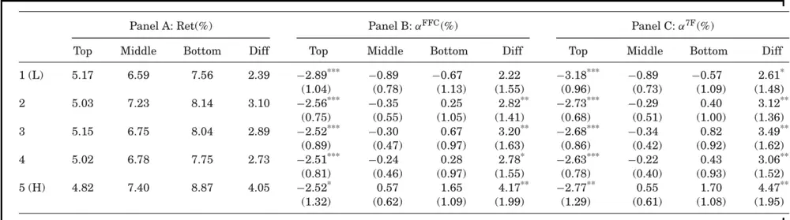
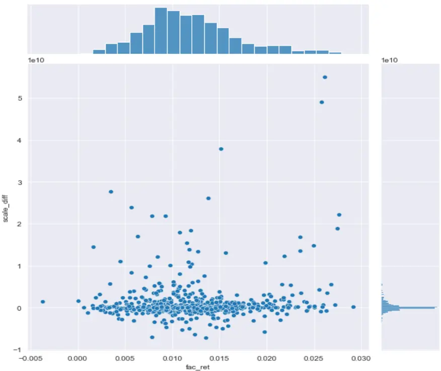
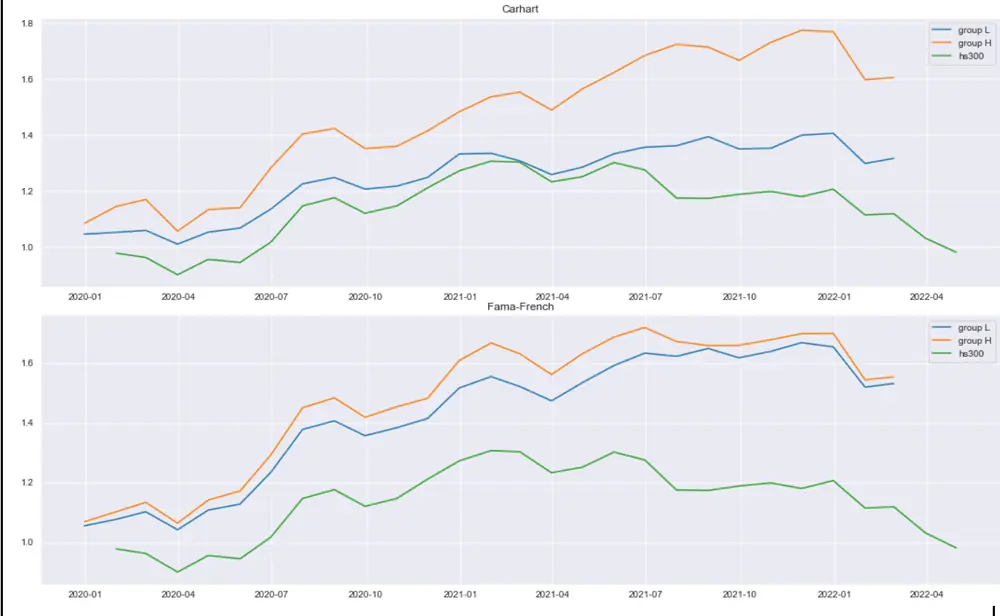
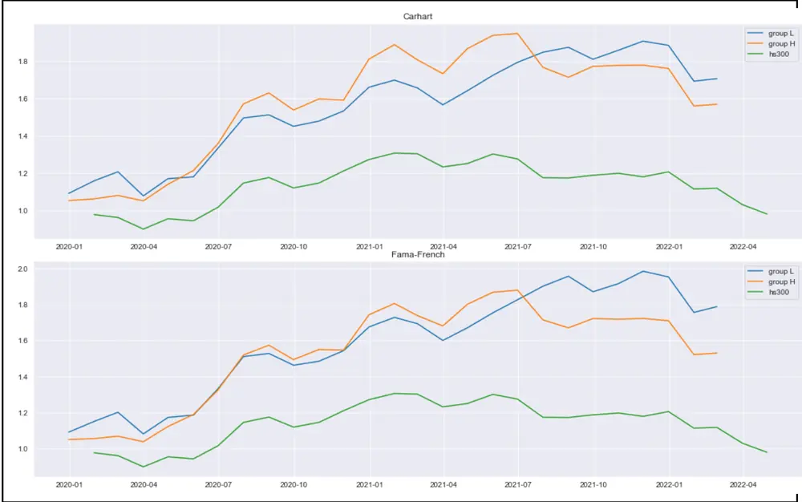

nInfo] [Table_Title] 2022.06.06

# 探寻基金规模与管理能力错配的深层原因

## ——学界纵横系列之二十六

陈奥林(分析师)

殷钦怡(分析师)

8 021-38674835

021-38675855

chenaolin@gtjas.com

yinqinyi@gtjas.com

证书编号 S0880516100001

S0880519080013

## 本报告导读：

本文从基金规模与管理能力错配的角度解释基金未来业绩表现不佳的原因，为基金业绩预测提供了有效指标。

## 摘要：

le_Summary]实证研究表明，投资者在进行基金配置时不会区分历史业绩来源于α收益还是因子收益。那些恰好投资于高因子溢价风格板块的基金因此会吸引大量的资金，从而产生基金规模与主动管理能力的错配。采用不同的因子模型（Fama 三因子，Carhart 四因子等）计算多因子α与因子暴露收益。控制多因子α后，基金规模流量与历史因子暴露收益呈现正相关关系。这表明历史因子暴露收益是造成基金规模错配的主要原因。不能被主动管理能力解释的基金规模增量被称为基金的超额规模。

对于绝对规模相同的基金，那些历史因子暴露收益更高的基金，即超额规模程度更高的基金，未来的业绩表现越差。这意味着，相比于基金的规模大小，基金规模的来源决定了基金未来的业绩表现。为了锁定历史因子暴露收益的作用，作者进一步控制了历史 Fama 三因子α、历史 Carhart 四因子α、以及历史七因子α，排除了均值回归等其他可能解释。

基金规模错配导致业绩不佳的传导路径可以通过基金的规模效应来解释。早先文献发现，价格影响与执行成本是驱动规模效应发挥作用的重要因素。与这些文献不同的是，作者认为规模效应只发生在基金的超额规模上。实证结果表明，对于那些存在高交易成本的基金，历史因子暴露收益与未来业绩的负相关关系更加显著。而对于历史因子暴露收益为负的基金，其交易成本对未来业绩表现没有显著的预测能力。

除了规模效应，基金规模错配导致业绩不佳存在第二条传导机制——羊群效应。作者发现，高因子暴露收益的基金喜欢持有那些在一段时间内享有高因子溢价的市场风格或板块，对这些风格板块有极高的因子暴露。这些风格板块因此经历了大量基金的跟风买入或卖出，使其价格显著偏离基本面。当未来价格向基本面回归时，那些高因子暴露收益的基金也会相应地产生显著为负的α收益。

金融工程

## 金融工程团队：

陈奥林：（分析师）

电话：021-38674835

邮箱：chenaolin@gtjas.com

证书编号：S0880516100001

杨能：（分析师）

电话：021-38032685

邮箱：yangneng@gtjas.com

证书编号：S0880519080008

## 殷钦怡：（分析师）

电话：021-38675855

邮箱：yinqinyi@gtjas.com

证书编号：S0880519080013

徐忠亚：（分析师）

电话：021- 38032692

邮箱：xuzhongya@gtjas.com

证书编号：S0880519090002

## 刘昺轶：（分析师）

电话：021-38677309

邮箱：liubingyi@gtjas.com

证书编号：S0880520050001

## 赵展成：（研究助理）

电话：021-38676911

邮箱：Zhaozhancheng@gtjas.com

证书编号：S0880120110019

## 张烨垲：（研究助理）

电话：021-38038427

邮箱：zhangyekai@gtjas.com

证书编号：S0880121070118

## 徐浩天：（研究助理）

电话：021-38038430

邮箱：xuhaotian@gtjas.com

证书编号：S0880121070119

## [Table_Re相关报告

短期增量资金引入有限，长期利好ETF成交活跃度抬升 2022.05.31

6 月沪深 300 成分股调整事件点评 2022.05.31通信 产 业 链 基 本 面 量 化 及 策 略 配 置2022.05.26

半导体景气持续，把握底部机遇 2022.05.26

中证 500 长期投资有哪些看点 2022.05.25

## 1. 选题背景

2018 年以来，个人投资者持有主动管理基金占比不断上升，催生了一批明星经理与爆款基金，不少基金的净资产在短时间内突破百亿。然而，让慕名而来的投资者失望的是，随着基金规模的迅速增长，这些爆款基金的亮眼业绩不仅没有持续，反而经历了巨幅回撤。

在以往的文献中，早已发现了基金规模对未来业绩的负效应，即随着基金规模的增加，收益下降。但本文作者第一次提出，导致未来收益下降的不是基金的绝对规模，而是基金规模与主动管理能力的错配。在理想世界中，理性投资者会根据基金经理的管理能力，即寻找α的能力，对基金进行配置，从而使错配为 0。但在现实世界中，由于投资者错把基金的历史因子暴露收益（Factor-Related Return，FRR）当成了基金经理的主动管理能力，使那些高 FRR 的基金获得了与之能力不相符的规模，进而导致了业绩的下滑。

## 2. 规模错配的产生原因：高历史因子暴露收益

## 2.1. 模型构建

作者采用一个七因子模型对基金收益进行建模。其中前四个因子来自Carhart(2016)，分别为 MKT、SMB、HML（Fama 三因子）、UMD 动量因子。后三个因子 IND 取自 Pastor and Stambaugh(2002b)，是经过主成分处理后的行业因子。

对每一个时点 t 和每一个基金 i，取前 m 个月的数据进行如下 7 因子时序回归：

$$
\begin{array}{rl}&{r_{\mathrm{i},\tau}-r_{f,\tau}=\alpha_{t}^{7F}+b_{i,t}\big(MKT_{\tau}-r_{f,\tau}\big)+s_{i,t}SMB_{\tau}+h_{i,t}HML_{\tau}+}\\&{p_{i,t}UMD_{\tau}+\sum_{j=1}^{3}\gamma_{t}^{j}IND_{\tau,t}^{j}+\mathsf{v}_{\mathrm{i},\tau},\quad\tau\in\{t-\frac{m}{12},\dots,t=\frac{1}{12}\}}\end{array}
$$

其中 $\alpha^{7F}$ 代表经过因子模型调整后的收益。

## 2.2. 历史因子暴露收益

定义平均历史因子暴露收益：

$$
\Delta_{\mathrm{\scriptsize~}i,t}=\frac{1}{m}\sum_{\tau=t-\frac{m}{12}}^{t-\frac{1}{12}}\left(s_{i,t}SMB_{\tau}+h_{i,t}HML_{\tau}+p_{i,t}UMD_{\tau}+\sum_{j=1}^{3}\gamma_{i,t}^{j}IND_{\tau,t}^{j}\right)
$$

业因子暴露所带来的收益。在计算过程中并没有包括市场因子 ，这是因为以往的文献已经证实，基金规模的流量与市场因子不相关。(Berkand van Binsbergen(2016) and Barber, Huang, and Odean(2016))

## 2.3. 基金的规模流量

定义季度规模流量

$$
Flow_{i,t}=AUM_{i,t}-\prod_{j=0}^{2}\left(1+r_{i,t-\frac{j}{12}}\right)AUM_{i,t-\frac{1}{4}}
$$

其中 AUM(Asset under Management)代表基金在 t 时刻的规模。规模流量衡量了基金 i在一个季度内的净流入（流出），并对期初规模的自然增长进行了调整。

## 2.4. 实证检验

采用条件双重排序法——在每个横截面 t，先根据因子调整收益 $.\alpha^{7F}$ 进行分位数分组，再在每个组内依据平均因子收益Δ进行分组，在组内计算平均规模增量Flow，进行显著性检验。实证结果如表 1 所示。结论为：控制了α收益后，越高的历史因子暴露收益带来越高的基金规模增量。

由于基金的规模增量反应了投资者对基金管理能力的评价，该结论表明，投资者把本该归因为估值、规模、动量、行业等因子带来的暴露收益，错归为基金经理的主动管理能力，从而导致了这一类基金的规模过高，产生错配。

表 1：历史因子暴露收益与规模流量

| $\mathrm{A_{s}}$ |  | $\mathrm{A_{e}}$ Flow |  | $\Delta$ $\alpha^{\mathrm{CAPM}}$ |  | $\mathrm{A_{s}}$ | $\mathrm{A_{e}}$ | Flow | $\Delta$ | $\alpha^{\mathrm{CAPM}}$ | $\mathrm{A_{s}}$ | $\mathrm{A_{e}}$ | Flow | ∆ | $\alpha^{\mathrm{CAPM}}$ |
| --- | --- | --- | --- | --- | --- | --- | --- | --- | --- | --- | --- | --- | --- | --- | --- |
|  | Top-Tercile ∆ |  |  |  |  | Middle-Tercile ∆ |  |  |  |  | Bottom-Tercile ∆ |  |  |  |  |
|  | (1) | (2) | (3) | (4) | (5) | (6) | (7) | (8) | (9) | (10) | (11) | (12) | (13) | (14) | (15) |
| 1 (L) | 383 | 413 | -6.2 | 5.0 | -2.5 | 418 | 376 | -15.0 | 0.5 | -5.9 | 488 | 292 | -18.2 | -3.3 | -10.1 |
| 2 | 487 | 775 | 4.4 | 3.9 | 1.2 | 539 | 519 | -9.2 | 0.4 | -2.1 | 490 | 413 | -13.1 | -2.8 | -5.4 |
| 3 | 514 | 936 | 13.3 | 3.7 | 2.9 | 641 | 745 | 2.7 | 0.4 | -0.4 | 591 | 597 | -7.2 | -2.8 | -3.6 |
| 4 | 727 | 1,395 | 24.9 | 3.6 | 4.6 | 916 | 1,325 | 15.0 | 0.4 | 1.4 | 723 | 756 | 0.0 | -3.0 | -2.0 |
| 5 (H) | 601 | 1,599 | 38.1 | 4.0 | 9.0 | 679 | 1,370 | 27.7 | 0.4 | 4.9 | 588 | 855 | 10.5 | -3.7 | 1.6 |

数据来源：《The Mismatch Between Mutual Fund Scale and Skill》

## 3. 规模错配与业绩不佳

上一节中检验了因子收益与规模流量的正相关关系。也就是说，基金的规模来自：1）基金经理的主动管理能力；2）高历史因子暴露收益。因此，对于 2 个规模相同的基金，历史因子暴露收益更高的基金规模错配的程度越高。本节检验基金规模错配与未来业绩表现的负相关关系，为此采用条件双重排序法构建模拟组合，来控制可能会影响未来业绩的其他变量。

## 3.1. 控制基金的绝对规模

基金规模对未来业绩存在负效应，这一点已成为学界共识。但本文作者认为，导致未来收益下降的不是基金的绝对规模，而是基金规模与主动管理能力的错配，即超额规模(excessive AUM)。为了检验这一假说，就要控制绝对规模的大小。

采用条件双重排序法，以基金的绝对规模作为第一排序变量，从高到低分成 5个大组。再在每个组合内部根据历史因子暴露收益分为 3个小组，总共 15 个组合，并计算每个组合未来一年的收益率，以及不同因子模型调整后的收益率。

表 2：不同排序组合的α收益（控制绝对规模）

|  | Panel A: Ret(%) |  |  |  | Panel B: αFFC(%) |  |  |  | Panel C: α7F(%) |  |  |  |
| --- | --- | --- | --- | --- | --- | --- | --- | --- | --- | --- | --- | --- |
|  | Top | Middle | Bottom | Diff | Top | Middle | Bottom | Diff | Top | Middle | Bottom | Diff |
| 1 (L) | 5.46 | 6.54 | 8.43 | 2.96 | -2.77*** | -0.83 | 0.72 | 3.49** | -2.91 *** | -0.82* | 0.82 | 3.73** |
|  |  |  |  |  | (0.90) | (0.54) | (1.02) | (1.62) | (0.86) | (0.46) | (1.00) | (1.60) |
| 2 | 5.06 | 6.60 | 8.35 | 3.28 | -2.75*** | -0.66 | 0.39 | 3.15 | -2.94*** | -0.60 | 0.48 | 3.43* |
|  |  |  |  |  | (0.93) | (0.53) | (1.09) | (1.75) | (0.88) | (0.46) | (1.08) | (1.73) |
| 3 | 4.59 | 6.74 | 7.85 |  | -3.19*** | -0.68 | 0.08 | 3.27** | -3.35*** | -0.67 | 0.25 | 3.61** |
|  |  |  |  | 3.26 | (0.94) | (0.51) | (0.92) | (1.55) | (0.89) | (0.43) | (0.89) | (1.50) |
| 4 | 4.29 | 7.07 | 8.29 | 4.00 | -3.28** | -0.48 | 0.69 | 3.96** | -3.41 *** | -0.46 | 0.76 | 4.18*** |
|  |  |  |  |  | (0.85) | (0.64) | (1.10) | (1.62) | (0.79) | (0.60) | (1.08) | (1.60) |
| 5(H) | 5.34 | 7.00 | 8.22 | 2.87 | -2.16** | -0.01 | 0.70 | 2.86 | -2.37*** | 0.00 | 0.82 | 3.19** |
|  |  |  |  |  | (0.81) | (0.46) | (0.96) | (1.50) | (0.74) | (0.41) | (0.91) | (1.45) |
| All |  | 6.93 | 8.25 |  | -2.35*** | -0.21 | 0.67 | 3.02*率 | -2.53*凉* | -0.21 | 0.78 | 3.31** |
|  | 5.21 |  |  | 3.04 | (0.76) | (0.41) | (1.00) | (1.46) | (0.77) | (0.34) | (0.98) | (1.50) |

数据来源：《The Mismatch Between Mutual Fund Scale and Skill》

从表 2 可以看到，控制绝对规模后，具有最高因子暴露收益的组合未来一年的表现最差。观察 Diff 列，以 Carhart 四因子作为基准，因子暴露收益最高的小组的α收益要比因子暴露收益最低的小组低 286 bps 到396bps。以 7 因子作为基准，则要低 319bps 到 418bps。

## 3.2. 控制历史α收益

未来α收益的差别也可能是由基金经理本身主动管理的能力差距带来的。为了消除这一因素带来的影响，以历史α收益作为第一排序变量再次检验，结论依旧不变。

表 3：不同排序组合的α收益（控制历史α收益）

数据来源：《The Mismatch Between Mutual Fund Scale and Skill》

## 4. 规模错配的传导机制

作者认为，基金规模错配导致未来业绩下滑具有 2 条传导机制：1）规模效应 2）羊群效应。规模效应主要受到交易成本驱动，从基金层面解释了负α收益的来源。羊群效应由从众资金驱动，从市场风格层面解释了负α收益的来源。

## 4.1. 规模效应：交易成本驱动

早期文献指出，交易时的价格影响和执行成本是驱动规模效应发生作用的主要途径。与这些文献不同的是，作者认为规模效应并不通过绝对规模发挥作用，而是作用于基金的相对规模。前文在规模错配的视角下检验了规模流量与因子暴露收益的正相关关系。如果规模效应的确发生作用，那么因子暴露收益和交易成本也应呈现正相关。

采用 Pastor, Stambaugh and Taylor(2018)中的方法对基金的交易成本进行建模：

$$
C=cD^{2}\displaystyle{\sum_{j=1}^{N}\frac{\omega_{\mathrm{j}}^{2}}{M_{j}}}
$$

其中 C 代表基金的总交易成本，D 代表基金的交易总额， $\omega_{j}$ 是股票j在基金中所占比例， $M_{j},$ 是股票j的总市值，c > 0为比例常数。直觉上，基金交易的股票占总总市值的比例越高，价格影响的程度越高，相应的交易成本也越高。

如果进一步假设交易金额与换手率成正比：D = AT，其中 A是基金的规模，T 是基金换手率，那么可以得到基金的相对交易成本公式：

$$
\tilde{C}=\cfrac{C}{A}=c^{\prime}AT^{2}\sum_{j=1}^{N}\cfrac{\omega_{j}^{2}}{M_{j}}.
$$

由于计算交易成本的目的是为了排序分组，所以并不需要比例常数c′的值，其他的变量都能够根据市场公开信息计算得到。

采用条件双重排序法，以历史因子暴露收益作为第一排序变量把基金分为 2 大组：第一组取因子暴露收益最高的前 1/3，第二组取剩下的 2/3。在每个大组内，根据上述交易成本公式分为 3 个小组，每组各占 1/3。对每个小组计算相应的α收益，如表 4 所示：

表 4：交易成本与未来收益率排序组合

|  | Top-Tercile ∆ |  |  |  | Others |  |  |  |
| --- | --- | --- | --- | --- | --- | --- | --- | --- |
|  | Ret | $\alpha^{\mathrm{CAPM}}$ | $\alpha^{\mathrm{FFC}}$ | $\alpha^{7\mathrm{F}}$ | Ret | $\alpha^{\mathrm{CAPM}}$ | $\alpha^{\mathrm{FFC}}$ | $\alpha^{7\mathrm{F}}$ |
| Low-C | 6.02 | -1.21 (0.80) | -1.21 (0.81) | -1.37* (0.74) | 6.65 | -0.07 (0.58) | -0.18 (0.46) | -0.05 (0.38) |
| Mid-C | 5.45 | -1.88 ** | -1.95 *** | -2.03 *** | 7.38 | 0.32 | 0.17 | 0.30 |
| High-C | 4.67 | (0.74) -3.15 *** | (0.73) -3.02 *** | (0.68) -3.23 *** | 7.62 | (0.55) 0.20 | (0.49) 0.05 | (0.42) 0.04 |
| H-L | -1.35 | (0.87) -1.93 *** | (0.86) -1.81 *** | (0.81) -1.86 *** | 0.98 | (0.70) 0.27 | (0.67) 0.23 | (0.63) 0.09 |

数据来源：《The Mismatch Between Mutual Fund Scale and Skill》

纵向来看，在因子暴露收益最高的 Top 组中，交易成本越高，未来的α收益越低，规模效应的假说相一致。而在后 2/3 的 Others 组中，不论采用哪种因子模型调整，α收益并不显著区别于 0。这意味着，这些基金的规模来自于主动管理的能力——即寻找α的能力，所以规模效应并不通过规模错配发生作用，也就是说超额规模不具备预测能力。

## 4.2. 羊群效应：从众资金流驱动

前文已经证实，投资者在进行基金配置时不会区分α收益与因子暴露收益，这意味着从众行为。当市场上的某些风格在一段时间内具有高因子溢价时，那些高暴露于这些风格的基金会吸引到大量从众资金，形成超额规模。由于这些资金并不反映市场信息，其造成的价格影响将会显著偏离基本面价值，导致基金未来的收益率下降。

为了验证这一假说，作者根据市值、BM 和历史收益率把股市分为27(3x3x3)个组合，代表不同的风格，再依据基金买入量进一步分为 3 个组合。

如表 5 所示，有大量基金资金流入的风格板块在未来会产生-4%到-5%的α收益。资金流入最多和最少的组合的α差值为 7%，且在 1%的显著性水平下显著。

表 5：根据 FIT 排序的风格收益率

| Ret(%) | $\alpha^{\mathrm{CAPM}}(\%)$ | $\alpha^{\mathrm{FF3}}(\%)$ | $\alpha^{\mathrm{7F}}(\%)$ |
| --- | --- | --- | --- |
| FIT low 11.08 | $2.74^{\ast}$ (1.67) | 1.21 (1.39) | $3.10^{^{***}}$ (1.17) |
| FIT middle | 8.13 -1.68 (1.84) | -2.46* (1.47) | -1.07 (1.33) |
| FIT high | 5.14 -5.57 (2.64) | -5.19 ** (1.82) | -3.90 ** |
| FIT H-L | -5.94 -8.30 (2.49) | *** -6.40 *** (2.00) | (1.74) -7.00 *** (1.96) |

数据来源：《The Mismatch Between Mutual Fund Scale and Skill》

为了衡量基金的从众资金流，采用 Lou(2012)中的方法定义基金的季度从众资金流：

$$
QFIT_{j,q}=\frac{\sum_{k}shares_{k,j,q-1}\times\hat{f}_{k,q}\times PSF_{k,q}}{\sum_{k}shares_{k,j,q-1}}
$$

其中， $shares_{k,j,q-1}$ 代表基金 k 在季度 q-1 持有的股票j 的份数， $\hat{f}_{k,q}$ 是基金 k 在季度 q 无法被 $.\alpha^{7F}$ 解释的资金流量，PSF 代表一个缩放系数，反映了基金经理如何根据基金流量调整持仓量。相应的，个股 j 的从众资金流和风格层面的从众资金流可以分别定义为：

$$
FIT_{j,t}=\sum_{l=1}^{K}QFIT_{j,t-\frac{l}{4}}
$$

$$
FIT_{\pi,t}=\sum_{j\in N_{t}^{\pi}}\mu_{j,t}^{\pi}FIT_{j,t}.
$$

其中， $N_{t}^{\pi}$ 是风格π中的个股集合， $\mu_{j,t}^{\pi}$ 是个股j在风格π中占的市值比例。

对每一个日历年，以历史因子暴露收益作为第一排序变量分成 Top、Middle 和 Bottom3 大组，并计算市值加权收益率。以市值加权收益率作为因变量，高 FIT 风格收益率、低 FIT 风格收益率以及多空 Diff 组合收益率作为自变量进行时间序列回归，拟合得到的系数就是基金组合对相应风格板块的因子暴露。

表 6：不同 FIT 风格板块的因子暴露

|  | Top-Tercile ∆ |  |  | Middle-Tercile ∆ |  |  | Bottom-Tercile ∆ |  |  |
| --- | --- | --- | --- | --- | --- | --- | --- | --- | --- |
|  | (1) | (2) | (3) | (4) | (5) | (6) | (7) | (8) | (9) |
| Adj-ret (%) | -2.53 *** (0.77) | -2.06 *** (0.70) | -1.98*** (0.70) | -0.21 (0.34) | -0.26 (0.35) | -0.22 (0.34) | 0.78 (0.98) | -0.02 (0.94) | 0.11 (0.93) |
| FIT high |  | 0.12 *** (0.026) |  |  | 0.008 (0.013) |  |  | -0.090 ** (0.036) |  |
| FIT low |  | -0.071 ** (0.033) |  |  | 0.018 (0.016) |  |  | 0.17 *** (0.045) |  |
| FIT H-L |  |  | 0.10 *** (0.020) |  |  | 0.002 (0.010) |  |  | -0.12 *** (0.027) |
| FFC factors | Yes | Yes | Yes | Yes | Yes | Yes | Yes | Yes | Yes |
| Industry factors | Yes | Yes | Yes | Yes | Yes | Yes | Yes | Yes | Yes |

数据来源：《The Mismatch Between Mutual Fund Scale and Skill》

如表 6 所示，具有最高历史因子暴露收益的 Top 组对资金净流入高的风格具有正暴露，对资金净流入低的风格具有负暴露。历史因子暴露收益为负的 Bottom 组与之相反，对资金净流入高的风格具有负暴露，而对资金净流入低的风格具有正暴露。Middle组的暴露收益则不显著区别于0。这一结果与前述假说相一致。

表 6 还告诉我们了基金的业绩表现在多大程度上受到羊群效应的影响。在上一节——规模错配与业绩不佳中，根据基准因子模型的不同，Top 组的净α收益处于-230bps 到-250bps。从表 6 可知，其中 55bps 的负α收益是由对高 FIT 的风格暴露导致的。也就是说，从众资金流驱动的羊群效应可以解释高因子暴露收益基金 20%到 25%的业绩表现。

## 5. A 股实证

## 5.1. 原文实证

在原文中，作者选取的样本范围为 CRSP 数据库中投资于国内市场的权益型主动管理基金。遵循这一做法进行 A 股实证，，样本范围选取为股票型以及偏股的混合型开放式基金，并剔除 联结等被动指数型基金以及投资于国外市场的基金。选取样本期为2018年6月至2021年6月，测试期为2021年7月至2022年3月。数据频率遵照原文采用月度数据，并剔除样本量不够的基金。最后的样本数量为 746 只基金。

对每一只基金的时间序列数据采用 Fama-French 5 因子模型进行回归，计算相应的样本期因子暴露收益和多因子α，简单定义基金的规模流量为样本期末的基金规模（合计）减去样本期初的基金规模（合计）。其中，基金的收益率均采用基金主代码的收益率。因子暴露收益及规模流量的分布图如图 1 所示：

## 图 1 因子暴露受益与规模增量分布散点图：尖峰厚尾现象显著

## 数据来源：Wind、国泰君安证券研究

样本期的平均因子暴露收益为 1.19%，标准差 0.514%。规模流量的均值为 1.034 亿。从分布图中可以看到，规模流量具有尖峰肥尾的特征，存在极端值，因此在后续实证中均先采用缩尾法（winsorization）处理异常值。从散点图中，并不能直接识别出因子暴露收益与规模流量具有明显的相关关系。

以 0.3、0.7 作为临界分位数，对因子暴露收益构建排序组合和多空组合（H-L），计算相应的等权重平均规模增量（Flow）、因子暴露收益（Δ）和 $\alpha^{Carhart}$

表 7：历史因子暴露收益与规模流量

|  | $A_{s}$ | $A_{e}$ | Flow | ∆ | $\pmb{\alpha}^{5F}$ |
| --- | --- | --- | --- | --- | --- |
| 1(H) | 1.420 | 2.828 | 1.409 | 1.803% | 0.381% |
| 2 | 1.247 | 2.058 | 0.811 | 1.137% | 0.786% |
| 3(L) | 0.971 | 1.927 | 0.955 | 0.647% | 1.147% |
| H-L | 0.499 | 0.901 | 0.454 | 1.156% | -0.766% |

数据来源：Wind 注：Flow 的单位为亿元

随着因子暴露收益的增加，规模流量呈递增趋势， $\pmb{\alpha}^{5F}$ 呈递减趋势。多空组合（H-L）的规模流量为 0.454 亿元，而α收益为负。表 7 的结果表明，基金的规模与主动管理能力错配的现象在 A股市场同样存在。基金规模的增量一部分归因为历史因子暴露的收益，并且高因子暴露收益伴随着更低的主动管理能力。

表 8：不同排序组合的α收益（控制绝对规模）

|  | Panel A: Ret(%) |  |  |  | Panel B $\alpha^{5F}(\%)$ |  |  |  | Panel C: $\alpha^{Carhart}(\%)$ |  |  |  |
| --- | --- | --- | --- | --- | --- | --- | --- | --- | --- | --- | --- | --- |
|  | Top | Middle | Bottom | Diff | Top | Middle | Bottom | Diff | Top | Middle | Bottom | Diff |
| 1(H) | -3.19 | -2.06 | -1.26 | 1.93 | -0.13 | 0.95 | 0.76 | 0.89 | 0.05 | 0.46 | 0.77 | 0.72 |
| 2 | -2.70 | -1.99 | -1.27 | 1.43 | -0.31 | 0.02 | 0.49 | 0.80 | -0.11 | -0.03 | 0.40 | 0.51 |
| 3 | -2.86 | -1.67 | -0.99 | 1.87 | -0.28 | 0.08 | -0.30 | -0.02 | -0.24 | 0.24 | 0.40 | 0.64 |
| 4 | -2.40 | -1.60 | -0.90 | 1.50 | 0.70 | 0.51 | 0.81 | 0.09 | 0.09 | 0.21 | 0.41 | 0.32 |
| 5(L) | -2.41 | -1.52 | -1.24 | 1.17 | 0.37 | -0.36 | -0.20 | -0.57 | 0.27 | -0.17 | 0.18 | -0.09 |
| ALL | -2.78 | -1.78 | -1.12 | 1.66 | 0.00 | 0.25 | 0.29 | 0.29 | -0.02 | 0.14 | 0.39 | 0.41 |

数据来源：Wind

复现原文中超额规模与未来多因子α的结论。采用基金规模和因子暴露收益作为独立变量，计算超额收益率、Fama 5 因子α和 Crhart 4 因子α。结果如表 8 所示。原文结论的基本趋势没有发生变化。在每个 AUM 组内，更高的因子暴露收益伴随更低的未来收益率。例如，Charhart 4 因子作为基准模型，Top 组的α收益比 Bottom 组低-0.09 到 0.72bps。但使用Fama-French 5 因子模型作为基准时，这一趋势似乎不再明显。

## 5.2. 单因子回测

为了检验 FRR 因子在 A 股的预测能力，以季度换仓的方式进行滚动回测，测试区间为 2020Q1 年至 2022Q1。在每一个季度横截面，取其前 $m=$ 24个月的数据进行多因子归因，计算相应的历史因子暴露收益、α收益、平均规模和规模增长率。在因子构造方面，考虑 2 种构造方式：

$$
\begin{aligned}&Factor\;1=\;\Delta_{\;i,t}=\frac{1}{m}\sum_{\tau=t-\frac{m}{12}}^{t-\frac{1}{12}}\left(s_{i,t}SMB_{\tau}+h_{i,t}HML_{\tau}+p_{i,t}UMD_{\tau}\right)\\&\\&Factor2=\frac{1}{2}\;\Delta_{\;i,t}+\frac{1}{2}A\dot{U}M\quad,\quad 其中A\dot{U}M=\frac{AUM_{0}-AUM_{-m}}{AUM_{-m}}.\\\end{aligned}
$$

Factor1 遵循原文，以历史 FRR 代表规模错配的程度。但 FRR 并没有考虑到不同基金规模增长率之间不具有可比性。因此，Factor2 使用加总 Z值法对 FRR 和规模增长率进行等权平均。

图 2：Factor 2：以 FRR 与规模增量的加权平均作为因子图 2 和图 3 展示了因子分层后分位数最高（groupH）和最低（groupL）的累计超额收益率曲线。组合的收益率按照前 24m 的平均规模进行加权计算。相比于沪深 300，这两个因子展现出了一定的选基能力。但令人惊讶的是，H组的收益在总体上优于 L组，这一点与原文结论相悖。这可能与 2020 年来基金的抱团行情有关。那些在系统性因子上持有更大暴露的基金在这一段确实能够获得更高的收益。但如果拉长时间线来看，收益向均值回归的可能性非常高。相比 L组，H组的波动性与回撤同样更大，这一点并不意外。随着风格的切换，历史 FRR 带来的收益并不能保证持续。

数据来源：Wind、国泰君安证券研究

图 3：Factor 1：以 FRR 作为排序因子

数据来源：Wind、国泰君安证券研究

在因子构造方面，尽管在考虑了相对规模增长率后，Factor2 的单调性相较于 Factor 1 有所提升，但效果并不显著。这意味着对于因子的构造还有改进的空间，可以进一步考虑 FRR 与基金规模的关系，更为准确地度量基金的相对超额规模。

## 6. 结论

## 6.1. 原文结论

基于基金规模与历史因子暴露收益的观察，本文证实了基金的规模增量并不能够被基金的主动管理能力所解释，有一大部分来自于投资者对历史因子暴露收益的追求。这一规模与主动管理能力的错配导致基金未来业绩表现不佳。尽管基金规模与未来业绩的负相关关系早已被市场与学界发现，但本文作者指出，正是由于投资者无法对基金的主动管理能力正确定价，由此形成的基金超额规模才是预测未来业绩表现更有效的指标。

本文进一步加深了我们对于主动基金评价的理解。早先文献如 Fama andFrench(2010)通过实证发现，在考虑手续费之后，在市场平均意义下，基金经理的α收益小于 0；在不考虑手续费时，基金经理的α收益不显著区别与 0。基于这些观察，得出基金经理不具有主动管理能力的结论。本文作者发现，这主要是由那些绝对规模与超额规模都占比极大的少数基金导致的。在排除这些受到市场盲目跟风追捧的基金之后，余下的基金具有正的主动管理能力。

## 6.2. 我们的思考

金融理论告诉我们，理性的投资者会根据各种模型理论及指标来进行资产配置。然而，从实证结果来看，没有可靠证据表明个人投资者会对基金经理能力（即多因子基准α）进行复杂评估。事实上，投资者简单的业绩追逐能最好地解释流向共同基金以及基金间的资金流。

其他因素相同的情况下，基金的 越高，基金传递给投资者的能力错觉就越强，投资者的跟风行为也越激进，产生的错配程度越严重。这一行为不可忽视的经济后果，FRR 越高的基金，投资者在未来一段时间获得的实际收益反而越低，投资者的绩效差异就越大，反映了受有限关注约束的投资者的行为偏差。这一现象提醒我们可以从行为金融的角度来构建因子。在对市场行为偏差有充分认知的基础上，利用行为偏差构建因子，相比传统因子可能具有更好的预测能力。

不可忽视的是，超额规模指标的计算依然是基于传统因子模型的基础之上的。在 A股实证中，采用 Fama-French 5 因子模型所获得的结论并不如原文中那么明确，这可能表明该模型在 股的适用度仍有待商榷。采用哪一种多因子模型能够更好地对基金收益率进行归因，是该指标能否更好地应用与 A股市场所需思考的问题。

## 本公司具有中国证监会核准的证券投资咨询业务资格

## 分析师声明

作者具有中国证券业协会授予的证券投资咨询执业资格或相当的专业胜任能力，保证报告所采用的数据均来自合规渠道，分析逻辑基于作者的职业理解，本报告清晰准确地反映了作者的研究观点，力求独立、客观和公正，结论不受任何第三方的授意或影响，特此声明。

## 免责声明

本报告仅供国泰君安证券股份有限公司（以下简称“本公司”）的客户使用。本公司不会因接收人收到本报告而视其为本公司的当然客户。本报告仅在相关法律许可的情况下发放，并仅为提供信息而发放，概不构成任何广告。

本报告的信息来源于已公开的资料，本公司对该等信息的准确性、完整性或可靠性不作任何保证。本报告所载的资料、意见及推测仅反映本公司于发布本报告当日的判断，本报告所指的证券或投资标的的价格、价值及投资收入可升可跌。过往表现不应作为日后的表现依据。在不同时期，本公司可发出与本报告所载资料、意见及推测不一致的报告。本公司不保证本报告所含信息保持在最新状态。同时，本公司对本报告所含信息可在不发出通知的情形下做出修改，投资者应当自行关注相应的更新或修改。

本报告中所指的投资及服务可能不适合个别客户，不构成客户私人咨询建议。在任何情况下，本报告中的信息或所表述的意见均不构成对任何人的投资建议。在任何情况下，本公司、本公司员工或者关联机构不承诺投资者一定获利，不与投资者分享投资收益，也不对任何人因使用本报告中的任何内容所引致的任何损失负任何责任。投资者务必注意，其据此做出的任何投资决策与本公司、本公司员工或者关联机构无关。

本公司利用信息隔离墙控制内部一个或多个领域、部门或关联机构之间的信息流动。因此，投资者应注意，在法律许可的情况下，本公司及其所属关联机构可能会持有报告中提到的公司所发行的证券或期权并进行证券或期权交易，也可能为这些公司提供或者争取提供投资银行、财务顾问或者金融产品等相关服务。在法律许可的情况下，本公司的员工可能担任本报告所提到的公司的董事。

市场有风险，投资需谨慎。投资者不应将本报告作为作出投资决策的唯一参考因素，亦不应认为本报告可以取代自己的判断。
在决定投资前，如有需要，投资者务必向专业人士咨询并谨慎决策。

本报告版权仅为本公司所有，未经书面许可，任何机构和个人不得以任何形式翻版、复制、发表或引用。如征得本公司同意进行引用、刊发的，需在允许的范围内使用，并注明出处为“国泰君安证券研究”，且不得对本报告进行任何有悖原意的引用、删节和修改。

若本公司以外的其他机构（以下简称“该机构”）发送本报告，则由该机构独自为此发送行为负责。通过此途径获得本报告的投资者应自行联系该机构以要求获悉更详细信息或进而交易本报告中提及的证券。本报告不构成本公司向该机构之客户提供的投资建议，本公司、本公司员工或者关联机构亦不为该机构之客户因使用本报告或报告所载内容引起的任何损失承担任何责任。

## 评级说明

## 1.投资建议的比较标准

投资评级分为股票评级和行业评级。以报告发布后的 12 个月内的市场表现为比较标准，报告发布日后的 12 个月内的公司股价（或行业指数）的涨跌幅相对同期的沪深 300 指数涨跌幅为基准。

## 2.投资建议的评级标准

报告发布日后的 12 个月内的公司股价（或行业指数）的涨跌幅相对同期的沪深300 指数的涨跌幅。

| 评级 |  | 说明 |
| --- | --- | --- |
| 股票投资评级 | 增持 | 相对沪深 300指数涨幅 15%以上 |
|  | 谨慎增持 | 相对沪深300指数涨幅介于5%～15%之间 |
|  | 中性 | 相对沪深300指数涨幅介于-5%～5% |
|  | 减持 | 相对沪深300 指数下跌5%以上 |
| 行业投资评级 | 增持 | 明显强于沪深 300 指数 |
|  | 中性 | 基本与沪深 300指数持平 |
|  | 减持 | 明显弱于沪深300指数 |

## 国泰君安证券研究所

|  | 上海 | 深圳 | 北京 |
| --- | --- | --- | --- |
| 地址 | 上海市静安区新闸路669 号博华广 场20层 | 深圳市福田区益田路6009号新世界 商务中心34层 | 北京市西城区金融大街甲9号金融 街中心南楼18层 |
| 邮编 | 200041 | 518026 | 100032 |
| 电话 | （021）38676666 | （0755）23976888 | (010)83939888 |
|  | E-mail: gtjaresearch@gtjas.com |  |  |