nInfo] [Table_Title] 2021.11.24

# 基于多元分析的 CNN-LSTM 模型

## ——学界纵横系列之二十七

陈奥林(分析师)

## 徐浩天(研究助理)

8 021-38674835

021-38038430

chenaolin@gtjas.com

xuhaotian@gtjas.com

证书编号 S0880516100001

S0880121070119

## 本报告导读：

本文介绍了一种多元CNN-LSTM复合深度学习模型用于并行金融时间序列数据的分析和预测。

le_Summary]近年来，机器学习尤其是深度学习模型越来越多地被应用在金融工程领域尤其是量化交易中。卷积神经网络（CNN），递归神经网络（RNN），长短期记忆（LSTM）等深度学习模型在股票价格预测领域中展现出了前所未有的优势。

《Multivariate CNN-LSTM Model for Multiple Parallel Financial Time-Series Prediction》一文指出，在经济全球化的今天，世界各地的股票市场存在较强的相互作用。通过将指数间的相互作用纳入模型中予以考虑，我们可能会得到更加可靠和准确的预测结果。而对于深度学习模型有效性表现不同且不稳定的问题，可以尝试同时使用多个深度学习模型进行预测。对此，本文提出了用于对多并行金融时间序列估计的多元 CNN-LSTM 模型。该模型考虑了并行金融时间序列之间的相关性，尝试对多个股票指数的时间序列数据进行较为精准的分析预测。本文利用来自上海、日本、新加坡和印度尼西亚四个亚洲股票市场的常规股市指数测试了多元 CNN-LSTM模型在新冠疫情大流行期间的有效性。

实验结果表明，与 CNN 和 LSTM 模型相比，多元 CNN-LSTM 模型具有最高的预测精度。证实了文章提出的设想：多个深度学习模型组合（本文为两个）的预测表现要优于单一模型，同时，考虑并行时间序列之间的相互作用因素，我们将得到更加准确的预测结果。

金融工程

## 金融工程团队：

陈奥林：（分析师）

电话：021-38674835

邮箱：chenaolin@gtjas.com

证书编号：S0880516100001

杨能：（分析师）

电话：021-38032685

邮箱：yangneng@gtjas.com

证书编号：S0880519080008

殷钦怡：（分析师）

电话：021-38675855

邮箱：yinqinyi@gtjas.com

证书编号：S0880519080013

徐忠亚：（分析师）

电话：021- 38032692

邮箱：xuzhongya@gtjas.com

证书编号：S0880120110019

## 刘昺轶：（分析师）

电话：021-38677309

邮箱：liubingyi@gtjas.com

证书编号：S0880520050001

## 赵展成：（研究助理）

电话：021-38676911

邮箱：Zhaozhancheng@gtjas.com

证书编号：S0880120110019

张烨垲：（研究助理）

电话：021-38038427

邮箱：zhangyekai@gtjas.com

证书编号：S0880121070118

徐浩天：（研究助理）

电话：021-38038430

邮箱：xuhaotian@gtjas.com

证书编号：S0880121070119

## [Table_Re相关报告

## 1. 文章背景与理论基础

## 1.1. 文章背景

时间序列是指按时间顺序排列的某一变量的一系列数据集合，股市指数就是一种金融时间序列。股市指数的走势受到各种因素的影响，包括如国内外经济政治形势、行业前景和公司运营情况等，同时也受到股市指数历史运动的影响。基于此，业界和学界开发了大量金融时间序列分析方法用于分析股市。

在经济全球化的今天，金融市场也在世界范围内连成了一个整体。我们有足够的理由相信，一个国家的股票市场指数的变动受到全球或该地区其他股票市场指数变动的影响。而目前，大多数时间序列预测方法的研究都局限于单变量时间序列分析，很少有模型使用时间序列之间交互作用的动力学规律进行预测。由于金融时间序列存在高噪声和波动聚集等特点，使用单变量时间序列分析分析方法对股票市场进行预测存在明显的缺点。

同时，已有的研究发现，在真实问题的应用中，没有一种深度学习算法总是优于其他模型。通过集成多个预测模型，将不同的算法进行合成，来利用每个算法的不同优势，已成为金融时间序列预测领域中一个新的增长点。

综上所述，目前金融时间序列预测领域主要存在两个问题：（1）没有一种特定的方法可以做到总是以最大的精度来预测金融时间序列数据的运动。（2）尽管金融时间序列数据中变量之间的相互依赖关系是众所周知的，但目前大多数预测模型还是局限于单变量时间预测分析。

针对以上问题，Harya Widiputra 等人在《Multivariate CNN-LSTM Modelfor Multiple Parallel Financial Time-Series Prediction》一文中开发了一种新型时间序列预测模型——多元 CNN-LSTM 模型。该模型结合了卷积神经网络模型（CNN）和长短期记忆网络模型（LSTM），利用卷积神经网络（CNN）从观察到的时间序列数据中提取重要特征，再使用长短期记忆网络（LSTM）通过所描述的特征来预测时间序列数据的值。此外，考虑到平行股市指数间的相互作用，多元 CNN-LSTM 模型还采用了一种多元分析技术，利用观测到的时间序列数据的关系趋势来预测其未来的值。作者预计采用这种方法将有助于提高金融时间序列数据特别是对多个平行的股票市场指数预测的准确性。

## 1.2. 理论基础

## 1.2.1. 深度学习

深度学习是机器学习的一种算法形式，它有以下特点：使用多层非线性处理单元的级联进行特征提取和转换，其中每个连续层使用前一层的输出作为输入；以有监督或无监督方式进行学习；能够根据不同的抽象层次对不同的表示级别进行建模。

一个在输入层和输出层之间有多个层的人工神经网络被称为深度神经网络（DNN），DNN 是一种能够将线性和非线性输入转换为输出的数学模型，它能够对极其复杂的非线性相互作用进行建模。相对传统人工神经网络，深度神经网络可以用比类似的浅层网络更少的单元对更加复杂的数据进行建模。

## 1.2.2. 卷积神经网络（CNN）

卷积神经网络（CNN）是计算机视觉工作中常用的一个深度神经网络模型，它也已被用于自动语音识别的声学建模。卷积神经网络（CNN）的灵感来自于生物学，它的神经元之间的连接模式类似于动物视觉皮层组织。卷积神经网络（CNN）被广泛应用于图像和视频识别、推荐系统、图像分类、医学图像分析和自然语言处理等领域。同时，卷积神经网络（CNN）也被证实在时间序列数据处理中存在优越性。

卷积神经网络（CNN）的一个主要特点是能够处理多通道输入数据，因此在《Multivariate CNN-LSTM Model for Multiple Parallel Financial Time-Series Prediction》一文的研究中，它是处理具有多个输入和输出的并行时间序列数据的理想选择。在结构上，CNN 主要由卷积层和池化层两部分组成。每个卷积层都包含几个卷积核，在卷积层进行卷积操作后，模型会提取出数据的重要特征，同时这一过程也会导致特征维数的增加。为了解决这一问题，减轻训练过程中的负担，CNN 往往会增加一层池化层，来减少提取的特征数量，产生最终的结果。CNN 的基本结构如图 1所示：

图 1 CNN的基本结构
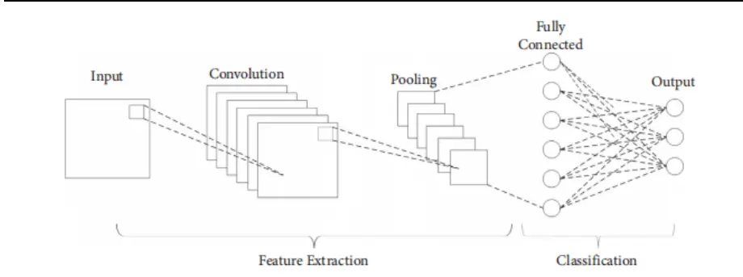
数据来源：《M ultivariate CNN-LSTM M odel for Multiple Parallel Financial Time-SeriesPrediction》，国泰君安证券研究

## 1.2.3. 长短期记忆模型（LSTM）

长短期记忆模型，也被称为 LSTM，是另一个著名的深度神经网络模型。LSTM 是一个递归神经网络（RNN），其基本结构如图 2 所示：

图 2 LSTM的基本结构
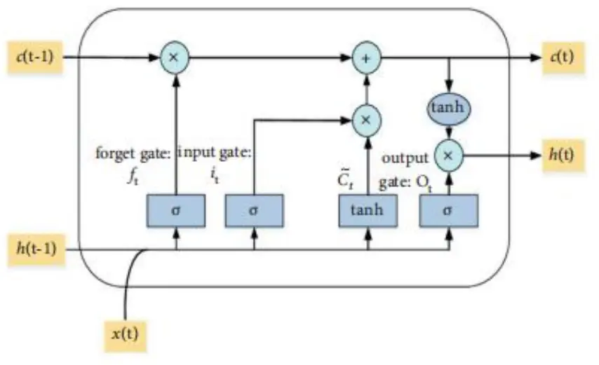
数据来源：《M ultivariate CNN-LSTM M odel for Multiple Parallel Financial Time-SeriesPrediction》，国泰君安证券研究

LSTM 是对单个时间序列数据集进行分类、分类和预测的理想算法。以往的研究表明，LSTM 能够较为可靠地对时间序列数据进行预测。LSTM进行时间序列预测的算法时，上一次处理过程的输出值和本次的输入值作为遗忘门的输入，遗忘门的计算结果通过下式得到：

$$
f_{t}=\sigma\big(W_{f}.[h_{t-1},x_{t}]+b_{f}\big)\tag{1}
$$

其中， $f_{t}$ 的范围为(0,1)， $W_{f}$ 是遗忘门的权重， $b_{f}$ 是遗忘门的偏置值， $x_{t}$ 是本次的输入值， $h_{t-1}$ 是上一次处理过程的输出值。

进一步，将输入门的上次的输出值和本次的输入值输入输入门，得到输入门候选单元的输出值和条件：

$$
i_{t}=\sigma(W_{i}.[h_{t-1},x_{t}]+b_{i})\tag{2}
$$

$$
\tilde{C}_{t}=tanh(W_{c\cdot}[h_{t-1},x_{t}]+b_{c})\tag{3}
$$

其中， $i_{t}$ 的范围为(0,1)， $W_{i}$ 是输入门的权重， $b_{i}$ 为输入门的偏置值， $W_{c}$ 为候选输入门的权重， $b_{c}$ 为候选输入门的偏置值。下一步我们利用以上结果对 LSTM 的模型参数进行调整：

$$
C_{t}=f_{t}\times C_{t-1}+i_{t}\times\tilde{C}_{t}\tag{4}
$$

下面，在本次处理过程 t 中，输出值 $h_{t-1}$ 和输入值 $x_{t}$ 作为输出门的输入，在输出门中由以下公式计算：

$$
o_{t}=\sigma(W_{0}[h_{t-1},x_{t}]+b_{o})\tag{5}
$$

其中， $W_{o}$ 是输出门的权重， $b_{o}$ 为输出门的偏置值。最后，LSTM 的最终输出值由输出门生成，计算公式如下：

$$
h_{t}=o_{t}\times\operatorname{tanh}(C_{t})\tag{6}
$$

tanh是一个激活函数，根据问题的特点进行确定。以上就是 LSTM 进行时间序列分析的基本步骤，该模型被广泛地应用于时间序列数据的分析和建模过程中。

LSTM 和 CNN 都可以在大量的数据集中研究复杂和未知的模式。由于以往的研究结果表明，每个模型在数据中捕捉趋势的能力不同，因此我们建立一个 CNN 和 LSTM 的集成模型，并期待这种集成方法能供提供更准确，更稳定的解决方案。

## 1.2.4. CNN 和 LSTM用于金融时间序列预测

股票价格或股票市场指数预测方法主要分为两种类型：传统的计量经济学分析和机器学习。然而，传统的计量经济学方法或带参数的方程不适合分析复杂、高维、嘈杂的金融时间序列。因此，近年来，机器学习特别是神经网络已经成为一种更好的选择。以往的研究结果表明，使用CNN 和 LSTM等深度学习模型进行金融时间序列预测是成功的。然而，与 LSTM 相比，CNN 由于其关键特征和特征提取时的特点，应用于数值时间序列数据时的预测精度较差。而 LSTM 与 CNN 相比，从数据集中提取最有价值的特性同样存在缺陷。因此，构建一个复合模型或集成模型，利用每个子模型来克服其弱点，以提高时间序列预测精度是合乎逻辑的。此外，基于先前的研究结果，基于并行金融时间序列数据间的相互作用将多元时间序列分析技术纳入此集成模型也是必要的。

## 2. 主要工作与核心模型

## 2.1. 主要工作

基于以上分析，Harya Widiputra 等人在《Multivariate CNN-LSTM Modelfor Multiple Parallel Financial Time-Series Prediction》一文中主要完成了以下工作：

（1）开发了一种新的多元深度学习集成方法，即多元 CNN-LSTM，该方法充分利用了 CNN 和 LSTM 模型在不同场景下的优势，通过在分析过程中考虑时间序列之间的相关性状态，对多个并行金融时间序列进行了预测。

（2）通过使用来自真实世界的数据，即来自亚洲地区的四个股票市场指数，进行试验从而评价所提出的多元 CNN-LSTM 模型。发现通过构建一个集成模型，利用每个模型的核心特征，并结合多元时间序列分析，可以为金融时间序列预测提供更好的预测精度。通过将所提出的多元CNN-LSTM与独立CNN和LSTM的评价指标进行对比，发现多元CNN-LSTM 在多个并行金融时间序列预测中表现更好。

## 2.2. 核心模型（多元 CNN-LSTM）

## 2.2.1. 多元时间序列分析模型

在处理经济、天气、生态学等现实现象中的变量时，一个变量的值往往会依赖于其他变量的历史值。例如，一个家庭的消费支出可能会受到诸如收入、利率和投资支出等因素的影响。如果这些因素都与消费支出有关，那么在预测消费支出时考虑它们的情况是有必要的。

同样，在分析多个相关的时间序列时，也需要对它们全部的影响因素进行综合考虑。一般地，对一组存在相互作用的并行时间序列，第 k 个序列 h 期后的预测值可以由下式表示：

$$
\hat{x}_{k,t+h}=f_{k}\big(x_{1,t},\dots,x_{k,t},\dots,x_{1,t-1},\dots,x_{k,t-1},\dots\big)\tag{7}
$$

在这一模型中，每个变量不仅取决于它自己过去的值，还取决于其他变量（过去的值）。对于一个多元时间序列 $x_{k,t},\mathrm{~k=1,}2,}3,...$ ,K为序列索引（代表第几个序列）， $\mathbf{t}=1{,}2{,}3{,}\ldots,$ ,T为时间点。式（7）为预测 $x_{t,k+h}$ 的多元时间序列预测函数。与单变量时间序列分析类似，多元时间序列分析的主要目标是为了找到一系列合适的函数 $[f_{1},f_{2},\ldots,f_{q},$ ，其中 q 是可用于预测具有良好属性的变量的潜在值的所构造函数的数量。在进行并行金融时间序列分析时，了解各序列（变量）之间的相互关系往往是值得关注的。例如，在一个拥有多个市场的证券交易环境中，人们往往会对这些市场相互作用的潜在影响很感兴趣。

## 2.2.2. 多元 CNN-LSTM 的一般概念

作者在文中建立的模型是一种 CNN 和 LSTM 的集合，称为多元 CNN-LSTM。在应用该模型前，需要对时间序列数据进行重构，以适应 CNN的输入数据结构，从而可以由 CNN 和 LSTM 相继进行处理。多元 CNN-LSTM 模型由两层主要结构组成：CNN 层，其主要功能是从处理后的时间序列数据中提取隐含的主要特征。LSTM 层，它负责进行最终预测结果的计算。多元 CNN-LSTM 的结构如图 3 所示，其中 CNN 和 LSTM 作为模型的主要组成部分，同时伴随着一个输入层，一个一维卷积层、一个池化层、一个 LSTM 隐藏层，以及一个用来产生最终预测结果的全连接层。

图 3 用于多并行时间序列预测的多元 CNN-LSTM的结构
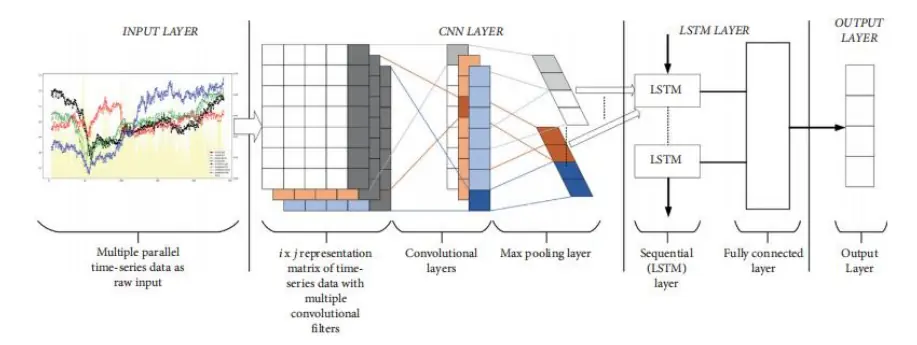
数据来源：《MCNNultivariate-LSTM M odel for Multiple Parallel Financial Time-SeriesPrediction》，国泰君安证券研究

## 2.2.3. 多元 CNN-LSTM 的学习过程

多元 CNN-LSTM 模型的训练和预测过程分为以下几步：

首先是训练数据输入，在这个阶段输入用于进行多元 CNN-LSTM 训练过程的数据。下面是初始化网络参数，以确定多元 CNN-LSTM 中每个层初始的权重和偏差值。然后，输入的数据依次通过卷积层和池化层，CNN 对输入数据的特征进行识别和提取，产生一个输出值作为 LSTM的输入。在 CNN 层，特征提取过程主要基于输入的时间序列数据。

下面，CNN 层的输出值输入 LSTM 层。在该 LSTM 层中，预测过程主要基于观测到的时间序列值，其中来自 LSTM 层的输出值成为全连接层的输入，然后由全连接层产生最终的预测值。预测训练过程在这一阶段中完成，并启动对训练结果的评估过程，计算预测结果的误差。将由输出层输出的预测值与经过处理的数据的实际值进行比较，从而计算出预测误差。

基于预测误差的评价结果可作为确定是否满足训练的停止条件的参考，训练停止条件是达到预定的训练周期次数，以及预测误差低于某一提前确定的阈值。

如果评价结果没有达到训练过程的停止条件，则将计算出的误差值传回前一层，然后调整每层的权重和偏置值（反向传播误差），再返回第一步，重复整个训练过程。相反，如果评价结果满足训练停止条件中的任何一个，则完成模型的训练，并保存整个多元 CNN-LSTM 网络的参数配置。

下一阶段是使用测试集数据对完成训练的多元 CNN-LSTM 模型进行测试。在这一过程中，首先将用于进行预测的数据或测试集数据输入保存好的多元 CNN-LSTM 模型，然后得到输出值（预测结果）作为 CNN-LSTM 预测过程的最终输出。通过计算均方根误差（RMSEd）的值来查看实际值与结果预测值之间的偏差量。

## 3. 实验设置

## 3.1. 金融时间序列数据

作者 在 《 Multivariate CNN-LSTM Model for Multiple Parallel FinancialTime-Series Prediction》一文中使用了多个平行的金融时间序列数据来表征国际化的金融市场。实验数据是从上海、日本、新加坡和印度尼西亚等四家亚洲交易所收集的常规股市指数。为了充分检验多元 CNN-LSTM模型的预测能力，本文选取了新冠肺炎在全球大流行的第一个整年作为分析区间，在这一年中，股市波动较大，趋势复杂且不稳定，可以更好地检验 CNN-LSTM 模型的有效性。数据选取的具体时间为 2020 年 1 月1 日至 2020 年 12 月 31 日，跨越 242 个交易日。利用观察到的四个并行金融时间序列的历史值同时预测上海、日本、新加坡和印尼交易所的常规股市指数。文中将数据集分为两个部分：前 170 个交易日的训练集和后 72 个交易日的测试集。考虑到不同股市指数间的差异，作者对原始数据进行了中性化处理：

$$
y_{i}^{j}=\frac{x_{i}^{j}-\bar{x}^{j}}{s^{j}}\tag{8}
$$

其中， $y_{i}^{j}.$ 是序列 j 输入数据标准化之后的值， $x_{i}^{j}$ 是序列 j 输入数据的原始值， ${\bar{x}}^{j}$ 是序列j输入数据的均值， $s^{j}$ 为序列j输入数据的标准差。

## 3.2. 模型评价

使用均方根误差（RMSE）对模型的预测精度进行评价，RMSE 的计算公式如下：

$$
\mathrm{RMSE}=\sqrt{\frac{1}{n}\sum_{i=1}^{n}(\hat{y}_{i}-y_{i})^{2}}\tag{9}
$$

其中 $\hat{y}_{i},$ 是通过模型得到的 i 时刻的预测值， $y_{i}$ 为 i 时刻该变量的真实值。
RSME值越低，意味着模型的预测精度越高。

## 3.3. 多元 CNN-LSTM 的实现

本实验中，多元 CNN-LSTM 的输入训练集数据是一个三维数据向量（None，4，4），其中第一个数字 4 代表了时间步长，第二个数字 4 指有四个维度的输入，本文中 4 个维度分别是上海、日本、新加坡和印尼的股市指数。

数据首先被输入到一个一维卷积层中，该层提取更多的特征并产生一个三维输出向量（None，4，64），其中 64 是卷积层过滤器的大小。然后，该向量将进入池化层，并被转换为三维输出向量（None，4，64）。输出向量进入到第一个 LSTM 层进行训练，训练后，输出数据(None，100)进入到第二个 LSTM 层经过处理后得到输出值。100 为两个 LSTM 层的隐藏单元数。图 4描述了文中所提出的多元CNN-LSTM模型的基本结构。

## 4. 结果和讨论

利用处理过的训练集数据对 CNN、LSTM 和多元 CNN-LSTM 进行训练后，利用模型对测试集数据进行预测，并将实际值与两个阶段的预测值进行比较，如图 5 和图 6 所示。其中，CNN 模型和 LSTM 模型分别采用单变量分析训练，而多元 CNN-LSTM 模型采用多变量分析训练，同时实现多个并行时间序列预测。

图 4 本实验中多元 CNN-LSTM模型的基本结构图 5显示了在训练阶段得到的四个股票市场指数的预测值与原始值之间的比较，而图 6 显示了在测试阶段的比较。总的来说，从两个图表中可以看出，被测试的三个模型都能够以相当好的准确性水平预测股市指数的走势。但更进一步的观察表明，LSTM 模型的预测结果优于 CNN 模型，而多元 模型的预测结果效果最好，且在训练和测试阶段以及全部四个股票市场中都显示出以上规律。图上的黄色面积可以作为比较三个模型预测准确性的参考，在任何时间点的预测错误的大小由图中的黄色区域表示，黄色面积越小说明预测的累积误差越小。由图 5和图 6 我们可以发现，在训练和测试两个阶段中，多元 CNN-LSTM 模型在图上的黄色区域都小于 CNN 和 LSTM 模型。这一结果指出在所研究的三个模型中，由 CNN 和 LSTM 模型集成的多元 CNN-LSTM 模型表现最好。此外，该图还显示，多元 CNN-LSTM 模型预测结果的平均误差一直保持在一个较为合理的范围内。

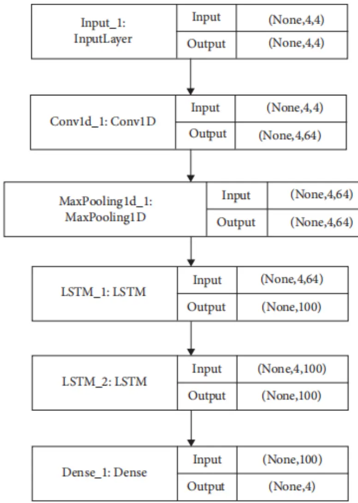
数据来源：《M ultivariate CNN-LSTM M odel for Multiple Parallel Financial Time-SeriesPrediction》，国泰君安证券研究

图 5 训练阶段实际值和预测值的比较
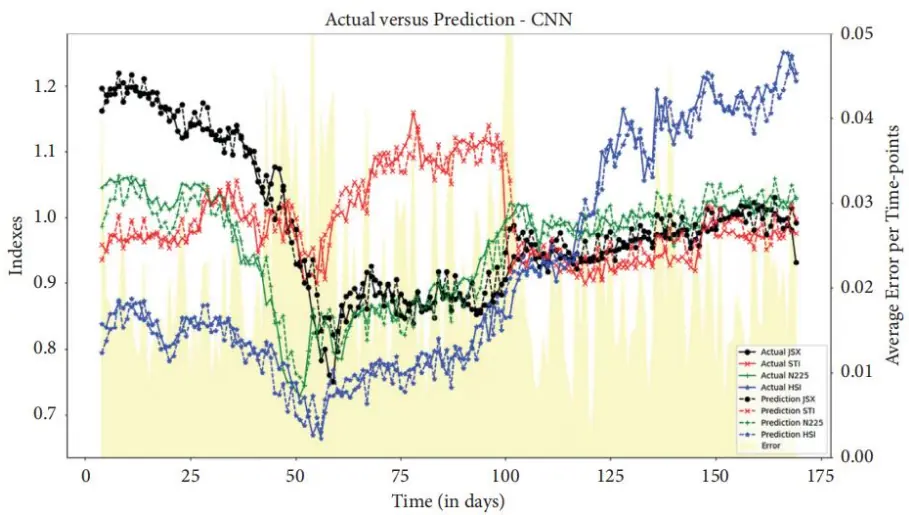

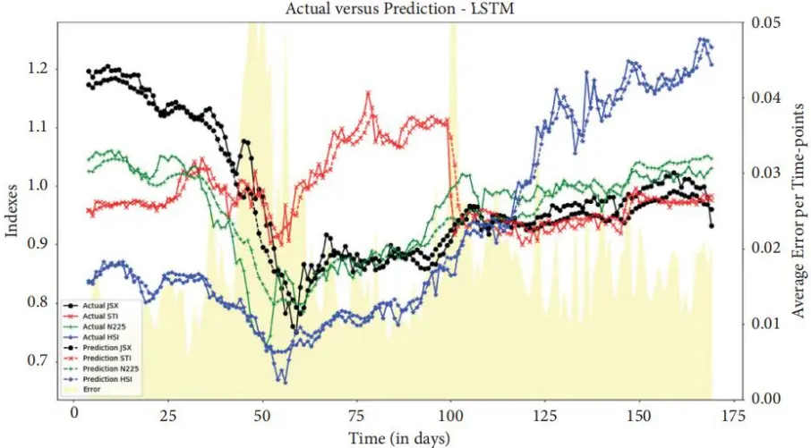

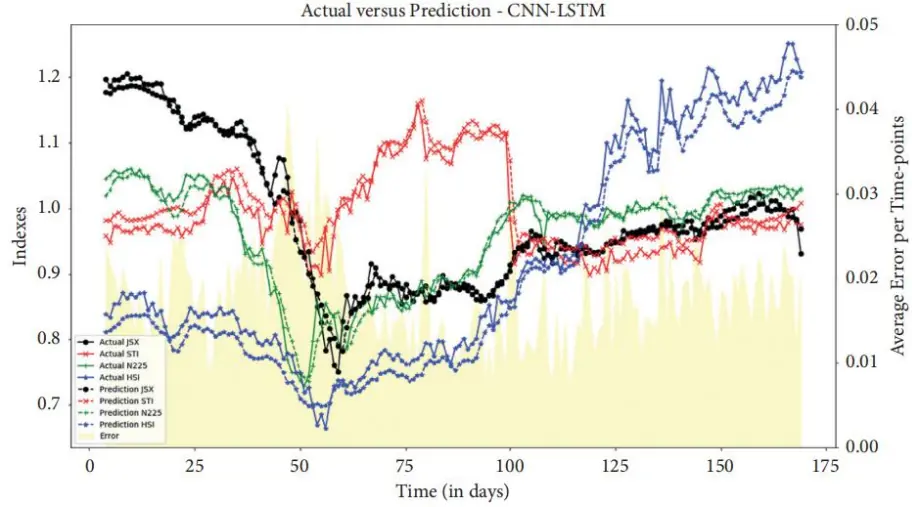
数据来源：《M ultivariate CNN-LSTM M odel for Multiple Parallel Financial Time-SeriesPrediction》，国泰君安证券研究

图 6 测试阶段实际值和预测值的比较
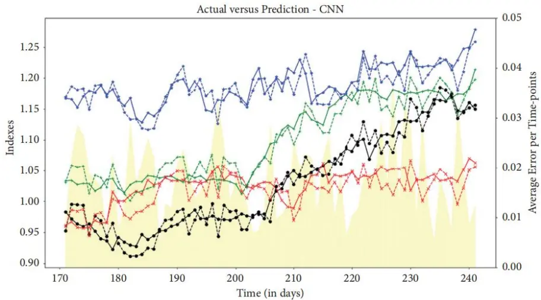

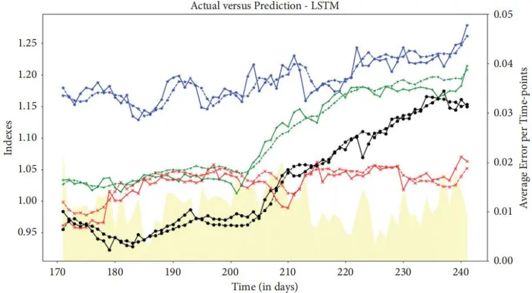

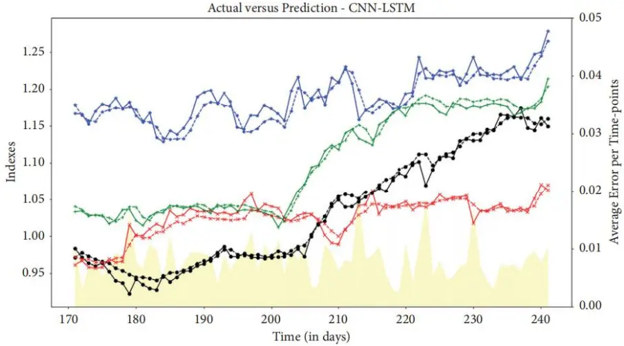
数据来源：《M ultivariate CNN-LSTM M odel for Multiple Parallel Financial Time-SeriesPrediction》，国泰君安证券研究

文中指出，预测结果与原始值之间的最大差异发生在第 55 个交易日，该日期是 2020 年 3 月初新冠肺炎大流行爆发初期开始影响全球经济状况的时期。在此之后，预测误差有下降的趋势，这表明多元 CNN-LSTM 模型能够较为快速地适应股票市场指数的运动模式的变化。随着四种股市指数的实际值在 2020 年底呈现上升趋势，多元 CNN-LSTM 模型的预测值也显示出了类似的模式。因此，该模型的预测结果可以用来帮助作出投资决定。

使用 RMSE 指标对三个模型进行评价，每个模型和每个阶段的 RMSE值比较如图 7 和图 8 所示。从这两个图中可以看出，多元 CNN-LSTM 模型的 RMSE 值在训练阶段和测试阶段都是最小的。这一结果证实了作者提出的理论：结合拥有不同优势特性的模型或算法和使用多元分析技术可以在解决实际问题（文中为预测四个股票市场的指数）时拥有更好的表现。

图 7 训练阶段的 RMSE比较
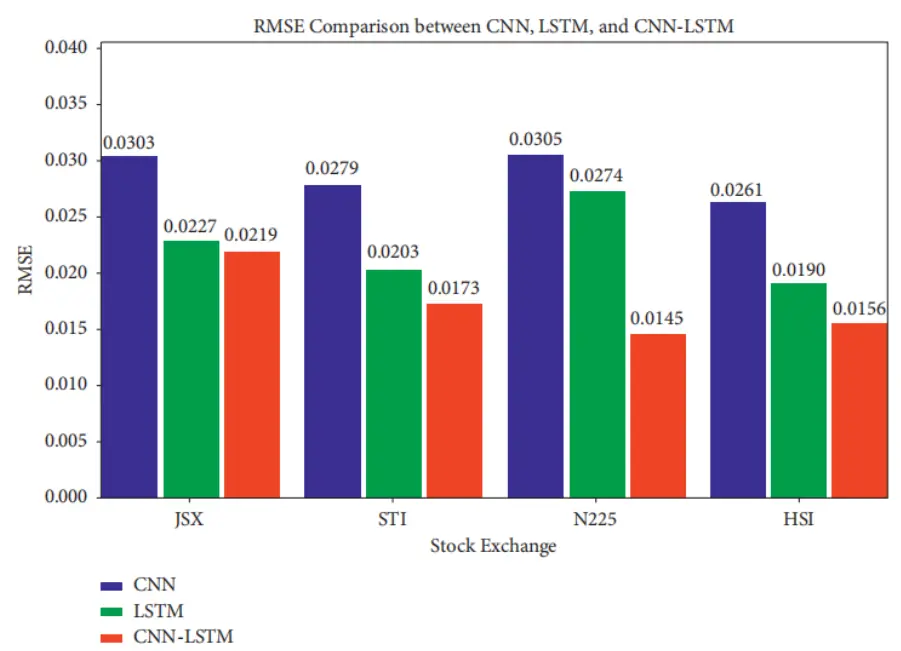
数据来源：《M ultivariate CNN-LSTM M odel for Multiple Parallel Financial Time-SeriesPrediction》，国泰君安证券研究

图 8 训练阶段的 RMSE比较
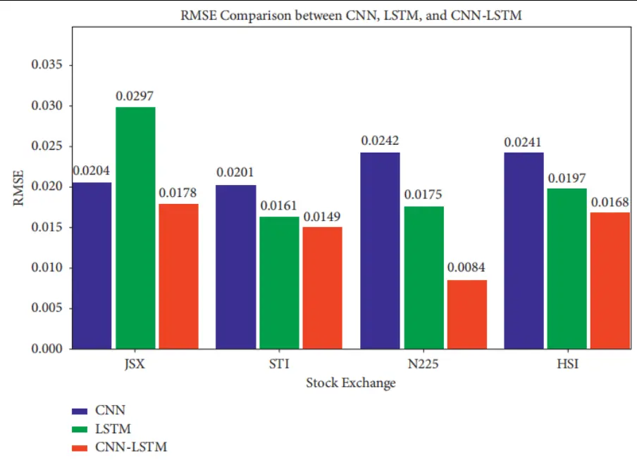
数据来源：《M ultivariate CNN-LSTM M odel for Multiple Parallel Financial Time-SeriesPrediction》，国泰君安证券研究

此外，本文还通过对描述性统计值与实际值进行比较对所提出的多元的预测质量进行了评价，结果如表 所示。

表 1: 多元 CNN-LSTM预测结果与真实值的描述性统计比较

| Descriptive statistics | Shanghai (HSI) |  | Japan (N225) |  | Singapore (STI) |  | Indonesia (JS X) |  |
| --- | --- | --- | --- | --- | --- | --- | --- | --- |
|  | Act | Pred | Act | Pred | Act | Pred | Act | Pred |
| Mean | 1.1917 | 1.1802 | 1.0997 | 1.0853 | 1.0260 | 1.0221 | 1.0315 | 1.0421 |
| Median | 1.1872 | 1.1783 | 1.0956 | 1.0847 | 1.0336 | 1.0401 | 1.0093 | 1.0102 |
| Standard deviation | 0.0320 | 0.0296 | 0.0677 | 0.0643 | 0.0277 | 0.0291 | 0.0787 | 0.0766 |
| Sample variance | 0.0010 | 0.0012 | 0.0046 | 0.0043 | 0.0008 | 0.0071 | 0.0062 | 0.0058 |
| Kurtosis | 0.3295 | 0.3187 | 1.7725 | 1.7523 | 0.8161 | 0.8021 | 1.3399 | 1.3187 |
| Skewness | 0.3376 | 0.3152 | 0.1284 | 0.1179 | 1.1910 | 1.1876 | 0.3793 | 0.3685 |
| Range | 0.1497 | 0.1502 | 0.2022 | 0.2013 | 0.1132 | 0.1045 | 0.2520 | 0.2471 |
| Minimum | 1.1288 | 1.1256 | 1.0121 | 1.0097 | 0.9570 | 0.9613 | 0.9226 | 0.9197 |
| Maximum | 1.2786 | 1.2691 | 1.2143 | 1.2095 | 1.0702 | 1.0273 | 1.1746 | 1.1637 |
| Confidence level (95%) | 0.0075 | 0.0086 | 0.0159 | 0.0137 | 0.0065 | 0.0061 | 0.0185 | 0.0157 |

数据来源：《Multivariate CNN-LSTM M odel for M ultiple Parallel Financial Time-Series Prediction》，国泰君安证券研究

表 1 所示的四个股市指数实际值和预测值的描述性统计比较分析表明，这两个数据集呈现出相当相似的数值，这证实了实际预测数据集和预测数据集都具有相似的基本性质。由此可以得出结论，文中提出的多元CNN-LSTM 模型不仅能够保持良好的预测准确性，具有相对较小的RMSE值，而且具有十分接近真实值的基本性质。

## 5. 结论与思考

Harya Widiputra 等 人 在 《 Multivariate CNN-LSTM Model for MultipleParallel Financial Time-Series Prediction》的研究中提出了一种多元 CNN-LSTM 模型，根据股票市场指数时间序列的特点，对多个并行的金融时间序列同期的数值进行预测。文中使用的技术是多元时间序列数据预测，通过考虑所有可观测值的条件，同时预测多个时间序列。卷积神经网络（CNN）从模型的输入数据中提取特征，而长短期记忆（LSTM）负责使用函数对数据进行处理分析并执行估计次日股市指数的最后一步。

本研究使用来自四家亚洲证券交易所（上海、日本、新加坡和印度尼西亚）的常规指数数据作为训练和测试集来验证实验结果。实验结果显示，与单个 CNN 或 LSTM 模型相比，多元 CNN-LSTM 具有最高的预测精度和更好的效率(RMSE 值最小)。作者的发现还支持了这样的假设：将变量之间的相互作用整合到预测模型中，将有助于对一组具有相关性的时间序列后续走势进行预测。因此，多元 CNN-LSTM 可以用来同时预测各种股票市场指数，并可以作为帮助投资者做出投资决策的有力工具。除此之外，多元 CNN-LSTM 是建立金融时间序列数据分析模型的可行选择。

但是，本文提出的多元 CNN-LSTM 模型同样存在一些缺陷，比如在预测过程中没有考虑到有关公众舆论和国家政策等外生变量的数据。针对这一问题，未来的研究工作计划可以尝试和侧重于利用更多的定量和定性因素作为预测模型的输入，并基于改进后的多元 CNN-LSTM 模型构建一个完整有效的投资交易系统。

## 本公司具有中国证监会核准的证券投资咨询业务资格

## 分析师声明

作者具有中国证券业协会授予的证券投资咨询执业资格或相当的专业胜任能力，保证报告所采用的数据均来自合规渠道，分析逻辑基于作者的职业理解，本报告清晰准确地反映了作者的研究观点，力求独立、客观和公正，结论不受任何第三方的授意或影响，特此声明。

## 免责声明

本报告仅供国泰君安证券股份有限公司（以下简称“本公司”）的客户使用。本公司不会因接收人收到本报告而视其为本公司的当然客户。本报告仅在相关法律许可的情况下发放，并仅为提供信息而发放，概不构成任何广告。

本报告的信息来源于已公开的资料，本公司对该等信息的准确性、完整性或可靠性不作任何保证。本报告所载的资料、意见及推测仅反映本公司于发布本报告当日的判断，本报告所指的证券或投资标的的价格、价值及投资收入可升可跌。过往表现不应作为日后的表现依据。在不同时期，本公司可发出与本报告所载资料、意见及推测不一致的报告。本公司不保证本报告所含信息保持在最新状态。同时，本公司对本报告所含信息可在不发出通知的情形下做出修改，投资者应当自行关注相应的更新或修改。

本报告中所指的投资及服务可能不适合个别客户，不构成客户私人咨询建议。在任何情况下，本报告中的信息或所表述的意见均不构成对任何人的投资建议。在任何情况下，本公司、本公司员工或者关联机构不承诺投资者一定获利，不与投资者分享投资收益，也不对任何人因使用本报告中的任何内容所引致的任何损失负任何责任。投资者务必注意，其据此做出的任何投资决策与本公司、本公司员工或者关联机构无关。

本公司利用信息隔离墙控制内部一个或多个领域、部门或关联机构之间的信息流动。因此，投资者应注意，在法律许可的情况下，本公司及其所属关联机构可能会持有报告中提到的公司所发行的证券或期权并进行证券或期权交易，也可能为这些公司提供或者争取提供投资银行、财务顾问或者金融产品等相关服务。在法律许可的情况下，本公司的员工可能担任本报告所提到的公司的董事。

市场有风险，投资需谨慎。投资者不应将本报告作为作出投资决策的唯一参考因素，亦不应认为本报告可以取代自己的判断。
在决定投资前，如有需要，投资者务必向专业人士咨询并谨慎决策。

本报告版权仅为本公司所有，未经书面许可，任何机构和个人不得以任何形式翻版、复制、发表或引用。如征得本公司同意进行引用、刊发的，需在允许的范围内使用，并注明出处为“国泰君安证券研究”，且不得对本报告进行任何有悖原意的引用、删节和修改。

若本公司以外的其他机构（以下简称“该机构”）发送本报告，则由该机构独自为此发送行为负责。通过此途径获得本报告的投资者应自行联系该机构以要求获悉更详细信息或进而交易本报告中提及的证券。本报告不构成本公司向该机构之客户提供的投资建议，本公司、本公司员工或者关联机构亦不为该机构之客户因使用本报告或报告所载内容引起的任何损失承担任何责任。

## 评级说明

## 1.投资建议的比较标准

投资评级分为股票评级和行业评级。以报告发布后的 12 个月内的市场表现为比较标准，报告发布日后的 12 个月内的公司股价（或行业指数）的涨跌幅相对同期的沪深 300 指数涨跌幅为基准。

## 2.投资建议的评级标准

报告发布日后的 12 个月内的公司股价（或行业指数）的涨跌幅相对同期的沪深300 指数的涨跌幅。

| 评级 |  | 说明 |
| --- | --- | --- |
| 股票投资评级 | 增持 | 相对沪深 300指数涨幅 15%以上 |
|  | 谨慎增持 | 相对沪深300指数涨幅介于5%～15%之间 |
|  | 中性 | 相对沪深300指数涨幅介于-5%～5% |
|  | 减持 | 相对沪深300 指数下跌5%以上 |
| 行业投资评级 | 增持 | 明显强于沪深 300 指数 |
|  | 中性 | 基本与沪深 300指数持平 |
|  | 减持 | 明显弱于沪深300指数 |

## 国泰君安证券研究所

|  | 上海 | 深圳 | 北京 |
| --- | --- | --- | --- |
| 地址 | 上海市静安区新闸路669 号博华广 场20层 | 深圳市福田区益田路6009号新世界 商务中心34层 | 北京市西城区金融大街甲9号金融 街中心南楼18层 |
| 邮编 | 200041 | 518026 | 100032 |
| 电话 | （021）38676666 | （0755）23976888 | (010)83939888 |
|  | E-mail: gtjaresearch@gtjas.com |  |  |