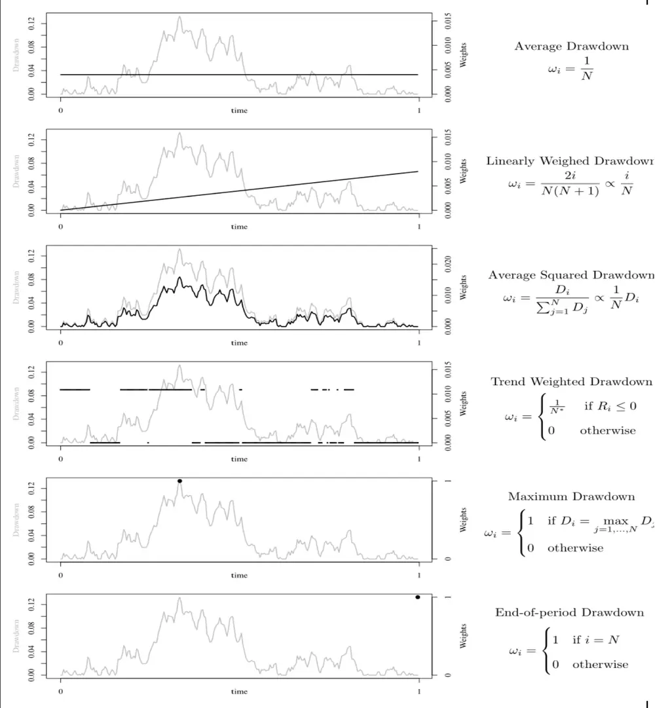
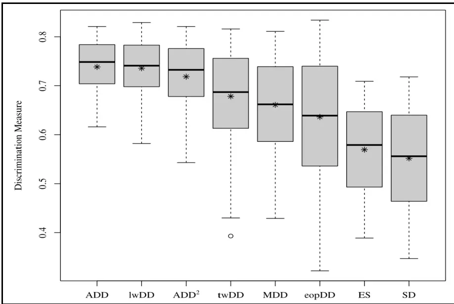
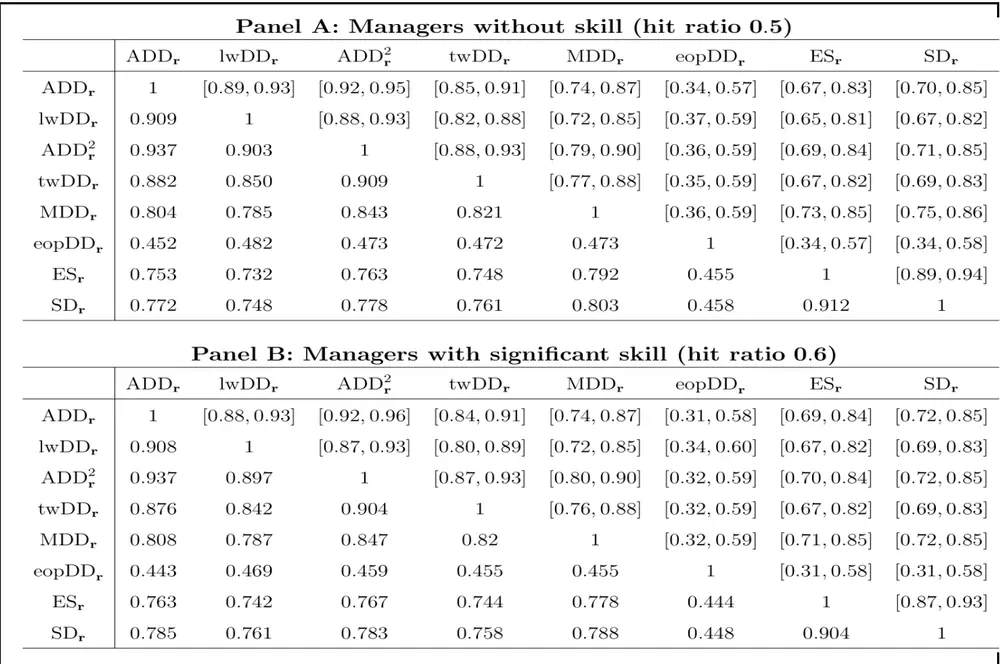
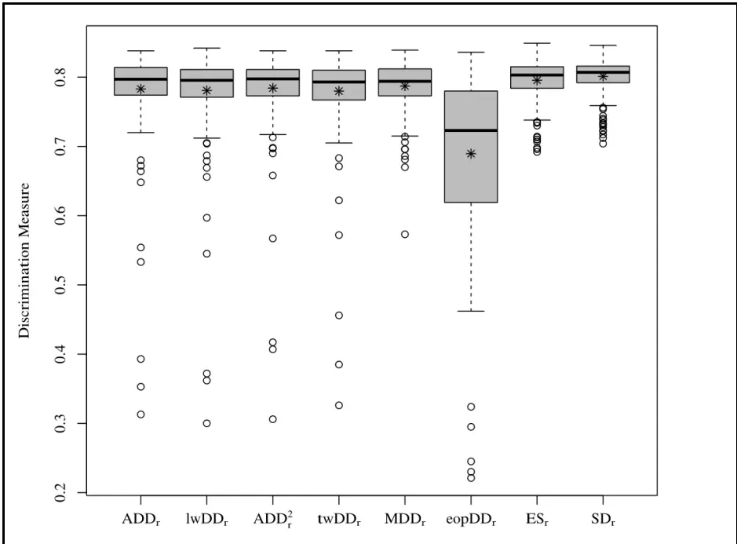
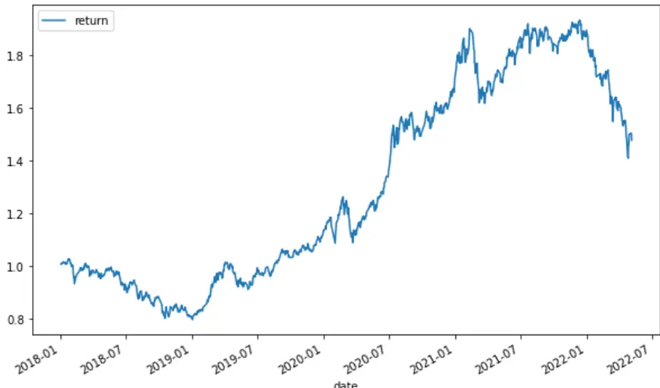
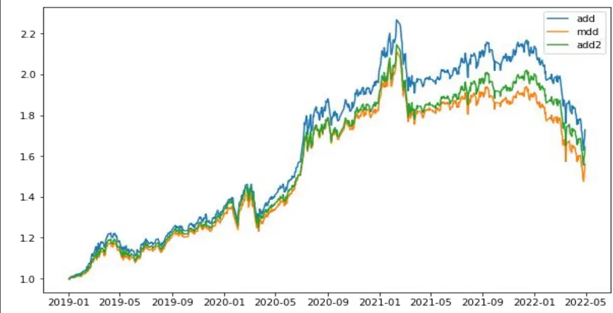

2022.06.27

# 加权回撤框架：统一化度量风险指标

# ——学界纵横系列之二十七

陈奥林(分析师)

## 殷钦怡(分析师)

8 021-38674835

021-38675855

chenaolin@gtjas.com

yinqinyi@gtjas.com

证书编号 S0880516100001

S0880519080013

## 本报告导读：

本文使用加权回撤框架对各种回撤指标进行统一分析，为风险度量和基金评价提供新的思路与实证证据。

回撤衡量了某一选定投资周期内，上一个最高点到当前时刻的损失。由于直接反映了损失的程度，回撤对投资者而言是更为直观的风险指标。出于不同的需求，学界和实务界提出了各种基于回撤的风险指标，如最大回撤 MDD，平均回撤 ADD，均方回撤ADD²，条件回撤 CDD，期末回撤eopDD等......本文将上述回撤指标纳入到了统一的回撤框架：加权回撤 wDD 框架之中。

在wDD框架下，所有的回撤指标都可以表示为回撤图时间序列的加权和。权重的不同反映除了该回撤指标的风险侧重，以及投资者的考量因素。wDD将回撤指标转化为对回撤图的加权问题，为理论分析和计算提供了便利。在这一框架下，投资者也可以从自身的需求出发，发明不同的回撤指标。

在组合排序实验中，ADD、ADD²和1wDD这3个指标得到的结果非常相似。这些指标与权重时变的twDD的相关性有所下降，与单点权重的 MDD 和 eopDD 的相关性则显著下降。MDD 与ADD²的相关性最强。

在区分基金经理的能力方面，回撤指标都表现得可圈可点。基于实际损失的回撤指标比基于波动率的指标反映除了更多的风险信息。另外，那些对回撤图的所有信息利用得更加充分的回撤指标(ADD、1wDD、ADD^2)比那些只运用了回撤图部分信息的指标(twDD、MDD，eopDD)表现得更加优异。

在A股实证研究中，由于波动率的影响，aDD指标的延续性不如mDD。在业绩回测中，不同回撤指标对业绩具有一定的区分度，aDD最优，aDD²次之，mDD最弱。由于aDD与波动率的相关性更高，因此在市场波动程度较高时，相比mDD，使用aDD能够更加准确地度量风险。另外，相比于mDD，aDD所具有的经济学意义也更强，对未来风险的反映程度也更准确，因此aDD应用于选基的优异表现具有理论支撑。

金融工程

## 金融工程团队：

陈奥林：（分析师）

电话：021-38674835

邮箱：chenaolin@gtjas.com

证书编号：S0880516100001

## 杨能：（分析师）

电话：021-38032685

邮箱：yangneng@gtjas.com

证书编号：S0880519080008

## 殷钦怡：（分析师）

电话：021-38675855

邮箱：yinqinyi@gtjas.com

证书编号：S0880519080013

## 徐忠亚：（分析师）

电话：021-38032692

邮箱：xuzhongya@gtjas.com

证书编号：S0880519090002

## 刘昺轶：（分析师）

电话：021-38677309邮箱：liubingyi@gtjas.com证书编号：S0880520050001

## 赵展成：（研究助理）

电话：021-38676911邮箱：Zhaozhancheng@gtjas.com证书编号：S0880120110019

## 张烨垲：（研究助理)

电话：021-38038427

邮箱：zhangyekai@gtjas.com

证书编号：S0880121070118

## 徐浩天：(研究助理）

电话：021-38038430

邮箱：xuhaotian@gtjas.com

证书编号：S0880121070119

## 相关报告

中证1000期货上市后，你需要知道的事儿2022.06.27

广发国证新能源车电池ETF投资价值分析2022.06.21

有色金属行业基本面景气度预测研究2022.06.15

宏观周期的量化过程与投资思考2022.06.12 雪球：收益结构、运作模式与投资展望 2022.06.11

## 1. 引言

回撤衡量了某一选定投资周期内，上一个最高点到当前时刻的损失。由于直接反映了损失的程度，回撤对投资者而言是更为直观的风险指标。出于不同的需求，学界和实务界提出了各种基于回撤的风险指标，如最大回撤，平均回撤，均方回撤，条件回撤，期末回撤......其中最大回撤是最为常用的回撤指标，被广大投资者所接受，成为各种金融软件中的标准指标，衡量账户在最糟糕的情况下的风险承受能力。

那么众多的回撤指标有何异同？在投资实践中使用这些指标能否得到相同的结论？如何在不同的情形中选择合适的回撤指标？发表于TheJournal of Portfolio Management 中的文章 《Drawdown Measures: Are They Al1the Same?》提出了一个统一的回撤指标框架 wDD，从理论和实证两方面对这些问题作出回答。

本文对作者提出的理论进行介绍，并重复文中的模拟实验。进一步，我们以国内的主动管理基金数据，借鉴文中的结果对国内市场进行实证研究。结论显示，平均回撤aDD能够更好地度量预期风险，在业绩回测中表现优于最大回撤。

## 2. 常用回撤指标与加权回撤框架

## 2.1. 常用回撤指标

## 2.1.1. 最大回撤(Maximum Drawdown, MDD)

最大回撤 MDD 出自 Garcia and Gould， 1987，衡量在选定周期内任一历史时点往后推，产品净值走到最低点时的收益率回撤幅度的最大值，计算公式为：

$$
MDD=\frac{TroughValue-PeakValue}{PeakValue}\tag{1}
$$

最大回撤用来描述买入产品后可能出现的最糟糕的情况，是最重要的风险指标之一，也是在购买和评价基金时必须参考的标准指标，对于对冲基金和数量化策略交易，该指标比波动率还重要。

## 2.1.2. 平均回撤(Average Drawdown, ADD)

平均回撤ADD是选定周期内回撤的平均值。如果说最大回撤记录了历史上的偶发性黑天鹅事件，那么平均回撤能够更加准确地反映未来的回撤水平，是期望回撤的估计值。

## 2.1.3. 均方回撤(Average Squared Drawdown，ADD²)

均方回撤ADD²又被称作溃疡指数(Ulcer Index)，于 Martin and McCann(1989)中提出。均方回撤的计算方法为，将每一期的回撤平方相加，除以总期数，再开方。相比平均回撤，均方回撤给予了大回撤更大的权重。在量纲上，均方回撤与标准差一致，起到衡量基金波动性的作用。但相比标准差，均方回撤只专注于下行风险，而不是简单地将上行和下行波动一起计算。

## 2.1.4. 期末回撤(End-of-Period Drawdown， eopDD)

期末回撤 eopDD 强调投资末期回撤的重要性。与 mDD 类似，eopDD 在最后一期回撤处的权重为1，其他为0.

## 2.2. 回撤指标的统一框架：加权回撤框架(wDD)

上节提到的所有回撤指标都可以纳入到一个统一框架之中，及加权回撤框架(Weighted Drawdown Framework, wDD)。假设投资期间为 0 到 N 期，相应的资产价格为 $S_{0}$ 到 $S_{1}$ ，则任意一个加权回撤指标都可表示为：

$$
wDD=\sum_{i=1}^{N}\omega_{i}D_{i},\quad0\le\omega_{i}\le1,\sum_{i=1}^{N}\omega_{i}=1\tag{2}
$$

其中 $\begin{array}{r}{D_{i}:=\frac{M_{i}-S_{i}}{M_{i}}}\end{array}$ 为i时刻的回撤， $M_{i}:=max_{t=0,\ldots,i}S_{t},$ 为i时刻前的最高点。回撤 $D_{i}$ 的时间序列被称作回撤图。

通过对权重ω的不同选择，wDD能够得到不同的回撤指标，反映投资者关心的不同方面。ADD对所有 $D_{i}$ 取等权重 $\cdot\frac{1}{N}$ ，MDD在回撤的最大点取1，其他处取0。 $ADD$ 2用 $D_{i}$ 本身进行加权，即 $\begin{array}{r}{\omega_{i}=\frac{D_{i}}{\sum_{j=1}^{N}D_{j}}\mathrm{.}}\end{array}$

在wDD框架下，自创指标非常容易。例如，希望更关注投资末期的回撤，那么可以让权重随着时期t线性增加，取 $\begin{array}{r}{{\omega_{i}^{*}=\frac{i}{N}};}\end{array}$ 再进行标准化，使权重之和为1。这个回撤指标被称作线性加权回撤(Linearly WeightedDrawdown, lwDD).

回撤之前的价格走势也会对回撤的重要性产生影响。如果回撤发生前投资有正收益的话，回撤只是减少了盈利。但如果刚经历了暴跌，回撤对投资者而言则更加痛苦。趋势加权回撤(Trend Weighted Drawdown, twDD)反映了这一心理。如果i时刻的前一个月收益为正，则 $\omega_{i}=0$ ，否则，$\begin{array}{r}{\omega_{i}=\frac{1}{N^{*}}}\end{array}$ ，N*为权重不等于0的总期数。

图1展示了上述回撤指标对同一回撤图的不同模式。从图中可以直观地看到不同回撤指标的加权模式之间的区别与联系：ADD、lwDD、 $ADD_{2}$ 的权重一般不为0，而 MDD 只在一点不为0，twDD的不为0 个数与价格趋势相关；ADD、lwDD的权重在期初就已经决定，而MDD、twDD、

$ADD_{2}$ 的权重在期末才能确定；lwDD强调投资期末的回撤，而MDD和$ADD_{2}$ 则强调回撤的数值大小。

在wDD框架下，改变回撤图各部分的权重，就能得到强调不同特性的回撤指标。这些回撤指标对风险的反映相同么？从迥异的权重模式可知，至少一部分的回撤指标是显著不同的。但隶属于同一框架意味着它们又具有内在的联系。接下来，我们通过实证来研究回撤指标间的相似程度。

图1：同一回撤图的不同回撤指标的权重示意图

数据来源: Drawdown measures: Are they al1 the same?

## 3. 利用模拟实验探究指标的相似性

上述加权方式不同的回撤指标在实际应用时得到的结果区别有多大？本章采用概率模拟实验的方式解答这一问题。使用概率模拟实验能够摒弃人为因素对数据造成的影响，更客观地反映回撤指标的特性。在之后的章节中，我们会采用真实基金数据对指标进行业绩回测分析。

本章主要考察回撤指标三方面的相似性：1）组合排序的相似性，2）能力挖掘的相似性，以及3）作为业绩评价指标的相似性。

## 3.1. 组合排序中的相似性

本节考察采用不同的回撤指标对组合进行排序得到结果的相似性。我们既不希望结果过于相似，也不希望结果完全不同，而是能够大体反映出基金经理风险管理的能力水平，又在不同方面有所侧重。为此，我们模拟了1000名基金经理和投资组合，在每月末用不同的回撤指标对这些组合进行排序，并考察这些排序结果之间的相似性。

数据的具体生成方式如下：

为了与论文中的结果保持一致，数据区间为1999年12月至2019年4月。投资的股票池为明晟世界指数(MSCI World index)的成分股。从1999年12月31号起，1000名基金经理中的每一位从指数成分股中随机挑选100只股票，并赋予0%—2%之间的随机权重。为了保证组合的持仓不过于集中，限制某一行业或国家的持仓不超过总持仓的10%。如果形成的组合在某行业或国家持仓超过10%，则重新采样，直到符合约束条件。在之后的每月末，基金经理先从组合中筛除被当月指数除名的股票，然后随机卖出股票直到换手率达10%，然后再填充新的股票至100只。上述程序每月重复。

在有足够计算数据之后的每个月末，我们采用1年的滚动窗口计算回撤指标，并对上述的1000个模拟资产组合进行排序，计算两两指标间的秩相关系数。表2的下三角部分给出了指标间时序平均之后的相关系数，而表2的上三角部分则给出了99%置信区间。

观察表2，ADD、ADD²和lwDD之间的相关系数在0.85±0.03，意味着使用这3 个指标会得到非常相似的结果。这些指标与权重时变的 twDD的相关性有所下降，与单点权重的 MDD和 eopDD 的相关性则显著下降。在MDD的所有配对中，与ADD²的相关性最强，因为它们的最大权重点相同。

以上结果意味着在实践中使用 aDD等指标进行分析，能够得到与mDD较为不同的结果，具有一定的研究价值。接下来的实证将考察这些不同能否带来更加优异的表现。

表1：不同回撤指标间的秩相关系数与99%置信区间

|  | ADD | lwDD | ADD2 | twDD | MDD | eopDD | ES | SD |
| --- | --- | --- | --- | --- | --- | --- | --- | --- |
| ADD | 1 | [0.81,0.87] | [0.85, 0.90] | [0.68,0.79] | [0.54, 0.63] | [0.21,0.43] | [0.27,0.33] | [0.27,0.33] |
| lwDD | 0.840 | 1 | [0.77,0.87] | [0.62,0.76] | [0.51,0.63] | [0.27,0.50] | [0.25,0.31] | [0.24,0.31] |
| ADD² | 0.874 | 0.821 | 1 | [0.76,0.83] | [0.63,0.70] | [0.23,0.47] | [0.29, 0.35] | [0.28,0.35] |
| twDD | 0.736 | 0.690 | 0.797 | 1 | [0.58, 0.65] | [0.21,0.45] | [0.27,0.34] | [0.27,0.35] |
| MDD | 0.586 | 0.568 | 0.668 | 0.617 | 1 | [0.19,0.43] | [0.32,0.41] | [0.32,0.41] |
| eopDD | 0.323 | 0.387 | 0.351 | 0.329 | 0.311 | 1 | [0.11,0.22] | [0.11,0.21] |
| ES | 0.299 | 0.281 | 0.321 | 0.308 | 0.367 | 0.165 | 1 | [0.60, 0.69] |
| SD | 0.298 | 0.275 | 0.314 | 0.309 | 0.366 | 0.157 | 0.644 | 1 |

数据来源: Drawdown measures: Are they all the same?

## 3.2. 能力挖掘中的相似性

理论上，能力与回撤应为负相关，管理能力越强的基金经理回撤的程度就越小。反过来，利用回撤指标就能用来区分有能力的基金经理和没有能力的基金经理。在实证中回撤指标是否真的具有这种功能，不同的回撤指标效果是否不同呢？本节就来回答这个问题

在上一节的模拟实验中，基金经理均以纯随机方式选股，不存在选股的能力。为了反映基金经理间的能力差异，对模拟实验进行修改。在每一个月末调仓时刻t，将所有股票按照未来一年的收益率进行排序，并以收益率中位数为界分成2半，上一半为赢家组合，下一半则为输家组合。在纯随机模式下，基金经理以0.5的概率在两个组合之间挑选股票。而一个有能力的基金经理应当具有一定程度的预测能力，以高于0.5的概率选择赢家组合中的股票。在每一次调仓时，选择赢家组合的概率被称作命中率(hitratio)。记为δ。通过对基金经理赋予不同的δ，使基金经理间的选股能力产生分化。

依旧采用上一节的实验框架，模拟2000名基金经理。其中1000名的命中率8设为0.5，代表纯随机无能力的基金经理。另1000名的8设为0.6，代表强选股能力基金经理。实验的目标在于考察能否通过回撤指标准确地识别出基金经理的能力分类。

在每月末，用之前一年的回撤率对2000只基金从小到大排序。前1000只基金标记为有能力，后1000只标记为无能力，并与真实的能力类别进行对比，计算分类准确率。图2展示了不同回撤指标分类准确率的箱型图。

箱型图给出了按月滚动的所有分类准确率以及最大最小、0.25、0.5和0.75分位数。例如，ADD在最好的情况下达到82%的准确率，最差时也有62%的准确率。可以看到，ADD、lwDD和ADD²平均而言表现最好。ADD的准确率最高，而且方差也最小。twDD和mDD在准确度和方差上均表现较差。三者的准确率最小值均小于0.5，意味着有些时候选基能力甚至弱于随纯机选择。图2还给出了ES（期望尾部风险）和波动率用于选基的效果。虽然准确率大于0.5，但均弱于所有回撤指标。

图2：不同回撤指标的分类准确率

数据来源: Drawdown measures: Are they all the same?

总的来说，在区分基金经理的能力方面，回撤指标都表现得可圈可点。因为基于实际损失的回撤指标比基于波动率的指标反映除了更多的风险信息。另外，那些对回撤图的所有信息利用得更加充分的回撤指标(ADD、lwDD、ADD2)比那些只运用了回撤图部分信息的指标(twDD、MDD)表现得更加优异。

## 3.3. 基于回撤的业绩评价指标的相似性

除了作为风险度量指标，回撤也可用于构造业绩评价指标。业绩评价指标的常见形式是用超额收益率除以相应的风险指标，例如夏普比率。业界和学界也构造了许多基于回撤的业绩评价指标，如Calmar比率描述收益和MDD之间的关系、痛苦比率(pain ratio)用ADD 作为分母、Ulcer比率用 $ADD^{\mathrm{{i}}}$ 作分母。在本文中，用下标r表示相应分母的业绩评价指标。例如， $MDD_{r}$ 表示 $\begin{array}{r}\mathrm{Calmar\ }\mathbf{\Pi}\mathbf{\Pi}\mathbf{\tilde{{g}}}\mathbf{\tilde{{t}}}\mathbf{\tilde{{\mathcal{T}}}}{=}\frac{\mathbf{\tilde{{t}}}\mathbf{\tilde{{e}}}^{\tilde{{t}}}\mathbf{\tilde{{g}}}\mathbf{\tilde{{\mathcal{T}}}}{=}\tilde{\mathbf{\Pi}}\mathbf{\tilde{{t}}}\mathbf{\tilde{{\mathcal{T}}}}{=}\tilde{\mathbf{\Pi}}}{\frac{\mathbf{\tilde{{t}}}\mathbf{\tilde{{e}}}^{\tilde{{t}}}\mathbf{\tilde{{t}}}\mathbf{\tilde{{t}}}\mathbf{\tilde{{t}}}\mathbf{\tilde{{t}}}}{\tilde{\mathcal{R}}}\mathbf{\tilde{{{t}}}}\mathbf{\tilde{{{\mathcal{T}}}}}{=}}\end{array}$ 本节使用基于回撤的业绩评价指标进行上2节的实验，即组合排序和能力挖掘。

表3给出了不同指标的秩相关系数，均落在0.443至0.937之间。与表2 进行对比可以看出，使用业绩评价指标比单纯的回撤指标之间的相关性更高，这或许是因为它们都共用了相同的分子。各指标之间的关系模式没有发生改变， $eopDD_{r}$ 依旧是相关性最低的。 $ADD_{r}$ $ADD_{r}^{2}$ 与 $lwDD_{r}$ 之间的相关性仍保持最强。

表2：基于不同回撤的业绩评价指标间的秩相关系数与99%置信区间

数据来源: Drawdown measures: Are they all the same?

图3展示了这些指标用于区分能力的效果。与图2相比，所有的指标的平均准确率都有了显著的提升。不仅如此，准确率的方差都缩小至了同一水平。

遗憾的是，尽管在3.2节中使用SD本身的表现不如回撤指标，但本节所有基于回撤的业绩评价指标表现都不如使用SD作为分母的夏普比率。原因在于，回撤指标与收益率是高度相关的。大幅回撤会在增大指标分目的同时直接减小分母，使指标过度反映。举例来说，一个能力不足的基金经理造成了50%的损失以及0.2的平均回撤，相应的ADDr为-2.5(=-50%÷0.2). 而一个能力更强的基金经理只造成了42%的损失和0.14的回撤，尽管他的损失更少、回撤更小，计算得到的ADDr却等于-3(=-42%÷0.14)，不如能力不足的基金经理。尽管这一现象有数学方面的技术性原因，各种指标都有可能发生，但回撤与收益的内生性加重了其严重程度。以波动率作为分母的夏普比率能够缓解这一影响。

基于回撤的业绩评价指标的另一个副作用是会出现效果极差的极端值。图3中可以看到，虽然中位数都在0.8附件，但最差的准确率却低至0.3.夏普比率则没有这样的风险。综上所示，在业绩评价方面，受到分子和分母高度内生性的影响，回撤指标并不适用，夏普比率依旧是最优秀的指标之一。

图3：不同业绩评价指标的分类准确率

数据来源: Drawdown measures: Are they all the same?

## 4. A 股实证

本节采用A股主动型基金数据对不同回撤指标进行实证检验，主要从指标的延续性和业绩区分度两方面来考察。

## 4.1. 指标延续性

回撤指标在一定程度上反映基金经理风险控制的能力，而全体基金经理能力的排位在一段时间内保持相当的稳定性，因此，回撤指标作为风控能力的代理变量应当具有持续性。如果波动性很大，那么该指标是否真的反映了能力是值得商榷的。

全体数据的样本区间为2018年1月初至2022年5月。我们使用不同频率的滚动窗口（年频、季频、月频）每月计算相应的回撤指标。然后将总的样本区间平均分为两段，计算前后区间回撤指标的秩相关系数。

以年频为例，从2018年12月末开始，每月末计算前12个月的aDD、mDD、aDD²和lwDD，至2022年4月。总共41个月。若一年内的数据量不足200，则记为缺失。以2020年9月1日为分界，将回撤区间分为前半段（21个月)，和后半段（20个月)。在两个区间内分别计算每只基金的平均aDD和mDD。并计算前后两个区间的回撤相关系数，结果如下：

表3：回撤指标的持续性

| 回撤指标 | Rank corr （年） | Rank corr （季） | Rank corr（月） |
| --- | --- | --- | --- |
| mDD | 0.624 | 0.702 | 0.722 |
| aDD | 0.418 | 0.615 | 0.637 |
| aDD² | 0.540 | 0.660 | 0.710 |
| lwDD | 0.367 | 0.600 | 0.654 |

数据来源：国泰君安证券研究

可以看到，随着计算频率的加快，指标的相关系数逐渐上升。而纵向比较，mDD的持续性最优，aDD与aDD²次之，lwDD相关性最弱。

理论上来说，aDD作为回撤的无偏估计，应当更准确的反映风险管理的能力，在持续性上也应该更强。实证的结果为何与理论不一致呢？原因可能在于aDD与波动率的相关性更高。图4画出了样本内所有基金平均收益率的时间序列。可以直观的看到后半段的波动要大于前半段。以2020年1月1日作为分界，前半段的基金净值平均波动率为14.86%，而后半段的波动率则为32.31%。

图 4：全体基金平均净值曲线

数据来源：国泰君安证券研究

最大回撤与价格路径高度相关，与波动率的相关性则不大。当波动率上升时，只要回撤不超过之前的最大值，最大回撤仍保持不变。而那些对全体回撤图进行加权的指标则不同，当波动率增加时，这些指标很可能也会相应增大。这就是本次实证中mDD表现最优的原因。由于样本期间后半段波动率的上升，对aDD、aDD²和lwDD造成的影响更大。

## 4.2. 基于回撤指标的业绩回测

为了保证足够的股票仓位，我们剔除纯债和灵活配置型基金，保留普通股票型和偏股混合型的主动基金。按照季度调仓频率，在每季度末，我们计算前12个月内的回撤指标，并对基金进行排序，然后买入回撤指标最小的前5%的基金。收益曲线如下：

图 5：前 5%回撤指标组合收益率曲线

数据来源：国泰君安证券研究

实证结果显示，不同回撤指标对业绩具有一定的区分度，aDD最优，aDD²次之，mDD最弱。相比于mDD，aDD所具有的经济学意义更强，对未来风险的反映程度也更准确，因此aDD应用于选基的优异表现具有理论支持。

但也必须注意到，在图5的前半部分，回撤指标并不具有区分度。在进入2021年后，不同指标的业绩才逐渐分化。这一模式与5.1节中的现象如出一辙，原因就在于市场的波动水平。当市场波动率较小时，不同回撤指标的秩高度相关，用排序法选出的持仓重合比例很高。只有当波动率较大时，不同指标的排序结果分化度提高，aDD的优势也逐渐凸显出来。

在实践当中，很少有使用回撤指标直接进行选股的，因为回撤只反映了风险。用来选股的指标应当包含超额收益与风险两方面。但正如第4节实证结果所示，用回撤指标构造的业绩评价指标具有高度的内生性，因而不适用于选股当中。但本节的实证结果与3.3节的模拟实验毫无疑问证明了相比于常用的最大回撤mDD，aDD具有其独特优势，在实践当中应当予以考量。

## 5. 结论与思考

回撤是交易的一部分，收益和亏损天生就是共存的，应学会接受亏损，正确认知回撤。账户资金回撤和交易策略以及风险控制密切相关，回撤率是衡量风险管理能力的重要指标。回撤作为价格路径依赖的指标，能够更加直观地反映策略的下行风险和投资者的心理。wDD将常见的各种回撤指标都纳入到了统一的框架下，将回撤指标转化为对回撤图的加权问题，为理论分析和程序实现提供了便利。在这一框架下，投资者也可以从自身的需求出发，发明不同的回撤指标。

一般情况下，投资者只关注最大回撤率。文章与实证结果告诉我们，除了最大回撤率之外，平均回撤率和线性回撤在特定应用中表现更好，将这些指标综合考虑，更具意义。在对回撤图有了更深的理解之后，可以自己尝试对回撤图进行加权，构建自己的指标，对投资的指导作用更强。使用恰当的回撤指标，既能够反映风险的不同方面，也可以更好地挖掘出基金经理的能力。

在业绩评价的应用中，回撤指标表现不如传统的夏普比率。这是因为在收益为负的情形下，指标的分子与分母高度相关，存在内生性，影响了风险信息的反映。如何将回撤指标更好地运用在业绩评价中，还需要我们进一步地研究。

## 本公司具有中国证监会核准的证券投资咨询业务资格

## 分析师声明

作者具有中国证券业协会授予的证券投资咨询执业资格或相当的专业胜任能力，保证报告所采用的数据均来自合规渠道，分析逻辑基于作者的职业理解，本报告清晰准确地反映了作者的研究观点，力求独立、客观和公正，结论不受任何第三方的授意或影响，特此声明。

## 免责声明

本报告仅供国泰君安证券股份有限公司（以下简称“本公司”）的客户使用。本公司不会因接收人收到本报告而视其为本公司的当然客户。本报告仅在相关法律许可的情况下发放，并仅为提供信息而发放，概不构成任何广告。

本报告的信息来源于已公开的资料，本公司对该等信息的准确性、完整性或可靠性不作任何保证。本报告所载的资料、意见及推测仅反映本公司于发布本报告当日的判断，本报告所指的证券或投资标的的价格、价值及投资收入可升可跌。过往表现不应作为日后的表现依据。在不同时期，本公司可发出与本报告所载资料、意见及推测不一致的报告。本公司不保证本报告所含信息保持在最新状态。同时，本公司对本报告所含信息可在不发出通知的情形下做出修改，投资者应当自行关注相应的更新或修改。

本报告中所指的投资及服务可能不适合个别客户，不构成客户私人咨询建议。在任何情况下，本报告中的信息或所表述的意见均不构成对任何人的投资建议。在任何情况下，本公司、本公司员工或者关联机构不承诺投资者一定获利，不与投资者分享投资收益，也不对任何人因使用本报告中的任何内容所引致的任何损失负任何责任。投资者务必注意，其据此做出的任何投资决策与本公司、本公司员工或者关联机构无关。

本公司利用信息隔离墙控制内部一个或多个领域、部门或关联机构之间的信息流动。因此，投资者应注意，在法律许可的情况下，本公司及其所属关联机构可能会持有报告中提到的公司所发行的证券或期权并进行证券或期权交易，也可能为这些公司提供或者争取提供投资银行、财务顾问或者金融产品等相关服务。在法律许可的情况下，本公司的员工可能担任本报告所提到的公司的董事。

市场有风险，投资需谨慎。投资者不应将本报告作为作出投资决策的唯一参考因素，亦不应认为本报告可以取代自己的判断。
在决定投资前，如有需要，投资者务必向专业人士咨询并谨慎决策。

本报告版权仅为本公司所有，未经书面许可，任何机构和个人不得以任何形式翻版、复制、发表或引用。如征得本公司同意进行引用、刊发的，需在允许的范围内使用，并注明出处为“国泰君安证券研究”，且不得对本报告进行任何有悖原意的引用、删节和修改。

若本公司以外的其他机构（以下简称“该机构”）发送本报告，则由该机构独自为此发送行为负责。通过此途径获得本报告的投资者应自行联系该机构以要求获悉更详细信息或进而交易本报告中提及的证券。本报告不构成本公司向该机构之客户提供的投资建议，本公司、本公司员工或者关联机构亦不为该机构之客户因使用本报告或报告所载内容引起的任何损失承担任何责任。

## 评级说明

| 1. 投资建议的比较标准 | 评级 |  | 说明 |
| --- | --- | --- | --- |
| 投资评级分为股票评级和行业评级。 以报告发布后的12个月内的市场表现 为比较标准，报告发布日后的12个月 内的公司股价（或行业指数）的涨跌幅 相对同期的沪深300指数涨跌幅为基 准。 | 股票投资评级 | 增持 | 相对沪深 300 指数涨幅 15%以上 |
|  |  | 谨慎增持 | 相对沪深 300指数涨幅介于5%~15%之间 |
|  |  | 中性 | 相对沪深300指数涨幅介于-5%~5% |
|  |  | 减持 | 相对沪深 300指数下跌 5%以上 |
|  |  | 增持 | 明显强于沪深 300 指数 |
| 报告发布日后的12个月内的公司股价 （或行业指数）的涨跌幅相对同期的沪 | 行业投资评级 中性 | 基本与沪深 300 指数持平 |  |
| 深300指数的涨跌幅。 | 减持 | 明显弱于沪深 300 指数 |  |

## 国泰君安证券研究所

|  | 上海 | 深圳 | 北京 |
| --- | --- | --- | --- |
| 地址 | 上海市静安区新闸路669号博华广 场 20 层 | 深圳市福田区益田路6009号新世界 商务中心34层 | 北京市西城区金融大街甲9号金融 街中心南楼18层 |
| 邮编 | 200041 | 518026 | 100032 |
| 电话 | (021)38676666 | (0755)23976888 | （010）83939888 |
|  | E-mail: gtjaresearch@gtjas.com |  |  |