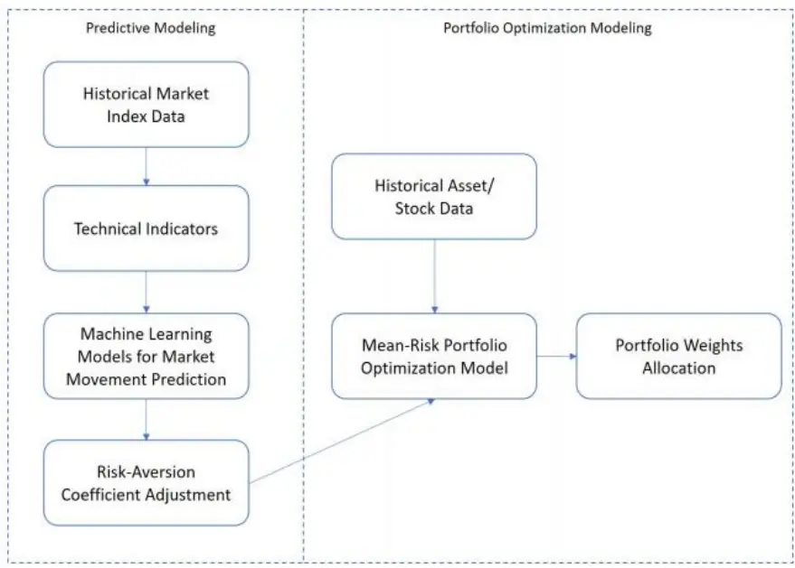
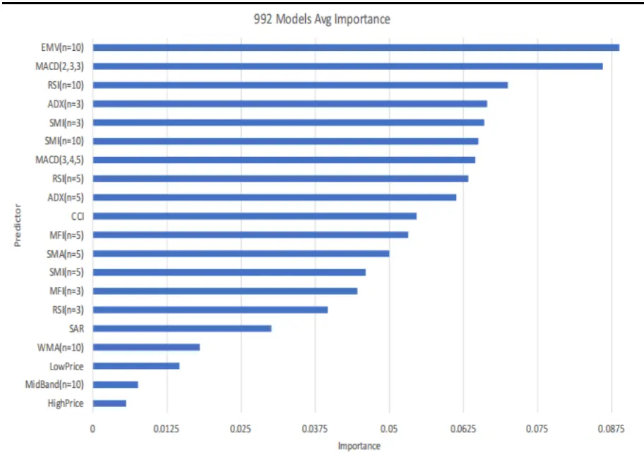
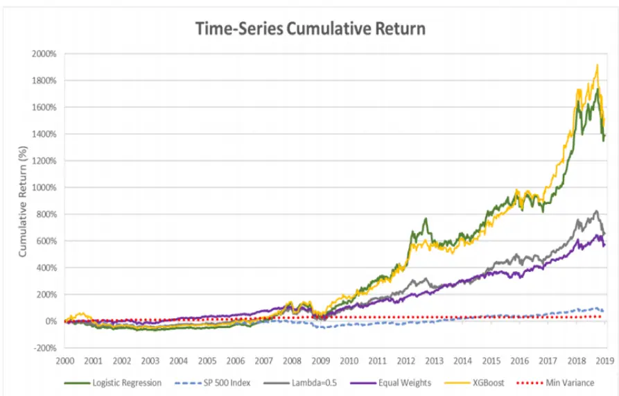

nInfo] [Table_Title] 2021.11.26

# 集成了机器学习的投资组合再平衡框架

## ——学界纵横系列之二十八

陈奥林(分析师)

## 徐浩天(研究助理)

8 021-38674835

021-38038430

chenaolin@gtjas.com

xuhaotian@gtjas.com

证书编号 S0880516100001

S0880121070119

## 本报告导读：

本文介绍了一种集成了机器学习预测和风险偏好调整的投资组合优化框架，用于在多个周期内对投资组合进行调整和平衡，获得长期稳定的收益。

## 摘要：

- le_Summary]随着机器学习技术的发展，量化交易和投资组合优化等量化金融领域中越来越多地出现了机器学习算法的身影。

Zhenlong Jiang 等人在《A Machine Learning Integrated PortfolioRebalance Framework with Risk-Aversion Adjustment》一文提出了一个投资组合再平衡框架，该框架将极端梯度提升（XGBoost）和逻辑回归（LR）等机器学习模型集成到具有风险规避调整的平均风险投资组合中。在每个时期，使用机器学习模型预测的市场趋势方向，以此调整风险规避系数。文中使用基尼均差（GMD）来度量投资组合的风险，并将一组从市场指数（标准普尔 500 指数）生成的技术指标输入机器学习模型以预测市场走势。本文利用滚动窗口法（rollinghorizon approach）使用真实金融数据进行了一系列计算测试，以评估集成了机器学习的投资组合再平衡框架的性能。

实证结果表明，极端梯度提升（XGBoost）模型提供了对市场走势的最佳预测，使整个优化框架生成的投资组合在长期获得了最出色的回报表现。

金融工程

## 金融工程团队：

陈奥林：（分析师）

电话：021-38674835

邮箱：chenaolin@gtjas.com

证书编号：S0880516100001

杨能：（分析师）

电话：021-38032685

邮箱：yangneng@gtjas.com

证书编号：S0880519080008

殷钦怡：（分析师）

电话：021-38675855

邮箱：yinqinyi@gtjas.com

证书编号：S0880519080013

徐忠亚：（分析师）

电话：021- 38032692

邮箱：xuzhongya@gtjas.com

证书编号：S0880120110019

刘昺轶：（分析师）

电话：021-38677309

邮箱：liubingyi@gtjas.com

证书编号：S0880520050001

## 赵展成：（研究助理）

电话：021-38676911

邮箱：Zhaozhancheng@gtjas.com

证书编号：S0880120110019

张烨垲：（研究助理）

电话：021-38038427

邮箱：zhangyekai@gtjas.com

证书编号：S0880121070118

徐浩天：（研究助理）

电话：021-38038430

邮箱：xuhaotian@gtjas.com

证书编号：S0880121070119

## [Table_Re相关报告

基于多元分析的 CNN-LSTM模型 2021.11.25

## 1. 文章背景与理论基础

金融投资组合优化的目的是以最优的方式分配一组资产各自的权重，从而使投资者的效用最大化。投资组合优化领域最早的研究可以追溯到 20世纪 年代， 于 年提出了均值 方差优化模型，该模型以均值表示预期收益，以方差代表预期风险，寻求收益和风险之间的最优权衡。虽然 Markovitz 的均值-方差模型在实践中被广泛应用，选用方差作为风险度量具有两个明显的局限性：仅当资产收益为正态分布且效用函数为二次型时，均值-方差模型的解才符合效用最大化原则，其中收益分布的正态性和效用函数为二次型两个条件通常不满足。

为了克服方差作为风险度量的局限，学界陆续提出了很多其他衡量风险的指标 ，如 半方 差（ semi-variance）、 平均 绝对 差异 （mean absolutedifference）、条件在险价值（conditional value at risk，CVaR）、基尼均差（Gini’s mean difference）等，在投资组合优化理论框架中每一个被提出的风险度量都构成了一个均值风险模型。

双目标投资组合优化的求解通常可以通过求解以下三个优化模型中的一个来实现：（1）在风险上限的约束下最大化预期收益；（2）在预期收益下限的约束下最小化风险；（3）最大化风险调整后的平均收益，这里的目标函数采用了平均收益减去风险度量乘以投资者选择的风险规避系数的形式。投资者的风险规避系数表现了投资者对市场环境的偏好或风险态度，反映了市场的发展趋势。具体来讲，如果市场处于下跌趋势，投资者往往更加厌恶风险，可以通过引入较大的风险规避系数实现投资组合的调整和风险规避。相比之下，如果市场处于上涨趋势，投资者应相对偏好风险，从而在模型中减小风险规避系数，调整投资组合来获得更高的收益。

在进行多期投资的真实市场中，为了适应动荡的市场环境，通常使用动态再平衡策略框架构建投资组合，以在控制风险的同时获得较高的长期整体回报。如果能够较为准确地捕捉和预测市场趋势，投资者就可以通过简单地调整风险规避系数来重新调整和平衡他们的投资组合。日渐成熟的机器学习技术可以为我们解决捕捉和预测市场趋势的问题。

技术指标是根据某一特定资产的历史数据（例如，过去的价格和成交量）进行计算的，从而获得可能会持续到未来的有用信息，目前，技术分析主要用来预测资产价格走势。而在投资组合优化模型中，暂时还没有嵌入对未来市场趋势的预测。

基于以上讨论，Ji 等人于 2019 年提出了一种多期动态投资组合优化框架，该框架主要分为以下两步：（1）由市场指数（如标准普尔 500 指数）生成的技术指标数据作为机器学习分类模型（如逻辑回归、支持向量机）的输入，预测市场运动趋势（如上涨或下跌）。（ ）投资者根据预测的市场走势调整自己的风险规避系数，求解均值风险优化模型，获得组合权重，并持有该组合配置进入下一期。在该模型中，风险由基尼均差（GMD）度量。《A Machine Learning Integrated Portfolio Rebalance Framework with

Risk-Aversion Adjustment》一文在以下三个方面改进了 Ji 等人提出的模型。

## 1、风险规避系数的选择更为灵活。

在 等人提出的模型中，风险规避系数是从投资者预先确定的一个有限且有序的集合中选择的。风险规避系数的选择被限制在这个规定的范围内，并且只允许其在相邻的值中进行变化。在《A Machine LearningIntegrated Portfolio Rebalance Framework with Risk-Aversion Adjustment》一文中，作者将优化模型的目标函数进行了标准化处理，使风险规避系数连续且无约束，机器学习模型的输出可直接作为风险规避系数输入优化模型，从而降低了模型指定的复杂性。

## 2、更多的技术指标被用于训练机器学习模型

本文将技术指标的数量从 9 个增加到 14 个（共 37 个版本），提高了机器学习模型预测的可靠性。

## 3、进行了更全面的实证检验

Ji等人的滚动窗口法中，窗口长度为 156 周（3 年），其中有 104 周进行样本内训练和投资组合优化，52 周进行样本外测试评估。在本文中，作者共进行了 1252 周（1995 年至 2018 年）的训练和测试，每个滚动窗口长度为 260 个周期（5 年），共进行了 992 个周期（19 年）的样本外绩效评估。

## 2. 准备工作

## 2.1. 基尼均差和均值-基尼模型

## 2.1.1. 基尼均差

为对基尼均差（GMD）进行说明，我们令 J 表示历史数据的周期总数，I 表示资产/股票池中资产/股票的总数。我们的决策变量， $w_{i},i=1,\ldots,I,$ 表示投资于资产 i的资金权重。r 表示资产 i在j时期的历史回报， $r_{ij}$ $j=$ $1,\ldots,J$ 。 $\mu_{i}.$ 表示资产 i的平均收益率。有了以上定义，我们可以计算资产组合在j期的收益率 $R_{j}$ 和资产组合的平均收益率R：

$$
R_{j}=\sum_{i=1}^{I}r_{ij}w_{i},\tag{1}
$$

$$
R=\sum_{i=1}^{I}\mu_{i}w_{i},\tag{2}
$$

基尼均差（GMD）被定义为所有投资组合收益之间的平均绝对差异的一半。我们用 G 表示基尼均差，计算如下：

$$
G=\frac{1}{J(J-1)}{\sum_{j=1}^{J-1}\sum_{j^{\prime}>j}^{J}\left|R_{j}-R_{j\prime}\right|}.\tag{3}
$$

## 2.1.2. 均值-基尼模型

采用平均收益（R）作为收益度量，GMD（G）作为风险度量，均值-基尼模型数学表达如下：

$$
\operatorname*{max}\quad R-\alpha G\tag{4}
$$

其中，α为风险规避系数。该模型通过为风险赋予成本，寻求最大化预期回报和最小化风险之间的权衡。通过改变风险规避系数的预定值，该模型可以求出投资组合的均值-基尼有效边界。在持续多期的投资组合再平衡策略框架下，风险规避系数应根据受市场预期走势影响的投资者的风险态度进行调整。也就是说，当市场上涨时，投资者不那么厌恶风险，甚至是寻求风险，此时该模型通过对风险规避系数设置一个较小的值来寻求更高的收益；而如果市场存在下跌趋势，投资者就会变得更加厌恶风险，此时该模型将风险规避系数调整到一个较大的值来降低和规避风险。

为了提供一个无偏的估计，作者对目标函数进行了标准化处理，归一化的均值-基尼模型（NMG）表示如下：

$$
\max\lambda\frac{R-R_{min}}{R_{max}-R_{min}}-(1-\lambda)\frac{G-G_{min}}{G_{max}-G_{min}}\tag{5}
$$

其中 R 和 G 分别表示所构建投资组合的预期回报和基尼均差。 $G_{min}$ 表示通过将 GMD 最小化作为单一目标获得的最小的基尼均差，该求解过程不受期望收益的约束； $R_{min},$ 表示和该最小基尼均差对应的组合的预期回报； $R_{max}$ 表示通过将收益最大化作为单一目标获得的最大的预期收益，$G_{max}$ 表示和该最大预期收益对应的基尼均差。经过归一化后， $\scriptstyle{\frac{R-R_{min}}{R_{max}-R_{min}}}$ 和 $a\frac{G{-}G_{min}}{G_{max}{-}G_{min}}\mathfrak{l}$ 两项的范围都为 0 到 1。（5）式中的λ代表市场上涨的概率，当λ等于 1 时，表示市场一定会上涨，此时 NMG 模型简化为仅最大化预期收益的形式，这反映了投资者在出现上升趋势时追求风险的倾向。同理，当λ等于 0 时，表示市场一定会下跌，此时 NMG 模型简化为仅最小化风险的形式。通过采用概率表示的风险规避系数λ，作者可以方便地将由机器学习分类模型获得的预测概率整合进优化模型。

## 2.2. 技术指标

本文使用一套由市场指数生成的技术指标作为预测特征，以此建立市场运动趋势的机器学习分类模型。在这个组合优化框架中，机器学习模型的任务是通过一组由市场指数得到的技术指标来预测市场的走势。在这里，作者采用了 14 个广泛使用的指标，包括简单移动平均线（SMA）、加权移动平均线（WMA）、指数移动平均线（EMA）、异同移动平均线（MACD）、相对强度指数（RSI）、平均方向性移动指数（ADX）、顺势指标（CCI）、随机动量指数（SMI）、简易移动值（EMV）、资金流量指标（MFI）、佳庆资金流量指标（CMF）、成交量加权平均价格（VWAP）、布林带（BBands）、抛物线转向（SAR）等。使用不同的参数设置，作者共创建了 37个不同版本的指标，这些指标作为预测器（或称为特征）来训练分类模型，从而预测不久的将来市场趋势上升或下降的概率。表1列出了用于预测市场方向的指标和参数设置。

表 1：技术指标的参数设置

| 指标名称 | 参数设置 |
| --- | --- |
| SMA[3] | 均值计算的周期数：3，5，10 |
| WMA[3] | 均值计算的周期数：3，5，10 |
| EMA[3] | 均值计算的周期数：3，5，10 |
| MACD[2] | 快速移动均线计算的周期数，慢速移动均线计算的周期数，信 号移动均线计算的周期数：(2，3，3)，(3，4，5） |
| SMI[2] | 要使用的周期数、初始平滑的周期数、二次平滑的周期数： (3, 3, 3),(5, 5, 5), (10, 10, 10) |
| ADX[3] | DX计算的周期数：3，5，10 |
| RSI[3] | 移动均线计算的周期数：3，5，10 |
| CCI | 移动均线计算的周期数：20 |
| EMV[3] | 移动均线计算的周期数：3，5，10 |
| BBands[3] | 移动均线计算的周期数：3，5，10 |
| SAR | 加速系数：0.02，最大加速系数：0.2 |
| MFI[3] | 使用的周期数：3，5，10 |
| CMF[3] | 使用的周期数：3，5，10 |
| VWAP[3] | 均值计算的周期数：3，5，10 |

数据来源：《A Machine Learning Integrated Portfolio Rebalance Framework with Risk-Aversion Adjustment》，国泰君安证券研究

## 2.3. 机器学习分类模型

作者在本文中介绍了两种用于分类任务的机器学习算法：逻辑回归（LR）和极端梯度提升（XGBoost）。文中将目标变量 Y定义为一个二进制变量向量，指示市场指数在 t 期是上升（即 $y_{t}=1)$ 还是下降 $\left(即y_{t}=0\right)$ 此外，将由市场指数计算出的技术指标视为预测向量 X。

## 2.3.1. 逻辑回归

逻辑回归模型可以用不同的形式来表示，本文将逻辑回归模型定为：

$$
p(X)=\frac{e^{\beta_{0}+\sum_{i=1}^{m}\beta_{i}x_{i}}}{1+e^{\beta_{0}+\sum_{i=1}^{m}\beta_{i}x_{i}}}\tag{6}
$$

其中 $\mathbf{p}(\mathrm{X})=\Pr(\mathrm{Y}=1|x_1,\ldots,x_m)$ 表示市场指数上涨的概率。该概率可以直接作为 NMG 模型中风险规避系数λ的输入值。可以将上式化简为：

$$
\log\frac{p\left(X\right)}{1-p\left(X\right)}=\beta_{0}+\sum_{i=1}^{m}\beta_{i}x_{i}.\tag{7}
$$

## 2.3.2. 极端梯度提升（XGBoost）

梯度提升树算法（GBM）是一种统计框架，往往用于解决数值优化问题，其主要思想是通过使用类似梯度下降的程序减少模型的残差。XGBoost通过系统优化和算法增强，对基于 GBM 的框架进行了改进。下面对极端梯度提升的数学原理进行简要介绍。

考虑一个具有 n 个观测值和 m 个预测因子的数据集，树模型使用以下函数进行建模：

$$
\hat{y}_{i}=\sum_{k=1}^{K}f_{k}(x_{i}),f_{k}\in F\tag{8}
$$

其中 $\mathrm{F}=\left\{f(x)=w_{q(x)}(q{:}R^{m}\to T,w\in R^{T})\right\}$ 是树空间，T是叶子的数量。每个 $f_{k}]$ 都有一个独立的树的形成 $q$ 和叶重 w。使用以下目标函数进行模型的训练：

$$
\operatorname*{min}\sum_{i=1}^{n}l(y_{i},\hat{y}_{i})+\sum_{k}\Omega(f_{k}),\tag{9}
$$

其中 $\begin{array}{r}{\Omega(f)=\gamma\mathrm{T}+\frac{1}{2}}\end{array}$ λ‖w‖, 为正则项惩罚系数，用来对模型的复杂性予以惩罚，同时避免过拟合。 $l(y_{i},\hat{y}_{i})$ 为逻辑损失函数：

$$
l(y_{i},\hat{y}_{i})=y_{i}\ln\bigl(1+e^{-\hat{y}_{i}}\bigr)+(1-y_{i})\ln\bigl(1+e^{\hat{y}_{i}}\bigr)\tag{10}
$$

不同于逻辑回归使用一个明确的显式方程来计算概率并解释目标变量和预测因子之间的关系，XGBoost 的结果是由一组集体分类树生成的。

## 3. 集成机器学习的投资组合再平衡框架

在指定了均值基尼模型、技术指标和机器学习模型之后，作者现在准备建立机器学习集成的投资组合再平衡框架。图 1 描述了投资组合再平衡框架的基本结构。

图 1 机器学习集成投资组合再平衡框架基本结构

数据来源：《A Machine Learning Integrated Portfolio Rebalance Framework with Risk-Aversion Adjustment》，国泰君安证券研究

该框架包含两个主要模型。在预测模型中，收集标准普尔 500 指数等市场指数的历史信息（包括开盘价、最低价、最高价、收盘价和成交量），并用来生成技术指标，将这些指标作为预测指标或特征输入机器学习模型来预测市场的运动趋势。然后，该框架将预测出的市场上涨的概率作为风险规避系数λ，输入投资组合优化模型。在投资组合优化模型中，我们收集市场上资产或股票的历史价格（如标准普尔 500 指数）来计算收益。在求解风险厌恶调整的组合优化模型后，将得到的组合权重应用于未来市场。

在有限期的多期设置下，为了建立预测模型并对生成的投资组合进行样本外测试，本文采用了滚动窗口法。具体的投资组合再平衡方法如下：

（1）选择一个特定的指数（如标准普尔 500），收集该市场指数的历史信息和该市场中的一组资产。使用一个 τ 周期的窗口作为样本内周期，以交叉验证的方式构建机器学习模型，并构建 NMG 投资组合。在本文的测试中，τ 被选为 260，涵盖了 5 年内的每周回报。

（2）在截至 t 的样本周期内，计算 14 个技术指标，将指标数值输入到逻辑回归和极端梯度提升两个机器学习模型中进行预测，获得市场走势的预测概率 $\cdot\lambda_{t+1}$ 。通过交叉验证，选择机器学习模型的调优参数。利用新的风险规避系数求解 NMG 模型，以获得训练窗口内的投资组合权重。

（3）在这一过程中，每次都执行滚动窗口程序，即在采样外周期中添加下一个周期的数据，并在采样内周期中删除最早一个周期的数据。每周更新一次指标数值和机器学习预测结果，并重新对投资组合进行优化。

（4）一直重复这个过程，直到进行完所选数据集，共生成T− τ个投资组合。资产 i在时间 t 的权重用 $w_{it}$ 表示， $\mathtt{t}=\mathtt{\tau},\dots,\mathtt{T}-1$ 。按 t 时的权重持有投资组合一周，在t+1时，获得样本外周期回报： $\begin{array}{r}{R_{t}=\sum_{i=1}^{I}w_{it}r_{i,t+1},}\end{array}$ 其中 $r_{i,t+11}$ 表示样本外 t+1 期的资产回报率。最后评估样本外投资组合的表现，并将其与其他基准进行比较。

本框架是一个通用框架，可以很容易地扩展，适用于各种类型的技术指标、具有预测概率的机器学习分类模型和均值风险组合优化模型，而不只限于文中提出的模型。

## 4. 计算测试

## 4.1. 数据及实验设计

作者收集了 1995年 9月 1日至 2018年 12月 31日期间标准普尔 500指数中 25 项风险资产和 1 项无风险资产（13 周国债）的数据，共计 1252周。这 26 项资产构成了构建投资组合的候选资产池。

表 2：资产列表

| 标准普尔500 板块 | 公司名称 |
| --- | --- |
| 通信服务 | The Walt Disney Company |
|  | Verizon Communications Inc. |
| 非必需消费品 | The Home Depot, Inc. |
|  | McDonald's Corporation |
|  | NIKE, Inc. |
| 日用消费品 | The Coca-Cola Company |
|  | The Procter Gamble Company |
|  | Sysco Corporation |
|  | Walmart Inc. |
| 能源 | Chevron Corporation |
|  | Exxon Mobil Corporation |
| 金融 | American Express Company |
|  | JPMorgan Chase Co. |
| 医疗保健 | Johnson Johnson |
|  | Merck Co., Inc. |
|  | Pfifizer Inc. |
|  | Walgreens Boots Alliance, Inc. |
| 工业制造 | The Boeing Company |
|  | Caterpillar Inc. |
|  | 3M Company |
|  | Raytheon Technologies Corporation |
| 信息技术 | Apple Inc. |
|  | Cisco Systems, Inc. |
|  | International Business Machines Corporation |
|  | Intel Corporation |
| ■ | 13-Week Treasury Bill |

数据来源：《A Machine Learning Integrated Portfolio Rebalance Framework with Risk-Aversion Adjustment》，国泰君安证券研究

作者依据以下三个因素选择了表 中的 项风险资产：（）所选资产在所研究的时间范围内无缺失值；（ii）所选资产波动较小，波动率低于 0.5；（iii）所选资产的多元化和对市场指数的反映。选定的 25 项资产涵盖了11 个标准普尔 500 板块中的 9 个。

作者利用滚动窗口法进行了 期（ 年）的测试，并在每个窗口中建立了逻辑回归和 模型，且对第 期市场上涨的概率进行了预测。预测的概率将作为 NMG 模型中的风险规避系数λ来构建均值-基尼投资组合。然后将投资组合的权重持有至第 261 期，获得投资组合的回报，以此检验机器学习模型的预测精度。紧接着，删除第 1 期的数据，加入第 261期的数据，构建第二个训练窗口，重复机器学习模型的训练，构建均值 基尼投资组合。一直重复这个过程到整个数据集结束。

为了便于比较，除了通过逻辑回归和 XGBoost 构建的两个均值-基尼投资组合外，文中还使用了以下四个基准：（1）使用恒定风险规避系数λ =0.5的均值-基尼模型；（2）26 项资产的等权重投资组合；（3）标准普尔500 指数；（4）经典的最小方差（MinVar）投资组合。

## 4.2. 评价标准

为了评估投资组合的样本外表现，本文采用了以下六个指标：样本外平均每周收益：

$$
R_{a}=\frac{1}{T-\tau}\sum_{t=\tau}^{T-1}\sum_{i=1}^{I}w_{it}r_{i,t+1},\tag{11}
$$

样本外标准差：

$$
\sigma=\sqrt{\frac{1}{T-\tau-1}{\sum_{t=\tau}^{T-1}(R_{t+1}-R_{a})^{2}}}.\tag{12}
$$

样本外 GMD：

$$
G_{out}=\frac{1}{(T-\tau-1)(T-\tau)}{\sum_{t=\tau}^{T-1}\sum_{t^{\prime}>t}^{T}\bigl|R_{t}^{j}-R_{t^{\prime}}^{j}\bigr|}.\tag{13}
$$

样本外夏普比：

$$
SR=\frac{R_{a}}{\sigma}\tag{14}
$$

样本外累计收益：

$$
R_{c}=\prod_{t=\tau}^{T-1}(1+R_{t+1})-1.\tag{15}
$$

样本外年化收益：

$$
R_{anu}=(1+R_{c})^{\frac{1}{(T-\tau-1)/52}}-1\tag{16}
$$

## 4.3. 结果和讨论

## 4.3.1. 机器学习模型结果

作者设置概率水平 p=0.5 的截断值并比较两种模型的预测精度，即如果预测概率大于等于 0.5，则预测市场向上移动；否则，预测市场将向下移动。逻辑回归（LR）的预测精度为 0.5857，XGBoost 的精度为 0.5958，比逻辑回归高 1.01%。

本文在所选择的 14 个技术指标中，共生成了 37 个具有不同参数设置的预测因子（详情见表 1）。图 2 显示了 XGBoost 算法在全部 992 个窗口中平均使用的不同预测因子的相对优势度，五个优势度最高的技术指标是 EMV、MACD、RSI、ADX 和 SMI。

图 2 XGBoost 模型中预测因子的优势度

数据来源：《A Machine Learning Integrated Portfolio Rebalance Framework with Risk-Aversion Adjustment》，国泰君安证券研究

技术指标的性能对这些指标的参数很敏感，尤其是指标计算的周期数。EMV（n=10）是优势度最高的预测因子，考虑到另外两个 n=3 和 n=5版本的 EMV 没有出现在顶部列表中，使用较长的 EMV 平均周期可能更适合进行机器学习的模型训练。对于 RSI 指标，也可以发现类似的规律：n = 10、5、3 等三个版本的 RSI 都是优势度较高的预测因子，RSI（n=10）的优势度最高，其次是 RSI（n=5）和 RSI（n=3）。周期参数的设置对 MACD 和 ADX 的影响则相反，即周期短的指标比周期长的指标更具优势。例如，MACD（2,3,3）比 MACD（3,4,5）更好，而 RSI（n=10）的优势度大于 RSI（n=5）和 RSI（n=3）。SMI 显示出一种不同的模式，即 SMI（n=3）与 SMI（n=10）具有几乎相同的优势度，而它们都远远优于 SMI（n=5）。

## 4.3.2. 投资组合样本外性能的评估

对前面所说的构造的 6 种投资组合进行样本外测试，表 3 显示了这些投资组合的绩效比较，包括样本外平均回报率、标准差、基尼均差、夏普比、累积收益率、年化收益率。图 3 显示了 6 种投资组合在样本外期间的累积收益。

表 3: 样本外表现的比较

|  | LR | XGBoost | λ=0.5 | Equal Weights | S&P500 | Min Var |
| --- | --- | --- | --- | --- | --- | --- |
| Average Return | 0.33% | 0.35% | 0.24% | 0.22% | 0.08% | 0.03% |
| Standard Deviation | 3.42% | 3.68% | 2.76% | 2.29% | 2.42% | 0.04% |
| GMD | 1.77% | 1.83% | 1.48% | 1.20% | 1.26% | 0.02% |
| Sharpe Ratio | 0.0970 | 0.0948 | 0.0878 | 0.0955 | 0.0335 | 0.8820 |
| Cumulative Return | 1390.65% | 1511.73% | 655.62% | 574.16% | 66.61% | 36.07% |
| Annualized Return | 15.28% | 15.76% | 11.23% | 10.57% | 2.72% | 1.63% |

数据来源：《A Machine Learning Integrated Portfolio Rebalance Framework with Risk-Aversion Adjustment》，国泰君安证券研究

图 3 累计收益比较

数据来源：《A Machine Learning Integrated Portfolio Rebalance Framework with Risk-Aversion Adjustment》，国泰君安证券研究

文中提出的集成机器学习的投资组合再平衡框架生成的投资组合(LR 和XGBoost)在收益指标，即平均收益、累积收益和年化收益方面显示出更好的表现。其中，XGBoost 在所有投资组合中表现最好，平均收益为0.35%，累积收益为 1511.73%，年化收益为 15.76%。LR 与 XGBoost 的表现相近，平均收益为0.33%，累计收益为1390.65%，年化收益为15.28%。

在测试期结束时的累积收益方面，XGBoost 和 LR 两个机器学习模型的表现也明显高于其他模型。

从图 3 可以看出，LR和 XGBoost 组合在整个测试期间明显占优，从2008年金融危机之后开始，这一优势变得更加明显。

## 5. 总结与展望

《A Machine Learning Integrated Portfolio Rebalance Framework with Risk-Aversion Adjustment》一文中，作者提出了一种集成了机器学习的投资组合再平衡框架。在调整投资组合时，将一组技术指标输入机器学习分类模型，预测市场上涨的概率，从而使投资者可以在均值风险优化模型中相应地调整风险规避系数，获得合理的组合权重。在该研究中，作者使用基尼均差（GMD）作为投资组合优化模型中的风险度量，使用从标准普尔 500 指数中生成的 14 个技术指标来训练机器学习模型。本文进行了一组广泛可靠的实证测试来评估机器学习模型的预测结果，并评估所得投资组合的样本外表现。最终发现与其他三个对照模型相比，本文提出的框架生成的 LR 和 XGBoost 投资组合在平均收益、累积收益和年化收益方面都显示出了良好的表现。

在未来，可以将文中提出的框架扩展到指数跟踪优化问题，利用预测建模能力来捕捉市场的运动趋势。此外，在构建均值风险组合优化模型时，可以纳入更符合实际的约束，并使用更大更全面的数据集评估所建立框架的性能。

## 本公司具有中国证监会核准的证券投资咨询业务资格

## 分析师声明

作者具有中国证券业协会授予的证券投资咨询执业资格或相当的专业胜任能力，保证报告所采用的数据均来自合规渠道，分析逻辑基于作者的职业理解，本报告清晰准确地反映了作者的研究观点，力求独立、客观和公正，结论不受任何第三方的授意或影响，特此声明。

## 免责声明

本报告仅供国泰君安证券股份有限公司（以下简称“本公司”）的客户使用。本公司不会因接收人收到本报告而视其为本公司的当然客户。本报告仅在相关法律许可的情况下发放，并仅为提供信息而发放，概不构成任何广告。

本报告的信息来源于已公开的资料，本公司对该等信息的准确性、完整性或可靠性不作任何保证。本报告所载的资料、意见及推测仅反映本公司于发布本报告当日的判断，本报告所指的证券或投资标的的价格、价值及投资收入可升可跌。过往表现不应作为日后的表现依据。在不同时期，本公司可发出与本报告所载资料、意见及推测不一致的报告。本公司不保证本报告所含信息保持在最新状态。同时，本公司对本报告所含信息可在不发出通知的情形下做出修改，投资者应当自行关注相应的更新或修改。

本报告中所指的投资及服务可能不适合个别客户，不构成客户私人咨询建议。在任何情况下，本报告中的信息或所表述的意见均不构成对任何人的投资建议。在任何情况下，本公司、本公司员工或者关联机构不承诺投资者一定获利，不与投资者分享投资收益，也不对任何人因使用本报告中的任何内容所引致的任何损失负任何责任。投资者务必注意，其据此做出的任何投资决策与本公司、本公司员工或者关联机构无关。

本公司利用信息隔离墙控制内部一个或多个领域、部门或关联机构之间的信息流动。因此，投资者应注意，在法律许可的情况下，本公司及其所属关联机构可能会持有报告中提到的公司所发行的证券或期权并进行证券或期权交易，也可能为这些公司提供或者争取提供投资银行、财务顾问或者金融产品等相关服务。在法律许可的情况下，本公司的员工可能担任本报告所提到的公司的董事。

市场有风险，投资需谨慎。投资者不应将本报告作为作出投资决策的唯一参考因素，亦不应认为本报告可以取代自己的判断。
在决定投资前，如有需要，投资者务必向专业人士咨询并谨慎决策。

本报告版权仅为本公司所有，未经书面许可，任何机构和个人不得以任何形式翻版、复制、发表或引用。如征得本公司同意进行引用、刊发的，需在允许的范围内使用，并注明出处为“国泰君安证券研究”，且不得对本报告进行任何有悖原意的引用、删节和修改。

若本公司以外的其他机构（以下简称“该机构”）发送本报告，则由该机构独自为此发送行为负责。通过此途径获得本报告的投资者应自行联系该机构以要求获悉更详细信息或进而交易本报告中提及的证券。本报告不构成本公司向该机构之客户提供的投资建议，本公司、本公司员工或者关联机构亦不为该机构之客户因使用本报告或报告所载内容引起的任何损失承担任何责任。

## 评级说明

## 1.投资建议的比较标准

投资评级分为股票评级和行业评级。以报告发布后的 12 个月内的市场表现为比较标准，报告发布日后的 12 个月内的公司股价（或行业指数）的涨跌幅相对同期的沪深 300 指数涨跌幅为基准。

## 2.投资建议的评级标准

报告发布日后的 12 个月内的公司股价（或行业指数）的涨跌幅相对同期的沪深300 指数的涨跌幅。

| 评级 |  | 说明 |
| --- | --- | --- |
| 股票投资评级 | 增持 | 相对沪深 300指数涨幅 15%以上 |
|  | 谨慎增持 | 相对沪深300指数涨幅介于5%～15%之间 |
|  | 中性 | 相对沪深300指数涨幅介于-5%～5% |
|  | 减持 | 相对沪深300 指数下跌5%以上 |
| 行业投资评级 | 增持 | 明显强于沪深 300 指数 |
|  | 中性 | 基本与沪深 300 指数持平 |
|  | 减持 | 明显弱于沪深300指数 |

## 国泰君安证券研究所

|  | 上海 | 深圳 | 北京 |
| --- | --- | --- | --- |
| 地址 | 上海市静安区新闸路669 号博华广 场20层 | 深圳市福田区益田路6009号新世界 商务中心34层 | 北京市西城区金融大街甲9号金融 街中心南楼18层 |
| 邮编 | 200041 | 518026 | 100032 |
| 电话 | （021）38676666 | （0755）23976888 | (010)83939888 |
|  | E-mail: gtjaresearch@gtjas.com |  |  |