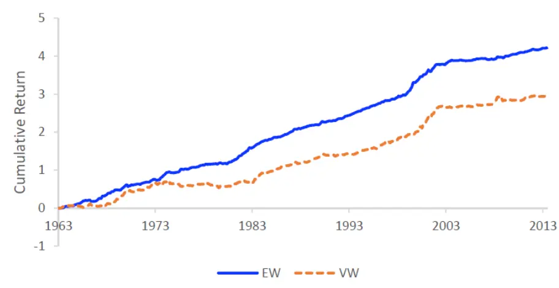

nInfo] [Table_Title] 2021.11.26

# “基本面信号宇宙”与横截面股票收益

## ——学界纵横系列之二十九

陈奥林(分析师)

## 徐浩天(研究助理)

8 021-38674835

021-38038430

chenaolin@gtjas.com

xuhaotian@gtjas.com

证书编号 S0880516100001

S0880121070119

## 本报告导读：

本文通过构建“基本面信号宇宙”，来探究能够预测截面股票收益的因子。并且证明，即使考虑数据挖掘偏差，仍有许多基本面信号的预测能力是显著的。

## 摘要：

作者利用财务报表中能够反映公司基本面信息的 240 个特征，结合76 种不同的组合形式，用排列组合的方式构建了 18000 多个（=240×76）基本面信号。基于这些信号，作者构建了多空资产组合策略，并使用 Bootstrap 的方法来评估各资产组合收益的 alpha 是否在统计意义上是显著的，从而分析这些信号能否增强传统资产定价模型对股票收益的解释力。

作者发现，即使将数据挖掘偏差考虑在内，仍有许多基本面信号是截面股票收益的重要预测因素。这些信号可以大致分为三类：（1）已经被现有的文献证明的；（2）包含的信息与前者高度相关的；（3）还未被研究者发现的，这一类占了绝大多数。

数据表明，这些基本面异象因子不能归因于样本的选择，而是能够有效地被错误定价解释。造成错误定价的主要原因，不是交易成本，而是投资者有限的注意力导致他们不能充分地利用公开的财务信息。

最后，作者证明了这种构建“信号宇宙”来挖掘异象因子的方法是具有普适性的。作者将这种方法拓展到了股票的历史累计回报率上。发现中期历史回报对未来的股票收益率有显著的正向预测能力，这与前人的研究是相符的。而长期，甚至更长期的，历史回报对未来股票收益率有负向预测能力，并且这种预测能力受资产组合加权方式的影响较大。

金融工程

## 金融工程团队：

陈奥林：（分析师）

电话：021-38674835

邮箱：chenaolin@gtjas.com

证书编号：S0880516100001

杨能：（分析师）

电话：021-38032685

邮箱：yangneng@gtjas.com

证书编号：S0880519080008

殷钦怡：（分析师）

电话：021-38675855

邮箱：yinqinyi@gtjas.com

证书编号：S0880519080013

徐忠亚：（分析师）

电话：021- 38032692

邮箱：xuzhongya@gtjas.com

证书编号：S0880120110019

刘昺轶：（分析师）

电话：021-38677309

邮箱：liubingyi@gtjas.com

证书编号：S0880520050001

赵展成：（研究助理）

电话：021-38676911

邮箱：Zhaozhancheng@gtjas.com

证书编号：S0880120110019

张烨垲：（研究助理）

电话：021-38038427

邮箱：zhangyekai@gtjas.com

证书编号：S0880121070118

徐浩天：（研究助理）

电话：021-38038430

邮箱：xuhaotian@gtjas.com

证书编号：S0880121070119

## [Table_Re相关报告

基于多元分析的 CNN-LSTM模型 2021.11.25

## 1. 选题背景

随着市场的发展，传统的资产定价模型已不再能够有效地解释股票收益异象。越来越多的学者花费大量的时间和精力，试图从基本面、技术面、市场情绪和宏观周期等多方面，挖掘出有价值的市场信息以获得收益。其中，基于公司基本面的研究最受投资者们青睐。

Xuemin Yan & Lingling Zheng 在《Fundamental Analysis and the Cross-Section of Stock Returns: A Data-Mining Approach》一文中，通过构建“基本面信号宇宙”，来探究能够预测截面股票收益的因子。并且证明，即使考虑数据挖掘偏差（data-miningbias），仍有许多基本面信号的预测能力是显著的。希望这种构造“信号宇宙”的方法能够为投资者们提供一种新的量化思路。

## 2. 核心结论

作者利用财务报表中能够反映公司基本面信息的 240个特征，结合 76种不同的组合形式，用排列组合的方式构建了 18000 多个（=240×76）基本面信号。基于这些信号，作者构建了多空资产组合策略，并使用 Bootstrap的方法来评估各资产组合收益的 alpha 是否在统计意义上是显著的，从而分析这些信号能否增强传统资产定价模型对股票收益的解释力。

作者发现，即使将数据挖掘偏差考虑在内，仍有许多基本面信号是截面股票收益的重要预测因素。这些信号可以大致分为三类：（1）已经被现有的文献证明的；（2）包含的信息与前者高度相关的；（3）还未被研究者发现的，这一类占了绝大多数。

数据表明，这些基本面异象因子不能归因于样本的选择，而是能够有效地被错误定价解释。造成错误定价的主要原因，不是交易成本，而是投资者有限的注意力导致他们不能充分地利用公开的财务信息。

最后，作者证明了这种构建“信号宇宙”来挖掘异象因子的方法是具有普适性的。作者将这种方法拓展到了股票的历史累计回报率上。发现中期历史回报对未来的股票收益率有显著的正向预测能力，这与前人的研究是相符的。而长期，甚至更长期的，历史回报对未来股票收益率有负向预测能力，并且这种预测能力受资产组合加权方式的影响较大。

## 3. 文章背景

自 1965 年 CAPM 模型问世，发展到如今著名的 Q5 模型、Fama-French六因子模型，大量的公司特征和因子不断被挖掘，模型的异象解释能力也不断增强。这就带来了一个问题：这些声称能够解释股票收益率的异象因子，究竟是市场非有效性的体现，还是只是数据过度挖掘而造成的错觉（我们称之为“数据挖掘偏差”）？

所谓的数据挖掘偏差是指，如果考虑足够多的变量，我们很有可能能够从很大程度上解释市场异象，即使这些变量对未来的股票收益并没有真正的预测能力。

这个问题其实很早就被研究者们注意到了，但现有研究几乎没有检验这是否影响了横截面股票收益的异象性。之所以会有这种缺失，很大一部分原因是，将所有被研究者们挖掘过的变量收集起来是很困难的。因为除了已经公开发表的“显著”变量外，还有很多变量是已经被挖掘过但由于“不显著”等原因未被发表。

本文通过综合能够反映公司基本面信息的 240 个特征，结合 76 种不同的组合形式，用排列组合的方式构建了 18000 多个基本面信号。这些信号不仅包括了已经公开发表并被众人熟知的，还包括了更多尚未被检验的。作者希望通过这种方式来模拟数据挖掘的过程，以检验数据挖掘偏差的影响。

## 4. 核心模型

## 4.1. 数据来源及样本空间

本文选取 1963 年 7 月至 2013 年 12 月美国市场 NYSE、AMEX、NASDAQ中满足以下条件的所有股票的财务数据及股票价格：（ ）排除金融类股票；（2）每股市值大于 1 美元；（3）上市时间超过两年。数据来源于 Centerfor Research in Security Prince（CRSP）和 Compustat 数据库。

同时，从 Kenneth French 的个人主页上获取了相应的 Fama-French 三因子和动量因子的数据。

## 4.2. “基本面信号宇宙”的构建

“基本面信号宇宙”的构建由以下几个步骤组成：

一、选取满足条件的财务变量 X。为了保证样本容量的合理性以及后续检验的顺利进行，作者要求（1）各变量的非空个数至少为 20 年；（2）对每一个变量而言，每年该数据非空的公司的平均数至少为 1000 家。基于这两个条件，作者从列于 Compustat 的所有财务数据中，选出了 240个，详见附录。

二、选取 15 个基础变量 Y（详见表 1），用于去除财务变量 X 的数量级。一方面，考虑到各公司规模的差异，为了使不同公司之间的数据具有可比性，我们需要去除财务变量 X 的数量级。另一方面，构建 ratio 的形式也能够使得财务数据更加具有经济意义。

三、构建六种不同的财务变量 X 与基础变量 Y 的组合形式。包括比率（X/Y），年变化量（Δin X/Y），同比（%Δ in X/Y）， 财务变量 X 的同比（%Δ inX），财务变量X与基础变量Y同比的差（%Δ inX− %Δ inY），财务变量 X 的差分与基本变量 Y滞后一期的比（ΔX/lagY）。

四、综合上述 15 种基本变量 Y及 6 种 X 和 Y的组合形式，我们可以通过排列组合的方式得到 76 类财务指标，详见表 2。

表 1: 基础变量 Y

| 序号 | Base Variable Y | Notation | 序号 | Base Variable Y | Notation |
| --- | --- | --- | --- | --- | --- |
| 1 | total assets | AT | 9 | stockholders’ equity | SEQ |
| 2 | total current assets | ACT | 10 | total invested capital | ICAPT |
| 3 | inventory | INVT | 11 | total sale | SALE |
| 4 | property, plant, and equipment | PPENT | 12 | cost of goods sold | COGS |
| 5 | total liabilit ies | LT | 13 | selling, general, and administrative cost | XSGA |
| 6 | totalcurrent liabilities | LCT | 14 | number of employees | EMP |
| 7 | long-term debt | DLTT | 15 | market capitalization | MKTCAP |
| 8 | total common equity | CEQ |  |  |  |

数据来源：《Fundamental Analysis and the Cross-Section of Stock Returns: A Data-Mining Approach》

表 2: 76 类财务指标

| # | Description | # | Description | # | Description | # | Description | # | Description |
| --- | --- | --- | --- | --- | --- | --- | --- | --- | --- |
| 1 | X/AT | 16 | ∆ in X/AT | 31 | %∆ in X/AT | 46 | ∆X/LAGAT | 61 | %∆ in X - %∆ in AT |
| 2 | X/ACT | 17 | ∆ in X/ACT | 32 | %∆ in X/ACT | 47 | ΔX/LAGACT | 62 | %∆ in X - %∆ in ACT |
| 3 | X/INVT | 18 | ∆ in X/INVT | 33 | %∆ in X/INVT | 48 | ΔX/LAGINVT | 63 | %∆ in X - %∆ in INVT |
| 4 | X/PPENT | 19 | ∆ in X/PPENT | 34 | %∆ in X/PPENT | 49 | ∆X/LAGPPENT | 64 | %∆ in X - %∆ in PPENT |
| 5 | X/LT | 20 | Δ in X/LT | 35 | %∆ in X/LT | 50 | ∆X/LAGLT | 65 | %∆ in X - %∆ in LT |
| 6 | X/LCT | 21 | ∆ in X/LCT | 36 | %∆ in X/LCT | 51 | ∆X/LAGLCT | 66 | %∆ in X - %∆ in LCT |
| 7 | X/DLTT | 22 | ∆ in X/DLTT | 37 | %∆ in X/DLTT | 52 | ∆X/LAGDLTT | 67 | %∆ in X - %∆ in DLTT |
| 8 | X/CEQ | 23 | Δ in X/CEQ | 38 | %∆ in X/CEQ | 53 | ΔX/LAGCEQ | 68 | %∆ in X - %∆ in CEQ |
| 9 | X/SEQ | 24 | ∆ in X/SEQ | 39 | %∆ in X/SEQ | 54 | △X/LAGSEQ | 69 | %∆ in X - %∆ in SEQ |
| 10 | X/ICAPT | 25 | ∆ in X/ICAPT | 40 | %∆ in X/ICAPT | 55 | ∆X/LAGICAPT | 70 | %∆ in X - %∆ in ICAPT |
| 11 | X/SALE | 26 | ∆ in X/SALE | 41 | %∆ in X/SALE | 56 | ΔX/LAGSALE | 71 | %∆ in X - %∆ in SALE |
| 12 | X/COGS | 27 | ∆ in X/COGS | 42 | %∆ in X/COGS | 57 | ∆X/LAGCOGS | 72 | %∆ in X - %∆ in COGS |
| 13 | X/XSGA | 28 | ∆ in X/XSGA | 43 | %∆ in X/XSGA | 58 | ∆X/LAGXSGA | 73 | %∆ in X - %∆ in XSGA |
| 14 | X/EMP | 29 | ∆ in X/EMP | 44 | %∆ in X/EMP | 59 | △X/LAGEMP | 74 | %∆ in X - %∆ in EMP |
| 15 | X/MKTCAP | 30 | ∆ in X/MKTCAP | 45 | %∆ in X/MKTCAP | 60 | ΔX/LAGMKTCAP | 75 76 | %∆ in X - %∆ in MKTCAP %∆ in X |

数据来源：《Fundamental Analysis and the Cross-Section of Stock Returns: A Data-Mining Approach》

最后，我们用 240 个财务变量与 76 类财务指标组合，得到 18240（240×76）个基本面信号（fundamentalsignal）。事实上，最后用于分析的只有18113 个信号，因为有些组合是无意义的（比如当 X 和 Y一致的时候），或者是冗余的。

## 4.3. 投资策略的构建

依据每一个基本面信号，作者对所有股票排序，然后按照等权和市值加权的方式，分别构建投资组合。注意，这里是依据前一财年的数据，在每年的六月构建投资组合，并计算该投资组合从当年七月到次年六月的收益。也就是说，投资组合的调整周期是一年。

文章在做多前10%的股票同时，做空后10%的股票，以此构建多空组合。随后，计算这种投资策略的收益 ${\mathit{r}}_{i,t};$ ，并将它与 CAPM 模型、Fama-French三因子模型和 Carhart 四因子模型回归，得到 alpha 的估计值。

$$
r_{i,t}=\alpha_{i}+\beta_{i}MKT_{t}+e_{i,t}\tag{1}
$$

$$
r_{i,t}=\alpha_{i}+\beta_{i}MKT_{t}+s_{i}SMB_{t}+h_{i}HML_{t}+e_{i,t}\tag{2}
$$

$$
r_{i,t}=\alpha_{i}+\beta_{i}MKT_{t}+s_{i}SMB_{t}+h_{i}HML_{t}+u_{i}UMD_{t}+e_{i,t}^{\phantom{}}\tag{3}
$$

## 4.4. Bootstrap

为了检验上述回归的 alpha 是否显著，作者放弃了传统的单边 t 检验方法，因为我们的数据不是正态分布的，并且许多财务变量之间存在严重的多重共线性。取而代之的是 Bootstrap 方法，这是一种用于估计参数密度分布函数（PDF）的非参数方法。即使分布是拖尾偏态的、截面数据之间是非独立的，Bootstrap 也能得到稳键的结果。

以 Fama-French 三因子模型为例，作者按照以下几个步骤进行 Bootstrap（CAPM 模型和四因子模型的 Bootstrap 过程与之类似）：

1. 对投资策略收益 ${\mathit{r}}_{i,t}$ 与 Fama-French 三因子回归，得到 alpha、回归系数、残差的估计值。

2. 有放回地随机抽取残差及对应的 Fama-French 三因子，得到 606 个月的重采样数据。这里注意的是，为了保护横截面数据的时间结构性，此处不是对每一个基本面信号单独抽样，而是对整个截面数据联合抽样。举个例子，当我们要抽取 1998 年 10 月的数据时，我们抽取该时间点的整个横截面的残差及 Fama-French 三因子。这种抽样过程称为“cross-sectional bootstrap”（Kosowski et al., 2006）。

3. 在原假设（alpha 为零）成立的条件下，为每一个基本面信号计算模拟收益。

4. 用模拟收益和各因子重新估计 Fama-French 三因子模型，得到 alpha的新估计值和 t 统计量，并计算其对应的各种横截面分位数。

5. 重复 10000 次步骤 2-4，得到 alpha 和 t 统计量分位数的经验分布。

## 5. 实证分析

## 5.1. Bootstrap 结果

回归结果和 Bootstrap 的结果列在表 3 和表 4。可以发现，无论是对于CAPM 单因子模型，还是考虑了财务状况信息的 Fama-French 三因子模型，Bootstrap 生成的 alpha 或t(α)几乎没有分布在比真实数据得到的alpha 或t(α)更尾部的地方。换句话说，在原假设（alpha 为零）成立的条件下，获得由真实数据所估计的 alpha 的概率（p-value）是很小的，因此我们可以拒绝原假设，认为基本面信号能够解释市场异象，并且这种异象解释力不能被抽样的随机性解释。

表 3: Alpha 的 t 统计量的分位数

|  | EW (t-statistic) |  |  |  |  |  | VW (t-statistic) |  |  |  |  |  |
| --- | --- | --- | --- | --- | --- | --- | --- | --- | --- | --- | --- | --- |
|  | 1-factor α |  | 3-factor α |  | 4-factor α |  | 1-factor α |  | 3-factor α |  | 4-factor α |  |
| Percentiles | Actual | p-value | Actual | p-value Actual |  | p-value Actual |  | p-value Actual |  | 1 p-value Actual |  | p-value |
| 100 | 10.67 | 0.00% | 9.70 | 0.00% | 8.46 | 0.04% | 4.95 | 1.35% | 5.24 | 0.67% | 5.03 | 2.45% |
| 99 | 4.86 | 0.00% | 4.82 | 0.00% | 4.35 | 0.00% | 3.40 | 0.03% | 3.66 | 0.00% | 3.02 | 0.64% |
| 98 | 4.21 | 0.00% | 4.23 | 0.00% | 3.82 | 0.01% | 2.98 | 0.04% | 3.23 | 0.00% | 2.67 | 0.63% |
| 97 | 3.74 | 0.00% | 3.79 | 0.00% | 3.42 | 0.04% | 2.71 | 0.06% | 2.96 | 0.00% | 2.42 | 0.92% |
| 96 | 3.42 | 0.00% | 3.50 | 0.00% | 3.11 | 0.06% | 2.54 | 0.07% | 2.74 | 0.00% | 2.22 | 1.55% |
| 95 | 3.19 | 0.00% | 3.25 | 0.00% | 2.90 | 0.16% | 2.41 | 0.09% | 2.55 | 0.00% | 2.07 | 1.90% |
| 90 | 2.41 | 0.05% | 2.49 | 0.01% | 2.12 | 0.48% | 1.93 | 0.11% | 1.94 | 0.00% | 1.58 | 3.97% |
| 10 | -3.48 | 0.00% | -3.42 | 0.00% | -3.17 | 0.00% | -1.87 | 0.14% | -1.78 | 0.06% | -1.62 | 2.46% |
| 5 | -5.15 | 0.00% | -4.77 | 0.00% | -4.13 | 0.00% | -2.58 | 0.00% | -2.37 | 0.00% | -2.05 | 2.58% |
| 4 | -5.68 | 0.00% | -5.13 | 0.00% | -4.43 | 0.00% | -2.81 | 0.00% | -2.54 | 0.00% | -2.21 | 1.81% |
| 3 | -6.08 | 0.00% | -5.55 | 0.00% | -4.84 | 0.00% | -3.07 | 0.00% | -2.77 | 0.00% | -2.38 | 1.68% |
| 2 | -6.57 | 0.00% | -6.13 | 0.00% | -5.39 | 0.00% | -3.46 | 0.00% | -3.08 | 0.00% | -2.59 | 1.62% |
| 1 | -7.65 | 0.00% | -6.99 | 0.00% | -6.13 | 0.00% | -4.10 | 0.00% | -3.53 | 0.00% | -2.96 | 1.07% |
| 0 | -11.08 | 0.00% | -10.02 | 0.00% | -8.91 | 0.00% | -6.57 | 0.01% | -5.55 | 0.22% | -5.31 | 0.86% |

数据来源：《Fundamental Analysis and the Cross-Section of Stock Returns: A Data-Mining Approach》

表 4: Alpha 的分位数

|  | EW (α) |  |  |  |  |  | VW (α) |  |  |  |  |  |
| --- | --- | --- | --- | --- | --- | --- | --- | --- | --- | --- | --- | --- |
|  | 1-factor α |  | 3-factor α |  | 4-factor α |  | 1-factor α |  | 3-factor α |  | 4-factor α |  |
| Percentiles Actual |  | p-value | Actual | p-value | Actual | p-value | Actual | p-value | Actual | p-value | Actual | p-value |
| 100 | 1.87 | 59.31% | 2.04 | 90.49% | 2.09 | 90.91% | 2.47 | 47.68% | 2.54 | 73.74% | 2.52 | 78.45% |
| 99 | 0.90 | 0.36% | 0.84 | 1.10% | 0.79 | 6.11% | 0.89 | 1.97% | 0.83 | 8.11% | 0.78 | 27.16% |
| 98 | 0.73 | 0.07% | 0.69 | 0.00% | 0.64 | 0.32% | 0.75 | 0.23% | 0.71 | 0.24% | 0.63 | 7.50% |
| 97 | 0.65 | 0.03% | 0.60 | 0.00% | 0.55 | 0.19% | 0.66 | 0.15% | 0.64 | 0.06% | 0.56 | 2.11% |
| 96 | 0.58 | 0.03% | 0.54 | 0.00% | 0.49 | 0.16% | 0.60 | 0.09% | 0.59 | 0.00% | 0.51 | 1.10% |
| 95 | 0.52 | 0.02% | 0.50 | 0.00% | 0.44 | 0.14% | 0.56 | 0.06% | 0.55 | 0.00% | 0.47 | 0.72% |
| 90 | 0.36 | 0.02% | 0.36 | 0.00% | 0.30 | 0.26% | 0.41 | 0.05% | 0.40 | 0.00% | 0.33 | 0.86% |
| 10 | -0.42 | 0.00% | -0.39 | 0.00% | -0.37 | 0.02% | -0.34 | 0.82% | -0.32 | 0.70% | -0.29 | 11.53% |
| 5 | -0.61 | 0.00% | -0.53 | 0.00% | -0.49 | 0.01% | -0.49 | 0.44% | -0.44 | 1.01% | -0.40 | 16.59% |
| 4 | -0.65 | 0.01% | -0.57 | 0.01% | -0.52 | 0.08% | -0.54 | 0.41% | -0.48 | 1.42% | -0.44 | 17.98% |
| 3 | -0.72 | 0.02% | -0.62 | 0.01% | -0.57 | 0.15% | -0.60 | 0.40% | -0.53 | 2.85% | -0.48 | 30.64% |
| 2 | -0.82 | 0.03% | -0.70 | 0.04% | -0.65 | 0.32% | -0.69 | 0.65% | -0.62 | 5.64% | -0.55 | 46.63% |
| 1 | -0.97 | 0.17% | -0.84 | 1.74% | -0.80 | 5.38% | -0.85 | 4.32% | -0.74 | 36.31%-0.69 |  | 69.73% |
| 0 | -2.91 | 26.05% | -2.94 | 41.27% | -2.63 | 63.66% | -2.91 | 32.49% | -2.73 | 66.96% | -2.62 | 76.60% |

数据来源：《Fundamental Analysis and the Cross-Section of Stock Returns: A Data-Mining Approach》

## 5.2. 显著的基本面信号

我们的 Bootstrap 结果表明，大量的基本面信号对未来的股票收益拥有显著的预测能力。表 5 根据等权重组合的四因子模型 alpha 的 t 统计量绝对值大小，列出了排在前 100 位的基本面信号。同理，表 6 根据市值加权组合的四因子模型 alpha 的 t 统计量绝对值的大小，列出了排在前 100位的基本面信号。

我们发现，这些基本面信号可以被分为三类。第一类，已经被现有文献证明对未来股票收益有预测能力的。这一类的代表有账面市值比（CEQ/MKTCAP 和 SEQ/MKTCAP）、库存变动（ΔINVT/LAGAT）等。

第二类，和现有文献所证明的高度相关的基本面变量。这一类的代表有总负债的增长率（%Δ inLT）等。第三类，也是绝大多数，都是属于现有文献没有证明的，比如 change in interest expense divided by lagged totalassets （ΔXINT/LAGAT ），accumulated depreciation divided by total netproperty, plant, and equipment（DPACT/PPENT）以及 short-term debt peremployee（DLC/EMP）。

事实上，由于篇幅的限制，还有很多显著的基本面信号没有列出。就平均加权的四因子模型而言，alpha 的 t 统计量绝对值大于 5 的有 549 个基本面信号，而市值加权的四因子模型的 alpha 对应的 t 统计量大于 3 的有 362 个。

图 1 展示了根据最显著的基本面信号构建多头-空头组合的累计收益率。在样本期间（1963-2013 年），投资组合的累计收益率持续增加，回撤率低。

表 5: 最显著的基本面信号（以等权组合的四因子模型为例）

| # | Signal | t-statistic | alpha | # | Signal | t-statistic | alpha |
| --- | --- | --- | --- | --- | --- | --- | --- |
| 1 | ΔLT/LAGAT | -8.91 | -0.74 | 26 | CEQ/MKTCAP | 7.71 | 0.82 |
|  | ΔLT/LAGICAPT | -8.76 | -0.74 | 27 | ∆LT/LAGXSGA | -7.68 | -0.67 |
| 23 | ΔLCT/LAGAT | -8.75 | -0.67 | 28 | ∆XINT/LAGPPENT | -7.67 | -0.57 |
| 4 | ΔLT/LAGCEQ | -8.72 | -0.74 | 29 | ΔDCVT/LAGXSGA | -7.65 | -0.69 |
| 5 | DLC/SALE | -8.58 | -0.66 | 30 | AQS/SALE | -7.65 | -0.47 |
| 6 | ∆XINT/LAGAT | -8.57 | -0.65 | 31 | %Δ in XINT | -7.63 | -0.50 |
| 7 | CEQT/MKTCAP | 8.46 | 0.85 | 32 | DLC/EMP | -7.62 | -0.54 |
| 8 | DPACT/PPENT | 8.38 | 0.89 | 33 | ∆DLTT/LAGAT | -7.62 | -0.53 |
| 9 | PPEGT/PPENT | 8.38 | 0.89 | 34 | ΔINVT/LAGCOGS | -7.61 | -0.70 |
| 10 | %∆ in PPENT | -8.36 | -0.83 | 35 | DLC/COGS | -7.61 | –0.57 |
| 11 | DPVIEB/PPENT | 8.34 | 1.03 | 36 | NP/EMP | -7.58 | -0.45 |
| 12 | ΔLT/LAGSEQ | -8.17 | -0.72 | 37 | ∆XINT/LAGCEQ | –7.57 | -0.61 |
| 13 | ΔINVT/LAGSALE | -8.16 | -0.74 | 38 | AQS/XSGA | -7.54 | -0.52 |
| 14 | AQS/INVT | -8.14 | -0.51 | 39 | ∆PPENT/LAGLT | -7.54 | -0.72 |
| 15 | △XINT/LAGXSGA | -8.09 | -0.63 | 40 | CEQL/MKTCAP | 7.54 | 0.81 |
| 16 | ΔLCT/LAGICAPT | -8.07 | -0.62 | 41 | ΔDLTT/LAGPPENT | –7.53 | -0.49 |
| 17 | ∆XINT/LAGLT | -8.01 | -0.57 | 42 | ΔAP/LAGACT | -7.53 | -0.82 |
| 18 | ΔLCT/LAGCEQ | -7.95 | -0.61 | 43 | ΔAP/LAGCEQ | -7.53 | -0.80 |
| 19 | PPEVED/PPENT | 7.92 | 0.84 | 44 | ΔLCT/LAGSEQ | -7.50 | -0.58 |
| 20 | %∆ in LT | –7.91 | -0.66 | 45 | ΔINVT/LAGPPENT | -7.49 | -0.66 |
| 21 | DLTIS/PPENT | -7.83 | -0.65 | 46 | ΔLT/LAGLCT | -7.49 | -0.64 |
| 22 | ΔCSTK/LAGXSGA | -7.78 | -0.53 | 47 | ΔLCT/LAGXSGA | -7.48 | -0.61 |
| 23 | ΔLT/LAGPPENT | -7.77 | -0.67 | 48 | ΔXINT/LAGICAPT | -7.46 | -0.59 |
| 24 | ΔLCT/LAGACT | -7.76 | -0.58 | 49 | SEQ/MKTCAP | 7.46 | 0.78 |
| 25 | NP/SALE | -7.76 | -0.52 | 50 | ΔINVT/LAGACT | -7.46 | -0.67 |
| 51 | DLTIS/SALE | -7.43 | -0.73 | 76 | ΔAP/LAGSEQ |  |  |
| 52 | DLC/ACT | –7.41 | -0.54 | 77 | AQS/COGS | -7.08 -7.06 | -0.76 |
| 53 | ∆PPENT/LAGAT | -7.40 | -0.77 | 78 | ∆XINT/LAGACT | -7.06 | -0.43 |
| 54 | ΔINVT/LAGAT | -7.39 | -0.67 | 79 | ΔAP/LAGAT | -7.06 | -0.57 |
| 55 | ∆DLC/LAGAT | -7.38 | -0.44 | 80 | ΔINVT/LAGCEQ |  | -0.74 |
| 56 | ∆CSTK/LAGCEQ | -7.34 | -0.47 | 81 |  | -7.05 | -0.64 |
| 57 | DLTIS/AT |  |  | 82 | DLTIS/CEQ | -7.05 | -0.72 |
| 58 | ∆XINT/LAGSEQ | -7.32 | -0.71 |  | ΔAT/LAGCEQ | -7.04 | -0.85 |
| 59 | DLTIS/ICAPT | -7.31 | -0.58 | 83 | AQS/ICAPT | -7.04 | -0.44 |
| 60 | ΔDLTT/LAGICAPT | -7.31 | -0.71 | 84 85 | ΔCSTK/LAGICAPT | -7.02 | -0.45 |
| 61 | ΔAP/LAGSALE | -7.31 | -0.51 |  | %ΔLCT | -7.02 | -0.56 |
| 62 | ΔDLC/LAGPPENT | -7.28 | -0.82 | 86 87 | ΔCSTK/LAGICAPT | -7.00 | -0.48 |
| 63 | ΔINVT/LAGXSGA | –7.25 | -0.43 | 88 | DLTIS/SEQ | -7.00 | -0.72 |
| 64 | ΔAP/LAGCOGS | -7.23 -7.22 | -0.65 -0.81 | 89 | ΔXINT/LAGLCT ΔLCT/LAGPPENT | -6.99 | -0.52 |
| 65 | ∆PPENT/LAGICAPT |  | -0.74 | 90 | %ΔINVT | -6.99 | -0.58 |
| 66 | ΔPPENT/LAGXSGA | -7.19 -7.18 | -0.75 | 91 | ΔLCT/LAGSALE | -6.98 | -0.68 |
| 67 | ΔPPENT/LAGCEQ |  | -0.75 | 92 |  | -6.98 | -0.57 |
| 68 | ΔINVT/LAGLCT | -7.18 -7.17 | -0.62 | 93 | AQS/LCT | -6.98 -6.94 | -0.46 |
| 69 | AQS/AT | -7.17 | -0.44 | 94 | ΔCSTK/LAGSEQ ΔLT/LAGACT | -6.94 | -0.45 |
| 70 | %ΔPPEGT | -7.13 | -0.66 | 95 | SSTK/XSGA | -6.94 | -0.64 |
| 71 | ΔDLC/LAGLCT | -7.13 | -0.40 | 96 | DVPIBB/MKTCAP | 6.92 | -0.80 |
| 72 | ΔDLTT/LAGSEQ | –7.12 | -0.52 | 97 | ΔDLTT/LAGCEQ | -6.91 | 1.01 –0.51 |
| 73 | ∆CSTK/LAGACT | -7.09 | -0.50 | 98 | DVPIBB/PPENT | 6.91 | 0.94 |
| 74 | NP/COGS DVPIBB/LT | -7.08 | -0.44 | 99 100 | %∆CSTK | -6.91 | -0.56 |

数据来源：《Fundamental Analysis and the Cross-Section of Stock Returns: A Data-Mining Approach》

表 6: 最显著的基本面信号（以市值加权组合的四因子模型为例）

| # | Signal | t-statistic | alpha | # | Signal | t-statistic | alpha |
| --- | --- | --- | --- | --- | --- | --- | --- |
| 1 | ΔICAPT/LAGMKTCAP | -5.31 | -0.75 | 26 | ΔDLTT/LAGMKTCAP | -4.01 | -0.46 |
|  | FOPT/ACT | 5.03 | 1.29 | 27 | CAPS/XSGA | -4.01 | -0.62 |
| 23 | ∆XINT/LAGSEQ | -4.77 | -0.63 | 28 | RE/INVT | 3.99 | 0.60 |
| 4 | FOPT/INVT | 4.63 | 1.07 | 29 | %∆ in TSTK/SEQ | 3.97 | 0.88 |
| 5 | ΔTLCF/LAGCEQ | -4.43 | -0.79 | 30 | DS/XSGA | -3.95 | -0.36 |
| 6 | △XINT/LAGCEQ | -4.37 | -0.57 | 31 | FOPT/LT | 3.95 | 1.05 |
| 7 | FOPT/LCT | 4.34 | 1.10 | 32 | %∆ in TSTK/CEQ | 3.95 | 0.86 |
| 8 | AT/MKTCAP | -4.28 | -0.74 | 33 | %∆ in TSTK/AT | 3.94 | 0.91 |
| 9 | XSGA/AT | 4.28 | 0.74 | 34 | %∆ in APALCH - %∆ in SEQ | 3.94 | 0.99 |
| 10 | ΔICAPT/LAGLCT | -4.23 | -0.63 | 35 | COGS/XSGA | -3.91 | -0.68 |
| 11 | ΔTLCF/LAGSEQ | -4.21 | -0.75 | 36 | XOPR/XSGA | -3.91 | -0.68 |
| 12 | ΔCEQ/LAGMKTCAP | -4.20 | -0.66 | 37 | DLTIS/CEQ | -3.90 | -0.56 |
| 13 | FOPT/ICAPT | 4.12 | 1.05 | 38 | ∆DS/LAGEMP | -3.90 | -0.53 |
| 14 | △FATC/LAGMKTCAP | -4.10 | -0.68 | 39 | ΔCAPS/LAGCEQ | -3.89 | -0.51 |
| 15 | ∆XINT/LAGICAPT | -4.10 | -0.52 | 40 | XSGA/EMP | 3.89 | 0.53 |
| 16 | ΔCAPS/LAGXSGA | -4.09 | -0.58 | 41 | ΔRECT/LAGCEQ | -3.87 | -0.54 |
| 17 | %∆ in TSTK/ICAPT | 4.07 | 0.91 | 42 | FOPT/SALE | 3.87 |  |
| 18 | %∆ in TSTK/MKTCAP | 4.07 | 0.96 | 43 | ΔCAPS/LAGAT | -3.85 | 0.93 |
| 19 | ∆AT/LAGMKTCAP | -4.05 | -0.55 | 44 | ΔCAPS/LAGSEQ | -3.83 | –0.55 |
| 20 | EBITDA/LT | 4.05 | 0.77 | 45 | %∆ in TXC - %Δ in SALE | 3.82 | -0.50 |
| 21 | ΔINVT/LAGMKTCAP | -4.04 | -0.54 | 46 | %∆ in TSTK/LT | 3.80 | 0.51 |
| 22 | FOPT/COGS | 4.04 | 0.97 | 47 | %∆ in TSTK/ACT | 3.80 | 0.89 |
| 23 | DLTIS/MKTCAP | -4.04 | -0.56 | 48 | %∆ in APALCH - %∆ in ICAPT | 3.79 | 0.88 |
| 24 | ∆CEQL/LAGMKTCAP | -4.03 | -0.64 | 49 | DD1/XSGA | -3.79 | 0.96 |
| 25 | △PPENT/LAGSEQ | -4.01 | -0.47 | 50 | OANCF/DLTT | 3.78 | -0.59 |
| 51 |  |  |  |  |  |  | 0.97 |
| 52 | FOPT/AT | 3.77 | 0.96 | 76 | ΔICAPT/LAGXSGA | -3.62 | -0.54 |
| 53 | XSGA/COGS | 3.76 | 0.64 | 77 | %∆ in TSTK - %∆ in CEQ | 3.62 | 0.80 |
| 54 | Δ in CEQL/SALE %∆ in TXC - %∆ in ICAPT | -3.75 | -0.46 | 78 | %∆ in TXC/CEQ | 3.61 | 0.54 |
| 55 | %∆ in TSTK/PPENT | 3.74 | 0.52 | 79 | ΔDS/LAGAT | -3.61 | -0.48 |
| 56 |  | 3.73 | 0.83 | 80 | ΔDS/LAGLT | -3.61 | -0.48 |
| 57 | ΔRECT/LAGSEQ | -3.73 | -0.53 | 81 | RE/SALE | 3.61 | 0.59 |
| 58 | DCVT/ACT | -3.72 | -0.28 | 82 | ∆DS/LAGSALE | -3.60 | -0.48 |
| 59 | ΔLT/LAGMKTCAP | -3.72 | -0.46 | 83 | ΔDS/LAGCOGS | -3.60 | -0.48 |
| 60 | %∆ in TSTK/SALE ∆CAPS/LAGICAPT | 3.71 | 0.83 | 84 | ΔDS/LAGICAPT | -3.59 | -0.48 |
| 61 |  | -3.71 | -0.50 | 85 | %∆ in TSTK - %∆ in SALE | 3.58 | 0.81 |
| 62 | ΔCAPS/LAGMKTCAP | -3.71 | -0.47 | 86 | %∆ in APALCH - %∆ in ACT | 3.57 | 0.81 |
| 63 | ∆SEQ/LAGMKTCAP | -3.70 | -0.58 | 87 | ΔDS/LAGPPENT | -3.57 | -0.48 |
| 64 | ΔTLCF/LAGICAPT | -3.70 | -0.66 | 88 | ΔPPENT/LAGCEQ | -3.56 | -0.42 |
| 65 | %∆ in APALCH - %∆ in CEQ | 3.69 | 0.91 | 89 | %∆ in TSTK | 3.56 | 0.78 |
| 66 | DLTIS/SEQ | -3.68 | -0.54 | 90 | %∆ in TSTKC/SEQ | 3.56 | 0.59 |
| 67 | XINT/LT | -3.67 | -0.58 | 91 | %∆ in TXC - %∆ in EMP | 3.55 | 0.52 |
| 68 | %∆ in TSTK - %∆ in ACT | 3.66 | 0.81 | 92 | %∆ in IVST/ACT | 3.55 | 0.67 |
| 69 | %∆ in APALCH-%∆ MKTCAP | 3.65 | 0.94 | 93 | ΔTLCF/LAGLCT | -3.55 | -0.62 |
| 70 | ΔRECT/LAGMKTCAP | -3.65 | –0.51 | 94 | ∆ in INVT/SALE | -3.54 | -0.44 |
| 71 | %∆ in TXPD - %∆ in SEQ | 3.65 | 0.64 | 95 | %Δ in IVST/CEQ | 3.54 | 0.67 |
| 72 | ΔINVT/LAGPPENT %∆ in APALCH - %∆ in AT | -3.65 | -0.55 | 96 97 | %∆ in TSTK/INVT %∆ in TXT/MKTCAP | 3.54 3.54 | 0.69 |
|  |  | 3.64 | 0.91 -0.45 | 98 | IVST/DLTT | 3.54 | 0.54 |
| 73 74 | ΔDLTIS/LAGSEQ OANCF/XSGA | -3.63 3.63 3.63 | 0.91 | 99 | Δ in TLCF/COGS | -3.54 | 0.65 -0.54 |

数据来源：《Fundamental Analysis and the Cross-Section of Stock Returns: A Data-Mining Approach》

图 1 前 1%基本面信号的累计收益率

数据来源：《Internet Appendix to “Fundamental Analysis and the Cross-Section of StockReturns: A Data-Mining Approach”》

## 5.3. 进一步分析：异象因子解释力的来源

值得思考的是，是什么驱动着这些基本面信号的预测能力呢？作者认为，这些信号含有与公司未来价值相关的信息，但是市场没有及时地将这些信息反映在股票价格上，从而造成了市场的非有效性。

这种股价对于财务信息不及时的反应，一种可能的解释是交易成本。但是，考虑到我们的策略调整投资组合的周期是一年，这意味着比较低的换手率，因此交易成本并不能很好地解释股价的延迟反应。

作者认为更合理的解释是，投资者的注意力是有限的，以至于他们不能充分利用财务信息。根据行为学理论，投资者往往将注意力放在一些明显的信息上而忽视了相对隐晦的信息。为了更好地理解，接下来我们举一些具体的例子。

利息费用（Interestexpense）。作者发现，利息支出（XINT）的变化是预测未来股票收益的显著负相关因子。利息支出的增加的背后可能是债务金额的增加，或债务支付利率的增加，或两者兼而有之。债务金额的增加，虽然有可能是为公司的业务扩张提供资金，但通常是与公司未来业绩负相关的。而债务支付利率的意外上升可能表明信贷环境恶化和潜在的财务困境。如果投资者不完全了解利息支出的信息内容，其可能高估利息支出较高的公司，从而导致未来的股票回报率较低。

短期负债（Short-termdebt）。作者发现，短期负债（DLC）是预测未来股票收益的显著负相关因子。过多的短期债务可能表明公司存在流动性风险。此外，企业还面临着短期债务的展期风险（rollover risk），尤其是在金融危机期间。如果投资者低估了这种展期风险和财务困境的成本，市场将暂时高估短期债务过多的公司。但是随着更多的公共信息的发布，这些公司将经历低/负的未来股票回报。

税损结转（Tax loss carryforward）。作者发现，税损结转（TLCF） 的变化是预测未来股票收益的显著负相关因子。美国的企业所得税为报告亏损的公司提供税收减免。在过去三年中缴纳了正税的公司可以"收回"其损失并获得退税。耗尽潜在回转的公司必须继续亏损。若税损结转大幅增长，表明公司经营遇到了比表面更大的问题。如果投资者不能充分理解公司亏损的持续性质，则可能会产生税损结转和未来股票回报变化之间的负相关关系。

期间费用（Selling, general, and administrative expense）。作者发现，销售、一般和管理费用 （XSGA）是预测未来股票收益的显著正相关因子。虽然 XSGA是一项支出，但它产生的当前和未来的经济效益可能被投资者低估。例如，XSGA 包括营销费用，这可能与未来销售有正相关关系。XSGA 还包括人工费用，这可能与劳动生产率呈正相关。如果市场未能将此类信息纳入价格，那么高 XSGA 将倾向于预测未来有高股票收益。

## 6. 稳健性检验

## 6.1. 显著基本面信号的稳健性

理论上说，基本面信号的显著性应该不随样本时间的变化而大幅变化，这对于避免数据挖掘偏差是非常重要的。在这一部分，我们检验显著的基本面信号是稳键的。

作者将样本分为时间跨度相等的两部分（1962-87 和 1988-2013），然后对两个时期的 t 统计量构建转移概率矩阵（transitionmatrix）。具体来说，作者根据四因子 alpha 的 t 统计量的大小，对每个时期的基本面信号进行排序，最后分为五分位数（Q1 至 Q5），然后记录基本面信号由前半段时期的某一分位转变为后半段时期某一分位的百分比。转移概率矩阵列于表 7。

如果信号的预测能力是随机的，那么矩阵上的所有值应该大约为 20%，但事实并非如此。可以看到，对于等权 EW 的投资组合而言，在 1963-1987 年间预测能力最显著的基本面信号仍有 50.65%能够在 1988-2013年保持最显著的预测能力（Q1→Q1）。同理，Q5→Q5 的保有率也能够高达 30%。反之，Q1→Q5 以及 Q5→Q1 的比率分别为 7.47%和 3.10%，都要显著地低于 20%。相似的结论也能够从市值加权 VW 的投资组合中得到，尽管显著程度要稍弱于等权组合。由此可以推断出，基本面信号对股票收益的预测能力不随时间、样本的随机选择而变化。

表 7: 转移概率矩阵

|  | Equal weight |  |  |  |  | Value weight |  |  |  |  |  |  |  |
| --- | --- | --- | --- | --- | --- | --- | --- | --- | --- | --- | --- | --- | --- |
|  | 1988-2013 |  |  |  |  | 1988-2013 |  |  |  |  |  |  |  |
|  | Q1 | Q2 |  | Q3 | Q4 | Q5 | 1963-1987 | Q1 | Q2 |  | Q3 | Q4 | Q5 |
| Q1 | 50.65% | 18.16% | 14.10% |  | 9.62% | 7.47% | Q1 | 32.84% | 23.07% | 17.32% | 15.90% |  | 10.88% |
| Q2 | 25.52% | 24.25% | 17.78% |  | 16.32% | 16.13% | Q2 | 21.38% | 21.07% |  | 21.42% | 19.69% | 16.44% |
| Q3 | 11.49% | 22.03% | 21.57% |  | 23.03% | 21.88% | Q3 | 19.12% | 20.08% |  | 21.88% | 21.76% | 17.16% |
| Q4 | 9.23% | 19.16% | 24.10% |  | 23.49% 24.02% |  | Q4 | 16.25% | 19.35% |  | 21.99% | 21.84% | 20.57% |
| Q5 | 3.10% | 16.40%22.45% |  |  |  | 27.55%30.50% | Q5 |  |  |  | 10.42% 16.44% 17.39% 20.80% 34.94% |  |  |

数据来源：《Fundamental Analysis and the Cross-Section of Stock Returns: A Data-Mining Approach》

## 6.2. 结论的稳健性

在这一部分，我们拓宽了样本空间，尝试了更多（或更少）的财务变量，尝试了不同的 Bootstrap 方法，比如（1）把金融类股票也纳入样本中；

（2）考虑 Fama-French 五因子模型；（3）将每一个变量平均每年非空数据量不少于 1000 的限制，减少到 500（或提高到 2000）；（4）尝试无放回的抽样；（5）将本文的方法应用到其他市场上，例如澳大利亚、奥地利、比利时、卡南达、丹麦、芬兰、法国、德国、英国、中国香港、意大利、日本、荷兰、新西兰、挪威、新加坡、西班牙、瑞典和瑞士等。

结果发现，我们能够得到类似的结论，即有大量基本面因子能够对股票收益有显著的预测能力，并且这种预测能力在考虑了数据挖掘偏差后仍然是显著的。

## 7. “信号宇宙”方法的推广——以历史收益为例

本文中，我们专注于公司的基本面信息，但我们的方法是通用的，可以应用于其他类别的变量。为了证明这种普遍性，我们把我们的方法应用于历史收益。

现有的研究已经证明，历史收益包含着股票未来收益的信息。短期历史收益（1-2 月）和长期历史收益（3-5 年）通常与未来的收益负相关，而中期历史收益（3-12 月）通常与未来收益正相关。

## 7.1. “历史收益信号宇宙”的构建

本文还是通过排列组合的方式，构建一个关于历史收益的“宇宙”。我们计算第t− k−j月到第t−k− 1月的累计收益。其中，t表示当前的月份，j控制该历史收益是长期收益或短期收益，取值范围 1-240（1 个月或 20年），k表示所利用的数据距离 t 期的时间间隔，取值范围是{0−12, 24,36, 48, 60}。将k和j组合，可以得到 4080（17 × 240）种历史累计收益率。

关于投资策略，与前文类似，只不过投资组合的调整周期改为一个月。具体而言，我们每个月都根据各个历史累计收益率，对所有股票进行排序并分为十分位。分别采用等权和市值加权的方式对各分位股票构建投资组合。最后，对前 10%的股票做多，并对后 10%的股票做空，计算投资收益率。

接下来的步骤和前文一样，即用投资收益率对 CAPM 市场因子、Fama-French 三因子回归，估计 alpha 和 t 统计量。最后采用联合 Bootstrap 的方法估计 alpha 和 t 统计量的分布，及其分位数。

## 7.2. Bootstrap 结果

表 8 列出了对 alpha 和 t 统计量分布 Bootstrap 估计的结果。我们发现大部分 p-value 都低于 1%，由此可以说明历史收益对未来收益率的预测能力不依赖于样本的选择。

## 7.3. 最显著的历史收益信号

在表 9 中，我们列出了在 Fama-French 三因子回归中，对未来收益预测能力最显著的正向历史收益和负向历史收益。值得注意的是，与收益正相关的历史信号几乎都是 3-12 期的短期收益，这与前人的研究结果相符。与之相对的，负相关的历史信号大部分都是长期的，但是与前人的研究不同的是，这些历史的长期收益大多长于五年，作者把这种新发现称为“long long-run reversal”

表 8: 历史收益率的 t统计量和 alpha 的分位数
Panel A: t-statistics

|  | EW (t-statistic) |  |  |  |  |  | VW (t-statistic) |  |  |  |  |  |
| --- | --- | --- | --- | --- | --- | --- | --- | --- | --- | --- | --- | --- |
|  | Raw return |  | 1-factor α |  | 3-factor α |  | Raw return |  | 1-factor α |  | 3-factor α |  |
| Percentiles Actual |  | p-value | Actual | p-value | Actual | p-value | Actual | p-value | Actual | p-value | Actual | p-value |
| 100 | 5.57 | 0.01% | 5.48 | 0.01% | 6.27 | 0.01% | 5.60 | 0.00% | 5.46 | 0.00% | 6.44 | 0.00% |
| 99 | 4.22 | 0.08% | 4.34 | 0.04% | 5.08 | 0.02% | 3.35 | 0.83% | 3.46 | 0.46% | 4.45 | 0.01% |
| 98 | 3.21 | 1.08% | 3.39 | 0.38% | 4.21 | 0.10% | 2.45 | 6.91% | 2.51 | 4.92% | 3.73 | 0.21% |
| 97 | 1.88 | 18.93% | 1.95 | 14.58% | 3.29 | 0.97% | 1.69 | 26.27% | 1.84 | 18.18% | 3.30 | 0.64% |
| 96 | 0.81 | 66.30% | 0.89 | 60.42% | 2.59 | 4.99% | 1.13 | 50.71% | 1.25 | 41.77% | 2.91 | 1.66% |
| 95 | -0.19 | 96.71% | -0.13 | 96.08% | 1.78 | 25.50% | 0.65 | 72.43% | 0.69 | 69.06% | 2.55 | 3.93% |
| 90 | -2.83 | 100.00% | -2.69 | 100.00% | -0.72 | 99.85% | -0.97 | 99.59% | -0.85 | 99.20% | 1.60 | 21.24% |
| 10 | -7.14 | 0.00% | -6.91 | 0.00% | -6.05 | 0.00% | -3.68 | 0.01% | -3.41 | 0.05%-1.39 |  | 21.99% |
| 5 | –7.51 | 0.00% | -7.34 | 0.00% | -6.52 | 0.00% | -3.90 | 0.01% | -3.64 | 0.03%-1.71 |  | 19.76% |
| 4 | -7.60 | 0.00%-7.46 |  | 0.00% | -6.64 | 0.00% | -3.99 | 0.00% | -3.72 | 0.03%-1.81 |  | 18.83% |
| 3 | –7.73 | 0.00% | 6-7.55 | 0.00% | -6.77 | 0.00% | -4.07 | 0.00% | -3.83 | 0.03% | -1.91 | 18.60% |
| 2 | -7.84 | 0.00%-7.67 |  | 0.00% | -6.92 | 0.00% | -4.18 | 0.00% | -3.96 | 0.02% | -2.04 | 18.30% |
| 1 | -8.03 | 0.00%-7.87 |  | 0.00% | -7.12 | 0.00% | -4.33 | 0.00% | -4.17 | 0.00% | -2.26 | 16.91% |
| 0 | -8.77 | 0.00%-8.71 |  | 0.00% -7.98 |  | 0.00% | -5.27 | 0.00% | -5.53 | 0.00% | -4.60 | 0.08% |

Panel B: Alphas

|  | EW (α) |  |  |  |  |  | VW (α) |  |  |  |  |  |
| --- | --- | --- | --- | --- | --- | --- | --- | --- | --- | --- | --- | --- |
|  | Raw return |  | 1-factor α |  | 3-factor α |  | Raw return |  | 1-factor α |  | 3-factor α |  |
| Percentiles Actual |  | p-value | Actual | p-value | Actual | p-value | Actual | p-value | Actual | p-value | Actual | p-value |
| 100 | 1.48 | 0.00% | 1.56 | 0.00% | 1.80 | 0.00% | 1.38 | 0.00% | 1.46 | 0.00% | 1.68 | 0.00% |
| 99 | 1.01 | 0.00% | 1.06 | 0.00% | 1.27 | 0.00% | 0.87 | 0.13% | 0.94 | 0.05% | 1.17 | 0.00% |
| 98 | 0.71 | 0.15% | 0.76 | 0.02% | 1.00 | 0.00% | 0.61 | 2.41% | 0.66 | 1.06% | 0.97 | 0.00% |
| 97 | 0.44 | 6.20% | 0.48 | 2.76% | 0.76 | 0.00% | 0.45 | 10.57% | 0.50 | 5.55% | 0.83 | 0.02% |
| 96 | 0.19 | 49.18% | 0.21 | 41.47% | 0.58 | 0.20% | 0.29 | 34.55% | 0.32 | 26.01% | 0.72 | 0.04% |
| 95 | -0.05 | 98.05% | -0.03 | 96.79% | 0.37 | 6.47% | 0.17 | 62.34% | 0.18 | 58.41% | 0.61 | 0.31% |
| 90 | -0.57 | 100.00% | -0.53 | 100.00% | -0.14 | 99.98% | -0.23 | 99.83% | -0.20 | 99.61% | 0.34 | 9.04% |
| 10 | -1.17 | 0.00% | -1.14 | 0.00% | -0.79 | 0.00% | -0.73 | 0.06% | -0.67 | 0.20%−0.22 |  | 27.21% |
| 5 | –1.22 | 0.00% | -1.21 | 0.00% | -0.85 | 0.00% | -0.77 | 0.11% | -0.72 | 0.24% | -0.28 | 24.58% |
| 4 | -1.24 | 0.00%-1.23 |  | 0.00% | -0.86 | 0.00% | -0.78 | 0.12% | -0.73 | 0.27%−0.29 |  | 26.10% |
| 3 | -1.25 | 0.00%-1.24 |  | 0.00% | -0.88 | 0.00% | -0.80 | 0.14% | -0.75 | 0.28%-0.30 |  | 28.37% |
| 2 | -1.28 | 0.00%-1.27 |  | 0.00% | -0.91 | 0.00% | -0.82 | 0.21% | -0.77 | 0.35% | -0.32 | 29.44% |
| 1 | -1.32 | 0.00%-1.31 |  | 0.00%-0.95 |  | 0.01% | -0.84 | 0.35%-0.81 |  | 0.36%-0.35 |  | 31.82% |
| 0 | -1.45 | 0.00%-1.44 |  | 0.00%-1.04 |  | 0.18%-0.94 |  | 0.97%-0.97 |  | 0.58%-0.71 |  | 6.95% |

数据来源：《Fundamental Analysis and the Cross-Section of Stock Returns: A Data-Mining Approach》

表 9: 最显著的历史收益率信号
Panel A: Ranked based on t-statistics of EW 3-factor alphas

| Positive alpha |  |  |  | Negative alpha |  |  |  |
| --- | --- | --- | --- | --- | --- | --- | --- |
| # | Past return signal | t-statistic | alpha | # | Past return signal | t-statistic | alpha |
| 1 | t-12:t-3 | 6.27 | 1.72 | 1 | t-136:t-37 | -7.98 | -0.92 |
| 2 | t-12:t-2 | 6.20 | 1.80 | 2 | t-92:t-37 | -7.81 | -0.91 |
| 3 | t-12:t-7 | 6.20 | 1.32 | 3 | t-70:t-49 | –7.72 | -0.88 |
| 4 | t-12:t-6 | 6.17 | 1.41 | 4 | t-114:t-37 | -7.71 | -0.89 |
| 5 | t-12:t-5 | 6.01 | 1.46 | 5 | t-70:t-37 | -7.69 | -0.96 |
| 6 | t-13:t-3 | 6.01 | 1.62 | 6 | t-91:t-37 | -7.68 | -0.89 |
| 7 | t-12:t-4 | 5.95 | 1.54 | 7 | t-115:t-37 | -7.66 | -0.88 |
| 8 | t-11:t-2 | 5.85 | 1.72 | 8 | t-94:t-37 | -7.55 | –0.91 |
| 9 | t-13:t-4 | 5.81 | 1.45 | 9 | t-117:t-37 | –7.55 | -0.87 |
| 10 | t-12:t-8 | 5.72 | 1.17 | 10 | t-93:t-37 | –7.52 | -0.89 |
| 11 | t-13:t-2 | 5.72 | 1.65 | 11 | t-90:t-25 | -7.50 | –1.02 |
| 12 | t-13:t-5 | 5.71 | 1.36 | 12 | t-90:t-37 | -7.44 | -0.86 |
| 13 | t-11:t-3 | 5.69 | 1.60 | 13 | t-91:t-25 | -7.41 | -1.00 |
| 14 | t-9:t-3 | 5.62 | 1.55 | 14 | t-116:t-13 | -7.34 | -0.92 |
| 15 | t-10:t-3 | 5.62 | 1.57 | 15 | t-115:t-13 | -7.34 | –0.93 |
| 16 | t-13:t-7 | 5.58 | 1.15 | 16 | t-92:t-25 | –7.33 | -0.99 |
| 17 | t-12:t-9 | 5.58 | 1.09 | 17 | t-91:t-49 | –7.31 | -0.83 |
| 18 | t-13:t-6 | 5.57 | 1.25 | 18 | t-127:t-37 | –7.31 | -0.87 |
| 19 | t-11:t-4 | 5.57 | 1.46 | 19 | t-68:t-49 | –7.30 | –0.85 |
| 20 | t-10:t-2 | 5.57 | 1.65 | 20 | t-89:t-25 | -7.28 | –0.97 |
| 21 | t-7:t-2 | 5.56 | 1.58 | 21 | t-118:t-37 | -7.28 | –0.85 |
| 22 | t-12:t-11 | 5.56 | 0.94 | 22 | t-69:t-37 | –7.27 | -0.90 |
| 23 | t-9:t-2 | 5.54 | 1.62 | 23 | t-104:t-37 | –7.27 | -0.86 |
| 24 | t-13:t-9 | 5.46 | 1.00 | 24 | t-117:t-13 | –7.25 | -0.90 |
| 25 | t-6:t-2 | 5.43 | 1.25 | 25 | t-119:t-37 | –7.25 | -0.84 |

Panel B: Ranked based on t-statistics of VW 3-factor alphas

| Positive alpha |  |  |  | Negative alpha |  |  |  |
| --- | --- | --- | --- | --- | --- | --- | --- |
| # | Past return signal | t-statistic | alpha | # | Past return signal | t-statistic | alpha |
| 1 | t-12,t-6 | 6.44 | 1.57 | 1 | t-70:t-61 | -4.60 | -0.71 |
| 2 | t-12,t-7 | 6.36 | 1.52 | 2 | t-69:t-61 | -4.19 | –0.65 |
| 3 | t-12:t-3 | 5.78 | 1.68 | 3 | t-70:t-49 | –4.12 | –0.59 |
| 4 | t-12:t-5 | 5.61 | 1.47 | 4 | t-68:t-61 | -3.86 | –0.61 |
| 5 | t-13:t-7 | 5.59 | 1.34 | 5 | t-71:t-61 | -3.78 | -0.59 |
| 6 | t-12:t-4 | 5.57 | 1.51 | 6 | t-71:t-49 | -3.64 | –0.53 |
| 7 | t-13:t-5 | 5.56 | 1.43 | 7 | t-69:t-49 | -3.56 | –0.51 |
| 8 | t-12:t-8 | 5.53 | 1.32 | 8 | t-31:t-25 | -3.32 | –0.63 |
| 9 | t-11:t-7 | 5.49 | 1.31 | 9 | t-68:t-49 | -3.25 | –0.48 |
| 10 | t-12:t-9 | 5.47 | 1.28 | 10 | t-32:t-25 | –3.12 | –0.60 |
| 11 | t-13:t-6 | 5.44 | 1.33 | 11 | t-33:t-25 | -3.08 | –0.57 |
| 12 | t-12:t-2 | 5.44 | 1.65 | 12 | t-30:t-25 | -3.07 | –0.59 |
| 13 | t-11:t-6 | 5.38 | 1.31 | 13 | t-29:t-25 | -2.97 | –0.56 |
| 14 | t-13:t-9 | 5.34 | 1.19 | 14 | t-34:t-25 | -2.67 | -0.48 |
| 15 | t-11:t-5 | 5.29 | 1.39 | 15 | t-237:t-61 | -2.67 | –0.45 |
| 16 | t-13:t-3 | 5.21 | 1.52 | 16 | t-70:t-49 | -2.60 | –0.37 |
| 17 | t-13:t-4 | 5.16 | 1.39 | 17 | t-70:t-13 | –2.59 | –0.43 |
| 18 | t-11:t-3 | 5.15 | 1.51 | 18 | t-229:t-37 | –2.55 | -0.42 |
| 19 | t-12:t-10 | 5.14 | 1.11 | 19 | t-70:t-37 | -2.54 | –0.39 |
| 20 | t-11:t-9 | 5.13 | 1.11 | 20 | t-116:t-37 | –2.51 | –0.35 |
| 21 | t-13:t-8 | 5.12 | 1.12 | 21 | t-28:t-25 | –2.49 | –0.48 |
| 22 | t-11:t-2 | 5.11 | 1.54 | 22 | t-116:t-37 | -2.48 | -0.36 |
| 23 | t-11:t-8 | 5.02 | 1.18 | 23 | t-104:t-13 | -2.48 | -0.38 |
| 24 | t-14:t-5 | 5.00 | 1.27 | 24 | t-64:t-49 | -2.46 | -0.36 |
| 25 | t-12:t-11 | 4.92 | 1.03 | 25 | t-67:t-49 | -2.44 | –0.35 |

数据来源：《Fundamental Analysis and the Cross-Section of Stock Returns: A Data-Mining Approach》

## 8. 结论

## 8.1. 原文结论

现有的研究已经宣称了数百个能够预测横截面收益异象的因子，但是这些异常的预测能力的评估往往没有考虑数据的过度挖掘。在本文中，作者通过构建一个超过 18000 个基本面信号组成的"宇宙"，并使用Bootstrap 方法来检验数据挖掘偏差。

作者发现，即使考虑了数据挖掘偏差，仍有许多基本面信号是截面股票收益的重要预测因素。并且数据表明，这些基本面的异象的解释能力不能简单地归因于随机选择，而是能够有效地通过错误定价来解释。

为了证明构建“信号宇宙”这种方法的普适性，作者还对历史收益进行了分析。结果发现，中期动量效应能够稳键地应对不同的对样本，而长期的历史收益对投资组合的加权方式和基准模型有些敏感。

## 8.2. 我们的思考

本文构建“信号宇宙”这一方式为挖掘因子提供了一种全新的思路，这种方法不仅能够拓宽选择变量的视野，更增加了各变量之间连接关系的可能性，从而挖掘出不容易被发现的因子。我们可以尝试将这种方法应用到别的领域，比如宏观经济变量、政策影响、社会舆情等等。

同时值得注意的是，这样的研究方式对数据的量和质都有较高的要求。相比起发达国家，我国金融市场发展较晚，距今不过 30 年左右的时间。并且我国投资者以个人居多，与发达国家的投资者结构相差甚远。如何综合我国国情，处理数据缺失值形成合理的样本空间，找到适合中国市场的异象因子，值得进一步研究。

最后，对于投资者而言，其实更希望的是在没有过拟合的前提下，将多种有显著预测能力的变量综合考虑起来，以获得更高的收益率。但是这种排列组合的方式产生的变量，很有可能存在严重的相关性。因此，如何有效利用挖掘出来的因子也是值得进一步讨论的。

## 9. 附录

表 A: 240 个财务数据

| # | Variable | Description | # | Variable | Description |
| --- | --- | --- | --- | --- | --- |
| 1 | ACCHG | Accounting changes – cumulative effect | 29 | COGS | Cost of goods sold |
| 23 | ACO | Current assets other total | 30 | CSTK | Common/ordinary stock (capital) |
|  | ACOX | Current assets other sundry | 31 | CSTKCV | Common stock-carrying value |
| 4 | ACT | Current assets – total | 32 | CSTKE | Common stock equivalents – dollar savings |
| 5 | AM | Amortization of intangibles | 33 | DC | Deferred charges |
| 6 | AO | Assets – other | 34 | DCLO | Debt capitalized lease obligations |
| 7 | AOLOCH | Assets and liabilities other net change | 35 | DCOM | Deferred compensation |
| 8 | AOX | Assets – other – sundry | 36 | DCPSTK | Convertible debt and stock |
| 9 10 | AP | Accounts payable – trade | 37 | DCVSR | Debt senior convertible |
| 11 | APALCH | Accounts payable & accrued liabilities increase/decrease | 38 | DCVSUB | Debt subordinated convertible |
| 12 | AQC | Acquisitions | 39 | DCVT | Debt – convertible |
| 13 | AQI | Acquisitions income contribution | 40 | DD | Debt debentures |
| 14 | AQS | Acquisitions sales contribution | 41 | DD1 | Long-term debt due in one year |
| 15 | AT | Assets – total | 42 | DD2 | Debt due in 2nd year |
| 16 | BAST | Average short-term borrowing | 43 | DD3 | Debt due in 3rd year |
| 17 | CAPS | Capital surplus/share premium reserve | 44 | DD4 | Debt due in 4th year |
| 18 | CAPX | Capital expenditure | 45 | DD5 | Debt due in 5th year |
| 19 | CAPXV | Capital expenditure PPE schedule V | 46 | DFS | Debt finance subsidiary |
| 20 | CEQ | Common/ordinary equity – total | 47 | DFXA | Depreciation of tangible fixed assets |
| 21 | CEQL | Common equity liquidation value | 48 | DILADJ | Dilution adjustment |
| 22 | CEQT | Common equity tangible | 49 | DILAVX | Dilution available excluding extraordinary items |
| 23 | CH | Cash | 50 | DLC | Debt in current liabilities – total |
|  | CHE | Cash and short-term investments | 51 | DLCCH | Current debt changes |
| 24 25 | CHECH | Cash and cash equivalents increase/decrease | 52 | DLTIS | Long-term debt issuance |
| 26 | CLD2 | Capitalized leases – due in 2nd year | 53 | DLTO | Other long-term debt |
| 27 | CLD3 CLD4 | Capitalized leases – due in 3rd year | 54 | DLTP | Long-term debt tied to prime |
|  |  | Capitalized leases – due in 4th year | 55 | DLTR | Long-term debt reduction |
| 28 | CLD5 | Capitalized leases – due in 5th year | 56 | DLTT | Long-term debt – total |

| # | Variable | Description | # | Variable | Description |
| --- | --- | --- | --- | --- | --- |
| 57 | DM | Debt mortgages & other secured | 91 | FATL | Property, plant, and equipment leases |
| 58 | DN | Debt notes | 92 | FATN | Property, plant, equipment, and natural resources |
| 59 | DO | Income (loss) from discontinued operations | 93 | FATO | Property, plant, and equipment other |
| 60 | DONR | Nonrecurring discontinued operations | 94 | FATP | Property, plant, equipment, and land improvements |
| 61 | DP | Depreciation and amortization | 95 | FIAO | Financing activities other |
| 62 | DPACT | Depreciation, depletion, and amortization | 96 | FINCF | Financing activities net cash flow |
| 63 | DPC | Depreciation and amortization (cash flow) | 97 | FOPO | Funds from operations other |
| 64 | DPVIEB | Depreciation ending balance (schedule VI) | 98 | FOPOX | Funds from operations – other excl option tax benefit |
| 65 | DPVIO | Depreciation other changes (schedule VI) | 99 | FOPT | Funds from operations total |
| 66 | DPVIR | Depreciation retirements (schedule VI) | 100 | FSRCO | Sources of funds other |
| 67 | DRC | Deferred revenue current | 101 | FSRCT | Sources of funds total |
| 68 | DS | Debt-subordinated | 102 | FUSEO | Uses of funds other |
| 69 | DUDD | Debt unamortized debt discount and other | 103 | FUSET | Uses of funds total |
| 70 71 | DV | Cash dividends (cash flow) | 104 | GDWL | Goodwill |
| 72 | DVC | Dividends common/ordinary | 105 | GP | Gross profit (loss) |
| 73 | DVP | Dividends – preferred/preference | 106 | IB | Income before extraordinary items |
| 74 | DVPA | Preferred dividends in arrears | 107 | IBADJ | IB adjusted for common stock equivalents |
| 75 | DVPIBB | Depreciation beginning balance (schedule VI) | 108 | IBC | Income before extraordinary items (cash flow) |
| 76 | DVT | Dividends – total | 109 | IBCOM | Income before extraordinary items available for common |
| 77 | DXD2 | Debt (excl capitalized leases) due in 2nd year | 110 | ICAPT | Invested capital – total |
| 78 | DXD3 | Debt (excl capitalized leases) due in 3rd year | 111 | IDIT | Interest and related income – total |
| 79 | DXD4 | Debt (excl capitalized leases) due in 4th year | 112 | INTAN | Intangible assets – total |
| 80 | DXD5 | Debt (excl capitalized leases) due in 5th year | 113 | INTC | Interest capitalized |
| 81 | EBIT | Earnings before interest and taxes | 114 | INTPN | Interest paid net |
| 82 | EBITDA | Earnings before interest | 115 | INVCH | Inventory decrease (increase) |
| 83 | ESOPCT | ESOP obligation (common) – total | 116 | INVFG | Inventories finished goods |
| 84 | ESOPDLT | ESOP debt – long term | 117 | INVO | Inventories other |
| 85 | ESOPT | Preferred ESOP obligation – total | 118 | INVRM | Inventories raw materials |
| 86 | ESUB | Equity in earnings – unconsolidated subsidiaries | 119 | INVT | Inventories – total |
| 87 | ESUBC | Equity in net loss earnings | 120 | INVWIP | Inventories work in progress |
| 88 | EXRE FATB | Exchange rate effect | 121 122 | ITCB ITCI | Investment tax credit (balance sheet) |
| 89 |  | Property, plant, and equipment buildings |  |  | Investment tax credit (income account) |
|  | FATC | Property, plant, and equipment construction in progress | 123 | IVACO | Investing activities other |
| 90 | FATE | Property, plant, equipment and machinery equipment | 124 | IVAEQ | Investment and advances – equity |

(continued)

| # | Variable | Description | # | Variable | Description |
| --- | --- | --- | --- | --- | --- |
| 125 | IVAO | Investment and advances other | 160 | PPENC | Property, plant, equipment, construction in progress (net) |
| 126 | IVCH | Increase in investments | 161 | PPENLI | Property, plant, equipment, land, and improvements (net) |
| 127 | IVNCF | Investing activities net cash flow | 162 | PPENME | Property, plant, equipment, machinery, and equipment (net) |
| 128 | IVST | Short-term investments – total | 163 | PPENNR | Property, plant, equipment, natural resources (net) |
| 129 | IVSTCH | Short-term investments change | 164 | PPENO | Property, plant, and equipment, other (net) |
| 130 | LCO | Current liabilities other total | 165 | PPENT | Property, plant, and equipment – total (net) |
| 131 | LCOX | Current liabilities other sundry | 166 | PPEVBB | Property, plant, equipment, beginning balance (schedule V) |
| 132 | LCOXDR | Current liabilities-other-excl deferred revenue | 167 | PPEVEB | Property, plant, and equipment, ending balance |
| 133 | LCT | Current liabilities – total | 168 | PPEVO | Property, plant, and equipment, other changes (schedule V) |
| 134 | LIFR | LIFO reserve | 169 | PPEVR | Property, plant, and equipment, retirements (schedule V) |
| 135 | LO | Liabilities – other – total | 170 | PRSTKC | Purchase of common and preferred stock |
| 136 | LT | Liabilities – total | 171 | PSTK | Preferred/preference stock (capital) – total |
| 137 | MIB | Minority interest (balance sheet) | 172 | PSTKC | Preferred stock convertible |
| 138 139 | MII | Minority interest (income account) | 173 | PSTKL | Preferred stock liquidating value |
| 140 | MRC1 | Rental commitments minimum 1st year | 174 | PSTKN | Preferred/preference stock – nonredeemable |
|  | MRC2 | Rental commitments minimum 2nd year | 175 | PSTKR | Preferred/preference stock – redeemable |
| 141 | MRC3 | Rental commitments minimum 3rd year | 176 | PSTKRV | Preferred stock redemption value |
| 142 | MRC4 | Rental commitments minimum 4th year | 177 | RDIP | In process R&D expense |
| 143 144 | MRC5 | Rental commitments minimum 5th year | 178 | RE | Retained earnings |
| 145 | MRCT | Rental commitments minimum 5-year total | 179 | REA | Retained earnings, restatement |
|  | MSA | Marketable securities adjustment | 180 | REAJO | Retained earnings, other adjustments |
| 146 | NI | Net income (loss) | 181 | RECCH | Accounts receivable decrease (increase) |
| 147 | NIADJ | Net income adjusted for common stock equiv. | 182 | RECCO | Receivables – current – other |
| 148 | NIECI | Net income effect capitalized interest | 183 | RECD | Receivables – estimated doubtful |
| 149 | NOPI | Nonoperating income (expense) | 184 | RECT | Receivables – total |
| 150 | NOPIO | Nonoperating income (expense) other | 185 | RECTA | Retained earnings, cumulative translation adjustment |
| 151 | NP | Notes payable short-term borrowings | 186 | RECTR | Receivables – trade |
| 152 | OANCF | Operating activities net cash flow | 187 | REUNA | Retained earnings, unadjusted |
| 153 | OB | Order backlog | 188 | SALE | Sales/turnover (net) |
| 154 | OIADP | Operating income after depreciation | 189 | SEQ | Stockholders' equity – total |
| 155 | PI | Pretax income | 190 | SIV | Sale of investments |
| 156 | PIDOM | Pretax income domestic | 191 | SPI | Special items |
| 157 | PIFO | Pretax income foreign | 192 | SPPE | Sale of property |
| 158 159 | PPEGT | Property, plant, and equipment – total (gross) | 193 | SPPIV | Sale of property, plant, equipment, investments gain (loss) |
|  | PPENB | Property, plant, and equipment buildings (net) | 194 | SSTK | Sale of common and preferred stock |
|  | Variable | Description | # | Variable | Description |
| 195 | TLCF | Tax loss carry forward | 218 | TXO | Income taxes – other |
| 196 | TSTK | Treasury stock – total (all capital) | 219 | TXP | Income tax payable |
| 197 | TSTKC | Treasury stock – common | 220 | TXPD | Income taxes paid |
| 198 | TSTKP | Treasury stock – preferred | 221 | TXR | Income tax refund |
| 199 | TXACH | Income taxes accrued increase/decrease | 222 | TXS | Income tax state |
| 200 | TXBCO | Excess tax benefit stock options – cash flow | 223 | TXT | Income tax total |
| 201 | TXC | Income tax – current | 224 | TXW | Excise taxes |
| 202 | TXDB | Deferred taxes (balance sheet) | 225 | WCAP | Working capital (balance sheet) |
| 203 | TXDBA | Deferred tax asset – long term | 226 | WCAPC | Working capital change, other increase/decrease |
| 204 | TXDBCA | Deferred tax asset – current | 227 | WCAPCH | Working capital change, total |
| 205 | TXDBCL | Deferred tax liability – current | 228 | XACC | Accrued expenses |
| 206 | TXDC | Deferred taxes (cash flow) | 229 | XAD | Advertising expense |
| 207 | TXDFED | Deferred taxes – federal | 230 | XDEPL |  |
|  |  |  |  |  | Depletion expense (schedule VI) |
| 208 | TXDFO | Deferred taxes – foreign | 231 | XI | Extraordinary items |
| 209 | TXDI | Income tax – deferred | 232 | XIDO | Extra. items and discontinued operations |
| 210 | TXDITC | Deferred taxes and investment tax credit | 233 | XIDOC | Extra. items and disc. operations (cash flow) |
| 211 | TXDS | Deferred taxes – state | 234 | XINT | Interest and related expenses – total |
| 212 | TXFED | Income tax federal | 235 | XOPR | Operating expenses – total |
| 213 | TXFO | Income tax foreign | 236 237 | XPP | Prepaid expenses Pension and retirement expense |
| 214 215 | TXNDB TXNDBA | Net deferred tax asset (liab) – total Net deferred tax asset | 238 | XPR XRD | Research and development expense |
| 216 | TXNDBL | Net deferred tax liability | 239 | XRENT | Rental expense |
| 217 | TXNDBR | Deferred tax residual | 240 | XSGA | Selling, general and administrative expense |

## 本公司具有中国证监会核准的证券投资咨询业务资格

## 分析师声明

作者具有中国证券业协会授予的证券投资咨询执业资格或相当的专业胜任能力，保证报告所采用的数据均来自合规渠道，分析逻辑基于作者的职业理解，本报告清晰准确地反映了作者的研究观点，力求独立、客观和公正，结论不受任何第三方的授意或影响，特此声明。

## 免责声明

本报告仅供国泰君安证券股份有限公司（以下简称“本公司”）的客户使用。本公司不会因接收人收到本报告而视其为本公司的当然客户。本报告仅在相关法律许可的情况下发放，并仅为提供信息而发放，概不构成任何广告。

本报告的信息来源于已公开的资料，本公司对该等信息的准确性、完整性或可靠性不作任何保证。本报告所载的资料、意见及推测仅反映本公司于发布本报告当日的判断，本报告所指的证券或投资标的的价格、价值及投资收入可升可跌。过往表现不应作为日后的表现依据。在不同时期，本公司可发出与本报告所载资料、意见及推测不一致的报告。本公司不保证本报告所含信息保持在最新状态。同时，本公司对本报告所含信息可在不发出通知的情形下做出修改，投资者应当自行关注相应的更新或修改。

本报告中所指的投资及服务可能不适合个别客户，不构成客户私人咨询建议。在任何情况下，本报告中的信息或所表述的意见均不构成对任何人的投资建议。在任何情况下，本公司、本公司员工或者关联机构不承诺投资者一定获利，不与投资者分享投资收益，也不对任何人因使用本报告中的任何内容所引致的任何损失负任何责任。投资者务必注意，其据此做出的任何投资决策与本公司、本公司员工或者关联机构无关。

本公司利用信息隔离墙控制内部一个或多个领域、部门或关联机构之间的信息流动。因此，投资者应注意，在法律许可的情况下，本公司及其所属关联机构可能会持有报告中提到的公司所发行的证券或期权并进行证券或期权交易，也可能为这些公司提供或者争取提供投资银行、财务顾问或者金融产品等相关服务。在法律许可的情况下，本公司的员工可能担任本报告所提到的公司的董事。

市场有风险，投资需谨慎。投资者不应将本报告作为作出投资决策的唯一参考因素，亦不应认为本报告可以取代自己的判断。
在决定投资前，如有需要，投资者务必向专业人士咨询并谨慎决策。

本报告版权仅为本公司所有，未经书面许可，任何机构和个人不得以任何形式翻版、复制、发表或引用。如征得本公司同意进行引用、刊发的，需在允许的范围内使用，并注明出处为“国泰君安证券研究”，且不得对本报告进行任何有悖原意的引用、删节和修改。

若本公司以外的其他机构（以下简称“该机构”）发送本报告，则由该机构独自为此发送行为负责。通过此途径获得本报告的投资者应自行联系该机构以要求获悉更详细信息或进而交易本报告中提及的证券。本报告不构成本公司向该机构之客户提供的投资建议，本公司、本公司员工或者关联机构亦不为该机构之客户因使用本报告或报告所载内容引起的任何损失承担任何责任。

## 评级说明

## 1.投资建议的比较标准

投资评级分为股票评级和行业评级。以报告发布后的 12 个月内的市场表现为比较标准，报告发布日后的 12 个月内的公司股价（或行业指数）的涨跌幅相对同期的沪深 300 指数涨跌幅为基准。

## 2.投资建议的评级标准

报告发布日后的 12 个月内的公司股价（或行业指数）的涨跌幅相对同期的沪深300 指数的涨跌幅。

| 评级 |  | 说明 |
| --- | --- | --- |
| 股票投资评级 | 增持 | 相对沪深 300 指数涨幅 15%以上 |
|  | 谨慎增持 | 相对沪深 300指数涨幅介于5%～15%之间 |
|  | 中性 | 相对沪深300指数涨幅介于-5%～5% |
|  | 减持 | 相对沪深300 指数下跌5%以上 |
| 行业投资评级 | 增持 | 明显强于沪深 300 指数 |
|  | 中性 | 基本与沪深 300指数持平 |
|  | 减持 | 明显弱于沪深300指数 |

## 国泰君安证券研究所

|  | 上海 | 深圳 | 北京 |
| --- | --- | --- | --- |
| 地址 | 上海市静安区新闸路 669 号博华广 场20层 | 深圳市福田区益田路6009号新世界 商务中心34层 | 北京市西城区金融大街甲9号金融 街中心南楼18层 |
| 邮编 | 200041 | 518026 | 100032 |
| 电话 | （021）38676666 | （0755）23976888 | (010)83939888 |
|  | E-mail: gtjaresearch@gtjas.com |  |  |