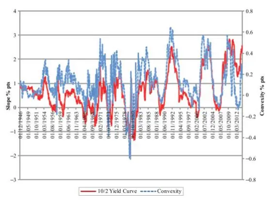
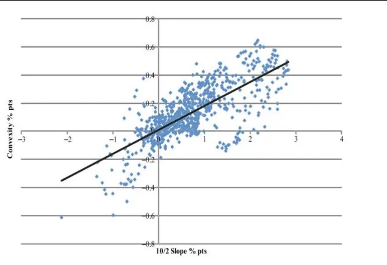
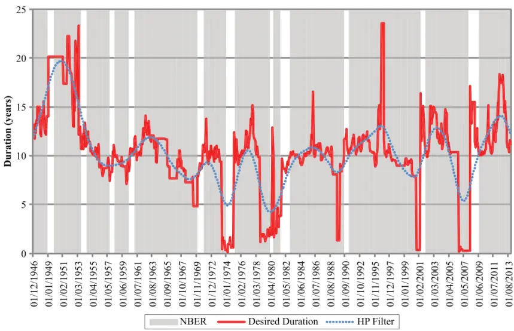
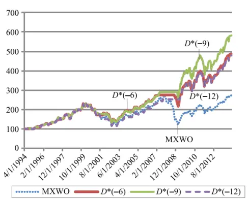
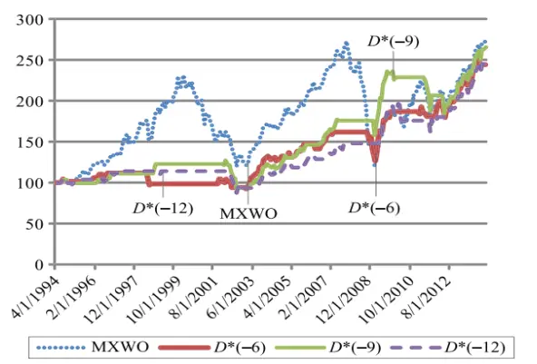
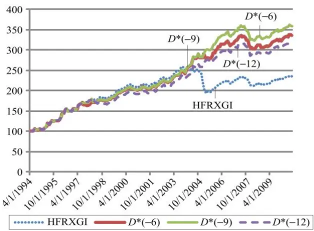

nInfo] [Table_Title] 2021.11.28

# 基于目标投资期限的风险偏好择时策略

## ——学界纵横系列之二十九

陈奥林(分析师)

## 徐忠亚(分析师)

8 021-38674835

021-38032692

chenaolin@gtjas.com

xuzhongya@gtjas.com

证书编号 S0880516100001

S0880519090002

## 本报告导读：

从利率期限结构中获取市场参与者的目标投资期限，进而刻画风险偏好并对不同资产进行择时与轮动，可以取得较好的效果。

[Table_Summary]• 债券投资中的“免疫”策略可以一定程度上规避利率变动的风险。简单来说，“免疫”策略就是将投资组合的久期调整到目标水平。

假设债券投资者均根据自身的风险偏好制定了目标投资期限，并使用免疫策略构建久期与之相等的组合。那么，我们可以使用组合的久期来代表该投资者的风险偏好。

如果投资者的风险偏好较高，则其组合久期较高；如果风险偏好较低，则其组合久期较低。投资者间不同的风险偏好导致不同的组合久期，形成了市场上的 “一致”久期。本文将其定义为市场的目标投资期限。

收益率曲线的形状隐含了市场的目标投资期限的信息。信息来源于收益率曲线的斜率与曲率。正常情况下，他们的变动往往正相关，即收益率曲线越陡峭，就会越凸向纵轴。收益率曲线变陡或曲率减小，说明目标投资期限变长，意味着风险偏好提升；收益率曲线变平，即斜率和曲率之比的下降，说明目标投资期限减小，风险偏好降低。

通过简单的二次函数拟合即期收益率曲线，估计出其中枢点作为市场目标投资期限的估计。目标投资期限处于高位意味着风险偏好较高，此时收益率曲线是陡峭的，但不如平常那么弯曲。

美国历史上的目标投资期限变动对风险资产的表现以及经济周期具备一定的预测能力。目标投资期限在 1971,1977,1986,1995,2003 和2013 年达到峰值，在 1974,1980,1989,2000 和 2007 来到谷底。低点往往与货币政策紧缩同时出现，峰值则往往与货币政策宽松同时出现。另外，低点往往在经济衰退之前出现。

使用目标投资期限对股指、CTA以及对冲基金择时，可以降低波动和获得一定的超额收益。当目标投资期限低于样本均值减一个标准差时，持有现金，其余时间持有 MXWO 指数，可获得 3.37%的超额收益，降低 波动率。当目标投资期限低于平均值减一个标准差时，切换到巴克莱 CTA指数，否则投资 HFRX 全球指数，也可获得比单独投资 CTA指数或对冲基金指数更优的收益率和波动率。

金融工程

## 金融工程团队：

陈奥林：（分析师）

电话：021-38674835

邮箱：chenaolin@gtjas.com

证书编号：S0880516100001

杨能：（分析师）

电话：021-38032685

邮箱：yangneng@gtjas.com

证书编号：S0880519080008

## 殷钦怡：（分析师）

电话：021-38675855

邮箱：yinqinyi@gtjas.com

证书编号：S0880519080013

## 徐忠亚：（分析师）

电话：021- 38032692

邮箱：xuzhongya@gtjas.com

证书编号：S0880120110019

## 刘昺轶：（分析师）

电话：021-38677309

邮箱：liubingyi@gtjas.com

证书编号：S0880520050001

## 赵展成：（研究助理）

电话：021-38676911

邮箱：Zhaozhancheng@gtjas.com

证书编号：S0880120110019

## 张烨垲：（研究助理）

电话：021-38038427

邮箱：zhangyekai@gtjas.com

证书编号：S0880121070118

## 徐浩天：（研究助理）

电话：021-38038430

邮箱：xuhaotian@gtjas.com

证书编号：S0880121070119

## [Table_Re相关报告

集成了机器学习的投资组合再平衡框架 2021.11.27

“基本面信号宇宙”与横截面股票收益2021.11.26

基于多元分析的 CNN-LSTM模型 2021.11.25

## 1. 引言

实际投资中，基金经理们可能根据对市场参与者的风险偏好判断调整自己的持仓。风险偏好较高时，具有高收益、高波动风格的资产可能较为强势；风险偏好较低时，安全属性较强的资产则可能占据上风。如何量化风险偏好并利用其指导后续的投资，是实际投资中的一大问题。

Howell 和 Krishnan 的《Style Selection and U.S. Investors’ Risk Appetite》将风险偏好与目标投资期限联系起来，认为当市场风险偏好较低时，人们的目标投资期限往往较短。目标投资期限与商业周期、风险容忍度、人口结构和税收结构等均存在关系。之后，对债券市场的利率期限结构进行建模以推导出投资者的目标投资期限，进而反映风险偏好。根据风险偏好对股票指数、CTA指数以及对冲基金指数进行择时和轮动，可以取得较好的效果。

本文的正文包括如下部分：第一，介绍久期和投资期限栖息地的定义；第二，介绍收益率曲线的形状变化，以及斜率和曲率两要素之间的关系；第三，介绍本文使用的数据和目标投资期限计算的方法；最后，展示使用目标投资期限对不同资产进行择时的效果。

图 1：通过目标投资期限，从利率期限结构中提取风险偏好的信息
数据来源：《Style Selection and U.S. Investors’ Risk Appetite》, 国泰君安证券研究

## 2. 以久期度量目标投资期限

## 2.1. 久期的定义

我们知道，久期的本质是时间的折现现金流加权平均值。对于期限过长的债券，看其票面偿还期已无太大意义，而久期可度量该债券回收全部本金和利息的平均时间。例如，一张利率为 3.5%、到期日收益率为 6%、票面偿还期长达 100 年的债券，其久期只有 16.8 年。

因此，我们可以将久期视为“有效的期限”。两个极端的例子是零息债券和现金：对于零息债券，其久期等于票面偿还期；对现金来说，其久期为 0. 对于股票来说，其久期的计算公式还未形成共识。股票的情况与债券几乎完全相反，因为它们是没有日期的证券，到期日理论上趋于无穷。此外，它们未来的现金流是不确定的。

债券投资者往往根据久期构建免疫策略。例如，某投资者想在三年后取得 1000 万元，并想尽可能地避免利率波动的影响，免疫策略则是建立久期刚好为三年、现值为 1000 万的投资组合。组合的久期等于投资期限，使投资者可以一定程度上规避利率风险。

假设债券投资者均根据风险偏好制定了目标久期，并使用免疫策略构建久期相同的组合。那么，我们可以使用组合的久期来近似该投资者的风险偏好。

## 2.2. 投资期限栖息地

Cochrane[2011]指出，传统研究往往忽视了投资期限的长度。根据收益率曲线的预期假说中的无套利假设，所有资产的持有期收益应该总是相等的，所以，投资期限以及基于风险偏好的目标投资期限（栖息地）并不重要。然而，在不断发展的“套利限制”文献中，投资者的投资期限和规模变得重要。当经济主体面对不同的负债时间表时，他们应该选择特定的资产结构以降低风险。此外，他们可能会在不同的时间偏好收益率曲线的不同区域，这也是 Modigliani 和 Sutch (1966)提出的栖息地偏好假说的基础。他们认为，投资者希望规避风险。除非其他期限(更长或更短)提供的预期溢价足以补偿他们搬离栖息地的风险和成本，否则它们应留在偏好的期限栖息地进行对冲。

假设投资者们心中都有一个目标投资期限（久期），并且调整投资组合使久期与之相等。如果一个投资者的风险偏好较强，则其组合久期较高；如果风险偏好较弱，则其组合久期较低。投资者间不同的风险偏好导致不同的组合久期，形成了市场上的 “一致”久期。我们将其定义为一个特定的风险中性点，称之为栖息地，即市场的目标投资期限。这个风险中性点与当期的负债结构、投资者的风险偏好有关。

图 2：投资者通过调整组合久期将风险偏好反映到市场
数据来源：《Style Selection and U.S. Investors’ Risk Appetite》, 国泰君安证券研究

## 3. 收益率曲线的形状：斜率与弯曲程度

金融中最基本的关系是时间和金钱之间的关系，这通常通过收益率曲线来描述，收益率曲线显示了隐含的资本回报率如何随投资时间的变化而变化。

在固定收益市场，我们通常观察某类债券的到期收益率与剩余期限之间的关系。特别地，如果观察的是零息债券，其久期与剩余期限一致，到期收益率曲线即为即期收益率曲线。自 1946 年以来，美国国债收益率曲线在 82%的时间里一直向上倾斜，中期年份附近有一个适度的驼峰。

文献表明，收益率曲线的形状会受到商业周期的影响，即收益率曲线的形状随时间而变化。从收益率曲线的两要素——斜率和曲率，对其形状进行观察，Estrella 和 Hardouvelis(1991) 研究了斜率变化的影响，而Moench（2012）研究了曲率变化的影响。本文的起点是观察到美国国债收益率曲线的斜率和曲率在时序上密切相关：陡峭的曲线往往更倾向于向收益率轴凸出，而在平坦的曲线中，这个驼峰消失了。

用 年期国债利率和 年期国债利率之差来衡量收益率曲线的斜率，用 年期国债的实际利率减去 年期与 年期利率的久期加权平均值来衡量收益率曲线的曲率。从图中可以发现，自 1946 年以来，收益率曲线在 81.7%的时间里斜率为正，同时出现曲线凸向收益率轴（纵轴）的时间为 72.3%，同时出现驼峰的时间为 9.4%. 在 18.3%的时间里斜率为负，同时出现倒驼峰的时间为 12.3%. 1990 年以来，斜率与曲率的相关系数为 0.736，两者的月度变化的相关系数为 0.508. 由此可见，收益率曲线的斜率与曲率往往正相关。

图 3：收益率曲线斜率为正时大多凸向纵轴

数据来源：《Style Selection and U.S. Investors’ Risk Appetite》, 国泰君安证券研究

图 4：收益率曲线的斜率往往与曲率正相关

## 4. 从利率期限结构中获取目标投资期限

## 4.1. 数据：即期收益率曲线

我们的最终目的是要估计隐含目标久期。利用零息债券的剩余期限与久期相等这一点，我们采用零息债券的到期收益率数据，也就是即期利率曲线。具体来说，选取 1 年、2 年、3 年、5 年、7 年、10 年和 20 年的美国国债月度即期收益率数据，其中月度数据是使用日度数据的平均值计算而来。数据均来自美联储，其中即期收益率数据可能并不是直接根据零息债券的市场价格计算而来，而是由交易活跃的有息债券的数据通过数学模型的方法估计得到。

## 4.2. 目标投资期限的计算

我们用一个简单的多项式函数来拟合收益率曲线，其中枢点则为目标投资期限的估计。

$$
\ln\left(S_{m,t}\right)=a_{t}\frac{\left(D_{m,t}-D_{t}^{*}\right)^{2}}{{D_{t}^{*}}^{2}}+b_{t}\frac{\left(D_{m,t}-D_{t}^{*}\right)}{D_{t}^{*}}+c_{t}
$$

$s_{m,t}$ 为在时点 t，剩余期限为 m 的即期利率， $D_{m,t}$ 为久期（由于为即期利率，有 $D_{m,t}=m\ )$ ）， $D_{t}^{*}$ 为目标投资期限。对收益率取对数可以使拟合后所得估计利率恒为正。右式的第一项通过久期与 $D_{t}^{*}$ 的平方误差比率来度量收益率曲线的曲率， $D_{t}^{*}$ 与二次函数的最大曲率点有关。 $a_{t}$ 为负意味着收益率曲线凸向纵轴；反之则凸向另一侧。第二项决定了斜率，同样以久期偏离 $D_{t}^{*}$ 的比例来度量。 $b_{t}$ 为正意味着收益率曲线的斜率朝上。

上述参数 $\mathbf{\Psi}_{a_{t},b_{t}}$ 和 $\boldsymbol{{\mathbf{\mathit{D}}}}_{t}^{*}$ 可以通过最小二乘法或网格搜索等方法进行估计。Howell(2014)的研究表明， $D_{t}^{*}$ 与收益率曲线的斜率与曲率之比密切相关，且能反映基础负债的隐含期限，并度量投资者试图使其资产免疫的综合目标期限水平。这意味着曲率和斜率之间的一致变化会导致一个稳定的目标持续时间。当斜率或曲率以不同的方式变化时，目标持续时间会发生变化。

为了保持经济上的合理性，我们在计算中设置了边界条件，以确保目标持续时间不会为负。

按表 1 所示对收益率曲线进行分类。当收益率曲线由平坦变得陡峭时，投资者开始暗中提高他们的目标期限，这可能意味着风险偏好的提升，进而对风险资产有利。通常来说，收益率曲线越陡峭，曲线越凸向纵轴。因此，陡峭而线性的收益率曲线意味着投资者可能会进一步延长其投资期限，从而推高股票等长期资产的价格。

表 1：收益率曲线的斜率与曲率对目标投资期限（风险偏好）的影响

| Slope | Curvature | Target Duration and Risk Appetite of Investors |
| --- | --- | --- |
| Large and positive | Small and negative | High |
| Positive | Negative | Medium (typical yield curve) |
| Small | Small | Low |
| Inverted | Positive | Medium |
| Positive | Positive | Not classified (rare) |
| Inverted | Negative | Not classified (rare) |

数据来源：《Style Selection and U.S. Investors’ Risk Appetite》, 国泰君安证券研究

目标投资期限处于高位意味着，收益率曲线是陡峭的，但不如通常预期的那么弯曲。由于凸性偏差对收益率的影响随着期限的增加而增加，没有正常地凸向纵轴表明投资者认为未来利率并不会下降。这可能是利率正在向较高的水平恢复，比如在经济衰退之后。在这种情况下，工业投资也可能产生 $\frac{3}{\frac{3}{10}}$ 回报，与债券发生竞争从而推高债券的风险溢价，增加收益率曲线的陡度。

总而言之，收益率曲线变陡或曲率减小会使目标投资期限变长，这意味着风险偏好更大。同样的，在经济放缓之前收益率曲线可能变平，意味着斜率和曲率之比下降，目标投资期限减小，风险偏好降低。

因此，当国债期限结构异常陡峭或异常线性时，股票等风险资产的表现应该会更好。相比之下，当一条正常的收益率曲线变平时，说明投资者正在缩短他们的目标投资期限，转向安全资产，比如现金。

表 描述了美国历史上目标投资期限的变动，并进行了 滤波处理。1946 年至 2013 年，全样本的均值为 10.36 年，标准差为 3.16 年。由图可见，目标投资期限在 1971,1977,1986,1995,2003 和 2013 年达到峰值，在 1974,1980,1989,2000 和 2007 来到谷底。根据 CBC 美国流动性指数，低谷期往往与货币政策紧缩同时出现，峰值则往往与货币政策宽松同时出现。另外，低点往往在美国国家经济研究局（NBER）定义的经济衰退之前出现。最后，目标投资期限的时间序列也与 Miles(1993)中的英国“短期主义”变化数据一致。

图 5：目标投资期限的低点往往在经济衰退之前出现

数据来源：《Style Selection and U.S. Investors’ Risk Appetite》, 国泰君安证券研究。注：阴影部分为 NBER 定义的经济扩张期，白色部分则为衰退期

因此，通过度量美国国债期限结构的微妙变化，目标投资期限的变化符合陡峭的收益率曲线通常与风险资产牛市密切相关的观点。此外，我们通过简单的回归分析检验了目标投资期限与未来投资绩效是否显著相关，以及是否存在因果关系。简单来说，利用 1990 年至 2014 年期间的目标投资期限数据，试图预测美国股票(USTRIB)相对于美国国债(USTRIB)的表现。结果是，目标投资期限的系数在 1%的水平下显著为正。交叉相关分析发现 11 个月为最佳滞后期。根据估计的参数，目标投资期限每增加一年，美国股票相对于美国国债的回报率每年增加 3.28%。此外，目标投资期限与相对回报存在单向的格兰杰因果关系。

## 5. 使用目标投资期限进行择时

## 5.1. 对股票指数进行择时

本节尝试利用目标投资期限对不同资产进行择时，认为目标期限的变化意味着风险偏好的变化，进而影响投资者对风险资产和安全资产的配置。比如，当目标投资期限超过历史均值加一个标准差时，投资者可能会转向风险更高的投资，如股票；而远离安全的资产，如国债。反之亦然。

图 6 显示了策略对摩根士丹利世界指数(MXWO)的择时表现，只要目标投资期限低于样本均值一个标准差，就从多头转为现金。我们没有校准任何模型参数，并作出了现金回报为零的保守假设。使用滞后 6 个月、9 个月和 12 个月的目标投资期限对结果影响不大，以说明准确选择滞后并不是关键，结果具有稳健性。

使用目标投资期限进行择时可显著提高投资回报，且波动较低。择时策略的平均年化收益率为 8.53%，波动率为 13.31%；而 MXWO 指数的年化收益率为 5.16%，波动率为 15.28%。在图 7 中我们修改策略，只要目标投资期限低于平均值就持有现金，虽然年化收益降至 4.74%，但波动率下降到 8.53%，仅为 MSCI 指数波动率的 55%.

图 6：使用目标投资期限对股指择时可提高收益

图 7：使用目标投资期限对股指择时可降低波动

数据来源：《Style Selection and U.S. Investors’ Risk Appetite》, 国泰君安证券研究

## 5.2. CTA与对冲基金间的轮动

类似地，我们将目标投资期限择时用于投资对冲基金和 CTA 间的切换。集中型的投资策略，比如对冲基金，往往投资于风险较高的资产，因此理论上在风险偏好较高时强势；发散型的投资策略，比如期货市场的趋势跟踪策略，则往往在风险偏好较低时强势。许多对冲基金将自己归为市场中性投资者，但从历史表现来看，尤其是 2007 年至 2008 年全球金融危机期间的表现来看，对冲基金往往在强劲上涨的市场中表现更好。相反，cta 往往在危机时期表现更好。Chung 等(2004)描述了相关的理论细节。

我们的策略是，当目标投资期限低于平均值减一个标准差时，切换到巴克莱 CTA 指数，否则投资 HFRX 全球指数。结果是，轮动策略的收益是 7.71%，HFRX 全球指数和巴克莱 CTA指数的年化收益分别是 5.35%和 3.90%；轮动策略的波动率是 5.79%，HFRX 全球指数和巴克莱 CTA指数的波动率分别是 6.39%和 6.79%. 轮动策略的收益与波动率均优于两个基准指数。

图 8：目标投资期限对CTA、对冲基金轮动可提高收益、降低波动

数据来源：《Style Selection and U.S. Investors’ Risk Appetite》, 国泰君安证券研究

## 6. 原文文献结论

风格投资提供了一种根据当前市场环境在不同策略之间切换的方式。一种简单的方法是，随着风险厌恶程度的增加，从集中型策略转变为发散型策略。集中型策略包括股票、信贷和广泛的对冲基金指数，而发散型策略通常包括现金、长期波动率和趋势跟踪的 CTA策略。

在本文中，我们从美国的国债期限结构中提取信息，开发出一个新的风险偏好指标。具体来说，我们试图从收益率曲线的形状，即斜率和曲率，揭示可能反映投资者风险偏好的隐含的目标投资期限。

结果表明，目标投资期限的估计值具备一定的预测能力。当目标投资期限高于一定值时，使用集中型的投资策略，投资高风险资产;当目标投资期限低于一定值时，转向发散型的投资策略，投资低风险资产，可以降低波动并提高收益。

## 7. 我们的思考

市场的风险偏好对投资策略的效果会产生较大的影响。但风险偏好存在于市场参与者的内心，从客观世界的数据对其刻画存在一定的难度。本文试图从利率期限结构中提取市场的风险偏好信息，本质上是收益率曲线反映了人们对未来的预期。通过“免疫”策略的假设，将市场上的组合久期与内心的目标投资期限联系起来，最终通过目标投资期限刻画风险偏好的变化。

本文从利率期限结构中提取风险偏好的信息，提供了一个较为新颖的视角。内心世界会在客观世界有所反映，如何从不同的角度更好地刻画市场参与者的内心世界，是我们今后研究的重要方向。

## 本公司具有中国证监会核准的证券投资咨询业务资格

## 分析师声明

作者具有中国证券业协会授予的证券投资咨询执业资格或相当的专业胜任能力，保证报告所采用的数据均来自合规渠道，分析逻辑基于作者的职业理解，本报告清晰准确地反映了作者的研究观点，力求独立、客观和公正，结论不受任何第三方的授意或影响，特此声明。

## 免责声明

本报告仅供国泰君安证券股份有限公司（以下简称“本公司”）的客户使用。本公司不会因接收人收到本报告而视其为本公司的当然客户。本报告仅在相关法律许可的情况下发放，并仅为提供信息而发放，概不构成任何广告。

本报告的信息来源于已公开的资料，本公司对该等信息的准确性、完整性或可靠性不作任何保证。本报告所载的资料、意见及推测仅反映本公司于发布本报告当日的判断，本报告所指的证券或投资标的的价格、价值及投资收入可升可跌。过往表现不应作为日后的表现依据。在不同时期，本公司可发出与本报告所载资料、意见及推测不一致的报告。本公司不保证本报告所含信息保持在最新状态。同时，本公司对本报告所含信息可在不发出通知的情形下做出修改，投资者应当自行关注相应的更新或修改。

本报告中所指的投资及服务可能不适合个别客户，不构成客户私人咨询建议。在任何情况下，本报告中的信息或所表述的意见均不构成对任何人的投资建议。在任何情况下，本公司、本公司员工或者关联机构不承诺投资者一定获利，不与投资者分享投资收益，也不对任何人因使用本报告中的任何内容所引致的任何损失负任何责任。投资者务必注意，其据此做出的任何投资决策与本公司、本公司员工或者关联机构无关。

本公司利用信息隔离墙控制内部一个或多个领域、部门或关联机构之间的信息流动。因此，投资者应注意，在法律许可的情况下，本公司及其所属关联机构可能会持有报告中提到的公司所发行的证券或期权并进行证券或期权交易，也可能为这些公司提供或者争取提供投资银行、财务顾问或者金融产品等相关服务。在法律许可的情况下，本公司的员工可能担任本报告所提到的公司的董事。

市场有风险，投资需谨慎。投资者不应将本报告作为作出投资决策的唯一参考因素，亦不应认为本报告可以取代自己的判断。
在决定投资前，如有需要，投资者务必向专业人士咨询并谨慎决策。

本报告版权仅为本公司所有，未经书面许可，任何机构和个人不得以任何形式翻版、复制、发表或引用。如征得本公司同意进行引用、刊发的，需在允许的范围内使用，并注明出处为“国泰君安证券研究”，且不得对本报告进行任何有悖原意的引用、删节和修改。

若本公司以外的其他机构（以下简称“该机构”）发送本报告，则由该机构独自为此发送行为负责。通过此途径获得本报告的投资者应自行联系该机构以要求获悉更详细信息或进而交易本报告中提及的证券。本报告不构成本公司向该机构之客户提供的投资建议，本公司、本公司员工或者关联机构亦不为该机构之客户因使用本报告或报告所载内容引起的任何损失承担任何责任。

## 评级说明

## 1.投资建议的比较标准

投资评级分为股票评级和行业评级。以报告发布后的 12 个月内的市场表现为比较标准，报告发布日后的 12 个月内的公司股价（或行业指数）的涨跌幅相对同期的沪深 300 指数涨跌幅为基准。

## 2.投资建议的评级标准

报告发布日后的 12 个月内的公司股价（或行业指数）的涨跌幅相对同期的沪深300 指数的涨跌幅。

| 评级 |  | 说明 |
| --- | --- | --- |
| 股票投资评级 | 增持 | 相对沪深 300 指数涨幅 15%以上 |
|  | 谨慎增持 | 相对沪深300指数涨幅介于5%～15%之间 |
|  | 中性 | 相对沪深300指数涨幅介于-5%～5% |
|  | 减持 | 相对沪深300 指数下跌5%以上 |
| 行业投资评级 | 增持 | 明显强于沪深 300 指数 |
|  | 中性 | 基本与沪深 300 指数持平 |
|  | 减持 | 明显弱于沪深300指数 |

## 国泰君安证券研究所

|  | 上海 | 深圳 | 北京 |
| --- | --- | --- | --- |
| 地址 | 上海市静安区新闸路669 号博华广 场20层 | 深圳市福田区益田路6009号新世界 商务中心34层 | 北京市西城区金融大街甲9号金融 街中心南楼18层 |
| 邮编 | 200041 | 518026 | 100032 |
| 电话 | （021）38676666 | （0755）23976888 | (010)83939888 |
|  | E-mail: gtjaresearch@gtjas.com |  |  |