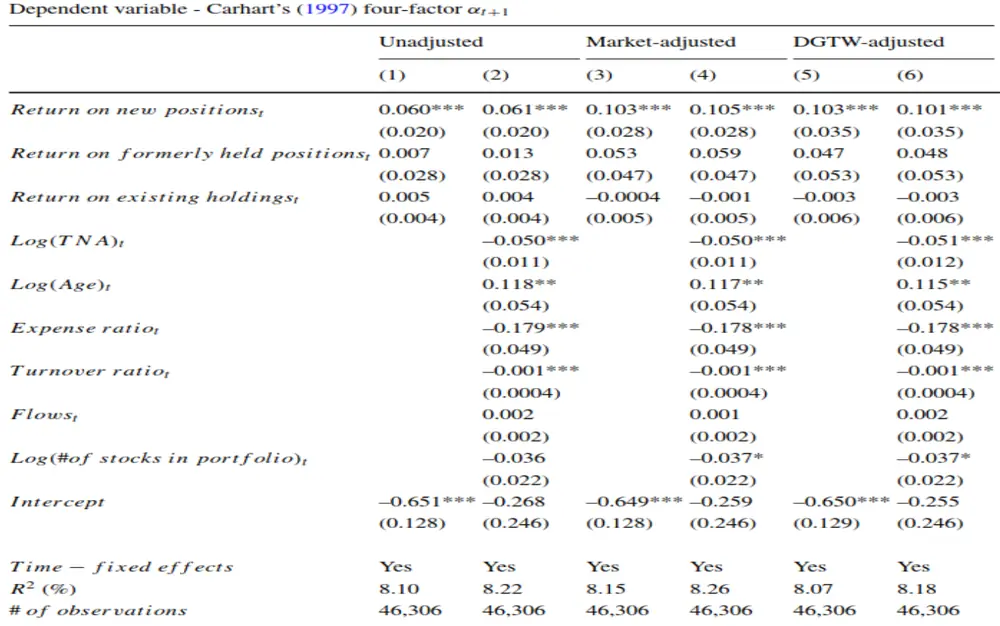
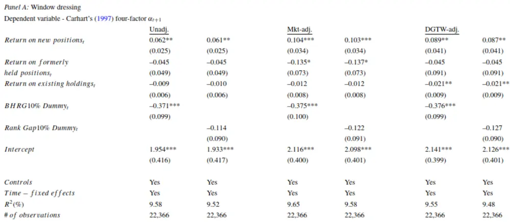
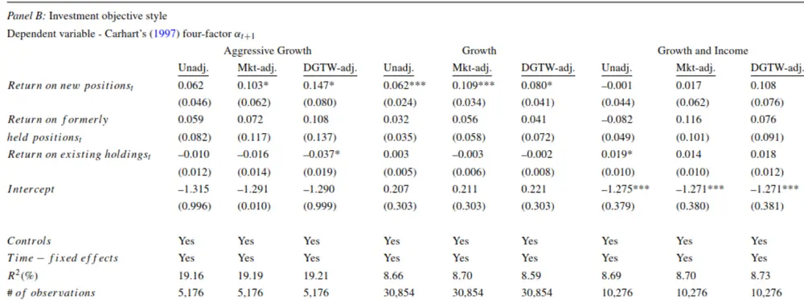
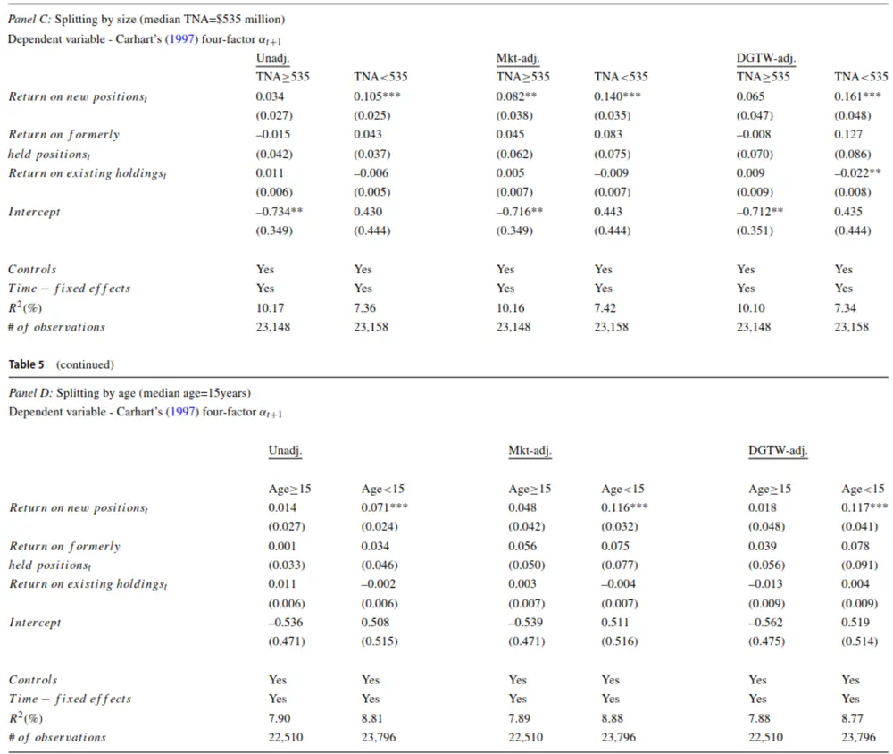
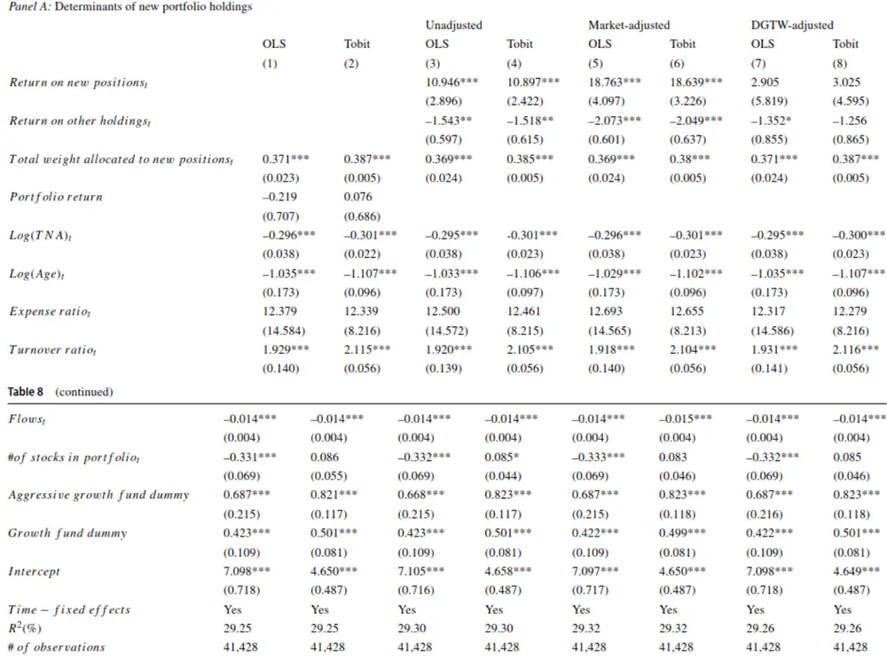

nInfo] [Table_Title] 2021.12.01

# 基于持仓变动与业绩表现的主动管理能力评价

# ——学界纵横系列之三十

陈奥林(分析师)

8 021-38674835

chenaolin@gtjas.com

证书编号 S0880516100001

## 本报告导读：

本文将持仓股票划分为新进股票、曾经持有股票、现有持仓股票三种类型，从持仓变动与业绩表现的角度聚焦新进股票以反映基金的主动管理能力。

## 摘要：

le_Summary]主动管理能力评价是基金优选和组合构建的一个重要环节。基于持仓变动与业绩表现的主动管理能力评价，有助于投资者筛选主动管理基金，实现资产优化配置。

基金持仓股票类型的分类。基于基金历史持仓信息，将当期持仓股票划分为新进股票、曾经持有股票、现有持仓股票三种类型。新进股票为从未持有的股票，曾经持有股票为曾经持有，卖出后重新买入的股票，现有持仓股票为已持仓股票

不同类型持仓股票对基金未来业绩的贡献。回归分析显示，新进股票收益与基金未来业绩表现具有显著的正相关关系，而曾经持有股票收益、现有持仓股票收益没有表现出这一联系。这一结果在控制其他主动管理能力指标、基金窗口粉饰行为下依然成立。

基金特征子样本下不同类型持仓股票对业绩贡献的再检验。在基金投资风格、规模、成立年限的分组子样本下，新进股票收益、曾经持有股票收益、现有持仓股票收益与基金未来业绩的上述联系在小规模基金、年轻基金、激进成长基金、成长型基金中比较明显。

新进股票持仓权重的影响因素。 和 模型分析表明，新进股票收益对下一期新进股票总权重具有显著的正向影响。此外，小规模基金、年轻基金、激进成长型基金、成长型基金在新进股票总权重方面配置比例更高。

金融工程

## 金融工程团队：

陈奥林：（分析师）

电话：021-38674835

邮箱：chenaolin@gtjas.com

证书编号：S0880516100001

杨能：（分析师）

电话：021-38032685

邮箱：yangneng@gtjas.com

证书编号：S0880519080008

## 殷钦怡：（分析师）

电话：021-38675855

邮箱：yinqinyi@gtjas.com

证书编号：S0880519080013

## 徐忠亚：（分析师）

电话：021- 38032692

邮箱：xuzhongya@gtjas.com

证书编号：S0880519090002

## 刘昺轶：（分析师）

电话：021-38677309

邮箱：liubingyi@gtjas.com

证书编号：S0880520050001

## 赵展成：（研究助理）

电话：021-38676911

邮箱：Zhaozhancheng@gtjas.com

证书编号：S0880120110019

## 张烨垲：（研究助理）

电话：021-38038427

邮箱：zhangyekai@gtjas.com

证书编号：S0880121070118

## 徐浩天：（研究助理）

电话：021-38038430

邮箱：xuhaotian@gtjas.com

证书编号：S0880121070119

## [Table_Re相关报告

基于目标投资期限的风险偏好择时策略2021.11.28

集成了机器学习的投资组合再平衡框架 2021.11.27

“基本面信号宇宙”与横截面股票收益2021.11.26

基于多元分析的 CNN-LSTM模型 2021.11.25

## 1. 引言

大量研究表明，主动管理有助于提高基金的业绩表现。因此，基金主动管理能力评价是基金优选和组合构建的一个重要环节。以往研究基于基金持仓数据，构建基金持仓与基准指数成分的偏离度、基金持仓行业集中度等指标来反映基金的主动管理能力。相比于基金持仓与基准指数的横向对比，基金持仓在时间维度的纵向变动可能包含了更多的主动管理信息，即基金买入、卖出交易的业绩表现可能更好地反映出基金的主动管理能力。

Lantushenko 和 Nelling 在 2020 年 12 月发表了《New Positions in MutualFund Portfolios: Implications for Fund Alpha》一文，认为评估基金经理可能付出更多时间和精力的投资组合头寸可以提供有关主动管理能力的信息。根据基金历史持仓特征，本文将报告期持有的股票划分为新进股票、曾经持有股票、现有持仓股票（非前两类）三种类型。上述股票类型中，本文聚焦于基金持仓中新进股票，认为相比于其他现有头寸，基金经理决定纳入新股票需要付出更多的时间和精力去全面评估新股票的质量，如综合分析公司所属行业环境、竞争对手、供应商、消费者、内部治理结构等。花费更多的时间和精力来研究新股票可能会导致有关新股票的信息质量更高。如果更多的时间和精力分配到新股票可以带来更加准确的信息，那么这些新股票应该比其他现有头寸对基金 Alpha 产生更大的影响。因此，与其他现有头寸的投资组合变化相比，新股票的引入可能代表基金经理更坚定的信念，而新股票的表现可以提供主动管理能力的信号。

研究结果显示：（1）新进股票收益与基金未来风险调整收益具有显著的正相关关系，而曾经持有股票收益、现有持仓股票收益没有表现出这一联系。在控制其他主动管理能力指标的情况下，新进股票、曾经持有股票、现有持仓股票的收益与基金未来业绩的关系依然成立。（2）在控制了基金窗口粉饰行为的情况下，新进股票、曾经持有股票、现有持仓股票的收益与基金未来业绩的关系依然成立。在基金的投资风格、规模、成立年限的分组子样本下，新进股票、曾经持有股票、现有持仓股票收益与基金未来业绩的前述关系在小规模基金、年轻基金、激进成长基金、成长型基金中比较明显。（3）新进股票收益对新进股票权重具有正向影响，而新进股票权重在小规模基金、年轻基金、激进成长基金、成长基金中更高。

## 2. 基金持仓股票分类与研究方法

## 2.1. 基金持仓股票分类

基于基金历史持仓信息，本文将当期持仓股票划分为新进股票、曾经持有股票、现有持仓股票三种类型，并探讨新进股票、曾经持有股票、现有持仓股票的收益对基金未来超额收益的贡献。具体定义如下：新进股票：自成立以来基金从未持有过的股票。

曾经持有股票：基金曾经持有，卖出后重新加入组合持仓的股票。

现有持仓股票：除新进股票和曾经持有股票以外的股票，即基金已持有的股票。

## 2.2. 股票业绩度量

为了评估新进股票、曾经持有股票、现有持仓股票的业绩表现，本文在季度 识别基金持仓中新进股票、曾经持有股票以及现有持仓股票，然后评估上述三种持仓股票在季度 的业绩表现。业绩表现指标方面，本文采用三种方法来刻画：原始股票收益率、经市场调整的股票收益率、DGTM 调整的股票收益率（Daniel et al., 1997）。以新进股票为例，上述三种股票收益率计算过程如下：

原始股票收益率：

$$
Returnonnewpostions_{f,t}^{unadj}=\sum_{j=0}^{j}w_{j,f,t-1}R_{j,t}\tag{1}
$$

式中，J 表示在 $t-1$ 季度基金f 持有新进股票的数量， $\boldsymbol{w}_{\textit{ j , f , t - 1 }}$ 表示 $t-1$ 季度基金f 持仓中新进股票 j 的权重，而 $R_{\mathbf{\Phi}_{j,t}}$ 表示新进股票j 在季度 $.t-1$ 至期间的收益。

经市场调整的股票收益率：

$$
Returnonnewpostions_{_{f,t}}^{^{mit}}=\sum_{_{\textit{ j = 0 }}}^{^{\textit{ j }}}w_{_{_{j,f,t-1}}}\left(R_{_{j,t}}-R_{_{t}}^{^{\textit{ m b t }}}\right)\tag{2}
$$

式中， ${R_{t}}^{mkt}$ 表示季度 至t 期间市场收益率，由月度收益率复利计算得到。

DGTW 调整的股票收益率：

$$
Return\textit{ o n }new\textit{ p o s t i o n s }_{f,t}^{oaTw}=\sum_{j=0}^{J}w_{j,f,t-1}\left(R_{j,t}-R_{t}^{\textit{ o G T w }}\right)\tag{3}
$$

式中， $\boldsymbol{R}_{t}^{\ DGTW}$ 表示新进股票f 对应 DGTW 基准组合的市场收益率，即从规模、账面市值比、动量三个维度将市场中股票划分为 125（5 5 5）个基准组合，将基准组合市值加权的收益率作为组合中股票的基准收益率（Daniel et al., 1997）。

## 2.3. 不同类型股票业绩对基金未来业绩的贡献

本文将基金t •1季度的 Carhart 四因子模型 Alpha（由过去 36 个月数据计算得到）对t 季度新进股票、曾经持有股票、现有持仓股票的收益率进行回归分析，考察三种类型股票收益对基金业绩未来超额收益的贡献。模型如下：

$$
\begin{array}{rl}&{\alpha{\textit{ \textbf { \textit { \textbf { \phi } } } }}_{f,t+1}=\beta{0}+\beta{1}\Big(Return\textit{ o n }\ new\ positions{\textit{ \textbf { f } }}_{t}\Big)}\\&{\qquad\quad+\beta{2}\Big(Return\textit{ o n }\ formerly\ held\ holdings{\textit{ \textbf { f } }}_{t}\Big)}\\&{\qquad\quad+\beta{3}\Big(Return\textit{ o n }\ existing{\textbf{ h o l d i n g s }}_{f,t}\Big)+\psi\ Controls{\textit{ \textbf { f } }}_{f,t}+\varepsilon{\textit{ \textbf { f } }}_{t},}\end{array}\tag{4}
$$

式中， $\beta_{_1}\setminus\{\beta_{_2}\setminus\beta_{_3}\}$ 分别表示新进股票收益、曾经持仓股票收益、现有持仓股票收益的回归系数。此外，在上述回归模型的基础上，本文还控制其他主动管理能力（主动份额 Active Share、行业集中指数 IndustryConcentration Index、基金 $\boldsymbol{R}^{\mathrm{~2~}}$ 、收益差 Return Gap）指标，进一步研究了上述三种类型股票收益对基金未来业绩的影响。

## 2.4. 新进股票持仓权重的影响因素分析

在以下模型设定基础上，本文进一步利用 OLS 与 Tobit 模型检验了不同类型股票收益对新进股票权重分配的影响，即：

$$
\begin{array}{rl}{Total\ weight\ of\ new\ stocks_{f,t+1}=\beta_{0}+\beta_{1}\Big(Total\ weight\ of\ new\ stocks_{f,t}\Big)}&{}\\&{\quad\quad\quad\quad\quad\quad\quad\quad\quad\quad\quad\quad\quad\quad\quad\quad\quad\quad\quad}\\&{\quad\quad\quad\quad\quad\quad\quad\quad\quad\quad\quad\quad\quad+\beta_{2}\Big(\mathop{\bf Re}turn\ on\ new\ positions_{f,t}\Big)}\\&{\quad\quad\quad\quad\quad\quad\quad\quad\quad\quad\quad\quad\quad\quad\quad\quad\quad\quad\quad\quad\quad\quad\quad\quad\quad\quad\quad}\\&{\quad\quad\quad\quad\quad\quad\quad\quad\quad\quad\quad\quad+\beta_{3}\Big(\mathop{\bf Re}\ turn\ on\ other\ holdings_{f,t}\Big)}\\&{\quad\quad\quad\quad\quad\quad\quad\quad\quad\quad\quad\quad\quad\quad\quad\quad\quad\quad\quad\quad\quad\quad\quad\quad\quad\quad\quad\quad\quad\quad}\\&{\quad\quad\quad\quad\quad\quad\quad\quad\quad\quad\quad\quad+\psi\ Controls_{f,t}+\varepsilon_{f,t}}\end{array}\tag{5}
$$

式中，控制变量包括基金规模、成立年限、换手率、资金流动以及基金类型等。

## 3. 基金持仓股票类型与基金业绩表现研究

## 3.1. 不同类型持仓股票对基金业绩的贡献

将三种不同类型股票对基金未来一期超额收益 Carhart四因子模型Alpha回归分析发现，无论是否加入控制变量或采用不同业绩表现度量方式，新进股票收益在所有模型设定下对基金未来一期超额收益具有显著的正向影响。

表 1：不同类型持仓股票对基金业绩的影响

Symbols ***, **, * represent 1%, 5%, and 10% confidence levels, respectively
数据来源：《New Positions in Mutual Fund Portfolios: Implications for Fund Alpha》

此外，现有研究亦常用主动份额（Active Share）、行业集中指数（IndustryConcentration Index）、基金 2R （Fund 2R ）、收益差（Return Gap）等指标衡量基金主动管理能力。为了研究结论的稳健性，本文进一步将上述四个指标引入到回归模型中，对比分析新进股票收益对基金未来超额收益的预测效力。研究结果显示，无论是单个加入上述四个主动管理指标，还是一次性加入全部主动管理指标，新进股票收益对基金未来超额收益依然具有显著的正面影响。

表 2：控制其他主动管理指标下不同类型持仓股票对基金业绩的影响

Table 4 Predicting mutual fund performance with other measures of active management. This table reports the results of regressions relating fund α, the return on new positions, the return on formerly held positions, the return on existing portfolio holdings, and other measures of active management documented in the literature. The dependent variable is a risk-adjusted return from the Carhart's (1997) four-factor model. It is a cumulative return over quarter t + 1. The independent variables are measured as of quarter t. The return on new positions, the return on formerly held positions, and the return on existing holdings are defined by Eqs. 3, 6, and 9, respectively. The measure of active portfolio management, Active Share, is documented in Cremers and Petajisto (2o09) and is borrowed from Petajisto's web-site for the purposes of this study. Industry Concentration Index is calculated following Kacperczyk et al. (2005). Fund R² is obtained from a regression of its returns net of expenses on a four-factor model, as suggested by Amihud and Goyenko (2013). Return Gap proxies for unobserved actions of mutual funds, as in Kacperczyk et al. (2008). The control variables include fund flows, the natural logarithm of age, expense ratio, turnover ratio, the log of net assets under management, and the log of a number of stocks in portfolio. Continuous variables are winsorized at the 1% level. All regressions include quarter fixed effects. Standard errors are clustered at the fund level and provided in parentheses

Dependent variable: Carhart's (1997) four-factor α+1

|  | (1) | (2) | (3) | (4) | (5) | (6) | (7) | (8) | (9) |
| --- | --- | --- | --- | --- | --- | --- | --- | --- | --- |
| Return on new positions, |  | 0.13*** |  | 0.10*** |  | 0.10*** |  | 0.09*** | 0.13** |
|  |  | (0.04) |  | (0.03) |  | (0.03) |  | (0.03) | (0.04) |
| Return on formerly held positions, |  | -0.03 |  | 0.04 |  | 0.05 |  | 0.07 | -0.03 |
|  |  | (0.08) |  | (0.05) |  | (0.05) |  | (0.06) | (0.08) |
| Return on existing holdings |  | -0.007 |  | -0.003 |  | -0.004 |  | -0.005 | -0.007 |
|  |  | (0.008) |  | (0.006) |  | (0.006) |  | (0.006) | (0.008) |
| Active Share | 0.42** | 0.73*** |  |  |  |  |  |  | 0.56*** |
|  | (0.13) | (0.15) |  |  |  |  |  |  | (0.19) |
| Industry Concentration Index |  |  | 0.69*** | 0.78*** |  |  |  |  | -0.54 |
|  |  |  | (0.15) | (0.16) |  |  |  |  | (0.96) |
| Fund R² |  |  |  |  | –1.32***. | -1.50*** |  |  | –1.56** |
|  |  |  |  |  | (0.19) | (0.20) |  |  | (0.71) |
| Return Gap |  |  |  |  |  |  | 19.31** | 18.61** | 13.35 |
|  |  |  |  |  |  |  | (7.64) | (7.58) | (10.72) |

Table 4 (continued)

|  | (1) | (2) | (3) | (4) | (5) | (6) | (7) | (8) | (9) |
| --- | --- | --- | --- | --- | --- | --- | --- | --- | --- |
| Intercept | –1.20*** | –1.43***. | -0.72**–0.44* | 0.47** | 0.77*** | -0.62*** | -0.26 | 0.004 |  |
|  | (0.15) | (0.33) | (0.13) | (0.24) | (0.20) | (0.28) | (0.13) | (0.25) | (0.78) |
| Controls | No | Yes | No | Yes | No | Yes | No | Yes | Yes |
| Time – fixed effects | Yes | Yes | Yes | Yes | Yes | Yes | Yes | Yes | Yes |
| R²(%) | 11.41 | 11.65 | 8.14 | 8.32 | 8.17 | 8.36 | 8.02 | 8.19 | 11.86 |
| # of observations | 22,525 | 22,525 | 45,122 | 45,122 | 46,408 | 46,408 | 44,941 | 44,941 | 21,342 |

Symbols ***, **, * represent 1%, 5%, and 10% confidence levels, respectively
数据来源：《New Positions in Mutual Fund Portfolios: Implications for Fund Alpha》

## 3.2. 稳健性检验

## 3.2.1. 基金窗口粉饰行为

现有研究表明，机构投资者可能存在窗口粉饰（Window Dressing）行为，即在定期公布持仓报告前，机构投资者将过去表现差的股票卖出并买入过去表现好的股票，来粉饰基金的持仓表现。为了研究窗口粉饰行为是否影响新进股票收益与基金未来超额收益之间的联系，本文进一步将窗口粉饰指标（BHRG、Rank Gap）加入到回归模型中。研究结果显示，在控制上述两个窗口粉饰变量下，无论采用何种业绩表现度量方式，新进股票收益对基金未来超额收益的正向联系依然成立。

## 表 3：控制基金窗口粉饰行为下不同类型持仓股票对基金业绩的影响

Table 5 Robustness. This table reports the results for a set of robustness tests. The dependent variable in all regressions in each panel is a risk-adjusted return from the Carhart's (1997) four-factor model. The return on new positions, the return on formerly held positions, and the return on existing holdings are defined by Eqs. 1 through 9. Panel A analyzes the effect of the return on new and other positions on future fund alpha controlling for the window dressing activity of fund managers. The two window dressing proxies, Backward Holding Return Gap and Rank Gap, are constructed as in Agarwal et al. (2014). Panel B reports the results of the main regression outlined in Eq. 10 by mutual fund investment objective styles as indicated in the Thomson Financial database: aggressive growth, growth, and growth and income. Panels C and D show the results from splitting the sample based on fund size and fund age, respectively. We divide the sample in two groups, above and below median, based on total net assets under management (TNA) and fund age. The unadjusted (Unadj.), market-adjusted (Mkt-adj.), and DGTW-adjusted (DGTW-adj.) performance of new and other holdings are measured as in Eqs. 1 through 9. The independent variables are measured as of quarter t. The control variables include fund flows, the natural logarithm of age, expense ratio, turnover ratio, the log of net assets under management, and the log of a number of stocks in portfolio. Continuous variables are winsorized at the 1% level. All regressions include quarter fixed effects. Standard errors are clustered at the fund level and provided in parentheses

数据来源：《New Positions in Mutual Fund Portfolios: Implications for Fund Alpha》

## 3.2.2. 基金投资风格

本文将基金划分为激进成长、成长、成长收益三种类型，在不同基金类型下讨论了新进股票收益与其他持有股票收益对基金未来业绩的影响。分组回归结果显示，新进股票收益与基金未来超额收益在激进成长、成长型基金中较为显著，可能反映出成长收益型基金的超额收益来源有所不同。

表 4：基金投资风格子样本下不同类型持仓股票对基金业绩的影响

数据来源：《New Positions in Mutual Fund Portfolios: Implications for Fund Alpha》

## 3.2.3. 基金规模与基金年限

除了基金投资风格以外，本文进一步从基金规模、基金年限两个维度讨论了不同类型股票收益对基金未来业绩的影响。具体而言，本文以 5.35亿美元为分界点，依据管理规模将基金划分为大规模、小规模基金两种类型，并以 15 年为临界点，根据成立年限将基金划分年长基金、年轻基金两种类型。分组回归结果显示：基金规模维度，新进股票收益与基金未来超额收益在小规模基金中较为显著；基金年限维度，新进股票收益与基金未来超额收益在年轻基金中较为显著。

表 5：基金规模与基金年限子样本下不同类型持仓股票对基金业绩的影响

Symbols ***, **, * represent 1%, 5%, and 10% confidence levels, respectively
数据来源：《New Positions in Mutual Fund Portfolios: Implications for Fund Alpha》

## 3.3. 新进股票持仓权重的影响因素探讨

上述研究证明了新进股票收益对基金未来业绩具有显著的贡献。因此，本文进一步检验了基金新进股票持仓权重的影响因素，认为增加新进股票主要源于可用资源与激励动机。例如，高管理费率的基金能拥有更多资源在组合持仓中加入新股票，或者如果基金经理在加入新股票方面展示出良好的投资能力，这将激励他们主动积极地寻找更多的投资机会。研究结果显示，整体上新进股票收益对下一期新进股票总权重具有显著的正向影响。此外，新进股票总权重具有正向自相关特征，其可能的解释是主动管理基金的基金经理主动搜寻新的投资机会。最后，小规模基金、年轻基金、激进成长型基金、成长型基金在新进股票总权重方面配置比例更高，这一结论与 3.2.2、3.2.3 内容基本一致。

表 6：新进股票持仓权重的影响因素分析
Table 8 Determinants of new portfolio holdings. Panel A reports the quarterly panel regression coefficients of the determinants of new portfolio additions. The dependent variable in models (1) through (8) is the next-quarter total weight allocated to new portfolio holdings (13). The definitions for independent variables are provided in the Appendix. Continuous variables are winsorized at the 1% level. All regressions include quarter fixed effects. Standard errors are clustered at the fund level and provided in parentheses. Panel B reports the Heckman model results. The first stage is based on Eq. 13, and the second stage is modeled based on Eq. 12. Return on new positions, is defined by Eqs. 1 through 3. Return on other holdings, is the portfolio-weighted return on formerly held and existing stocks

数据来源：《New Positions in Mutual Fund Portfolios: Implications for Fund Alpha》

## 4. 我们的思考

在风格切换频繁的行情下，有效评价基金的主动管理能力是基金优选的一个重要环节，挑选出具有良好主动管理能力的基金有利于资产优化配置。对于基金或基金经理的主动管理能力评价，本文提供了如下启示：（1）基于基金持仓变动与业绩表现的主动管理评价。结合基金历史持仓信息，将当前持仓股票划分为新进股票、曾经持有股票、现有持仓股票三种类型，新进股票的业绩表现可以在一定程度上反映基金的主动管理能力。实际上，我们可以将这一思路延展，不局限于新进股票，将基金持仓变动（增仓/减仓）股票的业绩表现用于反映基金的主动管理能力。（2）基金持仓变动与投资风格、规模等特征有关。在基金投资风格、基金规模、基金成立年限的子样本下，新进股票收益对基金未来业绩表现的贡献并不一致。这意味着在评价基金主动管理能力时，我们可能需要考虑基金投资风格、基金规模等特征，分类加以研究。本文提供的研究方法和思路可尝试应用于国内基金或基金经理主动管理能力的评价，筛选出主动管理能力优异的基金或基金经理，优化资产配置。

## 本公司具有中国证监会核准的证券投资咨询业务资格

## 分析师声明

作者具有中国证券业协会授予的证券投资咨询执业资格或相当的专业胜任能力，保证报告所采用的数据均来自合规渠道，分析逻辑基于作者的职业理解，本报告清晰准确地反映了作者的研究观点，力求独立、客观和公正，结论不受任何第三方的授意或影响，特此声明。

## 免责声明

本报告仅供国泰君安证券股份有限公司（以下简称“本公司”）的客户使用。本公司不会因接收人收到本报告而视其为本公司的当然客户。本报告仅在相关法律许可的情况下发放，并仅为提供信息而发放，概不构成任何广告。

本报告的信息来源于已公开的资料，本公司对该等信息的准确性、完整性或可靠性不作任何保证。本报告所载的资料、意见及推测仅反映本公司于发布本报告当日的判断，本报告所指的证券或投资标的的价格、价值及投资收入可升可跌。过往表现不应作为日后的表现依据。在不同时期，本公司可发出与本报告所载资料、意见及推测不一致的报告。本公司不保证本报告所含信息保持在最新状态。同时，本公司对本报告所含信息可在不发出通知的情形下做出修改，投资者应当自行关注相应的更新或修改。

本报告中所指的投资及服务可能不适合个别客户，不构成客户私人咨询建议。在任何情况下，本报告中的信息或所表述的意见均不构成对任何人的投资建议。在任何情况下，本公司、本公司员工或者关联机构不承诺投资者一定获利，不与投资者分享投资收益，也不对任何人因使用本报告中的任何内容所引致的任何损失负任何责任。投资者务必注意，其据此做出的任何投资决策与本公司、本公司员工或者关联机构无关。

本公司利用信息隔离墙控制内部一个或多个领域、部门或关联机构之间的信息流动。因此，投资者应注意，在法律许可的情况下，本公司及其所属关联机构可能会持有报告中提到的公司所发行的证券或期权并进行证券或期权交易，也可能为这些公司提供或者争取提供投资银行、财务顾问或者金融产品等相关服务。在法律许可的情况下，本公司的员工可能担任本报告所提到的公司的董事。

市场有风险，投资需谨慎。投资者不应将本报告作为作出投资决策的唯一参考因素，亦不应认为本报告可以取代自己的判断。
在决定投资前，如有需要，投资者务必向专业人士咨询并谨慎决策。

本报告版权仅为本公司所有，未经书面许可，任何机构和个人不得以任何形式翻版、复制、发表或引用。如征得本公司同意进行引用、刊发的，需在允许的范围内使用，并注明出处为“国泰君安证券研究”，且不得对本报告进行任何有悖原意的引用、删节和修改。

若本公司以外的其他机构（以下简称 该机构 ）发送本报告，则由该机构独自为此发送行为负责。通过此途径获得本报告的投资者应自行联系该机构以要求获悉更详细信息或进而交易本报告中提及的证券。本报告不构成本公司向该机构之客户提供的投资建议，本公司、本公司员工或者关联机构亦不为该机构之客户因使用本报告或报告所载内容引起的任何损失承担任何责任。

## 评级说明

## 1.投资建议的比较标准

投资评级分为股票评级和行业评级。以报告发布后的 12 个月内的市场表现为比较标准，报告发布日后的 12 个月内的公司股价（或行业指数）的涨跌幅相对同期的沪深 300 指数涨跌幅为基准。

## 2.投资建议的评级标准

报告发布日后的 12 个月内的公司股价（或行业指数）的涨跌幅相对同期的沪深300 指数的涨跌幅。

| 评级 |  | 说明 |
| --- | --- | --- |
| 股票投资评级 | 增持 | 相对沪深 300 指数涨幅 15%以上 |
|  | 谨慎增持 | 相对沪深300指数涨幅介于5%～15%之间 |
|  | 中性 | 相对沪深300指数涨幅介于-5%～5% |
|  | 减持 | 相对沪深300指数下跌5%以上 |
| 行业投资评级 | 增持 | 明显强于沪深 300指数 |
|  | 中性 | 基本与沪深300指数持平 |
|  | 减持 | 明显弱于沪深300指数 |

## 国泰君安证券研究所

|  | 上海 | 深圳 | 北京 |
| --- | --- | --- | --- |
| 地址 | 上海市静安区新闸路 669 号博华广 | 深圳市福田区益田路6009号新世界 商务中心34层 | 北京市西城区金融大街甲9号金融 街中心南楼18层 |
| 邮编 | 场20层 200041 | 518026 | 100032 |
| 电话 | （021）38676666 | (0755)23976888 | （010）83939888 |
|  | E-mail: gtjaresearch@gtjas.com |  |  |